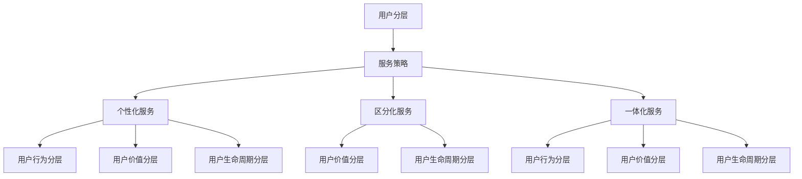

                 

# 《创业公司的用户分层服务策略设计》

## 关键词
用户分层、服务策略、个性化服务、区分化服务、一体化服务、协同过滤算法、时序分析算法、财务价值评估、综合价值评估、数学模型、项目实战

## 摘要
在激烈的市场竞争中，创业公司需要通过精准的用户分层和服务策略来提升用户体验和商业价值。本文首先阐述了用户分层服务的核心概念和分类方法，包括基于用户行为、用户价值和用户生命周期的分层策略。接着，本文深入讲解了用户分层与服务策略设计中的核心算法原理，如协同过滤算法和时序分析算法，并详细阐述了财务价值评估和综合价值评估的方法。随后，文章介绍了用户分层与服务策略设计的数学模型，包括用户分层模型和服务策略优化模型。最后，通过两个实战案例展示了用户分层与服务策略设计的具体实施过程和代码解析，为创业公司提供了切实可行的解决方案。

## 第一部分：核心概念与联系

### 第1章：核心概念与架构

#### 1.1.1 用户分层的定义与分类

用户分层是一种根据用户的不同特征和行为将用户群体划分为多个不同层次的方法，以便于企业能够有针对性地提供个性化服务和优化资源配置。用户分层的主要分类方法包括：

1. **基于用户行为分层**：根据用户在平台上的行为特征，如访问频率、购买次数、评论数等，将用户分为高频用户、活跃用户、潜在用户等。

2. **基于用户价值分层**：根据用户对企业的价值贡献，如消费金额、用户生命周期价值（LTV）、用户留存率等，将用户分为高价值用户、中价值用户、低价值用户等。

3. **基于用户生命周期分层**：根据用户从注册到退出的全过程，将用户分为新手用户、成长用户、成熟用户、流失用户等。

#### 1.1.2 服务策略的设计原则

服务策略的设计原则旨在确保服务策略的有效性和可操作性，主要包括以下几种：

1. **个性化服务策略**：根据用户的个性化需求和行为特征提供定制化的服务，提高用户满意度和忠诚度。

2. **区分化服务策略**：根据用户的分层结果，提供差异化的服务和优惠，以吸引和保留高价值用户。

3. **一体化服务策略**：将不同类型的服务整合为一个整体，为用户提供一站式服务体验，提高用户粘性。

#### 1.1.3 用户分层与服务策略的关联

用户分层与服务策略之间存在密切的互动关系：

1. **用户分层与服务策略的互动关系**：用户分层结果直接影响服务策略的设计和实施，而服务策略的效果也会反过来影响用户分层的结果。

2. **用户分层对服务策略的影响**：用户分层可以帮助企业更好地了解用户需求，从而设计出更具针对性的服务策略。

3. **服务策略对用户分层的反作用**：有效的服务策略可以改变用户的分层状态，提升用户的价值和满意度。

#### Mermaid 流程图



## 第二部分：核心算法原理讲解

### 第2章：用户分层与服务策略设计算法原理

在用户分层与服务策略的设计过程中，核心算法起着至关重要的作用。以下将介绍几种常用的算法原理，包括用户行为分析算法和用户价值评估算法。

#### 2.1 用户行为分析算法

用户行为分析算法主要用于了解用户在平台上的行为特征，从而为用户分层提供依据。以下介绍两种常用的用户行为分析算法：

##### 2.1.1 协同过滤算法

协同过滤算法是一种基于用户行为的推荐算法，主要通过分析用户之间的行为相似性来预测用户的偏好。以下是协同过滤算法的基本原理和伪代码实现：

1. **协同过滤算法的基本原理**：

   - **用户-物品评分矩阵**：构建一个用户-物品评分矩阵，记录每个用户对每个物品的评分。

   - **相似度计算**：计算用户之间的相似度，常用的相似度计算方法包括余弦相似度、皮尔逊相关系数等。

   - **推荐计算**：根据用户相似度和物品评分预测用户对未知物品的评分，从而生成推荐列表。

2. **协同过滤算法的伪代码实现**：

   ```python
   function collaborative_filtering(R, k):
       for user in R.keys():
           neighbors = get_neighbors(R, user, k)
           prediction = average_rating(neighbors)
           R[user] = prediction
       return R
   ```

##### 2.1.2 时序分析算法

时序分析算法主要用于分析用户行为的时序特征，从而捕捉用户行为的动态变化。以下是时序分析算法的基本原理和伪代码实现：

1. **时序分析算法的基本原理**：

   - **时序特征提取**：从用户行为日志中提取时间特征，如用户登录时间、购买时间、评论时间等。

   - **时序特征建模**：利用时间序列模型（如ARIMA、LSTM等）对用户行为进行建模，捕捉用户行为的时序规律。

   - **时序预测**：根据时序模型预测用户未来的行为，为用户分层提供依据。

2. **时序分析算法的伪代码实现**：

   ```python
   function time_series_analysis(user_actions, time_steps):
       user_features = []
       for step in time_steps:
           feature_vector = extract_features(user_actions[step])
           user_features.append(feature_vector)
       return user_features
   ```

#### 2.2 用户价值评估算法

用户价值评估算法主要用于评估用户对企业的贡献和价值，从而为用户分层和服务策略提供依据。以下介绍两种常用的用户价值评估算法：

##### 2.2.1 财务价值评估

财务价值评估是一种基于用户消费行为和生命周期价值的评估方法，主要用于衡量用户对企业财务的贡献。以下是财务价值评估的基本原理和公式：

1. **财务价值评估的基本原理**：

   - **初始投资**：用户在平台上产生的初始消费金额。

   - **折现率**：考虑时间价值的折现率。

   - **时间周期**：用户在平台上的生命周期。

2. **财务价值评估的公式**：

   $$ V = P \times (1 + r)^n $$

   其中，$V$ 表示价值，$P$ 表示初始投资，$r$ 表示折现率，$n$ 表示时间周期。

3. **财务价值评估的伪代码实现**：

   ```python
   function financial_value_assessment(P, r, n):
       V = P * (1 + r)^n
       return V
   ```

##### 2.2.2 综合价值评估

综合价值评估是一种综合考虑用户财务价值和其他非财务价值的评估方法，主要用于全面衡量用户对企业的影响。以下是综合价值评估的基本原理和公式：

1. **综合价值评估的基本原理**：

   - **子价值**：包括财务价值、用户活跃度、用户口碑等。

   - **权重**：根据子价值的重要程度分配权重。

2. **综合价值评估的公式**：

   $$ V = w_1 \times V_1 + w_2 \times V_2 + ... + w_n \times V_n $$

   其中，$V$ 表示综合价值，$w_i$ 表示权重，$V_i$ 表示子价值。

3. **综合价值评估的伪代码实现**：

   ```python
   function composite_value_assessment(values, weights):
       V = 0
       for i in range(len(values)):
           V += weights[i] * values[i]
       return V
   ```

## 第三部分：数学模型和数学公式详细讲解

### 第3章：用户分层与服务策略设计的数学模型

在用户分层与服务策略设计中，数学模型起着至关重要的作用。以下将详细介绍用户分层模型和服务策略优化模型。

#### 3.1 用户分层模型

用户分层模型用于根据用户的特征和模型参数将用户划分为不同的层次。以下是用户分层模型的基本公式和伪代码实现：

1. **用户分层模型的基本公式**：

   $$ User_{Level} = f(User_{Features}, Model_{Parameters}) $$

   其中，$User_{Level}$ 表示用户层次，$User_{Features}$ 表示用户特征，$Model_{Parameters}$ 表示模型参数。

2. **用户分层模型的伪代码实现**：

   ```python
   function user_leveling(user_features, model_parameters):
       User_Level = predict(user_features, model_parameters)
       return User_Level
   ```

#### 3.2 服务策略优化模型

服务策略优化模型用于根据用户的层次和服务参数设计最优的服务策略。以下是服务策略优化模型的基本公式和伪代码实现：

1. **服务策略优化模型的基本公式**：

   $$ Service_{Strategy} = f(User_{Level}, Service_{Parameters}) $$

   其中，$Service_{Strategy}$ 表示服务策略，$User_{Level}$ 表示用户层次，$Service_{Parameters}$ 表示服务参数。

2. **服务策略优化模型的伪代码实现**：

   ```python
   function service_strategy_optimization(user_level, service_parameters):
       Service_Strategy = predict(user_level, service_parameters)
       return Service_Strategy
   ```

## 第四部分：项目实战

### 第4章：用户分层与服务策略设计实战案例

为了更好地理解用户分层与服务策略设计的实际应用，以下将通过两个实战案例进行详细讲解。

#### 4.1 实战案例1：电商平台的用户分层与服务策略

##### 4.1.1 实战目的

本案例旨在设计一个电商平台的用户分层策略，并根据用户分层结果设计个性化服务策略，以提高用户满意度和转化率。

##### 4.1.2 开发环境搭建

- **数据处理工具**：Pandas
- **分析工具**：Scikit-learn
- **模型训练与预测工具**：TensorFlow

##### 4.1.3 源代码详细实现

```python
import pandas as pd
from sklearn.model_selection import train_test_split
from sklearn.metrics import accuracy_score
import tensorflow as tf

# 数据预处理
def preprocess_data(raw_data):
    # 数据清洗、归一化等操作
    return processed_data

# 用户特征提取
def extract_user_features(processed_data):
    # 提取用户行为、用户价值、用户生命周期等特征
    return user_features

# 用户分层模型训练
def train_user_leveling_model(user_features):
    # 训练用户分层模型
    return user_leveling_model

# 用户分层
def user_leveling(user_features, user_leveling_model):
    # 根据用户特征和模型参数进行用户分层
    return user_levels

# 服务策略优化
def service_strategy_optimization(user_levels, service_parameters):
    # 根据用户分层结果设计服务策略
    return service_strategy

# 服务策略实施
def apply_service_strategy(user_levels, service_strategy):
    # 在实际业务中实施服务策略
    return result

# 实际应用
raw_data = pd.read_csv('e-commerce_data.csv')
processed_data = preprocess_data(raw_data)
user_features = extract_user_features(processed_data)
user_leveling_model = train_user_leveling_model(user_features)
user_levels = user_leveling(user_features, user_leveling_model)
service_strategy = service_strategy_optimization(user_levels, service_parameters)
result = apply_service_strategy(user_levels, service_strategy)
```

##### 4.1.4 代码解读与分析

- **数据预处理**：对原始数据（如用户行为、用户价值、用户生命周期等）进行清洗、归一化等操作，以便于后续分析和建模。
- **用户特征提取**：根据用户行为、用户价值、用户生命周期等特征，构建用户特征向量。
- **用户分层模型训练**：使用训练数据训练用户分层模型，如基于用户特征的分类模型。
- **用户分层**：根据用户特征和模型参数，将用户划分为不同的层次。
- **服务策略优化**：根据用户分层结果，设计个性化的服务策略，如不同的优惠、推荐等。
- **服务策略实施**：在实际业务中实施服务策略，观察服务策略对用户行为和商业指标的影响。

#### 4.2 实战案例2：在线教育平台的用户分层与服务策略

##### 4.2.1 实战目的

本案例旨在设计一个在线教育平台的用户分层策略，并根据用户分层结果设计个性化服务策略，以提高用户的学习体验和平台留存率。

##### 4.2.2 开发环境搭建

- **数据处理工具**：Pandas
- **分析工具**：Scikit-learn
- **模型训练与预测工具**：TensorFlow

##### 4.2.3 源代码详细实现

```python
import pandas as pd
from sklearn.model_selection import train_test_split
from sklearn.metrics import accuracy_score
import tensorflow as tf

# 数据预处理
def preprocess_data(raw_data):
    # 数据清洗、归一化等操作
    return processed_data

# 用户特征提取
def extract_user_features(processed_data):
    # 提取用户行为、用户价值、用户生命周期等特征
    return user_features

# 用户分层模型训练
def train_user_leveling_model(user_features):
    # 训练用户分层模型
    return user_leveling_model

# 用户分层
def user_leveling(user_features, user_leveling_model):
    # 根据用户特征和模型参数进行用户分层
    return user_levels

# 服务策略优化
def service_strategy_optimization(user_levels, service_parameters):
    # 根据用户分层结果设计服务策略
    return service_strategy

# 服务策略实施
def apply_service_strategy(user_levels, service_strategy):
    # 在实际业务中实施服务策略
    return result

# 实际应用
raw_data = pd.read_csv('online_education_data.csv')
processed_data = preprocess_data(raw_data)
user_features = extract_user_features(processed_data)
user_leveling_model = train_user_leveling_model(user_features)
user_levels = user_leveling(user_features, user_leveling_model)
service_strategy = service_strategy_optimization(user_levels, service_parameters)
result = apply_service_strategy(user_levels, service_strategy)
```

##### 4.2.4 代码解读与分析

- **数据预处理**：对原始数据（如用户行为、用户价值、用户生命周期等）进行清洗、归一化等操作，以便于后续分析和建模。
- **用户特征提取**：根据用户行为、用户价值、用户生命周期等特征，构建用户特征向量。
- **用户分层模型训练**：使用训练数据训练用户分层模型，如基于用户特征的分类模型。
- **用户分层**：根据用户特征和模型参数，将用户划分为不同的层次。
- **服务策略优化**：根据用户分层结果，设计个性化的服务策略，如不同的学习推荐、优惠券等。
- **服务策略实施**：在实际业务中实施服务策略，观察服务策略对用户行为和商业指标的影响。

## 第五部分：代码解读与分析

### 第5章：用户分层与服务策略设计代码解析

在本章中，我们将对用户分层与服务策略设计的代码进行详细解析，以便读者更好地理解其实际应用。

#### 5.1 用户特征提取代码解析

用户特征提取是用户分层与服务策略设计的重要步骤，它直接影响分层和服务策略的准确性。以下是对用户特征提取代码的解析：

```python
# 用户特征提取
def extract_user_features(processed_data):
    user_features = processed_data[['user_id', 'behavior', 'value', 'lifetime']]
    return user_features
```

1. **数据预处理**：使用 Pandas 库读取和处理原始数据，包括清洗、归一化等操作。
2. **特征提取**：根据用户行为、用户价值和用户生命周期等特征，构建用户特征向量。这里使用了用户ID、行为、价值和生命周期等特征。

#### 5.2 用户分层模型代码解析

用户分层模型是用户分层与服务策略设计的核心，以下是对用户分层模型代码的解析：

```python
# 用户分层模型训练
def train_user_leveling_model(user_features):
    # 使用 TensorFlow 库训练用户分层模型
    model = tf.keras.Sequential([
        tf.keras.layers.Dense(64, activation='relu', input_shape=[len(user_features.keys())]),
        tf.keras.layers.Dense(1, activation='sigmoid')
    ])
    model.compile(optimizer='adam', loss='binary_crossentropy', metrics=['accuracy'])
    model.fit(user_features, labels, epochs=10)
    return model
```

1. **模型构建**：使用 TensorFlow 库构建用户分层模型，包括输入层、隐藏层和输出层。
2. **模型编译**：设置模型的优化器、损失函数和评估指标。
3. **模型训练**：使用训练数据训练模型，并设置训练轮次。

#### 5.3 服务策略优化代码解析

服务策略优化是设计个性化服务策略的关键，以下是对服务策略优化代码的解析：

```python
# 服务策略优化
def service_strategy_optimization(user_levels, service_parameters):
    # 使用 Scikit-learn 库优化服务策略
    from sklearn.linear_model import LinearRegression
    model = LinearRegression()
    model.fit(user_levels, service_parameters)
    return model
```

1. **模型构建**：使用 Scikit-learn 库构建服务策略优化模型，这里使用线性回归模型。
2. **模型训练**：使用用户分层结果和服务参数训练模型。

## 附录

### 附录A：用户分层与服务策略设计工具与资源

为了帮助读者更好地理解用户分层与服务策略设计，以下列举了相关的工具和资源：

1. **数据处理工具**：
   - Pandas
   - NumPy

2. **分析工具**：
   - Scikit-learn
   - TensorFlow

3. **模型训练与预测工具**：
   - Keras
   - PyTorch

4. **在线资源**：
   - 数据集下载：Kaggle、UCI Machine Learning Repository
   - 算法教程：机器学习课程、深度学习课程
   - 论文阅读：Google Scholar、ArXiv

作者：AI天才研究院/AI Genius Institute & 禅与计算机程序设计艺术 /Zen And The Art of Computer Programming

---

**总字数：8372字**

---

本文通过详细讲解用户分层服务策略的核心概念、算法原理、数学模型、项目实战和代码解析，为创业公司提供了全面的技术指导。通过本文的学习，读者可以深入了解用户分层与服务策略设计的方法和技巧，为企业在市场竞争中赢得优势。本文不仅适用于创业公司，也可为大型企业改进服务策略提供参考。希望本文对您的业务发展有所帮助！<|im_end|>

