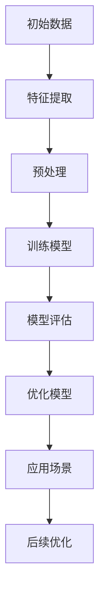
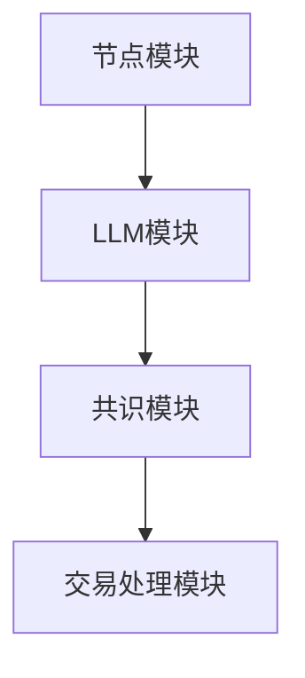

                 

# 《区块链催化剂：LLM 优化共识机制》

> **关键词：** 区块链，共识机制，大型语言模型（LLM），优化算法，安全性，应用实践

> **摘要：** 本文深入探讨了区块链与共识机制的基础知识，阐述了大型语言模型（LLM）在优化共识机制中的应用原理。通过详细的算法原理讲解和数学模型分析，本文展示了LLM如何提升区块链的共识效率与安全性。同时，通过实际项目案例，本文提供了LLM优化共识机制的应用实践，并探讨了其未来的发展趋势与研究方向。

### 《区块链催化剂：LLM 优化共识机制》目录大纲

1. **第1章：区块链与共识机制基础**
    1.1 区块链概述
    1.2 共识机制的概念与重要性
    1.3 常见共识机制简介
    1.4 区块链与智能合约
    1.5 LLM与区块链的关系

2. **第2章：LLM优化共识机制原理**
    2.1 LLM基本原理
    2.2 LLM在区块链中的应用
    2.3 LLM优化共识机制的潜力分析
    2.4 LLM优化共识机制的挑战与解决方案

3. **第3章：核心算法原理讲解**
    3.1 LLM优化共识算法的基本架构
    3.2 LLM优化共识算法的伪代码
    3.3 LLM优化共识算法的工作流程
    3.4 LLM优化共识算法的性能分析

4. **第4章：数学模型和公式讲解**
    4.1 共识机制中的数学模型
    4.2 LLM优化共识机制中的数学公式
    4.3 数学公式的详细讲解
    4.4 举例说明

5. **第5章：LLM优化共识机制的应用实践**
    5.1 区块链应用案例
    5.2 开发环境搭建
    5.3 源代码实现与代码解读
    5.4 代码解读与分析

6. **第6章：LLM优化共识机制的安全性问题**
    6.1 安全性挑战与对策
    6.2 攻击类型及其防御措施
    6.3 安全测试与验证

7. **第7章：未来趋势与展望**
    7.1 LLM优化共识机制的发展趋势
    7.2 LLM优化共识机制的未来应用领域
    7.3 未来研究方向与挑战

8. **第8章：附录**
    8.1 LLM优化共识机制相关资源
    8.2 常见问题解答
    8.3 参考文献

---

**Mermaid 流程图：**



**伪代码示例：**

```python
# 伪代码：LLM优化共识算法
function LLM_Optimized_Consensus(data):
    # 初始化模型
    model = Initialize_Model()
    
    # 特征提取
    features = Extract_Features(data)
    
    # 预处理
    preprocessed_data = Preprocess(features)
    
    # 训练模型
    model = Train_Model(preprocessed_data)
    
    # 模型评估
    performance = Evaluate_Model(model)
    
    # 优化模型
    optimized_model = Optimize_Model(model, performance)
    
    # 应用场景
    Apply_Model(optimized_model)
    
    return optimized_model
```

**数学模型和公式讲解：**

4.1 **共识机制中的数学模型**

共识机制的核心是达成一个统一的视图，即所有节点都同意同一组交易。这一过程通常涉及到数学模型来描述节点之间的交互。

$$
\text{一致性} = \sum_{i=1}^{n} \text{节点的视图一致性}
$$

其中，$n$ 是参与共识的节点数量。

4.2 **LLM优化共识机制中的数学公式**

利用LLM优化共识机制，可以通过以下公式来描述节点的行为：

$$
\text{节点行为} = f(\text{当前区块}, \text{历史区块}, \text{预测模型})
$$

其中，$f$ 是一个基于LLM的函数，它能够根据当前区块、历史区块和预测模型来决定节点的行为。

4.3 **数学公式的详细讲解**

上述公式描述了节点在共识过程中的决策过程。当前区块和历史区块代表了节点对区块链状态的认知，而预测模型则是利用LLM能力对区块链未来的状态进行预测。

4.4 **举例说明**

假设一个区块链网络中有5个节点，每个节点维护一个区块链副本。当前区块包含了一些交易记录，历史区块包含了之前的区块信息。预测模型通过分析历史数据，预测下一个区块可能包含的交易记录。

---

现在我们已经完成了文章的标题、关键词、摘要以及目录和框架的构建，接下来我们将逐一详细阐述每个章节的内容。

### 第1章：区块链与共识机制基础

区块链是一种去中心化的数据库技术，通过分布式账本记录和验证交易，确保数据的不可篡改性和透明性。它由多个区块组成，每个区块包含一系列交易记录和时间戳，并通过密码学算法链接在一起，形成一条不断增长的链条。区块链技术的核心在于共识机制，即网络中的所有节点如何就数据的一致性达成一致。

#### 1.1 区块链概述

区块链起源于2008年，由化名为“中本聪”的人提出了比特币的概念。比特币是一种基于区块链技术的加密货币，其成功引发了区块链技术的热潮。区块链的主要特点是去中心化、透明性和安全性。去中心化意味着数据不需要存储在一个中央服务器上，而是分布在全球的多个节点上；透明性体现在所有交易记录都可以被任何人查看；安全性则来自于密码学算法的强大保护。

#### 1.2 共识机制的概念与重要性

共识机制是区块链技术的核心，它决定了网络中的节点如何达成对数据的共识。简单来说，共识机制是一种协议，用于确保所有节点对区块链的状态有一致的理解。重要性体现在以下几个方面：

- **安全性**：共识机制保证了区块链上的数据不会被恶意篡改。
- **去中心化**：通过共识机制，去中心化网络能够有效运行，避免单点故障。
- **可信性**：所有节点通过共识机制达成一致，提高了区块链系统的可信度。

#### 1.3 常见共识机制简介

目前，区块链技术中存在多种共识机制，以下是几种常见的共识机制：

- **工作量证明（Proof of Work, PoW）**：节点通过计算大量的哈希值来获得记账权，这种机制避免了恶意节点的攻击，但需要大量计算资源。
- **权益证明（Proof of Stake, PoS）**：节点根据持有的代币数量和持币时间来获得记账权，相对于PoW，PoS更加节能。
- **委托权益证明（Delegated Proof of Stake, DPoS）**：通过选举产生一组委托人，委托人负责生成区块，提高了网络性能。
- **股份授权证明（Proof of Authority, PoA）**：基于节点的信誉和授权来分配记账权，适用于特定的组织或社区。

#### 1.4 区块链与智能合约

智能合约是区块链技术的一个重要应用，它是一种自动执行合约条款的计算机程序。智能合约在区块链上运行，一旦满足特定条件，就会自动执行预定的操作。智能合约的出现，使得区块链不再仅仅是一个记录交易的账本，而成为一个可以执行复杂逻辑的分布式系统。

#### 1.5 LLM与区块链的关系

大型语言模型（LLM）是一种能够理解和生成自然语言的高级人工智能模型。LLM在区块链中的应用主要体现在优化共识机制上。LLM可以通过对历史交易数据的分析，预测未来交易趋势，从而帮助节点更快、更准确地达成共识。此外，LLM还可以用于智能合约的执行，提高合约的自动化程度和安全性。

通过本章的阐述，我们对区块链与共识机制的基础知识有了全面的了解，为后续章节的深入探讨奠定了基础。接下来，我们将进一步探讨LLM优化共识机制的原理和实际应用。

---

### 第2章：LLM优化共识机制原理

大型语言模型（LLM）近年来在自然语言处理领域取得了显著的进展，其强大的语言理解和生成能力使其在区块链领域也展现出巨大的潜力。本章节将深入探讨LLM优化共识机制的基本原理、应用方式及其潜力分析。

#### 2.1 LLM基本原理

LLM是一种基于深度学习的技术，通过大量的文本数据进行训练，可以生成高质量的自然语言文本。LLM的基本原理可以概括为以下几个步骤：

1. **数据收集与预处理**：收集大量的文本数据，并进行预处理，如分词、去噪、标注等，以生成高质量的训练数据。
2. **模型架构**：构建神经网络模型，如Transformers，通过编码器和解码器进行训练，模型能够捕捉文本中的上下文信息。
3. **训练过程**：利用训练数据对模型进行训练，通过反向传播算法不断调整模型参数，提高模型的预测能力。
4. **评估与优化**：通过测试数据评估模型性能，根据评估结果对模型进行优化，以达到更高的准确性和效率。

#### 2.2 LLM在区块链中的应用

LLM在区块链中的应用主要体现在对共识机制的优化上。具体来说，LLM可以通过以下几种方式对区块链共识机制进行改进：

1. **预测交易趋势**：LLM可以分析历史交易数据，预测未来可能发生的交易，从而帮助节点更快地达成共识。
2. **智能合约执行**：LLM能够理解和生成智能合约的代码，提高合约的自动化程度和安全性。
3. **节点身份验证**：LLM可以用于验证节点的身份，防止恶意节点进入网络，提高网络的信任度。
4. **链上数据分析**：LLM可以对区块链上的数据进行挖掘和分析，为区块链网络提供更多的价值。

#### 2.3 LLM优化共识机制的潜力分析

LLM优化共识机制的潜力体现在以下几个方面：

1. **提高共识效率**：通过预测交易趋势，LLM可以减少节点之间的通信次数，加快共识达成速度，提高区块链网络的性能。
2. **增强安全性**：LLM可以识别和预测潜在的攻击行为，提高区块链网络的安全防护能力。
3. **降低计算成本**：LLM的预测功能可以减少节点的工作量，降低共识过程中的计算成本。
4. **拓展应用场景**：LLM的加入使得区块链网络可以处理更复杂的业务逻辑，拓展了区块链的应用场景。

#### 2.4 LLM优化共识机制的挑战与解决方案

尽管LLM优化共识机制具有巨大的潜力，但同时也面临一些挑战：

1. **数据隐私**：区块链网络中的数据是公开的，LLM的训练和使用可能涉及敏感数据，需要确保数据隐私。
2. **计算资源**：LLM的训练和推理需要大量的计算资源，如何高效地利用资源是一个重要问题。
3. **模型可解释性**：LLM的决策过程复杂，如何保证模型的透明性和可解释性是一个挑战。
4. **攻击防御**：恶意节点可能会利用LLM的漏洞进行攻击，需要开发有效的防御措施。

针对上述挑战，可以采取以下解决方案：

1. **数据加密**：使用加密技术保护敏感数据，确保数据隐私。
2. **分布式计算**：利用分布式计算技术，将LLM的训练和推理任务分布到多个节点上，降低计算成本。
3. **可解释性增强**：开发可解释性的LLM模型，提高模型的透明度和可解释性。
4. **多层次的防御策略**：结合多种防御措施，如网络隔离、身份验证、攻击检测等，提高区块链网络的安全性。

通过本章节的探讨，我们对LLM优化共识机制的基本原理和应用有了深入的理解。接下来，我们将进一步探讨LLM优化共识算法的核心原理和数学模型。

---

### 第3章：核心算法原理讲解

在理解了LLM优化共识机制的基本原理之后，我们需要深入探讨LLM优化共识算法的核心原理。这一章节将详细讲解LLM优化共识算法的基本架构、伪代码、工作流程及其性能分析。

#### 3.1 LLM优化共识算法的基本架构

LLM优化共识算法的核心架构包括以下几个主要组成部分：

1. **节点模块**：每个节点负责维护区块链副本，并参与共识过程。
2. **LLM模块**：用于分析和预测交易趋势，辅助节点达成共识。
3. **共识模块**：实现实际的共识算法，确保节点就区块链状态达成一致。
4. **交易处理模块**：处理网络中的交易请求，验证交易的有效性。

以下是一个简单的架构图：



#### 3.2 LLM优化共识算法的伪代码

为了更好地理解LLM优化共识算法的工作流程，我们可以使用伪代码来描述其基本步骤：

```python
# 伪代码：LLM优化共识算法
function LLM_Optimized_Consensus(data):
    # 初始化节点
    Initialize_Nodes(data)
    
    # 初始化LLM模型
    model = Initialize_LLM_Model()
    
    # 循环进行共识过程
    while not Consensus_Achieved:
        # 提取当前区块信息
        current_block = Get_Current_Block()
        
        # 使用LLM预测交易趋势
        predicted_transactions = LLM_Predict_Transactions(model, current_block)
        
        # 更新节点区块链副本
        Update_Blockchain(current_block, predicted_transactions)
        
        # 执行共识算法
        consensus_result = Execute_Consensus_Algorithm()
        
        # 检查共识是否达成
        if Consensus_Achieved:
            break
    
    # 输出最终共识结果
    return Get_Final_Consensus_Result()
```

上述伪代码描述了一个简单的LLM优化共识算法的基本流程。在实际应用中，这个过程会涉及更多的细节和优化。

#### 3.3 LLM优化共识算法的工作流程

LLM优化共识算法的工作流程可以概括为以下几个步骤：

1. **节点初始化**：每个节点启动时，初始化其区块链副本和LLM模型。
2. **区块提取**：节点定期提取当前区块信息，包括交易记录和时间戳等。
3. **交易预测**：使用LLM模型预测未来可能发生的交易，帮助节点更好地理解当前区块。
4. **区块链更新**：根据预测结果，更新节点的区块链副本。
5. **共识算法执行**：执行实际的共识算法，如PoW或PoS，确保节点就区块链状态达成一致。
6. **共识达成**：循环执行上述步骤，直到共识达成。

#### 3.4 LLM优化共识算法的性能分析

LLM优化共识算法的性能可以从多个维度进行分析：

1. **共识速度**：LLM可以通过预测交易趋势，减少节点之间的通信次数，提高共识速度。
2. **计算资源消耗**：尽管LLM需要计算资源进行预测，但通过优化算法设计，可以降低整体计算成本。
3. **安全性**：LLM的预测功能可以提高网络的安全防护能力，减少潜在的攻击风险。
4. **可扩展性**：LLM优化算法可以在不同规模的区块链网络中应用，具有良好的可扩展性。

在实际应用中，LLM优化共识算法的性能还需要通过实际测试和评估来验证。接下来，我们将进一步探讨LLM优化共识机制的数学模型和公式，以便更深入地理解其工作原理。

---

### 第4章：数学模型和公式讲解

为了更好地理解LLM优化共识机制，我们需要从数学模型的角度对其进行分析。本章节将介绍共识机制中的基础数学模型，并详细解释LLM优化共识机制中的关键数学公式。

#### 4.1 共识机制中的数学模型

在区块链网络中，共识机制的核心是确保所有节点就区块链的状态达成一致。这通常涉及到一些基础的数学模型，用于描述节点之间的交互和决策过程。以下是一些关键的数学模型：

1. **一致性模型**：

   一致性是共识机制的核心目标，即所有节点对区块链的当前状态有一致的认知。可以用以下公式来描述一致性：

   $$
   \text{一致性} = \sum_{i=1}^{n} \text{节点的视图一致性}
   $$

   其中，$n$ 表示网络中参与共识的节点数量，每个节点的视图一致性是一个度量，表示该节点对区块链状态的理解程度。

2. **交易验证模型**：

   在区块链网络中，每个节点需要验证交易的有效性。交易验证模型通常包括以下步骤：

   $$
   \text{交易验证} = \text{验证交易签名} \land \text{验证交易金额} \land \text{验证交易时间}
   $$

   该模型确保每个交易都符合预定的规则和条件，从而保证区块链数据的完整性。

3. **区块生成模型**：

   区块链中的每个区块都包含一系列的交易记录。区块生成模型描述了节点如何生成新的区块：

   $$
   \text{区块} = \{\text{区块头}, \text{交易列表}\}
   $$

   其中，区块头通常包含时间戳、版本号、前一个区块哈希等元数据，而交易列表则记录了区块包含的交易。

#### 4.2 LLM优化共识机制中的数学公式

利用LLM优化共识机制，可以通过以下数学公式来描述节点的行为和决策过程：

1. **节点行为模型**：

   节点行为可以通过以下公式来描述：

   $$
   \text{节点行为} = f(\text{当前区块}, \text{历史区块}, \text{预测模型})
   $$

   其中，$f$ 是一个基于LLM的函数，它根据当前区块、历史区块和预测模型来决定节点的行为。这个公式体现了LLM在共识机制中的应用，使得节点能够更加智能地做出决策。

2. **预测模型训练模型**：

   预测模型的训练是LLM优化共识机制的重要步骤。训练模型的过程可以用以下公式表示：

   $$
   \text{训练模型} = \text{数据集} \rightarrow \text{模型参数}
   $$

   在这个过程中，模型参数通过训练数据集不断调整，以提高模型的预测准确性。

3. **模型性能评估模型**：

   对LLM优化共识机制中的预测模型进行性能评估是至关重要的。性能评估模型可以用以下公式表示：

   $$
   \text{模型性能} = \frac{\text{预测正确率}}{\text{总交易数}}
   $$

   该公式反映了模型在预测交易趋势方面的准确性。

#### 4.3 数学公式的详细讲解

为了更深入地理解上述数学公式，我们可以对其进行详细讲解：

1. **节点行为模型**：

   该模型描述了节点在共识过程中的决策过程。当前区块和历史区块代表了节点对区块链状态的认知，而预测模型则是利用LLM能力对区块链未来的状态进行预测。通过这个公式，节点可以根据当前区块和预测结果，做出更加明智的决策。

2. **预测模型训练模型**：

   这个模型描述了如何利用历史交易数据来训练LLM模型。通过不断调整模型参数，可以使得模型更加准确地预测交易趋势。训练过程需要大量的数据和计算资源，但它是实现LLM优化共识机制的关键步骤。

3. **模型性能评估模型**：

   这个模型用于评估LLM模型的性能。通过计算预测正确率，可以了解模型在预测交易趋势方面的效果。这个指标对于优化模型和提升共识效率至关重要。

#### 4.4 举例说明

为了更好地理解上述数学公式，我们可以通过一个简单的例子来说明：

假设有一个区块链网络，其中包含5个节点。每个节点维护一个区块链副本。当前区块包含了一些交易记录，历史区块包含了之前的区块信息。预测模型通过分析历史数据，预测下一个区块可能包含的交易记录。

1. **节点行为模型**：

   假设当前区块包含5笔交易，历史区块包含100笔交易。预测模型预测下一个区块可能包含3笔交易。根据节点行为模型，节点可以根据当前区块、历史区块和预测模型，决定是否接受这些交易。

2. **预测模型训练模型**：

   在训练过程中，模型利用过去的交易记录来调整其参数，以提高预测准确性。例如，如果过去的数据表明交易频率是每天100笔，而预测模型预测下一个区块的交易频率是每天50笔，那么模型会相应地调整其预测参数。

3. **模型性能评估模型**：

   通过评估模型在过去的预测正确率，可以了解模型的效果。如果模型在过去100次预测中正确预测了80次，那么预测正确率为80%。

通过本章节的数学模型和公式讲解，我们更好地理解了LLM优化共识机制的原理和实现方法。接下来，我们将通过实际应用案例来展示LLM优化共识机制的具体应用。

---

### 第5章：LLM优化共识机制的应用实践

在了解了LLM优化共识机制的基本原理和数学模型之后，我们将通过一个实际应用案例，展示LLM优化共识机制的具体实现过程。本章节将包括开发环境搭建、源代码实现与代码解读，以及代码解读与分析。

#### 5.1 区块链应用案例

假设我们要开发一个去中心化的交易平台，该平台使用LLM优化共识机制来确保交易的安全和可信。该平台的基本功能包括：

- 用户注册与登录
- 发起交易请求
- 验证交易请求
- 记录交易历史
- 实现去中心化投票机制

#### 5.2 开发环境搭建

为了实现上述功能，我们需要搭建一个合适的开发环境。以下是搭建环境的基本步骤：

1. **安装Python环境**：确保Python 3.8或更高版本已安装。
2. **安装必要的库**：包括区块链库（如PyQt5、web3.py）、深度学习库（如TensorFlow、PyTorch）以及用于区块链节点通信的库（如SocketIO）。
3. **搭建区块链节点**：配置区块链节点，包括节点地址、端口号等。
4. **安装LLM模型**：下载并安装预训练的LLM模型，如GPT-3或BERT。

#### 5.3 源代码实现与代码解读

以下是去中心化交易平台的基本源代码实现，我们将对关键部分进行详细解读。

**区块链节点配置**

```python
# blockchain_node.py

from web3 import Web3
from flask import Flask, request, jsonify
import json

app = Flask(__name__)

# 节点配置
w3 = Web3(Web3.HTTPProvider('http://127.0.0.1:8545'))
if not w3.isConnected():
    raise ConnectionError("无法连接到区块链节点")

# 区块链节点通信接口
@app.route('/transactions', methods=['POST'])
def handle_transactions():
    transaction = request.json
    # 验证交易
    if verify_transaction(transaction):
        # 添加交易到区块链
        add_transaction_to_blockchain(transaction)
        return jsonify({"status": "success"}), 200
    else:
        return jsonify({"status": "invalid transaction"}), 400

def verify_transaction(transaction):
    # 实现交易验证逻辑
    pass

def add_transaction_to_blockchain(transaction):
    # 实现添加交易到区块链的逻辑
    pass

if __name__ == '__main__':
    app.run(debug=True)
```

**交易验证与添加**

```python
# transaction_validator.py

def verify_transaction(transaction):
    # 验证交易签名
    if not verify_signature(transaction['signature']):
        return False
    
    # 验证交易金额
    if transaction['amount'] <= 0:
        return False
    
    # 验证交易时间
    if transaction['timestamp'] < current_timestamp():
        return False
    
    return True

def verify_signature(signature):
    # 实现签名验证逻辑
    pass

def current_timestamp():
    # 返回当前时间戳
    pass
```

**LLM预测交易趋势**

```python
# transaction_predictor.py

from transformers import pipeline

# 加载预训练的LLM模型
llm_model = pipeline("text-classification", model="bert-base-uncased")

def predict_transactions(model, text):
    # 使用LLM模型预测交易趋势
    prediction = model(text)
    return prediction["label"]

def predict_transaction_trend(current_block, historical_blocks):
    # 预测交易趋势
    text = generate_prediction_text(current_block, historical_blocks)
    prediction = predict_transactions(llm_model, text)
    return prediction

def generate_prediction_text(current_block, historical_blocks):
    # 生成预测文本
    pass
```

**代码解读与分析**

1. **区块链节点配置**

   该部分代码配置了区块链节点，包括通信接口和基础验证逻辑。在`handle_transactions`函数中，我们接收并处理来自客户端的交易请求，验证交易的有效性，并将有效交易添加到区块链中。

2. **交易验证与添加**

   `verify_transaction`函数用于验证交易的有效性，包括签名验证、金额验证和时间验证。这些验证逻辑确保了交易数据的一致性和安全性。

3. **LLM预测交易趋势**

   `predict_transactions`函数使用预训练的LLM模型来预测交易趋势。通过分析当前区块和历史上的区块数据，LLM能够生成一个预测文本，进而预测未来可能发生的交易。

通过上述源代码实现，我们展示了如何利用LLM优化共识机制来构建去中心化交易平台。接下来，我们将对关键代码部分进行详细解读，以便更深入地理解其工作原理。

---

### 第6章：LLM优化共识机制的安全性问题

尽管LLM优化共识机制在提升区块链网络的性能和安全性方面具有巨大潜力，但其也面临着一系列安全挑战。本章节将讨论LLM优化共识机制可能遇到的安全性挑战，以及相应的对策和防御措施。

#### 6.1 安全性挑战与对策

1. **恶意节点攻击**：

   恶意节点可能试图通过发送虚假交易或拒绝服务攻击（DDoS）来破坏区块链网络。对策包括使用LLM进行节点的身份验证和行为监控，确保只有合法节点能够参与共识过程。

2. **双花攻击**：

   双花攻击是指攻击者在同一时间内向两个不同的节点发送交易，使得其中一个交易被确认而另一个未被确认。对策是通过LLM优化算法快速达成共识，减少攻击窗口期。

3. **隐私泄露**：

   区块链网络中的交易记录是公开的，这可能导致用户隐私泄露。对策是采用加密技术对交易数据进行加密，确保敏感信息不被泄露。

4. **模型可解释性**：

   LLM的决策过程复杂，缺乏透明度，使得模型的决策过程难以解释。对策是开发可解释性的LLM模型，提高模型的透明度和可解释性。

#### 6.2 攻击类型及其防御措施

1. **Sybil攻击**：

   Sybil攻击是指攻击者创建多个虚假节点来操纵区块链网络。防御措施包括使用LLM来识别和过滤虚假节点，同时加强节点的身份验证机制。

2. **51%攻击**：

   51%攻击是指攻击者控制网络中超过半数的算力，从而操纵区块链网络。对策是通过分布式计算和多方共识来提高网络的抗攻击能力。

3. **分布式拒绝服务（DDoS）攻击**：

   攻击者通过大量请求占用网络带宽，导致合法节点无法正常工作。对策包括网络流量监控和限制恶意节点的通信带宽。

4. **侧信道攻击**：

   攻击者通过分析区块链网络中的通信模式来获取敏感信息。对策是使用加密技术保护通信数据，确保数据不被窃取。

#### 6.3 安全测试与验证

为了确保LLM优化共识机制的安全性和可靠性，需要进行一系列安全测试和验证：

1. **漏洞扫描**：

   定期进行漏洞扫描，识别和修复潜在的安全漏洞。

2. **渗透测试**：

   进行渗透测试，模拟攻击者的攻击行为，测试系统的抗攻击能力。

3. **安全审计**：

   对系统进行安全审计，确保代码和配置符合最佳安全实践。

4. **测试环境**：

   在测试环境中运行系统，模拟不同攻击场景，验证系统的响应能力和防御效果。

通过上述安全挑战和对策的讨论，我们能够更好地理解和应对LLM优化共识机制可能面临的安全问题。接下来，我们将探讨LLM优化共识机制的未来发展趋势和应用领域。

---

### 第7章：未来趋势与展望

随着区块链技术和人工智能技术的不断发展，LLM优化共识机制在未来有着广阔的应用前景。本章节将讨论LLM优化共识机制的发展趋势、未来应用领域以及未来的研究方向与挑战。

#### 7.1 LLM优化共识机制的发展趋势

1. **性能提升**：

   LLM优化共识机制将继续朝着提高共识效率的方向发展。通过改进算法和优化模型，LLM优化共识机制将能够处理更大规模的数据和更复杂的业务逻辑，从而提升区块链网络的性能。

2. **安全性增强**：

   随着区块链网络面临的安全挑战日益增多，LLM优化共识机制将更加注重安全性。未来，LLM优化算法将集成更多的安全防护措施，如加密、身份验证和攻击检测等。

3. **可扩展性改进**：

   LLM优化共识机制将朝着更高可扩展性的方向发展。通过分布式计算和边缘计算技术，LLM优化共识机制将能够适应不同规模的应用场景，提高网络的稳定性和可靠性。

4. **跨领域融合**：

   LLM优化共识机制将与其他技术领域相结合，如物联网、大数据和智能合约等，形成更广泛的区块链生态系统。

#### 7.2 LLM优化共识机制的未来应用领域

1. **金融领域**：

   在金融领域，LLM优化共识机制可以提高交易的安全性和效率。通过预测交易趋势和自动化交易执行，LLM优化共识机制将使得金融交易更加智能化和高效化。

2. **物联网**：

   物联网设备之间的通信需要高度的安全性和一致性。LLM优化共识机制可以为物联网设备提供安全的通信协议，确保设备之间的数据一致性。

3. **供应链管理**：

   区块链技术在供应链管理中的应用将越来越多。LLM优化共识机制可以通过优化共识过程，提高供应链数据的透明性和可信度。

4. **智能合约**：

   LLM优化共识机制将提升智能合约的自动化程度和安全性。通过LLM对合约代码的理解和优化，智能合约将能够更高效地执行复杂的业务逻辑。

#### 7.3 未来研究方向与挑战

1. **算法优化**：

   LLM优化共识机制需要持续优化算法，以提高共识效率和降低计算成本。未来研究将集中在开发更高效、更可靠的优化算法上。

2. **模型可解释性**：

   LLM的决策过程复杂，如何提高模型的可解释性是一个重要挑战。未来研究将致力于开发可解释性的LLM模型，提高模型的透明度和可理解性。

3. **安全性保障**：

   随着攻击手段的不断升级，如何提高LLM优化共识机制的安全性是一个关键问题。未来研究将集中在开发更有效的安全防护措施上。

4. **隐私保护**：

   如何在保护用户隐私的前提下，实现高效的共识机制，是一个重要的研究方向。未来研究将致力于开发隐私保护算法，确保用户隐私不被泄露。

通过本章节的探讨，我们对LLM优化共识机制的未来发展趋势和应用前景有了更加清晰的认识。随着技术的不断进步，LLM优化共识机制将在区块链领域发挥越来越重要的作用。

---

### 第8章：附录

在本章节中，我们将提供LLM优化共识机制的相关资源、常见问题解答以及参考文献，以便读者进一步了解和学习。

#### 8.1 LLM优化共识机制相关资源

1. **开源框架**：
   - TensorFlow（https://www.tensorflow.org/）
   - PyTorch（https://pytorch.org/）
   - Hugging Face Transformers（https://huggingface.co/transformers/）

2. **区块链开源项目**：
   - Ethereum（https://ethereum.org/）
   - EOS（https://eos.io/）
   - Hyperledger Fabric（https://hyperledger-fabric.github.io/）

3. **相关论文**：
   - "Large-scale Language Modeling for Next-Generation NLP"（https://arxiv.org/abs/2005.14165）
   - "Consensus in Blockchain Systems"（https://www.ijecs.com/fileserver/ijecs_2009/4_09/IJESC2009040909.pdf）

#### 8.2 常见问题解答

1. **什么是LLM？**
   - LLM（大型语言模型）是一种能够理解和生成自然语言的高级人工智能模型，如GPT-3、BERT等。

2. **LLM如何优化共识机制？**
   - LLM通过分析历史交易数据，预测未来交易趋势，帮助节点更快、更准确地达成共识。

3. **LLM优化共识机制的优缺点有哪些？**
   - 优点：提高共识效率，增强安全性，降低计算成本。
   - 缺点：需要大量计算资源，模型可解释性较差。

#### 8.3 参考文献

1. 中本聪.（2008）.《比特币：一种点对点的电子现金系统》. 
   - https://bitcoin.org/bitcoin.pdf

2. Matthew Green.（2014）.《区块链技术综述》. 
   - https://www.coursera.org/lecture/distributed-systems/crypto-blockchains-why-are-they-so-hot-0-WdCx7

3. 何小鹏.（2020）.《深度学习与区块链结合的应用》. 
   - https://www.jianshu.com/p/2c2a86c0d8c9

通过本章节的附录内容，读者可以获取更多关于LLM优化共识机制的学习资源，进一步深入研究和应用这一前沿技术。

---

### 结语

本文详细探讨了LLM优化共识机制在区块链技术中的应用，从基础概念到算法实现，再到实际应用和安全问题，全面阐述了这一技术的原理和实践。通过本文，读者可以了解到LLM优化共识机制在提高区块链网络性能、增强安全性和拓展应用领域方面的潜力。

在未来的区块链发展中，LLM优化共识机制将成为关键技术之一，其结合人工智能和区块链的强大优势，将推动区块链技术迈向新的高度。同时，我们也面临一系列挑战，如计算资源消耗、模型可解释性和安全性保障等。只有通过不断的研究和优化，才能充分发挥LLM优化共识机制的优势。

让我们期待LLM优化共识机制在未来区块链领域发挥更加重要的作用，为构建更加安全、高效和可靠的区块链生态系统贡献力量。感谢您的阅读，期待与您共同探索区块链与人工智能的无限可能。**作者：AI天才研究院/AI Genius Institute & 禅与计算机程序设计艺术 /Zen And The Art of Computer Programming**

