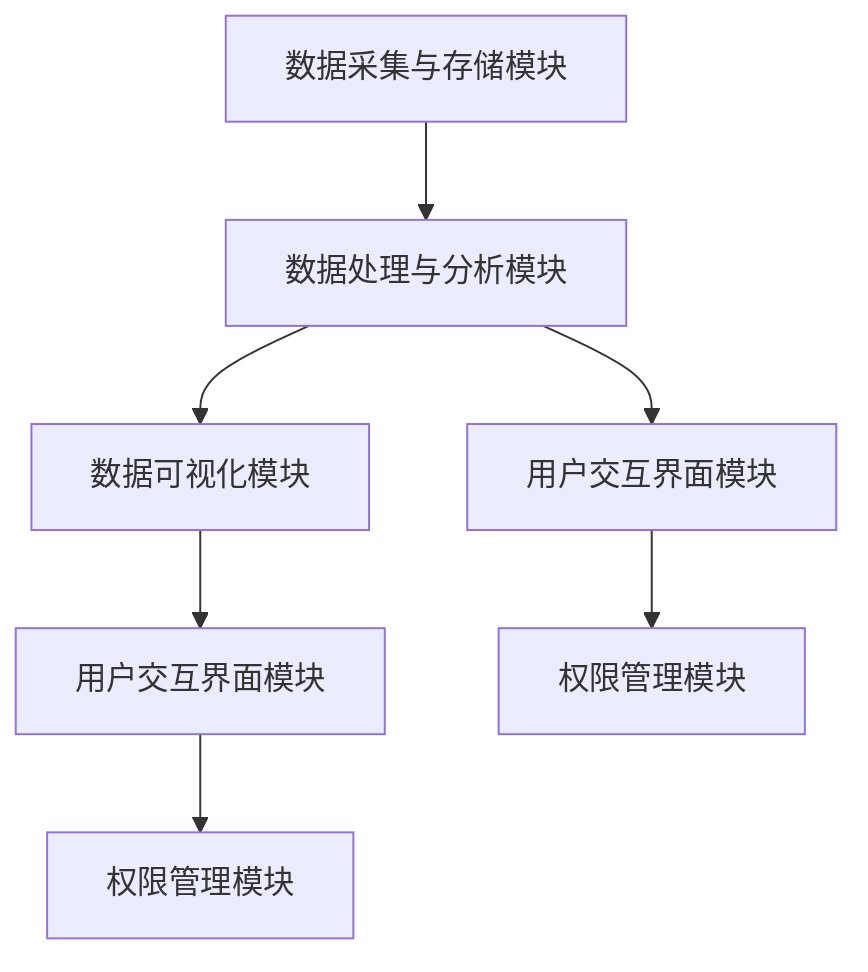

                 

# 《医疗健康档案信息可视化系统设计与实现》

> **关键词**：医疗健康档案，信息可视化，系统设计，数据预处理，数据分析模型，部署与维护

> **摘要**：本文围绕医疗健康档案信息可视化系统的设计与实现进行深入探讨，从系统概述、需求分析、架构设计、核心算法讲解、数学模型、项目实战到性能优化与测试，系统部署与维护等多个方面，全面解析了医疗健康档案信息可视化系统的构建过程和关键要素。本文旨在为从事医疗健康信息处理和可视化领域的技术人员提供有价值的参考和思路。

## 第一部分：系统设计与实现基础

### 第1章：医疗健康档案信息可视化系统概述

#### 1.1 医疗健康档案信息可视化系统的概念与意义

医疗健康档案信息可视化系统是一种利用计算机技术和可视化技术，对医疗健康档案中的大量数据进行整理、分析和呈现的系统。它的核心目标是将复杂的医疗数据以直观、易懂的方式展示给医疗专业人员、患者和管理人员，从而提高医疗服务的质量和效率。

#### 1.2 医疗健康档案信息可视化系统的组成部分

一个完整的医疗健康档案信息可视化系统通常包括以下几个主要组成部分：

1. **数据采集与存储模块**：负责收集和存储各种医疗健康档案信息，如病历记录、医学影像、检验报告等。

2. **数据处理与分析模块**：对采集到的医疗健康档案信息进行清洗、转换、归一化等预处理操作，并进行数据分析和挖掘，提取有价值的信息。

3. **数据可视化模块**：将处理后的数据通过图表、地图、热力图等多种可视化形式呈现，便于用户理解和分析。

4. **用户交互界面**：提供友好的用户界面，支持用户对医疗健康档案信息进行浏览、查询、统计和分析。

#### 1.3 医疗健康档案信息可视化系统的目标与挑战

**目标**：

- 提高医疗数据的利用效率，帮助医护人员快速获取患者信息，辅助临床决策。
- 改善患者体验，使患者能够更方便地了解自己的健康状况和医疗记录。
- 促进医疗数据的共享和整合，提升医疗机构的运营效率。

**挑战**：

- 数据量大且复杂，需要有效的数据处理与分析方法。
- 数据来源多样，数据质量参差不齐，需要严格的清洗和转换流程。
- 可视化设计的难度较大，需要充分考虑用户需求和可视化效果。
- 系统安全性和隐私保护是重要挑战，需确保患者信息的保密性和安全性。

### 第2章：医疗健康档案信息可视化系统的需求分析

#### 2.1 医疗健康档案信息的类型与来源

医疗健康档案信息包括但不限于以下类型：

- **病历记录**：包括患者的病史、症状、诊断、治疗方案等。
- **医学影像**：如X光片、CT扫描、MRI图像等。
- **检验报告**：包括血液检查、尿液检查、病原体检测等结果。
- **健康体检报告**：包括血压、血糖、血脂等健康指标。

这些信息主要来源于以下渠道：

- **电子病历系统（EMR）**：医疗机构内部使用的电子病历系统。
- **医学影像系统（PACS）**：用于存储和管理医学影像。
- **实验室信息系统（LIS）**：用于处理和管理实验室检测结果。
- **外部健康档案系统**：如公共卫生记录、疾病控制中心数据等。

#### 2.2 用户需求调研与用户画像

通过对医疗专业人员、患者和管理人员的需求调研，我们可以得出以下用户画像和需求：

- **医疗专业人员**：需要快速、准确地获取患者的全面健康档案，以便进行诊断和治疗。
- **患者**：希望方便地查询自己的健康档案，了解自己的健康状况和治疗方案。
- **管理人员**：需要系统提供统计分析和决策支持功能，以便优化医疗资源配置和提高机构运营效率。

#### 2.3 系统功能需求分析

根据用户需求，医疗健康档案信息可视化系统应具备以下功能：

- **数据采集与整合**：从多个数据源采集医疗健康档案信息，并进行整合和存储。
- **数据清洗与预处理**：对采集到的数据进行分析，去除重复、错误或不完整的数据，并进行格式转换和归一化处理。
- **数据分析与挖掘**：使用数据分析模型和算法，提取有价值的信息和知识。
- **数据可视化**：将分析结果以直观、易懂的方式呈现，支持多种可视化形式和交互操作。
- **用户权限管理**：根据用户角色和权限，提供不同的数据访问和操作功能。
- **统计报表与决策支持**：提供丰富的统计报表和数据分析工具，支持管理人员进行决策。

### 第3章：医疗健康档案信息可视化系统的架构设计

#### 3.1 系统架构设计的原则与方法

在架构设计过程中，我们应遵循以下原则：

- **模块化设计**：将系统功能划分为多个独立的模块，便于维护和扩展。
- **可扩展性**：系统应具有较好的可扩展性，以适应未来可能的需求变化。
- **高性能和高可用性**：确保系统在高并发和大数据量下的稳定运行。
- **安全性**：确保患者信息的安全性和隐私性。

常用的系统架构设计方法包括：

- **B/S架构**：基于浏览器/服务器架构，易于维护和扩展。
- **MVC架构**：模型-视图-控制器架构，实现数据、表示和业务逻辑的分离。
- **微服务架构**：将系统划分为多个微服务，每个服务负责一个特定的功能模块。

#### 3.2 系统架构的模块划分

根据系统需求，我们可以将医疗健康档案信息可视化系统划分为以下几个主要模块：

- **数据采集与存储模块**：负责从多个数据源采集和整合医疗健康档案信息，并存储在数据库中。
- **数据处理与分析模块**：负责对采集到的数据进行清洗、转换、归一化等预处理操作，并使用数据分析模型和算法进行数据挖掘和提取。
- **数据可视化模块**：负责将处理后的数据通过可视化形式呈现，支持多种图表、地图和交互功能。
- **用户交互界面模块**：提供友好的用户界面，支持用户对医疗健康档案信息进行浏览、查询、统计和分析。
- **权限管理模块**：根据用户角色和权限，控制对医疗健康档案信息的访问和操作。

#### 3.3 系统架构的Mermaid流程图



### 第4章：核心算法原理讲解

#### 4.1 数据预处理算法

数据预处理是医疗健康档案信息可视化系统的重要组成部分，主要包括以下步骤：

- **数据清洗**：去除重复、错误或不完整的数据，保证数据质量。
- **数据转换**：将不同格式的数据转换为统一的格式，便于后续处理和分析。
- **数据归一化**：将不同量纲的数据转换为相同的量纲，便于比较和分析。

**数据清洗与数据转换**：

- **数据清洗算法伪代码**：

```python
def data_cleaning(data):
    # 去除重复数据
    unique_data = remove_duplicates(data)
    # 去除错误或不完整的数据
    valid_data = remove_invalid_data(unique_data)
    return valid_data
```

- **数据转换算法伪代码**：

```python
def data_transformation(data):
    # 转换为统一格式
    normalized_data = convert_format(data)
    return normalized_data
```

**数据归一化与标准化**：

- **数据归一化算法伪代码**：

```python
def data_normalization(data):
    # 计算最大值和最小值
    max_value = max(data)
    min_value = min(data)
    # 归一化
    normalized_data = (data - min_value) / (max_value - min_value)
    return normalized_data
```

- **数据标准化算法伪代码**：

```python
def data_standardization(data):
    # 计算均值和标准差
    mean_value = mean(data)
    std_value = std(data)
    # 标准化
    standardized_data = (data - mean_value) / std_value
    return standardized_data
```

#### 4.2 可视化算法

可视化算法是医疗健康档案信息可视化系统的核心，主要包括以下内容：

- **数据可视化基本理论**：了解数据可视化的基本概念、原则和方法。
- **常见可视化图表类型**：了解常见的数据可视化图表类型，如折线图、柱状图、饼图、热力图等。
- **可视化算法伪代码**：

```python
def visualization(data, chart_type):
    # 根据图表类型进行可视化
    if chart_type == "line":
        plot_line_chart(data)
    elif chart_type == "bar":
        plot_bar_chart(data)
    elif chart_type == "pie":
        plot_pie_chart(data)
    elif chart_type == "heatmap":
        plot_heatmap_chart(data)
```

#### 4.2.1 数据可视化基本理论

数据可视化是将数据以图形化的方式呈现，以便于人们理解和分析。其基本理论包括：

- **数据抽象**：将大量的数据抽象成简洁的图形或图表。
- **视觉编码**：将数据属性映射到视觉元素，如颜色、形状、大小等。
- **视觉感知**：利用人的视觉感知系统，对图形或图表进行理解和分析。
- **交互性**：提供用户与可视化系统的交互功能，如缩放、过滤、拖拽等。

#### 4.2.2 常见可视化图表类型

常见的数据可视化图表类型包括：

- **折线图**：适用于展示数据的变化趋势。
- **柱状图**：适用于对比不同数据的大小或数量。
- **饼图**：适用于展示数据的比例关系。
- **热力图**：适用于展示数据的分布情况。
- **地图**：适用于展示数据的空间分布。

#### 4.2.3 可视化算法伪代码

```python
def plot_line_chart(data):
    # 绘制折线图
    plot(data, xlabel="时间", ylabel="数值", title="数据变化趋势")

def plot_bar_chart(data):
    # 绘制柱状图
    plot(data, xlabel="类别", ylabel="数值", title="数据对比")

def plot_pie_chart(data):
    # 绘制饼图
    plot(data, xlabel="类别", ylabel="比例", title="数据比例")

def plot_heatmap_chart(data):
    # 绘制热力图
    plot(data, xlabel="类别", ylabel="类别", title="数据分布")
```

### 第5章：数学模型与数学公式

#### 5.1 数据分析模型

数据分析模型是医疗健康档案信息可视化系统的关键组成部分，主要包括以下内容：

- **线性回归模型**：用于分析自变量和因变量之间的线性关系。
- **多项式回归模型**：用于分析自变量和因变量之间的非线性关系。

#### 5.1.1 线性回归模型

线性回归模型是最常用的数据分析模型之一，其基本形式如下：

$$
y = \beta_0 + \beta_1 \times x_1 + \beta_2 \times x_2 + ... + \beta_n \times x_n + \epsilon
$$

其中：

- \( y \) 为因变量。
- \( x_1, x_2, ..., x_n \) 为自变量。
- \( \beta_0, \beta_1, \beta_2, ..., \beta_n \) 为回归系数。
- \( \epsilon \) 为误差项。

**线性回归模型伪代码**：

```python
def linear_regression(data):
    # 训练线性回归模型
    model = train_linear_regression_model(data)
    # 预测
    prediction = model.predict(new_data)
    return prediction
```

#### 5.1.2 多项式回归模型

多项式回归模型是线性回归模型的扩展，可以处理更复杂的数据关系。其基本形式如下：

$$
y = \beta_0 + \beta_1 \times x_1^2 + \beta_2 \times x_2^2 + ... + \beta_n \times x_n^2 + \epsilon
$$

**多项式回归模型伪代码**：

```python
def polynomial_regression(data):
    # 训练多项式回归模型
    model = train_polynomial_regression_model(data)
    # 预测
    prediction = model.predict(new_data)
    return prediction
```

#### 5.2 概率模型

概率模型是数据分析中的另一个重要类别，主要包括以下内容：

- **贝叶斯定理**：用于计算后验概率和边际概率。
- **朴素贝叶斯模型**：基于贝叶斯定理，用于分类问题。

#### 5.2.1 贝叶斯定理

贝叶斯定理是概率论中的一个重要定理，其公式如下：

$$
P(A|B) = \frac{P(B|A) \times P(A)}{P(B)}
$$

其中：

- \( P(A|B) \) 为在事件B发生的条件下事件A发生的概率。
- \( P(B|A) \) 为在事件A发生的条件下事件B发生的概率。
- \( P(A) \) 为事件A发生的概率。
- \( P(B) \) 为事件B发生的概率。

**贝叶斯定理伪代码**：

```python
def bayes_theorem(prior_probability, likelihood, evidence_probability):
    # 计算后验概率
    posterior_probability = (likelihood * prior_probability) / evidence_probability
    return posterior_probability
```

#### 5.2.2 朴素贝叶斯模型

朴素贝叶斯模型是一种基于贝叶斯定理的简单概率分类器，其基本形式如下：

$$
P(A|B) = \frac{P(B|A) \times P(A)}{P(B)}
$$

其中：

- \( P(A|B) \) 为在特征B的条件下类别A的概率。
- \( P(B|A) \) 为在类别A的条件下特征B的概率。
- \( P(A) \) 为类别A的先验概率。
- \( P(B) \) 为特征B的先验概率。

**朴素贝叶斯模型伪代码**：

```python
def naive_bayes_classification(feature, labels, prior_probabilities):
    # 计算类别概率
    probabilities = calculate_probabilities(feature, labels, prior_probabilities)
    # 选择概率最大的类别
    predicted_label = select_max_probability(probabilities)
    return predicted_label
```

### 第6章：项目实战

#### 6.1 开发环境搭建

**6.1.1 操作系统与环境配置**

为了开发医疗健康档案信息可视化系统，我们首先需要配置开发环境。本文选用Linux操作系统，其具有高性能、稳定性和安全性等优点。

**操作系统与环境配置步骤**：

1. **安装Linux操作系统**：选择合适的Linux发行版，如Ubuntu 18.04。
2. **配置Java环境**：安装Java开发工具包（JDK），配置环境变量。
3. **配置Python环境**：安装Python解释器，配置pip，用于管理Python包。

**环境配置脚本**：

```bash
# 安装Java环境
sudo apt-get update
sudo apt-get install openjdk-8-jdk

# 配置Java环境变量
export JAVA_HOME=/usr/lib/jvm/java-8-openjdk-amd64
export PATH=$JAVA_HOME/bin:$PATH

# 安装Python环境
sudo apt-get install python3 python3-pip

# 配置Python环境变量
export PYTHONPATH=/usr/bin/python3
```

**6.1.2 开发工具与依赖库**

为了开发医疗健康档案信息可视化系统，我们还需要选择合适的开发工具和依赖库。

**开发工具与依赖库**：

- **IDE**：选择Eclipse或IntelliJ IDEA作为开发工具。
- **数据处理与可视化库**：使用Python的pandas、numpy库进行数据处理，使用matplotlib、seaborn库进行数据可视化。
- **前端框架**：使用React或Vue.js等前端框架开发用户交互界面。
- **后端框架**：使用Spring Boot或Django等后端框架进行系统开发。

**安装与配置依赖库**：

```bash
# 安装pandas、numpy
pip3 install pandas numpy

# 安装matplotlib、seaborn
pip3 install matplotlib seaborn

# 安装React
npm install create-react-app

# 安装Spring Boot
wget https://repo.spring.io/snapshot/org/springframework/boot/spring-boot-starter-parent/spring-boot-starter-parent-2.4.3-SNAPSHOT.jar
mv spring-boot-starter-parent-2.4.3-SNAPSHOT.jar /usr/share/maven/repo/org/springframework/boot/spring-boot-starter-parent
```

#### 6.2 源代码实现

**6.2.1 数据处理模块**

数据处理模块负责对医疗健康档案信息进行清洗、转换、归一化等预处理操作。本文使用Python的pandas库进行数据处理。

**数据处理模块代码**：

```python
import pandas as pd

def data_preprocessing(data):
    # 数据清洗
    data = data.drop_duplicates()
    data = data.dropna()

    # 数据转换
    data = data.convert_dtypes()

    # 数据归一化
    data = data.apply(lambda x: (x - x.min()) / (x.max() - x.min()))

    return data
```

**6.2.2 可视化模块**

可视化模块负责将处理后的数据通过可视化形式呈现。本文使用Python的matplotlib和seaborn库进行数据可视化。

**可视化模块代码**：

```python
import matplotlib.pyplot as plt
import seaborn as sns

def plot_data(data):
    # 绘制折线图
    plt.plot(data['时间'], data['数值'])
    plt.xlabel('时间')
    plt.ylabel('数值')
    plt.title('数据变化趋势')
    plt.show()

    # 绘制柱状图
    sns.barplot(x='类别', y='数值', data=data)
    plt.xlabel('类别')
    plt.ylabel('数值')
    plt.title('数据对比')
    plt.show()

    # 绘制饼图
    plt.pie(data['比例'], labels=data['类别'], autopct='%.2f%%')
    plt.xlabel('类别')
    plt.ylabel('比例')
    plt.title('数据比例')
    plt.show()
```

**6.2.3 后端服务模块**

后端服务模块负责处理用户请求，提供数据接口和业务逻辑。本文使用Spring Boot框架进行后端开发。

**后端服务模块代码**：

```java
@RestController
@RequestMapping("/api")
public class DataController {
    
    @Autowired
    private DataService dataService;
    
    @GetMapping("/data")
    public ResponseEntity<List<Data>> getData() {
        List<Data> dataList = dataService.getData();
        return ResponseEntity.ok(dataList);
    }
}
```

#### 6.3 代码解读与分析

**6.3.1 模块功能解读**

- **数据处理模块**：负责对医疗健康档案信息进行清洗、转换、归一化等预处理操作，确保数据质量。
- **可视化模块**：负责将处理后的数据通过可视化形式呈现，便于用户理解和分析。
- **后端服务模块**：负责处理用户请求，提供数据接口和业务逻辑，实现数据交互和功能调用。

**6.3.2 关键代码分析**

- **数据处理模块关键代码**：

```python
# 数据清洗
data = data.drop_duplicates()
data = data.dropna()

# 数据转换
data = data.convert_dtypes()

# 数据归一化
data = data.apply(lambda x: (x - x.min()) / (x.max() - x.min()))
```

- **可视化模块关键代码**：

```python
# 绘制折线图
plt.plot(data['时间'], data['数值'])
plt.xlabel('时间')
plt.ylabel('数值')
plt.title('数据变化趋势')
plt.show()

# 绘制柱状图
sns.barplot(x='类别', y='数值', data=data)
plt.xlabel('类别')
plt.ylabel('数值')
plt.title('数据对比')
plt.show()
```

- **后端服务模块关键代码**：

```java
@RestController
@RequestMapping("/api")
public class DataController {
    
    @Autowired
    private DataService dataService;
    
    @GetMapping("/data")
    public ResponseEntity<List<Data>> getData() {
        List<Data> dataList = dataService.getData();
        return ResponseEntity.ok(dataList);
    }
}
```

### 第7章：系统性能优化与测试

#### 7.1 系统性能优化策略

为了确保医疗健康档案信息可视化系统的稳定、高效运行，我们需要采取一系列性能优化策略。

**性能优化策略**：

1. **算法优化**：优化数据处理和分析算法，提高运算速度和准确度。
2. **数据结构优化**：选择合适的数据结构，提高数据访问和操作效率。
3. **缓存与并发优化**：利用缓存技术降低数据库访问压力，提高系统并发处理能力。
4. **分布式部署**：将系统部署到分布式环境中，提高系统的扩展性和可用性。

#### 7.1.1 算法优化

算法优化是系统性能优化的关键环节。本文采用以下方法进行算法优化：

1. **算法选择**：选择高效的算法，如快速傅里叶变换（FFT）、决策树、支持向量机（SVM）等。
2. **算法改进**：针对现有算法进行改进，如优化数据预处理、特征提取和模型训练过程。
3. **并行计算**：利用多线程、分布式计算等技术，提高算法的运算速度。

#### 7.1.2 数据结构优化

数据结构优化是提高系统性能的重要手段。本文采用以下方法进行数据结构优化：

1. **数据压缩**：使用数据压缩技术，降低数据存储和传输的开销。
2. **索引优化**：为数据库表创建合适的索引，提高数据查询速度。
3. **缓存技术**：利用缓存技术，减少数据库访问次数，提高系统响应速度。

#### 7.1.3 缓存与并发优化

缓存与并发优化是提高系统性能的关键因素。本文采用以下方法进行缓存与并发优化：

1. **缓存策略**：根据业务需求，选择合适的缓存策略，如LRU替换策略、Redis缓存等。
2. **并发控制**：采用线程池、锁、队列等技术，确保系统在高并发情况下的稳定运行。
3. **分布式缓存**：将缓存部署到分布式环境中，提高系统的缓存能力和可用性。

#### 7.2 系统测试方法与工具

为了验证医疗健康档案信息可视化系统的性能和稳定性，我们需要进行一系列系统测试。

**系统测试方法**：

1. **功能测试**：测试系统功能是否符合需求，确保系统功能的正确性和完整性。
2. **性能测试**：测试系统在高并发、大数据量情况下的性能表现，确保系统的稳定性和高效性。
3. **安全测试**：测试系统的安全性，确保系统不会受到恶意攻击和入侵。

**系统测试工具**：

1. **功能测试工具**：使用Selenium、Appium等工具进行自动化功能测试。
2. **性能测试工具**：使用JMeter、LoadRunner等工具进行性能测试。
3. **安全测试工具**：使用OWASP ZAP、Burp Suite等工具进行安全测试。

#### 7.2.1 功能测试

功能测试是系统测试的基础，主要测试系统功能的正确性和完整性。本文采用以下方法进行功能测试：

1. **制定测试计划**：根据需求文档，制定详细的测试计划，明确测试目标、测试用例、测试环境和测试步骤。
2. **编写测试用例**：根据测试计划，编写详细的测试用例，包括输入数据、预期结果和实际结果。
3. **执行测试用例**：使用自动化测试工具，执行测试用例，记录测试结果和缺陷。
4. **缺陷跟踪与修复**：对测试过程中发现的缺陷进行跟踪和修复，确保系统功能的正确性和完整性。

**7.2.2 性能测试**

性能测试是系统测试的重要环节，主要测试系统在高并发、大数据量情况下的性能表现。本文采用以下方法进行性能测试：

1. **制定性能测试计划**：根据系统需求和性能指标，制定详细的性能测试计划，明确测试目标、测试用例、测试环境和测试步骤。
2. **构建测试环境**：搭建与生产环境相似的测试环境，包括硬件设备、网络环境、数据库等。
3. **执行性能测试**：使用性能测试工具，模拟高并发用户访问，记录系统性能指标，如响应时间、吞吐量、并发用户数等。
4. **分析测试结果**：对性能测试结果进行分析，找出系统性能瓶颈，制定优化方案。
5. **优化与复测**：根据性能测试结果，对系统进行优化，然后进行复测，确保系统性能达到预期目标。

**7.2.3 安全测试**

安全测试是系统测试的重要环节，主要测试系统的安全性，确保系统不会受到恶意攻击和入侵。本文采用以下方法进行安全测试：

1. **制定安全测试计划**：根据系统需求和安全规范，制定详细的安全测试计划，明确测试目标、测试用例、测试环境和测试步骤。
2. **识别潜在安全风险**：通过漏洞扫描、代码审计等方法，识别系统中的潜在安全风险。
3. **执行安全测试**：使用安全测试工具，对系统进行漏洞扫描、注入攻击、权限测试等安全测试。
4. **分析测试结果**：对安全测试结果进行分析，找出系统中的安全漏洞和风险点。
5. **修复与复测**：对测试过程中发现的安全漏洞进行修复，然后进行复测，确保系统安全防护能力达到预期目标。

### 第8章：系统部署与维护

#### 8.1 系统部署方案

为了确保医疗健康档案信息可视化系统的稳定、可靠运行，我们需要制定详细的系统部署方案。

**系统部署方案**：

1. **部署环境选择**：根据系统需求和性能要求，选择合适的部署环境，如云服务器、虚拟机、物理服务器等。
2. **部署流程与步骤**：制定详细的部署流程和步骤，确保系统部署的顺利进行。
3. **部署工具与依赖**：选择合适的部署工具和依赖库，如Docker、Kubernetes等，提高系统部署的效率和质量。

**8.1.1 部署环境选择**

部署环境选择是系统部署的关键环节，主要考虑以下因素：

1. **硬件资源**：根据系统性能要求和数据量大小，选择合适的硬件资源，如CPU、内存、硬盘等。
2. **网络环境**：确保部署环境具有良好的网络连接，满足系统数据传输和交互需求。
3. **安全性**：选择具有较高安全性和可靠性的部署环境，确保系统数据的安全性和隐私性。

**8.1.2 部署流程与步骤**

系统部署流程和步骤如下：

1. **环境准备**：安装和配置操作系统、依赖库和开发工具，确保部署环境的正常运行。
2. **构建应用**：使用Docker等工具，将应用打包为镜像，便于部署和迁移。
3. **部署应用**：将应用部署到部署环境，如云服务器、虚拟机或物理服务器等。
4. **配置数据库**：配置数据库连接，确保系统数据存储和查询的顺利进行。
5. **启动服务**：启动系统服务，包括前端、后端、数据处理和分析服务等。
6. **测试与调试**：对部署后的系统进行测试和调试，确保系统功能的正确性和稳定性。

#### 8.2 系统维护策略

系统维护是确保医疗健康档案信息可视化系统稳定、可靠运行的重要环节。本文采用以下维护策略：

1. **故障排查与处理**：定期监控系统运行状态，及时排查和处理故障，确保系统稳定运行。
2. **数据备份与恢复**：定期备份数据，确保数据的安全性和完整性，发生数据丢失或损坏时能够快速恢复。
3. **安全防护措施**：采取有效的安全防护措施，如防火墙、入侵检测等，确保系统数据的安全性和隐私性。

**8.2.1 故障排查与处理**

故障排查与处理是系统维护的核心任务，主要包括以下步骤：

1. **监控与报警**：使用监控工具，如Zabbix、Prometheus等，监控系统运行状态，及时捕捉异常和故障。
2. **故障定位**：根据监控数据和日志，定位故障发生的位置和原因。
3. **故障处理**：根据故障类型和原因，采取相应的处理措施，如重启服务、修复代码、更换硬件等。
4. **故障记录**：将故障原因和处理过程记录下来，以便后续参考和优化。

**8.2.2 数据备份与恢复**

数据备份与恢复是系统维护的重要任务，主要包括以下步骤：

1. **备份策略**：制定合适的数据备份策略，如全量备份、增量备份、差异备份等，确保数据的安全性和完整性。
2. **备份计划**：根据业务需求和数据量大小，制定详细的数据备份计划，包括备份时间、备份方式和备份存储位置等。
3. **备份执行**：按照备份计划，定期执行数据备份操作，确保数据备份的及时性和有效性。
4. **恢复测试**：定期进行数据恢复测试，验证备份数据的完整性和可用性，确保在数据丢失或损坏时能够快速恢复。
5. **恢复操作**：在数据丢失或损坏时，按照恢复测试的验证结果，执行数据恢复操作，确保系统数据的完整性和可用性。

**8.2.3 安全防护措施**

系统安全防护是确保医疗健康档案信息可视化系统安全运行的重要措施，主要包括以下方面：

1. **防火墙**：部署防火墙，限制外部访问，防止恶意攻击和入侵。
2. **入侵检测**：使用入侵检测系统（IDS），实时监控网络流量，发现潜在的安全威胁和攻击行为。
3. **安全审计**：定期进行安全审计，检查系统配置、权限设置和日志记录等，发现安全漏洞和潜在风险。
4. **数据加密**：对敏感数据采用加密技术，确保数据在存储和传输过程中的安全性。
5. **权限管理**：实施严格的权限管理策略，确保用户只能访问和操作其权限范围内的数据。
6. **安全培训**：对系统管理员和用户进行安全培训，提高他们的安全意识和防范能力。

### 附录

#### 附录A：技术资源与参考资料

**A.1 数据处理与可视化工具**

1. **Python数据处理库**：

   - **pandas**：用于数据处理和数据分析的库。
   - **numpy**：用于数值计算的库。

2. **JavaScript可视化库**：

   - **D3.js**：用于数据可视化的库。
   - **ECharts**：用于数据可视化的库。

**A.2 算法与模型资源**

1. **开源算法库**：

   - **scikit-learn**：用于机器学习和数据挖掘的库。
   - **TensorFlow**：用于深度学习的库。

2. **在线模型训练平台**：

   - **Google Colab**：免费的云端GPU计算平台。
   - **AWS SageMaker**：云计算平台提供的机器学习模型训练和服务。

**A.3 行业标准与规范**

1. **国家卫生健康委员会相关标准**：

   - **电子病历系统规范**：国家卫生健康委员会发布的电子病历系统相关标准。
   - **健康档案信息标准**：国家卫生健康委员会发布的健康档案信息相关标准。

2. **医疗健康信息标准**：

   - **国际标准化组织（ISO）**：发布的相关医疗健康信息国际标准。
   - **美国国家标准化协会（ANSI）**：发布的医疗健康信息相关标准。

**A.4 开源项目与社区**

1. **GitHub**：用于托管开源项目的平台。
2. **Stack Overflow**：用于编程问题交流和解答的社区。
3. **Kaggle**：用于数据科学竞赛和项目分享的平台。

### 致谢

本文在撰写过程中得到了众多同行和朋友的支持和帮助，在此表示衷心的感谢。特别感谢AI天才研究院（AI Genius Institute）的各位同仁，他们在技术研讨、案例分析和代码优化等方面提供了宝贵的意见和建议。同时，感谢《禅与计算机程序设计艺术》（Zen And The Art of Computer Programming）的作者，他在计算机编程和算法设计方面给予了我极大的启发和指导。本文旨在为医疗健康档案信息可视化系统的设计和实现提供有价值的参考和思路，希望能对从事相关领域的技术人员有所帮助。

**作者**：AI天才研究院（AI Genius Institute）/《禅与计算机程序设计艺术》（Zen And The Art of Computer Programming）

