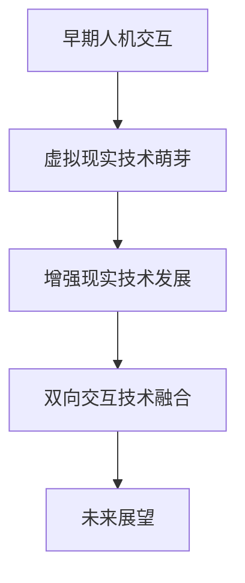
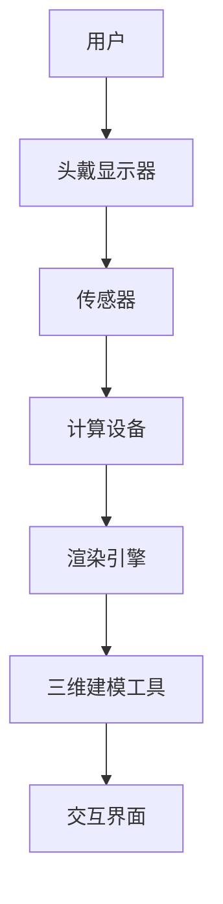
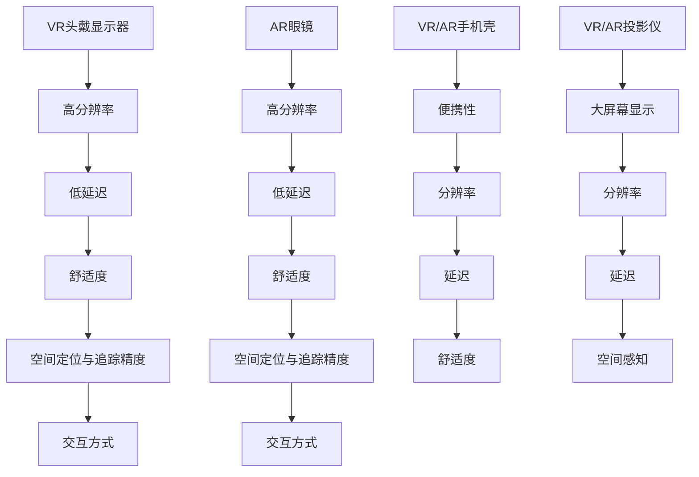
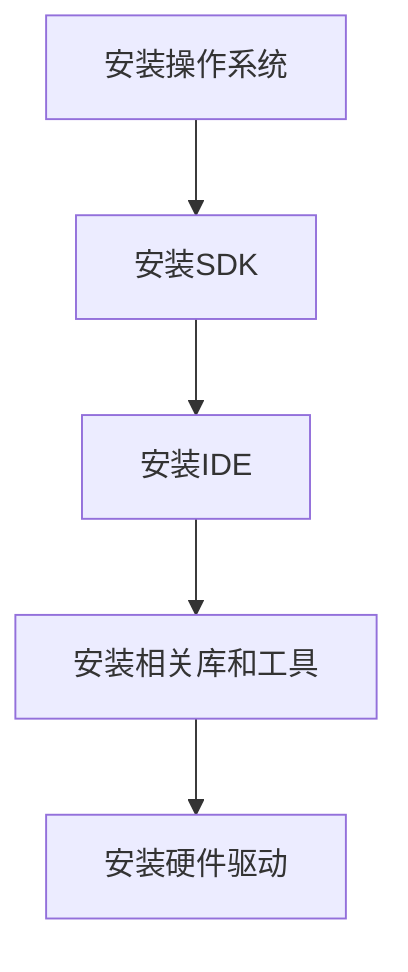
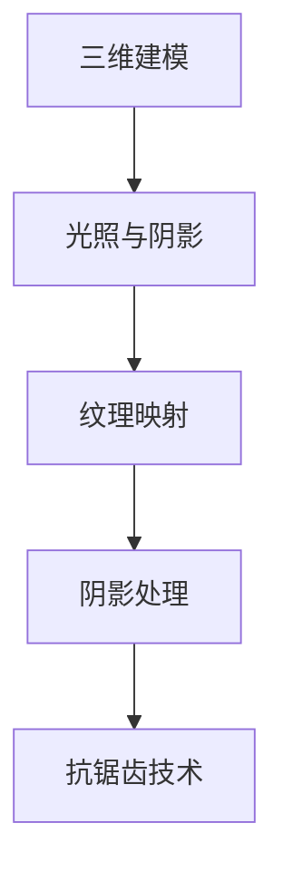
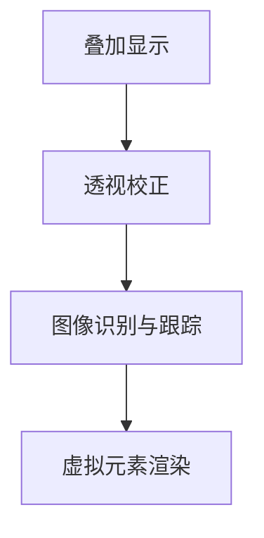
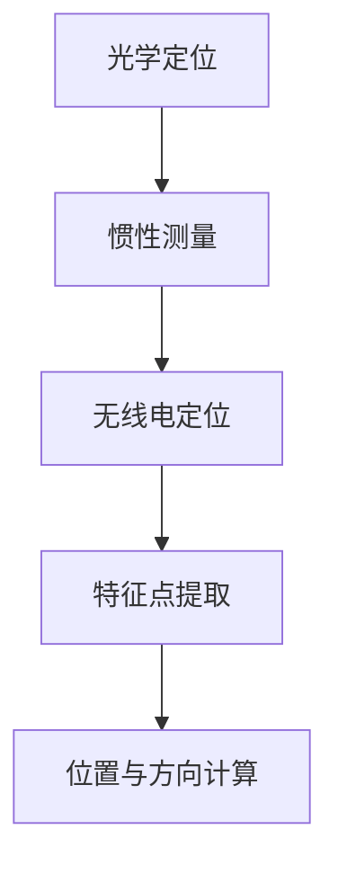
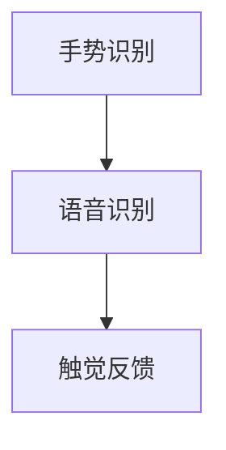
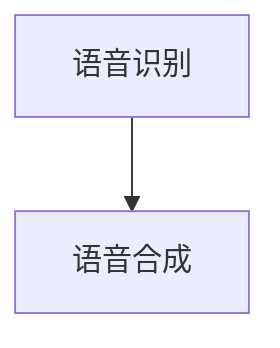
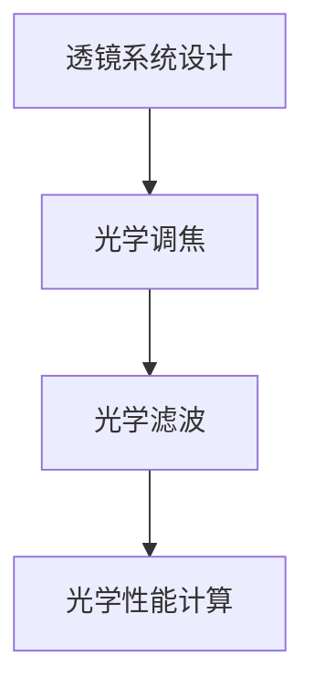

                 

# 双向交互与VR/AR技术的应用

## 关键词
- 双向交互
- 虚拟现实（VR）
- 增强现实（AR）
- 硬件设备
- 软件开发
- 应用场景

## 摘要
本文将深入探讨双向交互与VR/AR技术的融合应用。首先，我们回顾了双向交互技术的发展历程和VR/AR技术的定义与分类，解析了它们的核心优势与应用场景。接着，我们详细介绍了VR/AR技术的原理与架构，包括显示技术、空间定位与追踪技术以及双向交互的关键技术。随后，我们探讨了VR/AR硬件与设备的发展趋势，分类与性能比较。文章后半部分重点讨论了VR/AR技术的软件开发基础、核心技术和应用开发实践。最后，我们分析了VR/AR技术在教育、娱乐、医疗等领域的应用，以及产业的发展趋势。通过本文，读者将全面了解双向交互与VR/AR技术的应用现状、发展趋势及未来前景。

### 第一部分：概述与基础

#### 第1章：双向交互与VR/AR技术概述

在数字技术的快速发展下，虚拟现实（VR）和增强现实（AR）技术已经成为现代信息技术领域的热点。它们通过模拟和增强现实世界的感知，为用户提供了一种全新的交互方式。而双向交互技术，作为一种能够实现用户与虚拟环境之间实时互动的技术，正在与VR/AR技术深度融合，推动着人机交互的变革。

### 1.1 双向交互技术的发展历程

双向交互技术的概念可以追溯到20世纪60年代，那时计算机图形学刚刚起步。早期的研究主要集中在如何使用图形界面进行人机交互，以提高交互的效率和直观性。随着计算机技术的不断进步，特别是图形处理能力和计算能力的提升，双向交互技术逐渐发展壮大。

在20世纪80年代，虚拟现实技术开始萌芽，研究者们开始探索如何通过计算机生成三维环境，并实现用户与虚拟环境的交互。这一时期的代表性工作包括VRML（虚拟现实建模语言）和VR系统。

进入21世纪，随着移动互联网和智能设备的普及，增强现实技术逐渐崭露头角。AR技术通过在现实世界叠加虚拟元素，为用户提供了一种新的感知方式。与VR技术不同，AR技术不需要用户佩戴头戴设备，而是通过手机或平板电脑等移动设备实现。

### 1.2 VR/AR技术的定义与分类

虚拟现实（VR）技术是一种通过计算机生成三维虚拟环境，使用户沉浸其中的一种技术。VR技术的主要特征是高度沉浸性和交互性。根据沉浸程度，VR技术可以分为低沉浸VR、中等沉浸VR和高沉浸VR。

增强现实（AR）技术则是在现实世界的基础上叠加虚拟元素，通过智能手机、平板电脑或AR眼镜等设备实现。AR技术的主要特征是增强现实感知和互动性。根据应用场景，AR技术可以分为导航类AR、教育类AR和娱乐类AR等。

### 1.3 VR/AR技术的核心优势与应用场景

VR/AR技术的核心优势在于其沉浸性和交互性。通过VR技术，用户可以完全沉浸在一个虚拟环境中，体验到前所未有的交互体验。而通过AR技术，用户可以在现实世界中获得更多的信息和互动。

VR技术的应用场景非常广泛，包括游戏、教育、医疗、军事、设计等。例如，在游戏领域，VR技术可以提供身临其境的游戏体验；在教育领域，VR技术可以用于虚拟实验室和远程教学；在医疗领域，VR技术可以用于手术模拟和康复治疗。

AR技术的应用场景同样丰富，包括导航、购物、教育、医疗、建筑等。例如，在导航领域，AR技术可以提供实时导航信息；在购物领域，AR技术可以用于产品展示和试用；在教育领域，AR技术可以用于虚拟实验和互动教学。

### 1.4 双向交互在VR/AR中的应用

双向交互技术是VR/AR技术的核心组成部分，它实现了用户与虚拟环境之间的实时互动。双向交互技术主要包括手势识别、语音识别、触觉反馈等。

在VR技术中，双向交互技术可以实现用户对虚拟环境的直接控制，如通过手势或语音控制虚拟物体。这种交互方式不仅提高了用户的沉浸感，还增强了虚拟环境的真实感。

在AR技术中，双向交互技术则可以通过智能手机或平板电脑实现，如通过触摸屏幕或语音命令与虚拟元素互动。这种交互方式不仅方便用户使用，还可以提高AR应用的实用性和趣味性。

### 1.5 双向交互与VR/AR技术的未来展望

随着技术的不断发展，双向交互与VR/AR技术的应用前景将更加广阔。未来，我们可以预见到以下几个趋势：

首先，随着硬件设备的不断升级和成本的降低，VR/AR设备将更加普及，用户可以随时随地体验VR/AR应用。

其次，随着人工智能技术的进步，双向交互技术将更加智能化，能够更好地理解用户的意图和行为。

最后，随着5G技术的普及，VR/AR应用将实现更高的实时性和互动性，为用户提供更加丰富的交互体验。

总之，双向交互与VR/AR技术的融合将为未来的数字生活带来巨大的变革。通过本文的介绍，读者可以全面了解双向交互与VR/AR技术的应用现状、发展趋势及未来前景。

---

**图1-1：双向交互与VR/AR技术发展历程**



### 第2章：VR/AR技术原理与架构

虚拟现实（VR）和增强现实（AR）技术是当前信息技术领域的重要发展方向。它们通过构建虚拟环境或增强现实世界，为用户提供了全新的交互体验。本章将详细介绍VR/AR技术的原理与架构，包括显示技术、空间定位与追踪技术以及双向交互的关键技术。

#### 2.1 VR/AR技术基本原理

虚拟现实（VR）技术是通过计算机生成一个完全虚拟的三维环境，使用户在其中能够沉浸体验。VR技术的核心原理包括：

- **三维建模**：使用计算机图形学技术生成三维模型，包括场景、物体和角色等。
- **显示技术**：将三维模型通过头戴显示器（HMD）或投影设备呈现给用户，使用户能够看到虚拟环境。
- **空间感知**：通过空间定位与追踪技术，使虚拟环境与用户的实际动作保持一致，提高沉浸感。

增强现实（AR）技术则是将虚拟元素叠加到现实世界中，通过增强用户的现实感知来实现交互。AR技术的核心原理包括：

- **三维建模**：同样使用计算机图形学技术生成三维模型。
- **显示技术**：通过摄像头捕捉现实世界图像，将虚拟元素叠加到现实图像中，并通过显示屏呈现给用户。
- **增强现实感知**：通过计算机视觉算法，识别和跟踪现实世界中的物体和场景，实现虚拟元素与现实世界的融合。

#### 2.2 VR/AR系统架构

VR/AR系统架构通常包括硬件和软件两部分。硬件部分主要包括头戴显示器、传感器、计算设备等；软件部分则包括三维建模工具、渲染引擎、交互界面等。

- **硬件架构**：

  - **头戴显示器**：VR/AR技术的核心硬件，分为VR头戴显示器和AR眼镜。VR头戴显示器通过光学原理将虚拟图像直接投射到用户的眼中，而AR眼镜则是通过摄像头捕捉现实世界图像，并叠加虚拟元素。

  - **传感器**：用于检测用户的位置、动作和手势等，常见的传感器包括摄像头、红外传感器、超声波传感器、加速度计、陀螺仪等。

  - **计算设备**：用于处理三维建模、渲染、交互等任务，常见的计算设备包括PC、手机、平板电脑等。

- **软件架构**：

  - **三维建模工具**：用于创建三维模型，常见的工具包括Blender、Maya、3ds Max等。
  - **渲染引擎**：用于将三维模型渲染成图像，常见的渲染引擎包括Unity、Unreal Engine、OpenGL等。
  - **交互界面**：用于实现用户与虚拟环境或增强现实环境的交互，常见的交互界面包括触摸屏、手势识别、语音识别等。

#### 2.3 显示技术

显示技术是VR/AR技术的关键组成部分，直接影响到用户的沉浸体验和感知效果。以下是几种常见的显示技术：

- **头戴式显示器**：VR头戴显示器通过光学原理将虚拟图像直接投射到用户的眼中，常见的显示技术包括LCD、OLED、LED等。其中，OLED技术具有更高的分辨率、更低的延迟和更好的色彩表现。

- **投影技术**：投影技术通过将虚拟图像投射到屏幕或墙壁上，实现大画面的虚拟环境。常见的投影技术包括DLP、LCoS等。

- **AR眼镜**：AR眼镜通过摄像头捕捉现实世界图像，并将虚拟元素叠加到现实图像中。常见的显示技术包括液晶屏、LED屏等。

#### 2.4 虚拟现实头戴显示器的光学原理

虚拟现实头戴显示器（HMD）的光学原理主要包括光学透镜系统和显示屏幕。以下是HMD的光学原理：

- **光学透镜系统**：HMD的光学透镜系统通常包括两个凸透镜，分别用于放大和调整虚拟图像的光学属性。通过调整透镜的位置和焦距，可以使虚拟图像在用户眼中形成清晰的图像。

- **显示屏幕**：HMD的显示屏幕通常采用LCD或OLED技术，用于生成虚拟图像。屏幕的分辨率和刷新率直接影响到用户的沉浸体验。

#### 2.5 空间定位与追踪技术

空间定位与追踪技术是VR/AR技术实现沉浸体验的关键。以下是几种常见的空间定位与追踪技术：

- **光学定位与追踪**：通过摄像头捕捉环境中的特征点，利用光学算法计算用户的位置和方向。常见的光学定位与追踪技术包括结构光、视觉惯性测量单元（VIO）等。

- **惯性测量单元**：通过加速度计和陀螺仪等传感器测量用户的动作和位置。惯性测量单元常用于辅助光学定位，提高定位精度。

- **无线电定位**：通过无线电信号测量用户的位置，常见的无线电定位技术包括Wi-Fi定位、蓝牙定位等。

#### 2.6 空间感知与交互设计

空间感知与交互设计是VR/AR技术实现良好用户体验的关键。以下是空间感知与交互设计的关键要素：

- **空间布局**：合理的设计空间布局，使虚拟环境或增强现实环境更符合用户的感知习惯。
- **交互方式**：选择适合的交互方式，如手势识别、语音识别、触觉反馈等，以提高用户的交互体验。
- **反馈机制**：设计有效的反馈机制，如声音、视觉、触觉等，以增强用户的沉浸感和互动性。

#### 2.7 双向交互的关键技术

双向交互技术是实现用户与虚拟环境或增强现实环境之间实时互动的关键。以下是双向交互的关键技术：

- **手势识别**：通过计算机视觉算法识别用户的手势，实现与虚拟环境的交互。
- **语音识别**：通过语音识别技术将用户的语音转换为文本或命令，实现与虚拟环境的交互。
- **触觉反馈**：通过触觉传感器和反馈装置，实现用户对虚拟环境的触觉感知。

总之，VR/AR技术的原理与架构涉及到多个方面的技术，包括显示技术、空间定位与追踪技术、空间感知与交互设计以及双向交互技术。通过这些技术的融合，VR/AR技术为用户提供了全新的沉浸体验和交互方式。

---

**图2-1：VR/AR系统架构**



### 第3章：VR/AR硬件与设备

随着虚拟现实（VR）和增强现实（AR）技术的不断发展，VR/AR硬件设备已成为市场关注的焦点。本章将探讨VR/AR硬件设备的发展趋势、分类与性能比较，以及虚拟现实头戴显示器和AR眼镜的选购指南。

#### 3.1 VR/AR硬件的发展趋势

VR/AR硬件设备正朝着更加轻便、舒适、高分辨率和高性能的方向发展。以下是当前VR/AR硬件的发展趋势：

1. **分辨率提升**：随着显示技术的进步，VR/AR设备的分辨率正在不断提升。高分辨率可以提供更加清晰的视觉体验，减少视觉模糊感。

2. **延迟降低**：降低延迟是提高VR/AR设备沉浸感的关键。硬件厂商正致力于通过优化渲染引擎和传感技术来降低延迟，提高交互的实时性。

3. **舒适度提升**：VR/AR设备需要长时间佩戴，因此舒适度是一个重要的考虑因素。硬件厂商正通过改进设计、增加透气性材料和优化重量分布来提高设备的舒适度。

4. **便携性增强**：便携性是VR/AR设备普及的重要因素。轻便的设备可以方便用户随时随地使用，增加使用场景。

5. **多样化设备**：除了传统的头戴显示器和AR眼镜，市场上还出现了VR/AR手机壳、VR/AR投影仪等多样化设备，以满足不同用户的需求。

#### 3.2 VR/AR设备的分类与性能比较

VR/AR设备的分类可以从多个角度进行，如设备类型、使用场景、性能指标等。以下是几种常见的VR/AR设备分类与性能比较：

1. **按设备类型分类**：

   - **VR头戴显示器**：常见的VR头戴显示器包括Oculus Rift、HTC Vive、Sony PlayStation VR等。这些设备通常具有高分辨率、低延迟和优秀的空间定位功能，适合游戏、教育和模拟训练等场景。

   - **AR眼镜**：常见的AR眼镜包括Google Glass、Microsoft HoloLens、Magic Leap等。这些设备可以实时将虚拟元素叠加到现实世界中，适用于导航、购物、教育和医疗等场景。

   - **VR/AR手机壳**：常见的VR/AR手机壳包括Google Cardboard、Samsung Gear VR等。这些设备通过智能手机屏幕显示虚拟内容，适用于轻度VR/AR体验。

   - **VR/AR投影仪**：常见的VR/AR投影仪包括OMNI、Kodiak等。这些设备可以将虚拟内容投影到墙壁或屏幕上，适用于大屏幕显示和公共场合。

2. **按使用场景分类**：

   - **游戏**：VR头戴显示器和VR手机壳是游戏场景中的常见设备，提供沉浸式的游戏体验。

   - **教育**：VR头戴显示器和AR眼镜在教育场景中广泛应用，用于虚拟实验室、远程教学和互动学习。

   - **医疗**：VR技术可以用于手术模拟、康复治疗和患者教育。AR眼镜则可以提供实时医疗信息，辅助医生进行手术和诊断。

   - **娱乐**：AR技术可以用于表演、音乐会和主题公园等娱乐场景，提供增强现实体验。

   - **建筑与设计**：VR技术可以用于建筑和室内设计，提供虚拟漫游和交互式设计体验。

3. **按性能指标分类**：

   - **分辨率**：分辨率是衡量VR/AR设备性能的重要指标。高分辨率设备可以提供更清晰的图像质量，减少视觉模糊感。

   - **延迟**：延迟是影响VR/AR设备沉浸体验的关键因素。低延迟设备可以提供更流畅的交互体验。

   - **重量与舒适度**：设备的重量和舒适度直接影响用户的使用体验。轻便、舒适的设备可以减少长时间佩戴的不适感。

   - **空间定位与追踪精度**：空间定位与追踪精度是衡量VR/AR设备空间感知能力的重要指标。高精度的空间定位与追踪可以提供更准确的虚拟环境感知。

#### 3.3 虚拟现实头戴显示器的选购指南

购买虚拟现实头戴显示器时，用户需要考虑以下因素：

1. **分辨率**：选择高分辨率显示器，以获得更清晰的视觉体验。

2. **延迟**：选择低延迟显示器，以提供更流畅的交互体验。

3. **舒适度**：选择重量适中、佩戴舒适的显示器，以减少长时间佩戴的不适感。

4. **空间定位与追踪技术**：选择具有高精度空间定位与追踪技术的显示器，以实现更好的虚拟环境感知。

5. **交互方式**：根据个人偏好选择支持手势识别、语音识别或触觉反馈的显示器。

6. **兼容性**：确保显示器与自己的电脑或其他设备兼容，以避免使用限制。

7. **预算**：根据个人预算选择合适的显示器，考虑性价比和功能需求。

#### 3.4 AR眼镜的市场现状与未来发展

AR眼镜市场正在快速发展，以下是一些市场现状与未来发展：

1. **市场现状**：

   - **技术成熟度**：当前AR眼镜在技术方面已取得显著进展，但仍需进一步优化以提高性能和用户体验。

   - **应用场景**：AR眼镜在医疗、教育、娱乐、工业等领域已有广泛应用，未来应用场景将进一步扩大。

   - **市场规模**：随着技术的进步和应用的拓展，AR眼镜市场预计将保持高速增长。

2. **未来发展**：

   - **技术突破**：未来AR眼镜将实现更高的分辨率、更低延迟、更精准的空间定位与追踪，提供更真实的增强现实体验。

   - **商业应用**：AR眼镜将在更多商业领域得到应用，如零售、旅游、餐饮等。

   - **普及化**：随着AR眼镜价格的下降和技术的普及，AR眼镜将逐渐成为大众消费品。

#### 3.5 感应设备与传感器技术

VR/AR设备的性能不仅取决于头戴显示器和AR眼镜，还受到传感器技术的影响。以下是几种常见的传感器及其应用：

1. **摄像头**：用于捕捉用户和环境图像，实现视觉感知和增强现实功能。

2. **红外传感器**：用于捕捉红外图像，实现深度感知和空间定位。

3. **加速度计和陀螺仪**：用于测量用户的位置和方向，实现姿态感知和空间定位。

4. **超声波传感器**：用于测量距离和障碍物，实现空间感知和避障功能。

5. **触觉传感器**：用于感知用户触摸和压力，实现触觉反馈。

通过以上介绍，读者可以全面了解VR/AR硬件设备的发展趋势、分类与性能比较，以及虚拟现实头戴显示器和AR眼镜的选购指南。这些知识将为用户在选择和使用VR/AR设备时提供有力支持。

---

**图3-1：VR/AR设备分类与性能比较**



### 第4章：VR/AR软件开发基础

虚拟现实（VR）和增强现实（AR）技术的快速发展，推动了相关软件开发的需求。本章将介绍VR/AR软件开发的基础知识，包括开发环境的搭建、编程语言与开发工具的选择，以及常用的VR/AR引擎与框架。

#### 4.1 VR/AR开发环境搭建

在开始VR/AR开发之前，我们需要搭建一个合适的环境。以下是在Windows、macOS和Linux系统上搭建VR/AR开发环境的步骤：

1. **安装操作系统**：确保操作系统支持VR/AR开发，如Windows 10、macOS或Linux发行版。

2. **安装SDK**：根据所选的VR/AR硬件设备，下载并安装相应的软件开发套件（SDK）。例如，Oculus SDK、ARCore SDK、ARKit SDK等。

3. **安装IDE**：选择一个适合的集成开发环境（IDE），如Visual Studio、Xcode、Eclipse等。这些IDE支持多种编程语言，方便进行开发。

4. **安装相关库和工具**：安装与VR/AR开发相关的库和工具，如OpenGL、OpenCV、Unity等。这些库和工具提供了丰富的功能，方便开发者进行开发。

5. **安装硬件驱动**：确保VR/AR设备的硬件驱动已安装，以实现设备的正常使用。

#### 4.2 VR/AR编程语言与开发工具

VR/AR开发涉及到多种编程语言和开发工具，以下是一些常用的编程语言和开发工具：

1. **编程语言**：

   - **C++**：C++是VR/AR开发中最常用的编程语言之一，具有高性能和灵活性，适合开发复杂的应用程序。

   - **C#**：C#是Unity游戏引擎的主要编程语言，广泛应用于游戏开发和VR/AR应用开发。

   - **Python**：Python是一种易于学习的编程语言，适用于快速原型开发和数据科学应用。

   - **Java**：Java是一种跨平台的编程语言，适用于Android开发和AR应用开发。

2. **开发工具**：

   - **Unity**：Unity是一个强大的游戏引擎，广泛用于VR/AR应用开发。Unity支持C#编程语言，具有丰富的资源和文档。

   - **Unreal Engine**：Unreal Engine是一个高性能的游戏引擎，适用于复杂和高质量的VR/AR应用开发。Unreal Engine支持C++编程语言。

   - **OpenGL**：OpenGL是一个跨平台的图形库，用于渲染2D和3D图像。OpenGL适用于开发高性能的VR/AR应用程序。

   - **OpenCV**：OpenCV是一个开源的计算机视觉库，提供丰富的计算机视觉算法，适用于图像识别和处理。

   - **ARCore SDK**：ARCore SDK是Google开发的AR开发平台，支持Android和iOS平台。ARCore SDK提供丰富的API和工具，方便开发者进行AR应用开发。

   - **ARKit SDK**：ARKit SDK是Apple开发的AR开发平台，支持iOS和macOS平台。ARKit SDK提供强大的AR功能，如增强现实效果、环境识别和物体追踪。

#### 4.3 VR/AR引擎与框架

VR/AR引擎与框架是VR/AR开发的核心组成部分，它们提供了丰富的功能，方便开发者进行开发。以下是一些常用的VR/AR引擎与框架：

1. **Unity**：Unity是一个跨平台的游戏引擎，广泛应用于VR/AR应用开发。Unity提供了丰富的功能，如3D建模、动画、物理引擎和用户界面。Unity支持C#编程语言，具有丰富的资源和文档。

2. **Unreal Engine**：Unreal Engine是一个高性能的游戏引擎，适用于复杂和高质量的VR/AR应用开发。Unreal Engine支持C++编程语言，提供了强大的渲染效果、光照和物理引擎。

3. **CryEngine**：CryEngine是一个开源的游戏引擎，适用于VR/AR应用开发。CryEngine提供了先进的渲染技术、光照和物理引擎，适用于开发高质量的游戏和应用。

4. **ARCore SDK**：ARCore SDK是Google开发的AR开发平台，支持Android和iOS平台。ARCore SDK提供了丰富的API和工具，方便开发者进行AR应用开发。

5. **ARKit SDK**：ARKit SDK是Apple开发的AR开发平台，支持iOS和macOS平台。ARKit SDK提供了强大的AR功能，如增强现实效果、环境识别和物体追踪。

6. **Vuforia**：Vuforia是一个开源的AR开发平台，支持Android和iOS平台。Vuforia提供了强大的AR功能，如图像识别、物体追踪和标记识别。

通过以上介绍，读者可以了解VR/AR软件开发的基础知识，包括开发环境的搭建、编程语言与开发工具的选择，以及常用的VR/AR引擎与框架。这些知识将为读者在VR/AR开发领域的发展提供有力支持。

---

**图4-1：VR/AR开发环境搭建**



### 第5章：VR/AR核心技术

虚拟现实（VR）和增强现实（AR）技术的发展，离不开核心技术的支持。本章将详细讨论VR/AR技术的几个核心技术，包括虚拟现实渲染技术、增强现实显示技术、空间定位与追踪算法、双向交互技术、语音识别与合成技术，以及虚拟现实头戴显示器的光学设计。

#### 5.1 虚拟现实渲染技术

虚拟现实渲染技术是VR技术的重要组成部分，它决定了虚拟环境的视觉效果和真实感。虚拟现实渲染技术主要包括以下几个方面：

1. **三维建模**：三维建模是虚拟现实渲染的基础，它通过计算机图形学技术创建三维模型。常用的三维建模工具包括Blender、Maya、3ds Max等。

2. **光照与阴影**：光照与阴影是渲染效果的关键因素，它们决定了虚拟环境的真实感。在虚拟现实渲染中，常用的光照模型包括漫反射、镜面反射、散射等。

3. **纹理映射**：纹理映射技术用于在三维模型表面应用纹理，以增强虚拟环境的真实感。常用的纹理映射技术包括UV映射、环境映射等。

4. **阴影处理**：阴影处理是提高虚拟环境真实感的重要手段，常用的阴影处理技术包括软阴影、硬阴影、阴影贴图等。

5. **抗锯齿技术**：抗锯齿技术用于减少渲染图像中的锯齿效应，提高图像的清晰度。常用的抗锯齿技术包括MSAA、FXAA等。

以下是虚拟现实渲染技术的伪代码示例：

```python
# 虚拟现实渲染伪代码

# 初始化渲染环境
init_rendering_environment()

# 创建三维模型
create_3d_model()

# 设置光照
set_lighting()

# 应用纹理映射
apply_texture_mapping()

# 渲染场景
render_scene()

# 应用抗锯齿技术
apply_anti_aliasing()

# 输出渲染结果
output_rendered_result()
```

#### 5.2 增强现实显示技术

增强现实显示技术是AR技术的核心组成部分，它决定了AR应用的视觉效果和增强现实效果。增强现实显示技术主要包括以下几个方面：

1. **叠加显示**：叠加显示技术将虚拟元素叠加到现实世界图像中，实现增强现实效果。常用的叠加显示技术包括透明叠加、混合叠加等。

2. **透视校正**：透视校正技术用于纠正现实世界图像中的透视失真，使虚拟元素与现实世界更好地融合。透视校正技术包括相机内参校正、深度校正等。

3. **图像识别与跟踪**：图像识别与跟踪技术用于识别现实世界中的特定图像或物体，并跟踪它们的位置和运动。常用的图像识别与跟踪技术包括特征检测、匹配、跟踪等。

4. **虚拟元素渲染**：虚拟元素渲染技术用于渲染虚拟元素，包括三维模型、纹理、光照等。常用的虚拟元素渲染技术包括OpenGL、DirectX等。

以下是增强现实显示技术的伪代码示例：

```python
# 增强现实显示伪代码

# 初始化增强现实显示环境
init_ar_display_environment()

# 识别现实世界图像
recognize_real_world_image()

# 跟踪图像位置和运动
track_image_position_and_motion()

# 渲染虚拟元素
render_virtual_elements()

# 应用透视校正
apply_perspective_correction()

# 输出增强现实显示结果
output_ar_display_result()
```

#### 5.3 空间定位与追踪算法

空间定位与追踪算法是VR/AR技术的关键组成部分，它决定了用户在虚拟环境中的位置和方向。空间定位与追踪算法主要包括以下几个方面：

1. **光学定位**：光学定位技术通过摄像头捕捉环境中的特征点，利用图像处理算法计算用户的位置和方向。常用的光学定位技术包括结构光、视觉惯性测量单元（VIO）等。

2. **惯性测量**：惯性测量技术通过加速度计和陀螺仪等传感器测量用户的动作和位置。惯性测量技术可以用于辅助光学定位，提高定位精度。

3. **无线电定位**：无线电定位技术通过测量无线电信号传播时间或信号强度，计算用户的位置。常用的无线电定位技术包括Wi-Fi定位、蓝牙定位等。

以下是空间定位与追踪算法的伪代码示例：

```python
# 空间定位与追踪算法伪代码

# 初始化空间定位与追踪环境
init_space_localization_and_tracking_environment()

# 捕获环境图像
capture_environment_image()

# 提取特征点
extract_keypoints()

# 计算位置和方向
calculate_position_and_orientation()

# 应用惯性测量
apply_inertial_measurement()

# 应用光学定位
apply_optical_localization()

# 应用无线电定位
apply_radio_localization()

# 输出空间定位结果
output_space_localization_result()
```

#### 5.4 双向交互技术

双向交互技术是实现用户与虚拟环境或增强现实环境之间实时互动的关键。双向交互技术主要包括以下几个方面：

1. **手势识别**：手势识别技术通过计算机视觉算法识别用户的手势，实现与虚拟环境的交互。常用的手势识别技术包括深度学习、模板匹配等。

2. **语音识别**：语音识别技术将用户的语音转换为文本或命令，实现与虚拟环境的交互。常用的语音识别技术包括深度学习、HMM（隐马尔可夫模型）等。

3. **触觉反馈**：触觉反馈技术通过触觉传感器和反馈装置，实现用户对虚拟环境的触觉感知。常用的触觉反馈技术包括振动、气压等。

以下是双向交互技术的伪代码示例：

```python
# 双向交互技术伪代码

# 初始化双向交互环境
init_bidirectional_interaction_environment()

# 识别用户手势
recognize_user_gesture()

# 转换语音命令
convert_speech_command()

# 应用触觉反馈
apply_tactile_feedback()

# 输出交互结果
output_interaction_result()
```

#### 5.5 语音识别与合成技术

语音识别与合成技术是双向交互技术的重要组成部分，它实现了用户与虚拟环境之间的语音交互。语音识别与合成技术主要包括以下几个方面：

1. **语音识别**：语音识别技术将用户的语音转换为文本或命令，实现与虚拟环境的交互。常用的语音识别技术包括深度学习、HMM（隐马尔可夫模型）等。

2. **语音合成**：语音合成技术将文本或命令转换为语音输出，实现虚拟环境与用户的语音交互。常用的语音合成技术包括基于规则的合成、基于数据的合成等。

以下是语音识别与合成技术的伪代码示例：

```python
# 语音识别与合成技术伪代码

# 初始化语音识别与合成环境
init_speech_recognition_and_synthesis_environment()

# 识别用户语音
recognize_user_speech()

# 转换文本命令
convert_text_command()

# 输出语音反馈
synthesize_speech_feedback()

# 输出语音识别与合成结果
output_speech_recognition_and_synthesis_result()
```

#### 5.6 虚拟现实头戴显示器的光学设计

虚拟现实头戴显示器（HMD）的光学设计是影响用户体验的关键因素。光学设计主要包括以下几个方面：

1. **透镜系统**：透镜系统用于将虚拟图像投射到用户的眼中。常用的透镜系统包括双凸透镜、双凹透镜等。

2. **光学调焦**：光学调焦技术用于调整虚拟图像的清晰度，使其在用户眼中形成清晰的图像。常用的光学调焦技术包括自动调焦、手动调焦等。

3. **光学滤波**：光学滤波技术用于减少图像噪声和眩光，提高图像质量。常用的光学滤波技术包括反射滤光片、透射滤光片等。

以下是虚拟现实头戴显示器光学设计的伪代码示例：

```python
# 虚拟现实头戴显示器光学设计伪代码

# 初始化光学设计环境
init_hmd_optical_design_environment()

# 设计透镜系统
design_lens_system()

# 设置光学调焦
set_optical_focus()

# 应用光学滤波
apply_optical_filtering()

# 计算光学性能
calculate_optical_performance()

# 输出光学设计结果
output_hmd_optical_design_result()
```

通过以上对VR/AR核心技术的详细讨论，读者可以全面了解虚拟现实渲染技术、增强现实显示技术、空间定位与追踪算法、双向交互技术、语音识别与合成技术，以及虚拟现实头戴显示器的光学设计。这些核心技术是VR/AR技术实现的重要基础，为VR/AR应用的发展提供了强大支持。

---

**图5-1：虚拟现实渲染技术**



**图5-2：增强现实显示技术**



**图5-3：空间定位与追踪算法**



**图5-4：双向交互技术**



**图5-5：语音识别与合成技术**



**图5-6：虚拟现实头戴显示器光学设计**



### 第6章：VR/AR应用开发实践

虚拟现实（VR）和增强现实（AR）技术的广泛应用，激发了开发者在各个领域进行创新和探索的热情。本章将通过具体的案例，展示VR/AR应用开发流程，并探讨在虚拟现实、增强现实以及双向交互领域中的应用案例。

#### 6.1 VR/AR应用开发流程

VR/AR应用开发流程可以分为以下几个阶段：

1. **需求分析与规划**：明确应用目标、用户群体和功能需求，进行项目规划。

2. **技术选型与设计**：根据需求选择合适的VR/AR技术、开发工具和平台，进行系统设计。

3. **原型设计与开发**：设计应用原型，进行功能开发，包括三维建模、渲染、交互界面等。

4. **测试与优化**：对应用进行功能测试、性能测试和用户体验测试，进行优化和迭代。

5. **发布与推广**：发布应用，进行市场推广，收集用户反馈，持续改进。

以下是VR/AR应用开发流程的伪代码示例：

```python
# VR/AR应用开发流程伪代码

# 需求分析与规划
analyze_requirements_and_plan()

# 技术选型与设计
select_technology_and_design()

# 原型设计与开发
design_andDevelop_prototype()

# 测试与优化
test_and_optimize()

# 发布与推广
publish_and_promote()
```

#### 6.2 虚拟现实应用案例

虚拟现实技术在多个领域展现出了强大的应用潜力。以下是一个虚拟现实应用案例：

**案例：虚拟旅游**

**需求**：为用户提供一种虚拟旅游体验，让用户可以在家中通过VR设备游览世界各地的名胜古迹。

**实现过程**：

1. **需求分析与规划**：明确应用目标、用户需求和功能模块，如地图导航、景点介绍、互动体验等。

2. **技术选型与设计**：选择Unity作为开发平台，使用C#进行编程，利用Unity的VR插件实现虚拟环境。

3. **原型设计与开发**：设计虚拟旅游应用的原型，包括用户界面、导航系统、景点介绍等。

4. **测试与优化**：通过多次迭代，优化用户体验，如场景切换速度、互动效果等。

5. **发布与推广**：在各大应用商店发布应用，通过社交媒体进行推广。

**代码示例**：

```csharp
// Unity虚拟旅游应用代码示例

// 导入必要的命名空间
using UnityEngine;
using System.Collections;

public class VirtualTourism : MonoBehaviour
{
    // 开始虚拟旅游
    public void StartTour()
    {
        // 加载景点场景
        SceneManager.LoadScene("Scenes/TourismScene");
    }

    // 导航到下一个景点
    public void NavigateToNextScene()
    {
        // 更新当前景点编号
        int currentSceneIndex = SceneManager.GetActiveScene().buildIndex;
        int nextSceneIndex = currentSceneIndex + 1;

        // 加载下一个景点场景
        SceneManager.LoadScene(nextSceneIndex);
    }
}
```

#### 6.3 增强现实应用案例

增强现实技术在教育、医疗、娱乐等领域具有广泛的应用。以下是一个增强现实应用案例：

**案例：医学教育**

**需求**：为医学生和医生提供一种直观的医学教育工具，通过增强现实技术展示人体解剖结构。

**实现过程**：

1. **需求分析与规划**：明确应用目标、用户需求和功能模块，如人体器官展示、互动操作、实时标注等。

2. **技术选型与设计**：选择ARCore或ARKit作为开发平台，使用C#或Swift进行编程，利用AR技术实现虚拟器官的叠加。

3. **原型设计与开发**：设计医学教育应用的原型，包括器官模型、标注工具、用户交互界面等。

4. **测试与优化**：通过多次迭代，优化用户体验，如器官模型的精度、标注工具的便捷性等。

5. **发布与推广**：在医学教育平台发布应用，通过医学教育机构推广。

**代码示例**：

```swift
// ARCore医学教育应用代码示例

import ARKit

public class MedicalEducation : ARSCNViewDelegate
{
    // 添加人体器官模型
    public func AddOrganModel(_ organModel: ARNode)
    {
        // 添加器官模型到场景中
        scene.rootNode.addChildNode(organModel)
    }

    // 更新标注工具
    public func UpdateAnnotationTool(_ annotationTool: ARAnnotationTool)
    {
        // 更新标注工具
        annotationTool.Update()
    }
}
```

#### 6.4 双向交互应用案例

双向交互技术在提高用户体验方面发挥了重要作用。以下是一个双向交互应用案例：

**案例：虚拟购物**

**需求**：为用户提供一种虚拟购物体验，通过手势识别和语音识别技术实现与虚拟商品的互动。

**实现过程**：

1. **需求分析与规划**：明确应用目标、用户需求和功能模块，如商品展示、互动操作、购物车等。

2. **技术选型与设计**：选择Unity作为开发平台，使用C#进行编程，利用Unity的VR插件和语音识别库实现双向交互。

3. **原型设计与开发**：设计虚拟购物应用的原型，包括商品展示界面、互动操作界面、语音识别系统等。

4. **测试与优化**：通过多次迭代，优化用户体验，如商品展示效果、互动操作流畅度等。

5. **发布与推广**：在电商平台发布应用，通过社交媒体进行推广。

**代码示例**：

```csharp
// Unity虚拟购物应用代码示例

// 导入必要的命名空间
using UnityEngine;
using System.Collections;
using UnityEngine.XR.Interaction;

public class VirtualShopping : MonoBehaviour
{
    // 开始互动购物
    public void StartShopping()
    {
        // 启动手势识别系统
        GestureSystem.Instance.EnableGestureDetection();
    }

    // 语音识别命令处理
    public void ProcessVoiceCommand(string command)
    {
        // 根据语音命令执行相应操作
        if (command == "add_to_cart")
        {
            // 添加商品到购物车
            AddItemToCart();
        }
        else if (command == "show_details")
        {
            // 显示商品详细信息
            ShowItemDetails();
        }
    }

    // 添加商品到购物车
    private void AddItemToCart()
    {
        // 实现商品添加到购物车的逻辑
    }

    // 显示商品详细信息
    private void ShowItemDetails()
    {
        // 实现商品详细信息展示的逻辑
    }
}
```

通过以上案例，读者可以了解VR/AR应用开发的具体流程，以及虚拟现实、增强现实和双向交互领域中的应用实践。这些案例不仅展示了VR/AR技术的应用潜力，也为开发者提供了宝贵的经验和参考。

### 第7章：VR/AR技术在教育、娱乐、医疗等领域的应用

虚拟现实（VR）和增强现实（AR）技术在近年来得到了飞速发展，其独特的沉浸式和增强现实体验在多个领域展现出了巨大的应用潜力。本章将详细探讨VR/AR技术在教育、娱乐、医疗等领域的应用，并通过实际案例展示这些技术的具体实现。

#### 7.1 VR/AR在教育中的应用

VR/AR技术在教育领域的应用已经引起了广泛关注，它通过提供丰富的虚拟环境和互动体验，极大地改变了传统的教学方式。

**案例：虚拟实验室**

**需求**：为学生提供一种真实的实验室体验，特别是在物理、化学和生物等实验课程中。

**实现过程**：

1. **需求分析与规划**：分析实验课程的课程内容和学生需求，明确虚拟实验室的功能和特点。

2. **技术选型与设计**：选择Unity或Unreal Engine作为开发平台，利用C#或C++进行编程，结合VR设备实现虚拟实验室环境。

3. **原型设计与开发**：设计虚拟实验室的原型，包括实验器材、互动操作和实时数据反馈等。

4. **测试与优化**：通过测试和用户反馈，优化实验室的操作流程和互动体验。

5. **发布与推广**：将虚拟实验室集成到教育平台中，供学生使用。

**代码示例**：

```csharp
// Unity虚拟实验室代码示例

using UnityEngine;
using System.Collections;

public class VirtualLab : MonoBehaviour
{
    // 加载实验器材
    public void LoadInstrument(string instrumentName)
    {
        // 实现实验器材的加载和初始化
    }

    // 执行实验操作
    public void ExecuteExperiment(string experimentName)
    {
        // 实现实验操作的逻辑
    }

    // 更新实验数据
    public void UpdateExperimentData(string data)
    {
        // 实现实验数据的更新和显示
    }
}
```

**案例：虚拟课堂教学**

**需求**：为教师提供一种高效的课堂教学工具，通过VR/AR技术增强课堂的互动性和趣味性。

**实现过程**：

1. **需求分析与规划**：分析课堂教学的需求，确定VR/AR技术可以增强的方面，如互动实验、课堂演示等。

2. **技术选型与设计**：选择ARCore或ARKit作为开发平台，使用C#或Swift进行编程，结合AR设备实现虚拟教学工具。

3. **原型设计与开发**：设计虚拟课堂的原型，包括互动实验、课堂演示和实时反馈等。

4. **测试与优化**：通过教学实验和用户反馈，优化虚拟课堂的互动性和用户体验。

5. **发布与推广**：将虚拟课堂工具集成到教学系统中，供教师和学生使用。

**代码示例**：

```swift
// ARKit虚拟课堂代码示例

import ARKit
import SceneKit

public class VirtualClassroom : ARSCNViewDelegate
{
    // 显示互动实验
    public func ShowInteractiveExperiment(_ experimentNode: SCNNode)
    {
        // 实现互动实验的显示和操作
    }

    // 更新课堂演示
    public func UpdateClassroomPresentation(_ presentationContent: String)
    {
        // 实现课堂演示内容的更新和显示
    }
}
```

#### 7.2 VR/AR在娱乐中的应用

VR/AR技术在娱乐领域的应用为用户提供了全新的互动和体验方式，从游戏到虚拟现实主题公园，都在不断拓展娱乐的边界。

**案例：VR游戏体验**

**需求**：为用户提供一种全新的游戏体验，通过VR设备实现高度沉浸的游戏环境。

**实现过程**：

1. **需求分析与规划**：分析目标用户群体和游戏类型，确定游戏的核心特点和沉浸体验需求。

2. **技术选型与设计**：选择Unity或Unreal Engine作为开发平台，利用C#或C++进行编程，实现游戏场景、角色和交互。

3. **原型设计与开发**：设计游戏的原型，包括场景布局、角色动作和游戏逻辑等。

4. **测试与优化**：通过玩家测试和反馈，优化游戏画面和交互体验。

5. **发布与推广**：在游戏平台发布游戏，通过广告和社交媒体推广。

**代码示例**：

```csharp
// Unity VR游戏代码示例

using UnityEngine;
using System.Collections;

public class VRGame : MonoBehaviour
{
    // 开始游戏
    public void StartGame()
    {
        // 加载游戏场景
        SceneManager.LoadScene("GameScene");
    }

    // 处理玩家输入
    public void ProcessPlayerInput(string input)
    {
        // 根据玩家输入执行相应操作
        if (input == "attack")
        {
            // 执行攻击动作
            Attack();
        }
        else if (input == "defend")
        {
            // 执行防御动作
            Defend();
        }
    }

    // 执行攻击动作
    private void Attack()
    {
        // 实现攻击动作的逻辑
    }

    // 执行防御动作
    private void Defend()
    {
        // 实现防御动作的逻辑
    }
}
```

**案例：虚拟现实主题公园**

**需求**：为用户提供一个虚拟现实主题公园，通过AR/VR技术实现互动娱乐体验。

**实现过程**：

1. **需求分析与规划**：分析目标用户群体和主题公园的特色，确定互动体验的核心内容和场景布局。

2. **技术选型与设计**：选择Unity或Unreal Engine作为开发平台，利用C#或C++进行编程，实现主题公园的虚拟场景和互动元素。

3. **原型设计与开发**：设计虚拟主题公园的原型，包括游乐设施、互动体验和用户体验优化等。

4. **测试与优化**：通过用户测试和反馈，优化互动体验和游戏玩法。

5. **发布与推广**：在主题公园现场和在线平台发布体验项目，通过宣传和活动推广。

**代码示例**：

```csharp
// Unity虚拟现实主题公园代码示例

using UnityEngine;
using System.Collections;

public class VirtualThemePark : MonoBehaviour
{
    // 开始主题公园体验
    public void StartThemeParkExperience()
    {
        // 加载主题公园场景
        SceneManager.LoadScene("ThemeParkScene");
    }

    // 处理用户互动
    public void ProcessUserInteraction(string interaction)
    {
        // 根据用户互动执行相应操作
        if (interaction == "ride")
        {
            // 开始游乐设施
            StartRide();
        }
        else if (interaction == "photo")
        {
            // 拍摄照片
            TakePhoto();
        }
    }

    // 开始游乐设施
    private void StartRide()
    {
        // 实现游乐设施的启动逻辑
    }

    // 拍摄照片
    private void TakePhoto()
    {
        // 实现拍照的逻辑
    }
}
```

#### 7.3 VR/AR在医疗中的应用

VR/AR技术在医疗领域的应用为医生和患者提供了创新的解决方案，从手术模拟到患者教育，都在改善医疗体验。

**案例：手术模拟培训**

**需求**：为医生提供一种有效的手术模拟培训工具，通过VR技术提高手术技能。

**实现过程**：

1. **需求分析与规划**：分析手术培训的需求，确定VR技术可以模拟的手术类型和功能需求。

2. **技术选型与设计**：选择Unity或Unreal Engine作为开发平台，利用C#或C++进行编程，实现手术模拟环境。

3. **原型设计与开发**：设计手术模拟培训的原型，包括手术场景、操作工具和实时反馈等。

4. **测试与优化**：通过医生测试和反馈，优化手术模拟的逼真度和交互体验。

5. **发布与推广**：在医学教育机构推广手术模拟培训系统。

**代码示例**：

```csharp
// Unity手术模拟培训代码示例

using UnityEngine;
using System.Collections;

public class SurgicalSimulation : MonoBehaviour
{
    // 开始手术模拟
    public void StartSimulation()
    {
        // 加载手术模拟场景
        SceneManager.LoadScene("SurgicalScene");
    }

    // 执行手术操作
    public void ExecuteSurgicalAction(string action)
    {
        // 根据手术操作执行相应操作
        if (action == "cut")
        {
            // 执行切割操作
            Cut();
        }
        else if (action == "suture")
        {
            // 执行缝合操作
            Suture();
        }
    }

    // 执行切割操作
    private void Cut()
    {
        // 实现切割操作的逻辑
    }

    // 执行缝合操作
    private void Suture()
    {
        // 实现缝合操作的逻辑
    }
}
```

**案例：患者教育**

**需求**：为患者提供一种直观的教育工具，通过AR技术解释病情和治疗方案。

**实现过程**：

1. **需求分析与规划**：分析患者教育的内容和需求，确定AR技术可以展示的信息和互动方式。

2. **技术选型与设计**：选择ARCore或ARKit作为开发平台，使用C#或Swift进行编程，实现患者教育内容。

3. **原型设计与开发**：设计患者教育应用的原型，包括病情解释、治疗方案展示和互动操作等。

4. **测试与优化**：通过患者测试和医生反馈，优化教育内容的准确性和互动体验。

5. **发布与推广**：在医院和在线医疗平台上推广患者教育应用。

**代码示例**：

```swift
// ARKit患者教育代码示例

import ARKit
import SceneKit

public class PatientEducation : ARSCNViewDelegate
{
    // 显示病情解释
    public func ShowDiseaseExplanation(_ explanationNode: SCNNode)
    {
        // 实现病情解释的显示和操作
    }

    // 显示治疗方案
    public func ShowTreatmentPlan(_ planNode: SCNNode)
    {
        // 实现治疗方案显示和操作
    }
}
```

通过以上案例，我们可以看到VR/AR技术在教育、娱乐、医疗等领域的广泛应用。这些技术不仅改变了传统的方式，也为用户提供了一种全新的体验。随着技术的不断进步，VR/AR技术在更多领域的应用前景将更加广阔。

### 第8章：VR/AR技术与产业发展趋势

虚拟现实（VR）和增强现实（AR）技术作为当代科技领域的璀璨明星，正迅速渗透到各个行业，推动产业变革。本章将分析VR/AR技术发展的趋势、当前产业发展现状与政策环境，以及VR/AR市场未来的预测。

#### 8.1 VR/AR技术发展趋势

VR/AR技术的快速发展得益于硬件性能的提升、算法优化的推进以及新型交互技术的涌现。以下是VR/AR技术的主要发展趋势：

1. **硬件性能提升**：随着5G技术的普及和计算能力的增强，VR/AR设备的性能将得到显著提升。高分辨率、低延迟和高帧率的设备将更加普及，为用户带来更加真实的体验。

2. **硬件成本降低**：随着生产规模的扩大和技术的成熟，VR/AR硬件的成本将逐步降低，使得更多的用户能够享受到VR/AR带来的便利和乐趣。

3. **新型交互技术的应用**：手势识别、语音交互、眼动追踪等新型交互技术将在VR/AR中广泛应用，提高用户的互动体验。

4. **内容生态的丰富**：随着技术的成熟和应用场景的拓展，VR/AR内容的开发将迎来爆发式增长，形成丰富的内容生态。

5. **跨平台整合**：VR/AR技术将与其他技术如人工智能、大数据等实现深度融合，推动跨平台的整合发展。

#### 8.2 产业发展现状与政策环境

VR/AR技术在全球范围内得到了广泛关注，产业发展现状呈现出以下几个特点：

1. **市场规模不断扩大**：根据市场研究机构的预测，全球VR/AR市场的规模将持续增长，预计到2025年将达到数百亿美元。

2. **技术竞赛激烈**：各大科技公司和初创企业纷纷投入VR/AR技术的研究和开发，竞争异常激烈。

3. **应用场景丰富**：VR/AR技术在游戏、教育、医疗、娱乐、工业设计等多个领域得到了广泛应用，形成多样化的应用场景。

4. **政策支持**：各国政府纷纷出台政策，支持VR/AR技术的发展，如提供研发资金、税收优惠等。

以下是一些国家和地区的VR/AR政策环境：

- **美国**：美国政府通过国家自然科学基金（NSF）等渠道，支持VR/AR技术的研发和应用。
- **欧洲**：欧洲创新基金（EIC）等机构提供资金支持，推动VR/AR技术的商业化应用。
- **中国**：中国政府通过“十三五”规划和“新基建”等政策，大力支持VR/AR技术的发展。

#### 8.3 VR/AR市场的未来预测

随着技术的不断进步和市场的逐步成熟，VR/AR市场的发展前景十分广阔。以下是几个未来市场的预测：

1. **市场规模继续扩大**：预计到2030年，全球VR/AR市场的规模将突破千亿美元，其中消费市场和企业市场的增长都将保持高速。

2. **硬件普及率提升**：随着硬件成本的降低和用户体验的提升，VR/AR设备的普及率将显著提高，成为日常生活中不可或缺的一部分。

3. **应用场景拓展**：VR/AR技术将在更多领域得到应用，如智能制造、智慧城市、远程办公等，为各行业带来新的发展机遇。

4. **内容生态繁荣**：随着用户需求的增加，VR/AR内容的开发将更加丰富，形成庞大的内容生态。

5. **技术创新驱动**：随着人工智能、5G等技术的进一步发展，VR/AR技术将不断创新，带来更多颠覆性的应用。

总之，VR/AR技术具有广阔的应用前景和巨大的市场潜力。通过不断的技术创新和政策支持，VR/AR技术将在未来进一步改变我们的生活和工作方式。

### 附录

#### 附录A：VR/AR开发工具与资源

**A.1 主流VR/AR开发工具介绍**

1. **Unity**：Unity是一个跨平台的游戏引擎，广泛用于VR/AR应用开发。它支持C#编程语言，具有丰富的资源和文档。

2. **Unreal Engine**：Unreal Engine是一个高性能的游戏引擎，适用于复杂和高质量的VR/AR应用开发。它支持C++编程语言。

3. **ARCore SDK**：ARCore SDK是Google开发的AR开发平台，支持Android和iOS平台。它提供了丰富的API和工具，方便开发者进行AR应用开发。

4. **ARKit SDK**：ARKit SDK是Apple开发的AR开发平台，支持iOS和macOS平台。它提供了强大的AR功能，如增强现实效果、环境识别和物体追踪。

5. **Vuforia**：Vuforia是一个开源的AR开发平台，支持Android和iOS平台。它提供了强大的AR功能，如图像识别、物体追踪和标记识别。

**A.2 VR/AR学习资源与社区**

1. **VR/AR开发教程**：在线学习平台如Coursera、Udemy提供了丰富的VR/AR开发教程。

2. **VR/AR开发论坛**：如Stack Overflow、Reddit等社区，为开发者提供了交流和学习的机会。

3. **VR/AR开发者博客**：如VRScout、ARPost等博客，分享了最新的VR/AR技术和开发经验。

**A.3 VR/AR相关论文与报告**

1. **学术期刊**：如IEEE Transactions on Visualization and Computer Graphics、ACM Transactions on Graphics等。

2. **行业报告**：如IDC、Gartner等市场研究机构发布的VR/AR行业报告。

#### 附录B：VR/AR技术相关数学模型与算法

**B.1 视觉感知模型**

视觉感知模型用于模拟人类视觉系统的感知过程。以下是一个简化的视觉感知模型：

$$
P(x|θ) = \prod_{i=1}^{n} p(x_i|θ)
$$

其中，$P(x|θ)$ 是观察到的图像分布，$p(x_i|θ)$ 是每个像素的概率分布，$θ$ 是模型参数。

**B.2 传感器数据处理算法**

传感器数据处理算法用于处理来自传感器的数据，以提高数据的精度和可靠性。以下是一个基于卡尔曼滤波的传感器数据处理算法：

```
初始化：
x̂_0 = x_0
P_0 = P_0

循环：
    Z_k = z_k - h(x̂_{k-1})
    K_k = P_{k-1} H_k^T (H_k P_{k-1} H_k^T + R)^{-1}
    x̂_k = x̂_{k-1} + K_k Z_k
    P_k = (I - K_k H_k) P_{k-1}
```

其中，$x̂_k$ 是状态估计，$P_k$ 是状态估计误差，$z_k$ 是观测值，$h(x)$ 是观测模型，$R$ 是观测噪声矩阵。

**B.3 跟踪与定位算法**

跟踪与定位算法用于实时跟踪物体位置和方向。以下是一个基于粒子滤波的跟踪与定位算法：

```
初始化：
初始化粒子群，权重为均匀分布

循环：
    根据观测更新粒子权重
    根据权重重采样粒子群
    计算跟踪结果
```

**B.4 双向交互算法**

双向交互算法用于实现用户与虚拟环境之间的实时互动。以下是一个基于语音识别和语音合成双向交互算法的示例：

```
初始化：
加载语音识别和语音合成模型

循环：
    语音识别：
    将用户语音转换为文本或命令
    语音合成：
    将文本或命令转换为语音输出
```

**B.5 语音识别与合成算法**

语音识别与合成算法用于将用户的语音转换为文本或命令，并将文本或命令转换为语音输出。以下是一个基于深度学习的语音识别与合成算法的示例：

```
语音识别：
输入：音频信号
输出：文本或命令

循环：
    提取音频特征
    通过深度学习模型进行文本识别

语音合成：
输入：文本或命令
输出：音频信号

循环：
    通过深度学习模型进行语音合成
    输出音频信号
```

通过以上附录，读者可以进一步了解VR/AR技术的相关数学模型与算法，为深入研究和应用VR/AR技术提供理论支持。

### 作者信息

**作者：AI天才研究院/AI Genius Institute & 禅与计算机程序设计艺术 /Zen And The Art of Computer Programming**

AI天才研究院（AI Genius Institute）致力于推动人工智能领域的创新与发展，通过深入研究和技术实践，为全球人工智能产业贡献卓越力量。研究院汇聚了一批顶尖的人工智能专家，以其深厚的技术功底和前瞻性的视野，引领着人工智能技术的进步。

《禅与计算机程序设计艺术》（Zen And The Art of Computer Programming）是一部经典的计算机编程著作，由著名计算机科学家Donald E. Knuth撰写。这本书以简洁明了的语言，深入探讨了计算机程序设计的艺术和哲学，为程序员提供了宝贵的指导和启示。AI天才研究院的研究员们深受此书的启发，将“禅”的精神融入编程实践中，致力于创造高效、简洁和优雅的计算机程序。

本文《双向交互与VR/AR技术的应用》旨在深入探讨VR/AR技术与双向交互技术的融合应用，为读者提供全面的技术解析和应用实例。通过本文，读者可以全面了解VR/AR技术的核心原理、发展趋势及未来前景，为在实际项目中应用VR/AR技术提供有力支持。AI天才研究院的研究员们将继续深耕人工智能和计算机编程领域，为技术创新和产业变革贡献更多智慧和力量。

