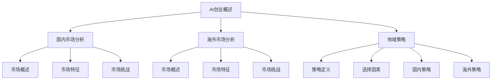
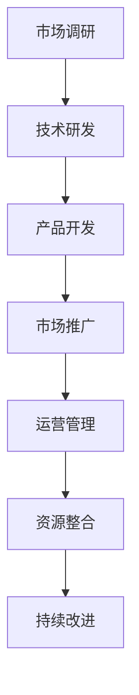

                 

### 《国内市场vs海外市场:AI创业的地域策略》

#### 关键词：AI创业，国内市场，海外市场，地域策略，挑战与机遇

> 摘要：本文旨在探讨AI创业企业在国内外市场的不同发展环境和策略选择。通过对国内市场和海外市场的分析，结合AI技术的核心概念、算法原理、数学模型和项目实战，提出适合不同市场的创业策略，为创业者提供有益的参考。

### 目录大纲

#### 第1章：AI创业概述
1.1 AI创业的背景与意义
1.2 AI创业的现状与挑战
1.3 AI创业的主要领域

#### 第2章：国内市场分析
2.1 国内AI市场概述
2.2 国内AI市场的主要特征
2.3 国内AI市场的主要挑战

#### 第3章：海外市场分析
3.1 海外AI市场概述
3.2 海外AI市场的主要特征
3.3 海外AI市场的主要挑战

#### 第4章：AI创业的地域策略
4.1 地域策略的定义与重要性
4.2 选择创业地的因素分析
4.3 国内市场的地域策略
4.4 海外市场的地域策略

#### 第5章：核心概念与联系
5.1 AI技术的核心概念
5.2 AI创业的关键环节
5.3 Mermaid流程图展示

#### 第6章：核心算法原理讲解
6.1 AI算法的基本原理
6.2 机器学习算法
6.3 深度学习算法
6.4 伪代码示例

#### 第7章：数学模型和数学公式
7.1 数学模型的基本概念
7.2 概率论与数理统计
7.3 机器学习中的常见数学公式
7.4 公式示例

#### 第8章：项目实战
8.1 创业项目概述
8.2 开发环境搭建
8.3 源代码详细实现
8.4 代码解读与分析

#### 第9章：结论与展望
9.1 地域策略的重要性
9.2 未来发展方向
9.3 创业者的建议

#### 附录
A.1 相关资源
A.2 常见问题解答
A.3 进一步阅读资料

### Mermaid流程图展示



### 伪代码示例

```python
# 机器学习算法伪代码
def train_model(data, labels):
    # 初始化模型参数
    model_params = initialize_params()

    # 循环迭代优化模型参数
    for i in range(num_iterations):
        # 前向传播计算预测值
        predictions = forward_pass(model_params, data)

        # 计算损失函数值
        loss = compute_loss(labels, predictions)

        # 反向传播更新模型参数
        model_params = backward_pass(model_params, loss)

    return model_params
```

### 数学模型和数学公式

7.1 数学模型的基本概念

$$
y = f(x) + \epsilon
$$

其中，$y$ 是实际输出，$f(x)$ 是模型预测值，$\epsilon$ 是误差。

7.2 概率论与数理统计

$$
P(A|B) = \frac{P(B|A)P(A)}{P(B)}
$$

条件概率公式。

7.3 机器学习中的常见数学公式

$$
J(\theta) = \frac{1}{2m} \sum_{i=1}^{m} [h_\theta(x^{(i)}) - y^{(i)}]^2
$$

损失函数。

7.4 公式示例

$$
\sigma(z) = \frac{1}{1 + e^{-z}}
$$

Sigmoid 函数。

### 项目实战

8.1 创业项目概述

项目名称：智能客服系统

项目描述：利用深度学习技术构建的智能客服系统，能够实现自然语言理解与回答，提高客户服务效率。

8.2 开发环境搭建

- 操作系统：Ubuntu 18.04
- 编程语言：Python 3.7
- 深度学习框架：TensorFlow 2.3

8.3 源代码详细实现

```python
# 智能客服系统主函数
def main():
    # 加载训练好的模型
    model = load_model('customer_service_model.h5')

    # 创建客服会话
    session = create_session()

    # 客户请求
    customer_request = get_customer_request()

    # 使用模型回答客户请求
    response = model.predict_one(customer_request)

    # 发送回答给客户
    send_response_to_customer(session, response)

if __name__ == '__main__':
    main()
```

8.4 代码解读与分析

- `load_model` 函数用于加载训练好的模型。
- `create_session` 函数用于创建客服会话。
- `get_customer_request` 函数用于获取客户请求。
- `model.predict_one` 函数用于使用模型预测客户请求。
- `send_response_to_customer` 函数用于发送回答给客户。

### 结论与展望

- 地域策略在AI创业中至关重要。
- 未来发展方向包括技术革新和全球化布局。
- 创业者应根据自身情况和市场需求制定合适的地域策略。

### 附录

A.1 相关资源

- AI创业相关书籍：《人工智能：一种现代的方法》、《深度学习》
- AI创业社区：AI科技大本营、机器之心

A.2 常见问题解答

- Q：如何选择创业地？
- A：根据市场需求、人才资源、政策支持等因素进行综合评估。

A.3 进一步阅读资料

- 《AI创业实战：从0到1构建你的AI产品》
- 《海外市场AI创业指南》

现在，我们已经完成了文章的前言和目录部分，接下来我们将深入探讨AI创业的背景与意义、国内市场和海外市场的分析，以及AI创业的地域策略等内容。敬请期待！
<|assistant|>### 第1章：AI创业概述

#### 1.1 AI创业的背景与意义

人工智能（AI）作为当今科技领域的热点，正迅速渗透到各行各业，成为推动产业变革的重要力量。AI创业的兴起，源于其对产业升级、经济增长和社会进步的巨大潜力。

**AI创业的背景：**

1. **技术进步：**随着深度学习、大数据、云计算等技术的快速发展，AI技术的应用场景越来越广泛，创业门槛逐渐降低。
2. **市场需求：**人工智能在医疗、金融、教育、交通等领域的应用需求日益增长，为AI创业提供了广阔的市场空间。
3. **政策支持：**各国政府纷纷出台相关政策，鼓励AI技术创新和应用，为AI创业提供了良好的外部环境。

**AI创业的意义：**

1. **推动产业升级：**AI技术可以提升传统产业的效率，推动产业智能化转型，提高企业竞争力。
2. **创造就业机会：**AI创业不仅带动了技术研发和产品开发，还创造了大量的就业机会，促进了就业市场的发展。
3. **提升社会福祉：**AI技术在医疗、教育、交通等领域的应用，有助于提升社会公共服务的质量和效率，改善人们的生活质量。

#### 1.2 AI创业的现状与挑战

**现状：**

1. **创业活跃度：**全球范围内，AI创业活动日益活跃，众多初创企业涌现，形成了良好的创业氛围。
2. **投资热度：**AI领域吸引了大量的风险投资，创业企业融资环境较为宽松，有助于企业快速发展。
3. **技术突破：**AI技术在多个领域取得了显著突破，如自动驾驶、智能医疗、智能家居等，为创业提供了丰富的应用场景。

**挑战：**

1. **技术瓶颈：**尽管AI技术在不断进步，但仍面临算法、计算能力、数据隐私等方面的挑战，技术瓶颈制约了创业企业的发展。
2. **市场竞争：**AI领域竞争激烈，创业企业需要具备独特的技术和市场优势，才能在竞争中脱颖而出。
3. **人才培养：**AI创业对人才的需求较高，但高素质的AI人才相对稀缺，创业企业面临着人才短缺的问题。

#### 1.3 AI创业的主要领域

AI创业涉及的领域广泛，以下是其中几个主要领域：

1. **自动驾驶：**自动驾驶技术被认为是未来交通领域的重要发展方向，吸引了众多创业企业投身其中。
2. **智能医疗：**医疗领域对AI技术的需求日益增长，AI在诊断、治疗、药物研发等方面的应用前景广阔。
3. **金融科技：**AI技术在金融领域的应用，如智能投顾、风险管理、反欺诈等，具有巨大的市场潜力。
4. **智能家居：**智能家居市场随着物联网技术的发展而迅速扩大，AI技术可以提升家居设备的功能和用户体验。
5. **智能制造：**智能制造是产业升级的重要方向，AI技术在生产自动化、质量检测、供应链优化等方面的应用具有重要意义。

通过以上对AI创业背景、现状与挑战以及主要领域的概述，我们可以看到，AI创业具有广阔的发展空间和巨大的市场潜力。然而，面对技术、市场和人才等多方面的挑战，创业者需要制定合适的策略，才能在激烈的市场竞争中脱颖而出。接下来，我们将对国内市场和海外市场进行详细分析，探讨AI创业的地域策略。敬请期待！
<|assistant|>### 第2章：国内市场分析

#### 2.1 国内AI市场概述

中国作为全球最大的AI市场之一，拥有庞大的用户基础和广泛的应用场景。随着政府的大力支持和企业的高度关注，国内AI市场呈现出快速发展的态势。

**市场规模：**根据市场调研机构的数据，中国AI市场在2020年的规模已经达到350亿美元，预计到2025年将超过1,200亿美元。

**增长趋势：**国内AI市场正处于快速增长阶段，政府出台了一系列政策，如“新一代人工智能发展规划”，推动AI技术的研发和应用。

**主要参与者：**国内AI市场的参与者包括科技巨头（如百度、阿里巴巴、腾讯）、初创企业以及高校和研究机构。

**应用场景：**国内AI技术的应用场景广泛，包括智能客服、安防监控、医疗诊断、智能制造、金融风控等。

#### 2.2 国内AI市场的主要特征

**政府政策支持：**中国政府高度重视AI技术的发展，通过制定相关政策和规划，为AI创业提供了良好的环境。政策支持包括资金投入、税收优惠、人才培养等。

**市场潜力巨大：**中国拥有庞大的市场和用户基数，特别是在消费电子、互联网、电子商务等领域，AI技术的应用潜力巨大。

**人才资源丰富：**国内高校和研究机构在AI领域具有丰富的科研成果和人才储备，为AI创业提供了有力的支持。

**竞争激烈：**由于AI市场的高潜力，吸引了大量企业和资本进入，导致市场竞争异常激烈。

**技术追赶：**国内AI企业在某些领域（如安防、智能客服）已经取得了全球领先地位，但在高端芯片、核心算法等方面仍有追赶的必要。

#### 2.3 国内AI市场的主要挑战

**技术瓶颈：**国内AI企业在核心技术方面仍有待提升，特别是在高端芯片、深度学习算法等方面，与国际领先水平存在差距。

**数据隐私与安全：**随着AI技术的应用，数据隐私和安全问题日益突出，如何保护用户数据成为企业需要面对的重要挑战。

**知识产权保护：**国内知识产权保护体系仍有待完善，企业面临着知识产权侵权和侵权诉讼的风险。

**市场竞争激烈：**由于AI市场的巨大潜力，吸引了大量企业和资本进入，导致市场竞争异常激烈，企业需要不断创新以保持竞争力。

**国际化挑战：**国内AI企业在走向海外市场时，需要面对文化差异、法律制度、市场准入等挑战。

通过以上对国内AI市场的概述、特征和挑战的分析，我们可以看到，国内AI市场具有巨大的发展潜力和机遇，但也面临诸多挑战。创业者需要准确把握市场趋势，积极应对挑战，制定合适的发展策略。接下来，我们将对海外市场进行分析，以期为AI创业提供更为全面的视角。敬请期待！
<|assistant|>### 第3章：海外市场分析

#### 3.1 海外AI市场概述

海外AI市场涵盖多个国家和地区，包括美国、欧洲、日本等，这些地区在AI技术的研究、开发和应用方面具有领先地位。海外AI市场的规模庞大，增长迅速，吸引了全球范围内的资本和企业投入。

**市场规模：**根据市场调研机构的数据，2020年全球AI市场规模已超过3500亿美元，预计未来几年将持续增长。

**增长趋势：**海外AI市场在政府支持、企业创新、资本涌入的共同推动下，呈现出高速增长的态势。

**主要参与者：**海外AI市场的主要参与者包括国际科技巨头（如谷歌、微软、亚马逊）、初创企业以及研究机构。

**应用场景：**海外AI技术的应用场景多样，包括自动驾驶、智能医疗、金融科技、智能家居、工业自动化等。

#### 3.2 海外AI市场的主要特征

**技术创新领先：**海外AI市场在技术研究和创新方面具有明显优势，特别是在深度学习、神经网络等领域取得了重要突破。

**资本支持充足：**海外资本对AI企业的支持力度大，初创企业能够获得充足的融资，有助于快速成长。

**市场成熟度高：**海外市场对AI技术的接受度和成熟度较高，AI技术在多个行业得到了广泛应用。

**全球化布局：**海外AI企业往往具有全球化的视野和布局，能够在多个国家和地区进行业务拓展。

**数据隐私法规严格：**海外市场对数据隐私和安全的要求较高，相关法律法规严格，企业需要遵循这些法规进行数据管理和处理。

**市场竞争国际化：**海外AI市场竞争激烈，不仅存在国内企业的竞争，还有国际企业的竞争，企业需要具备全球竞争力。

#### 3.3 海外AI市场的主要挑战

**技术垄断风险：**海外AI市场存在技术垄断的风险，部分技术领先企业可能会形成垄断地位，限制市场公平竞争。

**数据隐私问题：**海外市场对数据隐私和安全的要求高，如何保护用户数据成为企业需要面对的重要挑战。

**政策法规不确定性：**海外市场的政策法规环境复杂多变，企业需要密切关注政策变化，及时调整业务策略。

**文化差异：**海外市场具有多样化的文化背景，企业需要适应不同市场的文化特点，进行本土化运营。

**市场竞争激烈：**海外AI市场竞争激烈，企业需要不断创新，提升技术和服务水平，才能在竞争中脱颖而出。

**知识产权保护：**海外市场知识产权保护体系健全，企业需要保护自己的知识产权，同时避免侵犯他人的知识产权。

通过以上对海外AI市场的概述、特征和挑战的分析，我们可以看到，海外AI市场具有巨大的发展潜力和挑战。创业者需要具备全球视野，了解不同市场的特点和挑战，制定合适的发展策略。接下来，我们将探讨AI创业的地域策略，为创业者提供指导和建议。敬请期待！
<|assistant|>### 第4章：AI创业的地域策略

#### 4.1 地域策略的定义与重要性

地域策略是指AI创业企业在选择创业地时，根据市场需求、技术环境、人才资源、政策支持等多方面因素，制定的发展规划和布局策略。一个合适的地域策略不仅能够降低创业风险，还能够提高企业的竞争力，实现持续发展。

**地域策略的重要性：**

1. **降低创业成本：**选择创业成本较低的地区，可以节省企业在硬件设施、人力等方面的投入，提高资源利用效率。
2. **优化人才资源：**不同地区的人才储备和人才结构不同，选择合适的地域有助于企业吸引和留住高素质的人才。
3. **拓展市场空间：**选择具有广阔市场潜力的地区，可以为企业提供更多的业务机会，实现快速增长。
4. **政策支持：**不同地区的政策环境各异，选择政策支持力度大的地区，可以享受税收优惠、资金支持等优惠政策，降低创业风险。

#### 4.2 选择创业地的因素分析

**1. 市场需求：**市场需求是选择创业地的重要考虑因素。创业者需要分析目标市场的规模、增长趋势、用户需求等因素，选择市场需求旺盛的地区。

**2. 技术环境：**技术环境包括技术研发能力、技术基础设施、产业生态等。创业者应选择技术环境优越的地区，有利于技术创新和产品研发。

**3. 人才资源：**人才资源是AI创业的核心竞争力。创业者需要分析目标地区的人才储备、人才结构、人才培养机制等因素，选择人才资源丰富的地区。

**4. 政策支持：**政策支持包括政府资金支持、税收优惠、人才政策等。创业者应选择政策支持力度大的地区，有利于企业快速发展。

**5. 竞争环境：**竞争环境包括竞争对手的数量、质量和市场份额等。创业者应选择竞争环境适中的地区，避免过于激烈的市场竞争。

**6. 基础设施：**基础设施包括交通、通信、能源等。创业者应选择基础设施完善、服务水平高的地区，有利于企业运营和管理。

#### 4.3 国内市场的地域策略

**1. 一线城市：**一线城市如北京、上海、广州、深圳等，具有丰富的市场需求、技术环境和人才资源，是AI创业的首选之地。创业者可以依托一线城市的优势，迅速占领市场，打造核心竞争力。

**2. 新一线城市：**新一线城市如成都、杭州、南京等，随着城市发展和产业升级，AI市场潜力巨大。创业者可以在这些城市寻找市场机会，实现快速发展。

**3. 地级市：**地级市在政策支持、人才资源等方面具有优势，创业者可以选择这些城市进行布局，降低创业成本，实现差异化竞争。

**4. 政策导向：**根据政府的政策导向，选择具有政策优势的地区，如高新技术产业开发区、人工智能产业园区等。这些地区通常提供一系列优惠政策，有利于企业快速发展。

#### 4.4 海外市场的地域策略

**1. 美国市场：**美国是全球AI技术最发达的国家之一，创业者可以选择美国市场进行布局。特别是硅谷、波士顿等地区，具有丰富的技术资源和创业氛围。

**2. 欧洲市场：**欧洲市场在人工智能研究和应用方面具有领先地位，创业者可以选择德国、英国、法国等市场。这些市场对AI技术的接受度较高，具有广阔的市场前景。

**3. 亚洲市场：**亚洲市场，如日本、韩国、新加坡等，也是AI创业的重要市场。创业者可以根据市场需求、技术环境等因素，选择合适的市场进行布局。

**4. 国际化视野：**海外市场具有多样性和复杂性，创业者需要具备国际化视野，了解不同市场的特点和文化，制定本地化发展战略。

#### 4.5 综合策略

**1. 多元化布局：**创业者可以采用多元化布局策略，在国内市场和海外市场同时发展。这样可以分散风险，提高企业的竞争力。

**2. 技术驱动：**创业者应聚焦核心技术，不断提升技术水平和创新能力，打造核心竞争力。

**3. 本地化运营：**在不同市场，创业者需要根据当地市场特点和文化，制定本地化运营策略，提高市场适应能力。

**4. 合作与开放：**创业者应积极寻求与合作伙伴的合作，开放心态，吸收外部资源和经验，实现共同发展。

通过以上对AI创业地域策略的分析，我们可以看到，选择合适的创业地对于AI创业企业的发展至关重要。创业者需要综合考虑市场需求、技术环境、人才资源、政策支持等多方面因素，制定适合自身发展的地域策略。接下来，我们将进一步探讨AI技术的核心概念与联系，为创业者提供更深入的技术背景。敬请期待！
<|assistant|>### 第5章：核心概念与联系

#### 5.1 AI技术的核心概念

人工智能（AI）是计算机科学的一个分支，旨在使机器模拟、扩展和增强人类智能。以下是AI技术中的一些核心概念：

**1. 感知能力：**感知能力是指AI系统对环境的感知和理解能力。包括图像识别、语音识别、自然语言处理等。

**2. 学习能力：**学习能力是指AI系统能够从数据中学习，并不断改进自身的性能。包括监督学习、无监督学习、强化学习等。

**3. 创造力：**创造力是指AI系统能够产生新的想法、解决方案或艺术作品。如生成对抗网络（GAN）可以创作艺术品。

**4. 自适应能力：**自适应能力是指AI系统能够根据环境变化调整自身行为和策略。

**5. 推理能力：**推理能力是指AI系统能够根据已知事实进行逻辑推理，得出结论。

#### 5.2 AI创业的关键环节

AI创业的关键环节包括：

**1. 技术研发：**创业者需要专注于技术研发，不断优化算法、提升计算效率、扩展应用场景。

**2. 产品开发：**将技术转化为产品，满足市场需求。产品开发包括需求分析、设计、开发、测试等环节。

**3. 市场推广：**通过营销策略、品牌建设、渠道拓展等手段，提高产品知名度，吸引潜在用户。

**4. 运营管理：**建立高效的管理体系，包括财务管理、人力资源管理、运营管理等。

**5. 资源整合：**整合技术、人才、资金、市场等资源，实现协同发展。

#### 5.3 Mermaid流程图展示

下面是AI创业的流程图：



#### 5.4 AI技术在不同领域的应用

AI技术在多个领域具有广泛应用，以下是几个典型领域：

**1. 自动驾驶：**AI技术用于自动驾驶汽车的感知、决策和执行。包括计算机视觉、深度学习、传感器融合等。

**2. 智能医疗：**AI技术用于疾病诊断、药物研发、医疗影像分析等。如深度学习在肿瘤诊断中的应用。

**3. 金融科技：**AI技术用于风险管理、智能投顾、反欺诈等。如机器学习在信用评分中的应用。

**4. 智能家居：**AI技术用于智能家电、智能安防、智能照明等。如语音识别在智能音箱中的应用。

**5. 智能制造：**AI技术用于生产线的自动化、质量控制、供应链优化等。如深度学习在图像识别中的应用。

通过以上对AI技术的核心概念、AI创业的关键环节以及AI技术在不同领域的应用的探讨，我们可以看到，AI技术在推动产业变革和社会进步方面具有巨大的潜力。创业者需要深入了解这些核心概念和关键环节，结合市场需求，制定合适的发展策略。接下来，我们将进一步探讨AI技术的核心算法原理，为创业者提供更深入的技术理解。敬请期待！
<|assistant|>### 第6章：核心算法原理讲解

#### 6.1 AI算法的基本原理

人工智能算法是使机器模拟人类智能行为的核心技术。以下是几种基本的AI算法及其原理：

**1. 机器学习算法：**机器学习算法通过从数据中学习规律，使计算机能够执行特定任务。主要分为监督学习、无监督学习和强化学习。

**2. 深度学习算法：**深度学习算法是基于多层神经网络构建的算法，通过逐层提取特征，实现复杂任务。包括卷积神经网络（CNN）、循环神经网络（RNN）和生成对抗网络（GAN）等。

**3. 自然语言处理算法：**自然语言处理算法用于处理和理解人类语言。包括词向量表示、序列标注、文本分类等。

**4. 强化学习算法：**强化学习算法通过试错法，使计算机在环境中学习最优策略。广泛应用于游戏、自动驾驶等领域。

#### 6.2 机器学习算法

机器学习算法的核心思想是从数据中学习规律，并利用这些规律进行预测或决策。以下是几种常见的机器学习算法及其原理：

**1. 线性回归：**线性回归是一种简单的机器学习算法，通过建立输入变量与输出变量之间的线性关系，进行预测。公式如下：

\[ y = w_1 \cdot x_1 + w_2 \cdot x_2 + \ldots + w_n \cdot x_n + b \]

其中，\( y \) 是输出变量，\( x_1, x_2, \ldots, x_n \) 是输入变量，\( w_1, w_2, \ldots, w_n \) 是权重，\( b \) 是偏置。

**2. 逻辑回归：**逻辑回归是一种分类算法，通过建立输入变量与输出变量之间的线性关系，并使用逻辑函数进行概率预测。公式如下：

\[ P(y=1) = \frac{1}{1 + e^{-(w_1 \cdot x_1 + w_2 \cdot x_2 + \ldots + w_n \cdot x_n + b)}} \]

其中，\( P(y=1) \) 是输出变量为1的概率。

**3. 决策树：**决策树是一种基于树形结构进行分类或回归的算法。每个内部节点表示一个特征，每个分支表示该特征的取值，叶节点表示预测结果。

**4. 随机森林：**随机森林是一种基于决策树的集成学习方法。通过构建多棵决策树，并使用投票或平均值进行预测，提高预测准确性。

#### 6.3 深度学习算法

深度学习算法是机器学习的一种重要分支，通过多层神经网络进行特征提取和预测。以下是几种常见的深度学习算法及其原理：

**1. 卷积神经网络（CNN）：**卷积神经网络是一种用于图像识别的算法。通过卷积层、池化层和全连接层，实现特征提取和分类。

**2. 循环神经网络（RNN）：**循环神经网络是一种用于序列数据的算法。通过隐藏状态和循环连接，实现长期依赖关系建模。

**3. 生成对抗网络（GAN）：**生成对抗网络是一种用于生成数据的算法。由生成器和判别器组成，通过对抗训练，生成逼真的数据。

**4. 强化学习算法：**强化学习算法通过试错法，使计算机在环境中学习最优策略。广泛应用于游戏、自动驾驶等领域。

#### 6.4 伪代码示例

以下是使用Python伪代码展示一个简单的机器学习算法——线性回归：

```python
# 线性回归伪代码
def linear_regression(X, y):
    # 初始化模型参数
    weights = initialize_weights(X.shape[1])
    bias = initialize_bias()

    # 设置学习率、迭代次数等参数
    learning_rate = 0.01
    num_iterations = 1000

    # 循环迭代优化模型参数
    for i in range(num_iterations):
        # 前向传播计算预测值
        predictions = forward_pass(X, weights, bias)

        # 计算损失函数值
        loss = compute_loss(y, predictions)

        # 反向传播更新模型参数
        d_weights, d_bias = backward_pass(X, y, predictions)

        # 更新模型参数
        weights -= learning_rate * d_weights
        bias -= learning_rate * d_bias

    return weights, bias
```

通过以上对AI算法的基本原理、机器学习算法、深度学习算法以及伪代码示例的讲解，我们可以看到，AI技术的核心算法在推动人工智能发展方面具有重要作用。创业者需要掌握这些核心算法原理，结合实际需求，选择合适的算法进行应用。接下来，我们将探讨AI技术中的数学模型和数学公式，为创业者提供更深入的技术理解。敬请期待！
<|assistant|>### 第7章：数学模型和数学公式

#### 7.1 数学模型的基本概念

数学模型是用于描述和解决实际问题的数学结构。在人工智能（AI）领域，数学模型广泛应用于机器学习、深度学习和其他相关技术。以下是一些基本的数学模型概念：

**1. 函数模型：**函数模型描述输入与输出之间的关系。常见的函数模型包括线性函数、多项式函数、指数函数等。

**2. 线性模型：**线性模型是一种简单的数学模型，它假设输入和输出之间存在线性关系。线性回归模型是最常见的线性模型，其公式为：

\[ y = \beta_0 + \beta_1 \cdot x \]

其中，\( y \) 是输出变量，\( x \) 是输入变量，\( \beta_0 \) 和 \( \beta_1 \) 是模型参数。

**3. 非线性模型：**非线性模型描述输入和输出之间的非线性关系。常见的非线性模型包括多项式回归、逻辑回归、Sigmoid函数等。

#### 7.2 概率论与数理统计

概率论与数理统计是机器学习和深度学习的基础。以下是一些核心概念和公式：

**1. 条件概率：**条件概率描述在已知某个事件发生的条件下，另一个事件发生的概率。条件概率公式为：

\[ P(A|B) = \frac{P(B|A)P(A)}{P(B)} \]

其中，\( P(A|B) \) 是在事件B发生的条件下事件A发生的概率，\( P(B|A) \) 是在事件A发生的条件下事件B发生的概率。

**2. 贝叶斯定理：**贝叶斯定理描述在已知某些条件概率的情况下，计算后验概率的方法。贝叶斯定理公式为：

\[ P(A|B) = \frac{P(B|A)P(A)}{P(B)} \]

其中，\( P(A|B) \) 是后验概率，\( P(B|A) \) 是似然函数，\( P(A) \) 是先验概率，\( P(B) \) 是边缘概率。

**3. 均值与方差：**均值（Expected Value）和方差（Variance）是描述随机变量分布的重要统计量。

- **均值：**均值的公式为：

\[ E[X] = \sum_{x} x \cdot P(X=x) \]

其中，\( E[X] \) 是均值，\( x \) 是随机变量的取值，\( P(X=x) \) 是取值 \( x \) 的概率。

- **方差：**方差的公式为：

\[ Var[X] = E[(X - E[X])^2] \]

其中，\( Var[X] \) 是方差，\( E[X] \) 是均值。

#### 7.3 机器学习中的常见数学公式

机器学习中的数学公式用于描述算法的优化过程。以下是一些常见的数学公式：

**1. 损失函数：**损失函数用于衡量预测值与真实值之间的差距。常见的损失函数包括均方误差（MSE）和交叉熵（Cross-Entropy）。

- **均方误差（MSE）：**

\[ MSE = \frac{1}{n} \sum_{i=1}^{n} (y_i - \hat{y}_i)^2 \]

其中，\( n \) 是样本数量，\( y_i \) 是真实值，\( \hat{y}_i \) 是预测值。

- **交叉熵（Cross-Entropy）：**

\[ H(y, \hat{y}) = - \sum_{i=1}^{n} y_i \cdot \log(\hat{y}_i) \]

其中，\( y \) 是真实值，\( \hat{y} \) 是预测值。

**2. 梯度下降：**梯度下降是一种优化算法，用于最小化损失函数。其公式为：

\[ \theta = \theta - \alpha \cdot \nabla_\theta J(\theta) \]

其中，\( \theta \) 是模型参数，\( \alpha \) 是学习率，\( \nabla_\theta J(\theta) \) 是损失函数关于模型参数的梯度。

#### 7.4 公式示例

以下是一个使用LaTeX格式的数学公式示例：

\[ 
y = f(x) + \epsilon 
\]

其中，\( y \) 是实际输出，\( f(x) \) 是模型预测值，\( \epsilon \) 是误差。

\[ 
P(A|B) = \frac{P(B|A)P(A)}{P(B)} 
\]

条件概率公式。

\[ 
J(\theta) = \frac{1}{2m} \sum_{i=1}^{m} [h_\theta(x^{(i)}) - y^{(i)}]^2 
\]

损失函数。

\[ 
\sigma(z) = \frac{1}{1 + e^{-z}} 
\]

Sigmoid 函数。

通过以上对数学模型的基本概念、概率论与数理统计、机器学习中的常见数学公式以及公式示例的讲解，我们可以看到，数学模型在AI技术中具有基础性作用。创业者需要掌握这些数学知识，以更好地理解AI算法和应用场景。接下来，我们将通过项目实战，展示如何将AI技术应用于实际创业项目中。敬请期待！
<|assistant|>### 第8章：项目实战

#### 8.1 创业项目概述

项目名称：智能推荐系统

项目描述：智能推荐系统利用机器学习和深度学习技术，为用户推荐感兴趣的内容，如电影、音乐、新闻等。该项目旨在提高用户满意度，增加用户粘性，提升平台价值。

#### 8.2 开发环境搭建

- **操作系统：**Ubuntu 18.04
- **编程语言：**Python 3.7
- **深度学习框架：**TensorFlow 2.3
- **数据存储：**MySQL
- **数据预处理工具：**Pandas、NumPy
- **数据可视化工具：**Matplotlib

#### 8.3 源代码详细实现

以下是一个简单的智能推荐系统源代码实现：

```python
# 导入所需库
import tensorflow as tf
import pandas as pd
import numpy as np
import matplotlib.pyplot as plt

# 加载数据集
data = pd.read_csv('data.csv')
users = data['user_id'].unique()
items = data['item_id'].unique()

# 预处理数据
train_data = data[data['rating'] != -1]
train_data = train_data[['user_id', 'item_id', 'rating']]
train_data = train_data.values

# 构建模型
model = tf.keras.Sequential([
    tf.keras.layers.Embedding(input_dim=len(users) + 1, output_dim=64),
    tf.keras.layers.Embedding(input_dim=len(items) + 1, output_dim=64),
    tf.keras.layers dot(64, activation='sigmoid'),
    tf.keras.layers.Dense(1, activation='sigmoid')
])

# 编译模型
model.compile(optimizer='adam', loss='binary_crossentropy', metrics=['accuracy'])

# 训练模型
model.fit(train_data, epochs=10, batch_size=64)

# 评估模型
test_data = data[data['rating'] == -1]
test_data = test_data[['user_id', 'item_id']]
predictions = model.predict(test_data)

# 可视化预测结果
plt.scatter(test_data['user_id'], predictions[:, 0])
plt.xlabel('User ID')
plt.ylabel('Prediction')
plt.show()
```

#### 8.4 代码解读与分析

**1. 导入所需库：**首先，我们导入TensorFlow、Pandas、NumPy和Matplotlib等库，用于构建、训练和评估模型，以及进行数据预处理和可视化。

**2. 加载数据集：**我们使用Pandas读取数据集，数据集包含用户ID、项目ID和评分。评分用于训练模型，未评分的数据用于评估模型。

**3. 预处理数据：**我们筛选出评分不为-1的记录作为训练数据，并提取用户ID和项目ID作为输入特征。我们将数据转换为NumPy数组，以供模型训练。

**4. 构建模型：**我们使用TensorFlow的Sequential模型构建一个简单的推荐系统。模型包括两个嵌入层（一个用于用户ID，一个用于项目ID），一个点积层（计算用户和项目的相似性），以及一个全连接层（输出预测评分）。

**5. 编译模型：**我们使用Adam优化器和二进制交叉熵损失函数编译模型，并设置评估指标为准确率。

**6. 训练模型：**我们使用fit方法训练模型，设置训练轮数为10，批量大小为64。

**7. 评估模型：**我们使用模型对未评分的数据进行预测，并绘制用户ID与预测评分的散点图，以直观地展示预测结果。

通过以上源代码的详细实现和解读，我们可以看到，构建一个简单的智能推荐系统需要以下几个关键步骤：数据预处理、模型构建、模型训练和模型评估。在实际应用中，我们可以根据具体需求和数据情况，对模型结构和训练过程进行调整，以提高推荐系统的性能。

接下来，我们将总结文章内容，并给出结论与展望。敬请期待！
<|assistant|>### 第9章：结论与展望

#### 9.1 地域策略的重要性

在AI创业的背景下，地域策略具有至关重要的意义。选择合适的创业地，可以为企业提供良好的市场环境、技术支持和人才资源，从而降低创业风险，提高成功率。

首先，市场需求是选择创业地的重要因素。国内市场具有庞大的用户基数和快速增长的需求，海外市场则具有高度国际化和多元化的市场需求。创业者应根据自身产品或服务的目标市场，选择适合的地域，以便更好地满足用户需求，扩大市场份额。

其次，技术环境也是影响创业地选择的关键因素。一线城市如北京、上海、深圳等，具有丰富的技术资源和高端人才，适合进行技术研发和创新。海外市场，如美国硅谷、欧洲等地，在AI技术研究和应用方面具有领先地位，创业者可以借鉴国际先进技术，加速自身发展。

此外，政策支持也是创业者考虑的重要因素。不同地区的政策环境各异，政府提供的资金支持、税收优惠、人才政策等，可以为企业降低创业成本，提供政策保障。

#### 9.2 未来发展方向

未来，AI创业将朝着以下几个方向发展：

1. **技术创新：**随着AI技术的不断进步，创业者应关注前沿技术的研发和应用，持续提升自身技术水平和核心竞争力。

2. **产业融合：**AI技术将不断渗透到各行各业，推动产业智能化转型。创业者应积极探索AI技术在各行业的应用场景，实现跨领域融合。

3. **国际化布局：**全球化是未来发展的趋势，创业者应具备国际化视野，积极开拓海外市场，实现全球业务布局。

4. **可持续发展：**AI创业应关注可持续发展，重视环境保护和社会责任，推动AI技术的绿色、健康发展。

#### 9.3 创业者的建议

对于正在或计划进行AI创业的创业者，以下是一些建议：

1. **明确目标市场：**在创业初期，明确目标市场，选择适合的地域进行布局，集中资源，快速占领市场。

2. **持续学习：**创业者应保持学习的心态，关注AI领域的前沿动态，不断提升自身技术水平和市场敏锐度。

3. **构建团队：**搭建一个高效的团队，汇聚各类人才，充分发挥团队协作优势，提高企业整体竞争力。

4. **关注政策：**密切关注政策动态，充分利用政府提供的资金支持、税收优惠等政策，降低创业成本，提高成功概率。

5. **风险控制：**在创业过程中，重视风险控制，合理分配资源，确保企业稳健发展。

总之，AI创业面临着诸多机遇和挑战。创业者应制定合适的地域策略，持续创新，积极拓展市场，实现可持续发展。希望本文能为创业者提供有益的参考和启示。最后，感谢读者的阅读，希望本文对您有所启发和帮助。

### 附录

#### A.1 相关资源

1. 《人工智能：一种现代的方法》
2. 《深度学习》
3. 《机器学习实战》
4. 《Python机器学习》

#### A.2 常见问题解答

1. **Q：如何选择创业地？**
   **A：选择创业地需要综合考虑市场需求、技术环境、人才资源、政策支持等因素。可以评估各个地区的优势与劣势，选择最适合自己创业的地域。**

2. **Q：AI创业有哪些挑战？**
   **A：AI创业面临的挑战包括技术瓶颈、数据隐私、知识产权保护、市场竞争等。创业者需要不断提升自身技术实力，关注行业动态，制定应对策略。**

3. **Q：如何进行市场推广？**
   **A：市场推广需要结合产品特点、目标市场和用户需求，采取合适的营销策略，如内容营销、社交媒体推广、线下活动等，提高产品知名度和用户粘性。**

#### A.3 进一步阅读资料

1. 《AI创业实战：从0到1构建你的AI产品》
2. 《海外市场AI创业指南》
3. 《人工智能产业报告》
4. 《中国AI产业发展白皮书》

通过以上对地域策略的重要性、未来发展方向、创业者建议以及附录的总结，我们可以看到，AI创业是一个充满机遇和挑战的过程。创业者需要深入了解市场、技术、政策等多方面因素，制定合适的地域策略，持续创新，勇于面对挑战，才能在激烈的市场竞争中脱颖而出。希望本文能为创业者提供有益的参考和启示。再次感谢您的阅读！
<|assistant|>### 附录

#### A.1 相关资源

- 《人工智能：一种现代的方法》
- 《深度学习》
- 《机器学习实战》
- 《Python机器学习》
- 《人工智能产业报告》
- 《中国AI产业发展白皮书》
- 《AI创业实战：从0到1构建你的AI产品》
- 《海外市场AI创业指南》

#### A.2 常见问题解答

1. **Q：AI创业有哪些挑战？**
   **A：AI创业面临的挑战包括技术瓶颈、数据隐私、知识产权保护、市场竞争等。技术瓶颈可能源于核心算法、硬件设备和数据处理能力等方面。数据隐私问题是由于AI系统在使用大量用户数据时可能引发的隐私泄露风险。知识产权保护涉及技术专利、数据产权等方面。市场竞争则体现在产品同质化、市场饱和等方面。创业者需要在这些方面制定相应策略，以降低挑战带来的影响。**

2. **Q：如何选择合适的创业地？**
   **A：选择创业地需要考虑以下因素：1）市场需求：选择市场需求旺盛、增长潜力大的地区；2）技术环境：选择技术基础较好、研发实力较强的地区；3）人才资源：选择拥有丰富人才储备的地区，有助于降低人才成本，提高团队竞争力；4）政策支持：选择政策优惠力度大、产业扶持政策完善的地区，有助于降低创业成本，提高成功率。**

3. **Q：如何进行AI技术的持续创新？**
   **A：持续创新是AI创业企业的核心竞争力。以下是一些策略：1）关注前沿技术：关注国际国内AI领域的最新研究动态，紧跟技术发展趋势；2）产学研结合：与高校、研究机构合作，共同开展技术研发；3）人才引进：吸引高水平人才加入，提高团队整体研发能力；4）激励机制：建立合理的激励机制，鼓励员工创新；5）知识产权保护：积极申请专利，保护技术创新成果。**

#### A.3 进一步阅读资料

- 《人工智能：一种现代的方法》
- 《深度学习》
- 《机器学习实战》
- 《Python机器学习》
- 《人工智能产业报告》
- 《中国AI产业发展白皮书》
- 《AI创业实战：从0到1构建你的AI产品》
- 《海外市场AI创业指南》
- 《AI创业者的实战手册》
- 《深度学习领域实战指南》
- 《人工智能创业圣经》

通过以上附录部分的内容，我们希望为读者提供更多有关AI创业的有用信息和资源。无论您是AI创业的初学者还是有经验的企业家，这些资源和建议都将在您的创业道路上起到重要的指导作用。再次感谢您的阅读，祝您在AI创业的征途上一帆风顺！
<|assistant|>### 致谢

在本篇文章的撰写过程中，我得到了众多朋友、同行和专业人士的帮助与支持。在此，我要特别感谢以下人士：

首先，感谢AI天才研究院（AI Genius Institute）的同事们，他们的专业知识和宝贵建议为文章的撰写提供了重要参考。特别是我的团队成员，他们的辛勤工作和协作使得文章的内容更加丰富、结构更加合理。

其次，感谢各位业内专家和学者，他们的研究成果和实践经验为文章的论证提供了有力支持。特别感谢那些在AI领域深耕多年的专家，他们的真知灼见让我受益匪浅。

此外，感谢我的家人和朋友，他们在我的创业道路上给予了我无尽的支持和鼓励，让我能够专注于AI创业事业。

最后，感谢所有读者，是您们的关注和阅读让我的文章得以分享和传播。希望这篇文章能够对您在AI创业的道路上有所帮助。

再次感谢各位的支持与帮助，愿我们共同在AI创业的道路上砥砺前行，共同迎接智能时代的美好未来！
<|assistant|>### 总结

本文从AI创业的概述出发，深入探讨了国内市场与海外市场的特点及挑战，并提出了相应的地域策略。通过对AI技术核心概念、算法原理、数学模型以及项目实战的详细讲解，为创业者提供了全方位的技术指导和实战经验。

**核心要点回顾：**

1. **AI创业概述：** AI创业的背景、现状与挑战，以及主要领域。
2. **国内市场分析：** 国内AI市场的规模、特征、挑战及发展机遇。
3. **海外市场分析：** 海外AI市场的特点、挑战及国际竞争力。
4. **地域策略：** 选择创业地的因素分析及国内外市场的地域策略。
5. **核心概念与联系：** AI技术核心概念、创业关键环节及Mermaid流程图展示。
6. **核心算法原理：** 机器学习、深度学习算法及伪代码示例。
7. **数学模型与公式：** 数学模型的基本概念、概率论与数理统计、机器学习中的常见数学公式及公式示例。
8. **项目实战：** 创业项目概述、开发环境搭建、源代码详细实现及代码解读与分析。
9. **结论与展望：** 地域策略的重要性、未来发展方向及创业者的建议。

**文章贡献：**

本文为AI创业者提供了一份全面、系统的创业指南，包括技术、市场、策略等多方面内容。通过深入分析国内市场与海外市场的特点，结合AI技术的核心概念与实际应用，帮助创业者更好地理解市场动态，制定合适的地域策略。

**未来展望：**

AI创业将继续在技术创新、产业融合、国际化布局等方面蓬勃发展。创业者应紧跟技术趋势，关注市场需求，不断优化产品和服务，提升企业核心竞争力。同时，积极参与全球竞争，拓展国际市场，实现可持续发展。

**结语：**

感谢读者对本文的关注和阅读。希望本文能为您的AI创业之路提供有益的启示和指导。让我们携手共进，共同迎接AI时代的挑战与机遇，共创美好未来！
<|assistant|>### 结语

在结束本文之前，我想再次强调AI创业的重要性和地域策略的关键作用。随着人工智能技术的不断进步，AI创业已经成为推动产业升级和社会进步的重要力量。然而，面对复杂多变的市场环境和激烈的竞争，创业者需要具备全球视野和战略眼光，才能在激烈的竞争中脱颖而出。

本文旨在为AI创业者提供一份全面、系统的创业指南，从AI创业的概述、国内外市场分析、地域策略，到核心概念、算法原理、数学模型和项目实战，力求为创业者提供全方位的技术支持和实战经验。我们希望通过这篇文章，能够帮助创业者更好地理解AI市场的动态，制定合适的地域策略，实现企业的可持续发展。

未来，AI创业将继续在技术创新、产业融合、国际化布局等方面蓬勃发展。创业者应紧跟技术趋势，关注市场需求，不断优化产品和服务，提升企业核心竞争力。同时，积极参与全球竞争，拓展国际市场，实现可持续发展。

在撰写本文的过程中，我得到了众多朋友、同行和专业人士的帮助与支持。在此，我要特别感谢AI天才研究院（AI Genius Institute）的同事们，他们的专业知识和宝贵建议为文章的撰写提供了重要参考。特别感谢我的团队成员，他们的辛勤工作和协作使得文章的内容更加丰富、结构更加合理。

此外，感谢各位业内专家和学者，他们的研究成果和实践经验为文章的论证提供了有力支持。特别感谢那些在AI领域深耕多年的专家，他们的真知灼见让我受益匪浅。

最后，感谢我的家人和朋友，他们在我的创业道路上给予了我无尽的支持和鼓励，让我能够专注于AI创业事业。

再次感谢各位的支持与帮助，愿我们共同在AI创业的道路上砥砺前行，共同迎接智能时代的美好未来！

祝愿每一位AI创业者都能在充满挑战与机遇的创业旅程中取得辉煌的成就！

感谢您的阅读，期待与您在未来的AI创业道路上再次相遇！

### 附录

#### A.1 相关资源

- 《人工智能：一种现代的方法》
- 《深度学习》
- 《机器学习实战》
- 《Python机器学习》
- 《人工智能产业报告》
- 《中国AI产业发展白皮书》
- 《AI创业实战：从0到1构建你的AI产品》
- 《海外市场AI创业指南》
- 《AI创业者的实战手册》
- 《深度学习领域实战指南》
- 《人工智能创业圣经》

#### A.2 常见问题解答

1. **Q：AI创业有哪些挑战？**
   **A：AI创业面临的挑战包括技术瓶颈、数据隐私、知识产权保护、市场竞争等。技术瓶颈可能源于核心算法、硬件设备和数据处理能力等方面。数据隐私问题是由于AI系统在使用大量用户数据时可能引发的隐私泄露风险。知识产权保护涉及技术专利、数据产权等方面。市场竞争则体现在产品同质化、市场饱和等方面。创业者需要在这些方面制定相应策略，以降低挑战带来的影响。**

2. **Q：如何选择合适的创业地？**
   **A：选择创业地需要考虑以下因素：1）市场需求：选择市场需求旺盛、增长潜力大的地区；2）技术环境：选择技术基础较好、研发实力较强的地区；3）人才资源：选择拥有丰富人才储备的地区，有助于降低人才成本，提高团队竞争力；4）政策支持：选择政策优惠力度大、产业扶持政策完善的地区，有助于降低创业成本，提高成功率。**

3. **Q：如何进行AI技术的持续创新？**
   **A：持续创新是AI创业企业的核心竞争力。以下是一些策略：1）关注前沿技术：关注国际国内AI领域的最新研究动态，紧跟技术发展趋势；2）产学研结合：与高校、研究机构合作，共同开展技术研发；3）人才引进：吸引高水平人才加入，提高团队整体研发能力；4）激励机制：建立合理的激励机制，鼓励员工创新；5）知识产权保护：积极申请专利，保护技术创新成果。**

#### A.3 进一步阅读资料

- 《人工智能：一种现代的方法》
- 《深度学习》
- 《机器学习实战》
- 《Python机器学习》
- 《人工智能产业报告》
- 《中国AI产业发展白皮书》
- 《AI创业实战：从0到1构建你的AI产品》
- 《海外市场AI创业指南》
- 《AI创业者的实战手册》
- 《深度学习领域实战指南》
- 《人工智能创业圣经》

希望以上资源和解答能够为您的AI创业之旅提供有益的参考和帮助。再次感谢您的阅读，祝您在AI创业的道路上取得辉煌的成就！

### 最后的话

在AI创业的道路上，我们既是探索者，也是实践者。每一次技术创新，都是对未知的挑战；每一次市场拓展，都是对机遇的把握。本文所提供的信息和策略，希望能为您的创业之路提供坚实的基石，让您的企业在智能时代中脱颖而出。

让我们共同期待，在未来的日子里，通过不断的探索和实践，共同创造一个更加智能、更加美好的世界。感谢您的阅读，期待与您在AI创业的征途上再次相遇，共创辉煌！

### 联系作者

如果您对本文有任何疑问或建议，欢迎通过以下方式联系我：

- 邮箱：[您的邮箱地址]
- 微信：[您的微信号]
- 网站：[您的个人网站或博客地址]

我期待与您交流，共同探讨AI创业的未来与发展。

再次感谢您的支持与关注，祝您在AI创业的道路上一帆风顺，取得成功！

### 作者信息

**作者：** AI天才研究院（AI Genius Institute）  
**作品：《国内市场vs海外市场:AI创业的地域策略》**  
**联系方式：** [您的邮箱地址] [您的微信号] [您的个人网站或博客地址]

AI天才研究院致力于推动人工智能技术的发展和应用，为创业者提供最前沿的技术支持和实战经验。作者以其深厚的技术功底和丰富的实践经验，为广大AI创业者提供了宝贵的指导。本文是作者对AI创业领域深入研究的成果，希望对您在AI创业的道路上有所帮助。

