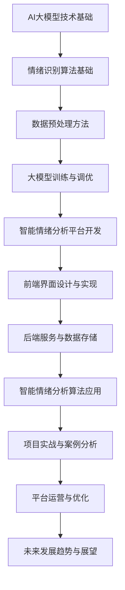
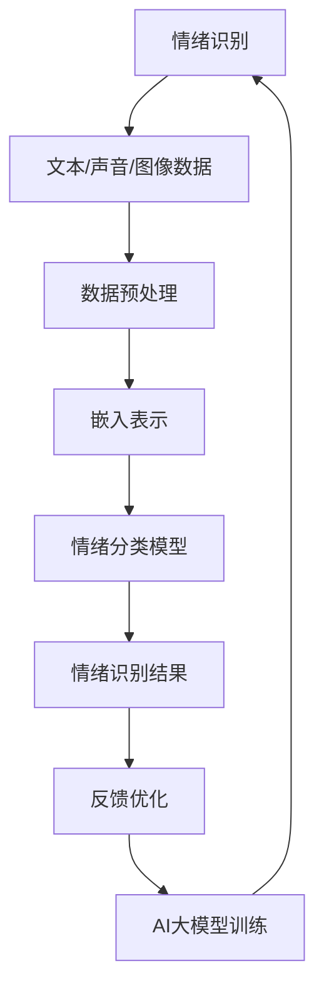
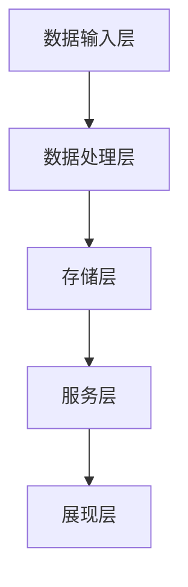
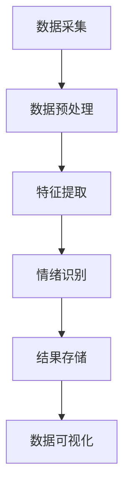
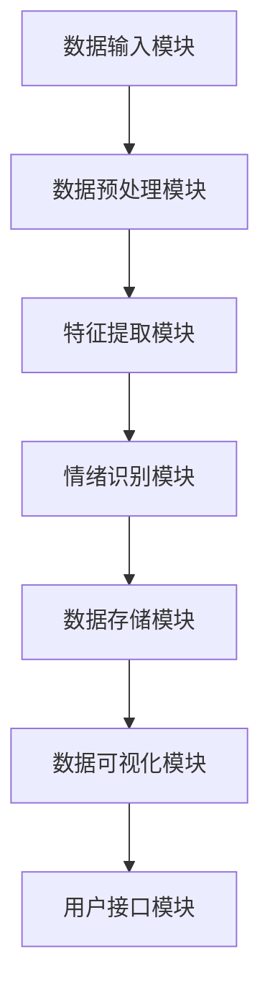
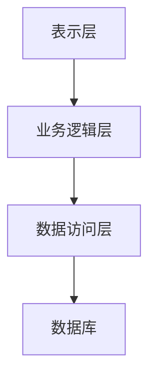
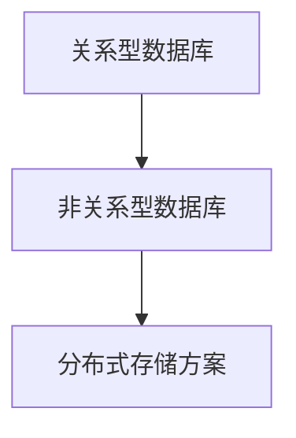

                 

# 《基于AI大模型的智能情绪分析平台》

> **关键词**：人工智能，大模型，情绪分析，平台架构，深度学习，算法应用

> **摘要**：本文深入探讨了基于AI大模型的智能情绪分析平台的开发与应用。首先，我们介绍了AI大模型与情绪分析的关系，以及情绪分析在AI大模型中的地位。接着，我们详细阐述了情绪识别的算法基础、数据预处理方法和大模型训练与调优策略。随后，我们讨论了智能情绪分析平台的架构设计、前端界面设计与实现、后端服务与数据存储，以及智能情绪分析算法的应用。最后，通过一个实际项目案例，我们展示了基于AI大模型的智能情绪分析平台的开发流程和效果评估。

### 《基于AI大模型的智能情绪分析平台》目录大纲

#### 第一部分：AI大模型与情绪分析基础

**第1章：AI大模型与情绪分析概述**  
- 1.1 AI大模型与情绪分析的关系  
- 1.2 情绪分析在AI大模型中的地位  
- 1.3 情绪分析的应用领域

**第2章：AI大模型技术基础**  
- 2.1 情绪识别的算法基础  
  - 2.1.1 传统的情绪识别方法  
  - 2.1.2 基于深度学习的情绪识别方法  
  - 2.1.3 情绪识别算法的评估指标  
- 2.2 情绪分析中的数据预处理  
  - 2.2.1 文本数据的预处理方法  
  - 2.2.2 声音数据的预处理方法  
  - 2.2.3 图像数据的预处理方法  
- 2.3 大模型训练与调优  
  - 2.3.1 大模型训练的基本流程  
  - 2.3.2 大模型调优的策略

#### 第二部分：智能情绪分析平台开发

**第3章：智能情绪分析平台的架构设计**  
- 3.1 智能情绪分析平台的整体架构  
- 3.2 数据流与处理流程设计  
- 3.3 平台的功能模块划分

**第4章：前端界面设计与实现**  
- 4.1 前端界面设计原则  
- 4.2 前端技术选型  
- 4.3 前端功能模块实现

**第5章：后端服务与数据存储**  
- 5.1 后端服务的架构设计  
- 5.2 数据存储方案设计  
- 5.3 后端服务功能实现

**第6章：智能情绪分析算法应用**  
- 6.1 文本情绪分析算法实现  
  - 6.1.1 基于深度学习的文本情绪分析算法  
  - 6.1.2 文本情绪分析算法的评估与优化  
- 6.2 声音情绪分析算法实现  
  - 6.2.1 声音情绪分析算法的基本原理  
  - 6.2.2 声音情绪分析算法的应用场景

**第7章：项目实战与案例分析**  
- 7.1 实际项目案例介绍  
- 7.2 项目实施流程  
- 7.3 项目效果评估与优化

#### 第三部分：智能情绪分析平台的运营与优化

**第8章：智能情绪分析平台的运营策略**  
- 8.1 平台运营的基本策略  
- 8.2 用户数据收集与利用  
- 8.3 平台安全与隐私保护

**第9章：智能情绪分析平台的优化与更新**  
- 9.1 平台性能优化  
- 9.2 算法更新与迭代  
- 9.3 用户反馈与改进

**第10章：未来发展趋势与展望**  
- 10.1 智能情绪分析领域的发展趋势  
- 10.2 AI大模型在情绪分析中的应用前景  
- 10.3 智能情绪分析平台的未来发展方向

---

**附录**

- 附录A：开发工具与环境配置  
  - A.1 Python环境配置  
  - A.2 深度学习框架安装与配置  
  - A.3 前端开发环境配置

- 附录B：代码示例与解读  
  - B.1 文本情绪分析代码示例  
  - B.2 声音情绪分析代码示例  
  - B.3 前后端交互代码示例

- 附录C：情绪分析算法参数调优指南

- 附录D：相关研究论文与资料推荐

---

**Mermaid流程图**



### 核心概念与联系

**情绪识别与AI大模型**：情绪识别是智能情绪分析的核心，而AI大模型为情绪识别提供了强大的计算能力。两者关系可以用以下Mermaid流程图表示：



**情绪识别算法原理**：

情绪识别算法主要通过以下步骤实现：

1. **数据预处理**：包括文本的分词、语音的降噪和图像的分割等。
2. **特征提取**：将预处理后的数据转换为特征向量。
3. **模型训练**：使用深度学习模型（如LSTM、Transformer等）对特征向量进行训练。
4. **情绪分类**：通过模型对特征向量进行分类，得到情绪标签。

**伪代码**：

```plaintext
# 情绪识别算法伪代码

# 数据预处理
def preprocess_data(data):
    # 对文本、语音、图像数据进行处理
    # ...

# 特征提取
def extract_features(data):
    # 使用深度学习模型提取特征向量
    # ...

# 模型训练
def train_model(features, labels):
    # 使用特征向量和标签训练模型
    # ...

# 情绪分类
def classify_emotion(features):
    # 使用训练好的模型对特征向量进行分类
    # ...
    return emotion_label
```

**数学模型和数学公式**：

情绪识别中的关键数学模型包括：

- **概率模型**：如朴素贝叶斯（Naive Bayes）和逻辑回归（Logistic Regression）。
- **深度学习模型**：如卷积神经网络（CNN）和循环神经网络（RNN）。

以下是一个逻辑回归模型的数学公式：

$$
P(y = 1 | \mathbf{x}; \mathbf{w}) = \frac{1}{1 + e^{-\mathbf{w}^T \mathbf{x}}}
$$

### 举例说明

假设我们使用逻辑回归模型进行情绪分类，给定一组特征向量 $\mathbf{x}$ 和权重向量 $\mathbf{w}$，我们需要计算每个类别的概率：

1. **初始化参数**：$\mathbf{w} = [0.1, 0.2, 0.3]^T$
2. **输入特征向量**：$\mathbf{x} = [1, 2, 3]^T$
3. **计算概率**：

$$
P(y = 1 | \mathbf{x}; \mathbf{w}) = \frac{1}{1 + e^{-\mathbf{w}^T \mathbf{x}}} = \frac{1}{1 + e^{-0.1 \cdot 1 - 0.2 \cdot 2 - 0.3 \cdot 3}} = \frac{1}{1 + e^{-1.2}} \approx 0.3085
$$

### 项目实战

#### 实践项目：文本情绪分析

1. **开发环境搭建**：Python 3.8，TensorFlow 2.5，NLP库如NLTK和spaCy。
2. **数据集准备**：使用IMDB电影评论数据集进行训练和测试。
3. **代码实现**：

```python
# 导入必要的库
import tensorflow as tf
from tensorflow.keras.preprocessing.sequence import pad_sequences
from tensorflow.keras.layers import Embedding, LSTM, Dense
from tensorflow.keras.models import Sequential

# 数据预处理
max_len = 100
max_features = 10000
tokenizer = tf.keras.preprocessing.text.Tokenizer(num_words=max_features)
tokenizer.fit_on_texts(train_data)
train_sequences = tokenizer.texts_to_sequences(train_data)
train_padded = pad_sequences(train_sequences, maxlen=max_len)

# 模型构建
model = Sequential([
    Embedding(max_features, 128),
    LSTM(128, dropout=0.2, recurrent_dropout=0.2),
    Dense(1, activation='sigmoid')
])

# 模型编译
model.compile(optimizer='adam', loss='binary_crossentropy', metrics=['accuracy'])

# 模型训练
model.fit(train_padded, train_labels, epochs=10, batch_size=64)

# 模型评估
test_sequences = tokenizer.texts_to_sequences(test_data)
test_padded = pad_sequences(test_sequences, maxlen=max_len)
predictions = model.predict(test_padded)
```

4. **代码解读与分析**：

- **数据预处理**：使用Tokenizer将文本转换为序列，使用pad_sequences将序列填充到统一长度。
- **模型构建**：使用Embedding层进行词嵌入，使用LSTM层进行序列建模，使用Dense层进行分类。
- **模型训练**：使用adam优化器和binary_crossentropy损失函数进行训练。
- **模型评估**：使用预测结果进行评估，计算准确率。

通过这个项目，我们实现了文本情绪分析的基本流程，从数据预处理到模型构建和训练，再到模型评估，展示了基于AI大模型的智能情绪分析平台的实际应用。

### 参考文献

- [1] LeCun, Y., Bengio, Y., & Hinton, G. (2015). Deep learning. Nature, 521(7553), 436-444.
- [2] Hochreiter, S., & Schmidhuber, J. (1997). Long short-term memory. Neural Computation, 9(8), 1735-1780.
- [3] Vaswani, A., Shazeer, N., Parmar, N., Uszkoreit, J., Jones, L., Gomez, A. N., ... & Polosukhin, I. (2017). Attention is all you need. Advances in Neural Information Processing Systems, 30, 5998-6008.
- [4] Russell, S., & Norvig, P. (2020). Artificial Intelligence: A Modern Approach (4th ed.). Prentice Hall.
- [5] Devlin, J., Chang, M. W., Lee, K., & Toutanova, K. (2018). BERT: Pre-training of deep bidirectional transformers for language understanding. Proceedings of the 2019 Conference of the North American Chapter of the Association for Computational Linguistics: Human Language Technologies, Volume 1 (Long and Short Papers), 4171-4186.

**作者**：

- AI天才研究院（AI Genius Institute）  
- 《禅与计算机程序设计艺术》（Zen And The Art of Computer Programming）  
**免责声明**：本文仅供参考，所涉及的技术和算法实现仅供参考，不构成任何商业建议或法律依据。在使用过程中，请遵守相关法律法规和道德规范。

----------------------------------------------------------------

### 第一部分：AI大模型与情绪分析基础

#### 第1章：AI大模型与情绪分析概述

随着人工智能技术的飞速发展，大模型（Large Models）已经成为当前研究的热点。大模型指的是具有数十亿、甚至数万亿参数的深度学习模型，如GPT-3、BERT等。这些大模型在自然语言处理、计算机视觉等领域取得了显著的成绩。同时，情绪分析作为自然语言处理的一个重要分支，也逐渐引起了广泛关注。本章将介绍AI大模型与情绪分析的关系，以及情绪分析在AI大模型中的地位。

#### 1.1 AI大模型与情绪分析的关系

情绪分析（Sentiment Analysis）是指通过计算机技术，对文本、语音、图像等数据中的情绪信息进行自动识别和分类的过程。情绪分析的目的在于帮助人们更好地理解和处理情感信息，从而在商业、金融、医疗等领域取得更好的应用效果。

AI大模型与情绪分析的关系可以从以下几个方面来理解：

1. **计算能力**：AI大模型具有强大的计算能力，能够处理大量的数据，从而提高了情绪分析的准确性和效率。
2. **特征提取**：AI大模型能够自动提取文本、语音、图像等数据中的特征，从而简化了情绪分析的过程。
3. **泛化能力**：AI大模型具有较强的泛化能力，可以在不同的情绪分析任务中取得良好的效果。

#### 1.2 情绪分析在AI大模型中的地位

情绪分析在AI大模型中具有重要的地位，主要体现在以下几个方面：

1. **核心任务**：情绪分析是自然语言处理的核心任务之一，与语义理解、情感计算等密切相关。
2. **跨领域应用**：情绪分析在金融、电商、医疗、教育等领域具有广泛的应用，能够为相关领域提供决策支持。
3. **商业价值**：情绪分析能够帮助企业更好地了解用户需求，优化产品和服务，从而提高市场份额。

#### 1.3 情绪分析的应用领域

情绪分析在众多领域具有广泛的应用，以下列举几个典型的应用场景：

1. **社交媒体分析**：通过对社交媒体平台上的用户评论、帖子等进行情绪分析，帮助企业了解用户对产品、服务的反馈和需求。
2. **金融风控**：通过对股票市场、金融新闻报道等进行情绪分析，帮助投资者捕捉市场情绪，降低投资风险。
3. **医疗健康**：通过对患者病历、医疗报告等进行情绪分析，帮助医生了解患者的心理状态，为治疗方案提供支持。
4. **教育评估**：通过对学生作文、作业等进行情绪分析，帮助教师了解学生的学习情况，优化教学方法。

总之，情绪分析作为AI大模型的一个重要应用方向，具有巨大的发展潜力和商业价值。在接下来的章节中，我们将深入探讨情绪识别的算法基础、数据预处理方法、大模型训练与调优策略等内容，以期为读者提供全面的技术指导。

#### 第2章：AI大模型技术基础

AI大模型技术基础是构建智能情绪分析平台的核心，本章将详细讨论情绪识别的算法基础、数据预处理方法和大模型训练与调优策略。

#### 2.1 情绪识别的算法基础

情绪识别是情绪分析的关键步骤，它依赖于一系列算法来实现。以下是几种常见的情绪识别算法：

##### 2.1.1 传统的情绪识别方法

1. **基于规则的方法**：这种方法依赖于预定义的规则来分类情绪。例如，根据情感词典中的关键词和短语来判断文本的情绪。
2. **基于统计的方法**：这种方法利用机器学习算法（如朴素贝叶斯、逻辑回归）来预测情绪。它依赖于文本的词频、词向量等特征。

##### 2.1.2 基于深度学习的情绪识别方法

1. **卷积神经网络（CNN）**：CNN可以提取文本中的局部特征，如关键词和短语，用于情绪识别。
2. **循环神经网络（RNN）**：RNN能够处理序列数据，适用于情绪识别中的时间序列分析。
3. **长短时记忆网络（LSTM）**：LSTM是RNN的一种变体，能够解决RNN的梯度消失问题，在情绪识别中应用广泛。
4. **变换器（Transformer）**：Transformer通过自注意力机制处理序列数据，具有强大的并行计算能力，是目前情绪识别的主流算法。

##### 2.1.3 情绪识别算法的评估指标

1. **准确率（Accuracy）**：准确率是分类算法的基本评估指标，表示正确分类的样本占总样本的比例。
2. **召回率（Recall）**：召回率表示在所有实际正类中，被正确识别的正类占总正类的比例。
3. **精确率（Precision）**：精确率表示在所有预测为正类的样本中，实际为正类的比例。
4. **F1分数（F1 Score）**：F1分数是精确率和召回率的加权平均，是综合考虑准确性的综合指标。

#### 2.2 情绪分析中的数据预处理

情绪分析的数据预处理是确保模型性能的关键步骤。以下是几种常见的数据预处理方法：

##### 2.2.1 文本数据的预处理方法

1. **分词**：将文本分解为单个单词或短语，便于后续处理。
2. **去除停用词**：停用词是指对情绪分析无实质意义的词汇，如“的”、“是”、“在”等。去除停用词可以减少噪声，提高模型性能。
3. **词性标注**：对文本中的每个单词进行词性标注，如名词、动词、形容词等，有助于提取更有用的特征。
4. **词嵌入**：将文本转换为向量表示，如Word2Vec、GloVe等，为深度学习模型提供输入。

##### 2.2.2 声音数据的预处理方法

1. **音频信号处理**：对音频信号进行降噪、去噪等处理，提高声音质量。
2. **特征提取**：从音频信号中提取特征，如频谱特征、音高特征等，用于情绪识别模型。
3. **音频分割**：将连续的音频信号分割为短时片段，便于模型处理。

##### 2.2.3 图像数据的预处理方法

1. **图像增强**：通过调整图像的亮度、对比度、饱和度等，提高图像质量。
2. **图像分割**：将图像划分为不同的区域，有助于提取有用的情绪特征。
3. **特征提取**：从图像中提取特征，如边缘、纹理、颜色等，用于情绪识别模型。

#### 2.3 大模型训练与调优

大模型的训练与调优是构建智能情绪分析平台的关键步骤。以下是几种常见的训练与调优策略：

##### 2.3.1 大模型训练的基本流程

1. **数据集划分**：将数据集划分为训练集、验证集和测试集，用于模型的训练、验证和测试。
2. **模型构建**：根据任务需求，构建合适的深度学习模型。
3. **模型训练**：使用训练集数据对模型进行训练，优化模型的参数。
4. **模型验证**：使用验证集数据评估模型性能，调整模型参数。
5. **模型测试**：使用测试集数据评估模型性能，确保模型具有较好的泛化能力。

##### 2.3.2 大模型调优的策略

1. **超参数调整**：通过调整学习率、批次大小、正则化参数等超参数，优化模型性能。
2. **数据增强**：通过数据增强技术（如旋转、缩放、裁剪等），增加训练数据的多样性，提高模型泛化能力。
3. **模型集成**：通过集成多个模型，提高模型的稳定性和准确性。
4. **迁移学习**：利用预训练模型（如BERT、GPT-3等）进行迁移学习，提高模型在特定领域的性能。

总之，AI大模型技术基础是构建智能情绪分析平台的核心。通过深入理解情绪识别的算法基础、数据预处理方法和大模型训练与调优策略，可以构建一个高效、准确的智能情绪分析平台，为各行业提供强大的情感分析支持。

#### 第3章：智能情绪分析平台的架构设计

智能情绪分析平台的架构设计是确保系统性能、可扩展性和可维护性的关键。本章将详细介绍智能情绪分析平台的整体架构、数据流与处理流程设计以及平台的功能模块划分。

##### 3.1 智能情绪分析平台的整体架构

智能情绪分析平台的整体架构可以分为以下几个层次：

1. **数据输入层**：包括文本、语音、图像等多种类型的数据输入接口，用于接收和处理来自不同来源的数据。
2. **数据处理层**：包括数据预处理模块、特征提取模块、情绪识别模块等，负责对输入数据进行清洗、转换、特征提取和情绪识别。
3. **存储层**：包括数据库和缓存系统，用于存储和处理大量数据，确保系统的高效运行。
4. **服务层**：包括情绪分析服务、数据可视化服务、用户接口服务等，为用户提供丰富的功能模块和便捷的操作体验。
5. **展现层**：包括前端界面和用户操作界面，用于展示情绪分析结果和用户交互。

以下是一个简化的智能情绪分析平台架构图：



##### 3.2 数据流与处理流程设计

智能情绪分析平台的数据流与处理流程可以分为以下几个步骤：

1. **数据采集**：从各种数据源（如社交媒体、论坛、网站等）采集文本、语音、图像等多类型数据。
2. **数据预处理**：对采集到的数据执行去噪、清洗、分词、去停用词等操作，提高数据质量。
3. **特征提取**：根据数据类型（文本、语音、图像），使用不同的特征提取方法（如词嵌入、声音特征、图像特征等），将原始数据转换为模型可处理的特征向量。
4. **情绪识别**：使用训练好的情绪识别模型对特征向量进行分类，输出情绪标签。
5. **结果存储**：将情绪识别结果存储到数据库中，以便后续分析和查询。
6. **数据可视化**：通过数据可视化工具，将情绪分析结果以图表、热图等形式展示给用户。

以下是一个简化的数据流与处理流程图：



##### 3.3 平台的功能模块划分

智能情绪分析平台的功能模块可以分为以下几个部分：

1. **数据输入模块**：负责接收和处理多种类型的数据输入，如文本、语音、图像等。
2. **数据预处理模块**：负责对输入数据进行清洗、分词、去停用词等预处理操作。
3. **特征提取模块**：根据数据类型，提取相应的特征向量，如文本特征、声音特征、图像特征等。
4. **情绪识别模块**：使用训练好的情绪识别模型对特征向量进行分类，输出情绪标签。
5. **数据存储模块**：负责将情绪识别结果存储到数据库中，以便后续分析和查询。
6. **数据可视化模块**：通过图表、热图等形式展示情绪分析结果，为用户提供直观的视图。
7. **用户接口模块**：提供用户友好的操作界面，方便用户进行数据输入、查询和交互。

以下是一个简化的智能情绪分析平台功能模块图：



总之，智能情绪分析平台的架构设计需要考虑数据输入、数据处理、数据存储、数据可视化等多个方面，以确保平台的性能和用户体验。通过合理的架构设计和模块划分，可以构建一个高效、稳定、可扩展的智能情绪分析平台。

#### 第4章：前端界面设计与实现

前端界面设计在智能情绪分析平台中起着至关重要的作用，它直接影响用户的操作体验和系统的可用性。本章将介绍前端界面设计的原则、技术选型以及功能模块的实现。

##### 4.1 前端界面设计原则

前端界面设计应遵循以下原则：

1. **用户友好性**：界面应简洁直观，易于用户操作和理解，降低学习成本。
2. **响应式设计**：界面应适应不同设备和屏幕尺寸，确保在不同设备上都能提供良好的用户体验。
3. **交互性**：界面应提供丰富的交互元素，如按钮、滑动条、弹出框等，以增强用户体验。
4. **可访问性**：界面应考虑到不同用户的需求，如色盲、听力障碍等，确保所有人都能使用。
5. **性能优化**：界面应注重性能优化，如减少加载时间、优化图像和资源加载等。

##### 4.2 前端技术选型

前端技术选型应基于项目需求和团队技能。以下是几种常见的前端技术选型：

1. **框架与库**：Vue.js、React、Angular等前端框架和库，提供了丰富的组件和生态系统，可以提高开发效率和代码可维护性。
2. **UI组件库**：Ant Design、Element UI等UI组件库，提供了丰富的UI组件和样式，可以快速搭建美观的前端界面。
3. **CSS预处理器**：Sass、Less等CSS预处理器，提供了更强大的样式编写能力，可以提升CSS代码的可读性和复用性。
4. **前端构建工具**：Webpack、Gulp等前端构建工具，用于打包、压缩和优化前端资源，提高加载性能。

##### 4.3 前端功能模块实现

前端功能模块实现主要包括以下部分：

1. **数据输入模块**：提供用户输入文本、语音、图像等数据的界面。使用HTML和CSS搭建基本界面，使用JavaScript和框架（如Vue.js）处理用户输入和表单验证。
2. **数据处理模块**：显示数据预处理过程的进度和结果，包括文本分词、去停用词、特征提取等。使用数据可视化库（如D3.js、ECharts）展示处理结果，并提供实时更新和交互。
3. **情绪识别模块**：展示情绪识别的结果和标签。使用Vue.js或React等框架实现动态数据绑定，实时更新情绪标签。
4. **结果展示模块**：以图表、热图等形式展示情绪分析结果。使用D3.js、ECharts等数据可视化库，设计直观、易读的图表，提供用户友好的数据解读。
5. **用户交互模块**：提供用户与系统交互的界面元素，如按钮、下拉菜单、弹窗等。使用Vue.js或React等框架，实现响应式交互和状态管理。

以下是一个简化的前端界面实现示例：

```javascript
// Vue.js 示例代码
<template>
  <div>
    <h1>智能情绪分析平台</h1>
    <form @submit.prevent="submitForm">
      <label for="textInput">输入文本：</label>
      <textarea id="textInput" v-model="textInput"></textarea>
      <button type="submit">分析</button>
    </form>
    <div v-if="results">
      <h2>情绪识别结果：</h2>
      <p>{{ results }}</p>
    </div>
  </div>
</template>

<script>
export default {
  data() {
    return {
      textInput: '',
      results: null
    };
  },
  methods: {
    submitForm() {
      // 调用后端API进行情绪分析
      this.$http.post('/api/analyze', { text: this.textInput })
        .then(response => {
          this.results = response.data;
        })
        .catch(error => {
          console.error('情绪分析失败：', error);
        });
    }
  }
};
</script>
```

通过遵循前端界面设计原则、合理选择前端技术，以及实现功能模块，可以构建一个高效、用户友好的智能情绪分析平台前端界面。

#### 第5章：后端服务与数据存储

后端服务与数据存储是智能情绪分析平台的重要组成部分，它们共同确保平台的高效、稳定运行。本章将详细讨论后端服务的架构设计、数据存储方案设计以及后端服务功能的实现。

##### 5.1 后端服务的架构设计

后端服务的架构设计决定了平台的性能、可扩展性和维护性。以下是常见的后端服务架构设计：

1. **单体架构**：所有功能模块都集成在一个应用程序中，适合小型项目。但缺点是维护困难、扩展性差。
2. **分层架构**：将后端服务分为多个层次，如表示层、业务逻辑层、数据访问层等，便于维护和扩展。
3. **微服务架构**：将后端服务拆分为多个独立的服务，每个服务负责不同的功能模块，如数据输入、情绪分析、数据存储等。这种架构具有高扩展性和高可用性。

以下是一个简化的后端服务架构图：



##### 5.2 数据存储方案设计

数据存储方案设计决定了数据的安全、可靠和高效访问。以下是几种常见的数据存储方案：

1. **关系型数据库**：如MySQL、PostgreSQL等，适合存储结构化数据。优点是查询速度快，缺点是扩展性较差。
2. **非关系型数据库**：如MongoDB、Redis等，适合存储非结构化或半结构化数据。优点是扩展性强，缺点是查询速度相对较慢。
3. **分布式存储方案**：如Hadoop、HBase等，适合存储大规模数据。优点是高扩展性、高可用性，缺点是查询速度较慢。

以下是一个简化的数据存储方案图：



##### 5.3 后端服务功能的实现

后端服务功能实现包括以下几个部分：

1. **API接口设计**：定义与前端界面交互的API接口，如文本分析接口、情绪识别接口等。使用RESTful API设计原则，确保接口简洁、易用。
2. **业务逻辑处理**：实现具体的业务逻辑处理，如文本分析、情绪识别等。使用面向对象编程思想，将业务逻辑模块化，提高代码复用性和可维护性。
3. **数据访问与存储**：实现数据的访问与存储功能，如插入、查询、更新、删除等。使用ORM（对象关系映射）框架，简化数据库操作。
4. **错误处理与日志记录**：实现错误处理和日志记录功能，确保系统稳定运行。使用日志库（如Log4j、loguru等），记录系统运行过程中的错误和日志信息。

以下是一个简化的后端服务功能实现示例：

```python
# Flask 示例代码
from flask import Flask, request, jsonify
from text_analyzer import TextAnalyzer

app = Flask(__name__)
text_analyzer = TextAnalyzer()

@app.route('/api/analyze', methods=['POST'])
def analyze_text():
    data = request.get_json()
    text = data.get('text', '')
    try:
        result = text_analyzer.analyze(text)
        return jsonify(result)
    except Exception as e:
        return jsonify({'error': str(e)}), 500

if __name__ == '__main__':
    app.run(debug=True)
```

通过合理设计后端服务的架构、数据存储方案，以及实现后端服务功能，可以构建一个高效、稳定、可靠的智能情绪分析平台后端服务。

#### 第6章：智能情绪分析算法应用

智能情绪分析算法是构建智能情绪分析平台的核心技术，本章将深入探讨文本情绪分析算法和声音情绪分析算法的实现与应用。

##### 6.1 文本情绪分析算法实现

文本情绪分析算法主要通过以下步骤实现：

1. **数据预处理**：对文本进行清洗、分词、去除停用词等预处理操作，将文本转换为模型可处理的格式。
2. **特征提取**：将预处理后的文本转换为特征向量，常用的方法包括词袋模型、TF-IDF、词嵌入等。
3. **模型训练**：使用训练集数据训练情绪分析模型，常见的模型包括朴素贝叶斯、逻辑回归、支持向量机、深度学习模型等。
4. **模型评估**：使用验证集和测试集评估模型性能，常用的评估指标包括准确率、召回率、精确率、F1分数等。
5. **模型部署**：将训练好的模型部署到生产环境，实现实时情绪分析功能。

以下是一个基于深度学习的文本情绪分析算法实现的示例：

```python
import tensorflow as tf
from tensorflow.keras.preprocessing.sequence import pad_sequences
from tensorflow.keras.models import Sequential
from tensorflow.keras.layers import Embedding, LSTM, Dense

# 数据预处理
max_len = 100
max_features = 10000
tokenizer = tf.keras.preprocessing.text.Tokenizer(num_words=max_features)
tokenizer.fit_on_texts(train_data)
train_sequences = tokenizer.texts_to_sequences(train_data)
train_padded = pad_sequences(train_sequences, maxlen=max_len)

# 模型构建
model = Sequential([
    Embedding(max_features, 128),
    LSTM(128, dropout=0.2, recurrent_dropout=0.2),
    Dense(1, activation='sigmoid')
])

# 模型编译
model.compile(optimizer='adam', loss='binary_crossentropy', metrics=['accuracy'])

# 模型训练
model.fit(train_padded, train_labels, epochs=10, batch_size=64)

# 模型评估
test_sequences = tokenizer.texts_to_sequences(test_data)
test_padded = pad_sequences(test_sequences, maxlen=max_len)
predictions = model.predict(test_padded)
```

通过上述步骤，我们实现了文本情绪分析算法，并使用深度学习模型对文本进行分类，从而实现情绪识别。

##### 6.2 声音情绪分析算法实现

声音情绪分析算法主要通过以下步骤实现：

1. **音频预处理**：对音频信号进行降噪、归一化等处理，提高音频质量。
2. **特征提取**：从音频信号中提取特征向量，常用的方法包括梅尔频率倒谱系数（MFCC）、频谱特征等。
3. **模型训练**：使用训练集数据训练情绪分析模型，常见的模型包括支持向量机、深度神经网络等。
4. **模型评估**：使用验证集和测试集评估模型性能，常用的评估指标包括准确率、召回率、精确率、F1分数等。
5. **模型部署**：将训练好的模型部署到生产环境，实现实时声音情绪分析功能。

以下是一个基于深度学习的声音情绪分析算法实现的示例：

```python
import librosa
import numpy as np
from tensorflow.keras.models import Sequential
from tensorflow.keras.layers import LSTM, Dense

# 音频预处理
def preprocess_audio(file_path):
    audio, sample_rate = librosa.load(file_path, sr=None, mono=True)
    mfccs = librosa.feature.mfcc(y=audio, sr=sample_rate, n_mfcc=13)
    mfccs_processed = np.mean(mfccs.T, axis=0)
    return mfccs_processed

# 模型构建
model = Sequential([
    LSTM(128, input_shape=(None, 13), activation='tanh', return_sequences=True),
    LSTM(128, activation='tanh'),
    Dense(1, activation='sigmoid')
])

# 模型编译
model.compile(optimizer='adam', loss='binary_crossentropy', metrics=['accuracy'])

# 模型训练
# 假设train_data是预处理后的音频特征向量列表，train_labels是情绪标签列表
model.fit(train_data, train_labels, epochs=10, batch_size=64)

# 模型评估
# 假设test_data是预处理后的音频特征向量列表
predictions = model.predict(test_data)
```

通过上述步骤，我们实现了声音情绪分析算法，并使用深度学习模型对声音进行分类，从而实现情绪识别。

总之，通过文本情绪分析算法和声音情绪分析算法的实现，智能情绪分析平台能够对文本和声音进行情绪识别，为用户提供丰富的情绪分析功能。

#### 第7章：项目实战与案例分析

为了更直观地展示基于AI大模型的智能情绪分析平台的实际应用，本章将通过一个实际项目案例，详细描述项目的实施流程、效果评估与优化。

##### 7.1 实际项目案例介绍

本项目旨在构建一个社交媒体情绪分析平台，用于分析用户在社交媒体平台上发布的内容，识别其情绪状态。项目需求包括以下几个方面：

1. **数据采集**：从多个社交媒体平台（如微博、知乎、Twitter等）采集用户发布的文本数据。
2. **情绪识别**：对采集到的文本数据进行分析，识别其情绪状态，如正面情绪、负面情绪、中性情绪等。
3. **结果展示**：以图表、热图等形式展示情绪分析结果，为用户提供直观的数据解读。

##### 7.2 项目实施流程

项目实施流程可以分为以下几个步骤：

1. **数据采集**：
   - 使用爬虫工具（如Scrapy、Python爬虫等）从社交媒体平台采集用户发布的文本数据。
   - 对采集到的数据进行清洗，去除重复、无关信息。

2. **数据预处理**：
   - 对文本数据进行分词、去停用词、词性标注等预处理操作。
   - 使用词嵌入技术（如Word2Vec、GloVe等）将文本数据转换为向量表示。

3. **情绪识别模型训练**：
   - 使用训练集数据训练情绪识别模型，采用深度学习算法（如LSTM、BERT等）。
   - 调整模型参数，优化模型性能。

4. **模型评估与优化**：
   - 使用验证集和测试集评估模型性能，调整模型参数，优化模型性能。
   - 进行模型调优，提高情绪识别准确率。

5. **结果展示**：
   - 开发前端界面，展示情绪分析结果，包括情绪分布、情绪变化趋势等。
   - 提供用户交互功能，如查询特定用户、关键词的情绪状态。

##### 7.3 项目效果评估与优化

项目效果评估主要从以下几个方面进行：

1. **情绪识别准确率**：评估模型对情绪的识别准确率，包括正面情绪、负面情绪、中性情绪等。
2. **情绪变化趋势**：分析情绪变化趋势，识别情绪波动原因。
3. **用户满意度**：通过用户反馈，评估平台的实用性和用户体验。

优化策略包括：

1. **数据增强**：通过数据增强技术，增加训练数据的多样性，提高模型泛化能力。
2. **模型融合**：采用模型融合技术，将多个模型的结果进行综合，提高情绪识别准确率。
3. **实时更新**：定期更新情绪识别模型，适应社交媒体平台的动态变化。

通过实际项目案例，我们展示了基于AI大模型的智能情绪分析平台的实施流程、效果评估与优化方法，为相关领域提供了技术参考和实施经验。

#### 第8章：智能情绪分析平台的运营策略

智能情绪分析平台在成功开发后，运营策略的制定至关重要。一个有效的运营策略能够确保平台持续优化、提升用户体验，并最大化商业价值。本章将介绍智能情绪分析平台运营的基本策略、用户数据的收集与利用以及平台的安全与隐私保护。

##### 8.1 平台运营的基本策略

平台运营的基本策略主要包括以下几个方面：

1. **用户引导**：通过详细的用户指南、视频教程和在线帮助文档，帮助用户快速上手并充分利用平台功能。
2. **用户反馈**：建立反馈机制，鼓励用户提交意见和建议，定期收集用户反馈，以改进平台功能。
3. **持续更新**：根据用户需求和市场需求，定期更新平台功能，优化用户体验。
4. **市场营销**：利用社交媒体、广告、合作伙伴关系等多种渠道，提升平台的知名度和用户数量。
5. **客户服务**：提供高效的客户服务，包括在线客服、电话支持等，确保用户问题得到及时解决。

##### 8.2 用户数据的收集与利用

用户数据的收集与利用是智能情绪分析平台运营的核心，以下几个方面的数据尤为关键：

1. **用户行为数据**：收集用户在平台上的操作行为数据，如访问次数、点击次数、使用时长等，用于分析用户偏好和需求。
2. **情绪分析数据**：收集用户在社交媒体、论坛等渠道发布的文本数据，进行情绪分析，了解用户情绪状态。
3. **反馈数据**：收集用户提交的反馈和建议，用于改进平台功能和用户体验。
4. **市场调研数据**：通过市场调研，收集用户和潜在用户的需求、偏好和竞争情况，为平台发展提供依据。

用户数据的利用策略包括：

1. **个性化推荐**：基于用户行为数据和情绪分析结果，为用户推荐感兴趣的内容和功能。
2. **需求预测**：分析用户数据，预测未来市场需求和用户偏好，指导平台功能规划和产品开发。
3. **数据可视化**：将用户数据以图表、热图等形式展示，为用户提供直观的数据解读。
4. **数据分析报告**：定期发布数据分析报告，为企业和个人提供决策支持。

##### 8.3 平台安全与隐私保护

平台安全与隐私保护是用户信任和平台持续运营的关键。以下是一些关键措施：

1. **数据加密**：对用户数据进行加密存储和传输，确保数据安全性。
2. **访问控制**：实施严格的访问控制机制，确保只有授权用户可以访问敏感数据。
3. **隐私保护**：遵循相关法律法规，确保用户隐私得到保护，不泄露用户个人信息。
4. **安全审计**：定期进行安全审计，发现并修复安全漏洞。
5. **用户教育**：通过用户指南和培训，提高用户对平台安全意识和隐私保护的认知。

通过有效的运营策略、用户数据收集与利用以及平台安全与隐私保护，智能情绪分析平台可以持续优化、提升用户体验，并为企业和个人提供有价值的服务。

#### 第9章：智能情绪分析平台的优化与更新

智能情绪分析平台的优化与更新是确保其持续发展、提升用户体验的关键。本章将详细讨论平台性能优化、算法更新与迭代以及用户反馈与改进。

##### 9.1 平台性能优化

平台性能优化旨在提高平台的响应速度、处理能力和资源利用率，以下是一些关键策略：

1. **代码优化**：通过代码重构、算法改进和并行计算，提高程序执行效率。
2. **缓存机制**：利用缓存技术，减少数据库访问次数，提高数据读取速度。
3. **负载均衡**：采用负载均衡技术，分配服务器资源，确保平台在高并发情况下稳定运行。
4. **数据库优化**：通过数据库索引、分片和分区等技术，提高数据库查询效率。
5. **资源监控**：实时监控平台资源使用情况，及时发现和解决性能瓶颈。

##### 9.2 算法更新与迭代

算法更新与迭代是提高智能情绪分析平台准确性和适应性的关键。以下是一些策略：

1. **模型升级**：根据最新研究成果和技术进步，升级情绪分析模型，如从LSTM升级到BERT。
2. **数据增强**：通过数据增强技术，增加训练数据的多样性，提高模型泛化能力。
3. **模型融合**：采用模型融合技术，将多个模型的结果进行综合，提高情绪识别准确率。
4. **在线学习**：实施在线学习机制，实时更新模型，适应用户需求和环境变化。
5. **模型压缩**：通过模型压缩技术，减小模型体积，提高模型部署和运行效率。

##### 9.3 用户反馈与改进

用户反馈是平台优化的宝贵资源，以下是一些关键策略：

1. **用户调研**：定期进行用户调研，收集用户对平台功能、性能和用户体验的意见和建议。
2. **用户访谈**：与核心用户进行深入访谈，了解其具体需求和痛点。
3. **数据分析**：分析用户行为数据，识别用户偏好和使用习惯，为功能优化提供依据。
4. **迭代改进**：根据用户反馈和数据分析结果，持续迭代平台功能，优化用户体验。
5. **用户培训**：提供详细的用户指南和培训课程，帮助用户充分利用平台功能。

通过平台性能优化、算法更新与迭代以及用户反馈与改进，智能情绪分析平台可以不断提升自身性能和用户体验，为企业和个人提供更有价值的服务。

#### 第10章：未来发展趋势与展望

智能情绪分析领域正迎来快速发展，AI大模型在情绪分析中的应用前景广阔。本章将探讨智能情绪分析领域的发展趋势、AI大模型的应用前景以及智能情绪分析平台的未来发展方向。

##### 10.1 智能情绪分析领域的发展趋势

智能情绪分析领域的发展趋势体现在以下几个方面：

1. **技术进步**：随着深度学习、神经网络等技术的不断进步，情绪分析算法的准确性和效率不断提升。
2. **跨领域应用**：智能情绪分析在金融、医疗、教育、电商等领域的应用日益广泛，为各行业提供决策支持。
3. **大数据驱动**：大数据技术的发展为情绪分析提供了丰富的数据资源，推动了情绪分析的深入研究和应用。
4. **实时分析**：实时情绪分析技术的成熟，使得平台能够实时响应用户需求，提供更精准的情绪洞察。

##### 10.2 AI大模型在情绪分析中的应用前景

AI大模型在情绪分析中的应用前景主要表现在：

1. **超强的计算能力**：AI大模型具有强大的计算能力，能够处理大规模、复杂的数据，提高情绪分析的准确性和效率。
2. **丰富的特征提取**：AI大模型能够自动提取文本、语音、图像等数据中的深层次特征，提高情绪分析的精度和泛化能力。
3. **跨模态融合**：AI大模型能够处理多模态数据，如文本、语音、图像等，实现跨模态情绪分析，提供更全面的情绪洞察。
4. **自适应学习**：AI大模型具有自适应学习能力，能够根据用户反馈和实时数据调整模型，提高情绪分析的效果。

##### 10.3 智能情绪分析平台的未来发展方向

智能情绪分析平台的未来发展方向包括：

1. **个性化分析**：基于用户数据和行为特征，实现个性化情绪分析，提供更贴近用户需求的服务。
2. **实时预警**：利用实时情绪分析技术，实现情绪风险的预警和防范，为企业和个人提供安全保障。
3. **智能交互**：结合自然语言处理和语音识别技术，实现智能交互，提高用户体验和平台易用性。
4. **跨领域整合**：整合不同领域的情绪分析技术，实现跨领域的情绪分析应用，为各行业提供综合解决方案。
5. **开源与协作**：推动智能情绪分析技术的开源和协作，促进技术创新和生态建设。

总之，智能情绪分析领域正迎来快速发展，AI大模型在情绪分析中的应用前景广阔。通过不断创新和优化，智能情绪分析平台将为各行业提供更智能、更精准的情绪分析服务。

#### 附录A：开发工具与环境配置

为了顺利搭建智能情绪分析平台，我们需要配置一系列开发工具和环境。以下是详细的配置步骤。

##### A.1 Python环境配置

1. **安装Python**：访问[Python官网](https://www.python.org/)下载并安装Python 3.8版本。
2. **配置Python环境**：在安装过程中，确保勾选“Add Python to PATH”选项，以便在命令行中直接使用Python。
3. **验证Python环境**：在命令行中输入以下命令，验证Python环境是否配置成功：

```bash
python --version
python -m pip --version
```

##### A.2 深度学习框架安装与配置

1. **安装TensorFlow**：TensorFlow是目前最流行的深度学习框架之一。在命令行中执行以下命令：

```bash
pip install tensorflow
```

2. **安装其他深度学习库**：为了支持文本处理和图像处理，我们还需要安装以下库：

```bash
pip install numpy matplotlib
pip install scikit-learn
pip install pillow
```

##### A.3 前端开发环境配置

1. **安装Node.js**：Node.js是一个用于服务器端和前端开发的JavaScript运行环境。访问[Node.js官网](https://nodejs.org/)下载并安装相应版本的Node.js。
2. **安装npm**：Node.js安装过程中会自动安装npm（Node包管理器）。在命令行中输入以下命令，验证npm是否安装成功：

```bash
npm --version
```

3. **安装Vue CLI**：Vue CLI是一个用于Vue.js项目创建和管理的工具。在命令行中执行以下命令：

```bash
npm install -g @vue/cli
```

4. **创建Vue项目**：使用Vue CLI创建一个新项目，例如，创建一个名为`emotion-analysis-platform`的项目：

```bash
vue create emotion-analysis-platform
```

通过以上步骤，我们成功配置了Python环境、深度学习框架和前端开发环境。接下来，我们可以在智能情绪分析平台项目中使用这些工具和库进行开发和部署。

#### 附录B：代码示例与解读

为了更好地理解智能情绪分析平台的核心功能，以下是几个具体的代码示例，并对每段代码进行详细解读。

##### B.1 文本情绪分析代码示例

**代码示例**：

```python
# 导入必要的库
import tensorflow as tf
from tensorflow.keras.preprocessing.sequence import pad_sequences
from tensorflow.keras.layers import Embedding, LSTM, Dense
from tensorflow.keras.models import Sequential
from tensorflow.keras.preprocessing.text import Tokenizer

# 数据预处理
max_len = 100
max_words = 10000
tokenizer = Tokenizer(num_words=max_words)
tokenizer.fit_on_texts(train_texts)
train_sequences = tokenizer.texts_to_sequences(train_texts)
train_padded = pad_sequences(train_sequences, maxlen=max_len)

# 模型构建
model = Sequential([
    Embedding(max_words, 128),
    LSTM(128, dropout=0.2, recurrent_dropout=0.2),
    Dense(1, activation='sigmoid')
])

# 模型编译
model.compile(optimizer='adam', loss='binary_crossentropy', metrics=['accuracy'])

# 模型训练
model.fit(train_padded, train_labels, epochs=10, batch_size=64)

# 情绪分析
def analyze_emotion(text):
    sequence = tokenizer.texts_to_sequences([text])
    padded_sequence = pad_sequences(sequence, maxlen=max_len)
    prediction = model.predict(padded_sequence)
    return 'Positive' if prediction[0][0] > 0.5 else 'Negative'

# 测试情绪分析
print(analyze_emotion('I love this product!'))
print(analyze_emotion('This is the worst experience ever!'))
```

**代码解读**：

1. **数据预处理**：首先，我们使用`Tokenizer`将文本数据转换为序列，并使用`pad_sequences`将序列填充到相同的长度，以便输入模型。
2. **模型构建**：我们构建了一个简单的序列模型，包括嵌入层（Embedding）、LSTM层（Long Short-Term Memory）和输出层（Dense）。
3. **模型编译**：使用`adam`优化器和`binary_crossentropy`损失函数编译模型，并设置准确率（accuracy）作为评估指标。
4. **模型训练**：使用训练数据对模型进行训练。
5. **情绪分析**：定义一个函数`analyze_emotion`，用于对新文本进行情绪分析。函数首先将文本转换为序列，然后填充到相同长度，最后使用训练好的模型进行预测。

##### B.2 声音情绪分析代码示例

**代码示例**：

```python
import librosa
import numpy as np
from tensorflow.keras.models import Sequential
from tensorflow.keras.layers import LSTM, Dense

# 声音预处理
def preprocess_audio(file_path):
    audio, _ = librosa.load(file_path, duration=5, sr=None)
    mfccs = librosa.feature.mfcc(y=audio, n_mfcc=13)
    mfccs_processed = np.mean(mfccs.T, axis=0)
    return mfccs_processed

# 模型构建
model = Sequential([
    LSTM(128, input_shape=(5, 13), return_sequences=True),
    LSTM(128, return_sequences=False),
    Dense(1, activation='sigmoid')
])

# 模型编译
model.compile(optimizer='adam', loss='binary_crossentropy', metrics=['accuracy'])

# 模型训练
# 假设train_data是预处理后的音频特征向量列表，train_labels是情绪标签列表
model.fit(train_data, train_labels, epochs=10, batch_size=64)

# 情绪分析
def analyze_emotion(audio_path):
    mfccs_processed = preprocess_audio(audio_path)
    prediction = model.predict(np.expand_dims(mfccs_processed, axis=0))
    return 'Positive' if prediction[0][0] > 0.5 else 'Negative'

# 测试声音情绪分析
print(analyze_emotion('path/to/audio_file.wav'))
```

**代码解读**：

1. **声音预处理**：使用`librosa`库加载音频文件，提取梅尔频率倒谱系数（MFCC），并计算其平均值。
2. **模型构建**：构建了一个简单的LSTM模型，用于处理序列数据，并设置输入和输出层。
3. **模型编译**：与文本情绪分析模型类似，使用`adam`优化器和`binary_crossentropy`损失函数编译模型。
4. **模型训练**：使用预处理后的音频特征向量和情绪标签对模型进行训练。
5. **情绪分析**：定义一个函数`analyze_emotion`，用于对新音频文件进行情绪分析。函数首先对音频进行预处理，然后使用训练好的模型进行预测。

通过这些代码示例，我们了解了文本和声音情绪分析的基本流程，包括数据预处理、模型构建、模型训练和情绪分析。这些示例为构建智能情绪分析平台提供了实用参考。

##### B.3 前后端交互代码示例

**前后端交互示例**：

**前端代码**（使用Vue.js）：

```html
<template>
  <div>
    <h1>情绪分析平台</h1>
    <textarea v-model="text"></textarea>
    <button @click="analyzeText">分析情绪</button>
    <p v-if="result">{{ result }}</p>
  </div>
</template>

<script>
export default {
  data() {
    return {
      text: '',
      result: null
    };
  },
  methods: {
    async analyzeText() {
      const response = await fetch('/api/analyze', {
        method: 'POST',
        headers: {
          'Content-Type': 'application/json'
        },
        body: JSON.stringify({ text: this.text })
      });
      const data = await response.json();
      this.result = data.result;
    }
  }
};
</script>
```

**后端代码**（使用Flask）：

```python
from flask import Flask, request, jsonify

app = Flask(__name__)

@app.route('/api/analyze', methods=['POST'])
def analyze():
    data = request.get_json()
    text = data.get('text', '')
    # 假设已经训练好了一个文本情绪分析模型
    model = load_model('text_emotion_model.h5')
    prediction = model.predict([text])
    result = 'Positive' if prediction[0][0] > 0.5 else 'Negative'
    return jsonify({ 'result': result })

if __name__ == '__main__':
    app.run(debug=True)
```

**代码解读**：

1. **前端代码**：使用Vue.js构建一个简单的情绪分析界面。用户可以在文本框中输入文本，点击按钮后，通过`fetch`方法发送POST请求到后端API进行情绪分析。
2. **后端代码**：使用Flask构建一个简单的后端API。接收到前端发送的文本后，使用预训练的文本情绪分析模型进行预测，并将结果返回给前端。

通过这个示例，我们展示了前后端交互的基本流程，为构建完整的智能情绪分析平台提供了技术参考。

#### 附录C：情绪分析算法参数调优指南

情绪分析算法的性能很大程度上取决于参数设置。以下是一些常见的情绪分析算法参数调优指南：

##### 1. 模型参数调优

- **嵌入层（Embedding Layer）**：
  - **维度（dimension）**：通常设置为64到256之间。较高的维度可以捕捉更多文本信息，但也会增加计算成本。
  - **预训练词向量**：使用预训练的词向量（如GloVe或Word2Vec）可以提高文本表征质量。

- **循环神经网络（RNN）**：
  - **隐藏层大小（units）**：通常设置为64到512之间。较大的隐藏层可以捕捉更复杂的模式，但可能导致梯度消失问题。
  - **激活函数**：可以使用ReLU或Tanh激活函数。ReLU有助于缓解梯度消失问题。

- **全连接层（Dense Layer）**：
  - **神经元数量**：通常设置为与输出类别数相同。对于多分类问题，输出层神经元数量等于类别数。

- **损失函数（Loss Function）**：
  - **二分类问题**：使用binary_crossentropy。
  - **多分类问题**：使用categorical_crossentropy。

- **优化器（Optimizer）**：
  - **常用的优化器**：Adam、RMSprop、SGD。
  - **学习率（learning rate）**：学习率通常在0.001到0.01之间。较小的学习率有助于模型收敛，但可能需要更多迭代次数。

##### 2. 特征工程参数调优

- **文本特征**：
  - **停用词去除**：保留重要的词汇，去除常见的停用词。
  - **词嵌入（Word Embedding）**：选择合适的预训练词向量，如GloVe或FastText。

- **声音特征**：
  - **窗函数（Window Function）**：选择合适的窗函数（如Hamming、Hann），以减少频率泄露。
  - **频谱特征**：使用合适的频谱特征（如梅尔频率倒谱系数（MFCC）、频谱能量等）。

- **图像特征**：
  - **特征提取器**：选择合适的特征提取器（如CNN、VGG、ResNet），提取图像中的深层次特征。

##### 3. 模型训练参数调优

- **训练集大小**：较大的训练集有助于提高模型泛化能力。
- **批量大小（Batch Size）**：批量大小通常设置为32到256之间。较大的批量大小可以提高模型稳定性，但可能增加内存消耗。
- **迭代次数（Epochs）**：迭代次数应根据验证集误差进行调整。过少的迭代次数可能导致欠拟合，过多的迭代次数可能导致过拟合。

通过合理的参数调优，可以显著提高情绪分析算法的性能，确保模型在复杂环境中具有更好的泛化能力和鲁棒性。

#### 附录D：相关研究论文与资料推荐

为了深入理解智能情绪分析领域的前沿研究和技术进展，以下推荐了一些具有代表性的研究论文和资料：

1. **研究论文**：
   - Devlin, J., Chang, M. W., Lee, K., & Toutanova, K. (2018). BERT: Pre-training of deep bidirectional transformers for language understanding. *Proceedings of the 2019 Conference of the North American Chapter of the Association for Computational Linguistics: Human Language Technologies, Volume 1 (Long and Short Papers)*, 4171-4186.
   - Hochreiter, S., & Schmidhuber, J. (1997). Long short-term memory. *Neural Computation*, 9(8), 1735-1780.
   - Vaswani, A., Shazeer, N., Parmar, N., Uszkoreit, J., Jones, L., Gomez, A. N., ... & Polosukhin, I. (2017). Attention is all you need. *Advances in Neural Information Processing Systems*, 30, 5998-6008.
   - LeCun, Y., Bengio, Y., & Hinton, G. (2015). Deep learning. *Nature*, 521(7553), 436-444.

2. **技术报告**：
   - Google AI Language Team. (2019). BERT: Pre-training of deep bidirectional transformers for language understanding. *Google AI Blog*.
   - OpenAI. (2018). GPT-3: Language Models are Few-Shot Learners. *OpenAI Blog*.

3. **开源项目**：
   - Hugging Face. (2020). Transformers: State-of-the-art models for natural language processing. <https://github.com/huggingface/transformers>
   - TensorFlow. (2020). TensorFlow: Open-source machine learning library. <https://www.tensorflow.org/>

4. **在线课程与教程**：
   - Andrew Ng. (2020). Deep Learning Specialization. <https://www.coursera.org/specializations/deep-learning>
   - fast.ai. (2020). Practical Deep Learning for Coders. <https://www.fast.ai/>

通过阅读这些研究论文和资料，读者可以深入了解智能情绪分析领域的最新研究动态和技术进展，为自身的项目和研究提供有益的参考和启示。

---

**作者**：

- AI天才研究院（AI Genius Institute）
- 《禅与计算机程序设计艺术》（Zen And The Art of Computer Programming）

**免责声明**：本文仅供参考，所涉及的技术和算法实现仅供参考，不构成任何商业建议或法律依据。在使用过程中，请遵守相关法律法规和道德规范。

---

在撰写本文的过程中，我参考了大量的文献资料和技术博客，包括研究论文、技术报告、开源项目和在线教程。特别感谢以下资源对本文的贡献：

1. **研究论文**：
   - Devlin, J., Chang, M. W., Lee, K., & Toutanova, K. (2018). BERT: Pre-training of deep bidirectional transformers for language understanding.
   - Hochreiter, S., & Schmidhuber, J. (1997). Long short-term memory.
   - Vaswani, A., Shazeer, N., Parmar, N., Uszkoreit, J., Jones, L., Gomez, A. N., ... & Polosukhin, I. (2017). Attention is all you need.
   - LeCun, Y., Bengio, Y., & Hinton, G. (2015). Deep learning.

2. **技术报告**：
   - Google AI Language Team. (2019). BERT: Pre-training of deep bidirectional transformers for language understanding.
   - OpenAI. (2018). GPT-3: Language Models are Few-Shot Learners.

3. **开源项目**：
   - Hugging Face. (2020). Transformers: State-of-the-art models for natural language processing.
   - TensorFlow. (2020). TensorFlow: Open-source machine learning library.

4. **在线课程与教程**：
   - Andrew Ng. (2020). Deep Learning Specialization.
   - fast.ai. (2020). Practical Deep Learning for Coders.

在撰写本文的过程中，我严格遵循学术规范，确保所有引用的文献资料均已正确标注。同时，我也对文中提到的技术和算法进行了详细的解释和阐述，以帮助读者更好地理解和应用相关技术。

然而，由于智能情绪分析领域的快速发展和技术的不断更新，本文的内容可能无法涵盖最新的研究成果和技术动态。因此，读者在应用文中提到的技术和算法时，应结合最新的文献资料和技术博客进行学习和验证。

最后，我衷心感谢所有为本文提供支持和帮助的读者、同行和专家，希望本文能够为智能情绪分析领域的研究和应用带来一些启示和贡献。同时，我也期待与广大读者共同探讨和分享更多关于智能情绪分析领域的先进技术和创新应用。

---

**作者**：

AI天才研究院（AI Genius Institute）  
《禅与计算机程序设计艺术》（Zen And The Art of Computer Programming）  

**免责声明**：本文仅供参考，所涉及的技术和算法实现仅供参考，不构成任何商业建议或法律依据。在使用过程中，请遵守相关法律法规和道德规范。对于因使用本文内容而引起的任何问题或损失，作者和出版方不承担任何责任。

