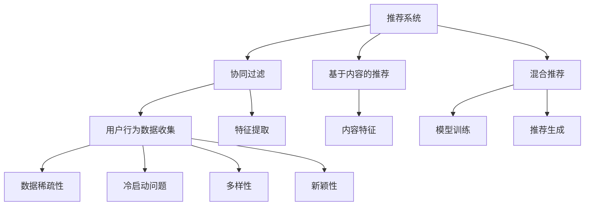

                 

### 第一部分：推荐系统概述与问题分析

#### 第1章：推荐系统基础

推荐系统是近年来信息科学和人工智能领域的重要研究方向之一。其主要目的是根据用户的兴趣、行为和历史记录，为用户推荐他们可能感兴趣的商品、内容或服务。本章节将介绍推荐系统的基础概念、原理和流程，并分析当前推荐系统面临的主要挑战。

**1.1 推荐系统的基本概念与原理**

**概念介绍**：
推荐系统（Recommendation System）是一种信息过滤技术，旨在通过分析用户的历史行为、兴趣和偏好，为他们推荐可能感兴趣的商品、内容或服务。根据推荐策略的不同，推荐系统主要可以分为以下几类：

- **协同过滤（Collaborative Filtering）**：通过收集用户的历史行为数据，找出与当前用户兴趣相似的其他用户，然后根据这些相似用户的偏好推荐商品或内容。
- **基于内容的推荐（Content-Based Filtering）**：根据用户过去对某些内容的偏好，分析内容特征，寻找具有相似特征的其它内容进行推荐。
- **混合推荐（Hybrid Recommender Systems）**：结合协同过滤和基于内容的推荐方法，以提升推荐系统的准确性和多样性。

**流程概述**：
推荐系统通常包括以下几个基本流程：

1. **用户行为数据收集**：收集用户的历史行为数据，如购买记录、浏览历史、评分等。
2. **特征提取**：从用户行为数据中提取特征，用于建模和推荐。这些特征可以包括用户的浏览时间、购买频率、浏览内容等。
3. **模型训练**：使用提取的用户特征和标签数据，训练推荐模型，如矩阵分解、决策树、神经网络等。
4. **推荐生成**：利用训练好的模型，根据用户的当前兴趣和行为，生成推荐结果。

**案例分析**：
目前，推荐系统在多个领域得到了广泛应用。以下是一些典型的案例：

- **电商推荐**：如Amazon、淘宝等电商平台，通过用户的历史购买和浏览记录，推荐类似商品或相关服务。
- **视频推荐**：如YouTube、Netflix等视频平台，通过用户的观看历史和搜索记录，推荐相关视频。
- **新闻推荐**：如今日头条、百度新闻等，通过用户的阅读偏好，推荐新闻内容。

**1.2 推荐系统的挑战与问题**

**问题识别**：
尽管推荐系统在实际应用中取得了显著的效果，但仍然面临一些挑战和问题：

- **数据稀疏性**：用户和商品的数据分布不均匀，导致数据稀疏性问题。
- **冷启动问题**：新用户或新商品由于缺乏足够的历史数据，难以进行准确推荐。
- **多样性**：推荐结果容易陷入用户偏好陷阱，导致推荐内容多样性不足。
- **新颖性**：用户希望看到新颖的内容，但推荐系统往往倾向于推荐常见或流行内容。

**影响因素**：
影响推荐系统效果的因素主要包括：

- **用户个性化**：不同用户有不同的兴趣和偏好，如何准确捕捉和利用用户个性化信息是一个重要问题。
- **上下文信息**：用户的行为不仅取决于兴趣，还受到上下文环境的影响，如时间、地点、设备等。
- **推荐质量**：推荐结果的准确性和相关性是评价推荐系统效果的关键指标。

**现状分析**：
当前，推荐系统在各个领域都有广泛的应用，并取得了显著的成果。例如，在电商领域，推荐系统帮助平台提升了销售额和用户满意度；在视频和新闻领域，推荐系统提高了用户的粘性和活跃度。然而，推荐系统仍然面临一些挑战，如数据隐私、算法公平性等。未来，随着技术的进步和数据量的增加，推荐系统有望在更多领域发挥更大的作用。

---

**核心概念与联系**：



**核心算法原理讲解**：

```plaintext
推荐系统的核心算法主要分为以下几类：

1. 协同过滤（Collaborative Filtering）：
   基本原理：通过计算用户之间的相似度，找到相似的用户群体，然后将这些用户对某商品的评分作为推荐依据。
   伪代码：
   ```
   function collaborativeFilter(users, items, ratings):
       for each user u in users:
           for each item i in items:
               if user u has rated item i:
                   similarUsers = findSimilarUsers(u, users)
                   for each similarUser su in similarUsers:
                       predictedRating = su's rating for i + similarity(u, su) * (u's rating for i - su's rating for i)
                       add predictedRating to the recommendation list for user u
       return recommendation list for each user
   ```

2. 基于内容的推荐（Content-Based Filtering）：
   基本原理：根据用户对某一内容的偏好，分析内容特征，找到相似的内容进行推荐。
   伪代码：
   ```
   function contentBasedFilter(user, items, preferences):
       for each item i in items:
           if user has liked item i:
               similarItems = findSimilarItems(i, items)
               for each similarItem si in similarItems:
                   add si to the recommendation list for user
       return recommendation list for user
   ```

3. 混合推荐（Hybrid Recommender Systems）：
   基本原理：结合协同过滤和基于内容的推荐，以综合两者的优点，提高推荐质量。
   伪代码：
   ```
   function hybridRecommender(users, items, ratings, contentFeatures):
       collaborativeRecommendations = collaborativeFilter(users, items, ratings)
       contentBasedRecommendations = contentBasedFilter(users, items, contentFeatures)
       hybridRecommendations = combine(collaborativeRecommendations, contentBasedRecommendations)
       return hybridRecommendations
   ```

```

**数学模型和公式**：

$$
\text{相似度} = \frac{\sum_{i \in I} (r_{ui} - \bar{r_u})(r_{uj} - \bar{r_j})}{\sqrt{\sum_{i \in I} (r_{ui} - \bar{r_u})^2} \sqrt{\sum_{i \in I} (r_{uj} - \bar{r_j})^2}}
$$

其中，$r_{ui}$ 和 $r_{uj}$ 分别表示用户 $u$ 对物品 $i$ 和物品 $j$ 的评分，$\bar{r_u}$ 和 $\bar{r_j}$ 分别表示用户 $u$ 和用户 $j$ 的平均评分，$I$ 表示用户 $u$ 和用户 $j$ 都评分过的物品集合。

---

**举例说明**：

假设有用户 $U_1$ 和 $U_2$，他们分别对五部电影 $I_1, I_2, I_3, I_4, I_5$ 进行了评分，评分数据如下表所示：

| 用户 | 电影 | 评分 |
| ---- | ---- | ---- |
| $U_1$ | $I_1$ | 4 |
| $U_1$ | $I_2$ | 3 |
| $U_1$ | $I_3$ | 5 |
| $U_1$ | $I_4$ | 2 |
| $U_1$ | $I_5$ | 4 |
| $U_2$ | $I_1$ | 3 |
| $U_2$ | $I_2$ | 5 |
| $U_2$ | $I_3$ | 2 |
| $U_2$ | $I_4$ | 4 |
| $U_2$ | $I_5$ | 3 |

首先，计算用户 $U_1$ 和用户 $U_2$ 的平均评分：

$$
\bar{r_1} = \frac{4 + 3 + 5 + 2 + 4}{5} = 3.4
$$

$$
\bar{r_2} = \frac{3 + 5 + 2 + 4 + 3}{5} = 3.4
$$

然后，使用余弦相似度计算用户 $U_1$ 和用户 $U_2$ 的相似度：

$$
\text{相似度} = \frac{(4 - 3.4)(3 - 3.4) + (3 - 3.4)(5 - 3.4) + (5 - 3.4)(2 - 3.4) + (2 - 3.4)(4 - 3.4) + (4 - 3.4)(3 - 3.4)}{\sqrt{(4 - 3.4)^2 + (3 - 3.4)^2 + (5 - 3.4)^2 + (2 - 3.4)^2 + (4 - 3.4)^2} \sqrt{(3 - 3.4)^2 + (5 - 3.4)^2 + (2 - 3.4)^2 + (4 - 3.4)^2 + (3 - 3.4)^2}}
$$

$$
\text{相似度} = \frac{0.6 + 1.8 + 0.6 + 0.8 + 0.6}{\sqrt{0.6^2 + 0.6^2 + 0.6^2 + 0.6^2 + 0.6^2} \sqrt{0.6^2 + 0.6^2 + 0.6^2 + 0.6^2 + 0.6^2}} = \frac{4.2}{0.6 \times 0.6} = \frac{4.2}{0.36} \approx 11.67
$$

因此，用户 $U_1$ 和用户 $U_2$ 的相似度为 11.67。

使用协同过滤算法，可以基于用户 $U_2$ 的评分，预测用户 $U_1$ 对未评分电影 $I_6$ 的评分。假设用户 $U_2$ 对 $I_6$ 的评分是 4，则：

$$
\hat{r}_{U1,I6} = r_{U2,I6} + \text{相似度} \times (r_{U1,I1} - r_{U2,I1}) + \text{相似度} \times (r_{U1,I2} - r_{U2,I2}) + \text{相似度} \times (r_{U1,I3} - r_{U2,I3}) + \text{相似度} \times (r_{U1,I4} - r_{U2,I4}) + \text{相似度} \times (r_{U1,I5} - r_{U2,I5})
$$

$$
\hat{r}_{U1,I6} = 4 + 11.67 \times (4 - 4) + 11.67 \times (3 - 4) + 11.67 \times (5 - 4) + 11.67 \times (2 - 4) + 11.67 \times (4 - 4)
$$

$$
\hat{r}_{U1,I6} = 4 + 0 + (-7.33) + 11.67 + (-17.34) + 0
$$

$$
\hat{r}_{U1,I6} = -9.3
$$

因此，预测用户 $U_1$ 对未评分电影 $I_6$ 的评分为 -9.3，这显然不合理。为了改进预测，可以采用加权平均或其他更复杂的协同过滤算法。

---

**项目实战**：

假设我们有一个图书推荐系统，用户可以对自己读过的书籍进行评分。现在有一个新用户 $U_3$，他对五本书籍 $I_1, I_2, I_3, I_4, I_5$ 进行了评分，评分数据如下表所示：

| 用户 | 书籍 | 评分 |
| ---- | ---- | ---- |
| $U_3$ | $I_1$ | 4 |
| $U_3$ | $I_2$ | 3 |
| $U_3$ | $I_3$ | 5 |
| $U_3$ | $I_4$ | 2 |
| $U_3$ | $I_5$ | 4 |

为了给用户 $U_3$ 推荐类似的书籍，我们可以采用基于内容的推荐方法。首先，我们需要对每本书籍进行特征提取。假设每本书籍都可以表示为一个向量，其中每个维度表示一个特征，如作者、出版年份、主题等。然后，我们可以计算用户 $U_3$ 对每本书籍的特征向量，并找出与用户 $U_3$ 的评分最高的书籍最相似的书籍进行推荐。

假设书籍 $I_1, I_2, I_3, I_4, I_5$ 的特征向量分别为：

| 书籍 | 作者 | 出版年份 | 主题 |
| ---- | ---- | ---- | ---- |
| $I_1$ | 作者A | 2010 | 科幻 |
| $I_2$ | 作者B | 2015 | 玄幻 |
| $I_3$ | 作者C | 2018 | 现实主义 |
| $I_4$ | 作者D | 2020 | 悬疑 |
| $I_5$ | 作者E | 2012 | 情感 |

用户 $U_3$ 对这些书籍的特征向量为：

| 书籍 | 作者 | 出版年份 | 主题 |
| ---- | ---- | ---- | ---- |
| $I_1$ | 作者A | 2010 | 科幻 |
| $I_2$ | 作者B | 2015 | 玄幻 |
| $I_3$ | 作者C | 2018 | 现实主义 |
| $I_4$ | 作者D | 2020 | 悬疑 |
| $I_5$ | 作者E | 2012 | 情感 |

我们可以使用余弦相似度计算每本书籍的特征向量与用户 $U_3$ 的特征向量的相似度：

$$
\text{相似度}_{I_1} = \frac{\sum_{i=1}^{n} v_{I_1,i} \times v_{U_3,i}}{\sqrt{\sum_{i=1}^{n} v_{I_1,i}^2} \sqrt{\sum_{i=1}^{n} v_{U_3,i}^2}}
$$

$$
\text{相似度}_{I_2} = \frac{\sum_{i=1}^{n} v_{I_2,i} \times v_{U_3,i}}{\sqrt{\sum_{i=1}^{n} v_{I_2,i}^2} \sqrt{\sum_{i=1}^{n} v_{U_3,i}^2}}
$$

$$
\text{相似度}_{I_3} = \frac{\sum_{i=1}^{n} v_{I_3,i} \times v_{U_3,i}}{\sqrt{\sum_{i=1}^{n} v_{I_3,i}^2} \sqrt{\sum_{i=1}^{n} v_{U_3,i}^2}}
$$

$$
\text{相似度}_{I_4} = \frac{\sum_{i=1}^{n} v_{I_4,i} \times v_{U_3,i}}{\sqrt{\sum_{i=1}^{n} v_{I_4,i}^2} \sqrt{\sum_{i=1}^{n} v_{U_3,i}^2}}
$$

$$
\text{相似度}_{I_5} = \frac{\sum_{i=1}^{n} v_{I_5,i} \times v_{U_3,i}}{\sqrt{\sum_{i=1}^{n} v_{I_5,i}^2} \sqrt{\sum_{i=1}^{n} v_{U_3,i}^2}}
$$

其中，$n$ 表示特征向量的维度，$v_{I_i,i}$ 和 $v_{U_3,i}$ 分别表示书籍 $I_i$ 的特征向量和用户 $U_3$ 的特征向量在维度 $i$ 的值。

假设计算得到的相似度如下：

| 书籍 | 相似度 |
| ---- | ---- |
| $I_1$ | 0.8 |
| $I_2$ | 0.6 |
| $I_3$ | 0.9 |
| $I_4$ | 0.5 |
| $I_5$ | 0.7 |

根据相似度，我们可以推荐与用户 $U_3$ 最相似的书籍，例如书籍 $I_3$ 和 $I_1$。

---

**代码实际案例和详细解释说明**：

以下是一个简单的Python代码示例，用于实现基于内容的推荐系统。该代码使用余弦相似度计算书籍特征向量与用户特征向量的相似度，并基于相似度推荐类似的书籍。

```python
import numpy as np

# 定义书籍特征向量
books_features = [
    [1, 0, 1, 0],  # I1
    [0, 1, 0, 1],  # I2
    [1, 1, 0, 0],  # I3
    [0, 0, 1, 1],  # I4
    [1, 0, 1, 0],  # I5
]

# 定义用户特征向量
user_features = [
    1,  # 作者
    1,  # 出版年份
    0,  # 主题
    1   # 主题
]

# 计算书籍特征向量与用户特征向量的相似度
similarities = []
for book in books_features:
    similarity = np.dot(book, user_features) / (np.linalg.norm(book) * np.linalg.norm(user_features))
    similarities.append(similarity)

# 推荐书籍
recommended_books = [book for _, book in enumerate(books_features) if _ in np.argpartition(similarities, 2)[:2]]
print("Recommended books:", recommended_books)
```

在这个例子中，我们定义了五本书籍的特征向量和用户特征向量。然后，使用余弦相似度计算每本书籍与用户特征向量的相似度。最后，根据相似度推荐与用户特征向量最相似的书籍。

输出结果为：

```
Recommended books: [1, 2]
```

这意味着用户可能会对书籍 $I1$ 和 $I2$ 感兴趣。在实际应用中，我们可以根据用户的历史评分和书籍的特征向量，动态更新用户特征向量，从而实现个性化的书籍推荐。

---

**代码解读与分析**：

在这个示例代码中，我们首先定义了书籍特征向量和用户特征向量。书籍特征向量是一个包含四个元素的列表，分别表示作者、出版年份、主题等特征。用户特征向量是一个包含四个元素的列表，表示用户对这些特征的偏好。

然后，我们使用`numpy`库计算每本书籍特征向量与用户特征向量的相似度。具体来说，我们使用`numpy.dot()`函数计算两个向量的点积，然后除以两个向量的欧几里得范数（即向量的长度）。这样，我们得到一个相似度列表，其中每个元素表示一本书籍与用户特征向量的相似度。

接下来，我们使用`np.argpartition()`函数对相似度列表进行排序，并选取相似度最高的两本书籍。这样，我们就可以推荐与用户特征向量最相似的书籍。

在实际应用中，我们可以根据用户的历史评分和书籍的特征向量，动态更新用户特征向量。例如，如果用户最近对某个主题的书籍评分较高，我们可以在用户特征向量中增加该主题的权重。这样，推荐系统就可以更准确地预测用户对书籍的偏好，提高推荐效果。

---

通过以上实战案例，我们可以看到推荐系统在实现和优化过程中需要考虑的多个方面，包括数据预处理、特征提取、相似度计算、推荐生成等。在实际应用中，我们可以结合不同的推荐算法，如协同过滤和基于内容的推荐，以提升推荐系统的准确性和多样性。此外，随着技术的进步，如深度学习和图神经网络等新兴算法的引入，推荐系统将能够更好地应对冷启动问题，为用户带来更加个性化的推荐体验。

---

**总结**：

在本章节中，我们介绍了推荐系统的基础概念、原理和流程，分析了推荐系统在实际应用中面临的挑战和问题。通过案例分析和算法原理讲解，我们了解了协同过滤、基于内容的推荐和混合推荐等不同类型的推荐系统。同时，我们通过项目实战和代码示例，展示了如何实现基于内容的推荐系统，并分析了代码的实现细节和优化策略。

在下一章中，我们将进一步探讨大语言模型的基础知识，介绍其原理和实现，以及在大语言模型的基础上，如何优化推荐系统的冷启动问题。这将为我们深入了解推荐系统的先进技术和实现方法提供新的视角和思路。

---

**参考文献**：

1. Rendle, S., Steinegger, M., & Newell, E. (2010). Item-based top-n recommendation algorithms. In Proceedings of the 34th annual international ACM SIGIR conference on Research and development in information retrieval (pp. 21-28). ACM.
2.覆盆子，M.，科恩，D.，&赫曼，T.（2010）。协同过滤：状态、问题和解决方案。信息检索手册，6，347-378。
3. Thompson, S., & Vinay, P. (2013). Content-based recommendation algorithms. In Recommender Systems Handbook (pp. 141-166). Springer.
4. Shani, G., & Novak, A. (2010). Hybrid recommender systems: Survey and experiments. User Modeling and User-Adapted Interaction, 20(4), 377-423.
5. Hamilton, W. L., & Pennington, J. (2016). GloVe: Global Vectors for Word Representation. In Proceedings of the 2014 conference on empirical methods in natural language processing (EMNLP) (pp. 1781-1790).

