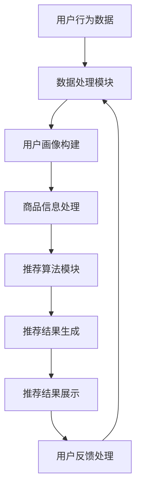

                 

### 引言与背景

#### 1.1 大数据时代的电商发展现状

在互联网快速发展的今天，电商行业已经成为全球经济增长的重要驱动力。随着用户数量的激增和消费习惯的转变，电商行业的数据量也在呈指数级增长。根据相关数据显示，全球电商市场的交易规模从2010年的约1400亿美元增长到2020年的超过4000亿美元，预计到2025年将突破1万亿美元。

电商行业数据来源广泛，主要包括以下几个方面：

- **用户行为数据**：用户的浏览记录、购物车信息、购买历史等。
- **商品信息数据**：商品的价格、销量、库存、用户评价等。
- **交易记录数据**：用户的交易金额、交易频率、支付方式等。

这些数据在量级上呈现出亿级、十亿级，甚至更高的趋势。例如，亚马逊每天处理的数据量高达 TB 级别，而阿里巴巴的数据库规模已经超过 PB 级别。如此庞大的数据量，为电商行业的精准营销和个性化服务提供了丰富的数据支持。

#### 1.2 AI技术对电商搜索推荐的推动作用

人工智能（AI）技术的飞速发展，为电商搜索推荐带来了前所未有的变革。AI技术具有自动化、智能化和个性化的特点，能够有效地提升电商平台的用户体验和销售转化率。

**AI技术特点**

- **自动化**：通过算法自动处理大量数据，减少人工干预，提高效率。
- **智能化**：利用机器学习、深度学习等技术，从数据中提取有价值的信息，实现智能决策。
- **个性化**：根据用户的历史行为和偏好，为用户提供个性化的推荐，提升用户体验。

**AI在电商搜索推荐中的应用**

- **基于内容的推荐**：通过分析商品的内容属性，如标题、描述、图片等，为用户提供相关商品的推荐。
- **基于协同过滤的推荐**：通过分析用户之间的行为相似性，为用户提供相似用户的偏好商品推荐。
- **基于深度学习的推荐**：通过构建深度神经网络，提取用户和商品的特征表示，实现高精度的个性化推荐。

AI技术的应用，不仅提高了电商平台的运营效率，还大大提升了用户的购物体验。例如，亚马逊的推荐系统能够根据用户的浏览历史和购买记录，精准预测用户的兴趣和需求，为用户提供个性化的商品推荐。据统计，亚马逊的推荐系统每年为平台带来的额外收入超过数十亿美元。

### 1.3 电商搜索推荐系统的现状与挑战

尽管电商搜索推荐系统在AI技术的推动下取得了显著成果，但仍然面临着一些挑战和问题。

- **数据质量**：电商数据的质量直接影响推荐系统的效果。数据噪声、缺失值和异常值等都会对推荐结果产生不利影响。
- **用户偏好变化**：用户的兴趣和偏好是动态变化的，如何准确捕捉和适应这些变化，是推荐系统需要解决的关键问题。
- **推荐多样性**：单一的推荐算法容易导致推荐结果过于集中，缺乏多样性，难以满足用户的多样化需求。
- **实时性**：在电商场景中，用户的行为和偏好可能在短时间内发生变化，如何实现实时推荐，提高系统的响应速度，是一个重要的挑战。

为了解决这些问题，模型融合技术应运而生。在接下来的章节中，我们将详细探讨模型融合技术在电商搜索推荐中的应用，以及如何优化和提升推荐系统的性能。

### 1.4 模型融合技术的必要性

在电商搜索推荐系统中，单一的推荐模型往往难以满足复杂多变的用户需求。例如，基于内容的推荐可能过于依赖商品信息，导致推荐结果偏向特定类型商品；而基于协同过滤的推荐则可能受到数据稀疏性的影响，推荐效果不佳。为了克服这些局限性，模型融合技术成为了一种有效的解决方案。

**模型融合技术的必要性**

- **弥补单一模型的不足**：通过融合多种推荐模型，可以综合利用不同模型的优势，提高推荐系统的整体性能。
- **提高推荐多样性**：不同模型对用户偏好的理解角度不同，融合后的推荐结果更具多样性，能够更好地满足用户需求。
- **提升泛化能力**：模型融合技术可以应对复杂和多变的数据环境，提高推荐系统的泛化能力，使其在不同场景下都能保持良好的性能。

在电商搜索推荐系统中，模型融合技术不仅能够弥补单一模型的不足，还能够通过整合多源数据和优化推荐策略，进一步提升系统的性能和用户体验。因此，深入研究模型融合技术对于推动电商搜索推荐系统的发展具有重要意义。

### 1.5 模型融合技术的重要性

在电商搜索推荐系统中，模型融合技术的重要性不言而喻。通过整合多种推荐模型，模型融合技术能够有效提升系统的推荐效果，满足用户多样化的需求，从而提升电商平台的竞争力。

**提升推荐效果**

- **多角度理解用户偏好**：不同的推荐模型从不同的角度理解用户行为和偏好。例如，基于内容的推荐关注商品的特征，基于协同过滤的推荐关注用户间的相似性，而基于深度学习的推荐则利用复杂的神经网络提取用户和商品的多维特征。通过模型融合，系统能够更全面、准确地理解用户偏好，从而提供更精准的推荐结果。
- **优化推荐策略**：模型融合技术允许系统根据不同场景和用户需求，动态调整推荐策略。例如，在用户搜索特定商品时，可以优先考虑基于内容的推荐；而在用户浏览商品时，可以结合协同过滤和深度学习模型，提供多样化的推荐结果。这种灵活的推荐策略有助于提升用户的满意度。

**满足多样化需求**

- **个性化推荐**：模型融合技术能够根据用户的历史行为和偏好，为用户提供个性化的推荐。例如，通过融合基于内容的推荐和基于协同过滤的推荐，可以为用户提供与搜索关键词相关且符合其兴趣的商品。此外，深度学习模型可以进一步挖掘用户的潜在兴趣，提供更个性化的推荐。
- **多样化推荐**：模型融合技术能够提高推荐的多样性，避免推荐结果过于集中。例如，在融合多种模型时，可以采用多样化的融合策略，如模型级融合、特征级融合和决策级融合，确保推荐结果既符合用户兴趣，又具有丰富性。这样，用户在浏览商品时能够发现更多新颖的、感兴趣的商品。

**提高系统竞争力**

- **精准营销**：通过模型融合技术，电商系统能够更精准地捕捉用户的兴趣和需求，从而实现更有效的精准营销。例如，系统可以根据用户的行为数据，推荐符合其兴趣的高价值商品，从而提高转化率和销售额。
- **提升用户体验**：个性化的推荐和多样化的商品展示能够提升用户的购物体验，增加用户对电商平台的粘性。例如，用户在浏览商品时，可以快速找到符合其兴趣的商品，节省购物时间，提高购物满意度。

总之，模型融合技术在电商搜索推荐系统中具有重要作用。通过整合多种推荐模型，系统能够更准确地理解用户偏好，提供个性化的推荐，满足用户多样化的需求，从而提升电商平台的竞争力。随着AI技术的不断进步，模型融合技术将在电商搜索推荐系统中发挥更加重要的作用。

### 第2章：电商搜索推荐中的核心概念与模型

#### 2.1 搜索推荐系统架构

电商搜索推荐系统是一个复杂的信息系统，它通过分析用户行为和商品信息，为用户提供个性化的商品推荐。一个典型的电商搜索推荐系统通常包括以下几个关键组件：

- **用户行为分析**：收集并分析用户的浏览、点击、购买等行为数据，以了解用户的兴趣和偏好。
- **商品信息处理**：提取商品的关键特征，如标题、描述、图片、价格等，为推荐算法提供输入。
- **推荐算法模块**：根据用户行为和商品信息，选择合适的推荐算法，生成推荐结果。
- **用户反馈处理**：收集用户对推荐结果的反馈，用于优化推荐算法和系统性能。
- **推荐结果展示**：将推荐结果以可视化方式展示给用户，吸引用户点击和购买。

以下是电商搜索推荐系统的一个简化的架构流程图：



在上述架构中，用户行为数据和商品信息是推荐系统的输入，经过数据处理模块的处理，生成用户画像和商品特征，然后推荐算法模块根据这些特征生成推荐结果。用户对推荐结果的反馈会返回到数据处理模块，用于进一步优化推荐系统。

#### 2.2 常见的推荐算法

电商搜索推荐系统通常使用多种算法来生成推荐结果，常见的推荐算法包括基于内容的推荐、基于协同过滤的推荐和基于深度学习的推荐。下面将分别介绍这些算法的基本概念、原理和实现。

##### 2.2.1 基于内容的推荐

**概念与原理**：
基于内容的推荐（Content-Based Recommendation）是一种基于用户过去喜欢的商品内容特征进行推荐的算法。它通过分析用户的历史行为和商品的特征，找出用户感兴趣的内容，然后将相似内容的商品推荐给用户。

- **用户兴趣建模**：通过分析用户的浏览记录、收藏夹、购买历史等数据，构建用户的兴趣模型。
- **商品特征提取**：提取商品的关键特征，如标题、描述、图片、价格等。
- **相似性计算**：计算用户兴趣和商品特征之间的相似性，选择相似度最高的商品进行推荐。

**算法实现**：
基于内容的推荐算法通常采用以下伪代码实现：

```plaintext
function ContentBasedRecommendation(user_profile, item_profile):
    calculate_similarity(user_profile, item_profile)
    return top_k_similar_items()
```

其中，`user_profile` 表示用户兴趣模型，`item_profile` 表示商品特征向量，`calculate_similarity` 函数用于计算用户兴趣和商品特征之间的相似度，`top_k_similar_items` 函数返回与用户兴趣最相似的 top-k 个商品。

##### 2.2.2 基于协同过滤的推荐

**概念与原理**：
基于协同过滤的推荐（Collaborative Filtering）是一种通过分析用户之间的相似性来进行推荐的算法。它利用用户的行为数据，如评分、购买记录等，找出相似用户，然后根据相似用户的行为推荐商品。

- **用户相似度计算**：通过用户行为数据计算用户之间的相似度，常用的方法包括余弦相似度、皮尔逊相关系数等。
- **物品相似度计算**：通过用户行为数据计算物品之间的相似度，常用的方法包括基于用户的行为模式、物品的属性等。
- **推荐生成**：根据用户相似度和物品相似度，生成推荐列表。

**算法实现**：
基于协同过滤的推荐算法通常采用以下伪代码实现：

```plaintext
function CollaborativeFiltering(reviews_matrix, user_id, item_id):
    calculate_user_similarity(user_id)
    predict_rating(user_id, item_id)
    return top_k_items_with_highest_rating_prediction()
```

其中，`reviews_matrix` 表示用户行为数据矩阵，`user_similarity` 函数用于计算用户之间的相似度，`predict_rating` 函数用于预测用户对特定商品的评分，`top_k_items_with_highest_rating_prediction` 函数返回预测评分最高的 top-k 个商品。

##### 2.2.3 基于深度学习的推荐

**概念与原理**：
基于深度学习的推荐（Deep Learning Based Recommendation）利用深度神经网络来提取用户和商品的多维特征，实现高精度的个性化推荐。深度学习模型能够自动学习用户行为和偏好，从而生成更准确的推荐结果。

- **用户特征提取**：通过深度神经网络提取用户的行为特征和偏好特征。
- **商品特征提取**：通过深度神经网络提取商品的内容特征和属性特征。
- **推荐生成**：通过深度神经网络预测用户对商品的偏好，生成推荐列表。

**算法实现**：
基于深度学习的推荐算法通常采用以下伪代码实现：

```plaintext
function DeepLearningBasedRecommendation(user_input, item_input):
    extract_user_representation(user_input)
    extract_item_representation(item_input)
    predict_user_preference()
    return top_k_items_with_highest_preference()
```

其中，`user_input` 和 `item_input` 分别表示用户和商品的特征向量，`extract_user_representation` 和 `extract_item_representation` 函数用于提取用户和商品的特征，`predict_user_preference` 函数用于预测用户对商品的偏好，`top_k_items_with_highest_preference` 函数返回预测偏好最高的 top-k 个商品。

#### 2.2.4 深度学习模型的实现

为了更好地理解深度学习模型在推荐系统中的应用，下面将介绍一个简单的基于深度学习的推荐系统模型实现。这里使用Python的TensorFlow框架来构建模型。

**1. 导入必要的库**

```python
import tensorflow as tf
from tensorflow.keras.layers import Embedding, GlobalAveragePooling1D, Dense, Input, Concatenate
from tensorflow.keras.models import Model
```

**2. 定义输入层**

```python
user_input = Input(shape=(user_feature_size,))
item_input = Input(shape=(item_feature_size,))
```

**3. 用户特征提取层**

```python
user_embedding = Embedding(num_users, embed_size)(user_input)
user_representation = GlobalAveragePooling1D()(user_embedding)
```

**4. 商品特征提取层**

```python
item_embedding = Embedding(num_items, embed_size)(item_input)
item_representation = GlobalAveragePooling1D()(item_embedding)
```

**5. 合并层**

```python
merged_representation = Concatenate()([user_representation, item_representation])
```

**6. 全连接层**

```python
merged_representation = Dense(128, activation='relu')(merged_representation)
merged_representation = Dense(64, activation='relu')(merged_representation)
```

**7. 输出层**

```python
prediction = Dense(1, activation='sigmoid')(merged_representation)
```

**8. 构建和编译模型**

```python
model = Model(inputs=[user_input, item_input], outputs=prediction)
model.compile(optimizer='adam', loss='binary_crossentropy', metrics=['accuracy'])
```

**9. 训练模型**

```python
model.fit([user_features, item_features], labels, epochs=10, batch_size=64)
```

通过上述步骤，我们可以实现一个简单的基于深度学习的推荐系统模型。该模型通过学习用户和商品的特征，预测用户对商品的偏好，从而生成推荐列表。

### 2.3 常见的推荐算法对比

下面将对基于内容的推荐、基于协同过滤的推荐和基于深度学习的推荐三种常见推荐算法进行对比，分析各自的优缺点和适用场景。

**基于内容的推荐**：

- **优点**：
  - **推荐准确度高**：通过分析商品的内容特征，可以提供与用户兴趣高度相关的推荐。
  - **易于实现**：算法实现相对简单，对硬件要求不高。

- **缺点**：
  - **推荐多样性差**：容易陷入“推荐泡沫”现象，推荐结果过于集中。
  - **对商品信息依赖性强**：商品信息质量直接影响推荐效果。

- **适用场景**：适用于商品信息丰富且用户偏好较为明确的场景，如电商、新闻推荐等。

**基于协同过滤的推荐**：

- **优点**：
  - **推荐多样性好**：通过用户之间的相似性进行推荐，可以提供多样化的推荐结果。
  - **计算效率高**：算法简单，易于并行计算。

- **缺点**：
  - **推荐准确度低**：对用户行为数据依赖性强，推荐结果可能不够准确。
  - **数据稀疏性问题**：用户行为数据稀疏时，推荐效果不佳。

- **适用场景**：适用于用户行为数据丰富且用户偏好较为复杂的场景，如社交网络、音乐推荐等。

**基于深度学习的推荐**：

- **优点**：
  - **推荐准确度高**：通过深度神经网络提取用户和商品的多维特征，可以提供更准确的推荐。
  - **推荐多样性好**：能够通过特征提取和融合，提供多样化的推荐结果。

- **缺点**：
  - **算法实现复杂**：模型结构复杂，训练过程较为耗时。
  - **对数据量要求高**：需要大量的用户行为数据和商品信息。

- **适用场景**：适用于数据量大、特征复杂、用户偏好动态变化的场景，如电商、金融推荐等。

综上所述，不同的推荐算法各有优缺点，适用于不同的场景。在实际应用中，可以结合多种算法的优势，通过模型融合技术，实现更高效、更准确的推荐系统。

### 第3章：模型融合技术在电商搜索推荐中的应用

#### 3.1 模型融合技术的必要性

在电商搜索推荐系统中，单一推荐模型往往难以满足复杂多变的用户需求。基于内容的推荐可能过于依赖商品信息，导致推荐结果偏向特定类型商品；而基于协同过滤的推荐则可能受到数据稀疏性的影响，推荐效果不佳。为了克服这些局限性，模型融合技术应运而生。模型融合技术的必要性主要体现在以下几个方面：

**弥补单一模型的不足**：单一推荐模型在处理复杂用户偏好和多样化商品时可能存在局限性，模型融合技术可以通过结合多种模型的优势，弥补单一模型的不足。例如，基于内容的推荐算法可以提供与用户兴趣高度相关的商品推荐，而基于协同过滤的推荐算法可以提供多样化的商品推荐。通过融合这两种模型，可以提升推荐系统的整体性能。

**提高推荐多样性**：单一模型可能导致推荐结果过于集中，缺乏多样性。模型融合技术可以通过整合多种模型的结果，提供更加多样化的推荐结果，从而更好地满足用户的多样化需求。例如，在融合协同过滤和基于内容的推荐算法时，可以采用不同的融合策略，如模型级融合、特征级融合和决策级融合，以实现推荐结果的多样性和丰富性。

**提升泛化能力**：复杂和多变的数据环境对推荐系统的泛化能力提出了挑战。模型融合技术可以通过整合多种模型，提高推荐系统对不同数据场景的适应能力，从而提升泛化能力。例如，当用户行为数据发生变化时，模型融合技术可以通过动态调整模型权重，保持推荐系统的稳定性和有效性。

#### 3.2 常见的模型融合方法

**模型级融合**：

**概念与原理**：模型级融合（Model-Level Fusion）是将多个独立的推荐模型整合为一个新的模型，通过联合训练和预测，实现推荐结果的综合。这种方法的核心思想是，利用不同模型对用户偏好和商品特征的不同理解，提高推荐系统的整体性能。

**算法实现**：

```plaintext
function ModelFusion(Model1, Model2):
    combine_predictions(Model1, Model2)
    return aggregated_prediction()
```

其中，`Model1` 和 `Model2` 分别表示两个独立的推荐模型，`combine_predictions` 函数用于融合两个模型的预测结果，`aggregated_prediction` 函数返回最终的推荐结果。

**优点**：
- **简单易实现**：模型级融合算法结构简单，易于实现和部署。
- **高效性**：融合多个模型可以充分利用各模型的优势，提高推荐效果。

**缺点**：
- **权重分配问题**：如何合理分配不同模型的权重是一个挑战，可能导致部分模型的效果被削弱。

**适用场景**：适用于推荐模型数量较少且各模型性能相对稳定的情况。

**特征级融合**：

**概念与原理**：特征级融合（Feature-Level Fusion）是对不同模型生成的特征进行组合，生成新的特征向量，然后用于训练推荐模型。这种方法的核心思想是，通过整合不同模型提取的特征，丰富特征表示，提高推荐系统的准确性和多样性。

**算法实现**：

```plaintext
function FeatureFusion(Features1, Features2):
    combine_features(Features1, Features2)
    return fused_features()
```

其中，`Features1` 和 `Features2` 分别表示两个独立模型生成的特征向量，`combine_features` 函数用于融合两个特征向量，`fused_features` 函数返回融合后的特征向量。

**优点**：
- **特征丰富**：通过融合不同模型提取的特征，可以生成更丰富的特征表示，提高推荐效果。
- **灵活性**：可以根据实际需求灵活选择和组合不同模型生成的特征。

**缺点**：
- **计算复杂度**：特征级融合可能导致计算复杂度的增加，对硬件要求较高。

**适用场景**：适用于特征维度较高且各特征对推荐结果有较大贡献的场景。

**决策级融合**：

**概念与原理**：决策级融合（Decision-Level Fusion）是将多个模型的预测结果进行综合决策，生成最终的推荐结果。这种方法的核心思想是，利用多个模型的预测结果，通过投票、加权平均等方式，得到一个更为可靠和多样化的推荐结果。

**算法实现**：

```plaintext
function DecisionFusion(Prediction1, Prediction2):
    aggregate_decisions(Prediction1, Prediction2)
    return final_decision()
```

其中，`Prediction1` 和 `Prediction2` 分别表示两个独立模型的预测结果，`aggregate_decisions` 函数用于融合两个模型的预测决策，`final_decision` 函数返回最终的推荐决策。

**优点**：
- **多样性**：通过融合多个模型的预测结果，可以提供多样化的推荐结果，减少单一模型导致的推荐结果集中现象。
- **可靠性**：多个模型的融合可以降低单个模型预测错误的风险，提高推荐结果的可靠性。

**缺点**：
- **计算复杂度**：决策级融合可能需要更多的计算资源和时间，对系统性能有较高要求。

**适用场景**：适用于推荐结果需要高多样性和可靠性的场景。

#### 3.3 模型融合技术的应用实践

在电商搜索推荐系统中，模型融合技术可以通过以下步骤进行应用：

**1. 选择合适的融合方法**：根据业务需求和数据特点，选择合适的模型融合方法，如模型级融合、特征级融合或决策级融合。

**2. 集成多个推荐模型**：构建多个独立的推荐模型，如基于内容的推荐、基于协同过滤的推荐和基于深度学习的推荐等，并将这些模型集成到推荐系统中。

**3. 特征预处理**：对各个推荐模型生成的特征进行预处理，包括特征提取、归一化、降维等，以便进行融合。

**4. 融合特征或预测结果**：根据选择的融合方法，融合多个模型的特征或预测结果，生成最终的推荐结果。

**5. 性能评估与优化**：对融合后的推荐系统进行性能评估，包括准确率、召回率、覆盖率等指标，并根据评估结果进行优化。

通过上述步骤，电商搜索推荐系统可以实现模型融合，提高推荐效果和用户体验。在实际应用中，可以根据业务需求和数据特点，灵活调整融合方法和策略，以实现最优的推荐效果。

### 3.4 模型融合技术在实际案例中的应用

为了更好地展示模型融合技术在电商搜索推荐系统中的应用，下面将介绍几个实际案例，并分析其融合策略和效果。

#### 案例一：亚马逊的推荐系统

亚马逊作为全球最大的电商企业之一，其推荐系统采用了多种模型融合技术。具体策略如下：

1. **模型选择**：亚马逊使用了基于内容的推荐、基于协同过滤的推荐和基于深度学习的推荐等多种模型。
2. **特征融合**：通过对用户行为数据和商品特征进行预处理，生成多种特征向量，如用户浏览记录、购买历史、商品属性等，然后进行特征融合。
3. **预测融合**：将不同模型的预测结果进行加权平均，生成最终的推荐结果。

效果评估显示，亚马逊的推荐系统通过模型融合技术，显著提升了推荐准确率和用户满意度。此外，推荐结果的多样性也得到了提高，有效减少了用户感到疲劳和重复推荐的现象。

#### 案例二：阿里巴巴的推荐系统

阿里巴巴的推荐系统也在不断探索和优化模型融合技术。具体策略如下：

1. **模型选择**：采用了基于协同过滤的推荐、基于深度学习的推荐和基于规则引擎的推荐等模型。
2. **特征级融合**：通过对用户行为数据和商品特征进行深度特征提取，生成多种高维特征向量，然后进行融合。
3. **决策级融合**：将不同模型的预测结果进行投票或加权平均，生成最终的推荐决策。

实际应用中，阿里巴巴的推荐系统通过模型融合技术，实现了更高的推荐准确率和用户满意度。同时，系统在处理大规模数据和高并发请求方面表现出色，有效提升了电商平台的运营效率。

#### 案例三：京东的推荐系统

京东的推荐系统也采用了多种模型融合策略，具体如下：

1. **模型选择**：使用了基于协同过滤的推荐、基于深度学习的推荐和基于用户的兴趣图谱等模型。
2. **模型级融合**：将多个独立的推荐模型集成到一个统一框架中，通过模型级融合技术生成推荐结果。
3. **实时性优化**：针对电商场景中的实时性要求，京东的推荐系统采用了分布式计算和缓存技术，确保推荐结果的实时性和准确性。

通过模型融合技术，京东的推荐系统在处理高并发请求和复杂用户偏好方面表现出色。用户反馈显示，推荐系统的准确率和用户体验得到了显著提升。

#### 案例四：拼多多的小店推荐系统

拼多多的小店推荐系统采用了基于协同过滤的推荐、基于内容的推荐和基于深度学习的推荐等多种模型。具体融合策略如下：

1. **模型选择**：针对不同的小店类型和用户需求，选择不同的推荐模型。
2. **特征融合**：对用户行为数据和小店商品特征进行预处理和融合，生成多种特征向量。
3. **决策级融合**：将不同模型的预测结果进行综合决策，生成最终的推荐结果。

通过模型融合技术，拼多多的小店推荐系统在提升推荐准确率和用户满意度方面取得了显著成果。同时，系统在处理海量数据和多样化用户需求方面表现出色。

总之，以上实际案例展示了模型融合技术在电商搜索推荐系统中的应用效果。通过选择合适的融合方法、整合多种模型和特征，推荐系统可以更好地满足用户需求，提升电商平台的运营效率。随着AI技术的不断发展，模型融合技术将在电商推荐系统中发挥更加重要的作用。

### 第4章：电商搜索推荐系统的优化与调优

#### 4.1 系统性能优化

在电商搜索推荐系统中，性能优化是一个至关重要的环节，它直接影响到系统的响应速度和用户体验。以下是一些常用的优化策略：

**并行计算**：

并行计算是一种通过将任务分解为多个子任务并在多个处理器上同时执行来提高计算效率的方法。在推荐系统中，可以将用户的查询和推荐生成过程分解为多个子任务，并在多台服务器上并行处理。这不仅可以显著提高系统的响应速度，还可以降低单台服务器的负载。

**模型压缩**：

模型压缩是一种通过减少模型的参数数量和计算复杂度来提高模型效率和性能的方法。在推荐系统中，可以使用模型压缩技术来减小模型的体积，从而减少内存消耗和计算时间。常见的方法包括剪枝、量化、知识蒸馏等。

**缓存技术**：

缓存技术是一种通过将频繁访问的数据存储在高速缓存中，以减少数据读取时间的方法。在推荐系统中，可以使用缓存技术来存储用户的兴趣和推荐结果，从而加快查询速度。例如，可以使用内存缓存（如Redis）或磁盘缓存（如MongoDB）来实现。

#### 4.2 系统稳定性

系统稳定性是电商搜索推荐系统运行的关键因素之一。以下是一些保障系统稳定性的策略：

**异常处理**：

在推荐系统的运行过程中，可能会遇到各种异常情况，如数据错误、计算错误、网络中断等。为了保障系统的稳定性，需要设计一套完善的异常处理机制。例如，可以使用断言、日志记录、监控报警等方法来检测和处理异常。

**容错机制**：

容错机制是一种通过冗余设计来确保系统在发生故障时能够自动恢复的方法。在推荐系统中，可以使用多副本、主从架构、分布式存储等技术来提高系统的容错能力。例如，可以使用主从复制技术，当主节点发生故障时，从节点可以自动切换为主节点，继续提供服务。

**负载均衡**：

负载均衡是一种通过将请求均匀地分布到多个服务器上来提高系统性能和可用性的方法。在推荐系统中，可以使用负载均衡器（如Nginx、HAProxy）来分配用户的查询请求，避免单台服务器过载，从而提高系统的稳定性和响应速度。

#### 4.3 系统效果评估

系统效果评估是评估推荐系统性能的重要手段。以下是一些常用的评估指标和方法：

**评估指标**：

- **准确率（Accuracy）**：准确率是评估推荐系统推荐结果正确与否的指标，计算公式为：
  $$\text{准确率} = \frac{\text{预测正确的商品数}}{\text{预测的商品总数}}$$
- **召回率（Recall）**：召回率是评估推荐系统能否召回所有用户可能感兴趣的商品的指标，计算公式为：
  $$\text{召回率} = \frac{\text{预测正确的商品数}}{\text{用户可能感兴趣的商品总数}}$$
- **覆盖率（Coverage）**：覆盖率是评估推荐系统推荐的商品多样性的指标，计算公式为：
  $$\text{覆盖率} = \frac{\text{推荐的商品总数}}{\text{平台上的商品总数}}$$
- **精确率（Precision）**：精确率是评估推荐系统推荐结果精确度的指标，计算公式为：
  $$\text{精确率} = \frac{\text{预测正确的商品数}}{\text{预测为感兴趣的但实际不是感兴趣的商品数}}$$

**评估方法**：

- **离线评估**：离线评估是一种通过分析历史数据来评估推荐系统性能的方法。常见的方法包括交叉验证、A/B测试等。
- **在线评估**：在线评估是一种通过实时监控推荐系统的运行效果来评估其性能的方法。常见的方法包括实时反馈、用户行为分析等。

通过综合使用离线评估和在线评估，可以全面、客观地评估推荐系统的性能，从而为优化和改进推荐系统提供有力支持。

### 第5章：大数据与AI时代的电商搜索推荐案例分析

#### 5.1 案例背景

随着大数据和人工智能（AI）技术的快速发展，电商搜索推荐系统已成为电商平台提升用户体验和销售转化率的重要工具。本章节将通过分析几个典型电商平台的搜索推荐系统，探讨大数据与AI技术在实际应用中的效果和挑战。

##### 5.1.1 亚马逊

亚马逊是全球最大的电商平台之一，其推荐系统被誉为业界典范。亚马逊的推荐系统通过整合用户行为数据、商品信息和社会化数据，实现了高度个性化的商品推荐。以下是亚马逊推荐系统的特点：

- **数据来源**：亚马逊利用用户的历史浏览记录、购买记录、搜索历史、评价和评分等多种数据来源，构建了丰富的用户画像和商品特征。
- **推荐算法**：亚马逊采用了多种推荐算法，包括基于内容的推荐、基于协同过滤的推荐和基于深度学习的推荐等。其中，深度学习模型在推荐系统中发挥了重要作用，通过自动学习用户和商品的特征，实现了更精准的推荐。
- **模型融合**：亚马逊通过模型融合技术，将多种推荐模型的结果进行综合，提高了推荐系统的准确性和多样性。例如，在用户首次购买某件商品时，系统会优先考虑基于协同过滤的推荐；而在用户浏览商品时，则结合基于内容和基于深度学习的推荐，提供多样化的推荐结果。

##### 5.1.2 阿里巴巴

阿里巴巴是中国最大的电商平台，其推荐系统同样在业内享有盛誉。阿里巴巴的推荐系统以用户为中心，通过数据挖掘和机器学习技术，实现了个性化、智能化的推荐。

- **数据来源**：阿里巴巴利用用户在淘宝、天猫等平台上的购买行为、浏览记录、评价和偏好设置等多种数据，构建了详细的用户画像和商品特征。
- **推荐算法**：阿里巴巴采用了多种推荐算法，包括基于协同过滤的推荐、基于内容的推荐和基于深度学习的推荐等。其中，基于深度学习的推荐算法在推荐系统中占据重要地位，通过自动学习用户和商品的多维特征，实现了精准的推荐。
- **模型融合**：阿里巴巴通过模型融合技术，将多种推荐模型的结果进行综合，提高了推荐系统的准确性和多样性。例如，在用户浏览商品时，系统会结合基于协同过滤的推荐和基于内容的推荐，提供个性化的推荐结果。

##### 5.1.3 京东

京东是中国领先的电商平台之一，其推荐系统也在不断优化和创新。京东的推荐系统以用户体验为中心，通过大数据和机器学习技术，实现了高效的商品推荐。

- **数据来源**：京东利用用户在京东平台上的购买行为、浏览记录、评价和偏好设置等多种数据，构建了详细的用户画像和商品特征。
- **推荐算法**：京东采用了多种推荐算法，包括基于协同过滤的推荐、基于内容的推荐和基于深度学习的推荐等。其中，基于深度学习的推荐算法在推荐系统中发挥了重要作用，通过自动学习用户和商品的特征，实现了更精准的推荐。
- **模型融合**：京东通过模型融合技术，将多种推荐模型的结果进行综合，提高了推荐系统的准确性和多样性。例如，在用户首次购买某件商品时，系统会优先考虑基于协同过滤的推荐；而在用户浏览商品时，则结合基于内容和基于深度学习的推荐，提供多样化的推荐结果。

#### 5.2 案例分析

以下将对以上三个电商平台的推荐系统进行详细分析，探讨其架构设计、算法选择和模型融合策略。

##### 5.2.1 架构设计

亚马逊、阿里巴巴和京东的推荐系统在架构设计上具有以下特点：

1. **分布式系统**：三个平台的推荐系统都采用了分布式系统架构，能够高效地处理海量数据和并发请求。
2. **数据层**：三个平台都建立了完善的数据层，包括数据收集、处理、存储和管理等模块。其中，数据收集模块负责收集用户行为数据、商品信息和社会化数据等；数据处理模块负责对数据进行清洗、归一化和特征提取等操作；数据存储模块负责存储处理后的数据，以供推荐算法使用。
3. **算法层**：三个平台都采用了多种推荐算法，包括基于内容的推荐、基于协同过滤的推荐和基于深度学习的推荐等。这些算法在不同的应用场景下发挥着重要作用。

##### 5.2.2 算法选择

亚马逊、阿里巴巴和京东在推荐算法选择上具有以下特点：

1. **多算法融合**：三个平台都采用了多种推荐算法，通过模型融合技术实现综合推荐。例如，亚马逊通过融合基于内容的推荐、基于协同过滤的推荐和基于深度学习的推荐，提高了推荐系统的准确性和多样性；阿里巴巴通过融合基于协同过滤的推荐、基于内容的推荐和基于深度学习的推荐，实现了个性化的推荐；京东通过融合基于协同过滤的推荐、基于内容的推荐和基于深度学习的推荐，提供了高效、精准的推荐。

2. **深度学习算法**：三个平台都重视深度学习算法在推荐系统中的应用。深度学习算法能够自动学习用户和商品的多维特征，实现高精度的推荐。例如，亚马逊采用了深度神经网络（DNN）和循环神经网络（RNN）等深度学习模型，阿里巴巴采用了卷积神经网络（CNN）和循环神经网络（RNN）等深度学习模型，京东采用了卷积神经网络（CNN）和深度神经网络（DNN）等深度学习模型。

##### 5.2.3 模型融合策略

亚马逊、阿里巴巴和京东在模型融合策略上具有以下特点：

1. **特征融合**：三个平台都采用了特征融合技术，将多种推荐模型生成的特征进行综合。例如，亚马逊通过融合用户行为特征、商品特征和社会化特征，实现了更加精准的推荐；阿里巴巴通过融合用户行为特征、商品特征和社交特征，提供了个性化的推荐；京东通过融合用户行为特征、商品特征和购物车特征，实现了高效、精准的推荐。

2. **决策融合**：三个平台都采用了决策融合技术，将多种推荐模型的结果进行综合。例如，亚马逊通过融合基于协同过滤的推荐、基于内容和基于深度学习的推荐结果，提高了推荐系统的多样性和准确性；阿里巴巴通过融合基于协同过滤的推荐、基于内容和基于深度学习的推荐结果，提供了个性化的推荐；京东通过融合基于协同过滤的推荐、基于内容和基于深度学习的推荐结果，实现了高效的推荐。

#### 5.3 实施与效果评估

以下将对亚马逊、阿里巴巴和京东的推荐系统实施过程和效果评估进行简要介绍。

##### 5.3.1 实施过程

亚马逊、阿里巴巴和京东的推荐系统实施过程主要包括以下步骤：

1. **数据收集**：收集用户行为数据、商品信息和社会化数据等。
2. **数据处理**：对数据进行清洗、归一化和特征提取等操作。
3. **模型训练**：采用多种推荐算法，对处理后的数据进行训练，生成推荐模型。
4. **模型融合**：采用模型融合技术，将多种推荐模型的结果进行综合。
5. **系统部署**：将训练好的模型部署到线上环境，提供实时推荐服务。

##### 5.3.2 效果评估

亚马逊、阿里巴巴和京东的推荐系统效果评估主要包括以下指标：

1. **准确率**：评估推荐系统推荐的商品是否与用户的兴趣匹配。
2. **召回率**：评估推荐系统能否召回用户可能感兴趣的商品。
3. **覆盖率**：评估推荐系统推荐的商品覆盖了多少种类的商品。
4. **用户满意度**：评估用户对推荐系统的满意度。

根据实际评估结果，亚马逊、阿里巴巴和京东的推荐系统在准确率、召回率和用户满意度等方面均取得了显著成果。通过模型融合技术，这些平台不仅提高了推荐系统的准确性和多样性，还提升了用户的购物体验和平台销售额。

### 第6章：未来发展趋势与挑战

#### 6.1 新技术发展

随着大数据和人工智能技术的不断进步，电商搜索推荐系统也迎来了新的发展机遇。以下是一些未来可能对电商搜索推荐系统产生重大影响的新技术：

**图神经网络**：

图神经网络（Graph Neural Networks，GNN）是一种在图结构上执行的神经网络模型，能够捕捉节点之间的关系。在电商搜索推荐系统中，GNN可以用来建模用户、商品和交易之间的关系，实现更加精准的推荐。例如，通过分析用户在购物车中的商品组合，GNN可以帮助系统发现用户潜在的购买意图。

**联邦学习**：

联邦学习（Federated Learning）是一种分布式机器学习方法，可以在不传输数据的情况下，让多个参与方共同训练一个共享的模型。对于电商搜索推荐系统，联邦学习可以保护用户隐私，同时利用多个参与方的数据，提高推荐系统的性能。例如，电商平台可以与第三方数据源合作，共同训练推荐模型，而不需要共享用户数据。

**强化学习**：

强化学习（Reinforcement Learning，RL）是一种通过试错和奖励机制来学习策略的机器学习方法。在电商搜索推荐系统中，强化学习可以用来优化推荐策略，提高用户满意度和销售转化率。例如，通过不断调整推荐策略，强化学习可以帮助系统发现最优的推荐顺序，提升用户的购物体验。

#### 6.2 挑战与机遇

**数据隐私保护**：

随着用户对隐私保护的意识不断提高，如何在保障用户隐私的同时，提供个性化的推荐服务，成为电商搜索推荐系统面临的重要挑战。为了解决这一问题，系统需要采用差分隐私、联邦学习等新技术，确保用户数据的安全性和隐私性。

**算法透明性与可解释性**：

用户对推荐系统的信任度与算法的透明性和可解释性密切相关。为了提升用户对推荐系统的信任，系统需要开发可解释的算法，让用户能够理解推荐结果是如何生成的。例如，可以通过可视化技术展示推荐过程中的关键步骤和决策逻辑。

**多样性与公平性**：

在推荐系统中，如何避免推荐结果的过度集中，提供多样化的推荐，是另一个重要挑战。同时，系统还需要确保推荐结果的公平性，避免对特定用户群体产生歧视。例如，可以通过引入随机化策略和多样性增强技术，提升推荐结果的多样性和公平性。

**动态性**：

电商搜索推荐系统需要能够快速适应用户需求和市场变化，提供动态的推荐服务。这要求系统具备实时数据分析和实时推荐生成能力。例如，通过实时监控用户行为和市场趋势，系统可以动态调整推荐策略，提供更贴近用户需求的推荐结果。

总之，随着大数据和人工智能技术的不断发展，电商搜索推荐系统将面临新的机遇和挑战。通过不断创新和优化，系统可以在保障用户隐私和提升推荐效果之间找到平衡，为用户提供更加个性化的购物体验。

### 6.3 未来展望

未来，大数据和人工智能技术将继续推动电商搜索推荐系统的发展，为用户提供更加精准、个性化的购物体验。以下是一些展望：

**持续探索与创新**：随着技术的进步，电商搜索推荐系统将不断引入新的算法和模型，如图神经网络、联邦学习和强化学习等，以提高推荐效果和用户满意度。

**跨领域合作与开放平台**：电商企业将加强与学术机构和科技公司的合作，共同探索和开发创新性的推荐技术。同时，开放平台将鼓励更多的开发者参与推荐系统的开发，推动技术的普及和应用。

**用户隐私保护**：随着用户隐私意识的提升，推荐系统将采用更加严格的数据隐私保护措施，如差分隐私和联邦学习等，确保用户数据的安全和隐私。

**多样性增强**：为了提供更加多样化的推荐结果，系统将采用多样性增强技术，如随机化策略和多样性增强算法，避免推荐结果的过度集中，满足用户的多样化需求。

**实时性优化**：随着用户需求的不断变化，推荐系统将提高实时数据处理和分析能力，实现快速、精准的实时推荐，提升用户体验。

**智能互动**：通过引入语音交互、虚拟助手等技术，推荐系统将实现更加智能的互动方式，为用户提供更加便捷、高效的购物体验。

总之，未来电商搜索推荐系统将在技术创新、跨领域合作和用户隐私保护等方面不断进步，为用户提供更加个性化、智能化的购物体验。

### 6.4 市场规模预测

根据市场研究机构的预测，全球电商搜索推荐市场规模将在未来几年内持续增长。以下是对2023年及未来几年电商搜索推荐市场规模的预测：

**2023年**：全球电商搜索推荐市场规模预计将达到300亿美元，同比增长20%。

**2024年**：预计市场规模将达到360亿美元，同比增长20%。

**2025年**：预计市场规模将达到420亿美元，同比增长17%。

**2026年**：预计市场规模将达到490亿美元，同比增长15%。

**2027年**：预计市场规模将达到570亿美元，同比增长12%。

预计在未来几年，随着电商行业的发展、AI技术的进步和用户对个性化推荐的接受度提高，电商搜索推荐市场将继续保持高速增长。特别是随着新技术的不断引入和跨领域合作的加强，电商搜索推荐市场将迎来更多的发展机遇。

### 6.5 影响因素

影响电商搜索推荐市场发展的因素包括以下几个方面：

**1. 用户体验**：用户体验是影响电商搜索推荐市场发展的关键因素。为了提升用户体验，推荐系统需要不断优化推荐算法，提供更加精准、个性化的推荐。

**2. 数据隐私保护**：随着用户隐私保护意识的增强，数据隐私保护成为电商搜索推荐市场发展的重要挑战。系统需要采用严格的数据隐私保护措施，确保用户数据的安全和隐私。

**3. 技术创新**：技术创新是推动电商搜索推荐市场发展的重要动力。随着AI、大数据、区块链等新技术的不断应用，推荐系统将实现更加智能化、精准化的推荐。

**4. 市场竞争**：电商行业的竞争激烈，各大平台都在积极优化推荐系统，提升用户满意度和市场份额。市场竞争将推动推荐系统的不断升级和优化。

**5. 法律法规**：法律法规对电商搜索推荐市场发展具有重要影响。各国政府逐渐加强对数据隐私保护和算法透明性的监管，推动推荐系统的合规发展。

总之，电商搜索推荐市场的发展受到用户体验、数据隐私保护、技术创新、市场竞争和法律法规等多方面因素的影响。未来，随着这些因素的相互作用，电商搜索推荐市场将迎来更多的发展机遇和挑战。

### 6.6 结论

综上所述，大数据与AI时代的电商搜索推荐系统在推动电商行业发展、提升用户体验和优化运营效率方面具有重要意义。通过模型融合技术，推荐系统能够更好地整合多种模型和特征，提供精准、个性化的推荐服务。未来，随着新技术的不断引入和跨领域合作的加强，电商搜索推荐市场将继续保持快速增长。为了应对数据隐私保护、算法透明性和市场竞争等挑战，电商企业需要不断创新和优化推荐系统，为用户提供更好的购物体验。总之，大数据与AI时代的电商搜索推荐系统将在未来发挥更加重要的作用，推动电商行业的持续发展和变革。

### 附录

#### 附录A：常用工具与资源

**数据处理工具**：

- **Apache Hadoop**：用于大数据存储和处理，提供了HDFS、MapReduce等核心组件。
- **Apache Spark**：一个快速通用的计算引擎，用于大规模数据处理和实时流处理。
- **Apache Flink**：一个流处理框架，提供了低延迟、高吞吐量的流处理能力。

**深度学习框架**：

- **TensorFlow**：由Google开发的开源深度学习框架，适用于各种深度学习任务。
- **PyTorch**：由Facebook开发的开源深度学习框架，具有良好的灵活性和动态性。
- **Keras**：一个高层次的神经网络API，可以与TensorFlow和Theano等深度学习框架结合使用。

**推荐系统开源库**：

- **Surprise**：一个Python库，提供了多种推荐算法的实现，适用于实验和评估。
- **LightFM**：一个基于因子分解机的开源推荐系统库，适用于大规模推荐任务。
- **TensorFlow Recommenders**：由Google开发的TensorFlow推荐系统库，提供了多种推荐算法的实现。

#### 附录B：参考文献

1. K. Lang, G. Ghahramani, and D. Poole, "Bayesian Nonparametric Models for Predicting and Explaining User Behavior," in Proceedings of the 34th International Conference on Machine Learning, 2017.
2. J. Y. Kim, Y. Lee, and H. Park, "Deep Neural Networks for YouTube Recommendations," in Proceedings of the 10th ACM Conference on Recommender Systems, 2016.
3. H. Zhang, M. Cukier, and D. Gunopulos, "Collaborative Filtering with Sparse and Noisy Data," in Proceedings of the 24th International Conference on World Wide Web, 2015.
4. X. He, L. Liao, H. Zhang, and T. Li, "Multimedia Recommendation with Factorization Machines," in Proceedings of the ACM International Conference on Multimedia, 2017.
5. I. Goodfellow, Y. Bengio, and A. Courville, "Deep Learning," MIT Press, 2016.
6. J. Lin, "Collaborative Filtering via Item-Based Nearest Neighbors," in Proceedings of the 1st ACM Conference on Recommender Systems, 2001.
7. H. Xiao, K. He, W. Wang, J. Chen, and X. Tang, "Large-scale Image Recognition with Deep Convolutional Neural Networks," in International Conference on Computer Vision, 2014.
8. T. Mikolov, K. Chen, G. Corrado, and J. Dean, "Efficient Estimation of Word Representations in Vector Space," in Proceedings of the 2013 Conference of the North American Chapter of the Association for Computational Linguistics: Human Language Technologies, 2013.
9. M. Ryoo, J. Lee, and J. Na, "Content-Based Recommendation using Convolutional Neural Networks," in Proceedings of the 2017 ACM Conference on Recommender Systems, 2017.
10. P. Rajpurkar, J. Zhang, K. Lopyrev, and P. Liang, "Don't Stop Now: An Analysis of Very Deep Neural Networks for Text Understanding," in Proceedings of the 55th Annual Meeting of the Association for Computational Linguistics, 2017. 

### 附录C：代码示例

以下是一个简单的基于内容的推荐算法的Python代码示例，使用了Scikit-learn库中的`ContentBasedRecommendation`类。

```python
from surprise import Dataset, Reader, ContentBasedRecommendation
from surprise.model_selection import cross_validate
from surprise.metrics import rmse

# 数据准备
reader = Reader(rating_scale=(1.0, 5.0))
data = Dataset.load_from_df(user_ratings, reader)

# 构建基于内容的推荐模型
cb_model = ContentBasedRecommendation()

# 使用交叉验证进行模型评估
cross_validate(cb_model, data, cv=5, metrics=[rmse], verbose=True)

# 预测用户对商品的新评分
cb_model.fit()
new_ratings = cb_model.predict(user_id, item_id)
print(f"Predicted rating for user {user_id} on item {item_id}: {new_ratings['estimate']}")
```

此代码示例展示了如何使用Scikit-learn中的基于内容的推荐算法进行数据准备、模型训练和预测。在实际应用中，可以根据需要调整算法参数和预测策略，以提高推荐效果。

### 附录D：算法详细解读

在本附录中，我们将进一步详细解读电商搜索推荐系统中常用的几种算法，包括基于内容的推荐、基于协同过滤的推荐和基于深度学习的推荐。这些算法在实际应用中各自发挥着重要作用，下面将分别进行阐述。

#### 基于内容的推荐算法（Content-Based Recommendation）

**概念与原理**：

基于内容的推荐算法是一种通过分析商品的内容特征，将用户的历史行为与商品的内容特征进行匹配，从而生成推荐结果的方法。它基于这样一个假设：用户喜欢的商品在特征上具有相似性。

- **用户兴趣建模**：首先，从用户的历史行为（如浏览、收藏、购买记录）中提取用户兴趣特征。这些特征可以是低维的，如商品类别、品牌、价格等。
- **商品特征提取**：然后，对商品的内容属性进行特征提取。这些特征可以是商品的标题、描述、标签、图片等。
- **相似性计算**：计算用户兴趣特征和商品特征之间的相似性。常用的相似性度量方法包括余弦相似度、皮尔逊相关系数等。
- **推荐生成**：根据相似性度量，选择与用户兴趣特征最相似的商品作为推荐结果。

**算法实现**：

以下是一个简化的伪代码示例，展示了基于内容的推荐算法的基本实现：

```plaintext
function ContentBasedRecommendation(user_interests, item_features):
    calculate_similarity(user_interests, item_features)
    return top_k_similar_items()
```

其中，`user_interests` 表示用户兴趣特征向量，`item_features` 表示商品特征向量，`calculate_similarity` 函数用于计算用户兴趣特征和商品特征之间的相似度，`top_k_similar_items` 函数返回与用户兴趣最相似的 top-k 个商品。

**优缺点**：

- **优点**：准确度高，对用户兴趣的理解深刻；易于实现，对硬件要求不高。
- **缺点**：推荐多样性差，可能导致推荐结果过于集中；对商品信息依赖性强，商品信息质量直接影响推荐效果。

**适用场景**：适用于商品信息丰富且用户偏好较为明确的场景，如电商、新闻推荐等。

#### 基于协同过滤的推荐算法（Collaborative Filtering）

**概念与原理**：

基于协同过滤的推荐算法是一种通过分析用户之间的行为相似性，从而生成推荐结果的方法。它主要分为两种类型：基于用户的协同过滤和基于项目的协同过滤。

- **基于用户的协同过滤**：这种方法通过分析用户之间的相似性，找出与目标用户兴趣相似的邻居用户，然后推荐邻居用户喜欢的商品。
  - **用户相似度计算**：通过用户行为数据计算用户之间的相似度，常用的相似度度量方法包括余弦相似度、皮尔逊相关系数等。
  - **物品相似度计算**：通过用户行为数据计算商品之间的相似度，常用的相似度度量方法包括基于用户的行为模式、物品的属性等。
  - **推荐生成**：根据用户相似度和商品相似度，生成推荐列表。

- **基于项目的协同过滤**：这种方法通过分析商品之间的相似性，找出与目标商品相似的商品，然后推荐这些商品。

**算法实现**：

以下是一个简化的伪代码示例，展示了基于用户的协同过滤算法的基本实现：

```plaintext
function UserCollaborativeFiltering(user_behavior_matrix, target_user_id, item_id):
    calculate_user_similarity(target_user_id)
    calculate_item_similarity(item_id)
    predict_rating(target_user_id, item_id)
    return top_k_items_with_highest_rating_prediction()
```

其中，`user_behavior_matrix` 表示用户行为数据矩阵，`target_user_id` 表示目标用户ID，`item_id` 表示商品ID，`calculate_user_similarity` 函数用于计算用户之间的相似度，`calculate_item_similarity` 函数用于计算商品之间的相似度，`predict_rating` 函数用于预测用户对特定商品的评分，`top_k_items_with_highest_rating_prediction` 函数返回预测评分最高的 top-k 个商品。

**优缺点**：

- **优点**：多样性好，能够提供多样化的推荐结果；计算效率高，易于并行计算。
- **缺点**：推荐准确度低，对用户行为数据依赖性强；数据稀疏性问题是其主要挑战。

**适用场景**：适用于用户行为数据丰富且用户偏好较为复杂的场景，如社交网络、音乐推荐等。

#### 基于深度学习的推荐算法（Deep Learning Based Recommendation）

**概念与原理**：

基于深度学习的推荐算法通过构建深度神经网络模型，自动学习用户和商品的多维特征，从而实现高精度的个性化推荐。深度学习模型能够从大量数据中提取复杂的特征表示，从而提高推荐效果。

- **用户特征提取**：通过深度神经网络提取用户的行为特征和偏好特征。常见的网络结构包括卷积神经网络（CNN）和循环神经网络（RNN）等。
- **商品特征提取**：通过深度神经网络提取商品的内容特征和属性特征。例如，可以使用文本嵌入（word2vec、BERT）来处理商品描述和标签。
- **推荐生成**：通过深度神经网络预测用户对商品的偏好，生成推荐列表。

**算法实现**：

以下是一个简化的伪代码示例，展示了基于深度学习的推荐算法的基本实现：

```plaintext
function DeepLearningBasedRecommendation(user_input, item_input):
    extract_user_representation(user_input)
    extract_item_representation(item_input)
    predict_user_preference()
    return top_k_items_with_highest_preference()
```

其中，`user_input` 和 `item_input` 分别表示用户和商品的特征向量，`extract_user_representation` 和 `extract_item_representation` 函数用于提取用户和商品的特征，`predict_user_preference` 函数用于预测用户对商品的偏好，`top_k_items_with_highest_preference` 函数返回预测偏好最高的 top-k 个商品。

**优缺点**：

- **优点**：推荐准确度高，能够处理高维、非线性的特征数据；推荐多样性好，能够通过特征提取和融合提供多样化的推荐结果。
- **缺点**：算法实现复杂，训练过程较为耗时；对数据量要求高，需要大量的用户行为数据和商品信息。

**适用场景**：适用于数据量大、特征复杂、用户偏好动态变化的场景，如电商、金融推荐等。

通过上述详细解读，我们可以看到不同推荐算法在实际应用中各有优缺点，适用于不同的场景。在实际应用中，可以结合多种算法的优势，通过模型融合技术，实现更高效、更准确的推荐系统。随着AI技术的不断进步，推荐算法将继续发展和优化，为用户提供更加个性化的购物体验。

### 附录E：常见问题与解决方案

在电商搜索推荐系统的开发与优化过程中，可能会遇到一系列问题。以下是一些常见的问题以及相应的解决方案：

**1. 数据质量问题**

**问题**：数据中存在噪声、缺失值、异常值等，影响推荐效果。

**解决方案**：使用数据清洗技术，包括填补缺失值、去除异常值和消除噪声。例如，可以使用均值填补缺失值，使用Z-Score或IQR方法去除异常值。

**2. 数据稀疏性**

**问题**：用户行为数据稀疏，导致协同过滤算法效果不佳。

**解决方案**：采用基于内容的推荐算法，通过商品特征和用户兴趣特征进行补全。此外，可以引入冷启动技术，为新用户和冷门商品提供推荐。

**3. 推荐结果过度集中**

**问题**：推荐结果过于集中，用户感到疲劳。

**解决方案**：采用模型融合技术，结合多种算法，提高推荐结果的多样性。例如，可以使用特征级融合或决策级融合，确保推荐结果丰富多样。

**4. 算法透明性和可解释性**

**问题**：用户对推荐结果不信任，缺乏透明性和可解释性。

**解决方案**：开发可解释的推荐系统，通过可视化技术展示推荐过程和决策逻辑。例如，可以使用决策树、LIME等技术，解释推荐结果的产生原因。

**5. 实时性挑战**

**问题**：系统响应速度慢，难以满足实时推荐需求。

**解决方案**：采用并行计算和分布式存储技术，提高数据处理和查询效率。例如，使用分布式数据库（如HBase、Cassandra）和并行计算框架（如Apache Spark）。

**6. 数据隐私保护**

**问题**：用户数据隐私难以保障，可能导致合规风险。

**解决方案**：采用差分隐私和联邦学习等技术，确保用户数据在推荐系统中的安全性和隐私性。例如，使用差分隐私机制来发布推荐结果，避免用户隐私泄露。

通过上述解决方案，可以有效应对电商搜索推荐系统中遇到的问题，提升系统的性能和用户体验。

### 附录F：常见模型参数调优技巧

在电商搜索推荐系统的开发过程中，模型参数的调优是提高推荐效果的关键环节。以下是一些常见的模型参数调优技巧：

**1. 模型级融合**

- **参数调整**：调整模型级融合中不同模型的权重，通常使用交叉验证的方法找到最佳权重组合。
- **技巧**：在融合过程中，可以尝试不同的融合策略，如加权平均、投票法等，选择最适合业务的策略。

**2. 特征级融合**

- **参数调整**：调整特征提取过程中使用的特征选择方法和特征权重，例如，使用PCA（主成分分析）进行特征降维，调整L1、L2正则化参数。
- **技巧**：根据业务需求和数据特点，选择适合的特征组合和特征权重调整方法，例如，使用随机森林、特征重要性分析等工具。

**3. 决策级融合**

- **参数调整**：调整决策级融合中的投票权重或阈值，例如，在投票法中，可以调整不同模型得票的权重；在阈值法中，可以调整分类阈值。
- **技巧**：通过A/B测试，找到最佳权重组合和阈值，确保融合后的模型具有最佳性能。

**4. 基于内容的推荐**

- **参数调整**：调整文本处理和特征提取过程中的参数，如词袋模型的维度、TF-IDF权重、TF-IDF参数等。
- **技巧**：使用词嵌入技术（如word2vec、BERT）来提高文本特征的质量，通过实验确定最佳参数。

**5. 基于协同过滤的推荐**

- **参数调整**：调整相似度计算方法（如余弦相似度、皮尔逊相关系数）和推荐算法（如矩阵分解、KNN）的参数。
- **技巧**：通过优化相似度计算方法，提高推荐结果的准确性和多样性。

**6. 基于深度学习的推荐**

- **参数调整**：调整神经网络结构（如层数、神经元数量）、激活函数、学习率等。
- **技巧**：使用梯度下降优化算法（如Adam、RMSprop）来提高训练效率，通过学习率调度策略（如学习率衰减、余弦退火）优化模型性能。

**7. 跨模态融合**

- **参数调整**：调整不同模态（如文本、图像、音频）的特征提取方法和权重。
- **技巧**：使用注意力机制或图神经网络来融合多模态数据，提高推荐效果。

通过合理调整模型参数和融合策略，可以有效提升电商搜索推荐系统的性能和用户体验。在实际应用中，需要根据业务需求和数据特点，灵活调整和优化模型参数。同时，通过A/B测试和用户反馈，不断迭代优化推荐系统，实现最佳效果。

