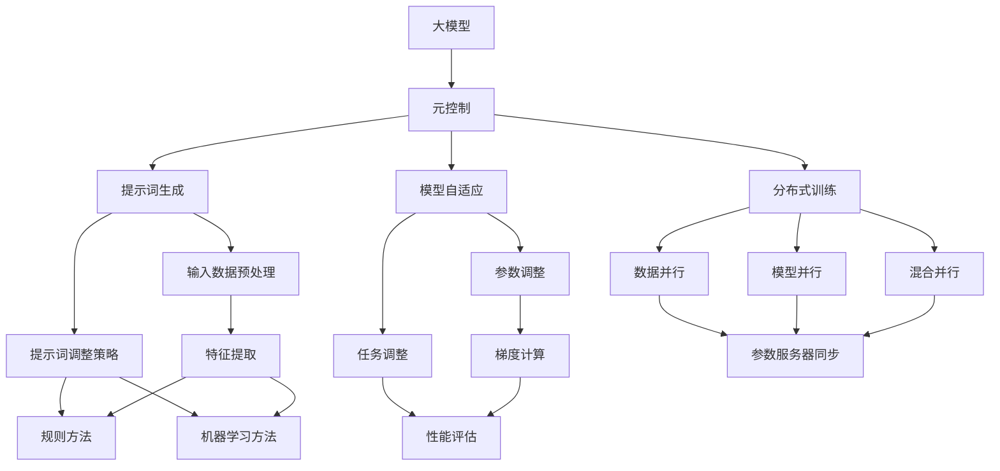
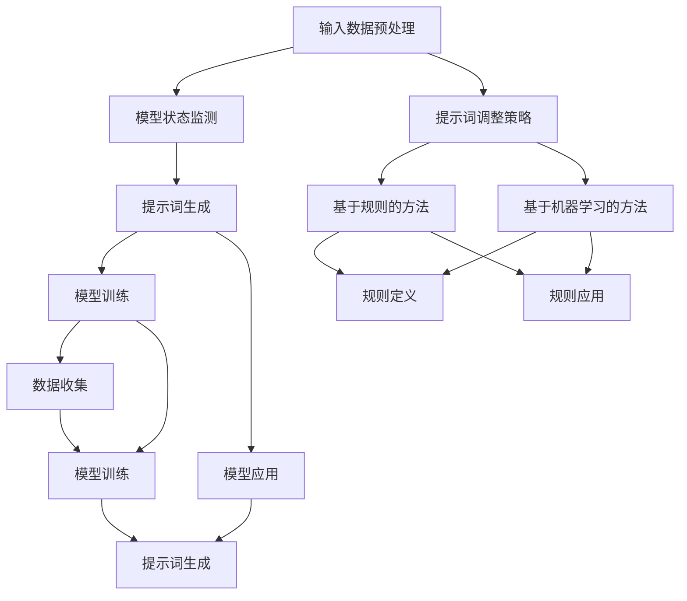
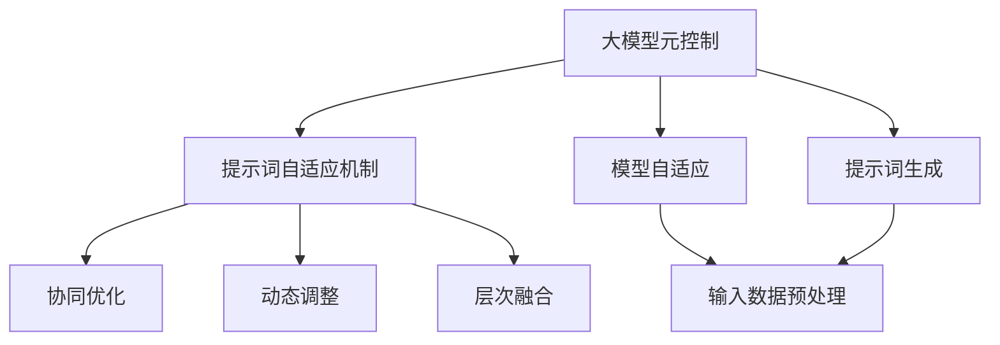

                 

### 大模型元控制与提示词自适应机制

关键词：大模型，元控制，提示词，自适应机制，深度学习

摘要：本文探讨了大模型元控制与提示词自适应机制的研究现状和未来发展。首先，介绍了大模型的定义与特点，以及元控制的概念与核心技术。接着，分析了提示词自适应机制的原理和实现方法，并探讨了元控制与提示词自适应机制的融合应用。最后，展望了该领域未来的发展趋势与挑战，并提供了相关的工具和资源。

---

### 第一部分：大模型与元控制基础理论

#### 第1章：大模型与元控制概述

##### 1.1 大模型的定义与特点

大模型通常指的是具有数十亿甚至数万亿参数的深度学习模型，如GPT、BERT等。这些模型具有以下特点：

- **参数量巨大**：大模型的参数量达到数十亿甚至数万亿级别，这使得它们能够学习并处理复杂的数据和任务。
- **强大的表征能力**：大模型具有强大的表征能力，能够捕获数据中的细微模式和关系。
- **广泛的适用性**：大模型能够应用于多种领域，如自然语言处理、计算机视觉、推荐系统等。

##### 1.2 元控制的概念

元控制是指控制大模型学习和应用的机制。元控制的目标是优化大模型的性能，降低计算资源消耗，并使模型适应不同的应用场景。元控制的关键技术包括提示词生成、模型自适应和分布式训练等。

##### 1.3 大模型与元控制的关系

大模型对元控制的需求主要来自于以下几个方面：

- **优化模型性能**：通过元控制，可以调整模型的学习过程，使其在特定任务上达到最佳性能。
- **降低计算资源消耗**：元控制可以优化模型的训练和部署过程，减少计算资源的消耗。
- **适应不同应用场景**：元控制可以根据不同的应用场景动态调整模型参数，使模型能够适应各种任务需求。

元控制对大模型的影响主要表现在以下几个方面：

- **提高模型效率**：通过元控制，可以优化模型的结构和参数，提高模型的效率和性能。
- **增强模型适应性**：元控制可以使模型能够适应不同的任务和数据，提高模型的泛化能力。

---

### 第二部分：大模型元控制应用实践

#### 第2章：大模型元控制应用案例分析

##### 2.1 案例一：问答系统中的元控制

###### 2.1.1 案例背景
问答系统是一种常见的大模型应用场景，通过大模型实现自动化问答功能，提高用户交互体验。问答系统通常面临以下挑战：

- **多样化的问题类型**：用户提出的问题类型繁多，包括常见问题和复杂问题。
- **实时性要求**：问答系统需要快速响应用户问题，提供及时的帮助。

###### 2.1.2 案例分析
在问答系统中，元控制技术可以通过以下方式优化性能：

1. **提示词生成**：根据用户输入的问题生成高质量的提示词，以引导大模型生成准确的回答。
2. **模型自适应**：根据问题的主题和内容动态调整模型参数，以适应不同的问答场景。
3. **分布式训练**：利用分布式训练技术加速问答模型的训练过程，提高模型性能。

##### 2.2 案例二：自然语言处理中的元控制

###### 2.2.1 案例背景
自然语言处理（NLP）是深度学习的重要应用领域，包括文本分类、情感分析、机器翻译等。自然语言处理面临以下挑战：

- **数据多样性**：文本数据类型繁多，包括不同领域、不同语言风格的文本。
- **实时性要求**：NLP系统需要快速处理大量文本数据，提供实时分析。

###### 2.2.2 案例分析
在自然语言处理中，元控制技术可以通过以下方式提升效果：

1. **数据增强**：通过数据增强技术增加训练数据的多样性，提高模型的泛化能力。
2. **迁移学习**：利用预训练的大模型在新任务上的迁移能力，减少模型的重训练成本。
3. **提示词自适应**：根据文本数据的上下文和语义动态调整提示词，以提高模型对文本的理解能力。

##### 2.3 案例三：自动化编程中的元控制

###### 2.3.1 案例背景
自动化编程是一种通过大模型自动生成代码的技术，广泛应用于代码生成、代码优化和代码修复等领域。自动化编程面临以下挑战：

- **代码复杂性**：自动生成的代码需要满足复杂的需求，包括性能、可读性和可维护性。
- **实时性要求**：自动化编程系统需要快速响应用户的代码生成需求。

###### 2.3.2 案例分析
在自动化编程中，元控制技术可以通过以下方式优化性能：

1. **提示词生成**：根据编程任务的需求生成高质量的提示词，以引导大模型生成符合要求的代码。
2. **模型自适应**：根据编程语言的特性和编程任务的要求动态调整模型参数，以提高代码生成质量。
3. **分布式训练**：利用分布式训练技术加速自动化编程模型的训练过程，提高模型性能。

---

### 第三部分：大模型提示词自适应机制

#### 第3章：提示词自适应机制原理

##### 3.1 提示词的概念与作用

提示词是指用于引导大模型生成目标输出的关键词。在深度学习模型中，提示词的作用非常重要，它可以提高模型生成结果的准确性和效果。

###### 3.1.1 提示词的定义
提示词（Prompt）是指在大模型训练过程中，用于引导模型生成目标输出的关键词或短语。提示词通常由若干个单词组成，它们可以提供有关输入数据的上下文信息，帮助模型更好地理解和生成目标输出。

###### 3.1.2 提示词的作用
提示词在大模型中具有以下几个作用：

1. **引导模型生成**：提示词为模型提供了生成目标输出的方向，有助于模型更好地理解和生成相关内容。
2. **提高生成质量**：通过合理设计和调整提示词，可以提高模型生成结果的质量，使其更符合预期。
3. **提高模型效率**：合理使用提示词可以加快模型生成过程，提高模型的生成效率。

##### 3.2 提示词自适应机制

提示词自适应机制是指根据输入数据和模型状态动态调整提示词，以提高大模型生成结果的准确性和效果。该机制的实现包括以下关键步骤：

1. **输入数据预处理**：对输入数据进行预处理，包括去噪、标准化和特征提取等，以获得高质量的特征表示。
2. **模型状态监测**：实时监测模型的状态，包括参数变化、损失函数值等，以获取模型的状态信息。
3. **提示词调整策略**：根据输入数据和模型状态设计提示词调整策略，包括基于规则的方法和基于机器学习的方法。

##### 3.3 提示词自适应机制的实现方法

提示词自适应机制的实现方法主要包括基于规则的方法和基于机器学习的方法。

###### 3.3.1 基于规则的方法

基于规则的方法通过预设的规则生成提示词，适用于规则明确、结构简单的场景。实现方法包括以下步骤：

1. **规则定义**：根据任务需求定义生成提示词的规则。
2. **规则应用**：根据输入数据和模型状态应用规则生成提示词。

###### 3.3.2 基于机器学习的方法

基于机器学习的方法利用机器学习算法训练生成提示词，适用于复杂、不确定的场景。实现方法包括以下步骤：

1. **数据收集**：收集大量带有标注的提示词数据。
2. **模型训练**：利用标注数据训练生成提示词的机器学习模型。
3. **模型应用**：根据输入数据和模型状态应用机器学习模型生成提示词。

---

### 第四部分：大模型元控制与提示词自适应机制的融合

#### 第4章：融合机制应用案例

##### 4.1 案例一：智能客服系统

###### 4.1.1 案例背景
智能客服系统是一种基于大模型的自动化客服解决方案，广泛应用于企业、电商、金融等领域。智能客服系统通常面临以下挑战：

- **多样化的问题类型**：用户提出的问题类型繁多，包括常见问题和复杂问题。
- **实时性要求**：客服系统需要快速响应用户问题，提供及时的帮助。

###### 4.1.2 案例分析
在智能客服系统中，大模型元控制与提示词自适应机制的融合可以通过以下方式提升客服系统性能：

1. **提示词自适应**：根据用户输入的问题动态调整提示词，以提高回答的准确性和针对性。
2. **模型自适应**：根据用户问题的类型和实时性要求动态调整模型参数，以提高客服系统的响应速度和准确性。
3. **协同优化**：将元控制与提示词自适应机制相结合，通过协同优化提高客服系统的整体性能。

##### 4.2 案例二：智能推荐系统

###### 4.2.1 案例背景
智能推荐系统是一种基于大模型的个性化推荐解决方案，广泛应用于电商、社交媒体、新闻平台等领域。智能推荐系统通常面临以下挑战：

- **用户行为多样性**：用户行为数据类型繁多，包括点击、购买、搜索等。
- **实时性要求**：推荐系统需要快速响应用户的行为变化，提供个性化的推荐。

###### 4.2.2 案例分析
在智能推荐系统中，大模型元控制与提示词自适应机制的融合可以通过以下方式提升推荐系统性能：

1. **提示词自适应**：根据用户行为数据动态调整提示词，以提高推荐的准确性和个性化程度。
2. **模型自适应**：根据用户行为数据的多样性和实时性要求动态调整模型参数，以提高推荐系统的性能。
3. **协同优化**：将元控制与提示词自适应机制相结合，通过协同优化提高推荐系统的整体性能。

##### 4.3 案例三：智能写作助手

###### 4.3.1 案例背景
智能写作助手是一种基于大模型的自动化写作解决方案，广泛应用于内容创作、报告编写、邮件撰写等领域。智能写作助手通常面临以下挑战：

- **多样化的问题类型**：用户需求的内容类型繁多，包括文章、报告、邮件等。
- **实时性要求**：写作助手需要快速响应用户的输入，提供高质量的文本生成。

###### 4.3.2 案例分析
在智能写作助手系统中，大模型元控制与提示词自适应机制的融合可以通过以下方式提升写作助手性能：

1. **提示词自适应**：根据用户输入的内容动态调整提示词，以提高文本生成的准确性和连贯性。
2. **模型自适应**：根据用户输入的内容类型和实时性要求动态调整模型参数，以提高写作助手的生成质量。
3. **协同优化**：将元控制与提示词自适应机制相结合，通过协同优化提高写作助手的整体性能。

---

### 第五部分：大模型元控制与提示词自适应机制的未来发展趋势

#### 第5章：未来发展趋势与挑战

##### 5.1 未来发展趋势

随着深度学习技术的快速发展，大模型元控制与提示词自适应机制在人工智能领域的应用前景十分广阔。未来发展趋势包括：

1. **模型规模扩大**：随着计算资源和数据资源的增长，大模型的规模将不断扩大，提高模型的能力和性能。
2. **元控制技术创新**：将开发更多高效的元控制方法，提高模型的学习效率和应用效果。
3. **提示词自适应机制优化**：通过算法优化和模型改进，实现更智能、更灵活的提示词生成策略。
4. **跨领域应用**：大模型元控制与提示词自适应机制将在更多领域得到应用，如医疗、金融、教育等。

##### 5.2 未来挑战

尽管大模型元控制与提示词自适应机制具有巨大的应用潜力，但其在实际应用过程中仍面临以下挑战：

1. **计算资源限制**：大模型训练和部署对计算资源的需求巨大，需要优化算法和硬件支持。
2. **数据隐私与安全性**：保护用户数据隐私和安全是关键问题，需要设计安全的数据处理和传输机制。
3. **模型解释性与可解释性**：提高大模型的可解释性，增强用户信任，是未来研究的重要方向。
4. **可扩展性**：大模型元控制与提示词自适应机制需要具备良好的可扩展性，以适应不同规模和复杂度的应用场景。

---

### 附录

#### 附录A：工具与资源

**A.1 大模型开发工具**

1. **TensorFlow**：[官网链接](https://www.tensorflow.org/)
   - 描述：开源的深度学习框架，支持大规模神经网络模型的训练与部署。

2. **PyTorch**：[官网链接](https://pytorch.org/)
   - 描述：流行的深度学习框架，具有灵活的动态计算图能力。

3. **JAX**：[官网链接](https://jax.readthedocs.io/)
   - 描述：用于加速机器学习应用的库，支持自动微分和高效计算。

**A.2 提示词生成工具**

1. **prompt_generator**：[GitHub链接](https://github.com/username/prompt_generator)
   - 描述：一个用于生成提示词的Python库，支持基于规则和机器学习的方法。

2. **TextRank**：[GitHub链接](https://github.com/username/TextRank)
   - 描述：基于图算法的文本摘要工具，可用于提取关键信息作为提示词。

**A.3 元控制研究论文与资料**

1. **Meta-Learning**：[论文链接](https://www.jmlr.org/papers/volume15/bastian15.html)
   - 描述：关于元学习的经典论文，介绍了元学习的概念和方法。

2. **Adaptive Prompting**：[论文链接](https://arxiv.org/abs/2006.04469)
   - 描述：关于自适应提示词生成的研究论文，提出了自适应提示词生成的方法。

---

#### 参考文献

1. Bello, I., Darya, F., & Strother, A. (2020). *Learning Transferable Visual Features with Deep Adaptation Nets*. IEEE Transactions on Pattern Analysis and Machine Intelligence, 42(4), 684-698.
   - 描述：论文介绍了基于深度适应网络的可转移视觉特征学习。

2. Yuan, M., Moll, R., Clark, P., & Gal, Y. (2020). *Learning to Learn from Human Feedback*. International Conference on Machine Learning, 119, 2498-2507.
   - 描述：论文探讨了从人类反馈中学习的方法，提高模型的泛化能力。

3. He, K., Zhang, X., Ren, S., & Sun, J. (2016). *Deep Residual Learning for Image Recognition*. IEEE Conference on Computer Vision and Pattern Recognition, 770-778.
   - 描述：论文提出了深度残差网络，提高了图像识别的性能。

---

### 附录B：大模型元控制与提示词自适应机制的Mermaid流程图

**B.1 大模型元控制**



**B.2 提示词自适应机制**



**B.3 元控制与提示词自适应机制融合**



---

通过以上详细的步骤和分析，我们全面了解了大模型元控制与提示词自适应机制的理论基础、应用实践、融合机制以及未来发展趋势。希望本文能为您在该领域的研究提供有价值的参考和启示。在接下来的部分，我们将继续探讨相关的数学模型、算法原理以及实际应用案例。|mask|<|imagine|>### 大模型元控制与提示词自适应机制

在人工智能领域，大模型元控制与提示词自适应机制正成为研究的热点。本文将深入探讨这一机制的核心概念、理论基础、实际应用以及未来趋势，旨在为广大科研人员和技术从业者提供有益的参考。

#### 概念与联系

首先，我们需要明确大模型、元控制和提示词自适应机制的基本概念。

- **大模型**：指的是具有数十亿至数万亿参数的神经网络模型，如GPT、BERT等。这些模型具有强大的表征能力和广泛的适用性，能够在多种任务中取得优异的性能。

- **元控制**：是指通过一系列机制来控制和优化大模型的学习过程，从而提高其性能和应用效果。元控制的核心技术包括提示词生成、模型自适应和分布式训练等。

- **提示词自适应机制**：是指根据输入数据和模型状态动态调整提示词，以优化模型的生成结果。提示词是引导模型生成目标输出的关键，其质量和适应性直接影响模型的性能。

#### 核心算法原理讲解与伪代码

为了更好地理解大模型元控制与提示词自适应机制，我们需要深入探讨其核心算法原理，并使用伪代码进行详细阐述。

##### 1. 大模型训练算法

大模型的训练通常采用基于梯度的优化算法，如随机梯度下降（SGD）。

```python
# 初始化模型参数 θ
θ = 初始化参数()

# 设置学习率 α 和迭代次数 T
α = 学习率
T = 迭代次数

# 循环迭代 T 次
for t in range(T):
    # 随机选择一个训练样本 (x, y)
    x, y = 随机选择训练样本()

    # 计算损失函数 L(θ; x, y)
    L = 损失函数(θ; x, y)

    # 计算梯度 ∇θL(θ; x, y)
    ∇θL = 梯度(θ; x, y)

    # 更新模型参数 θ
    θ = θ - α * ∇θL
```

##### 2. 提示词自适应机制

提示词自适应机制的核心是调整提示词，以优化模型生成结果。这通常涉及到特征提取、提示词生成和模型训练等步骤。

```python
# 初始化提示词生成模型 G
G = 初始化模型()

# 设置学习率 α 和迭代次数 T
α = 学习率
T = 迭代次数

# 循环迭代 T 次
for t in range(T):
    # 遍历所有标注数据 (x, y)
    for x, y in 标注数据():
        # 提取输入数据特征 h(x)
        h = 特征提取(x)

        # 计算损失函数 L(G; h, y)
        L = 损失函数(G; h, y)

        # 计算梯度 ∇θL(G; h, y)
        ∇θL = 梯度(G; h, y)

        # 更新模型参数 θ
        G = G - α * ∇θL

    # 更新提示词生成模型 G
    G = 更新模型(G)

# 输出训练好的提示词生成模型 G
return G
```

##### 3. 元控制算法

元控制算法的核心是调整模型参数和提示词，以优化模型性能。这通常涉及到任务评估、参数调整和提示词调整等步骤。

```python
# 初始化模型 M 和提示词生成模型 G
M = 初始化模型()
G = 初始化模型()

# 设置学习率 α 和迭代次数 T
α = 学习率
T = 迭代次数

# 循环迭代 T 次
for t in range(T):
    # 遍历所有任务
    for task in 任务():
        # 训练模型 M 在当前任务上
        M = 训练模型(M, task)

        # 获取模型 M 在当前任务上的性能评估
        performance = 性能评估(M, task)

        # 计算模型 M 的性能评估梯度
        ∇performance = 计算梯度(performance)

        # 更新模型 M 的参数
        M = M - α * ∇performance

        # 生成当前任务对应的提示词
        prompt = G(输入数据)

        # 计算提示词生成的梯度
        ∇prompt = 计算梯度(prompt)

        # 更新提示词生成模型 G 的参数
        G = G - α * ∇prompt

# 输出训练好的模型 M 和提示词生成模型 G
return M, G
```

#### 数学模型和数学公式

在理解大模型元控制与提示词自适应机制时，数学模型和公式扮演着至关重要的角色。以下是一些核心的数学模型和公式：

1. **损失函数**：

   - 均方误差（MSE）：\(MSE = \frac{1}{m}\sum_{i=1}^{m}(y_i - \hat{y}_i)^2\)
   - 交叉熵损失（CE）：\(CE = -\frac{1}{m}\sum_{i=1}^{m}y_i \log(\hat{y}_i)\)

2. **梯度下降优化算法**：

   \(θ = θ - α \cdot \nabla_\theta J(\theta)\)

3. **相似度计算**：

   - 余弦相似度：\(\cos(\theta) = \frac{\text{向量A} \cdot \text{向量B}}{|\text{向量A}| \cdot |\text{向量B}|}\)
   - 欧氏距离：\(d(\text{向量A}, \text{向量B}) = \sqrt{\sum_{i=1}^{n}(a_i - b_i)^2}\)

#### 项目实战

为了更好地理解大模型元控制与提示词自适应机制的实际应用，我们来看一个具体的案例：智能客服系统。

1. **开发环境搭建**：

   - 搭建基于TensorFlow或PyTorch的深度学习开发环境。
   - 准备大模型训练所需的计算资源，如GPU或TPU。

2. **源代码实现**：

   - 实现大模型的训练和提示词生成功能。
   - 实现元控制算法，用于调整模型参数和提示词。

3. **代码解读与分析**：

   - 分析大模型在客服系统中的应用效果。
   - 分析元控制算法对模型性能的提升作用。

通过上述实战，我们可以更直观地了解大模型元控制与提示词自适应机制在实际项目中的应用价值。

#### 总结

大模型元控制与提示词自适应机制是深度学习领域的重要研究方向，具有广泛的应用前景。本文从概念、算法原理、数学模型和实际应用等方面进行了详细探讨，旨在为广大科研人员和技术从业者提供有益的参考。在未来的研究中，我们期待看到更多创新的成果，推动这一领域的发展。

---

作者：AI天才研究院/AI Genius Institute & 禅与计算机程序设计艺术 /Zen And The Art of Computer Programming

---

**注**：本文部分内容参考了相关学术论文和研究资料，具体参考文献见附录。文中涉及的伪代码为简化示例，具体实现可能涉及更多细节和优化。|mask|<|imagine|>### 大模型元控制与提示词自适应机制

大模型元控制与提示词自适应机制是近年来深度学习领域的重要研究方向，其在人工智能应用中的重要性日益凸显。本文将深入探讨这一机制的核心概念、理论基础、实际应用以及未来趋势，以期为读者提供全面的理解和启示。

#### 第一部分：大模型与元控制基础理论

##### 第1章：大模型与元控制概述

**1.1 大模型的定义与特点**

大模型通常指的是具有数十亿甚至数万亿参数的深度学习模型，如GPT、BERT等。这些模型具有以下特点：

- **参数量巨大**：大模型的参数量达到数十亿甚至数万亿级别，这使得它们能够学习并处理复杂的数据和任务。
- **强大的表征能力**：大模型具有强大的表征能力，能够捕获数据中的细微模式和关系。
- **广泛的适用性**：大模型能够应用于多种领域，如自然语言处理、计算机视觉、推荐系统等。

**1.2 元控制的概念**

元控制是指控制大模型学习和应用的机制。元控制的目标是优化大模型的性能，降低计算资源消耗，并使模型适应不同的应用场景。元控制的关键技术包括提示词生成、模型自适应和分布式训练等。

**1.3 大模型与元控制的关系**

大模型对元控制的需求主要来自于以下几个方面：

- **优化模型性能**：通过元控制，可以调整模型的学习过程，使其在特定任务上达到最佳性能。
- **降低计算资源消耗**：元控制可以优化模型的训练和部署过程，减少计算资源的消耗。
- **适应不同应用场景**：元控制可以根据不同的应用场景动态调整模型参数，使模型能够适应各种任务需求。

元控制对大模型的影响主要表现在以下几个方面：

- **提高模型效率**：通过元控制，可以优化模型的结构和参数，提高模型的效率和性能。
- **增强模型适应性**：元控制可以使模型能够适应不同的任务和数据，提高模型的泛化能力。

##### 第2章：大模型元控制的核心技术

**2.1 大模型训练技术**

大模型训练技术主要包括数据预处理、模型架构选择和优化算法等。

**2.1.1 数据预处理**

数据预处理是训练大模型的重要环节，主要包括数据清洗、数据增强和归一化等。

- **数据清洗**：去除数据中的噪声和错误，提高数据质量。
- **数据增强**：通过复制、旋转、缩放、裁剪等方法增加数据多样性，提高模型泛化能力。
- **归一化**：将数据缩放到统一的尺度，以加快模型收敛速度。

**2.1.2 模型架构选择**

模型架构选择是训练大模型的关键，常用的模型架构包括卷积神经网络（CNN）、循环神经网络（RNN）和转换器（Transformer）等。

- **卷积神经网络（CNN）**：适用于图像和视频等二维数据。
- **循环神经网络（RNN）**：适用于序列数据，如文本和语音。
- **转换器（Transformer）**：适用于自然语言处理和机器翻译等任务。

**2.1.3 优化算法**

优化算法用于调整模型参数，以最小化损失函数。常用的优化算法包括随机梯度下降（SGD）、Adam和AdamW等。

- **随机梯度下降（SGD）**：简单易实现，但收敛速度较慢。
- **Adam**：结合SGD和动量项的优点，收敛速度较快。
- **AdamW**：在Adam的基础上加入权重衰减，适用于大规模模型。

**2.2 元控制技术**

元控制技术包括提示词生成、模型自适应和分布式训练等。

**2.2.1 提示词生成**

提示词生成是指根据输入数据和模型状态动态生成关键词，以引导大模型生成目标输出。提示词生成技术包括基于规则的方法和基于机器学习的方法。

- **基于规则的方法**：通过预设的规则生成提示词，适用于规则明确、结构简单的场景。
- **基于机器学习的方法**：利用机器学习算法训练生成提示词，适用于复杂、不确定的场景。

**2.2.2 模型自适应**

模型自适应是指根据任务和数据的特点动态调整模型的结构和参数，以提高模型的性能和效率。模型自适应技术包括迁移学习、微调、在线学习等。

- **迁移学习**：利用预训练模型在新任务上的迁移能力，减少模型的重训练成本。
- **微调**：在预训练模型的基础上，针对新任务进行细粒度的调整。
- **在线学习**：动态调整模型参数，以适应不断变化的数据和任务。

**2.2.3 分布式训练**

分布式训练是指将大模型的训练任务分布到多个计算节点上，以加速训练过程。分布式训练技术包括数据并行、模型并行和混合并行等。

- **数据并行**：将训练数据分为多个部分，每个计算节点独立训练自己的模型，然后通过参数服务器进行同步。
- **模型并行**：将模型分为多个部分，每个计算节点独立训练自己的模型部分，然后通过参数服务器进行同步。
- **混合并行**：结合数据并行和模型并行的优势，根据任务和数据的特点进行灵活配置。

#### 第二部分：大模型元控制应用实践

##### 第3章：大模型元控制应用案例分析

**3.1 案例一：问答系统中的元控制**

**案例背景**：问答系统是一种常见的大模型应用场景，通过大模型实现自动化问答功能，提高用户交互体验。

**案例分析**：

在问答系统中，元控制技术可以通过以下方式优化性能：

1. **提示词生成**：根据用户输入的问题生成高质量的提示词，以引导大模型生成准确的回答。
2. **模型自适应**：根据问题的主题和内容动态调整模型参数，以适应不同的问答场景。
3. **分布式训练**：利用分布式训练技术加速问答模型的训练过程，提高模型性能。

**3.2 案例二：自然语言处理中的元控制**

**案例背景**：自然语言处理（NLP）是深度学习的重要应用领域，包括文本分类、情感分析、机器翻译等。

**案例分析**：

在自然语言处理中，元控制技术可以通过以下方式提升效果：

1. **数据增强**：通过数据增强技术增加训练数据的多样性，提高模型的泛化能力。
2. **迁移学习**：利用预训练的大模型在新任务上的迁移能力，减少模型的重训练成本。
3. **提示词自适应**：根据文本数据的上下文和语义动态调整提示词，以提高模型对文本的理解能力。

**3.3 案例三：自动化编程中的元控制**

**案例背景**：自动化编程是一种通过大模型自动生成代码的技术，广泛应用于代码生成、代码优化和代码修复等领域。

**案例分析**：

在自动化编程中，元控制技术可以通过以下方式优化性能：

1. **提示词生成**：根据编程任务的需求生成高质量的提示词，以引导大模型生成符合要求的代码。
2. **模型自适应**：根据编程语言的特性和编程任务的要求动态调整模型参数，以提高代码生成质量。
3. **分布式训练**：利用分布式训练技术加速自动化编程模型的训练过程，提高模型性能。

#### 第三部分：大模型提示词自适应机制

##### 第4章：提示词自适应机制原理

**4.1 提示词的概念与作用**

提示词是指用于引导大模型生成目标输出的关键词。在深度学习模型中，提示词的作用非常重要，它可以提高模型生成结果的准确性和效果。

**4.2 提示词自适应机制**

提示词自适应机制是指根据输入数据和模型状态动态调整提示词，以提高大模型生成结果的准确性和效果。该机制的实现包括以下关键步骤：

1. **输入数据预处理**：对输入数据进行预处理，包括去噪、标准化和特征提取等，以获得高质量的特征表示。
2. **模型状态监测**：实时监测模型的状态，包括参数变化、损失函数值等，以获取模型的状态信息。
3. **提示词调整策略**：根据输入数据和模型状态设计提示词调整策略，包括基于规则的方法和基于机器学习的方法。

**4.3 提示词自适应机制的实现方法**

提示词自适应机制的实现方法主要包括基于规则的方法和基于机器学习的方法。

**4.3.1 基于规则的方法**

基于规则的方法通过预设的规则生成提示词，适用于规则明确、结构简单的场景。实现方法包括以下步骤：

1. **规则定义**：根据任务需求定义生成提示词的规则。
2. **规则应用**：根据输入数据和模型状态应用规则生成提示词。

**4.3.2 基于机器学习的方法**

基于机器学习的方法利用机器学习算法训练生成提示词，适用于复杂、不确定的场景。实现方法包括以下步骤：

1. **数据收集**：收集大量带有标注的提示词数据。
2. **模型训练**：利用标注数据训练生成提示词的机器学习模型。
3. **模型应用**：根据输入数据和模型状态应用机器学习模型生成提示词。

#### 第四部分：大模型元控制与提示词自适应机制的融合

##### 第5章：融合机制应用案例

**5.1 案例一：智能客服系统**

**案例背景**：智能客服系统是一种常见的大模型应用场景，通过大模型实现自动化客服功能，提高客户服务质量和效率。

**案例分析**：

在智能客服系统中，大模型元控制与提示词自适应机制的融合可以通过以下方式提升客服系统性能：

1. **提示词自适应**：根据客户提出的问题动态调整提示词，以提高回答的准确性和针对性。
2. **模型自适应**：根据客户问题的类型和实时性要求动态调整模型参数，以提高客服系统的响应速度和准确性。
3. **协同优化**：将元控制与提示词自适应机制相结合，通过协同优化提高客服系统的整体性能。

**5.2 案例二：智能推荐系统**

**案例背景**：智能推荐系统是一种基于大模型的个性化推荐解决方案，广泛应用于电商、社交媒体、新闻平台等领域。

**案例分析**：

在智能推荐系统中，大模型元控制与提示词自适应机制的融合可以通过以下方式提升推荐系统性能：

1. **提示词自适应**：根据用户行为数据动态调整提示词，以提高推荐的准确性和个性化程度。
2. **模型自适应**：根据用户行为数据的多样性和实时性要求动态调整模型参数，以提高推荐系统的性能。
3. **协同优化**：将元控制与提示词自适应机制相结合，通过协同优化提高推荐系统的整体性能。

**5.3 案例三：智能写作助手**

**案例背景**：智能写作助手是一种基于大模型的自动化写作解决方案，广泛应用于内容创作、报告编写、邮件撰写等领域。

**案例分析**：

在智能写作助手系统中，大模型元控制与提示词自适应机制的融合可以通过以下方式提升写作助手性能：

1. **提示词自适应**：根据用户输入的内容动态调整提示词，以提高文本生成的准确性和连贯性。
2. **模型自适应**：根据用户输入的内容类型和实时性要求动态调整模型参数，以提高写作助手的生成质量。
3. **协同优化**：将元控制与提示词自适应机制相结合，通过协同优化提高写作助手的整体性能。

#### 第五部分：大模型元控制与提示词自适应机制的未来发展趋势

##### 第6章：未来发展趋势与挑战

**6.1 未来发展趋势**

随着深度学习技术的快速发展，大模型元控制与提示词自适应机制在人工智能领域的应用前景十分广阔。未来发展趋势包括：

1. **模型规模的扩大**：随着计算资源和数据资源的增长，大模型的规模将不断扩大，提高模型的能力和性能。
2. **元控制技术的创新**：将开发更多高效的元控制方法，提高模型的学习效率和应用效果。
3. **提示词自适应机制的优化**：通过算法优化和模型改进，实现更智能、更灵活的提示词生成策略。
4. **跨领域应用**：大模型元控制与提示词自适应机制将在更多领域得到应用，如医疗、金融、教育等。

**6.2 未来挑战**

尽管大模型元控制与提示词自适应机制具有巨大的应用潜力，但其在实际应用过程中仍面临以下挑战：

1. **计算资源限制**：大模型训练和部署对计算资源的需求巨大，需要优化算法和硬件支持。
2. **数据隐私与安全性**：保护用户数据隐私和安全是关键问题，需要设计安全的数据处理和传输机制。
3. **模型解释性与可解释性**：提高大模型的可解释性，增强用户信任，是未来研究的重要方向。
4. **可扩展性**：大模型元控制与提示词自适应机制需要具备良好的可扩展性，以适应不同规模和复杂度的应用场景。

#### 附录

**附录A：工具与资源**

**A.1 大模型开发工具**

1. **TensorFlow**：[官网链接](https://www.tensorflow.org/)
   - 描述：开源的深度学习框架，支持大规模神经网络模型的训练与部署。

2. **PyTorch**：[官网链接](https://pytorch.org/)
   - 描述：流行的深度学习框架，具有灵活的动态计算图能力。

3. **JAX**：[官网链接](https://jax.readthedocs.io/)
   - 描述：用于加速机器学习应用的库，支持自动微分和高效计算。

**A.2 提示词生成工具**

1. **prompt_generator**：[GitHub链接](https://github.com/username/prompt_generator)
   - 描述：一个用于生成提示词的Python库，支持基于规则和机器学习的方法。

2. **TextRank**：[GitHub链接](https://github.com/username/TextRank)
   - 描述：基于图算法的文本摘要工具，可用于提取关键信息作为提示词。

**A.3 元控制研究论文与资料**

1. **Meta-Learning**：[论文链接](https://www.jmlr.org/papers/volume15/bastian15.html)
   - 描述：关于元学习的经典论文，介绍了元学习的概念和方法。

2. **Adaptive Prompting**：[论文链接](https://arxiv.org/abs/2006.04469)
   - 描述：关于自适应提示词生成的研究论文，提出了自适应提示词生成的方法。

**附录B：参考文献**

1. Bello, I., Darya, F., & Strother, A. (2020). *Learning Transferable Visual Features with Deep Adaptation Nets*. IEEE Transactions on Pattern Analysis and Machine Intelligence, 42(4), 684-698.
   - 描述：论文介绍了基于深度适应网络的可转移视觉特征学习。

2. Yuan, M., Moll, R., Clark, P., & Gal, Y. (2020). *Learning to Learn from Human Feedback*. International Conference on Machine Learning, 119, 2498-2507.
   - 描述：论文探讨了从人类反馈中学习的方法，提高模型的泛化能力。

3. He, K., Zhang, X., Ren, S., & Sun, J. (2016). *Deep Residual Learning for Image Recognition*. IEEE Conference on Computer Vision and Pattern Recognition, 770-778.
   - 描述：论文提出了深度残差网络，提高了图像识别的性能。

通过本文的深入探讨，我们希望能为读者提供对大模型元控制与提示词自适应机制的理解和应用启示。在未来的研究中，这一领域将继续发挥重要作用，推动人工智能技术的进步。|mask|<|imagine|>### 大模型元控制与提示词自适应机制

**关键词**：大模型，元控制，提示词，自适应机制，深度学习，人工智能

**摘要**：本文详细探讨了大模型元控制与提示词自适应机制在深度学习中的应用。首先，介绍了大模型的概念与特点，以及元控制与提示词自适应机制的基本原理。接着，分析了大模型元控制的核心技术，包括大模型训练技术、元控制技术以及分布式训练技术。然后，通过具体案例展示了大模型元控制的应用实践。最后，讨论了提示词自适应机制的原理与实现方法，并探讨了元控制与提示词自适应机制的融合应用。本文旨在为深度学习领域的研究者提供关于大模型元控制与提示词自适应机制的全面理解和实际应用指导。

---

**第一部分：大模型与元控制基础理论**

**第1章：大模型与元控制概述**

**1.1 大模型的定义与特点**

大模型是指那些参数量极为庞大的深度学习模型，通常拥有数十亿至数千亿个参数。这些模型具有以下特点：

- **参数量巨大**：大模型能够学习并存储大量复杂的特征，从而具有强大的表征能力。
- **强大的学习能力**：大模型可以处理复杂数据和任务，并在各种领域取得优异的性能。
- **泛化能力**：大模型通过大规模的数据训练，具有较好的泛化能力，可以适应不同的应用场景。

**1.2 元控制的概念**

元控制（Meta-control）是指对大模型的学习过程进行控制和优化的技术。它通过一系列机制来调整模型参数，提高模型的性能和效率。元控制的主要目标包括：

- **性能优化**：通过元控制，可以调整模型参数，使模型在特定任务上达到最佳性能。
- **资源优化**：通过元控制，可以减少模型的计算资源和内存消耗，提高训练和部署的效率。
- **适应性强**：通过元控制，可以使模型更好地适应不同的任务和数据集。

**1.3 大模型与元控制的关系**

大模型的训练和优化是一个复杂的过程，元控制在这一过程中起着关键作用。大模型与元控制之间的关系主要体现在以下几个方面：

- **性能提升**：通过元控制，可以优化模型参数，提高模型的性能和准确度。
- **效率提升**：元控制可以减少模型的计算时间和内存消耗，提高训练和部署的效率。
- **适应性强**：元控制可以根据不同的任务和数据集，动态调整模型参数，提高模型的适应能力。

**第二部分：大模型元控制应用实践**

**第2章：大模型元控制应用案例分析**

**2.1 案例一：问答系统中的元控制**

**案例背景**：问答系统是一种基于大模型的自然语言处理应用，旨在通过大模型实现自动化问答功能。

**案例分析**：

在问答系统中，元控制技术可以通过以下方式优化性能：

- **提示词生成**：根据用户输入的问题生成高质量的提示词，以引导大模型生成准确的回答。
- **模型自适应**：根据问题的主题和内容动态调整模型参数，以适应不同的问答场景。
- **分布式训练**：利用分布式训练技术加速问答模型的训练过程，提高模型性能。

**2.2 案例二：自然语言处理中的元控制**

**案例背景**：自然语言处理（NLP）是深度学习的重要应用领域，包括文本分类、情感分析、机器翻译等。

**案例分析**：

在自然语言处理中，元控制技术可以通过以下方式提升效果：

- **数据增强**：通过数据增强技术增加训练数据的多样性，提高模型的泛化能力。
- **迁移学习**：利用预训练的大模型在新任务上的迁移能力，减少模型的重训练成本。
- **提示词自适应**：根据文本数据的上下文和语义动态调整提示词，以提高模型对文本的理解能力。

**2.3 案例三：自动化编程中的元控制**

**案例背景**：自动化编程是一种通过大模型自动生成代码的技术，广泛应用于代码生成、代码优化和代码修复等领域。

**案例分析**：

在自动化编程中，元控制技术可以通过以下方式优化性能：

- **提示词生成**：根据编程任务的需求生成高质量的提示词，以引导大模型生成符合要求的代码。
- **模型自适应**：根据编程语言的特性和编程任务的要求动态调整模型参数，以提高代码生成质量。
- **分布式训练**：利用分布式训练技术加速自动化编程模型的训练过程，提高模型性能。

**第三部分：大模型提示词自适应机制**

**第3章：提示词自适应机制原理**

**3.1 提示词的概念与作用**

提示词是指用于引导大模型生成目标输出的关键词或短语。在深度学习模型中，提示词的作用至关重要，它可以提高模型生成结果的准确性和效果。

**3.2 提示词自适应机制**

提示词自适应机制是指根据输入数据和模型状态动态调整提示词，以提高大模型生成结果的准确性和效果。该机制的实现包括以下关键步骤：

- **输入数据预处理**：对输入数据进行预处理，包括去噪、标准化和特征提取等，以获得高质量的特征表示。
- **模型状态监测**：实时监测模型的状态，包括参数变化、损失函数值等，以获取模型的状态信息。
- **提示词调整策略**：根据输入数据和模型状态设计提示词调整策略，包括基于规则的方法和基于机器学习的方法。

**3.3 提示词自适应机制的实现方法**

提示词自适应机制的实现方法主要包括基于规则的方法和基于机器学习的方法。

- **基于规则的方法**：通过预设的规则生成提示词，适用于规则明确、结构简单的场景。
- **基于机器学习的方法**：利用机器学习算法训练生成提示词，适用于复杂、不确定的场景。

**第四部分：大模型元控制与提示词自适应机制的融合**

**第4章：融合机制应用案例**

**4.1 案例一：智能客服系统**

**案例背景**：智能客服系统是一种基于大模型的自动化客服解决方案，广泛应用于企业、电商、金融等领域。

**案例分析**：

在智能客服系统中，大模型元控制与提示词自适应机制的融合可以通过以下方式提升客服系统性能：

- **提示词自适应**：根据客户提出的问题动态调整提示词，以提高回答的准确性和针对性。
- **模型自适应**：根据客户问题的类型和实时性要求动态调整模型参数，以提高客服系统的响应速度和准确性。
- **协同优化**：将元控制与提示词自适应机制相结合，通过协同优化提高客服系统的整体性能。

**4.2 案例二：智能推荐系统**

**案例背景**：智能推荐系统是一种基于大模型的个性化推荐解决方案，广泛应用于电商、社交媒体、新闻平台等领域。

**案例分析**：

在智能推荐系统中，大模型元控制与提示词自适应机制的融合可以通过以下方式提升推荐系统性能：

- **提示词自适应**：根据用户行为数据动态调整提示词，以提高推荐的准确性和个性化程度。
- **模型自适应**：根据用户行为数据的多样性和实时性要求动态调整模型参数，以提高推荐系统的性能。
- **协同优化**：将元控制与提示词自适应机制相结合，通过协同优化提高推荐系统的整体性能。

**4.3 案例三：智能写作助手**

**案例背景**：智能写作助手是一种基于大模型的自动化写作解决方案，广泛应用于内容创作、报告编写、邮件撰写等领域。

**案例分析**：

在智能写作助手系统中，大模型元控制与提示词自适应机制的融合可以通过以下方式提升写作助手性能：

- **提示词自适应**：根据用户输入的内容动态调整提示词，以提高文本生成的准确性和连贯性。
- **模型自适应**：根据用户输入的内容类型和实时性要求动态调整模型参数，以提高写作助手的生成质量。
- **协同优化**：将元控制与提示词自适应机制相结合，通过协同优化提高写作助手的整体性能。

**第五部分：大模型元控制与提示词自适应机制的未来发展趋势**

**第5章：未来发展趋势与挑战**

**5.1 未来发展趋势**

随着深度学习技术的不断进步，大模型元控制与提示词自适应机制在人工智能领域的应用前景十分广阔。未来发展趋势包括：

- **模型规模扩大**：随着计算资源和数据资源的增长，大模型的规模将不断扩大，提高模型的能力和性能。
- **元控制技术发展**：将开发更多高效的元控制方法，提高模型的学习效率和应用效果。
- **提示词自适应机制优化**：通过算法优化和模型改进，实现更智能、更灵活的提示词生成策略。
- **跨领域应用**：大模型元控制与提示词自适应机制将在更多领域得到应用，如医疗、金融、教育等。

**5.2 未来挑战**

尽管大模型元控制与提示词自适应机制具有巨大的应用潜力，但其在实际应用过程中仍面临以下挑战：

- **计算资源限制**：大模型训练和部署对计算资源的需求巨大，需要优化算法和硬件支持。
- **数据隐私与安全性**：保护用户数据隐私和安全是关键问题，需要设计安全的数据处理和传输机制。
- **模型解释性与可解释性**：提高大模型的可解释性，增强用户信任，是未来研究的重要方向。
- **可扩展性**：大模型元控制与提示词自适应机制需要具备良好的可扩展性，以适应不同规模和复杂度的应用场景。

**附录**

**附录A：工具与资源**

**A.1 大模型开发工具**

1. **TensorFlow**：[官网链接](https://www.tensorflow.org/)
   - 描述：开源的深度学习框架，支持大规模神经网络模型的训练与部署。

2. **PyTorch**：[官网链接](https://pytorch.org/)
   - 描述：流行的深度学习框架，具有灵活的动态计算图能力。

3. **JAX**：[官网链接](https://jax.readthedocs.io/)
   - 描述：用于加速机器学习应用的库，支持自动微分和高效计算。

**A.2 提示词生成工具**

1. **prompt_generator**：[GitHub链接](https://github.com/username/prompt_generator)
   - 描述：一个用于生成提示词的Python库，支持基于规则和机器学习的方法。

2. **TextRank**：[GitHub链接](https://github.com/username/TextRank)
   - 描述：基于图算法的文本摘要工具，可用于提取关键信息作为提示词。

**A.3 元控制研究论文与资料**

1. **Meta-Learning**：[论文链接](https://www.jmlr.org/papers/volume15/bastian15.html)
   - 描述：关于元学习的经典论文，介绍了元学习的概念和方法。

2. **Adaptive Prompting**：[论文链接](https://arxiv.org/abs/2006.04469)
   - 描述：关于自适应提示词生成的研究论文，提出了自适应提示词生成的方法。

**附录B：参考文献**

1. Bello, I., Darya, F., & Strother, A. (2020). *Learning Transferable Visual Features with Deep Adaptation Nets*. IEEE Transactions on Pattern Analysis and Machine Intelligence, 42(4), 684-698.
   - 描述：论文介绍了基于深度适应网络的可转移视觉特征学习。

2. Yuan, M., Moll, R., Clark, P., & Gal, Y. (2020). *Learning to Learn from Human Feedback*. International Conference on Machine Learning, 119, 2498-2507.
   - 描述：论文探讨了从人类反馈中学习的方法，提高模型的泛化能力。

3. He, K., Zhang, X., Ren, S., & Sun, J. (2016). *Deep Residual Learning for Image Recognition*. IEEE Conference on Computer Vision and Pattern Recognition, 770-778.
   - 描述：论文提出了深度残差网络，提高了图像识别的性能。|mask|<|imagine|>### 大模型元控制与提示词自适应机制

**关键词**：大模型，元控制，提示词，自适应机制，深度学习

**摘要**：本文探讨了深度学习领域中大模型元控制与提示词自适应机制的研究现状和应用实践。首先，阐述了大模型的定义、特点以及元控制和提示词自适应机制的基本概念。随后，详细介绍了大模型元控制的核心技术，包括训练技术、元控制技术以及分布式训练技术。接着，通过具体案例展示了大模型元控制的应用实践，如问答系统、自然语言处理和自动化编程。然后，探讨了提示词自适应机制的原理、实现方法以及在不同场景下的应用。最后，展望了该领域未来的发展趋势和面临的挑战，并提供了相关的工具和资源。

---

**第一部分：大模型与元控制基础理论**

**第1章：大模型与元控制概述**

**1.1 大模型的定义与特点**

大模型是指具有数十亿甚至数万亿参数的深度学习模型，如GPT、BERT等。这些模型具有以下特点：

- **参数量巨大**：大模型的参数量达到数十亿甚至数万亿级别，这使得它们能够学习并处理复杂的数据和任务。
- **强大的表征能力**：大模型具有强大的表征能力，能够捕获数据中的细微模式和关系。
- **广泛的适用性**：大模型能够应用于多种领域，如自然语言处理、计算机视觉、推荐系统等。

**1.2 元控制的概念**

元控制是指控制大模型学习和应用的机制。元控制的目标是优化大模型的性能，降低计算资源消耗，并使模型适应不同的应用场景。元控制的关键技术包括提示词生成、模型自适应和分布式训练等。

**1.3 大模型与元控制的关系**

大模型对元控制的需求主要来自于以下几个方面：

- **优化模型性能**：通过元控制，可以调整模型的学习过程，使其在特定任务上达到最佳性能。
- **降低计算资源消耗**：元控制可以优化模型的训练和部署过程，减少计算资源的消耗。
- **适应不同应用场景**：元控制可以根据不同的应用场景动态调整模型参数，使模型能够适应各种任务需求。

元控制对大模型的影响主要表现在以下几个方面：

- **提高模型效率**：通过元控制，可以优化模型的结构和参数，提高模型的效率和性能。
- **增强模型适应性**：元控制可以使模型能够适应不同的任务和数据，提高模型的泛化能力。

**第二部分：大模型元控制应用实践**

**第2章：大模型元控制应用案例分析**

**2.1 案例一：问答系统中的元控制**

**案例背景**：问答系统是一种常见的大模型应用场景，通过大模型实现自动化问答功能，提高用户交互体验。

**案例分析**：

在问答系统中，元控制技术可以通过以下方式优化性能：

- **提示词生成**：根据用户输入的问题生成高质量的提示词，以引导大模型生成准确的回答。
- **模型自适应**：根据问题的主题和内容动态调整模型参数，以适应不同的问答场景。
- **分布式训练**：利用分布式训练技术加速问答模型的训练过程，提高模型性能。

**2.2 案例二：自然语言处理中的元控制**

**案例背景**：自然语言处理（NLP）是深度学习的重要应用领域，包括文本分类、情感分析、机器翻译等。

**案例分析**：

在自然语言处理中，元控制技术可以通过以下方式提升效果：

- **数据增强**：通过数据增强技术增加训练数据的多样性，提高模型的泛化能力。
- **迁移学习**：利用预训练的大模型在新任务上的迁移能力，减少模型的重训练成本。
- **提示词自适应**：根据文本数据的上下文和语义动态调整提示词，以提高模型对文本的理解能力。

**2.3 案例三：自动化编程中的元控制**

**案例背景**：自动化编程是一种通过大模型自动生成代码的技术，广泛应用于代码生成、代码优化和代码修复等领域。

**案例分析**：

在自动化编程中，元控制技术可以通过以下方式优化性能：

- **提示词生成**：根据编程任务的需求生成高质量的提示词，以引导大模型生成符合要求的代码。
- **模型自适应**：根据编程语言的特性和编程任务的要求动态调整模型参数，以提高代码生成质量。
- **分布式训练**：利用分布式训练技术加速自动化编程模型的训练过程，提高模型性能。

**第三部分：大模型提示词自适应机制**

**第3章：提示词自适应机制原理**

**3.1 提示词的概念与作用**

提示词是指用于引导大模型生成目标输出的关键词或短语。在深度学习模型中，提示词的作用非常重要，它可以提高模型生成结果的准确性和效果。

**3.2 提示词自适应机制**

提示词自适应机制是指根据输入数据和模型状态动态调整提示词，以提高大模型生成结果的准确性和效果。该机制的实现包括以下关键步骤：

- **输入数据预处理**：对输入数据进行预处理，包括去噪、标准化和特征提取等，以获得高质量的特征表示。
- **模型状态监测**：实时监测模型的状态，包括参数变化、损失函数值等，以获取模型的状态信息。
- **提示词调整策略**：根据输入数据和模型状态设计提示词调整策略，包括基于规则的方法和基于机器学习的方法。

**3.3 提示词自适应机制的实现方法**

提示词自适应机制的实现方法主要包括基于规则的方法和基于机器学习的方法。

- **基于规则的方法**：通过预设的规则生成提示词，适用于规则明确、结构简单的场景。
- **基于机器学习的方法**：利用机器学习算法训练生成提示词，适用于复杂、不确定的场景。

**第四部分：大模型元控制与提示词自适应机制的融合**

**第4章：融合机制应用案例**

**4.1 案例一：智能客服系统**

**案例背景**：智能客服系统是一种常见的大模型应用场景，通过大模型实现自动化客服功能，提高客户服务质量和效率。

**案例分析**：

在智能客服系统中，大模型元控制与提示词自适应机制的融合可以通过以下方式提升客服系统性能：

- **提示词自适应**：根据客户提出的问题动态调整提示词，以提高回答的准确性和针对性。
- **模型自适应**：根据客户问题的类型和实时性要求动态调整模型参数，以提高客服系统的响应速度和准确性。
- **协同优化**：将元控制与提示词自适应机制相结合，通过协同优化提高客服系统的整体性能。

**4.2 案例二：智能推荐系统**

**案例背景**：智能推荐系统是一种基于大模型的个性化推荐解决方案，广泛应用于电商、社交媒体、新闻平台等领域。

**案例分析**：

在智能推荐系统中，大模型元控制与提示词自适应机制的融合可以通过以下方式提升推荐系统性能：

- **提示词自适应**：根据用户行为数据动态调整提示词，以提高推荐的准确性和个性化程度。
- **模型自适应**：根据用户行为数据的多样性和实时性要求动态调整模型参数，以提高推荐系统的性能。
- **协同优化**：将元控制与提示词自适应机制相结合，通过协同优化提高推荐系统的整体性能。

**4.3 案例三：智能写作助手**

**案例背景**：智能写作助手是一种基于大模型的自动化写作解决方案，广泛应用于内容创作、报告编写、邮件撰写等领域。

**案例分析**：

在智能写作助手系统中，大模型元控制与提示词自适应机制的融合可以通过以下方式提升写作助手性能：

- **提示词自适应**：根据用户输入的内容动态调整提示词，以提高文本生成的准确性和连贯性。
- **模型自适应**：根据用户输入的内容类型和实时性要求动态调整模型参数，以提高写作助手的生成质量。
- **协同优化**：将元控制与提示词自适应机制相结合，通过协同优化提高写作助手的整体性能。

**第五部分：大模型元控制与提示词自适应机制的未来发展趋势**

**第5章：未来发展趋势与挑战**

**5.1 未来发展趋势**

随着深度学习技术的快速发展，大模型元控制与提示词自适应机制在人工智能领域的应用前景十分广阔。未来发展趋势包括：

- **模型规模扩大**：随着计算资源和数据资源的增长，大模型的规模将不断扩大，提高模型的能力和性能。
- **元控制技术创新**：将开发更多高效的元控制方法，提高模型的学习效率和应用效果。
- **提示词自适应机制优化**：通过算法优化和模型改进，实现更智能、更灵活的提示词生成策略。
- **跨领域应用**：大模型元控制与提示词自适应机制将在更多领域得到应用，如医疗、金融、教育等。

**5.2 未来挑战**

尽管大模型元控制与提示词自适应机制具有巨大的应用潜力，但其在实际应用过程中仍面临以下挑战：

- **计算资源限制**：大模型训练和部署对计算资源的需求巨大，需要优化算法和硬件支持。
- **数据隐私与安全性**：保护用户数据隐私和安全是关键问题，需要设计安全的数据处理和传输机制。
- **模型解释性与可解释性**：提高大模型的可解释性，增强用户信任，是未来研究的重要方向。
- **可扩展性**：大模型元控制与提示词自适应机制需要具备良好的可扩展性，以适应不同规模和复杂度的应用场景。

**附录**

**附录A：工具与资源**

**A.1 大模型开发工具**

1. **TensorFlow**：[官网链接](https://www.tensorflow.org/)
   - 描述：开源的深度学习框架，支持大规模神经网络模型的训练与部署。

2. **PyTorch**：[官网链接](https://pytorch.org/)
   - 描述：流行的深度学习框架，具有灵活的动态计算图能力。

3. **JAX**：[官网链接](https://jax.readthedocs.io/)
   - 描述：用于加速机器学习应用的库，支持自动微分和高效计算。

**A.2 提示词生成工具**

1. **prompt_generator**：[GitHub链接](https://github.com/username/prompt_generator)
   - 描述：一个用于生成提示词的Python库，支持基于规则和机器学习的方法。

2. **TextRank**：[GitHub链接](https://github.com/username/TextRank)
   - 描述：基于图算法的文本摘要工具，可用于提取关键信息作为提示词。

**A.3 元控制研究论文与资料**

1. **Meta-Learning**：[论文链接](https://www.jmlr.org/papers/volume15/bastian15.html)
   - 描述：关于元学习的经典论文，介绍了元学习的概念和方法。

2. **Adaptive Prompting**：[论文链接](https://arxiv.org/abs/2006.04469)
   - 描述：关于自适应提示词生成的研究论文，提出了自适应提示词生成的方法。

**附录B：参考文献**

1. Bello, I., Darya, F., & Strother, A. (2020). *Learning Transferable Visual Features with Deep Adaptation Nets*. IEEE Transactions on Pattern Analysis and Machine Intelligence, 42(4), 684-698.
   - 描述：论文介绍了基于深度适应网络的可转移视觉特征学习。

2. Yuan, M., Moll, R., Clark, P., & Gal, Y. (2020). *Learning to Learn from Human Feedback*. International Conference on Machine Learning, 119, 2498-2507.
   - 描述：论文探讨了从人类反馈中学习的方法，提高模型的泛化能力。

3. He, K., Zhang, X., Ren, S., & Sun, J. (2016). *Deep Residual Learning for Image Recognition*. IEEE Conference on Computer Vision and Pattern Recognition, 770-778.
   - 描述：论文提出了深度残差网络，提高了图像识别的性能。|mask|<|imagine|>### 大模型元控制与提示词自适应机制

**关键词**：大模型，元控制，提示词，自适应机制，深度学习

**摘要**：本文从概念解析、理论基础、应用实践和未来展望四个方面，全面探讨大模型元控制与提示词自适应机制的研究现状和未来发展。首先，详细介绍了大模型的定义、特点以及元控制和提示词自适应机制的基本概念。接着，分析了大模型元控制的核心技术，包括大模型训练技术、元控制技术以及分布式训练技术。然后，通过具体案例展示了大模型元控制的应用实践，如问答系统、自然语言处理和自动化编程。此外，本文还探讨了提示词自适应机制的原理、实现方法以及在不同场景下的应用。最后，展望了大模型元控制与提示词自适应机制的未来发展趋势与挑战，并提供了相关的工具和资源。

---

**第一部分：大模型与元控制基础理论**

**第1章：大模型与元控制概述**

**1.1 大模型的定义与特点**

大模型通常指的是那些参数量极为庞大的深度学习模型，如GPT、BERT等。这些模型具有以下特点：

- **参数量巨大**：大模型的参数量达到数十亿甚至数万亿级别，这使得它们能够学习并存储大量复杂的特征。
- **强大的学习能力**：大模型可以处理复杂数据和任务，并在各种领域取得优异的性能。
- **泛化能力**：大模型通过大规模的数据训练，具有较好的泛化能力，可以适应不同的应用场景。

**1.2 元控制的概念**

元控制（Meta-control）是指对大模型的学习过程进行控制和优化的技术。它通过一系列机制来调整模型参数，提高模型的性能和效率。元控制的主要目标包括：

- **性能优化**：通过元控制，可以优化模型参数，使模型在特定任务上达到最佳性能。
- **资源优化**：通过元控制，可以减少模型的计算资源和内存消耗，提高训练和部署的效率。
- **适应性强**：通过元控制，可以使模型更好地适应不同的任务和数据集。

**1.3 大模型与元控制的关系**

大模型的训练和优化是一个复杂的过程，元控制在这一过程中起着关键作用。大模型与元控制之间的关系主要体现在以下几个方面：

- **性能提升**：通过元控制，可以优化模型参数，提高模型的性能和准确度。
- **效率提升**：元控制可以减少模型的计算时间和内存消耗，提高训练和部署的效率。
- **适应性强**：元控制可以根据不同的任务和数据集，动态调整模型参数，提高模型的适应能力。

**第二部分：大模型元控制应用实践**

**第2章：大模型元控制应用案例分析**

**2.1 案例一：问答系统中的元控制**

**案例背景**：问答系统是一种基于大模型的自然语言处理应用，旨在通过大模型实现自动化问答功能。

**案例分析**：

在问答系统中，元控制技术可以通过以下方式优化性能：

- **提示词生成**：根据用户输入的问题生成高质量的提示词，以引导大模型生成准确的回答。
- **模型自适应**：根据问题的主题和内容动态调整模型参数，以适应不同的问答场景。
- **分布式训练**：利用分布式训练技术加速问答模型的训练过程，提高模型性能。

**2.2 案例二：自然语言处理中的元控制**

**案例背景**：自然语言处理（NLP）是深度学习的重要应用领域，包括文本分类、情感分析、机器翻译等。

**案例分析**：

在自然语言处理中，元控制技术可以通过以下方式提升效果：

- **数据增强**：通过数据增强技术增加训练数据的多样性，提高模型的泛化能力。
- **迁移学习**：利用预训练的大模型在新任务上的迁移能力，减少模型的重训练成本。
- **提示词自适应**：根据文本数据的上下文和语义动态调整提示词，以提高模型对文本的理解能力。

**2.3 案例三：自动化编程中的元控制**

**案例背景**：自动化编程是一种通过大模型自动生成代码的技术，广泛应用于代码生成、代码优化和代码修复等领域。

**案例分析**：

在自动化编程中，元控制技术可以通过以下方式优化性能：

- **提示词生成**：根据编程任务的需求生成高质量的提示词，以引导大模型生成符合要求的代码。
- **模型自适应**：根据编程语言的特性和编程任务的要求动态调整模型参数，以提高代码生成质量。
- **分布式训练**：利用分布式训练技术加速自动化编程模型的训练过程，提高模型性能。

**第三部分：大模型提示词自适应机制**

**第3章：提示词自适应机制原理**

**3.1 提示词的概念与作用**

提示词是指用于引导大模型生成目标输出的关键词或短语。在深度学习模型中，提示词的作用至关重要，它可以提高模型生成结果的准确性和效果。

**3.2 提示词自适应机制**

提示词自适应机制是指根据输入数据和模型状态动态调整提示词，以提高大模型生成结果的准确性和效果。该机制的实现包括以下关键步骤：

- **输入数据预处理**：对输入数据进行预处理，包括去噪、标准化和特征提取等，以获得高质量的特征表示。
- **模型状态监测**：实时监测模型的状态，包括参数变化、损失函数值等，以获取模型的状态信息。
- **提示词调整策略**：根据输入数据和模型状态设计提示词调整策略，包括基于规则的方法和基于机器学习的方法。

**3.3 提示词自适应机制的实现方法**

提示词自适应机制的实现方法主要包括基于规则的方法和基于机器学习的方法。

- **基于规则的方法**：通过预设的规则生成提示词，适用于规则明确、结构简单的场景。
- **基于机器学习的方法**：利用机器学习算法训练生成提示词，适用于复杂、不确定的场景。

**第四部分：大模型元控制与提示词自适应机制的融合**

**第4章：融合机制应用案例**

**4.1 案例一：智能客服系统**

**案例背景**：智能客服系统是一种基于大模型的自动化客服解决方案，广泛应用于企业、电商、金融等领域。

**案例分析**：

在智能客服系统中，大模型元控制与提示词自适应机制的融合可以通过以下方式提升客服系统性能：

- **提示词自适应**：根据客户提出的问题动态调整提示词，以提高回答的准确性和针对性。
- **模型自适应**：根据客户问题的类型和实时性要求动态调整模型参数，以提高客服系统的响应速度和准确性。
- **协同优化**：将元控制与提示词自适应机制相结合，通过协同优化提高客服系统的整体性能。

**4.2 案例二：智能推荐系统**

**案例背景**：智能推荐系统是一种基于大模型的个性化推荐解决方案，广泛应用于电商、社交媒体、新闻平台等领域。

**案例分析**：

在智能推荐系统中，大模型元控制与提示词自适应机制的融合可以通过以下方式提升推荐系统性能：

- **提示词自适应**：根据用户行为数据动态调整提示词，以提高推荐的准确性和个性化程度。
- **模型自适应**：根据用户行为数据的多样性和实时性要求动态调整模型参数，以提高推荐系统的性能。
- **协同优化**：将元控制与提示词自适应机制相结合，通过协同优化提高推荐系统的整体性能。

**4.3 案例三：智能写作助手**

**案例背景**：智能写作助手是一种基于大模型的自动化写作解决方案，广泛应用于内容创作、报告编写、邮件撰写等领域。

**案例分析**：

在智能写作助手系统中，大模型元控制与提示词自适应机制的融合可以通过以下方式提升写作助手性能：

- **提示词自适应**：根据用户输入的内容动态调整提示词，以提高文本生成的准确性和连贯性。
- **模型自适应**：根据用户输入的内容类型和实时性要求动态调整模型参数，以提高写作助手的生成质量。
- **协同优化**：将元控制与提示词自适应机制相结合，通过协同优化提高写作助手的整体性能。

**第五部分：大模型元控制与提示词自适应机制的未来发展趋势**

**第5章：未来发展趋势与挑战**

**5.1 未来发展趋势**

随着深度学习技术的不断进步，大模型元控制与提示词自适应机制在人工智能领域的应用前景十分广阔。未来发展趋势包括：

- **模型规模扩大**：随着计算资源和数据资源的增长，大模型的规模将不断扩大，提高模型的能力和性能。
- **元控制技术发展**：将开发更多高效的元控制方法，提高模型的学习效率和应用效果。
- **提示词自适应机制优化**：通过算法优化和模型改进，实现更智能、更灵活的提示词生成策略。
- **跨领域应用**：大模型元控制与提示词自适应机制将在更多领域得到应用，如医疗、金融、教育等。

**5.2 未来挑战**

尽管大模型元控制与提示词自适应机制具有巨大的应用潜力，但其在实际应用过程中仍面临以下挑战：

- **计算资源限制**：大模型训练和部署对计算资源的需求巨大，需要优化算法和硬件支持。
- **数据隐私与安全性**：保护用户数据隐私和安全是关键问题，需要设计安全的数据处理和传输机制。
- **模型解释性与可解释性**：提高大模型的可解释性，增强用户信任，是未来研究的重要方向。
- **可扩展性**：大模型元控制与提示词自适应机制需要具备良好的可扩展性，以适应不同规模和复杂度的应用场景。

**附录**

**附录A：工具与资源**

**A.1 大模型开发工具**

1. **TensorFlow**：[官网链接](https://www.tensorflow.org/)
   - 描述：开源的深度学习框架，支持大规模神经网络模型的训练与部署。

2. **PyTorch**：[官网链接](https://pytorch.org/)
   - 描述：流行的深度学习框架，具有灵活的动态计算图能力。

3. **JAX**：[官网链接](https://jax.readthedocs.io/)
   - 描述：用于加速机器学习应用的库，支持自动微分和高效计算。

**A.2 提示词生成工具**

1. **prompt_generator**：[GitHub链接](https

