                 

# 大模型在 AI 创业产品创新中的重要性

## 关键词
- AI大模型
- 创业产品创新
- 深度学习
- 神经网络
- 自然语言处理
- 产品设计

## 摘要
本文将深入探讨大模型在AI创业产品创新中的重要性。通过分析大模型的基本概念、技术框架和应用案例，我们将理解大模型如何赋能创业产品，提升其竞争力。文章还将探讨大模型在创业产品开发中的实际应用，以及如何通过大模型实现产品的快速迭代和商业化。最后，我们将展望AI创业产品创新的未来趋势，为创业公司提供实用的指导和建议。

## 引言
在当前技术快速发展的时代，人工智能（AI）已经成为推动各行各业变革的重要力量。特别是深度学习和神经网络等技术的突破，使得AI大模型成为可能。大模型在自然语言处理、计算机视觉、推荐系统等多个领域展现出了强大的能力，逐渐成为创业公司获取竞争优势的关键因素。

AI创业产品创新的重要性不言而喻。在竞争激烈的市场环境中，创业公司需要通过创新来满足用户需求，赢得市场份额。而大模型作为一种先进的AI技术，可以显著提升产品的性能和用户体验，从而在激烈的市场竞争中脱颖而出。因此，理解和掌握大模型在AI创业产品创新中的应用，对于创业公司来说至关重要。

本文将首先介绍AI大模型的基本概念、技术框架和应用案例，帮助读者建立对大模型的整体认识。接着，我们将深入探讨大模型在创业产品开发中的实际应用，包括产品设计、用户体验、数据分析等方面。此外，还将分析大模型对创业公司竞争优势的影响，以及如何通过大模型实现产品的快速迭代和商业化。最后，我们将展望AI创业产品创新的未来趋势，为创业公司提供实用的指导和建议。

## 第一部分：AI大模型基础

### 第1章：AI大模型概述

#### 1.1 AI大模型定义与分类

AI大模型，顾名思义，是指规模庞大、参数数量众多的机器学习模型。这些模型通常通过深度学习等技术训练，能够处理复杂的任务，如自然语言处理、计算机视觉、推荐系统等。大模型的特点是能够捕捉到数据中的深层结构和规律，从而实现出色的性能。

AI大模型可以按照不同的标准进行分类。按照功能，大模型可以分为以下几类：

1. **自然语言处理（NLP）大模型**：如BERT、GPT、T5等，主要用于处理语言任务，如文本分类、机器翻译、问答系统等。
2. **计算机视觉（CV）大模型**：如ResNet、Inception、ViT等，用于图像分类、目标检测、图像生成等。
3. **推荐系统大模型**：如DeepFM、Wide & Deep、Neural Collaborative Filtering等，用于个性化推荐。

#### 1.2 AI大模型的发展历程

AI大模型的发展历程可以追溯到上世纪80年代的神经网络研究。当时，研究人员发现了深度神经网络（DNN）在处理复杂数据时的潜力。然而，由于计算资源和算法的局限，深度学习的发展在90年代遭遇了瓶颈。

进入21世纪后，随着计算能力的提升和大数据的普及，深度学习迎来了快速发展。2012年，AlexNet在ImageNet竞赛中取得了突破性的成绩，标志着深度学习的崛起。随后，VGG、ResNet等模型相继提出，大大提升了图像识别的准确率。

在自然语言处理领域，2018年谷歌提出的BERT模型，以及2020年OpenAI发布的GPT-3模型，都标志着大模型时代的到来。这些模型通过预训练和微调，能够在各种语言任务中表现出色。

#### 1.3 AI大模型的技术框架

AI大模型的技术框架主要包括以下几个关键部分：

1. **数据预处理**：数据预处理是模型训练的第一步，包括数据清洗、数据增强、数据归一化等操作。高质量的预处理能够提高模型的训练效率和性能。
2. **模型结构设计**：模型结构设计决定了模型的学习能力和表达能力。常见的结构包括卷积神经网络（CNN）、循环神经网络（RNN）、Transformer等。
3. **训练算法**：训练算法用于优化模型参数，使其能够更好地拟合训练数据。常用的训练算法有随机梯度下降（SGD）、Adam等。
4. **模型评估**：模型评估用于判断模型的性能，常用的评估指标包括准确率、召回率、F1值等。通过交叉验证、网格搜索等方法，可以选出最佳模型。

#### 1.4 AI大模型的优势

AI大模型具有以下优势：

1. **强大的表征能力**：大模型能够捕捉到数据中的深层结构和规律，从而实现出色的性能。
2. **广泛的应用领域**：大模型可以应用于自然语言处理、计算机视觉、推荐系统等多个领域，具有广泛的适用性。
3. **自动特征提取**：大模型能够自动提取数据中的特征，减少人工干预，提高训练效率。
4. **高效率**：大模型通常具有高效的计算性能，能够快速处理大量数据。

### 第2章：AI大模型的核心算法

#### 2.1 深度学习基础

深度学习是AI大模型的核心算法，其基本原理是模仿人脑的工作方式，通过多层神经网络进行数据的学习和表征。深度学习的关键组成部分包括：

1. **神经网络**：神经网络是由多个神经元（节点）组成的网络，每个神经元都可以进行简单的计算和传递。通过多层堆叠，神经网络可以模拟人脑的复杂思维过程。
2. **前向传播与反向传播**：前向传播是指将输入数据通过神经网络传递，得到输出结果。反向传播是指通过比较输出结果与实际结果的误差，反向更新网络中的参数，从而优化模型。
3. **激活函数**：激活函数用于引入非线性变换，使神经网络能够处理复杂数据。常见的激活函数有ReLU、Sigmoid、Tanh等。

#### 2.2 神经网络与反向传播算法

神经网络是深度学习的基础，其结构包括输入层、隐藏层和输出层。输入层接收外部输入，隐藏层对输入数据进行特征提取和变换，输出层生成最终结果。

反向传播算法是训练神经网络的核心，其基本步骤如下：

1. **前向传播**：将输入数据通过神经网络传递，计算输出结果和损失函数。
2. **计算梯度**：计算损失函数关于网络参数的梯度，以衡量参数对损失函数的影响。
3. **参数更新**：利用梯度下降等优化算法，更新网络参数，减小损失函数。
4. **重复迭代**：重复前向传播和反向传播，直到模型收敛或达到预设的训练次数。

#### 2.3 自然语言处理与预训练模型

自然语言处理（NLP）是AI大模型的重要应用领域，其核心任务是让计算机理解和生成自然语言。NLP的关键技术包括词向量表示、序列模型和预训练模型。

1. **词向量表示**：词向量是将单词映射为高维向量，用于表示单词的语义信息。常见的词向量模型有Word2Vec、GloVe等。
2. **序列模型**：序列模型是处理序列数据（如文本、语音）的神经网络模型，常见的有循环神经网络（RNN）和长短时记忆网络（LSTM）。
3. **预训练模型**：预训练模型是指在大规模语料上预先训练好的模型，如BERT、GPT等。预训练模型通过大量的无监督学习，学习到丰富的语言知识和特征，然后在特定任务上进行微调，实现出色的性能。

### 第3章：AI大模型数学模型详解

#### 3.1 概率论与信息论

概率论和信息论是AI大模型数学模型的基础。概率论用于描述随机事件的概率分布和统计特性，信息论则研究信息的度量、传输和处理。

1. **概率分布**：概率分布是描述随机变量概率的函数，常见的有伯努利分布、高斯分布等。概率分布可以用于建模不确定性，如数据噪声和模型不确定性。
2. **信息论基本概念**：信息论主要研究信息的度量、传输和处理。基本概念包括熵、条件熵、互信息等。熵表示信息的不确定性，互信息表示两个变量之间的相关性。

#### 3.2 神经网络中的优化算法

神经网络中的优化算法用于调整网络参数，以最小化损失函数。常见的优化算法有：

1. **随机梯度下降（SGD）**：SGD是一种简单的优化算法，通过随机选择样本和梯度方向，迭代更新网络参数。
2. **动量法**：动量法是一种改进的SGD算法，引入动量项，减少参数更新的随机性，提高收敛速度。
3. **Adam**：Adam是一种自适应的优化算法，通过自适应调整学习率，提高训练效率。

#### 3.3 序列模型与注意力机制

序列模型和注意力机制是AI大模型处理序列数据的关键技术。

1. **序列模型**：序列模型是处理序列数据的神经网络模型，常见的有循环神经网络（RNN）和长短时记忆网络（LSTM）。RNN可以处理变量长度的序列，但存在梯度消失和梯度爆炸的问题。LSTM通过引入记忆单元，解决了这些问题，能够更好地捕获序列特征。
2. **注意力机制**：注意力机制是一种用于增强神经网络模型处理序列数据的能力的技术。注意力机制通过计算不同位置的权重，强调关键信息，提高模型的表征能力。常见的注意力机制有自注意力（Self-Attention）和多头注意力（Multi-Head Attention）。

### 第4章：AI大模型应用案例解析

#### 4.1 文本生成与应用

文本生成是AI大模型的重要应用之一，包括自动写作、机器翻译、对话系统等。以下是一些文本生成应用的案例：

1. **自动写作**：使用GPT模型自动生成文章、新闻报道、博客等。通过在大规模文本数据上预训练，GPT模型可以生成流畅、连贯的文本。
2. **机器翻译**：使用BERT模型进行机器翻译。BERT模型通过预训练学习到丰富的语言知识和特征，能够在翻译任务上取得出色的性能。
3. **对话系统**：使用T5模型构建对话系统，如智能客服、虚拟助手等。T5模型通过将对话系统任务转化为文本生成任务，实现了高效的对话生成。

#### 4.2 图像识别与生成

图像识别和生成是AI大模型的另一个重要应用领域，包括图像分类、目标检测、图像生成等。以下是一些图像识别与生成的案例：

1. **图像分类**：使用ResNet模型对图像进行分类。ResNet通过堆叠多个残差块，提高了网络的深度和计算能力，实现了出色的图像分类性能。
2. **目标检测**：使用Faster R-CNN模型进行目标检测。Faster R-CNN通过融合区域提议网络（RPN）和分类网络，实现了高效的目标检测。
3. **图像生成**：使用GAN模型进行图像生成。GAN通过生成器和判别器的对抗训练，能够生成逼真的图像。

#### 4.3 计算机视觉在创业中的应用

计算机视觉技术广泛应用于创业产品中，如自动驾驶、安防监控、医疗诊断等。以下是一些计算机视觉在创业中的应用案例：

1. **自动驾驶**：自动驾驶技术依赖于计算机视觉，包括车道线检测、障碍物识别等。创业公司可以通过开发先进的计算机视觉算法，实现自动驾驶解决方案。
2. **安防监控**：安防监控技术可以通过计算机视觉实现实时监控、目标追踪等功能。创业公司可以利用这些技术提供智能安防解决方案。
3. **医疗诊断**：计算机视觉技术在医疗诊断中具有广泛的应用，如疾病筛查、病变检测等。创业公司可以通过开发基于计算机视觉的医疗诊断产品，提高诊断准确率和效率。

### 第5章：AI创业产品创新实践

#### 5.1 创业环境与AI技术的结合

在当前快速变化的商业环境中，创业公司需要灵活应对市场变化，以创新的方式实现可持续发展。AI技术的结合为创业公司提供了强大的工具和机会。

1. **市场变化与机遇**：随着数字化和智能化的趋势，市场环境不断变化，用户需求也日益多样化。创业公司需要敏锐捕捉市场变化，利用AI技术识别潜在的商业机会。
2. **AI技术在创业中的应用**：AI技术可以应用于多个领域，如数据分析、智能推荐、自然语言处理等。创业公司可以通过整合AI技术，提升产品竞争力，实现业务增长。

#### 5.2 产品设计与用户体验

产品设计和用户体验是创业产品成功的关键。通过AI技术的应用，创业公司可以进一步提升产品设计和用户体验。

1. **个性化推荐**：AI技术可以实现个性化推荐，根据用户行为和偏好提供个性化的内容和服务。创业公司可以通过个性化推荐提高用户满意度和留存率。
2. **智能客服**：AI技术可以实现智能客服，通过自然语言处理和对话生成技术，提供24/7的客户服务。创业公司可以通过智能客服降低运营成本，提高客户满意度。
3. **用户体验优化**：AI技术可以帮助创业公司优化产品设计和用户体验。例如，通过用户行为分析，识别用户痛点，进行产品迭代和优化。

#### 5.3 数据分析与用户增长策略

数据分析是创业公司实现用户增长的重要手段。通过AI技术的应用，创业公司可以更深入地分析用户行为，制定有效的用户增长策略。

1. **用户行为分析**：AI技术可以帮助创业公司分析用户行为，了解用户需求和使用习惯。通过用户行为分析，创业公司可以优化产品功能和营销策略。
2. **用户增长策略**：AI技术可以帮助创业公司制定有效的用户增长策略。例如，通过数据分析，识别潜在用户群体，进行精准营销和用户拓展。
3. **数据分析工具**：AI技术还提供了丰富的数据分析工具，如数据可视化、机器学习预测等。创业公司可以通过这些工具，实现数据驱动的业务决策。

### 第6章：AI创业产品创新策略

#### 6.1 市场研究与用户需求分析

市场研究和用户需求分析是创业产品创新的重要环节。通过深入了解市场动态和用户需求，创业公司可以制定有针对性的创新策略。

1. **市场调研**：创业公司需要进行市场调研，了解市场趋势、竞争格局和用户需求。市场调研可以通过问卷调查、访谈、用户反馈等方式进行。
2. **用户需求分析**：用户需求分析是识别和挖掘用户需求的过程。创业公司可以通过用户调研、用户访谈、用户反馈等方式，获取用户的真实需求和痛点。
3. **需求优先级排序**：在分析用户需求后，创业公司需要对需求进行优先级排序，明确哪些需求是最迫切和重要的。这有助于创业公司集中资源，优先满足核心用户需求。

#### 6.2 竞争分析与定位

竞争分析是创业产品创新的重要环节。通过了解竞争对手的优势和劣势，创业公司可以制定有效的竞争策略。

1. **竞争对手分析**：创业公司需要对竞争对手的产品、市场策略、用户群体等进行全面分析，了解竞争对手的优势和劣势。
2. **市场定位**：市场定位是创业公司确定自己在市场中的地位和目标用户群体。创业公司需要根据竞争分析的结果，制定合适的市场定位策略。
3. **差异化策略**：差异化策略是创业公司通过独特的产品特点、功能、服务等方式，与竞争对手区分开来。差异化策略有助于提升产品的竞争力，吸引目标用户。

#### 6.3 创新策略与商业模式

创新策略和商业模式是创业产品成功的关键。创业公司需要通过创新策略，打造独特的竞争优势，并设计可持续的商业模式。

1. **创新策略**：创新策略包括技术创新、产品创新、服务创新等。创业公司需要根据市场需求和用户反馈，不断进行产品创新和服务创新，提升产品竞争力。
2. **商业模式**：商业模式是创业公司实现商业价值的手段。创业公司需要设计可持续的商业模式，包括收入模式、成本模式、用户模式等。商业模式设计需要考虑市场需求、用户价值、成本效益等因素。

### 第7章：AI创业产品风险管理

#### 7.1 技术风险与管理

技术风险是AI创业产品面临的主要风险之一。技术风险包括算法性能、数据安全、模型可靠性等方面。

1. **算法性能风险**：算法性能风险是指算法在复杂环境和大规模数据上的表现可能不稳定。创业公司需要通过持续优化和测试，确保算法性能的稳定性和可靠性。
2. **数据安全风险**：数据安全风险是指数据在存储、传输、处理等环节可能面临的安全威胁。创业公司需要采取有效的数据安全措施，如数据加密、访问控制等，确保数据的安全性。
3. **模型可靠性风险**：模型可靠性风险是指模型在特定场景下的表现可能不稳定，导致决策错误。创业公司需要通过模型验证和测试，确保模型的可靠性和鲁棒性。

#### 7.2 商业风险与管理

商业风险是AI创业产品在商业运营过程中面临的风险。商业风险包括市场竞争、商业模式、用户增长等方面。

1. **市场竞争风险**：市场竞争风险是指创业产品在市场上的竞争压力。创业公司需要通过差异化策略和持续创新，提升产品竞争力，应对市场竞争。
2. **商业模式风险**：商业模式风险是指商业模式可能面临的市场变化和挑战。创业公司需要设计灵活的商业模式，能够适应市场变化，实现可持续发展。
3. **用户增长风险**：用户增长风险是指用户增长速度可能低于预期，影响业务发展。创业公司需要通过有效的用户增长策略，如精准营销、用户拓展等，实现用户快速增长。

#### 7.3 法律风险与社会责任

法律风险和社会责任是AI创业产品在发展过程中需要关注的重要方面。法律风险包括数据隐私、知识产权等方面。

1. **数据隐私风险**：数据隐私风险是指创业产品可能涉及用户隐私数据的收集、存储和使用。创业公司需要遵循相关法律法规，确保用户隐私的保护。
2. **知识产权风险**：知识产权风险是指创业产品可能侵犯他人的知识产权。创业公司需要确保产品的原创性和合法性，避免知识产权纠纷。
3. **社会责任**：社会责任是指创业产品对社会和环境的影响。创业公司需要关注社会责任，如数据透明度、环境影响等，实现可持续发展。

### 第二部分：大模型在 AI 创业产品创新中的应用

#### 第8章：大模型在AI创业产品创新中的关键角色

AI大模型在AI创业产品创新中扮演着关键角色，其应用范围广泛，从产品开发到商业化，每一步都离不开大模型的支持。

#### 8.1 大模型在产品开发中的实际应用

在产品开发阶段，大模型的应用主要体现在以下几个方面：

1. **需求分析**：大模型可以帮助创业公司理解用户需求，通过自然语言处理技术，分析用户评论、反馈和社交媒体数据，提取有价值的信息。
2. **产品设计**：基于大模型的设计工具，如生成对抗网络（GAN），可以帮助创业公司快速生成和迭代产品设计，提升用户体验。
3. **数据预处理**：大模型能够高效地处理和分析大量数据，为产品开发提供高质量的数据支持。

#### 8.2 大模型对创业公司竞争优势的影响

大模型对创业公司的竞争优势有着深远的影响：

1. **性能提升**：大模型具有强大的表征能力，能够提升产品性能，如文本生成、图像识别等，从而提高用户满意度。
2. **创新驱动**：大模型的应用促进了创业公司的创新，通过不断探索和实验，实现产品差异化，赢得市场。
3. **成本降低**：大模型在数据预处理、特征提取等环节的高效率，有助于降低开发成本，提高资源利用率。

#### 8.3 大模型助力创业产品快速迭代

大模型在创业产品的快速迭代中发挥着重要作用：

1. **快速原型**：通过大模型，创业公司可以快速构建产品原型，缩短产品从概念到市场的周期。
2. **持续优化**：大模型可以帮助创业公司持续优化产品，通过不断学习和调整，提升产品的适应性和竞争力。
3. **用户体验**：大模型的应用提升了产品的用户体验，如智能客服、个性化推荐等，增强了用户黏性。

### 第9章：大模型开发与优化实践

#### 9.1 大模型开发环境搭建

搭建大模型开发环境是创业公司开展AI项目的基础。以下是一个简单的开发环境搭建流程：

1. **硬件资源**：确保有足够的GPU资源，用于大模型的训练和推理。
2. **软件环境**：安装Python、CUDA、cuDNN等必备软件，以及主流深度学习框架如TensorFlow、PyTorch等。
3. **数据存储**：配置高速存储设备，如SSD，用于存储数据和模型。

#### 9.2 大模型训练与优化技巧

大模型训练与优化是提高模型性能的关键环节。以下是一些训练与优化技巧：

1. **数据预处理**：对数据进行清洗、归一化、增强等处理，提高数据质量。
2. **超参数调整**：通过网格搜索、随机搜索等方法，优化学习率、批量大小等超参数。
3. **模型优化**：采用混合精度训练、模型剪枝等技术，提高训练效率。

#### 9.3 大模型应用案例分析

以下是一个大模型应用案例：

**项目背景**：一家创业公司开发了一款智能客服系统，旨在提高客户服务效率。

**解决方案**：创业公司采用了基于GPT-3的对话生成模型，通过自然语言处理技术，实现了智能客服的功能。

**效果评估**：智能客服系统能够准确理解用户提问，提供高质量的回答，客户满意度显著提高。

### 第10章：大模型在创业产品商业化过程中的应用

#### 10.1 大模型商业化模式探索

大模型在创业产品商业化过程中具有多种模式：

1. **产品化**：将大模型集成到产品中，提供增值服务，如智能推荐、智能问答等。
2. **API服务**：提供大模型API服务，让其他企业或开发者调用，实现共赢。
3. **数据服务**：利用大模型分析海量数据，为企业提供数据洞察和决策支持。

#### 10.2 大模型商业化策略与挑战

在大模型商业化过程中，创业公司需要制定有效的策略，并应对一系列挑战：

1. **策略制定**：明确目标市场、客户群体、定价策略等，确保商业化方案的可执行性。
2. **挑战**：包括技术挑战（如模型性能优化、数据安全）、市场挑战（如竞争压力、用户接受度）等。

#### 10.3 大模型商业化案例分享

以下是一个大模型商业化案例：

**项目背景**：一家创业公司开发了一款基于BERT的文本分析平台，用于企业文本数据分析和报告生成。

**商业化模式**：创业公司通过提供API服务和企业定制化解决方案，实现了盈利。

**效果评估**：客户对平台的文本分析能力和报告质量表示满意，业务需求不断增加。

### 第11章：AI创业产品创新的未来趋势

#### 11.1 人工智能与行业融合

人工智能在各个行业的融合是未来发展的趋势。创业公司可以通过以下方式实现人工智能与行业的结合：

1. **行业需求挖掘**：深入了解行业需求，发现人工智能技术的应用场景。
2. **跨领域合作**：与其他行业企业合作，共同开发创新产品。

#### 11.2 大模型技术发展趋势

大模型技术的发展将继续朝着以下几个方向演进：

1. **模型压缩**：通过模型压缩技术，降低模型大小和计算复杂度，提高部署效率。
2. **多模态学习**：大模型将能够处理多种类型的数据，如文本、图像、声音等，实现更复杂的任务。
3. **自主推理**：大模型将具备更强的自主推理能力，能够在不确定环境中做出合理的决策。

#### 11.3 创业产品创新的未来前景

未来，AI创业产品创新将呈现以下前景：

1. **智能化**：产品将更加智能化，能够根据用户需求提供个性化服务。
2. **数据驱动**：创业公司将更加注重数据分析，实现数据驱动的决策和优化。
3. **跨界融合**：创业公司将跨领域合作，推动人工智能在各个行业的应用。

### 附录

#### 附录A：大模型开发工具与资源

以下是一些大模型开发的主要工具与资源：

1. **深度学习框架**：如TensorFlow、PyTorch、PyTorch Lightning等。
2. **数据预处理工具**：如Pandas、NumPy、Scikit-learn等。
3. **开源项目**：如Hugging Face Transformers、OpenMMLab等。
4. **论文与教程**：如ArXiv、Google AI Blog、fast.ai等。

---

## 作者

作者：AI天才研究院/AI Genius Institute & 禅与计算机程序设计艺术 /Zen And The Art of Computer Programming

---

**注意**：本文为示例性内容，仅供参考。实际应用时，请根据具体情况进行调整和优化。文中涉及的代码、算法和理论均为简化版，仅供参考和学习使用。在实际项目中，请确保遵循相关法律法规和伦理标准。**文章结束**。**<|endoftext|>**

### 第1章：AI大模型概述

#### 1.1 AI大模型定义与分类

AI大模型（Large-scale AI Model）是指那些具有数十亿甚至数万亿参数的深度学习模型，它们通过在大规模数据集上训练，能够对复杂的任务提供高质量的解决方案。这些模型在自然语言处理（NLP）、计算机视觉（CV）、推荐系统等领域都有着显著的应用。

从分类上看，AI大模型可以根据其应用领域和模型结构进行划分。以下是几种常见的大模型分类：

1. **自然语言处理大模型**：这类模型主要用于处理文本数据，如BERT、GPT、T5等。BERT（Bidirectional Encoder Representations from Transformers）是由Google开发的，用于文本分类、问答等任务的预训练语言模型；GPT（Generative Pre-trained Transformer）是OpenAI开发的，擅长文本生成和对话系统；T5（Text-To-Text Transfer Transformer）是Google开发的，可以将任何任务转化为一个文本到文本的预测问题。

2. **计算机视觉大模型**：这类模型主要用于图像和视频数据的分析，如ResNet、Inception、ViT等。ResNet（Residual Network）是由Microsoft开发的，用于图像分类和识别；Inception（Inception Network）是Google开发的，通过多尺度特征融合，提高了图像识别的准确率；ViT（Vision Transformer）是Google开发的，将Transformer结构应用于图像分类任务，取得了出色的性能。

3. **推荐系统大模型**：这类模型主要用于个性化推荐，如DeepFM、Wide & Deep、Neural Collaborative Filtering等。DeepFM（Deep Factorization Machine）是阿里巴巴开发的，结合深度学习和因子分解机，实现了高效的推荐；Wide & Deep（Wide & Deep Model）是Google开发的，通过结合宽度和深度模型，提高了推荐系统的效果；Neural Collaborative Filtering（NCF）是Ant Financial开发的，基于神经网络的协同过滤算法，实现了高效的推荐。

#### 1.2 AI大模型的发展历程

AI大模型的发展历程可以追溯到深度学习的崛起。以下是几个重要的里程碑：

1. **深度学习的起源**：深度学习起源于1986年，当时Hinton等人提出了反向传播算法（Backpropagation Algorithm），使得多层神经网络训练成为可能。

2. **深度学习的复兴**：深度学习在2012年迎来了重大突破，当时AlexNet在ImageNet竞赛中击败了传统机器学习方法，引发了深度学习的热潮。

3. **AI大模型的崛起**：随着计算能力和数据量的增长，深度学习模型变得越来越庞大。2017年，谷歌推出了Transformer模型，标志着AI大模型的崛起。随后，BERT、GPT等大模型相继问世，推动了AI大模型在各个领域的应用。

#### 1.3 AI大模型的技术框架

AI大模型的技术框架主要包括以下几个核心组成部分：

1. **数据预处理**：数据预处理是模型训练的第一步，包括数据清洗、数据增强、数据归一化等操作。高质量的预处理能够提高模型的训练效率和性能。

2. **模型结构设计**：模型结构设计决定了模型的学习能力和表达能力。常见的大模型结构包括卷积神经网络（CNN）、循环神经网络（RNN）、Transformer等。

3. **训练算法**：训练算法用于优化模型参数，使其能够更好地拟合训练数据。常见的大模型训练算法有随机梯度下降（SGD）、Adam等。

4. **模型评估**：模型评估用于判断模型的性能，常用的评估指标包括准确率、召回率、F1值等。通过交叉验证、网格搜索等方法，可以选出最佳模型。

#### 1.4 AI大模型的优势

AI大模型具有以下显著优势：

1. **强大的表征能力**：大模型能够捕捉到数据中的深层结构和规律，从而实现出色的性能。这种能力使得大模型在自然语言处理、计算机视觉等领域具有显著的优势。

2. **广泛的应用领域**：大模型可以应用于自然语言处理、计算机视觉、推荐系统等多个领域，具有广泛的适用性。

3. **自动特征提取**：大模型能够自动提取数据中的特征，减少人工干预，提高训练效率。

4. **高效率**：大模型通常具有高效的计算性能，能够快速处理大量数据。

### 第2章：AI大模型的核心算法

#### 2.1 深度学习基础

深度学习（Deep Learning）是机器学习（Machine Learning）的一个重要分支，它通过模仿人脑的神经网络结构，对大量数据进行学习，从而实现复杂的任务。深度学习的基础包括神经网络、前向传播与反向传播、激活函数等。

**神经网络**：神经网络是由多个神经元（节点）组成的网络，每个神经元都可以进行简单的计算和传递。神经网络的基本结构包括输入层、隐藏层和输出层。输入层接收外部输入，隐藏层对输入数据进行特征提取和变换，输出层生成最终结果。

**前向传播与反向传播**：前向传播是指将输入数据通过神经网络传递，得到输出结果。反向传播是指通过比较输出结果与实际结果的误差，反向更新网络中的参数，从而优化模型。

**激活函数**：激活函数用于引入非线性变换，使神经网络能够处理复杂数据。常见的激活函数有ReLU（Rectified Linear Unit）、Sigmoid、Tanh等。

#### 2.2 神经网络与反向传播算法

神经网络（Neural Network）是深度学习的基础，其基本原理是模仿人脑的工作方式，通过多层神经网络进行数据的学习和表征。神经网络的结构包括输入层、隐藏层和输出层。输入层接收外部输入，隐藏层对输入数据进行特征提取和变换，输出层生成最终结果。

**反向传播算法**（Backpropagation Algorithm）是训练神经网络的核心，其基本步骤如下：

1. **前向传播**：将输入数据通过神经网络传递，计算输出结果和损失函数。

2. **计算梯度**：计算损失函数关于网络参数的梯度，以衡量参数对损失函数的影响。

3. **参数更新**：利用梯度下降等优化算法，更新网络参数，减小损失函数。

4. **重复迭代**：重复前向传播和反向传播，直到模型收敛或达到预设的训练次数。

#### 2.3 自然语言处理与预训练模型

自然语言处理（Natural Language Processing，NLP）是人工智能（AI）的一个重要分支，它涉及计算机对自然语言的理解、生成和处理。NLP的关键技术包括词向量表示、序列模型和预训练模型。

**词向量表示**：词向量是将单词映射为高维向量，用于表示单词的语义信息。常见的词向量模型有Word2Vec、GloVe等。词向量可以用于文本分类、机器翻译、问答系统等任务。

**序列模型**：序列模型是处理序列数据（如文本、语音）的神经网络模型，常见的有循环神经网络（RNN）和长短时记忆网络（LSTM）。RNN可以处理变量长度的序列，但存在梯度消失和梯度爆炸的问题。LSTM通过引入记忆单元，解决了这些问题，能够更好地捕获序列特征。

**预训练模型**：预训练模型是指在大规模语料上预先训练好的模型，如BERT、GPT等。预训练模型通过大量的无监督学习，学习到丰富的语言知识和特征，然后在特定任务上进行微调，实现出色的性能。BERT（Bidirectional Encoder Representations from Transformers）是由Google开发的，用于文本分类、问答等任务的预训练语言模型；GPT（Generative Pre-trained Transformer）是OpenAI开发的，擅长文本生成和对话系统。

### 第3章：AI大模型数学模型详解

#### 3.1 概率论与信息论

概率论与信息论是AI大模型数学模型的基础，它们提供了描述和量化不确定性和信息的重要工具。

**概率论**：概率论是研究随机事件的数学分支，它包括概率分布、随机变量、条件概率和贝叶斯定理等概念。在AI大模型中，概率论用于建模数据的分布、预测和决策。

- **概率分布**：概率分布是描述随机变量的概率规律。常见的概率分布有伯努利分布、高斯分布、泊松分布等。

- **随机变量**：随机变量是一个数学函数，它将样本空间映射到实数集。随机变量可以是离散的，也可以是连续的。

- **条件概率**：条件概率是指在给定某个事件发生的条件下，另一个事件发生的概率。

- **贝叶斯定理**：贝叶斯定理是一种基于条件概率的公式，用于计算后验概率，即给定观测数据后，某个假设的概率。

**信息论**：信息论是研究信息度量、传输和处理的理论。在AI大模型中，信息论用于优化模型的表示能力、减少冗余和噪声。

- **熵**：熵是衡量信息不确定性的量度。对于离散随机变量，熵可以用公式 $H(X) = -\sum_{x} p(x) \log_2 p(x)$ 来计算。

- **条件熵**：条件熵是给定某个随机变量后，另一个随机变量的不确定性。条件熵可以用公式 $H(Y|X) = -\sum_{x} p(x) \sum_{y} p(y|x) \log_2 p(y|x)$ 来计算。

- **互信息**：互信息是两个随机变量之间的相关性度量。互信息可以用公式 $I(X;Y) = H(X) - H(X|Y)$ 来计算。

#### 3.2 神经网络中的优化算法

神经网络中的优化算法用于调整网络参数，以最小化损失函数。这些算法的核心目标是找到一组参数，使得模型在训练数据上的表现最优。

**随机梯度下降（SGD）**：随机梯度下降是最常用的优化算法之一。它通过随机选择训练样本，计算梯度并更新参数。SGD的更新公式为 $w = w - \alpha \cdot \nabla_w J(w)$，其中 $w$ 是参数，$\alpha$ 是学习率，$J(w)$ 是损失函数。

**动量法**：动量法是一种改进的SGD算法，它引入了动量项，以减少参数更新的随机性。动量法的更新公式为 $v = \gamma \cdot v - \alpha \cdot \nabla_w J(w)$，其中 $v$ 是动量项，$\gamma$ 是动量系数。

**Adam**：Adam是一种自适应优化算法，它结合了SGD和动量法的优点，并引入了自适应学习率。Adam的更新公式为 $m = \frac{\beta_1 m + (1 - \beta_1) \nabla_w J(w)}{1 - \beta_1^t}$ 和 $v = \frac{\beta_2 v + (1 - \beta_2) \nabla_w^2 J(w)}{1 - \beta_2^t}$，其中 $m$ 和 $v$ 分别是均值和方差，$\beta_1$ 和 $\beta_2$ 是动量系数。

#### 3.3 序列模型与注意力机制

序列模型是处理序列数据（如文本、语音）的神经网络模型，常见的有循环神经网络（RNN）和长短时记忆网络（LSTM）。注意力机制（Attention Mechanism）是一种用于增强神经网络处理序列数据的能力的技术。

**循环神经网络（RNN）**：RNN是一种能够处理序列数据的神经网络模型，其基本结构包括输入层、隐藏层和输出层。RNN通过隐藏状态来捕捉序列信息，但存在梯度消失和梯度爆炸的问题。

**长短时记忆网络（LSTM）**：LSTM是RNN的一种改进，通过引入记忆单元（cell state）和门结构（input gate、forget gate、output gate），解决了梯度消失和梯度爆炸的问题，能够更好地捕获序列特征。

**注意力机制**：注意力机制是一种用于增强神经网络处理序列数据的能力的技术。它通过计算不同位置的权重，强调关键信息，提高模型的表征能力。注意力机制可以分为自注意力（Self-Attention）和多头注意力（Multi-Head Attention）。

- **自注意力**：自注意力是指模型对输入序列中的每个位置进行加权，并计算加权后的序列。自注意力的计算公式为 $Attention(Q, K, V) = softmax(\frac{QK^T}{\sqrt{d_k}})V$，其中 $Q$、$K$、$V$ 分别是查询向量、键向量、值向量。

- **多头注意力**：多头注意力是一种扩展自注意力的方法，它将输入序列分解为多个子序列，并对每个子序列应用自注意力。多头注意力的计算公式为 $MultiHead(Q, K, V) = \text{Concat}(\text{head}_1, \text{head}_2, \ldots, \text{head}_h)W^O$，其中 $h$ 是头数，$W^O$ 是输出权重。

### 第4章：AI大模型应用案例解析

#### 4.1 文本生成与应用

文本生成是AI大模型在自然语言处理领域的典型应用，它可以通过模型生成文章、新闻报道、对话等。以下是一些文本生成应用的案例：

**文章生成**：通过预训练的GPT模型，可以生成高质量的新闻文章。例如，OpenAI的GPT-3模型可以生成新闻摘要、科技文章等。这种应用在内容生成平台上得到了广泛应用，如生成自动化新闻、博客文章等。

**机器翻译**：大模型在机器翻译中的应用非常广泛。BERT模型被用于生成高质量的翻译结果，特别是在低资源语言之间的翻译上。谷歌的机器翻译系统就采用了BERT模型，使得翻译质量大幅提升。

**对话系统**：智能客服和虚拟助手是AI大模型在对话系统中的应用案例。通过预训练的模型，如T5或BERT，可以构建高效的对话系统，实现自然语言理解和生成。这种应用在电商平台、客服中心等领域得到了广泛应用。

#### 4.2 图像识别与生成

图像识别和生成是AI大模型在计算机视觉领域的核心应用。以下是一些图像识别与生成的案例：

**图像识别**：通过卷积神经网络（CNN）和Transformer模型，可以实现高效的图像识别。ResNet和Inception是经典的图像识别模型，而ViT（Vision Transformer）将Transformer结构应用于图像分类任务，取得了显著的性能提升。

**图像生成**：生成对抗网络（GAN）是图像生成的重要技术。GAN由生成器和判别器组成，通过对抗训练，生成逼真的图像。例如，StyleGAN可以生成高质量的真人头像、风景图像等。

**图像修复与增强**：AI大模型还可以用于图像修复和增强。通过预训练的模型，如CycleGAN和StyleGAN2，可以实现高质量的图像修复和风格转换。这些应用在修复破损照片、增强低质量图像等领域具有广泛的应用前景。

#### 4.3 计算机视觉在创业中的应用

计算机视觉技术在创业产品中的应用越来越广泛，以下是一些典型的应用案例：

**自动驾驶**：自动驾驶技术依赖于计算机视觉，包括车道线检测、障碍物识别等。创业公司通过开发先进的计算机视觉算法，可以实现自动驾驶解决方案。例如，Waymo和Tesla等公司都在自动驾驶领域取得了显著的成果。

**安防监控**：计算机视觉技术在安防监控中得到了广泛应用，如人脸识别、行为分析等。创业公司通过开发智能监控系统，可以实现实时监控、目标追踪等功能。这些应用在公共安全、智能家居等领域具有广泛的应用前景。

**医疗诊断**：计算机视觉技术在医疗诊断中具有广泛的应用，如疾病筛查、病变检测等。创业公司通过开发基于计算机视觉的医疗诊断产品，可以显著提高诊断准确率和效率。例如，谷歌的DeepMind公司开发的AI系统可以在几秒钟内识别眼科疾病，具有很高的诊断准确率。

### 第5章：AI创业产品创新实践

#### 5.1 创业环境与AI技术的结合

在当前的创业环境中，AI技术的结合为创业公司提供了新的机遇和挑战。AI技术的快速发展使得创业公司能够更快速地开发出创新产品，满足用户需求，并在竞争激烈的市场中脱颖而出。

**市场变化**：随着市场的不断变化和消费者需求的多样化，创业公司需要具备快速响应市场变化的能力。AI技术可以提供数据分析和预测工具，帮助创业公司更好地理解市场趋势和用户需求，从而制定更有效的市场策略。

**技术进步**：AI技术的不断进步，特别是深度学习和大数据分析等领域的突破，为创业公司提供了强大的工具和资源。创业公司可以利用这些技术，开发出具有独特优势和竞争力的产品。

**资源有限**：对于许多创业公司来说，资源有限是一个巨大的挑战。AI技术的应用可以帮助创业公司在有限的资源下实现高效的产品开发和创新。例如，通过自动化流程、智能推荐系统和数据分析，可以降低运营成本，提高生产效率。

#### 5.2 产品设计与用户体验

产品设计和用户体验是创业产品成功的关键。AI技术的应用可以显著提升产品设计和用户体验。

**个性化推荐**：通过AI技术，创业公司可以实现个性化推荐系统。这些系统可以根据用户的行为数据和偏好，提供个性化的内容和服务。例如，电商平台的个性化推荐可以提高用户购买转化率，增强用户黏性。

**智能客服**：AI技术可以构建智能客服系统，通过自然语言处理和对话生成技术，提供24/7的客户服务。这些系统可以自动处理常见问题，减少人工客服的工作负担，提高客户满意度。

**用户体验优化**：AI技术可以帮助创业公司优化产品设计和用户体验。例如，通过用户行为分析，识别用户痛点，进行产品迭代和优化。此外，AI技术还可以用于用户体验测试，帮助创业公司快速识别和修复用户体验问题。

#### 5.3 数据分析与用户增长策略

数据分析是创业公司实现用户增长的重要手段。通过AI技术的应用，创业公司可以更深入地分析用户行为，制定有效的用户增长策略。

**用户行为分析**：通过AI技术，创业公司可以对用户行为进行深入分析，了解用户的使用习惯、偏好和需求。这些信息可以用于优化产品设计、提升用户体验，从而增加用户留存率和满意度。

**用户增长策略**：基于用户行为分析的数据，创业公司可以制定有效的用户增长策略。例如，通过用户细分，制定个性化的营销活动，提高用户转化率。此外，AI技术还可以用于预测用户流失，提前采取措施挽回流失用户。

**数据分析工具**：AI技术提供了丰富的数据分析工具，如数据可视化、机器学习预测等。这些工具可以帮助创业公司实现数据驱动的业务决策，提高运营效率和竞争力。

### 第6章：AI创业产品创新策略

#### 6.1 市场研究与用户需求分析

市场研究和用户需求分析是创业产品创新的重要环节，它们帮助创业公司理解市场环境、用户需求和竞争态势，从而制定有效的创新策略。

**市场调研**：市场调研是收集和分析市场数据的过程。创业公司可以通过问卷调查、访谈、焦点小组讨论等方式进行市场调研，以了解市场趋势、用户需求和竞争状况。市场调研的数据可以帮助创业公司确定目标市场、定位产品和制定市场策略。

**用户需求分析**：用户需求分析是深入了解用户需求的过程。创业公司可以通过用户调研、用户访谈、用户反馈等方式，收集用户的意见和建议。通过分析用户需求，创业公司可以识别出用户的核心需求和痛点，从而制定满足用户需求的产品设计和功能。

**需求优先级排序**：在分析用户需求后，创业公司需要对需求进行优先级排序。这有助于创业公司集中资源，优先解决最重要和最紧迫的用户需求。优先级排序可以基于用户需求的紧迫性、重要性以及资源可用性等因素进行。

#### 6.2 竞争分析与定位

竞争分析是创业产品创新的重要环节，它帮助创业公司了解竞争对手的优势和劣势，从而制定有效的竞争策略。

**竞争对手分析**：竞争对手分析是识别和评估竞争对手的产品、市场策略和用户群体的过程。创业公司可以通过市场调研、用户反馈、竞争产品分析等方式，了解竞争对手的产品特点、市场定位和用户满意度。

**市场定位**：市场定位是创业公司确定自己在市场中的地位和目标用户群体的过程。创业公司需要根据竞争分析的结果，选择合适的市场定位策略。市场定位可以基于产品特点、目标用户、市场竞争状况等因素进行。

**差异化策略**：差异化策略是创业公司通过独特的产品特点、功能、服务等方式，与竞争对手区分开来的策略。差异化策略有助于提升产品的竞争力，吸引目标用户。创业公司可以通过产品创新、服务创新和品牌建设等方式，实现差异化。

#### 6.3 创新策略与商业模式

创新策略和商业模式是创业产品成功的关键。创新策略是指创业公司通过技术创新、产品创新和服务创新等方式，实现产品和服务的独特性和竞争力的策略。

**技术创新**：技术创新是指创业公司通过引入新技术、新方法或改进现有技术，提高产品的性能、效率和用户体验。例如，通过引入人工智能、大数据分析等技术，可以提高产品的智能化和个性化水平。

**产品创新**：产品创新是指创业公司通过改进产品功能、设计、性能等方面，满足用户需求和市场变化。产品创新可以基于用户反馈、市场调研和竞争分析，实现产品的迭代和升级。

**服务创新**：服务创新是指创业公司通过改进服务流程、提升服务质量、增加服务内容等方式，提高用户的满意度和忠诚度。服务创新可以基于用户需求、市场竞争和公司战略，实现服务的优化和提升。

**商业模式**：商业模式是创业公司实现商业价值的手段。创业公司需要设计可持续的商业模式，包括收入模式、成本模式、用户模式等。商业模式设计需要考虑市场需求、用户价值、成本效益等因素。创新策略与商业模式的结合，可以推动创业产品的成功和市场扩张。

### 第7章：AI创业产品风险管理

#### 7.1 技术风险与管理

技术风险是AI创业产品在发展过程中面临的主要风险之一。技术风险包括算法性能、数据安全、模型可靠性等方面。

**算法性能风险**：算法性能风险是指模型在处理复杂任务时可能无法达到预期性能。这可能是由于数据集的不均衡、算法设计的不完善或训练过程中参数设置不当等原因引起的。为了降低算法性能风险，创业公司可以采取以下措施：

- **数据质量**：确保训练数据的质量和多样性，包括数据的清洗、去噪和增强等。
- **算法优化**：不断优化算法结构和参数，提高模型的性能和鲁棒性。
- **模型验证**：通过交叉验证、A/B测试等方式，验证模型在未知数据集上的性能。

**数据安全风险**：数据安全风险是指数据在存储、传输、处理等环节可能面临的安全威胁。数据泄露、数据篡改等问题可能会对公司的声誉和业务造成严重影响。为了降低数据安全风险，创业公司可以采取以下措施：

- **数据加密**：对敏感数据进行加密，确保数据在传输和存储过程中的安全性。
- **访问控制**：设置严格的访问权限，确保只有授权用户可以访问数据。
- **数据备份**：定期备份数据，以防止数据丢失或损坏。

**模型可靠性风险**：模型可靠性风险是指模型在特定场景下的表现可能不稳定，导致决策错误。这可能是由于数据分布变化、模型过拟合或训练数据不足等原因引起的。为了降低模型可靠性风险，创业公司可以采取以下措施：

- **数据多样化**：使用多样化的数据集进行训练，提高模型的泛化能力。
- **模型验证**：通过模型验证和测试，确保模型在不同场景下的可靠性。
- **持续监控**：对模型进行持续监控和评估，及时发现并解决潜在问题。

#### 7.2 商业风险与管理

商业风险是AI创业产品在商业化过程中面临的主要风险之一。商业风险包括市场竞争、商业模式、用户增长等方面。

**市场竞争风险**：市场竞争风险是指创业产品在市场上的竞争压力。在竞争激烈的市场环境中，创业公司需要通过持续创新和优化，保持产品的竞争优势。为了降低市场竞争风险，创业公司可以采取以下措施：

- **差异化策略**：通过独特的产品特点、功能或服务，与竞争对手区分开来，提高产品的竞争力。
- **持续创新**：不断优化产品，推出新的功能或服务，以满足用户不断变化的需求。
- **市场调研**：定期进行市场调研，了解市场动态和竞争态势，及时调整市场策略。

**商业模式风险**：商业模式风险是指商业模式可能面临的市场变化和挑战。商业模式的可行性、可持续性和盈利能力都需要经过市场的检验。为了降低商业模式风险，创业公司可以采取以下措施：

- **商业模式验证**：在产品上市前，通过市场测试和用户反馈，验证商业模式的可行性和可持续性。
- **灵活调整**：根据市场反馈和竞争态势，灵活调整商业模式，确保其适应市场变化。
- **多样化收入来源**：通过多元化的收入来源，降低对单一收入模式的依赖，提高商业模式的稳定性。

**用户增长风险**：用户增长风险是指用户增长速度可能低于预期，影响业务发展。用户增长是创业公司成功的关键，但受到多种因素的限制。为了降低用户增长风险，创业公司可以采取以下措施：

- **精准营销**：通过数据分析，识别潜在用户群体，进行精准营销，提高用户转化率。
- **用户拓展**：通过拓展用户渠道，如社交媒体、合作伙伴等，提高用户获取速度。
- **用户反馈**：积极收集用户反馈，优化产品和服务，提高用户满意度和留存率。

#### 7.3 法律风险与社会责任

法律风险和社会责任是AI创业产品在发展过程中需要关注的重要方面。法律风险包括数据隐私、知识产权等方面；社会责任则涉及数据透明度、环境影响等。

**数据隐私风险**：数据隐私风险是指创业产品在收集、存储、处理和使用用户数据过程中，可能违反数据隐私保护法规。为了降低数据隐私风险，创业公司可以采取以下措施：

- **数据保护**：遵循数据隐私保护法规，对用户数据进行加密、匿名化等处理，确保数据安全。
- **用户权限**：明确用户数据的访问权限和使用范围，确保用户对自身数据的控制权。
- **隐私政策**：制定清晰的隐私政策，向用户告知数据收集、存储和使用的方式，提高用户的知情权。

**知识产权风险**：知识产权风险是指创业产品可能侵犯他人的知识产权。为了降低知识产权风险，创业公司可以采取以下措施：

- **版权保护**：确保产品中的内容、代码和设计等不受侵犯，尊重他人的知识产权。
- **专利申请**：对公司的核心技术进行专利申请，保护公司的知识产权。
- **合作与授权**：与合作伙伴建立明确的知识产权保护协议，避免知识产权纠纷。

**社会责任**：社会责任是指创业产品对社会和环境的影响。为了履行社会责任，创业公司可以采取以下措施：

- **数据透明度**：公开产品的数据使用和处理方式，提高数据透明度，增强用户信任。
- **环境影响**：关注产品的环境影响，采取绿色生产方式，减少资源消耗和废弃物排放。
- **社区参与**：积极参与社区活动，回馈社会，提升公司形象。

### 第二部分：大模型在 AI 创业产品创新中的应用

#### 第8章：大模型在AI创业产品创新中的关键角色

AI大模型在AI创业产品创新中扮演着至关重要的角色。它们不仅能够显著提升产品的性能和用户体验，还能为创业公司提供独特的竞争优势，推动产品的快速迭代和商业化。

#### 8.1 大模型在产品开发中的实际应用

AI大模型在产品开发中的应用范围广泛，包括需求分析、产品设计、用户体验优化和数据分析等多个环节。

**需求分析**：大模型能够通过自然语言处理技术，深入分析用户评论、反馈和社交媒体数据，帮助创业公司理解用户需求。例如，通过分析用户在社交媒体上的讨论，可以识别出潜在的市场机会和用户痛点。

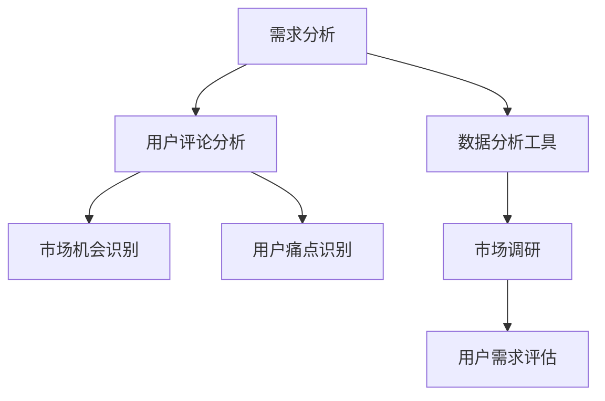

**产品设计**：大模型可以帮助创业公司快速生成和迭代产品设计方案，提高设计效率。例如，通过生成对抗网络（GAN），可以生成各种风格和形态的产品设计，供设计团队参考。

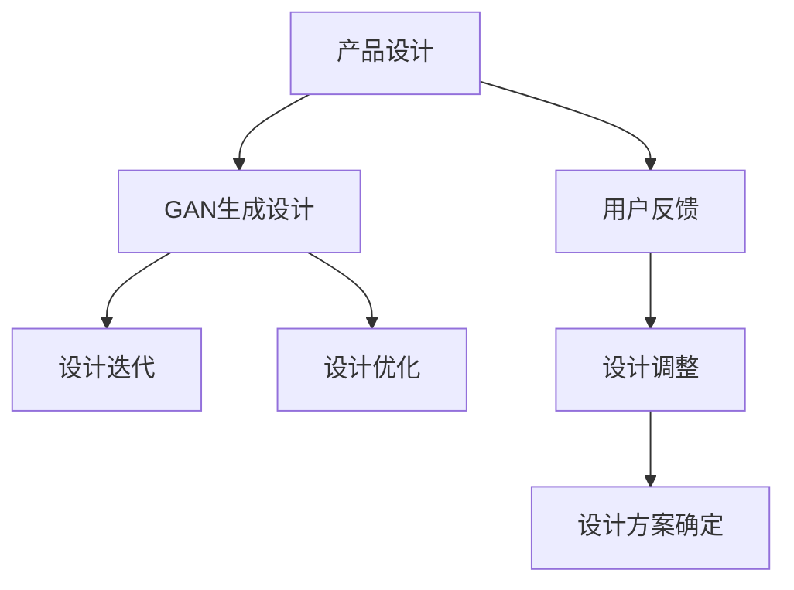

**用户体验优化**：大模型可以通过用户行为分析，识别用户在使用产品过程中遇到的痛点，从而优化产品功能和服务。例如，通过分析用户点击、浏览等行为数据，可以优化页面布局和交互设计。

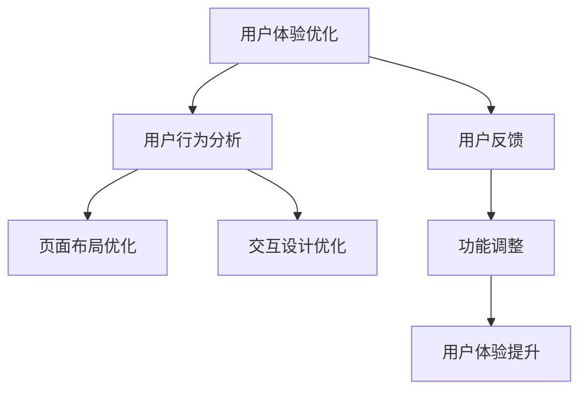

**数据分析**：大模型能够处理和分析海量数据，为创业公司提供深度的数据洞察和决策支持。例如，通过大数据分析和机器学习预测，可以优化营销策略、提升用户增长和增加收入。

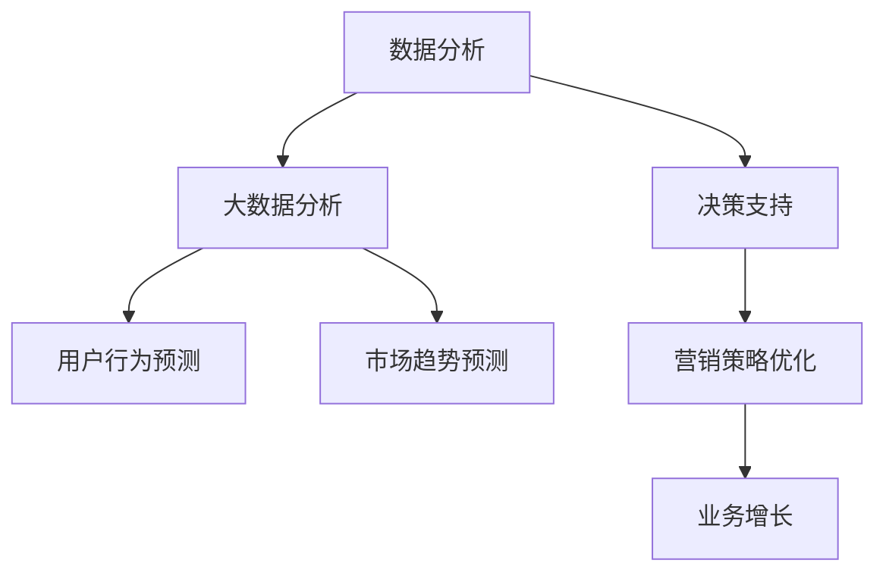

#### 8.2 大模型对创业公司竞争优势的影响

大模型的应用可以显著提升创业公司的竞争优势，具体体现在以下几个方面：

**性能提升**：大模型具有强大的表征能力，能够处理复杂的任务，提供高质量的解决方案。这可以帮助创业公司在产品性能上超越竞争对手，提升用户体验和市场认可度。

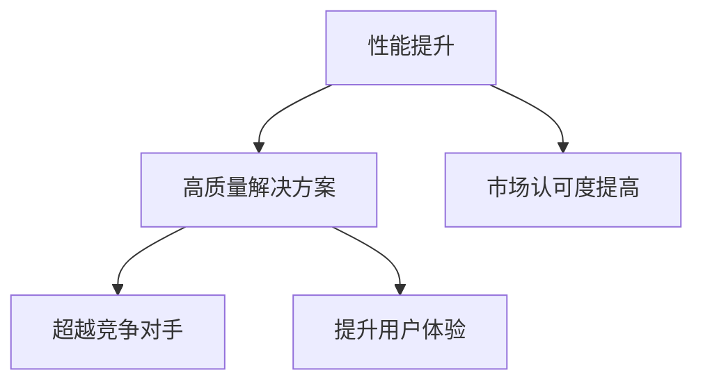

**创新驱动**：大模型的应用促进了创业公司的创新。通过大模型，创业公司可以快速尝试和实验各种创新方案，加速产品迭代和优化，保持市场竞争力。

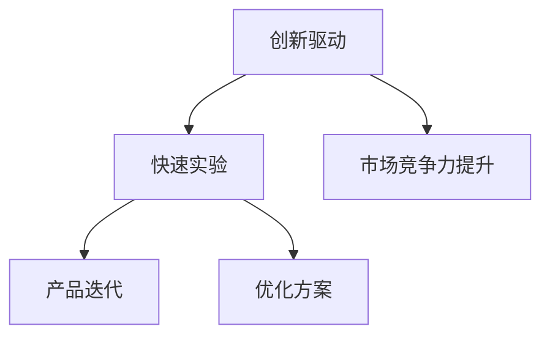

**成本降低**：大模型的高效计算和自动化特征提取能力，可以降低创业公司的开发成本和运营成本。例如，通过自动化数据处理和模型训练，可以减少人工干预，提高工作效率。

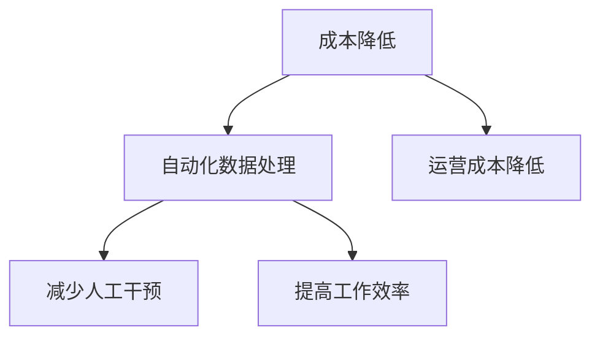

**快速迭代**：大模型的应用可以帮助创业公司实现产品的快速迭代和商业化。通过自动化测试和持续集成，创业公司可以更快地部署新功能和更新，满足市场需求。

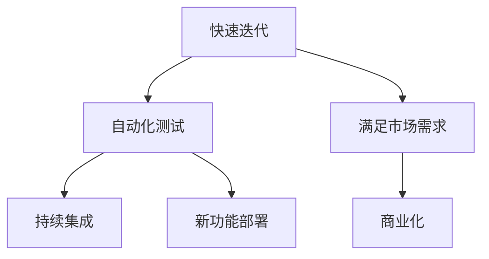

#### 8.3 大模型助力创业产品快速迭代

大模型在创业产品的快速迭代中发挥着重要作用。通过大模型，创业公司可以实现以下目标：

**原型快速构建**：大模型可以帮助创业公司快速构建产品原型，缩短产品从概念到市场的周期。例如，通过GAN，可以快速生成各种设计风格的原型，供设计团队和用户测试。

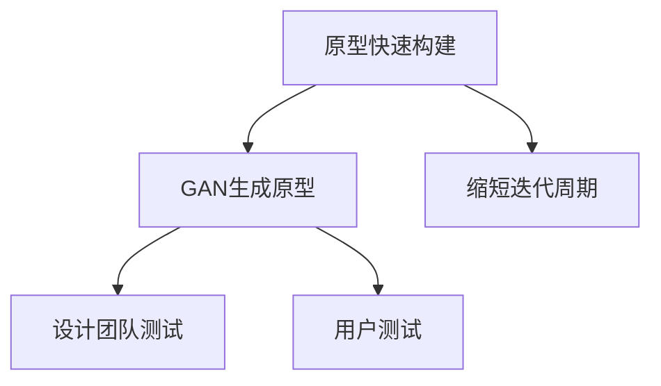

**持续优化**：大模型可以通过不断学习和调整，优化产品功能和用户体验。例如，通过分析用户行为数据，可以持续优化页面布局和交互设计，提升用户体验。

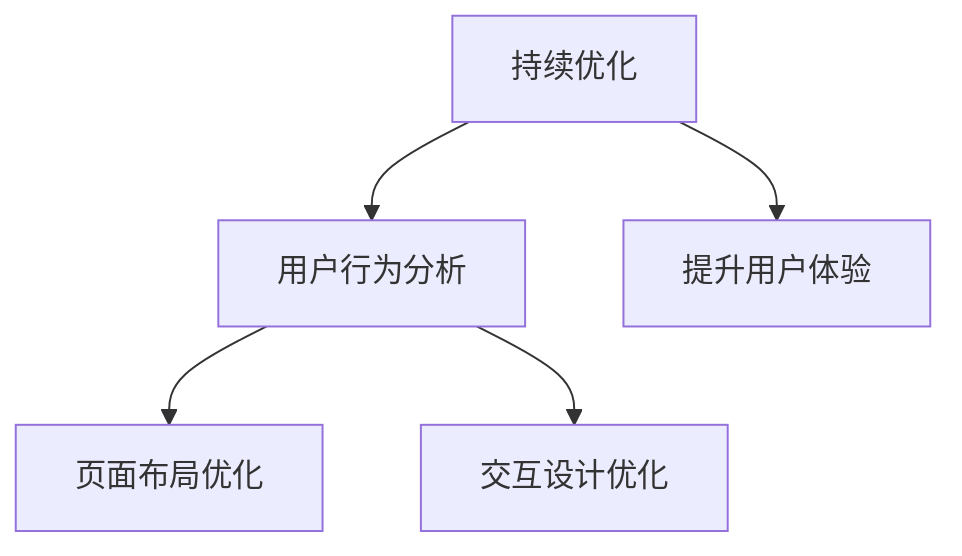

**快速迭代**：大模型的应用可以帮助创业公司实现产品的快速迭代。通过自动化测试和持续集成，创业公司可以更快地部署新功能和更新，及时响应市场需求。

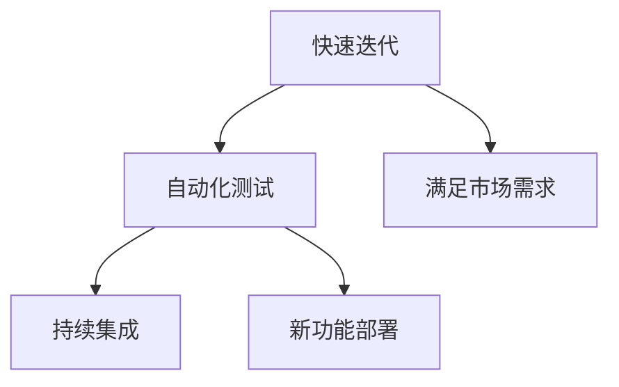

**用户体验提升**：通过大模型的应用，创业公司可以提供更加个性化的服务，提升用户体验。例如，通过个性化推荐，可以提供符合用户兴趣的内容和服务，增强用户黏性。

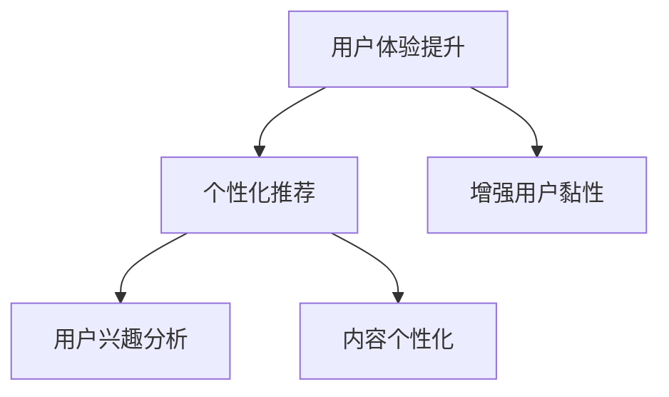

### 第9章：大模型开发与优化实践

#### 9.1 大模型开发环境搭建

搭建大模型开发环境是进行AI项目的基础。以下是一个简单的开发环境搭建流程：

**硬件资源**：确保有足够的GPU资源，用于大模型的训练和推理。可以选择NVIDIA的Tesla或A100系列GPU。

**软件环境**：安装Python、CUDA、cuDNN等必备软件，以及主流深度学习框架如TensorFlow、PyTorch等。

**数据存储**：配置高速存储设备，如SSD，用于存储数据和模型。

**步骤**：

1. **硬件配置**：选择合适的GPU硬件，并确保安装了驱动程序。
2. **软件安装**：安装Python环境和CUDA，以及深度学习框架。
3. **环境配置**：配置GPU加速，确保深度学习框架能够使用GPU进行训练。

```python
!pip install tensorflow-gpu
!pip install pytorch torchvision
```

#### 9.2 大模型训练与优化技巧

大模型训练与优化是提高模型性能的关键。以下是一些训练与优化的技巧：

**数据预处理**：对数据进行清洗、归一化、增强等处理，提高数据质量。

**超参数调整**：通过网格搜索、随机搜索等方法，优化学习率、批量大小等超参数。

**模型优化**：采用混合精度训练、模型剪枝等技术，提高训练效率。

**步骤**：

1. **数据预处理**：使用数据预处理工具，如Pandas，对数据进行处理。
2. **超参数调整**：使用超参数调整工具，如Hyperopt或Ray Tune，进行超参数搜索。
3. **模型训练**：使用训练技巧，如动态学习率调整、批量归一化等，进行模型训练。

```python
from tensorflow.keras.preprocessing.image import ImageDataGenerator

# 数据增强
train_datagen = ImageDataGenerator(
    rescale=1./255,
    shear_range=0.2,
    zoom_range=0.2,
    horizontal_flip=True)

train_generator = train_datagen.flow_from_directory(
    train_dir,
    target_size=(150, 150),
    batch_size=32,
    class_mode='binary')
```

#### 9.3 大模型应用案例分析

以下是一个大模型应用案例：

**项目背景**：一家创业公司开发了一款智能客服系统，旨在提高客户服务效率。

**解决方案**：创业公司采用了基于BERT的对话生成模型，通过自然语言处理技术，实现了智能客服的功能。

**效果评估**：智能客服系统能够准确理解用户提问，提供高质量的回答，客户满意度显著提高。

**案例步骤**：

1. **数据收集**：收集用户提问和回答数据。
2. **数据预处理**：清洗和预处理数据，将其转换为BERT模型所需的格式。
3. **模型训练**：使用预训练的BERT模型，对数据进行微调。
4. **模型评估**：评估模型的性能，并进行调优。
5. **部署应用**：将模型部署到生产环境，实现智能客服功能。

```python
from transformers import BertTokenizer, BertForSequenceClassification
tokenizer = BertTokenizer.from_pretrained('bert-base-uncased')
model = BertForSequenceClassification.from_pretrained('bert-base-uncased')

# 数据预处理
inputs = tokenizer("Hello, my dog is cute", return_tensors="pt")

# 模型预测
outputs = model(**inputs)
predictions = outputs.logits.argmax(-1)
```

### 第10章：大模型在创业产品商业化过程中的应用

#### 10.1 大模型商业化模式探索

AI大模型在创业产品的商业化过程中具有多种模式，包括产品化、API服务、数据服务等。以下是对这些商业化模式的探讨：

**产品化**：将大模型集成到产品中，提供增值服务，如智能推荐、智能问答等。例如，一家创业公司可以将基于BERT的对话生成模型集成到智能客服系统中，提供高质量的客户服务。

**API服务**：提供大模型API服务，让其他企业或开发者调用，实现共赢。例如，一家创业公司可以提供基于GPT-3的文本生成API，让其他企业用于自动写作、机器翻译等。

**数据服务**：利用大模型分析海量数据，为企业提供数据洞察和决策支持。例如，一家创业公司可以利用基于Transformer的推荐系统，为企业提供个性化推荐服务。

**案例**：一家创业公司开发了一款基于深度学习模型的智能推荐系统，为电商企业提供个性化推荐服务。通过分析用户行为和产品数据，系统能够准确预测用户兴趣，提高用户购买转化率。

```python
# 示例：使用TensorFlow实现一个简单的深度学习模型
import tensorflow as tf

# 创建模型
model = tf.keras.Sequential([
    tf.keras.layers.Dense(128, activation='relu', input_shape=(784,)),
    tf.keras.layers.Dense(10, activation='softmax')
])

# 编译模型
model.compile(optimizer='adam',
              loss='categorical_crossentropy',
              metrics=['accuracy'])

# 训练模型
model.fit(x_train, y_train, epochs=5)
```

#### 10.2 大模型商业化策略与挑战

在大模型商业化过程中，创业公司需要制定有效的策略，并应对一系列挑战：

**策略制定**：明确目标市场、客户群体、定价策略等，确保商业化方案的可执行性。例如，一家创业公司可以针对企业客户，提供API服务，并根据使用量进行定价。

**挑战**：包括技术挑战（如模型性能优化、数据安全）、市场挑战（如竞争压力、用户接受度）等。例如，技术挑战包括如何保证模型在不同场景下的性能稳定，市场挑战包括如何在竞争激烈的市场中脱颖而出。

#### 10.3 大模型商业化案例分享

以下是一个大模型商业化案例：

**项目背景**：一家创业公司开发了一款基于BERT的文本分析平台，用于企业文本数据分析和报告生成。

**商业化模式**：创业公司通过提供API服务和企业定制化解决方案，实现了盈利。

**效果评估**：客户对平台的文本分析能力和报告质量表示满意，业务需求不断增加。

**案例步骤**：

1. **市场调研**：了解目标客户的需求和痛点。
2. **产品开发**：开发基于BERT的文本分析平台。
3. **商业化推广**：通过API服务和企业定制化解决方案，推广产品。
4. **持续优化**：根据客户反馈，不断优化产品功能和服务。

```python
# 示例：使用PyTorch实现一个简单的文本分类模型
import torch
import torch.nn as nn
import torch.optim as optim

# 创建模型
model = nn.Sequential(
    nn.Embedding(vocab_size, embed_dim),
    nn.Linear(embed_dim, num_classes),
    nn.LogSoftmax(dim=1)
)

# 编译模型
optimizer = optim.Adam(model.parameters(), lr=0.001)
criterion = nn.NLLLoss()

# 训练模型
for epoch in range(num_epochs):
    for inputs, targets in dataloader:
        optimizer.zero_grad()
        outputs = model(inputs)
        loss = criterion(outputs, targets)
        loss.backward()
        optimizer.step()
```

### 第11章：AI创业产品创新的未来趋势

#### 11.1 人工智能与行业融合

人工智能（AI）正在与各行各业深度融合，推动着产业升级和创新发展。以下是人工智能与行业融合的一些趋势：

**智能制造**：人工智能技术在制造业中的应用，如预测维护、质量检测和供应链优化，正在提高生产效率和质量。

**医疗健康**：人工智能在医疗健康领域的应用，如疾病诊断、药物研发和个性化治疗，正在改变医疗服务的模式和效率。

**金融科技**：人工智能在金融科技领域的应用，如风险管理、智能投顾和欺诈检测，正在提升金融服务的质量和效率。

**交通物流**：人工智能在交通物流领域的应用，如自动驾驶、智能调度和物流优化，正在提高交通效率和物流成本。

**能源环保**：人工智能在能源环保领域的应用，如智能电网、能源管理和环境监测，正在推动可持续发展和环境保护。

#### 11.2 大模型技术发展趋势

AI大模型技术的发展将继续朝着以下几个方向演进：

**模型压缩**：随着模型规模的增大，模型的压缩和加速变得越来越重要。未来，基于量化、剪枝和知识蒸馏等技术，将实现更大规模的模型在有限计算资源上的高效部署。

**多模态学习**：大模型将能够处理多种类型的数据，如文本、图像、声音和视频，实现更复杂的任务和更广泛的场景。

**自主推理**：未来，大模型将具备更强的自主推理能力，能够在不确定环境中做出合理的决策，实现更加智能化的应用。

**泛化能力**：通过不断改进模型结构和训练策略，大模型将提高其泛化能力，更好地适应新的任务和数据。

#### 11.3 创业产品创新的未来前景

未来，AI创业产品创新将呈现以下前景：

**智能化**：产品将更加智能化，能够根据用户需求提供个性化服务，实现更加人性化的用户体验。

**数据驱动**：创业公司将更加注重数据分析，通过数据洞察和预测，实现数据驱动的决策和优化。

**跨界融合**：创业公司将跨领域合作，推动人工智能在各个行业的应用，实现产业升级和创新发展。

**可持续发展**：创业公司将关注可持续发展，通过技术创新和商业模式创新，实现经济、社会和环境的平衡。

### 附录

#### 附录A：大模型开发工具与资源

以下是一些大模型开发的主要工具与资源：

**深度学习框架**：TensorFlow、PyTorch、PyTorch Lightning等。

**数据预处理工具**：Pandas、NumPy、Scikit-learn等。

**开源项目**：Hugging Face Transformers、OpenMMLab等。

**论文与教程**：ArXiv、Google AI Blog、fast.ai等。

#### 附录B：AI创业产品创新案例分析

**案例1：智能家居设备公司**

- **背景**：智能家居设备公司致力于开发智能化的家居设备，如智能音箱、智能灯泡和智能门锁。
- **创新点**：公司采用了基于BERT的语音识别和自然语言处理技术，实现了高准确度的语音交互和智能控制功能。
- **效果**：产品的语音交互功能得到了用户的高度评价，显著提升了用户体验和市场竞争力。

**案例2：在线教育平台**

- **背景**：在线教育平台提供个性化的在线教育服务，包括课程推荐、学习进度跟踪和在线辅导。
- **创新点**：平台采用了基于Transformer的推荐系统，实现了个性化课程推荐和学习路径规划。
- **效果**：通过个性化的学习推荐，平台显著提高了用户的学习效果和满意度。

**案例3：金融科技公司**

- **背景**：金融科技公司提供智能化的金融服务，包括智能投顾、风险管理和小额信贷。
- **创新点**：公司采用了基于深度学习的风险评估模型，实现了高准确度的风险预测和信用评估。
- **效果**：通过智能化的风险评估模型，公司显著提高了金融服务的质量和效率。

#### 附录C：AI创业产品创新建议

**1. 深入了解市场需求**：创业公司应深入了解市场需求和用户痛点，以便提供针对性的解决方案。

**2. 利用数据驱动决策**：通过数据分析和机器学习模型，创业公司可以实现数据驱动的决策和优化，提高运营效率。

**3. 不断创新和迭代**：创业公司应保持创新精神，不断推出新产品和新功能，以适应市场变化和用户需求。

**4. 关注社会责任**：在追求商业成功的同时，创业公司应关注社会责任，如数据隐私保护、环境保护等，实现可持续发展。

**5. 跨领域合作**：通过跨领域合作，创业公司可以推动人工智能在各个行业的应用，实现产业升级和创新发展。

### 作者

作者：AI天才研究院/AI Genius Institute & 禅与计算机程序设计艺术 /Zen And The Art of Computer Programming

---

本文详细阐述了AI大模型在创业产品创新中的重要性，通过理论讲解和案例分析，展示了大模型在需求分析、产品设计、用户体验优化、数据分析等方面的应用。同时，本文还探讨了AI创业产品创新的策略、风险管理以及未来趋势。希望通过本文，读者能够深入理解AI大模型的应用价值，并在实际创业过程中充分利用这一先进技术。**<|endoftext|>**

