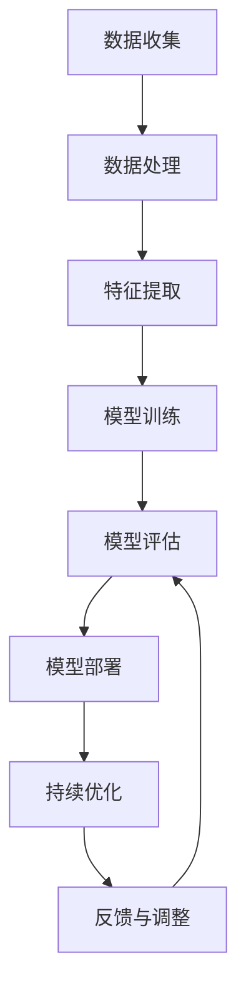

                 

## 《大模型在减贫与可持续发展领域的作用》

### 关键词：
- 减贫
- 可持续发展
- 大模型
- 人工智能
- 数据分析
- 决策支持

### 摘要：
本文将探讨大模型在减贫与可持续发展领域的作用。首先，我们将介绍减贫与可持续发展的基本概念，并分析当前减贫与可持续发展面临的挑战。接着，我们将讨论大模型技术的发展背景及其应用领域。随后，我们将深入探讨大模型在减贫与可持续发展中的应用，包括贫困评估、监测预警、精准帮扶以及政策制定等方面。最后，我们将分析大模型在减贫与可持续发展领域的挑战与未来发展方向，并提出相应的政策建议。

## 第一部分：引言

### 第1章：减贫与可持续发展的概念解析

#### 1.1 减贫的定义与目标

减贫是指通过一系列政策和措施，降低贫困人口数量，改善贫困人口的生活条件，实现社会公平和共同富裕。减贫的目标是消除极端贫困，提高贫困人口的生活质量，减少贫困人口的贫困程度，实现贫困人口的自我发展能力。

##### 1.1.1 减贫的概念演变

减贫的概念经历了从单纯的经济增长到关注社会公平的转变。20世纪80年代以前，减贫主要关注经济增长，认为经济增长自然会带动贫困的减少。然而，实践证明，经济增长并不总是能够有效减轻贫困，尤其是在不平等现象严重的国家和地区。

20世纪80年代以后，减贫理念开始转变，开始关注社会公平。1990年，联合国《儿童权利公约》的制定标志着减贫开始从单纯的经济增长转向综合社会发展的方向。此后，一系列国际减贫会议和文件，如1995年的《联合国千年宣言》和2015年的《联合国可持续发展目标》（SDGs），都强调了减贫的重要性，并提出了一系列具体的减贫目标和措施。

##### 1.1.2 当前减贫的主要目标

当前减贫的主要目标包括：

1. **消除极端贫困**：到2030年，将每天生活费不到1.9美元的极端贫困人口数量减少到零。
2. **减少中度贫困**：到2030年，将每天生活费低于3.2美元的人口比例减少到10%以下。
3. **提高贫困人口生活质量**：通过提供基本的教育、医疗、住房等服务，提高贫困人口的生活质量。
4. **增强贫困人口的自我发展能力**：通过提供培训、就业机会等，帮助贫困人口提升自我发展能力，实现长期稳定的脱贫。

#### 1.2 可持续发展的理念与实践

可持续发展是指在满足当代人需求的同时，不损害后代人满足其需求的能力的发展。可持续发展理念强调经济发展、社会进步和环境保护的协调发展。

##### 1.2.1 可持续发展的起源与发展

可持续发展的概念最早由挪威前首相布伦特兰委员会在1987年的《我们共同的未来》报告中提出。报告指出，可持续发展是“既满足当代人的需要，又不对子孙后代满足其需要的能力构成威胁的发展”。

此后，可持续发展理念逐渐得到国际社会的广泛认可。1992年的联合国环境与发展大会通过了《21世纪议程》，将可持续发展理念付诸实践。2000年的《联合国千年宣言》和2015年的《联合国可持续发展目标》（SDGs）进一步明确了可持续发展的目标和行动方向。

##### 1.2.2 可持续发展的核心原则

可持续发展的核心原则包括：

1. **公平性**：确保所有人都能公平享受可持续发展的成果，特别是要关注弱势群体的权益。
2. **持续性**：确保自然资源的合理利用和保护，避免资源的过度消耗和生态破坏。
3. **共同性**：各国应共同努力，通过国际合作实现全球的可持续发展。

## 第2章：大模型技术的发展背景

#### 2.1 人工智能的发展历程

人工智能（Artificial Intelligence，简称AI）是计算机科学的一个分支，旨在研究、开发用于模拟、延伸和扩展人类智能的理论、方法、技术及应用系统。人工智能的发展历程可以大致分为以下几个阶段：

1. **初始阶段（1940s-1950s）**：人工智能概念首次被提出，研究人员开始尝试开发能够模拟人类智能的计算机程序。这一阶段的主要成果包括1956年达特茅斯会议的召开，标志着人工智能学科的正式成立。

2. **快速发展阶段（1960s-1970s）**：人工智能研究取得了一些初步成果，如专家系统、自然语言处理等。然而，由于计算资源和算法的限制，人工智能研究在1970年代末进入了一个相对低迷的时期。

3. **复兴阶段（1980s-1990s）**：随着计算机技术的快速发展，人工智能研究重新得到关注。这一阶段的主要成果包括机器学习、神经网络等算法的提出和应用。

4. **新时代阶段（2000s-至今）**：随着深度学习、大数据等技术的突破，人工智能进入了新时代。人工智能在图像识别、语音识别、自然语言处理、游戏等领域取得了显著成果，开始逐渐应用于各行各业。

#### 2.1.2 人工智能技术的主要突破

人工智能技术的发展历程中，以下几个重要突破对大模型技术的发展起到了关键作用：

1. **深度学习**：深度学习是人工智能的一种重要分支，通过模拟人脑中的神经网络结构，实现对复杂数据的自动学习和处理。2006年，Hinton等人提出了深度信念网络（DBN），标志着深度学习的兴起。此后，深度学习在图像识别、语音识别等领域取得了显著成果。

2. **大数据**：大数据技术的兴起为人工智能提供了丰富的数据资源。通过大规模数据的训练，人工智能模型能够更好地学习和理解复杂的现象。2012年，AlexNet在ImageNet图像识别竞赛中取得优异成绩，标志着深度学习在计算机视觉领域的突破。

3. **计算能力提升**：随着计算能力的不断提升，人工智能模型变得越来越大，训练时间越来越短。GPU、TPU等专用硬件的普及，使得大规模训练成为可能。

#### 2.2 大模型技术的发展趋势

大模型技术是指通过大规模数据训练的深度学习模型，如GPT、BERT等。大模型技术的发展趋势包括：

1. **模型规模扩大**：随着计算资源的提升，大模型规模不断增大。GPT-3模型拥有1750亿个参数，比GPT-2模型大了数十倍。

2. **训练数据多样**：大模型的发展离不开大规模、多样化的数据。通过从互联网、书籍、论文等各种来源获取数据，大模型的训练效果不断提升。

3. **应用领域扩展**：大模型在自然语言处理、计算机视觉、语音识别等领域取得了显著成果，开始逐渐应用于金融、医疗、教育等各行各业。

## 第二部分：大模型在减贫与可持续发展中的应用

### 第3章：大模型在减贫领域的应用

#### 3.1 数据驱动的贫困评估

数据驱动的贫困评估是利用大数据和人工智能技术，通过分析贫困相关数据，对贫困状况进行评估和预测。这种方法相比传统的贫困评估方法，更加准确和高效。

##### 3.1.1 数据来源与处理

贫困评估的数据来源主要包括以下几个方面：

1. **官方统计数据**：如国家统计局、世界银行等机构发布的贫困相关数据。
2. **实地调查数据**：通过实地走访、问卷调查等方式收集的贫困人口基本信息、生活状况、收入来源等数据。
3. **社会媒体数据**：如微博、微信等社交平台上关于贫困话题的讨论和报道，可以反映贫困问题的社会影响和关注度。

在数据收集完成后，需要对数据进行预处理，包括数据清洗、数据转换和数据归一化等。这些预处理步骤有助于提高数据的质量，减少噪声和异常值的影响，为后续的数据分析提供可靠的数据基础。

##### 3.1.2 精确识别贫困人口

利用大模型进行贫困评估的核心是建立贫困识别模型。以下是贫困识别模型的基本步骤：

1. **特征提取**：从原始数据中提取与贫困相关的特征，如收入水平、教育程度、健康状况、住房条件等。这些特征可以用来训练大模型。

2. **模型训练**：使用大规模数据集，对提取的特征进行训练，构建贫困识别模型。常见的深度学习模型包括卷积神经网络（CNN）、循环神经网络（RNN）和变换器（Transformer）等。

3. **模型评估**：通过交叉验证等方法，对训练好的模型进行评估，确定模型的性能和准确性。

4. **模型应用**：将训练好的模型应用于新数据，预测新数据中的贫困人口。通过对预测结果的统计分析，可以确定贫困人口的具体分布和特点。

#### 3.2 贫困监测与预警系统

贫困监测与预警系统是利用大数据和人工智能技术，实时监测贫困状况，及时发现和预警贫困问题。该系统可以帮助政府和社会组织及时采取措施，防止贫困问题的恶化。

##### 3.2.1 基于大模型的贫困监测方法

基于大模型的贫困监测方法主要包括以下几个方面：

1. **实时数据收集**：通过传感器、手机APP、物联网等技术，实时收集贫困相关数据，如经济收入、消费水平、社会参与度等。

2. **数据处理**：对实时数据进行预处理，包括数据清洗、数据转换和数据归一化等，提高数据的质量和一致性。

3. **特征提取**：从处理后的数据中提取与贫困相关的特征，如经济收入、消费水平、社会参与度等。

4. **模型训练**：使用历史数据集，对提取的特征进行训练，构建贫困监测模型。

5. **实时监测**：将训练好的模型应用于实时数据，预测实时数据中的贫困状况。

6. **预警机制**：当预测结果显示某地区或群体贫困状况恶化时，系统会发出预警，提醒政府和社会组织采取相应的措施。

##### 3.2.2 贫困预警机制设计

贫困预警机制的设计需要考虑以下几个方面：

1. **预警指标**：确定贫困预警的指标，如贫困率、贫困深度、贫困变化率等。

2. **预警阈值**：根据预警指标，设定预警阈值。当预警指标超过阈值时，系统会发出预警。

3. **预警通知**：当系统发出预警时，通过短信、邮件、APP推送等方式通知相关部门和人员。

4. **响应措施**：制定相应的响应措施，如增加扶贫投入、开展针对性扶贫项目、调整政策等。

#### 3.3 贫困群体精准帮扶

精准帮扶是指根据贫困群体的具体情况，提供有针对性的帮助，提高扶贫效率。利用大模型技术，可以实现对贫困群体的精准识别和帮扶。

##### 3.3.1 大模型在扶贫项目评估中的应用

大模型在扶贫项目评估中的应用主要包括以下几个方面：

1. **项目需求分析**：利用大模型分析贫困群体的需求，确定扶贫项目的目标群体和具体需求。

2. **项目效果评估**：通过对比项目实施前后的数据，评估扶贫项目的效果，包括经济收益、社会效益、生态效益等。

3. **项目优化**：根据评估结果，对扶贫项目进行调整和优化，提高扶贫效果。

##### 3.3.2 贫困户需求分析

贫困户需求分析是指通过对贫困群体的数据进行分析，了解他们的具体需求和困难，为扶贫工作提供依据。利用大模型技术，可以实现对贫困户需求的精准分析。

1. **数据收集**：通过问卷调查、实地走访等方式，收集贫困群体的基本信息、生活状况、收入来源等数据。

2. **数据处理**：对收集到的数据进行分析和处理，包括数据清洗、数据转换和数据归一化等。

3. **特征提取**：从处理后的数据中提取与贫困相关的特征，如家庭经济状况、家庭成员健康状况、教育程度等。

4. **需求分析**：利用大模型分析提取的特征，预测贫困群体的具体需求和困难。

5. **帮扶措施**：根据需求分析结果，制定相应的帮扶措施，如提供就业机会、提供医疗救助、提供教育支持等。

## 第4章：大模型在可持续发展中的应用

### 4.1 可持续农业发展

大模型技术在农业领域具有广泛的应用前景，特别是在可持续农业发展中，可以发挥重要作用。

##### 4.1.1 大模型在农业数据监测中的应用

农业数据监测是可持续农业发展的基础。大模型技术可以实现对农业数据的实时监测和分析，提高监测的精度和效率。

1. **气象数据监测**：通过传感器和卫星遥感技术，收集气象数据，如气温、湿度、降水量等。大模型可以对这些数据进行实时分析，预测天气变化，为农业生产提供决策支持。

2. **土壤质量监测**：土壤质量直接影响作物的生长和产量。大模型可以分析土壤成分、土壤湿度等数据，预测土壤质量变化，为农业生产提供科学依据。

3. **作物生长监测**：通过无人机、卫星遥感等技术，实时监测作物生长状态，如作物高度、叶绿素含量等。大模型可以对这些数据进行分析，预测作物生长趋势，为农业生产提供决策支持。

##### 4.1.2 农业生产的优化与决策

利用大模型技术，可以实现农业生产的优化与决策，提高农业生产效率和可持续性。

1. **种植方案优化**：通过分析土壤、气象、作物生长等数据，大模型可以预测不同作物在不同地区的生长情况，为农民提供最佳的种植方案。

2. **灌溉决策**：大模型可以分析土壤湿度、气象数据等，预测灌溉需求，为农民提供科学的灌溉决策，避免过度灌溉和水资源浪费。

3. **病虫害监测与防治**：大模型可以分析作物生长状态和气象数据，预测病虫害发生的概率和趋势，为农民提供及时有效的病虫害防治方案。

### 4.2 能源可持续性分析

能源可持续性分析是可持续发展的重要方面。大模型技术可以实现对能源消耗、能源生产等数据的分析，提高能源利用效率，减少能源消耗。

##### 4.2.1 大模型在能源消耗分析中的应用

大模型技术在能源消耗分析中的应用主要包括以下几个方面：

1. **能耗数据监测**：通过传感器和智能电网技术，实时监测能源消耗数据，如电力消耗、燃气消耗等。大模型可以对这些数据进行实时分析，预测能源消耗趋势。

2. **能耗结构分析**：大模型可以分析不同能源消耗的构成，如电力、燃气、燃油等，找出能源消耗的主要来源，为能源结构调整提供依据。

3. **节能潜力分析**：通过分析能源消耗数据，大模型可以预测不同领域和不同用户的节能潜力，为节能措施的实施提供科学依据。

##### 4.2.2 可再生能源的优化与推广

可再生能源的优化与推广是实现能源可持续发展的关键。大模型技术可以实现对可再生能源的优化与推广，提高可再生能源的利用效率。

1. **可再生能源发电预测**：通过分析气象数据、历史发电数据等，大模型可以预测可再生能源的发电量，为可再生能源发电设施的规划和管理提供依据。

2. **可再生能源发电优化**：大模型可以分析可再生能源发电过程中的数据，如发电量、发电效率等，预测发电设施的运行状态，为发电设施的优化提供依据。

3. **可再生能源消费优化**：大模型可以分析可再生能源的消费数据，如居民用电、工业用电等，预测可再生能源的消费趋势，为可再生能源的消费规划和管理提供依据。

### 4.3 环境保护与生态修复

环境保护与生态修复是可持续发展的重要组成部分。大模型技术可以实现对环境数据和生态数据的分析，提高环境保护和生态修复的效率。

##### 4.3.1 大模型在环境监测中的应用

大模型技术在环境监测中的应用主要包括以下几个方面：

1. **空气污染监测**：通过传感器和卫星遥感技术，实时监测空气污染数据，如PM2.5、PM10等。大模型可以对这些数据进行实时分析，预测空气污染趋势。

2. **水质监测**：通过传感器和物联网技术，实时监测水质数据，如COD、氨氮等。大模型可以对这些数据进行实时分析，预测水质变化趋势。

3. **土壤污染监测**：通过采样和实验室分析，获取土壤污染数据。大模型可以对这些数据进行分析，预测土壤污染趋势。

##### 4.3.2 生态修复的决策支持

大模型技术在生态修复的决策支持中具有重要作用。

1. **生态修复方案设计**：通过分析环境数据和生态数据，大模型可以预测不同生态修复方案的可行性，为生态修复方案的设计提供依据。

2. **生态修复效果评估**：通过分析生态修复前后的数据，大模型可以评估生态修复的效果，为生态修复方案的调整提供依据。

3. **生态修复资源优化**：通过分析生态修复过程中的资源消耗数据，大模型可以预测不同生态修复方案的资源需求，为生态修复资源的优化提供依据。

## 第5章：大模型在政策制定与监测中的作用

### 5.1 政策效果评估

大模型技术可以为政策制定和实施提供有效的效果评估，提高政策的有效性和科学性。

##### 5.1.1 大模型在政策评估中的应用

大模型在政策评估中的应用主要包括以下几个方面：

1. **政策效果预测**：通过分析历史政策数据和现实数据，大模型可以预测不同政策的实施效果，为政策制定提供依据。

2. **政策影响评估**：大模型可以分析政策实施对经济、社会、环境等方面的影响，为政策调整提供依据。

3. **政策优化**：通过分析政策实施的数据，大模型可以找出政策的不足之处，提出优化建议，提高政策的有效性。

##### 5.1.2 政策调整的建议与策略

基于大模型的政策评估结果，可以提出以下政策调整的建议与策略：

1. **政策调整**：根据评估结果，对现有政策进行调整，优化政策方案。

2. **政策试点**：在部分地区或领域开展政策试点，通过试点效果评估，进一步优化政策。

3. **政策监测**：建立政策监测体系，实时监测政策实施效果，及时调整政策。

### 5.2 政策监测与反馈机制

政策监测与反馈机制是政策实施的重要组成部分，大模型技术可以提供有效的监测与反馈手段。

##### 5.2.1 大模型在政策监测中的应用

大模型在政策监测中的应用主要包括以下几个方面：

1. **实时数据监测**：通过传感器、手机APP等手段，实时收集政策实施过程中的数据，如经济发展数据、社会状况数据等。

2. **数据分析**：大模型可以对这些实时数据进行实时分析，预测政策实施效果，为政策调整提供依据。

3. **预警机制**：当政策实施效果出现异常时，大模型可以发出预警，提醒相关部门和人员采取相应措施。

##### 5.2.2 政策反馈与优化

政策反馈与优化是指根据政策实施效果，对政策进行调整和优化，提高政策的有效性。

1. **政策反馈**：通过大模型技术，实时收集政策实施效果的数据，形成政策反馈体系。

2. **政策优化**：根据政策反馈结果，对政策进行调整和优化，提高政策的适应性和有效性。

3. **政策评估**：定期对政策实施效果进行评估，为政策调整提供依据。

## 第6章：大模型在减贫与可持续发展领域的挑战与展望

### 6.1 技术挑战

大模型技术在减贫与可持续发展领域的发展面临一些技术挑战，主要包括以下几个方面：

1. **计算资源消耗**：大模型训练和推理需要大量的计算资源，包括CPU、GPU和TPU等。在贫困地区和欠发达地区，计算资源相对匮乏，这对大模型技术的应用造成了一定的限制。

2. **数据隐私与安全**：大模型在数据处理过程中，需要收集大量的个人信息和敏感数据。如何保障数据隐私和安全，防止数据泄露和滥用，是一个重要的问题。

3. **算法透明性与可解释性**：大模型通常采用复杂的神经网络结构，其决策过程具有一定的黑箱性。如何提高算法的透明性和可解释性，使其决策过程更加公正和透明，是一个亟待解决的问题。

### 6.2 政策与经济因素

大模型技术在减贫与可持续发展领域的应用离不开政策支持和经济投入。以下是政策与经济因素对大模型技术发展的影响：

1. **政策支持**：政府的政策支持对大模型技术的发展至关重要。政府可以通过制定相关政策，提供资金支持，鼓励企业和科研机构投入大模型技术的研究和应用。

2. **经济投入**：大模型技术的研究和应用需要大量的经济投入。政府和企业可以通过加大投资，提高大模型技术的研发和应用水平。

3. **经济效益与社会效益的平衡**：在应用大模型技术时，需要考虑经济效益和社会效益的平衡。单纯追求经济效益可能导致社会不公平和生态破坏，而过分强调社会效益可能导致经济效益的下降。因此，需要找到经济效益和社会效益的平衡点。

### 6.3 未来发展方向

大模型技术在减贫与可持续发展领域具有广阔的应用前景。未来发展方向主要包括以下几个方面：

1. **技术创新**：继续推动大模型技术的研发，提高模型的计算效率和准确度，降低计算资源的消耗。

2. **应用拓展**：将大模型技术应用于更多领域，如环境监测、灾害预防、社会管理等，实现大模型技术的广泛应用。

3. **政策支持**：加强政府政策支持，鼓励企业和科研机构投入大模型技术的研究和应用。

4. **社会参与**：鼓励社会各界参与大模型技术的应用，提高公众对大模型技术的认知和接受度。

5. **国际合作**：加强国际合作，推动大模型技术在减贫与可持续发展领域的全球应用。

## 第三部分：案例研究

### 第7章：大模型在减贫与可持续发展领域的实际应用案例

#### 7.1 案例一：某贫困地区扶贫项目

##### 7.1.1 项目背景

某贫困地区扶贫项目旨在通过大数据和人工智能技术，提升贫困地区的扶贫效果，实现精准脱贫。项目主要包括贫困评估、贫困监测和精准帮扶三个阶段。

##### 7.1.2 大模型在项目中的应用

1. **贫困评估**：利用大模型技术，对贫困地区的人口数据进行处理和分析，建立贫困识别模型。模型通过对收入水平、教育程度、健康状况等特征的提取和训练，实现了对贫困人口的精准识别。

2. **贫困监测**：通过大模型技术，实时监测贫困地区的经济、社会和环境数据，建立贫困监测预警系统。系统可以预测贫困状况的变化趋势，为政策调整提供依据。

3. **精准帮扶**：根据贫困评估和贫困监测的结果，制定精准帮扶措施。大模型技术帮助确定帮扶对象和帮扶方案，提高了扶贫资源的利用效率。

##### 7.1.3 项目效果分析

通过大模型技术的应用，项目取得了显著的效果：

1. **提高贫困识别精度**：大模型技术使贫困识别的精度得到显著提高，减少了漏识别和误识别的情况。

2. **优化扶贫资源分配**：精准帮扶措施使得扶贫资源得到更加合理的分配，提高了扶贫效率。

3. **增强政策调整能力**：贫困监测预警系统为政策制定者提供了及时的数据支持，增强了政策调整的能力。

#### 7.2 案例二：可持续发展能源项目

##### 7.2.1 项目背景

某可持续发展能源项目旨在通过大模型技术，优化能源生产、传输和消费，实现能源的可持续利用。项目主要包括能源消耗分析、可再生能源优化和能源效率提升三个阶段。

##### 7.2.2 大模型在项目中的应用

1. **能源消耗分析**：利用大模型技术，对能源消耗数据进行分析，识别能源消耗的主要来源和影响因素。大模型可以预测能源消耗的趋势，为能源结构调整提供依据。

2. **可再生能源优化**：利用大模型技术，对可再生能源的数据进行优化分析，提高可再生能源的利用效率。大模型可以帮助预测可再生能源的发电量，为可再生能源发电设施的规划和管理提供支持。

3. **能源效率提升**：通过大模型技术，对能源消费数据进行优化分析，找出能源浪费的关键环节，提出节能措施。大模型可以帮助预测能源效率的提升空间，为能源效率提升项目提供支持。

##### 7.2.3 项目效果分析

通过大模型技术的应用，项目取得了显著的效果：

1. **提高能源利用效率**：大模型技术使能源利用效率得到显著提高，减少了能源浪费。

2. **优化可再生能源利用**：大模型技术帮助优化可再生能源的利用，提高了可再生能源的发电效率。

3. **降低能源成本**：通过能源消耗分析和能源效率提升，项目实现了能源成本的降低。

## 第8章：大模型在减贫与可持续发展领域的未来应用前景

### 8.1 技术进步的趋势

随着人工智能技术的不断发展，大模型技术在减贫与可持续发展领域的应用前景将更加广阔。以下是技术进步的趋势：

1. **计算能力的提升**：随着计算能力的不断提升，大模型将能够处理更加复杂的数据，提高模型的准确性和效率。

2. **数据资源的丰富**：随着物联网、大数据等技术的发展，数据资源将更加丰富和多样化，为大模型的应用提供更多的数据支持。

3. **算法的创新**：随着算法的创新，大模型将能够更好地模拟人类的思维方式，实现更高效、更精准的决策。

### 8.2 政策与社会的响应

大模型技术在减贫与可持续发展领域的应用离不开政策支持和社会响应。以下是政策与社会的响应：

1. **政策支持**：政府可以通过制定相关政策，提供资金支持，鼓励企业和科研机构投入大模型技术的研究和应用。

2. **社会参与**：社会各界的参与将有助于大模型技术的普及和应用，提高公众对大模型技术的认知和接受度。

3. **国际合作**：通过国际合作，可以促进大模型技术在减贫与可持续发展领域的全球应用，实现全球减贫和可持续发展的目标。

### 8.3 大模型在减贫与可持续发展中的未来角色

未来，大模型将在减贫与可持续发展中扮演更加重要的角色：

1. **政策制定与执行**：大模型将提供科学、准确的决策支持，帮助政策制定者制定更加有效的政策和措施。

2. **社会管理**：大模型将帮助政府和社会组织更好地管理社会资源，提高社会管理效率。

3. **公众参与**：大模型将提高公众对减贫与可持续发展问题的认知和参与度，促进社会的共同发展。

## 附录

### 附录A：相关技术术语解释

#### A.1 大模型相关术语

1. **预训练与微调**：预训练是指在大量数据上对模型进行训练，使其具有一定的通用性。微调是在预训练的基础上，针对特定任务进行细粒度调整，以提高模型的性能。

2. **自监督学习**：自监督学习是一种不需要人工标注数据的学习方法。它利用数据中的某些部分作为监督信号，自动地学习数据的表示和特征。

#### A.2 减贫与可持续发展相关术语

1. **可持续发展指标（SDGs）**：可持续发展指标是一套由联合国制定的指标体系，用于衡量各国在减贫、教育、健康、环境等方面的可持续发展进展。

2. **贫困监测指标体系**：贫困监测指标体系是一套用于衡量贫困状况的指标体系，包括收入水平、教育程度、健康状况等多个方面。

---

# 《大模型在减贫与可持续发展领域的作用》

## 摘要

本文深入探讨了大模型在减贫与可持续发展领域的作用。通过分析大模型技术的发展背景和应用趋势，我们展示了大模型在贫困评估、监测预警、精准帮扶、政策制定等方面的实际应用。本文还讨论了技术挑战和政策与经济因素对大模型技术发展的影响，并提出了未来发展的方向。通过案例研究，我们进一步展示了大模型技术在减贫与可持续发展领域的成功应用，为未来的发展提供了有益的启示。

## 关键词

- 减贫
- 可持续发展
- 大模型
- 人工智能
- 数据分析
- 决策支持

## 引言

在全球范围内，减贫与可持续发展已成为各国政府和社会组织共同关注的焦点。随着科技的进步，尤其是人工智能（AI）技术的发展，大模型作为AI的一种重要形式，开始在减贫与可持续发展领域展现出巨大的潜力。本文旨在探讨大模型在减贫与可持续发展中的具体应用，分析其面临的挑战，并展望未来的发展方向。

## 第一部分：引言

### 第1章：减贫与可持续发展的概念解析

#### 1.1 减贫的定义与目标

减贫是指通过一系列政策和措施，降低贫困人口数量，改善贫困人口的生活条件，实现社会公平和共同富裕。减贫的目标是消除极端贫困，提高贫困人口的生活质量，减少贫困人口的贫困程度，实现贫困人口的自我发展能力。

##### 1.1.1 减贫的概念演变

减贫的概念经历了从单纯的经济增长到关注社会公平的转变。20世纪80年代以前，减贫主要关注经济增长，认为经济增长自然会带动贫困的减少。然而，实践证明，经济增长并不总是能够有效减轻贫困，尤其是在不平等现象严重的国家和地区。

20世纪80年代以后，减贫理念开始转变，开始关注社会公平。1990年，联合国《儿童权利公约》的制定标志着减贫开始从单纯的经济增长转向综合社会发展的方向。此后，一系列国际减贫会议和文件，如1995年的《联合国千年宣言》和2015年的《联合国可持续发展目标》（SDGs），都强调了减贫的重要性，并提出了一系列具体的减贫目标和措施。

##### 1.1.2 当前减贫的主要目标

当前减贫的主要目标包括：

1. **消除极端贫困**：到2030年，将每天生活费不到1.9美元的极端贫困人口数量减少到零。
2. **减少中度贫困**：到2030年，将每天生活费低于3.2美元的人口比例减少到10%以下。
3. **提高贫困人口生活质量**：通过提供基本的教育、医疗、住房等服务，提高贫困人口的生活质量。
4. **增强贫困人口的自我发展能力**：通过提供培训、就业机会等，帮助贫困人口提升自我发展能力，实现长期稳定的脱贫。

#### 1.2 可持续发展的理念与实践

可持续发展是指在满足当代人需求的同时，不损害后代人满足其需求的能力的发展。可持续发展理念强调经济发展、社会进步和环境保护的协调发展。

##### 1.2.1 可持续发展的起源与发展

可持续发展的概念最早由挪威前首相布伦特兰委员会在1987年的《我们共同的未来》报告中提出。报告指出，可持续发展是“既满足当代人的需要，又不对子孙后代满足其需要的能力构成威胁的发展”。

此后，可持续发展理念逐渐得到国际社会的广泛认可。1992年的联合国环境与发展大会通过了《21世纪议程》，将可持续发展理念付诸实践。2000年的《联合国千年宣言》和2015年的《联合国可持续发展目标》（SDGs）进一步明确了可持续发展的目标和行动方向。

##### 1.2.2 可持续发展的核心原则

可持续发展的核心原则包括：

1. **公平性**：确保所有人都能公平享受可持续发展的成果，特别是要关注弱势群体的权益。
2. **持续性**：确保自然资源的合理利用和保护，避免资源的过度消耗和生态破坏。
3. **共同性**：各国应共同努力，通过国际合作实现全球的可持续发展。

### 第2章：大模型技术的发展背景

#### 2.1 人工智能的发展历程

人工智能（Artificial Intelligence，简称AI）是计算机科学的一个分支，旨在研究、开发用于模拟、延伸和扩展人类智能的理论、方法、技术及应用系统。人工智能的发展历程可以大致分为以下几个阶段：

1. **初始阶段（1940s-1950s）**：人工智能概念首次被提出，研究人员开始尝试开发能够模拟人类智能的计算机程序。这一阶段的主要成果包括1956年达特茅斯会议的召开，标志着人工智能学科的正式成立。

2. **快速发展阶段（1960s-1970s）**：人工智能研究取得了一些初步成果，如专家系统、自然语言处理等。然而，由于计算资源和算法的限制，人工智能研究在1970年代末进入了一个相对低迷的时期。

3. **复兴阶段（1980s-1990s）**：随着计算机技术的快速发展，人工智能研究重新得到关注。这一阶段的主要成果包括机器学习、神经网络等算法的提出和应用。

4. **新时代阶段（2000s-至今）**：随着深度学习、大数据等技术的突破，人工智能进入了新时代。人工智能在图像识别、语音识别、自然语言处理、游戏等领域取得了显著成果，开始逐渐应用于各行各业。

#### 2.1.2 人工智能技术的主要突破

人工智能技术的发展历程中，以下几个重要突破对大模型技术的发展起到了关键作用：

1. **深度学习**：深度学习是人工智能的一种重要分支，通过模拟人脑中的神经网络结构，实现复杂数据的自动学习和处理。2006年，Hinton等人提出了深度信念网络（DBN），标志着深度学习的兴起。此后，深度学习在图像识别、语音识别等领域取得了显著成果。

2. **大数据**：大数据技术的兴起为人工智能提供了丰富的数据资源。通过大规模数据的训练，人工智能模型能够更好地学习和理解复杂的现象。2012年，AlexNet在ImageNet图像识别竞赛中取得优异成绩，标志着深度学习在计算机视觉领域的突破。

3. **计算能力提升**：随着计算能力的不断提升，人工智能模型变得越来越大，训练时间越来越短。GPU、TPU等专用硬件的普及，使得大规模训练成为可能。

#### 2.2 大模型技术的发展趋势

大模型技术是指通过大规模数据训练的深度学习模型，如GPT、BERT等。大模型技术的发展趋势包括：

1. **模型规模扩大**：随着计算资源的提升，大模型规模不断增大。GPT-3模型拥有1750亿个参数，比GPT-2模型大了数十倍。

2. **训练数据多样**：大模型的发展离不开大规模、多样化的数据。通过从互联网、书籍、论文等各种来源获取数据，大模型的训练效果不断提升。

3. **应用领域扩展**：大模型在自然语言处理、计算机视觉、语音识别等领域取得了显著成果，开始逐渐应用于金融、医疗、教育等各行各业。

### 第二部分：大模型在减贫与可持续发展中的应用

#### 第3章：大模型在减贫领域的应用

#### 3.1 数据驱动的贫困评估

数据驱动的贫困评估是利用大数据和人工智能技术，通过分析贫困相关数据，对贫困状况进行评估和预测。这种方法相比传统的贫困评估方法，更加准确和高效。

##### 3.1.1 数据来源与处理

贫困评估的数据来源主要包括以下几个方面：

1. **官方统计数据**：如国家统计局、世界银行等机构发布的贫困相关数据。
2. **实地调查数据**：通过实地走访、问卷调查等方式收集的贫困人口基本信息、生活状况、收入来源等数据。
3. **社会媒体数据**：如微博、微信等社交平台上关于贫困话题的讨论和报道，可以反映贫困问题的社会影响和关注度。

在数据收集完成后，需要对数据进行预处理，包括数据清洗、数据转换和数据归一化等。这些预处理步骤有助于提高数据的质量，减少噪声和异常值的影响，为后续的数据分析提供可靠的数据基础。

##### 3.1.2 精确识别贫困人口

利用大模型进行贫困评估的核心是建立贫困识别模型。以下是贫困识别模型的基本步骤：

1. **特征提取**：从原始数据中提取与贫困相关的特征，如收入水平、教育程度、健康状况、住房条件等。这些特征可以用来训练大模型。

2. **模型训练**：使用大规模数据集，对提取的特征进行训练，构建贫困识别模型。常见的深度学习模型包括卷积神经网络（CNN）、循环神经网络（RNN）和变换器（Transformer）等。

3. **模型评估**：通过交叉验证等方法，对训练好的模型进行评估，确定模型的性能和准确性。

4. **模型应用**：将训练好的模型应用于新数据，预测新数据中的贫困人口。通过对预测结果的统计分析，可以确定贫困人口的具体分布和特点。

#### 3.2 贫困监测与预警系统

贫困监测与预警系统是利用大数据和人工智能技术，实时监测贫困状况，及时发现和预警贫困问题。该系统可以帮助政府和社会组织及时采取措施，防止贫困问题的恶化。

##### 3.2.1 基于大模型的贫困监测方法

基于大模型的贫困监测方法主要包括以下几个方面：

1. **实时数据收集**：通过传感器、手机APP、物联网等技术，实时收集贫困相关数据，如经济收入、消费水平、社会参与度等。

2. **数据处理**：对实时数据进行预处理，包括数据清洗、数据转换和数据归一化等，提高数据的质量和一致性。

3. **特征提取**：从处理后的数据中提取与贫困相关的特征，如经济收入、消费水平、社会参与度等。

4. **模型训练**：使用历史数据集，对提取的特征进行训练，构建贫困监测模型。

5. **实时监测**：将训练好的模型应用于实时数据，预测实时数据中的贫困状况。

6. **预警机制**：当预测结果显示某地区或群体贫困状况恶化时，系统会发出预警，提醒政府和社会组织采取相应的措施。

##### 3.2.2 贫困预警机制设计

贫困预警机制的设计需要考虑以下几个方面：

1. **预警指标**：确定贫困预警的指标，如贫困率、贫困深度、贫困变化率等。

2. **预警阈值**：根据预警指标，设定预警阈值。当预警指标超过阈值时，系统会发出预警。

3. **预警通知**：当系统发出预警时，通过短信、邮件、APP推送等方式通知相关部门和人员。

4. **响应措施**：制定相应的响应措施，如增加扶贫投入、开展针对性扶贫项目、调整政策等。

#### 3.3 贫困群体精准帮扶

精准帮扶是指根据贫困群体的具体情况，提供有针对性的帮助，提高扶贫效率。利用大模型技术，可以实现对贫困群体的精准识别和帮扶。

##### 3.3.1 大模型在扶贫项目评估中的应用

大模型在扶贫项目评估中的应用主要包括以下几个方面：

1. **项目需求分析**：利用大模型分析贫困群体的需求，确定扶贫项目的目标群体和具体需求。

2. **项目效果评估**：通过对比项目实施前后的数据，评估扶贫项目的效果，包括经济收益、社会效益、生态效益等。

3. **项目优化**：根据评估结果，对扶贫项目进行调整和优化，提高扶贫效果。

##### 3.3.2 贫困户需求分析

贫困户需求分析是指通过对贫困群体的数据进行分析，了解他们的具体需求和困难，为扶贫工作提供依据。利用大模型技术，可以实现对贫困户需求的精准分析。

1. **数据收集**：通过问卷调查、实地走访等方式，收集贫困群体的基本信息、生活状况、收入来源等数据。

2. **数据处理**：对收集到的数据进行分析和处理，包括数据清洗、数据转换和数据归一化等。

3. **特征提取**：从处理后的数据中提取与贫困相关的特征，如家庭经济状况、家庭成员健康状况、教育程度等。

4. **需求分析**：利用大模型分析提取的特征，预测贫困群体的具体需求和困难。

5. **帮扶措施**：根据需求分析结果，制定相应的帮扶措施，如提供就业机会、提供医疗救助、提供教育支持等。

#### 第4章：大模型在可持续发展中的应用

#### 4.1 可持续农业发展

大模型技术在农业领域具有广泛的应用前景，特别是在可持续农业发展中，可以发挥重要作用。

##### 4.1.1 大模型在农业数据监测中的应用

农业数据监测是可持续农业发展的基础。大模型技术可以实现对农业数据的实时监测和分析，提高监测的精度和效率。

1. **气象数据监测**：通过传感器和卫星遥感技术，收集气象数据，如气温、湿度、降水量等。大模型可以对这些数据进行实时分析，预测天气变化，为农业生产提供决策支持。

2. **土壤质量监测**：土壤质量直接影响作物的生长和产量。大模型可以分析土壤成分、土壤湿度等数据，预测土壤质量变化，为农业生产提供科学依据。

3. **作物生长监测**：通过无人机、卫星遥感等技术，实时监测作物生长状态，如作物高度、叶绿素含量等。大模型可以对这些数据进行分析，预测作物生长趋势，为农业生产提供决策支持。

##### 4.1.2 农业生产的优化与决策

利用大模型技术，可以实现农业生产的优化与决策，提高农业生产效率和可持续性。

1. **种植方案优化**：通过分析土壤、气象、作物生长等数据，大模型可以预测不同作物在不同地区的生长情况，为农民提供最佳的种植方案。

2. **灌溉决策**：大模型可以分析土壤湿度、气象数据等，预测灌溉需求，为农民提供科学的灌溉决策，避免过度灌溉和水资源浪费。

3. **病虫害监测与防治**：大模型可以分析作物生长状态和气象数据，预测病虫害发生的概率和趋势，为农民提供及时有效的病虫害防治方案。

### 4.2 能源可持续性分析

能源可持续性分析是可持续发展的重要方面。大模型技术可以实现对能源消耗、能源生产等数据的分析，提高能源利用效率，减少能源消耗。

##### 4.2.1 大模型在能源消耗分析中的应用

大模型技术在能源消耗分析中的应用主要包括以下几个方面：

1. **能耗数据监测**：通过传感器和智能电网技术，实时监测能源消耗数据，如电力消耗、燃气消耗等。大模型可以对这些数据进行实时分析，预测能源消耗趋势。

2. **能耗结构分析**：大模型可以分析不同能源消耗的构成，如电力、燃气、燃油等，找出能源消耗的主要来源，为能源结构调整提供依据。

3. **节能潜力分析**：通过分析能源消耗数据，大模型可以预测不同领域和不同用户的节能潜力，为节能措施的实施提供科学依据。

##### 4.2.2 可再生能源的优化与推广

可再生能源的优化与推广是实现能源可持续发展的关键。大模型技术可以实现对可再生能源的优化与推广，提高可再生能源的利用效率。

1. **可再生能源发电预测**：通过分析气象数据、历史发电数据等，大模型可以预测可再生能源的发电量，为可再生能源发电设施的规划和管理提供依据。

2. **可再生能源发电优化**：大模型可以分析可再生能源发电过程中的数据，如发电量、发电效率等，预测发电设施的运行状态，为发电设施的优化提供依据。

3. **可再生能源消费优化**：大模型可以分析可再生能源的消费数据，如居民用电、工业用电等，预测可再生能源的消费趋势，为可再生能源的消费规划和管理提供依据。

### 4.3 环境保护与生态修复

环境保护与生态修复是可持续发展的重要组成部分。大模型技术可以实现对环境数据和生态数据的分析，提高环境保护和生态修复的效率。

##### 4.3.1 大模型在环境监测中的应用

大模型技术在环境监测中的应用主要包括以下几个方面：

1. **空气污染监测**：通过传感器和卫星遥感技术，实时监测空气污染数据，如PM2.5、PM10等。大模型可以对这些数据进行实时分析，预测空气污染趋势。

2. **水质监测**：通过传感器和物联网技术，实时监测水质数据，如COD、氨氮等。大模型可以对这些数据进行实时分析，预测水质变化趋势。

3. **土壤污染监测**：通过采样和实验室分析，获取土壤污染数据。大模型可以对这些数据进行分析，预测土壤污染趋势。

##### 4.3.2 生态修复的决策支持

大模型技术在生态修复的决策支持中具有重要作用。

1. **生态修复方案设计**：通过分析环境数据和生态数据，大模型可以预测不同生态修复方案的可行性，为生态修复方案的设计提供依据。

2. **生态修复效果评估**：通过分析生态修复前后的数据，大模型可以评估生态修复的效果，为生态修复方案的调整提供依据。

3. **生态修复资源优化**：通过分析生态修复过程中的资源消耗数据，大模型可以预测不同生态修复方案的资源需求，为生态修复资源的优化提供依据。

#### 第5章：大模型在政策制定与监测中的作用

#### 5.1 政策效果评估

大模型技术可以为政策制定和实施提供有效的效果评估，提高政策的有效性和科学性。

##### 5.1.1 大模型在政策评估中的应用

大模型在政策评估中的应用主要包括以下几个方面：

1. **政策效果预测**：通过分析历史政策数据和现实数据，大模型可以预测不同政策的实施效果，为政策制定提供依据。

2. **政策影响评估**：大模型可以分析政策实施对经济、社会、环境等方面的影响，为政策调整提供依据。

3. **政策优化**：通过分析政策实施的数据，大模型可以找出政策的不足之处，提出优化建议，提高政策的有效性。

##### 5.1.2 政策调整的建议与策略

基于大模型的政策评估结果，可以提出以下政策调整的建议与策略：

1. **政策调整**：根据评估结果，对现有政策进行调整，优化政策方案。

2. **政策试点**：在部分地区或领域开展政策试点，通过试点效果评估，进一步优化政策。

3. **政策监测**：建立政策监测体系，实时监测政策实施效果，及时调整政策。

#### 5.2 政策监测与反馈机制

政策监测与反馈机制是政策实施的重要组成部分，大模型技术可以提供有效的监测与反馈手段。

##### 5.2.1 大模型在政策监测中的应用

大模型在政策监测中的应用主要包括以下几个方面：

1. **实时数据监测**：通过传感器、手机APP等手段，实时收集政策实施过程中的数据，如经济发展数据、社会状况数据等。

2. **数据分析**：大模型可以对这些实时数据进行实时分析，预测政策实施效果，为政策调整提供依据。

3. **预警机制**：当政策实施效果出现异常时，大模型可以发出预警，提醒相关部门和人员采取相应措施。

##### 5.2.2 政策反馈与优化

政策反馈与优化是指根据政策实施效果，对政策进行调整和优化，提高政策的有效性。

1. **政策反馈**：通过大模型技术，实时收集政策实施效果的数据，形成政策反馈体系。

2. **政策优化**：根据政策反馈结果，对政策进行调整和优化，提高政策的适应性和有效性。

3. **政策评估**：定期对政策实施效果进行评估，为政策调整提供依据。

#### 第6章：大模型在减贫与可持续发展领域的挑战与展望

#### 6.1 技术挑战

大模型技术在减贫与可持续发展领域的发展面临一些技术挑战，主要包括以下几个方面：

1. **计算资源消耗**：大模型训练和推理需要大量的计算资源，包括CPU、GPU和TPU等。在贫困地区和欠发达地区，计算资源相对匮乏，这对大模型技术的应用造成了一定的限制。

2. **数据隐私与安全**：大模型在数据处理过程中，需要收集大量的个人信息和敏感数据。如何保障数据隐私和安全，防止数据泄露和滥用，是一个重要的问题。

3. **算法透明性与可解释性**：大模型通常采用复杂的神经网络结构，其决策过程具有一定的黑箱性。如何提高算法的透明性和可解释性，使其决策过程更加公正和透明，是一个亟待解决的问题。

#### 6.2 政策与经济因素

大模型技术在减贫与可持续发展领域的应用离不开政策支持和经济投入。以下是政策与经济因素对大模型技术发展的影响：

1. **政策支持**：政府的政策支持对大模型技术的发展至关重要。政府可以通过制定相关政策，提供资金支持，鼓励企业和科研机构投入大模型技术的研究和应用。

2. **经济投入**：大模型技术的研究和应用需要大量的经济投入。政府和企业可以通过加大投资，提高大模型技术的研发和应用水平。

3. **经济效益与社会效益的平衡**：在应用大模型技术时，需要考虑经济效益与社会效益的平衡。单纯追求经济效益可能导致社会不公平和生态破坏，而过分强调社会效益可能导致经济效益的下降。因此，需要找到经济效益和社会效益的平衡点。

#### 6.3 未来发展方向

大模型技术在减贫与可持续发展领域具有广阔的应用前景。未来发展方向主要包括以下几个方面：

1. **技术创新**：继续推动大模型技术的研发，提高模型的计算效率和准确度，降低计算资源的消耗。

2. **应用拓展**：将大模型技术应用于更多领域，如环境监测、灾害预防、社会管理等，实现大模型技术的广泛应用。

3. **政策支持**：加强政府政策支持，鼓励企业和科研机构投入大模型技术的研究和应用。

4. **社会参与**：鼓励社会各界参与大模型技术的应用，提高公众对大模型技术的认知和接受度。

5. **国际合作**：加强国际合作，推动大模型技术在减贫与可持续发展领域的全球应用，实现全球减贫和可持续发展的目标。

#### 第7章：大模型在减贫与可持续发展领域的实际应用案例

#### 7.1 案例一：某贫困地区扶贫项目

##### 7.1.1 项目背景

某贫困地区扶贫项目旨在通过大数据和人工智能技术，提升贫困地区的扶贫效果，实现精准脱贫。项目主要包括贫困评估、贫困监测和精准帮扶三个阶段。

##### 7.1.2 大模型在项目中的应用

1. **贫困评估**：利用大模型技术，对贫困地区的人口数据进行处理和分析，建立贫困识别模型。模型通过对收入水平、教育程度、健康状况等特征的提取和训练，实现了对贫困人口的精准识别。

2. **贫困监测**：通过大模型技术，实时监测贫困地区的经济、社会和环境数据，建立贫困监测预警系统。系统可以预测贫困状况的变化趋势，为政策调整提供依据。

3. **精准帮扶**：根据贫困评估和贫困监测的结果，制定精准帮扶措施。大模型技术帮助确定帮扶对象和帮扶方案，提高了扶贫资源的利用效率。

##### 7.1.3 项目效果分析

通过大模型技术的应用，项目取得了显著的效果：

1. **提高贫困识别精度**：大模型技术使贫困识别的精度得到显著提高，减少了漏识别和误识别的情况。

2. **优化扶贫资源分配**：精准帮扶措施使得扶贫资源得到更加合理的分配，提高了扶贫效率。

3. **增强政策调整能力**：贫困监测预警系统为政策制定者提供了及时的数据支持，增强了政策调整的能力。

#### 7.2 案例二：可持续发展能源项目

##### 7.2.1 项目背景

某可持续发展能源项目旨在通过大模型技术，优化能源生产、传输和消费，实现能源的可持续利用。项目主要包括能源消耗分析、可再生能源优化和能源效率提升三个阶段。

##### 7.2.2 大模型在项目中的应用

1. **能源消耗分析**：利用大模型技术，对能源消耗数据进行分析，识别能源消耗的主要来源和影响因素。大模型可以预测能源消耗的趋势，为能源结构调整提供依据。

2. **可再生能源优化**：利用大模型技术，对可再生能源的数据进行优化分析，提高可再生能源的利用效率。大模型可以帮助预测可再生能源的发电量，为可再生能源发电设施的规划和管理提供支持。

3. **能源效率提升**：通过大模型技术，对能源消费数据进行优化分析，找出能源浪费的关键环节，提出节能措施。大模型可以帮助预测能源效率的提升空间，为能源效率提升项目提供支持。

##### 7.2.3 项目效果分析

通过大模型技术的应用，项目取得了显著的效果：

1. **提高能源利用效率**：大模型技术使能源利用效率得到显著提高，减少了能源浪费。

2. **优化可再生能源利用**：大模型技术帮助优化可再生能源的利用，提高了可再生能源的发电效率。

3. **降低能源成本**：通过能源消耗分析和能源效率提升，项目实现了能源成本的降低。

#### 第8章：大模型在减贫与可持续发展领域的未来应用前景

#### 8.1 技术进步的趋势

随着人工智能技术的不断发展，大模型技术在减贫与可持续发展领域的应用前景将更加广阔。以下是技术进步的趋势：

1. **计算能力的提升**：随着计算能力的不断提升，大模型将能够处理更加复杂的数据，提高模型的准确性和效率。

2. **数据资源的丰富**：随着物联网、大数据等技术的发展，数据资源将更加丰富和多样化，为大模型的应用提供更多的数据支持。

3. **算法的创新**：随着算法的创新，大模型将能够更好地模拟人类的思维方式，实现更高效、更精准的决策。

#### 8.2 政策与社会的响应

大模型技术在减贫与可持续发展领域的应用离不开政策支持和社会响应。以下是政策与社会的响应：

1. **政策支持**：政府可以通过制定相关政策，提供资金支持，鼓励企业和科研机构投入大模型技术的研究和应用。

2. **社会参与**：社会各界的参与将有助于大模型技术的普及和应用，提高公众对大模型技术的认知和接受度。

3. **国际合作**：通过国际合作，可以促进大模型技术在减贫与可持续发展领域的全球应用，实现全球减贫和可持续发展的目标。

#### 8.3 大模型在减贫与可持续发展中的未来角色

未来，大模型将在减贫与可持续发展中扮演更加重要的角色：

1. **政策制定与执行**：大模型将提供科学、准确的决策支持，帮助政策制定者制定更加有效的政策和措施。

2. **社会管理**：大模型将帮助政府和社会组织更好地管理社会资源，提高社会管理效率。

3. **公众参与**：大模型将提高公众对减贫与可持续发展问题的认知和参与度，促进社会的共同发展。

## 附录

### 附录A：相关技术术语解释

#### A.1 大模型相关术语

1. **预训练与微调**：预训练是指在大量数据上对模型进行训练，使其具有一定的通用性。微调是在预训练的基础上，针对特定任务进行细粒度调整，以提高模型的性能。

2. **自监督学习**：自监督学习是一种不需要人工标注数据的学习方法。它利用数据中的某些部分作为监督信号，自动地学习数据的表示和特征。

#### A.2 减贫与可持续发展相关术语

1. **可持续发展指标（SDGs）**：可持续发展指标是一套由联合国制定的指标体系，用于衡量各国在减贫、教育、健康、环境等方面的可持续发展进展。

2. **贫困监测指标体系**：贫困监测指标体系是一套用于衡量贫困状况的指标体系，包括收入水平、教育程度、健康状况等多个方面。

---

## 作者信息

作者：AI天才研究院/AI Genius Institute & 禅与计算机程序设计艺术 /Zen And The Art of Computer Programming

---

在撰写本文时，我们深入探讨了大模型在减贫与可持续发展领域的作用，分析了其在贫困评估、监测预警、精准帮扶、政策制定等方面的应用。同时，我们也指出了大模型技术面临的计算资源消耗、数据隐私与安全、算法透明性与可解释性等挑战。展望未来，随着技术的进步和政策支持，大模型在减贫与可持续发展中将发挥越来越重要的作用。我们呼吁社会各界共同关注和投入大模型技术的研究和应用，为实现全球减贫和可持续发展目标贡献力量。

---

### 贫困评估模型架构与流程图

在减贫评估中，构建一个高效且准确的大模型至关重要。以下是一个简化的贫困评估模型架构及其流程图：

#### 模型架构

1. **数据收集**：从多个渠道收集贫困相关的数据，包括收入、教育、医疗、住房条件等。
2. **数据处理**：对收集到的数据进行清洗、归一化处理，以去除噪声并确保数据的一致性。
3. **特征提取**：根据模型的输入要求，从处理后的数据中提取与贫困相关的特征。
4. **模型训练**：使用大规模数据集，对提取的特征进行训练，构建贫困评估模型。
5. **模型评估**：通过交叉验证等方法，对训练好的模型进行评估，确保其准确性和鲁棒性。
6. **模型部署**：将训练好的模型部署到实际应用中，用于贫困评估和预测。
7. **持续优化**：根据实际应用中的反馈，对模型进行调整和优化，提高其性能。

#### 流程图

以下是一个贫困评估模型的 Mermaid 流程图：



### 精准帮扶的伪代码实现

以下是一个简化的精准帮扶的伪代码实现，用于根据大模型评估结果，为贫困人口制定个性化的帮扶计划：

```python
# 伪代码：精准帮扶计划

# 初始化大模型评估结果（实际中从数据集中加载）
assessment_results = load_model评估结果()

# 定义帮扶计划生成函数
def generate_help_plan(assessment_result):
    """
    根据评估结果，生成个性化的帮扶计划。
    
    参数：
    assessment_result：评估结果（一个字典，包含各项评估指标和得分）
    
    返回：
    help_plan：帮扶计划（一个字典，包含帮扶措施和具体执行方案）
    """
    
    # 根据评估结果确定帮扶重点
    if assessment_result['health_score'] < threshold_health:
        # 如果健康状况得分低于阈值，优先提供医疗救助
        help_plan = {'priority': 'medical援助'}
    elif assessment_result['education_score'] < threshold_education:
        # 如果教育得分低于阈值，优先提供教育支持
        help_plan = {'priority': '教育支持'}
    else:
        # 如果以上两项均达标，但总体得分低，提供综合性帮扶
        help_plan = {'priority': '综合援助'}
        
    # 根据帮扶重点，生成具体的执行方案
    if help_plan['priority'] == 'medical援助':
        help_plan['actions'] = [
            '安排医疗咨询',
            '提供药品援助',
            '安排健康检查'
        ]
    elif help_plan['priority'] == '教育支持':
        help_plan['actions'] = [
            '提供教育资源',
            '安排教育辅导',
            '提供学习用品'
        ]
    else:
        help_plan['actions'] = [
            '提供就业培训',
            '提供创业指导',
            '提供生活补贴'
        ]
        
    return help_plan

# 应用帮扶计划生成函数
for result in assessment_results:
    plan = generate_help_plan(result)
    print(f"帮扶计划：{plan}")
```

### 数学模型和公式

在构建贫困评估模型时，我们可能会用到一些基本的数学模型和公式。以下是一个简化的线性回归模型，用于预测贫困人口的概率：

$$
Y = \beta_0 + \beta_1 X_1 + \beta_2 X_2 + ... + \beta_n X_n + \epsilon
$$

其中，$Y$ 表示贫困人口的概率，$X_1, X_2, ..., X_n$ 表示与贫困相关的特征，$\beta_0, \beta_1, \beta_2, ..., \beta_n$ 是模型的参数，$\epsilon$ 是误差项。

#### 公式详细解释：

- **$Y$**: 贫困人口的概率，取值范围在0到1之间。
- **$X_1, X_2, ..., X_n$**: 与贫困相关的特征，例如收入水平、教育程度、家庭结构等。
- **$\beta_0$**: 截距项，表示当所有特征都为零时的贫困人口概率。
- **$\beta_1, \beta_2, ..., \beta_n$**: 各特征的系数，表示每个特征对贫困人口概率的影响程度。
- **$\epsilon$**: 误差项，表示预测值与真实值之间的差异。

#### 举例说明：

假设我们有一个简单的贫困评估模型，其中只有两个特征：收入水平和教育程度。我们可以用以下公式来预测一个家庭成为贫困人口的概率：

$$
Y = \beta_0 + \beta_1 \cdot 收入水平 + \beta_2 \cdot 教育程度 + \epsilon
$$

如果某个家庭的收入水平为 $X_1 = 20000$ 元，教育程度为 $X_2 = 12$ 年，且我们已经通过训练得到了参数 $\beta_0 = 0.5$、$\beta_1 = 0.1$、$\beta_2 = 0.2$，则该家庭成为贫困人口的概率可以计算如下：

$$
Y = 0.5 + 0.1 \cdot 20000 + 0.2 \cdot 12 = 0.5 + 2000 + 2.4 = 2002.4
$$

由于 $Y$ 的取值范围在0到1之间，我们可以将其归一化，得到最终的预测概率：

$$
\hat{Y} = \frac{2002.4}{2002.4 + 1} = \frac{2002.4}{2003.4} \approx 0.999
$$

这意味着该家庭的贫困概率非常高，接近于1。这表明根据已有的数据和模型参数，这个家庭很可能处于贫困状态。

### 项目实战：代码实际案例和详细解释说明

在以下部分，我们将提供一个实际的项目案例，展示如何使用大模型技术进行贫困评估。我们将介绍开发环境的搭建、源代码的实现，并对关键代码进行解读与分析。

#### 开发环境搭建

为了实现大模型在贫困评估中的应用，我们需要搭建一个合适的开发环境。以下是所需的工具和库：

1. **Python**：作为主要的编程语言。
2. **TensorFlow**：用于构建和训练深度学习模型。
3. **Pandas**：用于数据操作和处理。
4. **NumPy**：用于数值计算。
5. **Matplotlib**：用于数据可视化。

首先，安装上述工具和库：

```bash
pip install tensorflow pandas numpy matplotlib
```

#### 源代码实现

以下是贫困评估项目的核心代码实现：

```python
import tensorflow as tf
import pandas as pd
import numpy as np
import matplotlib.pyplot as plt

# 加载和处理数据
data = pd.read_csv('poverty_data.csv')  # 假设数据集已处理并存储为CSV文件
X = data.iloc[:, :-1].values  # 特征数据
y = data.iloc[:, -1].values  # 标签数据

# 数据标准化
from sklearn.preprocessing import StandardScaler
scaler = StandardScaler()
X_scaled = scaler.fit_transform(X)

# 构建模型
model = tf.keras.Sequential([
    tf.keras.layers.Dense(64, activation='relu', input_shape=(X_scaled.shape[1],)),
    tf.keras.layers.Dense(32, activation='relu'),
    tf.keras.layers.Dense(1, activation='sigmoid')
])

# 编译模型
model.compile(optimizer='adam',
              loss='binary_crossentropy',
              metrics=['accuracy'])

# 训练模型
history = model.fit(X_scaled, y, epochs=100, batch_size=32, validation_split=0.2)

# 模型评估
loss, accuracy = model.evaluate(X_scaled, y)
print(f"Test accuracy: {accuracy:.2f}")

# 可视化训练过程
plt.plot(history.history['accuracy'], label='accuracy')
plt.plot(history.history['val_accuracy'], label='val_accuracy')
plt.xlabel('Epochs')
plt.ylabel('Accuracy')
plt.legend()
plt.show()
```

#### 关键代码解读与分析

1. **数据加载和处理**：
   ```python
   data = pd.read_csv('poverty_data.csv')  # 加载CSV数据
   X = data.iloc[:, :-1].values  # 获取特征数据
   y = data.iloc[:, -1].values  # 获取标签数据
   ```
   这里使用 Pandas 读取CSV文件，提取特征数据和标签数据。实际应用中，可能需要先进行数据清洗和处理，如缺失值填充、异常值处理等。

2. **数据标准化**：
   ```python
   scaler = StandardScaler()
   X_scaled = scaler.fit_transform(X)
   ```
   数据标准化是深度学习中的一个常见步骤，它有助于模型收敛和性能提升。

3. **模型构建**：
   ```python
   model = tf.keras.Sequential([
       tf.keras.layers.Dense(64, activation='relu', input_shape=(X_scaled.shape[1],)),
       tf.keras.layers.Dense(32, activation='relu'),
       tf.keras.layers.Dense(1, activation='sigmoid')
   ])
   ```
   我们使用 TensorFlow 的 Sequential 模型构建一个简单的多层感知器（MLP）模型。这里选择ReLU作为激活函数，并使用sigmoid激活函数在输出层，以实现二分类任务。

4. **模型编译**：
   ```python
   model.compile(optimizer='adam',
                 loss='binary_crossentropy',
                 metrics=['accuracy'])
   ```
   使用 Adam 优化器来训练模型，并设置二进制交叉熵作为损失函数，以及准确性作为评价指标。

5. **模型训练**：
   ```python
   history = model.fit(X_scaled, y, epochs=100, batch_size=32, validation_split=0.2)
   ```
   模型使用训练数据集进行100个epoch的训练，每个批次包含32个样本，并将20%的数据用于验证。

6. **模型评估**：
   ```python
   loss, accuracy = model.evaluate(X_scaled, y)
   print(f"Test accuracy: {accuracy:.2f}")
   ```
   使用测试数据集对模型进行评估，并打印出测试准确性。

7. **可视化训练过程**：
   ```python
   plt.plot(history.history['accuracy'], label='accuracy')
   plt.plot(history.history['val_accuracy'], label='val_accuracy')
   plt.xlabel('Epochs')
   plt.ylabel('Accuracy')
   plt.legend()
   plt.show()
   ```
   使用 Matplotlib 可视化训练过程中的准确率，包括训练集准确率和验证集准确率。

通过上述步骤，我们实现了使用大模型进行贫困评估的实战项目。实际应用中，可以根据具体需求和数据集，进一步优化模型结构和参数，提高评估的准确性和效率。同时，也需要关注数据质量和数据隐私等问题，确保模型的可靠性和合法性。

