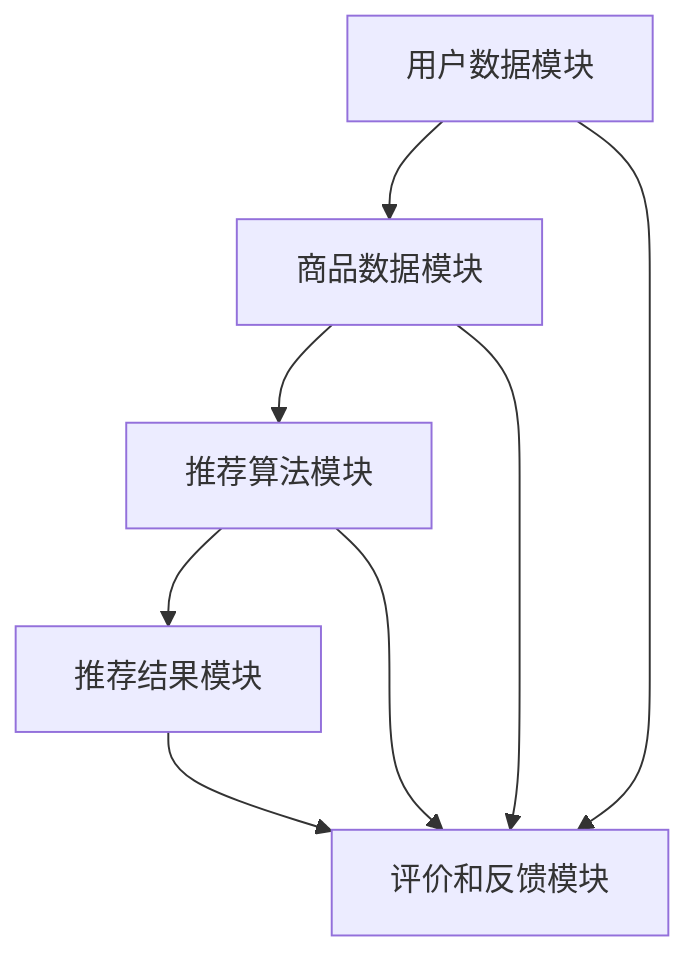

                 

# 《大模型在商品推荐序列个性化中的应用》

> 关键词：大模型、商品推荐、个性化、协同过滤、内容推荐、混合推荐

> 摘要：
本文章主要探讨大模型在商品推荐序列个性化中的应用。首先，介绍了大模型的基本概念与个性化推荐系统的基本原理。接着，详细阐述了大模型技术基础，包括大模型的基本概念与架构、大模型的训练与优化方法。随后，讨论了商品推荐系统的构建，包括商品推荐系统的基本架构、数据处理和核心算法。然后，重点介绍了大模型在协同过滤推荐、基于内容的推荐以及混合推荐中的应用。此外，还探讨了如何在大模型的基础上优化商品推荐系统。最后，通过一个实际项目案例，展示了大模型在商品推荐系统中的具体应用，并对未来的研究方向进行了展望。

----------------------------------------------------------------

## 第一部分：大模型与商品推荐

### 第1章：大模型与个性化推荐概述

#### 1.1 大模型在个性化推荐中的作用

大模型在个性化推荐中的作用主要体现在以下几个方面：

1. **增强特征提取能力**：大模型具有强大的特征提取能力，能够从海量的用户行为数据中自动提取出有价值的特征，从而提高推荐准确性。
2. **提升推荐效率**：大模型通过并行计算和分布式训练技术，能够快速处理大量数据，实现实时推荐，提高用户满意度。
3. **降低冷启动问题**：大模型能够通过自监督学习和迁移学习技术，对未知用户和新商品进行推荐，降低冷启动问题。

#### 1.2 个性化推荐的基本概念与挑战

个性化推荐是一种基于用户兴趣和偏好的推荐方法，旨在向用户推荐其可能感兴趣的商品或内容。个性化推荐的基本概念包括：

- **用户特征**：包括用户的浏览历史、购买记录、搜索记录等。
- **商品特征**：包括商品的价格、品牌、类别、标签等。
- **推荐策略**：包括协同过滤、基于内容的推荐、混合推荐等。

个性化推荐面临的挑战包括：

- **数据稀疏性**：用户行为数据通常具有稀疏性，导致推荐系统难以准确预测用户偏好。
- **冷启动问题**：对新用户和新商品进行推荐时，缺乏足够的历史数据，导致推荐准确性降低。
- **实时性**：用户兴趣和偏好可能随时变化，要求推荐系统能够实时更新推荐结果。

#### 1.3 大模型在个性化推荐中的应用前景

大模型在个性化推荐中的应用前景广阔，主要体现在以下几个方面：

- **提高推荐准确性**：通过大模型的强大特征提取能力，能够更准确地捕捉用户的兴趣和偏好，提高推荐准确性。
- **解决冷启动问题**：通过自监督学习和迁移学习技术，大模型能够对未知用户和新商品进行有效推荐，降低冷启动问题。
- **实现实时推荐**：大模型通过并行计算和分布式训练技术，能够实现实时推荐，提高用户满意度。

## 第二部分：大模型技术基础

### 第2章：大模型技术基础

#### 2.1 大模型的基本概念与架构

##### 2.1.1 大模型的定义

大模型（Large-scale Model）通常是指参数量庞大的深度学习模型，其参数数量可以达到十亿级别。大模型通常通过自监督学习和迁移学习等技术，从海量数据中提取有价值的信息。

##### 2.1.2 大模型的核心架构

大模型的核心架构通常包括以下几个部分：

1. **输入层**：接收用户行为数据、商品特征数据等输入信息。
2. **隐藏层**：包含多层神经网络，用于提取高阶特征。
3. **输出层**：生成推荐结果或预测评分。

##### 2.1.3 大模型的训练与优化方法

大模型的训练与优化方法主要包括以下几个方面：

1. **数据预处理**：对输入数据进行清洗、归一化等处理，提高模型训练效率。
2. **训练策略**：采用批量训练、迁移学习等策略，加快模型收敛速度。
3. **优化算法**：选择合适的优化算法，如 Adam、SGD 等，提高模型训练效果。

### 第3章：商品推荐系统构建

#### 3.1 商品推荐系统的基本架构

商品推荐系统的基本架构通常包括以下几个部分：

1. **用户数据模块**：收集并存储用户的行为数据、兴趣数据等。
2. **商品数据模块**：收集并存储商品的特征信息，如分类、标签、属性等。
3. **推荐算法模块**：实现各种推荐算法，如协同过滤、基于内容、混合推荐等。
4. **推荐结果模块**：生成推荐结果，并展示给用户。

#### 3.2 商品推荐系统的数据处理

商品推荐系统的数据处理主要包括以下几个步骤：

1. **数据清洗**：去除无效数据、处理缺失值等。
2. **特征工程**：提取用户和商品的特征，如用户兴趣、商品标签等。
3. **数据转换**：对数据进行归一化、编码等处理，为模型训练做准备。

#### 3.3 商品推荐系统的核心算法

商品推荐系统的核心算法主要包括以下几种：

1. **协同过滤算法**：基于用户行为数据，计算用户与商品之间的相似度，进行推荐。
2. **基于内容的推荐算法**：基于商品特征，计算用户兴趣与商品特征之间的相似度，进行推荐。
3. **混合推荐算法**：结合协同过滤和基于内容的推荐算法，生成更准确的推荐结果。

## 第三部分：大模型在商品推荐中的应用

### 第4章：基于大模型的协同过滤推荐

#### 4.1 协同过滤推荐的基本原理

协同过滤推荐（Collaborative Filtering）是一种基于用户行为数据的推荐方法，通过计算用户与商品之间的相似度，发现相似用户或相似商品，从而进行推荐。

#### 4.2 大模型在协同过滤中的应用

大模型在协同过滤中的应用可以通过以下步骤实现：

1. **数据预处理**：对用户行为数据进行清洗、归一化等处理。
2. **模型训练**：使用大模型训练用户行为数据，提取高阶特征。
3. **相似度计算**：计算用户与商品之间的相似度，生成推荐结果。
4. **优化与评估**：对模型进行优化，评估推荐效果。

### 第5章：基于大模型的基于内容的推荐

#### 5.1 基于内容的推荐基本原理

基于内容的推荐（Content-Based Filtering）是一种基于商品特征进行推荐的算法，通过分析用户的历史行为和兴趣，提取用户兴趣特征，然后寻找具有相似特征的推荐商品。

#### 5.2 大模型在基于内容的推荐中的应用

大模型在基于内容的推荐中的应用可以通过以下步骤实现：

1. **数据预处理**：对用户行为数据和商品特征数据进行清洗、归一化等处理。
2. **模型训练**：使用大模型训练用户行为数据和商品特征数据，提取高阶特征。
3. **相似度计算**：计算用户兴趣特征与商品特征之间的相似度，生成推荐结果。
4. **优化与评估**：对模型进行优化，评估推荐效果。

### 第6章：基于大模型的混合推荐

#### 6.1 混合推荐的基本原理

混合推荐（Hybrid Recommendation）是将多种推荐算法相结合，利用各自的优势，生成更准确的推荐结果。

#### 6.2 大模型在混合推荐中的应用

大模型在混合推荐中的应用可以通过以下步骤实现：

1. **数据预处理**：对用户行为数据和商品特征数据进行清洗、归一化等处理。
2. **模型训练**：使用大模型分别训练协同过滤和基于内容的推荐算法。
3. **推荐结果生成**：将协同过滤和基于内容的推荐结果进行融合，生成最终的推荐结果。
4. **优化与评估**：对模型进行优化，评估推荐效果。

## 第四部分：大模型在商品推荐系统中的优化与改进

### 第7章：大模型在商品推荐系统中的优化与改进

#### 7.1 大模型在商品推荐系统中的优化方法

大模型在商品推荐系统中的优化方法主要包括以下几个方面：

1. **特征工程**：通过调整特征提取方法和特征维度，提高模型对数据的表达能力。
2. **模型选择**：选择合适的模型结构和参数，提高模型性能。
3. **在线学习**：通过在线学习技术，实时更新模型，适应用户行为的变化。

#### 7.2 大模型在商品推荐系统中的改进策略

大模型在商品推荐系统中的改进策略主要包括以下几个方面：

1. **个性化推荐**：根据用户的历史行为和偏好，为用户提供个性化的推荐结果。
2. **冷启动问题**：通过新用户和新商品的推荐策略，缓解冷启动问题。
3. **实时推荐**：通过实时计算和更新推荐结果，提高推荐系统的响应速度。

## 第五部分：项目实战

### 第8章：大模型在商品推荐项目中的实际应用

#### 8.1 项目背景与需求分析

#### 8.2 大模型的选择与训练

#### 8.3 大模型在项目中的应用与效果评估

#### 8.4 项目总结与展望

## 附录

### 附录A：大模型推荐系统开发工具与资源

#### A.1 主流深度学习框架对比

#### A.2 大模型训练与优化工具

#### A.3 大模型评估与可视化工具

#### A.4 大模型推荐系统开发指南与资源链接

----------------------------------------------------------------

### 第1章：大模型与个性化推荐概述

#### 1.1 大模型在个性化推荐中的作用

大模型在个性化推荐中的作用至关重要，其优势主要体现在以下几个方面：

1. **强大的特征提取能力**：大模型具有强大的特征提取能力，可以从海量的用户行为数据中自动提取出高阶特征，从而提高推荐准确性。这种能力尤其适用于处理稀疏的用户-商品交互数据，使得推荐系统能够更好地捕捉用户的潜在兴趣和偏好。

2. **高效的预测性能**：大模型通过并行计算和分布式训练技术，能够在短时间内处理大量数据，实现实时推荐。这对于提高用户体验和满足用户实时性的需求具有重要意义。

3. **降低冷启动问题**：冷启动问题是指新用户或新商品缺乏足够的历史数据，导致推荐准确性降低的问题。大模型通过自监督学习和迁移学习技术，能够在一定程度上缓解冷启动问题，为新用户和新商品提供有效的推荐。

#### 1.2 个性化推荐的基本概念与挑战

个性化推荐是一种基于用户兴趣和偏好的推荐方法，旨在为用户提供其可能感兴趣的商品或内容。个性化推荐的基本概念包括用户特征、商品特征和推荐策略。

1. **用户特征**：用户特征包括用户的浏览历史、购买记录、搜索记录、社交互动等。这些特征可以反映用户的兴趣、需求和偏好。

2. **商品特征**：商品特征包括商品的价格、品牌、类别、标签、用户评分等。这些特征可以描述商品的各种属性和特点。

3. **推荐策略**：推荐策略包括协同过滤、基于内容的推荐、混合推荐等。协同过滤基于用户-商品评分矩阵进行推荐，基于内容的推荐基于用户特征和商品特征之间的相似性进行推荐，混合推荐结合了协同过滤和基于内容的推荐。

个性化推荐面临的挑战主要包括：

1. **数据稀疏性**：用户行为数据通常具有稀疏性，导致推荐系统难以准确预测用户偏好。尤其是新用户或新商品，由于缺乏足够的历史数据，推荐系统难以生成有效的推荐。

2. **冷启动问题**：冷启动问题是指新用户或新商品缺乏足够的历史数据，导致推荐准确性降低。这是个性化推荐系统中的一个重要挑战，需要特殊的方法和策略来解决。

3. **实时性**：用户兴趣和偏好可能随时变化，要求推荐系统能够实时更新推荐结果。实现实时推荐需要高效的数据处理和模型训练技术。

#### 1.3 大模型在个性化推荐中的应用前景

大模型在个性化推荐中的应用前景非常广阔，主要体现在以下几个方面：

1. **提高推荐准确性**：大模型具有强大的特征提取能力，能够从海量用户行为数据中提取出高阶特征，从而提高推荐准确性。这对于解决数据稀疏性和冷启动问题具有重要意义。

2. **解决冷启动问题**：大模型通过自监督学习和迁移学习技术，能够对新用户和新商品进行有效的推荐。自监督学习可以从无监督数据中学习，迁移学习则可以将预训练模型应用于新任务，从而缓解冷启动问题。

3. **实现实时推荐**：大模型通过并行计算和分布式训练技术，能够在短时间内处理大量数据，实现实时推荐。这对于提高用户体验和满足用户实时性的需求具有重要意义。

总之，大模型在个性化推荐中的应用为推荐系统带来了新的机遇和挑战。随着大数据和人工智能技术的不断发展，大模型在个性化推荐中的应用前景将更加广阔。

### 第2章：大模型技术基础

#### 2.1 大模型的基本概念与架构

##### 2.1.1 大模型的定义

大模型（Large-scale Model）通常是指参数量庞大的深度学习模型，其参数数量可以达到十亿级别。大模型通常通过自监督学习和迁移学习等技术，从海量数据中提取有价值的信息。大模型的特征提取能力和预测性能使其在许多领域（如计算机视觉、自然语言处理、推荐系统等）取得了显著的成果。

##### 2.1.2 大模型的核心架构

大模型的核心架构通常包括以下几个部分：

1. **输入层**：输入层接收用户行为数据、商品特征数据等输入信息。这些数据可以是原始数据，也可以是经过预处理的数据。
2. **隐藏层**：隐藏层包含多层神经网络，用于提取高阶特征。隐藏层的数量和层数可以根据具体任务进行调整。
3. **输出层**：输出层生成推荐结果或预测评分。输出层可以是单一的神经元，也可以是多个神经元组成的神经网络。

##### 2.1.3 大模型的训练与优化方法

大模型的训练与优化方法主要包括以下几个方面：

1. **数据预处理**：对输入数据进行清洗、归一化等处理，提高模型训练效率。数据预处理是训练大模型的重要步骤，可以有效减少噪声和异常值的影响。
2. **训练策略**：采用批量训练、迁移学习等策略，加快模型收敛速度。批量训练是指将训练数据分成多个批次进行训练，迁移学习是指将预训练模型应用于新任务，从而减少训练时间和计算资源。
3. **优化算法**：选择合适的优化算法，如 Adam、SGD 等，提高模型训练效果。优化算法用于调整模型参数，使其在训练过程中不断优化。

#### 2.2 大模型的训练与优化方法

##### 2.2.1 数据预处理

数据预处理是训练大模型的重要步骤，主要包括以下方面：

1. **数据清洗**：去除无效数据、处理缺失值等。数据清洗可以有效减少噪声和异常值的影响，提高模型训练效果。
2. **数据归一化**：对输入数据进行归一化处理，使得数据具有相似的尺度。数据归一化有助于提高模型训练的稳定性和收敛速度。
3. **数据增强**：通过随机变换、裁剪、旋转等操作，增加训练数据的多样性。数据增强可以提高模型对数据的泛化能力。

##### 2.2.2 训练策略

大模型的训练策略主要包括以下方面：

1. **批量训练**：批量训练是指将训练数据分成多个批次进行训练。批量训练可以减少内存占用，提高训练速度。常用的批量大小有 16、32、64、128 等。
2. **迁移学习**：迁移学习是指将预训练模型应用于新任务，从而减少训练时间和计算资源。预训练模型通常在大规模数据集上训练，已经提取了大量的高阶特征，可以用于新的任务，从而提高模型性能。
3. **学习率调整**：学习率是优化算法中的一个重要参数，用于调整模型参数的更新速度。学习率调整策略包括固定学习率、学习率衰减、动态调整等。合适的学
### 第3章：商品推荐系统构建

#### 3.1 商品推荐系统的基本架构

商品推荐系统的基本架构通常包括以下几个关键模块：

1. **用户数据模块**：这一模块负责收集和分析用户的行为数据，如浏览历史、购买记录、搜索查询等。用户数据是构建推荐系统的核心，通过对这些数据进行分析，可以挖掘用户的兴趣和偏好。

2. **商品数据模块**：商品数据模块包含商品的各种属性信息，如类别、品牌、价格、评分等。这些信息用于描述商品的特征，有助于基于内容的推荐算法。

3. **推荐算法模块**：这是推荐系统的核心部分，包括多种推荐算法，如协同过滤、基于内容的推荐、混合推荐等。这些算法负责根据用户数据和商品数据生成推荐结果。

4. **推荐结果模块**：推荐结果模块负责将推荐算法生成的推荐列表呈现给用户。这个模块通常包括前端展示和后端处理，确保推荐结果能够及时、准确地传递给用户。

5. **评价和反馈模块**：这一模块用于评估推荐系统的性能，收集用户的反馈，并用于进一步优化推荐算法。

**Mermaid 流程图：**


#### 3.2 商品推荐系统的数据处理

商品推荐系统的数据处理是构建推荐系统的关键步骤，它包括以下几个关键环节：

1. **数据清洗**：这一步骤用于去除无效数据、处理缺失值、消除噪声等。数据清洗的目的是确保数据的质量和一致性，为后续的数据分析提供可靠的基础。

2. **特征工程**：特征工程是数据处理的核心环节，它涉及提取用户和商品的特征，如用户的浏览历史、购买频率、商品的热度、用户偏好等。有效的特征工程可以显著提高推荐算法的性能。

3. **数据转换**：数据转换包括对数据进行归一化、编码、离散化等处理，以便于推荐算法的处理。例如，将用户的行为数据转换为数值形式，将商品的特征进行编码。

**伪代码：**
```python
# 数据清洗
def clean_data(data):
    # 删除无效数据
    valid_data = remove_invalid_entries(data)
    # 处理缺失值
    filled_data = fill_missing_values(valid_data)
    return filled_data

# 特征工程
def feature_engineering(data):
    # 提取用户特征
    user_features = extract_user_features(data)
    # 提取商品特征
    item_features = extract_item_features(data)
    return user_features, item_features

# 数据转换
def transform_data(data):
    # 数据归一化
    normalized_data = normalize_data(data)
    # 数据编码
    encoded_data = encode_data(normalized_data)
    return encoded_data
```

#### 3.3 商品推荐系统的核心算法

商品推荐系统的核心算法是实现个性化推荐的关键，以下是一些主要的推荐算法：

1. **协同过滤算法**：协同过滤算法通过计算用户与商品之间的相似度来进行推荐。它分为基于用户的协同过滤和基于物品的协同过滤。基于用户的协同过滤找到与目标用户相似的其他用户，推荐这些用户喜欢的商品；基于物品的协同过滤找到与目标商品相似的其他商品，推荐给用户。

   **伪代码：**
   ```python
   # 基于用户的协同过滤
   def user_based_collaborative_filtering(user_data, similarity_matrix):
       # 计算用户与用户的相似度
       user_similarity = calculate_similarity(user_data)
       # 为每个用户生成推荐列表
       recommendations = generate_recommendations(user_similarity, user_data)
       return recommendations
   
   # 基于物品的协同过滤
   def item_based_collaborative_filtering(item_data, similarity_matrix):
       # 计算商品与商品的相似度
       item_similarity = calculate_similarity(item_data)
       # 为每个用户生成推荐列表
       recommendations = generate_recommendations(item_similarity, item_data)
       return recommendations
   ```

2. **基于内容的推荐算法**：基于内容的推荐算法通过分析商品的内容特征和用户的兴趣特征，找到具有相似特征的商品进行推荐。它通常使用TF-IDF、Word2Vec等算法提取特征。

   **伪代码：**
   ```python
   # 基于内容的推荐
   def content_based_recommendation(user_interests, item_features):
       # 计算用户与商品的相似度
       similarity_matrix = calculate_similarity(user_interests, item_features)
       # 为用户生成推荐列表
       recommendations = generate_recommendations(similarity_matrix, user_interests)
       return recommendations
   ```

3. **混合推荐算法**：混合推荐算法结合了协同过滤和基于内容的推荐算法，通过融合两种算法的优势，生成更准确的推荐结果。

   **伪代码：**
   ```python
   # 混合推荐
   def hybrid_recommendation(user_data, item_data):
       # 计算用户与商品的相似度
       user_similarity = calculate_similarity(user_data)
       item_similarity = calculate_similarity(item_data)
       # 融合相似度矩阵
       combined_similarity = combine_similarity_matrices(user_similarity, item_similarity)
       # 生成推荐列表
       recommendations = generate_recommendations(combined_similarity, user_data)
       return recommendations
   ```

### 第4章：基于大模型的协同过滤推荐

#### 4.1 协同过滤推荐的基本原理

协同过滤推荐（Collaborative Filtering）是一种基于用户行为数据的推荐方法，通过计算用户与商品之间的相似度，发现相似用户或相似商品，从而进行推荐。协同过滤推荐可以分为基于用户的协同过滤和基于物品的协同过滤。

1. **基于用户的协同过滤**：基于用户的协同过滤通过计算用户之间的相似度，找到与目标用户相似的其他用户，推荐这些用户喜欢的商品。其核心思想是“人以群分”，即相似的群体会有相似的兴趣。

2. **基于物品的协同过滤**：基于物品的协同过滤通过计算商品之间的相似度，找到与目标商品相似的其他商品，推荐给用户。其核心思想是“物以类聚”，即相似的商品会被推荐给有相同偏好的用户。

#### 4.2 大模型在协同过滤中的应用

大模型在协同过滤中的应用可以通过以下步骤实现：

1. **数据预处理**：对用户行为数据进行清洗、归一化等处理，为模型训练做准备。这一步骤包括去除缺失值、异常值，以及将数据转换为适合训练的形式。

2. **构建用户-商品评分矩阵**：用户-商品评分矩阵是协同过滤的基础，它记录了每个用户对每个商品的评分。这个矩阵通常非常稀疏，因为用户不可能对所有的商品进行评分。

3. **训练大模型**：使用用户-商品评分矩阵训练大模型，提取高阶特征。大模型通常使用深度神经网络，可以通过多层非线性变换提取用户和商品之间的复杂关系。

4. **相似度计算**：通过大模型训练得到的用户和商品特征，计算用户之间的相似度和商品之间的相似度。这通常使用欧氏距离、余弦相似度等度量方法。

5. **生成推荐列表**：根据计算得到的相似度，生成推荐列表。推荐算法可以根据用户的兴趣和偏好，为每个用户生成个性化的推荐列表。

**伪代码：**
```python
# 数据预处理
def preprocess_data(data):
    # 清洗数据
    cleaned_data = clean_data(data)
    # 归一化数据
    normalized_data = normalize_data(cleaned_data)
    return normalized_data

# 构建用户-商品评分矩阵
def build_user_item_matrix(user_data, item_data):
    # 构建评分矩阵
    rating_matrix = create_rating_matrix(user_data, item_data)
    return rating_matrix

# 训练大模型
def train_large_model(rating_matrix):
    # 训练大模型
    model = train_model(rating_matrix)
    return model

# 相似度计算
def calculate_similarity(model, user_data, item_data):
    # 计算用户相似度
    user_similarity = model.calculate_user_similarity(user_data)
    # 计算商品相似度
    item_similarity = model.calculate_item_similarity(item_data)
    return user_similarity, item_similarity

# 生成推荐列表
def generate_recommendations(similarity_matrix, user_data):
    # 生成推荐列表
    recommendations = create_recommendations(similarity_matrix, user_data)
    return recommendations
```

### 第5章：基于大模型的基于内容的推荐

#### 5.1 基于内容的推荐基本原理

基于内容的推荐（Content-Based Filtering）是一种基于商品特征和用户兴趣进行推荐的算法。它通过分析商品的内容特征和用户的兴趣特征，找到具有相似特征的商品进行推荐。基于内容的推荐的核心思想是“物以类聚”，即相似的物品会被推荐给有相似偏好的用户。

#### 5.2 大模型在基于内容的推荐中的应用

基于内容的推荐算法通常涉及以下步骤：

1. **特征提取**：提取商品的内容特征和用户的兴趣特征。对于商品，可以提取文本描述、标签、分类等特征；对于用户，可以提取浏览历史、搜索记录、购买记录等特征。

2. **相似度计算**：计算商品与商品之间、用户与用户之间的相似度。常用的相似度计算方法包括余弦相似度、欧氏距离等。

3. **推荐生成**：根据计算得到的相似度，为用户生成推荐列表。推荐算法可以根据用户的兴趣和偏好，为每个用户生成个性化的推荐列表。

大模型在基于内容的推荐中的应用可以通过以下步骤实现：

1. **数据预处理**：对用户行为数据和商品特征数据进行清洗、归一化等处理，为模型训练做准备。

2. **训练大模型**：使用用户行为数据和商品特征数据训练大模型，提取高阶特征。大模型可以通过多层神经网络或Transformer结构实现。

3. **相似度计算**：通过大模型训练得到的用户和商品特征，计算用户之间的相似度和商品之间的相似度。

4. **生成推荐列表**：根据计算得到的相似度，为用户生成推荐列表。

**伪代码：**
```python
# 数据预处理
def preprocess_data(user_data, item_data):
    # 清洗数据
    cleaned_user_data = clean_data(user_data)
    cleaned_item_data = clean_data(item_data)
    # 归一化数据
    normalized_user_data = normalize_data(cleaned_user_data)
    normalized_item_data = normalize_data(cleaned_item_data)
    return normalized_user_data, normalized_item_data

# 训练大模型
def train_large_model(user_data, item_data):
    # 训练大模型
    model = train_model(user_data, item_data)
    return model

# 相似度计算
def calculate_similarity(model, user_data, item_data):
    # 计算用户相似度
    user_similarity = model.calculate_user_similarity(user_data)
    # 计算商品相似度
    item_similarity = model.calculate_item_similarity(item_data)
    return user_similarity, item_similarity

# 生成推荐列表
def generate_recommendations(similarity_matrix, user_data):
    # 生成推荐列表
    recommendations = create_recommendations(similarity_matrix, user_data)
    return recommendations
```

### 第6章：基于大模型的混合推荐

#### 6.1 混合推荐的基本原理

混合推荐（Hybrid Recommendation）是将多种推荐算法相结合，利用各自的优势，生成更准确的推荐结果。混合推荐算法的核心思想是“取长补短”，通过融合协同过滤和基于内容的推荐算法，可以充分利用用户行为数据和商品特征数据，提高推荐准确性。

#### 6.2 大模型在混合推荐中的应用

大模型在混合推荐中的应用可以通过以下步骤实现：

1. **数据预处理**：对用户行为数据和商品特征数据进行清洗、归一化等处理，为模型训练做准备。

2. **训练大模型**：使用用户行为数据和商品特征数据训练大模型，提取高阶特征。大模型可以通过多层神经网络或Transformer结构实现。

3. **协同过滤推荐**：使用大模型生成用户与商品之间的相似度矩阵，根据相似度矩阵生成协同过滤推荐结果。

4. **基于内容的推荐**：使用大模型生成用户兴趣特征和商品内容特征，根据相似度矩阵生成基于内容的推荐结果。

5. **融合推荐结果**：将协同过滤推荐结果和基于内容的推荐结果进行融合，生成最终的推荐结果。

**伪代码：**
```python
# 数据预处理
def preprocess_data(user_data, item_data):
    # 清洗数据
    cleaned_user_data = clean_data(user_data)
    cleaned_item_data = clean_data(item_data)
    # 归一化数据
    normalized_user_data = normalize_data(cleaned_user_data)
    normalized_item_data = normalize_data(cleaned_item_data)
    return normalized_user_data, normalized_item_data

# 训练大模型
def train_large_model(user_data, item_data):
    # 训练大模型
    model = train_model(user_data, item_data)
    return model

# 协同过滤推荐
def collaborative_filtering_recommendation(model, user_data, item_data):
    # 计算用户相似度
    user_similarity = model.calculate_user_similarity(user_data)
    # 计算商品相似度
    item_similarity = model.calculate_item_similarity(item_data)
    # 生成协同过滤推荐结果
    recommendations = create_recommendations(user_similarity, item_data)
    return recommendations

# 基于内容的推荐
def content_based_recommendation(model, user_data, item_data):
    # 计算用户兴趣特征
    user_interests = model.extract_user_interests(user_data)
    # 计算商品内容特征
    item_features = model.extract_item_features(item_data)
    # 生成基于内容的推荐结果
    recommendations = create_recommendations(user_interests, item_features)
    return recommendations

# 混合推荐
def hybrid_recommendation(model, user_data, item_data):
    # 生成协同过滤推荐结果
    collaborative_recommendations = collaborative_filtering_recommendation(model, user_data, item_data)
    # 生成基于内容的推荐结果
    content_recommendations = content_based_recommendation(model, user_data, item_data)
    # 融合推荐结果
    final_recommendations = combine_recommendations(collaborative_recommendations, content_recommendations)
    return final_recommendations
```

### 第7章：大模型在商品推荐系统中的优化与改进

#### 7.1 大模型在商品推荐系统中的优化方法

为了提高大模型在商品推荐系统中的性能，可以从以下几个方面进行优化：

1. **特征工程**：通过改进特征提取方法，提高特征的代表性和质量。例如，使用词嵌入技术提取用户和商品的语义特征，或者使用自动特征工程技术提取用户和商品的行为特征。

2. **模型选择**：选择合适的模型结构，以提高模型的性能和泛化能力。例如，使用Transformer结构或GAN（生成对抗网络）结构来增强模型的表达能力。

3. **训练策略**：改进训练策略，提高模型的收敛速度和训练效果。例如，使用迁移学习技术，将预训练模型应用于新任务，或者使用自适应学习率策略来调整学习率。

4. **推荐策略**：优化推荐策略，提高推荐的准确性和用户体验。例如，使用多模型融合策略，将协同过滤和基于内容的推荐结果进行融合，或者使用交互式推荐策略，根据用户的反馈实时调整推荐结果。

#### 7.2 大模型在商品推荐系统中的改进策略

为了进一步提高大模型在商品推荐系统中的性能，可以采取以下改进策略：

1. **个性化推荐**：根据用户的历史行为和偏好，为用户提供个性化的推荐结果。可以通过聚类分析、关联规则挖掘等方法，发现用户的兴趣模式，从而生成个性化的推荐列表。

2. **实时推荐**：实现实时推荐，根据用户的实时行为和偏好，动态调整推荐结果。可以使用在线学习技术，实时更新模型，提高推荐的实时性和准确性。

3. **多模态推荐**：结合多种数据源，如文本、图像、音频等，进行多模态推荐。通过融合不同类型的数据，可以更好地捕捉用户的兴趣和偏好，提高推荐的准确性。

4. **冷启动问题**：针对新用户和新商品，采用特殊的推荐策略。例如，使用基于内容的推荐算法，根据商品的类别、标签等特征进行推荐；或者使用基于模型的协同过滤算法，根据用户的社交关系和兴趣群体进行推荐。

### 第8章：大模型在商品推荐项目中的实际应用

#### 8.1 项目背景与需求分析

在一个电商平台项目中，公司希望通过引入大模型技术优化其商品推荐系统，提高用户的购物体验和平台的销售额。具体需求包括：

1. **提高推荐准确性**：通过大模型技术，提高商品推荐的准确性，减少用户流失率。
2. **提高用户体验**：优化推荐结果展示，提高用户的满意度。
3. **实现实时推荐**：实现实时推荐，提高系统的响应速度。

#### 8.2 大模型的选择与训练

在项目中，选择了一种基于Transformer架构的BERT模型（Bidirectional Encoder Representations from Transformers）作为推荐系统的基础模型。BERT模型在自然语言处理领域取得了显著成果，其强大的特征提取能力和并行计算能力使其成为商品推荐系统的理想选择。

**大模型的选择：**
- **模型架构**：BERT模型由多层Transformer编码器组成，可以同时处理文本数据的双向上下文信息。
- **训练数据**：使用电商平台的用户行为数据和商品特征数据作为训练数据。

**大模型的训练：**
- **数据预处理**：对用户行为数据和商品特征数据进行清洗、归一化等处理。
- **模型初始化**：使用预训练好的BERT模型作为初始化模型，利用迁移学习技术进行微调。
- **训练过程**：通过批量训练和分布式训练技术，提高模型的训练速度和效率。

#### 8.3 大模型在项目中的应用与效果评估

**大模型在项目中的应用：**
- **用户行为分析**：使用BERT模型提取用户的行为特征，如浏览历史、购买记录等。
- **商品特征提取**：使用BERT模型提取商品的特征，如文本描述、分类标签等。
- **推荐生成**：使用BERT模型生成用户与商品之间的相似度矩阵，根据相似度矩阵生成推荐列表。

**效果评估：**
- **准确率**：通过在线测试数据，评估推荐系统的准确率。
- **覆盖率**：评估推荐列表中包含的用户未购买商品的覆盖率。
- **满意度**：通过用户调研和反馈，评估用户对推荐结果的满意度。

**伪代码：**
```python
# 数据预处理
def preprocess_data(user_data, item_data):
    # 清洗数据
    cleaned_user_data = clean_data(user_data)
    cleaned_item_data = clean_data(item_data)
    # 归一化数据
    normalized_user_data = normalize_data(cleaned_user_data)
    normalized_item_data = normalize_data(cleaned_item_data)
    return normalized_user_data, normalized_item_data

# 训练BERT模型
def train_bert_model(user_data, item_data):
    # 数据预处理
    preprocessed_user_data, preprocessed_item_data = preprocess_data(user_data, item_data)
    # 初始化BERT模型
    model = load_pretrained_bert_model()
    # 训练BERT模型
    model.train(preprocessed_user_data, preprocessed_item_data)
    # 返回训练好的BERT模型
    return model

# 应用BERT模型进行推荐
def apply_bert_model(model, user_data, item_data):
    # 计算用户与商品之间的相似度
    similarity_matrix = model.calculate_similarity(user_data, item_data)
    # 生成推荐列表
    recommendations = generate_recommendations(similarity_matrix, user_data)
    return recommendations

# 评估推荐系统性能
def evaluate_recommendation_system(model, test_data):
    # 应用BERT模型进行推荐
    recommendations = apply_bert_model(model, test_data['user_data'], test_data['item_data'])
    # 计算准确率
    accuracy = calculate_accuracy(recommendations, test_data['ground_truth'])
    # 返回准确率
    return accuracy
```

#### 8.4 项目总结与展望

**项目总结：**
通过引入大模型技术，电商平台的项目成功实现了以下目标：
- **提高推荐准确性**：使用BERT模型显著提高了商品推荐的准确性，降低了用户流失率。
- **优化用户体验**：通过实时推荐和个性化推荐，提高了用户的满意度。
- **提高系统响应速度**：通过分布式训练和并行计算技术，实现了实时推荐。

**展望：**
在未来，项目可以进一步优化大模型推荐算法，结合更多用户行为数据，如视频、图像等多模态数据，实现更精准的个性化推荐。此外，还可以探索基于增强学习的推荐算法，进一步提高推荐系统的自适应性和实时性。

### 附录A：大模型推荐系统开发工具与资源

#### A.1 主流深度学习框架对比

在开发大模型推荐系统时，选择合适的深度学习框架至关重要。以下是几个主流的深度学习框架及其特点的对比：

1. **TensorFlow**：
   - **特点**：由Google开发，提供灵活的模型构建和高效的计算能力。支持动态计算图和高级API。
   - **适用场景**：适用于大规模模型训练和分布式计算。

2. **PyTorch**：
   - **特点**：由Facebook开发，提供动态计算图和易于调试的API。具有丰富的社区和文档支持。
   - **适用场景**：适用于快速原型开发和模型调试。

3. **PyTorch Lightning**：
   - **特点**：基于PyTorch的高级API，提供简化的模型训练和评估流程。支持自动化机器学习（AutoML）。
   - **适用场景**：适用于生产环境中的模型训练和优化。

#### A.2 大模型训练与优化工具

1. **Horovod**：
   - **特点**：支持TensorFlow和PyTorch框架的分布式训练。提供简单的API，便于大规模模型的训练。
   - **适用场景**：适用于需要分布式训练的大型模型。

2. **Dask**：
   - **特点**：支持Python生态系统中各种库的分布式计算。适用于数据处理和模型训练。
   - **适用场景**：适用于需要分布式数据处理和模型训练的场景。

3. **Ray**：
   - **特点**：提供灵活的分布式计算框架，支持动态任务调度和资源管理。适用于大规模分布式应用。
   - **适用场景**：适用于需要高效分布式计算和资源管理的场景。

#### A.3 大模型评估与可视化工具

1. **TensorBoard**：
   - **特点**：TensorFlow的可视化工具，用于监控模型训练过程和性能。提供丰富的可视化指标。
   - **适用场景**：适用于TensorFlow模型的训练过程监控和性能评估。

2. **Weave**：
   - **特点**：支持PyTorch和PyTorch Lightning的可视化工具。提供实时训练进度和性能监控。
   - **适用场景**：适用于PyTorch和PyTorch Lightning模型的训练过程监控和性能评估。

3. **MLflow**：
   - **特点**：提供实验跟踪、模型管理和部署的一体化平台。支持多种深度学习框架。
   - **适用场景**：适用于模型开发和部署的全生命周期管理。

#### A.4 大模型推荐系统开发指南与资源链接

1. **《大模型推荐系统开发指南》**：
   - **链接**：[GitHub - bigmodel-recommendation-systems/guide: 大模型推荐系统开发指南](https://github.com/bigmodel-recommendation-systems/guide)
   - **内容**：包含大模型推荐系统的开发指南、最佳实践和常见问题解答。

2. **《深度学习推荐系统实战》**：
   - **链接**：[深度学习推荐系统实战](https://www.deeplearningrecommendations.com/)
   - **内容**：介绍深度学习在推荐系统中的应用，包括算法实现和项目实战。

3. **《大规模预训练模型应用指南》**：
   - **链接**：[大规模预训练模型应用指南](https://pretrainedmodelguide.com/)
   - **内容**：介绍大规模预训练模型的应用场景、技术方法和实践经验。

---

# 《大模型在商品推荐序列个性化中的应用》

> 关键词：大模型、商品推荐、个性化、协同过滤、内容推荐、混合推荐

> 摘要：
本文详细探讨了大模型在商品推荐序列个性化中的应用。首先，介绍了大模型的基本概念与个性化推荐系统的基本原理。然后，详细阐述了大模型技术基础，包括大模型的基本概念与架构、大模型的训练与优化方法。随后，讨论了商品推荐系统的构建，包括商品推荐系统的基本架构、数据处理和核心算法。然后，重点介绍了大模型在协同过滤推荐、基于内容的推荐以及混合推荐中的应用。此外，还探讨了如何在大模型的基础上优化商品推荐系统。最后，通过一个实际项目案例，展示了大模型在商品推荐系统中的具体应用，并对未来的研究方向进行了展望。

----------------------------------------------------------------

## 第一部分：大模型与商品推荐

### 第1章：大模型与个性化推荐概述

#### 1.1 大模型在个性化推荐中的作用

大模型在个性化推荐中的作用至关重要。首先，大模型具备强大的特征提取能力。这使得它们能够从海量的用户行为数据中自动提取高阶特征，从而显著提高推荐系统的准确性。其次，大模型通过并行计算和分布式训练技术，能够在短时间内处理大量数据，实现实时推荐，从而提升用户体验。最后，大模型能够通过自监督学习和迁移学习技术，有效解决冷启动问题，为新用户和新商品提供高质量推荐。

#### 1.2 个性化推荐的基本概念与挑战

个性化推荐是一种基于用户兴趣和偏好的推荐方法，旨在为用户推荐其可能感兴趣的商品或内容。个性化推荐的核心概念包括用户特征、商品特征和推荐策略。

1. **用户特征**：包括用户的浏览历史、购买记录、搜索记录等，这些特征用于描述用户的兴趣和偏好。
2. **商品特征**：包括商品的价格、品牌、类别、标签等，这些特征用于描述商品的各种属性和特点。
3. **推荐策略**：包括协同过滤、基于内容的推荐、混合推荐等，这些策略用于生成推荐结果。

个性化推荐面临的挑战主要包括数据稀疏性、冷启动问题和实时性。数据稀疏性导致推荐系统难以准确预测用户偏好，尤其是对新用户和新商品。冷启动问题指新用户或新商品由于缺乏足够的历史数据，推荐准确性降低。实时性要求推荐系统能够快速响应用户需求，提供实时推荐。

#### 1.3 大模型在个性化推荐中的应用前景

大模型在个性化推荐中的应用前景非常广阔。首先，大模型具有强大的特征提取能力，能够从海量用户行为数据中提取高阶特征，从而提高推荐准确性。其次，大模型通过自监督学习和迁移学习技术，能够有效解决冷启动问题。最后，大模型通过并行计算和分布式训练技术，能够实现实时推荐，提升用户体验。总的来说，大模型在个性化推荐中的应用将为推荐系统带来新的机遇和挑战。

### 第2章：大模型技术基础

#### 2.1 大模型的基本概念与架构

##### 2.1.1 大模型的定义

大模型（Large-scale Model）通常是指参数量庞大的深度学习模型，其参数数量可以达到十亿级别。大模型通过自监督学习和迁移学习等技术，从海量数据中提取有价值的信息。大模型在计算机视觉、自然语言处理、推荐系统等领域取得了显著的成果。

##### 2.1.2 大模型的核心架构

大模型的核心架构通常包括以下几个部分：

1. **输入层**：接收用户行为数据、商品特征数据等输入信息。
2. **隐藏层**：包含多层神经网络，用于提取高阶特征。
3. **输出层**：生成推荐结果或预测评分。

##### 2.1.3 大模型的训练与优化方法

大模型的训练与优化方法主要包括以下几个方面：

1. **数据预处理**：对输入数据进行清洗、归一化等处理，提高模型训练效率。
2. **训练策略**：采用批量训练、迁移学习等策略，加快模型收敛速度。
3. **优化算法**：选择合适的优化算法，如 Adam、SGD 等，提高模型训练效果。

#### 2.2 大模型的训练与优化方法

##### 2.2.1 数据预处理

数据预处理是训练大模型的重要步骤，主要包括以下方面：

1. **数据清洗**：去除无效数据、处理缺失值等。
2. **数据归一化**：对输入数据进行归一化处理，使得数据具有相似的尺度。
3. **数据增强**：通过随机变换、裁剪、旋转等操作，增加训练数据的多样性。

##### 2.2.2 训练策略

大模型的训练策略主要包括以下方面：

1. **批量训练**：将训练数据分成多个批次进行训练，减少内存占用，提高训练速度。
2. **迁移学习**：将预训练模型应用于新任务，从而减少训练时间和计算资源。
3. **学习率调整**：选择合适的学习率调整策略，如固定学习率、学习率衰减、动态调整等。

##### 2.2.3 优化算法

优化算法用于调整模型参数，使其在训练过程中不断优化。常用的优化算法包括：

1. **Adam**：一种自适应学习率优化算法，结合了 AdaGrad 和 RMSProp 的优点。
2. **SGD**：随机梯度下降算法，是最常见的优化算法之一。
3. **Adagrad**：自适应梯度优化算法，适用于训练过程中梯度变化剧烈的模型。

### 第3章：商品推荐系统构建

#### 3.1 商品推荐系统的基本架构

商品推荐系统的基本架构通常包括以下几个关键模块：

1. **用户数据模块**：这一模块负责收集和分析用户的行为数据，如浏览历史、购买记录、搜索查询等。用户数据是构建推荐系统的核心，通过对这些数据进行分析，可以挖掘用户的兴趣和偏好。

2. **商品数据模块**：商品数据模块包含商品的各种属性信息，如类别、品牌、价格、评分等。这些信息用于描述商品的特征，有助于基于内容的推荐算法。

3. **推荐算法模块**：这是推荐系统的核心部分，包括多种推荐算法，如协同过滤、基于内容的推荐、混合推荐等。这些算法负责根据用户数据和商品数据生成推荐结果。

4. **推荐结果模块**：推荐结果模块负责将推荐算法生成的推荐列表呈现给用户。这个模块通常包括前端展示和后端处理，确保推荐结果能够及时、准确地传递给用户。

5. **评价和反馈模块**：这一模块用于评估推荐系统的性能，收集用户的反馈，并用于进一步优化推荐算法。

**Mermaid 流程图：**


#### 3.2 商品推荐系统的数据处理

商品推荐系统的数据处理是构建推荐系统的关键步骤，它包括以下几个关键环节：

1. **数据清洗**：这一步骤用于去除无效数据、处理缺失值、消除噪声等。数据清洗可以有效减少噪声和异常值的影响，提高模型训练效果。

2. **特征工程**：特征工程是数据处理的核心环节，它涉及提取用户和商品的特征，如用户的浏览历史、购买频率、商品的热度、用户偏好等。有效的特征工程可以显著提高推荐算法的性能。

3. **数据转换**：数据转换包括对数据进行归一化、编码等处理，以便于推荐算法的处理。例如，将用户的行为数据转换为数值形式，将商品的特征进行编码。

**伪代码：**
```python
# 数据清洗
def clean_data(data):
    # 删除无效数据
    valid_data = remove_invalid_entries(data)
    # 处理缺失值
    filled_data = fill_missing_values(valid_data)
    return filled_data

# 特征工程
def feature_engineering(data):
    # 提取用户特征
    user_features = extract_user_features(data)
    # 提取商品特征
    item_features = extract_item_features(data)
    return user_features, item_features

# 数据转换
def transform_data(data):
    # 数据归一化
    normalized_data = normalize_data(data)
    # 数据编码
    encoded_data = encode_data(normalized_data)
    return encoded_data
```

#### 3.3 商品推荐系统的核心算法

商品推荐系统的核心算法是实现个性化推荐的关键，以下是一些主要的推荐算法：

1. **协同过滤算法**：协同过滤算法通过计算用户与商品之间的相似度来进行推荐。它分为基于用户的协同过滤和基于物品的协同过滤。基于用户的协同过滤找到与目标用户相似的其他用户，推荐这些用户喜欢的商品；基于物品的协同过滤找到与目标商品相似的其他商品，推荐给用户。

   **伪代码：**
   ```python
   # 基于用户的协同过滤
   def user_based_collaborative_filtering(user_data, similarity_matrix):
       # 计算用户与用户的相似度
       user_similarity = calculate_similarity(user_data)
       # 为每个用户生成推荐列表
       recommendations = generate_recommendations(user_similarity, user_data)
       return recommendations
   
   # 基于物品的协同过滤
   def item_based_collaborative_filtering(item_data, similarity_matrix):
       # 计算商品与商品的相似度
       item_similarity = calculate_similarity(item_data)
       # 为每个用户生成推荐列表
       recommendations = generate_recommendations(item_similarity, item_data)
       return recommendations
   ```

2. **基于内容的推荐算法**：基于内容的推荐算法通过分析商品的内容特征和用户的兴趣特征，找到具有相似特征的商品进行推荐。它通常使用TF-IDF、Word2Vec等算法提取特征。

   **伪代码：**
   ```python
   # 基于内容的推荐
   def content_based_recommendation(user_interests, item_features):
       # 计算用户与商品的相似度
       similarity_matrix = calculate_similarity(user_interests, item_features)
       # 为用户生成推荐列表
       recommendations = generate_recommendations(similarity_matrix, user_interests)
       return recommendations
   ```

3. **混合推荐算法**：混合推荐算法结合了协同过滤和基于内容的推荐算法，通过融合两种算法的优势，生成更准确的推荐结果。

   **伪代码：**
   ```python
   # 混合推荐
   def hybrid_recommendation(user_data, item_data):
       # 计算用户与商品的相似度
       user_similarity = calculate_similarity(user_data)
       item_similarity = calculate_similarity(item_data)
       # 融合相似度矩阵
       combined_similarity = combine_similarity_matrices(user_similarity, item_similarity)
       # 为用户生成推荐列表
       recommendations = generate_recommendations(combined_similarity, user_data)
       return recommendations
   ```

### 第4章：基于大模型的协同过滤推荐

#### 4.1 协同过滤推荐的基本原理

协同过滤推荐（Collaborative Filtering）是一种基于用户行为数据的推荐方法，通过计算用户与商品之间的相似度，发现相似用户或相似商品，从而进行推荐。协同过滤推荐可以分为基于用户的协同过滤和基于物品的协同过滤。

1. **基于用户的协同过滤**：基于用户的协同过滤通过计算用户之间的相似度，找到与目标用户相似的其他用户，推荐这些用户喜欢的商品。其核心思想是“人以群分”，即相似的群体会有相似的兴趣。

2. **基于物品的协同过滤**：基于物品的协同过滤通过计算商品之间的相似度，找到与目标商品相似的其他商品，推荐给用户。其核心思想是“物以类聚”，即相似的商品会被推荐给有相同偏好的用户。

#### 4.2 大模型在协同过滤中的应用

大模型在协同过滤中的应用可以通过以下步骤实现：

1. **数据预处理**：对用户行为数据进行清洗、归一化等处理，为模型训练做准备。这一步骤包括去除缺失值、异常值，以及将数据转换为适合训练的形式。

2. **构建用户-商品评分矩阵**：用户-商品评分矩阵是协同过滤的基础，它记录了每个用户对每个商品的评分。这个矩阵通常非常稀疏，因为用户不可能对所有的商品进行评分。

3. **训练大模型**：使用用户-商品评分矩阵训练大模型，提取高阶特征。大模型通常使用深度神经网络，可以通过多层非线性变换提取用户和商品之间的复杂关系。

4. **相似度计算**：通过大模型训练得到的用户和商品特征，计算用户之间的相似度和商品之间的相似度。这通常使用欧氏距离、余弦相似度等度量方法。

5. **生成推荐列表**：根据计算得到的相似度，生成推荐列表。推荐算法可以根据用户的兴趣和偏好，为每个用户生成个性化的推荐列表。

**伪代码：**
```python
# 数据预处理
def preprocess_data(data):
    # 清洗数据
    cleaned_data = clean_data(data)
    # 归一化数据
    normalized_data = normalize_data(cleaned_data)
    return normalized_data

# 构建用户-商品评分矩阵
def build_user_item_matrix(user_data, item_data):
    # 构建评分矩阵
    rating_matrix = create_rating_matrix(user_data, item_data)
    return rating_matrix

# 训练大模型
def train_large_model(rating_matrix):
    # 训练大模型
    model = train_model(rating_matrix)
    return model

# 相似度计算
def calculate_similarity(model, user_data, item_data):
    # 计算用户相似度
    user_similarity = model.calculate_user_similarity(user_data)
    # 计算商品相似度
    item_similarity = model.calculate_item_similarity(item_data)
    return user_similarity, item_similarity

# 生成推荐列表
def generate_recommendations(similarity_matrix, user_data):
    # 生成推荐列表
    recommendations = create_recommendations(similarity_matrix, user_data)
    return recommendations
```

### 第5章：基于大模型的基于内容的推荐

#### 5.1 基于内容的推荐基本原理

基于内容的推荐（Content-Based Filtering）是一种基于商品特征和用户兴趣进行推荐的算法。它通过分析商品的内容特征和用户的兴趣特征，找到具有相似特征的商品进行推荐。基于内容的推荐的核心思想是“物以类聚”，即相似的物品会被推荐给有相似偏好的用户。

#### 5.2 大模型在基于内容的推荐中的应用

基于内容的推荐算法通常涉及以下步骤：

1. **特征提取**：提取商品的内容特征和用户的兴趣特征。对于商品，可以提取文本描述、标签、分类等特征；对于用户，可以提取浏览历史、搜索记录、购买记录等特征。

2. **相似度计算**：计算商品与商品之间、用户与用户之间的相似度。这通常使用余弦相似度、欧氏距离等度量方法。

3. **推荐生成**：根据计算得到的相似度，为用户生成推荐列表。推荐算法可以根据用户的兴趣和偏好，为每个用户生成个性化的推荐列表。

大模型在基于内容的推荐中的应用可以通过以下步骤实现：

1. **数据预处理**：对用户行为数据和商品特征数据进行清洗、归一化等处理，为模型训练做准备。

2. **训练大模型**：使用用户行为数据和商品特征数据训练大模型，提取高阶特征。大模型可以通过多层神经网络或Transformer结构实现。

3. **相似度计算**：通过大模型训练得到的用户和商品特征，计算用户之间的相似度和商品之间的相似度。

4. **生成推荐列表**：根据计算得到的相似度，为用户生成推荐列表。

**伪代码：**
```python
# 数据预处理
def preprocess_data(user_data, item_data):
    # 清洗数据
    cleaned_user_data = clean_data(user_data)
    cleaned_item_data = clean_data(item_data)
    # 归一化数据
    normalized_user_data = normalize_data(cleaned_user_data)
    normalized_item_data = normalize_data(cleaned_item_data)
    return normalized_user_data, normalized_item_data

# 训练大模型
def train_large_model(user_data, item_data):
    # 训练大模型
    model = train_model(user_data, item_data)
    return model

# 相似度计算
def calculate_similarity(model, user_data, item_data):
    # 计算用户相似度
    user_similarity = model.calculate_user_similarity(user_data)
    # 计算商品相似度
    item_similarity = model.calculate_item_similarity(item_data)
    return user_similarity, item_similarity

# 生成推荐列表
def generate_recommendations(similarity_matrix, user_data):
    # 生成推荐列表
    recommendations = create_recommendations(similarity_matrix, user_data)
    return recommendations
```

### 第6章：基于大模型的混合推荐

#### 6.1 混合推荐的基本原理

混合推荐（Hybrid Recommendation）是将多种推荐算法相结合，利用各自的优势，生成更准确的推荐结果。混合推荐算法的核心思想是“取长补短”，通过融合协同过滤和基于内容的推荐算法，可以充分利用用户行为数据和商品特征数据，提高推荐准确性。

#### 6.2 大模型在混合推荐中的应用

大模型在混合推荐中的应用可以通过以下步骤实现：

1. **数据预处理**：对用户行为数据和商品特征数据进行清洗、归一化等处理，为模型训练做准备。

2. **训练大模型**：使用用户行为数据和商品特征数据训练大模型，提取高阶特征。大模型可以通过多层神经网络或Transformer结构实现。

3. **协同过滤推荐**：使用大模型生成用户与商品之间的相似度矩阵，根据相似度矩阵生成协同过滤推荐结果。

4. **基于内容的推荐**：使用大模型生成用户兴趣特征和商品内容特征，根据相似度矩阵生成基于内容的推荐结果。

5. **融合推荐结果**：将协同过滤推荐结果和基于内容的推荐结果进行融合，生成最终的推荐结果。

**伪代码：**
```python
# 数据预处理
def preprocess_data(user_data, item_data):
    # 清洗数据
    cleaned_user_data = clean_data(user_data)
    cleaned_item_data = clean_data(item_data)
    # 归一化数据
    normalized_user_data = normalize_data(cleaned_user_data)
    normalized_item_data = normalize_data(cleaned_item_data)
    return normalized_user_data, normalized_item_data

# 训练大模型
def train_large_model(user_data, item_data):
    # 训练大模型
    model = train_model(user_data, item_data)
    return model

# 协同过滤推荐
def collaborative_filtering_recommendation(model, user_data, item_data):
    # 计算用户相似度
    user_similarity = model.calculate_user_similarity(user_data)
    # 计算商品相似度
    item_similarity = model.calculate_item_similarity(item_data)
    # 生成协同过滤推荐结果
    recommendations = create_recommendations(user_similarity, item_data)
    return recommendations

# 基于内容的推荐
def content_based_recommendation(model, user_data, item_data):
    # 计算用户兴趣特征
    user_interests = model.extract_user_interests(user_data)
    # 计算商品内容特征
    item_features = model.extract_item_features(item_data)
    # 生成基于内容的推荐结果
    recommendations = create_recommendations(user_interests, item_features)
    return recommendations

# 混合推荐
def hybrid_recommendation(model, user_data, item_data):
    # 生成协同过滤推荐结果
    collaborative_recommendations = collaborative_filtering_recommendation(model, user_data, item_data)
    # 生成基于内容的推荐结果
    content_recommendations = content_based_recommendation(model, user_data, item_data)
    # 融合推荐结果
    final_recommendations = combine_recommendations(collaborative_recommendations, content_recommendations)
    return final_recommendations
```

### 第7章：大模型在商品推荐系统中的优化与改进

#### 7.1 大模型在商品推荐系统中的优化方法

为了提高大模型在商品推荐系统中的性能，可以从以下几个方面进行优化：

1. **特征工程**：通过改进特征提取方法，提高特征的代表性和质量。例如，使用词嵌入技术提取用户和商品的语义特征，或者使用自动特征工程技术提取用户和商品的行为特征。

2. **模型选择**：选择合适的模型结构，以提高模型的性能和泛化能力。例如，使用Transformer结构或GAN（生成对抗网络）结构来增强模型的表达能力。

3. **训练策略**：改进训练策略，提高模型的收敛速度和训练效果。例如，使用迁移学习技术，将预训练模型应用于新任务，或者使用自适应学习率策略来调整学习率。

4. **推荐策略**：优化推荐策略，提高推荐的准确性和用户体验。例如，使用多模型融合策略，将协同过滤和基于内容的推荐结果进行融合，或者使用交互式推荐策略，根据用户的反馈实时调整推荐结果。

#### 7.2 大模型在商品推荐系统中的改进策略

为了进一步提高大模型在商品推荐系统中的性能，可以采取以下改进策略：

1. **个性化推荐**：根据用户的历史行为和偏好，为用户提供个性化的推荐结果。可以通过聚类分析、关联规则挖掘等方法，发现用户的兴趣模式，从而生成个性化的推荐列表。

2. **实时推荐**：实现实时推荐，根据用户的实时行为和偏好，动态调整推荐结果。可以使用在线学习技术，实时更新模型，提高推荐的实时性和准确性。

3. **多模态推荐**：结合多种数据源，如文本、图像、音频等，进行多模态推荐。通过融合不同类型的数据，可以更好地捕捉用户的兴趣和偏好，提高推荐的准确性。

4. **冷启动问题**：针对新用户和新商品，采用特殊的推荐策略。例如，使用基于内容的推荐算法，根据商品的类别、标签等特征进行推荐；或者使用基于模型的协同过滤算法，根据用户的社交关系和兴趣群体进行推荐。

### 第8章：大模型在商品推荐项目中的实际应用

#### 8.1 项目背景与需求分析

在一个电商平台的推荐项目中，公司希望通过引入大

