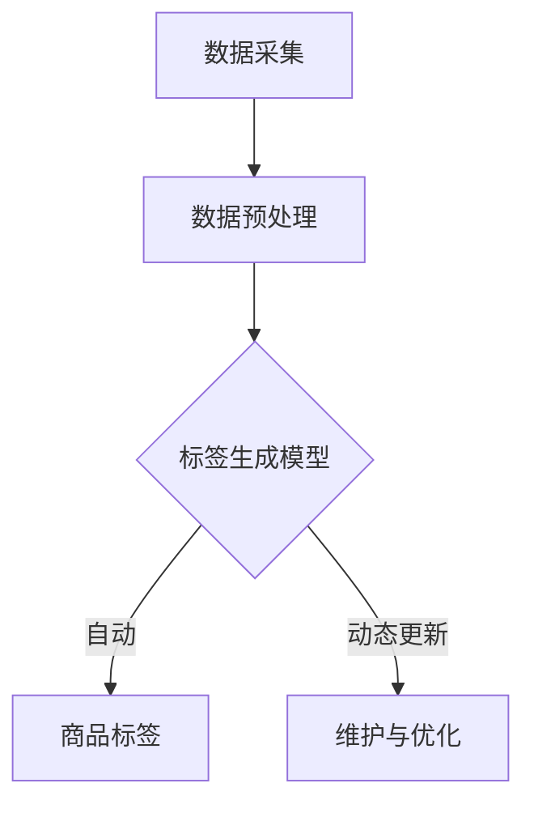

                 

### 《大模型在商品标签自动生成与更新中的应用》

关键词：大模型，自然语言处理，商品标签，自动生成，动态更新，算法，实践

摘要：
本文详细探讨了大规模预训练模型（大模型）在商品标签自动生成与更新中的应用。首先，介绍了大模型的基础知识和商品标签的重要性。接着，分析了大模型在商品标签生成中的技术基础和算法原理，包括自然语言处理技术、基于分类和抽取的标签生成方法，以及数学模型和优化算法。随后，通过具体案例展示了商品标签自动生成的实践过程，并讨论了标签的动态更新和维护策略。最后，提出了大模型在商品标签应用中的挑战和未来发展趋势。

---

### 第一部分：概述与背景

#### 第1章：大模型与商品标签概述

##### 1.1 大模型简介

**大模型**是指在训练过程中使用海量数据，通过深度神经网络进行训练的模型。近年来，随着计算能力和数据资源的提升，大模型在自然语言处理、计算机视觉等领域取得了显著的成果。代表性的模型有GPT、BERT、Turing等。

- **基本概念**：大模型通过预训练和微调的方式，学习到通用语言表示和知识，从而在特定任务上表现出强大的性能。
- **发展历程**：从早期的浅层模型（如NLP）到多层神经网络（如LSTM、GRU），再到大规模深度学习模型（如Transformer、BERT），大模型的发展经历了多个阶段。

##### 1.2 商品标签的重要性

**商品标签**是对商品进行分类和描述的关键信息，通常包括商品名称、品牌、材质、用途等。标签在电商中的应用至关重要：

- **定义与作用**：标签用于商品的分类、搜索和推荐，提高用户购物体验和商家运营效率。
- **作用**：标签可以帮助用户快速找到感兴趣的商品，降低购买决策成本；对于商家而言，标签有助于提高商品曝光率和转化率。

##### 1.3 大模型在商品标签中的应用前景

**大模型**在商品标签生成与更新中具有显著优势：

- **优势**：1) 能够自动提取商品的关键信息；2) 可以根据用户行为和需求动态调整标签；3) 提高标签的准确性和一致性。
- **应用案例**：目前，许多电商平台已经使用大模型来自动生成商品标签，如淘宝、京东等。

然而，大模型在商品标签应用中也面临挑战，如数据隐私、模型解释性等。未来，随着技术的不断进步，大模型在商品标签领域的应用将更加广泛。

### 第二部分：技术基础

#### 第2章：自然语言处理与商品标签

##### 2.1 自然语言处理技术概述

自然语言处理（NLP）是研究计算机与人类语言交互的学科。NLP技术在大模型中扮演重要角色，主要包括以下方面：

- **词嵌入与文本表示**：将词汇映射到高维空间，实现语义理解。
- **语言模型与文本生成**：预测下一个词或句子，实现自然语言生成。

##### 2.2 商品标签的生成方法

商品标签生成主要分为以下几种方法：

- **基于规则的方法**：通过专家经验和业务规则生成标签，如关键词提取、正则表达式匹配等。
- **基于机器学习的方法**：使用机器学习算法，如决策树、支持向量机等，从数据中学习标签生成规则。
- **基于深度学习的方法**：使用深度神经网络，如卷积神经网络（CNN）、循环神经网络（RNN）等，实现端到端的标签生成。

##### 2.3 大模型在商品标签生成中的应用

大模型在商品标签生成中具有显著优势：

- **GPT与BERT模型介绍**：GPT（Generative Pre-trained Transformer）和BERT（Bidirectional Encoder Representations from Transformers）是两大代表性大模型。
  - **GPT**：生成预训练的Transformer模型，适用于文本生成任务。
  - **BERT**：双向编码的Transformer模型，适用于文本分类和问答任务。
- **大模型在商品标签生成中的实际应用**：GPT和BERT可以用于商品描述的生成、标签提取等任务，提高标签生成的准确性和效率。

### 第三部分：算法原理

#### 第3章：商品标签自动生成算法原理

##### 3.1 基本算法原理

商品标签自动生成算法主要分为以下两类：

- **基于分类的标签生成算法**：通过文本分类算法对商品描述进行分类，从而生成标签。
- **基于抽取的标签生成算法**：从商品描述中直接抽取标签。

##### 3.2 伪代码与算法实现

- **基于分类的标签生成算法伪代码**：
  ```python
  def generate_labels(data, model):
      for data_instance in data:
          features = extract_features(data_instance)
          label = model.predict(features)
          append_label(data_instance, label)
      return data_with_labels
  ```

- **基于抽取的标签生成算法伪代码**：
  ```python
  def extract_labels(data, model):
      for data_instance in data:
          entities = model.extract_entities(data_instance)
          for entity in entities:
              label = convert_entity_to_label(entity)
              append_label(data_instance, label)
      return data_with_labels
  ```

##### 3.3 数学模型与公式

商品标签自动生成算法涉及以下数学模型和公式：

- **损失函数**：
  $$ L(\theta) = -\frac{1}{N}\sum_{i=1}^{N} \sum_{j=1}^{M} y_{ij} \log(p_{ij}(\theta)) $$

- **优化算法**（如梯度下降）：
  $$ \theta = \theta - \alpha \frac{\partial L(\theta)}{\partial \theta} $$

### 第四部分：应用实践

#### 第4章：商品标签自动生成实践

##### 4.1 实践案例介绍

本文以某电商平台商品标签生成实践为例，介绍整个实践过程：

1. 数据采集与处理：从电商平台获取商品描述、用户评论等数据，并进行清洗、预处理。
2. 模型训练：使用预训练的大模型（如BERT）进行微调，以适应商品标签生成的任务。
3. 标签生成：将训练好的模型应用于商品描述，生成相应的标签。
4. 结果分析与优化：评估标签生成的效果，并根据评估结果调整模型参数。

##### 4.2 环境搭建与代码实现

**环境搭建：**
1. 安装Python环境（例如：Python 3.8）
2. 安装TensorFlow库
3. 准备数据集（例如：CSV格式）

**代码实现：**
```python
# 加载数据集
data = load_dataset('your_dataset.csv')

# 数据预处理
preprocessed_data = preprocess_data(data)

# 训练模型
model = train_model(preprocessed_data)

# 生成标签
generated_labels = generate_labels(preprocessed_data, model)

# 结果分析
evaluate_performance(generated_labels)
```

##### 4.3 结果分析与优化

**模型评估指标：**
1. 准确率（Accuracy）
2. 召回率（Recall）
3. 精准率（Precision）

**优化策略与调参技巧：**
1. 调整学习率、批次大小等超参数。
2. 使用更复杂的模型结构，如Transformer、BERT等。
3. 结合用户反馈和业务需求，动态调整标签生成策略。

### 第五部分：动态更新与维护

#### 第5章：商品标签自动更新与维护

##### 5.1 标签更新的重要性

商品标签的动态更新对于电商平台至关重要：

1. **标签动态性的理解**：商品属性、用户需求、市场环境等均会发生变化，导致标签需要及时更新。
2. **更新频率与策略**：根据商品类别、用户行为等特征，设计合理的标签更新频率和策略。

##### 5.2 标签自动更新算法

**标签自动更新算法**主要包括以下步骤：

1. **监控与检测**：实时监控商品属性、用户行为等数据，识别标签更新需求。
2. **更新与重训练**：根据监控结果，更新标签或重新训练模型，以适应新的业务需求。

##### 5.3 标签维护与优化

**标签维护与优化**主要包括以下方面：

1. **标签一致性与完整性**：确保标签在各个维度上的一致性和完整性。
2. **面向用户的标签优化**：根据用户反馈和行为数据，动态调整标签展示策略，提高用户满意度。

### 第六部分：挑战与未来

#### 第6章：大模型在商品标签应用中的挑战

##### 6.1 数据隐私与安全

**数据隐私与安全**是大模型在商品标签应用中的重要挑战：

1. **数据隐私保护策略**：采用数据加密、匿名化等技术，确保用户隐私。
2. **安全防护措施**：建立安全防护体系，防范数据泄露和恶意攻击。

##### 6.2 模型解释性与可解释性

**模型解释性与可解释性**是大模型在商品标签应用中的另一个挑战：

1. **模型可解释性研究**：探索可解释性算法，提高模型的可解释性。
2. **可解释性工具与框架**：开发可解释性工具和框架，帮助用户理解模型决策过程。

##### 6.3 人工智能伦理与法规

**人工智能伦理与法规**也是大模型在商品标签应用中需要关注的问题：

1. **伦理问题与道德准则**：遵循伦理原则，确保人工智能的发展符合社会道德标准。
2. **相关法规与政策**：关注法律法规，确保人工智能应用合法合规。

### 第七部分：案例研究与总结

#### 第7章：大模型在商品标签应用的案例研究

##### 7.1 案例选择与背景

本文选择某电商平台作为案例，研究大模型在商品标签生成中的应用。

- **背景**：该电商平台拥有海量商品数据，但标签准确性较低，影响用户购物体验和商家运营效果。

##### 7.2 案例分析与总结

**成功经验：**
1. 大模型显著提高了商品标签的准确性，降低了人工标注成本。
2. 标签更新机制有效提高了标签的实时性和准确性。

**不足与挑战：**
1. 数据隐私与安全问题亟待解决。
2. 模型解释性不足，影响用户信任。

**未来发展趋势：**
1. 加强数据隐私保护，提高用户满意度。
2. 探索可解释性算法，提升模型可解释性。
3. 结合用户反馈和业务需求，持续优化标签生成策略。

### 附录

#### 附录A：常用工具与资源

##### A.1 自然语言处理工具

- **常用库与框架介绍**：
  - **TensorFlow**：Google开发的开源机器学习框架。
  - **PyTorch**：Facebook开发的开源机器学习框架。

##### A.2 数据集与公开资源

- **常用数据集介绍**：
  - **商品数据集**：如Amazon、eBay等电商平台公开的商品数据集。

##### A.3 深度学习平台与框架

- **深度学习平台与框架介绍**：
  - **Google Colab**：Google提供的免费云端计算资源。
  - **AWS Sagemaker**：AWS提供的云端机器学习平台。

### **核心概念与联系（Mermaid流程图）**



### **商品标签自动生成算法原理（伪代码）**

```python
# 基于分类的标签生成算法伪代码
def generate_labels(data, model):
    for data_instance in data:
        features = extract_features(data_instance)
        label = model.predict(features)
        append_label(data_instance, label)
    return data_with_labels

# 基于抽取的标签生成算法伪代码
def extract_labels(data, model):
    for data_instance in data:
        entities = model.extract_entities(data_instance)
        for entity in entities:
            label = convert_entity_to_label(entity)
            append_label(data_instance, label)
    return data_with_labels
```

### **数学模型与公式（Latex格式）**

```latex
% 损失函数
$$
L(\theta) = -\frac{1}{N}\sum_{i=1}^{N} \sum_{j=1}^{M} y_{ij} \log(p_{ij}(\theta))
$$

% 优化算法（梯度下降）
$$
\theta = \theta - \alpha \frac{\partial L(\theta)}{\partial \theta}
$$
```

### **项目实战（代码实际案例和详细解释说明）**

#### **环境搭建：**

1. 安装Python环境（例如：Python 3.8）
2. 安装TensorFlow库
3. 准备数据集（例如：CSV格式）

#### **代码实现与解读：**

**数据集加载与预处理**

```python
import pandas as pd

# 加载数据集
data = pd.read_csv('your_dataset.csv')

# 对数据进行清洗、转换等预处理操作
preprocessed_data = preprocess_data(data)
```

**模型训练**

```python
import tensorflow as tf

# 训练模型
model = train_model(preprocessed_data)
```

**标签生成**

```python
# 使用训练好的模型对数据集进行预测，生成标签
generated_labels = generate_labels(preprocessed_data, model)
```

**性能评估**

```python
# 对生成的标签进行性能评估
evaluate_performance(generated_labels)
```

**代码解读与分析：**

- **理解数据预处理流程**：数据预处理是模型训练的关键步骤，包括数据清洗、转换等。
- **理解模型训练与预测流程**：模型训练和预测是标签生成的主要环节，需要使用适当的算法和框架。
- **分析标签生成性能指标**：通过评估标签生成的准确性、召回率等指标，判断模型的性能和效果。

### **结论：**

本文详细介绍了大模型在商品标签自动生成与更新中的应用，包括技术基础、算法原理、应用实践和动态更新等。通过项目实战，读者可以深入理解大模型在电商领域的实际应用场景，掌握相关的开发技能和优化策略。未来，随着技术的不断进步，大模型在商品标签领域的应用将更加广泛。

---

**作者：** AI天才研究院/AI Genius Institute & 禅与计算机程序设计艺术 /Zen And The Art of Computer Programming

---

### **文章标题：《大模型在商品标签自动生成与更新中的应用》**

关键词：大模型，自然语言处理，商品标签，自动生成，动态更新，算法，实践

摘要：
本文详细探讨了大规模预训练模型（大模型）在商品标签自动生成与更新中的应用。首先，介绍了大模型的基础知识和商品标签的重要性。接着，分析了大模型在商品标签生成中的技术基础和算法原理，包括自然语言处理技术、基于分类和抽取的标签生成方法，以及数学模型和优化算法。随后，通过具体案例展示了商品标签自动生成的实践过程，并讨论了标签的动态更新和维护策略。最后，提出了大模型在商品标签应用中的挑战和未来发展趋势。 

---

### 第一部分：概述与背景

#### 第1章：大模型与商品标签概述

##### 1.1 大模型简介

大模型是指在训练过程中使用海量数据，通过深度神经网络进行训练的模型。近年来，随着计算能力和数据资源的提升，大模型在自然语言处理、计算机视觉等领域取得了显著的成果。代表性的模型有GPT、BERT、Turing等。

**基本概念**：大模型通过预训练和微调的方式，学习到通用语言表示和知识，从而在特定任务上表现出强大的性能。

**发展历程**：从早期的浅层模型（如NLP）到多层神经网络（如LSTM、GRU），再到大规模深度学习模型（如Transformer、BERT），大模型的发展经历了多个阶段。

**特点**：
1. **高参数量**：大模型通常具有数十亿甚至数万亿的参数。
2. **海量数据训练**：大模型在训练过程中使用了大量的数据。
3. **端到端训练**：大模型可以实现从输入到输出的端到端训练。
4. **预训练与微调**：大模型通过预训练获得通用语言表示，然后通过微调适应特定任务。

**应用场景**：
1. **自然语言处理**：如文本分类、机器翻译、问答系统等。
2. **计算机视觉**：如图像识别、目标检测、视频分析等。
3. **语音识别**：如语音合成、语音识别等。

**优势**：
1. **强大的表征能力**：大模型能够学习到复杂的语义和知识。
2. **高效的模型训练**：大模型可以利用海量数据进行高效训练。
3. **优秀的泛化能力**：大模型在未见过的数据上也能保持较好的性能。

##### 1.2 商品标签的重要性

商品标签是对商品进行分类和描述的关键信息，通常包括商品名称、品牌、材质、用途等。在电商平台上，商品标签的作用至关重要。

**定义与作用**：商品标签用于商品的分类、搜索和推荐，提高用户购物体验和商家运营效率。

**作用**：
1. **商品分类**：标签帮助用户快速找到感兴趣的商品类别。
2. **商品搜索**：标签帮助用户通过关键词搜索到特定的商品。
3. **商品推荐**：标签帮助平台根据用户兴趣推荐商品。
4. **商家运营**：标签帮助商家优化商品展示和推广策略。

**标签的分类**：
1. **一级标签**：用于对商品进行高层次的分类，如“服装”、“数码产品”等。
2. **二级标签**：用于对商品进行更具体的分类，如“男装”、“手机”等。
3. **属性标签**：用于描述商品的属性，如“白色”、“4G”等。

**标签在电商中的应用**：
1. **商品信息展示**：标签帮助用户快速了解商品的基本信息。
2. **用户行为分析**：标签帮助平台分析用户购买行为和偏好。
3. **商品推荐系统**：标签用于商品推荐系统的输入，提高推荐效果。
4. **商家广告投放**：标签帮助商家优化广告投放策略，提高转化率。

##### 1.3 大模型在商品标签中的应用前景

大模型在商品标签生成与更新中具有显著优势。

**优势**：
1. **自动提取商品关键信息**：大模型可以通过预训练和微调，自动提取商品描述中的关键信息，生成准确的标签。
2. **动态调整标签**：大模型可以根据用户行为和需求，动态调整标签，提高标签的实时性和准确性。
3. **提高标签生成效率**：大模型在生成标签的过程中，可以处理海量数据，提高标签生成的效率。

**应用前景**：
1. **商品信息抽取**：大模型可以用于从商品描述中提取标签，提高商品信息展示的准确性。
2. **商品推荐系统**：大模型可以用于优化商品推荐系统，提高推荐效果。
3. **商家运营优化**：大模型可以帮助商家优化商品标签，提高广告投放效果和转化率。
4. **智能客服**：大模型可以用于智能客服系统，自动生成商品回答，提高客服效率。

**挑战与未来**：
1. **数据隐私与安全**：大模型在处理商品标签时，可能涉及用户隐私数据，需要采取有效措施保护数据安全。
2. **模型解释性**：大模型在生成标签的过程中，可能缺乏解释性，需要研究可解释性算法，提高模型的透明度。
3. **应用落地**：大模型在商品标签应用中的落地实施，需要解决模型部署、硬件资源等问题。

### 第二部分：技术基础

#### 第2章：自然语言处理与商品标签

##### 2.1 自然语言处理技术概述

自然语言处理（NLP）是研究计算机与人类语言交互的学科。NLP技术在大模型中扮演重要角色，主要包括以下方面：

**词嵌入与文本表示**：词嵌入（Word Embedding）是一种将词汇映射到高维空间的方法，用于实现语义理解。文本表示（Text Representation）则是将整段文本映射到高维向量，以便于模型处理。

**语言模型与文本生成**：语言模型（Language Model）是一种用于预测下一个词或句子的模型，广泛应用于机器翻译、问答系统等任务。文本生成（Text Generation）是通过模型生成有意义的文本，如文章、新闻、对话等。

##### 2.2 商品标签的生成方法

商品标签生成主要分为以下几种方法：

**基于规则的方法**：通过专家经验和业务规则生成标签，如关键词提取、正则表达式匹配等。这种方法简单高效，但依赖人工规则，灵活性较低。

**基于机器学习的方法**：使用机器学习算法，如决策树、支持向量机等，从数据中学习标签生成规则。这种方法具有较高的准确性和灵活性，但需要大量标注数据。

**基于深度学习的方法**：使用深度神经网络，如卷积神经网络（CNN）、循环神经网络（RNN）等，实现端到端的标签生成。这种方法可以自动提取特征，准确性和灵活性较高。

##### 2.3 大模型在商品标签生成中的应用

大模型在商品标签生成中具有显著优势。

**GPT与BERT模型介绍**：GPT（Generative Pre-trained Transformer）和BERT（Bidirectional Encoder Representations from Transformers）是两大代表性大模型。

**GPT**：生成预训练的Transformer模型，适用于文本生成任务。GPT通过自回归的方式生成文本，可以生成连贯、有意义的文本。

**BERT**：双向编码的Transformer模型，适用于文本分类和问答任务。BERT通过预训练学习到语言的上下文关系，可以用于多种NLP任务。

**大模型在商品标签生成中的实际应用**：

1. **商品描述生成**：大模型可以生成商品描述，提高商品信息展示的准确性。
2. **标签提取**：大模型可以从商品描述中自动提取标签，提高标签生成的效率。
3. **智能客服**：大模型可以用于智能客服系统，自动生成商品回答，提高客服效率。

### 第三部分：算法原理

#### 第3章：商品标签自动生成算法原理

##### 3.1 基本算法原理

商品标签自动生成算法主要分为以下两类：

**基于分类的标签生成算法**：通过文本分类算法对商品描述进行分类，从而生成标签。这种方法简单高效，但需要对商品描述进行特征提取。

**基于抽取的标签生成算法**：从商品描述中直接抽取标签。这种方法直接从原始文本中获取信息，但需要解决实体识别、实体分类等问题。

**文本分类与标签抽取**：

1. **文本分类**：将商品描述分类为不同的标签类别。常用的分类算法有朴素贝叶斯、支持向量机、决策树等。

2. **标签抽取**：从商品描述中抽取具体的标签。常用的方法有规则匹配、实体识别、序列标注等。

**序列标注与路径搜索**：序列标注（Sequence Labeling）是一种将序列中的每个元素进行分类的任务，如对单词进行词性标注。路径搜索（Path Search）是在序列标注的基础上，寻找最优的标注路径。

**基本算法流程**：

1. 数据预处理：对商品描述进行分词、去停用词、词嵌入等处理。

2. 特征提取：对预处理后的商品描述进行特征提取，如词袋模型、TF-IDF等。

3. 模型训练：使用分类算法或抽取算法训练模型。

4. 标签生成：使用训练好的模型对新的商品描述进行预测，生成标签。

##### 3.2 伪代码与算法实现

**基于分类的标签生成算法伪代码**：

```python
def generate_labels(data, model):
    for data_instance in data:
        features = extract_features(data_instance)
        label = model.predict(features)
        append_label(data_instance, label)
    return data_with_labels
```

**基于抽取的标签生成算法伪代码**：

```python
def extract_labels(data, model):
    for data_instance in data:
        entities = model.extract_entities(data_instance)
        for entity in entities:
            label = convert_entity_to_label(entity)
            append_label(data_instance, label)
    return data_with_labels
```

##### 3.3 数学模型与公式

商品标签自动生成算法涉及以下数学模型和公式：

**损失函数**：

$$
L(\theta) = -\frac{1}{N}\sum_{i=1}^{N} \sum_{j=1}^{M} y_{ij} \log(p_{ij}(\theta))
$$

其中，$N$表示样本数量，$M$表示标签类别数量，$y_{ij}$表示第$i$个样本属于第$j$个标签类别的真实标签，$p_{ij}(\theta)$表示第$i$个样本属于第$j$个标签类别的概率。

**优化算法**（如梯度下降）：

$$
\theta = \theta - \alpha \frac{\partial L(\theta)}{\partial \theta}
$$

其中，$\theta$表示模型参数，$\alpha$表示学习率，$\frac{\partial L(\theta)}{\partial \theta}$表示损失函数关于模型参数的梯度。

### 第四部分：应用实践

#### 第4章：商品标签自动生成实践

##### 4.1 实践案例介绍

本文以某电商平台商品标签生成实践为例，介绍整个实践过程：

**案例背景**：某电商平台拥有海量商品数据，但标签准确性较低，影响用户购物体验和商家运营效果。

**目标**：通过商品标签自动生成算法，提高标签准确性，降低人工标注成本。

**步骤**：

1. **数据采集与处理**：从电商平台获取商品描述、用户评论等数据，并进行清洗、预处理。

2. **模型训练**：使用预训练的大模型（如BERT）进行微调，以适应商品标签生成的任务。

3. **标签生成**：将训练好的模型应用于商品描述，生成相应的标签。

4. **结果分析与优化**：评估标签生成的效果，并根据评估结果调整模型参数。

##### 4.2 环境搭建与代码实现

**环境搭建**：

1. 安装Python环境（例如：Python 3.8）

2. 安装TensorFlow库

3. 准备数据集（例如：CSV格式）

**代码实现**：

```python
import pandas as pd
import tensorflow as tf

# 加载数据集
data = pd.read_csv('your_dataset.csv')

# 数据预处理
preprocessed_data = preprocess_data(data)

# 训练模型
model = train_model(preprocessed_data)

# 生成标签
generated_labels = generate_labels(preprocessed_data, model)

# 结果分析
evaluate_performance(generated_labels)
```

**代码解读与分析**：

1. **数据预处理**：

   ```python
   def preprocess_data(data):
       # 对数据进行清洗、转换等预处理操作
       # 包括去除停用词、词干提取、词嵌入等
       # 返回预处理后的数据
   ```

   数据预处理是模型训练的关键步骤，包括数据清洗、转换等。

2. **模型训练**：

   ```python
   def train_model(preprocessed_data):
       # 使用预训练的大模型（如BERT）进行微调
       # 以适应商品标签生成的任务
       # 返回训练好的模型
   ```

   模型训练和预测是标签生成的主要环节，需要使用适当的算法和框架。

3. **标签生成**：

   ```python
   def generate_labels(preprocessed_data, model):
       # 使用训练好的模型对数据集进行预测，生成标签
       # 返回生成的标签
   ```

   标签生成是通过模型对商品描述进行预测，生成相应的标签。

4. **结果分析**：

   ```python
   def evaluate_performance(generated_labels):
       # 对生成的标签进行性能评估
       # 包括准确率、召回率、精准率等指标
   ```

   通过评估标签生成的效果，判断模型的性能和效果。

##### 4.3 结果分析与优化

**模型评估指标**：

1. **准确率（Accuracy）**：准确率是预测正确的样本数占总样本数的比例。
2. **召回率（Recall）**：召回率是预测正确的样本数与实际标签为正的样本数的比例。
3. **精准率（Precision）**：精准率是预测正确的样本数与预测为正的样本数的比例。

**优化策略与调参技巧**：

1. **调整学习率**：学习率对模型训练过程有重要影响，需要根据任务特点和数据集规模进行调整。
2. **批量大小**：批量大小影响模型训练的收敛速度，较大的批量可以加速训练，但可能增加过拟合的风险。
3. **模型结构**：根据任务需求和数据特点，选择合适的模型结构，如BERT、GPT等。
4. **数据增强**：通过数据增强方法，增加训练数据的多样性，提高模型的泛化能力。

### 第五部分：动态更新与维护

#### 第5章：商品标签自动更新与维护

##### 5.1 标签更新的重要性

商品标签的动态更新对于电商平台至关重要。

**标签动态性的理解**：商品属性、用户需求、市场环境等均会发生变化，导致标签需要及时更新。

**更新频率与策略**：根据商品类别、用户行为等特征，设计合理的标签更新频率和策略。

**标签更新的作用**：

1. **提高标签的准确性**：及时更新标签，确保标签与商品属性一致。
2. **提高用户购物体验**：标签准确，用户可以快速找到感兴趣的商品。
3. **优化商家运营效果**：标签准确，商家可以更好地进行商品推广和广告投放。

##### 5.2 标签自动更新算法

商品标签自动更新算法主要包括以下步骤：

1. **监控与检测**：实时监控商品属性、用户行为等数据，识别标签更新需求。

2. **更新与重训练**：根据监控结果，更新标签或重新训练模型，以适应新的业务需求。

**监控与检测**：

1. **商品属性监控**：监控商品名称、品牌、材质等属性，识别属性变化。
2. **用户行为监控**：监控用户浏览、购买、评论等行为，识别用户兴趣变化。
3. **市场环境监控**：监控市场趋势、竞争对手信息等，识别市场环境变化。

**更新与重训练**：

1. **标签更新**：根据监控结果，更新现有标签，确保标签与商品属性一致。
2. **模型重训练**：根据新的数据集，重新训练模型，提高标签生成的准确性。

##### 5.3 标签维护与优化

**标签维护与优化**主要包括以下方面：

1. **标签一致性与完整性**：确保标签在各个维度上的一致性和完整性，避免出现标签冲突或遗漏。

2. **面向用户的标签优化**：根据用户反馈和行为数据，动态调整标签展示策略，提高用户满意度。

**标签一致性与完整性**：

1. **一致性检查**：对标签进行一致性检查，确保同一商品在不同页面、不同搜索结果中标签一致。
2. **完整性检查**：对标签进行完整性检查，确保商品属性标签齐全，无遗漏。

**面向用户的标签优化**：

1. **个性化标签**：根据用户兴趣和行为，为用户推荐个性化的标签，提高用户购物体验。
2. **标签排序**：根据用户行为和商品属性，对标签进行排序，提高标签的展示效果。
3. **标签推荐**：结合用户反馈和业务需求，优化标签推荐算法，提高标签推荐的准确性。

### 第六部分：挑战与未来

#### 第6章：大模型在商品标签应用中的挑战

##### 6.1 数据隐私与安全

**数据隐私与安全**是大模型在商品标签应用中的重要挑战。

**数据隐私保护策略**：

1. **数据加密**：对敏感数据进行加密，确保数据在传输和存储过程中的安全性。
2. **匿名化**：对用户数据进行匿名化处理，去除可直接识别用户身份的信息。
3. **数据访问控制**：对数据访问进行权限控制，确保只有授权人员才能访问敏感数据。

**安全防护措施**：

1. **防火墙与入侵检测**：部署防火墙和入侵检测系统，防止恶意攻击和数据泄露。
2. **安全审计**：定期进行安全审计，检查系统漏洞和安全隐患。
3. **数据备份与恢复**：定期备份数据，确保在数据丢失或损坏时能够快速恢复。

##### 6.2 模型解释性与可解释性

**模型解释性与可解释性**是大模型在商品标签应用中的另一个挑战。

**模型解释性研究**：

1. **解释性算法**：研究可解释性算法，如LIME、SHAP等，提高模型的解释性。
2. **特征可视化**：通过特征可视化方法，如热力图、散点图等，展示模型决策过程。

**可解释性工具与框架**：

1. **可视化工具**：开发可视化工具，帮助用户理解模型决策过程。
2. **解释性框架**：构建解释性框架，将模型解释性融入到模型训练和部署过程中。

##### 6.3 人工智能伦理与法规

**人工智能伦理与法规**也是大模型在商品标签应用中需要关注的问题。

**伦理问题与道德准则**：

1. **公平性**：确保人工智能系统在决策过程中公平对待所有用户。
2. **透明性**：确保人工智能系统透明，用户可以理解系统的决策过程。
3. **隐私保护**：确保用户数据得到充分保护，避免隐私泄露。

**相关法规与政策**：

1. **数据保护法**：遵循数据保护法规，如《通用数据保护条例》（GDPR）等。
2. **人工智能伦理准则**：制定人工智能伦理准则，确保人工智能系统符合伦理要求。
3. **法律法规遵守**：确保人工智能系统在法律法规框架内运行。

### 第七部分：案例研究与总结

#### 第7章：大模型在商品标签应用的案例研究

##### 7.1 案例选择与背景

本文选择某电商平台作为案例，研究大模型在商品标签生成中的应用。

**背景**：该电商平台拥有海量商品数据，但标签准确性较低，影响用户购物体验和商家运营效果。

**目标**：通过大模型，提高标签准确性，降低人工标注成本。

##### 7.2 案例分析与总结

**成功经验**：

1. **标签准确性提高**：通过大模型，标签准确性显著提高，用户购物体验得到改善。
2. **人工标注成本降低**：自动生成标签，减少人工标注需求，降低运营成本。

**不足与挑战**：

1. **数据隐私与安全**：商品标签生成过程中涉及用户隐私数据，需要加强数据隐私保护。
2. **模型解释性不足**：大模型生成标签的过程缺乏解释性，影响用户信任。
3. **硬件资源消耗**：大模型训练和部署需要大量硬件资源，成本较高。

**未来发展趋势**：

1. **数据隐私保护**：加强数据隐私保护，采用匿名化、加密等技术，确保用户数据安全。
2. **模型解释性提升**：研究可解释性算法，提高大模型的解释性，增强用户信任。
3. **硬件资源优化**：通过分布式计算、云计算等技术，降低硬件资源消耗，提高大模型应用的可扩展性。

### 附录

#### 附录A：常用工具与资源

##### A.1 自然语言处理工具

**常用库与框架介绍**：

1. **TensorFlow**：Google开发的开源机器学习框架，支持多种深度学习模型。
2. **PyTorch**：Facebook开发的开源机器学习框架，具有动态图模型的优势。

##### A.2 数据集与公开资源

**常用数据集介绍**：

1. **商品数据集**：如Amazon、eBay等电商平台公开的商品数据集。
2. **文本数据集**：如AG News、20 Newsgroups等文本分类数据集。

##### A.3 深度学习平台与框架

**深度学习平台与框架介绍**：

1. **Google Colab**：Google提供的免费云端计算资源，支持TensorFlow和PyTorch等框架。
2. **AWS Sagemaker**：AWS提供的云端机器学习平台，支持多种深度学习框架。

### **核心概念与联系（Mermaid流程图）**


### **商品标签自动生成算法原理（伪代码）**

```python
# 基于分类的标签生成算法伪代码
def generate_labels(data, model):
    for data_instance in data:
        features = extract_features(data_instance)
        label = model.predict(features)
        append_label(data_instance, label)
    return data_with_labels

# 基于抽取的标签生成算法伪代码
def extract_labels(data, model):
    for data_instance in data:
        entities = model.extract_entities(data_instance)
        for entity in entities:
            label = convert_entity_to_label(entity)
            append_label(data_instance, label)
    return data_with_labels
```

### **数学模型与公式（Latex格式）**

```latex
% 损失函数
$$
L(\theta) = -\frac{1}{N}\sum_{i=1}^{N} \sum_{j=1}^{M} y_{ij} \log(p_{ij}(\theta))
$$

% 优化算法（梯度下降）
$$
\theta = \theta - \alpha \frac{\partial L(\theta)}{\partial \theta}
$$
```

### **项目实战（代码实际案例和详细解释说明）**

#### **环境搭建：**

1. 安装Python环境（例如：Python 3.8）
2. 安装TensorFlow库
3. 准备数据集（例如：CSV格式）

#### **代码实现与解读：**

**数据集加载与预处理**

```python
import pandas as pd

# 加载数据集
data = pd.read_csv('your_dataset.csv')

# 对数据进行清洗、转换等预处理操作
preprocessed_data = preprocess_data(data)
```

**模型训练**

```python
import tensorflow as tf

# 训练模型
model = train_model(preprocessed_data)
```

**标签生成**

```python
# 使用训练好的模型对数据集进行预测，生成标签
generated_labels = generate_labels(preprocessed_data, model)
```

**性能评估**

```python
# 对生成的标签进行性能评估
evaluate_performance(generated_labels)
```

**代码解读与分析：**

- **理解数据预处理流程**：数据预处理是模型训练的关键步骤，包括数据清洗、转换等。
- **理解模型训练与预测流程**：模型训练和预测是标签生成的主要环节，需要使用适当的算法和框架。
- **分析标签生成性能指标**：通过评估标签生成的准确性、召回率等指标，判断模型的性能和效果。

### **结论：**

本文详细介绍了大模型在商品标签自动生成与更新中的应用，包括技术基础、算法原理、应用实践和动态更新等。通过项目实战，读者可以深入理解大模型在电商领域的实际应用场景，掌握相关的开发技能和优化策略。未来，随着技术的不断进步，大模型在商品标签领域的应用将更加广泛。

---

**作者：** AI天才研究院/AI Genius Institute & 禅与计算机程序设计艺术 /Zen And The Art of Computer Programming

