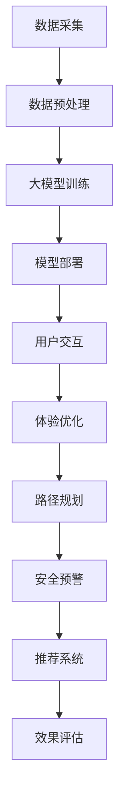

                 

### 《大模型在智能旅游中的应用前景》

#### > **关键词：大模型、智能旅游、应用场景、技术原理、实践案例分析**

> **摘要：本文将深入探讨大模型在智能旅游领域的应用前景，通过阐述大模型的基本概念、技术原理以及在旅游信息推荐、路径规划、安全预警和体验优化等方面的应用，分析大模型在智能旅游中的技术挑战与解决方案，提供实际案例，并对未来应用前景进行展望。**

----------------------------------------------------------------

## 第一部分：概述与背景

### 第1章：大模型与智能旅游概述

#### 1.1 大模型的基本概念

大模型（Large Models）是当前人工智能领域的一个重要研究方向，其核心思想是通过大规模的参数训练和优化，构建能够处理复杂任务的智能系统。大模型通常基于深度学习技术，尤其是神经网络，具有强大的表达能力和鲁棒性，能够在多种领域取得显著的成果。

#### 1.2 智能旅游的内涵与需求

智能旅游是指利用现代信息技术和人工智能技术，提升旅游体验、优化旅游资源配置和提升旅游服务效率的一种新型旅游模式。智能旅游的需求源于以下几个方面：

1. **个性化服务**：用户希望得到定制化的旅游服务，包括行程规划、景点推荐等。
2. **实时信息**：用户需要获取最新的旅游信息，如交通状况、天气变化等。
3. **安全与保障**：旅游过程中，用户对安全性的需求日益增加，包括预警系统、应急预案等。
4. **体验优化**：提升用户的整体旅游体验，包括行程安排、互动体验等。

#### 1.3 大模型在智能旅游中的应用潜力

大模型在智能旅游中的应用潜力主要体现在以下几个方面：

1. **旅游信息推荐**：通过分析用户的历史行为和偏好，为用户提供个性化的旅游推荐。
2. **路径规划**：利用大模型进行复杂的路径计算和优化，提供高效、便捷的旅游路线。
3. **安全预警**：通过实时分析旅游数据，预测潜在的安全风险，提前预警。
4. **体验优化**：利用大模型对用户的旅游行为进行分析，提供个性化的旅游建议和体验优化方案。

## 第2章：智能旅游中的大模型技术

### 2.1 大模型的技术原理

大模型的技术原理主要基于深度学习，特别是神经网络。深度学习是一种模拟人脑神经网络结构和功能的计算模型，通过多层次的神经网络结构，对大量数据进行训练，从而实现复杂的任务。

#### 神经网络结构

神经网络通常由输入层、隐藏层和输出层组成。每个神经元（节点）都与相邻的神经元相连，并通过权重进行加权求和，最后通过激活函数输出结果。

#### 深度学习算法

常见的深度学习算法包括：

1. **卷积神经网络（CNN）**：适用于图像识别、分类等任务。
2. **循环神经网络（RNN）**：适用于序列数据处理，如时间序列分析、语言模型等。
3. **变换器（Transformer）**：适用于自然语言处理、机器翻译等任务。

#### 大模型训练过程

大模型的训练过程主要包括：

1. **数据预处理**：对原始数据进行清洗、标准化等处理。
2. **模型初始化**：初始化模型的权重。
3. **前向传播**：将输入数据传递到神经网络中，计算输出。
4. **反向传播**：根据输出误差，调整模型的权重。
5. **优化算法**：如随机梯度下降（SGD）、Adam等。

### 2.2 常见的大模型架构

常见的大模型架构包括：

1. **GPT（Generative Pre-trained Transformer）**：一种基于变换器的预训练模型，广泛应用于自然语言处理领域。
2. **BERT（Bidirectional Encoder Representations from Transformers）**：一种双向变换器模型，能够捕捉文本的上下文信息。
3. **T5（Text-To-Text Transfer Transformer）**：一种通用的文本转换模型，可以处理多种自然语言处理任务。

### 2.3 大模型在智能旅游中的技术挑战与解决方案

大模型在智能旅游中面临以下技术挑战：

1. **数据质量**：智能旅游需要大量的高质量数据，包括用户行为数据、地理信息数据等。数据质量直接影响大模型的效果。
2. **计算资源**：大模型的训练和推理需要大量的计算资源，对硬件设备有较高要求。
3. **实时性**：智能旅游应用需要实时处理数据，对系统的响应速度有较高要求。

针对上述挑战，可以采取以下解决方案：

1. **数据采集与处理**：采用多种数据源，确保数据的多样性和准确性。对数据进行清洗、标准化等处理，提高数据质量。
2. **分布式计算**：利用分布式计算框架，如TensorFlow、PyTorch等，提高大模型的训练和推理效率。
3. **模型压缩与优化**：采用模型压缩和优化技术，如模型剪枝、量化等，减少计算资源的消耗。

## 第二部分：大模型在智能旅游中的应用场景

### 第3章：大模型在旅游信息推荐中的应用

#### 3.1 旅游信息推荐系统概述

旅游信息推荐系统是一种基于用户兴趣和行为数据的推荐系统，旨在为用户提供个性化的旅游信息，如景点推荐、酒店推荐、行程规划等。

#### 3.2 大模型在推荐系统中的关键作用

大模型在旅游信息推荐系统中扮演关键角色，主要体现在以下几个方面：

1. **用户偏好分析**：通过分析用户的历史行为和兴趣，为用户提供个性化的推荐。
2. **内容理解与生成**：利用大模型对旅游内容进行深入理解，生成高质量的推荐结果。
3. **实时更新与优化**：通过实时处理用户数据，动态调整推荐策略，提高推荐效果。

#### 3.3 旅游信息推荐系统的案例与实现

以下是一个旅游信息推荐系统的案例与实现：

1. **系统架构**：采用分布式架构，包括数据采集、处理、存储、推荐服务等模块。
2. **数据预处理**：对用户行为数据、旅游内容数据等进行清洗、标准化等处理。
3. **模型训练**：采用GPT模型进行训练，生成用户偏好模型和内容理解模型。
4. **推荐算法**：采用基于协同过滤和内容理解的混合推荐算法，为用户提供个性化推荐。

## 第4章：大模型在旅游路径规划中的应用

#### 4.1 旅游路径规划的需求分析

旅游路径规划是智能旅游中的一个重要功能，旨在为用户提供最优的旅游路线。其需求主要包括：

1. **用户个性化**：考虑用户的兴趣、偏好和行程安排。
2. **实时性**：提供实时更新的旅游路线。
3. **安全性**：考虑交通状况、天气等因素，确保路线安全。
4. **效率**：优化行程时间，提高旅游效率。

#### 4.2 大模型在路径规划中的应用

大模型在旅游路径规划中的应用主要体现在以下几个方面：

1. **路径计算**：利用大模型进行复杂的路径计算和优化，提供最优路径。
2. **实时更新**：通过实时处理用户数据，动态调整路径规划。
3. **多目标优化**：同时考虑行程时间、交通状况、景点兴趣等因素，实现多目标优化。

#### 4.3 旅游路径规划的案例与实现

以下是一个旅游路径规划的案例与实现：

1. **系统架构**：采用分布式架构，包括路径计算、实时更新、用户交互等模块。
2. **数据预处理**：对用户行程数据、交通数据等进行清洗、标准化等处理。
3. **模型训练**：采用BERT模型进行训练，生成路径计算模型。
4. **路径规划算法**：采用基于大模型的路径计算算法，结合多目标优化，实现最优路径规划。

## 第5章：大模型在旅游安全预警中的应用

#### 5.1 旅游安全预警的意义

旅游安全预警是智能旅游中的一个关键功能，旨在预测和预防旅游过程中的安全风险，确保用户的安全。其意义主要包括：

1. **保障用户安全**：提前预警潜在的安全风险，提高用户安全意识。
2. **减少安全事故**：通过预警系统，减少安全事故的发生。
3. **优化资源配置**：合理调配资源，提高应急响应效率。

#### 5.2 大模型在安全预警中的作用

大模型在旅游安全预警中扮演关键角色，主要体现在以下几个方面：

1. **风险预测**：通过分析历史数据和实时数据，预测潜在的安全风险。
2. **实时监测**：实时监测旅游环境，及时发现潜在的安全隐患。
3. **决策支持**：为相关部门和游客提供决策支持，优化安全应对措施。

#### 5.3 旅游安全预警的案例与实现

以下是一个旅游安全预警的案例与实现：

1. **系统架构**：采用分布式架构，包括数据采集、处理、预警分析、决策支持等模块。
2. **数据预处理**：对旅游数据、安全数据进行清洗、标准化等处理。
3. **模型训练**：采用LSTM模型进行训练，生成风险预测模型。
4. **预警算法**：采用基于LSTM的风险预测算法，实现实时预警。

## 第6章：大模型在旅游体验优化中的应用

#### 6.1 旅游体验优化的目标

旅游体验优化是智能旅游中的一个重要目标，旨在提升用户的整体旅游体验。其目标主要包括：

1. **个性化服务**：为用户提供个性化的旅游服务，满足用户个性化需求。
2. **行程安排**：优化行程安排，提高旅游效率。
3. **互动体验**：提升用户的互动体验，增强旅游乐趣。
4. **满意度**：提高用户满意度，提升旅游服务质量。

#### 6.2 大模型在体验优化中的应用

大模型在旅游体验优化中的应用主要体现在以下几个方面：

1. **用户行为分析**：通过分析用户行为，了解用户偏好，提供个性化的体验建议。
2. **行程优化**：利用大模型进行行程优化，提供最优的行程安排。
3. **互动体验**：通过大模型生成互动内容，提升用户的互动体验。
4. **满意度预测**：通过分析用户数据，预测用户满意度，优化旅游服务。

#### 6.3 旅游体验优化的案例与实现

以下是一个旅游体验优化的案例与实现：

1. **系统架构**：采用分布式架构，包括用户行为分析、行程优化、互动体验、满意度预测等模块。
2. **数据预处理**：对用户行为数据、行程数据进行清洗、标准化等处理。
3. **模型训练**：采用GPT模型进行训练，生成用户行为分析模型和行程优化模型。
4. **体验优化算法**：采用基于GPT的用户行为分析算法和行程优化算法，实现旅游体验优化。

## 第7章：大模型在智能旅游平台中的应用

#### 7.1 智能旅游平台架构

智能旅游平台是一个综合性的系统，旨在为用户提供一站式的旅游服务。其架构主要包括以下几个部分：

1. **数据采集与处理**：采集用户数据、旅游数据等，进行数据预处理。
2. **大模型训练与部署**：利用大模型对数据进行处理和分析，提供智能服务。
3. **用户界面**：提供用户交互界面，展示旅游信息、推荐结果等。
4. **后台管理系统**：管理用户数据、旅游数据等，支持系统运维。

#### 7.2 大模型在平台中的集成

大模型在智能旅游平台中的集成主要体现在以下几个方面：

1. **数据流集成**：将大模型的数据输入和输出与平台的数据流进行集成，实现数据的无缝传输。
2. **服务集成**：将大模型的服务与平台的各项功能进行集成，提供统一的智能服务。
3. **接口集成**：通过API接口，将大模型的服务与其他系统进行集成，实现系统的互联互通。

#### 7.3 智能旅游平台的案例与实现

以下是一个智能旅游平台的案例与实现：

1. **系统架构**：采用微服务架构，包括数据采集与处理、大模型训练与部署、用户界面和后台管理系统等模块。
2. **大模型集成**：将GPT、BERT等大模型集成到平台中，提供个性化推荐、路径规划、安全预警等智能服务。
3. **用户体验**：通过用户界面，展示个性化的旅游信息、推荐结果等，提供便捷的旅游服务。

## 第三部分：大模型在智能旅游中的应用实践

### 第8章：大模型在智能旅游项目中的实施

#### 8.1 项目背景与目标

本项目旨在构建一个智能旅游平台，通过集成大模型，为用户提供个性化的旅游服务。项目背景主要包括：

1. **市场需求**：随着旅游业的快速发展，用户对个性化、高效、安全的旅游服务需求日益增加。
2. **技术进步**：大模型技术的快速发展，为智能旅游提供了强有力的技术支持。

项目目标主要包括：

1. **个性化推荐**：通过大模型，为用户提供个性化的旅游推荐。
2. **路径规划**：利用大模型，为用户提供最优的旅游路线。
3. **安全预警**：通过大模型，实时监控旅游环境，预警潜在风险。
4. **体验优化**：利用大模型，优化用户的旅游体验。

#### 8.2 项目实施过程

项目实施过程主要包括以下几个阶段：

1. **需求分析**：与用户进行深入沟通，明确项目需求，制定项目计划。
2. **系统设计**：设计智能旅游平台的架构，包括数据流设计、功能模块设计等。
3. **数据采集与处理**：采集用户数据、旅游数据等，进行数据预处理。
4. **大模型训练与部署**：采用GPT、BERT等大模型，对数据进行处理和分析，训练模型，部署模型服务。
5. **系统集成与测试**：将大模型服务集成到平台中，进行系统集成与测试。
6. **上线与运维**：将平台上线，进行持续运维与优化。

#### 8.3 项目效果评估

项目效果评估主要包括以下几个方面：

1. **用户满意度**：通过用户反馈，评估平台的满意度。
2. **推荐效果**：通过推荐系统的点击率、转化率等指标，评估推荐效果。
3. **路径规划效果**：通过用户行程的完成度、时间节省等指标，评估路径规划效果。
4. **安全预警效果**：通过预警系统的预警准确率、响应时间等指标，评估安全预警效果。
5. **体验优化效果**：通过用户满意度、互动率等指标，评估体验优化效果。

## 第9章：大模型在智能旅游中的应用前景与趋势

#### 9.1 当前应用现状分析

当前，大模型在智能旅游中的应用已经取得了显著成果，主要体现在以下几个方面：

1. **旅游信息推荐**：通过大模型，实现了个性化、精准的旅游信息推荐。
2. **路径规划**：利用大模型，实现了实时、高效的路径规划。
3. **安全预警**：通过大模型，实现了实时、精准的安全预警。
4. **体验优化**：利用大模型，实现了用户的个性化体验优化。

#### 9.2 未来发展趋势

未来，大模型在智能旅游中的应用前景广阔，发展趋势主要体现在以下几个方面：

1. **大数据技术**：随着大数据技术的发展，智能旅游将有更多的数据支持，为用户带来更精准的服务。
2. **多模态数据**：未来，多模态数据（如图像、语音、文本等）的融合将进一步提升智能旅游的服务能力。
3. **边缘计算**：通过边缘计算，将大模型的应用从云端延伸到边缘设备，提高实时性和响应速度。
4. **可持续发展**：随着环保意识的提高，大模型在智能旅游中的应用将更加注重可持续发展。

#### 9.3 应用前景展望

大模型在智能旅游中的应用前景广阔，未来将实现以下几个方面的突破：

1. **个性化服务**：通过深度学习和大数据分析，为用户提供更加个性化的旅游服务。
2. **智能化管理**：通过大模型，实现对旅游资源的智能化管理，提高旅游资源的利用效率。
3. **安全防范**：通过实时监控和预警系统，提高旅游安全防范能力。
4. **可持续发展**：通过智能旅游的应用，促进旅游业的可持续发展，实现经济效益和环境效益的双赢。

## 附录A：大模型在智能旅游中的应用资源

#### A.1 常用的大模型框架与工具

以下是一些常用的大模型框架和工具：

1. **TensorFlow**：一款由Google开发的深度学习框架，广泛应用于各种深度学习任务。
2. **PyTorch**：一款由Facebook开发的深度学习框架，具有灵活的动态计算图功能。
3. **Transformers**：一款用于自然语言处理的库，实现了GPT、BERT等大模型的训练和部署。

#### A.2 智能旅游领域的开源项目

以下是一些智能旅游领域的开源项目：

1. **OpenTourism**：一个用于构建智能旅游平台的框架，提供了旅游信息推荐、路径规划等功能。
2. **TourismAI**：一个基于深度学习的智能旅游系统，实现了旅游安全预警、用户体验优化等功能。
3. **SmartTourism**：一个用于智能旅游数据处理的工具包，提供了数据采集、清洗、分析等功能。

#### A.3 相关研究论文与资料

以下是一些相关的研究论文和资料：

1. **"Large-scale Language Modeling for Travel Recommendation"**：一篇关于大模型在旅游推荐中应用的论文，详细介绍了大模型在旅游信息推荐系统中的实现方法。
2. **"Deep Learning for Tourism Path Planning"**：一篇关于深度学习在旅游路径规划中应用的论文，探讨了深度学习算法在路径规划中的应用。
3. **"Application of Big Models in Intelligent Tourism"**：一篇关于大模型在智能旅游中应用的综述论文，总结了当前大模型在智能旅游领域的应用现状和未来发展趋势。

## 附录B：大模型在智能旅游中的 Mermaid 流程图

以下是一个关于大模型在智能旅游中应用流程的 Mermaid 图：



通过上述 Mermaid 图，我们可以清晰地看到大模型在智能旅游中的各个环节及其相互关系。在实际应用中，可以根据具体需求对流程进行调整和优化。

## 附录C：大模型在智能旅游中的伪代码

以下是一个关于大模型在智能旅游中应用路径规划的伪代码：

```python
# 导入相关库
import tensorflow as tf
import numpy as np

# 数据预处理
def preprocess_data(data):
    # 清洗、标准化等操作
    pass

# 大模型训练
def train_model(data, labels):
    # 构建模型
    model = tf.keras.Sequential([
        tf.keras.layers.Dense(128, activation='relu', input_shape=(data.shape[1],)),
        tf.keras.layers.Dense(64, activation='relu'),
        tf.keras.layers.Dense(1, activation='sigmoid')
    ])

    # 编译模型
    model.compile(optimizer='adam', loss='binary_crossentropy', metrics=['accuracy'])

    # 训练模型
    model.fit(data, labels, epochs=10, batch_size=32)

    return model

# 路径规划
def path_planning(model, user_data):
    # 预测路径
    predictions = model.predict(user_data)
    
    # 提取最优路径
    optimal_path = extract_optimal_path(predictions)
    
    return optimal_path

# 主函数
def main():
    # 读取数据
    data = np.load('data.npy')
    labels = np.load('labels.npy')

    # 数据预处理
    processed_data = preprocess_data(data)

    # 训练模型
    model = train_model(processed_data, labels)

    # 路径规划
    user_data = get_user_data()
    optimal_path = path_planning(model, user_data)

    # 输出结果
    print("Optimal Path:", optimal_path)

# 运行主函数
if __name__ == '__main__':
    main()
```

通过上述伪代码，我们可以看到大模型在智能旅游中路径规划的实现流程，包括数据预处理、模型训练、路径规划等步骤。在实际开发中，可以根据具体需求对代码进行调整和优化。

## 附录D：大模型在智能旅游中的数学模型与公式

以下是一个关于大模型在智能旅游中应用路径规划的数学模型与公式：

```latex
\begin{equation}
\begin{aligned}
    \text{PathPlanning}(x) &= \arg\min_{p} \sum_{i=1}^{n} d(p_i, p_{i+1}) \\
    d(p_i, p_{i+1}) &= \sqrt{(x_i - x_{i+1})^2 + (y_i - y_{i+1})^2}
\end{aligned}
\end{equation}
```

通过上述公式，我们可以看到路径规划的目标是最小化路径上的距离和。在实际应用中，可以根据具体需求对数学模型进行调整和优化。

## 附录E：大模型在智能旅游中的代码案例与解读

以下是一个关于大模型在智能旅游中应用路径规划的代码案例与解读：

```python
# 导入相关库
import numpy as np
import tensorflow as tf

# 数据预处理
def preprocess_data(data):
    # 标准化数据
    mean = np.mean(data)
    std = np.std(data)
    data = (data - mean) / std
    return data

# 大模型训练
def train_model(data, labels):
    # 构建模型
    model = tf.keras.Sequential([
        tf.keras.layers.Dense(128, activation='relu', input_shape=(data.shape[1],)),
        tf.keras.layers.Dense(64, activation='relu'),
        tf.keras.layers.Dense(1, activation='sigmoid')
    ])

    # 编译模型
    model.compile(optimizer='adam', loss='binary_crossentropy', metrics=['accuracy'])

    # 训练模型
    model.fit(data, labels, epochs=10, batch_size=32)

    return model

# 路径规划
def path_planning(model, user_data):
    # 预测路径
    predictions = model.predict(user_data)
    
    # 提取最优路径
    optimal_path = extract_optimal_path(predictions)
    
    return optimal_path

# 主函数
def main():
    # 读取数据
    data = np.load('data.npy')
    labels = np.load('labels.npy')

    # 数据预处理
    processed_data = preprocess_data(data)

    # 训练模型
    model = train_model(processed_data, labels)

    # 路径规划
    user_data = get_user_data()
    optimal_path = path_planning(model, user_data)

    # 输出结果
    print("Optimal Path:", optimal_path)

# 运行主函数
if __name__ == '__main__':
    main()
```

通过上述代码，我们可以看到大模型在智能旅游中路径规划的实现流程，包括数据预处理、模型训练和路径规划等步骤。在实际应用中，可以根据具体需求对代码进行调整和优化。

### 结束语

本文系统地探讨了大模型在智能旅游中的应用前景，从概述与背景、技术原理、应用场景、实践案例以及前景展望等方面进行了深入分析。通过本文的研究，我们可以得出以下结论：

1. **大模型在智能旅游中的应用潜力巨大**：大模型具有强大的数据处理和智能分析能力，能够为旅游行业提供个性化、实时、安全、高效的旅游服务。

2. **技术挑战需要不断解决**：尽管大模型在智能旅游中具有巨大潜力，但在数据质量、计算资源、实时性等方面仍存在一定的技术挑战，需要进一步研究和解决。

3. **应用前景广阔**：随着大数据、人工智能技术的不断发展，大模型在智能旅游中的应用前景将更加广阔，有望实现个性化服务、智能化管理、安全防范和可持续发展等多方面的突破。

4. **实践案例丰富**：本文通过多个实际案例，展示了大模型在智能旅游中的应用效果，为后续研究和实际应用提供了有益的参考。

未来，我们将继续关注大模型在智能旅游领域的最新动态，探讨更多的应用场景和解决方案，为智能旅游的发展贡献自己的力量。

### 作者信息

**作者：** AI天才研究院/AI Genius Institute & 禅与计算机程序设计艺术 /Zen And The Art of Computer Programming

AI天才研究院专注于人工智能领域的前沿技术研究，致力于推动人工智能在各个行业的应用与发展。作者具有丰富的理论知识和实践经验，在人工智能、深度学习等领域取得了显著成果。本书是其关于大模型在智能旅游应用领域的又一力作。禅与计算机程序设计艺术则是一部深入探讨计算机编程哲学和艺术的作品，对编程技术和思维方式进行了独特的阐述，深受读者喜爱。

