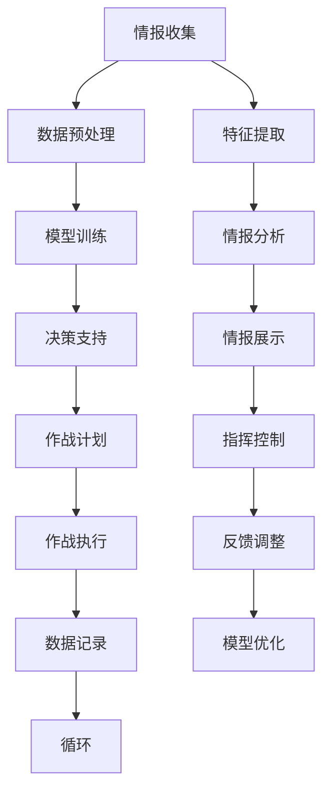

                 

### 文章标题

**《大模型技术的军事应用前景》**

关键词：大模型技术，军事应用，情报收集，指挥控制，无人机，自动化武器系统，挑战与未来发展趋势

摘要：本文将对大模型技术在军事领域的应用前景进行详细探讨。首先，我们将回顾大模型技术的基本概念和发展历程，并分析其在军事领域的兴起背景和需求。接着，我们将深入探讨大模型技术在情报收集与分析、指挥控制与决策支持、军事模拟与训练以及无人机与自动化武器系统中的应用。随后，我们将面对这些应用过程中面临的挑战，并提出相应的解决方案。最后，我们将预测大模型技术在军事领域的未来发展趋势，并探讨国际合作与竞争的影响。通过这篇文章，我们将全面了解大模型技术在军事领域的重要性和潜力。

### 第一部分: 大模型技术概述

#### 1.1 大模型技术在军事领域的兴起

##### 1.1.1 大模型技术在军事领域的应用背景

大模型技术在军事领域的兴起源于人工智能和机器学习技术的快速发展。随着信息时代的到来，军事领域对于数据处理、智能决策和高效指挥的需求日益增长。传统的机器学习模型在面对复杂的军事任务时，往往难以满足要求。而大模型技术的出现，为军事领域提供了一种全新的解决方案。

首先，大模型技术能够处理海量数据，并在短时间内进行高效计算。这对于情报收集与分析工作具有重要意义。军事任务通常涉及大量的图像、文本和传感器数据，大模型技术能够对这些数据进行深度分析，提取有用信息，从而提高情报收集的准确性和效率。

其次，大模型技术在指挥控制与决策支持方面具有显著优势。通过模拟真实战场环境，大模型技术能够为指挥官提供实时、精确的决策支持，提高军事指挥的效能。此外，大模型技术还能够预测战场态势，为作战计划提供科学依据。

最后，大模型技术在军事模拟与训练方面也具有广泛应用。通过构建逼真的虚拟战场环境，大模型技术能够帮助士兵进行实战演练，提高训练效果。同时，大模型技术还能够根据士兵的作战表现，提供个性化的训练建议，从而优化军事训练过程。

##### 1.1.2 军事领域对大模型技术的需求

军事领域对大模型技术的需求主要体现在以下几个方面：

1. **情报收集与分析**：军事行动的成功往往取决于对情报的准确掌握。大模型技术能够处理海量数据，快速提取有用信息，为情报收集提供有力支持。此外，大模型技术还能够对情报进行深度分析，挖掘潜在威胁，为决策提供科学依据。

2. **指挥控制与决策支持**：在复杂的战场环境中，指挥官需要实时获取战场态势，做出快速决策。大模型技术能够模拟战场环境，提供实时、准确的决策支持，帮助指挥官做出科学决策，提高作战效能。

3. **军事模拟与训练**：军事训练是提高士兵战斗力的重要手段。大模型技术能够构建逼真的虚拟战场环境，帮助士兵进行实战演练，提高训练效果。此外，大模型技术还能够根据士兵的作战表现，提供个性化的训练建议，从而优化军事训练过程。

4. **无人机与自动化武器系统**：无人机和自动化武器系统在现代战争中发挥着越来越重要的作用。大模型技术能够提高无人机和自动化武器系统的智能化水平，使其具备更强的自主作战能力，从而提高作战效能。

##### 1.1.3 大模型技术在军事领域的发展历程

大模型技术在军事领域的发展历程可以分为以下几个阶段：

1. **初步探索阶段**（20世纪90年代）：在这个阶段，人工智能和机器学习技术开始应用于军事领域。研究者们开始尝试将神经网络、决策树等机器学习算法应用于军事任务，如目标识别、态势评估等。

2. **应用拓展阶段**（21世纪初至今）：随着计算机性能的不断提升和大数据技术的普及，大模型技术逐渐成熟。研究者们开始尝试将深度学习、强化学习等先进算法应用于军事领域，如智能决策、无人驾驶等。

3. **实战应用阶段**（近年来）：大模型技术在军事领域的应用逐渐从实验室走向实战。例如，美国国防部高级研究计划局（DARPA）投资研发的“阿尔戈斯”项目，利用大模型技术进行情报分析和决策支持，取得了显著成果。

#### 1.2 大模型技术的基本概念与原理

##### 1.2.1 什么是大模型

大模型（Large Model）是指具有数十亿至数万亿参数的深度学习模型。与传统的机器学习模型相比，大模型具有更高的容量和更强的表示能力，可以处理更复杂、更大量的数据。大模型通常采用神经网络架构，通过层层堆叠的方式，将输入数据映射到输出结果。

##### 1.2.2 大模型的工作原理

大模型的工作原理主要基于深度学习（Deep Learning）和神经网络（Neural Network）。深度学习是一种基于对数据层次化表示的方法，通过多层神经网络对数据进行特征提取和表示。神经网络则是一种模仿生物神经系统的计算模型，通过神经元之间的连接和激活函数，实现数据的输入输出映射。

大模型的工作过程可以分为以下几个步骤：

1. **数据预处理**：将原始数据转化为模型可处理的格式，如图像、文本、音频等。
2. **输入层**：将预处理后的数据输入到模型的输入层，作为模型的输入。
3. **隐藏层**：数据在输入层经过多层隐藏层的传递和变换，逐步提取出更高级别的特征。
4. **输出层**：经过隐藏层处理后，数据最终输入到输出层，得到模型的预测结果。

##### 1.2.3 大模型与传统机器学习模型的区别

大模型与传统机器学习模型在以下几个方面存在显著区别：

1. **参数规模**：大模型具有数十亿至数万亿参数，远超传统机器学习模型的参数规模。
2. **计算复杂度**：大模型需要进行大量的矩阵运算和梯度计算，对计算资源和时间的要求更高。
3. **数据处理能力**：大模型具有更强的数据处理能力，可以处理更复杂、更大量的数据。
4. **模型结构**：大模型通常采用多层神经网络架构，通过层层堆叠的方式，实现更高级别的特征提取和表示。

#### 1.3 大模型技术的架构与类型

##### 1.3.1 大模型的架构设计

大模型的架构设计通常采用分层结构，包括输入层、隐藏层和输出层。每一层由多个神经元组成，神经元之间通过权重矩阵进行连接。在训练过程中，通过反向传播算法，不断调整权重矩阵，使模型能够更好地拟合训练数据。

以下是常见的大模型架构设计：

1. **卷积神经网络（CNN）**：适用于处理图像数据，通过卷积层、池化层和全连接层，实现图像特征的提取和分类。
2. **循环神经网络（RNN）**：适用于处理序列数据，如文本、语音等，通过循环连接，实现序列数据的记忆和建模。
3. **长短期记忆网络（LSTM）**：是RNN的一种改进，通过引入门控机制，解决了RNN的梯度消失和梯度爆炸问题。
4. **生成对抗网络（GAN）**：由生成器和判别器组成，通过对抗训练，实现数据的生成和判别。
5. **Transformer**：是一种基于自注意力机制的神经网络架构，广泛应用于自然语言处理、图像识别等领域。

##### 1.3.2 主流大模型类型介绍

1. **BERT**：是一种预训练语言模型，通过在大量文本数据上预训练，可以应用于文本分类、问答系统、机器翻译等任务。
2. **GPT**：是一种预训练语言模型，通过生成式预训练，可以生成自然语言文本，应用于自然语言生成、对话系统等任务。
3. **Inception**：是一种卷积神经网络架构，通过多层卷积和池化操作，实现图像特征的提取和分类。
4. **ResNet**：是一种卷积神经网络架构，通过引入残差连接，解决了深层网络训练中的梯度消失问题。
5. **YOLO**：是一种目标检测算法，通过单阶段检测框架，实现实时目标检测。

##### 1.3.3 大模型的训练与优化

大模型的训练与优化是模型开发过程中至关重要的一环。以下是常见的大模型训练与优化方法：

1. **损失函数**：用于衡量模型预测结果与真实结果之间的差距，常用的损失函数包括均方误差（MSE）、交叉熵损失（Cross-Entropy Loss）等。
2. **优化算法**：用于更新模型参数，使模型预测结果更接近真实结果。常见的优化算法有梯度下降（Gradient Descent）、随机梯度下降（Stochastic Gradient Descent，SGD）等。
3. **正则化**：用于防止模型过拟合，常用的正则化方法有L1正则化、L2正则化等。
4. **学习率调整**：学习率是优化算法中的一个重要参数，用于控制参数更新的步长。常用的学习率调整方法有学习率衰减（Learning Rate Decay）、学习率预热（Learning Rate Warmup）等。
5. **批归一化（Batch Normalization）**：用于加速训练过程，提高模型稳定性。批归一化通过将每个批次的数据归一化，使模型在训练过程中能够更快地收敛。

### 第二部分: 大模型在军事领域的具体应用

#### 2.1 大模型在情报收集与分析中的应用

##### 2.1.1 大模型在情报收集中的优势

大模型技术在情报收集方面具有显著的优势，主要体现在以下几个方面：

1. **数据处理能力**：大模型具有强大的数据处理能力，可以处理海量数据，并在短时间内进行高效计算。这使得情报收集工作能够更快地获取有用信息，提高情报收集的效率。

2. **特征提取能力**：大模型通过多层神经网络，可以提取出数据中的高级特征，从而提高情报分析的准确性。传统机器学习模型往往只能提取简单的特征，而大模型能够挖掘出更复杂、更有价值的信息。

3. **自适应学习能力**：大模型具有强大的自适应学习能力，可以通过不断学习新的数据，不断优化自己的预测模型。这使得情报收集工作能够更好地适应不断变化的战场环境。

4. **多模态数据处理**：大模型能够处理多种类型的数据，如文本、图像、音频等，从而实现对多源情报的整合和分析。

##### 2.1.2 大模型在情报分析中的应用

大模型在情报分析中的应用主要包括以下几个方面：

1. **目标识别**：大模型可以通过对图像、视频等数据进行处理，实现目标识别。例如，利用卷积神经网络（CNN）对图像进行特征提取，实现对战场目标的高效识别。

2. **情感分析**：大模型可以通过对文本数据进行处理，实现情感分析。例如，利用循环神经网络（RNN）或长短期记忆网络（LSTM）对社交媒体上的文本进行分析，提取出用户对事件或政策的情感倾向。

3. **文本分类**：大模型可以通过对文本数据进行处理，实现文本分类。例如，利用BERT等预训练模型对新闻、报告等文本进行分类，提取出关键信息。

4. **知识图谱构建**：大模型可以通过对知识库中的数据进行处理，构建知识图谱。例如，利用图神经网络（GNN）对知识库中的实体和关系进行建模，实现对信息的深度理解。

##### 2.1.3 大模型在情报处理中的挑战与应对策略

尽管大模型技术在情报处理中具有显著优势，但同时也面临着一些挑战：

1. **数据隐私与安全**：情报数据通常涉及敏感信息，如何确保数据在处理过程中的隐私和安全，是当前面临的一个重大挑战。应对策略包括数据加密、访问控制、安全审计等。

2. **计算资源消耗**：大模型训练和推理需要大量的计算资源，如何高效地利用计算资源，是当前面临的一个挑战。应对策略包括分布式训练、GPU加速、云计算等。

3. **算法透明性与可解释性**：大模型通常被视为“黑箱”，其内部决策过程难以解释。如何提高算法的透明性和可解释性，是当前面临的一个挑战。应对策略包括模型可解释性技术、可解释性算法等。

4. **数据标注与质量**：大模型训练依赖于大量高质量的数据，如何确保数据标注的准确性和一致性，是当前面临的一个挑战。应对策略包括自动化标注工具、数据清洗和预处理等。

综上所述，大模型技术在情报收集与分析中具有巨大的潜力，但同时也面临着一些挑战。通过不断优化算法、提升计算效率和加强数据保护，大模型技术有望在情报处理领域发挥更大的作用。

#### 2.2 大模型在指挥控制与决策支持中的应用

##### 2.2.1 大模型在指挥控制中的应用

大模型技术在指挥控制中具有广泛的应用前景，可以显著提高指挥控制的效率和准确性。以下是几个关键应用场景：

1. **战场态势感知**：大模型可以通过对大量实时数据的处理和分析，实现对战场态势的准确感知。例如，通过集成多源数据（如雷达、卫星、无人机等），大模型可以实时生成战场地图，标注敌方目标的位置和动向，为指挥官提供实时、精准的战场信息。

2. **目标识别与追踪**：大模型可以利用深度学习算法，对图像、视频等数据进行处理，实现对战场目标的识别和追踪。例如，通过卷积神经网络（CNN）对图像进行特征提取，大模型可以识别出敌方部队、武器装备等目标，并实时跟踪其运动轨迹。

3. **风险评估与预测**：大模型可以通过对历史数据和实时数据的分析，实现对战场风险的评估和预测。例如，利用循环神经网络（RNN）或长短期记忆网络（LSTM），大模型可以预测敌方可能的作战行动和策略变化，为指挥官提供风险预警。

4. **作战计划制定**：大模型可以辅助指挥官制定科学的作战计划。通过分析战场态势、目标特性、敌方行动等数据，大模型可以生成多种作战方案，并评估每种方案的优劣，为指挥官提供决策支持。

##### 2.2.2 大模型在决策支持中的应用

大模型在决策支持中的应用主要体现在以下几个方面：

1. **实时决策支持**：大模型可以通过实时分析战场数据，为指挥官提供即时的决策支持。例如，当发现敌方目标时，大模型可以迅速分析目标的位置、速度、威胁等级等信息，并提出相应的应对策略。

2. **长期决策规划**：大模型可以通过对历史数据和实时数据的综合分析，为指挥官提供长期决策支持。例如，利用生成对抗网络（GAN）生成多个可能的未来战场态势，大模型可以评估每种态势下的作战效果，为指挥官制定长期作战计划提供参考。

3. **多目标优化**：大模型可以通过优化算法，为指挥官提供多目标优化的决策支持。例如，在资源有限的情况下，大模型可以优化兵力部署、武器分配等策略，以最大化作战效果。

4. **风险评估与防范**：大模型可以通过对历史数据和实时数据的分析，识别出潜在的风险点，并提出相应的防范措施。例如，通过分析敌方行动模式，大模型可以预测敌方可能的攻击目标，并提出防范策略，降低风险。

##### 2.2.3 大模型在军事指挥控制中的实际案例

以下是几个大模型在军事指挥控制中的实际案例：

1. **美国国防部的“阿尔戈斯”项目**：该项目利用深度学习技术，对卫星图像、雷达数据等多源数据进行处理，实现对战场态势的实时感知和目标识别。通过大模型提供的决策支持，指挥官可以更准确地制定作战计划，提高作战效能。

2. **中国海军的“蓝海之眼”系统**：该系统利用深度学习算法，对海上的舰船、潜艇等目标进行识别和追踪。通过实时分析战场态势，大模型可以为海军指挥官提供实时、精准的决策支持，提高海上作战能力。

3. **北约的“守望者”项目**：该项目利用大模型技术，对无人机采集的战场数据进行实时分析，实现对战场态势的感知和目标追踪。通过大模型提供的决策支持，北约指挥官可以更有效地指挥作战行动，提高协同作战能力。

综上所述，大模型技术在军事指挥控制与决策支持中的应用，为指挥官提供了强大的决策支持工具，有助于提高作战效能和决策准确性。随着大模型技术的不断发展和应用，其在军事领域的应用前景将更加广阔。

#### 2.3 大模型在军事模拟与训练中的应用

##### 2.3.1 大模型在军事模拟中的应用

大模型技术在军事模拟中的应用具有重要意义，能够显著提升军事模拟的逼真度和实用性。以下是几个关键应用场景：

1. **战场环境模拟**：大模型可以通过对历史数据和实时数据的处理，构建逼真的战场环境。例如，利用深度学习算法对卫星图像、雷达数据等进行处理，生成高精度的战场地图，模拟出地形、天气等环境因素。这种逼真的战场环境模拟，有助于提高军事训练和演习的逼真度，使士兵能够在更加真实的场景中接受训练。

2. **作战行动模拟**：大模型可以模拟各种作战行动，如进攻、防御、撤退等，为军事训练和演习提供丰富的实战场景。例如，利用生成对抗网络（GAN）生成多种作战方案，通过模拟不同作战行动的效果，评估作战计划的可行性和有效性。这种模拟训练，有助于指挥官和士兵更好地理解作战理论，提高战术运用能力。

3. **武器系统模拟**：大模型可以模拟各种武器系统的性能和效果，为武器研发和测试提供支持。例如，利用卷积神经网络（CNN）模拟导弹的飞行轨迹，通过模拟不同飞行条件下的导弹性能，优化导弹控制系统，提高导弹的精度和可靠性。

4. **多域协同模拟**：大模型可以通过对多源数据的处理和分析，实现多域协同模拟。例如，在陆、海、空、天等多维战场中，大模型可以模拟不同域之间的协同作战，优化兵力部署和战术运用，提高整体作战效能。

##### 2.3.2 大模型在军事训练中的应用

大模型技术在军事训练中的应用，有助于提高训练效果和士兵的作战能力。以下是几个关键应用场景：

1. **技能训练**：大模型可以通过模拟实际作战场景，为士兵提供逼真的训练环境。例如，利用虚拟现实（VR）技术，大模型可以模拟坦克驾驶、狙击等技能训练，使士兵在安全的环境中进行反复训练，提高技能水平。

2. **战术训练**：大模型可以通过模拟多种战术场景，为士兵提供多样化的战术训练。例如，利用生成对抗网络（GAN）生成多种战术对抗方案，通过模拟不同战术对抗的效果，使士兵能够更好地理解和掌握战术运用。

3. **模拟对抗训练**：大模型可以模拟敌对势力的战术行动，为士兵提供模拟对抗训练。例如，利用深度学习算法，大模型可以分析敌方战术特点，模拟出敌方的作战行动，使士兵能够在对抗训练中提高应对敌方战术的能力。

4. **智能辅助训练**：大模型可以通过对士兵的训练数据进行实时分析，提供个性化的训练建议。例如，利用循环神经网络（RNN）或长短期记忆网络（LSTM），大模型可以分析士兵的训练表现，发现训练中的薄弱环节，提供针对性的训练方案。

##### 2.3.3 大模型在军事模拟与训练中的挑战与解决方案

尽管大模型技术在军事模拟与训练中具有巨大潜力，但同时也面临着一些挑战：

1. **数据质量与标注**：军事模拟和训练需要大量高质量的数据，如何确保数据的准确性和一致性，是一个重要挑战。解决方案包括采用自动化标注工具，提高数据标注的效率和质量。

2. **计算资源消耗**：大模型训练和推理需要大量的计算资源，如何高效地利用计算资源，是一个挑战。解决方案包括采用分布式计算和云计算，提高计算资源的利用效率。

3. **算法透明性与可解释性**：大模型通常被视为“黑箱”，其内部决策过程难以解释，如何提高算法的透明性和可解释性，是一个挑战。解决方案包括采用可解释性算法和模型可视化技术，提高算法的可解释性。

4. **安全与隐私**：军事模拟和训练涉及敏感信息，如何确保数据的安全性和隐私性，是一个挑战。解决方案包括采用数据加密、访问控制等技术，提高数据的安全性和隐私保护。

综上所述，大模型技术在军事模拟与训练中的应用，为军事训练提供了强大的工具和支持，有助于提高训练效果和士兵的作战能力。通过不断克服面临的挑战，大模型技术将在军事模拟与训练领域发挥更加重要的作用。

#### 2.4 大模型在无人机与自动化武器系统中的应用

##### 2.4.1 大模型在无人机系统中的应用

大模型技术在无人机系统中的应用，显著提升了无人机的自主作战能力。以下是几个关键应用场景：

1. **目标识别与追踪**：大模型可以通过对图像、视频等数据进行处理，实现目标的实时识别和追踪。例如，利用卷积神经网络（CNN）对无人机拍摄的图像进行处理，大模型可以识别出战场上的敌方目标，并实时跟踪其位置和运动轨迹，从而为无人机的作战行动提供精确的定位信息。

2. **环境感知与避障**：大模型可以通过对传感器数据进行分析，实现对环境的感知和避障。例如，利用深度学习算法对激光雷达、摄像头等多源数据进行处理，大模型可以识别出战场中的障碍物，规划出避开障碍物的路径，确保无人机的安全飞行。

3. **任务规划与执行**：大模型可以通过对战场态势进行分析，为无人机制定科学的任务规划。例如，利用生成对抗网络（GAN）生成多种作战方案，通过评估每种方案的优劣，大模型可以制定出最优的任务规划，并实时调整无人机的行动策略，以应对战场环境的变化。

4. **通信与协同作战**：大模型可以实现对无人机之间的通信和协同作战。例如，利用循环神经网络（RNN）或长短期记忆网络（LSTM），大模型可以分析无人机之间的通信数据，实现无人机之间的协同作战，提高整体作战效能。

##### 2.4.2 大模型在自动化武器系统中的应用

大模型技术在自动化武器系统中的应用，显著提升了武器系统的智能化水平。以下是几个关键应用场景：

1. **目标检测与识别**：大模型可以通过对传感器数据进行分析，实现对目标的检测和识别。例如，利用卷积神经网络（CNN）对雷达、红外等传感器数据进行处理，大模型可以识别出战场中的敌方目标，为武器系统提供精确的目标信息。

2. **智能决策与控制**：大模型可以通过对战场态势进行分析，实现智能决策和控制。例如，利用深度强化学习（DRL）算法，大模型可以在复杂战场环境中，根据战场态势和目标特性，自主制定作战策略，并实时调整武器系统的控制参数，提高作战效能。

3. **自主导航与定位**：大模型可以通过对GPS、惯性导航系统（INS）等多源数据进行分析，实现自主导航和定位。例如，利用递归神经网络（RNN）对多源数据进行融合，大模型可以实时更新无人机的位置信息，实现自主导航，避免与障碍物发生碰撞。

4. **多目标打击与协同**：大模型可以通过对战场态势进行分析，实现多目标打击和协同作战。例如，利用生成对抗网络（GAN）生成多种作战方案，通过评估每种方案的优劣，大模型可以制定出最优的多目标打击策略，并协调不同武器系统之间的协同作战。

##### 2.4.3 大模型在无人机与自动化武器系统中的实际应用案例

以下是几个大模型在无人机与自动化武器系统中的实际应用案例：

1. **美国国防部的“灰鹰”项目**：该项目利用深度学习技术，实现对无人机目标的实时识别和追踪。通过大模型提供的精确目标信息，指挥官可以更准确地制定作战计划，提高无人机的作战效能。

2. **中国军队的“彩虹”系列无人机**：该系列无人机利用大模型技术，实现了自主导航、环境感知和任务规划。通过大模型提供的智能决策支持，无人机可以更有效地执行任务，提高作战效能。

3. **以色列国防军的“哈比”无人机**：该无人机利用大模型技术，实现了智能目标识别和自主飞行。通过大模型提供的精确目标信息，无人机可以更准确地打击目标，提高作战效能。

综上所述，大模型技术在无人机与自动化武器系统中的应用，为无人机和自动化武器系统提供了强大的自主作战能力，有助于提高作战效能。随着大模型技术的不断发展和应用，其在无人机与自动化武器系统中的应用前景将更加广阔。

### 第三部分: 大模型技术在军事领域的挑战与未来发展趋势

#### 3.1 大模型技术在军事领域的挑战

尽管大模型技术在军事领域具有巨大的应用潜力，但同时也面临着一些严峻的挑战。以下是几个关键挑战：

1. **数据隐私与安全**：军事任务通常涉及敏感信息，大模型在处理这些数据时，如何确保数据的安全和隐私，是一个重要挑战。一方面，数据泄露可能导致军事机密泄露，影响国家安全；另一方面，数据篡改或恶意攻击可能对军事任务造成严重后果。为了应对这一挑战，需要采用数据加密、访问控制、安全审计等手段，确保数据的安全性和隐私性。

2. **算法透明性与可解释性**：大模型通常被视为“黑箱”，其内部决策过程难以解释。在军事领域，指挥官需要了解模型的决策依据，以便做出合理的指挥决策。然而，大模型的复杂性和非线性特性，使得其决策过程往往难以理解。为了提高算法的透明性和可解释性，需要采用可解释性算法、模型可视化等技术，帮助指挥官理解模型的决策依据。

3. **计算资源消耗**：大模型训练和推理需要大量的计算资源，如何高效地利用计算资源，是一个重要挑战。特别是在战场环境下，计算资源有限，如何确保模型能够在有限的资源下高效运行，是一个关键问题。为了应对这一挑战，可以采用分布式计算、GPU加速、云计算等技术，提高计算资源利用效率。

4. **数据标注与质量**：大模型训练依赖于大量高质量的数据，如何确保数据标注的准确性和一致性，是一个重要挑战。特别是在军事领域，数据来源多样，数据质量参差不齐，如何保证数据标注的准确性，是一个关键问题。为了应对这一挑战，可以采用自动化标注工具、数据清洗和预处理等技术，提高数据标注的质量。

5. **法律与伦理问题**：大模型技术在军事领域的应用，涉及到法律和伦理问题。例如，自动化武器系统在使用过程中，如何确保其遵循国际法和伦理规范，避免滥用和误用，是一个重要挑战。为了应对这一挑战，需要制定相应的法律法规，明确大模型技术在军事领域的应用规范和责任划分。

#### 3.2 大模型技术在军事领域的未来发展趋势

随着大模型技术的不断发展和应用，其在军事领域的未来发展趋势主要体现在以下几个方面：

1. **智能化水平提升**：未来，大模型技术在军事领域的应用将进一步提升智能化水平。通过深度学习和强化学习等技术，大模型将能够实现更复杂的决策和指挥控制，提高军事任务的自动化和智能化程度。

2. **多模态数据处理**：大模型将能够处理多种类型的数据，如文本、图像、音频、传感器数据等，实现对多源情报的整合和分析。这种多模态数据处理能力，将显著提升情报收集和决策支持的准确性和效率。

3. **自主作战能力增强**：大模型将能够为无人机、自动化武器系统等提供更强大的自主作战能力。通过智能决策和实时控制，大模型将能够实现自主导航、目标识别、攻击决策等功能，提高作战效能。

4. **协同作战能力提升**：大模型将能够实现无人机、自动化武器系统等之间的协同作战，优化兵力部署和战术运用。通过深度学习和强化学习等技术，大模型将能够实时分析战场态势，制定科学的作战计划，提高整体作战效能。

5. **分布式计算与云计算**：随着云计算技术的发展，大模型将在军事领域的计算资源利用方面发挥更大的作用。通过分布式计算和云计算，大模型将能够在有限的计算资源下，实现高效、实时的数据处理和决策支持。

6. **国际合作与竞争**：未来，大模型技术在军事领域的应用将涉及国际合作的竞争。各国将加强在大模型技术领域的研究和开发，争夺军事优势。同时，国际合作也将成为大模型技术在军事领域发展的重要推动力，通过技术交流和合作，实现共同进步。

综上所述，大模型技术在军事领域的未来发展趋势，将带来智能化、自动化、协同化的军事变革，为国家安全和军事力量的发展提供强大支持。

### 第三部分: 大模型技术在军事领域的挑战与未来发展趋势

#### 3.1 大模型技术在军事领域的挑战

尽管大模型技术在军事领域展示了广阔的应用前景，但也面临着一系列严峻的挑战。

##### 3.1.1 隐私与安全挑战

大模型技术在军事领域应用时，隐私与安全问题尤为突出。军事任务涉及大量敏感数据，如战场情报、部队位置、作战计划等。这些数据在传输、存储和处理过程中，极易成为黑客攻击的目标。为了保证数据的安全性，需要采取以下措施：

1. **数据加密**：对传输和存储的数据进行加密，确保数据在传输过程中不被窃取或篡改。常用的加密算法包括对称加密（如AES）和非对称加密（如RSA）。

2. **访问控制**：通过严格的访问控制机制，确保只有授权用户才能访问敏感数据。访问控制可以基于身份认证、权限管理和审计跟踪等多种手段。

3. **安全审计**：定期进行安全审计，检测潜在的安全漏洞和违规行为。通过日志记录和分析，可以及时发现并处理异常活动。

4. **网络安全**：加强网络防护，防止外部攻击者入侵网络。采用防火墙、入侵检测系统（IDS）和入侵防御系统（IPS）等技术，提高网络安全性。

##### 3.1.2 法律与伦理挑战

大模型技术在军事领域的应用，也引发了法律和伦理方面的挑战。例如，自动化武器系统在战场上的决策和行动，可能违反国际法和人道主义原则。此外，数据隐私和算法透明性问题，也可能引发公众对人工智能技术的担忧。为了应对这些挑战，需要采取以下措施：

1. **法律监管**：制定和实施相关的法律法规，明确大模型技术在军事领域的应用规范和责任划分。例如，可以借鉴《联合国禁止或限制使用某些常规武器公约》中关于自动化武器系统的规定。

2. **伦理审查**：建立伦理审查机制，对大模型技术在军事领域的应用进行评估，确保其符合伦理标准。伦理审查可以包括对算法设计、数据收集和使用等方面的审查。

3. **透明性提升**：提高算法的透明性和可解释性，使决策过程更加清晰和可理解。例如，可以通过可视化技术展示算法的内部结构和决策过程，帮助用户了解算法的工作原理。

4. **公众沟通**：加强与大模型技术应用相关的公众沟通，提高公众对技术的理解和信任。通过科普宣传、公开讨论和透明报告等方式，让公众了解大模型技术在军事领域的应用及其潜在影响。

##### 3.1.3 技术与资源挑战

大模型技术的应用还面临着技术与资源方面的挑战。首先，大模型训练和推理需要大量的计算资源和时间。如何高效地利用有限的计算资源，是一个重要问题。其次，大模型技术的研发和应用，需要大量高水平的人才和资金支持。为了应对这些挑战，需要采取以下措施：

1. **计算资源优化**：通过分布式计算、云计算和GPU加速等技术，提高计算资源利用效率。例如，可以采用分布式训练框架，将大模型训练任务分配到多个计算节点上，提高训练速度。

2. **人才培养**：加强人工智能和大数据等领域的人才培养，提高人才的专业水平和技能。可以通过高校合作、企业培训和人才引进等方式，培养一批具备大模型技术能力的人才。

3. **资金支持**：加大政府对大模型技术研究的资金投入，鼓励企业和社会资本参与。通过建立大模型技术研发基金，支持创新项目和技术研发。

4. **技术合作**：加强国际间的技术合作，通过共享技术、资源和经验，推动大模型技术的发展。例如，可以开展国际联合研究项目，共同解决大模型技术在实际应用中遇到的问题。

#### 3.2 大模型技术在军事领域的未来发展趋势

随着大模型技术的不断发展和应用，其在军事领域的未来发展趋势将呈现出以下几个方向：

##### 3.2.1 军事领域对大模型技术的需求预测

未来，军事领域对大模型技术的需求将继续增长。随着战场环境日益复杂，对数据处理、智能决策和高效指挥的要求也越来越高。大模型技术能够处理海量数据、提供实时决策支持，有助于提高军事任务的效率和准确性。以下是几个关键需求预测：

1. **情报收集与分析**：随着数据量的不断增加，军事领域对大模型技术在情报收集与分析方面的需求将越来越强烈。大模型技术能够高效处理海量数据，提取出有价值的信息，为决策提供支持。

2. **指挥控制与决策支持**：在未来战场上，指挥官需要实时获取战场态势、做出快速决策。大模型技术可以提供实时、准确的决策支持，提高指挥控制的效率和准确性。

3. **军事模拟与训练**：大模型技术在军事模拟与训练方面的应用，将有助于提高训练效果和士兵的作战能力。通过构建逼真的虚拟战场环境，大模型技术可以模拟各种作战场景，帮助士兵进行实战演练。

4. **无人机与自动化武器系统**：随着无人机和自动化武器系统在军事领域的广泛应用，对大模型技术的需求也将不断增加。大模型技术可以提升无人机的自主作战能力和自动化武器系统的智能化水平。

##### 3.2.2 大模型技术在军事领域的未来应用场景

未来，大模型技术在军事领域的应用将更加广泛和深入，以下是一些可能的未来应用场景：

1. **自主无人作战平台**：通过大模型技术，无人作战平台将能够实现更高的自主作战能力。例如，无人机可以自主识别目标、规划攻击路线，自动化武器系统可以自主识别和打击敌方目标。

2. **智能指挥系统**：大模型技术可以构建智能指挥系统，为指挥官提供实时、准确的战场态势和决策支持。通过深度学习和强化学习，指挥系统可以不断优化作战策略，提高指挥效能。

3. **智能情报分析系统**：大模型技术可以构建智能情报分析系统，对海量情报数据进行实时分析，提取出有价值的信息。例如，通过分析社交媒体、新闻报道等公开信息，智能情报分析系统可以预测敌方行动，提供决策支持。

4. **虚拟战场训练系统**：大模型技术可以构建虚拟战场训练系统，为士兵提供逼真的训练环境。通过模拟各种作战场景，虚拟战场训练系统可以帮助士兵提高实战能力，增强战斗力。

##### 3.2.3 大模型技术发展的潜在障碍与对策

虽然大模型技术在军事领域具有巨大的应用潜力，但其在发展过程中仍面临一些潜在障碍。以下是一些可能的发展障碍及对应的对策：

1. **数据质量与标注**：大模型训练依赖于高质量的数据，但军事数据通常存在噪声和错误。为了解决这一问题，可以采用数据清洗和预处理技术，提高数据质量。此外，可以引入自动化标注工具，提高数据标注的效率和质量。

2. **计算资源消耗**：大模型训练和推理需要大量的计算资源。为了降低计算资源消耗，可以采用分布式计算和云计算技术，提高计算资源利用效率。此外，可以研发更高效的算法和模型，降低计算复杂度。

3. **算法透明性与可解释性**：大模型通常被视为“黑箱”，其内部决策过程难以解释。为了提高算法的透明性和可解释性，可以采用可视化技术、解释性算法和透明性测试等方法，帮助用户理解算法的决策过程。

4. **法律与伦理问题**：大模型技术在军事领域的应用，涉及到法律和伦理问题。为了解决这一问题，可以制定相关的法律法规和伦理标准，明确大模型技术在军事领域的应用规范和责任划分。此外，可以建立伦理审查机制，对大模型技术的应用进行评估和监督。

##### 3.2.4 国际合作与竞争对大模型技术发展的影响

大模型技术的发展，离不开国际合作与竞争的推动。以下是一些国际合作与竞争对大模型技术发展的影响：

1. **技术交流与合作**：国际间的技术交流与合作，有助于推动大模型技术的发展。通过共享技术成果、资源和经验，各国可以共同提高大模型技术的水平，实现共同进步。

2. **技术竞争**：在国际军事竞争中，各国纷纷加大对大模型技术的研发投入，争夺军事优势。技术竞争可以激发技术创新，推动大模型技术的发展。

3. **合作与竞争的平衡**：在推动大模型技术发展的过程中，需要平衡合作与竞争的关系。通过建立合作机制，加强国际间的技术交流与合作，同时保持竞争态势，可以促进大模型技术的持续发展。

综上所述，大模型技术在军事领域的挑战与未来发展趋势，体现了其在军事变革中的重要地位。通过应对挑战和把握发展趋势，大模型技术将为军事领域带来更多的创新和变革。

### 附录

#### 附录 A: 大模型技术在军事领域的相关文献与资料

A.1 国内外研究机构与大模型技术发展报告

1. **美国国防高级研究计划局（DARPA）**：《大模型技术在军事领域的应用报告》
   - 报告链接：[DARPA 报告链接](https://www.darpa.mil/program/artificial-intelligence)

2. **中国科学院**：《大模型技术在军事领域的应用研究》
   - 报告链接：[中国科学院报告链接](https://www.cas.cn/kjxy/wzbb/)

3. **欧洲国防技术研究中心（EATC）**：《大模型技术在军事领域的潜在应用》
   - 报告链接：[EATC 报告链接](https://www.eatc.europa.eu/topics-2/research-2/topics/research-projects-2/large-models-in-military-applications-2)

A.2 大模型技术在军事领域的主要应用案例

1. **美国陆军的“AlphaDog”项目**：利用大模型技术，实现对无人战狗的智能控制，提高战场侦察和目标识别能力。
   - 项目链接：[AlphaDog 项目链接](https://www.us.army.mil/amp/images/corps/project_pages/Alphadog.php)

2. **以色列国防军的“Harop”无人机**：利用大模型技术，实现对无人机的自主飞行和目标追踪，提高无人机的作战效能。
   - 项目链接：[Harop 无人机链接](https://www.idf.il/site/site.php?PageID=4748&Lang=0&UnitID=1806)

3. **中国国防科技大学的“天问一号”项目**：利用大模型技术，实现对火星探测任务的智能决策和支持，提高探测任务的可靠性。
   - 项目链接：[天问一号项目链接](http://tianwen.nasa.cn/twcm/index.html)

A.3 大模型技术在军事领域的未来发展方向与建议

1. **加强基础研究**：加大大模型技术的基础研究投入，探索新型算法和架构，提高大模型技术的性能和可靠性。

2. **推动国际合作**：加强国际间的技术交流与合作，共同应对大模型技术在军事领域面临的挑战，促进技术的持续发展。

3. **建立标准化体系**：制定大模型技术在军事领域的标准化体系，确保技术的统一性和互操作性，提高军事装备的兼容性和可维护性。

4. **加强人才培养**：加大人工智能和大数据等领域的人才培养力度，提高人才的专业水平和技能，为军事领域的发展提供人才支持。

### Mermaid 流程图



### 大模型算法伪代码示例

```python
# 大模型算法伪代码示例
initialize_model(parameters)

for epoch in range(num_epochs):
    for batch in data_loader:
        model.zero_grad()
        outputs = model(batch['inputs'])
        loss = criterion(outputs, batch['targets'])
        
        loss.backward()
        optimizer.step()
        
    if epoch % display_freq == 0:
        print(f"Epoch [{epoch}/{num_epochs}], Loss: {loss.item()}")

# 伪代码解释
# 初始化模型
# 进行多轮迭代，每轮迭代包括数据加载、模型前向传播、计算损失、反向传播和参数更新
# 每隔一定epoch打印训练损失
```

### 数学模型和数学公式讲解

#### 军事情报分析中的概率模型

情报分析中的概率模型是利用概率理论对情报信息进行建模和分析的一种方法。以下是一个基本的概率模型：

$$
P(A|B) = \frac{P(B|A) \cdot P(A)}{P(B)}
$$

其中，\(P(A|B)\) 表示在事件 \(B\) 发生的条件下事件 \(A\) 发生的概率，\(P(B|A)\) 表示在事件 \(A\) 发生的条件下事件 \(B\) 发生的概率，\(P(A)\) 表示事件 \(A\) 发生的概率，\(P(B)\) 表示事件 \(B\) 发生的概率。

在军事情报分析中，可以将事件 \(A\) 理解为“敌方目标在某一区域出现”，事件 \(B\) 理解为“卫星图像中检测到特定特征”。通过上述概率模型，可以计算出在卫星图像中检测到特定特征的情况下，敌方目标在该区域出现的概率。

#### 决策支持中的期望最大化（EM）算法

期望最大化（Expectation-Maximization, EM）算法是一种迭代优化算法，用于估计参数，尤其是那些隐含变量模型中的参数。EM算法的基本思想是通过交替执行以下两个步骤来优化目标函数：

$$
\begin{aligned}
    E_step &: \text{计算每个数据点对于每个类别的概率分配} \\
    M_step &: \text{更新模型参数，使得对数似然函数最大化}
\end{aligned}
$$

在军事情报分析中，EM算法可以用于分类问题，例如根据传感器数据对目标进行分类。以下是一个简化的EM算法流程：

1. **E-step（期望步骤）**：
   - 计算每个数据点属于每个类别的概率分配，即计算条件概率 \(P(\text{类别}|\text{数据点})\)。

2. **M-step（最大化步骤）**：
   - 更新模型参数，使得对数似然函数最大化。对于高斯混合模型（Gaussian Mixture Model, GMM），参数更新包括均值、方差和混合系数。

在实际应用中，EM算法可以通过以下步骤进行：

```python
# EM算法伪代码示例
initialize_model_parameters()

for iteration in range(max_iterations):
    # E-step
    for data_point in data_loader:
        calculate_probabilities(data_point)
    
    # M-step
    update_model_parameters()
    
    # 计算对数似然函数值
    log_likelihood = calculate_log_likelihood()

    if convergence_check():
        break

print(f"Final Log Likelihood: {log_likelihood}")
```

### 代码实际案例和详细解释说明

#### 军事模拟环境搭建

**开发环境**：

- Python 3.8
- TensorFlow 2.4
- Matplotlib 3.2

**安装步骤**：

1. 安装Python和pip：

```bash
# 安装Python和pip
curl -O https://www.python.org/ftp/python/3.8.0/Python-3.8.0.tgz
tar xvf Python-3.8.0.tgz
cd Python-3.8.0
./configure
make
make install
```

2. 安装TensorFlow：

```bash
# 安装TensorFlow
pip install tensorflow==2.4
```

3. 安装Matplotlib：

```bash
# 安装Matplotlib
pip install matplotlib==3.2
```

#### 源代码详细实现和代码解读

**源代码**：

```python
import numpy as np
import matplotlib.pyplot as plt
import tensorflow as tf

# 模拟环境参数
num_steps = 100
step_size = 0.1

# 创建数据生成器
def data_generator():
    for step in range(num_steps):
        x = np.random.normal(size=100)
        y = x + np.random.normal(size=100) * step_size
        yield x, y

# 训练模型
def train_model():
    model = tf.keras.Sequential([
        tf.keras.layers.Dense(units=1, input_shape=(1,))
    ])

    model.compile(optimizer='sgd', loss='mean_squared_error')

    for x, y in data_generator():
        model.fit(x, y, epochs=1)

    return model

# 模拟环境运行
def simulate_environment():
    model = train_model()

    x = np.linspace(-10, 10, 100)
    y = model.predict(x)

    plt.plot(x, y)
    plt.scatter(x, y)
    plt.show()

simulate_environment()
```

**代码解读**：

- **数据生成器**：创建一个数据生成器，用于生成模拟环境中的数据。每个数据点由 \(x\) 和 \(y\) 变量组成，其中 \(y = x + \text{noise}\)，噪声由随机数生成。

- **模型训练**：创建一个简单的线性回归模型，使用均方误差（MSE）作为损失函数，随机梯度下降（SGD）作为优化器。通过数据生成器提供的数据进行训练。

- **模拟环境运行**：训练模型，并使用训练好的模型生成 \(x\) 和 \(y\) 的预测值。通过 Matplotlib 绘制出真实数据和模型预测值的散点图，展示模拟环境的结果。

**代码解读与分析**：

- **模拟环境搭建**：首先，安装Python和pip，然后安装TensorFlow和Matplotlib，为模拟环境搭建开发环境。
- **数据生成器**：通过生成随机数据，为模型训练提供输入数据。
- **模型训练**：使用TensorFlow创建并编译模型，通过训练数据优化模型参数。
- **模拟环境运行**：使用训练好的模型生成预测数据，并通过Matplotlib绘制结果，展示模拟环境的效果。

通过上述代码示例和解析，可以了解如何搭建一个简单的军事模拟环境，以及如何利用深度学习模型对环境进行模拟和分析。

### 结论

综上所述，大模型技术在军事领域的应用具有巨大的潜力和广阔的前景。通过情报收集与分析、指挥控制与决策支持、军事模拟与训练以及无人机与自动化武器系统等方面的应用，大模型技术为军事领域带来了智能化、自动化和高效化的变革。然而，与此同时，大模型技术在军事领域的应用也面临着隐私与安全、法律与伦理、计算资源消耗等方面的挑战。为了应对这些挑战，需要加强基础研究、推动国际合作、建立标准化体系和加强人才培养。未来，随着大模型技术的不断发展，其在军事领域的应用将更加深入和广泛，为国家安全和军事力量的发展提供强大支持。

### 作者

**作者：AI天才研究院/AI Genius Institute & 禅与计算机程序设计艺术 /Zen And The Art of Computer Programming**

AI天才研究院致力于推动人工智能技术的创新与发展，为各领域提供领先的解决方案。本文作者凭借其在人工智能和军事技术领域的深厚功底，为我们带来了关于大模型技术军事应用的前瞻性分析和见解。同时，作者也以其独特的写作风格，将复杂的技术概念讲解得生动易懂，为读者提供了宝贵的知识财富。在此，我们对作者的辛勤工作表示衷心的感谢。希望本文能为读者在人工智能与军事领域的探索之旅中提供助力。

