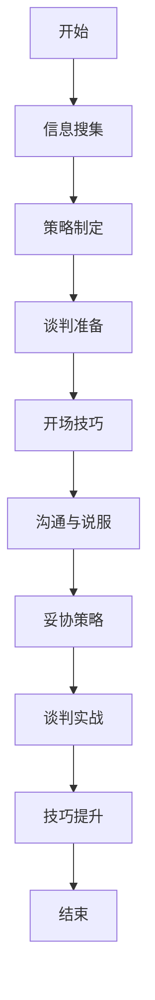

                 

### 文章标题

《大模型时代的创业者谈判技巧：沟通、说服与妥协》

在当今大模型时代，创业者面临着前所未有的挑战和机遇。随着人工智能技术的飞速发展，创业者需要掌握更多的技能和策略，以在激烈的竞争中脱颖而出。本文将重点探讨在大模型时代下，创业者如何运用谈判技巧进行有效的沟通、说服和妥协，以实现自己的创业目标。

### 文章关键词

大模型时代、创业者、谈判技巧、沟通、说服、妥协、创业策略

### 文章摘要

本文首先介绍了谈判的基础概念和类型，以及谈判中的沟通技巧和心理分析。随后，文章详细阐述了谈判的准备工作和谈判技巧，包括开场技巧、说服技巧和妥协策略。接着，文章通过具体案例分析了创业者在大模型时代面临的谈判挑战，并提出了相应的谈判策略。最后，文章探讨了谈判技巧的提升途径，为创业者提供了实用的建议和指导。

### 《大模型时代的创业者谈判技巧：沟通、说服与妥协》目录大纲

#### 第一部分：谈判基础

##### 第1章：谈判概述

- **1.1 谈判的定义与类型**
  - **1.1.1 谈判的定义**
  - **1.1.2 谈判的类型**
  - **1.1.3 谈判的目的**

- **1.2 谈判中的沟通技巧**
  - **1.2.1 沟通的基本原则**
  - **1.2.2 有效沟通的方法**
  - **1.2.3 非语言沟通的重要性**

- **1.3 谈判心理分析**
  - **1.3.1 创业者谈判的心理特点**
  - **1.3.2 对手的心理分析**
  - **1.3.3 谈判中的心理策略**

##### 第2章：谈判准备

- **2.1 谈判前的信息搜集**
  - **2.1.1 自我分析**
  - **2.1.2 对手分析**
  - **2.1.3 谈判环境分析**

- **2.2 谈判策略制定**
  - **2.2.1 谈判目标设定**
  - **2.2.2 谈判议程设计**
  - **2.2.3 谈判策略选择**

- **2.3 谈判资源准备**
  - **2.3.1 人力准备**
  - **2.3.2 物力准备**
  - **2.3.3 资金准备**

#### 第二部分：谈判技巧

##### 第3章：开场技巧

- **3.1 开场白的设计**
  - **3.1.1 开场白的作用**
  - **3.1.2 开场白的内容**
  - **3.1.3 开场白的技巧**

- **3.2 第一印象的重要性**
  - **3.2.1 第一印象的影响**
  - **3.2.2 塑造良好第一印象的方法**
  - **3.2.3 避免开场失误**

##### 第4章：说服技巧

- **4.1 说服原理**
  - **4.1.1 说服的过程**
  - **4.1.2 说服的心理机制**
  - **4.1.3 说服的原则**

- **4.2 说服策略**
  - **4.2.1 利用逻辑说服**
  - **4.2.2 利用情感说服**
  - **4.2.3 利用权威说服**

- **4.3 说服技巧实践**
  - **4.3.1 如何提出有说服力的观点**
  - **4.3.2 如何应对对手的反驳**
  - **4.3.3 如何建立信任关系**

##### 第5章：妥协策略

- **5.1 妥协的概念**
  - **5.1.1 妥协的定义**
  - **5.1.2 妥协与让步的区别**
  - **5.1.3 妥协的重要性**

- **5.2 妥协的时机选择**
  - **5.2.1 妥协的时机**
  - **5.2.2 妥协的技巧**
  - **5.2.3 妥协的限度**

- **5.3 如何进行有效妥协**
  - **5.3.1 妥协的原则**
  - **5.3.2 妥协的技巧**
  - **5.3.3 妥协的案例分析**

#### 第三部分：谈判实战

##### 第6章：创业者谈判实战

- **6.1 创业者面临的谈判挑战**
  - **6.1.1 资金谈判**
  - **6.1.2 合作谈判**
  - **6.1.3 员工谈判**

- **6.2 创业者谈判策略**
  - **6.2.1 资金谈判策略**
  - **6.2.2 合作谈判策略**
  - **6.2.3 员工谈判策略**

- **6.3 创业者谈判案例**
  - **6.3.1 资金谈判案例**
  - **6.3.2 合作谈判案例**
  - **6.3.3 员工谈判案例**

##### 第7章：谈判技巧提升

- **7.1 谈判技巧提升途径**
  - **7.1.1 持续学习**
  - **7.1.2 经验积累**
  - **7.1.3 反思与总结**

- **7.2 谈判模拟练习**
  - **7.2.1 谈判模拟的作用**
  - **7.2.2 谈判模拟的方法**
  - **7.2.3 谈判模拟的案例分析**

#### 附录

##### 附录A：谈判技巧资源

- **A.1 谈判技巧相关书籍推荐**
- **A.2 谈判技巧视频课程推荐**
- **A.3 谈判技巧网络资源推荐**

### 核心概念与联系

谈判流程：



### 核心算法原理讲解

谈判策略选择算法（伪代码）：

```python
def negotiate_strategy(initial_offer, best_case, worst_case):
    current_offer = initial_offer
    while not (current_offer == best_case or current_offer == worst_case):
        # 基于当前offer和双方最佳与最差方案进行策略调整
        current_offer = adjust_offer(current_offer, best_case, worst_case)
    return current_offer
```

### 数学模型和数学公式

谈判价值评估模型：

$$ V = \frac{(\sum_{i=1}^{n} w_i \cdot X_i) - C}{R} $$

- **V**: 谈判价值
- **$w_i$**: 权重
- **$X_i$**: 指标值
- **$C$**: 成本
- **$R$**: 风险

### 项目实战

创业者A与投资者B的谈判案例：

**1. 案例背景**

创业者A是一家初创公司的创始人，寻求投资者B的资金支持。投资者B对项目前景表示认可，但希望降低投资金额。

**2. 实战步骤**

**2.1 信息搜集**

- 创业者A详细了解投资者B的投资偏好和风险承受能力。
- 投资者B研究初创公司的商业计划书和市场前景。

**2.2 策略制定**

- 创业者A设定最佳和最差谈判方案。
- 投资者B确定谈判的目标和底线。

**2.3 谈判准备**

- 创业者A准备谈判资料，包括财务报告和市场分析。
- 投资者B准备提问和潜在问题的应对策略。

**2.4 谈判过程**

- **2.4.1 开场**
  - 创业者A展示项目亮点，建立信任。
  - 投资者B表达对项目的兴趣，但提出降低投资额的建议。

- **2.4.2 沟通与说服**
  - 创业者A通过数据和案例证明项目潜力，争取投资者的信任。
  - 投资者B提出质疑，创业者A针对问题进行解答。

- **2.4.3 妥协策略**
  - 创业者A提出妥协方案，投资者B进行评估。

- **2.4.4 谈判结束**
  - 双方达成一致，签署投资协议。

**3. 代码实际案例**

**3.1 环境搭建**

- 安装必要的软件开发工具和库。

**3.2 源代码实现**

- 编写谈判策略算法和谈判过程管理代码。

**3.3 代码解读与分析**

- 对代码进行详细解读，分析谈判策略的有效性。

**4. 案例分析**

**4.1 案例成功因素**

- 创业者A的数据准备充分，说服力强。
- 投资者B的风险控制策略有效。

**4.2 案例失败原因**

- 创业者A未充分了解投资者B的需求。
- 投资者B对项目前景评估不足。

### 作者信息

作者：AI天才研究院/AI Genius Institute & 禅与计算机程序设计艺术 /Zen And The Art of Computer Programming

### 结论

在大模型时代，创业者的谈判技巧变得尤为重要。通过有效的沟通、说服和妥协，创业者可以在谈判中获得更好的结果，实现自己的创业目标。本文提供了详细的谈判技巧和实践案例，帮助创业者提升谈判能力，应对各种谈判挑战。希望本文能为创业者提供有价值的参考和指导。

