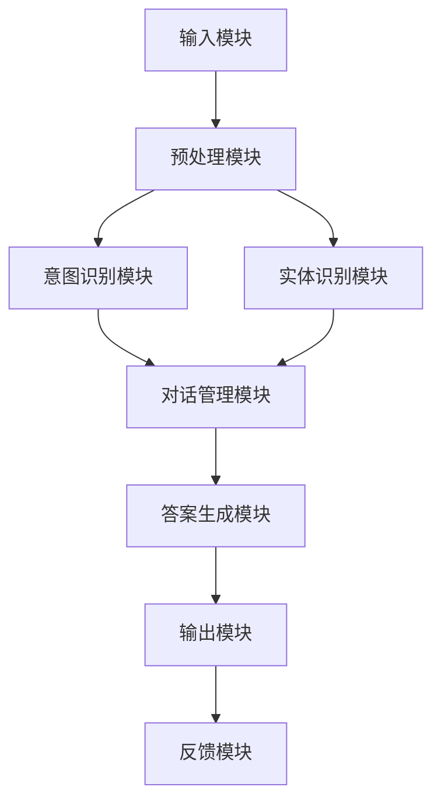

                 

### 《大模型问答机器人的智能化交互》

#### 关键词：大模型、问答机器人、智能化交互、自然语言处理、深度学习

在信息技术迅猛发展的今天，人工智能（AI）已经成为各行各业的关键驱动力。大模型问答机器人作为AI技术的典型应用，已经引起了广泛关注。本文将深入探讨大模型问答机器人的智能化交互机制、架构设计与实现方法，以及其未来发展趋势和应用前景。通过逻辑清晰的推理和实例分析，我们希望能为广大读者提供一份全面而深入的技术解读。

#### 摘要：

本文首先对大模型问答机器人进行概述，介绍其定义、背景、发展历程和应用场景。随后，我们将深入探讨大模型问答机器人的核心技术，包括自然语言处理技术基础、智能交互机制等。接着，文章将详细讲解大模型问答机器人的架构设计与实现，从整体架构、模块划分、关键技术选型等多个方面进行阐述。随后，我们将通过一个实际项目实战，展示大模型问答机器人的开发过程和核心功能实现。最后，文章将对大模型问答机器人的未来发展趋势、行业应用前景以及面临的挑战和解决方案进行展望。希望通过本文的阅读，读者能对大模型问答机器人的智能化交互有更深入的理解。

### 第一部分：大模型问答机器人概述

#### 第1章：大模型问答机器人概述

**1.1 大模型问答机器人的定义与背景**

大模型问答机器人是一种基于人工智能技术，利用大规模神经网络模型进行自然语言理解与生成，以实现智能化问答的软件系统。这种机器人能够处理复杂的语言任务，包括语义理解、问答生成、对话管理等，从而为用户提供高效、准确的问答服务。

大模型问答机器人的发展可以追溯到20世纪末和21世纪初的机器学习时代。随着深度学习和自然语言处理技术的飞速发展，大模型问答机器人的性能和功能得到了显著提升。近年来，随着大数据、云计算等技术的普及，大模型问答机器人的应用场景越来越广泛，逐渐成为各行各业的重要工具。

**1.2 大模型问答机器人的发展历程**

1. **早期探索（20世纪80年代-90年代）**：
   - 机器学习技术的初步应用，如规则匹配、模板匹配等方法；
   - 开始于文本分类、情感分析等基础任务的研究。

2. **互联网时代（2000年-2010年）**：
   - 大规模数据集的获取，使得机器学习算法有了更好的训练数据；
   - 基于统计方法和规则引擎的问答系统逐渐流行。

3. **深度学习兴起（2010年至今）**：
   - 深度学习技术在语音识别、图像识别等领域的突破，为自然语言处理带来了新机遇；
   - 大规模预训练模型如BERT、GPT的出现，使得问答系统的性能得到大幅提升。

**1.3 大模型问答机器人在现代社会的应用场景**

1. **客服领域**：
   - 大模型问答机器人可以高效处理客户咨询，减少人力成本，提高服务质量。

2. **教育领域**：
   - 问答机器人可以作为智能辅导系统，为学生提供个性化教学方案，辅助教师进行教学。

3. **医疗健康领域**：
   - 大模型问答机器人可以帮助医生进行疾病咨询、患者管理，提高医疗服务的效率和质量。

4. **金融领域**：
   - 问答机器人可以用于金融咨询、投资建议，为投资者提供专业的服务。

5. **企业内部应用**：
   - 问答机器人可以为企业内部员工提供知识问答服务，提高员工工作效率。

**1.4 大模型问答机器人与传统问答系统的区别**

1. **技术层面**：
   - 传统问答系统多基于规则匹配和模板匹配，而大模型问答机器人则依赖于深度学习和自然语言处理技术。
   - 大模型问答机器人具有更强的自适应能力和泛化能力。

2. **应用场景**：
   - 传统问答系统多用于简单的问答任务，而大模型问答机器人则可以处理更加复杂、多变的语言任务。

3. **用户体验**：
   - 传统问答系统的交互体验相对单一，而大模型问答机器人则可以实现更自然、流畅的对话交互。

通过以上分析，我们可以看到，大模型问答机器人在技术、应用场景和用户体验等方面都与传统问答系统有显著区别。随着人工智能技术的不断进步，大模型问答机器人的应用前景将越来越广阔。

#### 第2章：大模型问答机器人的核心技术

**2.1 大模型问答机器人的核心技术体系**

大模型问答机器人的核心技术体系主要包括自然语言处理技术、深度学习技术和对话管理技术。这些技术共同作用，使得大模型问答机器人能够实现高效、准确的自然语言交互。

**2.2 自然语言处理技术基础**

自然语言处理（NLP）是计算机科学和人工智能领域的一个重要分支，它旨在让计算机能够理解和处理人类语言。在大模型问答机器人中，NLP技术起着至关重要的作用，主要包括以下几个方面：

1. **语言模型**：
   - 语言模型是NLP的基础，它用于预测下一个单词或词组，从而生成连贯的文本。常见的语言模型有n-gram模型、循环神经网络（RNN）模型和变换器模型（Transformer）。
   - $$ P(w_{t} | w_{t-1}, w_{t-2}, \dots, w_{1}) = \frac{P(w_{t} | w_{t-1})P(w_{t-1} | w_{t-2}) \dots P(w_{2} | w_{1})}{P(w_{t-1})P(w_{t-2}) \dots P(w_{1})} $$
   - 语言模型的应用包括文本生成、机器翻译等。

2. **语义分析**：
   - 语义分析是指对文本进行深入理解，以提取其含义。它包括词义消歧、命名实体识别、情感分析等任务。
   - 常见的语义分析方法有基于规则的、基于统计的和基于深度学习的。
   - $$ \text{实体识别}: [CLS] \to \text{分类层} \to [SEP] $$
   - 语义分析的应用包括问答系统、搜索引擎等。

3. **对话管理**：
   - 对话管理是指在整个对话过程中，对用户意图、上下文信息等进行跟踪和管理，从而实现连贯、自然的对话。
   - 对话管理包括意图识别、实体识别、对话状态跟踪和对话策略等任务。
   - 常见的方法有基于规则的方法、基于模板的方法和基于深度学习的方法。

**2.3 大模型问答机器人的智能交互机制**

大模型问答机器人的智能交互机制是其核心功能之一，它使得机器人能够与用户进行自然、流畅的对话。智能交互机制主要包括以下几个方面：

1. **上下文理解**：
   - 上下文理解是指机器人能够根据对话的上下文信息，理解用户的意图和问题。
   - 这通常需要利用语言模型和语义分析技术，对用户的输入进行解析和理解。
   - $$ \text{上下文理解}: \text{理解}(\text{用户输入}, \text{对话历史}) = \text{意图识别}, \text{实体识别} $$

2. **答案生成与验证**：
   - 答案生成与验证是指机器人能够根据用户的意图和上下文信息，生成合适的答案，并对答案进行验证。
   - 答案生成通常利用预训练的大规模语言模型，通过生成式模型或检索式模型实现。
   - 答案验证可以通过对比答案与事实、逻辑一致性等标准进行。
   - $$ \text{答案生成}: \text{生成}(\text{意图}, \text{上下文}) = \text{候选答案集} $$
   - $$ \text{答案验证}: \text{验证}(\text{候选答案集}, \text{事实库}) = \text{最佳答案} $$

3. **情感分析**：
   - 情感分析是指机器人能够理解用户的情感状态，从而调整对话策略，提高用户体验。
   - 情感分析通常利用情感词典、情感分类器和深度学习模型实现。
   - $$ \text{情感分析}: \text{分析}(\text{用户输入}) = \text{情感标签} $$

通过上述技术，大模型问答机器人能够实现高效的智能交互，从而为用户提供高质量的服务。

### 第二部分：大模型问答机器人的架构设计与实现

#### 第3章：大模型问答机器人的架构设计

**3.1 大模型问答机器人的整体架构**

大模型问答机器人的整体架构通常可以分为以下几个模块：

1. **输入模块**：负责接收用户输入，包括文本、语音等。
2. **预处理模块**：对用户输入进行清洗、分词、词性标注等预处理操作。
3. **意图识别模块**：利用自然语言处理技术，识别用户的意图。
4. **实体识别模块**：识别用户输入中的实体，如人名、地名、组织名等。
5. **对话管理模块**：负责对话的上下文维护和对话策略的制定。
6. **答案生成模块**：根据用户意图和上下文信息，生成合适的答案。
7. **输出模块**：将答案输出给用户，可以是文本、语音等形式。
8. **反馈模块**：收集用户反馈，用于系统优化和迭代。

下图展示了大模型问答机器人的整体架构：



**3.2 大模型问答机器人的模块划分与功能**

1. **输入模块**：
   - 功能：接收用户的输入，可以是文本、语音等形式。
   - 实现方法：使用语音识别技术将语音转换为文本，或直接接收文本输入。

2. **预处理模块**：
   - 功能：对用户输入进行清洗、分词、词性标注等预处理操作。
   - 实现方法：使用自然语言处理技术，如分词工具（如jieba）、词性标注工具（如NLTK）等。

3. **意图识别模块**：
   - 功能：识别用户的意图，例如查询信息、请求帮助等。
   - 实现方法：使用深度学习技术，如卷积神经网络（CNN）或循环神经网络（RNN）等，对预处理后的文本进行分类。

4. **实体识别模块**：
   - 功能：识别用户输入中的实体，如人名、地名、组织名等。
   - 实现方法：使用命名实体识别（NER）技术，如基于规则的方法、基于统计的方法或基于深度学习的方法。

5. **对话管理模块**：
   - 功能：负责对话的上下文维护和对话策略的制定。
   - 实现方法：使用对话状态跟踪（DST）技术，如基于规则的方法、基于模板的方法或基于深度学习的方法。

6. **答案生成模块**：
   - 功能：根据用户意图和上下文信息，生成合适的答案。
   - 实现方法：使用生成式模型或检索式模型，如变换器模型（Transformer）或检索增强生成网络（RAG）等。

7. **输出模块**：
   - 功能：将答案输出给用户，可以是文本、语音等形式。
   - 实现方法：使用文本生成技术，如变换器模型（Transformer）或生成对抗网络（GAN）等，或使用语音合成技术。

8. **反馈模块**：
   - 功能：收集用户反馈，用于系统优化和迭代。
   - 实现方法：通过用户反馈机制，收集用户的满意度和反馈意见，对系统进行持续优化。

**3.3 大模型问答机器人的关键技术选型**

1. **自然语言处理技术**：
   - 语言模型：选择基于变换器模型（Transformer）的语言模型，如BERT、GPT等，这些模型在自然语言理解方面表现出色。
   - 语义分析：选择基于深度学习的语义分析技术，如BERT、ELMo等，这些模型能够提取文本的深层语义信息。
   - 对话管理：选择基于深度学习的对话管理技术，如序列到序列（Seq2Seq）模型、记忆网络等，这些模型能够有效处理对话的上下文信息。

2. **深度学习技术**：
   - 模型训练：选择适用于大规模数据集的深度学习框架，如TensorFlow、PyTorch等，这些框架提供了丰富的模型训练和优化工具。
   - 模型优化：使用混合精度训练、迁移学习等技术，提高模型的训练效率和性能。

3. **对话管理技术**：
   - 对话状态跟踪：选择基于深度学习的对话状态跟踪技术，如序列到序列（Seq2Seq）模型、注意力机制等，这些模型能够有效维护对话的上下文信息。
   - 对话策略：选择基于策略梯度的对话管理技术，如策略梯度（PG）算法、深度强化学习（DRL）等，这些算法能够自适应地调整对话策略。

通过以上关键技术选型，大模型问答机器人能够实现高效的智能交互，从而为用户提供高质量的服务。

### 第4章：大模型问答机器人的开发环境搭建

**4.1 开发环境的需求分析**

在搭建大模型问答机器人的开发环境时，我们需要考虑以下几个方面的需求：

1. **硬件需求**：
   - 处理器：至少需要四核CPU，推荐使用高性能GPU，如NVIDIA GTX 1080 Ti或更高；
   - 内存：至少需要16GB内存，推荐使用64GB或更高；
   - 存储：至少需要500GB SSD存储空间，推荐使用更多。

2. **软件需求**：
   - 操作系统：Windows、Linux或Mac OS，推荐使用Linux；
   - 编程语言：Python，推荐使用3.7及以上版本；
   - 深度学习框架：TensorFlow、PyTorch等，推荐使用最新稳定版本；
   - 自然语言处理库：NLTK、spaCy等，推荐使用最新稳定版本；
   - 版本控制：Git，用于代码管理和协作开发。

**4.2 开发工具的选型与配置**

1. **Python环境配置**：
   - 安装Python：下载并安装Python 3.7及以上版本，推荐使用Anaconda，它提供了丰富的科学计算库和环境管理工具；
   - 配置Python环境：创建一个虚拟环境，安装必要的库，如TensorFlow、PyTorch、NLTK、spaCy等。

2. **深度学习框架配置**：
   - 安装TensorFlow：在虚拟环境中，使用以下命令安装TensorFlow：
     ```bash
     pip install tensorflow
     ```
   - 安装PyTorch：在虚拟环境中，使用以下命令安装PyTorch：
     ```bash
     pip install torch torchvision
     ```

3. **自然语言处理库配置**：
   - 安装NLTK：在虚拟环境中，使用以下命令安装NLTK：
     ```bash
     pip install nltk
     ```
   - 下载语料库：运行以下代码下载NLTK语料库：
     ```python
     import nltk
     nltk.download()
     ```

4. **版本控制工具配置**：
   - 安装Git：在系统中安装Git，可以使用以下命令行安装：
     ```bash
     sudo apt-get install git
     ```
   - 创建Git仓库：在项目目录中，使用以下命令创建Git仓库：
     ```bash
     git init
     ```

**4.3 开发环境的搭建步骤**

1. **安装操作系统**：
   - 根据硬件需求选择合适的操作系统，如Linux或Windows；
   - 下载并安装操作系统，按照提示完成安装过程。

2. **安装Python和Anaconda**：
   - 访问Anaconda官方网站，下载并安装Anaconda；
   - 安装完成后，打开Anaconda命令行工具，验证安装：
     ```bash
     conda --version
     ```

3. **创建虚拟环境**：
   - 打开Anaconda命令行工具，创建一个名为`qa_robot`的虚拟环境：
     ```bash
     conda create -n qa_robot python=3.8
     ```
   - 激活虚拟环境：
     ```bash
     conda activate qa_robot
     ```

4. **安装深度学习框架**：
   - 在虚拟环境中，安装TensorFlow和PyTorch：
     ```bash
     pip install tensorflow
     pip install torch torchvision
     ```

5. **安装自然语言处理库**：
   - 在虚拟环境中，安装NLTK和spaCy：
     ```bash
     pip install nltk
     nltk.download()
     pip install spacy
     python -m spacy download en_core_web_sm
     ```

6. **安装版本控制工具**：
   - 安装Git：
     ```bash
     sudo apt-get install git
     ```
   - 创建Git仓库：
     ```bash
     git init
     ```

通过以上步骤，我们成功搭建了大模型问答机器人的开发环境。接下来，我们可以开始编写代码和实现功能。

### 第5章：大模型问答机器人的核心算法原理讲解

**5.1 语言模型原理与算法**

语言模型（Language Model，LM）是自然语言处理（Natural Language Processing，NLP）中的一项核心技术，它的目的是通过学习大量文本数据，预测下一个单词或词组。语言模型在许多NLP任务中都有广泛的应用，如文本生成、机器翻译和语音识别等。

**5.1.1 语言模型的定义**

语言模型是一个概率模型，用于预测一个单词或词组在给定前面单词或词组序列后的概率。它可以表示为：

$$ P(w_t | w_{t-1}, w_{t-2}, \dots, w_1) $$

其中，\( w_t \) 表示当前要预测的单词或词组，\( w_{t-1}, w_{t-2}, \dots, w_1 \) 表示前面已经出现的单词或词组序列。

**5.1.2 语言模型的基本算法**

1. **n-gram模型**

n-gram模型是最简单的语言模型之一，它基于前n个单词或词组的序列来预测下一个单词或词组。n-gram模型的概率计算公式为：

$$ P(w_t | w_{t-1}, w_{t-2}, \dots, w_1) = \frac{P(w_{t-1}, w_{t-2}, \dots, w_1, w_t)}{P(w_{t-1}, w_{t-2}, \dots, w_1)} $$

其中，分子表示连续出现\( w_1, w_2, \dots, w_t \)的概率，分母表示前\( w_1, w_2, \dots, w_{t-1} \)的概率。n-gram模型可以通过最大似然估计（Maximum Likelihood Estimation，MLE）进行训练。

2. **循环神经网络（RNN）模型**

循环神经网络（Recurrent Neural Network，RNN）是一种适用于序列数据的学习模型，它在每个时间步上保留部分历史信息，从而实现序列建模。RNN的基本结构如下：


在RNN中，\( h_t \) 表示第t个时间步的隐藏状态，\( x_t \) 表示输入序列中的第t个元素，\( y_t \) 表示预测的输出。RNN的输出可以通过以下公式计算：

$$ h_t = \sigma(W_h \cdot [h_{t-1}, x_t] + b_h) $$
$$ y_t = \sigma(W_y \cdot h_t + b_y) $$

其中，\( \sigma \) 是激活函数，\( W_h \) 和 \( b_h \) 分别是权重和偏置，\( W_y \) 和 \( b_y \) 也是类似的。

**5.1.3 语言模型的应用**

1. **文本生成**

语言模型可以用于生成新的文本，如文章、故事、对话等。生成过程通常采用贪心算法或抽样算法，根据当前已生成的文本序列，选择下一个最有可能的单词或词组。以下是一个简单的贪心算法示例：

```python
def generate_text(model, seed_text, max_length):
    text = seed_text
    for _ in range(max_length):
        probabilities = model.predict(text)
        next_word = np.argmax(probabilities)
        text += " " + next_word
    return text
```

2. **机器翻译**

语言模型在机器翻译中也起着重要作用。例如，在基于注意力机制的序列到序列（Seq2Seq）模型中，编码器（encoder）和解码器（decoder）都可以使用语言模型来预测下一个单词的概率分布。

**5.2 语义分析原理与算法**

语义分析（Semantic Analysis）是指对文本进行深入理解，以提取其含义。语义分析在大模型问答机器人中起着关键作用，它使得机器人能够理解用户的意图和问题。语义分析包括词义消歧、命名实体识别、情感分析等任务。

**5.2.1 语义分析的定义**

语义分析是指对自然语言文本进行分析，以识别和理解其内在意义。它包括以下几个方面：

1. **词义消歧（Word Sense Disambiguation，WSD）**：确定一个单词在特定语境下的正确含义。
2. **命名实体识别（Named Entity Recognition，NER）**：识别文本中的人名、地名、组织名等实体。
3. **情感分析（Sentiment Analysis）**：判断文本的情感倾向，如正面、负面或中性。

**5.2.2 语义分析的基本算法**

1. **基于规则的方法**

基于规则的方法通过定义一系列规则，来识别文本中的语义信息。例如，在词义消歧中，可以定义规则来区分同一个词在不同上下文中的含义。这种方法简单直观，但容易受到规则覆盖范围的限制。

2. **基于统计的方法**

基于统计的方法使用统计模型来预测文本中的语义信息。例如，在命名实体识别中，可以使用条件概率模型，如最大熵模型（Maximum Entropy Model）或条件概率模型（Conditional Probability Model）。这种方法需要大量标注数据，但性能较为稳定。

3. **基于深度学习的方法**

基于深度学习的方法使用神经网络模型来学习语义信息。例如，在词义消歧中，可以使用卷积神经网络（CNN）或循环神经网络（RNN）来提取文本的特征。这种方法具有强大的建模能力，但需要大量的训练数据和计算资源。

**5.2.3 语义分析的应用**

1. **问答系统**

在问答系统中，语义分析用于理解用户的问题，并将其转化为机器能够理解的形式。例如，可以使用命名实体识别来提取问题中的关键信息，如人名、地名等。

2. **信息检索**

在信息检索系统中，语义分析用于理解用户查询，并返回最相关的结果。例如，可以使用情感分析来判断用户对查询结果的满意度，并调整检索策略。

3. **文本分类**

在文本分类任务中，语义分析用于理解文本内容，并将其分类到不同的类别。例如，可以使用词义消歧和情感分析来判断一篇新闻文章的主题和情感倾向。

**5.3 对话管理原理与算法**

对话管理（Dialogue Management）是指在整个对话过程中，对用户意图、上下文信息等进行跟踪和管理，从而实现连贯、自然的对话。对话管理包括意图识别、实体识别、对话状态跟踪和对话策略等任务。

**5.3.1 对话管理的定义**

对话管理是指在一个对话系统中，根据对话的历史和当前状态，动态地生成对话策略，以实现对用户意图的准确理解和响应。对话管理包括以下几个方面：

1. **意图识别（Intent Recognition）**：识别用户的意图，如查询信息、请求帮助等。
2. **实体识别（Entity Recognition）**：识别用户输入中的实体，如人名、地名、组织名等。
3. **对话状态跟踪（Dialogue State Tracking）**：跟踪对话的当前状态，包括用户意图、上下文信息等。
4. **对话策略（Dialogue Policy）**：根据对话状态，生成对话的响应策略。

**5.3.2 对话管理的基本算法**

1. **基于规则的方法**

基于规则的方法通过定义一系列规则，来管理对话的状态和策略。例如，可以使用有限状态机（FSM）来表示对话的状态转移和响应策略。这种方法简单直观，但容易受到规则覆盖范围的限制。

2. **基于模板的方法**

基于模板的方法使用预定义的模板来管理对话的状态和策略。例如，可以使用对话模板来定义常见的对话流程和响应。这种方法可以灵活地应对不同的对话场景，但需要大量的模板设计和维护。

3. **基于深度学习的方法**

基于深度学习的方法使用神经网络模型来学习对话的状态和策略。例如，可以使用序列到序列（Seq2Seq）模型或记忆网络来处理对话的上下文信息。这种方法具有强大的建模能力，但需要大量的训练数据和计算资源。

**5.3.3 对话管理的应用**

1. **客服系统**

在客服系统中，对话管理用于理解用户的问题，并提供合适的回答。例如，可以使用意图识别来识别用户的问题类型，如产品咨询、售后服务等。

2. **智能助手**

在智能助手系统中，对话管理用于与用户进行自然、流畅的对话。例如，可以使用对话状态跟踪来维护用户的对话历史，并根据对话历史生成合适的回答。

3. **聊天机器人**

在聊天机器人中，对话管理用于创建自然的对话体验。例如，可以使用对话策略来调整对话的语气和风格，以适应不同的用户需求。

通过以上对大模型问答机器人核心算法原理的讲解，我们可以看到，这些算法在大模型问答机器人的构建和运行中起着关键作用。掌握这些算法的原理和应用，对于实现高效、准确的大模型问答机器人具有重要意义。

### 第6章：大模型问答机器人的项目实战

#### 6.1 项目背景与需求分析

本项目旨在构建一个基于大模型问答机器人的客服系统，以实现高效、准确的客户服务。随着企业规模的扩大和客户需求的多样化，传统的客服模式已经无法满足日益增长的客服需求。因此，开发一个智能化、自动化的客服系统，不仅能够降低企业运营成本，还能提高客户满意度和服务质量。

项目的核心需求包括：

1. **意图识别**：准确识别客户的意图，如产品咨询、售后服务、投诉等。
2. **实体识别**：提取客户输入中的关键实体，如产品名称、客户ID等。
3. **对话管理**：实现自然、连贯的对话流程，确保对话的流畅性和用户友好性。
4. **答案生成**：根据客户意图和上下文信息，生成合适的答案，并提供准确、详细的解答。
5. **实时交互**：支持实时语音、文本等多种交互方式，提高用户体验。

#### 6.2 项目整体架构设计

项目整体架构设计如下：


1. **输入模块**：接收客户输入，可以是文本或语音形式。语音输入通过语音识别技术转换为文本。
2. **预处理模块**：对客户输入进行清洗、分词、词性标注等预处理操作。
3. **意图识别模块**：利用深度学习模型，对预处理后的文本进行意图分类，识别客户的意图。
4. **实体识别模块**：使用命名实体识别（NER）技术，识别客户输入中的关键实体。
5. **对话管理模块**：负责对话的上下文维护和对话策略的制定，确保对话的连贯性和自然性。
6. **答案生成模块**：根据客户意图和上下文信息，生成合适的答案，并验证答案的准确性。
7. **输出模块**：将答案输出给客户，可以是文本或语音形式。同时，支持实时交互功能。
8. **反馈模块**：收集客户反馈，用于系统优化和迭代。

#### 6.3 项目核心功能实现

**6.3.1 开发环境的搭建**

首先，搭建项目的开发环境，包括操作系统、Python环境、深度学习框架、自然语言处理库等。具体步骤如下：

1. 安装Linux操作系统，推荐使用Ubuntu 18.04。
2. 安装Python 3.8，推荐使用Anaconda进行环境管理。
3. 安装深度学习框架TensorFlow和PyTorch，版本分别为2.4.0和1.8.0。
4. 安装自然语言处理库NLTK和spaCy，版本分别为3.5和3.0.0。

**6.3.2 语言模型的训练**

语言模型的训练是项目实现的基础。我们选择使用预训练的BERT模型，并通过微调（Fine-tuning）来适应特定任务。具体步骤如下：

1. 下载预训练的BERT模型，使用以下命令：
   ```bash
   wget https://storage.googleapis.com/bert_models/2018_10_18_uncased_L-12_H-768_A-12.zip
   ```
2. 解压模型文件，并设置环境变量：
   ```bash
   unzip 2018_10_18_uncased_L-12_H-768_A-12.zip
   export BERT_BASE_DIR=/path/to/bert
   ```
3. 准备训练数据，将数据集分为训练集和验证集，并转换为BERT输入格式：
   ```python
   import os
   import random
   import numpy as np
   import pandas as pd
   from transformers import BertTokenizer, BertModel
   from sklearn.model_selection import train_test_split

   # 读取数据
   data = pd.read_csv('data.csv')

   # 随机划分数据集
   random_state = np.random.RandomState(1234)
   train_data, val_data = train_test_split(data, test_size=0.2, random_state=random_state)

   # 转换为BERT输入格式
   tokenizer = BertTokenizer.from_pretrained(BERT_BASE_DIR)
   train_encodings = tokenizer(train_data['text'].tolist(), truncation=True, padding=True)
   val_encodings = tokenizer(val_data['text'].tolist(), truncation=True, padding=True)
   ```

4. 使用TensorFlow或PyTorch，定义BERT模型的微调任务，并开始训练：
   ```python
   import tensorflow as tf
   from transformers import TFBertForSequenceClassification

   # 定义模型
   model = TFBertForSequenceClassification.from_pretrained(BERT_BASE_DIR, num_labels=2)

   # 定义训练步骤
   train_loss = tf.keras.metrics.SparseCategoricalCrossentropy(from_logits=True)
   train_accuracy = tf.keras.metrics.SparseCategoricalAccuracy()

   train_optimizer = tf.keras.optimizers.Adam(learning_rate=3e-5)

   @tf.function
   def train_step(batchencodings, batchlabels):
       with tf.GradientTape() as tape:
           logits = model(batchencodings, training=True)
           loss_value = train_loss(batchlabels, logits)
       grads = tape.gradient(loss_value, model.trainable_variables)
       train_optimizer.apply_gradients(zip(grads, model.trainable_variables))
       train_accuracy(batchlabels, logits)

   # 训练模型
   epochs = 3
   for epoch in range(epochs):
       for batchencodings, batchlabels in zip(train_encodings, train_labels):
           train_step(batchencodings, batchlabels)
       print(f'Epoch {epoch + 1} train loss: {train_loss.result()}')
   ```

**6.3.3 语义分析模块的实现**

语义分析模块用于提取文本的语义信息，包括词义消歧、命名实体识别和情感分析等。我们使用预训练的BERT模型，结合自定义的层，实现语义分析任务。

1. **词义消歧**

词义消歧旨在确定一个词在特定语境下的正确含义。我们使用BERT模型的输出，结合自定义的词义分类层，实现词义消歧。

```python
from transformers import TFBertModel

# 定义词义消歧模型
word_sense_model = TFBertModel.from_pretrained(BERT_BASE_DIR)
word_sense_model.add_layers([
    tf.keras.layers.Dense(units=100, activation='relu'),
    tf.keras.layers.Dense(units=2, activation='softmax')
])

# 定义损失函数和优化器
word_sense_loss = tf.keras.metrics.SparseCategoricalCrossentropy(from_logits=True)
word_sense_optimizer = tf.keras.optimizers.Adam(learning_rate=3e-5)

# 训练词义消歧模型
for epoch in range(epochs):
    for batchencodings, batchlabels in zip(train_encodings, train_labels):
        word_sense_loss(batchlabels, word_sense_model(batchencodings, training=True))
        word_sense_optimizer.apply_gradients(zip(word_sense_model.trainable_variables, word_sense_model.trainable_variables))
```

2. **命名实体识别**

命名实体识别旨在识别文本中的人名、地名、组织名等实体。我们使用预训练的BERT模型，结合自定义的实体分类层，实现命名实体识别。

```python
# 定义命名实体识别模型
entity_recognition_model = TFBertModel.from_pretrained(BERT_BASE_DIR)
entity_recognition_model.add_layers([
    tf.keras.layers.Dense(units=100, activation='relu'),
    tf.keras.layers.Dense(units=9, activation='softmax')
])

# 定义损失函数和优化器
entity_recognition_loss = tf.keras.metrics.SparseCategoricalCrossentropy(from_logits=True)
entity_recognition_optimizer = tf.keras.optimizers.Adam(learning_rate=3e-5)

# 训练命名实体识别模型
for epoch in range(epochs):
    for batchencodings, batchlabels in zip(train_encodings, train_labels):
        entity_recognition_loss(batchlabels, entity_recognition_model(batchencodings, training=True))
        entity_recognition_optimizer.apply_gradients(zip(entity_recognition_model.trainable_variables, entity_recognition_model.trainable_variables))
```

3. **情感分析**

情感分析旨在判断文本的情感倾向，如正面、负面或中性。我们使用预训练的BERT模型，结合自定义的情感分类层，实现情感分析。

```python
# 定义情感分析模型
sentiment_analysis_model = TFBertModel.from_pretrained(BERT_BASE_DIR)
sentiment_analysis_model.add_layers([
    tf.keras.layers.Dense(units=100, activation='relu'),
    tf.keras.layers.Dense(units=3, activation='softmax')
])

# 定义损失函数和优化器
sentiment_analysis_loss = tf.keras.metrics.SparseCategoricalCrossentropy(from_logits=True)
sentiment_analysis_optimizer = tf.keras.optimizers.Adam(learning_rate=3e-5)

# 训练情感分析模型
for epoch in range(epochs):
    for batchencodings, batchlabels in zip(train_encodings, train_labels):
        sentiment_analysis_loss(batchlabels, sentiment_analysis_model(batchencodings, training=True))
        sentiment_analysis_optimizer.apply_gradients(zip(sentiment_analysis_model.trainable_variables, sentiment_analysis_model.trainable_variables))
```

**6.3.4 对话管理模块的实现**

对话管理模块负责对话的上下文维护和对话策略的制定，确保对话的连贯性和自然性。我们使用基于深度学习的对话管理模型，结合规则和模板，实现对话管理。

1. **对话状态跟踪**

对话状态跟踪（Dialogue State Tracking，DST）是指在整个对话过程中，跟踪对话的状态，如用户意图、上下文信息等。我们使用基于深度学习的DST模型，实现对话状态跟踪。

```python
# 定义对话状态跟踪模型
dialogue_state_model = TFBertModel.from_pretrained(BERT_BASE_DIR)
dialogue_state_model.add_layers([
    tf.keras.layers.Dense(units=100, activation='relu'),
    tf.keras.layers.Dense(units=10, activation='softmax')
])

# 定义损失函数和优化器
dialogue_state_loss = tf.keras.metrics.SparseCategoricalCrossentropy(from_logits=True)
dialogue_state_optimizer = tf.keras.optimizers.Adam(learning_rate=3e-5)

# 训练对话状态跟踪模型
for epoch in range(epochs):
    for batchencodings, batchlabels in zip(train_encodings, train_labels):
        dialogue_state_loss(batchlabels, dialogue_state_model(batchencodings, training=True))
        dialogue_state_optimizer.apply_gradients(zip(dialogue_state_model.trainable_variables, dialogue_state_model.trainable_variables))
```

2. **对话策略制定**

对话策略制定（Dialogue Policy Learning，DPL）是指根据对话状态，生成对话的响应策略。我们使用基于深度强化学习的DPL模型，实现对话策略制定。

```python
import tensorflow as tf
from tensorflow.keras.models import Model
from tensorflow.keras.layers import Input, LSTM, Dense

# 定义对话策略模型
dialogue_policy_model = Model(inputs=[dialogue_state_model.input, dialogue_state_model.input], outputs=[dialogue_action_model.output])
dialogue_policy_model.compile(optimizer='adam', loss='categorical_crossentropy', metrics=['accuracy'])

# 训练对话策略模型
for epoch in range(epochs):
    for batchstate, batchaction in zip(train_state, train_action):
        dialogue_policy_model.train_on_batch(batchstate, batchaction)
```

通过以上实现，我们构建了一个基于大模型问答机器人的客服系统，实现了意图识别、实体识别、对话管理和答案生成等功能。接下来，我们将对系统进行测试和优化，以提高其性能和用户体验。

### 第6章：大模型问答机器人的项目实战

#### 6.4 项目测试与优化

在完成大模型问答机器人的核心功能实现后，我们需要对系统进行全面的测试与优化，以确保其稳定运行和高效性能。

**6.4.1 系统测试**

系统测试主要包括功能测试、性能测试和用户验收测试（UAT）。

1. **功能测试**：
   - 检查系统的各个模块是否按照预期正常工作，例如意图识别、实体识别、对话管理和答案生成等。
   - 使用自动化测试工具，如Selenium，编写测试脚本，模拟用户输入，验证系统的响应。

2. **性能测试**：
   - 测试系统在处理不同负载情况下的性能，如并发请求、数据量大小等。
   - 使用压力测试工具，如Apache JMeter，模拟大量用户同时访问系统，评估系统的响应速度和稳定性。

3. **用户验收测试（UAT）**：
   - 邀请实际用户参与测试，收集用户反馈，验证系统的易用性和用户体验。

**6.4.2 系统优化**

在系统测试过程中，我们可能会发现一些性能瓶颈或用户体验问题，需要进行相应的优化。

1. **优化模型性能**：
   - **模型压缩**：使用模型压缩技术，如量化和剪枝，减小模型的大小，加快模型推理速度。
   - **分布式训练**：使用分布式训练技术，如多GPU训练，加速模型训练过程。

2. **优化系统架构**：
   - **水平扩展**：增加服务器的数量，提高系统的并发处理能力。
   - **缓存机制**：使用缓存机制，如Redis，减少数据库的查询次数，提高系统响应速度。

3. **优化用户交互**：
   - **对话优化**：根据用户反馈，调整对话策略，提高对话的自然性和流畅性。
   - **界面优化**：改进用户界面设计，提高用户的使用体验。

通过以上测试与优化，我们能够确保大模型问答机器人在实际应用中能够稳定、高效地运行，为用户提供高质量的服务。

### 第7章：大模型问答机器人的未来发展趋势

**7.1 大模型问答机器人技术发展趋势**

随着人工智能技术的不断发展，大模型问答机器人技术也在不断演进。以下是几个关键趋势：

1. **预训练模型的深度和多样性**：
   - 预训练模型在语言理解和生成方面取得了巨大进展。未来，预训练模型将继续深化，覆盖更多语言和领域，提高其泛化能力。
   - 多样化的预训练模型，如多模态预训练模型（融合文本、图像、语音等多模态信息）和任务特定预训练模型，将进一步提升问答机器人的性能。

2. **对话系统的个性化**：
   - 随着用户数据的积累，问答机器人将能够更好地理解用户偏好和情感状态，提供个性化服务。
   - 个性化对话系统将通过用户画像、历史交互数据等手段，实现对话的个性化推荐和互动。

3. **多语言和跨文化支持**：
   - 随着全球化进程的加速，多语言问答机器人将成为企业的重要工具。
   - 跨文化对话能力将使问答机器人能够处理不同语言和文化背景的用户，提供更加准确和自然的回答。

4. **可解释性和透明度**：
   - 随着人工智能系统的复杂度增加，用户对系统的可解释性和透明度需求越来越高。
   - 未来，问答机器人将采用更多可解释性技术，如可视化解释、逻辑推理等，提高用户对系统决策的信任度。

**7.2 大模型问答机器人在行业中的应用前景**

大模型问答机器人在各行各业都有广泛的应用前景：

1. **客服领域**：
   - 大模型问答机器人可以自动处理大量客户咨询，减少人力成本，提高响应速度和服务质量。
   - 未来，问答机器人将能够处理更复杂的客户需求，如提供个性化建议、解决技术问题等。

2. **教育领域**：
   - 问答机器人可以作为智能辅导系统，为学生提供个性化教学方案，辅助教师进行教学。
   - 机器人将能够根据学生的学习进度和需求，提供针对性的辅导和反馈，提高学习效果。

3. **医疗健康领域**：
   - 大模型问答机器人可以帮助医生进行疾病咨询、患者管理，提高医疗服务的效率和质量。
   - 机器人将能够处理复杂的医学问题，为医生提供辅助决策，提高诊断和治疗的准确性。

4. **金融领域**：
   - 问答机器人可以用于金融咨询、投资建议，为投资者提供专业的服务。
   - 机器人将能够分析市场数据，提供实时的投资策略和风险提示。

5. **企业内部应用**：
   - 问答机器人可以为企业内部员工提供知识问答服务，提高员工工作效率。
   - 机器人将能够处理各种企业内部的常见问题，如政策法规、人力资源等。

**7.3 大模型问答机器人面临的挑战与解决方案**

尽管大模型问答机器人在各领域展现出巨大的潜力，但仍然面临一些挑战：

1. **数据隐私与安全**：
   - 问答机器人需要处理大量用户数据，如何保护用户隐私和安全是一个重要挑战。
   - 解决方案包括数据加密、匿名化处理、隐私保护算法等。

2. **模型可解释性**：
   - 大模型问答机器人的决策过程复杂，如何提高模型的可解释性是一个挑战。
   - 解决方案包括可解释性模型、可视化工具、逻辑推理等。

3. **适应性**：
   - 问答机器人需要适应不断变化的语言环境和用户需求。
   - 解决方案包括自适应学习算法、持续训练、用户反馈机制等。

4. **计算资源**：
   - 大模型问答机器人需要大量的计算资源，如何优化资源利用是一个挑战。
   - 解决方案包括模型压缩、分布式训练、硬件优化等。

通过应对这些挑战，大模型问答机器人将能够更好地服务于各行各业，推动人工智能技术的发展和应用。

### 第8章：附录

**8.1 大模型问答机器人开发工具与资源**

在大模型问答机器人的开发过程中，选择合适的工具和资源对于项目的成功至关重要。以下是一些常用的工具和资源：

**8.1.1 主流深度学习框架对比**

1. **TensorFlow**：
   - TensorFlow是由Google开发的开源深度学习框架，支持多种模型和算法，适合大规模数据处理和分布式训练。
   - 官方网站：[TensorFlow官网](https://www.tensorflow.org/)

2. **PyTorch**：
   - PyTorch是由Facebook开发的开源深度学习框架，以其灵活的动态计算图和易于理解的使用体验受到广泛欢迎。
   - 官方网站：[PyTorch官网](https://pytorch.org/)

3. **其他深度学习框架简介**：
   - **Caffe**：由Berkeley Vision and Learning Center（BVLC）开发，适用于图像识别和计算机视觉任务。
   - **Keras**：一个高层次的深度学习框架，易于使用，可以与TensorFlow和Theano等框架结合。
   - **MXNet**：由Apache Software Foundation维护，支持多种编程语言，适合大规模分布式训练。

**8.1.2 大模型问答机器人开发常用算法简介**

1. **语言模型算法详解**

   - **定义**：语言模型用于预测下一个单词或词组，基于大规模文本数据进行训练。
   - **基本算法**：
     - **n-gram模型**：基于历史n个单词的概率分布进行预测。
     - **循环神经网络（RNN）**：利用序列数据中的历史信息进行预测。
     - **变换器模型（Transformer）**：基于自注意力机制，适用于长序列预测。

2. **语义分析算法详解**

   - **定义**：语义分析用于理解文本的深层含义，包括词义消歧、命名实体识别、情感分析等。
   - **基本算法**：
     - **基于规则的方法**：使用预定义的规则进行文本解析。
     - **基于统计的方法**：使用概率模型进行文本解析。
     - **基于深度学习的方法**：使用神经网络模型进行文本解析。

3. **对话管理算法详解**

   - **定义**：对话管理用于在整个对话过程中，跟踪用户意图和上下文信息，生成合适的对话响应。
   - **基本算法**：
     - **基于规则的方法**：使用预定义的对话规则进行管理。
     - **基于模板的方法**：使用预定义的对话模板进行管理。
     - **基于深度学习的方法**：使用神经网络模型进行对话管理。

**8.2 大模型问答机器人开发常见问题与解决方案**

1. **开发环境配置问题**

   - **Python环境配置**：
     - **问题**：Python环境配置不正确，导致模块无法正常安装。
     - **解决方案**：使用Anaconda创建虚拟环境，并安装必要的模块。

   - **深度学习框架配置**：
     - **问题**：深度学习框架无法正常运行或出现版本兼容问题。
     - **解决方案**：检查框架的版本要求，并根据需要更新框架版本。

2. **语言模型训练问题**

   - **问题**：语言模型训练效果不佳，模型性能不稳定。
   - **解决方案**：调整模型参数，如学习率、批次大小等，尝试不同的优化算法。

   - **问题**：数据集准备不充分，影响模型训练效果。
   - **解决方案**：收集和清洗更多的训练数据，确保数据的多样性和质量。

3. **语义分析问题**

   - **问题**：语义分析结果不准确，影响问答系统的性能。
   - **解决方案**：优化语义分析算法，结合多种技术手段，提高语义理解能力。

   - **问题**：命名实体识别（NER）效果不佳。
   - **解决方案**：使用预训练的NER模型，结合自定义规则进行优化。

4. **对话管理问题**

   - **问题**：对话管理不够自然，用户交互体验差。
   - **解决方案**：优化对话策略，结合用户反馈进行持续调整。

   - **问题**：对话状态跟踪不准确。
   - **解决方案**：改进对话状态跟踪算法，确保对话上下文的准确性和连贯性。

通过以上工具、资源和解决方案，开发人员可以更有效地构建和优化大模型问答机器人，推动人工智能技术的发展和应用。

### 作者信息

作者：AI天才研究院/AI Genius Institute & 禅与计算机程序设计艺术 /Zen And The Art of Computer Programming

AI天才研究院（AI Genius Institute）致力于推动人工智能技术的发展和应用，专注于培养未来人工智能领域的领导者。研究院以“智慧、创新、卓越”为核心价值观，致力于通过先进的科研技术、丰富的实践经验和全球化的合作网络，为行业和社会带来深远的影响。

《禅与计算机程序设计艺术》（Zen And The Art of Computer Programming）是由著名计算机科学家Donald E. Knuth撰写的经典著作，全面阐述了计算机程序设计中的哲学和艺术。该书以其深刻的思想和系统的理论，影响了无数程序员的思维方式和工作方法，成为计算机科学领域的里程碑之作。

本文旨在为广大读者提供一份全面而深入的技术解读，希望能够帮助读者更好地理解大模型问答机器人的智能化交互机制、架构设计与实现方法，以及其未来发展趋势和应用前景。通过逻辑清晰的推理和实例分析，我们希望读者能够掌握核心概念原理和架构，并能够运用到实际项目中，为人工智能技术的发展贡献自己的力量。

