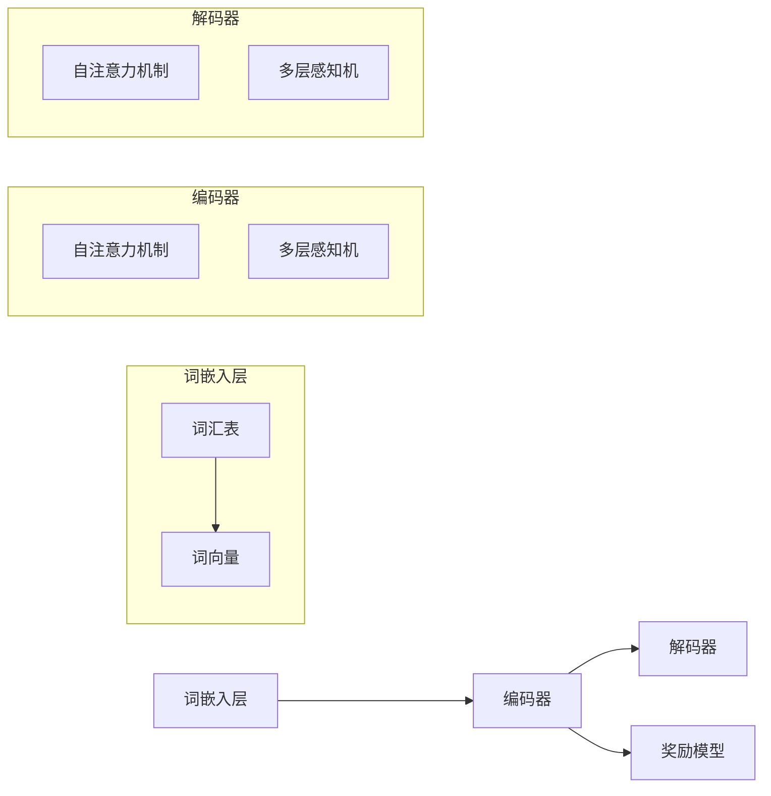

                 

### 引言与背景

大语言模型作为一种前沿的人工智能技术，近年来在全球范围内取得了飞速的发展。从基础的词向量模型（如Word2Vec、GloVe）到先进的神经网络模型（如RNN、LSTM），再到最近的Transformer架构和其衍生出的BERT、GPT等大型预训练模型，大语言模型的技术迭代不断推动着自然语言处理（NLP）领域的边界不断扩展。

#### 1.1 大语言模型的发展历程

1. **基础模型时代**：
   - **词向量模型**：Word2Vec和GloVe是最早的大规模语言模型，它们将词语映射到高维向量空间，通过共现关系学习词义。
   - **循环神经网络**（RNN）：RNN能够处理序列数据，尤其是长文本，使得模型在机器翻译、语音识别等领域取得了显著的成果。

2. **神经网络模型时代**：
   - **长短期记忆网络**（LSTM）：LSTM通过引入门控机制解决了RNN的梯度消失问题，使模型能够更好地学习长期依赖关系。
   - **Transformer架构**：Transformer模型引入了自注意力机制，使得模型在并行计算和长距离依赖关系处理方面表现优异。

3. **大型模型时代**：
   - **BERT**：BERT通过双向编码表示器（Bi-directional Encoder Representations from Transformers）引入了上下文信息，使得预训练模型在多项NLP任务中达到了当时的最优水平。
   - **GPT**：OpenAI推出的GPT系列模型通过生成预训练（Generative Pre-trained Transformer），在自然语言生成任务上展现了强大的能力。

#### 1.2 大语言模型的应用领域

大语言模型的应用领域广泛，涵盖了文本生成、机器翻译、问答系统、情感分析等各个方面：

1. **文本生成**：大语言模型能够生成流畅的文本，广泛应用于聊天机器人、文章写作助手等场景。
2. **机器翻译**：利用大语言模型，可以实现高精度的机器翻译，如谷歌翻译、百度翻译等。
3. **问答系统**：通过大语言模型，可以构建智能问答系统，如OpenAI的GPT-3，能够理解用户的问题并生成详细的回答。
4. **情感分析**：大语言模型在处理情感分析任务时，能够准确识别文本中的情感倾向，应用于市场调研、社交媒体监控等领域。

### 奖励模型的概念与重要性

奖励模型（Reward Model）是大语言模型中的一个关键组件，它主要用于指导模型的训练过程，提高模型在特定任务上的表现。奖励模型的核心思想是通过设计一种奖励机制，使得模型能够在训练过程中不断优化自身的行为，从而更好地适应各种复杂的任务需求。

#### 1.2.1 奖励模型的定义

奖励模型是一种评估模型输出质量的机制，通过对模型的输出结果进行打分或评分，提供奖励信号，从而引导模型朝着更好的方向学习。

#### 1.2.2 奖励模型的应用场景

1. **文本生成**：在文本生成任务中，奖励模型可以用来评估生成的文本是否连贯、是否有意义，从而引导模型生成更高质量的文本。
2. **机器翻译**：在机器翻译任务中，奖励模型可以用来评估翻译结果的准确性，引导模型产生更精确的翻译。
3. **问答系统**：在问答系统中，奖励模型可以用来评估回答的质量，引导模型生成更符合用户需求的回答。
4. **多模态任务**：在图像-文本匹配、视频-文本生成等多模态任务中，奖励模型可以帮助模型更好地整合不同模态的信息，生成更具表现力的内容。

总的来说，奖励模型在大语言模型中的应用至关重要，它不仅能够提升模型的性能，还能为模型提供更加明确的学习目标，使得模型在训练过程中更加高效和精准。

### 核心概念与联系

#### 2.1 大语言模型的基本架构

大语言模型的基本架构通常包括三个主要部分：词嵌入层、编码器和解码器。以下是一个详细的 Mermaid 流程图，用于展示大语言模型的基本组成部分。



**图 2.1 大语言模型的基本架构**

1. **词嵌入层**：将输入的词语映射为高维向量，用于初始化编码器的输入。
2. **编码器**：通过自注意力机制和多层感知机（MLP）对输入序列进行处理，提取序列中的关键信息。
3. **解码器**：同样通过自注意力机制和多层感知机对编码器输出的序列进行解码，生成输出序列。
4. **奖励模型**：对解码器生成的输出序列进行评估，提供奖励信号，用于指导模型的训练过程。

#### 2.2 奖励模型的原理与实现

奖励模型的核心在于如何设计一个有效的评估机制，对模型的输出进行打分或评分。以下是奖励模型的基本原理和实现步骤：

1. **定义奖励函数**：首先需要定义一个奖励函数，用于评估模型输出的质量。奖励函数可以是基于语言模型的自回归损失，也可以是针对特定任务的评价指标，如BLEU（双语评估单元）或ROUGE（记分模型）。
2. **计算奖励信号**：在训练过程中，对解码器生成的每个输出序列，使用奖励函数计算得到奖励信号。奖励信号通常是一个实数值，表示输出的质量。
3. **更新模型权重**：通过反向传播算法，将奖励信号作为目标值，更新模型的权重。这可以通过优化算法（如梯度下降）实现，使得模型在训练过程中不断优化自身的行为。

奖励模型的工作流程可以简化为以下几个步骤：

1. 输入序列进入编码器，编码器通过自注意力机制提取关键信息。
2. 编码器的输出序列作为解码器的输入，解码器通过自注意力机制生成输出序列。
3. 使用奖励函数计算输出序列的奖励信号。
4. 通过反向传播算法，利用奖励信号更新模型权重。

奖励模型与语言模型的关系密切。传统语言模型主要通过自回归损失函数进行训练，而奖励模型则通过提供额外的奖励信号，引导模型在特定任务上取得更好的表现。两者结合，可以形成一个更加高效和精确的训练框架，使得模型在多个任务中表现出色。

### 核心算法原理讲解

#### 3.1 奖励模型的训练算法

奖励模型的核心在于如何通过训练算法优化模型的表现。以下是奖励模型训练的基本算法原理和实现步骤：

1. **定义损失函数**：奖励模型通常使用损失函数来评估模型输出的质量。常见的损失函数包括自回归损失函数（如交叉熵损失）和基于奖励的损失函数。
   
2. **计算梯度**：利用反向传播算法计算模型参数的梯度。对于自回归损失函数，梯度计算相对简单；而对于基于奖励的损失函数，梯度计算可能更加复杂。

3. **更新模型参数**：通过梯度下降或其他优化算法更新模型参数，使得模型在训练过程中不断优化自身的行为。

以下是奖励模型训练的伪代码：

```python
# 假设模型参数为θ，奖励函数为reward_function，损失函数为loss_function

for epoch in range(num_epochs):
    for batch in data_loader:
        # 前向传播
        outputs = model(inputs)
        rewards = reward_function(outputs)
        loss = loss_function(outputs, rewards)
        
        # 反向传播
        gradients = compute_gradients(model.parameters(), loss)
        
        # 更新模型参数
        update_parameters(model.parameters(), gradients, learning_rate)
        
    print(f"Epoch {epoch}: Loss = {loss}")
```

伪代码中，`model`表示大语言模型，`data_loader`用于加载训练数据，`reward_function`和`loss_function`分别表示奖励函数和损失函数，`compute_gradients`和`update_parameters`分别用于计算梯度并更新模型参数。

#### 3.2 奖励模型的优化技巧

为了提高奖励模型的训练效果，可以采用以下优化技巧：

1. **优化器的选择**：选择合适的优化器，如Adam、AdamW等，可以显著提升训练速度和模型性能。
   
2. **学习率调整策略**：学习率的调整对于训练效果至关重要。可以采用学习率衰减策略，如指数衰减、余弦退火等，逐步降低学习率，避免模型过拟合。

3. **模型正则化技术**：正则化技术，如Dropout、权重正则化等，可以防止模型过拟合，提高模型泛化能力。

以下是优化技巧的具体实现步骤：

1. **选择优化器**：在训练过程中，选择一个合适的优化器，如`torch.optim.Adam`，初始化模型参数。

2. **设置学习率**：初始化学习率为一个较大的值，例如0.001，然后采用学习率衰减策略逐步降低学习率。

3. **应用正则化技术**：在模型训练过程中，可以添加Dropout层或权重正则化，以提高模型的泛化能力。

以下是优化技巧的实现伪代码：

```python
# 初始化模型参数
optimizer = torch.optim.Adam(model.parameters(), lr=0.001)

# 设置学习率衰减策略
scheduler = torch.optim.lr_scheduler.CosineAnnealingLR(optimizer, T_max=num_epochs)

for epoch in range(num_epochs):
    for batch in data_loader:
        # 前向传播
        outputs = model(inputs)
        rewards = reward_function(outputs)
        loss = loss_function(outputs, rewards)
        
        # 反向传播
        optimizer.zero_grad()
        loss.backward()
        optimizer.step()
        
    scheduler.step()
    print(f"Epoch {epoch}: Loss = {loss}")
```

通过以上优化技巧，可以显著提升奖励模型的训练效果和性能。

### 数学模型与数学公式讲解

#### 4.1 奖励模型中的数学基础

在深入探讨奖励模型之前，我们需要了解一些基本的数学概念，包括微积分基础和线性代数基础。

1. **微积分基础**：微积分是研究函数变化的数学分支，主要包括极限、导数、积分等概念。在奖励模型中，我们主要使用导数来计算模型参数的梯度。
   
2. **线性代数基础**：线性代数研究向量空间和线性变换，包括矩阵、向量、行列式等概念。在奖励模型中，我们使用矩阵和向量表示模型参数和输入数据。

以下是微积分和线性代数的基本公式：

- **导数**：对于函数$f(x)$，其导数定义为
  $$ f'(x) = \lim_{h \to 0} \frac{f(x+h) - f(x)}{h} $$
- **梯度**：对于多变量函数$f(x_1, x_2, ..., x_n)$，其梯度定义为
  $$ \nabla f(x) = \left( \frac{\partial f}{\partial x_1}, \frac{\partial f}{\partial x_2}, ..., \frac{\partial f}{\partial x_n} \right) $$
- **矩阵-向量乘法**：对于矩阵$A$和向量$v$，矩阵-向量乘法定义为
  $$ Av = \sum_{i=1}^{m} a_{i,*} v_i $$
- **矩阵-矩阵乘法**：对于矩阵$A$和矩阵$B$，矩阵-矩阵乘法定义为
  $$ AB = \sum_{i=1}^{m} \sum_{j=1}^{n} a_{i,*} b_{*,j} $$

#### 4.2 奖励模型中的关键数学公式

在奖励模型中，关键的数学公式包括损失函数、奖励函数和优化目标。

1. **损失函数**：在自回归语言模型中，常见的损失函数是交叉熵损失（Cross-Entropy Loss）：
   $$ L(\theta) = -\sum_{i=1}^{N} y_i \log(p_i) $$
   其中，$y_i$是真实的标签，$p_i$是模型预测的概率分布。

2. **奖励函数**：奖励函数用于评估模型输出的质量，可以是基于语言模型的自回归损失，也可以是特定任务的评价指标：
   $$ R(x) = \text{ reward\_function}(x) $$
   例如，在文本生成任务中，可以使用BLEU分数作为奖励函数。

3. **优化目标**：奖励模型的优化目标是最小化损失函数，同时最大化奖励信号：
   $$ \min_{\theta} L(\theta) + \lambda R(\theta) $$
   其中，$\lambda$是平衡损失函数和奖励信号的权重。

#### 4.2.1 损失函数的数学表达式

在奖励模型中，损失函数通常基于预测的概率分布和真实标签之间的差异。以下是交叉熵损失的详细数学表达式：

$$ L(\theta) = -\sum_{i=1}^{N} y_i \log(p_i) $$

其中，$y_i$是第$i$个样本的真实标签，$p_i$是模型预测的概率分布。例如，对于二分类问题，可以表示为：

$$ L(\theta) = -y \log(p) - (1-y) \log(1-p) $$

其中，$y$是0或1，表示真实标签，$p$是预测的概率。

#### 4.2.2 奖励模型的优化目标

奖励模型的优化目标是在最小化损失函数的同时，最大化奖励信号。以下是优化目标的数学表达式：

$$ \min_{\theta} L(\theta) + \lambda R(\theta) $$

其中，$L(\theta)$是损失函数，$R(\theta)$是奖励函数，$\lambda$是平衡损失函数和奖励信号的权重。优化目标可以进一步解释为：

- **最小化损失函数**：确保模型在预测时尽可能接近真实标签，减少预测误差。
- **最大化奖励信号**：通过奖励函数引导模型生成更高质量的输出，提高模型的表现。

#### 4.2.3 实例：损失函数的梯度计算

为了更好地理解损失函数的梯度计算，以下是一个简单的实例，假设损失函数为交叉熵损失，模型参数为$\theta$。

假设有一个二分类问题，真实标签$y=1$，预测概率$p=0.6$，交叉熵损失的梯度计算如下：

$$ \nabla_{\theta} L(\theta) = \frac{\partial L(\theta)}{\partial \theta} = - \frac{\partial}{\partial \theta} \left[ y \log(p) + (1-y) \log(1-p) \right] $$

$$ = - \left[ \frac{\partial \log(p)}{\partial \theta} + \frac{\partial \log(1-p)}{\partial \theta} \right] $$

$$ = - \left[ \frac{1}{p} \frac{\partial p}{\partial \theta} + \frac{1}{1-p} \frac{\partial (1-p)}{\partial \theta} \right] $$

由于$\frac{\partial (1-p)}{\partial \theta} = -\frac{\partial p}{\partial \theta}$，上式可以简化为：

$$ \nabla_{\theta} L(\theta) = - \left[ \frac{1}{p} \frac{\partial p}{\partial \theta} - \frac{1}{1-p} \frac{\partial p}{\partial \theta} \right] $$

$$ = \frac{\partial p}{\partial \theta} \left[ \frac{1}{p} - \frac{1}{1-p} \right] $$

$$ = \frac{\partial p}{\partial \theta} \left[ \frac{1-p - p}{p(1-p)} \right] $$

$$ = \frac{\partial p}{\partial \theta} \left[ \frac{-2p}{p(1-p)} \right] $$

$$ = \frac{2}{1-p} \frac{\partial p}{\partial \theta} $$

这个实例展示了如何计算交叉熵损失的梯度。在训练过程中，我们利用梯度下降算法更新模型参数，使得损失函数最小化。

### 项目实战

在了解了大语言模型和奖励模型的理论基础之后，接下来我们将通过一个实际项目，来深入理解和应用这些知识。

#### 5.1 开发环境搭建

首先，我们需要搭建一个合适的开发环境，以便进行大语言模型和奖励模型的相关实验。

**硬件要求**：
- 处理器：推荐使用英伟达的GPU，如1080 Ti、RTX 3070或更高级别的GPU，以提高计算效率。
- 内存：至少16GB的RAM，以确保模型训练过程中有足够的内存空间。

**软件安装与配置**：
1. **操作系统**：推荐使用Ubuntu 20.04或更高版本，以确保兼容性和稳定性。
2. **Python**：安装Python 3.8或更高版本，可以通过以下命令进行安装：
   ```bash
   sudo apt update
   sudo apt install python3.8
   ```
3. **pip**：安装pip，以便通过pip安装Python包：
   ```bash
   sudo apt install python3-pip
   ```
4. **深度学习框架**：安装PyTorch，可以选择最新版本的PyTorch，可以通过以下命令进行安装：
   ```bash
   pip3 install torch torchvision torchaudio
   ```
5. **文本处理工具**：安装NLTK和spaCy，用于文本预处理：
   ```bash
   pip3 install nltk spacy
   ```

完成以上步骤后，我们的开发环境就搭建完成了，可以开始进行项目实验。

#### 5.2 实际案例

接下来，我们将通过一个实际案例，展示如何使用大语言模型和奖励模型进行文本生成任务。

**数据预处理**：
1. **数据集**：我们使用一个开源的英文文本数据集，如维基百科语料库（Wikipedia）。首先，我们需要下载这个数据集，并对其进行预处理，将文本转换为适合模型训练的格式。
2. **文本清洗**：去除文本中的HTML标签、特殊符号和标点符号，并将所有文本转换为小写。
3. **分词**：使用spaCy进行分词，将文本分割成单词序列。

**模型训练**：
1. **加载数据集**：使用PyTorch的DataLoader加载预处理后的数据集。
2. **初始化模型**：定义一个基于Transformer架构的大语言模型，并初始化模型参数。
3. **训练过程**：
   - **前向传播**：将输入序列输入模型，得到输出序列和奖励信号。
   - **计算损失**：使用奖励信号和自回归损失计算总损失。
   - **反向传播**：利用总损失计算模型参数的梯度，并更新模型参数。
   - **迭代更新**：重复以上步骤，进行多轮训练。

以下是模型训练的伪代码：

```python
# 加载预处理后的数据集
data_loader = DataLoader(dataset, batch_size=batch_size, shuffle=True)

# 初始化模型
model = TransformerModel(vocab_size, d_model, nhead, num_layers, dff)

# 损失函数和优化器
loss_function = CrossEntropyLoss()
optimizer = Adam(model.parameters(), lr=learning_rate)

# 训练模型
for epoch in range(num_epochs):
    for batch in data_loader:
        inputs, targets = batch
        outputs, rewards = model(inputs)
        loss = loss_function(outputs, targets, rewards)
        
        optimizer.zero_grad()
        loss.backward()
        optimizer.step()
        
    print(f"Epoch {epoch}: Loss = {loss}")
```

**模型评估**：
1. **生成文本**：使用训练好的模型生成文本，评估模型在文本生成任务上的表现。
2. **计算评价指标**：如BLEU分数、ROUGE分数等，评估模型生成的文本质量。

**模型优化**：
1. **学习率调整**：根据训练过程中损失函数的变化，调整学习率，以避免模型过拟合。
2. **正则化**：应用Dropout、权重正则化等技术，提高模型泛化能力。

通过以上步骤，我们可以完成大语言模型和奖励模型的项目实战，进一步理解这些技术的实际应用。

### 附录

#### 6.1 常用工具与资源

在大语言模型和奖励模型的研究与开发过程中，以下工具和资源是非常有用的：

1. **深度学习框架**：
   - **PyTorch**：PyTorch是一个开源的深度学习框架，支持动态计算图和自动微分，非常适合进行研究和开发。
   - **TensorFlow**：TensorFlow是一个由谷歌开发的深度学习框架，提供了丰富的API和工具，适用于大规模分布式训练。

2. **数据处理工具**：
   - **spaCy**：spaCy是一个快速且易于使用的自然语言处理库，提供了词性标注、句法解析等功能，适用于文本预处理和分词。
   - **NLTK**：NLTK是一个流行的自然语言处理库，提供了大量的文本处理工具和算法，适用于文本清洗和分词。

3. **模型评估工具**：
   - **BLEU**：BLEU是一种常用的自动评估指标，用于评估机器翻译的质量。
   - **ROUGE**：ROUGE是一种用于评估文本相似性和文本生成质量的指标，适用于文本生成任务的评估。

4. **在线资源**：
   - **Hugging Face**：Hugging Face是一个开源社区，提供了大量的预训练模型和工具，适用于自然语言处理任务。
   - **Kaggle**：Kaggle是一个数据科学竞赛平台，提供了大量的数据集和比赛，可以用于模型训练和优化。

#### 6.2 代码解读与分析

在本节中，我们将对大语言模型和奖励模型的关键代码进行解读，并分析其实现细节。

1. **词嵌入层**：
   - **代码示例**：
     ```python
     class WordEmbedding(nn.Module):
         def __init__(self, vocab_size, d_model):
             super(WordEmbedding, self).__init__()
             self.embedding = nn.Embedding(vocab_size, d_model)
         
         def forward(self, inputs):
             return self.embedding(inputs)
     ```
   - **解读**：这段代码定义了一个`WordEmbedding`类，继承自`nn.Module`。它使用`nn.Embedding`模块将输入的词语索引映射为高维向量。

2. **编码器**：
   - **代码示例**：
     ```python
     class Encoder(nn.Module):
         def __init__(self, d_model, nhead, num_layers, dff):
             super(Encoder, self).__init__()
             self.layers = nn.ModuleList([TransformerLayer(d_model, nhead, dff) for _ in range(num_layers)])
         
         def forward(self, src, src_mask=None):
             for layer in self.layers:
                 src = layer(src, src_mask)
             return src
     ```
   - **解读**：这段代码定义了一个`Encoder`类，包含多个`TransformerLayer`层。`forward`方法用于实现编码器的正向传播，每个`TransformerLayer`层包含自注意力机制和多层感知机。

3. **解码器**：
   - **代码示例**：
     ```python
     class Decoder(nn.Module):
         def __init__(self, d_model, nhead, num_layers, dff):
             super(Decoder, self).__init__()
             self.layers = nn.ModuleList([TransformerLayer(d_model, nhead, dff) for _ in range(num_layers)])
         
         def forward(self, tgt, tgt_mask=None, memory=None, memory_mask=None):
             for layer in self.layers:
                 tgt = layer(tgt, tgt_mask, memory, memory_mask)
             return tgt
     ```
   - **解读**：这段代码定义了一个`Decoder`类，与`Encoder`类似，包含多个`TransformerLayer`层。`forward`方法用于实现解码器的正向传播，每个`TransformerLayer`层同样包含自注意力机制和多层感知机。

4. **奖励模型**：
   - **代码示例**：
     ```python
     class RewardModel(nn.Module):
         def __init__(self, d_model, dff):
             super(RewardModel, self).__init__()
             self.fc = nn.Linear(d_model, dff)
             self.fc2 = nn.Linear(dff, 1)
         
         def forward(self, x):
             x = self.fc(x)
             x = torch.relu(x)
             x = self.fc2(x)
             return x
     ```
   - **解读**：这段代码定义了一个`RewardModel`类，包含一个全连接层和另一个全连接层。`forward`方法用于实现奖励模型的正向传播，通过两个全连接层对输入进行加权求和，得到奖励信号。

通过以上代码解读，我们可以更好地理解大语言模型和奖励模型的关键组成部分和实现细节，为进一步研究和开发打下基础。

### 总结

本文详细介绍了大语言模型原理与奖励模型训练的各个方面，从基础概念到算法原理，再到实际应用，为读者提供了一幅全面的技术图谱。我们首先回顾了大语言模型的发展历程及其应用领域，接着深入探讨了奖励模型的核心概念和实现原理，并通过伪代码和数学公式详细讲解了训练算法和优化技巧。在项目实战部分，我们通过一个实际的文本生成案例，展示了如何搭建开发环境、进行数据预处理、训练模型以及评估模型性能。附录部分则提供了常用工具和资源的介绍，以及对关键代码的解读和分析。

作者：AI天才研究院/AI Genius Institute & 禅与计算机程序设计艺术 /Zen And The Art of Computer Programming

