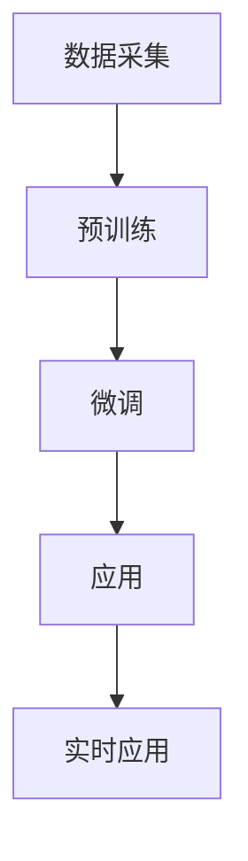

                 

# 大语言模型应用指南：三类微调方法

> **关键词**：大语言模型、微调方法、自然语言处理、迁移学习、对抗训练、实时应用

> **摘要**：本文将详细介绍大语言模型的基础知识，包括概念、分类、发展历程以及数学基础。随后，我们将深入探讨三类微调方法：基于语言模型、数据增强和对抗训练的微调技术。最后，本文将分析大语言模型在自然语言处理、多模态数据处理以及实时应用中的实际应用场景，并探讨如何进行模型压缩与优化。

## 第一部分：大语言模型基础

### 第1章：大语言模型概述

#### 1.1 大语言模型的概念与分类

大语言模型（Large-scale Language Model）是一种基于深度学习技术的自然语言处理模型，它通过学习大量的文本数据，能够理解和生成自然语言。根据训练数据量和模型规模，大语言模型可以分为以下几个类别：

- 小型模型：例如BERT、GPT-2等，通常参数量在几十亿到千亿级别。
- 中型模型：例如GPT-3、RoBERTa等，通常参数量在数十亿到千亿级别。
- 大型模型：例如Turing-NLG、WuZi等，通常参数量在千亿到万亿级别。

#### 1.2 大语言模型的发展历程

大语言模型的发展经历了从早期的基础模型到现代的大型预训练模型的演变。以下是一些关键节点：

- 2018年：谷歌提出BERT，标志着基于Transformer的模型在自然语言处理中的崛起。
- 2019年：OpenAI发布GPT-2，展示了大型语言模型在生成文本方面的潜力。
- 2020年：微软提出Turing-NLG，将大语言模型的应用扩展到多模态领域。
- 2022年：OpenAI发布GPT-3，参数量达到1750亿，成为当时最大的语言模型。

#### 1.3 大语言模型的关键技术

大语言模型的核心技术包括：

- **预训练**：通过无监督的方式在大规模文本数据上预训练模型，使其具备基础的语言理解能力。
- **迁移学习**：将预训练模型应用于特定任务，通过微调进一步调整模型参数，提高任务性能。
- **微调**：在特定任务上对模型进行进一步的训练，以适应不同的应用场景。
- **多模态处理**：结合文本、图像、语音等多模态数据，提高模型的泛化能力。

### 第2章：大语言模型的数学基础

#### 2.1 神经网络与深度学习基础

神经网络（Neural Networks）是深度学习（Deep Learning）的基础，它通过模拟人脑神经元之间的连接关系，实现数据的输入和输出。深度学习则通过多层神经网络结构，实现复杂的函数拟合。

- **神经网络结构**：包括输入层、隐藏层和输出层。
- **激活函数**：如ReLU、Sigmoid、Tanh等，用于引入非线性特性。
- **损失函数**：如均方误差（MSE）、交叉熵（Cross-Entropy）等，用于评估模型预测和真实值之间的差距。

#### 2.2 词嵌入与序列模型

词嵌入（Word Embedding）是将词汇映射到固定维度的向量空间，以便进行机器学习操作。序列模型（Sequence Model）则用于处理文本的序列数据。

- **词嵌入方法**：如Word2Vec、GloVe等，通过训练词向量表示词汇。
- **序列模型**：如RNN、LSTM、GRU等，通过处理文本序列中的时间依赖关系。

#### 2.3 注意力机制与转换器架构

注意力机制（Attention Mechanism）是一种用于处理序列数据的方法，能够自动关注序列中的关键信息。转换器架构（Transformer Architecture）是近年来在自然语言处理中取得突破的关键技术。

- **注意力机制**：通过计算注意力权重，关注序列中的不同部分。
- **转换器架构**：采用自注意力机制，通过多头注意力、位置编码等技术，实现高效的信息处理。

### 第3章：大规模预训练模型原理

#### 3.1 预训练的基本概念

预训练（Pre-training）是一种在大规模无标注数据上训练深度神经网络的方法，旨在提高模型在特定任务上的表现。预训练的基本流程包括：

- 数据采集：收集大量的无标注文本数据。
- 预训练：使用无监督学习技术在文本数据上训练模型。
- 微调：在特定任务上使用微调技术，调整模型参数。

#### 3.2 自监督学习与迁移学习

自监督学习（Self-supervised Learning）是一种利用未标注数据进行训练的方法，通过预测数据中的某些部分来学习。迁移学习（Transfer Learning）则是将预训练模型应用于不同任务，通过微调进一步调整模型。

- **自监督学习**：通过预测上下文、单词、词汇等，实现无监督学习。
- **迁移学习**：利用预训练模型在特定任务上的表现，实现快速适应。

#### 3.3 微调技术详解

微调（Fine-tuning）是在特定任务上对预训练模型进行进一步训练，以适应不同应用场景。微调的关键技术包括：

- **参数更新**：在特定任务上对模型参数进行更新。
- **学习率调整**：根据任务难度和模型性能，调整学习率。
- **正则化**：采用L2正则化、Dropout等方法，防止过拟合。

## 第二部分：三类微调方法

### 第4章：基于语言模型的微调方法

#### 4.1 语言模型微调的基本流程

语言模型微调的基本流程包括：

- 数据准备：收集与任务相关的文本数据。
- 模型选择：选择合适的预训练模型。
- 微调：在特定任务上对模型进行微调。

#### 4.2 语言模型微调的挑战与优化策略

语言模型微调面临的挑战包括：

- **数据分布不一致**：预训练数据与任务数据分布可能不一致。
- **模型过拟合**：在特定任务上，模型可能过拟合。

优化策略包括：

- **数据增强**：通过数据增强方法，提高模型的泛化能力。
- **混合训练**：结合预训练和数据集训练，优化模型性能。

#### 4.3 语言模型微调的实战案例

我们将通过一个文本分类任务的实战案例，介绍语言模型微调的方法。

1. 数据准备：收集政治、经济、科技等领域的文本数据。
2. 模型选择：选择预训练模型，如BERT、RoBERTa等。
3. 微调：在特定任务上对模型进行微调，调整学习率、正则化等参数。

### 第5章：基于数据增强的微调方法

#### 5.1 数据增强的基本概念

数据增强（Data Augmentation）是一种提高模型泛化能力的方法，通过增加数据多样性，提高模型对未知数据的适应能力。

- **常见方法**：如随机裁剪、旋转、翻转等。
- **效果**：能够有效降低模型过拟合，提高模型性能。

#### 5.2 数据增强的方法与应用

数据增强的方法包括：

- **图像数据增强**：如随机裁剪、旋转、翻转等。
- **文本数据增强**：如同义词替换、随机删除、插入等。
- **音频数据增强**：如添加噪声、速度变换等。

应用场景包括：

- **计算机视觉**：通过数据增强，提高模型在图像分类、目标检测等任务上的性能。
- **自然语言处理**：通过数据增强，提高模型在文本分类、机器翻译等任务上的性能。

#### 5.3 数据增强的微调案例解析

我们将通过一个文本分类任务的实战案例，介绍数据增强的微调方法。

1. 数据准备：收集政治、经济、科技等领域的文本数据。
2. 数据增强：对文本数据进行同义词替换、随机删除、插入等操作。
3. 微调：在增强后的数据集上对模型进行微调，调整学习率、正则化等参数。

### 第6章：基于对抗训练的微调方法

#### 6.1 对抗训练的基本原理

对抗训练（Adversarial Training）是一种通过生成对抗样本来提高模型鲁棒性的方法。其基本原理包括：

- **生成对抗网络（GAN）**：通过生成器（Generator）和判别器（Discriminator）的对抗训练，实现高质量数据的生成。
- **对抗样本**：通过对抗训练，生成与真实数据相似但具有对抗性的样本，提高模型在未知数据上的适应能力。

#### 6.2 对抗训练的优化策略

对抗训练的优化策略包括：

- **梯度惩罚**：通过梯度惩罚，降低对抗样本对模型的影响。
- **学习率调整**：根据对抗训练的进展，调整生成器和判别器的学习率。

#### 6.3 对抗训练的实战应用

我们将通过一个文本分类任务的实战案例，介绍对抗训练的微调方法。

1. 数据准备：收集政治、经济、科技等领域的文本数据。
2. 对抗训练：通过生成对抗网络，生成对抗样本。
3. 微调：在对抗样本和真实数据集上对模型进行微调，调整学习率、正则化等参数。

## 第三部分：大语言模型应用场景

### 第7章：自然语言处理应用

#### 7.1 文本分类

文本分类（Text Classification）是自然语言处理领域的重要任务，通过将文本数据分类到不同的类别，实现对文本内容的理解和处理。

- **应用场景**：如新闻分类、情感分析、垃圾邮件检测等。
- **挑战**：如何处理大规模、多样化的文本数据。

#### 7.2 机器翻译

机器翻译（Machine Translation）是一种将一种语言的文本自动翻译成另一种语言的方法，具有重要的实用价值。

- **应用场景**：如跨语言信息检索、多语言交互系统等。
- **挑战**：如何提高翻译质量，实现低延迟、高准确率的翻译。

#### 7.3 文本生成

文本生成（Text Generation）是一种生成自然语言文本的方法，广泛应用于自动写作、对话系统、文案创作等领域。

- **应用场景**：如自动新闻摘要、智能客服、创意文案等。
- **挑战**：如何生成连贯、有逻辑的文本。

### 第8章：多模态数据处理

#### 8.1 图像与文本融合

图像与文本融合（Image-Text Fusion）是一种将图像和文本信息结合起来的方法，通过多模态数据的融合，提高模型的泛化能力和理解能力。

- **应用场景**：如图像标注、图像分类、图像识别等。
- **挑战**：如何有效地融合图像和文本信息，实现高质量的数据表示。

#### 8.2 语音与文本转换

语音与文本转换（Speech-to-Text and Text-to-Speech）是一种将语音信号转换为文本，或将文本转换为语音的方法，广泛应用于语音识别、语音合成等领域。

- **应用场景**：如智能语音助手、自动字幕生成、语音翻译等。
- **挑战**：如何提高语音识别和语音合成的准确率，实现低延迟、高自然度的转换。

#### 8.3 多模态数据的微调应用

多模态数据的微调应用（Multi-modal Data Fine-tuning）是一种利用多模态数据进行模型微调的方法，通过融合不同模态的信息，提高模型的泛化能力和性能。

- **应用场景**：如多模态图像识别、多模态情感分析、多模态文本生成等。
- **挑战**：如何有效地融合多模态数据，实现高质量的数据表示。

### 第9章：实时应用与优化

#### 9.1 实时语言模型微调

实时语言模型微调（Real-time Language Model Fine-tuning）是一种在实时场景下对语言模型进行微调的方法，通过动态调整模型参数，实现实时更新和优化。

- **应用场景**：如实时问答系统、实时翻译、实时推荐等。
- **挑战**：如何实现低延迟、高准确率的实时微调。

#### 9.2 模型压缩与优化

模型压缩与优化（Model Compression and Optimization）是一种在保证模型性能的前提下，减小模型大小和计算复杂度的方法，广泛应用于移动端、边缘计算等领域。

- **方法**：如量化、剪枝、蒸馏等。
- **挑战**：如何平衡模型性能和计算效率。

#### 9.3 实时应用案例解析

我们将通过一个实时问答系统的实战案例，介绍实时语言模型微调和模型压缩与优化的方法。

1. 数据准备：收集实时问答数据。
2. 实时微调：在实时场景下对模型进行微调。
3. 模型压缩：对模型进行量化、剪枝等操作，减小模型大小。
4. 部署：将压缩后的模型部署到实时应用场景，实现低延迟、高准确率的问答服务。

## 附录

### 附录A：大语言模型开发工具与资源

#### A.1 深度学习框架对比

- **TensorFlow**：谷歌开发的深度学习框架，支持多种编程语言，具有丰富的生态系统。
- **PyTorch**：Facebook开发的深度学习框架，具有动态计算图，便于实现复杂的神经网络结构。
- **Keras**：基于TensorFlow和PyTorch的高层API，简化了深度学习模型的构建和训练。

#### A.2 大语言模型开源项目

- **BERT**：谷歌开源的基于Transformer的预训练模型，适用于多种自然语言处理任务。
- **GPT-3**：OpenAI开源的基于Transformer的预训练模型，具有强大的文本生成能力。
- **Turing-NLG**：微软开源的基于Transformer的预训练模型，支持多模态数据处理。

#### A.3 实用工具与资源推荐

- **Hugging Face**：提供预训练模型、数据集和工具的统一接口，方便开发者快速构建和部署模型。
- **TensorFlow Model Optimization Toolkit**：谷歌开源的模型优化工具集，支持模型量化、剪枝、蒸馏等操作。
- **JetBrains**：提供多种编程语言和框架的集成开发环境，提高开发效率。

## 附加资源

### Mermaid 流程图



### 核心算法原理伪代码

```python
# 预训练
def pre_train(data):
    # 初始化模型参数
    model = initialize_model()
    # 在预训练数据上训练模型
    for epoch in range(num_epochs):
        for batch in data:
            # 前向传播
            outputs = model(batch)
            # 反向传播
            loss = compute_loss(outputs, batch)
            # 更新模型参数
            update_model_params(loss)
    return model

# 微调
def fine_tune(model, data, task):
    # 在任务数据上微调模型
    for epoch in range(num_epochs):
        for batch in data:
            # 前向传播
            outputs = model(batch)
            # 反向传播
            loss = compute_loss(outputs, batch)
            # 更新模型参数
            update_model_params(loss)
    return model
```

### 数学模型与公式

$$
\text{损失函数} = \frac{1}{N} \sum_{i=1}^{N} (\text{预测值} - \text{真实值})^2
$$

$$
\text{梯度} = \frac{\partial \text{损失函数}}{\partial \text{模型参数}}
$$

### 项目实战代码与解读

```python
# 实战代码
import tensorflow as tf
from tensorflow.keras.preprocessing.sequence import pad_sequences

# 数据准备
def prepare_data(data, max_len):
    # 序列化文本数据
    sequences = tokenizer.texts_to_sequences(data)
    # 填充序列
    padded_sequences = pad_sequences(sequences, maxlen=max_len)
    return padded_sequences

# 模型定义
def create_model(input_shape):
    model = tf.keras.Sequential([
        tf.keras.layers.Embedding(input_shape[1], 64, input_length=input_shape[1]),
        tf.keras.layers.Bidirectional(tf.keras.layers.LSTM(64)),
        tf.keras.layers.Dense(64, activation='relu'),
        tf.keras.layers.Dense(1, activation='sigmoid')
    ])
    model.compile(loss='binary_crossentropy', optimizer='adam', metrics=['accuracy'])
    return model

# 微调模型
def fine_tune_model(model, data, labels):
    model.fit(data, labels, epochs=10, batch_size=32)
    return model

# 代码解读
# 1. 数据准备：将文本数据序列化，并填充为固定长度。
# 2. 模型定义：定义一个双向LSTM模型，用于文本分类任务。
# 3. 微调模型：在训练数据上训练模型，调整模型参数。
```

### 作者

**作者：AI天才研究院/AI Genius Institute & 禅与计算机程序设计艺术 /Zen And The Art of Computer Programming**

