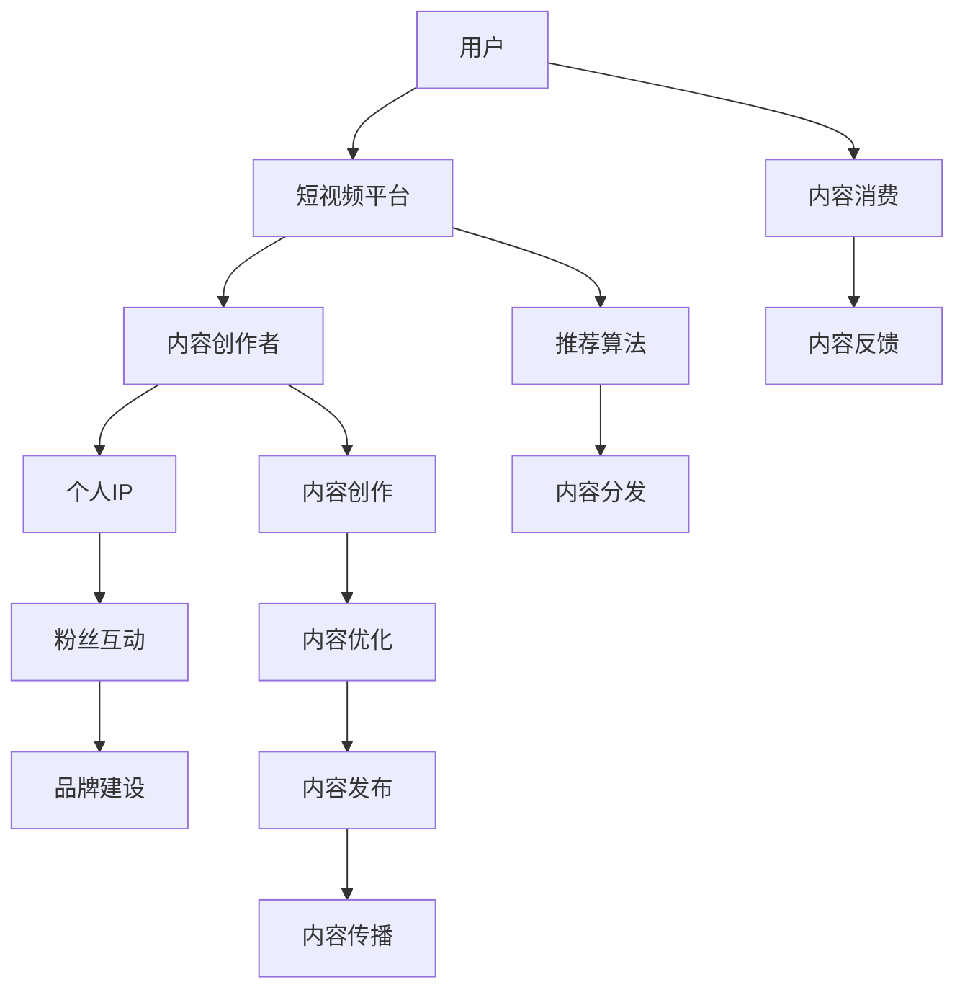

                 

### 短视频平台与个人IP概述

#### 第1章：短视频平台与个人IP的概念与联系

在数字化时代，短视频平台和个人IP已经成为互联网生态中不可或缺的一部分。短视频平台，如抖音、快手、B站等，凭借其独特的媒介特性，迅速崛起并改变了人们的消费习惯和信息获取方式。而个人IP，作为个体在特定领域内的品牌和影响力，则成为了短视频平台上的核心竞争力和价值所在。

**短视频平台的发展历程与现状**

短视频平台起源于2006年的 YouTube，随后在2010年代，短视频平台在全球范围内迅速发展。其中，中国市场的崛起尤为显著，以抖音（TikTok）、快手等平台为代表。

- **2006年**：YouTube上线，标志着短视频平台的诞生。
- **2010年**：美拍、Vine等平台兴起，短视频开始受到广泛关注。
- **2011年**：快手成立，成为中国最早的短视频平台之一。
- **2012年**：抖音（TikTok）在德国成立。
- **2016年**：抖音在中国上线，迅速成为最受欢迎的短视频平台之一。
- **2018年**：快手在美国上市。

如今，短视频平台的用户规模已经达到了惊人的水平。根据最新数据，抖音的全球月活跃用户数超过10亿，快手也有数亿活跃用户。短视频平台的主要商业模式包括广告收入、直播打赏、电商带货等。内容生态方面，短视频平台上的内容形式丰富多样，包括搞笑、美食、音乐、舞蹈、教育等。

**短视频平台的特点与趋势**

短视频平台的特点主要体现在以下几个方面：

- **时长短**：短视频通常在15秒到1分钟之间，便于用户快速消费。
- **形式多样**：短视频可以包含视频、音频、图片等多种形式，满足用户不同的需求。
- **互动性强**：短视频平台上的用户可以通过点赞、评论、分享等方式互动，增强了社区的粘性。
- **传播速度快**：短视频的传播速度非常快，热门视频可以迅速获得大量关注和传播。

随着技术的进步和用户需求的变化，短视频平台的发展趋势也在不断演变：

- **技术发展**：人工智能、大数据、区块链等技术的应用，将进一步提升短视频平台的推荐精度和用户体验。
- **内容多样化**：短视频内容将继续多样化，涵盖生活、娱乐、教育、科技等各个领域。
- **商业模式创新**：短视频平台的商业模式将继续创新，如短视频电商、知识付费等。

**个人IP的概念与价值**

个人IP，即个人知识产权，是指个人在特定领域内所拥有的知识、技能、声誉、创意等无形资产。它可以是个人品牌、专业技能、创意内容等。

个人IP的价值主要体现在以下几个方面：

- **品牌价值**：个人IP可以提升个人的品牌影响力，使其在行业内具备较高的知名度和认可度。
- **经济价值**：个人IP可以通过多种渠道实现商业变现，如广告收入、知识付费、商品销售等。
- **社会价值**：个人IP的建立有助于传递正能量，促进文化交流，推动社会进步。

**个人IP的类型与构建**

个人IP的类型可以根据其特点和目标受众进行划分：

- **专业型IP**：基于个人的专业知识、技能和经验，如技术专家、行业分析师等。
- **娱乐型IP**：基于个人的才艺、表演、搞笑等，如网红、明星等。
- **社交型IP**：基于个人的社交能力、人脉资源等，如社交达人、企业家等。
- **内容型IP**：基于个人的创作能力、内容输出，如作家、艺术家等。

构建个人IP的方法主要包括以下几个方面：

- **明确定位**：确定个人IP的领域、风格、目标受众等，形成独特的个人品牌。
- **持续输出**：通过持续的内容创作、知识分享、活动参与等方式，保持个人IP的活跃度。
- **互动营销**：利用社交媒体、直播、短视频等平台，与粉丝进行互动，增强个人IP的亲和力。
- **商业变现**：通过广告收入、知识付费、商品销售等渠道，实现个人IP的经济价值。

#### 第2章：短视频平台的内容创作技巧

短视频内容创作是个人IP打造的核心环节，成功的短视频内容不仅需要吸引观众的注意力，还需要与观众产生共鸣，从而形成持久的影响力。以下是一些短视频内容创作的基本原则、制作技巧以及运营策略。

**1. 内容创作的原则**

**好内容的特征**

- **吸引眼球**：短视频的标题和封面是吸引观众点击的关键，需要简洁明了、富有吸引力。
- **内容简洁**：短视频的时长通常较短，内容需要简洁明了，避免冗长。
- **内容新颖**：新颖独特的内容更容易引起观众的兴趣，从而提高观看率和分享率。
- **情感共鸣**：内容能够触动观众的情感，引发共鸣，从而增强观众的参与度。
- **高质量制作**：高质量的音频和视频制作能够提升观众的观看体验，增加内容的可信度和吸引力。

**内容定位与目标受众**

- **内容定位**：明确自己的短视频内容方向，如搞笑、美食、旅行、教育等，形成独特的风格。
- **目标受众**：了解自己的目标受众，如年龄、性别、兴趣等，以便更好地满足观众的需求。

**创意构思与剧情设定**

- **创意构思**：在内容创作之前，需要进行创意构思，构思出具有吸引力和独特性的内容。
- **剧情设定**：根据创意构思，设定一个有趣、有悬念的剧情，吸引观众继续观看。

**2. 短视频制作的技巧**

短视频制作是内容创作的重要环节，好的制作技巧能够提升视频的质量，增加观众的观看体验。以下是一些短视频制作的技巧：

**拍摄技巧**

- **构图**：采用合适的构图，如黄金分割、三分法等，使画面更加美观。
- **角度**：选择合适的角度，展现更多的场景内容，避免单一视角。
- **光线**：合理利用光线，提升画面的清晰度和色彩饱和度。
- **稳定**：保持拍摄设备的稳定，避免画面抖动，影响观看体验。

**剪辑技巧**

- **节奏**：调整视频的节奏，使内容紧凑、流畅，避免冗余和拖沓。
- **过渡**：使用合适的过渡效果，增强画面的连贯性。
- **特效**：合理使用特效，提升视频的视觉效果，但不过分依赖特效。

**视觉效果的运用**

- **色彩**：运用色彩对比，提升画面的视觉吸引力。
- **动画**：合理使用动画效果，增加视频的趣味性。
- **音效**：搭配合适的音效，增强视频的氛围感。

**音频的处理与优化**

- **配音**：选择合适的配音，使内容更加生动、有趣。
- **背景音乐**：选择合适的背景音乐，提升视频的氛围感。
- **降噪**：去除音频中的噪音，提升音频的清晰度。

**3. 短视频内容的运营策略**

短视频内容的运营是提升个人IP影响力的重要环节。以下是一些短视频内容的运营策略：

**账号定位与规划**

- **账号定位**：明确账号的定位，如专业型、娱乐型、社交型等，形成独特的个人品牌。
- **内容规划**：根据账号定位，制定长期和短期内容规划，确保内容输出的一致性和持续性。

**粉丝互动与社群运营**

- **粉丝互动**：通过评论、点赞、私信等方式与粉丝互动，增强粉丝的参与度和忠诚度。
- **社群运营**：建立粉丝社群，如微信群、QQ群、抖音粉丝团等，增强粉丝的归属感和互动性。

**跨平台推广与联动**

- **跨平台推广**：在多个短视频平台（如抖音、快手、微博等）进行推广，扩大个人IP的影响力。
- **内容联动**：通过不同平台的内容联动，提高内容的曝光度和影响力。

#### 第3章：短视频平台数据分析与优化

短视频平台数据分析是提升个人IP影响力的重要手段。通过对用户行为数据、视频表现数据等进行分析，可以优化内容创作、提高运营效率。以下是一些常见的短视频平台数据分析方法和优化策略。

**1. 数据指标解读**

短视频平台的数据指标繁多，其中一些关键指标包括：

- **播放量**：视频的播放量是衡量视频曝光度的重要指标，反映了视频的受众范围。
- **点赞量**：点赞量反映了用户对视频的喜爱程度，是评估内容受欢迎程度的关键指标。
- **评论量**：评论量反映了用户的参与度，是提升视频互动性的重要指标。
- **转发量**：转发量反映了视频的传播力，是扩大视频影响力的关键指标。
- **完播率**：视频的完播率反映了用户对视频的喜好程度和观看体验，是优化视频质量的重要指标。

**2. 数据可视化工具介绍**

为了更好地理解和分析短视频平台数据，可以借助以下数据可视化工具：

- **Google Data Studio**：一款功能强大的数据可视化工具，可以轻松创建各种图表和报告。
- **Tableau**：一款专业的数据可视化工具，提供了丰富的图表类型和自定义功能。
- **ECharts**：一款基于 JavaScript 的可视化图表库，支持多种图表类型和交互功能。

**3. 数据分析应用案例**

数据分析在短视频平台的应用非常广泛，以下是一些具体的案例分析：

**内容优化**：通过对视频播放量、点赞量、评论量等指标的分析，找出受欢迎的内容类型和风格，优化后续内容创作。

**粉丝运营**：通过对粉丝互动数据（如评论、点赞、私信等）的分析，了解粉丝的兴趣和需求，提供更加个性化的内容和服务。

**广告投放**：通过对广告投放数据的分析，优化广告投放策略，提高广告投放效果。

**案例分析**：通过分析成功案例，学习其数据分析方法和优化策略，为自己的个人IP运营提供借鉴。

### 第二部分：利用短视频平台提升个人IP影响力

短视频平台已经成为个人IP成长和变现的重要渠道。在这一部分，我们将深入探讨如何利用短视频平台打造个人IP，提高影响力，并实现商业价值。从个人IP定位与品牌建设，到短视频内容策划与制作，再到粉丝互动与社群运营，我们将一步一步分析推理，帮助读者了解并掌握提升个人IP影响力的方法。

#### 第4章：短视频平台个人IP打造实战

**1. 个人IP定位与品牌建设**

打造个人IP的第一步是明确IP的定位和品牌建设。这是一个持续的过程，需要根据个人兴趣、专业背景和市场需求进行精准定位。

- **个人IP定位**：确定个人IP的领域和目标受众，例如技术专家、美食博主、健身教练等。定位越明确，越容易吸引到特定的粉丝群体。

- **品牌建设**：通过持续的内容创作、社交媒体互动和活动参与，建立个人品牌。品牌形象应与个人IP的定位相一致，传递出专业、真诚和独特的个性。

**2. 短视频内容策划与制作**

短视频内容是个人IP的核心。优秀的短视频内容可以吸引粉丝，提高互动率，并帮助IP建立权威性。

- **内容策划**：在策划短视频内容时，应考虑目标受众的兴趣和需求，选择有吸引力的主题。例如，技术专家可以策划技术教程、行业分析等内容；美食博主可以策划美食制作、美食推荐等内容。

- **制作技巧**：短视频制作应注重画面质量、剪辑节奏和音频效果。使用专业设备进行拍摄，确保视频清晰、稳定；在剪辑时，注意节奏的把控，避免冗余；音频处理也应注重清晰度和氛围。

**3. 粉丝互动与社群运营**

粉丝是个人IP的重要资产。与粉丝建立良好的互动关系，可以增强粉丝的忠诚度和参与度。

- **粉丝互动**：通过评论、私信、直播等方式与粉丝互动，回答问题、分享心得，让粉丝感受到个人的亲和力和专业性。

- **社群运营**：建立粉丝社群，如微信群、QQ群、粉丝团等，为粉丝提供交流和互动的平台。定期组织线上或线下活动，增强粉丝的归属感。

#### 第5章：短视频平台营销策略

短视频平台的营销策略多样，包括广告投放、跨界合作和内容营销等。合理运用这些策略，可以扩大个人IP的影响力，实现商业价值。

**1. 短视频广告投放策略**

短视频广告是提升个人IP知名度和影响力的重要手段。以下是广告投放策略的几个关键点：

- **目标与预算**：明确广告投放的目标，如增加粉丝数量、提升品牌知名度等，并根据目标设定合理的预算。

- **广告形式**：选择适合的广告形式，如开屏广告、信息流广告、挑战广告等，以提高广告的曝光率和点击率。

- **投放渠道**：选择合适的投放渠道，如抖音、快手、微博等，根据不同平台的特点和用户群体进行精准投放。

- **效果评估**：通过数据分析，评估广告投放效果，如曝光量、点击量、转化率等，根据效果调整广告策略。

**2. 短视频跨界合作与联动**

跨界合作可以帮助个人IP吸引更多受众，扩大影响力。以下是跨界合作的几个关键点：

- **跨界合作的意义**：跨界合作可以带来新的受众群体，增加内容的多样性和趣味性。

- **跨界合作的形式**：可以选择与其他领域的个人或品牌进行合作，如与明星、KOL、企业等合作。

- **跨界合作的操作流程**：明确合作目标、制定合作方案、签订合作协议、实施合作活动、评估合作效果。

**3. 短视频内容营销案例分析**

通过分析短视频内容营销的成功案例，可以了解如何运用营销策略提升个人IP的影响力。

- **成功案例分享**：分享一些成功的短视频内容营销案例，如热门挑战、创意广告、品牌合作等。

- **案例分析**：对成功案例进行分析，探讨其成功的原因、营销策略和执行细节。

- **经验总结**：总结成功经验，为个人IP的营销策略提供借鉴。

#### 第6章：短视频平台个人IP成长策略

个人IP的成长需要系统的策略和持续的投入。以下是个人IP成长的一些关键策略：

**1. 个人IP成长路径**

个人IP的成长可以分为几个阶段：

- **起步阶段**：通过初步的内容创作和粉丝互动，建立个人IP的基础。
- **成长阶段**：通过品牌建设和内容创新，扩大个人IP的影响力和受众范围。
- **成熟阶段**：形成稳定的粉丝群体和商业变现模式，实现个人IP的持续成长。

**2. 个人IP变现途径**

个人IP的变现途径多样，以下是几种常见的变现方式：

- **广告收入**：通过在短视频中植入广告、合作广告等方式获得收入。
- **电商推广**：通过短视频推广自己的产品或与其他品牌合作销售产品。
- **知识付费**：通过开设付费课程、撰写书籍、发表研究报告等方式获得收入。
- **IP授权与合作**：将自己的个人IP授权给其他品牌或机构使用，获得授权收入。

**3. 案例分析：个人IP成功经验与挑战**

通过分析成功个人IP的成长过程和所面临的挑战，可以了解如何应对成长中的各种问题。

- **成功案例分析**：分享一些成功个人IP的成长故事和经验。
- **挑战与应对策略**：探讨个人IP在成长过程中可能遇到的挑战，并提出应对策略。

### 第三部分：短视频平台个人IP成长与变现

在这一部分，我们将深入探讨短视频平台个人IP的成长策略与变现途径，通过具体的案例分析和实战经验，帮助读者了解如何在短视频平台上打造个人IP，实现商业价值。

#### 第6章：短视频平台个人IP成长策略

**1. 个人IP成长路径**

个人IP的成长需要经历多个阶段，每个阶段都有不同的目标和策略。

- **起步阶段**：在这个阶段，个人IP的建立者需要通过持续的内容创作和互动来吸引第一批粉丝。这个阶段的关键是找到自己的独特定位，建立初步的品牌形象。

- **成长阶段**：在起步阶段的基础上，个人IP需要通过内容创新和品牌建设来扩大影响力。这个阶段的目标是吸引更多的关注和粉丝，提升个人IP的市场价值。

- **成熟阶段**：在成熟阶段，个人IP已经建立了一定的品牌知名度和粉丝基础。这个阶段的目标是实现商业变现，通过多种渠道获得收入，并持续提升个人IP的价值。

**2. 个人IP变现途径**

个人IP的变现途径多种多样，以下是一些常见的变现方式：

- **广告收入**：通过在短视频中植入广告、合作广告等方式获得收入。这种方式适用于大多数个人IP，尤其是那些拥有大量粉丝和较高曝光率的IP。

- **电商推广**：通过短视频推广自己的产品或与其他品牌合作销售产品。这种方式适用于那些有自己产品或能够与品牌合作的个人IP。

- **知识付费**：通过开设付费课程、撰写书籍、发表研究报告等方式获得收入。这种方式适用于那些在特定领域有专业知识和经验的个人IP。

- **IP授权与合作**：将自己的个人IP授权给其他品牌或机构使用，获得授权收入。这种方式适用于那些拥有独特创意和影响力的个人IP。

**3. 案例分析：个人IP成功经验与挑战**

通过分析成功个人IP的成长过程和所面临的挑战，可以了解如何应对成长中的各种问题。

- **成功案例分析**：例如，抖音上的美食博主李子柒，通过高质量的内容创作和品牌建设，吸引了大量的粉丝和品牌合作，实现了商业变现。她的成功经验包括内容创新、品牌定位、粉丝互动等。

- **挑战与应对策略**：例如，一些个人IP在成长过程中可能面临内容创意枯竭、粉丝流失、商业变现困难等挑战。应对策略包括持续创新、提高粉丝互动、多元化变现渠道等。

#### 第7章：短视频平台个人IP发展趋势与未来展望

**1. 短视频平台的发展趋势**

短视频平台正面临着快速的发展和变革。以下是一些关键趋势：

- **技术进步**：随着人工智能、大数据、5G等技术的发展，短视频平台的推荐算法和用户体验将得到进一步提升。

- **内容多样化**：短视频内容将继续向多样化发展，涵盖娱乐、教育、科技、生活等各个领域。

- **商业模式创新**：短视频平台的商业模式将继续创新，例如短视频电商、知识付费等，将为个人IP提供更多变现机会。

**2. 个人IP的未来发展**

个人IP在未来将呈现出以下发展趋势：

- **国际化**：随着短视频平台的国际化步伐加快，个人IP将有机会吸引更多的海外粉丝和资源。

- **多元化发展**：个人IP将不再局限于单一领域，而是通过多元化的发展，实现跨领域的合作和创新。

- **品牌化**：个人IP将更加注重品牌建设和品牌管理，通过品牌化的运营，提升个人IP的价值。

**3. 未来短视频平台个人IP的影响**

短视频平台个人IP将对社会和经济产生深远影响：

- **社会影响**：个人IP的兴起将促进文化交流、知识传播和社会认同。

- **经济影响**：短视频平台将成为新的经济增长点，个人IP的变现能力将进一步提升。

- **创业机遇**：短视频平台将为创业者提供更多创新机会和创业空间。

### 附录

#### 附录A：短视频平台常用工具与资源

**1. 短视频制作工具**

短视频制作是个人IP打造的重要环节，以下是一些常用的短视频制作工具：

- **剪映**：一款功能强大的短视频剪辑软件，支持多种剪辑、特效和音频处理功能。
- **Adobe Premiere Pro**：专业的视频剪辑软件，适用于复杂视频制作和特效处理。
- **Final Cut Pro**：苹果公司的专业视频剪辑软件，适用于 Mac 用户。
- **Filmora**：一款易用性高的视频剪辑软件，适合初学者和日常使用。

**2. 数据分析工具**

数据分析是短视频平台运营的重要一环，以下是一些常用的数据分析工具：

- **Google Analytics**：一款强大的网站分析工具，可以跟踪和分析用户行为。
- **Tableau**：专业的数据可视化工具，提供了丰富的图表类型和自定义功能。
- **ECharts**：一款基于 JavaScript 的可视化图表库，支持多种图表类型和交互功能。

**3. 学习资源推荐**

- **短视频制作教程**：可以在网上找到各种短视频制作教程，适合不同水平的学习者。
- **数据分析教程**：学习数据分析的基础知识和工具使用，提高数据分析能力。
- **个人IP运营课程**：了解个人IP的构建、运营和变现策略，为自己的个人IP成长提供指导。

### 核心概念与联系

短视频平台与个人IP的关系是一个复杂而又密切的生态系统。理解这两者之间的关系对于个人IP的打造和运营至关重要。

**短视频平台与个人IP的关系**

短视频平台为个人IP提供了一个展示和互动的舞台。个人IP则通过优质内容和独特的个人魅力吸引粉丝，从而提升个人在平台上的影响力。

- **用户**：用户是短视频平台的核心，他们是个人IP的目标受众。
- **短视频平台**：短视频平台是连接用户和个人IP的桥梁，通过推荐算法和内容分发机制，将个人IP的内容推送给合适的用户。
- **内容创作者**：内容创作者即个人IP，他们通过创作和分享短视频内容，吸引粉丝并建立个人品牌。
- **个人IP**：个人IP是内容创作者的个人品牌，代表着他们在特定领域的专业知识和影响力。
- **粉丝互动**：粉丝互动是个人IP建立粉丝忠诚度和提升影响力的关键环节。
- **品牌建设**：品牌建设是个人IP长期发展的基础，通过持续的内容输出和互动，个人IP可以建立强大的品牌影响力。

**Mermaid流程图**

以下是短视频平台与个人IP关系的 Mermaid 流程图：



**核心算法原理讲解**

短视频平台的推荐算法是提升个人IP影响力的关键因素之一。以下介绍两种核心算法原理：视频内容推荐算法和粉丝互动分析算法。

**算法1：视频内容推荐算法**

视频内容推荐算法的目标是根据用户的历史行为和兴趣偏好，向用户推荐他们可能感兴趣的视频内容。

**伪代码：**

```python
# 视频内容推荐算法伪代码

# 输入：用户历史行为数据 user_behaviors，视频特征数据 video_features
# 输出：推荐视频列表 recommended_videos

function video_recommendation(user_behaviors, video_features):
    # 提取用户特征和视频特征
    user_vector = extract_user_features(user_behaviors)
    video_vectors = extract_video_features(video_features)

    # 计算用户与视频的相似度
    similarity_matrix = compute_similarity(user_vector, video_vectors)

    # 对相似度进行排序，获取推荐视频
    recommended_videos = sort_videos_by_similarity(similarity_matrix)

    return recommended_videos
```

**数学模型和数学公式 & 详细讲解 & 举例说明**

**数学模型1：余弦相似度**

余弦相似度是一种常用的衡量两个向量之间相似度的方法，其公式如下：

$$
\cos\theta = \frac{\vec{u} \cdot \vec{v}}{|\vec{u}| |\vec{v}|}
$$

其中，$\vec{u}$ 和 $\vec{v}$ 分别是两个向量，$\theta$ 是两个向量之间的夹角。

**举例说明：**

假设有两个用户行为向量 $\vec{u} = (1, 1)$ 和 $\vec{v} = (1, 2)$，则它们的余弦相似度为：

$$
\cos\theta = \frac{1 \cdot 1 + 1 \cdot 2}{\sqrt{1^2 + 1^2} \cdot \sqrt{1^2 + 2^2}} = \frac{3}{\sqrt{2} \cdot \sqrt{5}} \approx 0.75
$$

这意味着这两个向量的相似度较高。

**算法2：粉丝互动分析算法**

粉丝互动分析算法用于分析用户与内容的互动情况，以了解用户对内容的偏好和参与度。

**伪代码：**

```python
# 粉丝互动分析算法伪代码

# 输入：用户互动数据 interactions
# 输出：粉丝互动模式 interaction_patterns

function fan_interaction_analysis(interactions):
    # 计算每个用户的互动频率
    fan_activity = compute_activity(interactions)

    # 对互动频率进行聚类分析
    clusters = kmeans_clustering(fan_activity)

    # 分析每个聚类簇的互动模式
    interaction_patterns = analyze_clusters(clusters, interactions)

    return interaction_patterns
```

**数学模型2：K-Means聚类**

K-Means是一种基于距离的聚类算法，其目标是将数据点划分为K个簇，使得每个簇内部的数据点之间的距离最小。

$$
\text{簇分配} = \text{argmin}\sum_{i=1}^{k}\sum_{x \in S_i}||x - \mu_i||^2
$$

其中，$S_i$ 是第 $i$ 个簇的数据点集合，$\mu_i$ 是第 $i$ 个簇的中心。

**举例说明：**

假设有三个用户互动频率向量：

$$
\vec{u}_1 = (1, 2), \vec{u}_2 = (2, 3), \vec{u}_3 = (3, 1)
$$

使用K-Means聚类，可以将这三个向量划分为两个簇。例如，可以将 $\vec{u}_1$ 和 $\vec{u}_2$ 划分到一个簇，而 $\vec{u}_3$ 划分到另一个簇，因为这两个簇内部的距离更小。

**项目实战**

**实战1：短视频内容推荐系统实现**

**目标**：实现一个基于用户历史行为和内容特征的短视频内容推荐系统。

**开发环境**：Python、Scikit-learn、Numpy

**源代码：**

```python
# 导入相关库
import numpy as np
from sklearn.metrics.pairwise import cosine_similarity
from sklearn.preprocessing import normalize

# 用户行为数据
user_behaviors = {
    'user1': [[1, 0, 1, 0], [1, 1, 0, 1], [0, 1, 1, 1]],
    'user2': [[0, 1, 0, 1], [1, 0, 1, 0], [1, 1, 1, 0]],
    'user3': [[1, 1, 0, 0], [0, 1, 1, 1], [1, 0, 1, 1]]
}

# 视频内容特征
video_features = {
    'video1': [0.2, 0.4, 0.6],
    'video2': [0.1, 0.3, 0.5],
    'video3': [0.3, 0.5, 0.7],
    'video4': [0.4, 0.6, 0.8],
    'video5': [0.5, 0.7, 0.9]
}

# 计算用户-视频相似度矩阵
user_video_similarity = {}
for user, behaviors in user_behaviors.items():
    user_vector = normalize(np.array(behaviors))
    for video, feature in video_features.items():
        video_vector = normalize(np.array(feature))
        similarity = cosine_similarity(user_vector.reshape(1, -1), video_vector.reshape(1, -1))[0][0]
        user_video_similarity[(user, video)] = similarity

# 推荐系统实现
def video_recommendation(user):
    user_vector = normalize(np.array(user_behaviors[user]))
    recommended_videos = []
    for video, feature in video_features.items():
        video_vector = normalize(np.array(feature))
        similarity = cosine_similarity(user_vector.reshape(1, -1), video_vector.reshape(1, -1))[0][0]
        recommended_videos.append((video, similarity))
    recommended_videos = sorted(recommended_videos, key=lambda x: x[1], reverse=True)
    return [video for video, _ in recommended_videos][:5]

# 测试推荐系统
print(video_recommendation('user1'))
print(video_recommendation('user2'))
print(video_recommendation('user3'))
```

**代码解读与分析：**

1. **数据准备**：用户行为数据存储在字典 `user_behaviors` 中，每个用户的行为记录为一个二维数组，表示用户对不同短视频类型的偏好。视频内容特征存储在字典 `video_features` 中，每个视频的特征为一个一维数组。

2. **相似度计算**：使用余弦相似度计算用户行为向量与视频特征向量的相似度。余弦相似度是一种衡量两个向量夹角余弦值的相似性度量，值范围在 [-1, 1] 之间，越接近 1 表示相似度越高。

3. **推荐实现**：根据用户历史行为向量与视频特征向量的相似度进行排序，选取相似度最高的视频进行推荐。这里使用了 Scikit-learn 库中的 `cosine_similarity` 函数和 `numpy` 库中的 `normalize` 函数。

4. **测试结果**：测试推荐系统对不同用户的行为记录，输出推荐的视频列表。

**实战2：短视频平台用户互动分析系统实现**

**目标**：实现一个基于用户互动数据的短视频平台用户互动分析系统。

**开发环境**：Python、Scikit-learn、Pandas

**源代码：**

```python
# 导入相关库
import pandas as pd
from sklearn.cluster import KMeans

# 用户互动数据
interactions = {
    'user1': [[1, 2, 3], [4, 5, 6], [7, 8, 9]],
    'user2': [[2, 3, 4], [5, 6, 7], [8, 9, 10]],
    'user3': [[3, 4, 5], [6, 7, 8], [9, 10, 11]],
    'user4': [[4, 5, 6], [7, 8, 9], [10, 11, 12]],
    'user5': [[5, 6, 7], [8, 9, 10], [11, 12, 13]]
}

# 计算用户互动频率
interaction_matrix = pd.DataFrame(interactions).T
fan_activity = interaction_matrix.sum(axis=1)

# 使用K-Means算法进行聚类分析
kmeans = KMeans(n_clusters=3, random_state=0).fit(fan_activity.values.reshape(-1, 1))
clusters = kmeans.predict(fan_activity.values.reshape(-1, 1))

# 分析用户互动行为模式
interaction_patterns = {}
for user, cluster in zip(fan_activity.index, clusters):
    if cluster not in interaction_patterns:
        interaction_patterns[cluster] = []
    interaction_patterns[cluster].append(interaction_matrix.loc[user])

# 输出分析结果
for cluster, patterns in interaction_patterns.items():
    print(f"Cluster {cluster}:")
    for pattern in patterns:
        print(pattern)
```

**代码解读与分析：**

1. **数据准备**：用户互动数据存储在字典 `interactions` 中，每个用户的行为记录为一个二维数组，表示用户在不同短视频上的互动行为。这里使用 Pandas 库将数据转换为 DataFrame 格式，便于后续操作。

2. **互动频率计算**：计算每个用户的互动频率，即每个用户在不同短视频上的总互动次数。

3. **聚类分析**：使用 K-Means 算法对用户互动频率进行聚类分析，找出不同互动行为模式的用户群体。

4. **行为模式分析**：根据聚类结果，分析每个聚类簇中的用户互动行为模式，并将结果输出。

通过以上两个实战案例，读者可以了解到如何使用 Python 实现短视频内容推荐系统和用户互动分析系统，并学会如何进行代码解读与分析。

### 文章标题：如何利用短视频平台提升个人IP影响力

**关键词：**短视频平台，个人IP，影响力，内容创作，数据分析，营销策略

**摘要：**本文从短视频平台与个人IP的关系出发，详细探讨了如何通过内容创作、数据分析、营销策略等手段，提升个人IP在短视频平台上的影响力，实现商业价值。通过实际案例和算法原理讲解，为读者提供了实用的操作指南。

### 结论

通过本文的深入探讨，我们可以清晰地看到短视频平台和个人IP之间的密切联系。短视频平台为个人IP提供了一个广阔的展示和互动舞台，而个人IP则通过独特的定位和持续的内容输出，吸引了大量的粉丝和关注，从而提升了个人在平台上的影响力。

首先，我们详细分析了短视频平台的发展历程和现状，了解了其独特的媒介特性和发展趋势。同时，我们也深入探讨了个人IP的概念、价值以及构建方法，明确了个人IP的类型和成长路径。

接着，我们从内容创作、制作技巧、运营策略等多个角度，提供了提升个人IP影响力的具体方法。通过对用户行为数据、视频表现数据等进行分析，我们提出了一系列优化策略，帮助个人IP更好地适应短视频平台的发展趋势。

此外，我们还详细讲解了短视频平台个人IP的成长策略和变现途径，通过成功案例的分析，为读者提供了实用的操作指南。最后，我们对短视频平台的未来发展进行了展望，探讨了个人IP在未来可能面临的新机遇和挑战。

总之，短视频平台和个人IP已经成为了互联网时代的重要现象。通过本文的讲解，我们希望读者能够深刻理解短视频平台和个人IP的关系，掌握提升个人IP影响力的方法，实现商业价值。同时，我们也期待读者能够在实践中不断探索和创新，为短视频平台和个人IP的发展贡献自己的力量。

