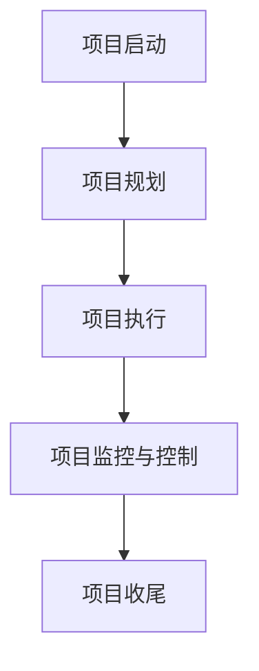
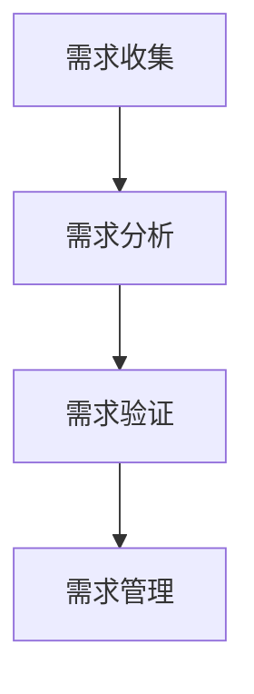
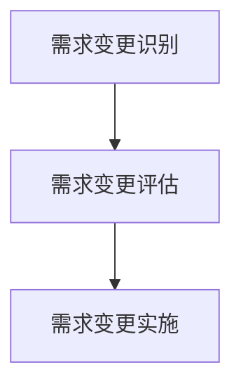
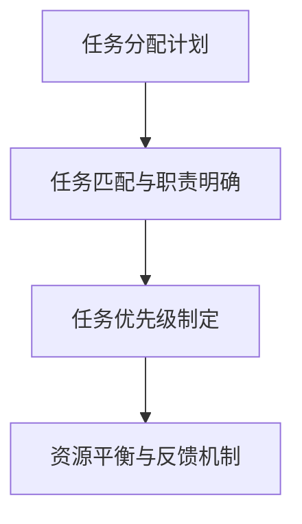
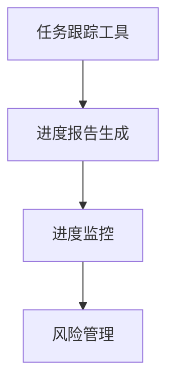
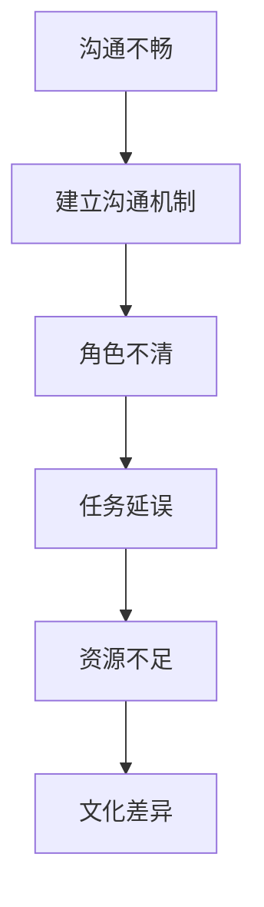

                 

# 《如何建立高效的团队工作流程》

> **关键词：** 团队工作流程、团队协作、沟通机制、项目管理、需求管理、任务分配、流程优化

> **摘要：** 本文将从基础概念出发，深入探讨团队工作流程的建立与实施策略，以及如何通过优化流程和持续改进，提升团队工作效率和项目质量。通过本文的阅读，读者将掌握团队工作流程设计的核心原则、具体实施方法和评估优化技巧。

## 目录大纲

### 《如何建立高效的团队工作流程》目录大纲

### 第一部分：团队工作流程基础

### 第1章：团队工作流程概述

#### 1.1 工作流程的概念与重要性

#### 1.2 团队工作流程的组成部分

#### 1.3 常见的团队工作流程模型

### 第2章：团队协作与沟通

#### 2.1 团队协作的重要性

#### 2.2 沟通机制与技巧

#### 2.3 团队协作工具与平台

### 第3章：高效团队工作流程的设计原则

#### 3.1 目标导向

#### 3.2 可视化管理

#### 3.3 动态调整与优化

### 第二部分：具体工作流程的建立与实施

### 第4章：项目管理流程

#### 4.1 项目管理的核心流程

#### 4.2 项目管理工具与方法

#### 4.3 项目进度与风险控制

### 第5章：需求管理流程

#### 5.1 需求管理的核心任务

#### 5.2 需求管理工具与技术

#### 5.3 需求变更管理

### 第6章：任务分配与协作流程

#### 6.1 任务分配的原则与技巧

#### 6.2 任务跟踪与进度管理

#### 6.3 团队协作中的常见问题与解决

### 第7章：团队工作流程的评估与优化

#### 7.1 工作流程评估指标

#### 7.2 工作流程优化方法

#### 7.3 工作流程的持续改进

### 附录

#### 附录 A：团队工作流程设计与实施工具推荐

#### 附录 B：案例研究与实战经验分享

## 目录内容说明

本文将从以下几个方面展开：

1. **团队工作流程基础**：介绍团队工作流程的基本概念、组成部分和常见模型，为后续讨论打下基础。

2. **团队协作与沟通**：强调团队协作的重要性，介绍沟通机制、技巧和工具，确保团队成员能够高效协作。

3. **高效团队工作流程的设计原则**：阐述目标导向、可视化管理、动态调整与优化等设计原则，提供设计团队工作流程的指导。

4. **具体工作流程的建立与实施**：以项目管理流程、需求管理流程、任务分配与协作流程为例，详细讲解如何建立和实施具体工作流程。

5. **团队工作流程的评估与优化**：介绍工作流程评估指标、优化方法和持续改进策略，帮助团队不断提升工作效率。

6. **附录**：提供团队工作流程设计与实施工具推荐和案例研究与实战经验分享，为读者提供实用参考。

## 目录大纲结构

- **1级目录**：以章节为单位，概括每章的核心内容。
- **2级目录**：以小节为单位，详细描述每章的核心内容。
- **3级目录**：以小节下的细分内容为单位，进一步细化每章的核心内容。

## 目录大纲特点

- **全面性**：目录涵盖了团队工作流程的各个方面，从基础概念到具体实施，再到评估与优化，提供了全面的指导。
- **逻辑性**：目录结构清晰，逻辑性强，便于读者理解和掌握。
- **实用性**：结合实际案例和实战经验，提供具体的操作方法和技巧，有助于读者在实际工作中应用和优化团队工作流程。

现在，让我们开始深入探讨团队工作流程的各个方面，逐步构建一个高效的团队工作流程体系。让我们一步一步进行分析推理（REASONING STEP BY STEP），确保每个环节都能满足实际需求，提升团队的整体效能。在接下来的章节中，我们将逐一探讨团队工作流程的基础概念、团队协作与沟通、高效团队工作流程的设计原则，以及具体工作流程的建立与实施等内容。

## 第一部分：团队工作流程基础

### 第1章：团队工作流程概述

在信息时代，高效的工作流程是团队成功的基石。本章将详细介绍团队工作流程的概念、重要性以及其组成部分，帮助读者建立对团队工作流程的基本认识。

#### 1.1 工作流程的概念与重要性

**工作流程**（Workflow）是指一组相关任务和活动，按照某种逻辑顺序执行，以实现特定目标的过程。工作流程不仅仅是一系列任务的组合，它还涉及到任务的分配、执行、监控和优化。

**工作流程的重要性**体现在以下几个方面：

1. **提高效率**：合理的工作流程可以减少重复劳动，避免资源浪费，提高团队的整体工作效率。
2. **确保质量**：通过明确的工作流程和标准，可以确保团队输出的产品或服务符合预期质量。
3. **促进协作**：工作流程可以明确团队成员的角色和责任，促进团队成员之间的协作。
4. **便于监控和改进**：工作流程的可视化和标准化，使得团队可以更好地监控工作进度，及时发现和解决问题。

#### 1.2 团队工作流程的组成部分

一个完整的工作流程通常包括以下几个组成部分：

1. **流程设计原则**：流程设计原则是指在工作流程设计过程中应遵循的基本规则和指导原则。例如，目标导向、简洁性、灵活性等。
2. **流程节点定义**：流程节点是指工作流程中的具体任务或活动。每个节点都有明确的输入、输出和执行者。
3. **流程活动说明**：流程活动说明是对每个节点详细任务的描述，包括任务内容、执行方法、所需资源和预期结果等。

**示例**：假设我们设计一个软件开发项目的流程，其组成部分可能包括以下节点：

- 需求分析
- 设计方案
- 编码实现
- 测试验证
- 交付部署
- 运维维护

对于每个节点，我们还需要详细说明具体活动，如需求分析的输入是用户需求文档，输出是需求规格说明书；编码实现的输入是设计文档，输出是代码和单元测试等。

#### 1.3 常见的团队工作流程模型

团队工作流程模型是指导工作流程设计的基本框架。常见的团队工作流程模型包括以下几种：

1. **传统流程模型**：传统流程模型是一种线性的工作流程，每个任务完成后才能开始下一个任务。例如，软件开发中的瀑布模型。

   **流程图**：
   ```mermaid
   graph TD
   A[需求分析] --> B[设计方案]
   B --> C[编码实现]
   C --> D[测试验证]
   D --> E[交付部署]
   E --> F[运维维护]
   ```

2. **精益流程模型**：精益流程模型强调持续改进和效率优化，通过减少浪费和增加价值来提升整体流程性能。例如，敏捷开发。

   **流程图**：
   ```mermaid
   graph TD
   A[需求收集] --> B[迭代规划]
   B --> C{开发周期}
   C --> D{代码评审}
   D --> E{测试与交付}
   E --> F[反馈与改进]
   ```

每种流程模型都有其适用的场景和优缺点，团队可以根据实际情况选择合适的流程模型。

#### 1.4 工作流程设计原则

在设计和优化团队工作流程时，应遵循以下原则：

1. **目标导向**：工作流程的设计应以实现团队目标为核心，确保每个环节都围绕目标展开。
2. **简洁性**：避免不必要的复杂性，简化流程步骤，减少冗余和重复任务。
3. **灵活性**：工作流程应具有一定的灵活性，以适应不同项目需求和环境变化。
4. **标准化**：制定明确的标准和规范，确保团队成员能够按照统一的方法执行任务。
5. **可追溯性**：确保流程中的每个环节都有记录和可追溯性，便于监控和审计。

通过遵循这些原则，团队可以设计出既高效又灵活的工作流程，为后续的具体实施和优化奠定基础。

在下一章中，我们将探讨团队协作与沟通的重要性，以及如何在团队中建立有效的沟通机制和技巧。敬请期待！

## 第2章：团队协作与沟通

### 2.1 团队协作的重要性

团队协作是团队工作流程中的核心环节，它不仅影响着团队的工作效率，还直接关系到项目的成功与否。有效的团队协作能够将每个成员的专业技能和优势结合起来，形成协同效应，从而实现更高的目标。

#### 团队协作的作用

1. **资源整合**：通过团队协作，可以将团队成员的知识、技能和资源整合起来，形成强大的合力，提高工作效率。
2. **知识共享**：团队协作促进了团队成员之间的知识交流与共享，有助于积累团队经验，提升整体能力。
3. **降低风险**：团队成员共同面对挑战，可以有效分散风险，降低单个成员因知识或能力不足而带来的风险。
4. **激发创新**：团队协作提供了一个开放、包容的环境，有助于激发团队成员的创新思维，推动项目创新和突破。
5. **提高满意度**：团队成员在协作过程中能够获得成就感和归属感，提高工作满意度和团队凝聚力。

#### 团队协作的障碍

尽管团队协作具有诸多优势，但实际工作中仍存在一些障碍，影响了团队协作的效果。以下是一些常见的团队协作障碍：

1. **沟通不畅**：团队成员之间缺乏有效的沟通，导致信息传递不及时或不准确，影响协作效率。
2. **角色不明**：团队成员对自己的角色和责任理解不清，容易导致工作重叠或遗漏，影响团队整体进度。
3. **目标不一致**：团队成员对项目目标理解不一，导致行动方向不统一，影响项目进展。
4. **文化差异**：不同背景和文化背景的团队成员之间可能存在沟通障碍和观念差异，影响协作效果。
5. **资源不足**：团队成员可能因资源不足（如时间、技能、设备等）而无法有效参与协作，影响项目进度。

#### 如何克服团队协作的障碍

1. **建立有效的沟通机制**：通过定期会议、即时通讯工具和面对面交流，确保团队成员之间的信息畅通。
2. **明确角色和责任**：制定清晰的岗位职责说明书，明确每个团队成员的角色和责任，确保工作分工合理。
3. **统一目标**：确保所有团队成员对项目目标有共同的理解和认同，通过共同讨论和制定目标，提高团队凝聚力。
4. **加强文化融合**：通过团队建设活动和培训，增强团队成员之间的文化融合，促进协作。
5. **优化资源配置**：合理分配资源，确保团队成员能够充分利用现有资源，提高工作效率。

### 2.2 沟通机制与技巧

沟通是团队协作的重要基础，有效的沟通机制和技巧能够促进团队成员之间的理解与合作。以下介绍一些常用的沟通机制和技巧：

#### 沟通的原则

1. **及时性**：信息应尽快传递，减少延迟，避免信息失真。
2. **准确性**：确保信息传递准确无误，避免产生误解。
3. **完整性**：传递信息时，应包括所有必要细节，确保信息完整。
4. **双向性**：鼓励团队成员之间的双向沟通，促进信息互动。
5. **尊重性**：尊重每个团队成员的意见和贡献，避免对他人进行指责。

#### 沟通的技巧

1. **倾听**：倾听是沟通的关键，要确保听清对方的意见和需求，避免打断或误解。
2. **清晰表达**：用简单明了的语言表达自己的想法，避免使用复杂的术语或难以理解的表达。
3. **反馈与确认**：在沟通过程中，及时给予反馈，确认对方是否理解自己的意图。
4. **使用可视化工具**：如流程图、图表和PPT等，有助于更直观地传达复杂信息。
5. **避免负面情绪**：保持冷静和客观，避免在沟通中产生负面情绪或冲突。

#### 沟通工具介绍

1. **即时通讯工具**：如Slack、Microsoft Teams等，用于日常沟通和协作。
2. **电子邮件**：适用于正式沟通和文件传递。
3. **视频会议**：如Zoom、Microsoft Teams等，用于远程团队会议和讨论。
4. **项目管理工具**：如Trello、JIRA等，用于任务分配、进度跟踪和协作。
5. **知识共享平台**：如Confluence、SharePoint等，用于文档管理、知识共享和协作。

#### 团队协作工具与平台

1. **协作工具的功能**：包括任务分配、进度跟踪、文档共享、即时沟通等功能，提高团队协作效率。
2. **协作平台的选择**：选择适合团队需求的协作工具和平台，确保团队成员能够方便地访问和使用。

通过建立有效的沟通机制和技巧，团队可以更好地克服协作障碍，提高整体工作效率。在下一章中，我们将深入探讨高效团队工作流程的设计原则，包括目标导向、可视化管理、动态调整与优化等内容。敬请期待！

### 2.3 高效团队工作流程的设计原则

高效团队工作流程的设计不仅仅是任务和活动的组合，它还需要遵循一系列设计原则，以确保流程能够适应团队的需求和目标。以下是高效团队工作流程的几个关键设计原则：

#### 3.1 目标导向

目标导向是高效团队工作流程设计的基本原则之一。每一个工作流程都应该紧密围绕团队的整体目标和项目目标展开，确保每个环节都为最终目标的实现贡献力量。

**如何实现目标导向：**

- **明确目标**：在流程设计之初，明确团队和项目的目标，并将这些目标分解为可操作的子目标。
- **设置关键绩效指标（KPI）**：为每个目标设定可衡量的指标，以便团队可以随时监控进度和效果。
- **目标跟踪与调整**：定期回顾目标完成情况，并根据实际情况进行调整，确保流程始终与目标保持一致。

**示例：** 在一个软件开发项目中，目标可能是按时交付高质量的软件。为实现这一目标，可以设定以下子目标和KPI：

- 子目标1：在项目启动阶段完成需求分析和设计。
- 子目标2：在开发阶段每月完成20%的编码任务。
- 子目标3：在测试阶段发现并修复90%的缺陷。
- KPI1：项目启动时间比计划提前2周。
- KPI2：开发阶段每月完成任务的准确率达到95%。

通过这些具体的子目标和KPI，团队可以更好地监控项目进度，及时发现和解决问题，确保最终目标的实现。

#### 3.2 可视化管理

可视化管理是一种通过图表、图形等可视化手段来展示工作流程和进度的方法，它能够帮助团队成员更好地理解流程，发现潜在问题，提高协作效率。

**如何实现可视化管理：**

- **流程图**：使用流程图来展示工作流程的每个步骤，以及每个步骤之间的联系和依赖关系。
- **看板**：在看板（Kanban）上展示每个任务的状态和进展，帮助团队成员实时了解任务进度。
- **进度报告**：定期生成进度报告，通过图表和数据直观展示项目的关键指标和进展情况。

**示例：** 在一个软件开发团队中，可以使用以下可视化工具：

- 流程图：展示从需求分析到交付部署的整个流程。
- 看板：展示每个任务的状态（待办、进行中、已完成）和优先级。
- 进度报告：通过图表展示项目的进度、关键路径和风险指标。

通过可视化管理，团队成员可以直观地了解工作流程和项目状态，快速识别和解决问题，提高团队协作效率。

#### 3.3 动态调整与优化

工作流程不是一成不变的，它需要根据实际情况和团队反馈进行动态调整和优化。动态调整和优化能够确保工作流程始终适应团队和项目的变化，提高整体效能。

**如何实现动态调整与优化：**

- **反馈机制**：建立反馈机制，鼓励团队成员提出意见和建议，收集他们对流程的改进想法。
- **定期评估**：定期对工作流程进行评估，分析流程的效率和效果，识别潜在问题和改进点。
- **持续改进**：根据评估结果和反馈，持续对流程进行优化，改进流程中的薄弱环节，提高整体效能。

**示例：** 在一个软件项目的开发过程中，团队可以采取以下动态调整与优化的措施：

- 每周进行一次流程评估会议，讨论当前流程的效率和效果。
- 根据团队成员的反馈，调整任务分配和职责分工。
- 优化测试流程，减少测试时间，提高测试覆盖率。

通过动态调整与优化，团队可以不断提升工作流程的效率和效果，更好地应对项目挑战。

高效团队工作流程的设计原则是确保团队能够高效协作、顺利实现项目目标的关键。通过遵循目标导向、可视化管理、动态调整与优化等原则，团队可以设计出既高效又灵活的工作流程，为项目的成功奠定基础。在下一部分，我们将探讨具体工作流程的建立与实施方法，帮助团队更好地执行和优化工作流程。敬请期待！

### 第二部分：具体工作流程的建立与实施

在了解团队工作流程的基础概念和设计原则后，本部分将深入探讨如何具体建立和实施这些工作流程。通过详细讲解项目管理流程、需求管理流程和任务分配与协作流程，我们将为团队提供一套可操作的流程框架，帮助其高效运作。

### 第4章：项目管理流程

项目管理是团队工作流程的核心环节，它涉及到项目的规划、执行、监控和控制。一个有效的项目管理流程能够确保项目按时、按质量完成，并达到预期目标。

#### 4.1 项目管理的核心流程

项目管理的核心流程包括以下几个关键阶段：

1. **项目规划**：在项目启动阶段，明确项目目标、范围、资源和时间计划。项目规划是项目成功的基础。

2. **项目执行**：在项目执行阶段，团队成员根据规划开始具体工作，包括任务分配、资源调度和进度跟踪。

3. **项目监控与控制**：在项目执行过程中，项目管理者需要持续监控项目进度、质量和风险，及时进行调整和优化，确保项目按计划进行。

**核心流程图**：


#### 4.2 项目管理工具与方法

为了高效执行项目管理流程，团队需要借助合适的工具和方法。以下介绍几种常用的项目管理工具和方法：

1. **项目管理工具**：
   - **Trello**：用于任务分配和进度跟踪，适合小型团队。
   - **JIRA**：强大的敏捷项目管理工具，适用于大型团队和复杂项目。
   - **Asana**：全面的任务管理工具，支持协作和进度跟踪。

2. **项目管理方法**：
   - **敏捷开发**：通过迭代和增量方式，快速响应变化，提高项目适应能力。
   - **Scrum**：基于敏捷开发，强调短周期迭代和频繁交付，提升项目透明度和灵活性。
   - **六西格玛**：通过统计方法和流程优化，减少错误和浪费，提高项目质量。

**示例**：假设团队采用Scrum方法管理一个软件开发项目，其核心流程如下：

1. **项目启动**：确定项目目标、范围和优先级。
2. **项目规划**：制定Sprint计划（通常是2-4周），分配任务和资源。
3. **项目执行**：执行Sprint计划，团队成员按任务进行工作。
4. **项目监控与控制**：每周进行Sprint评审和回顾会议，讨论进展、问题和改进点。
5. **项目收尾**：完成所有Sprint任务，进行最终验收和交付。

#### 4.3 项目进度与风险控制

项目进度和风险控制是项目管理的关键环节，确保项目按时交付、质量和风险处于可控状态。

1. **进度监控**：
   - **关键路径分析**：确定项目中的关键任务和路径，确保关键路径上的任务按时完成。
   - **进度报告**：定期生成项目进度报告，展示任务完成情况和项目进度。

2. **风险控制**：
   - **风险评估**：识别项目潜在风险，评估其可能性和影响。
   - **风险应对**：制定应对策略，降低风险发生的概率和影响。
   - **风险监控**：持续监控项目风险，及时调整应对措施。

**示例**：在一个软件开发项目中，关键路径分析如下：

- 关键任务：需求分析、核心模块开发、系统测试。
- 进度监控：每周更新任务完成情况，确保关键任务按时完成。
- 风险控制：识别需求变更和开发延迟的风险，制定应对措施，如增加资源或调整计划。

通过项目管理的核心流程、工具与方法，以及进度与风险控制，团队可以确保项目高效、有序地进行，提高项目成功率和质量。在下一章中，我们将探讨需求管理流程，帮助团队更好地理解和满足客户需求。敬请期待！

### 第5章：需求管理流程

需求管理是项目管理的核心环节之一，它涉及到需求的收集、分析、验证和管理。有效的需求管理流程能够确保项目团队能够准确理解和满足客户需求，从而提高项目的成功率。

#### 5.1 需求管理的核心任务

需求管理的核心任务包括以下几个方面：

1. **需求收集**：通过与客户、产品经理和团队成员的沟通，全面收集项目的需求和期望。
2. **需求分析**：对收集到的需求进行分类、整理和分析，确定需求的优先级和可行性。
3. **需求验证**：通过评审和测试，确保需求被正确理解和实现。
4. **需求管理**：对需求进行跟踪和变更控制，确保需求在整个项目生命周期中得到有效管理。

**核心流程图**：


#### 5.2 需求管理工具与技术

为了高效执行需求管理流程，团队可以借助一些工具和技术。以下介绍几种常用的需求管理工具和技术：

1. **需求管理工具**：
   - **JIRA**：强大的需求管理工具，支持需求创建、分类和优先级管理。
   - **Confluence**：用于编写和共享需求文档，支持版本控制和协作。
   - **Azure DevOps**：集成了需求收集、分析和管理的功能，适用于大型团队和复杂项目。

2. **需求分析技术**：
   - **用户故事地图**：通过可视化方式，展示用户需求的优先级和实现路径。
   - **需求建模**：使用UML（统一建模语言）等工具，对需求进行建模和分析。
   - **需求评审**：通过专家评审，确保需求的质量和可行性。

3. **需求验证技术**：
   - **原型设计**：创建原型，通过用户反馈，验证需求是否满足用户需求。
   - **用户测试**：邀请用户进行测试，收集反馈，确保需求被正确实现。
   - **验证文档**：编写验证文档，记录需求验证的过程和结果。

**示例**：在一个软件开发项目中，需求管理工具和技术可以如下使用：

- **需求收集**：通过JIRA创建需求故事，收集用户的反馈和需求。
- **需求分析**：使用用户故事地图，分析需求的优先级和实现路径。
- **需求验证**：创建原型，通过用户测试，验证需求是否被正确实现。

通过需求管理工具和技术的支持，团队能够更好地理解和满足客户需求，确保项目的成功实施。

#### 5.3 需求变更管理

需求变更管理是需求管理的重要组成部分，它涉及到需求变更的识别、评估和实施。有效的需求变更管理能够确保项目团队能够灵活应对需求变化，同时控制变更带来的影响。

1. **需求变更的识别**：通过监控项目进展和用户反馈，及时识别潜在的需求变更。
2. **需求变更评估**：评估变更的可行性、影响和优先级，确定是否接受变更。
3. **需求变更实施**：根据评估结果，调整项目计划和资源分配，实施需求变更。

**变更管理流程图**：


**示例**：在一个软件开发项目中，需求变更管理如下：

- **需求变更识别**：每周进行需求评审，讨论需求变更的潜在影响。
- **需求变更评估**：评估变更的优先级和可行性，与客户和项目团队协商。
- **需求变更实施**：根据评估结果，调整项目计划和资源分配，确保变更顺利实施。

通过有效的需求变更管理，团队能够灵活应对需求变化，同时控制变更对项目进度和质量的影响。

通过需求管理流程的建立和实施，团队能够更好地理解和满足客户需求，确保项目的成功实施。在下一章中，我们将探讨任务分配与协作流程，帮助团队高效完成项目任务。敬请期待！

### 第6章：任务分配与协作流程

任务分配与协作流程是团队工作流程的重要组成部分，它涉及到任务的合理分配、进度的有效跟踪和团队协作中的常见问题的解决。一个高效的任务分配与协作流程能够确保项目任务按时、高质量地完成，同时提升团队成员的工作效率和满意度。

#### 6.1 任务分配的原则与技巧

任务分配是任务管理流程的第一步，合理的任务分配能够提高团队的工作效率和项目的成功率。以下介绍任务分配的原则与技巧：

1. **任务匹配**：根据团队成员的技能、经验和兴趣，为其分配最合适的任务，确保任务与其能力相匹配。
2. **明确职责**：为每个任务明确责任人，确保任务执行有责任人负责，避免责任不清导致的延误和错误。
3. **任务优先级**：根据任务的紧急程度和重要性，制定任务优先级，确保关键任务优先执行。
4. **资源平衡**：合理分配资源和任务，避免资源过度集中或不足，确保任务执行过程中资源充足。
5. **反馈机制**：建立任务反馈机制，及时了解任务执行情况，及时调整任务分配和资源调度。

**任务分配流程图**：


**示例**：在一个软件开发项目中，任务分配如下：

- **任务匹配**：根据团队成员的技术特长和兴趣，将其分配到相应的任务中，如前端开发、后端开发和测试。
- **明确职责**：为每个任务明确责任人，确保任务执行有责任人负责，如前端开发负责人、后端开发负责人和测试负责人。
- **任务优先级**：根据任务的紧急程度和重要性，制定任务优先级，确保关键任务优先执行。
- **资源平衡**：合理分配资源和任务，避免资源过度集中或不足，确保任务执行过程中资源充足。

#### 6.2 任务跟踪与进度管理

任务跟踪与进度管理是确保任务按时完成的重要手段。以下介绍任务跟踪与进度管理的方法和工具：

1. **任务跟踪工具**：使用任务跟踪工具（如JIRA、Trello等），实时监控任务状态和进度，确保任务按计划进行。
2. **进度报告**：定期生成进度报告，展示任务的完成情况和项目进度，为团队提供清晰的项目进展视图。
3. **进度监控**：定期进行进度监控，识别任务延误和潜在问题，及时采取纠正措施。
4. **风险管理**：识别项目进度中的风险，制定应对策略，降低风险对项目进度的影响。

**任务跟踪与进度管理流程图**：


**示例**：在一个软件开发项目中，任务跟踪与进度管理如下：

- **任务跟踪工具**：使用JIRA进行任务跟踪，实时监控任务状态和进度。
- **进度报告**：每周生成一次进度报告，展示任务的完成情况和项目进度。
- **进度监控**：每周进行一次进度监控会议，识别任务延误和潜在问题，及时采取纠正措施。
- **风险管理**：识别项目进度中的风险，如需求变更和人员离职等，制定应对策略，确保项目进度不受影响。

#### 6.3 团队协作中的常见问题与解决

在团队协作过程中，常常会遇到一些问题，影响了团队的效率和项目进展。以下介绍团队协作中的常见问题及其解决策略：

1. **沟通不畅**：解决策略：建立有效的沟通机制，使用即时通讯工具和会议系统，确保团队成员之间的信息畅通。
2. **角色不清**：解决策略：明确团队成员的角色和责任，制定岗位职责说明书，避免工作重叠和责任不清。
3. **任务延误**：解决策略：通过进度监控和风险管理，及时识别任务延误和潜在问题，采取纠正措施。
4. **资源不足**：解决策略：合理分配资源，确保团队成员能够充分利用现有资源，提高工作效率。
5. **文化差异**：解决策略：加强团队文化建设，通过团队建设活动和培训，增强团队成员之间的文化融合。

**团队协作问题解决流程图**：


**示例**：在一个软件开发项目中，团队协作问题及解决策略如下：

- **沟通不畅**：通过定期的团队会议和即时通讯工具，加强团队成员之间的沟通。
- **角色不清**：明确每个成员的职责和任务，制定岗位职责说明书，避免工作重叠和责任不清。
- **任务延误**：通过进度监控会议，及时发现任务延误和潜在问题，采取纠正措施。
- **资源不足**：合理分配资源，确保团队成员能够充分利用现有资源，提高工作效率。
- **文化差异**：通过团队建设活动和培训，增强团队成员之间的文化融合，促进协作。

通过任务分配与协作流程的建立与实施，团队能够高效完成项目任务，确保项目按时、高质量地完成。在下一章中，我们将探讨团队工作流程的评估与优化，帮助团队持续提升工作流程的效率和效果。敬请期待！

### 第7章：团队工作流程的评估与优化

#### 7.1 工作流程评估指标

评估团队工作流程的有效性是确保其持续改进和优化的关键步骤。为了准确评估工作流程，团队需要设定一系列具体的评估指标。以下是一些常用的工作流程评估指标：

1. **流程效率指标**：
   - **任务完成时间**：衡量任务从开始到完成所需的时间，反映流程的效率。
   - **任务延迟率**：衡量任务延迟的天数占总任务数的比例，用于评估流程中的瓶颈和延迟问题。
   - **资源利用率**：衡量资源（如人力、设备等）的使用效率，确保资源得到充分利用。

2. **流程质量指标**：
   - **缺陷率**：衡量工作流程中产生的缺陷数量与总任务数的比例，用于评估流程的质量控制效果。
   - **客户满意度**：通过客户反馈和满意度调查，评估流程对客户需求的满足程度。
   - **流程合规性**：衡量流程是否符合既定的标准和规范，确保流程的合法性和规范性。

**示例评估指标**：
```plaintext
- 任务完成时间：平均每个任务完成时间为5天，目标为4天。
- 任务延迟率：平均每月任务延迟率为10%，目标为5%。
- 资源利用率：平均每月设备利用率达到80%，目标为90%。
- 缺陷率：平均每个任务产生2个缺陷，目标为1个缺陷。
- 客户满意度：平均客户满意度评分为4.5/5，目标为4.8/5。
- 流程合规性：合规性检查合格率90%，目标为95%。
```

#### 7.2 工作流程优化方法

评估工作流程后，团队需要采取有效的优化方法来提升流程的效率和效果。以下介绍几种常用的优化方法：

1. **数据驱动优化**：
   - **数据分析**：通过收集和分析流程数据，识别流程中的瓶颈和问题，提出改进建议。
   - **过程建模**：使用流程建模工具，对现有流程进行模拟和分析，预测改进后的效果。

2. **经验总结优化**：
   - **经验分享**：团队成员之间分享成功经验和教训，从中提取优化建议。
   - **流程复盘**：在项目或任务完成后，进行流程复盘，总结经验教训，制定改进措施。

3. **借鉴最佳实践**：
   - **行业案例**：研究同行业或相似项目的成功案例，借鉴其优秀的工作流程和管理方法。
   - **专业培训**：参加专业培训和研讨会，学习最新的工作流程优化理论和实践。

**示例优化方法**：
- **数据驱动优化**：通过分析任务延迟数据，发现每周三的下午3点至4点任务延迟最多，决定调整任务分配和资源调度，以减少延迟。
- **经验总结优化**：团队成员分享在项目管理中的成功经验，如使用看板提高任务可视化，从而提升协作效率。
- **借鉴最佳实践**：学习敏捷开发中的迭代和增量方法，将项目分解为更小、更可控的任务，提高项目进度和灵活性。

#### 7.3 工作流程的持续改进

工作流程的持续改进是一个动态的过程，需要团队持续关注和优化。以下介绍一些持续改进的策略：

1. **定期评估与反馈**：
   - **周期性评估**：定期对工作流程进行评估，收集团队成员的反馈，识别改进机会。
   - **持续反馈机制**：建立持续反馈机制，鼓励团队成员提出改进建议，及时调整和优化流程。

2. **过程优化**：
   - **持续优化**：在流程执行过程中，不断优化流程步骤和环节，消除浪费和冗余。
   - **标准化流程**：将优化后的流程标准化，确保团队成员能够遵循统一的方法执行任务。

3. **培训与支持**：
   - **技能提升**：为团队成员提供培训和指导，提升其流程优化和问题解决能力。
   - **技术支持**：为团队提供必要的技术支持，确保流程优化工具和方法的顺利实施。

**示例持续改进策略**：
- **定期评估与反馈**：每月进行一次流程评估会议，收集团队成员的反馈，识别改进机会，并制定改进计划。
- **过程优化**：针对发现的瓶颈和问题，调整流程步骤和环节，如缩短任务审批时间，减少冗余的文档工作。
- **培训与支持**：定期组织流程优化培训，提升团队成员的流程优化能力和工作效率。

通过工作流程的评估与优化，团队可以不断提升流程的效率和效果，确保项目按时、高质量地完成。持续改进是一个长期的过程，需要团队不断学习和优化。在下一章的附录中，我们将提供团队工作流程设计与实施工具的推荐，以及案例研究与实战经验分享，为读者提供实用的参考。敬请期待！

### 附录

#### 附录 A：团队工作流程设计与实施工具推荐

为了高效地设计和实施团队工作流程，选择合适的工具至关重要。以下是一些常用的工具推荐：

1. **项目管理工具**：
   - **JIRA**：一款功能强大的敏捷项目管理工具，适用于团队协作、任务分配和进度跟踪。
   - **Trello**：简单直观的任务管理工具，适合小型团队和简单项目管理。
   - **Asana**：全面的任务管理工具，支持任务分配、协作和进度监控。
   - **Microsoft Teams**：集成了聊天、视频会议和文档协作等功能，适合团队日常沟通和协作。

2. **需求管理工具**：
   - **Confluence**：用于编写和共享需求文档，支持版本控制和协作。
   - **JIRA**：除了项目管理功能外，还提供了强大的需求管理模块。
   - **Azure DevOps**：集成了需求收集、分析和管理的功能，适用于大型团队和复杂项目。

3. **流程优化工具**：
   - **Microsoft Power Automate**：用于自动化业务流程和工作流，提高工作效率。
   - **Tableau**：数据可视化工具，用于分析和展示工作流程数据。
   - **Process Street**：用于创建和跟踪工作流程和检查清单，提高流程透明度和可追溯性。

4. **协作与沟通工具**：
   - **Slack**：即时通讯工具，支持团队成员之间的实时沟通和协作。
   - **Zoom**：视频会议工具，适合远程团队会议和讨论。
   - **Google Workspace**：包括邮件、文档、表格、日历等工具，适合团队日常办公和协作。

#### 附录 B：案例研究与实战经验分享

为了帮助读者更好地理解和应用团队工作流程，以下分享一些成功的案例和实战经验：

1. **案例研究：某互联网公司敏捷转型**

   - **背景**：该公司原有传统项目管理模式，项目进度缓慢、质量不稳定。
   - **措施**：采用Scrum敏捷开发方法，划分Sprint周期，实现迭代和增量开发。
   - **成果**：项目进度显著加快，产品质量提升，团队协作效率提高。

2. **案例研究：某制造企业精益管理实践**

   - **背景**：生产流程复杂，存在大量浪费和瓶颈。
   - **措施**：引入精益管理方法，优化生产流程，减少浪费，提高生产效率。
   - **成果**：生产效率提高30%，成本降低15%，客户满意度提升。

3. **案例研究：某金融公司需求管理优化**

   - **背景**：需求管理混乱，需求变更频繁，导致项目延期和成本超支。
   - **措施**：引入JIRA进行需求管理，建立需求变更控制机制，确保需求变更的可控性。
   - **成果**：需求管理流程规范，需求变更得到有效控制，项目进度和质量得到保障。

4. **案例研究：某IT服务公司团队协作工具应用**

   - **背景**：团队分散在不同地点，沟通和协作效率低。
   - **措施**：采用Slack进行即时沟通，使用Trello进行任务管理，提升团队协作效率。
   - **成果**：团队协作效率提升40%，项目交付时间缩短15%。

通过以上案例和实战经验，我们可以看到，合理设计和实施团队工作流程，选择合适的工具，以及持续优化和改进，是提升团队工作效率和项目成功率的关键。希望这些案例能够为读者提供有价值的参考和启发。

### 结束语

本文系统地探讨了如何建立高效的团队工作流程，从基础概念到具体实施，再到评估与优化，为团队提供了一套完整的操作指南。通过本文的阅读，读者应掌握了以下关键内容：

1. **团队工作流程的基础概念**：理解工作流程的定义、重要性以及组成部分。
2. **团队协作与沟通**：掌握团队协作的重要性、沟通机制与技巧、团队协作工具与平台。
3. **高效团队工作流程的设计原则**：了解目标导向、可视化管理、动态调整与优化等设计原则。
4. **具体工作流程的建立与实施**：学会项目管理流程、需求管理流程、任务分配与协作流程的建立与实施。
5. **团队工作流程的评估与优化**：掌握工作流程评估指标、优化方法以及持续改进策略。

在实际工作中，团队应根据自身特点和项目需求，灵活应用本文介绍的方法和工具，不断优化工作流程，提升团队效率和项目成功率。同时，通过案例研究和实战经验的分享，读者可以借鉴成功案例，结合自身实际情况，探索适合自己的团队工作流程。

最后，感谢您对本文的关注，希望本文能够为您在团队管理和工作流程优化方面提供有益的启示。如果您有任何问题或建议，欢迎在评论区留言，让我们共同探讨和进步！

### 作者信息

**作者：** AI天才研究院/AI Genius Institute & 禅与计算机程序设计艺术 /Zen And The Art of Computer Programming

AI天才研究院致力于推动人工智能技术的发展和应用，通过深入研究和创新，不断探索计算机科学领域的边界。作者在此领域有着丰富的经验和深厚的理论基础，其作品《禅与计算机程序设计艺术》深受业界好评。本文旨在通过系统性的讲解，帮助团队管理者更好地建立和优化团队工作流程，提升团队工作效率和项目成功率。希望读者能够在实践中不断学习和进步，共同推动人工智能和计算机科学的发展。

