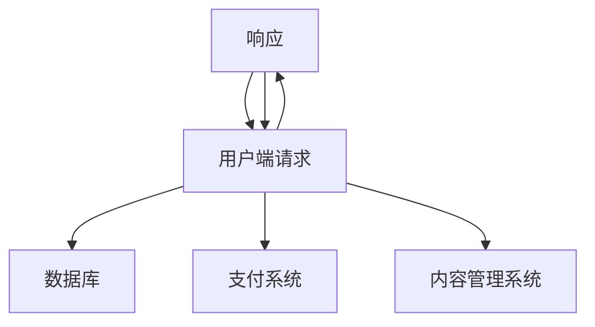
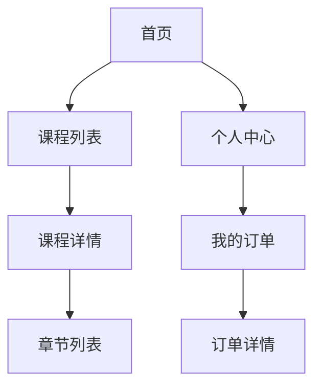

                 

# 如何打造个人知识付费平台

> **关键词：知识付费平台、个人品牌、内容推荐算法、用户行为分析、平台设计、营销策略**

> **摘要：本文将详细探讨如何打造一个个人知识付费平台，从市场分析到平台设计、开发及运营策略，全方位解析成功构建个人知识付费平台的关键步骤。**

### 目录大纲

#### 第一部分：基础知识与市场分析
1. **核心概念与联系**
    - **知识付费平台概述**
    - **市场分析与机会**
    - **个人知识付费平台的定义与特点**
    - **核心算法原理讲解**
    - **数学模型和数学公式**
    - **案例分析**

#### 第二部分：平台设计与开发
1. **平台架构设计**
    - **技术选型**
    - **系统架构图**
    - **关键模块解释**
2. **用户界面设计**
    - **用户界面设计原则**
    - **用户界面设计流程**
    - **界面原型设计**
3. **内容管理策略**
    - **内容审核机制**
    - **内容更新与维护**
    - **版权保护策略**
4. **核心算法实现**
    - **内容推荐算法实现**
    - **用户行为分析算法实现**
    - **算法优化与调参**
5. **平台测试与优化**
    - **功能测试**
    - **性能测试**
    - **安全测试**
    - **优化策略**

#### 第三部分：营销与运营
1. **品牌建设**
    - **品牌定位**
    - **品牌形象设计**
    - **品牌传播策略**
2. **用户获取策略**
    - **SEO优化**
    - **社交媒体营销**
    - **内容营销**
3. **用户留存策略**
    - **用户活跃度提升**
    - **用户反馈机制**
    - **忠诚度计划**
4. **收益模式探索**
    - **付费课程销售**
    - **广告收入**
    - **会员订阅模式**
    - **付费咨询与培训**

#### 第四部分：法律与合规
1. **知识产权保护**
    - **版权与商标保护**
    - **知识产权纠纷处理**
2. **用户隐私保护**
    - **数据收集与处理**
    - **用户隐私政策**
    - **合规要求**
3. **法律法规遵守**
    - **教育行业相关法规**
    - **电子商务法规**

#### 第五部分：案例分析与总结
1. **全球成功案例**
    - **案例介绍**
    - **成功原因分析**
2. **中国成功案例**
    - **案例介绍**
    - **成功原因分析**
3. **总结与展望**
    - **行业趋势**
    - **未来发展方向**
    - **挑战与机遇**

### 正文部分

#### 第一部分：基础知识与市场分析

##### 核心概念与联系

**知识付费平台概述**

知识付费平台是一种在线教育平台，它允许个人或机构提供各种知识内容，如课程、讲座、电子书等，并对其收费。这种平台通常具备以下几个核心功能：

1. **内容管理**：包括内容上传、分类、审核和更新。
2. **用户管理**：管理用户注册、登录、权限和个性化推荐。
3. **支付系统**：提供支付渠道，如信用卡、支付宝、微信支付等。
4. **互动功能**：包括评论、讨论、问答等。

**市场分析与机会**

知识付费市场近年来呈现出爆发式增长，特别是在COVID-19疫情背景下，线上教育需求大幅增加。以下是一些市场分析的关键点：

1. **用户需求**：随着人们对职业发展和终身学习的需求增加，知识付费平台提供了满足这些需求的机会。
2. **技术进步**：人工智能、大数据等技术的应用，使得个性化推荐、用户行为分析等成为可能，提高了用户体验和平台的盈利能力。
3. **政策支持**：各国政府纷纷出台支持在线教育的政策，为知识付费平台的发展提供了良好的外部环境。

**个人知识付费平台的定义与特点**

个人知识付费平台是由个人或小团队运营的知识付费平台，通常具有以下特点：

1. **专业性**：个人通常在其专业领域具有较高的声誉和影响力。
2. **灵活性**：个人知识付费平台可以根据用户需求灵活调整内容和课程。
3. **低成本**：相比大型教育平台，个人知识付费平台的运营成本较低。

**与一般教育平台的区别**

一般教育平台通常提供多样化的课程和服务，而个人知识付费平台则更加专注于个人品牌和专业领域的知识分享。此外，个人知识付费平台通常更注重用户体验和互动。

##### 核心算法原理讲解

**内容推荐算法**

内容推荐算法是知识付费平台的核心功能之一。以下是一些常用的推荐算法：

1. **协同过滤算法**：基于用户的历史行为和喜好进行推荐。包括用户基于用户的协同过滤（User-Based Collaborative Filtering）和基于项目的协同过滤（Item-Based Collaborative Filtering）。

   ```python
   # 伪代码：基于用户的协同过滤算法
   def user_based_cf(users, items, ratings):
       similar_users = find_similar_users(users, ratings)
       recommended_items = find_items_for_similar_users(similar_users, items, ratings)
       return recommended_items
   ```

2. **基于内容的推荐算法**：基于内容的相似性进行推荐，通过分析内容和用户的偏好进行匹配。

   ```python
   # 伪代码：基于内容的推荐算法
   def content_based_cf(content_features, user_preferences):
       similar_content = find_similar_content(content_features, user_preferences)
       recommended_items = find_items_with_similar_content(similar_content, content_features)
       return recommended_items
   ```

3. **组合推荐算法**：结合多种推荐算法，提高推荐效果。

   ```python
   # 伪代码：组合推荐算法
   def hybrid_recommender(content_based, collaborative_based):
       combined_recommendations = content_based + collaborative_based
       return combined_recommendations
   ```

**用户行为分析算法**

用户行为分析算法用于了解用户的行为模式，从而优化用户体验和提高用户留存率。以下是一些常用的用户行为分析算法：

1. **时间序列分析**：分析用户的行为数据，预测用户未来的行为。

   ```python
   # 伪代码：时间序列分析
   def time_series_analysis(user_data):
       patterns = identify_patterns(user_data)
       predictions = predict_future_behavior(patterns)
       return predictions
   ```

2. **机器学习预测模型**：使用机器学习算法，如决策树、随机森林、神经网络等，预测用户的行为。

   ```python
   # 伪代码：机器学习预测模型
   def machine_learning_model(data, labels):
       model = train_model(data, labels)
       predictions = model.predict(new_data)
       return predictions
   ```

##### 数学模型和数学公式

**用户满意度模型**

用户满意度是衡量知识付费平台成功的重要指标。以下是一个简单的用户满意度评分公式：

$$
满意度评分 = \frac{好评数}{(好评数 + 中评数 + 差评数)}
$$

**定价策略模型**

定价策略直接影响知识付费平台的盈利能力。以下是一个基于边际贡献率的定价策略模型：

$$
价格 = 变动成本 + 边际贡献率 \times 单位利润率
$$

其中，单位利润率 = (总收入 - 总成本) / 总收入

##### 案例分析

**成功案例分析**

- **Coursera**：作为一个全球领先的在线教育平台，Coursera通过优质的内容、多样化的课程和强大的技术支持，吸引了大量的用户。

- **Udemy**：Udemy以丰富的课程内容和灵活的定价策略，成为了个人和机构学习的重要平台。

**失败案例分析**

- **教育O2O平台**：一些早期的教育O2O平台由于没有正确把握用户需求，导致用户体验不佳，最终失败。

**案例分析总结**

成功案例的关键在于平台提供了高质量的内容、良好的用户体验和有效的营销策略。而失败案例则提醒我们在平台设计和运营过程中需要密切关注用户需求，不断优化产品和服务。

#### 第二部分：平台设计与开发

##### 平台架构设计

**技术选型**

在选择技术栈时，需要考虑以下几个方面：

1. **前端技术**：选择React、Vue.js或Angular等现代化前端框架。
2. **后端技术**：选择Node.js、Java或Python等后端技术栈。
3. **数据库**：选择MySQL、PostgreSQL或MongoDB等数据库系统。
4. **支付系统**：选择PayPal、支付宝或微信支付等支付服务提供商。

**系统架构图**

以下是一个简单的系统架构图：



**关键模块解释**

1. **用户管理模块**：负责用户注册、登录、权限管理和个性化推荐。
2. **内容管理模块**：负责内容上传、分类、审核和更新。
3. **支付系统模块**：负责处理支付请求和退款。
4. **推荐系统模块**：负责内容推荐和用户行为分析。

##### 用户界面设计

**用户界面设计原则**

1. **简洁性**：界面应该简洁明了，避免过多的干扰元素。
2. **一致性**：界面元素应保持一致性，提高用户体验。
3. **易用性**：界面设计应考虑用户的使用习惯，提高易用性。

**用户界面设计流程**

1. **需求分析**：收集用户需求和功能需求。
2. **原型设计**：使用工具如Figma、Sketch等制作界面原型。
3. **用户测试**：对原型进行用户测试，收集反馈。
4. **迭代优化**：根据用户反馈对界面进行优化。

**界面原型设计**

以下是一个简单的用户界面原型设计：



##### 内容管理策略

**内容审核机制**

1. **内容分类**：根据内容主题和类型进行分类。
2. **内容审核**：设置内容审核人员，对上传的内容进行审核。
3. **违规处理**：对违规内容进行处罚，如删除、屏蔽等。

**内容更新与维护**

1. **定期更新**：定期更新课程内容和相关资料。
2. **用户反馈**：收集用户反馈，优化课程内容。
3. **版权保护**：确保内容版权，避免侵权问题。

##### 核心算法实现

**内容推荐算法实现**

1. **协同过滤算法实现**：使用用户行为数据，实现用户基于用户和项目基于内容的协同过滤算法。
2. **基于内容的推荐算法实现**：使用内容特征，实现基于内容的推荐算法。
3. **组合推荐算法实现**：将协同过滤和基于内容的推荐算法结合，实现组合推荐算法。

**用户行为分析算法实现**

1. **时间序列分析实现**：使用时间序列分析方法，预测用户行为。
2. **机器学习预测模型实现**：使用机器学习算法，如决策树、随机森林等，预测用户行为。

##### 平台测试与优化

**功能测试**

1. **单元测试**：对代码模块进行测试。
2. **集成测试**：对整个平台进行测试。
3. **压力测试**：模拟大量用户访问，测试平台的性能。

**性能测试**

1. **响应时间测试**：测试平台的响应时间。
2. **并发测试**：测试平台处理并发请求的能力。
3. **负载测试**：模拟高负载场景，测试平台的稳定性。

**安全测试**

1. **漏洞扫描**：使用工具对平台进行漏洞扫描。
2. **代码审计**：对代码进行审计，查找潜在的安全漏洞。
3. **安全防护**：实施安全措施，如SSL加密、防火墙等。

**优化策略**

1. **代码优化**：优化代码结构，提高运行效率。
2. **缓存策略**：使用缓存策略，减少数据库访问。
3. **负载均衡**：使用负载均衡技术，提高系统可用性。

#### 第三部分：营销与运营

##### 品牌建设

**品牌定位**

1. **目标用户群体**：确定目标用户群体，如程序员、创业者、职场人士等。
2. **品牌理念**：确立品牌理念，如专业、实用、创新等。

**品牌形象设计**

1. **Logo设计**：设计简洁、易于记忆的Logo。
2. **色彩搭配**：选择符合品牌定位的色彩。
3. **视觉风格**：设计统一的视觉风格，包括字体、图标等。

**品牌传播策略**

1. **内容营销**：通过优质内容吸引目标用户，如博客、视频、电子书等。
2. **社交媒体营销**：利用社交媒体平台，如微博、微信公众号等，进行品牌传播。
3. **合作营销**：与其他品牌或机构合作，进行联合推广。

##### 用户获取策略

**SEO优化**

1. **关键词优化**：确定目标关键词，进行优化。
2. **内容优化**：优化网站内容，提高页面质量。
3. **外链建设**：增加网站外链，提高网站权重。

**社交媒体营销**

1. **社交媒体平台选择**：选择适合的平台，如微博、微信公众号、LinkedIn等。
2. **内容创作**：创作有价值的内容，吸引用户关注。
3. **互动营销**：与用户互动，提高用户参与度。

**内容营销**

1. **内容类型**：提供多种类型的内容，如博客、视频、电子书等。
2. **内容策略**：制定内容策略，确保内容与用户需求相关。
3. **内容推广**：通过社交媒体、电子邮件等渠道推广内容。

##### 用户留存策略

**用户活跃度提升**

1. **活跃用户奖励**：对活跃用户进行奖励，提高用户参与度。
2. **社区建设**：建立用户社区，促进用户交流。
3. **活动举办**：定期举办活动，提高用户活跃度。

**用户反馈机制**

1. **反馈渠道**：提供多种反馈渠道，如在线表单、社交媒体等。
2. **反馈处理**：及时处理用户反馈，解决问题。
3. **反馈结果**：向用户反馈处理结果，提高用户满意度。

**忠诚度计划**

1. **会员制度**：设立会员制度，提供会员专属优惠。
2. **积分系统**：建立积分系统，激励用户参与。
3. **专属服务**：为会员提供专属服务，提高会员满意度。

##### 收益模式探索

**付费课程销售**

1. **课程定价**：根据课程内容和市场需求定价。
2. **营销推广**：通过多种渠道进行营销推广。
3. **课程迭代**：定期更新课程内容，提高用户满意度。

**广告收入**

1. **广告位置**：选择合适的广告位置，提高广告效果。
2. **广告主选择**：选择合适的广告主，提高广告质量。
3. **广告收入分配**：合理分配广告收入，确保平台盈利。

**会员订阅模式**

1. **会员权益**：提供丰富的会员权益，吸引用户订阅。
2. **订阅定价**：根据会员权益定价。
3. **会员推广**：通过会员推广，提高会员数量。

**付费咨询与培训**

1. **专家团队**：建立专家团队，提供高质量咨询服务。
2. **咨询服务定价**：根据咨询内容和专家资质定价。
3. **培训课程**：提供培训课程，满足用户提升技能的需求。

#### 第四部分：法律与合规

##### 知识产权保护

**版权与商标保护**

1. **版权登记**：对原创内容进行版权登记，确保版权保护。
2. **商标注册**：对品牌标识进行商标注册，防止侵权行为。

**知识产权纠纷处理**

1. **纠纷预防**：制定知识产权保护策略，预防纠纷发生。
2. **法律咨询**：与专业律师合作，处理知识产权纠纷。
3. **法律诉讼**：在必要时采取法律手段，维护知识产权。

##### 用户隐私保护

**数据收集与处理**

1. **数据收集**：仅收集必要的数据，确保用户隐私。
2. **数据存储**：采用安全的数据存储措施，防止数据泄露。
3. **数据处理**：按照法律法规和用户隐私政策进行数据处理。

**用户隐私政策**

1. **政策制定**：制定用户隐私政策，明确用户数据的使用方式和范围。
2. **政策公示**：在平台醒目位置公示用户隐私政策。
3. **用户同意**：要求用户在注册和使用平台时同意隐私政策。

**合规要求**

1. **法律法规遵守**：遵守相关法律法规，如《网络安全法》、《个人信息保护法》等。
2. **合规培训**：对员工进行合规培训，提高合规意识。
3. **合规检查**：定期进行合规检查，确保平台合规运行。

##### 法律法规遵守

**教育行业相关法规**

1. **教育法**：遵守《中华人民共和国教育法》等教育行业相关法律法规。
2. **课程规范**：确保课程内容符合相关教育规范和标准。

**电子商务法规**

1. **电子商务法**：遵守《中华人民共和国电子商务法》，确保在线交易合法合规。
2. **消费者权益保护**：遵守《消费者权益保护法》，保障用户权益。

#### 第五部分：案例分析与总结

##### 全球成功案例

**案例介绍**

- **Coursera**：全球领先的在线教育平台，提供全球顶尖大学的课程。
- **Udemy**：提供多样化的在线课程，满足不同学习需求。

**成功原因分析**

- **优质内容**：提供高质量的课程内容，满足用户需求。
- **技术支持**：利用先进的技术，实现个性化推荐和用户体验优化。
- **营销策略**：通过内容营销、社交媒体营销等手段，提高品牌知名度。

##### 中国成功案例

**案例介绍**

- **网易云课堂**：提供丰富的在线课程，涵盖多个领域。
- **学堂在线**：提供高质量的在线课程，以学术性和实用性著称。

**成功原因分析**

- **本土化**：根据中国用户的需求，提供符合本土化需求的课程。
- **技术优势**：利用人工智能、大数据等技术，实现个性化推荐和用户体验优化。
- **政策支持**：受益于中国政府对在线教育的政策支持。

##### 总结与展望

**行业趋势**

- **在线教育普及**：随着技术的进步和互联网的普及，在线教育将继续普及。
- **个性化学习**：个性化推荐和智能学习将成为未来教育的重要趋势。
- **多元化收入模式**：除了付费课程，多元化收入模式（如广告、会员订阅等）将成为重要收入来源。

**未来发展方向**

- **技术创新**：持续投入技术，提高平台的技术水平和用户体验。
- **内容拓展**：拓展课程内容，满足用户多样化的学习需求。
- **国际化发展**：积极拓展国际市场，实现全球化布局。

**挑战与机遇**

- **内容质量**：保证内容质量，提高用户满意度。
- **合规风险**：遵守法律法规，降低合规风险。
- **市场竞争**：在激烈的市场竞争中，保持竞争力。

### 结论

本文详细探讨了如何打造一个个人知识付费平台，从市场分析、平台设计、开发及运营策略等方面进行了全面解析。通过成功案例的分析，我们看到了个人知识付费平台的发展前景。未来，随着技术的不断进步和市场的不断成熟，个人知识付费平台将迎来更多的发展机遇。

### 作者信息

**作者：AI天才研究院/AI Genius Institute & 禅与计算机程序设计艺术 /Zen And The Art of Computer Programming**

