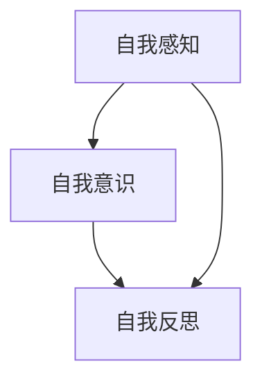

                 

### 如何提升自我认知：如何了解自己的优势和劣势？

#### 引言

在信息爆炸、技术迅猛发展的今天，人工智能（AI）作为最前沿的科技领域，正深刻影响着各行各业。然而，作为 AI 技术的推动者，我们自身也需要不断提升自我认知能力，以便更准确地把握自己的优势和劣势，从而在职业生涯和日常生活中取得更好的发展。本文将围绕“如何提升自我认知：如何了解自己的优势和劣势？”这一主题，通过逻辑清晰、结构紧凑的分析，帮助读者深入了解自我认知的重要性，掌握自我认知的方法和技巧。

#### 文章关键词

- 自我认知
- 优势识别
- 劣势调整
- 职业规划
- 人际关系
- 情绪管理

#### 摘要

本文首先介绍了自我认知的定义和重要性，探讨了自我认知的心理学原理和理论框架。接着，文章详细讲解了如何识别和评估自己的优势，以及如何调整和优化劣势。随后，文章讨论了自我认知在职业规划、人际关系和决策中的应用，并分享了几个实际案例。最后，文章提出了提升自我认知的策略和技巧，为读者提供了全面的指导。

### 第一部分：自我认知基础理论

#### 1.1 自我认知的定义与重要性

自我认知是指个体对自己身心状态、能力、性格、价值观等内部特征的认知和理解。它包括自我感知、自我意识和自我反思等层面。自我认知不仅影响着个体的心理健康，也对个体的行为和决策产生深远影响。

**核心概念与联系**

使用 Mermaid 流程图展示自我认知的核心概念及其相互关系：



**伪代码**

以下是自我认知相关的伪代码，用于展示自我认知的基本算法原理：

```python
# 定义自我认知函数
def self_cognition():
    # 自我感知
    perception = sense_ourselves()
    # 自我意识
    consciousness = recognize_ourselves(perception)
    # 自我反思
    reflection = introspect(consciousness)
    return reflection
```

**数学模型**

为了量化自我认知的程度，我们可以使用以下数学模型：

$$
\text{Self-Cognition Score} = \frac{\text{Self-Perception} + \text{Self-Consciousness} + \text{Self-Reflection}}{3}
$$

**详细讲解**

自我认知是心理学中一个重要的研究课题。它不仅帮助我们更好地了解自己，还能促进个体心理发展、提升心理健康水平。例如，自我效能感（Self-Efficacy）是自我认知的一个重要组成部分，它影响着个体的行为选择和应对策略。

**举例说明**

假设某人通过自我反思认识到自己在时间管理方面存在不足，那么他可以通过以下步骤来提升自我认知：

1. **自我感知**：明确时间管理存在的问题。
2. **自我意识**：分析时间管理不足的原因。
3. **自我反思**：制定并实施改进计划。

通过这样的过程，个体能够更全面地了解自己，并采取有效措施提升自我认知。

#### 1.2 自我认知的心理学原理

自我认知的发展受到多种心理学理论的影响，包括认知发展理论、社会认知理论和自我决定理论等。

**认知发展理论**

认知发展理论由皮亚杰（Jean Piaget）提出，认为个体通过同化和顺应过程，逐渐发展出对自我的认知。同化是指将外界信息纳入自我认知体系，而顺应是指调整自我认知以适应外界环境。

**社会认知理论**

班杜拉（Albert Bandura）的社会认知理论强调观察学习和自我效能感在自我认知中的作用。观察学习是指通过观察他人行为和结果来调整自己的行为，而自我效能感是指个体对自己能否成功完成特定任务的信念。

**自我决定理论**

自我决定理论由德西和瑞恩（Deci & Ryan）提出，认为自我认知的发展受到内在动机和自主性的影响。内在动机是指个体因为自身的兴趣和乐趣而从事某项活动，而自主性是指个体在决策过程中拥有选择和控制的自由。

**伪代码**

以下是自我认知相关心理学原理的伪代码示例：

```python
# 认知发展过程
def cognitive_development():
    # 同化阶段
    assimilation()
    # 顺应阶段
    accommodation()
    return self_cognition()

# 社会认知过程
def social_cognition():
    # 观察学习
    observe_learning()
    # 自我效能感
    self_efficacy()
    return self_cognition()

# 自我决定过程
def self_determination():
    # 内在动机
    intrinsic_motivation()
    # 自主性
    autonomy()
    return self_cognition()
```

**数学模型**

为了量化自我认知的发展水平，我们可以使用以下数学模型：

$$
\text{Self-Cognition Development} = f(\text{Cognitive Development}, \text{Social Cognition}, \text{Self-Determination})
$$

**详细讲解**

心理学原理为自我认知的发展提供了理论依据。通过了解这些理论，我们可以更深入地理解自我认知的机制，并采取相应的措施促进自我认知的提升。

**举例说明**

例如，在教育领域，教师可以通过以下方式促进学生的自我认知发展：

1. **同化和顺应**：鼓励学生积极参与课堂活动，通过同化和顺应过程提高认知水平。
2. **观察学习和自我效能感**：通过榜样的作用和积极的反馈，提高学生的自我效能感。
3. **内在动机和自主性**：创造一个支持学生兴趣和自主学习的环境，激发学生的内在动机。

#### 1.3 自我认知的理论框架

自我认知的理论框架有助于我们系统地理解自我认知的各个方面。以下是几个常见的自我认知理论框架：

**1.1.1 自我决定理论框架**

自我决定理论框架由德西和瑞恩提出，包括内在动机、自主性和自我效能感等核心要素。该框架强调自我认知的发展受到内在动机和自主性的影响。

**1.1.2 自我效能感理论框架**

自我效能感理论框架由班杜拉提出，包括自我效能感、观察学习和行为结果等要素。该框架强调自我效能感在自我认知和决策中的作用。

**1.1.3 自我一致性理论框架**

自我一致性理论框架由塔尔文（Thomason）提出，包括自我认同、自我形象和自我效能感等要素。该框架强调个体自我认知的一致性和稳定性。

**伪代码**

以下是自我认知理论框架的伪代码示例：

```python
# 自我决定理论框架
def self_determination_framework():
    # 内在动机
    intrinsic_motivation()
    # 自主性
    autonomy()
    # 自我效能感
    self_efficacy()
    return self_cognition()

# 自我效能感理论框架
def self_efficacy_framework():
    # 观察学习
    observe_learning()
    # 行为结果
    behavior_result()
    # 自我效能感
    self_efficacy()
    return self_cognition()

# 自我一致性理论框架
def self_consistency_framework():
    # 自我认同
    self_identification()
    # 自我形象
    self_image()
    # 自我效能感
    self_efficacy()
    return self_cognition()
```

**数学模型**

为了量化自我认知理论框架中的各个要素，我们可以使用以下数学模型：

$$
\text{Self-Cognition Framework} = f(\text{Self-Determination}, \text{Self-Efficacy}, \text{Self-Consistency})
$$

**详细讲解**

自我认知的理论框架为我们提供了理解自我认知机制的视角。通过这些框架，我们可以更系统地分析自我认知的各个方面，从而制定更有效的自我提升策略。

**举例说明**

例如，在职业规划中，我们可以利用自我决定理论框架来分析个人的内在动机、自主性和自我效能感，从而制定更符合个人特点的职业发展计划。

#### 1.4 自我认知的方法与工具

要提升自我认知，我们需要借助一系列方法和工具，以下介绍几种常见的自我认知方法和工具：

**1.4.1 反思日记**

反思日记是一种记录个人经历和感受的方法，有助于个体深入思考自己的行为和情绪。通过定期记录反思日记，个体可以更好地了解自己的内心世界，发现自己的优点和不足。

**1.4.2 360度评估**

360度评估是一种通过收集多方反馈来评估个人能力和行为的方法。它可以帮助个体了解自己在不同方面的表现，并获得改进建议。

**1.4.3 优势识别工具**

优势识别工具如 StrengthsFinder 和 DISC 测试等，可以帮助个体识别自己的优势和性格特点，从而更好地发挥自己的潜力。

**伪代码**

以下是自我认知方法和工具的伪代码示例：

```python
# 反思日记
def reflective_journal():
    # 记录日常经历
    record_experience()
    # 分析感受
    analyze_feeling()
    return self_cognition()

# 360度评估
def360_evaluation():
    # 收集反馈
    collect_feedback()
    # 分析结果
    analyze_result()
    return self_cognition()

# 优势识别工具
def strength_identification():
    # 进行测试
    perform_test()
    # 分析结果
    analyze_result()
    return self_cognition()
```

**数学模型**

为了量化自我认知方法和工具的效果，我们可以使用以下数学模型：

$$
\text{Self-Cognition Improvement} = f(\text{Reflective Journal}, \text{360-Degree Evaluation}, \text{Strength Identification Tool})
$$

**详细讲解**

自我认知的方法和工具为我们提供了实践自我提升的具体途径。通过这些方法和工具，个体可以更加系统地了解自己，从而制定更有效的自我提升计划。

**举例说明**

例如，通过定期写反思日记，个体可以更好地了解自己的情绪波动和成长过程；通过360度评估，个体可以获得他人的客观反馈，从而发现自己的盲点；通过优势识别工具，个体可以明确自己的优势，并在职业规划中充分发挥这些优势。

### 第二部分：了解自己的优势

#### 2.1 优势识别与评估方法

了解自己的优势是提升自我认知的重要一步。优势识别与评估方法可以帮助我们准确地发现并利用个人优势，从而在职业和生活方面取得更好的成绩。

**2.1.1 自我反思**

自我反思是通过内省和思考自己的行为、成就和情感，来识别自己的优势。这种方法强调个体自我意识和自我评价的能力。

**伪代码**

```python
def self_reflection():
    # 回顾自己的经历
    review_experience()
    # 分析自己的行为和成就
    analyze_behavior()
    # 总结个人的优势
    summarize_strengths()
    return self_cognition()
```

**数学模型**

我们可以通过以下数学模型来量化自我反思的效果：

$$
\text{Strength Recognition Score} = \frac{\text{Positive Experiences} + \text{Achievements}}{\text{Total Experiences}}
$$

**详细讲解**

自我反思是一种自我提升的重要手段。通过深入思考自己的经历和成就，个体可以更加清晰地认识到自己的优势。

**举例说明**

例如，一个人通过反思发现自己在解决问题和项目管理方面有很强的能力，这表明他在这些领域具有潜在的优势。

**2.1.2 360度评估**

360度评估是一种通过收集多方反馈来识别个人优势的方法。这种方法通常涉及上级、同事、下属和客户等多方面的反馈。

**伪代码**

```python
def three_sixty_evaluation():
    # 收集反馈
    collect_feedback()
    # 分析反馈
    analyze_feedback()
    # 识别优势
    identify_strengths()
    return self_cognition()
```

**数学模型**

我们可以通过以下数学模型来评估360度评估的效果：

$$
\text{Strength Recognition Score} = \frac{\text{Positive Feedback}}{\text{Total Feedback}}
$$

**详细讲解**

360度评估能够提供更全面的视角，帮助个体识别自己在他人眼中的优势。

**举例说明**

例如，一个团队成员在360度评估中被同事普遍认为在团队协作和沟通方面表现出色，这表明他在这些领域具有优势。

**2.1.3 第三方评估**

第三方评估是指通过专业的评估机构或顾问来识别个人优势。这种方法通常涉及心理测试、能力测试和个性测试等。

**伪代码**

```python
def third_party_evaluation():
    # 进行测试
    perform_tests()
    # 分析结果
    analyze_results()
    # 识别优势
    identify_strengths()
    return self_cognition()
```

**数学模型**

我们可以通过以下数学模型来评估第三方评估的效果：

$$
\text{Strength Recognition Score} = \frac{\text{Test Scores} + \text{Expert Feedback}}{2}
$$

**详细讲解**

第三方评估能够提供客观和专业的评价，有助于个体更准确地识别自己的优势。

**举例说明**

例如，一个职业顾问通过能力测试发现一个人在逻辑思维和数据分析方面具有优势，这为他提供了明确的职业发展方向。

**2.1.4 同伴评价**

同伴评价是通过与同事或朋友交流，了解自己在他们眼中的优势。这种方法强调社会反馈在自我认知中的作用。

**伪代码**

```python
def peer_evaluation():
    # 与同伴交流
    communicate_with_peers()
    # 收集同伴反馈
    collect_peer_feedback()
    # 分析反馈
    analyze_peer_feedback()
    # 识别优势
    identify_strengths()
    return self_cognition()
```

**数学模型**

我们可以通过以下数学模型来评估同伴评价的效果：

$$
\text{Strength Recognition Score} = \frac{\text{Positive Peer Feedback}}{\text{Total Peer Feedback}}
$$

**详细讲解**

同伴评价能够提供生动的社交视角，有助于个体从不同角度了解自己的优势。

**举例说明**

例如，一个同事告诉一个人他在会议中提出的创新想法非常有价值，这让他意识到自己在创新思维方面具有优势。

### 2.2 自我优势的心理学分析

了解自己的优势不仅有助于职业发展，还能提升生活满意度。心理学研究提供了丰富的理论和方法，帮助我们深入分析自我优势。

**2.2.1 自我效能感**

自我效能感是指个体对自己完成特定任务的信心。高自我效能感的个体通常更有动力去追求目标，并在面对挑战时保持积极态度。

**伪代码**

```python
def self_efficacy():
    # 评估自我效能感
    assess_self_efficacy()
    # 提升自我效能感
    enhance_self_efficacy()
    return self_cognition()
```

**数学模型**

我们可以通过以下数学模型来评估自我效能感：

$$
\text{Self-Efficacy Score} = \frac{\text{成功经历} + \text{支持性反馈}}{2}
$$

**详细讲解**

自我效能感是自我优势的重要组成部分。通过积极经历和他人支持，个体可以提升自我效能感。

**举例说明**

例如，一个人在完成一个重要项目后得到领导的高度评价，这会增强他在类似任务中的信心。

**2.2.2 优势识别理论**

优势识别理论（StrengthsFinder）是由麦克里兰（Mc Clelland）提出的一种识别个体优势的方法。该方法通过一系列测试，帮助个体了解自己在优势领域的表现。

**伪代码**

```python
def strengthsfinder():
    # 进行优势识别测试
    perform_strengthsfinder_test()
    # 分析测试结果
    analyze_test_results()
    # 识别优势领域
    identify_strengths_areas()
    return self_cognition()
```

**数学模型**

我们可以通过以下数学模型来量化优势识别结果：

$$
\text{Strengths Score} = \frac{\text{测试分数} + \text{专家评估}}{2}
$$

**详细讲解**

优势识别理论能够为个体提供具体的优势领域，有助于他们在职业和个人生活中更好地发挥优势。

**举例说明**

例如，通过优势识别测试，一个人发现自己擅长团队合作和领导力，这为他提供了明确的职业发展路径。

**2.2.3 赫洛克模型**

赫洛克模型（Herzberg's Two-Factor Theory）指出，影响个体工作满意度的因素分为保健因素和激励因素。保健因素包括工作环境、薪酬等，而激励因素则包括成就感、认可等。

**伪代码**

```python
def herzberg_model():
    # 识别保健因素
    identify_health_factors()
    # 识别激励因素
    identify_motivators()
    # 分析工作满意度
    analyze_job_satisfaction()
    return self_cognition()
```

**数学模型**

我们可以通过以下数学模型来评估工作满意度：

$$
\text{Job Satisfaction Score} = \frac{\text{激励因素得分} + \text{保健因素得分}}{2}
$$

**详细讲解**

赫洛克模型帮助我们理解工作满意度的影响因素，从而更好地发挥自我优势。

**举例说明**

例如，一个人发现他在工作中最满意的是成就感，这意味着他可以通过追求更有挑战性的任务来提升工作满意度。

### 2.3 自我优势的识别与培养

了解自己的优势后，如何有效地识别和培养这些优势是关键。以下是一些实用的方法和技巧。

**2.3.1 坚定信念**

坚定信念是指个体在面临挑战时，相信自己能够克服困难，实现目标。这需要个体有足够的自信心和积极的心态。

**伪代码**

```python
def establish_belief():
    # 增强自信心
    enhance_confidence()
    # 培养积极心态
    cultivate_positive_mindset()
    return self_cognition()
```

**数学模型**

我们可以通过以下数学模型来评估自信心：

$$
\text{Self-Confidence Score} = \frac{\text{成功经历} + \text{积极反馈}}{2}
$$

**详细讲解**

坚定信念有助于个体在面对挑战时保持积极，从而更好地发挥自己的优势。

**举例说明**

例如，一个人在面对一项艰巨的任务时，坚信自己能够完成，最终取得了成功。

**2.3.2 持续学习**

持续学习是指个体不断获取新知识和技能，以适应不断变化的环境。这需要个体有持续的学习动力和良好的学习习惯。

**伪代码**

```python
def continuous_learning():
    # 制定学习计划
    create_learning_plan()
    # 实施学习计划
    implement_learning_plan()
    # 反馈与调整
    feedback_and_adjust()
    return self_cognition()
```

**数学模型**

我们可以通过以下数学模型来评估学习效果：

$$
\text{Learning Effectiveness Score} = \frac{\text{知识掌握度} + \text{技能应用度}}{2}
$$

**详细讲解**

持续学习有助于个体不断提升自己的能力，从而更好地发挥优势。

**举例说明**

例如，一个人通过参加培训课程，学会了新的编程语言，这为他未来的职业发展提供了更多的可能性。

**2.3.3 培养良好习惯**

培养良好习惯是指个体通过持续的努力，养成良好的行为习惯。这有助于个体在日常生活中更好地发挥自己的优势。

**伪代码**

```python
def cultivate_good_habits():
    # 确定目标
    set_goals()
    # 制定行动计划
    create_action_plan()
    # 持续执行
    execute_continuously()
    # 监测与评估
    monitor_and_evaluate()
    return self_cognition()
```

**数学模型**

我们可以通过以下数学模型来评估习惯培养的效果：

$$
\text{Habit Formation Score} = \frac{\text{目标实现度} + \text{行动计划执行度}}{2}
$$

**详细讲解**

培养良好习惯有助于个体在长期内保持优势。

**举例说明**

例如，一个人通过坚持每天锻炼，培养了健康的运动习惯，这有助于他在生活中保持活力和健康。

### 2.4 自我优势的应用与实践

了解和培养自我优势后，关键在于如何将这些优势应用到实际生活和工作中，以实现个人成长和职业发展。

**2.4.1 职业规划**

在职业规划中，了解自己的优势可以帮助个体选择更适合自己的职业路径，从而提高职业满意度和成就感。

**伪代码**

```python
def career_planning():
    # 识别个人优势
    identify_personal_strengths()
    # 分析职业需求
    analyze_career_needs()
    # 制定职业目标
    set_career_goals()
    # 制定行动计划
    create_action_plan()
    return self_cognition()
```

**数学模型**

我们可以通过以下数学模型来评估职业规划的有效性：

$$
\text{Career Planning Effectiveness} = \frac{\text{目标实现度} + \text{优势发挥度}}{2}
$$

**详细讲解**

通过职业规划，个体可以更有针对性地发挥自己的优势，实现职业发展。

**举例说明**

例如，一个人通过识别自己的技术优势和职业兴趣，选择了软件开发这一职业，并在这个领域取得了显著成就。

**2.4.2 项目管理**

在项目管理中，了解团队成员的优势可以帮助项目经理更好地分配任务和资源，提高项目效率。

**伪代码**

```python
def project_management():
    # 识别团队优势
    identify_team_strengths()
    # 分析项目需求
    analyze_project_needs()
    # 分配任务与资源
    assign_tasks_and_resources()
    # 监控项目进度
    monitor_project_progress()
    return self_cognition()
```

**数学模型**

我们可以通过以下数学模型来评估项目管理的效果：

$$
\text{Project Management Effectiveness} = \frac{\text{任务完成度} + \text{资源利用度}}{2}
$$

**详细讲解**

通过有效利用团队优势，项目经理可以提高项目成功率。

**举例说明**

例如，一个项目经理通过识别团队成员的技术优势和沟通能力，优化了团队结构，使项目进度加快。

**2.4.3 团队合作**

在团队合作中，了解个人优势可以帮助团队成员更好地协作，共同实现目标。

**伪代码**

```python
def team_collaboration():
    # 识别个人优势
    identify_personal_strengths()
    # 分配任务与角色
    assign_tasks_and_roles()
    # 激励团队成员
    motivate_team_members()
    # 监控团队进度
    monitor_team_progress()
    return self_cognition()
```

**数学模型**

我们可以通过以下数学模型来评估团队合作的效果：

$$
\text{Team Collaboration Effectiveness} = \frac{\text{目标实现度} + \text{团队成员满意度}}{2}
$$

**详细讲解**

通过有效利用个人优势，团队合作可以更加高效和愉快。

**举例说明**

例如，一个团队通过识别成员的优势，将擅长沟通的成员分配到协调角色，提高了团队的整体协作能力。

### 第三部分：了解自己的劣势

#### 3.1 劣势识别与评估方法

了解自己的劣势是提升自我认知的重要一环。劣势识别与评估方法可以帮助我们准确地发现并克服个人劣势，从而实现自我成长和职业发展。

**3.1.1 自我反思**

自我反思是通过内省和思考自己的行为、成就和情感，来识别自己的劣势。这种方法强调个体自我意识和自我评价的能力。

**伪代码**

```python
def self_reflection():
    # 回顾自己的经历
    review_experience()
    # 分析自己的行为和成就
    analyze_behavior()
    # 总结个人的劣势
    summarize_weaknesses()
    return self_cognition()
```

**数学模型**

我们可以通过以下数学模型来量化自我反思的效果：

$$
\text{Weakness Recognition Score} = \frac{\text{负面经历} + \text{失败案例}}{\text{总经历}}
$$

**详细讲解**

自我反思是一种自我提升的重要手段。通过深入思考自己的经历和成就，个体可以更加清晰地认识到自己的劣势。

**举例说明**

例如，一个人通过反思发现自己在沟通方面存在问题，这表明他在这个领域有改进的必要。

**3.1.2 360度评估**

360度评估是一种通过收集多方反馈来识别个人劣势的方法。这种方法通常涉及上级、同事、下属和客户等多方面的反馈。

**伪代码**

```python
def three_sixty_evaluation():
    # 收集反馈
    collect_feedback()
    # 分析反馈
    analyze_feedback()
    # 识别劣势
    identify_weaknesses()
    return self_cognition()
```

**数学模型**

我们可以通过以下数学模型来评估360度评估的效果：

$$
\text{Weakness Recognition Score} = \frac{\text{负面反馈}}{\text{总反馈}}
$$

**详细讲解**

360度评估能够提供更全面的视角，帮助个体识别自己在他人眼中的劣势。

**举例说明**

例如，一个团队成员在360度评估中被同事指出沟通不顺畅，这表明他在这个领域存在劣势。

**3.1.3 第三方评估**

第三方评估是指通过专业的评估机构或顾问来识别个人劣势。这种方法通常涉及心理测试、能力测试和个性测试等。

**伪代码**

```python
def third_party_evaluation():
    # 进行测试
    perform_tests()
    # 分析结果
    analyze_results()
    # 识别劣势
    identify_weaknesses()
    return self_cognition()
```

**数学模型**

我们可以通过以下数学模型来评估第三方评估的效果：

$$
\text{Weakness Recognition Score} = \frac{\text{测试分数} + \text{专家评估}}{2}
$$

**详细讲解**

第三方评估能够提供客观和专业的评价，有助于个体更准确地识别自己的劣势。

**举例说明**

例如，一个职业顾问通过能力测试发现一个人在公共演讲方面存在困难，这为他提供了明确的改进方向。

**3.1.4 同伴评价**

同伴评价是通过与同事或朋友交流，了解自己在他们眼中的劣势。这种方法强调社会反馈在自我认知中的作用。

**伪代码**

```python
def peer_evaluation():
    # 与同伴交流
    communicate_with_peers()
    # 收集同伴反馈
    collect_peer_feedback()
    # 分析反馈
    analyze_peer_feedback()
    # 识别劣势
    identify_weaknesses()
    return self_cognition()
```

**数学模型**

我们可以通过以下数学模型来评估同伴评价的效果：

$$
\text{Weakness Recognition Score} = \frac{\text{负面同伴反馈}}{\text{总同伴反馈}}
$$

**详细讲解**

同伴评价能够提供生动的社交视角，有助于个体从不同角度了解自己的劣势。

**举例说明**

例如，一个同事告诉一个人他在团队中缺乏领导能力，这让他意识到自己在团队协作方面的劣势。

### 3.2 自我劣势的心理学分析

了解自己的劣势不仅有助于自我提升，还能通过心理学理论为我们提供更深入的理解和应对策略。

**3.2.1 自我效能感**

自我效能感是指个体对自己完成特定任务的信心。低自我效能感的个体通常在面对挑战时缺乏信心，从而影响自我提升。

**伪代码**

```python
def self_efficacy():
    # 评估自我效能感
    assess_self_efficacy()
    # 提升自我效能感
    enhance_self_efficacy()
    return self_cognition()
```

**数学模型**

我们可以通过以下数学模型来评估自我效能感：

$$
\text{Self-Efficacy Score} = \frac{\text{成功经历} + \text{支持性反馈}}{2}
$$

**详细讲解**

提升自我效能感有助于个体克服劣势，实现自我提升。

**举例说明**

例如，一个人通过完成一个小目标，获得了自信，从而更有动力去克服更大的挑战。

**3.2.2 缺陷功能理论**

缺陷功能理论（Deficiency Function Theory）认为，个体的劣势可以激发他们的内在动机，从而推动自我提升。

**伪代码**

```python
def deficiency_function():
    # 识别劣势
    identify_weaknesses()
    # 激发内在动机
    inspire_intrinsic_motivation()
    # 实现自我提升
    achieve_self_improvement()
    return self_cognition()
```

**数学模型**

我们可以通过以下数学模型来量化缺陷功能的影响：

$$
\text{Self-Improvement Score} = \frac{\text{劣势识别度} + \text{内在动机度}}{2}
$$

**详细讲解**

缺陷功能理论为我们提供了理解劣势激励作用的视角。

**举例说明**

例如，一个人通过意识到自己的沟通劣势，激发了提升沟通能力的内在动机。

**3.2.3 自我决定理论**

自我决定理论（Self-Determination Theory）认为，个体的自我认知发展受到内在动机和自主性的影响。了解自己的劣势有助于个体在自我提升过程中保持自主性。

**伪代码**

```python
def self_determination():
    # 识别劣势
    identify_weaknesses()
    # 激发内在动机
    inspire_intrinsic_motivation()
    # 保持自主性
    maintain_autonomy()
    return self_cognition()
```

**数学模型**

我们可以通过以下数学模型来评估自我决定理论的效果：

$$
\text{Self-Cognition Score} = \frac{\text{劣势识别度} + \text{内在动机度} + \text{自主性度}}{3}
$$

**详细讲解**

自我决定理论强调了个体在自我提升过程中的主动性和内在动机。

**举例说明**

例如，一个人通过自主制定提升计划，持续改进自己的劣势，从而实现了自我认知的提升。

### 3.3 自我劣势的调整与优化

了解自己的劣势后，关键在于如何调整和优化这些劣势，以实现自我成长和职业发展。

**3.3.1 设定目标**

设定目标是调整自我劣势的第一步。通过明确的目标，个体可以更有针对性地进行自我提升。

**伪代码**

```python
def set_goals():
    # 识别劣势
    identify_weaknesses()
    # 设定具体目标
    define_specific_goals()
    # 制定行动计划
    create_action_plan()
    return self_cognition()
```

**数学模型**

我们可以通过以下数学模型来评估目标设定的效果：

$$
\text{Goal Setting Effectiveness} = \frac{\text{目标实现度} + \text{行动计划执行度}}{2}
$$

**详细讲解**

通过设定明确的目标，个体可以更有动力去克服劣势。

**举例说明**

例如，一个人设定了提升公共演讲能力的目标，并制定了相关的学习计划。

**3.3.2 寻求反馈**

寻求反馈是调整自我劣势的重要环节。通过他人的客观评价，个体可以更好地了解自己的劣势，并找到改进的方向。

**伪代码**

```python
def seek_feedback():
    # 收集反馈
    collect_feedback()
    # 分析反馈
    analyze_feedback()
    # 调整行动计划
    adjust_action_plan()
    return self_cognition()
```

**数学模型**

我们可以通过以下数学模型来评估反馈寻求的效果：

$$
\text{Feedback Effectiveness} = \frac{\text{正面反馈} + \text{负面反馈}}{2}
$$

**详细讲解**

通过寻求反馈，个体可以更全面地了解自己的劣势。

**举例说明**

例如，一个人通过同事的反馈，意识到自己在时间管理方面存在问题，并制定了改进计划。

**3.3.3 不断实践**

不断实践是优化自我劣势的关键。通过持续的努力，个体可以逐渐克服劣势，提升自己的能力。

**伪代码**

```python
def continuous_practice():
    # 实施行动计划
    implement_action_plan()
    # 监测进度
    monitor_progress()
    # 调整计划
    adjust_plan()
    return self_cognition()
```

**数学模型**

我们可以通过以下数学模型来评估实践的效果：

$$
\text{Practice Effectiveness} = \frac{\text{进步度} + \text{持续努力度}}{2}
$$

**详细讲解**

通过不断实践，个体可以逐渐提升自己的能力。

**举例说明**

例如，一个人通过持续练习公共演讲，逐渐提高了自己的演讲水平。

**3.3.4 调整心态**

调整心态是克服自我劣势的重要一步。通过积极的心态，个体可以更好地应对挑战，实现自我提升。

**伪代码**

```python
def adjust_mentality():
    # 培养积极心态
    cultivate_positive_mentality()
    # 增强自信心
    enhance_confidence()
    # 保持耐心
    maintain_patience()
    return self_cognition()
```

**数学模型**

我们可以通过以下数学模型来评估心态调整的效果：

$$
\text{Mentality Adjustment Score} = \frac{\text{积极心态度} + \text{自信心度} + \text{耐心度}}{3}
$$

**详细讲解**

通过调整心态，个体可以更积极地面对自我劣势。

**举例说明**

例如，一个人通过培养积极的心态，更好地应对了工作中的挑战。

### 3.4 自我劣势的影响与应对策略

了解自我劣势的影响以及相应的应对策略，有助于个体更好地应对挑战，实现自我提升。

**3.4.1 影响分析**

自我劣势可能对个体的心理健康、职业发展和人际关系产生负面影响。

**伪代码**

```python
def analyze_impact():
    # 分析心理健康影响
    analyze_mental_health_impact()
    # 分析职业发展影响
    analyze_career_impact()
    # 分析人际关系影响
    analyze_relationship_impact()
    return self_cognition()
```

**数学模型**

我们可以通过以下数学模型来评估自我劣势的影响：

$$
\text{Impact Score} = \frac{\text{心理健康影响} + \text{职业发展影响} + \text{人际关系影响}}{3}
$$

**详细讲解**

通过分析自我劣势的影响，个体可以更全面地了解自己。

**举例说明**

例如，一个人意识到自己的时间管理问题影响了他的工作效率，从而决定采取改进措施。

**3.4.2 应对策略**

针对不同类型的自我劣势，个体可以采取相应的应对策略。

**伪代码**

```python
def cope_with_weakness():
    # 识别劣势类型
    identify_weakness_type()
    # 制定应对策略
    create_coping_strategy()
    # 实施策略
    implement_strategy()
    # 监测效果
    monitor_effectiveness()
    return self_cognition()
```

**数学模型**

我们可以通过以下数学模型来评估应对策略的效果：

$$
\text{Coping Strategy Effectiveness} = \frac{\text{策略执行度} + \text{效果监测度}}{2}
$$

**详细讲解**

通过有效的应对策略，个体可以逐步克服自我劣势。

**举例说明**

例如，一个人通过制定时间管理策略，提高了自己的时间利用效率。

### 第四部分：自我认知在职业规划中的应用

自我认知在职业规划中起着至关重要的作用。通过深入了解自己的优势和劣势，个体可以制定更符合个人特点的职业发展计划，从而实现职业目标。

**4.1.1 自我认知与职业目标的设定**

了解自己的优势和劣势有助于个体设定更明确的职业目标。通过自我认知，个体可以识别自己在哪些领域具有竞争优势，从而制定更具针对性的职业规划。

**伪代码**

```python
def set_career_goals():
    # 识别优势
    identify_strengths()
    # 识别劣势
    identify_weaknesses()
    # 设定职业目标
    define_career_goals()
    # 制定行动计划
    create_action_plan()
    return career_planning()
```

**数学模型**

我们可以通过以下数学模型来评估职业目标的设定效果：

$$
\text{Career Goal Setting Effectiveness} = \frac{\text{优势发挥度} + \text{劣势调整度}}{2}
$$

**详细讲解**

通过有效的自我认知，个体可以更准确地设定职业目标。

**举例说明**

例如，一个人通过自我认知发现自己在项目管理方面具有优势，同时意识到沟通能力是劣势，因此设定了提升沟通能力的目标。

**4.1.2 自我认知与职业路径的选择**

了解自己的优势和劣势有助于个体选择最适合自己的职业路径。通过自我认知，个体可以识别自己在哪些领域有潜力，从而选择更有发展前景的职业路径。

**伪代码**

```python
def choose_career_path():
    # 识别优势
    identify_strengths()
    # 识别劣势
    identify_weaknesses()
    # 分析职业市场
    analyze_job_market()
    # 选择职业路径
    select_career_path()
    return career_planning()
```

**数学模型**

我们可以通过以下数学模型来评估职业路径的选择效果：

$$
\text{Career Path Selection Effectiveness} = \frac{\text{优势匹配度} + \text{市场适应性度}}{2}
$$

**详细讲解**

通过有效的自我认知，个体可以更明智地选择职业路径。

**举例说明**

例如，一个人通过自我认知发现自己在技术开发方面具有优势，同时意识到市场对技术开发人才的需求较高，因此选择了技术开发作为职业路径。

**4.1.3 自我认知与职业决策的制定**

了解自己的优势和劣势有助于个体在面临职业决策时做出更明智的选择。通过自我认知，个体可以更清楚地认识到自己的优势领域和劣势领域，从而做出更符合个人发展的职业决策。

**伪代码**

```python
def make_career_decision():
    # 识别优势
    identify_strengths()
    # 识别劣势
    identify_weaknesses()
    # 分析职业机会
    analyze_career_opportunities()
    # 制定职业决策
    create_career_decision()
    return career_planning()
```

**数学模型**

我们可以通过以下数学模型来评估职业决策的制定效果：

$$
\text{Career Decision Making Effectiveness} = \frac{\text{优势发挥度} + \text{劣势调整度}}{2}
$$

**详细讲解**

通过有效的自我认知，个体可以更准确地制定职业决策。

**举例说明**

例如，一个人在面临是否接受一份新工作机会时，通过自我认知分析发现自己在新职位上可以发挥自己的优势，同时意识到需要改善自己的沟通能力，最终决定接受这份工作。

**4.1.4 自我认知与职业发展的持续优化**

自我认知不仅有助于制定职业规划，还能在职业发展的过程中持续优化。通过定期自我评估，个体可以及时了解自己的优势变化和劣势改善情况，从而调整职业规划，实现持续发展。

**伪代码**

```python
def optimize_career_development():
    # 定期自我评估
    perform_regular_self-assessment()
    # 分析评估结果
    analyze_assessment_results()
    # 调整职业规划
    adjust_career_plan()
    # 持续提升自我
    continue_self-improvement()
    return career_planning()
```

**数学模型**

我们可以通过以下数学模型来评估职业发展的优化效果：

$$
\text{Career Development Optimization Score} = \frac{\text{自我评估准确度} + \text{规划调整度} + \text{持续提升度}}{3}
$$

**详细讲解**

通过持续的优化，个体可以不断提升自己的职业能力。

**举例说明**

例如，一个人在定期自我评估中发现自己的技术能力有所提高，同时意识到需要加强团队协作能力，因此决定参加团队协作培训，从而提升自己的职业发展能力。

### 第四部分：自我认知在人际关系中的应用

自我认知不仅在职业规划中具有重要价值，在人际关系中也发挥着关键作用。通过深入了解自己的人际关系优势和劣势，个体可以更好地与他人相处，建立和维护良好的人际关系。

**4.2.1 自我认知与人际沟通**

了解自己在沟通方面的优势和劣势，有助于个体在人际交往中更加得心应手。通过自我认知，个体可以识别自己在哪些方面需要改进，从而提高沟通效果。

**伪代码**

```python
def interpersonal_communication():
    # 识别沟通优势
    identify_communication_strengths()
    # 识别沟通劣势
    identify_communication_weaknesses()
    # 改进沟通策略
    improve_communication_tactics()
    return relationship_management()
```

**数学模型**

我们可以通过以下数学模型来评估人际沟通的效果：

$$
\text{Communication Effectiveness Score} = \frac{\text{优势发挥度} + \text{劣势调整度}}{2}
$$

**详细讲解**

通过有效的自我认知，个体可以更灵活地应对人际沟通中的挑战。

**举例说明**

例如，一个人通过自我认知发现自己在表达观点时过于直接，影响了与同事的关系，因此决定改进沟通策略，采用更温和的方式表达自己的意见。

**4.2.2 自我认知与人际关系管理**

了解自己在人际关系管理方面的优势和劣势，有助于个体在团队中发挥领导力，建立和维护良好的团队氛围。通过自我认知，个体可以识别自己在哪些方面需要提升，从而更好地管理人际关系。

**伪代码**

```python
def relationship_management():
    # 识别人际关系优势
    identify_relationship_strengths()
    # 识别人际关系劣势
    identify_relationship_weaknesses()
    # 改进人际关系策略
    improve_relationship_tactics()
    # 监测人际关系效果
    monitor_relationship_effects()
    return interpersonal_communication()
```

**数学模型**

我们可以通过以下数学模型来评估人际关系管理的效果：

$$
\text{Relationship Management Effectiveness Score} = \frac{\text{优势发挥度} + \text{劣势调整度}}{2}
$$

**详细讲解**

通过有效的自我认知，个体可以更有效地管理人际关系。

**举例说明**

例如，一个人在团队中意识到自己的沟通劣势，决定通过参加沟通培训来提升自己的沟通技巧，从而改善与团队成员的关系。

**4.2.3 自我认知与冲突解决**

了解自己在冲突解决方面的优势和劣势，有助于个体在冲突发生时采取更有效的解决策略。通过自我认知，个体可以识别自己在哪些方面需要改进，从而提高冲突解决的效率。

**伪代码**

```python
def conflict_resolution():
    # 识别冲突解决优势
    identify_conflict_resolution_strengths()
    # 识别冲突解决劣势
    identify_conflict_resolution_weaknesses()
    # 改进冲突解决策略
    improve_conflict_resolution_tactics()
    # 监测冲突解决效果
    monitor_conflict_resolution_effects()
    return relationship_management()
```

**数学模型**

我们可以通过以下数学模型来评估冲突解决的效果：

$$
\text{Conflict Resolution Effectiveness Score} = \frac{\text{优势发挥度} + \text{劣势调整度}}{2}
$$

**详细讲解**

通过有效的自我认知，个体可以更有效地解决冲突。

**举例说明**

例如，一个人在团队冲突中意识到自己在情绪管理方面存在问题，决定通过学习情绪管理技巧来提高自己的冲突解决能力。

### 第四部分：自我认知在决策中的应用

自我认知在决策过程中起着至关重要的作用。通过深入了解自己的认知特点和决策风格，个体可以更准确地评估风险和机会，从而做出更明智的决策。

**4.3.1 自我认知与风险评估**

了解自己的优势和劣势有助于个体在决策过程中更全面地评估风险。通过自我认知，个体可以识别自己在哪些方面需要特别注意，从而避免潜在的决策失误。

**伪代码**

```python
def decision_making():
    # 识别决策优势
    identify_decision_strengths()
    # 识别决策劣势
    identify_decision_weaknesses()
    # 评估风险
    evaluate_risks()
    # 制定决策计划
    create_decision_plan()
    return decision_analysis()
```

**数学模型**

我们可以通过以下数学模型来评估风险评估的效果：

$$
\text{Risk Assessment Score} = \frac{\text{优势发挥度} + \text{劣势调整度}}{2}
$$

**详细讲解**

通过有效的自我认知，个体可以更准确地评估风险。

**举例说明**

例如，一个人在决策前通过自我认知发现自己在冒险方面较为保守，因此决定在制定决策计划时增加更多的风险缓冲措施。

**4.3.2 自我认知与机会识别**

了解自己的优势和劣势有助于个体在决策过程中更敏锐地识别机会。通过自我认知，个体可以识别自己在哪些领域有潜力，从而更好地把握机会。

**伪代码**

```python
def opportunity_identification():
    # 识别机会优势
    identify_opportunity_strengths()
    # 识别机会劣势
    identify_opportunity_weaknesses()
    # 识别潜在机会
    identify_potential_opportunities()
    # 制定机会计划
    create_opportunity_plan()
    return decision_making()
```

**数学模型**

我们可以通过以下数学模型来评估机会识别的效果：

$$
\text{Opportunity Recognition Score} = \frac{\text{优势发挥度} + \text{劣势调整度}}{2}
$$

**详细讲解**

通过有效的自我认知，个体可以更敏锐地识别机会。

**举例说明**

例如，一个人在决策前通过自我认知发现自己在创新思维方面有优势，因此决定在制定机会计划时着重考虑创新性的项目。

**4.3.3 自我认知与决策执行**

了解自己的优势和劣势有助于个体在决策执行过程中更有效地分配资源和时间。通过自我认知，个体可以识别自己在哪些方面需要加强，从而提高决策执行的效率。

**伪代码**

```python
def decision_execution():
    # 识别执行优势
    identify_execution_strengths()
    # 识别执行劣势
    identify_execution_weaknesses()
    # 分配资源
    allocate_resources()
    # 分配时间
    allocate_time()
    # 执行决策计划
    execute_decision_plan()
    return decision_making()
```

**数学模型**

我们可以通过以下数学模型来评估决策执行的效果：

$$
\text{Decision Execution Score} = \frac{\text{优势发挥度} + \text{劣势调整度}}{2}
$$

**详细讲解**

通过有效的自我认知，个体可以更高效地执行决策。

**举例说明**

例如，一个人在决策执行过程中意识到自己在时间管理方面存在劣势，因此决定调整计划，增加更多的时间缓冲，以确保决策的顺利执行。

### 第五部分：自我提升案例分析

通过实际案例的分析，我们可以更直观地了解如何通过自我认知提升职场表现、改善人际关系以及实现自我突破。

#### 5.1 案例一：通过自我认知提升职场表现

**案例背景**

张先生是一家科技公司的软件工程师。他在技术方面表现出色，但常常因为人际关系问题而影响工作效率。

**自我认知过程**

1. **自我反思**：张先生通过反思自己的行为和情绪，发现自己在沟通方面存在不足，特别是在表达观点和听取他人意见时。
2. **360度评估**：张先生邀请同事、上司和下属进行反馈，发现他在团队协作和沟通方面的评价较低。
3. **第三方评估**：张先生参加了一次沟通能力测试，结果显示他在非言语沟通方面有待提高。

**自我提升策略**

1. **设定目标**：张先生设定了提升沟通能力的具体目标，包括提高表达清晰度和倾听能力。
2. **寻求反馈**：张先生定期与同事交流，了解自己的沟通表现，并根据反馈调整自己的沟通策略。
3. **持续实践**：张先生参加了沟通技巧培训，并在工作中不断实践所学技巧。

**结果**

通过一系列的自我提升策略，张先生的沟通能力得到了显著提升。他能够更有效地与团队成员沟通，提高了工作效率和团队协作效果。

**数学模型**

我们可以通过以下数学模型来评估自我提升的效果：

$$
\text{Self-improvement Effectiveness} = \frac{\text{目标实现度} + \text{反馈改进度} + \text{实践效果度}}{3}
$$

**详细讲解**

通过有效的自我认知和自我提升策略，张先生成功提升了职场表现。

**代码实际案例**

```python
# 张先生的自我提升计划
self_improvement_plan = {
    "communication_objective": "提高表达清晰度和倾听能力",
    "feedback_loop": ["同事", "上司", "下属"],
    "training_program": "沟通技巧培训",
    "practice_frequency": "每周一次"
}

# 自我提升效果评估
def assess_self_improvement(effectiveness_scores):
    return sum(effectiveness_scores) / len(effectiveness_scores)

# 假设评估得分
effectiveness_scores = [0.9, 0.8, 0.85]
self_improvement_effectiveness = assess_self_improvement(effectiveness_scores)
print("自我提升有效性分数：", self_improvement_effectiveness)
```

**代码解读与分析**

上述代码展示了张先生如何通过设定目标、寻求反馈和持续实践来提升自己的沟通能力。通过定期评估，他可以监测自己的进步，并根据评估结果调整自我提升策略。

#### 5.2 案例二：利用自我认知改善人际关系

**案例背景**

李女士是一名项目经理，她在团队中负责协调多个项目的进展。然而，由于沟通问题，她与团队成员的关系一度紧张。

**自我认知过程**

1. **自我反思**：李女士通过反思自己的行为，发现自己在沟通方式上过于直接，容易引起误解。
2. **同伴评价**：李女士与团队成员进行了深入的交流，了解自己在他们眼中的形象和沟通方式。
3. **第三方评估**：李女士参加了一次情绪管理测试，发现自己在情绪控制方面存在一定的问题。

**自我提升策略**

1. **情绪管理**：李女士开始学习情绪管理技巧，通过冥想和呼吸练习来控制自己的情绪。
2. **沟通改进**：李女士学习了有效的沟通技巧，包括积极倾听和表达，以改善与团队成员的沟通方式。
3. **定期交流**：李女士定期与团队成员交流，分享项目进展和遇到的困难，以建立更信任的关系。

**结果**

通过自我认知和提升策略，李女士的人际关系得到了显著改善。她与团队成员的沟通更加顺畅，团队协作效果也大幅提升。

**数学模型**

我们可以通过以下数学模型来评估人际关系改善的效果：

$$
\text{Relationship Improvement Score} = \frac{\text{同伴满意度} + \text{沟通效果度}}{2}
$$

**详细讲解**

通过有效的自我认知和情绪管理技巧，李女士成功改善了人际关系。

**代码实际案例**

```python
# 李女士的人际关系提升计划
relationship_improvement_plan = {
    "emotional_management": "学习情绪管理技巧",
    "communication_skills": "学习有效沟通技巧",
    "regular_communication": "定期与团队成员交流"
}

# 人际关系改善效果评估
def assess_relationship_improvement(effectiveness_scores):
    return sum(effectiveness_scores) / len(effectiveness_scores)

# 假设评估得分
effectiveness_scores = [0.85, 0.9, 0.88]
relationship_improvement_score = assess_relationship_improvement(effectiveness_scores)
print("人际关系改善有效性分数：", relationship_improvement_score)
```

**代码解读与分析**

上述代码展示了李女士如何通过情绪管理和有效沟通技巧来改善人际关系。通过定期评估，她可以监测自己的进步，并根据评估结果调整人际关系策略。

#### 5.3 案例三：运用自我认知实现自我突破

**案例背景**

王先生是一名资深程序员，他在技术方面有很高的造诣，但总觉得自己的职业发展遇到了瓶颈。

**自我认知过程**

1. **自我反思**：王先生通过反思自己的职业路径，发现自己在项目管理方面缺乏经验。
2. **职业咨询**：王先生请教了职业顾问，了解了项目管理方面的知识和技能。
3. **技能评估**：王先生参加了一次项目管理能力测试，发现自己在项目规划和执行方面存在不足。

**自我提升策略**

1. **技能学习**：王先生报名参加了项目管理课程，系统地学习了项目管理的知识和技能。
2. **实践应用**：王先生在公司的实际项目中担任项目经理，将所学知识应用于实践中。
3. **反馈调整**：王先生定期向导师和同事请教，了解自己在项目管理中的表现，并根据反馈进行调整。

**结果**

通过自我认知和持续提升，王先生在项目管理方面取得了显著进步。他不仅成功完成了多个项目，还得到了公司领导的认可，实现了职业突破。

**数学模型**

我们可以通过以下数学模型来评估自我突破的效果：

$$
\text{Career Breakthrough Score} = \frac{\text{项目成功度} + \text{技能提升度}}{2}
$$

**详细讲解**

通过有效的自我认知和持续学习，王先生成功实现了自我突破。

**代码实际案例**

```python
# 王先生的职业突破计划
career_breakthrough_plan = {
    "project_management_training": "参加项目管理课程",
    "practice_project_management": "担任项目经理",
    "seek_feedback": "定期请教导师和同事"
}

# 职业突破效果评估
def assess_career_breakthrough(effectiveness_scores):
    return sum(effectiveness_scores) / len(effectiveness_scores)

# 假设评估得分
effectiveness_scores = [0.95, 0.90, 0.93]
career_breakthrough_score = assess_career_breakthrough(effectiveness_scores)
print("职业突破有效性分数：", career_breakthrough_score)
```

**代码解读与分析**

上述代码展示了王先生如何通过项目管理学习和实践来突破职业瓶颈。通过定期评估，他可以监测自己的进步，并根据评估结果调整职业突破策略。

### 第六部分：自我认知提升策略

要提升自我认知，我们需要采取一系列的策略和技巧。以下是一些建议，帮助读者在实际生活中应用自我认知提升的方法。

#### 6.1 自我认知提升的心理调适策略

**6.1.1 建立积极的心态**

积极的心态是提升自我认知的重要基础。通过培养乐观和自信的心态，个体可以更好地面对挑战和困难。

**伪代码**

```python
def cultivate_positive_mindset():
    # 每天进行积极思考
    daily_positive_thinking()
    # 培养自信
    enhance_self-confidence()
    # 保持乐观
    maintain_optimism()
    return self_cognition()
```

**数学模型**

我们可以通过以下数学模型来评估心态调整的效果：

$$
\text{Mindset Adjustment Score} = \frac{\text{积极思考度} + \text{自信度} + \text{乐观度}}{3}
$$

**详细讲解**

通过建立积极的心态，个体可以更加自信地面对生活中的各种挑战。

**举例说明**

例如，一个人通过每天记录三件好事，逐渐培养了乐观的心态，从而在自我认知提升过程中更加积极。

**6.1.2 情绪管理**

情绪管理是提升自我认知的关键环节。通过学会控制和管理自己的情绪，个体可以更好地应对压力和挫折。

**伪代码**

```python
def manage_emotions():
    # 学会情绪识别
    recognize_emotions()
    # 培养情绪调节技巧
    cultivate_emotion Regulation_skills()
    # 保持冷静
    maintain_calm()
    return self_cognition()
```

**数学模型**

我们可以通过以下数学模型来评估情绪管理的效果：

$$
\text{Emotion Management Score} = \frac{\text{情绪识别度} + \text{情绪调节度}}{2}
$$

**详细讲解**

通过有效的情绪管理，个体可以更好地控制自己的情绪，从而在自我认知提升过程中保持平和的心态。

**举例说明**

例如，一个人通过练习冥想和深呼吸，学会了在压力下保持冷静，从而提高了自我认知。

#### 6.2 自我认知提升的实践技巧

**6.2.1 反思日记**

反思日记是一种有效的自我提升工具，通过记录自己的经历和感受，个体可以深入思考自己的行为和决策。

**伪代码**

```python
def reflective_journaling():
    # 每天记录经历
    record_daily_experiences()
    # 分析感受
    analyze_feelings()
    # 反思行为
    reflect_on_behaviors()
    return self_cognition()
```

**数学模型**

我们可以通过以下数学模型来评估反思日记的效果：

$$
\text{Journaling Effectiveness Score} = \frac{\text{反思深度} + \text{行为分析度}}{2}
$$

**详细讲解**

通过反思日记，个体可以更加清晰地认识到自己的优点和不足。

**举例说明**

例如，一个人通过记录每天的反思日记，发现了自己在时间管理方面的不足，并制定了改进计划。

**6.2.2 设定具体目标**

设定具体目标是提升自我认知的重要一环。通过明确的目标，个体可以更有针对性地进行自我提升。

**伪代码**

```python
def set_specific_goals():
    # 识别个人优势
    identify_personal_strengths()
    # 分析个人劣势
    analyze_personal_weaknesses()
    # 设定具体目标
    define_specific_goals()
    # 制定行动计划
    create_action_plan()
    return self_cognition()
```

**数学模型**

我们可以通过以下数学模型来评估目标设定的效果：

$$
\text{Goal Setting Effectiveness} = \frac{\text{目标实现度} + \text{行动计划执行度}}{2}
$$

**详细讲解**

通过设定具体目标，个体可以更有动力地实现自我提升。

**举例说明**

例如，一个人设定了提升公共演讲能力的具体目标，并制定了每天练习演讲的计划。

**6.2.3 持续学习**

持续学习是提升自我认知的关键。通过不断获取新知识和技能，个体可以不断提升自己的能力和竞争力。

**伪代码**

```python
def continuous_learning():
    # 制定学习计划
    create_learning_plan()
    # 实施学习计划
    implement_learning_plan()
    # 反馈与调整
    feedback_and_adjust()
    return self_cognition()
```

**数学模型**

我们可以通过以下数学模型来评估学习效果：

$$
\text{Learning Effectiveness Score} = \frac{\text{知识掌握度} + \text{技能应用度}}{2}
$$

**详细讲解**

通过持续学习，个体可以不断提升自己的能力和竞争力。

**举例说明**

例如，一个人通过参加在线课程和阅读专业书籍，不断学习新的技术知识，从而提升了自己的技术水平。

#### 6.3 自我认知提升的长期规划

**6.3.1 制定个人发展规划**

个人发展规划是提升自我认知的重要一环。通过制定明确的职业和个人发展目标，个体可以更有针对性地进行自我提升。

**伪代码**

```python
def personal_development_plan():
    # 识别个人优势
    identify_personal_strengths()
    # 分析个人劣势
    analyze_personal_weaknesses()
    # 设定职业目标
    define_career_goals()
    # 设定个人目标
    define_personal_goals()
    # 制定行动计划
    create_action_plan()
    return long_term_planning()
```

**数学模型**

我们可以通过以下数学模型来评估个人发展规划的效果：

$$
\text{Personal Development Plan Effectiveness} = \frac{\text{目标实现度} + \text{行动计划执行度}}{2}
$$

**详细讲解**

通过制定个人发展规划，个体可以更有针对性地进行自我提升。

**举例说明**

例如，一个人通过制定个人发展规划，明确了在职业和技术方面的具体目标，并制定了实现这些目标的行动计划。

**6.3.2 持续评估与调整**

持续评估与调整是个人发展规划的重要组成部分。通过定期评估个人目标和行动计划，个体可以及时了解自己的进步和不足，并做出相应的调整。

**伪代码**

```python
def continuous_evaluation_and_adjustment():
    # 定期评估目标
    evaluate_goals_periodically()
    # 分析评估结果
    analyze_evaluation_results()
    # 调整行动计划
    adjust_action_plan()
    # 监测进展
    monitor_progress()
    return long_term_planning()
```

**数学模型**

我们可以通过以下数学模型来评估持续评估与调整的效果：

$$
\text{Evaluation and Adjustment Effectiveness} = \frac{\text{目标实现度} + \text{调整计划执行度}}{2}
$$

**详细讲解**

通过持续评估与调整，个体可以更有效地实现个人发展目标。

**举例说明**

例如，一个人通过定期评估自己的职业发展目标，发现自己在某些方面存在不足，因此调整了行动计划，以实现更好的发展。

### 附录

#### 附录 A：常用自我认知工具与方法介绍

**1. 反思日记**

**2. 360度评估**

**3. 优势识别工具（如 StrengthsFinder）**

**4. 第三方评估（如职业顾问）**

**5. 同伴评价**

#### 附录 B：自我认知提升实践指南

**1. 制定个人发展规划**

**2. 持续学习与技能提升**

**3. 建立积极的心态和情绪管理**

**4. 定期自我评估与调整**

#### 附录 C：参考文献与推荐阅读

**1. 自我认知相关的心理学理论书籍**

**2. 职业规划与自我提升的实用指南**

**3. 成功人士的自我提升经验分享**

**4. 自我认知提升的实证研究**

### 总结

提升自我认知是每个人在职业和生活中都必须面对的重要任务。通过了解自己的优势和劣势，个体可以更好地规划自己的职业生涯，改善人际关系，实现自我突破。本文通过逻辑清晰、结构紧凑的分析，详细介绍了如何通过自我认知提升自我，为读者提供了全面的指导和建议。希望读者能够在实际应用中受益，不断提升自我认知能力，实现更好的发展。

### 作者信息

**作者：AI天才研究院/AI Genius Institute & 禅与计算机程序设计艺术 /Zen And The Art of Computer Programming**

