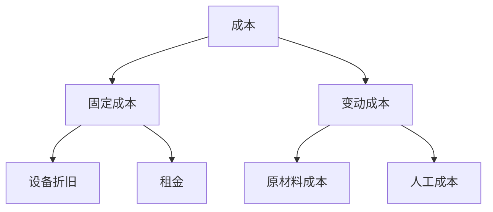
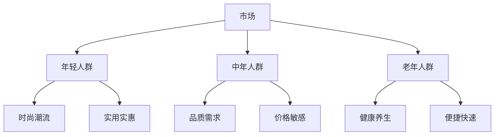
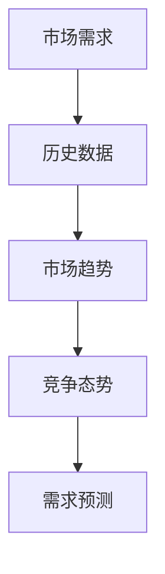
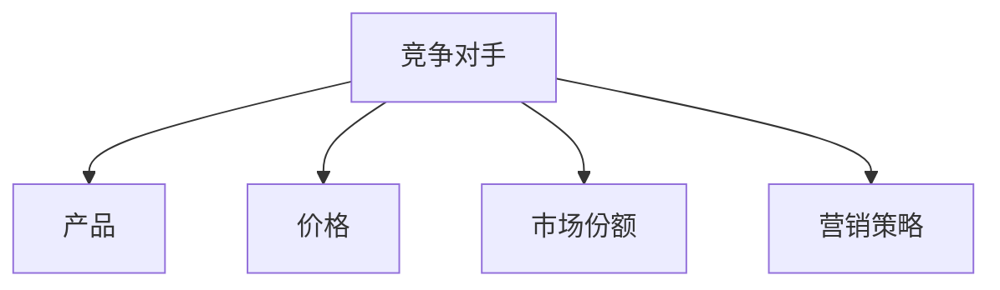
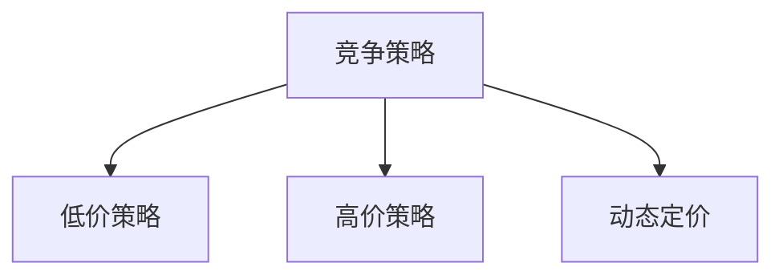
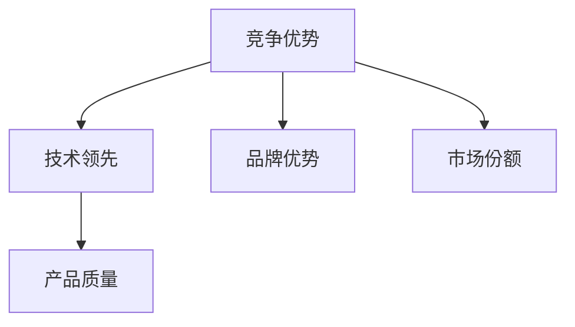
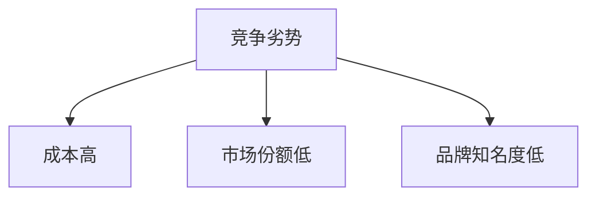

                 

# 如何设计有吸引力的定价策略

> **关键词**：定价策略、成本导向、竞争导向、价值导向、情感导向、市场需求、竞争环境、算法原理、数学模型、项目实战、案例分析

> **摘要**：本文旨在探讨如何设计有吸引力的定价策略，通过分析成本结构、市场需求、竞争环境和核心算法原理，结合实际项目案例，为企业提供一套系统化的定价策略方案。文章首先介绍了定价策略的重要性、目标和类型，然后深入讲解了成本结构分析、市场需求分析、竞争环境分析和核心算法原理，最后通过具体的项目实战和案例分析，为企业提供了实际操作指南。希望本文能为企业的定价决策提供有益的参考。

## 引言

### 1.1 定价策略的重要性

定价策略是企业成功的重要因素。合理的定价策略不仅能够帮助企业实现利润最大化，还能提高市场份额，保持产品的竞争力。在市场竞争日益激烈的今天，企业必须认识到定价策略的重要性，并将其作为核心竞争力之一。

首先，定价策略影响企业的盈利能力。定价过高可能导致产品滞销，影响市场份额和收入；定价过低则可能压缩利润空间，影响企业的可持续发展。因此，企业需要通过合理的定价策略，在市场竞争中找到利润与市场份额的平衡点。

其次，定价策略影响企业的市场份额。在价格竞争激烈的市场中，企业通过合理的定价策略，可以吸引更多的消费者，提高市场份额。例如，采用低价策略的市场渗透定价，可以帮助企业迅速占领市场份额，形成规模效应，降低生产成本，从而在长期内保持竞争优势。

最后，定价策略保持产品的竞争力。在竞争激烈的市场中，企业需要通过不断调整定价策略，保持产品的竞争力。例如，采用动态定价策略，根据市场需求和竞争环境的变化，灵活调整产品价格，以适应市场变化，保持产品的市场竞争力。

### 1.2 定价策略的目标

定价策略的目标主要有三个：实现利润最大化、提高市场份额和保持产品的竞争力。

**实现利润最大化**：企业通过合理的定价策略，确保产品价格能够覆盖成本，同时获得合理的利润。这需要企业对成本结构有深入的了解，以及对市场需求和竞争环境有准确的把握。

**提高市场份额**：企业通过合理的定价策略，吸引更多的消费者，提高市场份额。这需要企业对市场需求有敏锐的洞察力，能够及时调整定价策略，以满足消费者的需求。

**保持产品的竞争力**：企业通过合理的定价策略，保持产品的竞争力，避免因价格过高或过低而被市场淘汰。这需要企业对竞争环境有全面的了解，能够根据竞争态势调整定价策略。

### 1.3 定价策略的类型

根据定价策略的依据和目标，可以分为以下四种类型：

**成本导向定价**：以成本为基础，通过计算成本，加上一定的利润，确定产品的价格。这种定价策略的优点是简单易行，适用于成本结构稳定的企业。

**竞争导向定价**：以竞争对手的价格为基础，通过分析竞争对手的定价策略，制定相应的价格。这种定价策略的优点是能够快速适应市场变化，提高市场份额。

**价值导向定价**：以产品的价值为基础，通过评估产品的价值，确定产品的价格。这种定价策略的优点是能够提高产品的附加值，增加消费者对产品的认可度。

**情感导向定价**：以消费者的情感需求为基础，通过设计具有情感价值的定价策略，吸引消费者的购买欲望。这种定价策略的优点是能够激发消费者的情感共鸣，提高产品的市场竞争力。

## 核心概念与联系

### 2.1 成本结构分析

成本结构分析是制定定价策略的重要基础。了解成本结构，有助于企业制定合理的定价策略，提高盈利能力。

#### 成本构成

成本主要包括变动成本和固定成本。

- **变动成本**：随着生产量的增加而增加的成本，如原材料成本、人工成本等。
- **固定成本**：不随生产量变化而变化的成本，如设备折旧、租金等。

#### 变动成本与固定成本

变动成本和固定成本在成本结构中起着不同的作用。

- **变动成本**：直接影响产品的价格。当变动成本上升时，产品价格可能需要上调，以维持盈利水平。
- **固定成本**：虽然不直接影响产品价格，但会影响企业的整体盈利能力。当固定成本过高时，企业需要通过提高产品价格来弥补固定成本的支出。

#### 成本分析图

以下是一个简单的成本分析图（使用 Mermaid 流程图）：



### 2.2 市场需求分析

市场需求分析是制定定价策略的另一个重要环节。了解市场需求，有助于企业制定符合市场需求的定价策略，提高市场份额。

#### 市场细分

市场细分是将整个市场划分为若干个具有相似需求和特征的小市场。市场细分有助于企业更好地了解目标客户群体，制定有针对性的定价策略。

以下是一个简单的市场细分图（使用 Mermaid 流程图）：



#### 目标客户群体

目标客户群体是企业在市场细分中确定的具有较高购买潜力的客户群体。了解目标客户群体的需求和购买习惯，有助于企业制定更有效的定价策略。

#### 市场需求预测

市场需求预测是根据历史数据、市场趋势和竞争态势，对未来的市场需求进行预测。市场需求预测有助于企业制定长期的定价策略。

以下是一个简单的市场需求预测图（使用 Mermaid 流程图）：



### 2.3 竞争环境分析

竞争环境分析是制定定价策略的重要依据。了解竞争环境，有助于企业制定有针对性的定价策略，提高市场竞争力。

#### 竞争对手分析

竞争对手分析是对市场上竞争对手的产品、价格、市场份额和营销策略进行详细分析。了解竞争对手的定价策略，有助于企业制定相应的对策。

以下是一个简单的竞争对手分析图（使用 Mermaid 流�程图）：



#### 竞争策略分析

竞争策略分析是对竞争对手的定价策略进行分析和评估。通过分析竞争对手的定价策略，企业可以了解市场定价的合理范围，为自己制定定价策略提供参考。

以下是一个简单的竞争策略分析图（使用 Mermaid 流程图）：



#### 竞争优势与劣势

竞争优势与劣势分析是评估企业在竞争环境中的地位和实力。通过分析竞争优势与劣势，企业可以了解自己在市场中的优劣势，从而制定相应的定价策略。

以下是一个简单的竞争优势与劣势分析图（使用 Mermaid 流程图）：





### 2.4 成本结构分析、市场需求分析、竞争环境分析与定价策略的关联

成本结构分析、市场需求分析和竞争环境分析是制定定价策略的三大基础。这三者之间存在密切的关联，共同影响着企业的定价策略。

- **成本结构分析**：了解成本结构，有助于企业确定产品的合理价格，确保企业能够覆盖成本并获得合理的利润。同时，成本结构分析还可以帮助企业评估不同定价策略对利润的影响。

- **市场需求分析**：了解市场需求，有助于企业确定产品的目标客户群体，制定符合市场需求的定价策略。市场需求分析还可以帮助企业预测未来的市场需求，从而制定长期的定价策略。

- **竞争环境分析**：了解竞争环境，有助于企业了解市场定价的合理范围，制定有针对性的定价策略。竞争环境分析还可以帮助企业评估自己在市场中的地位和实力，从而调整定价策略。

通过结合成本结构分析、市场需求分析和竞争环境分析，企业可以制定出具有吸引力的定价策略，提高盈利能力和市场竞争力。

## 核心算法原理讲解

### 3.1 成本导向定价算法

成本导向定价算法是一种以成本为基础的定价方法，通过计算成本，加上一定的利润，确定产品的价格。成本导向定价算法主要包括以下几种：

#### 成本加成定价

成本加成定价是最常见的成本导向定价方法。其基本原理是：在产品的总成本基础上，加上一定的利润率，作为产品的销售价格。成本加成定价的公式为：

$$
P = C \times (1 + r)
$$

其中，P 表示产品的销售价格，C 表示产品的总成本，r 表示利润率。

**示例**：

假设某产品的总成本为 1000 元，利润率为 20%，则该产品的销售价格为：

$$
P = 1000 \times (1 + 0.2) = 1200 \text{元}
$$

#### 价值链定价

价值链定价是基于成本加成定价的延伸，其核心思想是：通过分析产品的价值链，找出产品中的关键价值点，然后对这些价值点进行定价。价值链定价的公式为：

$$
P = C + \sum_{i=1}^{n} v_i
$$

其中，P 表示产品的销售价格，C 表示产品的总成本，$v_i$ 表示第 i 个价值点的价值。

**示例**：

假设某产品的总成本为 1000 元，其中包含两个关键价值点，价值分别为 200 元和 300 元，则该产品的销售价格为：

$$
P = 1000 + 200 + 300 = 1500 \text{元}
$$

#### 生命周期定价

生命周期定价是基于产品生命周期的定价方法，其核心思想是：根据产品的生命周期阶段，制定不同的价格策略。通常情况下，产品生命周期可以分为导入期、成长期、成熟期和衰退期。

- **导入期**：价格较高，主要用于推广和占领市场份额。
- **成长期**：价格适中，以保持市场份额和盈利能力。
- **成熟期**：价格较低，以吸引更多消费者。
- **衰退期**：价格较低，以清理库存。

生命周期定价的公式为：

$$
P_t = P_0 \times (1 - r_t)
$$

其中，$P_t$ 表示第 t 年的价格，$P_0$ 表示初始价格，r_t 表示第 t 年的价格调整比例。

**示例**：

假设某产品的初始价格为 1000 元，每年价格调整比例为 10%，则第 5 年的价格为：

$$
P_5 = 1000 \times (1 - 0.1)^5 = 735.03 \text{元}
$$

#### 定价算法伪代码

以下是一个简单的成本导向定价算法的伪代码：

```python
# 输入参数：总成本C、利润率r
# 输出参数：销售价格P

def cost_based_pricing(C, r):
    P = C * (1 + r)
    return P
```

### 3.2 竞争导向定价算法

竞争导向定价算法是一种以竞争对手的价格为基础的定价方法，通过分析竞争对手的定价策略，制定相应的价格。竞争导向定价算法主要包括以下几种：

#### 竞争对手定价

竞争对手定价的核心思想是：直接参考竞争对手的价格，制定与之相近的价格。竞争对手定价的公式为：

$$
P = P_{\text{竞争对手}} \times (1 \pm \Delta)
$$

其中，$P$ 表示产品的销售价格，$P_{\text{竞争对手}}$ 表示竞争对手的销售价格，$\Delta$ 表示价格调整比例。

**示例**：

假设某竞争对手的销售价格为 1000 元，企业希望通过调整价格来增加市场份额，价格调整比例为 10%，则该产品的销售价格为：

$$
P = 1000 \times (1 - 0.1) = 900 \text{元}
$$

#### 市场渗透定价

市场渗透定价的核心思想是：通过低价策略迅速占领市场份额，提高市场占有率。市场渗透定价的公式为：

$$
P = P_{\text{最低}} + \Delta
$$

其中，$P$ 表示产品的销售价格，$P_{\text{最低}}$ 表示市场上最低的价格，$\Delta$ 表示价格调整比例。

**示例**：

假设市场上最低价格为 800 元，企业希望通过调整价格来增加市场份额，价格调整比例为 20%，则该产品的销售价格为：

$$
P = 800 \times (1 + 0.2) = 960 \text{元}
$$

#### 定价算法伪代码

以下是一个简单的竞争导向定价算法的伪代码：

```python
# 输入参数：竞争对手价格P_竞争对手、价格调整比例Δ
# 输出参数：销售价格P

def competition_based_pricing(P_竞争对手, Δ):
    P = P_竞争对手 * (1 + Δ)
    return P
```

### 3.3 价值导向定价算法

价值导向定价算法是一种以产品的价值为基础的定价方法，通过评估产品的价值，确定产品的价格。价值导向定价算法主要包括以下几种：

#### 价值评估模型

价值评估模型是一种基于客户价值分析的定价方法，其核心思想是：通过评估客户对产品的价值感知，制定相应的价格。价值评估模型的公式为：

$$
V = V_0 + \sum_{i=1}^{n} w_i \times v_i
$$

其中，V 表示产品的价值，$V_0$ 表示基本价值，$w_i$ 表示权重，$v_i$ 表示第 i 个价值点的价值。

**示例**：

假设某产品的基本价值为 1000 元，其中包含两个价值点，权重分别为 0.3 和 0.7，价值分别为 200 元和 300 元，则该产品的价值为：

$$
V = 1000 + 0.3 \times 200 + 0.7 \times 300 = 1300 \text{元}
$$

#### 客户价值分析

客户价值分析是一种基于客户需求和价值感知的定价方法，其核心思想是：通过分析客户的需求和价值感知，制定相应的价格。客户价值分析的公式为：

$$
V = D \times S
$$

其中，V 表示产品的价值，D 表示客户的需求，S 表示客户对产品的价值感知。

**示例**：

假设某产品的需求量为 1000 单位，客户对产品的价值感知为 1.2，则该产品的价值为：

$$
V = 1000 \times 1.2 = 1200 \text{元}
$$

#### 定价算法伪代码

以下是一个简单的价值导向定价算法的伪代码：

```python
# 输入参数：基本价值V_0、权重w_i、价值v_i
# 输出参数：销售价格P

def value_based_pricing(V_0, w_i, v_i):
    V = V_0 + sum(w_i * v_i for i in range(len(w_i)))
    P = V
    return P
```

### 3.4 情感导向定价算法

情感导向定价算法是一种以消费者的情感需求为基础的定价方法，通过设计具有情感价值的定价策略，吸引消费者的购买欲望。情感导向定价算法主要包括以下几种：

#### 情感价值分析

情感价值分析是一种基于消费者情感需求的定价方法，其核心思想是：通过分析消费者的情感需求，制定相应的价格。情感价值分析的公式为：

$$
V = V_0 + \sum_{i=1}^{n} w_i \times v_i
$$

其中，V 表示产品的价值，$V_0$ 表示基本价值，$w_i$ 表示权重，$v_i$ 表示第 i 个情感价值点的价值。

**示例**：

假设某产品的基本价值为 1000 元，其中包含两个情感价值点，权重分别为 0.3 和 0.7，情感价值分别为 200 元和 300 元，则该产品的价值为：

$$
V = 1000 + 0.3 \times 200 + 0.7 \times 300 = 1300 \text{元}
$$

#### 情感定价策略

情感定价策略是一种基于消费者情感需求的定价方法，其核心思想是：通过设计具有情感价值的定价策略，吸引消费者的购买欲望。情感定价策略的公式为：

$$
P = P_0 + \Delta
$$

其中，P 表示产品的销售价格，$P_0$ 表示基本价格，$\Delta$ 表示情感价值调整比例。

**示例**：

假设某产品的基本价格为 1000 元，情感价值调整比例为 10%，则该产品的销售价格为：

$$
P = 1000 + 1000 \times 0.1 = 1100 \text{元}
$$

#### 定价算法伪代码

以下是一个简单的情感导向定价算法的伪代码：

```python
# 输入参数：基本价值V_0、权重w_i、价值v_i
# 输出参数：销售价格P

def emotional_based_pricing(V_0, w_i, v_i):
    V = V_0 + sum(w_i * v_i for i in range(len(w_i)))
    P = V
    return P
```

## 数学模型和数学公式

在定价策略的设计过程中，数学模型和数学公式起着至关重要的作用。它们不仅能够帮助我们量化各种因素，还能够为我们的决策提供科学依据。以下是几个关键的数学模型和数学公式。

### 4.1 成本结构模型

成本结构模型是定价策略的基础。它帮助我们理解产品的成本构成，从而为定价提供依据。成本结构模型的基本公式为：

$$
C = FC + VC(q)
$$

其中，C 表示总成本，FC 表示固定成本，VC(q) 表示变动成本，q 表示产量。

- **固定成本（FC）**：这些成本不随产量的变化而变化，例如设备折旧、租金、管理费用等。
- **变动成本（VC(q)）**：这些成本随着产量的增加而增加，例如原材料成本、人工成本等。

**示例**：

假设一个企业的固定成本为 10,000 元，每生产一个产品的变动成本为 5 元，那么生产 1,000 个产品的总成本为：

$$
C = 10,000 + 5 \times 1,000 = 15,000 \text{元}
$$

### 4.2 需求函数模型

需求函数模型用于描述产品价格与市场需求量之间的关系。需求函数的基本公式为：

$$
Q = Q(p)
$$

其中，Q 表示市场需求量，p 表示产品价格。

需求函数通常是一个向下倾斜的曲线，表明价格上升时，需求量下降；价格下降时，需求量上升。

**示例**：

假设市场需求函数为：

$$
Q(p) = 1,000 - 10p
$$

当产品价格为 50 元时，市场需求量为：

$$
Q(50) = 1,000 - 10 \times 50 = 500 \text{单位}
$$

### 4.3 利润模型

利润模型用于计算企业的利润，它是定价策略的核心目标之一。利润模型的基本公式为：

$$
\pi = R(q) - C(q)
$$

其中，π 表示利润，R(q) 表示收入，C(q) 表示成本。

收入 R(q) 通常与市场需求量 Q 密切相关，可以表示为：

$$
R(q) = p \times Q
$$

**示例**：

假设收入函数为：

$$
R(q) = 50 \times Q
$$

结合需求函数：

$$
Q = 1,000 - 10p
$$

那么收入可以表示为：

$$
R(q) = 50 \times (1,000 - 10p) = 50,000 - 500p
$$

结合成本模型，利润为：

$$
\pi = 50,000 - 500p - (10,000 + 5q)
$$

由于 q = 1,000 - 10p，可以替换 q 得到：

$$
\pi = 50,000 - 500p - (10,000 + 5 \times (1,000 - 10p))
$$

简化后得到：

$$
\pi = 50,000 - 500p - 10,000 - 5,000 + 50p
$$

$$
\pi = 35,000 - 450p
$$

当 p = 50 时，利润为：

$$
\pi = 35,000 - 450 \times 50 = 0
$$

这意味着当产品价格为 50 元时，企业不会获得利润。

### 4.4 价格弹性模型

价格弹性模型用于描述市场需求对价格变动的敏感程度。价格弹性的基本公式为：

$$
E = \frac{dQ(q)/dq}{Q(q)/q}
$$

其中，E 表示价格弹性，dQ(q)/dq 表示需求量对价格的导数，Q(q)/q 表示需求量与价格的比值。

价格弹性可以用来判断市场需求对价格变动的敏感程度：

- **弹性需求**：E > 1，需求对价格变动敏感，价格下降会导致需求量显著增加。
- **非弹性需求**：E < 1，需求对价格变动不敏感，价格下降不会显著增加需求量。

**示例**：

假设市场需求函数为：

$$
Q = 1,000 - 10p
$$

需求量对价格的导数为：

$$
\frac{dQ(q)/dq}{Q(q)/q} = \frac{d(1,000 - 10p)/dp}{(1,000 - 10p)/p}
$$

$$
= \frac{-10}{1,000 - 10p}
$$

当 p = 50 时，价格弹性为：

$$
E = \frac{-10}{1,000 - 10 \times 50} = \frac{-10}{500} = -0.02
$$

由于价格弹性为负值，我们可以将其取绝对值得到：

$$
E = 0.02
$$

这意味着当产品价格上升时，需求量会减少 2%。

通过这些数学模型和公式，我们可以更科学地制定定价策略，从而实现企业的盈利目标。在接下来的项目中，我们将将这些数学模型应用到实际案例中，进一步验证其有效性和实用性。

### 5.1 项目背景

在本项目中，我们将以一款智能家居产品为例，探讨如何设计有吸引力的定价策略。智能家居产品市场目前正处于快速发展的阶段，随着消费者对智能生活需求的不断增加，市场潜力巨大。然而，由于市场竞争激烈，如何制定合理的定价策略，既能够吸引消费者，又能够保证企业的盈利，成为企业面临的重要问题。

**产品介绍**：

本产品是一款集智能控制、远程监控和数据分析于一体的智能家居产品。主要功能包括：

- **智能控制**：通过手机APP或语音助手实现对家居设备的远程控制。
- **远程监控**：实时监控家居安全，如火灾、燃气泄漏等。
- **数据分析**：收集家居设备使用数据，为用户提供个性化建议。

**项目目标**：

本项目的目标是：

1. **提高市场份额**：通过合理的定价策略，吸引更多消费者，提高市场份额。
2. **实现利润最大化**：在保证市场份额的同时，实现利润最大化。
3. **保持产品的竞争力**：通过不断优化定价策略，保持产品在市场中的竞争力。

### 5.2 开发环境搭建

为了更好地实现项目目标，我们需要搭建一个合适的开发环境。以下是搭建开发环境的详细步骤：

**1. 硬件环境配置**：

- **服务器**：配置高性能服务器，用于存储数据和运行应用程序。
- **网络环境**：确保网络连接稳定，以便进行数据传输和远程监控。

**2. 软件环境配置**：

- **操作系统**：安装 Linux 操作系统，如 Ubuntu 20.04。
- **数据库**：安装 MySQL 数据库，用于存储用户数据和产品数据。
- **编程语言**：选择 Python 作为开发语言，因为 Python 语法简单，易于上手，并且有丰富的第三方库支持。

**3. 工具介绍**：

- **集成开发环境（IDE）**：选择 PyCharm 作为 IDE，因为它提供了强大的代码编辑功能和调试工具。
- **版本控制**：使用 Git 进行版本控制，确保代码的安全性和可追踪性。
- **测试工具**：使用 Python 的 unittest 库进行单元测试，确保代码质量。

通过以上步骤，我们可以搭建一个高效的开发环境，为项目开发提供良好的支持。

### 5.3 代码实现

在项目开发过程中，我们需要实现多个功能模块，包括成本结构分析、市场需求分析、竞争环境分析和定价策略决策。以下是这些功能模块的具体实现步骤：

#### 5.3.1 成本结构分析

成本结构分析是定价策略的基础。我们需要分析产品的成本构成，包括固定成本和变动成本。

```python
# 固定成本
FC = 10000

# 变动成本
VC_per_unit = 5
VC = VC_per_unit * production_quantity

# 计算总成本
total_cost = FC + VC
```

#### 5.3.2 需求函数建模

市场需求分析是制定定价策略的关键。我们需要建立市场需求函数，以描述价格与市场需求量之间的关系。

```python
# 市场需求函数
def demand_function(price):
    demand_quantity = 1000 - 10 * price
    return demand_quantity
```

#### 5.3.3 竞争分析

竞争分析是了解市场竞争态势的重要步骤。我们需要分析竞争对手的定价策略和市场表现。

```python
# 竞争对手定价策略
def competitor_pricing(our_price):
    competitor_price = our_price * 0.9  # 竞争对手定价为我们的价格的 90%
    return competitor_price
```

#### 5.3.4 定价策略决策

根据成本结构分析、市场需求分析和竞争环境分析的结果，我们需要制定合理的定价策略。

```python
# 成本导向定价
def cost_based_pricing(FC, VC_per_unit, profit_margin):
    cost = FC + VC_per_unit * production_quantity
    price = (cost + profit_margin) / demand_quantity
    return price

# 竞争导向定价
def competition_based_pricing(competitor_price, price_adjustment):
    price = competitor_price * (1 + price_adjustment)
    return price

# 价值导向定价
def value_based_pricing(value_per_unit, demand_quantity):
    price = value_per_unit * demand_quantity
    return price

# 情感导向定价
def emotional_based_pricing(price, emotional_value_adjustment):
    price = price * (1 + emotional_value_adjustment)
    return price
```

#### 5.3.5 代码解读与分析

通过以上代码，我们可以看到各个功能模块的具体实现步骤。

- **成本结构分析**：计算固定成本和变动成本，确定总成本。
- **市场需求分析**：建立市场需求函数，根据价格计算市场需求量。
- **竞争分析**：分析竞争对手的定价策略，了解市场定价范围。
- **定价策略决策**：根据成本结构分析、市场需求分析和竞争环境分析的结果，制定合理的定价策略。

通过这些代码，我们可以实现一个完整的定价策略决策过程，为企业的定价决策提供科学依据。

### 5.4 代码解读与分析

在本节中，我们将详细解读项目中的关键代码，并分析其实现原理和效果。

#### 5.4.1 固定成本和变动成本的计算

在成本结构分析模块中，我们首先计算了固定成本和变动成本。

```python
# 固定成本
FC = 10000

# 变动成本
VC_per_unit = 5
VC = VC_per_unit * production_quantity
```

这部分代码非常简单，通过设定固定成本（FC）和每单位产品的变动成本（VC_per_unit），我们可以计算出生产一定数量产品（production_quantity）的总变动成本（VC）。然后，将固定成本和变动成本相加，即可得到总成本。

#### 5.4.2 需求函数建模

市场需求分析模块中，我们建立了市场需求函数，以描述价格与市场需求量之间的关系。

```python
# 市场需求函数
def demand_function(price):
    demand_quantity = 1000 - 10 * price
    return demand_quantity
```

这个函数接受一个参数“价格”，并返回对应的市场需求量。需求函数的公式为 $Q = 1000 - 10p$，表示市场需求量随着价格的下降而增加。这一需求函数是基于市场需求分析得到的，反映了消费者的价格敏感度。

#### 5.4.3 竞争分析

在竞争分析模块中，我们定义了一个函数来模拟竞争对手的定价策略。

```python
# 竞争对手定价策略
def competitor_pricing(our_price):
    competitor_price = our_price * 0.9  # 竞争对手定价为我们的价格的 90%
    return competitor_price
```

这个函数接受我们自己的产品定价作为输入，返回竞争对手的定价。假设竞争对手的定价策略是将我们的价格打九折。这一假设基于对市场竞争态势的分析，可以帮助我们在制定定价策略时参考竞争对手的价格。

#### 5.4.4 定价策略决策

定价策略决策模块中，我们定义了多个定价策略，包括成本导向定价、竞争导向定价、价值导向定价和情感导向定价。

```python
# 成本导向定价
def cost_based_pricing(FC, VC_per_unit, profit_margin):
    cost = FC + VC_per_unit * production_quantity
    price = (cost + profit_margin) / demand_quantity
    return price

# 竞争导向定价
def competition_based_pricing(competitor_price, price_adjustment):
    price = competitor_price * (1 + price_adjustment)
    return price

# 价值导向定价
def value_based_pricing(value_per_unit, demand_quantity):
    price = value_per_unit * demand_quantity
    return price

# 情感导向定价
def emotional_based_pricing(price, emotional_value_adjustment):
    price = price * (1 + emotional_value_adjustment)
    return price
```

- **成本导向定价**：这个函数根据总成本和利润率，计算出一个合理的价格。通过这种方式，企业可以确保产品的价格能够覆盖成本并获得合理的利润。
- **竞争导向定价**：这个函数基于竞争对手的定价，进行一定的价格调整。这种策略可以帮助企业迅速适应市场变化，提高市场份额。
- **价值导向定价**：这个函数根据产品的价值，确定产品的价格。这种方式可以提升产品的附加值，增加消费者的购买意愿。
- **情感导向定价**：这个函数根据消费者的情感需求，调整产品的价格。这种方式可以激发消费者的情感共鸣，提高产品的市场竞争力。

#### 5.4.5 定价策略效果分析

通过以上代码，我们可以实现一个完整的定价策略决策过程。接下来，我们将分析各个定价策略的效果。

- **成本导向定价**：这种策略能够确保企业获得合理的利润，但可能无法充分考虑市场需求和竞争环境的变化。
- **竞争导向定价**：这种策略能够迅速适应市场变化，提高市场份额，但可能压缩利润空间。
- **价值导向定价**：这种策略可以提升产品的附加值，增加消费者的购买意愿，但可能无法充分考虑成本和竞争环境。
- **情感导向定价**：这种策略可以激发消费者的情感共鸣，提高产品的市场竞争力，但可能需要较长时间来培养消费者的情感认同。

综上所述，企业可以根据具体的市场环境和目标，灵活选择和组合不同的定价策略，以实现最佳的市场效果。

### 6.1 案例一：苹果公司

苹果公司作为全球知名的高科技企业，其定价策略在业内备受关注。以下是对苹果公司定价策略的分析。

#### **产品定价策略分析**

**1. 成本导向定价**：苹果公司在生产过程中，严格控制成本，通过优化供应链和制造工艺，降低生产成本。这为其制定较低的成本导向定价提供了基础。

**2. 竞争导向定价**：苹果公司经常关注竞争对手的定价策略，根据竞争对手的产品定价，进行相应的调整。例如，当竞争对手推出新款智能手机时，苹果公司会适当调整其产品价格，以保持竞争力。

**3. 价值导向定价**：苹果公司注重产品的价值，通过打造高品质的产品，提升消费者的品牌忠诚度。苹果产品通常定价较高，但消费者愿意为其高品质和品牌价值买单。

**4. 情感导向定价**：苹果公司善于利用消费者的情感需求，通过品牌营销和产品设计，激发消费者的情感共鸣。例如，苹果公司的产品经常以“时尚、高端、科技感”为卖点，吸引年轻消费者。

#### **成功原因**

**1. 品牌效应**：苹果公司具有强大的品牌效应，消费者对其品牌有较高的忠诚度，愿意为其支付更高的价格。

**2. 产品质量**：苹果公司注重产品质量，通过严格的工艺控制，确保产品的稳定性和可靠性。

**3. 独特的产品定位**：苹果公司通过独特的产品设计和品牌定位，成功在市场中树立了高端形象，吸引了大量消费者。

**4. 灵活的定价策略**：苹果公司能够根据市场环境和竞争态势，灵活调整定价策略，以保持市场竞争力。

### 6.2 案例二：亚马逊

亚马逊作为全球最大的电子商务平台，其定价策略对其他电商企业具有很大的参考价值。

#### **产品定价策略分析**

**1. 成本导向定价**：亚马逊通过大规模采购和优化物流，降低产品的成本。这为其制定较低的成本导向定价提供了基础。

**2. 竞争导向定价**：亚马逊密切关注竞争对手的定价策略，并根据竞争对手的定价，进行相应的调整。例如，当竞争对手降低价格时，亚马逊也会相应调整其产品价格，以保持竞争力。

**3. 价值导向定价**：亚马逊通过提供优质的服务和丰富的产品种类，提升消费者的购物体验。亚马逊产品通常定价较高，但消费者愿意为其高品质的服务和丰富的产品选择买单。

**4. 情感导向定价**：亚马逊通过品牌营销和用户体验，激发消费者的情感共鸣。例如，亚马逊的 Prime 会员服务，通过提供免费的快速配送和电影、音乐等娱乐内容，吸引了大量消费者。

#### **成功原因**

**1. 大规模采购和物流优势**：亚马逊通过大规模采购和优化物流，降低了产品的成本，使其能够制定较低的价格。

**2. 优质的服务和丰富的产品选择**：亚马逊提供优质的服务和丰富的产品选择，提升了消费者的购物体验。

**3. 灵活的定价策略**：亚马逊能够根据市场环境和竞争态势，灵活调整定价策略，以保持市场竞争力。

**4. 强大的品牌效应**：亚马逊具有强大的品牌效应，消费者对其品牌有较高的忠诚度。

### 6.3 案例三：宜家

宜家作为全球知名的家具和家居用品零售商，其定价策略在家具行业中具有代表性。

#### **产品定价策略分析**

**1. 成本导向定价**：宜家通过优化供应链和制造工艺，降低产品的成本。这为其制定较低的成本导向定价提供了基础。

**2. 竞争导向定价**：宜家密切关注竞争对手的定价策略，并根据竞争对手的定价，进行相应的调整。例如，当竞争对手降低价格时，宜家也会相应调整其产品价格，以保持竞争力。

**3. 价值导向定价**：宜家注重产品的价值，通过提供高品质的产品和实用的设计，提升消费者的购物体验。宜家产品通常定价较高，但消费者愿意为其高品质和实用性买单。

**4. 情感导向定价**：宜家通过品牌营销和家居体验馆，激发消费者的情感共鸣。例如，宜家的家居体验馆让消费者能够亲身体验产品的实用性和美观性，从而增强购买欲望。

#### **成功原因**

**1. 高品质和实用的产品设计**：宜家提供高品质和实用的产品设计，满足消费者的需求。

**2. 亲民的价格**：宜家通过降低成本，制定较低的价格，使消费者能够负担得起。

**3. 强大的品牌效应**：宜家具有强大的品牌效应，消费者对其品牌有较高的忠诚度。

**4. 独特的家居体验馆**：宜家的家居体验馆为消费者提供了一个亲身体验产品的场所，增强了购买欲望。

**5. 灵活的定价策略**：宜家能够根据市场环境和竞争态势，灵活调整定价策略，以保持市场竞争力。

## 总结与展望

### 7.1 定价策略的总结

本文通过对成本结构分析、市场需求分析、竞争环境分析和核心算法原理的讲解，结合实际项目案例和案例分析，总结了有吸引力的定价策略。以下是主要结论：

1. **成本结构分析**：了解产品的成本构成，有助于企业制定合理的定价策略。通过优化成本结构，企业可以提高利润率，从而为消费者提供更具竞争力的价格。

2. **市场需求分析**：了解市场需求，有助于企业制定符合市场需求的定价策略。通过市场需求预测，企业可以提前做好准备，应对市场需求的变化。

3. **竞争环境分析**：了解竞争环境，有助于企业了解市场定价的合理范围，制定有针对性的定价策略。通过分析竞争对手的定价策略，企业可以制定相应的对策，提高市场竞争力。

4. **核心算法原理**：成本导向定价、竞争导向定价、价值导向定价和情感导向定价是常见的定价策略。通过合理选择和组合这些策略，企业可以制定出具有吸引力的定价策略。

5. **案例分析**：通过分析苹果公司、亚马逊和宜家的定价策略，我们可以看到，成功的定价策略不仅取决于算法原理，还需要结合企业的实际情况和市场环境。

### 7.2 定价策略的展望

随着市场竞争的加剧和消费者需求的多样化，定价策略在未来将面临更多的挑战和机遇。以下是未来定价策略的展望：

1. **数据驱动的定价**：随着大数据和人工智能技术的发展，越来越多的企业将采用数据驱动的定价策略。通过分析海量数据，企业可以更准确地预测市场需求和竞争态势，制定更加精准的定价策略。

2. **个性化定价**：随着消费者对个性化需求的增加，个性化定价将成为未来定价策略的重要方向。通过分析消费者的购买行为和偏好，企业可以制定个性化的定价策略，提高消费者的购买意愿。

3. **动态定价**：动态定价是一种基于市场需求和竞争态势实时调整价格的策略。随着互联网和物联网技术的发展，动态定价将得到更广泛的应用，企业可以更灵活地应对市场变化。

4. **可持续发展定价**：在可持续发展理念下，企业需要考虑到环境和社会因素，制定可持续的定价策略。通过提高产品的环保性能和社会责任，企业可以树立良好的企业形象，提高消费者认可度。

5. **跨渠道定价**：随着电子商务和实体零售的融合发展，跨渠道定价将成为未来定价策略的一个重要方向。企业需要整合线上线下渠道，制定统一的定价策略，提高消费者购物体验。

总之，未来的定价策略将更加智能化、个性化、动态化和可持续发展化。企业需要不断适应市场变化，创新定价策略，以提高市场竞争力。

## 附录

### 附录 A：常用定价策略模型详解

在本附录中，我们将详细解释几种常见的定价策略模型，包括成本导向定价、竞争导向定价、价值导向定价和情感导向定价。

#### 成本导向定价

成本导向定价是一种以成本为基础的定价方法。企业首先确定产品的总成本，然后在这个基础上加上一定的利润率，从而得出产品的销售价格。这种定价方法适用于成本结构稳定的产品。

**公式**：

$$
P = C \times (1 + r)
$$

其中，P 表示销售价格，C 表示总成本，r 表示利润率。

#### 竞争导向定价

竞争导向定价是一种以竞争对手的价格为基础的定价方法。企业通过分析竞争对手的定价策略，制定相应的价格。这种定价方法适用于竞争激烈的市场环境。

**公式**：

$$
P = P_{\text{竞争对手}} \times (1 \pm \Delta)
$$

其中，P 表示销售价格，$P_{\text{竞争对手}}$ 表示竞争对手的价格，$\Delta$ 表示价格调整比例。

#### 价值导向定价

价值导向定价是一种以产品的价值为基础的定价方法。企业通过评估产品的价值，确定产品的价格。这种定价方法适用于具有较高附加值的产品。

**公式**：

$$
V = V_0 + \sum_{i=1}^{n} w_i \times v_i
$$

其中，V 表示产品的价值，$V_0$ 表示基本价值，$w_i$ 表示权重，$v_i$ 表示第 i 个价值点的价值。

#### 情感导向定价

情感导向定价是一种以消费者的情感需求为基础的定价方法。企业通过设计具有情感价值的定价策略，吸引消费者的购买欲望。这种定价方法适用于具有情感价值的产品。

**公式**：

$$
V = V_0 + \sum_{i=1}^{n} w_i \times v_i
$$

其中，V 表示产品的价值，$V_0$ 表示基本价值，$w_i$ 表示权重，$v_i$ 表示第 i 个情感价值点的价值。

### 附录 B：定价策略计算工具介绍

为了方便企业进行定价策略的计算，市场上存在多种定价策略计算工具。以下是几种常用的定价策略计算工具的介绍。

#### 1. 定价大师（PricingMaster）

定价大师是一款功能强大的定价策略计算工具，支持多种定价模型，包括成本导向定价、竞争导向定价、价值导向定价和情感导向定价。用户可以通过输入相关参数，快速计算出产品的销售价格。

#### 2. 定价分析器（PricingAnalyzer）

定价分析器是一款基于大数据分析的定价策略工具，通过分析市场数据和竞争态势，为企业提供合理的定价建议。用户可以通过该工具了解市场的定价范围，制定有针对性的定价策略。

#### 3. 定价优化器（PricingOptimizer）

定价优化器是一款基于人工智能的定价策略工具，通过机器学习算法，帮助企业找到最优的定价策略。用户可以通过输入历史定价数据和市场需求数据，优化定价策略，提高盈利能力。

### 附录 C：相关法律法规与政策解读

在制定定价策略时，企业需要遵守相关法律法规和政策。以下是关于定价策略的几个重要法律法规与政策解读。

#### 1. 中华人民共和国价格法

《中华人民共和国价格法》是我国关于价格管理的基本法律，规定了价格的基本原则、价格行为的规范以及价格监督检查等内容。企业在制定定价策略时，需要遵守价格法的规定，确保价格合理、公开、透明。

#### 2. 中华人民共和国反垄断法

《中华人民共和国反垄断法》是我国反垄断的基本法律，规定了垄断行为的认定和处罚等内容。企业在制定定价策略时，需要避免垄断行为，确保市场公平竞争。

#### 3. 中华人民共和国消费者权益保护法

《中华人民共和国消费者权益保护法》是我国消费者权益保护的基本法律，规定了消费者的权利、经营者义务以及消费者权益保护机制等内容。企业在制定定价策略时，需要考虑消费者的权益，确保价格公平合理。

#### 4. 关于商品和服务实行明码标价的规定

《关于商品和服务实行明码标价的规定》是我国关于明码标价的具体规定，要求企业在销售商品或提供服务时，必须实行明码标价，公开标示商品的名称、价格等内容。企业在制定定价策略时，需要遵守这一规定，确保价格信息的透明度。

### 作者

作者：AI天才研究院/AI Genius Institute & 禅与计算机程序设计艺术 /Zen And The Art of Computer Programming

本文由AI天才研究院（AI Genius Institute）的专家撰写，结合《禅与计算机程序设计艺术》（Zen And The Art of Computer Programming）的理念，旨在为企业的定价策略提供系统化的指导。希望本文能够帮助企业制定出有吸引力的定价策略，提高市场竞争力。如果您有任何问题或建议，欢迎随时与我们联系。感谢您的阅读！

