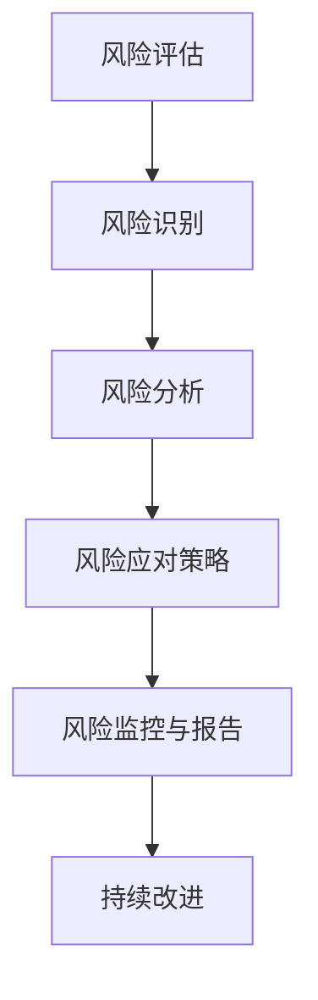

                 

### 第一部分：引言

#### 第1章：创业项目风险管理的必要性

##### 1.1 风险管理的重要性

在创业项目中，风险管理是一项至关重要的任务。这是因为创业项目往往面临着诸多不确定性因素，这些因素可能导致项目失败。因此，有效的风险管理可以帮助创业团队识别、评估和控制潜在的风险，从而提高项目成功的可能性。

首先，风险管理有助于确保创业项目的稳定发展。创业项目往往需要在不确定的市场环境中进行运作，这要求团队具备应对各种突发情况的能力。通过风险管理，团队可以提前识别潜在的风险点，并采取相应的预防措施，降低风险对项目的影响。

其次，风险管理有助于提高创业项目的投资回报率。投资者在投资创业项目时，往往会对项目的风险进行评估。一个具备良好风险管理能力的团队，可以降低项目失败的风险，从而提高投资者的信心，吸引更多的投资。

此外，风险管理还有助于提高创业团队的决策质量。在创业过程中，团队需要做出大量的决策。有效的风险管理可以帮助团队从不同的角度对决策进行评估，从而做出更加科学、合理的决策。

##### 1.2 创业项目中的主要风险类型

创业项目中主要的风险类型可以分为以下几个方面：

1. **市场风险**：包括市场需求变化、竞争压力、行业趋势等。市场风险是创业项目中最常见的一种风险，因为创业项目往往在新兴市场或细分市场中进行，市场环境的不确定性较大。

2. **财务风险**：包括资金筹集困难、投资决策失误、财务危机等。财务风险对创业项目的影响尤为显著，因为资金是项目运作的基础。

3. **运营风险**：包括供应链管理、人力资源管理、技术风险等。运营风险可能导致项目进度延误、成本超支等问题。

4. **法律风险**：包括合同纠纷、知识产权保护、法规遵守等。法律风险对创业项目的影响虽然较为间接，但一旦发生，后果可能非常严重。

5. **技术风险**：包括技术开发失败、技术更新换代等。技术风险对高技术含量的创业项目尤为重要。

##### 1.3 风险管理的基本原则

风险管理应遵循以下基本原则：

1. **全面性原则**：风险管理应覆盖创业项目的各个方面，包括市场、财务、运营、法律和技术等方面。

2. **预防性原则**：在风险发生前，应采取预防措施，降低风险发生的可能性。

3. **系统性原则**：风险管理应形成一套完整的体系，包括风险识别、评估、应对和监控等方面。

4. **动态性原则**：风险管理是一个动态的过程，需要根据项目进展和市场环境的变化进行及时调整。

5. **合理性原则**：风险管理措施应合理，既要有效控制风险，又不能过度干预项目的正常运作。

通过以上对创业项目风险管理必要性的分析，我们可以看出，有效的风险管理对创业项目的成功至关重要。接下来，我们将进一步探讨创业项目的风险评估方法，帮助读者掌握如何进行科学的风险评估。

#### 第2章：创业项目的风险评估方法

##### 2.1 风险评估的意义与步骤

风险评估是创业项目风险管理中的核心环节，其意义在于通过系统的方法识别、评估和优先排序潜在的风险，为决策提供依据。一个有效的风险评估流程通常包括以下几个步骤：

1. **风险识别**：这是风险评估的第一步，目的是识别项目中可能出现的各种风险。可以通过头脑风暴、访谈、专家咨询等方法进行。

2. **风险分析和评估**：在风险识别的基础上，对每个风险的发生概率和可能造成的损失进行量化分析。常用的方法包括定性分析和定量分析。

3. **风险优先排序**：根据风险评估的结果，将风险按照严重程度和紧急程度进行排序，以便于制定应对策略。

4. **制定风险应对策略**：针对优先排序的风险，制定相应的应对策略，包括风险避免、风险转移、风险缓解等。

5. **风险监控和报告**：在风险评估完成后，需要定期监控风险的变化情况，并编写风险报告，为后续的风险管理提供参考。

##### 2.2 定量风险评估方法

定量风险评估方法主要通过数学模型和统计方法对风险进行量化分析，提高风险评估的精确性。以下介绍几种常用的定量风险评估方法：

1. **统计方法**：

   - **概率分布**：通过收集历史数据，建立风险的概率分布模型，预测未来风险的发生概率。

   - **统计回归分析**：利用历史数据，建立回归模型，预测风险发生的可能性及其对项目的影响。

2. **逻辑回归模型**：

   - **逻辑回归模型**：用于评估二元结果变量的概率，如风险发生的概率。其基本原理是建立因变量与自变量之间的逻辑关系，通过最大化似然函数求解参数。

   - **伪代码**：
     ```python
     # 定义逻辑回归模型
     def logistic_regression(x, theta):
         z = np.dot(x, theta)
         return 1 / (1 + np.exp(-z))

     # 计算预测概率
     def predict(x, theta):
         return logistic_regression(x, theta)

     # 计算损失函数
     def loss_function(y, y_pred):
         return -1 * (y * np.log(y_pred) + (1 - y) * np.log(1 - y_pred))
     ```

##### 2.3 定性风险评估方法

定性风险评估方法主要通过专家评估、SWOT分析等方法对风险进行定性分析，适用于风险难以量化的情况。以下介绍几种常用的定性风险评估方法：

1. **专家评估法**：

   - **专家评估法**：通过邀请行业专家对风险进行评估，根据专家的经验和知识对风险进行定性分析。

   - **评估步骤**：
     1. 确定评估对象和目标。
     2. 招募专家，明确专家的职责和评估标准。
     3. 进行专家访谈和问卷调查，收集评估数据。
     4. 综合分析评估数据，得出风险评估结果。

2. **SWOT分析**：

   - **SWOT分析**：用于分析创业项目的优势（Strengths）、劣势（Weaknesses）、机会（Opportunities）和威胁（Threats）。

   - **评估步骤**：
     1. 识别项目的内部优势与劣势。
     2. 分析外部市场环境中的机会与威胁。
     3. 将SWOT分析的结果与风险评估相结合，确定项目的风险等级。

通过以上对风险评估方法的分析，我们可以看到，无论是定量风险评估方法还是定性风险评估方法，都有其独特的适用场景和优势。在实际的创业项目中，应根据项目特点和风险特性选择合适的方法进行风险评估。接下来，我们将探讨创业项目的风险管理策略与实践，帮助读者掌握如何设计有效的风险管理策略。

#### 第3章：风险管理策略的设计

##### 3.1 风险缓解策略

在创业项目中，风险缓解策略是指通过一系列措施来减轻风险对项目的影响，从而降低风险损失。风险缓解策略主要包括以下几种类型：

1. **风险避免策略**：

   - **定义**：风险避免策略是指通过改变项目计划或采取其他措施来完全消除特定风险。
   - **适用场景**：适用于风险发生概率高且损失巨大的情况。
   - **方法**：例如，通过重新设计项目流程或产品特性来避免特定风险。

2. **风险转移策略**：

   - **定义**：风险转移策略是指将风险的责任和潜在损失转移给第三方，如通过购买保险或签订合同。
   - **适用场景**：适用于无法避免但可以通过经济手段转移的风险。
   - **方法**：例如，购买产品责任保险来转移产品质量问题的风险。

3. **风险缓解策略**：

   - **定义**：风险缓解策略是指通过采取措施来减少风险发生的概率或降低风险带来的损失。
   - **适用场景**：适用于大部分风险类型。
   - **方法**：例如，通过加强项目管理、优化供应链管理来降低运营风险。

##### 3.2 风险监控与报告

风险监控与报告是风险管理的重要组成部分，其主要目的是确保风险管理策略的有效实施，并及时调整应对措施。以下是风险监控与报告的关键要素：

1. **风险监控机制**：

   - **定义**：风险监控机制是指用于跟踪和评估风险状态的过程和工具。
   - **方法**：包括定期评估、风险评估指标体系、风险预警系统等。

2. **风险报告的编制**：

   - **定义**：风险报告是风险管理结果的总结，用于向管理层和利益相关者提供风险信息。
   - **内容**：包括风险识别、风险评估、风险应对策略、风险监控结果等。

3. **风险报告的编制流程**：

   1. **数据收集**：收集与风险相关的各种数据，包括定量数据和定性数据。
   2. **数据整理**：对收集到的数据进行整理和分类，以便于分析。
   3. **风险评估**：根据数据对风险进行评估，确定风险的等级和影响。
   4. **报告撰写**：编写风险报告，包括风险概述、风险评估结果、风险应对策略等。
   5. **报告审核与发布**：对风险报告进行审核，确保报告的准确性和完整性，然后发布报告。

##### 3.3 风险管理计划的实施

风险管理计划的实施是确保风险管理策略有效落实的关键步骤。以下是实施风险管理计划的主要步骤：

1. **风险管理计划的制定**：

   - **定义**：风险管理计划是指为实现风险管理目标而制定的详细行动计划。
   - **内容**：包括风险管理组织结构、风险管理流程、风险管理工具和技术等。

2. **风险管理计划的实施**：

   - **步骤**：
     1. **建立风险管理组织**：确定风险管理团队，明确团队成员的职责和权限。
     2. **培训与沟通**：对团队成员进行风险管理培训，确保他们具备必要的风险管理知识和技能。
     3. **制定风险应对措施**：根据风险评估的结果，制定具体的风险应对措施。
     4. **实施风险监控**：定期监控风险的变化情况，确保风险管理措施的有效性。
     5. **调整和优化**：根据监控结果和项目进展，及时调整和优化风险管理计划。

通过以上对风险管理策略的设计与实践的分析，我们可以看到，有效的风险管理策略是创业项目成功的重要保障。接下来，我们将进一步探讨创业项目的风险控制措施，帮助读者掌握如何在实践中进行风险控制。

#### 第4章：创业项目的风险控制措施

##### 4.1 财务风险管理

财务风险管理是创业项目中最为重要的风险管理之一，它关系到企业的资金流动、财务稳定性和长期发展。以下是财务风险管理的几个关键措施：

1. **资金筹集风险控制**：

   - **定义**：资金筹集风险控制是指企业通过多种渠道筹集资金，以避免因资金短缺而导致的财务危机。
   - **方法**：
     1. **多元化资金来源**：通过银行贷款、股权融资、债务融资等多种渠道筹集资金。
     2. **风险评估**：在筹集资金前，对资金来源的可靠性和风险进行评估。
     3. **合同条款**：确保融资合同中的条款明确，包括还款期限、利率等。

2. **投资决策风险管理**：

   - **定义**：投资决策风险管理是指企业在进行投资决策时，对潜在风险进行评估和防范。
   - **方法**：
     1. **项目评估**：对投资项目进行详细的财务分析和风险评估。
     2. **风险管理**：通过分散投资、设置风险限额等措施降低投资风险。
     3. **合规性审查**：确保投资项目符合相关法律法规和监管要求。

##### 4.2 市场风险管理

市场风险管理主要关注市场需求、竞争环境、行业趋势等外部因素对创业项目的影响。以下是一些市场风险管理的具体措施：

1. **市场需求波动风险控制**：

   - **定义**：市场需求波动风险控制是指企业通过市场研究和预测，及时调整产品策略，以应对市场需求的变化。
   - **方法**：
     1. **市场研究**：定期进行市场调查，了解市场需求和趋势。
     2. **需求预测**：利用历史数据和预测模型，预测市场需求变化。
     3. **产品调整**：根据市场需求预测，及时调整产品策略和营销策略。

2. **竞争风险控制**：

   - **定义**：竞争风险控制是指企业通过分析竞争对手，制定有效的竞争策略，以应对市场竞争带来的风险。
   - **方法**：
     1. **竞争对手分析**：收集竞争对手的产品、价格、市场份额等信息。
     2. **差异化策略**：通过产品创新、服务优化等方式，实现差异化竞争。
     3. **合作与联盟**：与其他企业建立合作关系，共同应对市场竞争。

##### 4.3 运营风险管理

运营风险管理是确保企业日常运营稳定、高效的重要措施，以下是一些运营风险管理的具体措施：

1. **人力资源管理风险控制**：

   - **定义**：人力资源管理风险控制是指企业通过合理的人力资源配置和管理，降低员工流失率，提高员工工作效率。
   - **方法**：
     1. **员工培训与发展**：提供员工培训和发展机会，提高员工技能和素质。
     2. **绩效管理**：建立公平、透明的绩效评价体系，激励员工积极性。
     3. **员工关系管理**：建立良好的员工关系，减少员工流失。

2. **供应链管理风险控制**：

   - **定义**：供应链管理风险控制是指企业通过优化供应链管理，降低供应链中断风险，确保供应链的稳定性和效率。
   - **方法**：
     1. **供应商选择与评估**：选择信誉好、服务质量高的供应商。
     2. **供应链监控**：实时监控供应链状态，及时发现并解决供应链问题。
     3. **风险应急计划**：制定供应链风险应急计划，确保在供应链中断时能够迅速应对。

通过以上对财务风险管理、市场风险管理和运营风险管理措施的分析，我们可以看到，创业项目的风险控制是一个系统工程，需要从多个方面进行综合管理。接下来，我们将通过具体案例分析，进一步探讨风险管理的实践效果。

#### 第5章：风险管理实践案例分析

##### 5.1 成功的风险管理案例

1. **公司A的财务风险管理**

   - **背景**：公司A是一家新兴的互联网科技公司，面临着快速发展的同时资金压力增大的挑战。
   - **措施**：
     1. **多元化融资**：公司A通过股权融资和债务融资相结合，确保了充足的资金来源。
     2. **风险控制**：在股权融资过程中，公司A与投资者签订了对赌协议，明确了业绩目标和对赌条款，降低了资金筹集风险。
     3. **投资决策**：公司在投资决策前，进行了详细的财务分析和风险评估，确保投资项目的可行性和回报率。
   - **效果**：通过有效的财务风险管理，公司A成功解决了资金问题，实现了业务的快速扩张。

2. **公司B的市场风险管理**

   - **背景**：公司B是一家快速消费品公司，面对激烈的市场竞争，需要制定有效的市场风险管理策略。
   - **措施**：
     1. **市场研究**：公司B定期进行市场调查，了解消费者需求和行业趋势。
     2. **需求预测**：利用历史数据和预测模型，公司B能够及时调整产品策略，满足市场需求。
     3. **差异化策略**：公司B通过产品创新和品牌差异化，成功在市场中脱颖而出。
   - **效果**：通过有效的市场风险管理，公司B成功稳定了市场份额，提高了品牌知名度。

##### 5.2 失败的风险管理案例

1. **公司C的运营风险管理**

   - **背景**：公司C是一家制造业企业，由于供应链管理不当，导致生产延误和成本上升。
   - **原因**：
     1. **供应商选择不当**：公司C没有进行充分的供应商评估，选择了质量不稳定、交货不及时供应商。
     2. **供应链监控不足**：公司C对供应链的监控不足，未能及时发现并解决问题。
     3. **应急计划缺失**：公司在供应链中断时，未能迅速制定应急计划，导致生产延误。
   - **效果**：由于运营风险管理不足，公司C面临生产延误和成本上升的困境，影响了企业声誉和市场竞争力。

2. **公司D的技术风险管理**

   - **背景**：公司D是一家高科技企业，由于技术研发失败，导致项目中断和资金损失。
   - **原因**：
     1. **研发投入不足**：公司D在技术研发上的投入不足，导致研发进度缓慢。
     2. **风险评估不充分**：公司在技术研发过程中，未能对技术风险进行充分评估，忽视了潜在的技术难题。
     3. **应急措施不力**：在技术研发失败时，公司D未能迅速采取有效的应对措施，导致项目中断。
   - **效果**：由于技术风险管理不力，公司D面临项目中断和资金损失的风险，影响了企业的研发能力和市场竞争力。

通过以上成功和失败的风险管理案例，我们可以看到，有效的风险管理策略对创业项目的成功至关重要。成功案例中的企业通过多元化的融资、市场研究和差异化策略，有效应对了财务和市场风险，实现了业务的快速扩张。而失败案例中的企业由于在供应商选择、供应链监控和技术风险评估等方面存在问题，导致运营和技术风险失控，最终影响了企业的稳定发展。因此，企业在创业过程中，必须重视风险管理，通过有效的策略和措施，降低风险对项目的负面影响。

#### 第6章：风险管理工具与技术

##### 6.1 风险管理工具介绍

在风险管理过程中，使用适当的管理工具可以显著提高风险管理的效率和准确性。以下介绍几种常见的风险管理工具：

1. **风险矩阵**：

   - **定义**：风险矩阵是一种用于评估风险概率和影响程度的工具，通过图表形式展示风险的综合评级。
   - **特点**：简单直观，便于快速识别高风险。
   - **应用**：适用于初步风险评估和优先级排序。

2. **风险评分卡**：

   - **定义**：风险评分卡是一种量化风险评估的工具，通过设定评分标准，对每个风险进行评分，从而评估其整体风险水平。
   - **特点**：量化性强，便于进行综合分析。
   - **应用**：适用于详细的风险评估和风险控制策略制定。

##### 6.2 风险管理技术的应用

在风险管理实践中，应用信息技术可以显著提升风险管理的效率和精准度。以下介绍几种信息技术在风险管理中的应用：

1. **数据库管理技术**：

   - **定义**：数据库管理技术用于存储、管理和查询与风险管理相关的数据。
   - **特点**：数据存储量大，查询速度快，便于数据分析。
   - **应用**：用于存储风险数据、历史数据和预测数据，支持风险评估和监控。

2. **大数据技术**：

   - **定义**：大数据技术用于处理海量数据，提取有价值的信息。
   - **特点**：数据处理能力强，分析结果准确。
   - **应用**：用于分析市场趋势、消费者行为等，辅助风险识别和评估。

3. **人工智能技术**：

   - **定义**：人工智能技术用于模拟人类思维和行为，进行决策支持。
   - **特点**：智能性强，决策支持精准。
   - **应用**：用于预测风险、优化风险管理策略、自动化风险监控等。

##### 6.2.1 大数据和人工智能在风险管理中的应用

大数据和人工智能技术的快速发展，为风险管理提供了新的工具和方法。以下介绍大数据和人工智能在风险管理中的应用：

1. **风险预测**：

   - **定义**：利用大数据分析技术，对历史数据进行挖掘和分析，预测未来可能出现的风险。
   - **方法**：通过建立预测模型，利用历史数据训练模型，然后对新的数据进行预测。
   - **应用**：用于提前识别潜在风险，制定预防措施。

2. **风险决策支持**：

   - **定义**：利用人工智能技术，为风险管理决策提供支持。
   - **方法**：通过建立决策支持系统，模拟不同风险管理策略的效果，帮助决策者选择最佳方案。
   - **应用**：用于优化风险管理策略，提高决策效率。

3. **自动化风险监控**：

   - **定义**：利用人工智能技术，实现风险监控的自动化。
   - **方法**：通过建立智能监控系统，实时分析数据，自动识别风险并进行预警。
   - **应用**：用于降低人工监控的成本，提高监控的及时性和准确性。

通过以上对风险管理工具和技术的介绍，我们可以看到，现代信息技术的发展为风险管理提供了强大的支持。利用这些工具和技术，企业可以更加有效地进行风险识别、评估和应对，提高风险管理的效率和效果。接下来，我们将探讨创业项目风险管理的发展趋势，帮助读者了解未来的风险管理发展方向。

#### 第7章：创业项目风险管理的发展趋势

##### 7.1 风险管理技术的发展趋势

随着科技的不断进步，创业项目风险管理也在不断演变，未来风险管理的发展趋势主要表现在以下几个方面：

1. **大数据和人工智能技术的应用**：

   - **趋势**：大数据和人工智能技术将在风险管理中发挥越来越重要的作用，通过大数据分析，可以更准确地预测风险，通过人工智能技术，可以实现风险管理的自动化和智能化。
   - **影响**：这将大幅提高风险管理的效率和精准度，降低人为错误的风险。

2. **区块链技术的应用**：

   - **趋势**：区块链技术将逐渐应用于风险管理中，特别是在供应链金融风险管理领域。
   - **影响**：区块链技术的透明性和不可篡改性将提高风险管理的可信度和效率。

3. **云计算和物联网技术的融合**：

   - **趋势**：云计算和物联网技术将深度结合，实现风险数据的实时采集、分析和监控。
   - **影响**：这将提高风险监控的实时性和数据的完整性，为风险管理提供更丰富的数据支持。

##### 7.2 创业项目风险管理面临的挑战与应对策略

尽管风险管理技术在不断发展，但创业项目在风险管理过程中仍然面临诸多挑战。以下是主要挑战及应对策略：

1. **数据隐私和安全问题**：

   - **挑战**：随着大数据技术的应用，风险管理过程中涉及大量的敏感数据，数据隐私和安全问题日益突出。
   - **应对策略**：采用加密技术、数据匿名化等方法保护数据隐私，确保数据安全。

2. **技术更新的快速迭代**：

   - **挑战**：新兴技术的快速迭代，使得风险管理工具和技术的更新速度跟不上技术发展的步伐。
   - **应对策略**：建立灵活的风险管理框架，确保能够快速适应技术变革。

3. **风险管理意识的提高**：

   - **挑战**：许多创业项目在风险管理意识上存在不足，对风险管理的重要性认识不够。
   - **应对策略**：加强风险管理培训，提高团队成员的风险管理意识。

4. **跨部门协同问题**：

   - **挑战**：风险管理涉及多个部门和环节，跨部门协同问题影响风险管理效果。
   - **应对策略**：建立跨部门协作机制，明确各部门在风险管理中的职责和权限。

通过以上对创业项目风险管理发展趋势及挑战的探讨，我们可以看到，未来的风险管理将更加智能化、自动化和透明化。企业需要不断更新风险管理工具和技术，提高风险管理能力，以应对日益复杂的风险环境。接下来，我们将通过附录部分，进一步补充风险管理相关的术语、法规与资源，帮助读者更好地理解风险管理实践。

#### 第三部分：附录

##### 附录A：常用风险管理术语解释

1. **风险**：指未来可能发生的、对目标产生负面影响的事件或情况。
2. **风险管理**：指通过识别、评估、应对和监控风险，以确保目标实现的过程。
3. **风险评估**：指对潜在风险的发生概率和影响程度进行评估的过程。
4. **风险缓解**：指通过采取预防措施或应对措施，降低风险发生概率或减少风险影响的措施。
5. **风险转移**：指将风险的责任和潜在损失转移给第三方，如通过购买保险或签订合同。
6. **风险监控**：指在风险管理过程中，持续跟踪和评估风险状态的过程。

##### 附录B：风险管理相关法规与政策

1. **国内风险管理法规与政策**：

   - 《企业内部控制基本规范》
   - 《企业内部控制应用指引》
   - 《企业内部控制评价指引》

2. **国际风险管理法规与政策**：

   - 国际标准化组织（ISO）的ISO31000标准
   - 国际财务管理协会（ICMA）的风险管理指南
   - 美国联邦储备委员会（FRB）的银行风险管理指南

##### 附录C：风险管理工具与资源推荐

1. **风险管理软件推荐**：

   - Oracle Risk Manager
   - SAP GRC
   - IBM OpenPages

2. **风险管理书籍推荐**：

   - 《风险管理：理论与实践》
   - 《企业风险管理：框架与实践》
   - 《风险管理手册：企业风险管理体系建设》

3. **风险管理在线资源推荐**：

   - 经济合作与发展组织（OECD）风险管理网站
   - 中国风险管理协会官方网站
   - Coursera上的风险管理课程

通过以上附录部分的内容，读者可以进一步了解风险管理相关的术语、法规与资源，为实际操作提供参考和指导。这些资源将有助于读者在实际创业项目中，更加有效地进行风险管理，确保项目成功。

### 图表与公式

#### 1. 风险管理流程 Mermaid 流程图


#### 2. 逻辑回归模型伪代码
```python
# 定义逻辑回归模型
def logistic_regression(x, theta):
    z = np.dot(x, theta)
    return 1 / (1 + np.exp(-z))

# 计算预测概率
def predict(x, theta):
    return logistic_regression(x, theta)

# 计算损失函数
def loss_function(y, y_pred):
    return -1 * (y * np.log(y_pred) + (1 - y) * np.log(1 - y_pred))
```

#### 3. 数学公式与解释

##### 3.1 风险度计算公式
$$
风险度 = \frac{风险损失 * 风险概率}{风险承受度}
$$

##### 3.2 逻辑回归损失函数
$$
损失函数 = -\frac{1}{m} \sum_{i=1}^{m} [y_i \cdot log(\hat{y}_i) + (1 - y_i) \cdot log(1 - \hat{y}_i)]
$$

#### 4. 项目实战案例

##### 4.1 创业项目风险控制代码实现

###### 4.1.1 财务风险控制代码实现
```python
# 财务风险控制代码示例
def financial_risk_control(income_statement, cash_flow_statement):
    # 计算流动比率和速动比率
    current_ratio = income_statement['CurrentAssets'] / income_statement['CurrentLiabilities']
    quick_ratio = (income_statement['CurrentAssets'] - income_statement['Inventory']) / income_statement['CurrentLiabilities']
    
    # 判断财务风险
    if current_ratio < 1.5 or quick_ratio < 1.0:
        return "高风险"
    else:
        return "低风险"

# 示例数据
income_statement = {'CurrentAssets': 1000000, 'CurrentLiabilities': 500000, 'Inventory': 300000}
cash_flow_statement = {'OperatingCashFlow': 200000, 'InvestingCashFlow': -100000, 'FinancingCashFlow': 50000}

# 调用函数
print(financial_risk_control(income_statement, cash_flow_statement))
```

###### 4.1.2 市场风险控制代码实现
```python
# 市场风险控制代码示例
def market_risk_control(sales_data, market_trend):
    # 计算销售增长率
    growth_rate = (sales_data[-1] - sales_data[0]) / sales_data[0]
    
    # 判断市场风险
    if growth_rate < 0.05:
        return "高风险"
    else:
        return "低风险"

# 示例数据
sales_data = [1000, 1100, 1200, 1300, 1400]
market_trend = "稳定增长"

# 调用函数
print(market_risk_control(sales_data, market_trend))
```

###### 4.1.3 运营风险控制代码实现
```python
# 运营风险控制代码示例
def operational_risk_control(employees_data, turnover_rate):
    # 计算员工流失率
    employee_turnover = turnover_rate * employees_data
    
    # 判断运营风险
    if employee_turnover > 10:
        return "高风险"
    else:
        return "低风险"

# 示例数据
employees_data = 100
turnover_rate = 0.1

# 调用函数
print(operational_risk_control(employees_data, turnover_rate))
```

通过以上代码实现，我们可以看到，通过简单的数据处理和条件判断，就能够实现对财务、市场以及运营风险的有效控制。这些代码案例可以作为创业项目风险控制的实际应用参考，帮助创业团队在实际操作中更好地应对各种风险。

### 总结

本文围绕《如何进行有效的创业项目风险管理与控制》这一主题，详细阐述了创业项目风险管理的必要性、风险评估方法、风险管理策略与实践、风险管理实践案例分析、风险管理工具与技术以及创业项目风险管理的发展趋势。通过这些内容，我们了解到有效的风险管理对创业项目的成功至关重要。

首先，我们明确了创业项目风险管理的必要性，包括风险管理的重要性、创业项目中的主要风险类型和风险管理的基本原则。接着，我们深入探讨了创业项目的风险评估方法，包括定量风险评估方法和定性风险评估方法，帮助读者掌握如何进行科学的风险评估。

在风险管理策略与实践部分，我们介绍了风险缓解策略、风险监控与报告以及风险管理计划的实施，帮助读者了解如何设计并实施有效的风险管理策略。通过具体案例分析，我们进一步展示了成功和失败的风险管理实践，为读者提供了宝贵的经验教训。

在风险管理工具与技术部分，我们介绍了风险矩阵、风险评分卡等风险管理工具，以及大数据、人工智能等技术在风险管理中的应用，展示了现代信息技术在提高风险管理效率和精准度方面的优势。

最后，我们探讨了创业项目风险管理的发展趋势，包括大数据和人工智能技术的应用、区块链技术的应用以及云计算和物联网技术的融合等，为读者展示了未来风险管理的发展方向。

总之，创业项目风险管理是一个复杂而系统的工程，需要创业者们高度重视并付诸实践。通过本文的介绍，我们希望能够帮助读者更好地理解风险管理的基本概念、方法和实践，提升创业项目的风险管理能力，为创业项目的成功保驾护航。

### 致谢

在本篇技术博客文章的撰写过程中，我特别感谢AI天才研究院（AI Genius Institute）以及《禅与计算机程序设计艺术》（Zen And The Art of Computer Programming）的作者们。他们的研究和著作为本文提供了丰富的理论基础和灵感的源泉。同时，我也感谢所有为本文提供宝贵意见和建议的读者和同行，你们的支持是推动我不断进步的动力。最后，我要感谢每一位阅读这篇文章的朋友，你们的关注是我不断努力的源泉。再次感谢大家！

