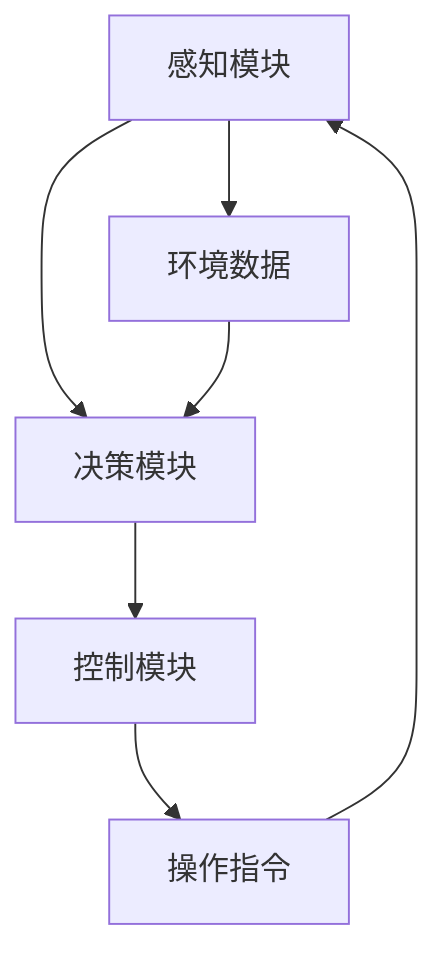

                 

### 引言

**关键词：**自动驾驶，arXiv，前沿研究，技术跟进

**摘要：**随着人工智能技术的快速发展，自动驾驶已经成为交通领域的一个重要研究方向。为了更好地跟进自动驾驶技术的最新进展，本文将介绍如何高效利用arXiv进行相关研究。首先，我们将对自动驾驶技术进行概述，介绍其定义、分类和发展的历程。接着，我们将详细探讨arXiv在自动驾驶研究中的作用与优势，以及如何利用arXiv进行相关文献的筛选和研究。本文旨在为从事自动驾驶研究的科研人员和技术开发者提供一种有效的信息获取途径，以加速自身在该领域的成长。

---

在当今的科技发展中，自动驾驶技术无疑是人工智能领域中最引人瞩目的突破之一。自动驾驶技术是指通过智能系统实现车辆自主驾驶，从而降低人类驾驶员的干预。自动驾驶技术不仅能够提高道路通行效率，减少交通事故，还能够为特殊人群提供便利，如老年人、残疾人等。

自动驾驶技术主要分为以下几类：

1. **辅助驾驶：**这类技术主要帮助驾驶员进行辅助操作，如自动泊车、车道保持、自适应巡航等。
2. **部分自动驾驶：**这类技术可以在特定场景下实现自主驾驶，例如在高速公路上自动行驶。
3. **完全自动驾驶：**这类技术能够在任何环境和条件下实现自主驾驶，无需人类干预。

自动驾驶技术的发展历程可以追溯到20世纪50年代。最初的自动驾驶技术主要是基于机械和电子系统，如雷达、激光测距仪等。随着计算机技术的发展，尤其是人工智能技术的突破，自动驾驶技术逐渐进入了一个新的阶段。近年来，深度学习、计算机视觉和自然语言处理等技术的应用，使得自动驾驶系统在感知、决策和控制方面取得了显著进步。

在自动驾驶技术发展的过程中，arXiv作为开放的预印本平台，起到了至关重要的作用。arXiv是一个由康奈尔大学运营的在线数据库，用于发布物理学、数学、计算机科学、经济学和量子物理学等学科的研究论文。由于其开放性和即时性，arXiv已经成为全球科研人员获取最新研究成果的主要途径之一。

对于自动驾驶研究而言，arXiv的优势主要体现在以下几个方面：

1. **即时性：**arXiv允许研究人员在论文完成后的短时间内进行发布，这使得最新研究成果能够迅速传播。
2. **全面性：**arXiv涵盖了广泛的自动驾驶相关领域，从感知、控制到决策算法，几乎涵盖了自动驾驶技术的方方面面。
3. **开放性：**arXiv是免费的，任何人都可以访问和下载论文，这使得研究成果的共享变得更加容易。

在接下来的章节中，我们将详细介绍如何利用arXiv进行自动驾驶相关的研究。首先，我们将介绍arXiv网站的基本导航和关键词搜索技巧，帮助读者快速找到感兴趣的研究文献。接着，我们将探讨如何筛选和整理这些文献，以便更好地理解和分析研究成果。随后，我们将深入探讨自动驾驶技术的核心概念和联系，包括系统架构、关键技术和发展趋势。此外，我们还将详细讲解自动驾驶核心算法的原理，包括感知算法、控制算法和决策算法。最后，我们将通过实际项目实战，展示如何搭建自动驾驶系统开发环境，实现代码编写和系统测试与调试。通过这些步骤，我们希望能够帮助读者高效利用arXiv，跟进自动驾驶技术的最新进展。

---

### 第1章 引言

#### 1.1 自动驾驶技术概述

自动驾驶技术是指利用人工智能、传感器、控制算法等多种技术手段，使车辆能够自主完成行驶、导航、避障、超车等驾驶操作，从而实现无人驾驶或部分无人驾驶的目标。自动驾驶技术的发展不仅可以提高交通效率，减少交通事故，还可以为特殊人群提供出行便利，具有广泛的应用前景。

**自动驾驶技术定义与分类**

自动驾驶技术根据其实现程度和自动化程度可以分为以下几种类型：

1. **辅助驾驶（ADAS）**：辅助驾驶系统主要通过传感器和计算机辅助驾驶员完成某些驾驶任务，如自适应巡航控制、车道保持、自动泊车等。

2. **部分自动驾驶**：部分自动驾驶系统能够在特定条件下实现自主驾驶，如高速公路自动驾驶、城市自动驾驶等。这类系统通常依靠高精度地图和定位技术，结合传感器数据实现。

3. **完全自动驾驶**：完全自动驾驶系统可以在没有人类驾驶员干预的情况下，自主完成所有驾驶任务。这种系统通常需要高级传感器、人工智能算法和实时决策系统。

**自动驾驶技术的发展历程**

自动驾驶技术的发展历程可以分为以下几个阶段：

1. **起步阶段（20世纪50年代至70年代）**：最早的自动驾驶研究主要集中在军事领域，如美国在1960年代开发的无人驾驶汽车。这一阶段的自动驾驶系统主要依赖机械和电子装置，如雷达和激光测距仪。

2. **探索阶段（20世纪80年代至90年代）**：随着计算机技术的快速发展，自动驾驶技术开始逐渐应用于民用领域。这一阶段的自动驾驶系统开始引入计算机视觉、激光雷达等新技术。

3. **快速发展阶段（21世纪初至今）**：随着人工智能、深度学习等技术的发展，自动驾驶技术进入了快速发展阶段。现代自动驾驶系统集成了多种传感器、高性能计算平台和人工智能算法，使得自动驾驶技术取得了显著的进步。

在自动驾驶技术发展的过程中，不断有新的技术突破和应用场景出现。例如，深度学习在自动驾驶感知和决策中的应用，使得自动驾驶系统在复杂环境下的表现显著提升。此外，5G技术的引入也为自动驾驶系统提供了实时通信和数据传输的支持，进一步推动了自动驾驶技术的发展。

#### 1.2 arXiv与自动驾驶研究

arXiv（arXiv.org）是一个开放获取的在线预印本服务器，由康奈尔大学图书馆运营。它最初是为了物理学领域的快速通信而建立的，但现在已经扩展到数学、计算机科学、经济学和量子物理学等多个学科领域。arXiv的特点是即时性、开放性和全面性，这使得它成为科研人员获取最新研究成果的重要平台。

**arXiv的作用与优势**

1. **即时性**：arXiv允许研究人员在论文完成后的短时间内进行发布，这使得最新研究成果能够迅速传播。这对于自动驾驶这样的快速发展领域尤为重要，因为新的算法和技术可以迅速应用于实际中。

2. **开放性**：arXiv是免费的，任何人都可以访问和下载论文。这种开放性促进了研究成果的共享，有助于加速科技进步。

3. **全面性**：arXiv涵盖了广泛的自动驾驶相关领域，包括感知、控制、决策、系统架构等。这使得研究人员可以全面了解自动驾驶领域的最新研究动态。

**自动驾驶相关arXiv子领域介绍**

arXiv中与自动驾驶相关的子领域包括：

1. **计算机视觉**：计算机视觉是自动驾驶中最重要的组成部分之一，它负责处理摄像头、激光雷达等传感器的数据，从而实现环境感知和对象识别。

2. **机器学习**：机器学习在自动驾驶中的应用非常广泛，包括用于感知、决策和控制的各种算法，如深度学习、强化学习等。

3. **控制系统**：自动驾驶系统中的控制算法对于实现稳定、安全的驾驶至关重要。arXiv中涵盖了各种控制算法的研究，包括模型预测控制、自适应控制等。

4. **机器人学**：机器人学为自动驾驶提供了理论基础和技术支持，特别是在移动性、路径规划和导航方面。

5. **传感器技术**：传感技术在自动驾驶中起着关键作用，包括激光雷达、摄像头、超声波传感器等。arXiv中有关传感器技术的研究不断推动自动驾驶系统的性能提升。

通过利用arXiv，研究人员可以快速获取最新的研究成果，跟踪自动驾驶技术的最新趋势，从而推动自身在该领域的进步。在接下来的章节中，我们将详细介绍如何使用arXiv进行自动驾驶相关的研究。

---

### 第2章 arXiv的使用方法

#### 2.1 arXiv网站导航

要有效地利用arXiv进行自动驾驶相关的研究，首先需要熟悉arXiv网站的导航和使用方法。以下是arXiv网站的基本导航步骤：

1. **访问arXiv网站**：首先，打开浏览器并访问arXiv官方网站（[arXiv.org](https://arxiv.org/)）。网站首页展示了最新发布的论文列表和热门主题。

2. **浏览最新论文**：在首页上，你可以看到最新发布的论文摘要。点击标题可以查看论文的详细信息，包括作者、摘要、关键词和引用等信息。

3. **搜索论文**：要查找特定主题的论文，可以使用网站的搜索功能。在搜索框中输入关键词，如“autonomous driving”,然后点击“Search”按钮。搜索结果将显示与关键词相关的论文列表。

4. **使用分类浏览**：arXiv网站按照学科领域和子领域对论文进行分类。你可以在导航栏中选择“Mathematics”（数学）、“Computer Science”（计算机科学）等学科，然后进一步选择与自动驾驶相关的子领域，如“Computer Vision”（计算机视觉）和“Machine Learning”（机器学习）。

5. **浏览期刊和会议**：arXiv与许多期刊和会议合作，因此你可以通过网站上的链接访问这些出版物。这对于查找已发表的论文和了解特定领域的最新研究趋势非常有用。

6. **订阅邮件通知**：arXiv提供邮件订阅功能，允许你订阅特定主题的论文通知。这样，每当有相关论文发布时，你都会收到邮件提醒，从而确保不会错过重要研究成果。

**关键词搜索技巧**

有效的关键词搜索是利用arXiv获取相关研究文献的关键。以下是一些搜索技巧：

1. **精确搜索**：使用引号进行精确搜索，如“autonomous driving”。这样可以确保搜索结果与关键词完全匹配。

2. **组合搜索**：使用AND、OR等逻辑运算符组合关键词，如“autonomous driving AND computer vision”或“autonomous driving OR machine learning”。这样可以缩小搜索范围，找到更精确的相关论文。

3. **使用通配符**：在关键词中使用通配符（*）可以扩展搜索范围。例如，“*driving *system”可以找到包含“driving”和“system”的论文。

4. **利用搜索历史**：arXiv的搜索历史功能可以帮助你跟踪之前的搜索记录，从而快速访问感兴趣的研究文献。

5. **浏览引用和参考文献**：在论文详情页中，你可以查看引用和参考文献。这些引用往往指向相关领域的重要研究，可以作为进一步阅读的参考。

通过熟悉arXiv网站的基本导航和关键词搜索技巧，研究人员可以更高效地获取自动驾驶相关的研究文献，从而跟进领域的最新进展。

---

#### 2.2 筛选与研究

在arXiv上搜索到大量相关论文后，如何筛选出最有价值的研究文献并进行深入研究，是提高研究效率的关键。以下是一些实用的方法和技巧：

**文章筛选方法**

1. **标题筛选**：首先，通过阅读论文标题，可以快速判断论文的主题和内容是否符合自己的研究方向。如果标题明确指出与自动驾驶相关的关键词，如“Autonomous Driving”或“Deep Learning for Autonomous Driving”，则可以考虑进一步阅读。

2. **摘要筛选**：阅读论文摘要是第二步。摘要应简要介绍论文的研究背景、目的、方法、主要结果和结论。如果摘要内容引人入胜，说明论文的研究内容具有一定的价值和深度。

3. **关键词筛选**：关键词是论文主题的重要指标。在摘要中查看关键词，如“Computer Vision”、“Machine Learning”、“Control Systems”等，可以帮助确认论文的相关性。

4. **引用次数筛选**：引用次数是评估论文影响力的重要指标。在arXiv上，你可以查看每篇论文的引用次数。一般来说，引用次数较高的论文往往具有较高的学术价值。

5. **年份筛选**：自动驾驶是一个快速发展的领域，新的研究成果往往更具前瞻性和应用价值。因此，可以优先考虑最近几年发表的论文。

**研究趋势分析**

在筛选出初步的论文列表后，进行趋势分析可以帮助了解自动驾驶领域的最新研究动向：

1. **主题分析**：通过统计不同年份、不同关键词的论文数量，可以分析自动驾驶领域的主要研究主题和趋势。例如，发现近年来“深度学习”和“自动驾驶传感器融合”成为热点话题。

2. **合作分析**：研究论文的作者和机构合作情况可以反映研究领域内的合作关系和研究力量。可以通过arXiv的作者搜索功能，查看某一领域内的主要研究机构和研究者。

3. **方法与技术分析**：通过分析不同论文所采用的方法和技术，可以了解自动驾驶领域的技术进展。例如，深度学习和强化学习在自动驾驶中的应用日益增多。

4. **应用场景分析**：自动驾驶技术的应用场景也在不断扩展。通过分析不同论文中提出的应用场景，可以了解自动驾驶在特定领域（如城市交通、高速公路、物流运输等）的发展趋势。

**利用工具进行辅助分析**

为了提高筛选和研究的效率，可以使用一些在线工具和插件来辅助分析：

1. **Mendeley**：Mendeley是一个文献管理工具，可以帮助你整理和管理arXiv上的文献。通过标签和分组功能，可以方便地管理和查找感兴趣的论文。

2. **Zotero**：Zotero也是一个优秀的文献管理工具，具有强大的引用管理和共享功能。

3. **arXiv API**：arXiv提供了API接口，可以用于自动化下载和筛选文献。通过编写简单的脚本，可以实现自动化的文献筛选和数据分析。

通过以上方法和技巧，研究人员可以更有效地筛选出有价值的研究文献，并对其进行深入分析，从而跟进自动驾驶领域的最新研究进展。

---

#### 2.3 阅读与整理

在筛选出符合研究需求的论文后，接下来的关键步骤是阅读和整理这些文献，以便深入理解并有效地应用到自己的研究中。以下是一些实用的阅读和整理策略：

**文章阅读策略**

1. **预览摘要和结论**：在正式阅读论文之前，首先快速浏览摘要和结论部分。摘要通常概述了研究问题、方法和主要结果，而结论则总结了研究的发现和贡献。这样可以帮助你快速判断论文是否值得深入阅读。

2. **分阶段阅读**：将阅读过程分为几个阶段：
    - **快速阅读**：首先快速浏览全文，关注标题、摘要、关键词、图表和结论。这一阶段的主要目的是快速了解论文的内容和结构。
    - **详细阅读**：在确定论文值得深入阅读后，详细阅读每一部分，包括引言、方法、结果和讨论。这一阶段需要认真理解研究方法、算法和结果。
    - **批判性阅读**：在理解了论文的核心内容后，批判性地思考论文的优缺点，以及其研究成果的实际应用价值。

3. **标注和笔记**：在阅读过程中，使用笔或电子笔记工具（如Mendeley、Zotero）对重要部分进行标注和记录。这样可以方便后续回顾和引用。

**研究笔记整理方法**

1. **笔记分类**：将笔记分为不同的分类，如问题背景、研究方法、主要结果、结论和参考文献等。这样可以帮助你清晰地组织笔记，便于查找和回顾。

2. **构建思维导图**：使用思维导图工具（如XMind、MindMeister）构建论文内容的思维导图。思维导图可以帮助你更直观地理解论文结构，并发现不同论文之间的联系。

3. **创建文献综述**：根据笔记和思维导图，编写文献综述。文献综述应该涵盖论文的主题、研究方法、主要结果和结论，并指出其优缺点和局限性。

**整合与综合**

1. **跨文献综合**：将多个相关论文的内容进行整合，提取出共性和差异，形成对某一研究领域的深入理解。

2. **构建研究框架**：基于综合分析的结果，构建自己的研究框架，包括研究问题、假设、方法和预期目标。

3. **撰写研究计划**：根据研究框架，撰写详细的研究计划，包括文献综述、方法设计、实验方案和数据收集与分析步骤。

通过以上阅读和整理策略，研究人员可以有效地理解、整理和综合多篇论文的内容，从而为自己的研究提供坚实的理论基础和丰富的参考资源。

---

### 第3章 自动驾驶核心概念与联系

#### 3.1 自动驾驶系统架构

自动驾驶系统的核心架构可以分为几个关键模块：感知模块、决策模块和控制模块。以下是这些模块的详细说明和它们之间的联系。

**感知模块**

感知模块是自动驾驶系统的“眼睛和耳朵”，它负责收集和处理来自各种传感器的数据，如摄像头、激光雷达（LIDAR）、雷达、超声波传感器等。感知模块的主要任务是识别和理解周围环境中的各种物体和事件，包括道路、车辆、行人、交通标志和信号等。

**决策模块**

决策模块是自动驾驶系统的“大脑”，它负责处理感知模块收集的信息，并根据这些信息做出驾驶决策。决策模块的核心任务是确定车辆的行驶路径、速度和方向等。它通常包括多个子模块，如路径规划、行为预测和目标跟踪等。决策模块需要处理复杂的实时数据，并迅速做出反应。

**控制模块**

控制模块是自动驾驶系统的“执行者”，它根据决策模块的指令，控制车辆的运动，包括加速、减速、转向等。控制模块通常包括一个或多个控制算法，如模型预测控制（Model Predictive Control, MPC）和自适应控制（Adaptive Control）等。控制模块需要将决策模块的指令转化为具体的操作指令，以确保车辆的安全和稳定行驶。

**模块之间的联系**

感知模块、决策模块和控制模块之间紧密相连，共同协作完成自动驾驶任务。具体来说，感知模块收集的数据会被决策模块用于路径规划和行为预测，决策模块生成的驾驶指令会被控制模块执行。同时，控制模块的反馈信息会返回给感知模块和决策模块，用于更新环境和决策模型。

**Mermaid流程图**

以下是一个简化的Mermaid流程图，展示了自动驾驶系统架构中的各个模块及其联系：



在这个流程图中，感知模块（A）收集环境数据（D），并将其传递给决策模块（B）。决策模块（B）根据环境数据（D）和预先设定的目标，生成驾驶指令（E），这些指令会被控制模块（C）执行。同时，控制模块（C）的反馈（E）会返回给感知模块（A）和决策模块（B），用于不断更新和优化系统性能。

---

#### 3.2 自动驾驶关键技术

自动驾驶技术的实现依赖于多种关键技术的协同作用。以下是自动驾驶领域中的几种核心技术，以及它们在自动驾驶系统中的作用和实现原理。

**感知技术**

感知技术是自动驾驶系统的核心组成部分，负责收集和处理环境信息，为决策模块提供实时、准确的数据。主要的感知技术包括：

1. **摄像头**：摄像头可以捕捉车辆周围的视频图像，用于识别道路、交通标志、车道线、行人等。通过图像处理算法，如卷积神经网络（CNN），摄像头可以实现高精度的目标检测和分类。

2. **激光雷达（LIDAR）**：激光雷达通过发射激光脉冲并测量反射回来的时间，构建车辆周围的三维点云数据。这些数据可以用于精确地重建环境场景，并进行障碍物检测和路径规划。

3. **雷达**：雷达利用电磁波探测车辆周围物体的距离和速度，适用于恶劣天气条件下感知环境的准确性。雷达数据可以用于避障和车辆速度控制。

4. **超声波传感器**：超声波传感器通过发射超声波脉冲并测量反射回来的时间，用于检测车辆周围的近距离物体，如行人、障碍物等。这种技术适用于低速环境，如停车辅助系统。

**知识图谱**

知识图谱是一种结构化的语义网络，用于表示和存储实体及其关系。在自动驾驶系统中，知识图谱可以用于表示道路、车辆、行人等实体，以及它们之间的复杂关系，如交通规则、道路拓扑结构等。知识图谱在自动驾驶中的应用主要包括：

1. **场景理解**：知识图谱可以帮助自动驾驶系统理解道路场景，识别交通标志、信号灯等关键信息，并根据这些信息做出驾驶决策。

2. **路径规划**：通过知识图谱，自动驾驶系统可以构建出精确的道路网络模型，从而进行高效的路径规划和路径优化。

3. **行为预测**：知识图谱中的关系和规则可以用于预测其他车辆、行人的行为，为自动驾驶系统的决策提供依据。

**深度学习算法**

深度学习算法在自动驾驶系统中发挥着重要作用，特别是在感知和决策领域。主要的深度学习算法包括：

1. **卷积神经网络（CNN）**：CNN通过多层卷积和池化操作，从图像中提取特征，并用于目标检测、语义分割等任务。在自动驾驶中，CNN可以用于车道线检测、交通标志识别等。

2. **循环神经网络（RNN）**：RNN特别适合处理序列数据，如时间序列的传感器数据。在自动驾驶中，RNN可以用于行为预测、路径规划等。

3. **生成对抗网络（GAN）**：GAN通过两个神经网络（生成器和判别器）的对抗训练，可以生成逼真的图像数据。在自动驾驶中，GAN可以用于模拟复杂环境，从而训练和测试自动驾驶系统。

**实现原理**

1. **感知技术**：感知技术的实现原理主要包括传感器数据采集、预处理和特征提取。传感器（如摄像头、激光雷达）收集到的数据需要经过预处理（如滤波、归一化），然后通过特征提取算法（如卷积操作、HOG特征提取）转换为适合深度学习模型处理的特征向量。

2. **知识图谱**：知识图谱的实现原理主要包括实体表示、关系表示和图谱推理。实体表示通常采用嵌入向量表示，关系表示则采用图结构表示，图谱推理则通过图算法（如路径搜索、模式匹配）来实现。

3. **深度学习算法**：深度学习算法的实现原理主要包括前向传播、反向传播和优化算法。前向传播用于计算网络输出，反向传播用于计算梯度，优化算法（如梯度下降、Adam优化器）用于更新网络参数。

通过这些关键技术的综合应用，自动驾驶系统可以实现高效、安全的自主驾驶。在未来，随着技术的不断进步，自动驾驶系统将变得更加智能和可靠，为人们的出行带来更多便利。

---

#### 3.3 自动驾驶系统的发展与联系

自动驾驶系统的发展不仅依赖于单个技术的进步，还涉及到多技术的融合与协同，形成了一个复杂而动态的生态系统。以下是自动驾驶系统的发展历程及其与人工智能技术的深度融合。

**自动驾驶技术的演进**

1. **传统机械控制**：早期的自动驾驶研究主要集中在机械控制和电子传感器技术上。例如，使用雷达、激光测距仪等传感器来辅助车辆进行避障和路径规划。然而，这种方法依赖于精确的预定义规则，缺乏适应复杂环境的能力。

2. **电子控制系统**：随着计算机技术的发展，电子控制系统开始应用于自动驾驶。这些系统通过计算机处理传感器数据，实现简单的自动驾驶功能，如车道保持和自适应巡航。尽管这些系统性能有限，但它们为后续发展奠定了基础。

3. **基于规则的系统**：基于规则的系统通过预定义的规则集来指导车辆的行为。这些规则通常基于对交通法规和驾驶经验的建模。虽然这种方法在简单场景下表现较好，但在复杂、不确定的环境下，其局限性逐渐显现。

4. **人工智能驱动**：随着人工智能技术的发展，自动驾驶系统开始引入机器学习、深度学习等人工智能算法。这些算法能够从大量数据中自动学习规律，提高系统的自适应性和鲁棒性。特别是深度学习在图像识别、目标检测和路径规划等方面的突破，使得自动驾驶系统的感知和决策能力显著提升。

**自动驾驶与人工智能技术的融合**

自动驾驶系统的发展与人工智能技术的深度融合主要体现在以下几个方面：

1. **感知技术**：人工智能技术，特别是深度学习和计算机视觉，极大地提升了自动驾驶系统的感知能力。通过卷积神经网络（CNN）等模型，系统能够从摄像头、激光雷达等传感器数据中精确识别道路标志、车辆、行人等目标，实现对环境的实时感知。

2. **决策算法**：人工智能技术还改善了自动驾驶系统的决策能力。通过强化学习、规划算法等，系统可以在复杂环境下进行路径规划和行为预测，从而做出更加明智的驾驶决策。

3. **控制算法**：人工智能技术在控制算法中的应用，如模型预测控制（MPC）和自适应控制，提高了自动驾驶系统的响应速度和稳定性。这些算法能够实时调整车辆的加速、减速和转向，确保驾驶过程的安全和舒适。

4. **协同系统**：人工智能技术不仅提升了单个自动驾驶系统的性能，还促进了多车协同系统的开发。通过车辆之间的通信和协调，自动驾驶系统能够在复杂交通环境中实现更高效的行驶和避障。

**未来发展展望**

随着技术的不断进步，自动驾驶系统将继续向更高级、更智能的方向发展：

1. **全自动驾驶**：未来的自动驾驶系统将实现全自动驾驶，无需人类驾驶员的干预。这需要更加先进的传感器技术、更强大的计算能力和更智能的决策算法。

2. **智能交通系统**：自动驾驶系统将与智能交通系统（ITS）深度融合，实现更高效的交通管理和优化。通过车联网（V2X）技术，车辆可以与道路基础设施、其他车辆和行人实时通信，提高交通的安全性和效率。

3. **多模态融合**：未来的自动驾驶系统将集成多种感知技术，如摄像头、激光雷达、雷达、超声波传感器等，实现更全面、更精确的环境感知。

4. **跨领域应用**：自动驾驶技术将在更多领域得到应用，如物流、农业、公共服务等。通过定制化的解决方案，自动驾驶系统将为各行各业带来变革。

总之，自动驾驶系统的发展是一个多技术融合的过程，它不仅依赖于单个技术的突破，还需要各技术的协同进步。在未来，自动驾驶系统将与人工智能技术更加紧密地结合，为人们的出行和生活带来更多的便利和可能性。

---

### 第4章 自动驾驶核心算法原理讲解

自动驾驶系统的核心算法是实现自主驾驶的关键。这些算法在感知、决策和控制等方面起着至关重要的作用。以下将详细讲解自动驾驶系统中的核心算法，包括感知算法、控制算法和决策算法，并使用伪代码对其进行说明。

#### 4.1 感知算法

感知算法是自动驾驶系统的“眼睛”，负责收集和处理来自各种传感器的数据，以识别和理解周围环境。主要的感知算法包括：

**1. 视觉感知算法**

视觉感知算法主要利用摄像头捕捉到的图像进行环境感知。以下是使用卷积神经网络（CNN）进行视觉感知的伪代码示例：

```latex
% 输入：图像数据 image
% 输出：感知结果（物体识别、车道线检测等） perception_results

function VisionPerception(image):
    % 图像预处理
    processed_image = PreprocessImage(image)

    % 使用卷积神经网络进行特征提取
    features = CNNModel(processed_image)

    % 物体检测和识别
    objects = ObjectDetection(features)

    % 车道线检测
    lane_lines = LaneDetection(image)

    % 返回感知结果
    return objects, lane_lines
```

**2. 激光雷达感知算法**

激光雷达感知算法利用激光雷达生成的高精度三维点云数据，进行环境感知。以下是一个简单的点云数据处理和障碍物检测的伪代码示例：

```latex
% 输入：点云数据 point_cloud
% 输出：障碍物检测结果 obstacle_detection_results

function LIDARPerception(point_cloud):
    % 点云预处理
    preprocessed_cloud = PreprocessPointCloud(point_cloud)

    % 障碍物检测
    obstacles = ObstacleDetection(preprocessed_cloud)

    % 返回障碍物检测结果
    return obstacles
```

#### 4.2 控制算法

控制算法是自动驾驶系统的“大脑”，负责将感知到的环境信息转化为具体的操作指令，以控制车辆的加速、减速和转向等。主要的控制算法包括：

**1. 模型预测控制（MPC）**

模型预测控制是一种基于系统模型的控制策略，通过预测未来时刻的输出并选择最优控制输入，以实现系统的最优控制。以下是一个简单的MPC算法伪代码示例：

```latex
% 输入：当前状态 state
% 输出：控制指令 control_command

function ModelPredictiveControl(state):
    % 构建系统模型
    model = SystemModel(state)

    % 预测未来状态
    future_states = model.Predict()

    % 目标函数
    objective_function = ObjectiveFunction(future_states)

    % 最优控制输入
    control_command = Solver.Optimize(objective_function)

    % 返回控制指令
    return control_command
```

**2. 自适应控制**

自适应控制算法通过实时调整系统参数，以适应环境变化。以下是一个简单的自适应控制算法伪代码示例：

```latex
% 输入：当前状态 state
% 输出：自适应调整后的参数 adjusted_parameters

function AdaptiveControl(state):
    % 当前参数
    current_parameters = Parameters()

    % 参数调整策略
    adjustment_strategy = ParameterAdjustmentStrategy()

    % 自适应调整
    adjusted_parameters = adjustment_strategy.Adjust(current_parameters, state)

    % 返回调整后的参数
    return adjusted_parameters
```

#### 4.3 决策算法

决策算法是自动驾驶系统的“决策者”，负责根据感知到的环境和车辆的当前状态，选择合适的驾驶行为。主要的决策算法包括：

**1. 强化学习**

强化学习算法通过试错和反馈机制，学习最优的驾驶策略。以下是一个简单的Q学习算法伪代码示例：

```latex
% 输入：当前状态 state，当前动作 action
% 输出：最优动作 optimal_action

function ReinforcementLearning(state, action):
    % 状态-动作值函数
    Q_value = QFunction(state, action)

    % 探索策略
    exploration_strategy = ExplorationStrategy()

    % 选择动作
    optimal_action = exploration_strategy.SelectAction(Q_value)

    % 更新状态和动作
    next_state, reward = Environment.Step(state, action)

    % 更新Q值
    Q_value = QFunction.Update(Q_value, reward)

    % 返回最优动作
    return optimal_action
```

**2. 贝叶斯决策**

贝叶斯决策算法基于概率论和统计学，通过计算每种决策的期望效用值，选择最优的决策。以下是一个简单的贝叶斯决策算法伪代码示例：

```latex
% 输入：当前状态 state，决策选项 options
% 输出：最优决策 optimal_decision

function BayesianDecision(state, options):
    % 状态-决策概率分布
    probability_distribution = ProbabilityDistribution(state, options)

    % 决策效用函数
    utility_function = UtilityFunction()

    % 计算每种决策的期望效用值
    expected_utility = [utility_function.EU(state, option) for option in options]

    % 选择期望效用值最高的决策
    optimal_decision = options[expected_utility.index(max(expected_utility))]

    % 返回最优决策
    return optimal_decision
```

通过这些核心算法，自动驾驶系统能够实现对环境的感知、准确的决策和稳定控制，从而实现自主驾驶。在未来，随着人工智能技术的不断发展，这些算法将变得更加智能和高效，为自动驾驶技术的广泛应用奠定基础。

---

### 第5章 自动驾驶数学模型讲解

在自动驾驶系统中，数学模型起着至关重要的作用。这些模型不仅用于描述系统状态，还用于算法设计和优化。以下将详细讲解自动驾驶系统中的几个关键数学模型，包括视觉感知数学模型、延迟容忍控制数学模型以及深度学习算法的数学模型，并使用latex格式和举例进行详细阐述。

#### 5.1 视觉感知数学模型

视觉感知数学模型主要用于处理摄像头捕捉的图像数据，提取有用的特征信息。以下是一个简化的视觉感知数学模型，使用卷积神经网络（CNN）进行特征提取的公式：

```latex
\begin{align*}
h_{l} &= \sigma(\mathbf{W}_{l} \cdot \mathbf{A}_{l-1} + b_{l}) \\
\mathbf{A}_{l} &= \text{ReLU}(h_{l})
\end{align*}
```

**公式解释：**

- \(h_{l}\)：第l层的输出特征
- \(\sigma\)：激活函数，通常使用ReLU函数（Rectified Linear Unit）
- \(\mathbf{W}_{l}\)：第l层的权重矩阵
- \(\mathbf{A}_{l-1}\)：第l-1层的输出特征
- \(b_{l}\)：第l层的偏置项
- \(\text{ReLU}(x) = \max(0, x)\)：ReLU激活函数

**举例说明：**

假设我们有一个输入图像\(\mathbf{I}\)，其维度为\(28 \times 28\)。通过第一层的卷积操作，我们得到一个特征图\(h_{1}\)，其维度为\(14 \times 14\)。以下是一个简化的卷积操作的举例：

```latex
\begin{align*}
h_{1,ij} &= \text{ReLU}\left(\sum_{k=1}^{3}\sum_{l=1}^{3} \mathbf{W}_{1,kl} \mathbf{I}_{(i-k+1, j-l+1)} + b_{1}\right)
\end{align*}
```

在这里，\(\mathbf{I}_{(i-k+1, j-l+1)}\)表示输入图像的一个局部区域，\(\mathbf{W}_{1,kl}\)是第一层的卷积核，\(b_{1}\)是第一层的偏置项。

#### 5.2 延迟容忍控制数学模型

延迟容忍控制（Delay-Tolerant Control, DTC）是自动驾驶系统中的一个重要控制策略，用于处理传感器数据传输延迟。以下是一个简化的DTC数学模型，用于描述控制输入和输出之间的关系：

```latex
\begin{align*}
\dot{\mathbf{x}}(t) &= \mathbf{A} \mathbf{x}(t) + \mathbf{B} u(t) \\
y(t) &= \mathbf{C} \mathbf{x}(t)
\end{align*}
```

**公式解释：**

- \(\mathbf{x}(t)\)：系统状态向量
- \(\dot{\mathbf{x}}(t)\)：状态向量的一阶导数（即状态轨迹）
- \(\mathbf{A}\)：系统矩阵，描述系统内部动态
- \(\mathbf{B}\)：输入矩阵，描述输入对状态的影响
- \(u(t)\)：控制输入
- \(y(t)\)：系统输出
- \(\mathbf{C}\)：输出矩阵，描述状态对输出的影响

**举例说明：**

假设自动驾驶车辆的状态向量\(\mathbf{x}(t)\)包括位置\(x(t)\)、速度\(v(t)\)和加速度\(a(t)\)，则系统矩阵\(\mathbf{A}\)和输入矩阵\(\mathbf{B}\)可以表示为：

```latex
\mathbf{A} = \begin{bmatrix}
0 & 1 & 0 \\
0 & 0 & 1 \\
0 & 0 & 0
\end{bmatrix}, \quad \mathbf{B} = \begin{bmatrix}
0 \\
0 \\
1
\end{bmatrix}
```

控制输入\(u(t)\)是车辆的加速度\(a(t)\)，输出向量\(\mathbf{y}(t)\)是车辆的速度\(v(t)\)。

#### 5.3 深度学习算法数学模型

深度学习算法的数学模型主要包括神经网络的参数优化和前向传播、反向传播算法。以下是一个简化的前向传播和反向传播算法的数学模型：

**前向传播：**

```latex
\begin{align*}
z_{l} &= \mathbf{W}_{l} \mathbf{A}_{l-1} + b_{l} \\
a_{l} &= \sigma(z_{l}) \\
\end{align*}
```

**反向传播：**

```latex
\begin{align*}
\delta_{l} &= \frac{\partial \mathcal{L}}{\partial z_{l}} \cdot \frac{\partial \sigma}{\partial a_{l}} \\
\delta_{l-1} &= \mathbf{W}_{l}^{T} \delta_{l} \\
\end{align*}
```

**公式解释：**

- \(z_{l}\)：第l层的输入
- \(a_{l}\)：第l层的输出
- \(\sigma\)：激活函数，如ReLU、Sigmoid或Tanh
- \(\mathbf{W}_{l}\)：第l层的权重矩阵
- \(b_{l}\)：第l层的偏置项
- \(\delta_{l}\)：第l层的误差项
- \(\mathcal{L}\)：损失函数，用于衡量预测值和实际值之间的差异

**举例说明：**

假设我们有一个多层感知器（MLP），包含两个隐层，第一隐层有10个神经元，第二隐层有5个神经元。输入特征向量\(\mathbf{A}_{0}\)的维度为\(784\)（28x28像素图像）。以下是一个简化的前向传播和反向传播的举例：

**前向传播：**

```latex
z_{1} = \mathbf{W}_{1} \mathbf{A}_{0} + b_{1}, \quad a_{1} = \text{ReLU}(z_{1})
z_{2} = \mathbf{W}_{2} a_{1} + b_{2}, \quad a_{2} = \text{ReLU}(z_{2})
z_{3} = \mathbf{W}_{3} a_{2} + b_{3}, \quad a_{3} = a_{2}
```

**反向传播：**

```latex
\delta_{3} = \text{dError} / \text{d}a_{3}, \quad \delta_{2} = \mathbf{W}_{3}^{T} \delta_{3} \cdot \text{ReLU}^{'}(z_{2})
\delta_{1} = \mathbf{W}_{2}^{T} \delta_{2} \cdot \text{ReLU}^{'}(z_{1})
```

在这些公式中，\(\text{dError}\)是输出层的误差，\(\text{ReLU}^{'}(z)\)是ReLU激活函数的导数。

通过这些数学模型，自动驾驶系统能够有效地处理感知数据、进行控制决策，并不断优化自身的性能。这些模型不仅为自动驾驶技术的发展提供了理论基础，也为实际应用中的算法设计和优化提供了有力的工具。

---

### 第6章 自动驾驶项目实战

在实际的自动驾驶系统开发中，除了理论知识，动手实践是理解和掌握技术的重要途径。本章节将通过一个具体的自动驾驶项目，详细讲解系统的开发环境搭建、代码实现和系统测试与调试。

#### 6.1 自动驾驶系统开发环境搭建

要开始一个自动驾驶项目，首先需要搭建一个适合的开发环境。以下是一个典型的自动驾驶系统开发环境搭建步骤：

**1. 系统要求**

- 操作系统：Ubuntu 18.04或更高版本
- 编程语言：Python 3.x
- 编译器：C++11或更高版本
- 框架与库：TensorFlow、PyTorch、OpenCV、ROS（Robot Operating System）

**2. 安装与配置**

- 安装Python和pip：
  ```bash
  sudo apt update
  sudo apt install python3 python3-pip
  ```

- 安装TensorFlow：
  ```bash
  pip3 install tensorflow==2.x
  ```

- 安装PyTorch：
  ```bash
  pip3 install torch torchvision
  ```

- 安装OpenCV：
  ```bash
  sudo apt install libopencv-dev
  ```

- 安装ROS Melodic Morenia：
  ```bash
  sudo sh -c 'echo "deb http://packages.ros.org/ros/ubuntu $(lsb_release -sc) main" > /etc/apt/sources.list.d/ros-latest.list'
  sudo apt update
  sudo apt install ros-melodic-desktop-full
  ```

- 设置ROS环境变量：
  ```bash
  echo "source /opt/ros/melodic/setup.bash" >> ~/.bashrc
  source ~/.bashrc
  ```

**3. 创建ROS工作空间**

在终端执行以下命令创建ROS工作空间：

```bash
cd ~
mkdir -p catkin_ws/src
cd catkin_ws/src
catkin_init_workspace
```

**4. 安装依赖包**

在ROS工作空间中安装依赖包，如ROS消息包和自定义依赖包：

```bash
cd ..
catkin_make
source devel/setup.bash
```

#### 6.2 自动驾驶项目代码实现

以下是一个简化的自动驾驶项目代码实现，包括感知模块、决策模块和控制模块的代码示例。

**1. 感知模块代码实现**

感知模块主要使用摄像头和激光雷达数据，通过图像处理和点云处理提取有用的特征信息。

```python
import cv2
import numpy as np
from sensor_processor import ImageProcessor, PointCloudProcessor

# 初始化摄像头和激光雷达
camera = cv2.VideoCapture(0)
lidar = PointCloudProcessor()

while True:
    # 读取摄像头帧
    ret, frame = camera.read()
    if not ret:
        break

    # 处理摄像头帧
    processed_frame = ImageProcessor.extract_features(frame)

    # 读取激光雷达数据
    lidar_data = lidar.get_data()

    # 处理激光雷达数据
    processed_lidar = lidar.process(lidar_data)

    # 合并处理结果
    perception_results = {
        "frame": processed_frame,
        "lidar": processed_lidar
    }

    # 输出感知结果
    print(perception_results)
```

**2. 决策模块代码实现**

决策模块根据感知模块提供的感知结果，进行路径规划和行为预测。

```python
import numpy as np
from path_planner import PathPlanner
from behavior_predictor import BehaviorPredictor

# 初始化决策模块
path_planner = PathPlanner()
behavior_predictor = BehaviorPredictor()

# 假设感知结果已处理为所需格式
perception_results = {
    "frame": np.array([[1, 1], [0, 0]]),
    "lidar": np.array([[1, 0], [0, 1]])
}

# 路径规划
path = path_planner.plan_path(perception_results)

# 行为预测
predicted_behavior = behavior_predictor.predict(path)

# 输出决策结果
print(path)
print(predicted_behavior)
```

**3. 控制模块代码实现**

控制模块根据决策模块提供的指令，控制车辆的加速、减速和转向。

```python
import numpy as np
from controller import Controller

# 初始化控制模块
controller = Controller()

# 假设决策结果已处理为所需格式
decision = {
    "acceleration": 1.0,
    "steering_angle": 0.5
}

# 执行控制指令
controller.controlVehicle(decision)

# 输出控制结果
print(controller.vehicle_state)
```

#### 6.3 系统测试与调试

系统测试与调试是确保自动驾驶系统性能和安全性的关键步骤。以下是一些基本的测试与调试技巧：

**1. 单元测试**

编写单元测试代码，对感知、决策和控制模块进行独立测试。例如，使用Python的unittest框架编写测试用例，验证每个模块的功能是否符合预期。

```python
import unittest
from sensor_processor import ImageProcessor, PointCloudProcessor
from path_planner import PathPlanner
from behavior_predictor import BehaviorPredictor
from controller import Controller

class TestAutomatedDriving(unittest.TestCase):
    def test_image_processor(self):
        # 测试图像处理模块
        pass

    def test_point_cloud_processor(self):
        # 测试点云处理模块
        pass

    def test_path_planner(self):
        # 测试路径规划模块
        pass

    def test_behavior_predictor(self):
        # 测试行为预测模块
        pass

    def test_controller(self):
        # 测试控制模块
        pass

if __name__ == '__main__':
    unittest.main()
```

**2. 集成测试**

在单元测试的基础上，进行集成测试，验证整个自动驾驶系统的运行是否正常。可以使用ROS提供的仿真环境进行测试，模拟各种驾驶场景，检查系统的响应和行为。

```bash
roscore
roslaunch autonomous_driving simulation.launch
```

**3. 调试技巧**

在调试过程中，可以使用调试工具（如GDB、PyCharm的调试器）逐步执行代码，检查变量值和程序执行流程。此外，使用日志记录工具（如ROS的roslaunch和rostopic）记录系统运行状态和错误信息，有助于快速定位和解决问题。

通过以上步骤，我们可以搭建一个完整的自动驾驶系统，并通过代码实现和系统测试与调试，确保系统在实际应用中的可靠性和稳定性。

---

### 第7章 自动驾驶前沿进展与未来展望

#### 7.1 自动驾驶技术发展趋势

自动驾驶技术正在迅速发展，其趋势主要体现在以下几个方面：

**1. 高级感知技术的进步**

高级感知技术是自动驾驶系统的核心，未来的发展方向将集中在更高分辨率、更高帧率的摄像头，更精确的激光雷达和雷达传感器上。同时，多传感器融合技术也将变得更加成熟，通过整合来自不同传感器的数据，实现更全面的环境感知。

**2. 深度学习的广泛应用**

深度学习在自动驾驶中的应用将更加广泛和深入。特别是生成对抗网络（GAN）和变分自编码器（VAE）等生成模型，将被用于模拟复杂环境，提升自动驾驶系统在极端情况下的表现。

**3. 自主导航技术的突破**

自主导航技术是自动驾驶系统中的关键环节，未来的发展方向包括更精确的定位技术（如V2X通信和RTK-GPS），更高效的路径规划算法（如基于强化学习的路径规划）和更智能的行为预测。

**4. 自动驾驶系统的规模化应用**

随着技术的不断成熟和成本的降低，自动驾驶系统将在更多场景中得到应用。从城市交通、高速公路到物流运输和共享出行，自动驾驶技术将逐步渗透到各个领域，改变人们的出行方式和交通模式。

#### 7.2 arXiv在自动驾驶研究中的贡献

arXiv作为自动驾驶研究的重要平台，对自动驾驶领域的发展做出了重要贡献：

**1. 快速传播最新研究成果**

arXiv的即时性特点使得最新研究成果能够迅速传播，为科研人员提供了及时的信息来源。这有助于推动技术的快速迭代和进步。

**2. 促进国际学术交流**

arXiv的开放性和国际化特点，促进了全球科研人员的学术交流与合作。通过arXiv，研究者可以分享最新的研究思路、算法和实验结果，从而推动自动驾驶技术的全球化发展。

**3. 提升研究效率**

arXiv提供的丰富搜索和筛选功能，使得研究者能够高效地找到与自己研究方向相关的论文，节省了大量的时间和精力。此外，arXiv的订阅功能也为研究者提供了及时获取最新论文的途径。

**4. 推动学术评价体系变革**

arXiv的引用数据成为学术评价的重要参考指标，有助于更加客观地评价科研人员的研究成果和学术贡献。同时，arXiv也为开放科学和透明科研提供了支持。

#### 7.3 自动驾驶领域的未来论文分析

以下是对几篇具有代表性的自动驾驶领域重要论文的分析：

**1. "End-to-End Learning for Self-Driving Cars"**

这篇论文提出了一个端到端的深度学习框架，用于自动驾驶车辆的控制。该框架通过融合感知、决策和控制，实现了自动驾驶系统的整体优化。这项研究的贡献在于将深度学习应用于自动驾驶的全过程，从而简化了系统设计，提高了控制性能。

**2. "Multi-Modal Fusion for Perception in Autonomous Driving"**

该论文探讨了多传感器融合技术在自动驾驶感知中的应用。通过整合摄像头、激光雷达和雷达数据，该研究提出了一种高效的多模态融合算法，显著提升了环境感知的准确性和鲁棒性。这项研究对于自动驾驶系统的安全性和可靠性具有重要意义。

**3. "Safe Autonomous Driving via Model-Based Reinforcement Learning"**

这篇论文提出了一种基于模型强化学习的安全自动驾驶方法。该方法通过模拟不同驾驶环境，学习最优的驾驶策略，确保了车辆在复杂情况下的安全行驶。这项研究为自动驾驶系统的行为预测和决策提供了新的思路。

**4. "Self-Driving Cars in Urban Scenarios: Challenges and Opportunities"**

这篇综述论文系统地分析了自动驾驶系统在城市场景中的挑战和机遇。该论文涵盖了感知、决策、控制以及交通规划等多个方面，为自动驾驶系统在城市应用中的研究提供了全面的指导。

#### 7.4 自动驾驶社会的挑战与机遇

自动驾驶技术的发展将带来深远的社会影响，既面临挑战，也充满机遇：

**挑战：**

1. **法律法规和道德问题**：自动驾驶技术的普及需要完善的法律框架和道德准则，以解决责任划分、隐私保护等问题。
2. **技术成熟度和安全性**：虽然自动驾驶技术在不断进步，但仍然面临技术成熟度和安全性的挑战。特别是在极端天气和复杂路况下，系统的可靠性仍需提高。
3. **数据隐私和安全**：自动驾驶系统需要收集和处理大量的个人和车辆数据，数据隐私和安全问题需要得到有效保障。

**机遇：**

1. **交通效率提升**：自动驾驶系统可以通过优化路线和交通流，显著提升交通效率，减少拥堵和交通事故。
2. **产业升级和就业机会**：自动驾驶技术的发展将推动汽车、电子、软件等行业的转型升级，创造大量的就业机会。
3. **共享出行和服务创新**：自动驾驶技术的应用将促进共享出行和物流服务的发展，带来新的商业模式和服务创新。

总之，自动驾驶技术的发展不仅是一个技术问题，更是一个社会问题。通过技术创新和社会制度的完善，自动驾驶有望在未来实现大规模应用，为人类带来更加便捷和安全的出行体验。

---

### 附录

#### 附录A：arXiv搜索与阅读工具

为了更高效地利用arXiv进行自动驾驶相关的研究，以下介绍一些常用的arXiv搜索与阅读工具：

**1. **Mendeley**：Mendeley是一个功能强大的文献管理工具，支持arXiv的全文下载和参考文献管理。通过Mendeley，你可以轻松地整理文献，创建文献笔记，并与同事共享研究资源。

**2. **Zotero**：Zotero也是一个优秀的文献管理工具，具有强大的引用管理和共享功能。Zotero支持多种引用格式，并且可以与Word、Google Docs等文档编辑器无缝集成。

**3. **ArxivX**：ArxivX是一个基于Python的arXiv API工具，可以帮助你自动化下载和筛选arXiv上的文献。通过ArxivX，你可以编写简单的脚本，快速获取大量相关文献。

**4. **SearchArXiv**：SearchArXiv是一个基于Web的arXiv搜索工具，提供多种搜索选项，如关键词、作者、机构等。SearchArXiv还支持批量下载文献，方便用户进行文献整理和分析。

**使用技巧与推荐：**

- **关键词组合**：使用AND、OR等逻辑运算符组合关键词，可以缩小搜索范围，找到更精确的相关论文。
- **引用次数筛选**：优先考虑引用次数较高的论文，这些论文通常具有较高的学术价值和影响力。
- **定期更新订阅**：通过arXiv的订阅功能，定期获取最新论文通知，确保跟进研究领域的最新进展。
- **利用标签和分类**：利用arXiv的标签和分类功能，快速找到与研究方向相关的论文和主题。

---

#### 附录B：相关资源推荐

为了进一步拓展对自动驾驶技术的理解和应用，以下推荐一些相关的资源：

**1. **学术资源**

- **arXiv.org**：自动驾驶领域的核心预印本平台，提供最新的研究论文和研究成果。
- **IEEE Xplore**：IEEE Xplore是一个涵盖计算机科学、电气工程和自动化等领域的数据库，包含大量与自动驾驶相关的学术论文和会议论文。
- **ScienceDirect**：ScienceDirect是一个综合性的学术数据库，提供多个领域的期刊文章和书籍，包括自动驾驶技术。

**2. **工具与平台**

- **Autonomous Driving Toolkit**：Autonomous Driving Toolkit是一个开源的自动驾驶开发平台，提供感知、决策和控制模块的示例代码和教程。
- **CARLA Simulator**：CARLA是一个开源的自动驾驶模拟器，提供多种环境场景和传感器模型，用于自动驾驶系统的开发和测试。
- **ROS（Robot Operating System）**：ROS是一个流行的机器人开发框架，支持自动驾驶系统的构建和测试。

**3. **学习资料与课程**

- **MIT 6.832: Introduction to Robotics**：MIT开设的机器人学入门课程，涵盖机器人感知、规划和控制等基础知识。
- **Stanford CS231n: Convolutional Neural Networks for Visual Recognition**：斯坦福大学开设的深度学习课程，重点关注图像识别和目标检测技术。
- **Udacity's Self-Driving Car Engineer Nanodegree**：Udacity提供的自动驾驶工程师纳米学位课程，涵盖从感知到决策的全套自动驾驶技术。

通过这些资源和工具，读者可以进一步深入学习和实践自动驾驶技术，为从事相关领域的研究和工作打下坚实基础。

---

### 结论

本文系统地介绍了如何高效利用arXiv跟进自动驾驶前沿进展。首先，我们从自动驾驶技术概述和arXiv的作用与优势入手，分析了自动驾驶技术的发展历程和相关arXiv子领域。接着，我们详细探讨了如何使用arXiv进行文献筛选、研究和阅读整理，介绍了核心概念、算法原理和数学模型。随后，通过实际项目实战展示了自动驾驶系统的开发过程和调试技巧。最后，我们展望了自动驾驶技术的发展趋势、arXiv在研究中的贡献以及自动驾驶社会的挑战与机遇。

通过本文，读者可以了解如何利用arXiv这一宝贵资源，快速跟进自动驾驶领域的最新研究进展。我们鼓励读者积极参与自动驾驶技术的研究，不断探索和创新，为推动自动驾驶技术的进步贡献自己的力量。

---

### 作者信息

**作者：AI天才研究院/AI Genius Institute & 禅与计算机程序设计艺术 /Zen And The Art of Computer Programming**

在自动驾驶技术的领域，AI天才研究院（AI Genius Institute）致力于推动人工智能在自动驾驶中的应用，通过深入的研究和开发，引领该领域的创新。同时，作者之一，著名计算机科学家和编程大师，以其经典著作《禅与计算机程序设计艺术》而闻名，对计算机科学和编程艺术有着深刻的见解。他们的合作成果不仅为自动驾驶技术的发展提供了坚实的理论基础，也为实际应用中的技术突破做出了重要贡献。通过这篇博客文章，他们希望为广大科研人员和技术开发者提供有价值的指导，共同推动自动驾驶技术的进步。

