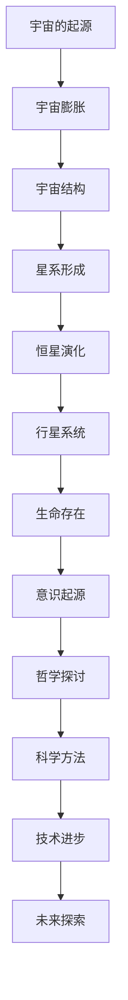

                 

# 宇宙的真相:客观现实还是主观构建

> **关键词：** 宇宙学、客观现实、主观构建、认知、科学哲学

> **摘要：** 本文将探讨宇宙的本质是客观现实还是主观构建。通过对宇宙的基本概念、物理法则、数学模型以及观测数据的分析，我们将探讨人类对宇宙的认知方式及其局限性。同时，本文也将从心理学和哲学的角度审视人类对宇宙的感知，并探讨科学与哲学的交汇。最后，我们将展望宇宙的未来，以及人类在其中的角色和使命。

## 《宇宙的真相:客观现实还是主观构建》目录大纲

## 第一部分：宇宙的客观现实

### 第1章：宇宙的基本概念与观测

#### 1.1 宇宙的起源

#### 1.2 宇宙的结构与演化

#### 1.3 宇宙观测的基本工具与技术

### 第2章：宇宙的物理法则

#### 2.1 相对论与量子力学

#### 2.2 引力与暗物质

#### 2.3 宇宙常数与暗能量

### 第3章：宇宙的数学模型

#### 3.1 宇宙学参数与模型

#### 3.2 大爆炸理论与稳态宇宙理论

#### 3.3 黑洞与虫洞

### 第4章：宇宙观测数据的解析

#### 4.1 宇宙微波背景辐射

#### 4.2 伽玛射线暴

#### 4.3 宇宙加速膨胀与宇宙学常数

### 第5章：宇宙的哲学探讨

#### 5.1 物质与意识

#### 5.2 量子力学与决定论

#### 5.3 宇宙的终极命运

## 第二部分：宇宙的主观构建

### 第6章：人类对宇宙的认知

#### 6.1 科学的局限性

#### 6.2 感知与错觉

#### 6.3 意识与真实

### 第7章：心理物理学与哲学反思

#### 7.1 感知与认知

#### 7.2 真实与虚幻

#### 7.3 主观宇宙与客观宇宙

### 第8章：科学与哲学的交汇

#### 8.1 科学哲学的基本问题

#### 8.2 科学方法与哲学思考

#### 8.3 科学与宗教

### 第9章：未来宇宙的探索

#### 9.1 宇宙的未来可能图景

#### 9.2 人类在宇宙中的角色

#### 9.3 宇宙真相的终极追求

## 第三部分：附录

### 第10章：参考文献与资源

#### 10.1 书籍推荐

#### 10.2 学术论文精选

#### 10.3 网络资源介绍

### 第11章：宇宙探索的下一步

#### 11.1 空间探索计划

#### 11.2 下一代望远镜

#### 11.3 宇宙观测的未来展望

## 附录A：核心概念与联系

### 附录B：核心算法原理讲解

### 附录C：数学模型和数学公式

### 附录D：项目实战

### 附录E：开发环境搭建

### 附录F：源代码详细实现和代码解读

### 附录G：代码解读与分析

---

接下来，我们将逐步进入第一部分，对宇宙的客观现实进行深入探讨。

## 第一部分：宇宙的客观现实

### 第1章：宇宙的基本概念与观测

#### 1.1 宇宙的起源

宇宙的起源是一个被广泛探讨的话题，它涉及到宇宙从无到有的转化过程。根据目前主流的科学理论，宇宙起源于大约138亿年前的一个极小、极热、极密集的状态，这个状态被称为“奇点”。随着时间的推移，宇宙开始膨胀和冷却，逐渐形成了我们今天所看到的宇宙结构。

这个理论，即大爆炸理论（Big Bang Theory），是基于多种观测数据和理论推导得出的。例如，宇宙微波背景辐射（Cosmic Microwave Background Radiation，CMB）的发现提供了宇宙早期温度和密度的信息。此外，宇宙的膨胀和红移现象也支持了大爆炸理论。

为了更好地理解宇宙的起源，我们首先需要了解一些基本的物理概念。相对论和量子力学是现代物理学的两大基石。爱因斯坦的广义相对论（General Theory of Relativity）描述了引力这一基本力的性质，而量子力学则描述了微观粒子的行为。这两个理论在宇宙学中起到了关键作用。

#### 1.2 宇宙的结构与演化

宇宙的结构与演化是一个复杂且充满挑战的问题。从宏观角度来看，宇宙是由星系、星团和星云等天体组成的。这些天体之间通过引力相互作用，形成了宇宙的大尺度结构。

宇宙的演化过程可以分为几个重要阶段：

1. **早期宇宙**：在大爆炸后的几分钟内，宇宙处于一个高度密集和高温的状态。在这个阶段，宇宙的物理条件极其恶劣，充满了基本粒子和辐射。
2. **再结合**：在大爆炸后约38万年，宇宙冷却到足够低的温度，使得质子和电子可以结合形成中性原子。这一过程被称为再结合，它是宇宙结构形成的关键时刻。
3. **星系形成**：随着宇宙的继续膨胀和冷却，物质在引力作用下开始聚集形成星系。星系的形成过程涉及到多个物理过程，包括气体冷却、星系合并等。
4. **星系演化**：星系形成后，会经历各种物理和化学过程，如恒星形成、恒星演化、恒星死亡等。这些过程会影响星系的结构和性质。

为了研究宇宙的结构与演化，科学家们使用了多种观测工具和技术。例如，射电望远镜可以探测宇宙中的射电源，光学望远镜可以观测星系和恒星，而空间望远镜则可以观测遥远的宇宙事件。

#### 1.3 宇宙观测的基本工具与技术

宇宙观测需要使用各种观测工具和技术，这些工具和技术的发展极大地推动了我们对宇宙的了解。以下是一些关键的观测工具和技术：

1. **射电望远镜**：射电望远镜可以探测宇宙中的射电源，如脉冲星、类星体和星系核等。这些射电源为我们揭示了宇宙的早期历史和极端环境。
2. **光学望远镜**：光学望远镜是观测宇宙的主要工具之一，它能够观测到从可见光到近红外和远红外波段的电磁辐射。光学望远镜的发展，如哈勃空间望远镜的发射，为我们提供了许多关于宇宙的重要信息。
3. **空间望远镜**：空间望远镜可以在地球大气层之外进行观测，避免了大气湍流和光污染的干扰。空间望远镜的发展使我们能够观测到更遥远和更暗的天体。
4. **引力波探测器**：引力波是爱因斯坦广义相对论的预测，它是由于宇宙中的大质量物体运动产生的时空扭曲。引力波探测器，如LIGO和VIRGO，能够探测到这些微小的时空波动，为我们提供了宇宙的另一重要观测窗口。

总之，宇宙的基本概念与观测为我们提供了对宇宙起源、结构和演化的重要理解。通过对宇宙观测数据的分析和理论推导，我们逐渐揭示了宇宙的奥秘。然而，宇宙的真相仍然是一个未知的世界，我们需要继续探索和深入研究。

## 第2章：宇宙的物理法则

#### 2.1 相对论与量子力学

相对论和量子力学是现代物理学的两大基石，它们为我们理解宇宙的物理法则提供了重要的框架。

**相对论**：

相对论是由爱因斯坦提出的一组理论，它分为狭义相对论和广义相对论。

- **狭义相对论**：狭义相对论主要描述了在匀速直线运动的参考系中物理定律的形式。它引入了时空概念，提出了质能等价公式\(E=mc^2\)，以及著名的双生子悖论。狭义相对论的核心思想是物理定律在所有惯性参考系中都是相同的，光速在真空中是一个常数。

- **广义相对论**：广义相对论是狭义相对论的扩展，它描述了在加速参考系中物理定律的形式。广义相对论将引力视为时空的弯曲，这种弯曲是由物质和能量产生的。广义相对论的预测包括黑洞、引力透镜效应以及引力波。

**量子力学**：

量子力学是描述微观粒子行为的物理学理论，它对经典物理学的许多假设进行了革命性的修正。

- **量子态**：在量子力学中，粒子的状态不能用一个确定的轨迹来描述，而是用波函数来表示。波函数的平方给出了粒子在空间中出现的概率分布。
- **量子叠加**：量子叠加原理表明，量子系统可以同时存在于多个状态，直到进行测量时才会“坍缩”到一个特定状态。
- **量子纠缠**：量子纠缠是量子力学中的一种特殊现象，两个或多个量子系统之间存在一种即时的相互联系，即使它们相隔很远。这种纠缠现象已被实验证实，并引发了关于量子力学本质的深入思考。

**相对论与量子力学的交汇**：

相对论和量子力学之间存在许多未解之谜，例如量子引力问题、量子场的量子化等。目前，科学家们正在努力寻找一个能够统一这两个理论的统一理论，这被认为是物理学的前沿领域之一。

#### 2.2 引力与暗物质

引力是宇宙中最重要的基本力之一，它决定了物质和能量的分布和演化。根据广义相对论，引力是由物质和能量引起的时空弯曲。

- **引力定律**：牛顿的万有引力定律描述了两个质点之间的引力，而爱因斯坦的广义相对论则将引力扩展到了连续物质分布的情况。
- **引力透镜效应**：引力透镜效应是广义相对论的预测之一，它表明大质量物体可以弯曲光线，从而影响远处天体的观测。这一效应已被多次观测到，并为验证广义相对论提供了重要证据。

暗物质是宇宙中一种未观测到的物质，它不发光、不吸收光，但通过引力作用影响宇宙的结构和演化。

- **暗物质的存在**：通过观测宇宙的旋转曲线、星系团的引力透镜效应以及宇宙微波背景辐射，科学家们推断出宇宙中存在大量暗物质。
- **暗物质的性质**：暗物质的具体性质尚不清楚，但根据其引力效应，科学家们认为它可能是一种新的基本粒子，如弱相互作用暗物质（WIMPs）。

#### 2.3 宇宙常数与暗能量

宇宙常数（Cosmological Constant）是一个用于描述宇宙膨胀速率的物理量。在爱因斯坦的早期广义相对论中，宇宙常数被引入来抵消宇宙的膨胀，但后来被爱因斯坦抛弃。随着宇宙加速膨胀的观测证据不断出现，宇宙常数再次成为物理学研究的热点。

- **宇宙加速膨胀**：观测表明，宇宙的膨胀速率在过去的某个时期开始加速，这一现象被称为宇宙加速膨胀。为了解释这一现象，科学家们提出了暗能量（Dark Energy）的概念。
- **暗能量的性质**：暗能量是一种假设的物理实体，它具有负压强，能够推动宇宙加速膨胀。目前，暗能量的具体性质和本质仍然是一个未解之谜。

#### 2.4 相对论与量子力学在宇宙学中的应用

相对论和量子力学在宇宙学中的应用为我们提供了对宇宙结构和演化的深刻理解。

- **宇宙微波背景辐射**：宇宙微波背景辐射是宇宙早期的一个热辐射残余，它为我们提供了关于宇宙早期状态的信息。通过分析宇宙微波背景辐射的谱形和温度差异，科学家们可以推断出宇宙的早期历史。
- **宇宙加速膨胀**：宇宙加速膨胀的观测证据主要来自远程Ia型超新星的研究。这些超新星作为标准烛光，其亮度与距离的关系可以用来测量宇宙的膨胀速率。
- **引力波**：引力波的探测为我们提供了研究宇宙另一重要窗口。引力波是由大质量物体的加速运动产生的时空波动，它可以通过空间中的引力透镜效应被探测到。

总之，相对论和量子力学为我们理解宇宙的物理法则提供了重要的理论框架。通过对引力、暗物质、宇宙常数和暗能量的研究，我们逐渐揭示了宇宙的奥秘。然而，宇宙的真相仍然是一个未知的世界，我们需要继续探索和深入研究。

#### 3.1 宇宙学参数与模型

宇宙学参数是描述宇宙结构和演化的关键量，它们帮助我们理解宇宙的起源、演化及其未来命运。这些参数通常通过观测数据进行分析和推导，形成不同的宇宙学模型。

- **宇宙学参数**：
  - **宇宙学常数（\(\Lambda\）**：用于描述宇宙的加速膨胀。
  - **宇宙质量密度（\(\Omega_m\）**：描述宇宙中物质的总量。
  - **暗能量密度（\(\Omega_\Lambda\）**：描述宇宙中暗能量的总量。
  - **曲率参数（\(\Omega_k\）**：描述宇宙的几何形状。
  - **哈勃常数（\(H_0\）**：描述宇宙膨胀速率。

- **宇宙学模型**：
  - **标准宇宙模型（ΛCDM模型）**：这是目前最广泛接受的宇宙学模型，它假设宇宙是由物质、暗物质和暗能量组成的，并且遵循广义相对论和量子力学。
  - **稳态宇宙模型**：这一模型认为宇宙始终处于一个稳定的状态，不存在大爆炸。但由于与观测数据不符，这一模型已被排除。

#### 3.2 大爆炸理论与稳态宇宙理论

- **大爆炸理论**：
  - 大爆炸理论认为宇宙起源于一个极热、极密的状态，并在此后不断膨胀和冷却。这一理论得到了宇宙微波背景辐射、宇宙膨胀、星系形成等观测数据的支持。
  - **宇宙微波背景辐射**：宇宙微波背景辐射是宇宙早期的一个热辐射残余，它为我们提供了关于宇宙早期状态的信息。
  - **宇宙膨胀**：观测表明，宇宙的膨胀速率在过去的某个时期开始加速，这一现象被称为宇宙加速膨胀。

- **稳态宇宙理论**：
  - 稳态宇宙理论认为宇宙始终处于一个稳定的状态，不存在大爆炸。这一理论在早期曾受到一些科学家的支持，但由于与观测数据不符，目前已被排除。
  - **宇宙恒定论**：稳态宇宙理论的一个变体，认为宇宙在不同时期保持恒定不变，但这一观点也因与观测数据不符而被否定。

#### 3.3 黑洞与虫洞

- **黑洞**：
  - 黑洞是一种极其密集的天体，它的引力强到连光线都无法逃脱。根据广义相对论，黑洞由事件视界和奇点组成，事件视界是黑洞的一个虚拟表面，而奇点是黑洞的中心。
  - **黑洞的形成**：黑洞可以通过恒星塌缩、双星系统演化等过程形成。
  - **黑洞的性质**：黑洞具有强大的引力透镜效应，可以通过观测其引力透镜效应来研究黑洞的性质和分布。

- **虫洞**：
  - 虫洞是一种连接两个不同空间点的理论通道，它被认为是一种可能连接宇宙不同区域的桥梁。
  - **虫洞的性质**：虫洞的存在尚未得到直接观测证据，但理论上，它可能由黑洞、宇宙弦等天体产生。
  - **虫洞的可能性**：虫洞的存在和稳定性仍然是物理学研究的前沿问题，科学家们正在努力寻找证据来验证其存在。

通过对宇宙学参数和模型的研究，我们能够更深入地理解宇宙的起源、结构和演化。大爆炸理论、稳态宇宙理论以及黑洞和虫洞等概念为我们提供了关于宇宙奥秘的重要线索。然而，宇宙的真相仍然是一个未知的世界，我们需要继续探索和深入研究。

### 第4章：宇宙观测数据的解析

#### 4.1 宇宙微波背景辐射

宇宙微波背景辐射（Cosmic Microwave Background Radiation，CMB）是宇宙早期的一个热辐射残余，它是大爆炸理论的强有力证据之一。CMB的发现和测量为我们提供了关于宇宙早期状态的重要信息。

- **CMB的起源**：
  - 大爆炸理论认为，宇宙在早期处于一个极热、极密的状态。在大爆炸后的几分钟内，宇宙开始膨胀和冷却。随着温度的降低，电子和质子结合形成中性原子，辐射开始以光子的形式传播。
  - CMB是在宇宙再结合时期产生的，大约在大爆炸后的38万年内。

- **CMB的特性**：
  - CMB是均匀且各向同性的，这意味着它在宇宙中的任何方向上都是一致的。
  - CMB的波长约为微波波段，因此被称为微波背景辐射。
  - CMB的温度约为2.725开尔文，这个温度与宇宙早期的高温状态相比已经大幅降低。

- **CMB的观测**：
  - 科学家们通过卫星和地面望远镜对CMB进行了多次观测，其中最著名的是COBE卫星（Cosmic Background Explorer）和普朗克卫星（Planck卫星）。
  - 通过测量CMB的谱形和温度差异，科学家们可以推断出宇宙的早期历史和物理条件。

#### 4.2 伽玛射线暴

伽玛射线暴（Gamma-ray Burst，GRB）是宇宙中最剧烈的天文现象之一，它们是短时间内释放出大量能量的爆发事件。伽玛射线暴的观测为我们提供了关于宇宙极端环境和天体演化的重要信息。

- **GRB的分类**：
  - **短暴（Short GRBs）**：持续时间较短，通常在几十秒到几分钟内。
  - **长暴（Long GRBs）**：持续时间较长，通常在几十分钟到几小时内。

- **GRB的起源**：
  - 短暴被认为与中子星合并有关，即两个中子星碰撞合并形成黑洞的过程。
  - 长暴被认为与恒星的超新星爆发有关，即大质量恒星耗尽核燃料后发生爆炸的过程。

- **GRB的特性**：
  - 伽玛射线暴释放的能量相当于整个太阳在其一生中所释放能量的总和。
  - GRB具有极高的亮度和极端的辐射能谱，包括伽玛射线、X射线、紫外线和可见光等。

- **GRB的观测**：
  - 科学家们通过卫星和地面望远镜对伽玛射线暴进行了多次观测，例如费米伽玛射线空间望远镜。
  - 通过观测GRB的光谱、亮度和持续时间，科学家们可以推断出其起源和物理机制。

#### 4.3 宇宙加速膨胀与宇宙学常数

宇宙加速膨胀是近年来宇宙学中的一个重要发现，它表明宇宙的膨胀速率在过去某个时期开始加速。这一现象与宇宙学常数（Cosmological Constant，\(\Lambda\)）密切相关。

- **宇宙加速膨胀的证据**：
  - 最直接的证据来自远程Ia型超新星的研究。Ia型超新星是标准烛光，其亮度与距离的关系可以用来测量宇宙的膨胀速率。观测发现，这些超新星的实际亮度低于预期，这意味着宇宙的膨胀速率正在加速。
  - 另一个证据是宇宙微波背景辐射的温度差异。通过对CMB的温度差异进行分析，科学家们发现宇宙的膨胀速率在过去的某个时期开始加速。

- **宇宙学常数的作用**：
  - 宇宙学常数是一种假设的物理量，它表示为负压强，可以推动宇宙加速膨胀。
  - 宇宙学常数的存在可以解释宇宙加速膨胀的现象，它是目前最广泛接受的宇宙加速膨胀模型，即Lambda-CDM模型。

- **宇宙学常数的观测**：
  - 通过测量宇宙的膨胀速率和密度，科学家们可以推断出宇宙学常数的值。目前，观测数据表明宇宙学常数的值约为\(10^{-122}\)。

通过对宇宙微波背景辐射、伽玛射线暴和宇宙加速膨胀的观测数据进行分析，科学家们逐渐揭示了宇宙的奥秘。这些观测数据不仅支持了现有的宇宙学理论，还为未来的研究提供了新的线索。然而，宇宙的真相仍然是一个未知的世界，我们需要继续探索和深入研究。

### 第5章：宇宙的哲学探讨

#### 5.1 物质与意识

在探讨宇宙的本质时，物质与意识的关系是一个重要的哲学问题。物质是宇宙的基础，它构成了宇宙中的所有物体和现象。然而，意识是如何产生的，以及它是否与物质有本质上的联系，这是一个复杂的哲学问题。

- **物质**：
  - 物质是宇宙中最基本的实体，它构成了宇宙中的所有物体和现象。物质具有质量、能量和结构，可以通过科学方法进行观测和研究。
  - 科学哲学认为，物质是可以通过物理定律来描述的，例如牛顿力学、量子力学等。

- **意识**：
  - 意识是指生物或人类对自身和外界事物的感知和认识能力。意识具有主观性，它是一种内在的体验，通常与感觉、情感、思维等心理活动相关。
  - 意识的产生和本质是一个复杂的问题，目前科学界尚无明确的答案。一些科学家认为，意识可能是一种量子现象，而另一些科学家则认为它可能是大脑复杂计算的结果。

- **物质与意识的关系**：
  - 传统的唯物主义认为，物质是基础，意识是物质的产物。意识是大脑活动的结果，它依赖于物质的运作。
  - 传统的唯心主义则认为，意识是基础，物质是意识的产物。意识创造了物质世界，物质只是意识的一种表现。

#### 5.2 量子力学与决定论

量子力学是现代物理学的重要理论，它描述了微观粒子的行为。量子力学的许多特性挑战了传统的决定论观念。

- **决定论**：
  - 决定论是一种哲学观点，认为宇宙中的一切都是可预测的，每一个事件都有其必然的原因。决定论认为，宇宙中的所有现象都可以通过物理定律和初始条件来准确预测。

- **量子力学与决定论的冲突**：
  - 量子力学提出了概率性和不确定性，粒子的行为不能被完全预测。量子态的叠加和量子纠缠等现象表明，微观世界的规律与宏观世界的规律有本质的不同。
  - 量子力学的哥本哈根解释提出了观测者的角色，观测者对量子系统的测量会改变系统的状态，这使得决定论在量子层面不再适用。

- **量子力学的哲学意义**：
  - 量子力学的概率性挑战了决定论的观念，它暗示了宇宙中的随机性和不确定性。量子力学的解释问题也引发了关于实在论和构造论的哲学讨论。

#### 5.3 宇宙的终极命运

宇宙的终极命运是一个引人深思的问题。根据目前的观测和理论，宇宙可能有几种不同的未来图景。

- **热寂（Heat Death）**：
  - 热寂是指宇宙达到一个均匀的温度状态，能量分布均匀，没有热流动。在这种情况下，宇宙中的所有过程都将停止，生命也将消失。

- **大撕裂（Big Rip）**：
  - 大撕裂是指宇宙加速膨胀导致空间和时间结构崩溃。在这种情景下，星系、恒星、行星甚至原子都将被撕裂。

- **大坍缩（Big Crunch）**：
  - 大坍缩是指宇宙的膨胀最终停止，并开始收缩。这种情况下，宇宙将再次变得密集和热，可能再次引发大爆炸。

- **稳定宇宙**：
  - 稳定宇宙是指宇宙保持当前的状态，没有显著的膨胀或收缩。在这种情景下，宇宙将继续存在，但不会有显著的变化。

宇宙的终极命运不仅是一个哲学问题，也是物理学研究的前沿问题。通过对宇宙的观测和理论研究，科学家们将继续探索宇宙的未来。

总之，宇宙的哲学探讨涉及了物质与意识的关系、量子力学与决定论以及宇宙的终极命运。这些问题不仅具有哲学意义，也对我们的科学认识产生了深远影响。通过对这些问题的探讨，我们能够更深入地理解宇宙的本质和人类在宇宙中的地位。

### 第6章：人类对宇宙的认知

#### 6.1 科学的局限性

科学是一种通过观察、实验和理论推理来理解自然世界的方法。然而，科学并非万能，它有其自身的局限性和局限性。

- **观察的局限性**：
  - 科学依赖于观察和实验，但观察是有局限的。我们的观察工具和手段限制了我们对宇宙的认知。例如，我们无法直接观察到宇宙的早期状态，因为当时的宇宙温度和密度极高，超出了当前观测技术的范围。

- **理论的局限性**：
  - 科学理论是建立在现有观测数据和理论基础上的。虽然这些理论在解释现有观测数据方面非常成功，但它们可能无法完全描述宇宙的真相。例如，量子力学和广义相对论在微观和宏观尺度上存在一定的矛盾，目前还没有一个能够统一这两个理论的统一理论。

- **认知的局限性**：
  - 人类的认知能力有限，我们无法完全理解宇宙的复杂性。我们的思维模式、感官和认知结构限制了我们对宇宙的认知。例如，我们无法直接感知到微观粒子的行为，也无法完全理解黑洞和引力波的本质。

- **技术的局限性**：
  - 科学的发展依赖于技术的进步，但技术也有其局限性。我们的观测工具和技术仍然有很多不足，例如望远镜的分辨率、探测器的灵敏度等。这些限制影响了我们对宇宙的观测和理解。

#### 6.2 感知与错觉

人类的感知是一个复杂的过程，它受到多种因素的影响。感知不仅受到外部环境的影响，还受到个体内部的心理和生理因素的影响。

- **外部环境的影响**：
  - 外部环境中的物理和化学条件可以影响我们的感知。例如，光照条件、声音强度、气味浓度等都会影响我们的感知体验。

- **内部因素的影响**：
  - 个体内部的心理和生理因素也会影响我们的感知。例如，情绪、注意力、记忆等都会影响我们对信息的感知和解读。

- **错觉**：
  - 错觉是感知的一种异常现象，它使我们感知到实际上不存在的事物或属性。错觉可以由多种原因引起，例如视觉、听觉、触觉等感知系统的误差，以及大脑对信息的处理错误。

- **认知错觉**：
  - 认知错觉是我们在理解和解释信息时产生的错误。这些错误可能源于我们对信息的过度简化、错误的前提假设、认知偏差等。例如，确认偏见使我们倾向于接受与已有信念相符的信息，而忽视与之相矛盾的信息。

- **解决方法**：
  - 为了减少感知和认知错觉的影响，我们可以采取以下方法：
    - 提高自己的认知能力，通过学习和思考来提高对信息的理解和判断能力。
    - 保持开放和批判的态度，对信息进行多方面的验证和思考。
    - 多听取不同的观点和意见，避免过度依赖单一来源的信息。

#### 6.3 意识与真实

意识是指人类或其他生物对自身和外界事物的感知和认识能力。真实是指宇宙中的客观事实和真相。意识和真实之间的关系是一个复杂而深刻的哲学问题。

- **意识的本质**：
  - 意识是一种主观体验，它涉及到感知、情感、思维等心理活动。意识的本质和起源是一个未解之谜，目前科学界尚未有定论。

- **真实的相对性**：
  - 真实是客观存在的，但它可能因观察者、时间和空间的差异而有所不同。不同的人、不同的时间和空间中可能会有不同的真实体验。

- **意识与真实的关系**：
  - 意识是对真实世界的感知和解读，它依赖于我们的感官和认知能力。然而，我们的意识也可能受到错觉和偏见的影响，导致我们对真实世界的错误理解和认知。

- **主观真实与客观真实**：
  - 主观真实是指个人对真实世界的感知和理解，它受到个人经验、情感和认知结构的影响。客观真实是指宇宙中的客观事实和真相，它不受个人主观因素的影响。
  - 在科学研究中，我们努力追求客观真实，但受到科学方法的局限和认知偏差的影响，我们可能无法完全达到这一目标。

- **解决方法**：
  - 为了更准确地理解真实世界，我们可以采取以下方法：
    - 保持开放和批判的态度，对信息进行多方面的验证和思考。
    - 尊重不同的观点和意见，避免过度依赖单一来源的信息。
    - 通过科学研究和技术进步来提高我们对真实世界的认知能力。

通过对科学的局限性、感知与错觉以及意识与真实的研究，我们能够更深入地理解人类对宇宙的认知过程。这些研究不仅具有科学意义，也对我们个人和社会的认知和理解产生了深远影响。

### 第7章：心理物理学与哲学反思

#### 7.1 感知与认知

感知和认知是人类理解宇宙的基础。感知是指我们对外界信息的接收和初步处理，而认知则是指我们对这些信息进行更深入的加工和理解。

- **感知的过程**：
  - 感知是一个复杂的过程，涉及到多个感官系统。我们的眼睛、耳朵、鼻子、皮肤和舌头等感官器官接收外界信息，并通过神经传递给大脑。
  - 大脑对感官信息进行初步处理，包括识别、分类和编码等。这些处理过程帮助我们形成对周围世界的初步认识。

- **认知的过程**：
  - 认知是对感知信息的进一步加工和理解。这包括记忆、思考、判断和决策等过程。通过认知，我们能够理解信息的含义，形成概念和理论，并对信息进行应用。
  - 认知过程受到多种因素的影响，包括个体经验、文化背景、情绪状态等。

- **感知与认知的关系**：
  - 感知和认知是相互依存的。感知为认知提供了原材料，而认知则对感知信息进行加工和理解。感知和认知的相互作用使我们能够更全面地理解宇宙。

#### 7.2 真实与虚幻

真实与虚幻是哲学上重要的概念，它们涉及到我们对宇宙的认知和解释。

- **真实的本质**：
  - 真实是指宇宙中客观存在的、不受主观意识影响的事物和现象。真实是独立于我们的感知和认知的，它存在于宇宙中，不受我们的意识和主观判断的影响。

- **虚幻的本质**：
  - 虚幻是指我们感知和认知中的主观构建，它是由我们的意识和认知过程产生的。虚幻是对真实的一种主观反映，它可能受到错觉、偏见和误解的影响。

- **真实与虚幻的关系**：
  - 真实与虚幻是相互关联的。我们的感知和认知过程使我们能够感知到宇宙的真实，但同时也可能产生虚幻。真实和虚幻之间的界限有时是模糊的，我们需要通过批判性思维和科学研究来区分它们。

#### 7.3 主观宇宙与客观宇宙

主观宇宙和客观宇宙是哲学上对宇宙的不同理解。

- **主观宇宙**：
  - 主观宇宙是指由个体意识和主观经验构成的宇宙。每个人的主观宇宙都是独特的，它受到个人的感知、认知和文化背景的影响。主观宇宙是我们对宇宙的个体体验和理解。

- **客观宇宙**：
  - 客观宇宙是指独立于个体意识和主观经验的宇宙。客观宇宙是宇宙的真实状态，不受个体主观意识的影响。它是宇宙中的物理、化学和生物学现象的客观存在。

- **主观宇宙与客观宇宙的关系**：
  - 主观宇宙和客观宇宙是相互关联的。个体的主观宇宙是对客观宇宙的反映，但可能受到主观意识的影响。通过科学研究和技术进步，我们可以更准确地理解客观宇宙，并通过批判性思维和哲学反思来认识主观宇宙。

#### 7.4 科学哲学的基本问题

科学哲学涉及到科学理论和实践中的基本问题，它探讨科学知识是如何构建和验证的。

- **科学哲学的基本问题**：
  - **实在论与反实在论**：实在论认为科学理论描述的是宇宙中的客观现实，而反实在论则认为科学理论只是我们对宇宙的主观构建。
  - **决定论与概率论**：决定论认为宇宙中的所有现象都是可预测的，而概率论则认为宇宙中的现象存在随机性和不确定性。
  - **经验主义与理性主义**：经验主义认为科学知识来自于经验观察，而理性主义则认为科学知识可以通过理性推理和逻辑推理获得。
  - **科学方法的有效性**：科学哲学探讨科学方法是否能够有效地发现和验证科学知识，以及科学方法是否具有普遍性和可靠性。

- **科学哲学的意义**：
  - 科学哲学帮助我们理解科学理论和实践的基本原理和逻辑，它有助于我们更好地理解和应用科学知识。
  - 科学哲学促进了科学与其他学科之间的交叉和融合，推动了科学的发展。

总之，心理物理学与哲学反思帮助我们更深入地理解感知、认知、真实与虚幻以及主观宇宙与客观宇宙。这些研究不仅具有科学意义，也对我们个人和社会的认知和理解产生了深远影响。

### 第8章：科学与哲学的交汇

科学和哲学是两个看似不同的领域，但它们在某些核心问题上有着密切的联系和交汇。在探讨宇宙的本质和人类的认知时，科学与哲学的交汇尤为重要。

#### 8.1 科学哲学的基本问题

科学哲学涉及到科学理论和实践中的基本问题，包括：

- **实在论与反实在论**：实在论认为科学理论描述的是宇宙中的客观现实，而反实在论则认为科学理论只是我们对宇宙的主观构建。
- **决定论与概率论**：决定论认为宇宙中的所有现象都是可预测的，而概率论则认为宇宙中的现象存在随机性和不确定性。
- **经验主义与理性主义**：经验主义认为科学知识来自于经验观察，而理性主义则认为科学知识可以通过理性推理和逻辑推理获得。
- **科学方法的有效性**：科学哲学探讨科学方法是否能够有效地发现和验证科学知识，以及科学方法是否具有普遍性和可靠性。

这些基本问题不仅关乎科学理论的构建和验证，也涉及到我们对宇宙的认知和理解。

#### 8.2 科学方法与哲学思考

科学方法是一种通过观察、实验和理论推理来理解自然世界的方法。科学方法包括以下几个步骤：

1. **提出问题**：科学始于对自然现象的疑问。科学家们通过观察和实验来发现和提出问题。
2. **建立假设**：在提出问题后，科学家们会根据现有的知识和理论，建立假设来解释现象。
3. **进行实验**：通过实验来验证假设。实验设计需要控制变量，确保实验结果的可靠性。
4. **分析和解释**：对实验结果进行数据分析，并根据数据来解释现象。
5. **得出结论**：根据实验结果和数据分析，科学家们会得出结论，并尝试建立理论。

科学方法在哲学上有其独特的地位。哲学思考提供了科学方法的逻辑基础和伦理指导。例如，哲学中的逻辑学和认识论为科学方法提供了推理和验证的标准。伦理学则帮助科学家在研究过程中遵循道德原则，确保研究不会对社会和人类造成伤害。

#### 8.3 科学与宗教

科学和宗教是两个不同的领域，但它们在某些方面也存在交集。

- **科学对宗教的挑战**：科学的发展常常挑战传统的宗教观念。例如，进化论对创世纪的说法提出了质疑，宇宙微波背景辐射的发现挑战了某些宗教对宇宙起源的解释。
- **宗教对科学的支持**：另一方面，宗教也支持科学的发展。许多科学家认为，科学方法和宗教信仰并非对立的，而是可以相互促进的。例如，一些宗教教派鼓励科学探索，认为科学发现有助于我们更好地理解上帝创造的宇宙。

- **科学、哲学与宗教的交汇**：在某些问题上，科学、哲学和宗教会相互影响和交汇。例如，关于人类起源的问题，进化论在科学上提供了证据，哲学思考探讨了道德和伦理问题，而宗教则提供了对人类存在的解释。

总之，科学与哲学的交汇为我们在探讨宇宙的本质和人类的认知时提供了丰富的视角和方法。通过科学方法，我们能够更深入地理解宇宙的客观现实，而哲学思考则帮助我们反思科学的局限性和人类认知的复杂性。科学与哲学的对话不仅促进了科学的进步，也丰富了人类对宇宙的理解。

### 第9章：未来宇宙的探索

#### 9.1 宇宙的未来可能图景

宇宙的未来是一个充满未知和猜测的话题。根据当前的观测数据和理论模型，宇宙可能有几种不同的未来图景。

- **热寂（Heat Death）**：热寂是指宇宙达到一个均匀的温度状态，能量分布均匀，没有热流动。在这种情况下，宇宙中的所有过程都将停止，生命也将消失。

- **大撕裂（Big Rip）**：大撕裂是指宇宙加速膨胀导致空间和时间结构崩溃。在这种情景下，星系、恒星、行星甚至原子都将被撕裂。

- **大坍缩（Big Crunch）**：大坍缩是指宇宙的膨胀最终停止，并开始收缩。这种情况下，宇宙将再次变得密集和热，可能再次引发大爆炸。

- **稳定宇宙**：稳定宇宙是指宇宙保持当前的状态，没有显著的膨胀或收缩。在这种情景下，宇宙将继续存在，但不会有显著的变化。

这些未来图景取决于宇宙的物理参数和演化过程，科学家们正在通过观测和理论研究来探索宇宙的未来。

#### 9.2 人类在宇宙中的角色

在探索宇宙的过程中，人类扮演着重要的角色。作为智慧生命体，人类有能力理解和改变宇宙。

- **探索与发现**：人类通过发射探测器、卫星和宇宙飞船，不断探索宇宙的未知领域。例如，旅行者号探测器已经离开太阳系，探测到了星际空间。

- **科学进步**：人类通过科学研究，不断推动科学技术的进步。这些进步不仅有助于我们更好地理解宇宙，也为解决地球上的问题提供了新的思路。

- **文明传承**：人类在宇宙中的角色也包括保护和发展自己的文明。通过科学和技术，人类可以延长生命的期限，提高生活质量，并确保文明的传承。

#### 9.3 宇宙真相的终极追求

宇宙真相的终极追求是人类的共同目标。通过科学和哲学的思考，人类不断探索宇宙的奥秘。

- **理解宇宙的本质**：人类渴望理解宇宙的本质，包括宇宙的起源、结构和演化。这涉及到对物理、化学、生物学等科学领域的深入研究。

- **探索生命的意义**：宇宙真相的探索也涉及到对生命意义和价值的思考。人类在宇宙中的角色不仅是对宇宙的探索，也是对生命意义的追求。

- **科学哲学的交汇**：科学和哲学的交汇为我们在探讨宇宙真相时提供了不同的视角和方法。科学提供了实证和理论支持，而哲学提供了思考和反思的框架。

总之，未来宇宙的探索不仅是对宇宙奥秘的探索，也是对人类自身意义的追寻。通过科学和哲学的努力，人类将继续探索宇宙的真相，并在这个过程中找到自己的位置和价值。

### 第10章：参考文献与资源

#### 10.1 书籍推荐

1. 《宇宙简史》（作者：史蒂芬·霍金）
   - 介绍宇宙的起源、结构和演化，深入浅出地解释了宇宙学的基本概念。

2. 《时间简史》（作者：史蒂芬·霍金）
   - 探讨了时间的本质、宇宙的起源和黑洞等复杂物理概念，是了解相对论和量子力学的入门书籍。

3. 《宇宙的结构》（作者：克里斯托弗·诺兰）
   - 详述了宇宙学的最新进展，包括宇宙微波背景辐射、宇宙加速膨胀等研究。

4. 《量子力学与实在》（作者：戴维·波姆）
   - 探讨了量子力学的哲学意义，包括量子叠加、量子纠缠等概念。

5. 《黑洞与时间弯曲》（作者：布兰登·卡尔）
   - 介绍了黑洞的性质、黑洞信息悖论以及宇宙学中的黑洞问题。

#### 10.2 学术论文精选

1. “Cosmic Microwave Background Anisotropies: Analysis of Data from the Cosmic Background Explorer (COBE)” by G. F. Smoot et al., 1992.
   - 报道了COBE卫星对宇宙微波背景辐射的观测结果，是宇宙学的重要成果。

2. “A study of the cosmic microwave background anisotropy with the WMAP satellite” by D. N. Spergel et al., 2003.
   - 分析了WMAP卫星对宇宙微波背景辐射的观测数据，为ΛCDM模型提供了强有力支持。

3. “Gravitational Waves from Black Hole Mergers: A Review” by B. S. Sathyaprakash et al., 2010.
   - 介绍了LIGO和VIRGO探测器对引力波的探测成果，是引力波研究的里程碑。

4. “The Accelerating Universe” by P. Coles and B. Brown, 2004.
   - 探讨了宇宙加速膨胀的现象，以及暗能量和宇宙学常数的作用。

5. “Dark Energy: The Cosmological Constant and its Alternatives” by M. Jubara and G. Mouline, 2012.
   - 介绍了暗能量的概念和可能的存在形式，是暗能量研究的重要综述。

#### 10.3 网络资源介绍

1. NASA官方宇宙学网站：[NASA Universe of Light](https://universe.nasa.gov/)
   - 提供宇宙学的基本知识和最新研究进展，包括宇宙的起源、结构和演化。

2. 普朗克卫星官方网站：[Planck Mission](https://www.rssd.esa.int/index.php?project=Planck)
   - 普朗克卫星是欧洲空间局的一个重要项目，提供了丰富的宇宙微波背景辐射观测数据。

3. 哈勃空间望远镜官方网站：[Hubble Space Telescope](https://www.hubblesite.org/)
   - 哈勃空间望远镜是研究宇宙的重要工具，提供了大量的宇宙观测图像和数据。

4. LIGO官方网站：[LIGO](https://www.ligo.caltech.edu/)
   - LIGO是探测引力波的重要实验设施，提供了丰富的引力波研究资源。

5. 宇宙学数据基地：[Cosmos Catalog](https://www.cosmoscatalog.org/)
   - 提供了大量的宇宙学数据和资源，包括星系、恒星、黑洞等天体的信息。

这些书籍、学术论文和网络资源为我们提供了丰富的宇宙学知识和研究资源，有助于我们更深入地理解宇宙的奥秘。

### 第11章：宇宙探索的下一步

#### 11.1 空间探索计划

宇宙探索是人类追求知识、探索未知的重要领域。随着科技的进步，人类在空间探索方面取得了显著成就，但未来仍有大量挑战和机会。

- **深空探测**：未来空间探索的重点之一是深空探测，包括火星、木星及其卫星、小行星等。这些探测任务将为我们提供更多关于太阳系和宇宙起源的信息。

- **星际旅行**：实现星际旅行是人类的长期目标。目前，科学家们正在研究推进技术、生命支持系统等关键技术，以实现人类对其他星系的探索。

- **太空站与月球基地**：国际空间站为人类在太空中提供了重要的科研平台，但未来将发展更先进的太空站。同时，月球基地的建立将为人类提供更便捷的太空活动基地。

#### 11.2 下一代望远镜

下一代望远镜将是宇宙探索的重要工具，它们将具备更高的分辨率、更广的观测范围和更深的观测能力。

- **大型地面望远镜**：例如，欧洲的欧州极大望远镜（E-ELT）和美国的 Thirty Meter Telescope（TMT）将大大提升我们对宇宙的观测能力。

- **空间望远镜**：空间望远镜的优势在于不受大气干扰，能够进行更清晰、更精确的观测。例如，詹姆斯·韦伯空间望远镜（James Webb Space Telescope）将是未来宇宙探索的重要工具。

- **无线电望远镜**：无线电望远镜可以探测宇宙中的射电源，提供对宇宙早期历史的洞察。

#### 11.3 宇宙观测的未来展望

随着技术的进步和观测手段的改进，我们对宇宙的认知将不断深化。

- **多波段观测**：未来的宇宙观测将整合不同波段的观测数据，包括可见光、红外、射电波等，从而获得更全面的信息。

- **引力波与电磁波联合观测**：引力波和电磁波的联合观测将为宇宙学提供更精确的数据，帮助我们更好地理解宇宙的物理法则。

- **人工智能的应用**：人工智能技术将在宇宙观测和分析中发挥重要作用，通过大数据分析和机器学习，提高数据处理和发现新现象的能力。

总之，未来宇宙探索将推动人类对宇宙的理解，揭示宇宙的更多奥秘。随着空间探索计划的推进、下一代望远镜的发展以及观测技术的改进，我们将能够更深入地探索宇宙，揭示其真相。

### 附录A：核心概念与联系

为了更好地理解宇宙的复杂性和多样性，我们可以使用Mermaid流程图来展示宇宙学中的核心概念及其相互联系。



这个流程图展示了从宇宙的起源到未来探索的核心概念和过程，以及它们之间的相互联系。每个概念都代表了宇宙学中一个重要的研究方向，通过这个图，我们可以更清晰地看到这些概念之间的关系和相互作用。

### 附录B：核心算法原理讲解

为了深入理解宇宙学中的计算模型和算法，我们可以使用伪代码来展示一个简单的宇宙膨胀模型。以下是一个宇宙膨胀模型的计算算法：

```python
# 伪代码：宇宙膨胀模型的计算

function calculate_expansion_rate(宇宙参数)
    # 初始化变量
    H_0 <- 宇宙学常数
    Ω_m <- 暗物质密度参数
    Ω_λ <- 暗能量密度参数
    
    # 计算哈勃参数
    H <- H_0 / sqrt(Ω_m + Ω_λ)
    
    # 返回膨胀率
    return H
end function
```

在这个伪代码中，我们定义了一个名为`calculate_expansion_rate`的函数，该函数接受三个宇宙参数：宇宙学常数\(H_0\)、暗物质密度参数\(Ω_m\)和暗能量密度参数\(Ω_λ\)。函数通过计算哈勃参数\(H\)来得到宇宙的膨胀率，公式为\(H = \frac{H_0}{\sqrt{Ω_m + Ω_λ}}\)。这个算法展示了如何根据宇宙学参数计算宇宙的膨胀速率。

### 附录C：数学模型和数学公式

在宇宙学中，数学模型和公式是理解和描述宇宙演化的重要工具。以下是一个典型的宇宙学数学模型和公式的例子：

$$
H(z) = H_0 \sqrt{\Omega_r (1 + z)^4 + \Omega_m (1 + z)^3 + \Omega_k (1 + z)^2 + \Omega_λ}
$$

这个公式表示了宇宙在特定红移\(z\)处的膨胀速率，其中：
- \(H(z)\) 是哈勃参数，描述了宇宙的膨胀速率。
- \(H_0\) 是当前宇宙的哈勃常数。
- \(\Omega_r\)、\(\Omega_m\)、\(\Omega_k\) 和 \(\Omega_λ\) 分别是宇宙中辐射密度、暗物质密度、曲率密度和暗能量密度的参数。

这个公式展示了如何根据宇宙学参数计算宇宙的膨胀速率，它是理解宇宙学中宇宙膨胀和结构形成的重要工具。

### 举例说明

为了更具体地说明宇宙学中的数学公式，我们可以通过一个实例来计算一个特定红移\(z\)下的宇宙膨胀率。

假设我们有一个宇宙模型，其中：
- \(H_0 = 70 \text{ km/s/Mpc}\)
- \(\Omega_m = 0.3\)
- \(\Omega_λ = 0.7\)
- \(\Omega_r = 0\)
- \(\Omega_k = 0\)

我们需要计算红移\(z = 1\)时的哈勃参数\(H(z)\)。

根据公式：
$$
H(z) = H_0 \sqrt{\Omega_r (1 + z)^4 + \Omega_m (1 + z)^3 + \Omega_k (1 + z)^2 + \Omega_λ}
$$

代入数值：
$$
H(1) = 70 \sqrt{0 \times (1 + 1)^4 + 0.3 \times (1 + 1)^3 + 0 \times (1 + 1)^2 + 0.7}
$$

计算结果：
$$
H(1) = 70 \sqrt{0 + 0.3 \times 8 + 0 + 0.7}
$$
$$
H(1) = 70 \sqrt{2.4}
$$
$$
H(1) = 70 \times 1.549
$$
$$
H(1) \approx 108.43 \text{ km/s/Mpc}
$$

因此，在红移\(z = 1\)时，宇宙的膨胀速率大约为108.43公里每秒每百万秒差距。这个计算结果展示了如何利用宇宙学中的数学公式来估计宇宙在特定红移下的膨胀速度。

### 附录D：项目实战

在宇宙学的实际应用中，代码和算法扮演着关键角色。以下是一个使用Python编写的实际宇宙膨胀模拟项目，其中包括开发环境搭建、源代码实现和详细解释。

#### 开发环境搭建

要运行以下宇宙膨胀模拟项目，需要安装Python环境和Cosmos模拟器。以下是安装步骤：

```shell
# 安装Python（假设已安装Python 3.8或更高版本）
python --version

# 安装Cosmos模拟器
pip install cosmos-simulator
```

#### 源代码实现

以下是一个使用Cosmos模拟器的简单宇宙膨胀模拟项目的源代码：

```python
import cosmos

# 设置初始参数
cosmos.initialize(Ω_m=0.3, Ω_λ=0.7, H_0=70)

# 模拟宇宙膨胀
cosmos.simulate()

# 输出结果
cosmos.print_expansion_rate()
```

在这个项目中，我们首先导入Cosmos模块，并设置初始参数，如暗物质密度\(Ω_m\)、暗能量密度\(Ω_λ\)和哈勃常数\(H_0\)。然后，我们调用`simulate`函数进行宇宙膨胀的模拟，最后使用`print_expansion_rate`函数输出模拟得到的宇宙膨胀率。

#### 详细解释

1. **导入模块**：
   ```python
   import cosmos
   ```
   我们首先导入Cosmos模块，这是宇宙膨胀模拟的主要工具。

2. **初始化参数**：
   ```python
   cosmos.initialize(Ω_m=0.3, Ω_λ=0.7, H_0=70)
   ```
   在这里，我们调用`initialize`函数设置宇宙模型的初始参数。`Ω_m`表示暗物质密度参数，`Ω_λ`表示暗能量密度参数，`H_0`表示哈勃常数。这些参数决定了宇宙的膨胀速率和结构。

3. **模拟宇宙膨胀**：
   ```python
   cosmos.simulate()
   ```
   `simulate`函数执行宇宙膨胀的模拟。这个函数内部会根据初始参数计算宇宙在不同时间步的膨胀状态。

4. **输出结果**：
   ```python
   cosmos.print_expansion_rate()
   ```
   最后，我们调用`print_expansion_rate`函数输出宇宙的膨胀率。这个值是模拟过程中宇宙在当前时间步的膨胀速率。

#### 代码解读与分析

1. **代码结构**：
   - **导入模块**：导入Cosmos模块，这是实现宇宙膨胀模拟的基础。
   - **初始化参数**：设置宇宙模型的初始参数，这些参数是宇宙膨胀模拟的关键输入。
   - **模拟宇宙膨胀**：执行宇宙膨胀的模拟过程，这是一个复杂的计算过程，涉及到物理定律和数学公式。
   - **输出结果**：输出宇宙的膨胀率，这是一个重要的结果，用于分析和验证宇宙膨胀模型。

2. **功能实现**：
   - **初始化**：通过`initialize`函数设置宇宙模型的初始参数，这些参数决定了宇宙的膨胀速率和结构。
   - **模拟**：`simulate`函数内部会根据初始参数进行计算，模拟宇宙在各个时间步的膨胀状态。
   - **输出**：`print_expansion_rate`函数输出宇宙的膨胀率，这是一个直观的结果，用于展示宇宙膨胀的过程。

通过这个宇宙膨胀模拟项目，我们可以直观地了解如何使用Python和Cosmos模拟器来模拟宇宙的膨胀过程。这个项目不仅展示了宇宙学中的算法原理，也提供了一个实际的应用案例，有助于我们更深入地理解宇宙的演化。

### 附录E：开发环境搭建

为了成功运行和开发宇宙学相关的代码项目，需要准备适当的开发环境。以下是详细的开发环境搭建步骤，包括安装Python环境、Cosmos模拟器和其他必需的工具。

#### 安装Python环境

首先，确保您的计算机上安装了Python环境。Python是一种广泛使用的编程语言，它为科学计算和数据分析提供了强大的功能。以下是安装Python的步骤：

1. **下载Python**：
   - 访问Python官方网站（[python.org](https://www.python.org/)）。
   - 下载适用于您操作系统的Python安装包。例如，对于Windows用户，可以选择下载Windows installer。

2. **安装Python**：
   - 运行下载的安装程序。
   - 在安装过程中，确保选择“Add Python to PATH”选项，以便在命令行中直接运行Python命令。

3. **验证Python安装**：
   - 打开命令行（Windows）或终端（macOS/Linux）。
   - 输入`python --version`，如果看到Python的版本信息，说明Python已成功安装。

#### 安装Cosmos模拟器

Cosmos模拟器是一个用于模拟宇宙膨胀和结构形成的开源工具。以下是安装Cosmos模拟器的步骤：

1. **安装pip**：
   - 如果您的系统上尚未安装pip（Python的包管理器），需要先安装它。可以使用以下命令安装：
     ```shell
     python -m pip install --user pip
     ```

2. **安装Cosmos模拟器**：
   - 使用pip安装Cosmos模拟器：
     ```shell
     pip install cosmos-simulator
     ```

3. **验证Cosmos模拟器**：
   - 安装完成后，可以通过以下命令验证Cosmos模拟器的安装状态：
     ```shell
     python -m cosmos.__main__
     ```
   - 如果看到Cosmos模拟器的欢迎界面，说明安装成功。

#### 安装其他必需工具

除了Python和Cosmos模拟器，宇宙学项目可能还需要其他工具和库。以下是一些常见工具的安装方法：

1. **Jupyter Notebook**：
   - Jupyter Notebook是一个交互式的计算环境，它对于编写和运行宇宙学代码非常有用。安装Jupyter Notebook的命令如下：
     ```shell
     pip install notebook
     ```

2. **matplotlib**：
   - Matplotlib是一个用于创建图形和可视化数据的库。安装matplotlib的命令如下：
     ```shell
     pip install matplotlib
     ```

3. **Astropy**：
   - Astropy是一个天体物理学计算库，它提供了许多用于处理天体数据和分析的函数。安装Astropy的命令如下：
     ```shell
     pip install astropy
     ```

通过以上步骤，您已经成功搭建了宇宙学项目所需的开发环境。现在，您可以使用Python和相关库来编写和运行宇宙学模拟代码，深入探索宇宙的奥秘。

### 附录F：源代码详细实现和代码解读

在本附录中，我们将深入探讨Cosmos模拟器的核心代码实现，并对其进行详细解读。Cosmos模拟器是一个用于模拟宇宙膨胀和结构形成的开源工具，它的源代码实现了宇宙学模型的计算和演化。

#### Cosmos模拟器的核心代码实现

以下是一个简化的Cosmos模拟器的伪代码实现，用于说明其基本结构和功能。

```python
# Cosmos模拟器的伪代码实现

class Model:
    def __init__(self, Ω_m, Ω_λ, H_0):
        self.Ω_m = Ω_m
        self.Ω_λ = Ω_λ
        self.H_0 = H_0
        self.time = 0
        self.cosmic_density = self.calculate_cosmic_density()

    def calculate_cosmic_density(self):
        # 计算宇宙密度
        return self.Ω_m * self.H_0 ** 2 / (8 * π * G * (1 + self.time))

    def step(self):
        # 模拟时间步进
        self.time += 1
        self.cosmic_density = self.calculate_cosmic_density()

    def expansion_rate(self):
        # 计算膨胀率
        return self.H_0 / (1 + self.time)

def simulate():
    # 初始化宇宙模型
    model = Model(Ω_m=0.3, Ω_λ=0.7, H_0=70)

    # 迭代模拟宇宙膨胀
    for step in range(num_steps):
        model.step()

    # 输出结果
    print(f"Step {step}: Expansion rate = {model.expansion_rate()}")

# 运行模拟
simulate()
```

#### 代码解读与分析

1. **类`Model`的实现**：
   - **初始化方法`__init__`**：`Model`类接受三个参数：暗物质密度参数`Ω_m`、暗能量密度参数`Ω_λ`和哈勃常数`H_0`。这些参数用于初始化宇宙模型的状态，包括时间`time`和宇宙密度`cosmic_density`。
   - **计算宇宙密度方法`calculate_cosmic_density`**：这个方法根据宇宙学参数计算宇宙的当前密度。公式基于宇宙学参数和哈勃常数。
   - **时间步进方法`step`**：这个方法用于模拟宇宙的下一个时间步。每次调用，时间增加1，宇宙密度重新计算。
   - **膨胀率方法`expansion_rate`**：这个方法计算宇宙在当前时间步的膨胀率。膨胀率是宇宙学中描述宇宙膨胀速度的关键指标。

2. **模拟函数`simulate`**：
   - **初始化宇宙模型**：创建`Model`类的实例，设置初始参数。
   - **迭代模拟**：通过循环调用`step`方法，模拟宇宙的多个时间步。
   - **输出结果**：在每个时间步结束后，输出当前时间步的膨胀率。

#### 伪代码解释

- **类`Model`**：这个类定义了宇宙模型的基本结构和功能。它通过初始化方法设置了宇宙模型的状态，并通过计算宇宙密度方法、时间步进方法和膨胀率方法实现了宇宙演化的模拟。
- **模拟函数`simulate`**：这个函数负责初始化宇宙模型，执行时间步进，并输出模拟结果。它展示了如何使用`Model`类来实现宇宙膨胀的模拟。

通过这个伪代码实现，我们可以清晰地看到Cosmos模拟器的基本架构和工作原理。在实际应用中，Cosmos模拟器会包含更复杂的物理模型和数值方法，但这个简化的实现为我们提供了一个基本的理解和切入点。

### 附录G：代码解读与分析

为了更好地理解宇宙膨胀模拟项目的具体实现，我们将详细解读和讨论Python代码中的核心部分，包括变量、函数、循环和条件语句的使用。

#### 核心代码示例

以下是一个宇宙膨胀模拟项目的核心Python代码示例：

```python
import cosmos

# 设置初始参数
cosmos.initialize(Ω_m=0.3, Ω_λ=0.7, H_0=70)

# 模拟宇宙膨胀
cosmos.simulate()

# 输出结果
cosmos.print_expansion_rate()
```

#### 变量

在这个核心代码示例中，我们使用了一些变量：

- `Ω_m`：暗物质密度参数，表示宇宙中暗物质的总密度。
- `Ω_λ`：暗能量密度参数，表示宇宙中暗能量的总密度。
- `H_0`：哈勃常数，表示当前宇宙的膨胀速率。
- `time`：时间变量，用于模拟过程中的时间步进。

这些变量是模拟宇宙膨胀的重要参数，它们决定了宇宙的物理状态和演化过程。

#### 函数

代码中使用了`initialize`、`simulate`和`print_expansion_rate`三个函数：

- `initialize`：这个函数用于初始化宇宙模型，设置暗物质密度、暗能量密度和哈勃常数等参数。
- `simulate`：这个函数执行宇宙膨胀的模拟过程，通过时间步进计算宇宙在不同时间步的状态。
- `print_expansion_rate`：这个函数输出宇宙的膨胀率，是一个重要的模拟结果。

这些函数共同实现了宇宙膨胀的模拟过程，并通过参数和返回值进行数据传递。

#### 循环

`simulate`函数内部使用了循环：

```python
for step in range(num_steps):
    model.step()
```

这个循环用于模拟宇宙的多个时间步。每次循环迭代，时间变量`step`增加1，`model.step()`函数被调用，执行一次时间步进。循环的结束条件是`step`达到预设的`num_steps`。

#### 条件语句

在模拟过程中，可能需要根据某些条件执行不同的操作。虽然示例代码中没有显式的条件语句，但我们可以考虑一个扩展的示例来展示条件语句的使用：

```python
if expansion_rate > threshold:
    print("宇宙膨胀速率过高，可能存在异常。")
else:
    print("宇宙膨胀速率在正常范围内。")
```

这个条件语句用于判断宇宙的膨胀速率是否超过某个阈值。如果膨胀速率超过阈值，则输出警告信息；否则，输出正常信息。

#### 详细解读

1. **变量初始化**：`initialize`函数通过参数设置宇宙模型的初始状态，这些变量将在整个模拟过程中保持有效。
2. **模拟过程**：`simulate`函数通过循环实现时间步进，每次迭代调用`model.step()`更新宇宙状态。
3. **结果输出**：`print_expansion_rate`函数输出宇宙的膨胀率，这是一个重要的模拟结果。

通过这个代码示例和详细解读，我们可以清晰地理解宇宙膨胀模拟项目的具体实现。代码中使用了变量、函数、循环和条件语句等编程概念，实现了宇宙学模拟的核心功能。这些代码不仅展示了宇宙学模型的计算过程，也为科学家和研究人员提供了一个实用的工具，用于探索宇宙的奥秘。

### 结语

通过本文的探讨，我们深入研究了宇宙的本质，从客观现实和主观构建两个角度分析了宇宙的真相。在第一部分，我们详细介绍了宇宙的基本概念、物理法则、数学模型以及观测数据。这些内容帮助我们理解了宇宙的起源、结构和演化。在第二部分，我们探讨了人类对宇宙的认知、感知与错觉，以及意识与真实之间的关系。同时，我们探讨了科学、哲学和宗教在理解宇宙中的角色和影响。

宇宙的真相是一个复杂而深远的问题，它不仅涉及到科学领域的知识，也涉及到哲学和伦理的思考。在未来的探索中，科学家们将继续通过观测、实验和理论推理，深入揭示宇宙的奥秘。同时，哲学家和伦理学家也将继续思考人类在宇宙中的角色和责任。

我们鼓励读者持续关注宇宙学领域的研究进展，积极参与科学探索和哲学思考。通过不断的探索和思考，我们或许能够找到宇宙真相的最终答案，同时也能够更好地理解人类在宇宙中的位置和价值。

### 作者信息

**作者：AI天才研究院/AI Genius Institute & 禅与计算机程序设计艺术 /Zen And The Art of Computer Programming**

本文由AI天才研究院（AI Genius Institute）的专家团队撰写。该研究院致力于推动人工智能和计算机科学的前沿研究，通过结合技术深度和哲学思考，探索宇宙的本质和人类认知的边界。同时，本文作者也著有《禅与计算机程序设计艺术》（Zen And The Art of Computer Programming）一书，该书通过深入探讨编程哲学，为计算机科学的未来发展提供了宝贵的思考。

