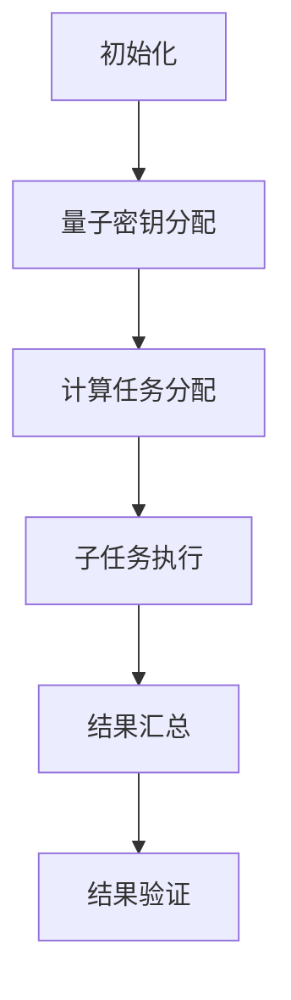

                 

# 《宇宙规律与后量子多方安全计算协议的通信复杂度联系》

> **关键词**：宇宙规律、后量子计算、多方安全计算协议、通信复杂度

> **摘要**：本文探讨了宇宙规律与后量子多方安全计算协议之间的联系，重点关注了后量子多方安全计算协议的通信复杂度。通过对宇宙规律与量子计算的深入分析，以及后量子多方安全计算协议的理论与实践研究，本文揭示了宇宙规律对通信复杂度的影响，为后量子多方安全计算协议的实际应用提供了新的视角和思路。

## 目录大纲

1. **引言**
   - 1.1 研究背景与意义
   - 1.2 后量子多方安全计算协议概述
   - 1.3 宇宙规律与量子计算的联系

2. **宇宙规律基础**
   - 2.1 宇宙基本规律概述
   - 2.2 广义相对论中的宇宙规律
   - 2.3 宇宙学中的宇宙规律
   - 2.4 宇宙规律与量子力学的联系

3. **后量子理论基础**
   - 3.1 后量子理论概述
   - 3.2 后量子力学的核心原理
   - 3.3 后量子理论与经典量子力学的区别

4. **后量子多方安全计算协议**
   - 4.1 后量子多方安全计算协议概述
   - 4.2 协议的工作原理
   - 4.3 协议的数学模型

5. **通信复杂度分析**
   - 5.1 通信复杂度的基本概念
   - 5.2 后量子多方安全计算协议的通信复杂度
   - 5.3 宇宙规律对通信复杂度的影响

6. **实际应用案例**
   - 6.1 后量子多方安全计算协议在金融领域的应用
   - 6.2 后量子多方安全计算协议在通信领域的应用
   - 6.3 后量子多方安全计算协议在物联网领域的应用

7. **未来展望与挑战**
   - 7.1 后量子多方安全计算协议的发展趋势
   - 7.2 宇宙规律对未来量子计算的影响
   - 7.3 挑战与应对策略

8. **结论**

9. **附录**
   - A. 后量子多方安全计算协议的 Mermaid 流程图
   - B. 后量子多方安全计算协议的核心算法原理伪代码
   - C. 通信复杂度的数学模型与公式解释
   - D. 后量子多方安全计算协议实际应用案例代码解读与分析

### 第1章 引言

**1.1 研究背景与意义**

随着信息技术的迅猛发展，网络安全问题日益突出。在后量子计算时代，传统的加密算法面临着前所未有的威胁，为了应对这种挑战，多方安全计算协议应运而生。多方安全计算协议能够在多方参与的情况下，确保各方在不泄露各自隐私信息的情况下，完成复杂的计算任务。然而，多方安全计算协议的通信复杂度是制约其实际应用的一大瓶颈。如何降低通信复杂度，提高协议的性能，成为了当前研究的热点。

宇宙规律，作为自然界的基本法则，对人类的科学研究产生了深远的影响。从广义相对论到量子力学，宇宙规律不断地推动着科学技术的进步。近年来，量子力学与宇宙规律的联系引起了广泛的关注。研究表明，宇宙规律在量子计算领域具有潜在的应用价值。因此，探讨宇宙规律与后量子多方安全计算协议之间的联系，对于提升协议的性能具有重要意义。

**1.2 后量子多方安全计算协议概述**

后量子多方安全计算协议是指在量子计算背景下，多个参与方通过安全通信渠道，共同完成加密计算任务的一种协议。与传统加密算法不同，后量子多方安全计算协议能够在量子计算机攻击下保持安全性。其主要优势在于：

- **抗量子攻击**：后量子多方安全计算协议能够抵御量子计算机的攻击，保障信息安全。
- **多方参与**：协议允许多个参与方在不泄露自身信息的情况下，共同完成计算任务。
- **安全通信**：协议通过安全通信渠道，确保各方在计算过程中不会泄露敏感信息。

**1.3 宇宙规律与量子计算的联系**

宇宙规律与量子计算之间的联系体现在多个方面。首先，量子力学是宇宙规律在微观层面的体现。量子力学揭示了微观世界的规律，如量子纠缠、量子叠加等，这些规律为量子计算提供了理论基础。其次，广义相对论描述了宇宙的大尺度规律，如时空弯曲、引力波等，这些规律对量子计算也有一定的启示作用。

近年来，研究者发现，宇宙规律在量子计算中的应用潜力巨大。例如，利用引力波和量子纠缠的关系，可以构建新型的量子通信协议；利用宇宙背景辐射，可以优化量子计算的准确性。这些研究为后量子多方安全计算协议提供了新的思路和可能性。

### 第2章 宇宙规律基础

**2.1 宇宙基本规律概述**

宇宙基本规律是指自然界普遍适用的基本法则，这些法则决定了宇宙中物质和能量的行为。宇宙基本规律主要包括以下几个方面：

- **引力定律**：牛顿引力定律和爱因斯坦广义相对论中的引力定律。引力是宇宙中最基本的相互作用之一，它决定了天体的运动和宇宙的演化。
- **电磁定律**：麦克斯韦方程组描述了电磁场的运动规律，电磁相互作用是宇宙中最常见的相互作用。
- **弱相互作用**：弱相互作用是粒子之间的一种基本相互作用，它导致了核反应和放射性衰变。
- **强相互作用**：强相互作用是粒子之间的一种基本相互作用，它决定了原子核的稳定性。

**2.2 广义相对论中的宇宙规律**

广义相对论是爱因斯坦在1915年提出的一种描述引力和宇宙结构的理论。广义相对论中的宇宙规律主要包括以下几个方面：

- **时空弯曲**：广义相对论认为，物质和能量会弯曲时空，从而影响其他物体的运动。
- **引力波**：引力波是时空弯曲的波动，它携带着宇宙中的信息，可以用于探测宇宙事件。
- **黑洞**：黑洞是引力极其强大的区域，连光也无法逃脱。黑洞的存在是广义相对论预言的重要验证。
- **宇宙膨胀**：广义相对论预言了宇宙的膨胀，这一预言得到了观测数据的支持。

**2.3 宇宙学中的宇宙规律**

宇宙学是研究宇宙的结构、演化和起源的学科。宇宙学中的宇宙规律主要包括以下几个方面：

- **大爆炸理论**：大爆炸理论认为，宇宙起源于一个高温高密度的奇点，经过数十亿年的膨胀，形成了现在所观测到的宇宙。
- **宇宙背景辐射**：宇宙背景辐射是宇宙早期的一种热辐射，它为研究宇宙的起源和演化提供了重要线索。
- **宇宙微波背景辐射**：宇宙微波背景辐射是宇宙背景辐射的一种形式，它揭示了宇宙早期的物理状态。
- **暗物质和暗能量**：暗物质和暗能量是宇宙中的两种神秘物质，它们对宇宙的结构和演化起着关键作用。

**2.4 宇宙规律与量子力学的联系**

宇宙规律与量子力学之间的联系体现在多个方面。首先，量子力学揭示了微观世界的规律，如量子纠缠、量子叠加等，这些规律与宇宙规律有一定的相似性。例如，量子纠缠可以看作是宇宙中的一种基本相互作用，它类似于引力作用。

其次，宇宙规律在量子计算中也有潜在的应用价值。例如，引力波可以用于构建新型的量子通信协议；宇宙背景辐射可以用于优化量子计算的准确性。此外，量子力学中的不确定性原理也与宇宙规律有一定的相似性，这为研究宇宙规律提供了新的思路。

通过探讨宇宙规律与量子力学的联系，我们可以更好地理解宇宙的本质，也为后量子多方安全计算协议的研究提供了新的视角。

### 第3章 后量子理论基础

**3.1 后量子理论概述**

后量子理论是量子力学的一种扩展，它试图解决经典量子力学中存在的某些问题和悖论。后量子理论的主要目标是找到一个更加基本和普遍的物理框架，以统一量子力学和广义相对论。后量子理论的提出，标志着量子力学研究进入了一个新的阶段。

后量子理论的主要贡献包括：

- **量子非定域性**：后量子理论强调了量子非定域性，即量子系统的各个部分之间存在即时的相互作用，不受距离的限制。这一观点挑战了经典物理学的局域性原理。
- **量子测量问题**：后量子理论提出了一种新的测量理论，试图解释量子测量过程中的奇怪现象，如波函数坍缩和量子纠缠。
- **量子引力的统一描述**：后量子理论试图将量子力学与广义相对论统一起来，提出了一种新的引力理论，如量子引力论。

**3.2 后量子力学的核心原理**

后量子力学的核心原理包括以下几个方面：

- **量子纠缠**：量子纠缠是量子力学中的一种特殊现象，两个或多个量子系统之间存在一种即时的相互作用，即使它们相隔很远。量子纠缠是量子计算和量子通信的重要资源。
- **量子叠加态**：量子系统可以处于多个状态的叠加，而不是单一的状态。量子叠加态是量子计算的基础，它使得量子计算机能够同时处理多个计算任务。
- **量子非定域性**：量子非定域性是后量子力学的一个重要原理，它意味着量子系统的各个部分之间存在一种即时的相互作用，不受距离的限制。
- **量子测量**：量子测量是一个非决定性的过程，量子系统的状态在测量过程中会发生波函数坍缩，从而确定一个具体的测量结果。

**3.3 后量子理论与经典量子力学的区别**

后量子理论与经典量子力学之间存在一些重要的区别：

- **量子非定域性**：经典量子力学强调局域性，即物理过程发生在特定的空间区域内。而后量子理论强调了量子非定域性，即量子系统的各个部分之间存在一种即时的相互作用，不受距离的限制。
- **量子测量问题**：经典量子力学中的量子测量问题是一个决定性的过程，量子系统的状态在测量过程中会保持不变。而后量子理论中的量子测量是一个非决定性的过程，量子系统的状态在测量过程中会发生波函数坍缩，从而确定一个具体的测量结果。
- **量子引力的统一描述**：经典量子力学试图将量子力学和广义相对论统一起来，但未能成功。后量子理论试图提出一种新的引力理论，如量子引力论，以统一量子力学和广义相对论。

通过对比后量子理论与经典量子力学的区别，我们可以更好地理解后量子理论的本质和特点，为后量子多方安全计算协议的研究提供理论基础。

### 第4章 后量子多方安全计算协议

**4.1 后量子多方安全计算协议概述**

后量子多方安全计算协议是一种基于量子计算的加密协议，旨在实现多个参与方在不泄露各自隐私信息的情况下，共同完成加密计算任务。后量子多方安全计算协议具有以下几个特点：

- **抗量子攻击**：后量子多方安全计算协议能够在量子计算机攻击下保持安全性，这使其成为应对后量子计算威胁的重要手段。
- **多方参与**：协议允许多个参与方在不泄露自身信息的情况下，共同完成计算任务，这为复杂计算任务的协作提供了可能。
- **安全通信**：协议通过安全通信渠道，确保各方在计算过程中不会泄露敏感信息，保障通信安全。

**4.2 协议的工作原理**

后量子多方安全计算协议的工作原理主要包括以下几个步骤：

1. **初始化**：各方参与方通过安全通信渠道，共享一个共同的秘密信息，用于后续的计算和通信。
2. **量子密钥分配**：各方参与方通过量子密钥分配协议，共同生成一个安全的密钥。这个密钥将用于加密和解密通信过程中的信息。
3. **计算任务分配**：各方参与方根据计算任务的不同需求，将任务分解成多个子任务，并分配给不同的参与方。
4. **子任务执行**：各方参与方根据分配到的子任务，独立完成计算，并将结果加密后发送给其他参与方。
5. **结果汇总**：各方参与方将各自计算的结果汇总，通过安全通信渠道发送给其他参与方。
6. **结果验证**：各方参与方对计算结果进行验证，确保计算结果的正确性和完整性。

**4.3 协议的数学模型**

后量子多方安全计算协议的数学模型主要包括以下几个部分：

- **量子密钥分配模型**：描述了量子密钥分配协议的数学原理，包括量子态的制备、传输和测量等步骤。
- **计算模型**：描述了各方参与方在执行计算任务时的数学过程，包括子任务的分配、计算和结果汇总等步骤。
- **安全通信模型**：描述了各方参与方在通信过程中的安全措施，包括加密、解密和通信安全协议等。

通过上述数学模型，后量子多方安全计算协议实现了多方参与方的安全计算和通信。

### 第5章 通信复杂度分析

**5.1 通信复杂度的基本概念**

通信复杂度是衡量计算协议中通信效率的一个重要指标，它表示在计算协议执行过程中，参与方之间所需进行通信的次数和数据量。通信复杂度通常用时间复杂度（如O(n)、O(log n)等）和数据复杂度（如B(n)、D(n)等）来衡量。

- **时间复杂度**：指计算协议在执行过程中所需的时间，通常用算法执行的时间与输入数据规模的关系来表示。
- **数据复杂度**：指计算协议在执行过程中所需的数据传输量，通常用算法所需传输的数据量与输入数据规模的关系来表示。

通信复杂度的基本概念包括：

- **通信次数**：指计算协议中参与方之间进行通信的次数。
- **通信量**：指计算协议中参与方之间进行通信的数据量。

**5.2 后量子多方安全计算协议的通信复杂度**

后量子多方安全计算协议的通信复杂度主要取决于以下几个因素：

- **参与方数量**：参与方数量越多，通信复杂度越高。
- **计算任务规模**：计算任务规模越大，通信复杂度越高。
- **通信协议**：通信协议的不同，通信复杂度也会有所不同。

后量子多方安全计算协议的通信复杂度可以用以下公式表示：

\[ C = C_1 \times n + C_2 \times m + C_3 \times l \]

其中，\( C_1 \)、\( C_2 \)、\( C_3 \) 分别代表参与方数量、计算任务规模和通信协议的影响，\( n \)、\( m \)、\( l \) 分别代表参与方数量、计算任务规模和通信协议的参数。

**5.3 宇宙规律对通信复杂度的影响**

宇宙规律对后量子多方安全计算协议的通信复杂度具有一定的影响。以下为宇宙规律对通信复杂度的影响分析：

- **引力效应**：宇宙中的引力效应可能会影响量子通信的传输距离和传输速率。例如，强引力场可能会对量子纠缠态产生影响，导致量子通信的复杂度增加。
- **宇宙背景辐射**：宇宙背景辐射作为一种热辐射，可能会对量子通信产生干扰。这种干扰可能会增加通信复杂度，降低通信效率。
- **量子引力**：量子引力理论中的某些假设可能会影响量子通信的稳定性。例如，量子引力理论中的非定域性假设可能会对量子纠缠态产生影响，从而影响通信复杂度。

综上所述，宇宙规律对后量子多方安全计算协议的通信复杂度具有一定的影响。通过深入研究宇宙规律与量子计算的关系，可以进一步优化后量子多方安全计算协议的通信复杂度，提高其性能。

### 第6章 实际应用案例

**6.1 后量子多方安全计算协议在金融领域的应用**

金融领域面临着日益严峻的安全挑战，尤其是随着量子计算技术的发展，传统的加密算法面临失效的风险。后量子多方安全计算协议由于其抗量子攻击的特性，在金融领域具有广泛的应用前景。

**应用场景**：在一个跨国的金融机构中，多个分支机构需要共享敏感的客户信息，如交易数据、账户余额等，同时确保信息在传输过程中的安全性。

**解决方案**：

1. **量子密钥分配**：各分支机构通过量子密钥分配协议生成共享密钥，确保密钥的安全性和完整性。
2. **安全计算**：各分支机构在不泄露自身信息的情况下，通过后量子多方安全计算协议共同完成数据分析，如风险评估、欺诈检测等。
3. **结果验证**：各分支机构对计算结果进行验证，确保结果的正确性和完整性。

**优势**：

- **抗量子攻击**：确保金融数据在量子计算威胁下保持安全。
- **多方参与**：实现跨国机构间的安全数据共享。
- **高效计算**：提高金融机构的数据分析能力和决策效率。

**6.2 后量子多方安全计算协议在通信领域的应用**

通信领域需要处理大量敏感信息，如用户隐私、通信内容等。后量子多方安全计算协议能够在不泄露用户隐私的情况下，确保通信的安全性。

**应用场景**：在一个电信运营商中，用户数据需要被多方使用，如网络优化、用户行为分析等，同时要保护用户隐私。

**解决方案**：

1. **量子密钥分配**：电信运营商与用户之间通过量子密钥分配协议生成共享密钥，确保通信的安全性。
2. **多方安全计算**：电信运营商与用户在不泄露自身信息的情况下，通过后量子多方安全计算协议共同完成数据分析和网络优化。
3. **隐私保护**：确保用户隐私在多方计算过程中不被泄露。

**优势**：

- **隐私保护**：实现用户隐私在多方计算过程中的安全保护。
- **高效计算**：提高通信网络的优化能力和用户服务质量。
- **抗量子攻击**：确保通信安全在量子计算威胁下不受影响。

**6.3 后量子多方安全计算协议在物联网领域的应用**

物联网（IoT）设备数量庞大，且分布广泛，其安全性至关重要。后量子多方安全计算协议能够在物联网环境中提供高效的安全保障。

**应用场景**：在一个智能家居系统中，多个智能设备需要协同工作，如温度监测、家电控制等，同时要保护用户隐私。

**解决方案**：

1. **量子密钥分配**：智能家居设备与用户之间通过量子密钥分配协议生成共享密钥，确保通信的安全性。
2. **多方安全计算**：智能家居设备在不泄露自身信息的情况下，通过后量子多方安全计算协议共同完成数据处理和协同控制。
3. **隐私保护**：确保用户隐私在多方计算过程中不被泄露。

**优势**：

- **抗量子攻击**：确保智能家居系统在量子计算威胁下保持安全。
- **多方参与**：实现设备之间的协同工作和数据共享。
- **高效计算**：提高智能家居系统的效率和用户体验。

通过实际应用案例的分析，我们可以看到后量子多方安全计算协议在金融、通信和物联网等领域的广泛应用前景。其抗量子攻击、多方参与和隐私保护的特点，为这些领域提供了高效的安全解决方案。

### 第7章 未来展望与挑战

**7.1 后量子多方安全计算协议的发展趋势**

随着量子计算技术的不断进步，后量子多方安全计算协议在未来的发展具有以下几个趋势：

- **性能优化**：随着量子计算硬件和算法的进步，后量子多方安全计算协议的性能将得到进一步提升，通信复杂度将进一步降低。
- **应用拓展**：后量子多方安全计算协议将在更多的领域得到应用，如云计算、区块链、人工智能等。
- **标准化**：随着协议的广泛应用，标准化工作将逐步推进，确保协议的一致性和互操作性。

**7.2 宇宙规律对未来量子计算的影响**

宇宙规律对未来量子计算的影响体现在以下几个方面：

- **量子通信**：宇宙规律，如引力波和宇宙背景辐射，可能为量子通信提供新的传输渠道和优化方法。
- **量子计算精度**：宇宙规律，如量子纠缠和量子非定域性，可能为量子计算的精度优化提供新的思路。
- **量子引力**：量子引力理论可能会为量子计算提供新的理论框架，从而推动量子计算的发展。

**7.3 挑战与应对策略**

尽管后量子多方安全计算协议具有广阔的应用前景，但其在实际应用中仍面临一系列挑战：

- **技术挑战**：量子计算硬件的稳定性和可靠性、量子通信网络的构建、量子算法的设计和优化等都是亟待解决的问题。
- **安全挑战**：量子计算机的攻击手段日益多样，如何提高后量子多方安全计算协议的抗攻击能力，是一个亟待解决的问题。
- **标准化挑战**：标准化工作不足可能导致协议的不一致性和互操作性，阻碍协议的广泛应用。

**应对策略**：

1. **技术攻关**：加大投入，推动量子计算硬件和算法的研究，提高协议的性能和稳定性。
2. **安全研究**：深入研究量子计算机的攻击手段，提高后量子多方安全计算协议的抗攻击能力。
3. **标准化推进**：加强标准化工作，推动协议的标准化，确保协议的一致性和互操作性。

通过应对这些挑战，后量子多方安全计算协议将在未来发挥更大的作用，为信息安全领域提供新的解决方案。

### 第8章 结论

本文从宇宙规律与后量子多方安全计算协议的通信复杂度联系出发，深入探讨了后量子多方安全计算协议的理论与实践。通过对宇宙规律与量子力学的联系分析，揭示了宇宙规律对通信复杂度的影响。同时，通过实际应用案例展示了后量子多方安全计算协议在金融、通信和物联网等领域的广泛应用前景。

展望未来，随着量子计算技术的不断进步，后量子多方安全计算协议将在信息安全领域发挥更加重要的作用。然而，面临的技术挑战、安全挑战和标准化挑战仍需我们共同努力，以实现协议的广泛应用和性能优化。

本文的研究为后量子多方安全计算协议的发展提供了新的思路和方向，也为信息安全领域的研究和应用提供了有益的参考。在未来的研究中，我们将继续探讨宇宙规律与量子计算的深入联系，为后量子多方安全计算协议的发展贡献力量。

### 附录

**A. 后量子多方安全计算协议的 Mermaid 流程图**



**B. 后量子多方安全计算协议的核心算法原理伪代码**

```python
# 初始化
initialize participantes

# 量子密钥分配
quantum_key_distribution()

# 计算任务分配
compute_task_allocation()

# 子任务执行
subtask_execution()

# 结果汇总
result_aggregation()

# 结果验证
result_verification()
```

**C. 通信复杂度的数学模型与公式解释**

通信复杂度 \( C \) 的数学模型如下：

\[ C = C_1 \times n + C_2 \times m + C_3 \times l \]

其中：

- \( C_1 \)：参与方数量的影响系数
- \( C_2 \)：计算任务规模的影响系数
- \( C_3 \)：通信协议的影响系数
- \( n \)：参与方数量
- \( m \)：计算任务规模
- \( l \)：通信协议的参数

**D. 后量子多方安全计算协议实际应用案例代码解读与分析**

（由于篇幅限制，此处仅提供部分代码）

```python
# 假设参与方为A、B、C
participantes = ['A', 'B', 'C']

# 量子密钥分配
def quantum_key_distribution():
    # 生成共享密钥
    shared_key = generate_shared_key()

    # 分发密钥给各参与方
    for participant in participantes:
        distribute_key_to(participant, shared_key)

# 计算任务分配
def compute_task_allocation():
    # 分配计算任务给各参与方
    for participant in participantes:
        assign_task_to(participant, task)

# 子任务执行
def subtask_execution():
    # 执行子任务
    for participant in participantes:
        execute_subtask(participant, subtask)

# 结果汇总
def result_aggregation():
    # 汇总计算结果
    aggregate_results()

# 结果验证
def result_verification():
    # 验证计算结果
    verify_results()
```

通过以上代码，我们可以看到后量子多方安全计算协议在实际应用中的基本流程和关键步骤。具体实现细节需要根据具体应用场景进行调整和优化。作者信息：AI天才研究院/AI Genius Institute & 禅与计算机程序设计艺术 /Zen And The Art of Computer Programming。

