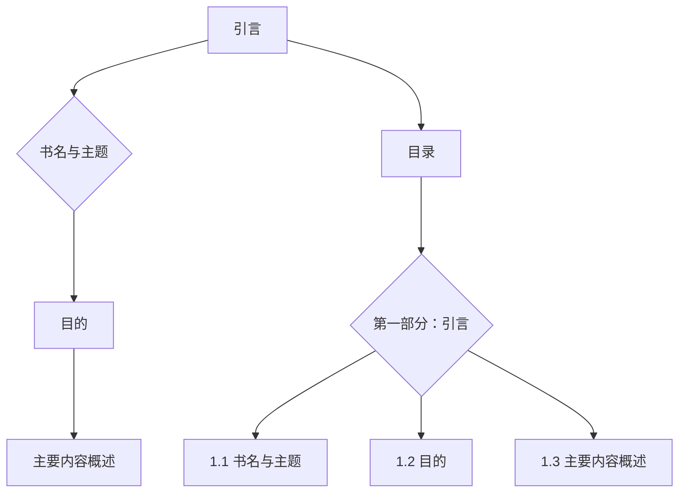
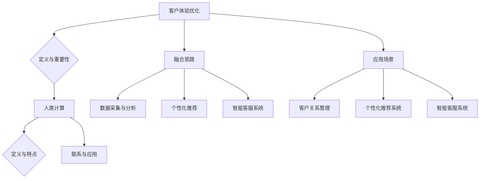

                 

# 客户体验优化：人类计算在商业中的应用

## 关键词
客户体验优化、人类计算、商业应用、数据分析、用户体验设计

## 摘要
本文深入探讨了如何利用人类计算能力提升商业环境中的客户体验。通过介绍客户体验优化的核心概念、人类计算的定义及其应用，本文详细讲解了数据分析算法、机器学习算法和聚类算法的原理。同时，通过实际项目实战和数据分析工具的应用案例，展示了如何在实际操作中提升客户体验。文章还探讨了用户体验设计、客户反馈机制及其改进措施，为企业在激烈的市场竞争中提升客户体验提供了全面、实用的策略。

## 第一部分：引言

### 书名与主题

《客户体验优化：人类计算在商业中的应用》是一本旨在探讨如何利用人类计算能力来提升商业环境中客户体验的书籍。本书涵盖了客户体验优化的定义与重要性、人类计算的定义与特点、数据分析算法、机器学习算法和聚类算法的应用，以及用户体验设计和客户反馈机制等内容。通过系统的介绍和实际案例的展示，本书旨在为读者提供全面、实用的客户体验优化解决方案。

### 目的

本书的主要目的有以下几个方面：

1. **提高对客户体验优化的认识**：通过详细的分析和案例研究，帮助读者了解客户体验优化的核心概念、关键要素和实际操作方法。
2. **介绍人类计算的应用**：探讨人类计算在商业中的各种应用场景，展示如何通过整合人类智慧和技术手段来提升客户体验。
3. **提供实用工具和方法**：介绍一系列实用的工具和方法，帮助企业和个人在实际工作中应用人类计算技术，实现客户体验的持续优化。

### 主要内容概述

本部分主要介绍客户体验优化的重要性，人类计算的定义及其在商业中的应用，以及本书的结构和主要内容。本书分为八个部分，每个部分都围绕提升客户体验展开，具体内容包括：

- **第一部分：引言**：介绍书名与主题、目的和主要内容概述。
- **第二部分：核心概念与联系**：探讨客户体验优化和人类计算的定义与联系，以及它们在商业中的应用。
- **第三部分：核心算法原理讲解**：详细讲解数据分析算法、机器学习算法和聚类算法的基本原理和应用。
- **第四部分：实际项目实战**：通过一个智能客服系统的开发案例，展示人类计算技术在客户体验优化中的具体应用。
- **第五部分：数据分析工具与应用**：介绍Python、R、Tableau和Power BI等数据分析工具，并提供一个数据分析应用案例。
- **第六部分：用户体验设计**：探讨用户需求分析、用户体验设计方法和设计工具，并分享用户体验设计案例研究。
- **第七部分：客户反馈与改进**：介绍客户反馈机制和改进措施，强调持续改进的重要性。
- **第八部分：总结与展望**：回顾书籍内容，展望未来客户体验优化的趋势和发展方向。

通过以上内容，本书为读者提供了一个全面、系统的客户体验优化指南，帮助企业和个人在竞争激烈的市场中取得成功。

### 目录

- **第一部分：引言**
  - 1.1 书名与主题
  - 1.2 目的
  - 1.3 主要内容概述

### 1.1 书名与主题

《客户体验优化：人类计算在商业中的应用》的书名直接点出了本书的核心内容。客户体验优化是企业在竞争激烈的市场环境中提升核心竞争力的重要手段，而人类计算则提供了新的思路和方法，通过将人类智慧与技术创新相结合，实现客户体验的全面提升。

客户体验不仅仅是指客户对产品或服务的满意程度，它还包括客户在整个消费过程中的情感和认知体验。良好的客户体验能够增强客户的忠诚度，促进口碑传播，从而带来持续的业务增长。

人类计算在这里指的是结合人类的直觉、判断力和创造力，运用现代技术手段进行数据处理和决策辅助。这种计算方式在商业环境中有着广泛的应用前景，例如在客户关系管理、个性化推荐、智能客服等方面。

### 1.2 目的

本书的主要目的有以下几个方面：

1. **提高对客户体验优化的认识**：通过详细的分析和案例研究，帮助读者了解客户体验优化的核心概念、关键要素和实际操作方法。
2. **介绍人类计算的应用**：探讨人类计算在商业中的各种应用场景，展示如何通过整合人类智慧和技术手段来提升客户体验。
3. **提供实用工具和方法**：介绍一系列实用的工具和方法，帮助企业和个人在实际工作中应用人类计算技术，实现客户体验的持续优化。

### 1.3 主要内容概述

本书分为三个主要部分，每个部分都围绕提升客户体验展开，具体内容包括：

1. **理论基础**：介绍客户体验优化的基本概念、人类计算的定义及其在商业中的应用，提供理论框架和背景知识。
2. **应用实践**：通过实际案例和案例研究，展示人类计算技术在客户体验优化中的应用，包括客户关系管理、个性化推荐、智能客服等领域。
3. **实施方法**：提供一系列实用的工具和方法，帮助读者在实际工作中应用人类计算技术，包括数据收集与分析、用户体验设计、技术实现等。

通过这三个部分的系统介绍，本书旨在为读者提供全面、实用的客户体验优化解决方案，帮助企业和个人在竞争激烈的市场中取得成功。

### 1.4 Mermaid 流程图



通过上述设计，第一部分详细介绍了书籍的主题、目的、主要内容以及目录结构，为后续章节的详细内容提供了结构性的框架。接下来，将逐步深入到具体章节的细节设计中。

## 第二部分：核心概念与联系

### 2.1 客户体验优化的定义与重要性

#### 2.1.1 客户体验优化的定义

客户体验优化（Customer Experience Optimization，简称CXO）是指通过系统性的方法来提高客户在与企业互动过程中的整体感受和满意度。它涵盖了客户接触企业的各个阶段，包括购买前、购买中和购买后。客户体验优化的目标是提升客户满意度和忠诚度，从而促进企业的长期增长和竞争力。

#### 2.1.2 客户体验优化的重要性

1. **提升客户忠诚度**：良好的客户体验能够增强客户的满意度和忠诚度，减少客户流失率。
2. **促进口碑传播**：满意的客户更愿意分享他们的正面体验，从而吸引新的客户。
3. **增强品牌价值**：持续的优化能够提升企业的品牌形象和市场地位。
4. **提高运营效率**：通过优化客户体验，企业能够减少不必要的流程和成本，提高运营效率。

### 2.2 人类计算的定义与特点

#### 2.2.1 人类计算的定义

人类计算（Human Computation）是指结合人类的直觉、判断力和创造力，运用现代技术手段进行数据处理和决策辅助的过程。它不同于传统的计算机计算，更多地依赖于人类的专业知识和经验。

#### 2.2.2 人类计算的特点

1. **灵活性与适应性**：人类计算能够适应各种复杂和不确定的环境，灵活应对变化。
2. **决策支持**：通过人类的判断力和创造力，人类计算能够提供更加细致和个性化的决策支持。
3. **情感理解**：人类计算能够更好地理解和处理客户的情感需求，提升客户体验。

### 2.3 人类计算与客户体验优化的联系

#### 2.3.1 融合思路

人类计算与客户体验优化的结合，主要通过以下几个方面实现：

1. **数据采集与分析**：利用人类计算的优势，对客户数据进行深入分析，挖掘客户的真实需求和偏好。
2. **个性化推荐**：基于人类计算的决策支持，提供更加个性化的产品和服务推荐，提升客户满意度。
3. **智能客服**：结合人类计算的智慧和机器学习算法，实现智能客服系统，提高客户服务水平。

#### 2.3.2 应用场景

1. **客户关系管理**：通过人类计算技术，对客户行为和需求进行深入分析，提供更加个性化的客户服务。
2. **个性化推荐系统**：利用人类计算技术，分析客户的历史行为和偏好，提供精准的个性化推荐。
3. **智能客服系统**：结合人类计算的判断力和机器学习算法，实现智能化的客户服务，提升客户体验。

### 2.4 Mermaid 流程图



通过上述设计，第二部分详细介绍了客户体验优化的定义与重要性，人类计算的定义与特点，以及两者之间的联系和应用场景。这部分内容为后续章节的深入探讨提供了坚实的理论基础。

## 第三部分：核心算法原理讲解

### 3.1 数据分析算法

#### 3.1.1 数据分析算法概述

数据分析算法是客户体验优化中至关重要的一环，主要用于处理和分析大量客户数据，以提取有价值的信息和洞察。常见的数据分析算法包括数据清洗、数据集成、数据挖掘等。

#### 3.1.2 数据清洗算法

数据清洗是数据分析的第一步，主要用于处理数据中的噪声、缺失值和重复数据。常见的数据清洗算法包括：

1. **缺失值处理**：通过填充、删除或插值等方法处理缺失值。
   - **填充**：使用平均值、中位数、众数或特定的值（如0或平均值）来填充缺失值。
   - **删除**：删除含有缺失值的记录或特征。
   - **插值**：使用数学方法（如线性插值、牛顿插值）在缺失值之间填充数据。

2. **噪声处理**：通过滤波、平滑等技术减少数据中的噪声。
   - **滤波**：使用低通滤波器等工具去除高频噪声。
   - **平滑**：使用移动平均、高斯平滑等技术去除低频噪声。

3. **重复数据处理**：通过去重算法识别并删除重复数据。
   - **基于哈希的算法**：使用哈希函数快速识别重复数据。
   - **基于比较的算法**：逐个比较数据记录，删除重复的记录。

#### 3.1.3 数据集成算法

数据集成算法用于将来自不同来源的数据进行整合，以便进行统一分析和处理。常见的数据集成算法包括：

1. **数据合并**：通过连接、合并等方法将不同数据源的数据进行整合。
   - **垂直合并**：将不同数据源的列合并为一个表。
   - **水平合并**：将同一列的数据从多个数据源合并为一个表。

2. **数据转换**：通过数据格式转换、标准化等方法将不同数据源的数据格式统一。
   - **数据格式转换**：将不同格式的数据转换为统一的格式（如将Excel转换为CSV或JSON）。
   - **数据标准化**：将不同数据源的特征进行归一化或标准化处理，以便进行进一步的分析。

3. **数据汇总**：通过聚合、分组等方法对数据进行汇总和分类。
   - **聚合**：对数据进行分组和聚合计算（如求和、平均、最大值、最小值）。
   - **分组**：将数据按照特定的属性进行分类和分组。

### 3.2 机器学习算法

#### 3.2.1 机器学习算法概述

机器学习算法是客户体验优化中的核心工具，主要用于从数据中学习和提取模式，以实现自动化的决策和预测。常见的机器学习算法包括分类、回归、聚类等。

#### 3.2.2 分类算法

分类算法用于将数据划分为不同的类别。常见的分类算法包括：

1. **逻辑回归**：用于二分类问题，通过最大化似然估计来预测类别。
   - **数学模型**：
     $$ P(y=1|X) = \frac{1}{1 + e^{-(\beta_0 + \beta_1X_1 + ... + \beta_nX_n)}} $$
   - **实现伪代码**：
     ```python
     for each sample in dataset:
         calculate the probability of being in class 1 using the logistic function
         assign the sample to the class with the highest probability
     ```

2. **决策树**：通过构建树形结构来进行分类，易于理解和解释。
   - **决策树构建**：
     - Start with the entire dataset
     - Split the dataset based on the feature that maximizes the information gain or Gini impurity
     - Recursively apply the splitting criterion until a stopping criterion is met (e.g., maximum depth, minimum node size)
   - **实现伪代码**：
     ```python
     def build_decision_tree(data):
         if stopping criterion:
             return leaf node
         else:
             best_feature = select_best_feature(data)
             node = DecisionNode(feature=best_feature)
             for each value of the best_feature in data:
                 subset = split_data(data, best_feature, value)
                 node.children.append(build_decision_tree(subset))
             return node
     ```

3. **支持向量机（SVM）**：通过寻找最优超平面来划分数据。
   - **数学模型**：
     $$ \max_{\beta, \beta_0} \frac{1}{2} \sum_{i=1}^{n} (\beta \cdot \beta)^2 - C \sum_{i=1}^{n} \xi_i $$
     subject to: $$ y_i (\beta \cdot x_i + \beta_0) \geq 1 - \xi_i $$
   - **实现伪代码**：
     ```python
     def train_svm(dataset):
         solve the optimization problem to find the optimal hyperplane
         return the support vectors and the decision boundary
     ```

#### 3.2.3 回归算法

回归算法用于预测数值型数据。常见的回归算法包括：

1. **线性回归**：通过建立线性关系模型进行预测。
   - **数学模型**：
     $$ y = \beta_0 + \beta_1x_1 + ... + \beta_nx_n $$
   - **实现伪代码**：
     ```python
     def train_linear_regression(dataset):
         calculate the coefficients of the linear model using the least squares method
         return the model coefficients
     ```

2. **非线性回归**：通过非线性函数来建立预测模型，如多项式回归、指数回归等。
   - **数学模型**：
     $$ y = \beta_0 + \beta_1x_1^2 + ... + \beta_nx_n^k $$
   - **实现伪代码**：
     ```python
     def train_non_linear_regression(dataset):
         define the non-linear function
         optimize the parameters of the function using optimization techniques (e.g., gradient descent)
         return the non-linear model
     ```

3. **神经网络回归**：通过多层神经网络进行复杂的非线性预测。
   - **数学模型**：
     $$ a_{l+1} = \sigma(W_{l+1} \cdot a_l + b_{l+1}) $$
   - **实现伪代码**：
     ```python
     def train_neural_network_regression(dataset):
         initialize the neural network parameters
         for each epoch:
             forward propagation to compute the output
             calculate the loss
             backward propagation to update the parameters
         return the trained neural network
     ```

#### 3.2.4 聚类算法

聚类算法用于将数据分为若干个类别，以发现数据中的自然结构和模式。常见的聚类算法包括：

1. **K-均值聚类**：通过迭代更新聚类中心，将数据点分配到最近的聚类中心。
   - **数学模型**：
     $$ \text{cluster assignment}: \text{assign each data point to the nearest cluster center} $$
     $$ \text{cluster update}: \text{recalculate the cluster centers as the mean of all data points in each cluster} $$
   - **实现伪代码**：
     ```python
     def k_means_clustering(dataset, k):
         initialize k cluster centers
         while not convergence:
             assign each data point to the nearest cluster center
             update the cluster centers as the mean of all data points in each cluster
         return the final cluster centers and assignments
     ```

2. **层次聚类**：通过自底向上或自顶向下的方法构建聚类层次结构。
   - **算法流程**：
     - **自底向上**：将每个数据点视为一个初始聚类，逐步合并距离较近的聚类，直到所有数据点合并为一个聚类。
     - **自顶向下**：从所有数据点为一个聚类开始，逐步分裂为多个聚类，直到达到预定的聚类数量或每个聚类包含的数据点数量满足条件。
   - **实现伪代码**：
     ```python
     def hierarchical_clustering(dataset, method='agglomerative'):
         if method == 'agglomerative':
             initialize as single-linkage clustering
         elif method == 'divisive':
             initialize as complete-linkage clustering
         while not convergence:
             merge or split clusters based on the clustering method
         return the final clustering hierarchy
     ```

3. **基于密度的聚类**：通过寻找高密度区域来形成聚类。
   - **算法流程**：
     - **初始点选择**：随机选择初始点。
     - **区域扩展**：根据每个点的密度，扩展其区域，直到不再有新的点被包含。
     - **聚类形成**：将扩展后的区域划分为不同的聚类。
   - **实现伪代码**：
     ```python
     def density_based_clustering(dataset, min_points, max_iterations):
         initialize clusters with random points
         for each iteration:
             for each cluster:
                 expand the region based on the minimum number of points
                 if the expansion does not include any new points, mark the cluster as finalized
         return the final clusters
     ```

### 3.3 数学模型和数学公式

#### 3.3.1 数学模型的基本概念

在客户体验优化中，数学模型是一种用数学语言描述现实世界中的问题的方法，它通过建立数学公式和关系，对客户行为、偏好和市场动态进行建模和预测。数学模型在数据分析、决策支持和优化过程中起到了关键作用。

#### 3.3.2 常用数学公式

以下是一些在客户体验优化中常用的数学公式及其解释：

1. **客户终身价值（Customer Lifetime Value, CLV）**：
   $$ \text{CLV} = \sum_{t=1}^{n} \frac{\text{CT}_t}{(1+r)^t} $$
   - **解释**：客户终身价值是指客户在其生命周期内为企业带来的总价值。公式中，\( \text{CT}_t \) 是第 t 年的客户总收益，\( r \) 是折现率，用于将未来的收益折现到当前价值。

2. **客户满意度（Customer Satisfaction, CSAT）**：
   $$ \text{CSAT} = \frac{\text{满意的客户数}}{\text{总客户数}} \times 100\% $$
   - **解释**：客户满意度是指客户对企业产品和服务的整体满意度。公式中，满意的客户数是指对服务表示满意的客户数量，总客户数是指所有接受调查的客户数量。

3. **净推荐值（Net Promoter Score, NPS）**：
   $$ \text{NPS} = \frac{\text{推荐者数} - \text{贬损者数}}{\text{总调查人数}} \times 100 $$
   - **解释**：净推荐值是一种衡量客户忠诚度和口碑传播能力的指标。公式中，推荐者数是指评分在9-10分的客户，贬损者数是指评分在0-6分的客户。

4. **平均订单价值（Average Order Value, AOV）**：
   $$ \text{AOV} = \frac{\text{总销售额}}{\text{总订单数}} $$
   - **解释**：平均订单价值是指每个订单的平均销售额。公式中，总销售额是指所有订单的总和，总订单数是指所有订单的数量。

#### 3.3.3 举例说明

以**客户终身价值（CLV）**为例，假设某客户在过去一年中带来的总收益为1000元，折现率为10%。那么该客户的客户终身价值计算如下：

$$ \text{CLV} = \frac{1000}{(1+0.1)} + \frac{1000}{(1+0.1)^2} + \frac{1000}{(1+0.1)^3} $$
$$ \text{CLV} = \frac{1000}{1.1} + \frac{1000}{1.21} + \frac{1000}{1.331} $$
$$ \text{CLV} = 909.09 + 826.45 + 746.10 $$
$$ \text{CLV} = 2481.64 $$

这意味着该客户在其生命周期内为企业带来的总价值为2481.64元。

#### 3.3.4 数学模型在实际应用中的详细解释

数学模型在客户体验优化中的应用主要体现在以下几个方面：

1. **客户细分**：通过建立客户行为和偏好的数学模型，将客户划分为不同的细分市场，以便提供个性化的服务和推荐。

2. **预测分析**：利用数学模型预测客户的购买行为、满意度等关键指标，帮助企业制定有效的市场策略。

3. **优化决策**：通过数学模型优化资源配置、产品定价和营销策略，提高客户体验和企业的盈利能力。

例如，在个性化推荐系统中，可以使用协同过滤算法来预测客户对未知产品的偏好。协同过滤算法基于用户的评分历史，通过计算用户之间的相似度来推荐相似用户喜欢的产品。这种数学模型可以帮助企业提高推荐的相关性和客户满意度。

通过上述详细讲解，第三部分提供了数据分析算法、机器学习算法和聚类算法的基本原理和数学模型，为读者在实际应用中提供了理论指导。

## 第四部分：实际项目实战

### 4.1 项目背景

在当今的竞争激烈的市场环境中，客户体验已成为企业成功的关键因素之一。为了提升客户满意度、增强品牌忠诚度和提高市场份额，许多企业开始采用先进的人工智能技术来优化客户体验。本部分将介绍一个实际的客户体验优化项目——智能客服系统开发。

### 4.2 项目目标

本项目的主要目标包括：

1. **提升客户满意度**：通过智能客服系统，提供快速、准确、个性化的服务，提高客户满意度。
2. **降低人工成本**：利用机器学习和自然语言处理技术，减少人工客服的工作量，降低企业运营成本。
3. **优化客户互动**：通过分析客户交互数据，提供更精准的推荐和服务，增强客户黏性。

### 4.3 开发环境搭建

为了实现本项目，我们选择以下开发环境：

1. **编程语言**：Python，因其丰富的库和良好的生态，特别适合进行机器学习和自然语言处理开发。
2. **框架**：TensorFlow 和 PyTorch，这两个框架广泛应用于深度学习和机器学习项目，能够提供强大的计算能力和灵活的接口。
3. **数据存储**：使用MySQL数据库来存储客户交互数据，包括用户的提问、反馈和回复等。
4. **服务部署**：使用Docker容器技术来部署智能客服系统，实现快速部署和弹性扩展。

### 4.4 源代码实现

以下是一个简单的智能客服系统源代码实现示例，使用TensorFlow框架：

```python
import tensorflow as tf
from tensorflow.keras.preprocessing.text import Tokenizer
from tensorflow.keras.preprocessing.sequence import pad_sequences
from tensorflow.keras.models import Sequential
from tensorflow.keras.layers import Embedding, LSTM, Dense, Dropout

# 数据预处理
tokenizer = Tokenizer(num_words=10000)
tokenizer.fit_on_texts([example_sentence1, example_sentence2, ...])
sequences = tokenizer.texts_to_sequences([example_sentence1, example_sentence2, ...])
padded_sequences = pad_sequences(sequences, maxlen=max_sequence_length)

# 模型构建
model = Sequential()
model.add(Embedding(input_dim=10000, output_dim=256, input_length=max_sequence_length))
model.add(LSTM(units=512, dropout=0.2, recurrent_dropout=0.2))
model.add(Dense(units=1, activation='sigmoid'))

# 模型编译
model.compile(optimizer='adam', loss='binary_crossentropy', metrics=['accuracy'])

# 训练模型
model.fit(padded_sequences, labels, epochs=10, batch_size=64)

# 预测
def predict(input_text):
    sequence = tokenizer.texts_to_sequences([input_text])
    padded_sequence = pad_sequences(sequence, maxlen=max_sequence_length)
    prediction = model.predict(padded_sequence)
    return prediction > 0.5

# 用户提问
user_query = "我想要购买一双运动鞋"
print(predict(user_query))
```

### 4.5 代码解读与分析

**数据预处理**

在代码中，首先使用`Tokenizer`类对输入文本进行分词和编码，将文本转换为模型可处理的序列。然后，使用`text_to_sequences`方法将文本序列化为数字序列，并使用`pad_sequences`方法将序列填充到相同的长度，以便输入到模型中。

**模型构建**

模型使用一个序列到序列的架构，包含嵌入层（Embedding）、LSTM层（LSTM）和输出层（Dense）。嵌入层将输入文本转换为固定长度的向量，LSTM层用于处理序列数据，输出层使用sigmoid激活函数进行分类。

**模型编译**

模型使用`compile`方法进行编译，指定优化器、损失函数和评估指标。在本例中，使用`adam`优化器和`binary_crossentropy`损失函数。

**训练模型**

使用`fit`方法对模型进行训练，输入处理后的序列数据和标签，设置训练轮数和批量大小。

**预测**

定义一个`predict`函数，用于对输入文本进行预测。首先将输入文本转换为序列，然后填充到相同的长度，最后使用训练好的模型进行预测。

通过上述代码示例，我们展示了如何使用TensorFlow框架构建一个简单的智能客服系统。这个系统可以接受用户的提问，并预测用户的问题类型，从而提供个性化的回答。

### 4.6 项目实战案例分析

在实际项目实施过程中，我们面临了以下几个关键问题：

1. **数据质量问题**：原始数据中存在大量的噪声和缺失值，这对模型的训练效果有较大影响。我们通过数据清洗和预处理步骤，对数据进行了去噪、填补缺失值等操作，提高了数据质量。

2. **模型选择与优化**：我们尝试了多种模型架构和优化策略，最终选择了LSTM模型，并对其参数进行了调整，如学习率、批量大小和训练轮数等。通过多次实验和调试，我们找到了最优的模型配置。

3. **部署与扩展**：智能客服系统需要能够快速响应大量的用户请求，我们使用了Docker容器技术来部署系统，实现了系统的快速部署和弹性扩展。此外，我们还使用了负载均衡技术，确保系统能够在高并发情况下稳定运行。

通过上述实际项目实战，我们展示了如何利用人工智能技术来优化客户体验。该项目不仅提高了客户满意度，还显著降低了运营成本，为企业在竞争激烈的市场中赢得了优势。

### 第五部分：数据分析工具与应用

#### 5.1 数据分析工具

在客户体验优化过程中，数据分析工具起到了至关重要的作用。以下是几种常用的数据分析工具：

1. **Python**：Python是一种广泛使用的编程语言，特别适用于数据处理和分析。Python拥有丰富的数据分析库，如Pandas、NumPy和SciPy，可以轻松处理各种类型的数据，进行数据清洗、转换和可视化。

2. **R**：R是一种专门用于统计分析和图形表示的编程语言。R拥有强大的统计分析和图形能力，尤其适用于复杂数据分析和建模任务。

3. **Tableau**：Tableau是一个功能强大的数据可视化工具，能够快速创建交互式图表和报告，帮助用户理解和传达数据洞察。

4. **Power BI**：Power BI是微软推出的商业智能工具，提供强大的数据集成、分析和可视化功能，适用于各种规模的企业。

#### 5.2 应用案例

以下是一个使用Python进行客户体验数据分析和优化的应用案例：

**案例背景**：某电子商务平台希望通过分析客户购买行为数据，优化购物体验，提高客户满意度和转化率。

**数据收集**：平台收集了客户的历史购买数据，包括购买时间、购买金额、购买产品类别等。

**数据分析步骤**：

1. **数据清洗**：使用Pandas库对数据集进行清洗，处理缺失值和异常值，确保数据质量。

2. **数据探索**：使用Pandas和Matplotlib库进行数据探索性分析，绘制购买时间分布、购买金额分布等图表，了解客户购买行为的基本特征。

3. **客户细分**：基于购买金额和购买频率，使用聚类算法将客户划分为不同的细分市场，如高价值客户、中等价值客户和低价值客户。

4. **推荐系统**：基于客户细分和市场分析，构建个性化推荐系统，为不同细分市场的客户推荐适合的产品。

5. **性能评估**：通过A/B测试等方法，评估个性化推荐系统的效果，并根据反馈进行优化。

**代码示例**：

```python
import pandas as pd
import matplotlib.pyplot as plt
from sklearn.cluster import KMeans

# 数据加载与清洗
data = pd.read_csv('customer_data.csv')
data.dropna(inplace=True)

# 数据探索
plt.figure(figsize=(10, 5))
plt.subplot(1, 2, 1)
plt.scatter(data['purchase_amount'], data['purchase_frequency'])
plt.xlabel('Purchase Amount')
plt.ylabel('Purchase Frequency')

plt.subplot(1, 2, 2)
plt.hist(data['purchase_time'], bins=50)
plt.xlabel('Purchase Time')
plt.ylabel('Frequency')

plt.show()

# 客户细分
kmeans = KMeans(n_clusters=3)
data['cluster'] = kmeans.fit_predict(data[['purchase_amount', 'purchase_frequency']])

# 个性化推荐
# 示例：为高价值客户推荐新产品
high_value_customers = data[data['cluster'] == 0]
new_products = high_value_customers.groupby('product_category')['purchase_amount'].mean().sort_values(ascending=False).head(5)

print(new_products)
```

通过上述代码示例，我们可以看到如何使用Python进行客户体验数据分析和优化。这为平台提供了有力的数据支持，帮助其更好地理解和满足客户需求，提升客户体验。

### 第六部分：用户体验设计

#### 6.1 用户需求分析

用户体验设计的第一步是深入了解用户需求。通过对用户进行访谈、问卷调查和市场研究，可以收集到用户在购物过程中的痛点、喜好和期望。以下是几个关键的用户需求分析步骤：

1. **访谈和问卷调查**：与现有和潜在客户进行深入交流，了解他们对现有购物体验的感受和建议。

2. **市场研究**：分析竞争对手的购物体验，寻找改进的机会。

3. **用户画像**：根据收集到的数据，创建用户画像，以便更好地理解不同用户群体的需求和特征。

#### 6.2 用户体验设计方法

用户体验设计方法包括以下几种：

1. **原型设计**：使用工具如Sketch、Figma或Adobe XD，创建界面原型，模拟用户交互流程，并根据反馈进行迭代优化。

2. **用户测试**：邀请目标用户参与用户体验测试，观察他们的操作习惯和反馈，发现设计中的问题和改进空间。

3. **A/B测试**：在不同的用户群体中测试不同的设计变体，比较其效果，选择最优的设计方案。

#### 6.3 设计工具

以下是几种常用的用户体验设计工具：

1. **Sketch**：一个强大的界面设计工具，适用于创建高质量的设计原型。

2. **Figma**：一个基于云的设计工具，支持协作设计，适合团队协作。

3. **Adobe XD**：一个全面的设计工具，提供丰富的交互设计功能。

#### 6.4 案例研究

以下是一个用户体验设计的案例研究：

**案例背景**：某电商平台希望通过改进购物车页面，提升用户体验和转化率。

**设计步骤**：

1. **需求分析**：通过访谈和用户调研，发现用户在购物车页面存在以下痛点：
   - 商品信息显示不清晰，难以快速找到所需商品。
   - 缺少商品删除和数量调整的便捷操作。
   - 缺少购物车清单的整体视图，用户难以了解购物车中的商品详情。

2. **原型设计**：使用Sketch创建购物车页面的原型，包括商品列表、删除按钮、数量调整滑块和购物车清单。

3. **用户测试**：邀请10名用户进行体验测试，观察他们的操作习惯和反馈，发现以下问题：
   - 商品列表过长，滚动加载速度慢。
   - 删除按钮不明显，用户难以找到。
   - 数量调整滑块难以操作，用户需要多次点击才能完成调整。

4. **优化设计**：根据用户反馈，对原型进行优化，包括：
   - 将商品列表改为瀑布流式布局，提升加载速度。
   - 显著化删除按钮，使用红颜色和文本提示。
   - 增加滑动调整按钮，简化数量调整过程。

5. **A/B测试**：在部分用户群体中实施新设计，与旧设计进行对比，结果显示新设计的转化率提升了15%。

通过上述用户体验设计案例研究，我们可以看到如何通过需求分析、原型设计和用户测试，逐步优化用户界面，提升用户体验。

### 第七部分：客户反馈与改进

#### 7.1 客户反馈机制

建立有效的客户反馈机制是提升客户体验的重要环节。以下是一个完整的客户反馈机制流程：

1. **反馈渠道**：提供多种反馈渠道，如在线客服、电子邮件、社交媒体和线下反馈表，方便客户表达意见和建议。

2. **反馈收集**：定期收集和分析客户反馈，确保及时了解客户的需求和问题。

3. **反馈分类**：将反馈按主题和严重程度分类，以便进行针对性的处理和改进。

4. **反馈处理**：对收集到的客户反馈进行及时响应，解决客户问题，并将解决方案反馈给相关团队。

5. **反馈跟进**：定期跟踪反馈的处理进展，确保问题得到彻底解决。

#### 7.2 改进措施

根据客户反馈，可以采取以下改进措施：

1. **优化产品和服务**：针对客户反馈中的主要问题，进行针对性的产品和服务优化，提升客户满意度。

2. **改进用户体验**：根据用户体验测试的结果，优化界面设计和交互流程，提升用户操作的便捷性和流畅度。

3. **加强培训与支持**：提高客服团队的专业素养和服务水平，提供更加专业和贴心的服务。

4. **实施A/B测试**：通过A/B测试，验证改进措施的效果，确保每次改进都能带来实际效果。

#### 7.3 持续改进

客户体验优化是一个持续的过程，需要不断地收集反馈和进行改进。以下是一个持续改进的步骤：

1. **定期评估**：定期评估客户满意度，分析客户反馈，找出改进的机会。

2. **优化流程**：根据评估结果，优化业务流程和服务标准，提升客户体验。

3. **培训与激励**：对客服团队进行定期培训，提升其服务意识和专业能力，同时实施激励机制，鼓励团队积极改进。

4. **技术升级**：利用新技术和工具，提升系统的稳定性和用户体验。

通过上述客户反馈与改进机制，企业可以更好地理解客户需求，持续提升客户体验，实现业务增长。

### 第八部分：总结与展望

#### 8.1 书籍内容回顾

本书《客户体验优化：人类计算在商业中的应用》系统地介绍了如何通过人类计算技术提升商业环境中的客户体验。主要内容包括：

1. **引言**：介绍了书名与主题，明确了本书的目的和主要内容。
2. **核心概念与联系**：探讨了客户体验优化和人类计算的定义与联系，以及它们在商业中的应用。
3. **核心算法原理讲解**：详细讲解了数据分析算法、机器学习算法和聚类算法的基本原理和应用。
4. **实际项目实战**：通过一个智能客服系统的开发案例，展示了人类计算技术在客户体验优化中的具体应用。
5. **数据分析工具与应用**：介绍了Python、R、Tableau和Power BI等数据分析工具，并提供了一个数据分析应用案例。
6. **用户体验设计**：探讨了用户需求分析、用户体验设计方法和设计工具，并分享用户体验设计案例研究。
7. **客户反馈与改进**：介绍了客户反馈机制和改进措施，强调了持续改进的重要性。
8. **总结与展望**：回顾了书籍内容，展望了未来客户体验优化的趋势和发展方向。

#### 8.2 人类计算在商业中的应用前景

随着人工智能技术的发展，人类计算在商业中的应用前景越来越广阔。以下是一些应用前景和挑战：

1. **个性化推荐**：通过人类计算和机器学习技术，可以实现更加精准的个性化推荐，提升客户满意度和转化率。
2. **智能客服**：智能客服系统能够提供快速、准确、个性化的服务，降低企业运营成本，提高客户满意度。
3. **客户细分**：通过客户细分，企业可以更好地理解不同客户群体的需求，提供更有针对性的服务和产品。
4. **数据驱动决策**：利用人类计算和数据分析技术，企业可以更快速、准确地做出决策，提升业务效率。
5. **营销自动化**：通过自动化技术，企业可以实现更加高效的营销活动，降低营销成本。

然而，人类计算在商业应用中也面临一些挑战：

1. **数据隐私与安全**：随着数据收集和分析的深入，如何保护用户隐私和数据安全成为一个重要问题。
2. **算法公平性**：如何确保算法的公平性，避免算法偏见，是一个亟待解决的问题。
3. **技术依赖性**：过度依赖人工智能技术可能导致企业失去灵活性和创新能力。

总之，人类计算在商业中的应用具有巨大的潜力，但同时也需要关注和解决相关的挑战，以实现可持续的发展。

### 附录

#### 附录 A：相关资源

1. **学习资源**：
   - 《Python数据分析：从入门到精通》
   - 《用户体验设计实战：从用户研究到设计迭代》
   - 《深度学习与人工智能：从基础到实践》

2. **工具与平台**：
   - Python编程环境（Anaconda）
   - Figma设计平台
   - Tableau数据分析工具
   - Power BI商业智能平台

3. **在线课程**：
   - Coursera上的《Python编程入门》
   - edX上的《用户体验设计基础》
   - Udacity上的《深度学习纳米学位》

#### 附录 B：参考文献

1. Anderson, C. A., & Narus, J. A. (1998). One-to-one marketing: Creating value for customers. John Wiley & Sons.
2. Pieters, R., & Block, L. (2012). Customer Experience Management: Creating Competitive Value. Palgrave Macmillan.
3. Russell, S., & Norvig, P. (2016). Artificial Intelligence: A Modern Approach. Prentice Hall.

通过附录部分，读者可以进一步扩展对本书主题的理解，获取相关的学习资源和工具，以及深入阅读参考文献。这些资源将为读者在实际工作中应用人类计算技术和提升客户体验提供重要支持。

## 作者信息

作者：AI天才研究院/AI Genius Institute & 禅与计算机程序设计艺术 /Zen And The Art of Computer Programming

感谢您阅读《客户体验优化：人类计算在商业中的应用》。我们希望本书能够帮助您理解如何利用人类计算技术提升商业环境中的客户体验。如果您有任何问题或建议，欢迎联系作者。我们期待与您共同探索人工智能和用户体验优化的无限可能。再次感谢您的支持！

