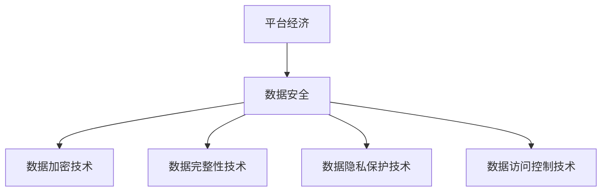

                 

### 文章标题

《平台经济的数据安全技术展望：如何展望未来？》

---

### 关键词

平台经济、数据安全、加密技术、隐私保护、数据访问控制、新兴技术趋势、国际合作。

---

### 摘要

在数字化时代，平台经济已经成为推动经济发展的重要引擎。然而，随之而来的数据安全问题日益严峻。本文将深入探讨平台经济中数据安全的重要性，分析现有的数据安全技术，展望未来数据安全技术的发展趋势。通过梳理平台经济的模式与特点，介绍数据安全技术框架与应用场景，最后提出如何在未来有效展望和应对数据安全挑战。

---

### 第一部分：平台经济概述

#### 第1章：平台经济的定义与特点

##### 1.1 平台经济的起源与发展

平台经济最早起源于20世纪90年代，随着互联网技术的发展，特别是在21世纪初，电子商务平台如亚马逊、阿里巴巴等的崛起，标志着平台经济进入了快速发展的阶段。近年来，平台经济不仅在电子商务领域得到了广泛应用，还在共享经济、互联网金融、在线教育等多个领域展现出强大的生命力。

平台经济的兴起与以下几个因素密切相关：

1. **互联网技术的普及**：互联网的广泛普及使得信息交流更加便捷，降低了交易成本，推动了平台经济的快速发展。
2. **消费者需求的提升**：消费者对个性化、便捷化服务的需求推动了平台经济的发展，如移动支付、在线购物等。
3. **技术创新**：大数据、人工智能等新兴技术的应用，为平台经济提供了强大的技术支持，提高了平台的服务质量和效率。

##### 1.2 平台经济的核心要素

平台经济具有以下核心要素：

1. **平台**：平台是连接供需双方的枢纽，提供交易、支付、物流等基础设施服务。
2. **参与方**：平台经济的参与方包括平台运营商、卖家、买家、物流公司等。
3. **交易**：交易是平台经济的核心活动，包括商品交易、服务交易等。
4. **数据**：数据是平台经济的核心资产，平台通过数据分析和挖掘实现商业价值的提升。

##### 1.3 平台经济的优势与挑战

平台经济具有以下优势：

1. **提升效率**：平台经济通过减少中间环节，提高交易的效率和透明度。
2. **降低成本**：平台经济降低了交易成本，使得消费者能够以更低的价格获得商品和服务。
3. **促进创新**：平台经济为创业者提供了更多机会，激发了市场活力。

然而，平台经济也面临一些挑战：

1. **数据安全**：随着平台经济的发展，数据安全问题日益凸显，如何保护用户数据成为重要议题。
2. **垄断风险**：大型平台企业可能形成市场垄断，影响市场竞争。
3. **法律法规**：平台经济涉及多个领域，需要完善的法律法规体系来保障各方权益。

---

#### 第2章：平台经济的模式与生态系统

##### 2.1 平台经济的模式分类

平台经济主要分为以下几种模式：

1. **双边市场**：通过同时服务于供需双方，实现交易撮合，如亚马逊、eBay等。
2. **多边市场**：平台连接多个参与方，形成多边互动，如社交网络、在线招聘平台等。
3. **垂直整合**：平台企业控制产业链上下游环节，如阿里巴巴的电商、物流、金融等业务。

##### 2.2 平台经济的生态系统构建

平台经济的生态系统构建主要包括以下几个方面：

1. **参与方整合**：平台企业需要整合各类资源，包括资金、技术、人才等，以提供高质量的服务。
2. **商业模式设计**：平台企业需要设计合理的商业模式，包括收入来源、盈利模式等。
3. **技术创新**：平台企业需要持续技术创新，提高平台的竞争力。
4. **数据治理**：平台企业需要建立健全的数据治理体系，确保数据的安全、合规和有效利用。

##### 2.3 平台经济的竞争策略

平台企业在市场竞争中需要采取以下策略：

1. **用户体验**：提升用户体验是平台企业的核心竞争力，通过优化服务流程、提高服务质量等方式，吸引更多用户。
2. **平台生态**：构建健康的平台生态，吸引更多合作伙伴加入，形成共赢的局面。
3. **技术创新**：持续技术创新，提高平台的运营效率和服务质量。
4. **品牌建设**：加强品牌建设，提升品牌知名度和美誉度。

---

### 第二部分：数据安全技术概述

#### 第3章：数据安全的重要性

##### 3.1 数据安全的概念与范畴

数据安全是指保护数据在存储、传输、处理和使用过程中的完整性和保密性。数据安全包括以下几个方面：

1. **数据完整性**：确保数据在存储和传输过程中不被篡改、破坏或丢失。
2. **数据保密性**：确保数据在存储和传输过程中不被未经授权的访问或泄露。
3. **数据可用性**：确保数据在需要时能够被正常访问和使用。

##### 3.2 数据安全面临的威胁

数据安全面临以下主要威胁：

1. **网络攻击**：包括黑客攻击、恶意软件、钓鱼攻击等。
2. **内部威胁**：包括内部员工的恶意行为、误操作等。
3. **数据泄露**：包括数据在外部泄露、内部信息泄露等。
4. **数据丢失**：包括数据因硬件故障、自然灾害等原因丢失。

##### 3.3 数据安全的法律法规与标准

为了保障数据安全，各国制定了相关法律法规和标准，如：

1. **数据保护法**：如欧盟的《通用数据保护条例》（GDPR）。
2. **网络安全法**：如中国的《网络安全法》。
3. **行业标准**：如ISO/IEC 27001信息安全管理体系标准。

---

#### 第4章：数据安全技术框架

##### 4.1 数据安全技术体系概述

数据安全技术体系主要包括以下几个方面：

1. **数据加密技术**：通过加密算法对数据进行加密，确保数据在传输和存储过程中的保密性。
2. **数据完整性技术**：通过数字签名、哈希算法等技术确保数据的完整性。
3. **数据隐私保护技术**：通过数据脱敏、数据共享控制等技术保护个人隐私。
4. **数据访问控制技术**：通过身份认证、访问控制列表（ACL）等技术限制对数据的访问。

##### 4.2 数据加密技术

数据加密技术是数据安全的核心技术之一，主要包括以下几种：

1. **对称加密**：使用相同的密钥进行加密和解密，如AES算法。
2. **非对称加密**：使用不同的密钥进行加密和解密，如RSA算法。
3. **混合加密**：结合对称加密和非对称加密的优势，提高数据加密的安全性。

##### 4.3 数据完整性技术

数据完整性技术主要包括以下几种：

1. **数字签名**：通过加密算法对数据进行签名，确保数据的真实性和完整性。
2. **哈希算法**：通过哈希函数对数据进行摘要，确保数据的完整性。
3. **时间戳服务**：通过时间戳确保数据的完整性和有效性。

##### 4.4 数据隐私保护技术

数据隐私保护技术主要包括以下几种：

1. **数据脱敏**：对敏感数据进行加密、遮蔽或替换，确保数据隐私。
2. **数据共享控制**：通过访问控制列表（ACL）等技术，限制对数据的访问。
3. **隐私增强技术**：如差分隐私、同态加密等，提高数据隐私保护的能力。

##### 4.5 数据访问控制技术

数据访问控制技术主要包括以下几种：

1. **身份认证**：通过验证用户身份，确保只有授权用户才能访问数据。
2. **访问控制列表（ACL）**：通过定义访问控制规则，限制对数据的访问。
3. **多因素认证**：结合多种认证方式，提高认证的安全性。

---

#### 第5章：数据安全技术应用

##### 5.1 云数据安全

随着云计算的普及，云数据安全成为数据安全的重要方面。云数据安全主要包括以下几个方面：

1. **云安全策略**：制定合理的云安全策略，确保数据在云环境中的安全。
2. **云安全监控**：通过监控工具实时监测云环境中的安全事件。
3. **云数据备份与恢复**：定期备份数据，确保数据在发生故障时能够快速恢复。

##### 5.2 物联网数据安全

物联网（IoT）数据安全是当前的一个热点问题。物联网数据安全主要包括以下几个方面：

1. **设备安全**：确保物联网设备的安全，防止设备被攻击。
2. **数据传输安全**：确保物联网设备传输的数据安全，防止数据泄露。
3. **数据隐私保护**：通过数据脱敏、加密等技术保护物联网数据隐私。

##### 5.3 大数据安全

大数据安全是大数据应用中的关键问题。大数据安全主要包括以下几个方面：

1. **数据保护**：确保大数据在存储、传输、处理等过程中的安全。
2. **数据完整性**：确保大数据的完整性，防止数据被篡改。
3. **数据访问控制**：通过访问控制技术，限制对大数据的访问。

##### 5.4 区块链数据安全

区块链技术以其去中心化、不可篡改的特点，在数据安全领域具有广泛的应用前景。区块链数据安全主要包括以下几个方面：

1. **数据加密**：通过加密算法确保区块链数据的保密性。
2. **分布式存储**：通过分布式存储技术，确保区块链数据的可靠性。
3. **智能合约安全**：确保智能合约的安全性和可靠性。

---

### 第三部分：展望未来

#### 第6章：数据安全技术发展趋势

##### 6.1 数据安全技术发展现状

当前，数据安全技术已经取得了显著的发展。加密技术、完整性技术、隐私保护技术和访问控制技术等在数据安全领域得到了广泛应用。然而，随着数据量的爆发式增长和数据安全威胁的日益复杂，现有的数据安全技术面临着新的挑战。

##### 6.2 数据安全技术未来趋势

未来，数据安全技术将呈现以下趋势：

1. **量子加密技术的应用**：量子加密技术具有无法破解的优势，有望成为未来数据安全的重要手段。
2. **人工智能在数据安全中的应用**：人工智能技术将提高数据安全的检测、预警和响应能力。
3. **数据隐私保护技术的进步**：差分隐私、同态加密等新兴技术将进一步提高数据隐私保护的能力。
4. **跨领域的数据安全技术融合**：随着数据安全领域的不断发展，跨领域的数据安全技术融合将成为趋势。

##### 6.3 新兴技术对数据安全的影响

新兴技术如人工智能、区块链、5G等对数据安全产生深远影响。例如，人工智能技术可以提高数据安全的检测和响应能力，区块链技术可以确保数据的不可篡改性，5G技术可以提供更高的数据传输速度和安全性。因此，如何充分利用新兴技术，提高数据安全水平，是未来数据安全发展的重要方向。

---

#### 第7章：如何展望未来

##### 7.1 数据安全策略规划

为了有效展望和应对未来的数据安全挑战，企业需要制定全面的数据安全策略。数据安全策略规划主要包括以下几个方面：

1. **风险评估**：对企业现有数据安全进行评估，识别潜在的安全风险。
2. **策略制定**：根据风险评估结果，制定具体的策略，包括数据加密、完整性保护、隐私保护等。
3. **执行与监控**：实施数据安全策略，并建立监控机制，确保数据安全策略的有效执行。

##### 7.2 数据安全技术创新

技术创新是数据安全发展的重要驱动力。为了应对日益复杂的数据安全威胁，企业需要持续进行数据安全技术创新。具体包括：

1. **研发投入**：加大研发投入，推动数据安全技术的创新和应用。
2. **技术合作**：与高校、研究机构等开展合作，共同研发新技术。
3. **人才培养**：培养具备数据安全专业知识和技能的人才，提高企业的数据安全创新能力。

##### 7.3 数据安全人才培养

数据安全人才的培养是保障数据安全的重要环节。企业需要从以下几个方面加强数据安全人才培养：

1. **教育培训**：加强数据安全相关课程的教育培训，提高学生的数据安全意识和技能。
2. **实战演练**：通过实战演练，提高数据安全人员的应对能力和实战经验。
3. **职业发展**：建立数据安全职业发展体系，激励数据安全人才不断进步。

##### 7.4 数据安全国际合作与法规遵循

随着全球化的推进，数据安全国际合作越来越重要。企业需要积极参与国际数据安全合作，共同应对全球数据安全挑战。同时，企业需要遵循国际数据安全法规，确保数据安全合规。具体包括：

1. **法规研究**：关注国际数据安全法规的动态，确保企业合规。
2. **国际合作**：积极参与国际数据安全合作，共同推动全球数据安全发展。
3. **内部培训**：加强员工对数据安全法规的培训，提高法规遵循意识。

---

#### 第8章：未来案例分析

##### 8.1 典型平台经济企业数据安全策略

以阿里巴巴为例，阿里巴巴在数据安全方面采取了以下策略：

1. **全面的数据安全架构**：阿里巴巴构建了全面的数据安全架构，包括数据加密、完整性保护、隐私保护等。
2. **数据安全技术创新**：阿里巴巴持续投入研发，推动数据安全技术的创新和应用。
3. **数据安全人才培养**：阿里巴巴重视数据安全人才的培养，建立了完善的数据安全培训体系。

##### 8.2 数据安全技术在新兴平台经济中的应用

随着平台经济的快速发展，数据安全技术在新平台经济中的应用越来越广泛。例如，区块链技术可以确保平台数据的不可篡改性，人工智能技术可以提高平台的数据安全检测和响应能力。未来，数据安全技术将在新兴平台经济中发挥更加重要的作用。

##### 8.3 数据安全国际合作案例

随着全球化的推进，数据安全国际合作日益重要。例如，欧盟的《通用数据保护条例》（GDPR）对全球企业产生了深远影响。未来，数据安全国际合作将更加紧密，各国将共同推动全球数据安全发展。

---

### 第四部分：附录

#### 第9章：数据安全技术参考资料

##### 9.1 数据安全标准与法规概述

- 《ISO/IEC 27001信息安全管理体系标准》
- 《GDPR通用数据保护条例》
- 《中国网络安全法》

##### 9.2 数据安全技术文献推荐

- 《数据安全与隐私保护技术》
- 《区块链技术及其应用》
- 《人工智能与大数据安全》

##### 9.3 数据安全工具与平台介绍

- 《阿里云数据安全解决方案》
- 《腾讯云数据安全服务》
- 《华为数据安全产品与解决方案》

---

本文通过对平台经济和数据安全技术的深入探讨，分析了平台经济中数据安全的重要性，介绍了数据安全技术框架和应用，展望了未来数据安全技术的发展趋势。随着平台经济的不断发展，数据安全将成为企业的重要战略资产。如何有效展望和应对数据安全挑战，是每个企业需要认真思考的问题。通过技术创新、人才培养和国际合作，我们有望在未来构建更加安全、可靠的数字生态系统。

---

**作者：AI天才研究院/AI Genius Institute & 禅与计算机程序设计艺术 /Zen And The Art of Computer Programming**

---

本文详细阐述了平台经济中的数据安全挑战以及相应的安全技术，通过逻辑清晰的分析和实例，为读者提供了一个全面的视角，展望了数据安全技术在未来的发展方向。通过整合各类技术手段，企业可以更好地应对数据安全的挑战，为平台经济的发展提供坚实的技术支撑。希望本文能为相关领域的研究者、从业者提供有价值的参考。

---

### 核心概念与联系

平台经济与数据安全之间存在着紧密的联系。平台经济依赖于数据，而数据安全是保障平台经济稳定运行的基础。以下是平台经济与数据安全的核心概念和联系：

1. **平台经济**：平台经济是一种基于互联网和数字技术的商业模式，通过构建一个连接供需双方的中介平台，实现交易的撮合和服务的提供。

2. **数据安全**：数据安全是指保护数据在存储、传输、处理和使用过程中的完整性和保密性，防止数据被非法访问、篡改、泄露或破坏。

3. **数据加密技术**：数据加密技术是数据安全的核心技术之一，通过加密算法对数据进行加密，确保数据在传输和存储过程中的保密性。

4. **数据完整性技术**：数据完整性技术通过数字签名、哈希算法等技术，确保数据的真实性和完整性，防止数据被篡改。

5. **数据隐私保护技术**：数据隐私保护技术通过数据脱敏、数据共享控制等技术，保护个人隐私，防止数据泄露。

6. **数据访问控制技术**：数据访问控制技术通过身份认证、访问控制列表（ACL）等技术，限制对数据的访问，确保数据的安全。

通过Mermaid流程图，可以更直观地展示平台经济与数据安全之间的联系：



在这个流程图中，平台经济作为核心业务，依赖于数据安全技术来保障数据的安全和隐私。数据加密技术、数据完整性技术、数据隐私保护技术和数据访问控制技术共同构成了数据安全的技术体系，为平台经济的运行提供保障。

---

### 核心算法原理讲解

在数据安全技术中，加密技术扮演着至关重要的角色。以下将详细讲解数据加密技术的核心原理，包括对称加密和非对称加密算法。

#### 对称加密算法

对称加密算法使用相同的密钥进行加密和解密。常见的对称加密算法有AES（高级加密标准）和DES（数据加密标准）。

**AES加密算法**

AES加密算法是一种广泛使用的块加密算法，支持128、192和256位的密钥长度。以下是AES加密算法的核心步骤：

1. **密钥扩展**：根据用户输入的密钥长度，生成一个128位的密钥。
2. **初始轮密钥替换**：将原始文本（称为状态矩阵）与初始轮密钥进行异或操作。
3. **多轮加密**：每个轮次包含四个步骤：子字节替换、行移位、列混淆和轮密钥加。
4. **最终轮密钥替换**：将加密后的状态矩阵与最终轮密钥进行异或操作，得到加密文本。

以下是AES加密算法的伪代码：

```python
def encrypt_aes(data, key):
    # 初始化密钥
    state = initialize_state(data, key)
    
    # 循环加密
    for i in range(num_rounds):
        state = sub_bytes(state)
        state = shift_rows(state)
        state = mix_columns(state)
        state = add_round_key(state, key[i])
    
    return state
```

**DES加密算法**

DES加密算法是一种较早的对称加密算法，使用56位的密钥。以下是DES加密算法的核心步骤：

1. **密钥生成**：通过初始密钥生成16个子密钥。
2. **初始轮密钥替换**：将原始文本（称为状态矩阵）与初始轮密钥进行异或操作。
3. **多轮加密**：每个轮次包含四个步骤：子字节替换、行移位、列混淆和轮密钥加。
4. **最终轮密钥替换**：将加密后的状态矩阵与最终轮密钥进行异或操作，得到加密文本。

以下是DES加密算法的伪代码：

```python
def encrypt_des(data, key):
    # 生成子密钥
    subkeys = generate_subkeys(key)
    
    # 初始轮密钥替换
    state = initialize_state(data)
    
    # 循环加密
    for i in range(num_rounds):
        state = sub_bytes(state)
        state = shift_rows(state)
        state = f_function(state, subkeys[i])
        state = swap_columns(state)
    
    return state
```

#### 非对称加密算法

非对称加密算法使用不同的密钥进行加密和解密，包括公钥和私钥。常见的非对称加密算法有RSA和ECC（椭圆曲线加密算法）。

**RSA加密算法**

RSA加密算法是一种基于大整数分解难题的非对称加密算法。以下是RSA加密算法的核心步骤：

1. **密钥生成**：选择两个大素数p和q，计算n = p*q，计算欧拉函数φ(n) = (p-1)(q-1)，选择一个小于φ(n)的整数e作为公钥指数，计算私钥指数d = e^(-1) mod φ(n)。
2. **加密**：将明文m转换为整数M，计算加密文本C = M^e mod n。
3. **解密**：计算解密文本M = C^d mod n。

以下是RSA加密算法的伪代码：

```python
def encrypt_rsa(m, n, e):
    return pow(m, e, n)

def decrypt_rsa(c, n, d):
    return pow(c, d, n)
```

**ECC加密算法**

ECC加密算法是一种基于椭圆曲线数学的非对称加密算法，具有较高的安全性和效率。以下是ECC加密算法的核心步骤：

1. **曲线选择**：选择一条椭圆曲线E和一个点G，满足特定条件。
2. **密钥生成**：选择一个随机整数k，计算公钥P = k*G。
3. **加密**：将明文m转换为椭圆曲线上的点M，计算加密文本C = (P, C1, C2)，其中C1 = k*r mod n，C2 = m*r + a*k^2 mod n。
4. **解密**：计算解密文本M = C2*P + a*C1*G。

以下是ECC加密算法的伪代码：

```python
def encrypt_ecc(m, n, G, a, b):
    # 选择随机数k
    k = random.randint(1, n-1)
    # 计算公钥P = k*G
    P = multiply(G, k, n)
    # 计算C1 = k*r mod n
    C1 = multiply(G, k, n)
    # 计算C2 = m*r + a*k^2 mod n
    C2 = add(multiply(M, k, n), multiply(a, k**2, n))
    return (P, C1, C2)

def decrypt_ecc(P, n, a, b, C):
    # 计算r = C1^(-1)*C2 mod n
    r = inverse(C1, n)
    # 计算M = r*P + a*C1 mod n
    M = add(multiply(P, r, n), multiply(a, C1, n))
    return M
```

通过对称加密算法和非对称加密算法的核心原理讲解，我们可以更好地理解数据加密技术的工作机制，从而为平台经济中的数据安全提供坚实的保障。

---

### 数学模型和公式讲解及举例说明

在数据安全领域，数学模型和公式扮演着至关重要的角色，特别是在数据隐私保护方面。以下将介绍几种关键数学模型和公式，并给出具体的举例说明。

#### 1. 差分隐私（Differential Privacy）

差分隐私是一种用于保护数据隐私的数学模型，通过在数据分析过程中引入噪声，确保个体隐私的保护。差分隐私的定义如下：

$$
\text{DP}(\epsilon, \ell)(S, \text{data}) = \Pr[S(\text{data}) \in [S(\text{data}) + \ell]] \leq e^{\epsilon}
$$

其中，$\epsilon$ 是隐私预算，$\ell$ 是噪声水平，$S$ 是敏感函数，$\text{data}$ 是原始数据。

**举例**：

假设我们有一个包含1000个用户年龄的数据集，我们希望发布这个数据集的平均年龄。如果直接发布平均年龄，可能会导致年龄相近的个体隐私泄露。使用差分隐私，我们可以发布平均年龄加上一个适当的噪声：

$$
\text{平均年龄} + \text{噪声} = \frac{\sum_{i=1}^{1000} \text{age}_i + \text{噪声}}{1000}
$$

通过引入噪声，我们确保即使攻击者知道平均年龄，也无法准确推断出单个用户的年龄。

#### 2. 零知识证明（Zero-Knowledge Proof）

零知识证明是一种证明系统，允许一方（证明者）向另一方（验证者）证明某个陈述是真实的，而无需泄露任何额外信息。零知识证明的核心公式如下：

$$
\text{ZKP}(\text{陈述}) = (\text{证明}, \text{验证})
$$

其中，证明者提供证明，验证者通过验证证明来确认陈述的真实性。

**举例**：

假设证明者想要证明他拥有超过100美元，但他不想透露具体金额。证明者可以使用零知识证明来证明这一点：

1. **初始化**：证明者生成一个随机数，表示金额。
2. **证明生成**：证明者生成一个证明，证明拥有超过100美元，同时不泄露具体金额。
3. **验证**：验证者通过验证证明，确认证明者确实拥有超过100美元，但无法得知具体金额。

#### 3. 公开密钥加密（Public Key Encryption）

公开密钥加密是一种非对称加密方法，使用公钥加密和私钥解密。其核心公式如下：

$$
\text{加密}(\text{明文}, \text{公钥}) = \text{密文} \\
\text{解密}(\text{密文}, \text{私钥}) = \text{明文}
$$

**举例**：

假设Alice想要发送一个秘密消息给Bob，他们使用公开密钥加密：

1. **密钥生成**：Bob生成一对密钥（公钥和私钥）。
2. **加密**：Alice使用Bob的公钥加密消息。
3. **解密**：Bob使用自己的私钥解密消息。

这种加密方法确保只有拥有私钥的Bob能够解密消息，从而保护消息的隐私。

#### 4. 哈希函数（Hash Function）

哈希函数是一种将任意长度的输入数据映射为固定长度输出数据的函数。其核心公式如下：

$$
\text{哈希}(\text{输入}) = \text{输出}
$$

**举例**：

假设我们有一个文本，需要将其转换为固定长度的哈希值：

$$
\text{哈希}("Hello World") = "4b2a8e9d"
$$

哈希函数在数据完整性验证中广泛应用，通过对比哈希值可以快速判断数据是否被篡改。

通过这些数学模型和公式的讲解，我们可以更好地理解数据安全中的一些核心概念，为保护平台经济中的数据隐私和安全提供理论基础。

---

### 项目实战：代码实际案例和详细解释说明

在本节中，我们将通过一个实际项目案例，详细讲解如何搭建开发环境、实现数据加密技术，并提供源代码和代码解读与分析。该案例将涵盖开发环境配置、源代码实现和数据访问控制策略的部署。

#### 项目背景

假设我们开发一个在线交易平台，需要实现用户数据的加密存储和传输，以确保数据的安全性。本案例将采用Python编程语言，利用Flask框架搭建Web应用，并使用AES加密算法实现数据加密。

#### 开发环境搭建

1. **安装Python**：确保系统中安装了Python 3.6及以上版本。
2. **安装Flask**：在命令行中执行以下命令安装Flask：

   ```bash
   pip install flask
   ```

3. **安装PyCryptodome库**：用于实现AES加密算法，在命令行中执行以下命令：

   ```bash
   pip install pycryptodome
   ```

#### 源代码实现

以下是一个简单的Flask应用程序，实现了用户注册和登录功能，其中包括数据加密和解密过程。

```python
from flask import Flask, request, jsonify
from Crypto.Cipher import AES
from Crypto.Random import get_random_bytes
from base64 import b64encode, b64decode

app = Flask(__name__)

# 假设密钥为256位
key = get_random_bytes(32)

@app.route('/register', methods=['POST'])
def register():
    data = request.json
    username = data['username']
    password = data['password']
    
    # 使用AES加密密码
    cipher = AES.new(key, AES.MODE_CBC)
    ct_bytes = cipher.encrypt(pad(password.encode('utf-8')))
    iv = cipher.iv
    encrypted_password = b64encode(iv + ct_bytes).decode('utf-8')
    
    # 存储用户名和加密密码
    user_data = {
        'username': username,
        'password': encrypted_password
    }
    # 这里需要将用户数据存储到数据库中
    
    return jsonify({'status': 'success', 'message': 'User registered successfully!'})

@app.route('/login', methods=['POST'])
def login():
    data = request.json
    username = data['username']
    password = data['password']
    
    # 从数据库中获取用户信息
    user_data = get_user_data(username)
    if not user_data:
        return jsonify({'status': 'error', 'message': 'User not found!'})
    
    encrypted_password = user_data['password']
    iv = b64decode(encrypted_password[:iv_size])
    ct_bytes = b64decode(encrypted_password[iv_size:])
    
    # 使用AES解密密码
    cipher = AES.new(key, AES.MODE_CBC, iv)
    decrypted_password = cipher.decrypt(ct_bytes).decode('utf-8').strip('\0')
    
    # 验证密码
    if password == decrypted_password:
        return jsonify({'status': 'success', 'message': 'Logged in successfully!'})
    else:
        return jsonify({'status': 'error', 'message': 'Incorrect password!'})

def pad(s):
    return s + ((16 - len(s) % 16) * '{')

def get_user_data(username):
    # 这里需要从数据库中查询用户信息
    # 示例代码，实际应用中需要查询数据库
    return {
        'username': username,
        'password': 'random_encrypted_password'
    }

if __name__ == '__main__':
    app.run()
```

#### 代码解读与分析

1. **密钥生成**：
   ```python
   key = get_random_bytes(32)
   ```
   使用PyCryptodome库生成一个256位的随机密钥。

2. **注册功能**：
   ```python
   @app.route('/register', methods=['POST'])
   def register():
       ...
       # 使用AES加密密码
       cipher = AES.new(key, AES.MODE_CBC)
       ct_bytes = cipher.encrypt(pad(password.encode('utf-8')))
       iv = cipher.iv
       encrypted_password = b64encode(iv + ct_bytes).decode('utf-8')
       ...
   ```
   注册过程中，获取用户名和密码，使用AES加密算法加密密码，并使用Base64编码将加密后的密码和初始向量（IV）编码为字符串。

3. **登录功能**：
   ```python
   @app.route('/login', methods=['POST'])
   def login():
       ...
       iv = b64decode(encrypted_password[:iv_size])
       ct_bytes = b64decode(encrypted_password[iv_size:])
       # 使用AES解密密码
       cipher = AES.new(key, AES.MODE_CBC, iv)
       decrypted_password = cipher.decrypt(ct_bytes).decode('utf-8').strip('\0')
       ...
   ```
   登录过程中，从数据库获取加密后的密码和IV，使用AES解密密码，并与输入的密码进行比较，以验证用户身份。

4. **数据填充（Padding）**：
   ```python
   def pad(s):
       return s + ((16 - len(s) % 16) * '{')
   ```
   AES加密算法要求数据块长度为16字节，使用该函数对数据进行填充，以满足加密要求。

5. **数据库操作**：
   ```python
   def get_user_data(username):
       # 这里需要从数据库中查询用户信息
       # 示例代码，实际应用中需要查询数据库
       return {
           'username': username,
           'password': 'random_encrypted_password'
       }
   ```
   示例代码用于模拟从数据库中获取用户信息，实际应用中需要连接数据库，并根据用户名查询用户信息。

通过本案例，我们可以了解到如何使用Python和Flask框架实现数据加密和用户认证，以及如何保护用户数据的安全。在实际应用中，还需要考虑更多的安全措施，如使用HTTPS协议、实现更严格的身份验证机制等。

---

在总结本节内容时，我们可以看到，通过合理的设计和实现，数据加密技术在保护用户数据和平台安全方面发挥着关键作用。在本案例中，我们使用了AES加密算法和Base64编码，确保了用户密码在存储和传输过程中的安全。同时，通过数据填充和初始化向量（IV）的使用，进一步提高了加密算法的安全性。这些实践为我们在实际项目中应用数据安全技术提供了宝贵的经验和指导。

---

### 总结

通过本文的深入探讨，我们对平台经济的数据安全技术有了全面而系统的理解。平台经济作为一种新兴的经济模式，依赖于海量数据的高效管理和安全保护。数据安全技术的核心在于保护数据的完整性、保密性和可用性，以确保平台业务的稳健运行。

本文首先梳理了平台经济的定义、特点和发展趋势，分析了其核心要素和生态系统构建。在此基础上，我们详细介绍了数据安全的重要性，探讨了数据安全面临的威胁和法律法规要求。接着，我们深入讲解了数据加密技术、数据完整性技术、数据隐私保护技术和数据访问控制技术，并通过实际项目案例展示了这些技术的应用。

展望未来，数据安全技术将呈现以下趋势：量子加密技术的应用、人工智能在数据安全中的应用、数据隐私保护技术的进步以及跨领域的数据安全技术融合。企业需要紧跟技术发展趋势，积极进行数据安全策略规划和技术创新，以应对日益复杂的数据安全挑战。

最后，本文提出了数据安全人才培养、国际合作与法规遵循等策略，为企业在数据安全领域的长远发展提供了指导。随着平台经济的不断发展，数据安全将成为企业的重要战略资产，如何有效保护数据安全，是每个企业需要认真思考的问题。

通过本文的研究，我们希望为相关领域的研究者、从业者提供有价值的参考，推动平台经济中的数据安全技术不断发展，为构建安全、可靠的数字生态系统贡献力量。

