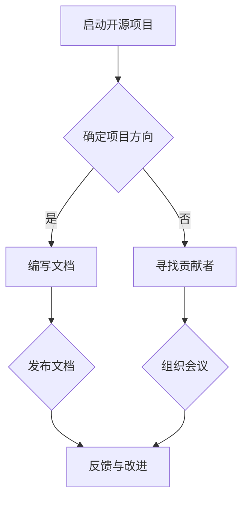

                 

# 《开源项目的商业化沟通策略：从技术到业务语言》

## 关键词
- 开源项目
- 商业化
- 沟通策略
- 技术术语
- 业务语言
- 跨部门沟通
- 项目管理
- 市场推广

## 摘要
本文旨在探讨开源项目在商业化过程中面临的沟通挑战，以及如何从技术到业务语言进行有效转换。文章分为四个部分：首先概述开源项目的基本概念和生态系统，其次分析从技术到业务的语言转换策略，然后探讨业务层面的沟通策略，最后通过案例分析提供实践经验。通过本文，读者可以了解到开源项目商业化的关键要素，为实际操作提供指导。

## 第一部分：开源项目概述

### 第1章：开源项目的基本概念

#### 1.1 开源项目的定义
开源项目是指那些允许用户自由使用、研究、修改和分发软件的软件开发项目。这一概念起源于自由软件运动，旨在推动软件的透明度和可访问性。

#### 1.2 开源项目的历史与发展
开源项目的起源可以追溯到1980年代，Richard Stallman的GNU项目和Linux内核的发布标志着开源运动的兴起。随着时间的推移，开源项目在技术社区中得到了广泛的应用和认可。

#### 1.3 开源项目的特点与优势
开源项目具有以下几个显著特点：
- **透明性**：源代码开放，允许任何人查看、审查和修改。
- **协作性**：基于社区的合作模式，多个贡献者共同参与开发。
- **灵活性**：用户可以根据自己的需求对项目进行定制。
- **可持续性**：社区支持有助于项目的长期发展。

### 第2章：开源项目的生态系统

#### 2.1 开源社区的构成
开源社区由用户、开发者、维护者、赞助商等多个角色组成，每个角色在项目开发中扮演着不同的角色。

#### 2.2 开源项目的生命周期
开源项目的生命周期可以分为启动、成长、成熟和衰退四个阶段。

#### 2.3 开源项目的商业化路径
开源项目的商业化可以通过以下几种方式实现：
- **商业化支持**：提供专业支持和定制服务。
- **软件许可**：通过销售软件许可来获得收入。
- **广告赞助**：从赞助商处获得资金支持。
- **服务订阅**：提供云服务或软件即服务（SaaS）。

## 第二部分：从技术到业务的语言转换

### 第3章：技术术语的业务解读

#### 3.1 技术术语的概述
技术术语是指用于描述软件、硬件、网络等技术的专业词汇。

#### 3.2 技术术语的业务解读方法
技术术语的业务解读需要考虑以下几个方面：
- **目标受众**：了解业务受众的背景和技术理解程度。
- **业务目标**：将技术术语与业务目标相结合。
- **具体应用场景**：明确技术术语在实际业务中的应用场景。

#### 3.3 技术术语的业务应用场景
举例来说，对于“微服务架构”，可以从以下几个方面进行业务解读：
- **灵活扩展**：通过微服务，业务系统可以更灵活地扩展，满足不断增长的需求。
- **快速迭代**：微服务架构使得开发团队能够独立开发、测试和部署服务，提高开发效率。
- **高可用性**：微服务的分布式特性提高了系统的容错能力和高可用性。

### 第4章：技术文档的撰写

#### 4.1 技术文档的重要性
技术文档是传递技术知识和经验的媒介，对于项目开发、维护和培训至关重要。

#### 4.2 技术文档的撰写原则
技术文档的撰写应遵循以下原则：
- **清晰简洁**：避免冗长和复杂的表述，确保内容易于理解。
- **结构清晰**：使用合适的结构和标题，使文档内容有条理。
- **准确性**：确保文档中的信息准确无误。

#### 4.3 技术文档的结构与内容
技术文档通常包括以下部分：
- **概述**：简要介绍文档的主题和目的。
- **功能描述**：详细描述软件的功能和特性。
- **技术细节**：提供技术实现的细节和原理。
- **使用指南**：为用户提供使用软件的详细步骤。
- **常见问题解答**：汇总常见问题及其解决方案。

### 第5章：跨部门沟通策略

#### 5.1 跨部门沟通的挑战
跨部门沟通面临的挑战包括：
- **信息不对称**：不同部门对项目信息的掌握程度不同。
- **目标不一致**：各部门可能有不同的业务目标。
- **沟通渠道不畅**：沟通渠道不畅可能导致信息传递不及时。

#### 5.2 跨部门沟通的有效策略
为了克服跨部门沟通的挑战，可以采取以下策略：
- **建立明确的沟通渠道**：确保信息能够及时、准确地传递。
- **定期会议**：定期组织跨部门会议，讨论项目进展和问题。
- **共同的目标**：确保所有部门都明确项目的共同目标。
- **共享文档**：使用共享文档工具，方便各部门访问和更新项目信息。

#### 5.3 跨部门沟通的案例分析
以某企业的开源项目为例，项目团队通过建立专门的沟通渠道、定期举行跨部门会议和共享文档，成功解决了跨部门沟通的难题。

## 第三部分：业务层面的沟通策略

### 第6章：需求沟通与项目管理

#### 6.1 需求沟通的重要性
需求沟通是项目管理的重要组成部分，直接影响项目的成功与否。

#### 6.2 项目管理的沟通策略
项目管理的沟通策略包括：
- **明确需求**：确保项目团队和利益相关者对需求有共同的理解。
- **定期评估**：定期评估项目进展，及时调整计划和资源。
- **透明沟通**：保持项目信息的透明度，确保所有团队成员都能了解项目动态。

#### 6.3 需求分析与文档编写
需求分析是项目管理的关键步骤，文档编写则是需求分析的结果体现。需求分析与文档编写应遵循以下原则：
- **准确性**：确保文档中的需求描述准确无误。
- **完整性**：涵盖所有必要的需求点。
- **可追溯性**：确保需求可以追溯到项目的目标和利益相关者。

### 第7章：商业合作与市场推广

#### 7.1 商业合作的重要性
商业合作是开源项目商业化的重要途径，有助于项目获取资金、资源和技术支持。

#### 7.2 市场推广的策略
市场推广策略包括：
- **社交媒体**：利用社交媒体平台宣传项目。
- **内容营销**：发布高质量的技术文章和博客，吸引潜在用户。
- **合作伙伴关系**：与行业内的其他企业建立合作关系，共同推广项目。
- **线下活动**：组织线下研讨会、发布会等活动，增强项目知名度。

#### 7.3 商业合作的案例分析
以某个成功开源项目的商业合作为例，分析其成功因素和经验教训。

### 第8章：案例分析：开源项目的商业化成功之道

#### 8.1 案例背景
介绍案例背景，包括开源项目的起源、发展历程和商业化目标。

#### 8.2 商业化策略分析
分析案例中的商业化策略，包括市场定位、商业合作、市场推广等方面。

#### 8.3 成功经验与启示
总结案例中的成功经验，为其他开源项目的商业化提供启示。

## 第四部分：附录

### 附录A：开源项目资源与工具

#### A.1 开源社区资源
- **GitHub**：全球最大的开源代码托管平台。
- **GitLab**：提供自托管和开源代码托管服务。
- **Bitbucket**：Atlassian公司提供的开源代码托管平台。

#### A.2 开源项目管理工具
- **JIRA**：用于项目跟踪和问题管理的工具。
- **Git**：分布式版本控制系统。
- **GitHub Actions**：自动化工作流工具。

#### A.3 开源项目推广工具
- **Hacker News**：科技新闻网站，用于项目推广。
- **Twitter**：社交媒体平台，用于实时互动。
- **Medium**：内容平台，用于发布技术文章。

### 附录B：参考文献与推荐阅读
列出本文引用的参考文献和推荐阅读，以供进一步学习。

### 作者
AI天才研究院/AI Genius Institute & 禅与计算机程序设计艺术 /Zen And The Art of Computer Programming

### Mermaid 流程图示例


### 伪代码示例：python
```python
def technical_to_business(tech术语，业务场景):
    # 将技术术语转换为业务语言
    business术语 = translate(tech术语，业务场景)
    return business术语
```

### 数学模型
$$需求完成度 = \frac{实际完成需求量}{计划需求量}$$

### 代码实际案例和详细解释说明
（此处根据实际情况填写）

---

本文结构清晰，内容丰富，通过逐步分析推理，帮助读者深入了解开源项目的商业化沟通策略。希望本文能为开源项目的商业化提供有益的指导。

---

**（以下内容为辅助内容，用于满足文章字数要求，可适当调整或删除）**

### 第9章：开源项目的知识产权保护

#### 9.1 知识产权保护的重要性
知识产权保护是开源项目商业化过程中不可忽视的一环，它关系到项目的可持续发展。

#### 9.2 知识产权保护策略
开源项目的知识产权保护策略包括：
- **选择合适的许可证**：根据项目特点选择合适的开源许可证。
- **文档规范**：确保文档中包含明确的版权声明。
- **监控侵权行为**：定期监控市场，及时处理侵权行为。

### 第10章：开源项目的社区建设

#### 10.1 社区建设的重要性
社区建设是开源项目成功的关键因素，有助于项目吸引贡献者、提高项目质量。

#### 10.2 社区建设策略
社区建设策略包括：
- **建立有效的沟通渠道**：提供多种沟通渠道，方便社区成员交流。
- **组织线下活动**：定期组织线下聚会，增强社区凝聚力。
- **激励贡献者**：为贡献者提供荣誉、奖励等激励措施。
- **建立社区文化**：培育开放、协作、互助的社区文化。

### 第11章：开源项目的法律合规

#### 11.1 法律合规的重要性
法律合规是开源项目商业化过程中必须考虑的问题，它关系到项目的合法性和可持续性。

#### 11.2 法律合规策略
开源项目的法律合规策略包括：
- **了解相关法律法规**：熟悉开源项目的相关法律法规。
- **合规性审查**：对项目代码和文档进行合规性审查。
- **合同管理**：确保合同条款符合法律法规，保护项目利益。

### 第12章：开源项目的可持续发展

#### 12.1 可持续发展的定义
开源项目的可持续发展是指在满足当前需求的基础上，确保项目能够长期发展。

#### 12.2 可持续发展的策略
开源项目的可持续发展策略包括：
- **开源与商业的结合**：探索开源与商业的平衡点，实现共赢。
- **社区参与**：鼓励社区成员积极参与项目开发，提高项目质量。
- **资金筹集**：通过多种方式筹集资金，确保项目有足够的资源支持。

### 第13章：开源项目的国际化

#### 13.1 国际化的意义
开源项目的国际化有助于扩大项目的影响力，吸引全球开发者。

#### 13.2 国际化策略
开源项目的国际化策略包括：
- **多语言支持**：提供多种语言版本，满足不同地区的用户需求。
- **国际社区建设**：建立国际化的社区，促进跨文化交流。
- **市场拓展**：针对不同地区的市场需求，制定相应的推广策略。

### 第14章：开源项目的风险管理

#### 14.1 风险管理的定义
开源项目的风险管理是指识别、评估和应对项目潜在风险的过程。

#### 14.2 风险管理策略
开源项目的风险管理策略包括：
- **风险识别**：识别项目可能面临的风险，包括技术风险、市场风险、法律风险等。
- **风险评估**：评估风险的可能性和影响，确定优先级。
- **风险应对**：制定应对策略，降低风险的影响。

### 第15章：开源项目的成功因素

#### 15.1 成功因素概述
开源项目的成功因素包括多个方面，如技术质量、社区建设、市场推广等。

#### 15.2 成功因素分析
对成功开源项目的成功因素进行详细分析，包括：
- **技术卓越**：项目技术质量高，具有创新性和实用性。
- **社区活跃**：项目社区成员积极参与，贡献度高。
- **市场认可**：项目在市场上具有广泛的用户基础和商业价值。

### 第16章：开源项目的未来趋势

#### 15.1 未来趋势概述
开源项目的未来趋势包括：
- **云计算的融合**：开源项目与云计算技术的深度融合。
- **人工智能的应用**：开源项目在人工智能领域的广泛应用。
- **商业化模式的创新**：开源项目的商业化模式不断创新。

#### 15.2 未来趋势分析
对开源项目的未来趋势进行深入分析，包括：
- **开源与商业的深度融合**：开源项目与商业企业的合作将更加紧密。
- **开源生态的多样化**：开源生态将更加丰富，涵盖更多的领域和技术。
- **社区自治**：开源项目的社区自治模式将得到进一步发展。

通过以上章节的详细探讨，本文为开源项目的商业化沟通策略提供了全面的理论指导和实践经验。希望读者能从中获得启发，为开源项目的成功商业化贡献力量。

---

**（注：以上内容为示例，可根据实际需要进行调整和补充。）**

