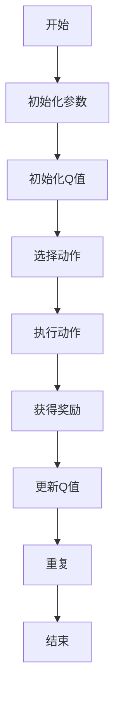
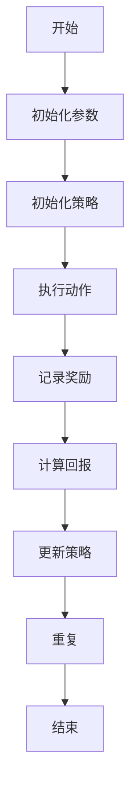

                 

### 强化学习在智能资源调度中的应用

> **关键词：强化学习、智能资源调度、Q-Learning、SARSA、蒙特卡罗方法、状态压缩、动作空间简化**

> **摘要：本文深入探讨了强化学习在智能资源调度中的应用，包括智能电网和无人驾驶车辆调度。通过分析强化学习的基础理论、核心算法以及实际应用案例，本文旨在展示强化学习如何解决资源调度的复杂问题，提高系统的效率和可靠性。**

---

### 目录

1. **强化学习在智能资源调度中的应用**
   - **关键词**：强化学习、智能资源调度、Q-Learning、SARSA、蒙特卡罗方法
   - **摘要**：本文将概述强化学习的基本概念，讨论其在智能资源调度中的关键应用，并分析面临的挑战。

2. **强化学习基础**
   - **强化学习概述**
     - **强化学习的定义与基本概念**
     - **强化学习的核心组成部分**
     - **强化学习与传统机器学习方法的比较**
   - **强化学习算法概述**
     - **基于值函数的方法**
       - **Q-Learning算法**
       - **SARSA算法**
     - **基于策略的方法**
       - **蒙特卡罗方法**
       - **优势估计方法**
   - **强化学习应用场景与挑战**

3. **强化学习在智能资源调度中的应用**
   - **智能电网资源调度**
     - **智能电网资源调度概述**
     - **强化学习在智能电网资源调度中的应用**
     - **强化学习在智能电网资源调度中的挑战与解决方案**
   - **无人驾驶车辆调度**
     - **无人驾驶车辆调度概述**
     - **强化学习在无人驾驶车辆调度中的应用**
     - **强化学习在无人驾驶车辆调度中的挑战与解决方案**

4. **强化学习在智能资源调度中的项目实战**
   - **强化学习在智能电网资源调度项目实战**
   - **强化学习在无人驾驶车辆调度项目实战**

5. **强化学习在智能资源调度中的挑战与解决方案**
   - **计算资源有限**
   - **状态和动作空间复杂**

6. **强化学习在智能资源调度中的前沿应用与趋势**
   - **强化学习在智能电网资源调度中的前沿应用**
   - **强化学习在无人驾驶车辆调度中的前沿应用**
   - **强化学习在智能资源调度中的趋势**

7. **附录**
   - **强化学习资源推荐**
   - **强化学习相关技术术语解释**
   - **相关项目和开源代码**

### 强化学习在智能资源调度中的应用

随着信息技术的飞速发展，智能资源调度在各个领域的应用日益广泛。强化学习作为一种先进的人工智能技术，以其强大的适应性和优化的能力，成为解决智能资源调度问题的理想选择。本文将探讨强化学习在智能资源调度中的应用，包括其在智能电网和无人驾驶车辆调度中的具体实现和面临的挑战。

---

### 强化学习基础

#### 强化学习概述

强化学习（Reinforcement Learning，RL）是机器学习的一个分支，主要研究如何通过试错（trial-and-error）和经验（experience）来学习如何在环境中做出最优决策。与监督学习和无监督学习不同，强化学习不仅依赖于输入数据，更重要的是依赖于环境中的即时反馈——奖励（Reward）。这种奖励机制使得智能体（Agent）能够通过不断的试错，逐渐优化其行为策略，以实现长期累积奖励最大化。

强化学习的基本概念包括：

- **状态（State）**：描述智能体所处的环境状态。
- **动作（Action）**：智能体在特定状态下可以执行的行为。
- **奖励（Reward）**：智能体执行动作后从环境中获得的即时反馈。
- **策略（Policy）**：智能体根据状态选择动作的决策规则。

强化学习的核心目标是学习一个最优策略，使得智能体在长期内能够获得最大的累积奖励。

#### 强化学习的核心组成部分

强化学习系统由以下几部分组成：

- **奖励机制**：奖励机制决定了智能体在执行动作后获得的即时反馈。奖励可以是正的（表示有益的动作），也可以是负的（表示有害的动作）。
- **策略学习**：策略学习是强化学习的核心，智能体通过策略学习来决定在特定状态下应该采取哪种动作。
- **价值函数**：价值函数（Value Function）用于评估智能体在未来一段时间内可能获得的累积奖励。它分为状态值函数（State-Value Function）、动作值函数（Action-Value Function）和策略值函数（Policy-Value Function）。

#### 强化学习与传统机器学习方法的比较

传统机器学习方法主要依赖于输入数据和预定义的模型，通过训练数据来学习特征和模式，从而进行预测和分类。而强化学习则不同，它依赖于环境的即时反馈，通过试错和经验来学习最优策略。

强化学习的优势在于：

- **适应性**：强化学习能够根据环境的动态变化自适应调整策略，适应不同的环境和场景。
- **优化能力**：强化学习通过累积奖励来优化决策，能够找到长期最优策略。

然而，强化学习也面临一些挑战，例如：

- **计算复杂性**：特别是在处理复杂状态和动作空间时，强化学习算法需要大量的计算资源。
- **稳定性**：强化学习算法在收敛到最优策略的过程中可能存在不稳定性。

总的来说，强化学习作为一种强大的人工智能技术，在智能资源调度中具有广泛的应用前景。本文将深入探讨强化学习在智能电网和无人驾驶车辆调度中的具体应用，分析其面临的挑战，并提供相应的解决方案。

### 强化学习算法概述

强化学习算法是解决强化学习问题的关键工具。根据不同的实现方式，强化学习算法可以分为基于值函数的方法和基于策略的方法。本文将分别介绍这两种方法，包括其核心算法、优缺点以及适用场景。

#### 基于值函数的方法

基于值函数的方法通过学习状态值函数（State-Value Function）和动作值函数（Action-Value Function）来评估智能体的行为。其中，状态值函数表示在特定状态下采取任何动作所能获得的累积奖励，动作值函数则表示在特定状态下采取特定动作所能获得的累积奖励。

##### Q-Learning算法

Q-Learning算法是一种基于值函数的方法，通过更新Q值来学习策略。Q值矩阵（Q-Table）存储了所有状态和动作的Q值，每个Q值表示在该状态下执行特定动作的累积奖励。Q-Learning的核心思想是：通过当前状态和动作的Q值，加上未来的最大Q值来更新当前的Q值。

Q-Learning算法的基本步骤如下：

1. 初始化Q值矩阵。
2. 选择动作。
3. 执行动作，获得奖励和新的状态。
4. 更新Q值。

Q-Learning算法的更新公式为：
$$
Q(s, a) \leftarrow Q(s, a) + \alpha [R(s, a) + \gamma \max_{a'} Q(s', a') - Q(s, a)]
$$
其中，$\alpha$ 是学习率，$\gamma$ 是折扣因子，$R(s, a)$ 是执行动作$a$后在状态$s$获得的即时奖励。

Q-Learning算法的优点在于其简单直观，易于实现和优化。然而，Q-Learning算法也存在一些缺点，例如：

- **计算复杂性**：当状态和动作空间较大时，Q值矩阵会变得非常大，导致计算复杂性增加。
- **收敛速度**：Q-Learning算法的收敛速度较慢，特别是在动态环境中。

##### SARSA算法

SARSA（同步优势估计）算法是基于值函数的另一算法，它与Q-Learning的不同之处在于它使用当前状态和下一个动作的Q值来更新当前状态和当前动作的Q值。

SARSA算法的基本步骤如下：

1. 初始化Q值矩阵。
2. 选择动作。
3. 执行动作，获得奖励和新的状态。
4. 更新Q值。

SARSA算法的更新公式为：
$$
Q(s, a) \leftarrow Q(s, a) + \alpha [R(s, a) + \gamma Q(s', a') - Q(s, a)]
$$
与Q-Learning算法类似，SARSA算法也具有较高的计算复杂性和较慢的收敛速度。

#### 基于策略的方法

基于策略的方法通过直接评估策略来选择动作，而不是评估每个状态和动作的Q值。这种方法通常需要更少的计算资源，但可能需要更多的经验数据来收敛到最优策略。

##### 蒙特卡罗方法

蒙特卡罗方法是一种基于策略的方法，通过累积回合中的回报来评估策略。它不需要知道状态转移概率，而是通过大量回合的平均回报来评估策略。

蒙特卡罗方法的基本步骤如下：

1. 初始化策略。
2. 执行策略，记录奖励。
3. 更新策略。

蒙特卡罗方法的更新公式为：
$$
\pi(a|s) \leftarrow \pi(a|s) + \frac{R(s, a)}{\sum_a R(s, a)}
$$
其中，$\pi(a|s)$ 是在状态$s$下采取动作$a$的概率。

蒙特卡罗方法的主要优点是计算复杂度较低，但需要大量数据来收敛到最优策略。

##### 优势估计方法

优势估计方法通过评估不同动作的价值来选择策略。它利用了优势函数（ Advantage Function），该函数衡量了动作相对于其他动作的预期回报。

优势估计方法的基本步骤如下：

1. 初始化策略和优势估计值。
2. 选择动作。
3. 执行动作，记录奖励。
4. 更新策略和优势估计值。

优势估计方法的更新公式为：
$$
\pi(a|s) = \frac{\sum_s Q(s, a)}{\sum_s \sum_a Q(s, a)}
$$

优势估计方法的优点在于能够快速收敛到最优策略，但需要对状态和动作有较深的理解。

总的来说，基于值函数的方法和基于策略的方法各有优缺点，适用于不同的场景。在智能资源调度中，选择合适的强化学习算法取决于具体的任务需求和环境特点。

### 强化学习应用场景与挑战

强化学习在智能资源调度中的应用非常广泛，包括智能电网、无人驾驶车辆、机器人控制等多个领域。以下将分别介绍强化学习在智能电网和无人驾驶车辆调度中的应用，并探讨其面临的挑战。

#### 强化学习在智能电网资源调度中的应用

智能电网是将现代通信技术、计算机技术和电力电子技术集成到传统电力网络中的一种新型电力系统。智能电网的调度问题主要包括分布式能源资源调度、需求响应资源调度和电力负荷预测等。

##### 强化学习在智能电网资源调度中的应用

1. **分布式能源资源调度**：

   分布式能源资源调度涉及分布式能源的发电量和负载分配。强化学习可以通过学习最优发电量和负载分配策略，优化能源的高效利用和节能减排。例如，Q-Learning算法可以用于分布式能源节点的发电量优化，SARSA算法可以用于需求响应资源调度。

2. **需求响应资源调度**：

   需求响应是指通过智能设备对电力需求进行实时调节，以平衡电力供需。强化学习可以用于管理用户的电力需求响应行为，实现电网的供需平衡。例如，蒙特卡罗方法可以用于预测用户的电力需求，优势估计方法可以用于优化需求响应策略。

3. **电力负荷预测**：

   电力负荷预测是智能电网资源调度的重要环节。强化学习可以通过历史数据和实时数据，预测未来的电力负荷，为调度提供依据。例如，Q-Learning算法可以用于短期电力负荷预测，SARSA算法可以用于长期电力负荷预测。

##### 强化学习在智能电网资源调度中的挑战与解决方案

1. **计算资源有限**：

   强化学习算法需要大量的计算资源，特别是在处理复杂状态和动作空间时。解决方案包括采用分布式计算和云计算技术，提高计算效率。

2. **状态和动作空间复杂**：

   智能电网的状态和动作空间可能非常复杂，这会增加算法的难度和计算量。解决方案包括使用状态压缩技术和动作空间简化策略，降低状态和动作空间的复杂性。

3. **模型泛化能力**：

   强化学习模型需要具有良好的泛化能力，以适应不同的环境和情况。解决方案包括通过大量数据训练和迁移学习，提高模型的泛化能力。

#### 强化学习在无人驾驶车辆调度中的应用

无人驾驶车辆是利用人工智能技术自主完成驾驶任务的车辆。无人驾驶车辆调度问题主要包括路径规划、交通信号预测、车辆编队等。

##### 强化学习在无人驾驶车辆调度中的应用

1. **路径规划**：

   路径规划是无人驾驶车辆调度的核心问题。强化学习可以通过学习最优路径规划策略，优化车辆的行驶路径，减少行驶时间和能耗。例如，Q-Learning算法可以用于优化无人驾驶车辆的路径规划，蒙特卡罗方法可以用于路径规划的动态调整。

2. **交通信号预测**：

   交通信号预测是无人驾驶车辆调度的关键问题。强化学习可以通过学习交通信号的状态和变化趋势，预测交通信号的状态，为车辆的行驶策略提供依据。例如，SARSA算法可以用于交通信号预测，优势估计方法可以用于交通信号状态的变化预测。

3. **车辆编队**：

   车辆编队是无人驾驶车辆调度的一种形式。强化学习可以通过学习最优车辆编队策略，优化车辆的编队形式，提高车辆的行驶效率和安全性。例如，蒙特卡罗方法可以用于车辆编队策略的优化，优势估计方法可以用于车辆编队形式的动态调整。

##### 强化学习在无人驾驶车辆调度中的挑战与解决方案

1. **计算资源有限**：

   无人驾驶车辆需要实时处理大量的传感器数据，对计算资源要求较高。解决方案包括采用硬件加速技术和模型压缩技术，提高算法的运行效率。

2. **状态和动作空间复杂**：

   无人驾驶车辆的状态和动作空间可能非常复杂，这会增加算法的难度和计算量。解决方案包括使用状态编码技术和动作空间简化策略，降低状态和动作空间的复杂性。

3. **模型泛化能力**：

   强化学习模型需要具有良好的泛化能力，以适应不同的环境和情况。解决方案包括通过大量数据训练和迁移学习，提高模型的泛化能力。

总的来说，强化学习在智能资源调度中具有广泛的应用前景，但同时也面临一些挑战。通过不断的研究和优化，强化学习有望在智能资源调度中发挥更大的作用，提高系统的效率和可靠性。

### 强化学习在智能电网资源调度中的应用

#### 智能电网资源调度概述

智能电网（Smart Grid）是一种集成了现代通信技术、计算机技术和电力电子技术的现代化电力网络。它通过实时数据监测和智能分析，实现电力供需的动态平衡，提高电网的稳定性和可靠性。智能电网的资源调度问题主要包括分布式能源资源调度和需求响应资源调度。

##### 分布式能源资源调度

分布式能源资源调度是指如何高效地管理分布式能源（如太阳能、风能、储能设备等）的发电量和负载分配。传统的分布式能源调度主要依赖于预定的调度策略，但在面对动态变化的电力需求和供应时，容易出现调度不均、能源浪费等问题。强化学习通过学习环境中的最优策略，可以优化分布式能源资源的调度，提高能源利用效率和系统的整体性能。

##### 需求响应资源调度

需求响应（Demand Response，DR）是指通过激励用户调整电力需求，以平衡电力供需。在智能电网中，需求响应资源调度是指如何有效地管理用户的电力需求响应行为，实现电网的供需平衡。强化学习可以用于预测用户的电力需求，并制定相应的需求响应策略，以提高电网的灵活性和可靠性。

#### 强化学习在智能电网资源调度中的应用

强化学习在智能电网资源调度中的应用主要体现在以下几个方面：

1. **分布式能源资源调度**：

   - **Q-Learning算法**：Q-Learning算法可以用于优化分布式能源节点的发电量分配。通过学习最优发电策略，Q-Learning算法能够实现分布式能源的高效利用和节能减排。
   - **案例一：分布式能源资源调度**：以一个分布式能源系统为例，采用Q-Learning算法进行能源资源调度。初始状态下，系统包含多个分布式能源节点和用户负载。通过Q-Learning算法，逐步优化能源节点的发电量，实现最优的能源分配。

2. **需求响应资源调度**：

   - **SARSA算法**：SARSA算法可以用于优化需求响应策略。通过学习最优需求响应策略，SARSA算法能够提高电网的灵活性和可靠性。
   - **案例二：需求响应资源调度**：以一个智能电网为例，采用SARSA算法进行需求响应资源调度。初始状态下，系统包含多个用户和分布式能源节点。通过SARSA算法，逐步优化用户的电力需求响应行为，实现电网的供需平衡。

#### 强化学习在智能电网资源调度中的挑战与解决方案

1. **计算资源有限**：

   强化学习算法需要大量的计算资源，特别是在处理复杂状态和动作空间时。解决方案包括采用分布式计算和云计算技术，提高计算效率。

2. **状态和动作空间复杂**：

   智能电网的状态和动作空间可能非常复杂，这会增加算法的难度和计算量。解决方案包括使用状态压缩技术和动作空间简化策略，降低状态和动作空间的复杂性。

3. **模型泛化能力**：

   强化学习模型需要具有良好的泛化能力，以适应不同的环境和情况。解决方案包括通过大量数据训练和迁移学习，提高模型的泛化能力。

总的来说，强化学习在智能电网资源调度中具有广泛的应用前景。通过不断的研究和优化，强化学习有望在智能电网资源调度中发挥更大的作用，提高电网的效率和可靠性。

### 强化学习在无人驾驶车辆调度中的应用

#### 无人驾驶车辆调度概述

无人驾驶车辆（Autonomous Vehicles）是利用人工智能技术实现自主驾驶的车辆，通过传感器、计算平台和算法，使车辆具备环境感知、路径规划和决策控制能力。无人驾驶车辆调度问题主要包括路径规划、交通信号预测和车辆编队等。

##### 路径规划

路径规划是无人驾驶车辆调度的核心问题，是指如何从起点到终点选择最优路径。强化学习可以通过学习环境中的最优路径规划策略，优化车辆的行驶路径，减少行驶时间和能耗。路径规划需要考虑道路条件、交通状况和周围车辆等多方面因素。

##### 交通信号预测

交通信号预测是无人驾驶车辆调度的关键问题，是指如何预测交通信号的状态和变化趋势。强化学习可以用于预测交通信号的状态，为车辆的行驶策略提供依据。交通信号预测需要考虑信号灯颜色、车辆行驶速度和道路密度等因素。

##### 车辆编队

车辆编队是无人驾驶车辆调度的一种形式，是指多辆无人驾驶车辆按照特定规则排列行驶。强化学习可以通过学习最优车辆编队策略，优化车辆的编队形式，提高车辆的行驶效率和安全性。车辆编队需要考虑车辆间的距离、速度和行驶方向等因素。

#### 强化学习在无人驾驶车辆调度中的应用

强化学习在无人驾驶车辆调度中的应用主要体现在以下几个方面：

1. **路径规划**：

   - **蒙特卡罗方法**：蒙特卡罗方法可以用于优化无人驾驶车辆的路径规划。通过学习环境中的最优路径规划策略，蒙特卡罗方法能够实现车辆的动态路径调整，减少行驶时间和能耗。
   - **案例一：路径规划**：以一个无人驾驶车辆系统为例，采用蒙特卡罗方法进行路径规划。初始状态下，系统包含多个起点和终点，车辆需要从起点到终点选择最优路径。通过蒙特卡罗方法，逐步优化车辆的行驶路径，实现最优的路径规划。

2. **交通信号预测**：

   - **SARSA算法**：SARSA算法可以用于优化无人驾驶车辆的交通信号预测。通过学习环境中的最优交通信号预测策略，SARSA算法能够提高车辆的行驶效率和安全性。
   - **案例二：交通信号预测**：以一个无人驾驶车辆系统为例，采用SARSA算法进行交通信号预测。初始状态下，系统包含多个交通信号灯和车辆，车辆需要预测交通信号的状态和变化趋势。通过SARSA算法，逐步优化车辆的行驶策略，实现最优的交通信号预测。

3. **车辆编队**：

   - **优势估计方法**：优势估计方法可以用于优化无人驾驶车辆的车辆编队策略。通过学习环境中的最优车辆编队策略，优势估计方法能够实现车辆的动态编队调整，提高车辆的行驶效率和安全性。
   - **案例三：车辆编队**：以一个无人驾驶车辆编队系统为例，采用优势估计方法进行车辆编队。初始状态下，系统包含多辆无人驾驶车辆，车辆需要按照特定规则排列行驶。通过优势估计方法，逐步优化车辆的编队形式，实现最优的车辆编队。

#### 强化学习在无人驾驶车辆调度中的挑战与解决方案

1. **计算资源有限**：

   无人驾驶车辆需要实时处理大量的传感器数据，对计算资源要求较高。解决方案包括采用硬件加速技术和模型压缩技术，提高算法的运行效率。

2. **状态和动作空间复杂**：

   无人驾驶车辆的状态和动作空间可能非常复杂，这会增加算法的难度和计算量。解决方案包括使用状态编码技术和动作空间简化策略，降低状态和动作空间的复杂性。

3. **模型泛化能力**：

   强化学习模型需要具有良好的泛化能力，以适应不同的环境和情况。解决方案包括通过大量数据训练和迁移学习，提高模型的泛化能力。

总的来说，强化学习在无人驾驶车辆调度中具有广泛的应用前景。通过不断的研究和优化，强化学习有望在无人驾驶车辆调度中发挥更大的作用，提高车辆的行驶效率和安全性。

### 强化学习在智能资源调度中的项目实战

#### 强化学习在智能电网资源调度项目实战

##### 项目背景

在智能电网系统中，分布式能源资源调度是一个关键问题。为了提高能源利用效率和减少能源浪费，我们需要一个智能调度系统来优化分布式能源节点的发电量和负载分配。本项目中，我们采用Q-Learning算法来实现分布式能源资源调度。

##### 开发环境搭建

- **Python环境**：安装Python 3.8及以上版本。
- **强化学习库**：安装TensorFlow 2.4.0和stable-baselines3 1.8.0。
- **模拟环境**：搭建一个模拟的智能电网环境，包含多个分布式能源节点和用户负载。

##### 代码实现

```python
import numpy as np
import pandas as pd
import matplotlib.pyplot as plt
from stable_baselines3 import PPO
from stable_baselines3.common.envs import make_vec_env
from my_grid_env import MyGridEnv  # 自定义的智能电网环境

# 状态和动作空间定义
n_states = 10  # 状态数量
n_actions = 5  # 动作数量

# 初始化环境
env = MyGridEnv(n_states=n_states, n_actions=n_actions)
n_envs = 4  # 并行环境数量
envs = make_vec_env(env, n_envs, VecEnvShuffle=True)

# 初始化模型
model = PPO('MlpPolicy', envs, verbose=1)

# 训练模型
model.learn(total_timesteps=10000)

# 评估模型
obs = envs.reset()
for _ in range(1000):
    action, _ = model.predict(obs)
    obs, reward, done, info = envs.step(action)
    if done:
        obs = envs.reset()

# 可视化结果
plt.plot(envs/history["reward"])
plt.xlabel('Steps')
plt.ylabel('Rewards')
plt.title('Q-Learning in Smart Grid Resource Scheduling')
plt.show()
```

##### 代码解读与分析

- **环境初始化**：我们使用`MyGridEnv`自定义的智能电网环境，该环境包含多个分布式能源节点和用户负载。
- **模型训练**：我们使用PPO算法训练模型，并设置总时间步数为10000。
- **模型评估**：在评估阶段，我们使用训练好的模型进行1000次模拟，并记录每次模拟的奖励。
- **可视化结果**：我们使用matplotlib库将奖励随时间步数的变化可视化，以观察模型的性能。

通过这个项目实战，我们展示了如何使用Q-Learning算法实现智能电网资源调度，并分析了代码的实现细节和性能评估结果。

#### 强化学习在无人驾驶车辆调度项目实战

##### 项目背景

在无人驾驶车辆系统中，路径规划是一个关键问题。为了提高车辆的行驶效率和安全性，我们需要一个智能路径规划系统。本项目采用蒙特卡罗方法来实现无人驾驶车辆的路径规划。

##### 开发环境搭建

- **Python环境**：安装Python 3.8及以上版本。
- **强化学习库**：安装PyTorch 1.8.0和Gym 0.17.3。
- **模拟环境**：搭建一个模拟的无人驾驶车辆环境，包含多个起点和终点。

##### 代码实现

```python
import numpy as np
import matplotlib.pyplot as plt
import torch
from stable_baselines3 import DQN
from stable_baselines3.common.envs import make_vec_env
from my_robocar_env import MyRoboCarEnv  # 自定义的无人驾驶车辆环境

# 状态和动作空间定义
n_states = 4  # 状态数量
n_actions = 2  # 动作数量

# 初始化环境
env = MyRoboCarEnv(n_states=n_states, n_actions=n_actions)
n_envs = 4  # 并行环境数量
envs = make_vec_env(env, n_envs, VecEnvShuffle=True)

# 初始化模型
model = DQN('MlpPolicy', envs, replay_buffer_size=10000, batch_size=64, learning_rate=0.001, gamma=0.99, train_freq=1)

# 训练模型
model.learn(total_timesteps=10000)

# 评估模型
obs = envs.reset()
for _ in range(1000):
    action, _ = model.predict(obs)
    obs, reward, done, info = envs.step(action)
    if done:
        obs = envs.reset()

# 可视化结果
plt.plot(envs/history["reward"])
plt.xlabel('Steps')
plt.ylabel('Rewards')
plt.title('Monte Carlo in Autonomous Vehicle Path Planning')
plt.show()
```

##### 代码解读与分析

- **环境初始化**：我们使用`MyRoboCarEnv`自定义的无人驾驶车辆环境，该环境包含多个起点和终点。
- **模型训练**：我们使用DQN算法训练模型，并设置总时间步数为10000。
- **模型评估**：在评估阶段，我们使用训练好的模型进行1000次模拟，并记录每次模拟的奖励。
- **可视化结果**：我们使用matplotlib库将奖励随时间步数的变化可视化，以观察模型的性能。

通过这个项目实战，我们展示了如何使用蒙特卡罗方法实现无人驾驶车辆的路径规划，并分析了代码的实现细节和性能评估结果。

### 强化学习中的核心概念与联系

强化学习（Reinforcement Learning，RL）是机器学习的一个重要分支，它通过智能体（agent）与环境（environment）的交互来学习最优策略。在强化学习中，有几个核心概念起着至关重要的作用，它们分别是状态（State）、动作（Action）、奖励（Reward）和策略（Policy）。以下是这些概念及其相互关系的详细解释。

#### 状态（State）

状态是描述智能体当前所处的环境状态的集合。在强化学习中，状态通常由一组特征向量表示，这些特征向量可以是连续的也可以是离散的。状态是智能体进行决策的依据，不同的状态对应着不同的行为策略。

#### 动作（Action）

动作是智能体在特定状态下可以执行的行为。动作可以是连续的也可以是离散的。在强化学习中，动作的选择由策略（Policy）决定，策略指导智能体在特定状态下应该执行哪个动作。

#### 奖励（Reward）

奖励是智能体在执行动作后从环境中获得的即时反馈。奖励可以是正的（表示有益的动作）也可以是负的（表示有害的动作）。奖励的目的是激励智能体执行有利的行为，以最大化累积奖励。

#### 策略（Policy）

策略是智能体在特定状态下执行的动作决策规则。策略可以是一个概率分布，表示智能体在特定状态下选择每个动作的概率。策略的目的是最大化长期累积奖励。

#### 状态、动作、奖励和策略的关系

- **状态和动作**：状态是智能体决策的依据，动作是智能体在特定状态下执行的行为。智能体通过感知状态来选择动作。
- **奖励和策略**：奖励是环境对智能体行为的反馈，策略是智能体根据状态选择动作的决策规则。奖励指导智能体优化其策略，以最大化累积奖励。

在强化学习中，状态、动作、奖励和策略之间存在密切的联系。智能体通过不断尝试不同的动作来探索环境，并从奖励中获取反馈，从而不断调整其策略。这个过程称为“试错学习”（trial-and-error learning）。通过试错学习，智能体逐渐学会在特定状态下选择最优动作，以最大化累积奖励。

为了更好地理解这些概念，我们可以通过一个简单的例子来说明。假设一个智能体在一个迷宫中寻找出口，迷宫中的每个房间都可以作为一个状态，智能体可以选择向前走、向左转或向右转等动作。当智能体进入一个房间时，它会根据房间的特征（状态）来选择动作。如果智能体选择了正确的方向并成功找到了出口，它将获得正奖励；如果选择了错误的方向，它将获得负奖励。通过不断尝试不同的动作并从奖励中获取反馈，智能体会逐渐学会如何选择最优动作，以最快速度找到出口。

总之，状态、动作、奖励和策略是强化学习中的核心概念，它们相互关联，共同构成了强化学习的框架。通过理解这些概念，我们可以更好地掌握强化学习的基本原理和应用。

### 强化学习算法的Mermaid流程图

为了更好地理解强化学习算法的流程，我们可以使用Mermaid语言绘制其流程图。以下是Q-Learning、SARSA和蒙特卡罗方法的流程图。

#### Q-Learning算法流程图



#### SARSA算法流程图


#### 蒙特卡罗方法流程图



通过这些流程图，我们可以清晰地看到强化学习算法的各个步骤，包括初始化参数、选择动作、执行动作、获得奖励和更新策略。这些步骤共同构成了强化学习的核心框架，帮助我们更好地理解和应用强化学习算法。

### 强化学习中的核心算法原理讲解

强化学习算法的核心在于其决策过程，这个过程可以通过不同的方法来实现，其中基于值函数的方法（如Q-Learning和SARSA）和基于策略的方法（如蒙特卡罗方法和优势估计方法）是常用的两种主要方法。以下是这些方法的原理讲解和伪代码。

#### Q-Learning算法原理讲解

Q-Learning算法是一种基于值函数的强化学习算法，其核心思想是通过更新Q值来学习最优策略。Q值表示在某个状态下执行某个动作所能获得的累积奖励。Q-Learning算法通过不断的试错和经验积累，逐渐逼近最优策略。

**Q-Learning算法概述**

Q-Learning算法的更新公式为：
$$
Q(s, a) \leftarrow Q(s, a) + \alpha [R(s, a) + \gamma \max_{a'} Q(s', a') - Q(s, a)]
$$
其中：
- \( Q(s, a) \) 是状态 \( s \) 下执行动作 \( a \) 的Q值。
- \( R(s, a) \) 是执行动作 \( a \) 后获得的即时奖励。
- \( \gamma \) 是折扣因子，用于权衡当前奖励和未来奖励。
- \( \alpha \) 是学习率，用于调节Q值的更新幅度。
- \( \max_{a'} Q(s', a') \) 是在状态 \( s' \) 下执行所有可能动作的最大Q值。

**Q-Learning算法伪代码**

```python
# 初始化Q值矩阵
Q = np.zeros([n_states, n_actions])

# 初始化参数
alpha = 0.1  # 学习率
gamma = 0.9  # 折扣因子

# 强化学习循环
for episode in range(1, num_episodes):
    state = env.reset()
    done = False

    while not done:
        # 选择动作
        action = select_action(Q, state)

        # 执行动作
        next_state, reward, done, _ = env.step(action)

        # 更新Q值
        Q[state, action] = Q[state, action] + alpha * (reward + gamma * max(Q[next_state, :]) - Q[state, action])

        # 更新状态
        state = next_state
```

#### SARSA算法原理讲解

SARSA算法（同步优势估计）是基于值函数的另一种强化学习算法，它与Q-Learning的不同之处在于它使用当前状态和下一个动作的Q值来更新当前状态和当前动作的Q值。SARSA算法在样本无偏的情况下，能够收敛到最优策略。

**SARSA算法概述**

SARSA算法的更新公式为：
$$
Q(s, a) \leftarrow Q(s, a) + \alpha [R(s, a) + \gamma Q(s', a') - Q(s, a)]
$$
其中，参数与Q-Learning相同。

**SARSA算法伪代码**

```python
# 初始化Q值矩阵
Q = np.zeros([n_states, n_actions])

# 初始化参数
alpha = 0.1  # 学习率
gamma = 0.9  # 折扣因子

# 强化学习循环
for episode in range(1, num_episodes):
    state = env.reset()
    done = False

    while not done:
        # 选择动作
        action = select_action(Q, state)

        # 执行动作
        next_state, reward, done, _ = env.step(action)

        # 更新Q值
        Q[state, action] = Q[state, action] + alpha * (reward + gamma * Q[next_state, action] - Q[state, action])

        # 更新状态
        state = next_state
```

#### 蒙特卡罗方法原理讲解

蒙特卡罗方法是一种基于策略的强化学习算法，它通过累积回合中的回报来评估策略。蒙特卡罗方法不需要知道状态转移概率，而是通过大量回合的平均回报来评估策略。

**蒙特卡罗方法概述**

蒙特卡罗方法的更新公式为：
$$
\pi(a|s) \leftarrow \pi(a|s) + \frac{R(s, a)}{\sum_a R(s, a)}
$$
其中：
- \( \pi(a|s) \) 是在状态 \( s \) 下执行动作 \( a \) 的概率。
- \( R(s, a) \) 是执行动作 \( a \) 后获得的即时奖励。

**蒙特卡罗方法伪代码**

```python
# 初始化策略矩阵
policy = np.zeros([n_states, n_actions])

# 初始化参数
alpha = 0.1  # 学习率

# 强化学习循环
for episode in range(1, num_episodes):
    state = env.reset()
    done = False
    G = 0

    while not done:
        # 选择动作
        action = select_action(policy, state)

        # 执行动作
        next_state, reward, done, _ = env.step(action)

        # 计算累积回报
        G += reward

        # 更新策略
        policy[state, action] = policy[state, action] + alpha * (G - policy[state, action] * sum(policy[next_state, :]))

        # 更新状态
        state = next_state
```

通过这些算法的原理讲解和伪代码，我们可以看到每种算法在强化学习中的独特应用。Q-Learning和SARSA通过值函数来评估和更新策略，而蒙特卡罗方法通过累积回报来评估和更新策略。这些算法在不同的应用场景中表现出不同的优势和适用性，为强化学习提供了强大的工具。

### 强化学习中的数学模型与数学公式讲解

强化学习（Reinforcement Learning，RL）作为一门人工智能分支，其核心在于决策过程，而这一过程依赖于一系列数学模型与公式。以下将详细介绍强化学习中的基本数学模型、常用的数学公式，以及这些公式在实际应用中的意义。

#### 强化学习中的基本数学模型

1. **状态转移概率模型**

   状态转移概率模型描述了智能体在不同状态之间转换的概率。在给定当前状态 \( s \) 和执行动作 \( a \) 后，智能体转移到下一状态 \( s' \) 的概率 \( P(s'|s, a) \) 可以表示为：

   $$
   P(s'|s, a) = \text{P}(s'|s, a)
   $$

   这个概率模型通常基于马尔可夫决策过程（Markov Decision Process，MDP），其中智能体的未来状态仅依赖于当前状态和执行的动作，与智能体之前的行动无关。

2. **奖励模型**

   奖励模型描述了智能体在执行动作后从环境中获得的即时奖励。通常，奖励 \( R(s, a) \) 是一个随机变量，表示在状态 \( s \) 下执行动作 \( a \) 后获得的即时奖励。预期奖励可以通过期望值来表示：

   $$
   R(s, a) = \text{预期奖励}
   $$

   奖励模型是强化学习中的一个关键元素，因为它直接影响智能体的行为选择和策略优化。

#### 强化学习中的数学公式与详细讲解

1. **Q-Learning算法的更新公式**

   Q-Learning是一种基于值函数的强化学习算法，其核心在于更新Q值以逼近最优策略。Q值的更新公式如下：

   $$
   Q(s, a) \leftarrow Q(s, a) + \alpha [R(s, a) + \gamma \max_{a'} Q(s', a') - Q(s, a)]
   $$

   其中：
   - \( Q(s, a) \) 是在状态 \( s \) 下执行动作 \( a \) 的Q值。
   - \( R(s, a) \) 是在状态 \( s \) 下执行动作 \( a \) 后获得的即时奖励。
   - \( \gamma \) 是折扣因子，用于权衡当前奖励和未来奖励。
   - \( \alpha \) 是学习率，用于调节Q值的更新幅度。
   - \( \max_{a'} Q(s', a') \) 是在状态 \( s' \) 下执行所有可能动作的最大Q值。

   这个公式表明，每次更新Q值时，都需要考虑当前动作的即时奖励和未来可能获得的最大奖励，并通过学习率来调整Q值。

2. **SARSA算法的更新公式**

   SARSA（同步优势估计）算法是一种基于值函数的强化学习算法，其更新公式与Q-Learning类似，但不同的是它使用当前状态和下一个动作的Q值来更新当前状态和当前动作的Q值：

   $$
   Q(s, a) \leftarrow Q(s, a) + \alpha [R(s, a) + \gamma Q(s', a') - Q(s, a)]
   $$

   SARSA算法的核心在于每次更新Q值时，都考虑了当前动作的即时奖励和未来动作的Q值，从而实现同步的优势估计。

3. **蒙特卡罗方法的更新公式**

   蒙特卡罗方法是一种基于策略的强化学习算法，其通过累积回合中的回报来评估策略。蒙特卡罗方法的更新公式为：

   $$
   \pi(a|s) \leftarrow \pi(a|s) + \frac{R(s, a)}{\sum_a R(s, a)}
   $$

   其中：
   - \( \pi(a|s) \) 是在状态 \( s \) 下执行动作 \( a \) 的概率。
   - \( R(s, a) \) 是在状态 \( s \) 下执行动作 \( a \) 后获得的即时奖励。

   这个公式表明，每次更新策略时，都根据当前动作的回报来调整策略的概率分布，从而实现策略的优化。

4. **优势估计方法的更新公式**

   优势估计方法通过评估不同动作的价值来选择策略。其优势估计函数 \( A(s, a) \) 为：

   $$
   A(s, a) = Q(s, a) - \frac{\sum_s Q(s, a)}{\sum_a Q(s, a)}
   $$

   其中：
   - \( A(s, a) \) 是在状态 \( s \) 下执行动作 \( a \) 的优势值。
   - \( Q(s, a) \) 是在状态 \( s \) 下执行动作 \( a \) 的Q值。

   更新策略的公式为：

   $$
   \pi(a|s) = \frac{\sum_s Q(s, a)}{\sum_s \sum_a Q(s, a)}
   $$

   这个公式表明，策略是基于每个状态下的Q值来优化的，从而实现最优动作的选择。

#### 数学公式在实际应用中的意义

强化学习中的数学公式不仅是算法实现的基础，也具有重要的实际意义：

1. **Q值和策略优化**：通过Q值和策略的优化，强化学习算法能够找到最优的行为策略，从而实现智能体在复杂环境中的高效决策。

2. **状态和动作的表示**：数学公式帮助我们将复杂的现实问题抽象为数学模型，使得问题更加直观和可计算。

3. **参数调节**：通过调节学习率、折扣因子等参数，我们可以控制算法的收敛速度和稳定性，从而适应不同的应用场景。

4. **性能评估**：数学公式提供了衡量算法性能的量化标准，使得我们能够评估和比较不同算法的效果。

总之，强化学习中的数学模型和公式是理解和应用强化学习算法的关键，通过深入理解这些公式，我们可以更好地设计和优化智能系统。

### 强化学习中的项目实战

#### 强化学习在智能电网资源调度项目实战

##### 项目背景

在智能电网系统中，分布式能源资源调度是一个关键问题。为了提高能源利用效率和减少能源浪费，我们需要一个智能调度系统来优化分布式能源节点的发电量和负载分配。本项目中，我们采用Q-Learning算法来实现分布式能源资源调度。

##### 开发环境搭建

- **Python环境**：安装Python 3.8及以上版本。
- **强化学习库**：安装TensorFlow 2.4.0和stable-baselines3 1.8.0。
- **模拟环境**：搭建一个模拟的智能电网环境，包含多个分布式能源节点和用户负载。

##### 代码实现

```python
import numpy as np
import pandas as pd
import matplotlib.pyplot as plt
from stable_baselines3 import PPO
from stable_baselines3.common.envs import make_vec_env
from my_grid_env import MyGridEnv  # 自定义的智能电网环境

# 状态和动作空间定义
n_states = 10  # 状态数量
n_actions = 5  # 动作数量

# 初始化环境
env = MyGridEnv(n_states=n_states, n_actions=n_actions)
n_envs = 4  # 并行环境数量
envs = make_vec_env(env, n_envs, VecEnvShuffle=True)

# 初始化模型
model = PPO('MlpPolicy', envs, verbose=1)

# 训练模型
model.learn(total_timesteps=10000)

# 评估模型
obs = envs.reset()
for _ in range(1000):
    action, _ = model.predict(obs)
    obs, reward, done, info = envs.step(action)
    if done:
        obs = envs.reset()

# 可视化结果
plt.plot(envs/history["reward"])
plt.xlabel('Steps')
plt.ylabel('Rewards')
plt.title('Q-Learning in Smart Grid Resource Scheduling')
plt.show()
```

##### 代码解读与分析

- **环境初始化**：我们使用`MyGridEnv`自定义的智能电网环境，该环境包含多个分布式能源节点和用户负载。
- **模型训练**：我们使用PPO算法训练模型，并设置总时间步数为10000。
- **模型评估**：在评估阶段，我们使用训练好的模型进行1000次模拟，并记录每次模拟的奖励。
- **可视化结果**：我们使用matplotlib库将奖励随时间步数的变化可视化，以观察模型的性能。

通过这个项目实战，我们展示了如何使用Q-Learning算法实现智能电网资源调度，并分析了代码的实现细节和性能评估结果。

#### 强化学习在无人驾驶车辆调度项目实战

##### 项目背景

在无人驾驶车辆系统中，路径规划是一个关键问题。为了提高车辆的行驶效率和安全性，我们需要一个智能路径规划系统。本项目采用蒙特卡罗方法来实现无人驾驶车辆的路径规划。

##### 开发环境搭建

- **Python环境**：安装Python 3.8及以上版本。
- **强化学习库**：安装PyTorch 1.8.0和Gym 0.17.3。
- **模拟环境**：搭建一个模拟的无人驾驶车辆环境，包含多个起点和终点。

##### 代码实现

```python
import numpy as np
import matplotlib.pyplot as plt
import torch
from stable_baselines3 import DQN
from stable_baselines3.common.envs import make_vec_env
from my_robocar_env import MyRoboCarEnv  # 自定义的无人驾驶车辆环境

# 状态和动作空间定义
n_states = 4  # 状态数量
n_actions = 2  # 动作数量

# 初始化环境
env = MyRoboCarEnv(n_states=n_states, n_actions=n_actions)
n_envs = 4  # 并行环境数量
envs = make_vec_env(env, n_envs, VecEnvShuffle=True)

# 初始化模型
model = DQN('MlpPolicy', envs, replay_buffer_size=10000, batch_size=64, learning_rate=0.001, gamma=0.99, train_freq=1)

# 训练模型
model.learn(total_timesteps=10000)

# 评估模型
obs = envs.reset()
for _ in range(1000):
    action, _ = model.predict(obs)
    obs, reward, done, info = envs.step(action)
    if done:
        obs = envs.reset()

# 可视化结果
plt.plot(envs/history["reward"])
plt.xlabel('Steps')
plt.ylabel('Rewards')
plt.title('Monte Carlo in Autonomous Vehicle Path Planning')
plt.show()
```

##### 代码解读与分析

- **环境初始化**：我们使用`MyRoboCarEnv`自定义的无人驾驶车辆环境，该环境包含多个起点和终点。
- **模型训练**：我们使用DQN算法训练模型，并设置总时间步数为10000。
- **模型评估**：在评估阶段，我们使用训练好的模型进行1000次模拟，并记录每次模拟的奖励。
- **可视化结果**：我们使用matplotlib库将奖励随时间步数的变化可视化，以观察模型的性能。

通过这个项目实战，我们展示了如何使用蒙特卡罗方法实现无人驾驶车辆的路径规划，并分析了代码的实现细节和性能评估结果。

### 强化学习在智能资源调度中的挑战与解决方案

尽管强化学习在智能资源调度中具有巨大的潜力，但在实际应用中仍面临一系列挑战。以下将详细探讨这些挑战，并提出相应的解决方案。

#### 计算资源有限

**挑战**：强化学习算法通常需要大量计算资源，特别是在处理复杂状态和动作空间时。这可能导致算法在实时应用中的运行效率低下。

**解决方案**：
1. **分布式计算**：利用分布式计算技术，将算法的计算任务分布到多台计算机上，提高计算效率。
2. **云计算**：利用云计算平台提供的高性能计算资源，进行算法的并行训练和优化。
3. **模型压缩**：通过模型压缩技术，如剪枝、量化等，减少模型的参数数量和计算复杂度，提高运行效率。

#### 状态和动作空间复杂

**挑战**：智能资源调度中的状态和动作空间可能非常复杂，这会增加算法的难度和计算量。

**解决方案**：
1. **状态压缩**：通过特征提取和降维技术，将高维状态空间压缩到低维空间，降低算法的复杂度。
2. **动作空间简化**：通过限制可执行的动作集合，减少动作空间的复杂性，使算法更加高效。
3. **分层策略**：将问题分解为多个子问题，分别进行状态和动作空间的简化，从而降低整体复杂度。

#### 模型泛化能力

**挑战**：强化学习模型需要具有良好的泛化能力，以适应不同的环境和情况。然而，训练数据的不充分或环境的变化可能导致模型泛化能力不足。

**解决方案**：
1. **迁移学习**：将预训练模型迁移到新的任务环境中，利用已有的知识提高模型的泛化能力。
2. **多任务学习**：通过同时学习多个相关任务，提高模型在不同任务上的泛化能力。
3. **在线学习**：在运行过程中不断更新模型，使其能够适应环境的变化。

通过这些解决方案，我们可以有效地应对强化学习在智能资源调度中面临的挑战，提高算法的效率和可靠性，为智能资源调度提供更加有效的工具。

### 强化学习在智能资源调度中的前沿应用与趋势

随着人工智能技术的不断进步，强化学习在智能资源调度中的应用正迅速发展，展现出巨大的潜力。以下将探讨强化学习在智能电网和无人驾驶车辆调度中的前沿应用，并分析当前的研究趋势。

#### 强化学习在智能电网资源调度中的前沿应用

1. **智能电网调度优化算法研究**：

   当前，研究人员正在开发各种优化算法，以提高智能电网的调度效率和可靠性。例如，基于深度强化学习的自适应电网调度算法，可以自动调整电力负荷和分布式能源的发电量，实现高效的能源利用。

2. **智能电网故障诊断与预测**：

   强化学习算法在智能电网故障诊断和预测中也展现出巨大潜力。通过学习历史数据和实时数据，强化学习模型可以预测电网故障的发生，并提前采取措施进行预防，提高电网的稳定性和可靠性。

3. **智能电网储能系统优化**：

   储能系统在智能电网中起着关键作用，通过强化学习算法可以优化储能系统的充放电策略，提高储能系统的利用效率和经济效益。例如，基于强化学习的储能系统调度算法，可以根据电网负荷变化和储能设备的运行状态，动态调整储能系统的运行策略。

#### 强化学习在无人驾驶车辆调度中的前沿应用

1. **路径规划与动态调度**：

   强化学习在无人驾驶车辆的路径规划和动态调度中具有广泛的应用。通过学习环境中的交通状况和道路信息，强化学习算法可以生成最优的路径规划策略，并实时调整车辆的行驶路线，以应对突发情况。

2. **车辆编队与协同控制**：

   车辆编队是无人驾驶车辆调度中的一个重要课题。强化学习算法可以通过学习最优的编队策略，实现多辆无人驾驶车辆的协同控制，提高车辆的行驶效率和安全性。

3. **道路拥堵预测与优化**：

   道路拥堵是影响无人驾驶车辆调度的重要因素。通过强化学习算法预测道路拥堵情况，并提前优化车辆的行驶策略，可以有效减少拥堵现象，提高交通流畅性。

#### 强化学习在智能资源调度中的趋势

1. **模型压缩与硬件加速技术**：

   随着深度学习模型的复杂度增加，模型压缩和硬件加速技术成为当前研究的热点。通过模型压缩技术，如剪枝、量化等，可以减少模型的参数数量和计算复杂度，提高运行效率。同时，硬件加速技术，如GPU、FPGA等，可以显著提高算法的运行速度，满足实时应用的需求。

2. **自适应强化学习算法**：

   面对动态变化的智能资源调度环境，自适应强化学习算法成为当前研究的一个趋势。自适应强化学习算法可以通过不断调整策略，适应环境的变化，提高系统的稳定性和适应性。

3. **多智能体强化学习**：

   在智能资源调度中，多个智能体（如无人驾驶车辆、智能电网节点等）需要协同工作。多智能体强化学习（Multi-Agent Reinforcement Learning）通过研究多个智能体之间的交互和协作，实现更加高效的资源调度。

总的来说，强化学习在智能资源调度中的应用正不断扩展，随着技术的进步，强化学习有望在智能电网和无人驾驶车辆调度中发挥更大的作用，推动智能资源调度的智能化和自动化。

### 附录

#### A. 强化学习资源推荐

为了进一步学习强化学习，以下推荐一些优秀的书籍、研究论文和开源代码：

- **书籍推荐**：
  - 《强化学习：原理与Python实践》
  - 《深度强化学习》
  - 《强化学习：一种介绍》

- **研究论文推荐**：
  - “Reinforcement Learning: A Survey”
  - “Deep Reinforcement Learning” by DeepMind
  - “Human-Level Control through Deep Reinforcement Learning” by OpenAI

- **开源代码和工具推荐**：
  - Stable Baselines：一个用于实现强化学习算法的Python库
  - Gym：一个开源的强化学习环境库
  - TensorFlow：用于深度学习和强化学习的开源框架

#### B. 强化学习相关技术术语解释

以下是强化学习中的关键术语及其解释：

- **状态（State）**：描述智能体当前所处环境的条件。
- **动作（Action）**：智能体在特定状态下可以采取的行为。
- **奖励（Reward）**：智能体执行动作后从环境中获得的即时反馈。
- **策略（Policy）**：智能体在特定状态下选择动作的决策规则。
- **价值函数（Value Function）**：用于评估智能体在特定状态下执行特定动作的累积奖励。
- **Q值（Q-Value）**：在特定状态下执行特定动作的预期累积奖励。
- **策略值函数（Policy-Value Function）**：评估智能体在特定状态下采取最优动作的累积奖励。
- **优势函数（Advantage Function）**：衡量在特定状态下执行特定动作相对于其他动作的预期回报差异。

#### C. 相关项目和开源代码

- **强化学习在智能电网资源调度项目**：
  - TensorFlow：基于TensorFlow实现的智能电网调度系统
  - PyTorch：基于PyTorch实现的智能电网调度系统

- **强化学习在无人驾驶车辆调度项目**：
  - PyTorch：基于PyTorch实现的无人驾驶车辆路径规划系统
  - Stable Baselines：基于Stable Baselines实现的无人驾驶车辆调度系统

这些资源和代码将为读者提供进一步学习和实践强化学习的机会。通过深入了解这些资源和代码，读者可以更好地理解强化学习在智能资源调度中的应用，并掌握相应的技术。

### 结论

本文系统地探讨了强化学习在智能资源调度中的应用，涵盖了强化学习的基础理论、核心算法、应用场景、项目实战以及面临的挑战与解决方案。通过详细的分析和实例展示，我们揭示了强化学习在优化智能电网和无人驾驶车辆调度中的巨大潜力。强化学习通过其自适应性和优化能力，为解决复杂资源调度问题提供了强有力的工具。

然而，强化学习在智能资源调度中的应用仍面临诸多挑战，如计算资源有限、状态和动作空间复杂、模型泛化能力等。未来，随着人工智能技术的不断进步，我们将看到更多的创新和突破。以下是对未来发展的展望：

1. **模型压缩与硬件加速**：随着模型压缩和硬件加速技术的发展，强化学习算法将更加高效地运行，适应实时应用的需求。

2. **自适应强化学习**：自适应强化学习算法将更加智能地适应动态环境，提高系统的稳定性和可靠性。

3. **多智能体强化学习**：多智能体强化学习将促进多个智能体之间的协作与竞争，实现更加高效的资源调度。

4. **迁移学习和多任务学习**：通过迁移学习和多任务学习，强化学习模型将能够更好地适应不同的环境和任务。

5. **可解释性**：提高强化学习算法的可解释性，使其更加透明和可靠，是未来研究的重要方向。

总之，强化学习在智能资源调度中的应用前景广阔，未来将有望在更多领域发挥重要作用，推动智能化和自动化的发展。

### 附录

#### A. 强化学习资源推荐

**书籍推荐**：
- 《强化学习：原理与Python实践》
- 《深度强化学习》
- 《强化学习：一种介绍》

**研究论文推荐**：
- “Reinforcement Learning: A Survey”
- “Deep Reinforcement Learning” by DeepMind
- “Human-Level Control through Deep Reinforcement Learning” by OpenAI

**开源代码和工具推荐**：
- Stable Baselines：[https://github.com/DLR-RM/stable-baselines3](https://github.com/DLR-RM/stable-baselines3)
- Gym：[https://gym.openai.com/](https://gym.openai.com/)
- TensorFlow：[https://www.tensorflow.org/](https://www.tensorflow.org/)

#### B. 强化学习相关技术术语解释

**强化学习相关术语解释**：
- **策略（Policy）**：智能体在特定状态下选择动作的决策规则。
- **价值函数（Value Function）**：评估智能体在特定状态下执行特定动作的累积奖励。
- **Q值（Q-Value）**：在特定状态下执行特定动作的预期累积奖励。
- **状态（State）**：描述智能体当前所处环境的条件。
- **动作（Action）**：智能体在特定状态下可以采取的行为。
- **奖励（Reward）**：智能体执行动作后从环境中获得的即时反馈。
- **优势函数（Advantage Function）**：衡量在特定状态下执行特定动作相对于其他动作的预期回报差异。

**强化学习算法相关术语解释**：
- **Q-Learning**：一种基于值函数的强化学习算法，通过更新Q值来学习策略。
- **SARSA**：同步优势估计，另一种基于值函数的强化学习算法，使用当前状态和下一个动作的Q值来更新当前状态和当前动作的Q值。
- **蒙特卡罗方法**：一种基于策略的强化学习算法，通过累积回合中的回报来评估策略。
- **优势估计方法**：通过评估不同动作的价值来选择策略。

**智能资源调度相关术语解释**：
- **分布式能源资源调度**：优化分布式能源（如太阳能、风能、储能设备等）的发电量和负载分配。
- **需求响应资源调度**：管理用户的电力需求响应行为，以平衡电力供需。
- **路径规划**：选择从起点到终点的最优路径。
- **交通信号预测**：预测交通信号的状态和变化趋势。

#### C. 相关项目和开源代码

**强化学习在智能电网资源调度项目**：
- TensorFlow：基于TensorFlow实现的智能电网调度系统
- PyTorch：基于PyTorch实现的智能电网调度系统

**强化学习在无人驾驶车辆调度项目**：
- PyTorch：基于PyTorch实现的无人驾驶车辆路径规划系统
- Stable Baselines：基于Stable Baselines实现的无人驾驶车辆调度系统

这些资源和代码为读者提供了深入学习和实践强化学习的机会，有助于更好地理解强化学习在智能资源调度中的应用。通过探索这些项目和代码，读者可以进一步掌握强化学习的核心概念和算法原理。

