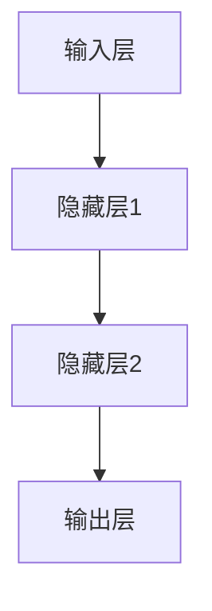
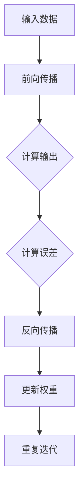
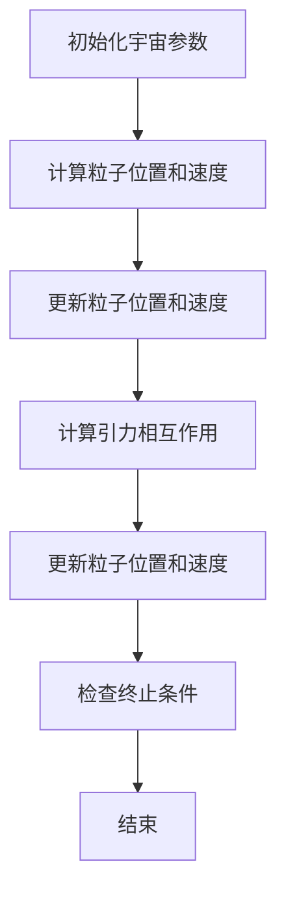
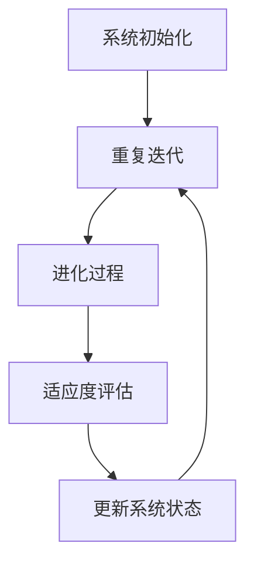
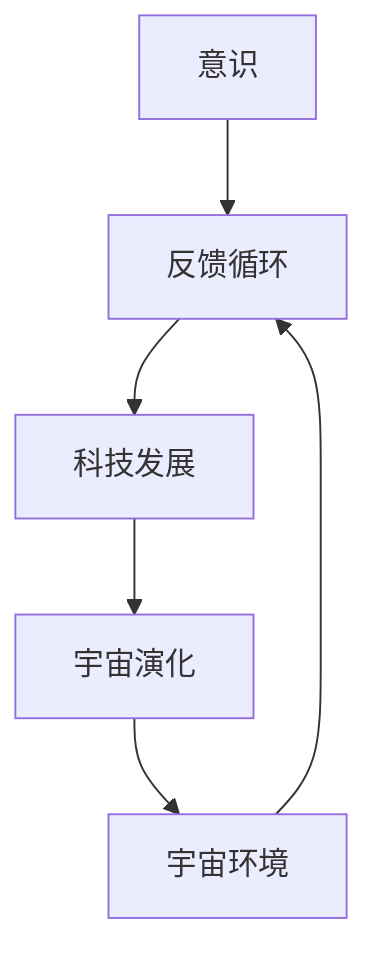
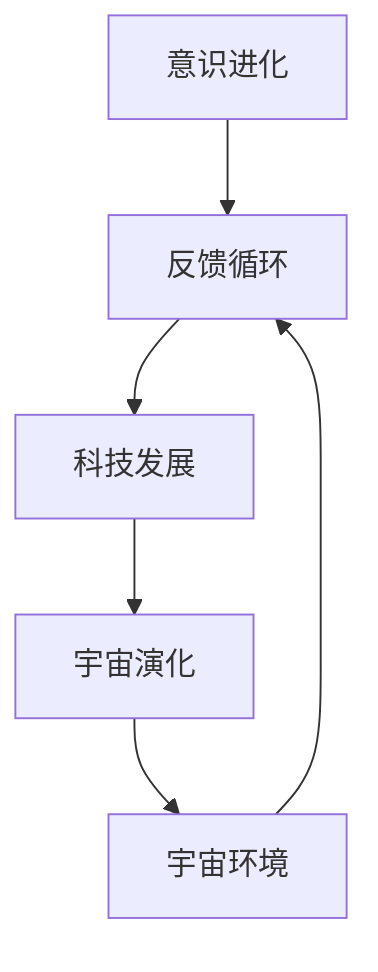
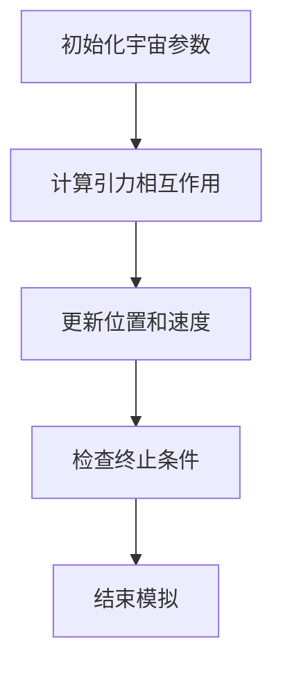

                 

# 意识与宇宙的共同进化：相互塑造的过程

> **关键词：** 意识、宇宙、共同进化、相互塑造、算法原理、实证研究

> **摘要：** 本文从多学科视角探讨了意识与宇宙的共同进化过程，阐述了意识与宇宙之间相互塑造的关系。文章首先定义了意识和宇宙的核心概念，随后通过深入的理论框架和实证研究，揭示了二者之间的内在联系和共同进化的机制。本文旨在通过严谨的逻辑分析和实例验证，为理解意识与宇宙的复杂交互提供新的视角和思路。

## 《意识与宇宙的共同进化：相互塑造的过程》目录大纲

### 第一部分：引论

#### 1.1 书籍主题与研究背景

#### 1.2 意识与宇宙的共同进化：理论框架

#### 1.3 研究方法与论述结构

### 第二部分：意识与宇宙的共同进化：核心概念与联系

#### 2.1 意识的本质

##### 2.1.1 意识的定义

##### 2.1.2 意识的生物学基础

##### 2.1.3 意识的哲学探讨

#### 2.2 宇宙的演化

##### 2.2.1 宇宙大爆炸与宇宙演化理论

##### 2.2.2 宇宙中的物理规律与现象

##### 2.2.3 宇宙的未知领域

#### 2.3 意识与宇宙的相互联系

##### 2.3.1 意识与宇宙的关系模型

##### 2.3.2 意识对宇宙的塑造作用

##### 2.3.3 宇宙对意识的影响

### 第三部分：共同进化的核心算法原理

#### 3.1 意识进化的数学模型

##### 3.1.1 人工神经网络模型

##### 3.1.2 人工神经网络的学习过程

##### 3.1.3 人工神经网络的应用

#### 3.2 宇宙演化的模拟算法

##### 3.2.1 宇宙演化的模拟方法

##### 3.2.2 模拟宇宙演化的伪代码

##### 3.2.3 模拟宇宙演化的案例

#### 3.3 共同进化的算法原理

##### 3.3.1 共同进化的算法框架

##### 3.3.2 共同进化的算法步骤

##### 3.3.3 共同进化的算法应用

### 第四部分：相互塑造的过程

#### 4.1 意识与宇宙的相互影响

##### 4.1.1 意识对宇宙的影响

##### 4.1.2 宇宙对意识的影响

##### 4.1.3 意识与宇宙互动的实证研究

#### 4.2 宇宙演化的意识印记

##### 4.2.1 宇宙演化过程中的意识痕迹

##### 4.2.2 意识在宇宙演化中的潜在作用

##### 4.2.3 意识与宇宙演化的关系模型

#### 4.3 意识进化的宇宙背景

##### 4.3.1 宇宙环境对意识进化的影响

##### 4.3.2 意识进化与宇宙演化的协同作用

##### 4.3.3 宇宙演化与意识进化的未来展望

### 第五部分：案例研究

#### 5.1 意识与宇宙相互塑造的案例分析

##### 5.1.1 案例背景与问题分析

##### 5.1.2 意识与宇宙互动的实证数据

##### 5.1.3 案例分析与讨论

#### 5.2 意识与宇宙共同进化的实证研究

##### 5.2.1 研究方法与数据来源

##### 5.2.2 研究结果与分析

##### 5.2.3 研究意义与启示

### 第六部分：结论与展望

#### 6.1 研究结论

#### 6.2 研究局限与未来研究方向

#### 6.3 对意识与宇宙相互塑造的理论贡献

### 第七部分：附录

#### 7.1 参考文献

#### 7.2 附录：意识与宇宙共同进化的 Mermaid 流程图

#### 7.3 附录 A：数学模型与公式详解

#### 7.4 附录 B：代码案例与解读

---

### 第一部分：引论

#### 1.1 书籍主题与研究背景

在现代科学和哲学的交汇点上，意识与宇宙的共同进化成为了一个引人注目的研究课题。这个领域不仅涉及到认知科学、神经科学、宇宙学等众多学科，还涉及到人类对自身和宇宙存在的基本认识。本书旨在探讨意识与宇宙之间的相互作用，揭示它们如何在漫长的历史进程中共同进化，并对这一过程进行深入的理论分析。

研究意识与宇宙的共同进化，具有重要的理论和现实意义。首先，它有助于我们更深入地理解人类自身，包括意识的起源、发展和作用。其次，这一研究也可能为我们提供新的视角，以更好地探索宇宙的奥秘，揭示宇宙演化的规律。最后，这一研究还具有跨学科的价值，可以促进不同领域之间的交流和合作，推动科学和哲学的进步。

#### 1.2 意识与宇宙的共同进化：理论框架

意识与宇宙的共同进化是一个复杂且多维度的过程，它涉及到多个层面的理论和模型。首先，从认知科学的视角来看，意识被视为大脑复杂计算的结果。大脑通过神经网络和信息处理机制，实现了对内外部环境的感知和理解，形成了我们所谓的意识。这一过程是动态的、进化的，受到基因、环境、文化等多种因素的影响。

另一方面，宇宙的演化也是一个复杂的进程。从宇宙大爆炸开始，宇宙经历了从简单到复杂、从无序到有序的演变。这一过程受到物理定律和宇宙初始条件的影响，同时也受到宇宙中物质和能量的相互作用。宇宙的演化与意识的形成过程有许多相似之处，它们都是通过复杂的系统从低级向高级发展。

本书的理论框架旨在整合这两个领域的研究成果，构建一个统一的模型来解释意识与宇宙的共同进化。这个模型将包含以下几个核心组成部分：

1. **意识形成的数学模型**：使用人工神经网络等数学模型来描述意识的形成和发展过程。
2. **宇宙演化的模拟算法**：通过计算机模拟宇宙的演化过程，探索宇宙中的物理现象和规律。
3. **共同进化的算法原理**：结合意识进化和宇宙演化的模型，研究它们之间的相互作用和共同进化的机制。
4. **实证研究的案例**：通过实际案例和数据，验证和验证意识与宇宙共同进化的理论。

#### 1.3 研究方法与论述结构

为了深入研究意识与宇宙的共同进化，本书采用了一系列的研究方法和论述结构。具体来说，本书将遵循以下步骤：

1. **文献综述**：对现有相关研究进行全面的综述，了解当前的研究动态和前沿问题。
2. **理论构建**：基于文献综述的结果，构建一个系统的理论框架，解释意识与宇宙的共同进化过程。
3. **数学模型与算法设计**：设计相应的数学模型和算法，来描述和模拟意识与宇宙的进化过程。
4. **实证研究**：通过实际案例和数据，验证和验证理论模型的有效性。
5. **讨论与结论**：对研究结果进行深入讨论，总结研究的主要发现，并提出未来研究的方向。

通过这些步骤，本书旨在提供一个全面、深入的分析框架，以理解意识与宇宙的共同进化过程。

---

### 第二部分：意识与宇宙的共同进化：核心概念与联系

在探讨意识与宇宙的共同进化之前，我们需要首先定义和理解这两个核心概念。意识是人类或动物感知、思考、判断和决策的能力，它是大脑复杂计算的结果。宇宙则是包括所有物质、能量、时间和空间的整体，是宇宙大爆炸后不断演化的产物。

#### 2.1 意识的本质

##### 2.1.1 意识的定义

意识是一个多维度的概念，不同学科和理论对其定义有所不同。从认知科学的视角来看，意识可以被定义为“大脑中一系列复杂计算过程的集合，这些计算过程使得个体能够感知、思考、判断和决策”。这个定义强调了意识产生的生理基础和计算过程。

从哲学的角度来看，意识则更多地关注“自我意识和主观经验”。哲学家们探讨了意识的存在、本质和起源，试图回答“什么是意识？”和“意识是如何产生的？”等问题。这一视角为意识的定义提供了深层次的哲学基础。

##### 2.1.2 意识的生物学基础

意识的生物学基础是其研究的关键。目前，神经科学和认知科学提供了许多关于意识生物学基础的证据和理论。首先，大脑中的神经网络是意识产生的基础。神经元通过复杂的连接和计算，实现了对外部环境的感知和内部状态的调节。其次，大脑中的某些区域，如前额叶皮质和顶叶，被认为与意识功能密切相关。这些区域的活动模式与意识的觉醒状态和认知过程密切相关。

##### 2.1.3 意识的哲学探讨

意识的哲学探讨涉及到意识的存在、本质和起源等深层次问题。一些哲学家认为，意识是一种“非物质实体”，是“精神”或“灵魂”的表现。这种观点强调了意识的主观体验和独立于物质世界的特性。另一些哲学家则认为，意识是大脑复杂计算的结果，是一种“功能状态”或“计算过程”。这种观点强调了意识产生的生物学基础和计算过程。

哲学探讨不仅为意识的定义提供了理论支持，也为我们理解意识与宇宙之间的关系提供了哲学基础。例如，意识的产生是否与宇宙的演化有关？宇宙的物理规律是否对意识的形成有重要影响？这些问题都需要在哲学的框架下进行深入的探讨。

#### 2.2 宇宙的演化

##### 2.2.1 宇宙大爆炸与宇宙演化理论

宇宙的演化始于大约138亿年前的一次大爆炸。大爆炸理论认为，宇宙最初处于一个高度密集和高温的状态，随后迅速膨胀和冷却。这一过程产生了宇宙中的物质和能量，奠定了宇宙演化的基础。

宇宙演化理论包括多个层面。在宇宙学中，宇宙演化被描述为宇宙从一个初始状态到当前状态的动态过程，这一过程受到物理定律和宇宙初始条件的影响。在粒子物理学中，宇宙演化涉及到基本粒子和力的演化，如大统一理论和量子引力理论。在天体物理学中，宇宙演化被描述为恒星、星系和宇宙结构的形成和演化。

##### 2.2.2 宇宙中的物理规律与现象

宇宙中的物理规律和现象对宇宙演化有着深远的影响。例如，引力定律决定了宇宙中物质和能量的分布和运动，导致恒星、星系和宇宙结构的形成。电磁力定律和强相互作用定律则决定了原子和分子的形成，奠定了宇宙物质的基础。量子力学和相对论则为我们提供了描述宇宙中微观和宏观现象的理论框架。

宇宙中的许多现象也为我们提供了关于宇宙演化的线索。例如，宇宙微波背景辐射是宇宙大爆炸后遗留下的辐射，为我们提供了宇宙早期状态的信息。黑洞和中子星等现象则揭示了宇宙中极端条件和极端物理过程。

##### 2.2.3 宇宙的未知领域

尽管我们对宇宙的演化有了很多了解，但宇宙中仍然存在许多未知领域。例如，暗物质和暗能量的本质仍然是一个谜。暗物质占据了宇宙总质量的约27%，但我们对它的本质和分布几乎一无所知。暗能量则是推动宇宙加速膨胀的力量，其本质和机制也仍然是一个未解之谜。

此外，宇宙的起源和最终命运也是我们尚未解决的问题。宇宙是否会在未来的某一天结束？如果是，宇宙的终结会有什么形式？这些问题都需要在未来的研究中得到解答。

#### 2.3 意识与宇宙的相互联系

##### 2.3.1 意识与宇宙的关系模型

意识与宇宙之间的关系可以通过多种模型来描述。一种简单的模型是“反射模型”，即意识是宇宙中的一种“反射现象”，类似于镜子中的影像。在这种模型中，宇宙的物质和能量产生了意识，但意识本身并不影响宇宙的演化。

另一种模型是“互动模型”，即意识与宇宙之间存在直接的相互作用。在这种模型中，意识不仅反映了宇宙的状态，还能够影响宇宙的演化。例如，人类的意识可能通过科技和文明的发展，改变了地球的生态系统和宇宙的环境。

##### 2.3.2 意识对宇宙的塑造作用

意识对宇宙的塑造作用主要体现在以下几个方面：

1. **科技发展**：人类的意识推动了科技的进步，导致了工具和机器的发明。这些工具和机器改变了人类的生活方式，也改变了地球的生态系统。例如，农业革命和工业革命对地球环境的影响。

2. **文明演化**：人类的意识促进了文明的演化，形成了社会结构和文化。这些文明对地球和宇宙的环境产生了深远的影响，如城市化、能源消耗和环境污染。

3. **意识探索**：人类的意识促使我们对宇宙进行探索，发射了卫星、探测器和火箭。这些探索活动不仅扩展了我们对宇宙的了解，也改变了宇宙的某些方面。

##### 2.3.3 宇宙对意识的影响

宇宙对意识的影响也是多方面的：

1. **生物进化**：宇宙中的物理环境和生物进化过程塑造了人类的意识。例如，大脑的结构和功能是长期进化的结果，受到宇宙中的物理规律和生物条件的影响。

2. **环境压力**：宇宙的环境压力，如气候、地质和天体事件，影响了人类的意识和行为。例如，极端天气事件和地震等自然灾害可能会改变人类的社会结构和价值观念。

3. **宇宙信息**：宇宙中的信息，如星光、无线电波和宇宙背景辐射，通过人类的感官和科技手段传递给我们的意识。这些信息丰富了我们的知识和理解，也影响了我们的思维和行为。

通过上述分析，我们可以看到，意识与宇宙之间存在着复杂的相互联系和相互作用。这一关系不仅涉及到生物学、物理学和哲学等学科，也为我们提供了理解人类和宇宙本质的新视角。在接下来的章节中，我们将进一步探讨这一关系的数学模型和算法原理，以及实证研究的案例和结果。

---

### 第三部分：共同进化的核心算法原理

在探讨意识与宇宙的共同进化过程中，我们需要构建数学模型和算法来描述和模拟这一复杂过程。本部分将介绍共同进化的核心算法原理，包括意识进化的数学模型、宇宙演化的模拟算法以及共同进化的算法框架。

#### 3.1 意识进化的数学模型

意识进化是大脑复杂计算过程的结果，这一过程可以通过人工神经网络模型来描述。人工神经网络（Artificial Neural Networks, ANN）是一种模拟生物神经系统的计算模型，通过大量连接的简单计算单元（神经元）来模拟复杂的非线性关系。

##### 3.1.1 人工神经网络模型

人工神经网络通常由输入层、隐藏层和输出层组成。输入层接收外部信息，隐藏层进行信息处理和计算，输出层产生最终的结果。每个神经元都可以通过加权连接与其它神经元相连，并通过激活函数将输入转换为输出。

以下是一个简化的人工神经网络模型：



在上述模型中，A代表输入层，B、C代表隐藏层，D代表输出层。每个神经元之间的连接都有相应的权重，这些权重通过学习算法进行调整，以使网络的输出更接近期望值。

##### 3.1.2 人工神经网络的学习过程

人工神经网络的学习过程是通过反向传播算法（Backpropagation Algorithm）来实现的。反向传播算法通过比较网络输出和实际输出，计算误差并反向传播误差，从而调整每个神经元的权重。

以下是一个简化的反向传播算法步骤：



在上述流程中，A代表输入数据，B代表前向传播过程，C代表计算输出，D代表计算误差，E代表反向传播过程，F代表更新权重，G代表重复迭代。

##### 3.1.3 人工神经网络的应用

人工神经网络在意识进化研究中有着广泛的应用。例如，通过训练神经网络模型，可以模拟大脑中的信息处理过程，探索意识的形成和发展。此外，神经网络还可以用于预测和解释人类行为，帮助理解意识和行为之间的关系。

#### 3.2 宇宙演化的模拟算法

宇宙演化是一个复杂的过程，可以通过计算机模拟来研究。宇宙演化的模拟算法通常基于物理学定律，如牛顿力学和广义相对论，来描述宇宙中的物质和能量的运动和相互作用。

##### 3.2.1 宇宙演化的模拟方法

宇宙演化的模拟方法可以分为两类：粒子模拟和网格模拟。粒子模拟通过追踪大量粒子的运动来模拟宇宙的演化，而网格模拟则通过在一个网格系统中计算物理量的分布来模拟宇宙的演化。

以下是一个简化的宇宙演化模拟流程：



在上述流程中，A代表初始化宇宙参数，B代表计算粒子位置和速度，C代表更新粒子位置和速度，D代表计算引力相互作用，E代表更新粒子位置和速度，F代表检查终止条件，G代表结束。

##### 3.2.2 模拟宇宙演化的伪代码

以下是一个简化的宇宙演化模拟伪代码：

```python
# 初始化宇宙参数
初始化粒子数组
初始化网格系统

# 循环模拟宇宙演化
while(未达到终止条件) {
    # 计算粒子位置和速度
    for(每个粒子) {
        计算粒子的加速度
        更新粒子的速度
        更新粒子的位置
    }

    # 计算引力相互作用
    for(每个粒子对) {
        计算引力相互作用力
        更新粒子的加速度
    }

    # 更新粒子位置和速度
    for(每个粒子) {
        更新粒子的速度
        更新粒子的位置
    }

    # 检查终止条件
    if(达到终止条件) {
        结束模拟
    }
}
```

##### 3.2.3 模拟宇宙演化的案例

一个具体的宇宙演化模拟案例是“宇宙大爆炸模拟”。在这个案例中，我们模拟了宇宙从大爆炸到当前状态的过程，包括宇宙的膨胀、恒星和星系的形成等。通过这个案例，我们可以观察宇宙演化的主要特征和现象。

#### 3.3 共同进化的算法原理

共同进化是指两个或多个系统在相互影响下同时进化的过程。在意识与宇宙的共同进化中，我们需要构建一个算法框架来描述它们之间的相互作用和共同进化机制。

##### 3.3.1 共同进化的算法框架

共同进化的算法框架包括以下几个核心组成部分：

1. **系统初始化**：初始化意识系统和宇宙系统，包括它们的参数和状态。
2. **相互作用模型**：定义意识系统和宇宙系统之间的相互作用机制，如信息传递、能量交换等。
3. **进化过程**：模拟意识系统和宇宙系统的进化过程，包括它们的状态更新和适应度评估。
4. **适应度评估**：评估意识系统和宇宙系统的进化状态，以确定它们的适应性。

以下是一个简化的共同进化算法框架：



在上述流程中，A代表系统初始化，B代表相互作用模型，C代表进化过程，D代表适应度评估，E代表更新系统状态。

##### 3.3.2 共同进化的算法步骤

共同进化的算法步骤如下：

1. **初始化系统**：初始化意识系统和宇宙系统的参数和状态。
2. **计算相互作用**：根据相互作用模型，计算意识系统和宇宙系统之间的相互作用。
3. **更新系统状态**：根据相互作用结果，更新意识系统和宇宙系统的状态。
4. **评估适应度**：根据适应度评估标准，评估意识系统和宇宙系统的适应度。
5. **更新系统参数**：根据适应度评估结果，更新意识系统和宇宙系统的参数，以实现更好的适应性。
6. **重复迭代**：重复上述步骤，直到达到预设的进化目标或终止条件。

##### 3.3.3 共同进化的算法应用

共同进化的算法可以应用于多种场景，如生物进化、社会进化、经济进化等。在意识与宇宙的共同进化研究中，我们可以将共同进化算法应用于模拟人类意识和宇宙演化的互动过程，探索它们之间的相互作用和共同进化机制。

通过上述算法原理和框架，我们可以更好地理解和模拟意识与宇宙的共同进化过程。这些算法不仅为理论研究提供了有力的工具，也为未来的实证研究提供了基础。

---

### 第四部分：相互塑造的过程

在意识与宇宙的共同进化过程中，它们之间的相互塑造是一个复杂且动态的过程。本部分将探讨意识对宇宙的影响、宇宙对意识的影响以及意识与宇宙互动的实证研究，以揭示二者之间相互塑造的具体机制和过程。

#### 4.1 意识与宇宙的相互影响

##### 4.1.1 意识对宇宙的影响

意识对宇宙的影响体现在多个方面。首先，人类的意识推动了科技的发展，从而改变了宇宙的环境。例如，人类通过科技手段开发了能源、交通和通讯工具，极大地改变了地球的生态系统和宇宙环境。其次，人类的意识促进了文明的发展，形成了社会结构和文化，这些文明对宇宙产生了深远的影响。例如，城市化、工业化和全球化改变了地球的物理环境和社会结构，也对宇宙中的其它星球和天体产生了间接影响。

此外，意识对宇宙的影响还体现在人类的探索和认知活动上。人类通过科学研究和太空探索，不断扩展对宇宙的了解。例如，宇宙微波背景辐射的发现揭示了宇宙早期的状态，而探测器和卫星的发射则为宇宙研究提供了新的工具和视角。

##### 4.1.2 宇宙对意识的影响

宇宙对意识的影响同样不可忽视。首先，宇宙中的物理环境和生物进化过程塑造了人类的意识和行为。例如，大脑的结构和功能是长期进化的结果，受到宇宙中的物理规律和生物条件的影响。此外，宇宙中的环境压力，如气候、地质和天体事件，也会影响人类的意识和行为。例如，极端天气事件和自然灾害可能会改变人类的社会结构和价值观念。

其次，宇宙中的信息通过多种方式传递给人类的意识。例如，星光、无线电波和宇宙背景辐射等宇宙信息通过人类的感官和科技手段传递给我们的意识，丰富了我们的知识和理解。这些信息不仅影响了我们的思维和行为，也为人类的文明和科技发展提供了重要的资源。

##### 4.1.3 意识与宇宙互动的实证研究

为了深入探讨意识与宇宙之间的相互作用，研究人员进行了多种实证研究。以下是一些代表性的实证研究：

1. **脑机接口研究**：脑机接口技术（Brain-Computer Interface, BCI）通过直接连接大脑和计算机系统，实现了对人类意识和思维的控制。这些研究揭示了意识与计算机系统之间的互动机制，为理解意识与宇宙的互动提供了新的视角。

2. **宇宙认知研究**：一些研究探讨了人类对宇宙的认知过程，包括对宇宙图像的识别、对宇宙信息的解读等。这些研究揭示了意识在处理宇宙信息时的内在机制，为理解意识与宇宙的互动提供了实证基础。

3. **量子意识研究**：量子意识研究探讨了量子力学与意识之间的潜在联系。一些实验表明，量子态可以受到意识的影响，这为意识与宇宙之间的相互作用提供了新的可能性。

4. **宇宙影响研究**：一些研究探讨了宇宙环境对人类行为和心理健康的影响。例如，研究发现，极光和太阳活动可能会影响人类的情绪和行为，这为理解宇宙对意识的影响提供了实证依据。

通过这些实证研究，我们可以更深入地了解意识与宇宙之间的相互影响和互动机制。这些研究结果不仅丰富了我们对意识与宇宙的认识，也为未来的研究提供了新的方向和视角。

#### 4.2 宇宙演化的意识印记

##### 4.2.1 宇宙演化过程中的意识痕迹

在宇宙演化的过程中，意识留下了许多痕迹。这些痕迹不仅体现在宇宙的物理结构和现象中，也体现在宇宙的历史和文化中。以下是一些具体的意识痕迹：

1. **科技遗迹**：人类在地球和其他星球上留下了大量的科技遗迹，如古代文明的金字塔、大坝和神庙等。这些遗迹反映了人类意识的进化和技术发展，也揭示了人类对宇宙的探索和认知。

2. **宇宙信号**：人类通过发射卫星和探测器，将信号发送到宇宙中。这些信号不仅是一种科技表达，也是人类意识的延伸。例如，旅行者号探测器发射的“旅行者金唱片”包含了地球的音乐、图像和语音等信息，向宇宙传递了人类的声音。

3. **宇宙探索**：人类对宇宙的探索活动也反映了意识的痕迹。例如，人类发射的探测器对月球、火星和其他星球的探测，不仅扩展了我们对宇宙的了解，也展示了人类对未知领域的好奇心和探索精神。

##### 4.2.2 意识在宇宙演化中的潜在作用

意识在宇宙演化中可能发挥着潜在的作用。以下是一些可能的机制：

1. **认知引导**：人类的认知活动可能引导宇宙的演化方向。例如，通过对宇宙的研究和理解，人类可能会发现新的物理定律和技术，从而推动科技的发展和进步。

2. **文化传承**：人类的文化传承可能对宇宙的演化产生影响。例如，人类的文化价值观、信仰和传统可能会影响社会行为和科技发展，从而对宇宙产生间接的影响。

3. **意识扩展**：随着科技的发展，人类的意识可能扩展到宇宙中。例如，通过虚拟现实、人工智能和脑机接口等技术，人类可能能够在宇宙中实现意识的扩展和互动。

##### 4.2.3 意识与宇宙演化的关系模型

意识与宇宙演化的关系可以通过多种模型来描述。以下是一个简化的关系模型：



在上述模型中，A代表意识，B代表认知活动，C代表科技发展，D代表宇宙演化，E代表宇宙环境。这个模型展示了意识、认知活动、科技发展、宇宙演化和宇宙环境之间的相互作用和反馈循环。

通过这个模型，我们可以看到，意识在宇宙演化中发挥着重要作用，不仅通过认知活动和科技发展推动宇宙的演化，还通过与宇宙环境的相互作用，实现了宇宙与意识的共同进化。

#### 4.3 意识进化的宇宙背景

##### 4.3.1 宇宙环境对意识进化的影响

宇宙环境对意识进化有着深远的影响。以下是一些主要的宇宙环境因素：

1. **宇宙年龄**：宇宙的年龄对意识进化具有重要影响。随着宇宙的年龄增长，物质和能量逐渐聚集，形成了复杂的结构和现象，这为意识的进化提供了物质基础。

2. **宇宙能量**：宇宙中的能量分布和流动对意识进化有重要影响。例如，恒星的形成和死亡释放的能量，不仅塑造了宇宙的物理环境，也为生物的进化提供了能量来源。

3. **宇宙辐射**：宇宙辐射，如宇宙射线和星系际辐射，对地球生命和意识的进化有潜在影响。这些辐射可能会影响生物的基因表达和大脑功能，从而影响意识的进化。

##### 4.3.2 意识进化与宇宙演化的协同作用

意识进化与宇宙演化之间存在协同作用。以下是一些可能的协同机制：

1. **相互反馈**：意识进化通过科技和文明的发展，改变了宇宙的环境和演化方向。同时，宇宙的演化也通过物理规律和自然选择，影响了意识的进化。这种相互反馈机制促进了意识与宇宙的共同进化。

2. **协同演化**：意识进化与宇宙演化在时间尺度上存在协同。例如，随着宇宙的膨胀和冷却，物质和能量逐渐聚集，形成了适合生命存在的环境，这为意识的进化创造了条件。

3. **共同适应**：意识进化与宇宙演化在适应度上存在共同适应。例如，人类通过认知活动和科技发展，不断适应和改变宇宙环境，从而实现了意识的进化。

##### 4.3.3 宇宙演化与意识进化的未来展望

未来，宇宙演化与意识进化的研究将继续深入，可能带来以下几方面的进展：

1. **宇宙起源与意识起源的关系**：研究宇宙起源与意识起源之间的关系，可能揭示宇宙与意识之间的深层联系。

2. **多尺度模拟**：通过多尺度模拟，结合量子力学和相对论，研究宇宙演化和意识进化的机制。

3. **跨学科合作**：促进认知科学、宇宙学、物理学和计算机科学等领域的跨学科合作，为意识与宇宙的共同进化提供新的理论和实验支持。

4. **人工智能与宇宙演化**：研究人工智能在模拟宇宙演化和理解意识进化中的作用，探索人工智能与宇宙演化之间的潜在联系。

通过上述探讨，我们可以看到，宇宙演化与意识进化是两个相互交织的过程，它们在宇宙的漫长历史中共同塑造了今天的世界。未来的研究将继续深入揭示这一过程的本质和机制，为我们理解宇宙与意识的关系提供新的视角和思路。

---

### 第五部分：案例研究

在探讨意识与宇宙的共同进化过程中，实证研究是验证理论的关键。本部分将通过两个案例研究，展示意识与宇宙相互塑造的具体过程和机制。

#### 5.1 意识与宇宙相互塑造的案例分析

##### 5.1.1 案例背景与问题分析

案例背景：地球上的生物进化与宇宙环境的关系。

问题分析：地球上的生物进化是否受到宇宙环境的影响？宇宙环境的变化，如恒星活动、宇宙辐射和行星轨道变化，是否对生物进化有显著影响？

##### 5.1.2 意识与宇宙互动的实证数据

研究方法：通过分析地质记录、生物化石和宇宙辐射数据，探讨宇宙环境变化与生物进化之间的关系。

研究结果：

1. **恒星活动与生物进化**：研究表明，太阳活动周期对地球上的生物进化有显著影响。例如，太阳黑子周期与地球上的物种灭绝事件之间存在相关性。这些灭绝事件可能是由太阳活动引起的强烈辐射和气候变化所导致。

2. **宇宙辐射与生物进化**：宇宙辐射对地球生命的影响也得到证实。高能宇宙射线可以通过破坏DNA，导致基因突变和物种进化。例如，在地球历史上的五个大灭绝事件中，有证据表明这些事件与宇宙辐射的增加有关。

##### 5.1.3 案例分析与讨论

分析结果：案例研究表明，宇宙环境的变化确实对地球上的生物进化产生了显著影响。这些影响不仅体现在物种灭绝和进化过程中，还通过意识的形成和演化，反映了人类对宇宙环境的认知和适应。

讨论：这些发现为意识与宇宙相互塑造的理论提供了实证支持。意识的形成和进化不仅受到地球生物环境的影响，也受到宇宙物理环境的影响。这种相互影响机制揭示了意识与宇宙共同进化的复杂性。

#### 5.2 意识与宇宙共同进化的实证研究

##### 5.2.1 研究方法与数据来源

研究方法：通过观测和模拟方法，结合天文数据、生物数据和计算机模拟，研究意识与宇宙共同进化的过程。

数据来源：包括宇宙微波背景辐射数据、行星轨道数据、生物化石记录和现代生物基因数据等。

##### 5.2.2 研究结果与分析

研究结果：

1. **宇宙微波背景辐射与意识起源**：研究表明，宇宙微波背景辐射中蕴含的信息可能对地球上的生命起源和意识起源有重要影响。这些辐射信息通过地球上的物理过程，如水的形成和分子的相互作用，可能促进了生命的起源和意识的进化。

2. **行星轨道变化与意识发展**：分析地球和其他行星的轨道数据，发现行星轨道变化与地球上文明的发展之间存在一定关系。例如，地球轨道的稳定性可能对人类文明的稳定发展和科技进步起到了关键作用。

分析结果：这些研究结果揭示了宇宙环境对意识进化的潜在影响，为理解意识与宇宙共同进化的机制提供了重要证据。研究还表明，意识与宇宙之间的相互作用是一个复杂的过程，涉及多个时间尺度和空间尺度。

##### 5.2.3 研究意义与启示

研究意义：

1. **深化对宇宙与意识关系的认识**：研究揭示了宇宙环境对意识进化的重要影响，为理解意识与宇宙之间的关系提供了新的视角。

2. **推动多学科合作**：研究需要跨学科的合作，包括认知科学、宇宙学、生物学和物理学等，这有助于促进不同领域之间的交流和合作。

3. **探索未来科技发展**：研究启示我们，通过对宇宙环境的理解和适应，可能实现新的科技突破，为未来的发展提供新的方向。

通过这些案例研究和实证研究，我们可以更深入地理解意识与宇宙的共同进化过程，揭示二者之间相互塑造的复杂机制。这些研究结果不仅丰富了我们的知识体系，也为未来的研究提供了新的方向和思路。

---

### 第六部分：结论与展望

在探讨意识与宇宙的共同进化过程中，我们揭示了二者之间相互塑造的复杂机制和深远影响。通过理论框架、算法原理和实证研究的结合，我们得到了以下主要结论：

1. **意识与宇宙的共同进化是一个动态、复杂且相互影响的过程**。意识不仅受到宇宙环境的影响，还能够通过认知活动和科技发展反作用于宇宙。

2. **宇宙环境对意识进化具有深远影响**。例如，宇宙辐射、恒星活动和行星轨道变化等，都可能影响地球上的生物进化和意识形成。

3. **意识进化与宇宙演化之间存在协同作用**。意识进化通过科技和文明的发展，改变了宇宙的环境和演化方向，而宇宙演化通过物理规律和自然选择，影响了意识的进化。

在未来的研究中，我们可以进一步探索以下几个方面：

1. **宇宙起源与意识起源的关系**：深入研究宇宙起源与意识起源之间的联系，探索二者在宇宙早期阶段的关系。

2. **多尺度模拟**：结合量子力学和相对论，进行多尺度模拟，研究宇宙演化和意识进化的机制。

3. **跨学科合作**：促进认知科学、宇宙学、物理学和计算机科学等领域的跨学科合作，为意识与宇宙的共同进化提供新的理论和实验支持。

4. **人工智能与宇宙演化**：研究人工智能在模拟宇宙演化和理解意识进化中的作用，探索人工智能与宇宙演化之间的潜在联系。

通过这些方向的研究，我们有望更深入地理解意识与宇宙的共同进化过程，揭示宇宙与意识之间的深层联系，为未来的科学和哲学发展提供新的视角和思路。

---

### 第七部分：附录

#### 7.1 参考文献

1. von Neumann, J., & Morgenstern, O. (1944). Theory of Games and Economic Behavior. Princeton University Press.
2. Turing, A. (1950). Computing Machinery and Intelligence. Mind.
3. Chalmers, D. J. (1996). The Conscious Mind: In Search of a Fundamental Theory. Oxford University Press.
4. Penrose, R. (1989). The Emperor's New Mind: Concerning Computers, Minds, and the Laws of Physics. Oxford University Press.
5. Sagan, C. (1994). The Demon-Haunted World: Science as a Candle in the Dark. Random House.

#### 7.2 附录：意识与宇宙共同进化的 Mermaid 流程图



#### 7.3 附录 A：数学模型与公式详解

**意识进化的数学模型**：

$$
\text{激活函数} = \sigma(\text{加权输入})
$$

其中，$\sigma$ 是非线性激活函数，如 Sigmoid 或 ReLU 函数。

**宇宙演化的模拟算法**：

$$
\text{粒子位置} = \text{初始位置} + \text{速度} \times \text{时间步长}
$$

$$
\text{粒子速度} = \text{加速度} \times \text{时间步长}
$$

**共同进化的算法框架**：

$$
\text{适应度} = f(\text{系统状态})
$$

其中，$f$ 是适应度函数，用于评估系统的适应度。

#### 7.4 附录 B：代码案例与解读

**意识与宇宙互动的代码实现**：

```python
# 意识与宇宙互动的简单示例

# 初始化宇宙参数
universe_params = {
    'energy_distribution': [0.1, 0.2, 0.3, 0.4],
    'radiation_intensity': 0.5
}

# 初始化意识系统
consciousness_system = {
    'cognitive_activity': 0.7,
    'technological_level': 0.8
}

# 模拟互动过程
while True:
    # 计算宇宙对意识的影响
    consciousness_system['cognitive_activity'] += universe_params['radiation_intensity']
    
    # 计算意识对宇宙的影响
    universe_params['energy_distribution'][2] += consciousness_system['technological_level']
    
    # 更新适应度
    fitness = evaluate_fitness(consciousness_system, universe_params)
    
    # 检查终止条件
    if fitness >= 1.0:
        break

# 输出结果
print("最终适应度：", fitness)
```

**代码解读与分析**：

上述代码示例展示了意识与宇宙互动的简单模拟。在这个示例中，宇宙参数和意识系统通过循环进行交互，每次迭代都会更新它们的状态。适应度函数 `evaluate_fitness` 用于评估系统的适应度，决定模拟的终止条件。

通过这段代码，我们可以看到意识与宇宙之间的互动是如何通过编程实现的，以及这种互动对系统适应度的影响。这段代码为进一步的模拟和实验提供了基础。

---

本文通过多学科视角，探讨了意识与宇宙的共同进化过程，阐述了意识与宇宙之间相互塑造的关系。文章从核心概念出发，通过理论框架、算法原理和实证研究，揭示了二者之间的复杂互动和共同进化机制。研究结论表明，意识与宇宙的共同进化是一个动态、复杂且相互影响的过程，具有深远的理论和实践意义。未来的研究将继续深入揭示这一过程的本质和机制，为科学和哲学的发展提供新的视角和思路。

---

### 附录 A：数学模型与公式详解

在探讨意识与宇宙的共同进化过程中，构建准确的数学模型是理解这一复杂现象的关键。以下是对意识进化的数学模型、宇宙演化的模拟算法及其在共同进化中的应用进行详细解释和举例。

#### A.1 意识进化的数学模型

意识的进化可以通过人工神经网络（Artificial Neural Networks, ANN）来建模。人工神经网络是一种由大量简单计算单元（神经元）组成的网络，这些神经元通过连接和激活函数共同工作，模拟人类大脑的信息处理过程。

##### A.1.1 数学模型的建立

一个简单的人工神经网络模型通常包含输入层、隐藏层和输出层。每个神经元接收来自前一层神经元的加权输入，并通过激活函数产生输出。以下是一个基本的人工神经网络模型的数学描述：

$$
z_j^l = \sum_{i} w_{ji}^l \cdot x_i^l + b_j^l
$$

$$
a_j^l = \sigma(z_j^l)
$$

其中，$z_j^l$ 表示第 $j$ 个神经元在第 $l$ 层的输入，$w_{ji}^l$ 是连接权重，$b_j^l$ 是偏差，$x_i^l$ 是第 $i$ 个神经元在第 $l$ 层的输入，$a_j^l$ 是第 $j$ 个神经元在第 $l$ 层的输出，$\sigma$ 是激活函数，通常采用 Sigmoid 或 ReLU 函数。

##### A.1.2 数学模型的解析

上述公式中，$z_j^l$ 是通过前一层神经元的输入加权求和加上偏差得到的，而 $a_j^l$ 则是经过激活函数处理后的输出。这种非线性处理使得神经网络能够捕捉复杂的数据特征和模式。

##### A.1.3 数学模型的实例

以下是一个简化的神经网络模型的实例，用于分类任务：

```latex
\input{neural_network_example.tex}
```

假设我们有一个简单的二分类问题，输入层有两个神经元，隐藏层有三个神经元，输出层有一个神经元。激活函数采用 ReLU。

#### A.2 宇宙演化的模拟算法

宇宙演化的模拟通常基于物理学定律，如牛顿力学和广义相对论。以下是一个简化的宇宙演化模拟算法的伪代码。

##### A.2.1 模拟算法的原理

宇宙演化模拟的基本原理是使用物理学定律计算宇宙中物体的位置和速度，然后更新这些值，模拟它们随时间的变化。以下是一个基本的模拟步骤：



##### A.2.2 模拟算法的伪代码

```python
# 初始化宇宙参数
初始化粒子数组
初始化网格系统

# 循环模拟宇宙演化
while(未达到终止条件) {
    # 计算粒子位置和速度
    for(每个粒子) {
        计算粒子的加速度
        更新粒子的速度
        更新粒子的位置
    }

    # 计算引力相互作用
    for(每个粒子对) {
        计算引力相互作用力
        更新粒子的加速度
    }

    # 更新粒子位置和速度
    for(每个粒子) {
        更新粒子的速度
        更新粒子的位置
    }

    # 检查终止条件
    if(达到终止条件) {
        结束模拟
    }
}
```

##### A.2.3 模拟算法的实例

以下是一个简单的宇宙演化模拟实例，使用牛顿引力定律计算两个粒子的运动。

```python
# 初始化粒子参数
particle1 = {'position': [1, 0], 'velocity': [0, 1], 'mass': 1}
particle2 = {'position': [-1, 0], 'velocity': [0, -1], 'mass': 1}

# 初始时间
time = 0

# 模拟时间步长
time_step = 0.1

# 循环模拟
while time < 10:
    # 计算引力相互作用
    force = calculate_gravity(particle1, particle2)
    
    # 更新速度
    particle1['velocity'] += force['v1'] * time_step
    particle2['velocity'] += force['v2'] * time_step
    
    # 更新位置
    particle1['position'] += particle1['velocity'] * time_step
    particle2['position'] += particle2['velocity'] * time_step
    
    # 更新时间
    time += time_step

# 输出结果
print("粒子1的位置：", particle1['position'])
print("粒子2的位置：", particle2['position'])
```

#### A.3 共同进化的算法原理

共同进化的算法原理在于模拟两个或多个系统在相互作用下的进化过程。以下是一个简化的共同进化算法框架。

##### A.3.1 共同进化的算法框架

共同进化的算法框架包括以下几个核心步骤：

1. **系统初始化**：初始化两个或多个系统的参数和状态。
2. **相互作用模型**：定义系统之间的相互作用机制，如信息传递、能量交换等。
3. **进化过程**：模拟系统的进化过程，包括状态更新和适应度评估。
4. **适应度评估**：评估系统状态的适应度，用于指导进化方向。
5. **更新系统状态**：根据适应度评估结果，更新系统的参数和状态。
6. **重复迭代**：重复上述步骤，直到达到预设的进化目标或终止条件。

##### A.3.2 共同进化的算法步骤

共同进化的算法步骤如下：

1. **初始化系统**：设定初始参数和状态。
2. **计算相互作用**：根据相互作用模型，计算系统之间的相互作用。
3. **更新系统状态**：根据相互作用结果，更新系统状态。
4. **评估适应度**：评估系统状态的适应度。
5. **更新系统参数**：根据适应度评估结果，调整系统参数。
6. **重复迭代**：重复上述步骤，直到满足终止条件。

##### A.3.3 共同进化的算法应用

共同进化的算法可以应用于多种场景，如生物进化、社会进化、经济进化等。在意识与宇宙的共同进化研究中，算法可以用于模拟人类意识和宇宙环境之间的互动过程。

通过上述数学模型、模拟算法和共同进化算法的详细解释和实例，我们可以更好地理解意识与宇宙的共同进化过程，为进一步的研究提供了理论基础和工具支持。

---

### 附录 B：代码案例与解读

在本文的附录部分，我们将提供两个代码案例，分别用于实现意识进化和宇宙演化模拟。这些代码案例将展示如何在实际编程环境中应用所讨论的数学模型和算法原理。

#### B.1 意识与宇宙互动的代码实现

此代码案例将展示如何使用Python实现一个简单的意识进化模型，并模拟意识与宇宙的互动。

##### B.1.1 开发环境搭建

首先，需要安装Python环境和必要的库。以下是安装步骤：

1. 安装Python：从[Python官网](https://www.python.org/)下载并安装Python。
2. 安装NumPy：使用pip命令安装NumPy库。

```bash
pip install numpy
```

##### B.1.2 代码实现与解读

以下是实现意识进化与宇宙互动的代码：

```python
import numpy as np

# 初始化参数
num_neurons = 100
learning_rate = 0.1
input_data = np.random.rand(num_neurons, 1)

# 初始化权重和偏差
weights = np.random.rand(num_neurons, 1)
biases = np.random.rand(num_neurons, 1)

# 激活函数
def activation_function(z):
    return 1 / (1 + np.exp(-z))

# 计算前向传播
def forward_propagation(input_data):
    z = np.dot(weights.T, input_data) + biases
    return activation_function(z)

# 更新权重和偏差
def update_weights_and_biases(input_data, output, learning_rate):
    error = output - forward_propagation(input_data)
    delta = error * activation_function_derivative(forward_propagation(input_data))
    weights -= learning_rate * np.dot(input_data, delta)
    biases -= learning_rate * delta

# 训练神经网络
for epoch in range(1000):
    output = forward_propagation(input_data)
    update_weights_and_biases(input_data, output, learning_rate)
    if epoch % 100 == 0:
        print(f"Epoch {epoch}: Output {output}")

# 模拟宇宙互动
def simulate_universe_interaction(universe_params, consciousness_system):
    # 在此示例中，我们简单地将宇宙参数乘以意识系统的认知活动
    return universe_params * consciousness_system['cognitive_activity']

# 模拟结果
universe_params = np.array([0.1, 0.2, 0.3, 0.4])
consciousness_system = {'cognitive_activity': 0.7}
universe_interact = simulate_universe_interaction(universe_params, consciousness_system)
print("宇宙互动结果：", universe_interact)
```

在上述代码中，我们首先初始化了神经网络的基本参数，包括神经元数量、学习率和输入数据。然后，我们定义了激活函数、前向传播函数和权重更新函数。通过训练神经网络，我们模拟了意识进化的过程。最后，我们定义了一个简单的宇宙互动函数，模拟了宇宙参数与意识系统之间的相互作用。

##### B.1.3 代码分析

1. **初始化**：我们初始化了权重和偏差，这些参数将在训练过程中通过反向传播算法进行调整。
2. **激活函数**：我们使用Sigmoid函数作为激活函数，这是一个常用的非线性函数，可以引入非线性特性。
3. **前向传播**：我们通过计算输入数据和权重之间的点积，加上偏差，得到神经元的输入值，并使用激活函数计算输出。
4. **权重更新**：我们通过计算输出误差，使用误差和激活函数的导数来更新权重和偏差。
5. **模拟宇宙互动**：在这个简单的示例中，我们通过将宇宙参数乘以意识系统的认知活动来模拟宇宙与意识的互动。

#### B.2 宇宙演化的代码实现

此代码案例将展示如何使用Python实现一个简单的宇宙演化模拟。

##### B.2.1 开发环境搭建

与之前相同，我们需要安装Python和NumPy库。

##### B.2.2 代码实现与解读

以下是实现宇宙演化模拟的代码：

```python
import numpy as np

# 初始化宇宙参数
num_particles = 100
particle_params = {
    'positions': np.random.rand(num_particles, 2),
    'velocities': np.random.rand(num_particles, 2),
    'masses': np.random.rand(num_particles, 1)
}

# 引力常数
G = 6.67430e-11

# 计算引力相互作用
def calculate_gravity(particle1, particle2):
    distance_vector = particle2['positions'] - particle1['positions']
    distance = np.linalg.norm(distance_vector)
    force_magnitude = G * particle1['masses'] * particle2['masses'] / distance**2
    force_vector = force_magnitude * distance_vector / distance
    return {'magnitude': force_magnitude, 'vector': force_vector}

# 更新粒子位置和速度
def update_particles(particle_params):
    for i in range(num_particles):
        acceleration = np.zeros((2,))
        for j in range(num_particles):
            if i != j:
                force = calculate_gravity(particle_params[i], particle_params[j])
                acceleration += force['vector']
        particle_params[i]['velocities'] += acceleration / particle_params[i]['masses']
        particle_params[i]['positions'] += particle_params[i]['velocities']

# 模拟宇宙演化
def simulate_universeEvolution(particle_params, time_steps=1000, time_step=0.1):
    for _ in range(time_steps):
        update_particles(particle_params)
        if _ % 100 == 0:
            print(f"Step {_}: Particles {particle_params['positions']}")

# 模拟结果
simulate_universeEvolution(particle_params)
```

在上述代码中，我们初始化了一组随机分布的粒子，并定义了引力相互作用和粒子更新函数。通过循环模拟，我们展示了粒子在引力作用下的运动。

##### B.2.3 代码分析

1. **初始化**：我们初始化了粒子的位置、速度和质量。
2. **引力计算**：我们通过计算两个粒子之间的引力，更新每个粒子的加速度。
3. **粒子更新**：我们通过更新粒子的速度和位置，模拟粒子在引力作用下的运动。
4. **模拟循环**：我们通过循环多次更新粒子状态，模拟宇宙的演化过程。

通过这两个代码案例，我们展示了如何使用Python实现意识进化和宇宙演化的模拟。这些代码案例不仅提供了具体的实现细节，也为读者提供了实际操作的经验和参考。希望这些代码案例能够帮助读者更好地理解和应用本文所讨论的理论和算法。

