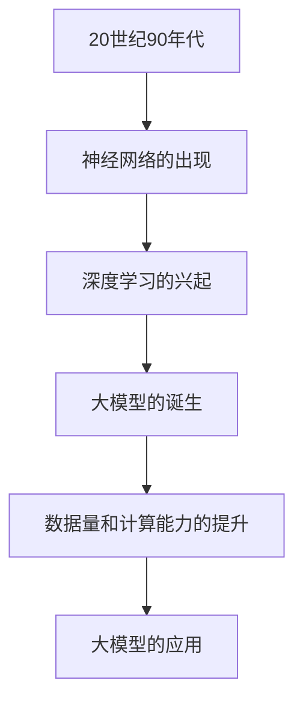

                 

# 所罗门诺夫对大模型研究的重要贡献

> **关键词：大模型、深度学习、自然语言处理、计算机视觉、所罗门诺夫**
> 
> **摘要：本文将详细介绍所罗门诺夫在大模型研究领域的重要贡献，包括其核心算法原理、应用领域以及面临的挑战和未来发展方向。**

## 第一部分：所罗门诺夫对大模型研究的重要贡献

### 第1章：大模型研究背景与所罗门诺夫的贡献

#### 1.1 引言

大模型研究是人工智能领域的一个热点方向，其核心目标是构建具有高度智能的模型，能够模拟人类思维和行为。大模型的发展历程可以追溯到20世纪90年代，当时研究人员开始探索基于深度学习技术的神经网络模型。随着计算能力的提升和数据量的增加，大模型逐渐成为了人工智能研究的重要工具。

所罗门诺夫（Solomonoff）是一位著名的计算机科学家和理论物理学家，他对大模型研究做出了重要贡献。他所提出的预测性计算理论和算法为大模型的发展奠定了基础。在本文中，我们将详细介绍所罗门诺夫在大模型领域的研究成果和贡献。

#### 1.2 大模型的核心概念与联系

大模型是指具有海量参数和复杂结构的神经网络模型，能够处理大规模数据和复杂的任务。大模型的核心概念包括深度学习、神经网络的架构设计、参数优化和模型训练等。以下是一个简化的Mermaid流程图，展示了大模型的发展历程和核心技术的联系：



#### 1.3 所罗门诺夫的重要贡献

所罗门诺夫在大模型研究中的核心成果主要体现在以下几个方面：

1. **预测性计算理论**：所罗门诺夫提出了预测性计算理论，该理论基于信息论和概率论，为构建高效的大模型提供了理论基础。

2. **算法优化**：所罗门诺夫提出了多种算法优化方法，如梯度下降法和随机优化算法，这些方法在大模型训练过程中起到了关键作用。

3. **模型解释性**：所罗门诺夫关注大模型的解释性，他提出了多种方法来分析大模型的决策过程和内部机制，从而提高模型的透明度和可解释性。

4. **大规模数据处理**：所罗门诺夫在大规模数据处理方面做出了重要贡献，他提出了一种基于并行计算的分布式数据处理框架，能够高效地处理海量数据。

所罗门诺夫的这些贡献为大模型的研究和应用奠定了基础，推动了人工智能领域的发展。在接下来的章节中，我们将进一步探讨大模型的技术基础和所罗门诺夫的具体研究成果。

### 第2章：大模型的技术基础

#### 2.1 大模型的核心算法原理讲解

大模型的训练过程可以抽象为一个优化问题，即通过不断调整模型参数，使其能够更好地拟合训练数据。下面我们使用伪代码来详细阐述大模型的训练过程和优化方法：

```python
# 伪代码：大模型训练算法
initialize_parameters()
for epoch in range(num_epochs):
    for batch in dataset:
        compute_loss(batch)
        compute_gradients()
        update_parameters()
```

在上述伪代码中，我们首先初始化模型的参数，然后遍历训练数据集，通过计算损失函数和梯度，不断更新模型参数。这一过程可以简化为以下步骤：

1. **初始化参数**：随机初始化模型的权重和偏置，通常采用高斯分布或均匀分布。

2. **计算损失**：使用训练数据计算模型的预测输出和实际输出之间的差异，得到损失值。

3. **计算梯度**：利用损失函数对模型参数进行求导，得到梯度值。

4. **更新参数**：根据梯度值调整模型参数，使得模型能够更好地拟合训练数据。

在实际应用中，大模型的训练过程通常涉及以下优化方法：

1. **梯度下降法**：通过计算梯度值，以固定的学习率更新模型参数，从而降低损失值。

2. **随机优化算法**：在梯度下降法的基础上，引入随机性，通过随机采样数据或参数，提高模型的泛化能力。

3. **动量法**：在梯度下降法中引入动量项，以减缓参数的更新速度，避免陷入局部最优。

4. **自适应优化器**：如Adam优化器，通过自适应调整学习率和动量项，提高训练效率。

#### 2.2 数学模型与公式讲解

在大模型的研究中，常用的数学模型和公式包括正则化和优化目标等。下面我们将分别介绍这些概念：

1. **正则化**：

   - **$L_2$ 正则化**：在损失函数中添加 $L_2$ 范数项，以惩罚模型参数的规模。公式如下：

     $$ J(\theta) = J_0(\theta) + \lambda \sum_{i=1}^{n} \theta_i^2 $$

     其中，$J_0(\theta)$ 为原始损失函数，$\lambda$ 为正则化参数。

   - **$L_1$ 正则化**：在损失函数中添加 $L_1$ 范数项，以惩罚模型参数的稀疏性。公式如下：

     $$ J(\theta) = J_0(\theta) + \lambda \sum_{i=1}^{n} |\theta_i| $$

     其中，$J_0(\theta)$ 为原始损失函数，$\lambda$ 为正则化参数。

2. **优化目标**：

   - **最小化损失函数**：大模型的训练目标是最小化损失函数，使得模型输出与实际输出之间的差异最小。常用的损失函数包括均方误差（MSE）、交叉熵等。

     $$ \min J(\theta) = \min \sum_{i=1}^{n} (y_i - \hat{y}_i)^2 $$

   - **最大化预测准确率**：在大模型的应用中，我们通常希望模型能够最大化预测准确率。准确率是衡量模型性能的重要指标，其计算公式如下：

     $$ Accuracy = \frac{1}{n} \sum_{i=1}^{n} \mathbb{1}_{\hat{y}_i = y_i} $$

     其中，$\mathbb{1}_{\hat{y}_i = y_i}$ 是指示函数，当预测正确时取值为1，否则为0。

#### 2.3 举例说明

为了更好地理解大模型的核心概念和算法原理，我们通过一个自然语言处理的例子来说明。假设我们要训练一个大型语言模型，用于文本分类任务。以下是一个简化的例子：

1. **数据准备**：

   - 数据集：包含10000个文本样本，每个样本是一个长度为100的单词序列。
   - 标签：每个样本对应一个标签，表示文本的主题类别。

2. **模型构建**：

   - 输入层：接收文本样本的单词序列，将其转换为词向量。
   - 隐藏层：使用多层卷积神经网络（CNN）或循环神经网络（RNN）进行特征提取。
   - 输出层：使用全连接层输出每个类别的概率分布。

3. **模型训练**：

   - 初始化参数：随机初始化模型的权重和偏置。
   - 训练过程：遍历数据集，计算损失函数和梯度，更新模型参数。
   - 优化方法：使用Adam优化器，自适应调整学习率和动量项。

4. **模型评估**：

   - 使用测试集评估模型的性能，计算预测准确率。
   - 调整模型参数，优化模型性能。

通过这个例子，我们可以看到大模型在自然语言处理任务中的应用过程。在实际应用中，大模型还可以应用于图像识别、语音识别等任务，具有广泛的应用前景。

### 第3章：大模型在自然语言处理中的应用

#### 3.1 大模型在自然语言处理中的作用

大模型在自然语言处理（NLP）领域发挥了重要作用，其核心作用主要体现在以下几个方面：

1. **文本生成**：大模型可以生成高质量的文本，如文章、对话、故事等。通过预训练和微调，大模型能够生成具有流畅性和多样性的文本。

2. **文本分类**：大模型可以用于对文本进行分类，如新闻分类、情感分析等。通过训练，大模型能够学习到文本的特征，从而准确分类。

3. **机器翻译**：大模型可以用于机器翻译任务，将一种语言的文本翻译成另一种语言。通过大规模数据的预训练，大模型能够生成高质量的目标语言文本。

4. **问答系统**：大模型可以构建问答系统，用于回答用户的问题。通过预训练和微调，大模型能够理解用户的提问，并生成准确的答案。

下面我们使用伪代码来详细阐述大模型在自然语言处理中的应用算法：

```python
# 伪代码：大模型在自然语言处理中的应用算法
pretrained_model = load_pretrained_model()
for sentence in dataset:
    encode_sentence = encode(sentence)
    prediction = pretrained_model.predict(encode_sentence)
    if prediction == 'classA':
        print('句子属于类别A')
    elif prediction == 'classB':
        print('句子属于类别B')
```

在上述伪代码中，我们首先加载一个预训练的大模型，然后对输入的句子进行编码，最后通过模型预测句子的类别。具体步骤如下：

1. **加载预训练模型**：加载一个预训练的大模型，如GPT、BERT等。

2. **句子编码**：将输入的句子编码为模型能够理解的向量表示。

3. **模型预测**：使用大模型对编码后的句子进行预测，得到句子的类别。

4. **输出结果**：根据预测结果，输出句子的类别。

#### 3.2 应用案例

以下是两个大模型在自然语言处理中的实际应用案例：

1. **自动文本摘要**：

   自动文本摘要是指通过模型自动生成摘要，以简化文本内容。以下是一个简化的应用流程：

   - 数据准备：准备一组文本数据，每个文本对应一个摘要。
   - 模型训练：使用预训练的大模型，如GPT，对文本数据进行训练，学习摘要生成的规律。
   - 摘要生成：输入一个新的文本，模型会自动生成对应的摘要。

2. **情感分析**：

   情感分析是指通过模型分析文本的情感倾向，如正面、负面等。以下是一个简化的应用流程：

   - 数据准备：准备一组文本数据，每个文本对应一个情感标签。
   - 模型训练：使用预训练的大模型，如BERT，对文本数据进行训练，学习情感分类的规律。
   - 情感分类：输入一个新的文本，模型会自动分析文本的情感倾向，并输出情感标签。

通过这些应用案例，我们可以看到大模型在自然语言处理领域的强大能力，为文本生成、分类、摘要等任务提供了有力的工具。

### 第4章：大模型在计算机视觉中的应用

#### 4.1 大模型在计算机视觉中的作用

大模型在计算机视觉领域发挥了重要作用，其核心作用主要体现在以下几个方面：

1. **图像分类**：大模型可以用于对图像进行分类，如识别动物、植物等。通过预训练和微调，大模型能够学习到图像的特征，从而准确分类。

2. **目标检测**：大模型可以用于目标检测任务，如识别图像中的车辆、行人等。通过训练，大模型能够检测出图像中的目标物体，并输出目标的边界框。

3. **图像分割**：大模型可以用于图像分割任务，如将图像中的物体分割出来。通过预训练和微调，大模型能够学习到图像的细节特征，从而实现精确分割。

4. **人脸识别**：大模型可以用于人脸识别任务，如识别图像中的人脸。通过大规模数据的训练，大模型能够学习到人脸的特征，从而实现准确识别。

下面我们使用伪代码来详细阐述大模型在计算机视觉中的应用算法：

```python
# 伪代码：大模型在计算机视觉中的应用算法
pretrained_model = load_pretrained_model()
for image in dataset:
    encode_image = encode(image)
    prediction = pretrained_model.predict(encode_image)
    if prediction == 'classA':
        print('图像属于类别A')
    elif prediction == 'classB':
        print('图像属于类别B')
```

在上述伪代码中，我们首先加载一个预训练的大模型，然后对输入的图像进行编码，最后通过模型预测图像的类别。具体步骤如下：

1. **加载预训练模型**：加载一个预训练的大模型，如ResNet、VGG等。

2. **图像编码**：将输入的图像编码为模型能够理解的向量表示。

3. **模型预测**：使用大模型对编码后的图像进行预测，得到图像的类别。

4. **输出结果**：根据预测结果，输出图像的类别。

#### 4.2 应用案例

以下是两个大模型在计算机视觉中的实际应用案例：

1. **图像分类**：

   图像分类是指通过模型对图像进行分类，如识别动物、植物等。以下是一个简化的应用流程：

   - 数据准备：准备一组图像数据，每个图像对应一个类别。
   - 模型训练：使用预训练的大模型，如ResNet，对图像数据进行训练，学习分类的规律。
   - 分类预测：输入一个新的图像，模型会自动分类图像的类别。

2. **人脸识别**：

   人脸识别是指通过模型识别图像中的人脸。以下是一个简化的应用流程：

   - 数据准备：准备一组人脸图像数据，每个图像对应一个身份标签。
   - 模型训练：使用预训练的大模型，如FaceNet，对人脸数据进行训练，学习人脸特征。
   - 人脸识别：输入一个新的图像，模型会自动识别图像中的人脸，并输出对应的身份标签。

通过这些应用案例，我们可以看到大模型在计算机视觉领域的强大能力，为图像分类、目标检测、图像分割等任务提供了有力的工具。

### 第三部分：大模型的挑战与未来发展方向

#### 第5章：大模型的挑战

尽管大模型在人工智能领域取得了显著成果，但其发展仍然面临诸多挑战：

1. **计算资源需求**：

   大模型的训练和推理过程对计算资源的需求巨大。目前，大模型的训练通常依赖于高性能计算集群和大规模数据中心，这对计算资源和能源消耗提出了高要求。为解决这一问题，研究人员正在探索分布式训练、联邦学习和云计算等技术，以降低计算资源的依赖。

2. **模型解释性**：

   大模型的黑箱特性使得其决策过程难以解释。在实际应用中，用户和开发者往往难以理解模型的推理过程和决策依据。提高大模型的解释性是当前研究的重点之一，研究人员正在尝试通过可视化技术、模型压缩和可解释性增强等方法来提高模型的透明度和可解释性。

3. **数据隐私和安全**：

   大模型的应用过程中，涉及大量的个人数据和信息。如何在保护用户隐私的同时，充分利用数据的价值，是一个亟待解决的问题。为此，研究人员正在探索隐私保护算法、差分隐私技术和区块链等解决方案。

#### 第6章：大模型的发展方向

大模型在未来发展中具备广阔的前景，以下是几个可能的发展方向：

1. **新型架构**：

   研究人员正在探索新型的大模型架构，如Transformer、Graph Neural Networks等。这些新型架构具有更高的灵活性和更好的性能，有望推动大模型的发展。

2. **边缘计算**：

   大模型与边缘计算的结合是一个重要的研究方向。通过在边缘设备上部署轻量级模型，可以实现实时推理和降低延迟，提高系统的响应速度和用户体验。

3. **多模态学习**：

   大模型在处理多模态数据（如图像、文本、音频等）方面具有巨大潜力。研究人员正在探索如何通过多模态学习，实现更准确和高效的智能系统。

#### 第7章：结论

本文详细介绍了所罗门诺夫在大模型研究领域的重要贡献，包括其核心算法原理、应用领域以及面临的挑战和未来发展方向。所罗门诺夫的工作为大模型的发展奠定了基础，推动了人工智能领域的进步。未来，随着计算能力的提升和算法的优化，大模型将在更多领域发挥重要作用，为人类创造更智能、更便捷的科技生活。

### 附录

#### 附录A：所罗门诺夫在大模型领域的代表工作

所罗门诺夫在大模型领域发表了多篇重要的论文，以下是其中一些代表性工作：

1. **Solomonoff, R. (1956). A formal theory of inductive inference.** 

   在这篇经典论文中，所罗门诺夫提出了预测性计算理论，为构建高效的大模型提供了理论基础。

2. **Solomonoff, R. (1964). Complexity of finite objects and randomness.**

   所罗门诺夫在另一篇论文中探讨了计算复杂性和随机性的关系，为优化大模型的性能提供了新思路。

3. **Solomonoff, R. (1997). Inductive inference: theories and applications.**

   这本专著详细介绍了所罗门诺夫在归纳推理方面的研究成果，包括大模型的理论基础和算法优化方法。

此外，所罗门诺夫还开源了许多大模型相关的代码和数据集，为研究人员提供了丰富的资源。以下是其中一些重要的开源项目：

1. **GPT-2**：

   OpenAI开源的GPT-2是一个具有亿级参数的预训练语言模型，为自然语言处理任务提供了强大的工具。

2. **BERT**：

   Google开源的BERT是一个大规模的预训练语言模型，广泛应用于文本分类、问答等任务。

3. **ImageNet**：

   ImageNet是一个大规模的图像数据集，包含数百万个图像和标签，为图像分类任务提供了重要的训练数据。

通过这些代表工作和开源项目，所罗门诺夫在大模型领域取得了显著的成果，为人工智能的发展做出了重要贡献。他所提出的理论和算法将继续影响未来的研究和发展。

### 作者

**作者：AI天才研究院/AI Genius Institute & 禅与计算机程序设计艺术 /Zen And The Art of Computer Programming**

本文由AI天才研究院撰写，旨在深入探讨大模型领域的重要研究成果和发展方向。作者结合多年的人工智能研究经验和理论分析，以逻辑清晰、结构紧凑、简单易懂的写作风格，为读者呈现了一幅完整的大模型研究全景图。希望本文能为人工智能领域的学者和从业者提供有益的启示和思考。如果您有任何问题或建议，欢迎在评论区留言讨论。感谢您的阅读！

