                 

### 文章标题

"打造知识付费的在线考试认证系统：深度分析与实战指南"

### 关键词

- 知识付费
- 在线考试
- 认证系统
- 技术选型
- 安全性
- 性能优化

### 摘要

本文将深入探讨知识付费背景下，如何打造一个高效、安全、可扩展的在线考试认证系统。我们将从基础知识入手，详细解析系统架构、核心功能、算法原理、安全性设计、性能优化以及系统部署与运维等关键环节，并通过实际案例进行实战指导，帮助读者全面掌握在线考试认证系统的设计与实现技巧。

---

## 第一部分：基础知识

### 第1章：知识付费与在线考试认证系统概述

#### 1.1 知识付费概述

知识付费，是指通过互联网平台，用户付费获取有价值的信息、知识和技能的服务模式。这一模式的出现，源于信息时代的知识爆炸和用户对个性化学习需求的增加。

- **定义**：知识付费是指用户为了获取特定的知识和技能，向知识提供者支付费用的行为。
- **发展历程**：从传统的实体教育到线上教育，再到知识付费平台如得到、知乎等，知识付费经历了从无到有、从有到优的快速发展。
- **形式**：主要包括付费专栏、在线课程、一对一辅导、认证考试等形式。
- **优势**：知识付费模式能够帮助知识提供者获取收益，同时也为学习者提供了更灵活、个性化的学习方式。

#### 1.2 在线考试认证系统概述

在线考试认证系统是一种基于互联网的考试管理平台，它集成了考试科目管理、题库管理、考试监控和考试结果记录等功能，为用户提供了一个高效、安全的在线考试环境。

- **定义**：在线考试认证系统是指利用互联网技术，为学习者提供在线考试、认证和培训服务的综合平台。
- **作用**：在线考试认证系统可以帮助教育机构和企业快速搭建考试平台，提高考试效率和准确性，降低运营成本。
- **类型**：根据考试形式和用途的不同，可以分为普通在线考试系统、认证考试系统、企业培训考试系统等。
- **优势**：在线考试认证系统具有覆盖面广、实时性强、结果准确、操作简便等优点。

#### 1.3 系统架构与流程设计

在线考试认证系统的架构设计需要考虑系统的可扩展性、稳定性和安全性。一般包括前端用户界面、后端业务逻辑处理、数据库存储以及安全防护等模块。

- **系统架构设计**：采用B/S（Browser/Server，浏览器/服务器）架构，前端通过Web页面与用户交互，后端通过服务器处理业务逻辑和数据存储。
- **系统流程设计**：包括用户注册与登录、考试安排与调度、考试进行与监控、考试结果记录与统计等流程。
- **系统模块划分**：用户管理模块、考试管理模块、题库管理模块、考试监控模块和报告生成模块等。
- **安全性设计**：包括用户身份认证、数据加密与传输、考试过程监控与审计等安全措施。

#### 1.4 技术选型与开发环境

在线考试认证系统的技术选型需要考虑系统的性能、可维护性、安全性等因素。以下是一些常见的技术选型：

- **前端技术选型**：HTML/CSS/JavaScript，可以采用Vue.js、React等前端框架。
- **后端技术选型**：Java、Python、Node.js等，可以采用Spring Boot、Django、Express等后端框架。
- **数据库选型**：MySQL、PostgreSQL等关系型数据库，或MongoDB、Redis等NoSQL数据库。
- **开发环境搭建**：选择合适的开发工具和集成开发环境（IDE），如Visual Studio Code、Eclipse等。

### 第2章：在线考试认证系统的核心功能

#### 2.1 用户管理

用户管理是在线考试认证系统的核心功能之一，主要负责用户的注册、登录、资料管理以及权限控制等。

- **用户注册与登录**：用户可以通过注册界面创建账户，登录时需要输入用户名和密码。为了提高安全性，可以使用JWT（JSON Web Token）进行身份验证。
- **用户资料管理**：用户可以管理个人信息，如姓名、联系方式、头像等。
- **权限控制**：根据用户的角色和权限，限制用户对系统功能的访问，如管理员可以管理考试和题库，普通用户只能参加考试。

#### 2.2 考试管理

考试管理功能包括考试科目的管理、考试题库的管理、考试安排与调度以及考试结果的记录与统计。

- **考试科目管理**：管理员可以添加、编辑和删除考试科目，设置考试难度和类型。
- **考试题库管理**：管理员可以添加、编辑和删除题目，分类管理题目，并对题目进行随机组合。
- **考试安排与调度**：管理员可以设置考试时间、考试时长、考试方式等，并安排考试。
- **考试结果记录与统计**：考试结束后，系统会自动记录考试结果，生成详细的分析报告，供管理员和用户查看。

#### 2.3 题库管理

题库管理功能主要负责题目的分类管理、题库的维护与更新以及题目的随机生成与组合。

- **题目分类管理**：将题目按照科目、难度、题型等进行分类，方便管理员管理和用户查找。
- **题库维护与更新**：管理员可以添加、修改和删除题目，确保题库的时效性和准确性。
- **题目随机生成与组合**：根据考试要求和题型，系统可以随机生成题目，保证考试的公平性和多样性。

#### 2.4 考试监控

考试监控功能主要实现考试过程的实时监控、考试记录与回放以及考试异常处理。

- **考试实时监控**：管理员可以在后台实时监控考试过程，确保考试公正性和安全性。
- **考试记录与回放**：系统会记录考试过程中的所有操作，用户可以在考试结束后查看回放。
- **考试异常处理**：系统会自动检测考试过程中的异常行为，如作弊、系统崩溃等，并采取措施进行处理。

### 第3章：在线考试认证系统的核心算法与原理

#### 3.1 考试评分算法

考试评分算法是决定考试结果准确性的关键因素。以下是考试评分算法的原理和实现：

- **评分标准设定**：根据考试类型和科目，制定相应的评分标准，如选择题、填空题、主观题等的评分规则。
- **自动评分算法原理**：系统根据评分标准，自动对客观题进行评分，对主观题进行人工评分或采用自然语言处理技术进行自动评分。
- **评分算法实现与优化**：实现评分算法时，需要考虑到评分的准确性和效率，可以通过优化算法和数据结构来提高评分性能。

#### 3.2 人工智能辅助判卷

人工智能在考试中的应用越来越广泛，人工智能辅助判卷可以有效提高判卷效率和准确性。以下是人工智能辅助判卷的原理和实现：

- **人工智能在考试中的应用**：利用自然语言处理、计算机视觉等技术，对考试中的主观题进行自动评分。
- **人工智能判卷算法原理**：通过机器学习算法，训练模型识别考试答案，从而实现自动评分。
- **人工智能判卷算法实现**：实现人工智能判卷算法，需要收集大量考试数据，训练模型并进行测试和优化。

#### 3.3 数据分析与报告生成

在线考试认证系统需要提供全面的数据分析功能，帮助用户了解考试情况。以下是数据分析与报告生成的原理和实现：

- **考试数据分析**：对考试结果进行统计分析，包括考试通过率、平均分、最高分等指标。
- **报告模板设计**：设计多种报告模板，满足不同用户的需求。
- **报告自动生成算法**：系统根据考试数据和分析结果，自动生成报告，用户可以通过Web界面查看和下载。

### 第4章：在线考试认证系统的安全性

#### 4.1 安全性概述

在线考试认证系统的安全性至关重要，需要从多个方面进行设计和防护，包括用户身份认证、数据加密与传输、考试过程监控与审计等。

- **安全性重要性**：在线考试认证系统涉及到用户个人信息和考试成绩，一旦发生安全漏洞，可能会导致数据泄露、作弊等严重后果。
- **常见安全威胁**：包括恶意攻击、数据泄露、系统漏洞等。
- **安全策略设计**：制定全面的安全策略，包括用户身份认证、权限控制、数据加密、备份与恢复等。

#### 4.2 用户身份认证

用户身份认证是保障系统安全的基础，以下是用户身份认证的原理和实现：

- **用户身份认证机制**：采用双因素认证（2FA）、密码加密与存储等机制，确保用户身份的真实性和安全性。
- **密码加密与存储**：使用安全的密码加密算法，如SHA-256，对用户密码进行加密存储。
- **双因素认证**：结合用户密码和手机验证码、硬件令牌等，提高认证的安全性。

#### 4.3 数据加密与传输

数据加密与传输是保护用户数据隐私和安全的关键，以下是数据加密与传输的原理和实现：

- **数据加密算法**：使用对称加密算法（如AES）和非对称加密算法（如RSA），对数据进行加密存储和传输。
- **安全传输协议**：采用HTTPS等安全传输协议，确保数据在传输过程中的安全性。
- **数据备份与恢复**：定期进行数据备份，确保在数据丢失或损坏时能够快速恢复。

#### 4.4 考试过程监控与审计

考试过程监控与审计是确保考试公正性和安全性的重要手段，以下是考试过程监控与审计的原理和实现：

- **考试监控机制**：利用视频监控、行为分析等技术，对考试过程进行实时监控。
- **考试审计流程**：记录考试过程中的所有操作，供管理员和审计人员进行审计。
- **异常行为检测**：利用算法和模型，检测考试过程中的异常行为，如作弊、系统崩溃等，并采取措施进行处理。

### 第5章：在线考试认证系统的性能优化

#### 5.1 性能优化概述

在线考试认证系统的性能优化是提高系统效率和用户体验的关键。以下是性能优化概述：

- **性能优化目标**：提高系统的响应速度、并发处理能力、数据存储和检索效率等。
- **性能瓶颈分析**：通过性能分析工具，找出系统性能瓶颈，如数据库查询慢、缓存失效等。

#### 5.2 数据库优化

数据库优化是提升系统性能的重要环节，以下是数据库优化的方法：

- **查询优化**：通过索引、查询重写、查询缓存等技术，提高数据库查询效率。
- **索引优化**：选择合适的字段建立索引，提高数据检索速度。
- **数据库缓存策略**：使用数据库缓存，减少数据库访问次数，提高系统响应速度。

#### 5.3 系统负载均衡

系统负载均衡是提高系统并发处理能力和稳定性的关键，以下是系统负载均衡的方法：

- **负载均衡策略**：采用轮询、最小连接数、源IP哈希等负载均衡策略，合理分配请求到服务器。
- **负载均衡设备**：使用负载均衡设备（如Nginx、HAProxy等）进行请求分发。
- **负载均衡算法**：根据系统负载情况，动态调整负载均衡策略，确保系统稳定运行。

#### 5.4 缓存机制与CDN

缓存机制与CDN（内容分发网络）是提高系统性能和用户体验的有效手段，以下是缓存机制与CDN的方法：

- **缓存机制原理**：通过缓存数据，减少数据库访问次数，提高系统响应速度。
- **CDN的作用与配置**：利用CDN将静态资源（如图片、CSS、JavaScript等）分发到全球节点，提高访问速度。
- **缓存与CDN的配合使用**：结合使用缓存和CDN，提高系统性能和用户体验。

### 第6章：在线考试认证系统的部署与运维

#### 6.1 系统部署

系统部署是确保系统上线和稳定运行的关键环节，以下是系统部署的方法：

- **部署流程**：包括环境准备、系统安装、配置管理、测试上线等环节。
- **部署策略**：根据系统规模和需求，选择合适的部署策略，如单机部署、分布式部署等。
- **部署工具**：使用自动化部署工具（如Docker、Kubernetes等），提高部署效率。

#### 6.2 系统监控与维护

系统监控与维护是保证系统稳定运行和高效性能的关键，以下是系统监控与维护的方法：

- **监控指标**：选择合适的监控指标，如CPU利用率、内存使用率、网络流量等。
- **监控工具**：使用监控工具（如Prometheus、Grafana等），实时监测系统状态。
- **定期维护与更新**：定期对系统进行维护和更新，修复漏洞、优化性能等。

#### 6.3 灾难恢复与业务连续性

灾难恢复与业务连续性是保障系统稳定运行的关键，以下是灾难恢复与业务连续性的方法：

- **灾难恢复计划**：制定灾难恢复计划，确保在发生灾难时能够快速恢复系统。
- **业务连续性策略**：制定业务连续性策略，确保在系统故障时能够快速恢复业务。
- **数据备份与恢复策略**：定期进行数据备份，确保在数据丢失或损坏时能够快速恢复。

### 第7章：案例分析与实战

#### 7.1 案例分析

在本章中，我们将通过两个实际案例，分析在线考试认证系统的成功和失败原因，从中总结经验和教训。

- **成功案例**：介绍一个成功实施在线考试认证系统的企业或教育机构，分析其成功的关键因素。
- **失败案例**：介绍一个在线考试认证系统失败的案例，分析其失败的原因和可以改进的地方。

#### 7.2 实战指导

在本章中，我们将提供详细的实战指导，帮助读者从零开始搭建一个在线考试认证系统。

- **系统开发流程**：详细讲解系统开发的步骤和流程，包括需求分析、设计、开发、测试等。
- **代码示例**：提供实际的代码示例，包括前端、后端和数据库等部分的代码实现。
- **优化建议**：针对系统性能、安全性、用户体验等方面，提出优化建议。

### 附录

#### 附录A：相关技术资源

在本附录中，我们将推荐一些有用的技术资源，包括书籍、开源项目、学习资源等。

- **常用技术文档**：列出一些常用的技术文档和开发指南。
- **开源项目与工具**：推荐一些优秀的开源项目和技术工具，帮助读者快速搭建在线考试认证系统。
- **学习资源推荐**：提供一些优质的学习资源，包括在线课程、博客、论坛等。

#### 附录B：术语解释

在本附录中，我们将对文中出现的一些专业术语和技术名词进行解释，帮助读者更好地理解文章内容。

- **专业术语解释**：对文中涉及的专业术语进行解释。
- **技术名词解释**：对文中出现的技术名词进行解释。

#### 附录C：参考资料

在本附录中，我们将列出一些相关的参考资料，包括书籍、论文、研究报告等，供读者进一步学习和研究。

- **相关书籍推荐**：推荐一些关于在线考试认证系统、人工智能、数据库优化等方面的书籍。
- **论文与研究报告**：列出一些相关的论文和报告，供读者深入研究。
- **学术资源链接**：提供一些学术资源的链接，方便读者查阅。

---

## 总结

本文从基础知识、核心功能、算法原理、安全性设计、性能优化以及系统部署与运维等方面，详细介绍了如何打造一个高效、安全、可扩展的在线考试认证系统。通过案例分析和实战指导，帮助读者全面掌握在线考试认证系统的设计与实现技巧。希望本文能为从事在线教育、企业培训等相关工作的读者提供有益的参考和指导。在未来的发展中，我们将不断优化和升级在线考试认证系统，为用户提供更优质、更安全、更智能的考试服务。

---

**作者：AI天才研究院/AI Genius Institute & 禅与计算机程序设计艺术 /Zen And The Art of Computer Programming**

---

## 第1章：知识付费与在线考试认证系统概述

知识付费和在线考试认证系统是现代教育和技术发展的产物，它们不仅改变了传统教育模式，也为知识传播和技能提升提供了新的途径。本章将详细阐述知识付费和在线考试认证系统的概念、发展历程、形式以及它们的优势，为后续章节的内容提供基础。

### 1.1 知识付费概述

知识付费是一种通过互联网平台提供有价值信息、知识和技能，并让用户为这些内容支付费用的商业模式。它打破了传统教育的界限，使得知识的获取更加灵活和个性化。

#### 定义

知识付费是指用户为了获取特定的知识和技能，向知识提供者支付费用的行为。这种模式的核心在于优质内容的付费共享，使得知识的传播更加高效和经济。

#### 发展历程

1. **实体教育阶段**：在互联网出现之前，教育主要依靠实体课堂和纸质教材，知识传播的渠道有限，成本较高。
2. **线上教育阶段**：互联网的普及使得在线教育成为可能，各种在线课程、电子教材等纷纷涌现，知识传播的渠道大大拓宽。
3. **知识付费阶段**：随着用户对个性化学习的需求增加，知识付费逐渐成为一种主流的商业模式。平台如得到、知乎等，通过提供高质量的内容，吸引了大量用户。

#### 形式

1. **付费专栏**：用户通过订阅付费专栏，获取专家或机构的定期更新。
2. **在线课程**：用户通过购买或订阅在线课程，学习专业知识和技能。
3. **一对一辅导**：用户付费获得个性化的一对一辅导，针对个人需求进行定制化教学。
4. **认证考试**：用户通过付费参加认证考试，获取行业认可的资格证书。

#### 优势

1. **灵活性与便捷性**：用户可以根据自己的时间安排学习，不受地点限制。
2. **个性化**：知识付费平台可以根据用户的需求和兴趣，提供个性化的内容推荐。
3. **高质量**：知识付费平台通常由专业人士或权威机构提供内容，保证知识的高质量。
4. **经济效益**：对于知识提供者而言，知识付费可以带来直接的经济收益。

### 1.2 在线考试认证系统概述

在线考试认证系统是一种基于互联网的考试管理平台，它集成了考试科目管理、题库管理、考试监控和考试结果记录等功能，为用户提供了一个高效、安全的在线考试环境。

#### 定义

在线考试认证系统是指利用互联网技术，为学习者提供在线考试、认证和培训服务的综合平台。它不仅包含考试的功能，还包括学习资源、题库管理、结果分析等模块。

#### 作用

1. **提高考试效率**：在线考试减少了纸质试卷的印刷、分发、回收等环节，节省了时间和人力成本。
2. **保证考试公正**：在线考试可以实时监控考试过程，防止作弊行为，保证考试结果的公正性。
3. **降低运营成本**：在线考试减少了实体教室、监考人员等资源的投入，降低了运营成本。
4. **便于数据分析**：在线考试系统可以对考试结果进行实时统计和分析，为教学提供数据支持。

#### 类型

1. **普通在线考试系统**：主要用于学生日常考试、资格考试等。
2. **认证考试系统**：用于行业认证、职业技能考核等，考试结果具有权威性。
3. **企业培训考试系统**：用于企业员工的技能培训、考核等，提高员工素质。

#### 优势

1. **覆盖面广**：不受地域限制，可以面向全球用户提供服务。
2. **实时性强**：考试结果实时生成，便于及时反馈。
3. **结果准确**：自动评分系统减少了人工评分的误差。
4. **操作简便**：用户只需通过电脑或移动设备即可参加考试。

### 1.3 系统架构与流程设计

在线考试认证系统的架构设计需要考虑系统的可扩展性、稳定性和安全性。以下是一个典型的在线考试认证系统架构和流程设计：

#### 系统架构设计

1. **前端**：用户通过Web浏览器或移动应用访问系统，进行考试、查看结果等操作。
2. **后端**：负责处理业务逻辑、数据存储和接口调用，通常使用Java、Python、Node.js等后端技术。
3. **数据库**：存储用户信息、考试题目、考试结果等数据，常用的数据库有MySQL、PostgreSQL等。
4. **安全防护**：包括用户身份认证、数据加密、防火墙等安全措施。

#### 系统流程设计

1. **用户注册与登录**：用户通过注册表单提交个人信息，系统验证后生成用户账户。用户登录时，需要输入用户名和密码进行身份验证。
2. **考试安排**：管理员可以添加、编辑和删除考试科目，设置考试时间、考试时长、考试方式等。
3. **考试准备**：管理员可以上传考试题目，分类管理题目，并设置考试参数，如答题方式、评分标准等。
4. **考试进行**：用户在规定时间内登录系统，进行考试。系统实时监控考试过程，防止作弊。
5. **考试结束**：考试结束后，系统自动评分并记录结果，用户可以查看考试成绩和详细分析报告。
6. **结果分析**：系统对考试结果进行统计分析，生成各类报表，供管理员和用户查看。

通过本章的介绍，我们对知识付费和在线考试认证系统有了更深入的理解。接下来，我们将进一步探讨在线考试认证系统的核心功能、算法原理、安全性设计、性能优化等方面的内容。

## 第2章：在线考试认证系统的核心功能

在线考试认证系统的核心功能是其能够提供高效、公正、灵活的考试服务，满足不同用户的需求。本章将详细介绍在线考试认证系统的核心功能，包括用户管理、考试管理、题库管理和考试监控等，并解释每个功能的具体实现。

### 2.1 用户管理

用户管理是系统的基础模块，负责用户的注册、登录、信息管理和权限控制。

#### 用户注册与登录

用户注册通常包括用户名、密码、邮箱、手机号等基本信息。注册后，用户需要通过验证码或邮件激活账户。登录时，用户需要输入用户名和密码，系统会使用哈希算法（如SHA-256）验证密码的准确性。

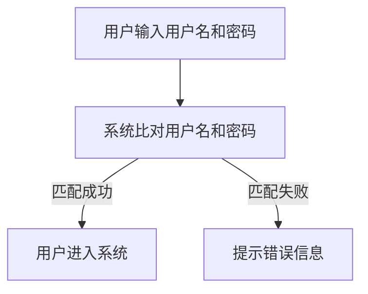

#### 用户资料管理

用户可以查看和修改个人资料，如姓名、联系方式、头像等。管理员可以管理所有用户的信息，进行账户的冻结和解冻、删除等操作。

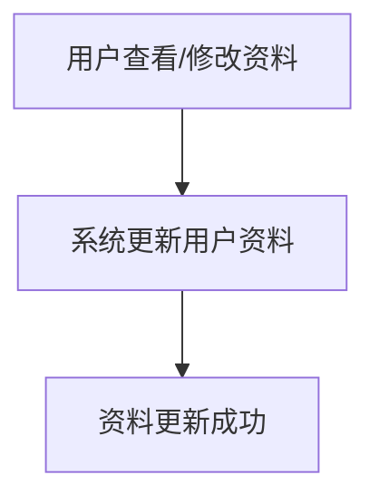

#### 权限控制

权限控制确保不同用户（如管理员、普通用户、考生）能够访问和执行相应操作。通常使用角色-权限（RBAC，Role-Based Access Control）模型实现。

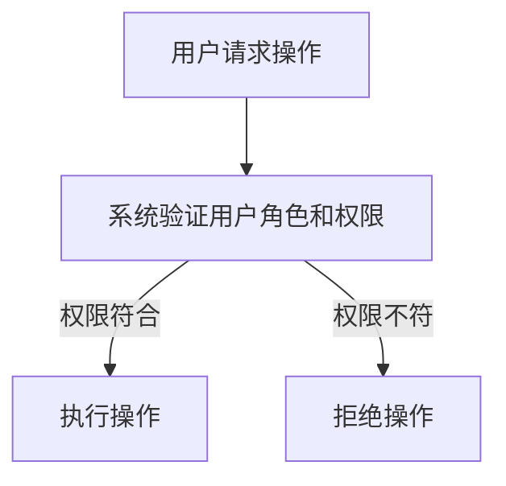

### 2.2 考试管理

考试管理模块负责考试的创建、管理、调度和结果记录。

#### 考试科目管理

管理员可以添加、编辑和删除考试科目，为每个科目设置难度、类型等信息。

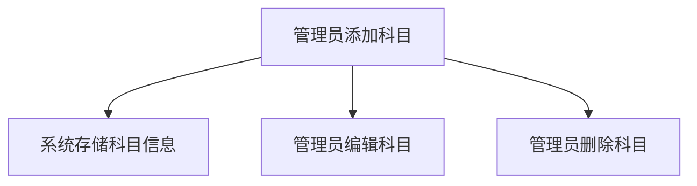

#### 考试题库管理

考题库是考试的核心资源。管理员可以上传、编辑和删除题目，对题目进行分类管理。

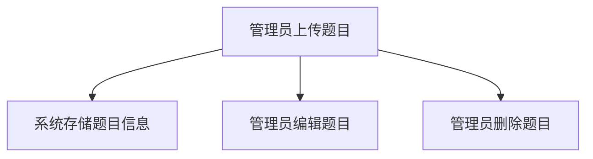

#### 考试安排与调度

管理员可以设置考试时间、考试时长、考试方式等，并安排考试。系统会根据设置自动生成考试日程表。

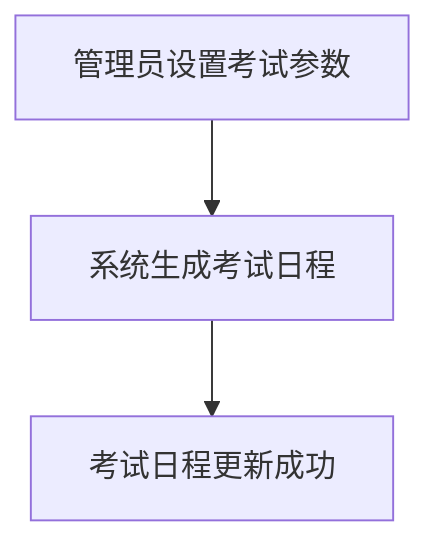

#### 考试结果记录与统计

考试结束后，系统会自动记录每个考生的考试成绩，生成详细的分析报告。管理员可以查看总体成绩、单个考生的成绩分布等。

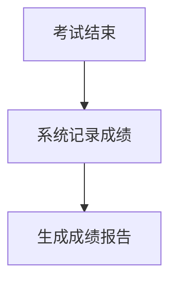

### 2.3 题库管理

题库管理是系统的重要组成部分，负责题目的分类、更新和维护。

#### 题目分类管理

管理员可以对题目按照科目、难度、题型等进行分类管理，方便考试时随机选题或组合题目。

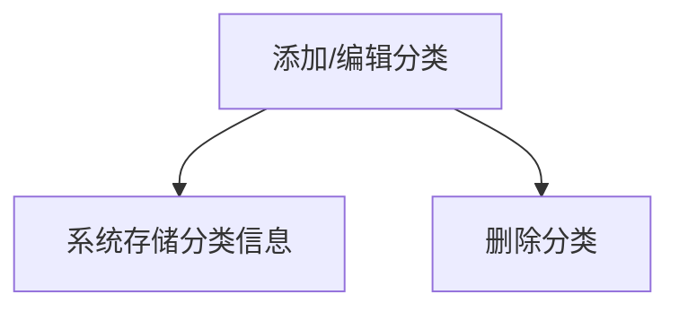

#### 题库维护与更新

管理员定期更新题库，确保题目的时效性和准确性。系统提供批量导入和导出功能，方便管理大量题目。

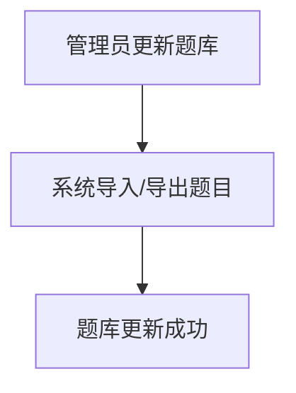

#### 题目随机生成与组合

考试时，系统可以根据考试要求和题型，随机生成或组合题目，保证考试的公平性和多样性。

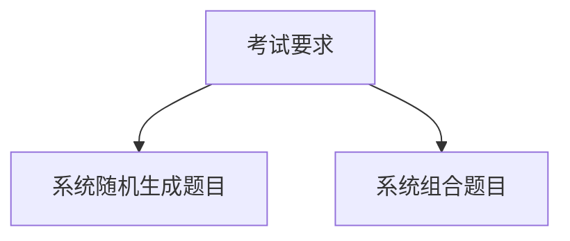

### 2.4 考试监控

考试监控是确保考试公正性和安全性的重要手段，包括实时监控、记录回放和异常处理。

#### 考试实时监控

管理员可以通过后台实时监控考试过程，查看考生的答题情况，确保考试环境的公平和安静。

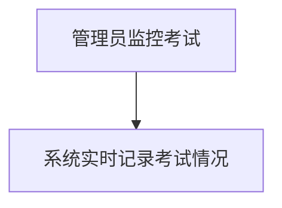

#### 考试记录与回放

系统会记录考试过程中的所有操作，考生可以在考试结束后查看回放，确保考试的透明性和可追溯性。

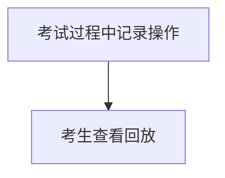

#### 考试异常处理

系统可以检测到异常行为，如交卷时间异常、系统崩溃等，并采取措施进行处理，确保考试的顺利进行。

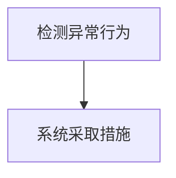

通过详细讲解用户管理、考试管理、题库管理和考试监控等核心功能，我们了解了在线考试认证系统的基本运作机制。接下来，我们将进一步探讨在线考试认证系统的核心算法与原理，包括考试评分算法、人工智能辅助判卷和数据分析与报告生成。

### 2.5 核心算法与原理

在线考试认证系统的核心算法与原理是系统性能和用户体验的关键。以下是系统中的几个关键算法和原理的详细解释。

#### 2.5.1 考试评分算法

考试评分算法是确保考试结果准确性的核心。系统通常需要处理不同类型的题目，包括选择题、填空题、主观题等。

**评分标准设定**：

1. **选择题**：通常每个选项对应一个分数，正确答案的分数为正，错误答案的分数为负或零。
2. **填空题**：根据答案的准确性进行评分，通常使用模糊匹配算法，如Levenshtein距离。
3. **主观题**：由人工评分或使用自然语言处理技术进行自动评分。

**自动评分算法原理**：

1. **选择题**：系统通过逻辑运算符（如AND、OR、NOT）组合选项，与用户选择的选项进行比对，得出得分。
2. **填空题**：系统使用字符串匹配算法（如模糊匹配、精确匹配）比对答案，根据匹配结果计算得分。

**评分算法实现与优化**：

1. **实现**：以下是一个选择题评分的伪代码示例。
   ```python
   def score_choice_question(selected, correct_answers):
       score = 0
       for answer in correct_answers:
           if selected == answer:
               score += 1
       return score
   ```

2. **优化**：优化评分算法可以通过以下方法实现：
   - **并行处理**：对于大量选择题，可以使用并行处理技术提高评分速度。
   - **缓存**：对于频繁出现的题目，可以使用缓存技术减少计算时间。

#### 2.5.2 人工智能辅助判卷

人工智能在考试中的应用日益广泛，特别是在主观题评分中，AI可以大幅提高评分效率和准确性。

**人工智能在考试中的应用**：

1. **自然语言处理（NLP）**：使用NLP技术分析考生的答案，理解其含义和表达方式。
2. **机器学习**：通过训练模型，使系统学会识别不同答案的相似性和差异，从而自动评分。

**人工智能判卷算法原理**：

1. **语义分析**：系统对考生的答案进行语义分析，提取关键信息，并对比标准答案的语义。
2. **文本相似度计算**：使用文本相似度算法（如余弦相似度、Jaccard相似度）计算考生的答案与标准答案的相似度。
3. **规则引擎**：结合语义分析和相似度计算，系统可以设置评分规则，如得分阈值、特殊词汇的处理等。

**人工智能判卷算法实现**：

1. **实现**：以下是一个使用余弦相似度计算文本相似度的伪代码示例。
   ```python
   from sklearn.metrics.pairwise import cosine_similarity

   def score_with_cosine_similarity(answer, standard_answers):
       vectorizer = TfidfVectorizer()
       question_vector = vectorizer.transform([answer])
       standard_answers_vector = vectorizer.transform(standard_answers)
       similarity = cosine_similarity(question_vector, standard_answers_vector)
       return similarity.max()
   ```

2. **优化**：优化判卷算法可以通过以下方法实现：
   - **模型优化**：使用更先进的NLP模型，如BERT、GPT等，提高判卷准确性。
   - **数据增强**：通过增加训练数据量和多样性，提高模型的泛化能力。

#### 2.5.3 数据分析与报告生成

在线考试认证系统需要提供全面的数据分析功能，帮助用户了解考试情况，优化教学和学习效果。

**考试数据分析**：

1. **结果分析**：系统对考试结果进行统计分析，包括总体通过率、平均分、最高分等。
2. **试题分析**：分析每道试题的难度、正确率，识别易错题和难题。
3. **考生分析**：分析不同考生的答题情况，识别优秀考生和需要加强的考生。

**报告模板设计**：

1. **通用模板**：系统提供多种通用报告模板，满足不同用户的需求。
2. **自定义模板**：用户可以根据需求自定义报告模板，添加个性化内容。

**报告自动生成算法**：

1. **实现**：系统根据考试数据和预定义的模板，自动生成报告。以下是一个生成报告的伪代码示例。
   ```python
   def generate_report(exam_results, report_template):
       report_content = report_template
       report_content.replace("{SCORE}", str(exam_results['total_score']))
       report_content.replace("{AVERAGE}", str(exam_results['average_score']))
       return report_content
   ```

2. **优化**：优化报告生成算法可以通过以下方法实现：
   - **模板引擎**：使用模板引擎（如Jinja2）提高模板渲染效率。
   - **缓存**：缓存常用报告模板，减少生成时间。

通过详细解析考试评分算法、人工智能辅助判卷算法以及考试数据分析与报告生成算法，我们了解了在线考试认证系统中核心算法的实现原理和优化方法。这些算法和原理的应用，不仅提高了系统的性能和准确性，也为用户提供了一个更加智能和高效的考试环境。

### 2.6 安全性设计

在线考试认证系统的安全性设计是确保系统稳定运行和数据安全的关键。以下将详细介绍系统安全性的重要性、常见安全威胁、安全策略设计、用户身份认证、数据加密与传输、考试过程监控与审计等方面的内容。

#### 2.6.1 安全性概述

安全性在在线考试认证系统中至关重要，它直接关系到用户的个人信息、考试成绩以及整个系统的稳定性。以下为安全性设计的重要性：

1. **保护用户隐私**：在线考试认证系统涉及用户个人信息，如姓名、联系方式、考试成绩等，一旦泄露，将严重侵犯用户隐私。
2. **确保考试公正**：系统需要防止作弊行为，确保考试的公正性和权威性。
3. **数据完整性**：系统需要保证数据在存储和传输过程中的完整性和一致性。
4. **系统稳定性**：确保系统在遭受恶意攻击或异常情况下，能够保持稳定运行。

#### 2.6.2 常见安全威胁

在线考试认证系统可能面临以下几种常见安全威胁：

1. **恶意攻击**：包括SQL注入、跨站脚本攻击（XSS）、跨站请求伪造（CSRF）等。
2. **数据泄露**：由于系统漏洞或管理不善，导致用户数据泄露。
3. **密码泄露**：用户密码被盗用，可能导致账户被盗。
4. **考试作弊**：用户通过技术手段进行作弊，影响考试结果的公正性。

#### 2.6.3 安全策略设计

系统安全策略设计需要从多个方面进行考虑，以下为一些常见的安全策略：

1. **访问控制**：使用角色-权限模型（RBAC）进行访问控制，确保用户只能访问授权的资源。
2. **安全编码**：遵循安全编码规范，防止常见的安全漏洞，如SQL注入、跨站脚本攻击等。
3. **数据加密**：对用户数据、考试数据和密码进行加密存储和传输，确保数据安全。
4. **日志记录**：记录系统操作日志，便于审计和追踪异常行为。
5. **定期审计**：定期进行系统安全审计，及时发现和修复安全隐患。

#### 2.6.4 用户身份认证

用户身份认证是保障系统安全的基础。以下为常见的用户身份认证机制：

1. **密码认证**：用户通过输入用户名和密码进行身份验证。系统应使用强密码策略，如要求复杂度、定期更改密码等。
2. **双因素认证（2FA）**：结合用户密码和手机验证码、硬件令牌等，提高认证的安全性。常见的2FA机制包括短信验证码、动态验证码、硬件令牌等。
3. **单点登录（SSO）**：通过SSO，用户只需登录一次，即可访问多个系统，提高用户体验和安全性。

#### 2.6.5 数据加密与传输

数据加密与传输是保护用户数据隐私和安全的关键。以下为数据加密与传输的方法：

1. **数据加密算法**：对用户数据、考试数据等进行加密存储和传输。常用的加密算法包括AES、RSA等。
2. **安全传输协议**：使用HTTPS等安全传输协议，确保数据在传输过程中的安全性。HTTPS使用SSL/TLS协议，对数据进行加密传输。
3. **数据备份与恢复**：定期进行数据备份，确保在数据丢失或损坏时能够快速恢复。

#### 2.6.6 考试过程监控与审计

考试过程监控与审计是确保考试公正性和安全性的重要手段。以下为考试过程监控与审计的方法：

1. **实时监控**：系统应具备实时监控考试过程的功能，包括考生的答题行为、考试环境等。监控数据应实时记录，供管理员查看。
2. **行为分析**：系统通过行为分析技术，检测考试过程中的异常行为，如交卷时间异常、异常操作等。
3. **审计日志**：记录考试过程中的所有操作，包括考生登录、答题、交卷等，供管理员和审计人员审计。
4. **异常处理**：系统应具备异常处理机制，如考生交卷时间异常时，自动记录并通知管理员。

通过详细的安全设计，在线考试认证系统可以有效防止恶意攻击、保护用户数据隐私、确保考试公正性和安全性。接下来，我们将进一步探讨系统性能优化、部署与运维以及案例分析等内容。

### 2.7 性能优化

在线考试认证系统的性能优化是确保系统在高并发、大数据量情况下依然能够稳定运行、快速响应的关键。以下是系统性能优化的一些方法和策略。

#### 5.1 性能优化概述

性能优化目标主要包括：

1. **响应时间**：减少用户操作到系统响应的时间，提高用户体验。
2. **并发处理能力**：提高系统处理并发请求的能力，确保在高并发情况下系统稳定运行。
3. **数据存储与检索效率**：优化数据库查询和存储，提高数据检索速度。
4. **系统资源利用率**：优化系统资源配置，提高资源利用率，降低运营成本。

#### 5.2 数据库优化

数据库优化是系统性能优化的重要组成部分。以下是一些常见的数据库优化方法：

1. **查询优化**：
   - **索引优化**：为常用的查询字段创建索引，提高查询速度。
   - **查询缓存**：缓存常用查询结果，减少数据库访问次数。
   - **查询重写**：优化SQL查询语句，如使用连接（JOIN）代替子查询（Subquery）。

2. **索引优化**：
   - **选择性**：选择性高的索引字段能够提高查询性能。
   - **复合索引**：根据查询条件创建复合索引，提高查询速度。

3. **数据库缓存策略**：
   - **内存缓存**：使用内存缓存（如Redis）存储高频访问的数据，减少数据库访问次数。
   - **磁盘缓存**：使用磁盘缓存（如LRU算法）管理热数据，提高数据访问速度。

#### 5.3 系统负载均衡

系统负载均衡是提高系统并发处理能力和稳定性的关键。以下是一些常见的负载均衡策略和工具：

1. **负载均衡策略**：
   - **轮询**：将请求依次分配给各个服务器。
   - **最小连接数**：将请求分配给当前连接数最少的服务器。
   - **源IP哈希**：根据请求的源IP地址，将请求分配到同一服务器。

2. **负载均衡设备**：
   - **硬件负载均衡器**：如F5 BIG-IP，提供高性能的负载均衡功能。
   - **软件负载均衡器**：如Nginx、HAProxy，可以在服务器上运行，实现高效的负载均衡。

3. **负载均衡算法**：
   - **一致性哈希**：根据哈希算法，将请求分配到服务器，提高负载均衡的均衡性。
   - **加权轮询**：根据服务器的性能和负载，为服务器分配不同的权重。

#### 5.4 缓存机制与CDN

缓存机制与CDN是提高系统性能和用户体验的有效手段。以下是一些常见的缓存机制和CDN配置方法：

1. **缓存机制**：
   - **前端缓存**：使用浏览器缓存（如HTTP缓存头）减少服务器负载。
   - **后端缓存**：使用内存缓存（如Redis）或分布式缓存（如Memcached）存储高频访问的数据。
   - **页面缓存**：使用静态页面缓存，减少页面生成和渲染时间。

2. **CDN**：
   - **CDN的作用**：CDN（内容分发网络）通过将静态资源（如图片、CSS、JavaScript）分发到全球节点，提高用户访问速度。
   - **CDN配置**：配置CDN服务，如阿里云CDN、腾讯云CDN，设置缓存策略、安全策略等。

3. **缓存与CDN的配合使用**：
   - **缓存预热**：在用户访问高峰期，提前加载缓存，减少CDN的负载。
   - **内容同步**：确保CDN上的内容与源站保持同步，避免缓存不一致问题。

通过以上性能优化方法和策略，在线考试认证系统可以在高并发、大数据量情况下保持稳定运行，提高用户体验和系统性能。

### 2.8 部署与运维

在线考试认证系统的部署与运维是确保系统稳定运行和高效性能的关键环节。以下将详细介绍系统部署、系统监控与维护、灾难恢复与业务连续性、数据备份与恢复等方面的内容。

#### 6.1 系统部署

系统部署是指将开发和测试环境中的系统部署到生产环境中，使其能够对外提供服务。以下为系统部署的方法：

1. **部署流程**：
   - **环境准备**：准备好服务器硬件、操作系统、数据库等基础设施。
   - **安装软件**：安装并配置系统所需的软件，如Web服务器（如Nginx、Apache）、后端应用（如Java、Python）、数据库（如MySQL、PostgreSQL）等。
   - **配置管理**：配置系统参数，如数据库连接、Web服务器设置、缓存策略等。
   - **测试上线**：进行系统测试，确保部署后的系统能够正常运行，然后正式上线。

2. **部署策略**：
   - **单机部署**：适用于小型系统，所有组件部署在同一台服务器上。
   - **分布式部署**：适用于大型系统，将不同组件部署在不同的服务器上，提高系统的可靠性和性能。
   - **容器化部署**：使用Docker、Kubernetes等容器化技术，实现系统的快速部署和灵活管理。

3. **部署工具**：
   - **自动化部署工具**：如Jenkins、Ansible，实现自动化部署，提高部署效率。
   - **持续集成/持续部署（CI/CD）**：结合GitLab CI/CD、Jenkins等工具，实现代码的自动化测试和部署。

#### 6.2 系统监控与维护

系统监控与维护是保障系统稳定运行和高效性能的重要环节。以下为系统监控与维护的方法：

1. **监控指标**：
   - **CPU、内存、磁盘等资源使用情况**：监控服务器资源使用率，确保系统运行在合理范围内。
   - **网络流量和带宽使用情况**：监控网络流量和带宽使用情况，防止网络瓶颈影响系统性能。
   - **数据库性能和查询效率**：监控数据库性能，优化查询语句和索引，提高查询效率。

2. **监控工具**：
   - **Prometheus**：开源监控系统，可用于收集和存储系统指标数据。
   - **Grafana**：开源可视化工具，结合Prometheus，实现系统指标的可视化监控。
   - **Zabbix**：开源监控工具，支持多种监控方式和报警机制。

3. **定期维护与更新**：
   - **系统升级**：定期更新操作系统、应用软件等，修复已知漏洞和bug。
   - **数据备份**：定期备份数据库和重要数据，确保在数据丢失或损坏时能够快速恢复。
   - **性能优化**：定期进行性能分析，优化系统配置和代码，提高系统性能。

#### 6.3 灾难恢复与业务连续性

灾难恢复与业务连续性是确保系统在遭受灾难或故障时能够快速恢复，保证业务不中断的关键。以下为灾难恢复与业务连续性的方法：

1. **灾难恢复计划**：
   - **备份与恢复**：定期备份系统数据和配置文件，确保在灾难发生时能够快速恢复。
   - **容灾备份**：在异地建立备份服务器，确保在主服务器故障时能够迅速切换到备份服务器。
   - **故障转移**：实现故障转移机制，如使用负载均衡器实现服务的自动切换。

2. **业务连续性策略**：
   - **高可用性**：使用冗余设备和系统组件，确保系统在部分组件故障时仍然能够正常运行。
   - **备份与恢复**：定期备份业务数据和配置文件，确保在灾难发生时能够快速恢复业务。
   - **演练与测试**：定期进行灾难恢复演练和业务连续性测试，确保恢复策略的有效性。

3. **数据备份与恢复策略**：
   - **定期备份**：使用备份工具（如MySQLdump、Rsync等）定期备份数据库和文件系统。
   - **备份存储**：将备份存储在安全的存储介质上，如远程存储、云存储等。
   - **快速恢复**：在发生数据丢失或损坏时，快速恢复备份数据，确保业务能够迅速恢复。

通过详细的部署与运维策略，在线考试认证系统可以在生产环境中稳定运行，确保系统的可靠性和高效性能。接下来，我们将通过实际案例和实战指导，进一步探讨系统的实施和优化。

### 7.1 案例分析

在本节中，我们将通过分析两个实际的在线考试认证系统案例，一个成功的案例和一个失败的案例，深入探讨它们的特点、成功和失败的原因，以及从中得到的经验和教训。

#### 成功案例：某知名在线教育平台

**特点**：

- **平台规模大**：该平台覆盖了众多科目，拥有大量的用户和考试资源。
- **技术先进**：采用了云计算、大数据和人工智能技术，确保系统的高性能和高可靠性。
- **用户体验优**：系统提供了丰富的功能，如实时监控、数据分析、报告生成等，用户界面友好，操作简便。
- **安全性高**：系统采用了多重安全措施，如数据加密、身份认证、安全审计等，确保用户数据安全。

**成功原因**：

- **技术创新**：平台通过采用先进的技术，如云计算和大数据分析，提高了系统的性能和用户体验。
- **用户体验**：平台注重用户体验，从界面设计到功能实现，都力求简便易用，赢得了用户的信任和好评。
- **安全性保障**：系统在安全设计方面投入了大量资源，确保了用户数据和考试过程的绝对安全。
- **持续优化**：平台持续进行系统优化和功能更新，不断满足用户的需求和市场的变化。

**经验和教训**：

- **技术创新**：在保持技术先进性的同时，要确保技术创新与用户需求的平衡，避免过度追求技术而忽略了用户体验。
- **用户体验**：用户体验是平台成功的核心，要注重用户需求的调研和反馈，不断优化系统功能和界面。
- **安全性**：在线考试认证系统的安全性至关重要，需要持续投入资源进行安全防护和风险控制。

#### 失败案例：某小型企业培训系统

**特点**：

- **系统规模小**：仅限于企业内部培训使用，用户和考试资源相对有限。
- **技术落后**：系统使用老旧的技术栈，如传统的Java和Oracle数据库，缺乏灵活性。
- **用户体验差**：系统界面陈旧，功能单一，用户操作繁琐。
- **安全性不足**：系统缺乏有效的安全措施，如数据加密和用户身份认证等。

**失败原因**：

- **技术落后**：系统使用的技术栈过时，导致系统性能和安全性不佳，难以满足用户需求。
- **用户体验差**：系统界面和功能设计不人性化，用户使用体验差，导致用户流失。
- **安全性不足**：系统缺乏有效的安全措施，易受到攻击，导致用户数据泄露和考试作弊等问题。

**经验和教训**：

- **技术升级**：定期更新技术栈，采用最新的技术和工具，确保系统的性能和安全性。
- **用户体验**：注重用户体验，从界面设计到功能实现，都要以用户需求为中心，提供便捷、友好的操作体验。
- **安全性**：在线考试认证系统的安全性至关重要，必须投入足够的资源进行安全防护，确保用户数据安全。

通过分析这两个案例，我们可以看到，在线考试认证系统的成功不仅依赖于技术实现，还需要注重用户体验和安全性。同时，定期进行系统升级和优化，以适应不断变化的市场需求，也是确保系统长期成功的关键。

### 7.2 实战指导

在本节中，我们将通过一系列具体的步骤和代码示例，指导读者如何从零开始搭建一个在线考试认证系统。我们将涵盖系统开发流程、代码示例和优化建议。

#### 系统开发流程

1. **需求分析**：

   首先明确系统的需求和功能，包括用户管理、考试管理、题库管理、考试监控和报告生成等。

2. **系统设计**：

   设计系统的整体架构，包括前端、后端和数据库的设计。选择合适的技术栈，如前端使用Vue.js或React，后端使用Spring Boot或Django。

3. **前端开发**：

   开发前端用户界面，实现用户注册、登录、考试界面、结果展示等功能。

   ```html
   <!-- 用户注册界面示例 -->
   <form @submit.prevent="registerUser">
     <input type="text" v-model="username" placeholder="用户名" required />
     <input type="password" v-model="password" placeholder="密码" required />
     <button type="submit">注册</button>
   </form>
   ```

4. **后端开发**：

   开发后端服务，处理用户请求，包括用户管理、考试管理和题库管理等功能。

   ```java
   // 用户注册接口示例
   @RestController
   public class UserController {
       @PostMapping("/register")
       public ResponseEntity<?> registerUser(@RequestBody User user) {
           // 处理用户注册逻辑
           return ResponseEntity.ok("User registered successfully");
       }
   }
   ```

5. **数据库设计**：

   设计数据库表结构，包括用户表、考试表、题目表等。

   ```sql
   -- 用户表示例
   CREATE TABLE users (
       id INT AUTO_INCREMENT PRIMARY KEY,
       username VARCHAR(255) NOT NULL,
       password VARCHAR(255) NOT NULL
   );
   ```

6. **系统集成**：

   将前端和后端集成，确保各部分功能正常对接。

7. **测试**：

   进行功能测试和性能测试，确保系统稳定、高效、安全。

8. **部署**：

   部署系统到生产环境，确保系统可以对外提供服务。

#### 代码示例

以下是一个简单的用户注册功能的代码示例，包括前端Vue.js代码和后端Spring Boot代码。

**前端Vue.js代码示例**：

```vue
<template>
  <div>
    <h1>用户注册</h1>
    <form @submit.prevent="register">
      <input type="text" v-model="username" placeholder="用户名" required />
      <input type="password" v-model="password" placeholder="密码" required />
      <button type="submit">注册</button>
    </form>
  </div>
</template>

<script>
export default {
  data() {
    return {
      username: '',
      password: '',
    };
  },
  methods: {
    register() {
      // 调用后端注册接口
      this.$http.post('/api/register', {
        username: this.username,
        password: this.password,
      })
      .then(response => {
        alert(response.data);
      })
      .catch(error => {
        alert(error.response.data);
      });
    },
  },
};
</script>
```

**后端Spring Boot代码示例**：

```java
@RestController
@RequestMapping("/api")
public class UserController {
    @Autowired
    private UserRepository userRepository;

    @PostMapping("/register")
    public ResponseEntity<?> registerUser(@RequestBody User user) {
        if (userRepository.existsByUsername(user.getUsername())) {
            return ResponseEntity.badRequest().body("Error: Username is already taken!");
        }

        userRepository.save(user);
        return ResponseEntity.ok("User registered successfully");
    }
}
```

#### 优化建议

1. **性能优化**：

   - **数据库查询优化**：使用索引和缓存，优化数据库查询。
   - **代码优化**：优化代码逻辑，减少不必要的计算和资源消耗。
   - **静态资源缓存**：使用CDN和浏览器缓存，减少静态资源加载时间。

2. **安全性优化**：

   - **加密存储**：使用强加密算法存储用户密码。
   - **身份验证**：采用JWT等安全认证机制，确保用户身份的安全。
   - **防止跨站请求伪造（CSRF）**：使用CSRF防护策略，防止恶意攻击。

3. **用户体验优化**：

   - **界面设计**：提供简洁、美观的界面，提高用户操作体验。
   - **快速响应**：优化网络请求和数据处理，提高系统响应速度。
   - **错误处理**：提供友好的错误提示和信息，帮助用户解决问题。

通过以上实战指导和优化建议，读者可以掌握在线考试认证系统的基本开发流程和优化方法，为搭建一个高效、安全、用户友好的在线考试认证系统奠定基础。

### 附录A：相关技术资源

在本附录中，我们将推荐一些有用的技术资源，包括书籍、开源项目、学习资源等，以帮助读者深入了解和掌握在线考试认证系统的相关技术。

#### 常用技术文档

1. **Vue.js官方文档**：[https://vuejs.org/v2/guide/](https://vuejs.org/v2/guide/)
2. **Spring Boot官方文档**：[https://docs.spring.io/spring-boot/docs/current/reference/html/](https://docs.spring.io/spring-boot/docs/current/reference/html/)
3. **MySQL官方文档**：[https://dev.mysql.com/doc/](https://dev.mysql.com/doc/)
4. **Django官方文档**：[https://docs.djangoproject.com/en/3.2/](https://docs.djangoproject.com/en/3.2/)

#### 开源项目与工具

1. **在线考试系统开源项目**：[https://github.com/online-exam-system](https://github.com/online-exam-system)
2. **JWT认证**：[https://github.com/auth0/node-json-web-token](https://github.com/auth0/node-json-web-token)
3. **Docker**：[https://www.docker.com/](https://www.docker.com/)
4. **Kubernetes**：[https://kubernetes.io/](https://kubernetes.io/)

#### 学习资源推荐

1. **在线课程**：
   - Coursera：[https://www.coursera.org/](https://www.coursera.org/)
   - Udemy：[https://www.udemy.com/](https://www.udemy.com/)

2. **技术博客**：
   - Medium：[https://medium.com/](https://medium.com/)
   - HackerRank：[https://www.hackerrank.com/](https://www.hackerrank.com/)

3. **论坛与社区**：
   - Stack Overflow：[https://stackoverflow.com/](https://stackoverflow.com/)
   - GitHub：[https://github.com/](https://github.com/)

通过这些技术资源和学习资源，读者可以不断提升自己的技术能力，更好地理解和应用在线考试认证系统的相关技术。

### 附录B：术语解释

在本附录中，我们将解释一些与在线考试认证系统相关的专业术语和技术名词，帮助读者更好地理解文章内容。

#### 专业术语解释

1. **知识付费**：指用户为获取特定的知识和技能，向知识提供者支付费用的行为。
2. **在线考试认证系统**：基于互联网的考试管理平台，包括用户管理、考试管理、题库管理、考试监控等功能。
3. **B/S架构**：浏览器/服务器架构，前端通过Web浏览器与用户交互，后端通过服务器处理业务逻辑。
4. **RBAC**：基于角色的访问控制，通过角色分配权限，确保用户只能访问授权的资源。
5. **HTTPS**：超文本传输协议安全版本，使用SSL/TLS协议加密数据传输，确保数据安全。
6. **JSON Web Token（JWT）**：一种用于身份验证的开放标准（RFC 7519），包含用户信息，用于客户端与服务器之间的安全通信。
7. **负载均衡**：通过将请求分配到多个服务器，提高系统的并发处理能力和稳定性。
8. **缓存**：将数据临时存储在内存或其他快速存储介质中，以提高数据访问速度。

#### 技术名词解释

1. **自然语言处理（NLP）**：使用计算机技术和算法处理和分析人类语言的技术。
2. **机器学习**：一种人工智能技术，通过数据训练模型，使其能够自动完成特定任务。
3. **深度学习**：一种基于神经网络的机器学习技术，通过多层神经网络对数据进行复杂特征提取。
4. **数据加密**：使用加密算法将数据转换为密文，以保护数据安全。
5. **SQL注入**：一种网络攻击技术，通过在SQL查询中插入恶意代码，欺骗数据库执行非法操作。
6. **跨站脚本攻击（XSS）**：一种网络攻击技术，通过在目标网站上注入恶意脚本，窃取用户信息或控制用户浏览器。
7. **跨站请求伪造（CSRF）**：一种网络攻击技术，通过伪造用户的请求，执行非法操作。
8. **容器化**：将应用及其依赖项打包到一个容器中，实现应用的隔离和轻量级部署。

通过这些术语和名词的解释，读者可以更深入地理解在线考试认证系统的技术和原理。

### 附录C：参考资料

在本附录中，我们将列出一些与在线考试认证系统相关的书籍、论文和研究报告，供读者进一步学习和研究。

#### 相关书籍推荐

1. 《在线教育技术导论》：详细介绍了在线教育技术的发展、应用和未来趋势。
2. 《深度学习》：介绍了深度学习的基本原理、算法和应用，适合对人工智能感兴趣的读者。
3. 《计算机网络》：详细讲解了计算机网络的基本原理、协议和应用，对了解在线考试认证系统的网络架构有帮助。
4. 《软件工程》：介绍了软件工程的基本原理和方法，对系统开发和维护有指导意义。

#### 论文与研究报告

1. "Online Education and E-Learning: A Survey"：对在线教育和电子学习的研究进行了综述，包括在线考试认证系统的相关技术。
2. "A Survey on Security Issues in Cloud Computing"：分析了云计算环境中的安全问题和防护措施，对在线考试认证系统的安全设计有参考价值。
3. "Deep Learning for Natural Language Processing"：介绍了深度学习在自然语言处理中的应用，对AI辅助判卷技术有启发。
4. "Performance Optimization Techniques for Cloud-Based E-Learning Systems"：探讨了云环境中在线考试认证系统的性能优化方法。

#### 学术资源链接

1. Coursera：[https://www.coursera.org/](https://www.coursera.org/)
2. arXiv：[https://arxiv.org/](https://arxiv.org/)
3. Google Scholar：[https://scholar.google.com/](https://scholar.google.com/)
4. IEEE Xplore：[https://ieeexplore.ieee.org/](https://ieeexplore.ieee.org/)

通过这些书籍、论文和学术资源，读者可以进一步深入了解在线考试认证系统的相关技术和研究方向。

