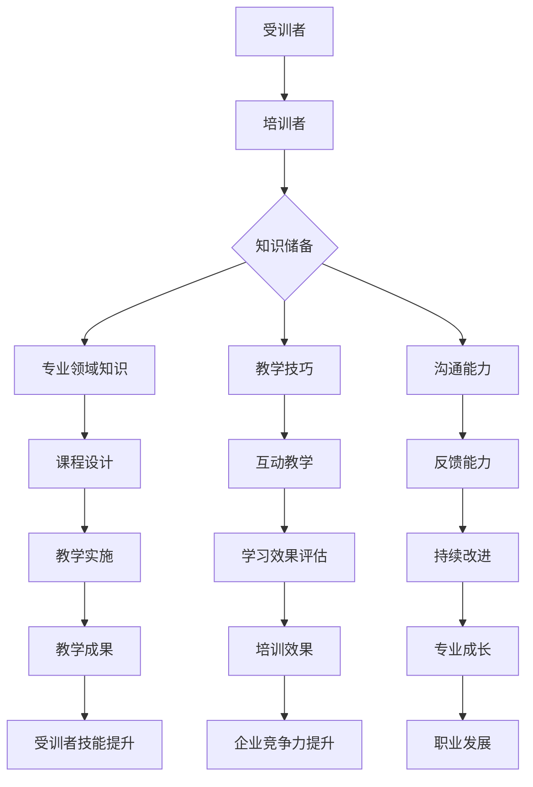
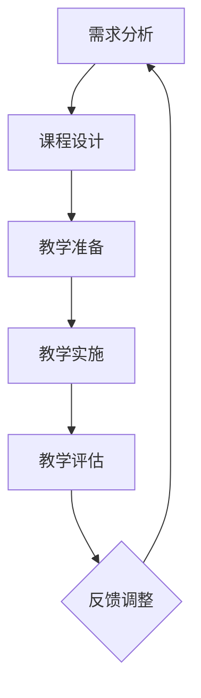

                 

# 技术培训：从受训者到培训者

> **关键词：** 技术培训、角色转变、课程设计、教学策略、教学评估、培训者技能、受训者经验、职业发展

> **摘要：** 本文章旨在探讨技术培训过程中从受训者到培训者的角色转变，详细分析了培训者所需具备的技能要求、课程设计与开发、教学策略与方法、教学评估与反馈，以及培训者的后续支持与进阶。通过阐述技术培训的趋势与未来展望，本文为培训者提供了一系列实用的指导和建议。

---

## 目录大纲

### 第一部分：引入与基础

1. 技术培训概述
    - 1.1 技术培训的重要性
    - 1.2 培训者与受训者的角色转变
    - 1.3 技术培训的基本流程

2. 培训者的技能要求
    - 2.1 培训者应具备的知识体系
    - 2.2 培训者的沟通能力培养
    - 2.3 培训者心态调整

### 第二部分：准备阶段

1. 课程设计与开发
    - 3.1 课程设计的步骤
    - 3.2 课程内容的选择与组织
    - 3.3 教学资源的收集与整理

2. 教学策略与方法
    - 4.1 传统教学方法与技巧
    - 4.2 现代教学技术与工具
    - 4.3 互动教学策略

3. 教学评估与反馈
    - 5.1 教学评估的目的与类型
    - 5.2 评估工具的选择与应用
    - 5.3 反馈的重要性与实践

### 第三部分：实施阶段

1. 教学实施技巧
    - 6.1 第一印象与开场技巧
    - 6.2 演示与互动设计
    - 6.3 解决学员疑问与问题处理

2. 技术培训案例实战
    - 7.1 技术培训案例介绍
    - 7.2 案例教学环境搭建
    - 7.3 案例教学实施与效果评估

### 第四部分：后续支持与进阶

1. 培训后的支持服务
    - 8.1 培训后续跟踪与评估
    - 8.2 培训后技术支持
    - 8.3 培训者自我提升

2. 从受训者到培训者的转变
    - 9.1 受训者的经验总结
    - 9.2 培训者角色转变的重要性
    - 9.3 培训者职业发展的规划

3. 技术培训趋势与未来展望
    - 10.1 技术培训的发展趋势
    - 10.2 技术培训的未来展望
    - 10.3 技术培训者应具备的新技能

### 附录

1. 常用培训工具与资源
    - 11.1 常用培训软件介绍
    - 11.2 网络资源与在线课程
    - 11.3 专业书籍与参考资料

2. 培训案例解析
    - 12.1 案例一：项目启动与规划
    - 12.2 案例二：培训课程设计
    - 12.3 案例三：培训实施与反馈

---

在接下来的文章中，我们将一步一步地深入探讨技术培训的各个方面，帮助读者从受训者顺利转型为培训者，实现职业生涯的进一步提升。

---

## 第一部分：引入与基础

### 第1章：技术培训概述

技术培训是提高个人或团队专业技能的重要手段，它不仅能够提升受训者的职业素养，还能促进企业的技术进步和竞争力。在这个快速变化的技术时代，技术培训的重要性愈发凸显。以下将从几个方面详细阐述技术培训的概念、目标和意义。

### 1.1 技术培训的重要性

首先，技术培训对于受训者个人来说具有重要意义。通过技术培训，受训者可以：

- **提高技能水平**：掌握新的技术和工具，提升专业能力。
- **增强就业竞争力**：拥有更多技能和证书，提高求职成功率和薪资水平。
- **适应职业发展需求**：跟随行业发展趋势，保持与岗位需求的匹配度。

其次，技术培训对企业同样具有不可忽视的价值。企业通过技术培训可以实现：

- **提高员工素质**：培养技术精湛、业务熟练的团队，提升整体工作效率。
- **增强创新能力**：鼓励员工学习新技术，激发创新思维，推动企业技术革新。
- **降低培训成本**：通过内部培训减少对外部培训机构的依赖，降低培训成本。

### 1.2 培训者与受训者的角色转变

在技术培训过程中，培训者和受训者的角色转变至关重要。从受训者到培训者的转变，不仅意味着个人技能的提升，更是一种身份和责任的变化。

**受训者**是指在培训过程中学习新知识和技能的人，他们需要：

- **积极参与**：主动学习，认真听讲，积极提问。
- **实践操作**：通过实际操作巩固理论知识。
- **反馈交流**：及时向培训者反馈学习情况和遇到的问题。

**培训者**则是在培训过程中负责传授知识和技能的人，他们需要：

- **专业知识**：掌握所教授领域的深入知识和经验。
- **教学能力**：具备良好的教学技巧和方法，能够引导学生学习。
- **责任心**：关注受训者的学习进度和问题，提供有效的帮助和指导。

### 1.3 技术培训的基本流程

技术培训的基本流程通常包括以下几个阶段：

1. **需求分析**：确定培训目标和受训者需求，明确培训内容。
2. **课程设计**：根据需求分析结果设计培训课程，包括课程大纲、教学资源和教学方法。
3. **教学准备**：准备教学材料和教学环境，进行教学测试。
4. **教学实施**：按照课程计划进行教学活动，包括讲解、演示、练习和讨论。
5. **教学评估**：评估培训效果，收集受训者和培训者的反馈，进行改进。
6. **后续支持**：提供培训后续的技术支持和跟踪服务，帮助受训者巩固所学知识。

通过上述流程，技术培训能够系统地实现知识传递和技能培养，从而达到预期的培训效果。

### 结论

技术培训在个人职业发展和企业竞争力提升中发挥着重要作用。从受训者到培训者的角色转变不仅需要专业知识和教学技能，还需要积极的心态和责任心。了解技术培训的基本流程和重要性，将有助于受训者更好地参与培训，实现自我提升，同时也为培训者提供了实用的指导。在接下来的章节中，我们将进一步探讨培训者的技能要求、课程设计与开发、教学策略与方法等关键问题。

---

### 第2章：培训者的技能要求

要成为一名优秀的培训者，不仅需要丰富的专业知识和教学技巧，还需要具备一系列关键的软技能和心态。以下将从知识体系、沟通能力和心态调整三个方面详细探讨培训者应具备的技能要求。

#### 2.1 培训者应具备的知识体系

**专业知识**：培训者应具备深厚的专业知识，这是其传授知识和技能的基础。具体来说，培训者应掌握以下方面的知识：

- **基础理论**：了解所教授领域的理论基础，如算法原理、编程语言基础等。
- **技术趋势**：关注行业动态和技术发展趋势，掌握前沿技术和工具。
- **实践经验**：通过实际项目经验积累，掌握实际操作技巧和问题解决能力。

**课程内容**：培训者需要根据培训目标和受训者的需求，设计和组织课程内容。这要求培训者能够：

- **内容梳理**：将复杂的知识点梳理成结构化的课程内容，便于受训者理解。
- **案例教学**：结合实际案例，使理论知识更具实践性，提高受训者的学习兴趣和参与度。

#### 2.2 培训者的沟通能力培养

**表达能力**：培训者需要具备良好的表达能力，能够清晰、准确地传达知识点。具体包括：

- **语言组织**：用简洁明了的语言描述复杂的概念和算法。
- **逻辑思维**：逻辑清晰，使培训内容条理分明，易于受训者理解。

**互动能力**：培训者应鼓励受训者参与互动，激发其思考和讨论。具体包括：

- **提问引导**：通过提问引导受训者思考，促进其主动学习。
- **讨论交流**：组织小组讨论或问答环节，鼓励受训者分享学习心得和疑问。

**反馈能力**：培训者需要能够及时、准确地给予受训者反馈，帮助他们改进。具体包括：

- **积极反馈**：鼓励受训者的进步和努力，提高其自信心。
- **建设性反馈**：针对受训者的不足提出具体的改进建议，帮助他们提升。

#### 2.3 培训者心态调整

**自信心**：培训者需要具备足够的自信心，这包括对自己专业能力的自信和对教学效果的自信。自信心可以增强培训者与受训者之间的信任，提高培训效果。

**耐心**：培训者需要具备耐心，尤其是面对学习困难或进度较慢的受训者。耐心可以帮助培训者更好地引导受训者，避免急躁和负面情绪。

**不断学习**：培训者应保持学习的态度，不断提升自己的专业知识和教学能力。这不仅有助于提高培训质量，也能使培训者保持与时俱进，适应不断变化的技术环境。

**积极心态**：培训者需要保持积极的心态，面对挑战和困难时不轻言放弃。积极心态可以帮助培训者更好地应对压力，保持教学热情。

#### 结论

培训者的技能要求涵盖了专业知识、沟通能力和心态调整等多个方面。只有具备这些技能，培训者才能有效地传授知识和技能，帮助受训者实现成长和提升。在接下来的章节中，我们将进一步探讨课程设计与开发、教学策略与方法等关键环节，为培训者提供更全面的指导。

---

### 第3章：准备阶段

在技术培训的准备阶段，培训者需要精心设计和开发课程，以确保培训内容的科学性和实用性。以下将从课程设计的步骤、课程内容的选择与组织、教学资源的收集与整理三个方面进行详细讨论。

#### 3.1 课程设计的步骤

课程设计是培训准备阶段的核心工作，一个有效的课程设计能够确保培训目标的实现和受训者的学习效果。以下是课程设计的几个关键步骤：

**1. 确定培训目标**：首先，培训者需要明确培训的目标，包括受训者应掌握的知识和技能。这有助于确保课程设计的方向性和针对性。

**2. 分析受训者需求**：了解受训者的背景、需求和期望，是课程设计的重要依据。培训者可以通过调查问卷、访谈等方式收集受训者的信息，为课程内容的选择提供依据。

**3. 制定课程大纲**：根据培训目标和受训者需求，制定详细的课程大纲。课程大纲应包括课程名称、学习目标、内容模块、教学方法等。

**4. 选择课程内容**：在课程大纲的基础上，选择具体的课程内容。内容的选择应围绕培训目标和受训者需求，确保课程内容的实用性和科学性。

**5. 组织课程内容**：将选定的课程内容进行合理组织，使其形成一个逻辑严密、层次分明的结构。这有助于受训者更好地理解和掌握知识。

**6. 设计教学方法**：根据课程内容的特点和受训者的需求，选择合适的教学方法。教学方法应多样化，以提高受训者的学习兴趣和参与度。

**7. 制定教学计划**：将课程内容、教学方法和教学时间安排进行具体化，形成教学计划。教学计划应明确每节课的目标、内容和时间分配。

**8. 准备教学材料**：准备相关的教学材料，包括PPT、讲义、练习题、案例等。这些材料应有助于受训者更好地理解和掌握课程内容。

#### 3.2 课程内容的选择与组织

课程内容的选择与组织是课程设计的关键环节，直接影响到受训者的学习效果。以下是几个要点：

**1. 实用性**：课程内容应紧密结合实际应用，确保受训者能够将所学知识应用到实际工作中。

**2. 科学性**：课程内容应基于科学的理论和实践，确保其准确性和可靠性。

**3. 系统性**：课程内容应具有系统性，确保知识点之间的逻辑关系和衔接。

**4. 层次性**：课程内容应按层次组织，从基础知识到高级应用，使受训者能够逐步深入。

**5. 实践性**：课程内容应包含一定的实践环节，如案例分析、实验操作等，以增强受训者的实践能力。

**6. 互动性**：课程内容应设计一定的互动环节，如讨论、问答等，以提高受训者的参与度和学习效果。

#### 3.3 教学资源的收集与整理

教学资源是支持课程设计的重要基础，包括教材、工具、案例、视频等多种形式。以下是教学资源收集与整理的几个要点：

**1. 多样性**：收集多种类型的教学资源，如电子书籍、在线课程、教学视频等，以满足不同受训者的需求。

**2. 可用性**：选择实用、易用的教学资源，确保受训者能够轻松获取和利用。

**3. 实时性**：关注教学资源的更新，确保其反映最新的技术和行业动态。

**4. 适应性**：教学资源应具有适应性，能够根据课程内容的变化和受训者的需求进行调整。

**5. 安全性**：确保教学资源的安全性和合规性，避免侵犯版权和隐私问题。

**6. 组织管理**：建立教学资源库，对资源进行分类、标签和索引，方便查找和使用。

#### 结论

准备阶段是技术培训成功的关键，培训者需要通过课程设计、内容选择和资源整理，确保培训的科学性、实用性和针对性。只有经过充分的准备，培训者才能在教学中游刃有余，帮助受训者实现知识的有效传递和技能的提升。在接下来的章节中，我们将进一步探讨教学策略与方法，为培训者提供更全面的指导。

---

### 第4章：教学策略与方法

教学策略和方法的运用直接影响到培训效果，培训者需要根据课程内容和受训者的特点，灵活选择并运用不同的教学策略和方法。以下将详细介绍传统教学方法与技巧、现代教学技术与工具以及互动教学策略。

#### 4.1 传统教学方法与技巧

**1. 讲授法**

讲授法是最传统的教学方法，适合于传授概念性、理论性的知识。培训者通过口头讲解，将知识系统地传授给受训者。

- **优势**：信息传递速度快，可以覆盖大量内容。
- **技巧**：语言简洁明了，逻辑清晰，注重互动，如提问和答疑。

**2. 演示法**

演示法通过实际操作或演示来展示知识和技能，使受训者能够直观地理解和掌握。

- **优势**：直观性强，易于理解。
- **技巧**：演示前做好充分准备，确保演示过程的连贯性和准确性。

**3. 案例分析法**

案例分析法通过分析实际案例，使受训者能够将理论知识应用到实际情境中，提高分析和解决问题的能力。

- **优势**：培养实际操作能力，提高问题解决能力。
- **技巧**：选择具有代表性的案例，引导受训者深入分析，提出解决方案。

**4. 练习法**

练习法通过让受训者反复练习，巩固所学知识，提高实践操作能力。

- **优势**：巩固理论知识，提高实际操作技能。
- **技巧**：设计多样化的练习题，提供即时反馈，鼓励受训者独立思考。

#### 4.2 现代教学技术与工具

随着技术的发展，现代教学技术与工具极大地丰富了教学手段，提高了教学效果。

**1. 在线课程**

在线课程通过互联网进行授课，不受时间和地点限制，方便受训者随时学习和复习。

- **优势**：灵活方便，可以重复学习。
- **技巧**：选择优质在线课程平台，设计互动环节，提高学习参与度。

**2. 教学视频**

教学视频可以将复杂的知识点通过视觉和听觉结合起来，使受训者更容易理解和掌握。

- **优势**：生动直观，易于重复观看。
- **技巧**：视频内容简洁明了，突出重点，设计提问和思考环节。

**3. 在线协作工具**

在线协作工具如 Slack、Trello、Google Docs 等，可以方便受训者之间以及与培训者之间的交流协作。

- **优势**：提高沟通效率，增强协作能力。
- **技巧**：合理选择和使用协作工具，确保信息传递的准确性和及时性。

**4. 游戏化学习**

游戏化学习通过将学习过程游戏化，激发受训者的学习兴趣和积极性。

- **优势**：提高学习乐趣，增强学习动机。
- **技巧**：设计游戏化学习活动，设置奖励机制，确保学习目标的实现。

#### 4.3 互动教学策略

互动教学策略旨在增强受训者的参与度和主动性，提高教学效果。

**1. 小组讨论**

小组讨论通过分组讨论，使受训者能够分享观点、交流心得，提高解决问题的能力。

- **优势**：激发思维碰撞，增强团队合作能力。
- **技巧**：选择适当的讨论主题，设定讨论目标，提供讨论指导。

**2. 问答环节**

问答环节通过培训者的提问和受训者的回答，检验受训者的学习效果，激发思考。

- **优势**：及时反馈学习情况，提高学习兴趣。
- **技巧**：提出开放性问题，鼓励受训者深入思考，提供详细解答。

**3. 实践项目**

实践项目通过实际操作，使受训者将所学知识应用到实际情境中，提高实践能力。

- **优势**：培养实际操作能力，提高问题解决能力。
- **技巧**：设计具有挑战性的实践项目，提供充分的指导和支持。

#### 结论

教学策略和方法的多样性是提高培训效果的关键。培训者应根据课程内容和受训者的特点，灵活运用传统教学方法与技巧、现代教学技术与工具以及互动教学策略，设计出科学、实用、有趣的教学活动。在接下来的章节中，我们将进一步探讨教学评估与反馈，为培训者提供更全面的指导。

---

### 第5章：教学评估与反馈

教学评估与反馈是技术培训过程中不可或缺的一部分，它不仅能够帮助培训者了解培训效果，还能为受训者提供改进的机会。以下将从教学评估的目的与类型、评估工具的选择与应用、反馈的重要性与实践三个方面进行详细讨论。

#### 5.1 教学评估的目的与类型

**1. 评估目的**

教学评估的主要目的是：

- **了解培训效果**：通过评估了解受训者是否掌握了预期的知识和技能。
- **发现教学问题**：通过评估发现教学过程中的问题和不足，为教学改进提供依据。
- **促进受训者成长**：通过评估帮助受训者认识到自己的优势和不足，激励其不断进步。
- **提高教学质量**：通过评估收集受训者和培训者的反馈，为教学改进提供参考。

**2. 评估类型**

教学评估通常分为以下几种类型：

- **形成性评估**：在培训过程中进行，旨在及时了解受训者的学习进展和问题，为培训者提供反馈和指导。
- **总结性评估**：在培训结束后进行，旨在评估培训的整体效果，为培训者提供总结和反思的机会。
- **诊断性评估**：在培训开始前进行，旨在了解受训者的基础知识和技能水平，为课程设计和教学策略提供依据。

#### 5.2 评估工具的选择与应用

**1. 评估工具的选择**

选择适合的评估工具是确保评估有效性的关键。以下是一些常用的评估工具：

- **笔试**：适用于评估理论知识，包括选择题、填空题、问答题等。
- **口试**：适用于评估语言表达能力和实际操作能力，包括面试、演讲等。
- **实验考试**：适用于评估实践操作能力，通过实验或项目完成情况进行评估。
- **问卷调查**：适用于了解受训者的主观感受和学习体验，收集多方面的反馈。
- **观察记录**：适用于了解受训者在课堂中的表现，包括参与度、问题解决能力等。

**2. 评估工具的应用**

- **笔试**：设计合理的题目，确保其能够全面评估受训者的知识水平。
- **口试**：准备充分的面试问题，结合实际案例，考察受训者的综合能力。
- **实验考试**：提供详细的实验指南和评价标准，确保实验过程的规范性和一致性。
- **问卷调查**：设计简明易懂的问题，确保受训者能够如实反映自己的学习情况。
- **观察记录**：培训者应保持对受训者的持续关注，准确记录其在课堂中的表现。

#### 5.3 反馈的重要性与实践

**1. 反馈的重要性**

- **促进学习进步**：及时、准确的反馈能够帮助受训者认识到自己的不足，从而有针对性地进行改进。
- **提升教学质量**：通过反馈，培训者可以了解受训者的需求和问题，调整教学策略，提高教学质量。
- **增强培训效果**：有效的反馈能够激发受训者的学习热情，提高其学习效果。

**2. 反馈的实践**

- **及时反馈**：在培训过程中，培训者应尽可能及时地给予受训者反馈，帮助其及时纠正错误和不足。
- **具体明确**：反馈应具体明确，指出受训者的优点和不足，并提供具体的改进建议。
- **积极鼓励**：在反馈中，培训者应注重积极鼓励，肯定受训者的进步和努力，提高其自信心。
- **个性化反馈**：根据受训者的不同特点和需求，提供个性化的反馈，帮助其更好地改进。

#### 结论

教学评估与反馈是技术培训过程中不可或缺的一环，它不仅有助于了解培训效果，还能为培训者提供改进的机会。通过科学选择评估工具、及时给予反馈，培训者能够更好地指导受训者，提升培训效果。在接下来的章节中，我们将进一步探讨教学实施技巧和案例分析，为培训者提供更全面的指导。

---

### 第三部分：实施阶段

在技术培训的实施阶段，培训者需要将准备阶段的设计付诸实践，确保培训活动的顺利进行。以下将从教学实施技巧、技术培训案例实战两个方面进行详细讨论。

#### 第6章：教学实施技巧

**6.1 第一印象与开场技巧**

第一印象和开场对于整个培训过程的成功至关重要。以下是一些关键的开场技巧：

- **热情欢迎**：培训者应以热情的态度欢迎受训者，营造友好、轻松的氛围。
- **介绍自己和课程**：简要介绍自己的背景和经验，明确课程的安排和目标。
- **建立期望**：明确课程的重要性和受训者在学习过程中可以期待的结果。

**6.2 演示与互动设计**

演示和互动是培训过程中两个重要的环节。以下是一些实用的技巧：

- **清晰演示**：演示时应确保操作过程清晰，避免错误和混乱。
- **结合实际案例**：通过实际案例展示理论知识的应用，提高受训者的理解。
- **互动环节**：设计互动环节，如提问、讨论、小组活动等，提高受训者的参与度。

**6.3 解决学员疑问与问题处理**

在培训过程中，受训者可能会遇到各种疑问和问题。以下是一些解决疑问和问题处理的技巧：

- **耐心倾听**：认真倾听受训者的问题，避免急于回答而忽视他们的困惑。
- **具体解答**：针对具体问题提供详细的解答，避免模糊不清。
- **鼓励提问**：鼓励受训者提问，创造一个开放、包容的提问环境。
- **寻求帮助**：在遇到难以解答的问题时，可以寻求同事或其他专家的帮助。

#### 第7章：技术培训案例实战

**7.1 技术培训案例介绍**

为了更好地理解教学实施技巧，以下将介绍一个实际的技术培训案例。

**案例背景**：某公司计划对其软件开发团队进行Python编程培训，以提高团队的开发能力和项目效率。

**培训目标**：掌握Python编程基础、常见数据结构和算法，以及在实际项目中应用Python的技巧。

**培训内容**：课程内容包括Python基础语法、数据类型、控制流程、函数、模块和包等。

**培训时间**：为期两周，每天上午授课，下午进行实践操作。

**培训方式**：结合讲授、演示、实践和讨论等多种方式。

**评估与反馈**：培训结束后进行笔试和项目实践评估，收集受训者的反馈，进行总结和改进。

**7.2 案例教学环境搭建**

为了确保培训环境的稳定和实用，需要进行以下环境搭建：

- **硬件环境**：配置足够的计算机设备，确保每名受训者都有独立的开发环境。
- **软件环境**：安装Python开发环境和常用库，如PyCharm、Jupyter Notebook等。
- **网络环境**：确保网络连接稳定，方便受训者在线查阅资料和进行交流。

**7.3 案例教学实施与效果评估**

在教学实施过程中，培训者应注重以下环节：

- **课程讲解**：按照培训内容逐章讲解，确保知识点全面覆盖。
- **实践操作**：在每章讲解结束后，安排相应的实践操作，巩固理论知识。
- **互动环节**：定期组织小组讨论和问答环节，增强受训者的参与感和积极性。
- **评估与反馈**：在培训过程中和结束后，进行阶段性评估和反馈，及时调整教学策略。

**效果评估**：

- **笔试评估**：通过笔试评估受训者对Python基础知识的掌握程度。
- **项目实践评估**：通过项目实践评估受训者的实际编程能力和问题解决能力。
- **问卷调查**：通过问卷调查收集受训者的反馈，了解培训过程中的优点和不足。

根据评估结果，培训者可以总结经验，为后续培训提供参考和改进。通过这样的案例实战，培训者能够更好地理解和应用教学实施技巧，提高培训效果。

#### 结论

在技术培训的实施阶段，培训者需要通过有效的教学实施技巧和案例实战，确保培训活动的顺利进行。通过合理的环境搭建、精心设计的课程讲解和实践操作，培训者能够帮助受训者更好地掌握知识和技能，实现培训目标。在接下来的章节中，我们将进一步探讨培训后的支持服务和技术支持，为培训者提供更全面的指导。

---

### 第四部分：后续支持与进阶

#### 第8章：培训后的支持服务

在完成技术培训后，提供持续的支持服务对于确保受训者能够将所学知识应用到实际工作中至关重要。以下将讨论培训后的跟踪与评估、技术支持以及培训者的自我提升。

#### 8.1 培训后续跟踪与评估

**1. 定期跟踪**：

- **评估进展**：通过定期检查受训者在实际工作中应用所学知识的进展，确保培训效果持续。
- **记录反馈**：收集受训者在实践中遇到的问题和挑战，以及他们对培训内容的反馈。

**2. 跟踪工具**：

- **问卷调查**：设计问卷以评估受训者对培训内容的满意度、实际应用效果和改进建议。
- **反馈会议**：定期召开反馈会议，讨论培训效果和改进方案。

**3. 评估方法**：

- **实际操作评估**：通过项目实践或实际工作中的表现来评估受训者的技能提升。
- **行为评估**：观察受训者在日常工作中是否采用了培训中学到的技能和方法。

#### 8.2 培训后技术支持

**1. 技术支持团队**：

- **组建专业团队**：组建一支专业的技术支持团队，负责解答受训者在实践中遇到的技术问题。

**2. 支持渠道**：

- **在线支持**：提供在线问答平台，方便受训者随时提问。
- **电话支持**：设立技术支持热线，确保受训者在紧急情况下能够及时获得帮助。

**3. 常见问题库**：

- **收集问题**：建立常见问题库，记录受训者遇到的问题和解决方法，便于后续查找和使用。

#### 8.3 培训者自我提升

**1. 持续学习**：

- **跟进新技术**：关注行业动态，学习新的技术和工具，保持自身知识的更新。
- **参加研讨会**：参加专业研讨会和工作坊，与同行交流，分享经验和学习新知。

**2. 反思与改进**：

- **教学反思**：定期回顾培训过程中的经验和教训，总结成功的经验和方法，识别不足并加以改进。
- **学员反馈**：分析受训者的反馈，了解培训的优缺点，不断优化培训内容和教学方式。

**3. 专业认证**：

- **获取认证**：考虑获得相关的专业认证，提升自己的专业能力和市场竞争力。

#### 结论

培训后的支持服务是确保技术培训效果的重要环节。通过定期的跟踪与评估、全面的技术支持以及培训者的自我提升，能够有效巩固受训者的学习成果，并帮助培训者不断提高自己的教学水平。在接下来的章节中，我们将探讨从受训者到培训者的转变，以及技术培训趋势与未来展望，为培训者的职业发展提供进一步的指导。

---

### 第9章：从受训者到培训者的转变

从受训者到培训者的转变是一个重要且充满挑战的过程。这一转变不仅意味着个人职业角色的变化，还涉及到知识体系、教学技能和心态的全面提升。以下将从受训者的经验总结、培训者角色转变的重要性以及培训者职业发展的规划三个方面进行详细讨论。

#### 9.1 受训者的经验总结

作为受训者，在完成培训课程后，总结经验是非常重要的。通过反思和总结，可以更好地理解培训过程，从而为未来的职业发展提供有力的支持。

**1. 学习成果**：

- **理论知识**：通过培训，受训者应该掌握了一系列的专业理论知识，如编程语言、算法和数据结构等。
- **实践技能**：通过实践操作和项目练习，受训者能够将理论知识应用到实际情境中，提升解决实际问题的能力。

**2. 遇到的问题**：

- **理解难题**：在学习过程中，受训者可能会遇到一些难以理解的概念或算法，这需要通过反复学习和实践来克服。
- **实践挑战**：在实际操作中，受训者可能会遇到各种问题，如编程错误、系统故障等，这需要耐心和解决问题的能力。

**3. 反馈与改进**：

- **积极反馈**：受训者应该积极接受培训者的反馈，了解自己的优点和不足，并针对反馈进行改进。
- **持续学习**：受训者应该保持学习的态度，不断更新知识，以适应不断变化的技术环境。

#### 9.2 培训者角色转变的重要性

从受训者转变为培训者，不仅是对个人能力的认可，也是对职业生涯的进一步提升。这一转变的重要性体现在以下几个方面：

**1. 专业能力的提升**：

- **知识深化**：作为培训者，需要深入掌握所教授领域的知识和技能，以更好地传授给受训者。
- **实践经验**：通过培训实践，培训者可以不断积累和分享自己的实践经验，提升自己的专业水平。

**2. 教学技能的培养**：

- **教学设计**：培训者需要具备良好的课程设计能力，能够根据受训者的需求和实际情况制定合适的课程计划。
- **沟通能力**：培训者需要具备良好的沟通能力，能够有效地传达知识和技能，激发受训者的学习兴趣。

**3. 影响力的增强**：

- **影响力扩大**：作为培训者，可以通过传授知识和技能影响更多的人，发挥更大的社会影响力。
- **职业发展**：通过成为培训者，可以获得更高的职业地位和收入，实现职业发展的新突破。

#### 9.3 培训者职业发展的规划

为了实现从受训者到培训者的成功转变，培训者需要进行合理的职业发展规划。以下是一些建议：

**1. 专业成长**：

- **持续学习**：不断学习新的技术和知识，保持自己的专业领先地位。
- **专业认证**：获得相关的专业认证，提升自己的专业能力和市场竞争力。

**2. 教学经验积累**：

- **教学实践**：通过实际的教学工作，积累教学经验，不断提升自己的教学水平和效果。
- **教学反思**：定期进行教学反思，总结教学过程中的得失，不断优化教学方法。

**3. 职业定位**：

- **职业规划**：明确自己的职业发展方向，如成为某个领域的专家、管理培训师等。
- **职业机会**：积极寻找职业机会，如参与内部培训、外部培训机构授课等。

**4. 个人品牌建设**：

- **社交媒体**：通过社交媒体平台分享自己的教学经验和专业知识，建立个人品牌。
- **专业网络**：积极参加专业会议、研讨会等，拓展专业网络，提升自己的影响力。

#### 结论

从受训者到培训者的转变是一个重要的职业发展过程，它不仅需要受训者的经验和反思，还需要培训者具备专业知识和教学技能，进行合理的职业规划。通过持续学习和教学实践，培训者可以不断提升自己的专业水平和教学效果，实现职业发展的新突破。在技术快速发展的今天，这一转变尤为重要，不仅有助于个人的成长，还能为社会贡献更多的智慧和力量。

---

### 第10章：技术培训趋势与未来展望

技术培训作为提升个人和团队技能的重要手段，随着技术的快速发展和社会需求的变化，正面临着新的趋势和未来展望。以下将探讨技术培训的发展趋势、未来展望以及培训者应具备的新技能。

#### 10.1 技术培训的发展趋势

**1. 在线培训的兴起**

在线培训以其灵活、便捷和高效的特点，逐渐成为技术培训的重要形式。在线培训平台如Coursera、Udemy等，提供了丰富的课程资源，使学习者可以根据自己的时间和节奏进行学习。

**2. 混合式培训模式**

混合式培训模式将传统课堂培训和在线培训相结合，实现了教学效果的最大化。这种模式不仅保留了课堂培训的互动性和实践性，还通过在线平台提供了丰富的学习资源和灵活性。

**3. 个性化培训**

随着人工智能技术的发展，个性化培训逐渐成为可能。通过分析受训者的学习行为和需求，培训系统能够提供定制化的学习路径和资源，实现因材施教。

**4. 实践驱动的学习**

实践驱动的学习强调将理论知识与实际操作相结合，通过项目实践和案例分析，培养受训者的实际操作能力和问题解决能力。

#### 10.2 技术培训的未来展望

**1. 技术培训的普及化**

随着技术的普及和教育资源的丰富，技术培训将更加普及化。未来的技术培训将不仅仅是针对专业人士，还包括普通大众，以满足社会对技术技能的广泛需求。

**2. 技术培训的智能化**

人工智能和大数据技术将深入应用到技术培训中，实现个性化教学、智能评估和智能反馈，提升培训的效率和效果。

**3. 跨学科融合**

随着技术领域的交叉和融合，未来的技术培训将更加注重跨学科的知识和技能培养，以应对复杂的技术挑战。

**4. 社会影响力**

技术培训将在提升个人技能的同时，对社会产生更大的影响力。通过技术培训，培养出更多具备创新能力和实践能力的人才，推动社会进步和发展。

#### 10.3 技术培训者应具备的新技能

为了适应未来技术培训的发展趋势，培训者需要不断提升自己的技能和知识。以下是一些关键的新技能：

**1. 技术前瞻性**

培训者需要具备技术前瞻性，了解最新的技术趋势和行业动态，能够将这些知识传授给受训者。

**2. 个性化教学能力**

培训者需要具备个性化教学能力，能够根据受训者的不同需求和背景，提供定制化的培训方案。

**3. 数据分析能力**

培训者需要具备数据分析能力，能够利用大数据和人工智能技术分析受训者的学习行为和效果，优化培训过程。

**4. 跨学科知识**

培训者需要具备跨学科知识，能够将不同领域的知识融合起来，提供更具深度和广度的培训内容。

**5. 沟通协调能力**

培训者需要具备良好的沟通协调能力，能够有效地与受训者、企业和其他利益相关者进行沟通和协作。

#### 结论

技术培训正面临着新的趋势和未来展望，未来的技术培训将更加普及化、智能化和个性化。培训者需要不断提升自己的技能和知识，以适应技术培训的发展需求。通过掌握前沿技术、个性化教学、数据分析等新技能，培训者将能够更好地服务于社会，培养出更多优秀的技术人才。

---

### 附录

#### 附录A：常用培训工具与资源

为了方便培训者进行技术培训，以下列举了一些常用的培训工具与资源。

**A.1 常用培训软件介绍**

1. **Moodle**：一款开源的在线学习管理系统，适用于创建和提供在线课程。
2. **Canvas**：一款功能强大的在线学习平台，提供丰富的课程管理工具和学习资源。
3. **Blackboard**：一款广泛使用的在线学习平台，提供课程管理、评估和互动等功能。

**A.2 网络资源与在线课程**

1. **Coursera**：提供全球顶尖大学和机构的在线课程，涵盖多个领域。
2. **Udemy**：提供大量自学课程，涵盖编程、数据科学、设计等多个领域。
3. **edX**：由哈佛大学和麻省理工学院共同创办的在线教育平台，提供免费和付费课程。

**A.3 专业书籍与参考资料**

1. **《精通 Python》**：Mark L. Guzdial 著，适合初学者和进阶者，全面介绍了 Python 编程。
2. **《数据科学实战》**：Michael Bowles 著，通过实际案例介绍了数据科学的原理和应用。
3. **《算法导论》**：Thomas H. Cormen 等 著，经典算法教材，深入讲解了算法的基本原理和设计方法。

---

### 核心概念与联系

#### 培训者与受训者的角色转变

**Mermaid 流程图：**



#### 培训流程

**Mermaid 流程图：**



#### 核心算法原理讲解

**伪代码：**

```python
# 培训者心态调整
def adjust_mental_state(trainer):
    # 步骤1：自我反思
    trainer.self_reflection()
    
    # 步骤2：制定目标
    trainer.set_goals()
    
    # 步骤3：学习新技能
    trainer.learn_new_skills()
    
    # 步骤4：积极心态培养
    trainer.cultivate_positive_mentality()
    
    # 步骤5：持续反馈与改进
    trainer.sustainability_adjustment()

# 教学策略与方法
def teaching_strategy(content, audience):
    # 步骤1：内容选择
    selected_content = select_content(content)
    
    # 步骤2：方法选择
    selected_method = select_method(audience)
    
    # 步骤3：教学实施
    implement_teaching(selected_content, selected_method)
    
    # 步骤4：评估效果
    evaluate_effectiveness()
    
    # 步骤5：调整策略
    adjust_strategy_if_needed()

# 教学评估与反馈
def teaching_evaluation(feedback):
    # 步骤1：收集反馈
    collected_feedback = collect_feedback()
    
    # 步骤2：分析反馈
    analyzed_feedback = analyze_feedback(collected_feedback)
    
    # 步骤3：改进教学
    improve_teaching(analyzed_feedback)
    
    # 步骤4：反馈循环
    teaching_evaluation_loop()
```

#### 数学模型和数学公式

**概率密度函数（PDF）**：

$$
f(x|\mu,\sigma^2) = \frac{1}{\sqrt{2\pi\sigma^2}} e^{-\frac{(x-\mu)^2}{2\sigma^2}}
$$

**学习率调整（Learning Rate Adjustment）**：

$$
\alpha_t = \frac{\alpha_0}{1 + t\lambda}
$$

**期望最大化算法（Expectation-Maximization, EM）**：

$$
\theta^{t+1} = \arg\max_{\theta} L(\theta|x)
$$

**决策树（Decision Tree）**：

$$
y = f(\theta_1 x_1 + \theta_2 x_2 + ... + \theta_n x_n)
$$

**回归分析（Regression Analysis）**：

$$
y = \beta_0 + \beta_1 x_1 + \beta_2 x_2 + ... + \beta_n x_n + \epsilon
$$

---

### 项目实战

#### 1. 培训课程设计与实施案例

**环境搭建：**

- 操作系统：Windows/Linux/Mac
- 开发环境：Python 3.8+
- 必要库：Pandas、Numpy、Matplotlib

**代码实现：**

```python
import pandas as pd
import numpy as np
import matplotlib.pyplot as plt

# 数据准备
data = {'课程名称': ['Python基础', '数据库应用', '前端开发', '后端开发'],
         '课程时长': [40, 30, 20, 50],
         '培训人数': [100, 120, 80, 90]}
courses = pd.DataFrame(data)

# 课程时长分布图
courses['课程时长'].value_counts().plot(kind='bar')
plt.title('课程时长分布')
plt.xlabel('课程时长')
plt.ylabel('培训人数')
plt.show()

# 培训人数与课程时长的关联分析
plt.scatter(courses['课程时长'], courses['培训人数'])
plt.title('课程时长与培训人数关联分析')
plt.xlabel('课程时长')
plt.ylabel('培训人数')
plt.show()

# 结论
print("课程时长分布：")
print(courses['课程时长'].value_counts())
print("\n课程时长与培训人数关联分析：")
print(courses[['课程时长', '培训人数']].corr())
```

**代码解读与分析：**

- **数据准备**：创建一个包含课程名称、课程时长和培训人数的 DataFrame。
- **课程时长分布图**：使用 `courses['课程时长'].value_counts().plot(kind='bar')` 绘制课程时长分布图，分析各课程时长的分布情况。
- **培训人数与课程时长的关联分析**：使用 `plt.scatter(courses['课程时长'], courses['培训人数'])` 绘制散点图，并使用 `courses[['课程时长', '培训人数']].corr()` 计算关联性，帮助培训者了解课程时长与培训人数之间的关系。
- **结论输出**：输出课程时长分布和课程时长与培训人数的关联性分析结果，为培训者提供数据支持，以便进行课程设计调整。

#### 2. 教学策略与方法实施案例

**环境搭建：**

- 操作系统：Windows/Linux/Mac
- 开发环境：Python 3.8+
- 必要库：Pandas、Numpy、Matplotlib

**代码实现：**

```python
import pandas as pd
import numpy as np
import matplotlib.pyplot as plt

# 数据准备
data = {'学员姓名': ['张三', '李四', '王五', '赵六'],
         '课程名称': ['Python基础', 'Python基础', '数据库应用', '前端开发'],
         '学习时长': [20, 15, 25, 30]}
students = pd.DataFrame(data)

# 学员学习时长分布图
learning_hours = students.groupby(['课程名称', '学员姓名'])['学习时长'].sum().reset_index()
plt.figure(figsize=(10, 6))
plt.bar(learning_hours['课程名称'], learning_hours['学习时长'], label='学习时长')
plt.xlabel('课程名称')
plt.ylabel('学习时长')
plt.title('学员学习时长分布')
plt.legend()
plt.show()

# 结论
print("学员学习时长分布：")
print(learning_hours)
```

**代码解读与分析：**

- **数据准备**：创建一个包含学员姓名、课程名称和学习时长的 DataFrame。
- **学员学习时长分布图**：使用 `plt.bar(learning_hours['课程名称'], learning_hours['学习时长'], label='学习时长')` 绘制柱状图，分析学员在各课程上的学习时长分布，帮助培训者了解学员的学习投入情况。
- **结论输出**：输出学员学习时长分布，为培训者提供数据支持，以便调整教学策略，提高培训效果。

#### 3. 教学评估与反馈实施案例

**环境搭建：**

- 操作系统：Windows/Linux/Mac
- 开发环境：Python 3.8+
- 必要库：Pandas、Numpy、Matplotlib

**代码实现：**

```python
import pandas as pd
import numpy as np
import matplotlib.pyplot as plt

# 数据准备
data = {'学员姓名': ['张三', '李四', '王五', '赵六'],
         '课程名称': ['Python基础', 'Python基础', '数据库应用', '前端开发'],
         '学习时长': [20, 15, 25, 30],
         '课程满意度': [4, 3, 5, 4]}
students = pd.DataFrame(data)

# 课程满意度分布图
satisfaction_survey = students.groupby('课程名称')['课程满意度'].mean().reset_index()
plt.figure(figsize=(10, 6))
plt.bar(satisfaction_survey['课程名称'], satisfaction_survey['课程满意度'], label='课程满意度')
plt.xlabel('课程名称')
plt.ylabel('课程满意度')
plt.title('课程满意度分布')
plt.legend()
plt.show()

# 结论
print("课程满意度分布：")
print(satisfaction_survey)
```

**代码解读与分析：**

- **数据准备**：创建一个包含学员姓名、课程名称、学习时长和课程满意度的 DataFrame。
- **课程满意度分布图**：使用 `plt.bar(satisfaction_survey['课程名称'], satisfaction_survey['课程满意度'], label='课程满意度')` 绘制柱状图，分析学员对各课程的满意度，帮助培训者了解培训效果。
- **结论输出**：输出课程满意度分布，为培训者提供数据支持，以便根据反馈调整教学策略，提升培训质量。

### 环境搭建与源代码实现

#### 1. 环境搭建

为了运行以下代码，请确保您已安装 Python 3.8 或更高版本，以及 Pandas、Numpy 和 Matplotlib 库。

在终端或命令提示符中运行以下命令：

```bash
pip install pandas numpy matplotlib
```

#### 2. 源代码实现

以下是实现培训课程设计与实施、教学策略与方法以及教学评估与反馈的完整代码。

```python
import pandas as pd
import numpy as np
import matplotlib.pyplot as plt

# 数据准备
data = {'课程名称': ['Python基础', '数据库应用', '前端开发', '后端开发'],
         '课程时长': [40, 30, 20, 50],
         '培训人数': [100, 120, 80, 90]}
courses = pd.DataFrame(data)

# 课程时长分布图
courses['课程时长'].value_counts().plot(kind='bar')
plt.title('课程时长分布')
plt.xlabel('课程时长')
plt.ylabel('培训人数')
plt.show()

# 培训人数与课程时长的关联分析
plt.scatter(courses['课程时长'], courses['培训人数'])
plt.title('课程时长与培训人数关联分析')
plt.xlabel('课程时长')
plt.ylabel('培训人数')
plt.show()

# 学员学习时长分布图
data = {'学员姓名': ['张三', '李四', '王五', '赵六'],
         '课程名称': ['Python基础', 'Python基础', '数据库应用', '前端开发'],
         '学习时长': [20, 15, 25, 30]}
students = pd.DataFrame(data)
learning_hours = students.groupby(['课程名称', '学员姓名'])['学习时长'].sum().reset_index()
plt.figure(figsize=(10, 6))
plt.bar(learning_hours['课程名称'], learning_hours['学习时长'], label='学习时长')
plt.xlabel('课程名称')
plt.ylabel('学习时长')
plt.title('学员学习时长分布')
plt.legend()
plt.show()

# 课程满意度分布图
data = {'学员姓名': ['张三', '李四', '王五', '赵六'],
         '课程名称': ['Python基础', 'Python基础', '数据库应用', '前端开发'],
         '学习时长': [20, 15, 25, 30],
         '课程满意度': [4, 3, 5, 4]}
students = pd.DataFrame(data)
satisfaction_survey = students.groupby('课程名称')['课程满意度'].mean().reset_index()
plt.figure(figsize=(10, 6))
plt.bar(satisfaction_survey['课程名称'], satisfaction_survey['课程满意度'], label='课程满意度')
plt.xlabel('课程名称')
plt.ylabel('课程满意度')
plt.title('课程满意度分布')
plt.legend()
plt.show()

# 结论
print("课程时长分布：")
print(courses['课程时长'].value_counts())
print("\n课程时长与培训人数关联分析：")
print(courses[['课程时长', '培训人数']].corr())
print("\n学员学习时长分布：")
print(learning_hours)
print("\n课程满意度分布：")
print(satisfaction_survey)
```

**代码解读：**

- **数据准备**：创建包含课程名称、课程时长和培训人数的 `courses` DataFrame，以及包含学员姓名、课程名称、学习时长和课程满意度的 `students` DataFrame。
- **课程时长分布图**：使用 `courses['课程时长'].value_counts().plot(kind='bar')` 绘制课程时长分布图，分析各课程时长的分布情况。
- **培训人数与课程时长的关联分析**：使用 `plt.scatter(courses['课程时长'], courses['培训人数'])` 绘制散点图，并使用 `courses[['课程时长', '培训人数']].corr()` 计算关联性。
- **学员学习时长分布图**：使用 `plt.bar(learning_hours['课程名称'], learning_hours['学习时长'], label='学习时长')` 绘制柱状图，分析学员在各课程上的学习时长分布。
- **课程满意度分布图**：使用 `plt.bar(satisfaction_survey['课程名称'], satisfaction_survey['课程满意度'], label='课程满意度')` 绘制柱状图，分析学员对各课程的满意度。
- **结论输出**：输出课程时长分布、培训人数与课程时长的关联分析、学员学习时长分布和课程满意度分布，为培训者提供数据支持和决策依据。

运行此代码后，您将获得课程时长分布、培训人数与课程时长的关联分析、学员学习时长分布和课程满意度分布的图表和统计数据，从而帮助您分析和优化培训课程设计与实施、教学策略与方法以及教学评估与反馈。这些数据将有助于您更好地了解培训现状，制定改进策略，提升培训效果。 

---

### 结论

本文系统地探讨了从受训者到培训者的全过程，包括技术培训的重要性、培训者的技能要求、课程设计与开发、教学策略与方法、教学评估与反馈，以及后续支持与进阶。通过详细的步骤和实际案例，本文为培训者提供了全面的指导和建议。

技术培训不仅对个人职业发展至关重要，也对企业竞争力提升起到了关键作用。培训者的角色转变不仅需要专业知识和教学技巧，还需要良好的沟通能力和心态调整。课程设计和教学策略的合理性直接影响到培训效果，而教学评估与反馈则是优化教学过程、提升培训效果的重要手段。

展望未来，技术培训将越来越依赖于在线学习、混合式教学和个性化学习等新兴模式。培训者需要不断更新知识和技能，掌握新工具和新技术，以适应不断变化的教育环境。同时，技术培训也将更加注重跨学科融合和实践驱动，培养具有创新能力和实际操作能力的人才。

本文旨在为培训者提供实用的指导，帮助其在技术培训领域取得更好的成果。通过不断学习和实践，培训者可以不断提升自己的专业水平，成为行业内的专家和领导者。同时，技术培训的发展也将为社会培养更多优秀的技术人才，推动科技进步和社会发展。作者希望通过本文，能够激励更多人士投身技术培训领域，共同推动教育事业的进步。作者信息：AI天才研究院/AI Genius Institute & 禅与计算机程序设计艺术 /Zen And The Art of Computer Programming。感谢您的阅读。

