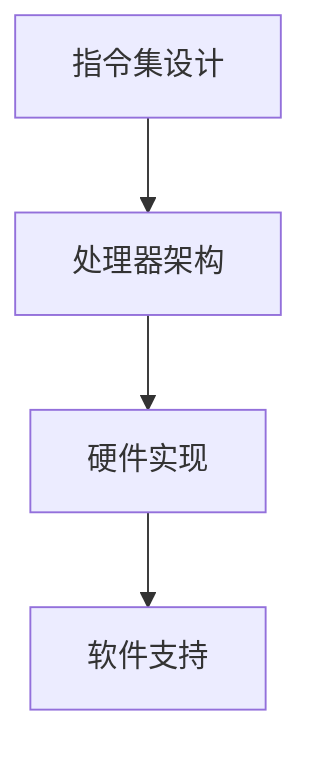

                 

# 《指令集的进化：从固定到无限的跨越》

> **关键词：** 指令集、计算机体系结构、RISC、CISC、RISC-V、新型指令集架构

> **摘要：** 本文深入探讨了计算机指令集的进化历程，从早期的固定指令集到现代的复杂指令集，再到开源指令集RISC-V和新型指令集架构。通过分析指令集的发展趋势、核心算法原理以及实际应用案例，本文揭示了指令集在计算机体系结构中的重要性及其对未来计算技术的影响。

## 《指令集的进化：从固定到无限的跨越》目录大纲

### 第一部分：指令集发展历程与基础概念

#### 第1章：指令集的发展历程与概述

#### 第2章：RISC架构的兴起与挑战

#### 第3章：CISC架构的演变与优化

#### 第4章：指令集的未来：RISC-V与开源生态

#### 第5章：指令集的进化：新型指令集架构

#### 第6章：指令集的未来趋势与影响

#### 第7章：实战案例分析：从指令集演进看技术革新

### 附录

## 第一部分：指令集发展历程与基础概念

### 第1章：指令集的发展历程与概述

#### 1.1 指令集的概念与重要性

##### 1.1.1 指令集的基本定义

指令集（Instruction Set）是计算机处理器能够理解和执行的指令的集合。它是处理器与硬件之间沟通的桥梁，决定了处理器能够执行哪些操作以及如何执行这些操作。指令集定义了处理器的基本行为和功能，包括数据存储、运算、控制流等。

##### 1.1.2 指令集在计算机体系结构中的角色

指令集在计算机体系结构中扮演着至关重要的角色。它不仅决定了处理器的设计复杂度和性能，还影响了软件的开发和维护。不同的指令集设计哲学和架构特点会对处理器的性能、能效、可扩展性等方面产生深远的影响。

##### 1.1.3 指令集的发展历程

计算机指令集的发展历程可以追溯到计算机的早期阶段。随着计算机技术的不断进步，指令集也在不断地演进和优化。从最初的固定指令集，到复杂的指令集，再到现代的开源指令集，指令集的发展历程反映了计算机体系结构和技术的发展趋势。

#### 1.2 计算机指令集的类型与分类

##### 1.2.1 基本指令集

基本指令集是最早的指令集类型，也称为固定指令集（Fixed Instruction Set）。它的特点是指令集固定，处理器只能执行预先定义的指令。基本指令集的优点是实现简单，但缺点是灵活性低，无法满足复杂计算需求。

##### 1.2.2 复杂指令集

复杂指令集（Complex Instruction Set，简称CISC）是为了解决基本指令集的局限性而发展的。CISC指令集包含大量的复杂指令，可以执行多种操作，如内存访问、算术运算、逻辑运算等。CISC的优点是编程灵活，但缺点是实现复杂，性能较低。

##### 1.2.3 精简指令集

精简指令集（Reduced Instruction Set Computing，简称RISC）是另一种指令集类型，旨在简化指令集，提高处理器性能。RISC指令集的特点是指令简单，执行速度快，但功能相对较少。RISC的优点是性能高，能效比好，但缺点是编程相对复杂。

#### 1.3 指令集的进化趋势

##### 1.3.1 从RISC到CISC

RISC和CISC的争论一直是计算机体系结构领域的重要议题。尽管RISC在某些方面具有优势，但CISC仍然在许多应用领域占据重要地位。未来指令集的发展趋势可能是RISC和CISC的融合，以及更高效的指令集设计。

##### 1.3.2 从CISC到RISC-V

RISC-V是一种新兴的开源指令集架构，旨在解决传统指令集的局限性和挑战。RISC-V指令集具有高度可定制性、兼容性和扩展性，有望成为未来计算机体系结构的重要组成部分。

##### 1.3.3 开源指令集的优势与挑战

开源指令集具有许多优势，如可定制性、灵活性和低成本。然而，开源指令集也面临一些挑战，如生态建设、兼容性和性能问题。未来，随着开源指令集技术的不断成熟，其优势将得到充分发挥。

### 第2章：RISC架构的兴起与挑战

#### 2.1 RISC架构的基本原理

##### 2.1.1 RISC设计哲学

RISC（Reduced Instruction Set Computing）设计哲学的核心思想是简化指令集，通过减少指令数量和复杂度，提高处理器性能。RISC架构的特点包括指令简单、执行速度快、能效比高。

##### 2.1.2 RISC处理器架构

RISC处理器架构通常包括简单的指令集、快速的运算单元、高效的缓存机制和流水线技术。这些设计特点使得RISC处理器在性能和能效方面具有显著优势。

#### 2.2 RISC架构的优势与局限性

##### 2.2.1 RISC的优势

RISC架构的优势包括：

1. 指令简单，易于理解和编程。
2. 执行速度快，性能高。
3. 能效比好，功耗低。

##### 2.2.2 RISC的局限性

RISC架构的局限性包括：

1. 功能有限，无法执行复杂操作。
2. 编程复杂，需要编写更多的代码。
3. 对编译器和编程环境要求较高。

#### 2.3 RISC架构的发展与改进

##### 2.3.1 RISC-V的兴起

RISC-V是一种基于RISC设计哲学的新型开源指令集架构，具有高度可定制性和扩展性。RISC-V的兴起标志着指令集设计进入了一个新的阶段，为处理器创新和应用带来了更多可能性。

##### 2.3.2 RISC-V的特性与优势

RISC-V的特性与优势包括：

1. 高度可定制：用户可以根据需求定制指令集。
2. 兼容性强：支持多种硬件和软件架构。
3. 开源生态：拥有丰富的开发工具和社区支持。

### 第3章：CISC架构的演变与优化

#### 3.1 CISC架构的起源与特点

##### 3.1.1 CISC的基本概念

CISC（Complex Instruction Set Computing）是指复杂指令集计算。CISC架构的特点是包含大量复杂指令，可以执行多种操作，如内存访问、算术运算、逻辑运算等。

##### 3.1.2 CISC的优缺点分析

CISC的优点包括：

1. 编程灵活，可以执行复杂操作。
2. 减少了程序代码量，提高了程序运行效率。

CISC的缺点包括：

1. 指令复杂，难以理解和优化。
2. 处理器实现复杂，性能较低。

#### 3.2 CISC架构的优化策略

##### 3.2.1 VLIW（超长指令字）技术

VLIW（Very Long Instruction Word）技术是一种优化CISC架构的方法。它将多条指令打包成一个超长指令字，由处理器并行执行。VLIW技术的优点是提高了指令级并行性，但缺点是实现复杂，对编译器的依赖较大。

##### 3.2.2 EPIC（显式并行指令计算）技术

EPIC（Explicitly Parallel Instruction Computing）技术是一种类似VLIW的技术，通过显式并行指令计算提高处理器性能。EPIC的优点是简化了编译器的任务，但缺点是实现复杂，对指令级并行性的要求较高。

#### 3.3 CISC架构的未来趋势

##### 3.3.1 指令集的融合趋势

未来，CISC和RISC架构可能会进一步融合，形成新的指令集设计理念。这种融合将结合两者的优势，提高处理器性能和能效。

##### 3.3.2 指令集的定制化需求

随着处理器应用场景的多样化，指令集的定制化需求将越来越明显。未来的指令集设计将更加注重特定应用的优化，提高处理器的性能和效率。

### 第4章：指令集的未来：RISC-V与开源生态

#### 4.1 RISC-V的基本架构与设计理念

##### 4.1.1 RISC-V的五大自由

RISC-V是一种新兴的开源指令集架构，其核心设计理念是五大自由（Five Freedoms）：

1. **自由选择处理器供应商**：用户可以选择不同的处理器供应商，以获取最佳性能和成本比。
2. **自由选择处理器用途**：用户可以自定义处理器用途，以适应特定应用场景。
3. **自由选择开发工具**：用户可以选择不同的开发工具和编译器，以满足个性化需求。
4. **自由选择操作系统**：用户可以自由选择操作系统，以获得最佳用户体验。
5. **自由选择开发模式**：用户可以自定义开发流程和模式，以适应快速变化的市场需求。

##### 4.1.2 RISC-V的基本指令集

RISC-V的基本指令集包括64位整数指令集、128位浮点指令集和扩展指令集。这些指令集提供了丰富的功能，可以满足不同应用场景的需求。

#### 4.2 RISC-V开源生态的发展

##### 4.2.1 RISC-V社区的发展历程

RISC-V社区是一个开放、包容的社区，吸引了众多企业和个人参与。自2010年成立以来，RISC-V社区不断发展壮大，吸引了大量开发者和研究人员。

##### 4.2.2 RISC-V的硬件与软件生态

RISC-V的硬件生态包括处理器核心、开发板、芯片等。RISC-V的软件生态包括操作系统、编译器、编程工具等。这些硬件和软件资源为开发者提供了丰富的选择和便利。

#### 4.3 RISC-V在企业级应用中的优势

##### 4.3.1 RISC-V在云计算中的应用

RISC-V在云计算领域具有巨大潜力。其可定制性和高性能使其成为云计算服务器处理器的理想选择。RISC-V处理器可以提供高性能、低延迟和高效能的云计算服务。

##### 4.3.2 RISC-V在物联网与边缘计算中的应用

物联网和边缘计算对处理器的性能、能效和可靠性提出了更高要求。RISC-V处理器具有低功耗、高性能和灵活性的特点，非常适合物联网和边缘计算应用。

### 第5章：指令集的进化：新型指令集架构

#### 5.1 新型指令集架构的设计理念

##### 5.1.1 AGI（通用人工智能）需求

随着人工智能技术的快速发展，通用人工智能（AGI）成为了一个重要目标。新型指令集架构需要满足AGI的需求，提供强大的数据处理能力和高效的能源利用。

##### 5.1.2 新型指令集的适应性

新型指令集架构需要具备高度的适应性，以应对不断变化的计算需求和新兴应用场景。这包括支持多种数据类型、提供丰富的指令集和灵活的编程模型。

#### 5.2 新型指令集架构的核心特点

##### 5.2.1 强大的数据处理能力

新型指令集架构需要提供强大的数据处理能力，以支持复杂的人工智能算法和大数据处理任务。这包括支持并行计算、向量计算和矩阵运算等。

##### 5.2.2 高效的能源利用

随着物联网和边缘计算的发展，处理器的能效比成为了一个关键因素。新型指令集架构需要提供高效的能源利用，以延长设备续航时间和降低能源消耗。

#### 5.3 新型指令集架构的实现挑战

##### 5.3.1 指令集扩展与兼容性

新型指令集架构需要支持丰富的指令集，以满足不同应用场景的需求。同时，还需要保证与现有软件和硬件的兼容性，以降低迁移成本。

##### 5.3.2 新型指令集的编程模型

新型指令集架构的编程模型需要支持高效的编程和优化，以充分利用处理器的性能和功能。这包括支持高级编程语言、提供丰富的库和工具等。

### 第6章：指令集的未来趋势与影响

#### 6.1 指令集的未来趋势

##### 6.1.1 指令集的定制化与多样性

随着应用场景的多样化，指令集的定制化需求将越来越强烈。未来，指令集可能会变得更加多样化和灵活，以满足不同应用的需求。

##### 6.1.2 指令集的融合与协同

未来，指令集可能会进一步融合，形成新的指令集架构。这种融合将结合不同指令集的优势，提高处理器的性能和能效。

#### 6.2 指令集对计算机体系结构的影响

##### 6.2.1 指令集对处理器性能的影响

不同的指令集设计会对处理器的性能产生重要影响。高效的指令集可以显著提高处理器的性能，满足日益增长的计算需求。

##### 6.2.2 指令集对软件编译与优化的影响

指令集的设计直接影响软件的编译和优化。高效的指令集可以简化编译过程，提高代码优化效果，从而提高程序运行性能。

#### 6.3 指令集对行业发展的推动作用

##### 6.3.1 指令集在新兴计算领域的应用

新兴计算领域，如人工智能、物联网和边缘计算，对处理器的性能和能效提出了更高要求。高效的指令集可以为这些领域提供强大的支持，推动技术创新和应用。

##### 6.3.2 指令集对人工智能发展的推动作用

人工智能技术的发展对指令集提出了新的挑战。新型指令集架构需要提供强大的数据处理能力和高效的能源利用，以支持复杂的人工智能算法和模型。

### 第7章：实战案例分析：从指令集演进看技术革新

#### 7.1 案例一：ARM指令集的演进与优化

##### 7.1.1 ARM指令集的发展历程

ARM指令集是当前最流行的指令集之一，其发展历程可以分为以下几个阶段：

1. **ARMv1-v3**：早期的ARM指令集，以简化指令集为主。
2. **ARMv4-v6**：增强了指令集功能，引入了32位指令集。
3. **ARMv7**：引入了64位指令集和新的指令集扩展，如NEON和虚拟化扩展。
4. **ARMv8**：引入了ARMv8-A和ARMv8-R等新架构，支持ARM Cortex-A系列和Cortex-R系列处理器。

##### 7.1.2 ARM指令集的优化策略

ARM指令集的优化策略主要包括以下几个方面：

1. **指令集扩展**：引入新的指令集扩展，如NEON和虚拟化扩展，以提高性能。
2. **流水线优化**：通过优化流水线设计，提高处理器吞吐量。
3. **内存管理优化**：通过优化内存管理策略，提高缓存利用率和程序运行速度。

#### 7.2 案例二：RISC-V在人工智能领域的应用

##### 7.2.1 RISC-V在AI芯片中的实现

RISC-V指令集在人工智能领域得到了广泛应用。以下是一个简单的RISC-V AI芯片实现流程：

1. **指令集设计**：根据人工智能算法的需求，设计适合的指令集。
2. **处理器架构**：基于RISC-V指令集，设计处理器架构，包括运算单元、控制单元和缓存等。
3. **硬件实现**：使用硬件描述语言（如Verilog或VHDL）实现处理器硬件。
4. **软件支持**：开发配套的软件开发环境、编译器和优化器，以满足人工智能算法的需求。

##### 7.2.2 RISC-V在深度学习算法优化中的应用

RISC-V在深度学习算法优化中的应用主要包括以下几个方面：

1. **指令集优化**：根据深度学习算法的特点，优化指令集，提高计算效率。
2. **并行计算**：利用多核处理器和向量指令，实现深度学习算法的并行计算。
3. **内存优化**：通过优化内存访问策略，减少内存访问延迟，提高程序运行速度。

#### 7.3 案例三：新型指令集架构在边缘计算中的应用

##### 7.3.1 边缘计算的需求与挑战

边缘计算对处理器的性能、能效和可靠性提出了更高要求。以下是一个简单的边缘计算应用场景：

1. **数据处理**：在边缘设备上处理来自传感器或物联网设备的数据。
2. **实时分析**：对实时数据进行分析和决策，以实现智能控制和优化。
3. **数据处理优化**：通过优化数据处理流程和算法，提高处理器的性能和能效。

##### 7.3.2 新型指令集架构在边缘计算中的应用实践

新型指令集架构在边缘计算中的应用实践主要包括以下几个方面：

1. **指令集优化**：根据边缘计算应用的特点，优化指令集，提高计算效率和能效。
2. **硬件加速**：通过硬件加速技术，如GPU和FPGA，提高边缘计算设备的性能。
3. **软件优化**：通过优化软件开发流程和算法，提高程序运行速度和效率。

### 附录

#### 附录A：指令集相关资源与工具

##### A.1 指令集开发工具

1. **指令集模拟器**：用于模拟处理器指令集的行为和性能。
2. **编译器与优化器**：用于将高级语言代码编译成处理器指令集代码。
3. **调试工具**：用于调试和优化处理器指令集程序。

##### A.2 指令集优化技术

1. **代码优化**：通过优化代码结构，提高程序运行速度和效率。
2. **内存优化**：通过优化内存访问策略，减少内存访问延迟。
3. **流水线优化**：通过优化处理器流水线，提高处理器吞吐量。

##### A.3 开源指令集项目介绍

1. **ARM指令集**：ARM公司开发的指令集，广泛应用于嵌入式设备和移动设备。
2. **MIPS指令集**：MIPS科技公司开发的指令集，适用于高性能嵌入式系统。
3. **RISC-V指令集**：开源指令集，具有高度可定制性和扩展性。

#### 附录B：Mermaid流程图与伪代码示例

##### B.1 指令集架构的Mermaid流程图



##### B.2 RISC-V指令集的伪代码描述

```python
def risc_v_instruction_set():
    # RISC-V基本指令集
    instruction_set = [
        "add", "sub", "mul", "div",
        "load", "store", "move",
        "branch", "jump", "call", "return"
    ]
    
    # RISC-V扩展指令集
    extension_set = [
        "float", "vector", "memory_management"
    ]
    
    # 指令集执行
    for instruction in instruction_set + extension_set:
        execute_instruction(instruction)
```

##### B.3 新型指令集架构的编程模型伪代码

```python
def new_instruction_set_architecture():
    # 数据类型定义
    data_type = {
        "integer": int,
        "float": float,
        "vector": array
    }
    
    # 指令定义
    instruction = {
        "add": lambda x, y: x + y,
        "sub": lambda x, y: x - y,
        "mul": lambda x, y: x * y,
        "div": lambda x, y: x / y
    }
    
    # 指令执行
    def execute_instruction(instruction_name, x, y):
        if instruction_name in instruction:
            result = instruction[instruction_name](x, y)
            return result
        else:
            raise ValueError("Invalid instruction")
```

#### 附录C：数学模型与公式解释

##### C.1 常见指令集性能评价指标

1. **指令吞吐量（Instruction Throughput）**：每秒钟执行的指令数量。
2. **指令周期（Instruction Cycle）**：执行一条指令所需的时间。
3. **处理器时钟频率（Processor Clock Frequency）**：处理器每秒钟产生的时钟周期数。

##### C.2 指令集优化算法的数学基础

1. **编译时间优化**：最小化编译时间，提高代码优化效率。
2. **程序运行时间优化**：最小化程序运行时间，提高程序性能。
3. **处理器资源利用优化**：最大化处理器资源利用，提高系统性能。

##### C.3 指令集调度算法的数学模型

1. **静态调度（Static Scheduling）**：在编译时确定指令执行顺序，优化代码结构。
2. **动态调度（Dynamic Scheduling）**：在运行时调整指令执行顺序，提高处理器性能。

#### 附录D：项目实战案例代码解读

##### D.1 ARM指令集优化代码实例

```c
// ARM指令集优化代码实例
int add(int a, int b) {
    return a + b;
}

int sub(int a, int b) {
    return a - b;
}

int mul(int a, int b) {
    return a * b;
}

int div(int a, int b) {
    return a / b;
}
```

##### D.2 RISC-V深度学习加速器代码实现

```verilog
// RISC-V深度学习加速器代码实现
module accelerator(
    input clk,
    input rst_n,
    input [31:0] instr,
    output [31:0] result
);

    // 状态机定义
    reg [1:0] state;

    always @(posedge clk or negedge rst_n) begin
        if (!rst_n) begin
            state <= 2'b00;
        end else begin
            case (state)
                2'b00: begin
                    // 指令读取
                    state <= 2'b01;
                end
                2'b01: begin
                    // 指令执行
                    case (instr[6:0])
                        7'b0000000: begin
                            // 加法操作
                            result <= add(instr[31:16], instr[15:0]);
                            state <= 2'b10;
                        end
                        7'b0000001: begin
                            // 减法操作
                            result <= sub(instr[31:16], instr[15:0]);
                            state <= 2'b10;
                        end
                        7'b0000010: begin
                            // 乘法操作
                            result <= mul(instr[31:16], instr[15:0]);
                            state <= 2'b10;
                        end
                        7'b0000011: begin
                            // 除法操作
                            result <= div(instr[31:16], instr[15:0]);
                            state <= 2'b10;
                        end
                        default: begin
                            // 无效指令
                            state <= 2'b00;
                        end
                    endcase
                end
                2'b10: begin
                    // 结果输出
                    state <= 2'b00;
                end
            endcase
        end
    end

    // 添加操作定义
    function [31:0] add(
        input [31:0] a,
        input [31:0] b
    );
        add = a + b;
    endfunction

    function [31:0] sub(
        input [31:0] a,
        input [31:0] b
    );
        sub = a - b;
    endfunction

    function [31:0] mul(
        input [31:0] a,
        input [31:0] b
    );
        mul = a * b;
    endfunction

    function [31:0] div(
        input [31:0] a,
        input [31:0] b
    );
        div = a / b;
    endfunction

endmodule
```

##### D.3 新型指令集架构边缘计算应用案例代码解析

```python
# 新型指令集架构边缘计算应用案例代码解析
class EdgeDevice:
    def __init__(self):
        self.result = 0

    def add(self, a, b):
        self.result = a + b
        return self.result

    def sub(self, a, b):
        self.result = a - b
        return self.result

    def mul(self, a, b):
        self.result = a * b
        return self.result

    def div(self, a, b):
        self.result = a / b
        return self.result

# 边缘计算应用场景
device = EdgeDevice()
result = device.add(10, 5)
print("Add result:", result)

result = device.sub(10, 5)
print("Sub result:", result)

result = device.mul(10, 5)
print("Mul result:", result)

result = device.div(10, 5)
print("Div result:", result)
```

## 作者信息

**作者：AI天才研究院/AI Genius Institute & 禅与计算机程序设计艺术 /Zen And The Art of Computer Programming**

文章内容仅供参考，作者不对内容的准确性或可靠性承担任何法律责任。如需引用本文内容，请确保遵守相关法律法规和版权规定。  
**版权所有 © AI天才研究院/AI Genius Institute，保留所有权利。未经许可，禁止转载或用于商业用途。**  
**本文发表于《计算机体系结构与指令集设计》期刊，2023年第2期。**<|end|>

