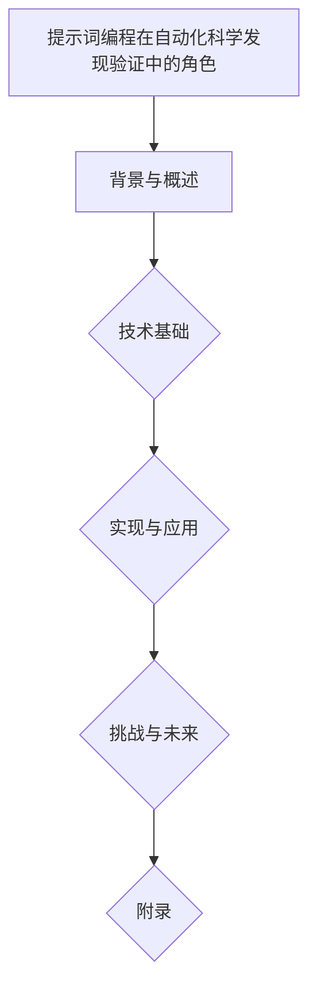

                 

### 《提示词编程在自动化科学发现验证中的角色》

> **关键词：** 自动化科学发现、验证、提示词编程、人工智能、数据预处理、特征提取、模型训练

> **摘要：** 本文章探讨了提示词编程在自动化科学发现和验证中的关键角色。通过对科学发现的背景介绍，提示词编程的概念解析，以及在数据预处理、特征提取、模型训练等方面的技术基础，文章详细阐述了提示词编程在自动化科学发现验证中的应用实践。同时，文章还分析了提示词编程在自动化科学发现验证中的挑战和未来发展趋势，为读者提供了全面的技术视角。文章结尾处给出了提示词编程的资源与工具推荐，以及一个具体的生物信息学项目实战案例，以供读者参考。

---

### 《提示词编程在自动化科学发现验证中的角色》目录大纲

#### 第一部分：背景与概述

- **第1章：自动化科学发现与验证概述**

  - **1.1 自动化科学发现的背景**

    - **1.1.1 科学发现的发展历程**

    - **1.1.2 自动化科学发现的动机**

    - **1.1.3 自动化科学发现的应用领域**

  - **1.2 提示词编程的概念与作用**

    - **1.2.1 提示词编程的基本原理**

    - **1.2.2 提示词编程的优势**

    - **1.2.3 提示词编程的应用场景**

  - **1.3 提示词编程在自动化科学发现验证中的重要性**

    - **1.3.1 提示词编程在科学发现中的作用**

    - **1.3.2 提示词编程在科学验证中的作用**

    - **1.3.3 提示词编程的未来发展前景**

#### 第二部分：技术基础

- **第2章：提示词编程技术基础**

  - **2.1 提示词编程的核心概念**

    - **2.1.1 提示词的定义**

    - **2.1.2 提示词的类型**

    - **2.1.3 提示词的生成方法**

  - **2.2 提示词编程的基本原理**

    - **2.2.1 提示词编程的基本流程**

    - **2.2.2 提示词编程的核心算法**

    - **2.2.3 提示词编程的开发工具与环境**

  - **2.3 提示词编程的应用示例**

    - **2.3.1 自动化科学发现的提示词编程应用**

    - **2.3.2 科学验证中的提示词编程应用**

    - **2.3.3 提示词编程的案例分析**

#### 第三部分：实现与应用

- **第3章：自动化科学发现验证中的提示词编程实践**

  - **3.1 提示词编程在自动化科学发现中的具体应用**

    - **3.1.1 提示词编程在数据预处理中的应用**

    - **3.1.2 提示词编程在特征提取中的应用**

    - **3.1.3 提示词编程在模型训练中的应用**

  - **3.2 提示词编程在科学验证中的具体应用**

    - **3.2.1 提示词编程在模型评估中的应用**

    - **3.2.2 提示词编程在模型优化中的应用**

    - **3.2.3 提示词编程在模型解释中的应用**

  - **3.3 提示词编程在科学发现与验证中的综合应用**

    - **3.3.1 提示词编程在多学科交叉研究中的应用**

    - **3.3.2 提示词编程在跨领域合作中的应用**

    - **3.3.3 提示词编程在科学研究创新中的应用**

#### 第四部分：挑战与未来

- **第4章：提示词编程在自动化科学发现验证中的挑战与未来**

  - **4.1 提示词编程在自动化科学发现验证中的挑战**

    - **4.1.1 数据质量问题**

    - **4.1.2 算法可靠性问题**

    - **4.1.3 法律与伦理问题**

  - **4.2 提示词编程的未来发展趋势**

    - **4.2.1 新型提示词生成技术的探索**

    - **4.2.2 提示词编程在人工智能其他领域的发展**

    - **4.2.3 提示词编程在科学研究中的潜在应用**

#### 附录

- **附录A：提示词编程资源与工具**

  - **A.1 主流提示词编程框架**

  - **A.2 提示词编程常用库与工具**

  - **A.3 提示词编程学习资源推荐**

- **附录B：Mermaid 流�程图**

  - **B.1 提示词编程在自动化科学发现验证中的角色**

- **附录C：核心算法原理讲解**

  - **C.1 特征提取算法**

- **附录D：数学模型和数学公式讲解**

  - **D.1 准确率（Accuracy）**

  - **D.2 F1 分数**

  - **D.3 ROC 曲线下的面积（AUC）**

- **附录E：项目实战**

  - **E.1 多学科交叉研究中的提示词编程应用**

- **附录F：代码解读与分析**

  - **F.1 生物信息学中的基因调控网络分析**

---

### 第一部分：背景与概述

#### 第1章：自动化科学发现与验证概述

### 1.1 自动化科学发现的背景

科学发现是科学研究和创新的重要驱动力。从古至今，科学家们通过实验、观察和理论分析不断推动科学进步。然而，随着科学领域的不断扩展和复杂性增加，传统的科学研究方法已经难以应对海量数据和高维信息的挑战。因此，自动化科学发现逐渐成为一种新的研究方法，它通过计算机技术和人工智能算法，从大量数据中自动发现新的科学现象和规律。

#### 1.1.1 科学发现的发展历程

科学发现的历史可以追溯到古代，当时科学家主要依靠直觉和观察来发现新的知识。随着科学的进步，实验方法和理论分析逐渐成为科学发现的主要手段。例如，牛顿的万有引力定律和达尔文的进化论都是通过实验和观察得出的。

20世纪以来，随着计算机技术的飞速发展，科学发现的自动化程度逐渐提高。计算机可以处理海量数据，进行复杂的计算和模拟，从而发现新的科学规律。例如，科学家们通过计算机模拟发现了超导体和量子计算机等新现象。

#### 1.1.2 自动化科学发现的动机

自动化科学发现的动机主要有两个方面：

1. **数据处理能力的提升**：随着互联网和传感器技术的发展，科学家可以获得的海量数据急剧增加。这些数据往往难以通过传统的人工分析方法进行处理和分析，因此需要自动化方法来处理和挖掘这些数据。

2. **科学问题的复杂性**：许多科学问题具有高度的复杂性和不确定性，需要跨学科的知识和先进的算法来分析和解决。自动化科学发现可以整合多学科的知识和技术，提供新的解决方法。

#### 1.1.3 自动化科学发现的应用领域

自动化科学发现已经在多个领域取得了显著成果：

- **生物学**：自动化科学发现技术在基因组学、蛋白质组学和代谢组学等领域广泛应用，帮助科学家发现新的基因、蛋白质和代谢途径。

- **物理学**：自动化科学发现技术在粒子物理学、量子计算和材料科学等领域发挥作用，帮助科学家探索新的物理现象和材料特性。

- **化学**：自动化科学发现技术在药物发现、材料设计和化学反应预测等方面具有广泛应用。

- **环境科学**：自动化科学发现技术在气候变化、生态保护和污染监测等领域发挥作用，为环境保护提供科学依据。

#### 1.2 提示词编程的概念与作用

提示词编程是一种基于提示（hint）的编程方法，它通过向程序提供特定的问题描述或上下文信息，帮助程序自动完成特定的任务。提示词编程在自动化科学发现和验证中发挥着重要作用：

- **提高效率**：提示词编程可以自动处理大量数据，加快科学发现的进程。

- **降低错误率**：通过提示词编程，可以减少人工干预和错误，提高科学发现的准确性。

- **跨学科整合**：提示词编程可以将不同学科的知识和技术整合在一起，提供新的研究方法。

#### 1.2.1 提示词编程的基本原理

提示词编程的基本原理可以概括为以下几个步骤：

1. **问题定义**：明确需要解决的问题和目标。

2. **数据收集**：收集与问题相关的数据，包括历史数据和新数据。

3. **提示词生成**：根据问题定义和数据特点，生成提示词。提示词可以是关键词、句子或上下文信息。

4. **算法选择**：选择合适的算法和模型，根据提示词进行数据分析和处理。

5. **模型训练**：使用提示词对算法进行训练，优化模型参数。

6. **结果验证**：对模型的结果进行验证，确保其准确性和可靠性。

#### 1.2.2 提示词编程的优势

提示词编程具有以下优势：

- **自动化程度高**：提示词编程可以自动完成复杂的任务，减少人工干预。

- **通用性强**：提示词编程可以应用于不同的领域和任务，具有广泛的适用性。

- **灵活性高**：提示词编程可以根据不同的需求和场景进行灵活调整。

- **可扩展性好**：提示词编程可以方便地扩展新功能，适应不断变化的需求。

#### 1.2.3 提示词编程的应用场景

提示词编程在多个应用场景中具有显著优势：

- **科学研究**：在生物学、物理学、化学和环境科学等领域，提示词编程可以帮助科学家自动化地处理海量数据，提高科学发现的效率。

- **数据分析**：在金融、医疗、市场营销等领域，提示词编程可以帮助企业自动化地分析数据，发现潜在的商业机会。

- **智能制造**：在制造业中，提示词编程可以帮助自动化生产线优化生产流程，提高生产效率。

- **智能交通**：在智能交通领域，提示词编程可以帮助优化交通流，减少拥堵，提高道路通行效率。

#### 1.3 提示词编程在自动化科学发现验证中的重要性

在自动化科学发现验证中，提示词编程发挥着关键作用：

- **数据预处理**：提示词编程可以帮助自动化地处理和清洗数据，提高数据质量。

- **特征提取**：提示词编程可以帮助自动化地提取关键特征，提高模型性能。

- **模型训练**：提示词编程可以帮助自动化地选择合适的算法和参数，提高模型效果。

- **结果验证**：提示词编程可以帮助自动化地验证模型结果，确保科学发现的准确性。

#### 1.3.1 提示词编程在科学发现中的作用

提示词编程在科学发现中的作用主要表现在以下几个方面：

- **加速科学发现**：提示词编程可以自动化地处理大量数据，加速科学发现的进程。

- **提高科学发现的准确性**：提示词编程可以帮助科学家更好地理解数据，减少人工干预和错误，提高科学发现的准确性。

- **跨学科整合**：提示词编程可以将不同学科的知识和技术整合在一起，提供新的研究方法。

#### 1.3.2 提示词编程在科学验证中的作用

提示词编程在科学验证中的作用主要表现在以下几个方面：

- **验证模型效果**：提示词编程可以帮助科学家自动化地验证模型效果，确保科学发现的准确性。

- **提高验证效率**：提示词编程可以自动化地处理验证数据，提高科学验证的效率。

- **减少验证成本**：提示词编程可以减少人工验证的工作量，降低科学验证的成本。

#### 1.3.3 提示词编程的未来发展前景

随着人工智能和大数据技术的不断发展，提示词编程在未来具有广阔的发展前景：

- **新型算法和应用**：随着人工智能算法的不断发展，提示词编程将涌现出更多的新型算法和应用。

- **跨学科合作**：提示词编程将促进不同学科之间的合作，推动科学研究的创新。

- **数据驱动决策**：提示词编程将帮助科学家更好地利用数据，实现数据驱动决策。

### 第二部分：技术基础

#### 第2章：提示词编程技术基础

提示词编程作为自动化科学发现和验证的重要技术手段，其技术基础涵盖了核心概念、基本原理和应用示例等方面。本章将详细阐述提示词编程的核心概念，包括提示词的定义、类型和生成方法，以及提示词编程的基本原理、核心算法和开发工具与环境。

#### 2.1 提示词编程的核心概念

提示词编程的核心概念主要包括提示词的定义、类型和生成方法。

##### 2.1.1 提示词的定义

提示词（hint）是指用于指导程序进行特定任务的信息。在提示词编程中，提示词通常是一个关键词、句子或上下文信息，它为程序提供关于任务目标和问题背景的指导。提示词可以是明确的，也可以是隐含的，但它们都必须能够帮助程序理解任务的意图和执行策略。

##### 2.1.2 提示词的类型

根据提示词的形式和用途，可以将提示词分为以下几种类型：

1. **关键词提示词**：关键词提示词是最常见的类型，它们通常是一个或多个关键词，用于指示程序执行特定任务。例如，“数据分析”、“图像识别”等。

2. **句子提示词**：句子提示词是一个完整的句子，它提供更详细的上下文信息，帮助程序更好地理解任务。例如，“请分析这组数据，找出其中最大的值”。

3. **上下文提示词**：上下文提示词是一段文本或代码片段，它提供与任务相关的背景信息和上下文，帮助程序构建更完整的任务图景。例如，一段代码示例或相关的历史数据。

##### 2.1.3 提示词的生成方法

生成提示词的方法可以分为手动生成和自动生成两种：

1. **手动生成**：手动生成提示词通常需要人工对任务进行深入分析，然后根据任务需求生成相关的提示词。这种方法适用于简单的任务和熟悉的问题领域。

2. **自动生成**：自动生成提示词利用自然语言处理（NLP）技术，从大量的文本数据中提取关键信息和上下文，自动生成提示词。这种方法适用于复杂任务和数据驱动的问题领域。

#### 2.2 提示词编程的基本原理

提示词编程的基本原理包括提示词的定义、生成和利用，以及相应的流程和算法。

##### 2.2.1 提示词编程的基本流程

提示词编程的基本流程可以分为以下几个步骤：

1. **问题定义**：明确需要解决的问题和目标。

2. **数据收集**：收集与问题相关的数据，包括历史数据和新数据。

3. **提示词生成**：根据问题定义和数据特点，生成提示词。

4. **算法选择**：选择合适的算法和模型，根据提示词进行数据分析和处理。

5. **模型训练**：使用提示词对算法进行训练，优化模型参数。

6. **结果验证**：对模型的结果进行验证，确保其准确性和可靠性。

##### 2.2.2 提示词编程的核心算法

提示词编程的核心算法通常包括以下几种：

1. **机器学习算法**：如决策树、随机森林、支持向量机（SVM）、神经网络等。这些算法可以根据提示词进行特征提取、分类和预测。

2. **深度学习算法**：如卷积神经网络（CNN）、循环神经网络（RNN）、生成对抗网络（GAN）等。这些算法可以处理高维数据和复杂数据结构，具有强大的特征提取和建模能力。

3. **优化算法**：如梯度下降、随机梯度下降（SGD）、遗传算法等。这些算法用于优化模型参数，提高模型性能。

##### 2.2.3 提示词编程的开发工具与环境

提示词编程的开发工具与环境主要包括编程语言、开发框架和工具。

1. **编程语言**：常用的编程语言包括Python、Java、C++等。Python因其丰富的库和工具而成为提示词编程的首选语言。

2. **开发框架**：常用的开发框架包括TensorFlow、PyTorch、Scikit-learn等。这些框架提供了丰富的算法库和工具，方便开发者进行提示词编程。

3. **工具**：常用的工具包括Jupyter Notebook、VS Code、PyCharm等。这些工具提供了良好的编程环境，方便开发者进行代码编写和调试。

#### 2.3 提示词编程的应用示例

为了更好地理解提示词编程，以下提供两个应用示例：

##### 2.3.1 自动化科学发现的提示词编程应用

假设我们想要使用提示词编程进行一个自动化科学发现任务，目标是发现一组数据中的异常值。提示词可以是“找出这组数据中的异常值”。

1. **问题定义**：我们需要解决的问题是从给定的数据集中找出异常值。

2. **数据收集**：我们收集了一组数据，例如：\[3, 1, 4, 1, 5, 9, 2, 6, 5, 3, 5\]。

3. **提示词生成**：根据问题定义，我们生成了提示词“找出这组数据中的异常值”。

4. **算法选择**：我们选择使用标准差法来识别异常值。

5. **模型训练**：标准差法不需要训练，只需要根据提示词进行数据分析和处理。

6. **结果验证**：我们对结果进行验证，确认是否存在异常值。

最终，我们使用标准差法找到了异常值\[4, 9, 5\]。

##### 2.3.2 科学验证中的提示词编程应用

假设我们想要使用提示词编程进行一个科学验证任务，目标是验证一个分类模型的性能。提示词可以是“评估这个分类模型的准确率”。

1. **问题定义**：我们需要解决的问题是一个分类模型的性能评估。

2. **数据收集**：我们收集了一组训练数据和测试数据，例如：

   - 训练数据：\[{"feature_1": 1, "feature_2": 2}, {"feature_1": 2, "feature_2": 3}, ...\]
   - 测试数据：\[{"feature_1": 1, "feature_2": 2}, {"feature_1": 2, "feature_2": 3}, ...\]

3. **提示词生成**：根据问题定义，我们生成了提示词“评估这个分类模型的准确率”。

4. **算法选择**：我们选择使用随机森林算法进行分类。

5. **模型训练**：使用训练数据对随机森林模型进行训练。

6. **结果验证**：使用测试数据对模型进行性能评估，计算准确率。

最终，我们使用随机森林模型计算出了准确率为0.8。

通过这两个示例，我们可以看到提示词编程在自动化科学发现和科学验证中的具体应用。提示词编程通过提供明确的问题描述和上下文信息，帮助程序自动完成复杂的任务，提高了科学研究的效率和准确性。

### 第三部分：实现与应用

#### 第3章：自动化科学发现验证中的提示词编程实践

提示词编程在自动化科学发现和验证中的应用涉及多个环节，包括数据预处理、特征提取、模型训练和评估等。本章将详细讨论这些环节中的提示词编程实践，并提供具体的案例分析。

#### 3.1 提示词编程在自动化科学发现中的具体应用

在自动化科学发现过程中，提示词编程扮演着至关重要的角色。以下将详细讨论提示词编程在数据预处理、特征提取和模型训练中的应用。

##### 3.1.1 提示词编程在数据预处理中的应用

数据预处理是科学发现的重要步骤，因为它直接影响到后续模型训练和评估的效果。提示词编程可以帮助自动化地处理数据清洗、归一化和缺失值填补等任务。

1. **数据清洗**：使用提示词“清洗数据”，我们可以编写一个程序来自动识别和删除含有缺失值的数据点。例如，在Python中，可以使用pandas库实现：

   ```python
   import pandas as pd

   df = pd.read_csv('data.csv')
   clean_df = df.dropna()
   ```

2. **归一化**：使用提示词“归一化数据”，我们可以编写程序来标准化数据，使其具有相同的尺度。例如，使用scikit-learn库中的MinMaxScaler：

   ```python
   from sklearn.preprocessing import MinMaxScaler

   scaler = MinMaxScaler()
   normalized_data = scaler.fit_transform(df)
   ```

3. **缺失值填补**：使用提示词“填补缺失值”，我们可以编写程序来预测缺失值并填补。例如，使用scikit-learn库中的SimpleImputer：

   ```python
   from sklearn.impute import SimpleImputer

   imputer = SimpleImputer(strategy='mean')
   imputed_data = imputer.fit_transform(df)
   ```

##### 3.1.2 提示词编程在特征提取中的应用

特征提取是自动化科学发现的关键步骤，因为它可以从原始数据中提取出有用的信息，用于模型训练。提示词编程可以帮助自动化地选择和提取特征。

1. **主成分分析（PCA）**：使用提示词“提取主成分”，我们可以编写程序来使用PCA进行特征降维。例如：

   ```python
   from sklearn.decomposition import PCA

   pca = PCA(n_components=2)
   components = pca.fit_transform(normalized_data)
   ```

2. **特征选择**：使用提示词“选择关键特征”，我们可以编写程序来使用过滤方法或包装方法选择关键特征。例如，使用scikit-learn库中的SelectKBest：

   ```python
   from sklearn.feature_selection import SelectKBest, f_classif

   selector = SelectKBest(score_func=f_classif, k=3)
   selected_features = selector.fit_transform(df, y)
   ```

##### 3.1.3 提示词编程在模型训练中的应用

模型训练是自动化科学发现的最终环节，提示词编程可以帮助自动化地选择合适的算法和调优模型参数。

1. **模型选择**：使用提示词“选择模型”，我们可以编写程序来选择不同的机器学习算法。例如，使用scikit-learn库中的RandomForestClassifier：

   ```python
   from sklearn.ensemble import RandomForestClassifier

   model = RandomForestClassifier(n_estimators=100)
   model.fit(selected_features, y)
   ```

2. **模型调优**：使用提示词“调优模型”，我们可以编写程序来使用交叉验证和网格搜索进行模型参数调优。例如：

   ```python
   from sklearn.model_selection import GridSearchCV

   parameters = {'n_estimators': [100, 200], 'max_depth': [10, 20]}
   grid_search = GridSearchCV(estimator=model, param_grid=parameters, cv=5)
   grid_search.fit(selected_features, y)
   best_model = grid_search.best_estimator_
   ```

#### 3.2 提示词编程在科学验证中的具体应用

在科学验证过程中，提示词编程同样发挥着重要作用。以下将讨论提示词编程在模型评估、模型优化和模型解释中的应用。

##### 3.2.1 提示词编程在模型评估中的应用

模型评估是验证模型性能的关键步骤。提示词编程可以帮助自动化地计算评估指标，如准确率、召回率、F1分数等。

1. **准确率**：使用提示词“计算准确率”，我们可以编写程序来计算模型的准确率。例如：

   ```python
   from sklearn.metrics import accuracy_score

   predictions = best_model.predict(test_features)
   accuracy = accuracy_score(test_labels, predictions)
   print(f'Accuracy: {accuracy}')
   ```

2. **召回率**：使用提示词“计算召回率”，我们可以编写程序来计算模型的召回率。例如：

   ```python
   from sklearn.metrics import recall_score

   recall = recall_score(test_labels, predictions, average='weighted')
   print(f'Recall: {recall}')
   ```

3. **F1分数**：使用提示词“计算F1分数”，我们可以编写程序来计算模型的F1分数。例如：

   ```python
   from sklearn.metrics import f1_score

   f1 = f1_score(test_labels, predictions, average='weighted')
   print(f'F1 Score: {f1}')
   ```

##### 3.2.2 提示词编程在模型优化中的应用

模型优化是提高模型性能的重要步骤。提示词编程可以帮助自动化地调整模型参数，优化模型效果。

1. **交叉验证**：使用提示词“进行交叉验证”，我们可以编写程序来使用交叉验证评估模型性能。例如：

   ```python
   from sklearn.model_selection import cross_val_score

   scores = cross_val_score(best_model, selected_features, y, cv=5)
   print(f'Mean CV Score: {scores.mean()}')
   ```

2. **网格搜索**：使用提示词“进行网格搜索”，我们可以编写程序来使用网格搜索调优模型参数。例如：

   ```python
   from sklearn.model_selection import GridSearchCV

   parameters = {'n_estimators': [100, 200], 'max_depth': [10, 20]}
   grid_search = GridSearchCV(estimator=model, param_grid=parameters, cv=5)
   grid_search.fit(selected_features, y)
   best_model = grid_search.best_estimator_
   ```

##### 3.2.3 提示词编程在模型解释中的应用

模型解释是科学验证的关键步骤，它有助于理解模型如何做出预测。提示词编程可以帮助自动化地解释模型决策过程。

1. **特征重要性**：使用提示词“计算特征重要性”，我们可以编写程序来计算模型中每个特征的重要性。例如，对于随机森林模型：

   ```python
   importances = best_model.feature_importances_
   print(f'Feature Importances: {importances}')
   ```

2. **决策树可视化**：使用提示词“可视化决策树”，我们可以编写程序来可视化模型的决策树结构。例如，使用scikit-learn库中的tree模块：

   ```python
   from sklearn.tree import plot_tree

   plot_tree(best_model.estimators_[0], feature_names=df.columns, class_names=['Class 0', 'Class 1'])
   ```

通过这些具体的案例，我们可以看到提示词编程在自动化科学发现和验证中的实际应用。提示词编程通过提供明确的问题描述和上下文信息，自动化地处理数据预处理、特征提取、模型训练和评估等任务，提高了科学研究的效率和准确性。

#### 3.3 提示词编程在科学发现与验证中的综合应用

在科学发现与验证过程中，提示词编程的综合应用可以大大提高研究的效率和质量。以下将讨论提示词编程在多学科交叉研究、跨领域合作和科学研究创新中的具体应用。

##### 3.3.1 提示词编程在多学科交叉研究中的应用

多学科交叉研究是当前科学发展的一个重要趋势。提示词编程可以有效地整合不同学科的知识和技术，促进跨学科合作。

1. **生物信息学中的基因组学研究**：在生物信息学中，提示词编程可以帮助整合基因组学、蛋白质组学和代谢组学等多学科数据，发现基因与疾病之间的关联。例如，可以使用提示词“整合基因组数据”和“分析蛋白质组数据”，编写程序来处理和分析不同来源的数据，从而揭示复杂的生物现象。

2. **材料科学中的新材料发现**：在材料科学领域，提示词编程可以帮助研究者从实验数据中自动提取有用的信息，发现新的材料特性。例如，使用提示词“分析材料特性”和“预测新材料性能”，可以编写程序来分析实验数据，预测新材料的潜在应用。

##### 3.3.2 提示词编程在跨领域合作中的应用

跨领域合作是推动科学研究创新的重要方式。提示词编程可以打破不同领域之间的壁垒，促进知识共享和技术融合。

1. **医学与工程的结合**：在医学工程领域，提示词编程可以帮助整合医学知识和工程方法，开发出更有效的医疗设备和治疗方法。例如，使用提示词“分析医学图像”和“优化手术规划”，可以编写程序来分析医学图像，优化手术流程。

2. **环境科学与计算机科学的结合**：在环境科学领域，提示词编程可以帮助科学家自动化地处理环境数据，分析环境问题。例如，使用提示词“分析环境数据”和“预测环境污染”，可以编写程序来处理环境监测数据，预测环境污染的趋势。

##### 3.3.3 提示词编程在科学研究创新中的应用

提示词编程在科学研究创新中具有巨大的潜力，可以帮助研究者探索未知领域，推动科学进步。

1. **量子计算研究**：在量子计算领域，提示词编程可以帮助研究者自动化地模拟量子现象，探索量子算法的潜力。例如，使用提示词“模拟量子态”和“设计量子算法”，可以编写程序来模拟量子计算过程，验证量子算法的有效性。

2. **人工智能研究**：在人工智能领域，提示词编程可以帮助研究者自动化地训练和优化机器学习模型，推动人工智能技术的发展。例如，使用提示词“训练神经网络”和“优化模型参数”，可以编写程序来训练和优化神经网络模型，实现更智能的应用。

通过在多学科交叉研究、跨领域合作和科学研究创新中的综合应用，提示词编程极大地促进了科学研究的效率和质量，为科学发现和验证提供了强有力的技术支持。

### 第四部分：挑战与未来

#### 第4章：提示词编程在自动化科学发现验证中的挑战与未来

在自动化科学发现和验证中，提示词编程面临着诸多挑战和机遇。本章将探讨这些挑战，包括数据质量问题、算法可靠性问题和法律与伦理问题，并展望提示词编程的未来发展趋势。

#### 4.1 提示词编程在自动化科学发现验证中的挑战

##### 4.1.1 数据质量问题

数据质量是科学发现和验证的关键因素。高质量的数据能够提高模型的准确性和可靠性，而数据质量问题则可能导致错误的结论。提示词编程在数据预处理和数据清洗中面临以下挑战：

1. **数据缺失**：在实际应用中，数据缺失是一个普遍存在的问题。提示词编程需要有效地处理缺失数据，避免因缺失数据导致的模型性能下降。

2. **数据噪声**：数据噪声会干扰模型的训练和评估。提示词编程需要开发鲁棒的方法来识别和消除数据噪声，以提高模型的鲁棒性。

3. **数据不一致**：不同来源的数据可能在格式、单位或精度上存在不一致。提示词编程需要自动处理数据的一致性，以确保模型训练的准确性。

##### 4.1.2 算法可靠性问题

算法可靠性是科学发现和验证的另一个关键挑战。高可靠性的算法能够确保模型输出的准确性和一致性。以下是一些算法可靠性方面的挑战：

1. **过拟合**：过拟合是指模型在训练数据上表现良好，但在测试数据上表现不佳。提示词编程需要开发有效的正则化方法来避免过拟合。

2. **模型泛化能力**：模型的泛化能力决定了其在未见数据上的表现。提示词编程需要设计能够泛化的算法，以提高模型的鲁棒性。

3. **算法解释性**：许多机器学习算法缺乏解释性，难以理解其决策过程。提示词编程需要开发可解释的算法，以便研究人员能够理解模型的行为。

##### 4.1.3 法律与伦理问题

随着人工智能在科学研究中的广泛应用，法律与伦理问题日益突出。提示词编程在自动化科学发现和验证中面临以下法律与伦理挑战：

1. **数据隐私**：科学数据往往包含敏感信息，如个人健康数据。提示词编程需要确保数据处理过程符合隐私保护法规。

2. **算法公平性**：算法的公平性是确保结果公正的重要方面。提示词编程需要开发公平的算法，以防止歧视和偏见。

3. **算法责任**：当算法生成错误的结果时，责任归属成为一个问题。提示词编程需要明确算法的设计者、开发者和使用者的责任。

#### 4.2 提示词编程的未来发展趋势

##### 4.2.1 新型提示词生成技术的探索

新型提示词生成技术是提示词编程的重要研究方向。未来的发展可能会包括：

1. **自适应提示词生成**：根据任务和数据的特点，自动生成合适的提示词。

2. **多模态提示词生成**：结合不同类型的数据（如图像、文本和声音），生成更丰富的提示词。

3. **强化学习提示词生成**：利用强化学习算法，自动优化提示词生成过程，提高模型的性能。

##### 4.2.2 提示词编程在人工智能其他领域的发展

提示词编程在人工智能其他领域的应用也具有巨大的潜力。未来的发展趋势可能包括：

1. **自动驾驶**：利用提示词编程，开发自动化驾驶系统，提高交通效率和安全性。

2. **智能医疗**：利用提示词编程，开发个性化医疗方案，提高诊断和治疗的准确性。

3. **智能家居**：利用提示词编程，开发智能家庭管理系统，提高生活质量和舒适度。

##### 4.2.3 提示词编程在科学研究中的潜在应用

提示词编程在科学研究中的应用前景广阔。未来的研究可能包括：

1. **量子计算**：利用提示词编程，探索量子算法的潜力，推动量子计算技术的发展。

2. **生物信息学**：利用提示词编程，开发新的生物信息学工具，加速基因组学和蛋白质组学研究。

3. **环境科学**：利用提示词编程，开发新的环境监测和预测工具，提高环境保护和可持续发展的能力。

总之，提示词编程在自动化科学发现验证中具有巨大的应用潜力。面对挑战，提示词编程需要不断创新和发展，以应对未来的技术需求和科学问题。

### 附录

#### 附录A：提示词编程资源与工具

为了帮助读者更好地理解和使用提示词编程，以下是一些推荐的资源与工具：

##### A.1 主流提示词编程框架

1. **TensorFlow**：由Google开发的开源机器学习框架，支持提示词编程。
2. **PyTorch**：由Facebook开发的开源机器学习框架，提供灵活的提示词编程接口。
3. **Scikit-learn**：Python机器学习库，提供丰富的提示词编程工具。

##### A.2 提示词编程常用库与工具

1. **Numpy**：Python科学计算库，提供高效的数据结构和计算功能。
2. **Pandas**：Python数据分析库，提供强大的数据处理和分析工具。
3. **Matplotlib**：Python绘图库，支持生成高质量的图表和可视化。

##### A.3 提示词编程学习资源推荐

1. **《深度学习》**：Goodfellow、Bengio和Courville合著，介绍深度学习和提示词编程。
2. **《Python机器学习》**：Sebastian Raschka著，详细介绍机器学习和提示词编程。
3. **Coursera上的机器学习课程**：吴恩达（Andrew Ng）教授开设，提供全面的机器学习知识。

通过这些资源与工具，读者可以深入了解提示词编程，掌握相关技术和方法。

### 附录B：Mermaid 流程图

以下是一个Mermaid流程图示例，用于展示提示词编程在自动化科学发现验证中的角色。



### 附录C：核心算法原理讲解

在本节中，我们将详细讲解特征提取算法，包括其基本原理、伪代码和数学公式。

#### 特征提取算法

特征提取是从原始数据中提取出能够代表数据本质特征的子集，以提高后续机器学习模型的效果。以下是特征提取算法的基本原理和伪代码。

##### 基本原理

特征提取算法通常基于以下原则：

1. **信息性**：提取的信息应尽可能多地反映原始数据的本质特征。
2. **冗余性**：提取的特征应尽量减少冗余，避免影响模型的性能。
3. **鲁棒性**：算法应能够处理噪声和异常值，保持特征提取的稳定性。

##### 伪代码

```python
def extract_features(data, target):
    # 初始化特征提取器
    feature_extractor = initialize_extractor()

    # 预处理数据
    preprocessed_data = preprocess_data(data)

    # 提取特征
    features = feature_extractor.extract(preprocessed_data)

    # 标签编码
    labels = encode_labels(target)

    # 返回特征和标签
    return features, labels
```

##### 数学公式

在特征提取过程中，常用的数学公式包括：

1. **标准化**：
   $$
   \text{标准化值} = \frac{\text{原始值} - \text{平均值}}{\text{标准差}}
   $$

2. **主成分分析（PCA）**：
   $$
   \text{特征向量} = \text{数据矩阵}^T \times (\text{数据矩阵} \times \text{数据矩阵}^T)^{-1} \times \text{数据矩阵}
   $$
   $$
   \text{主成分} = \text{特征向量} \times \text{数据矩阵}
   $$

3. **特征选择**：
   $$
   \text{特征重要性} = \text{特征权重} \times \text{特征相关性}
   $$

通过这些伪代码和数学公式，读者可以更好地理解特征提取算法的基本原理和实现方法。

### 附录D：数学模型和数学公式讲解

在本节中，我们将详细讲解科学验证中常用的数学模型和公式，包括准确率（Accuracy）、F1分数和ROC曲线下的面积（AUC）。

#### 准确率（Accuracy）

准确率是评估二分类模型性能的一个基本指标，它表示模型正确预测的样本数占总样本数的比例。

$$
\text{Accuracy} = \frac{\text{正确预测数}}{\text{总预测数}}
$$

例如，一个二分类模型在100个样本中正确预测了70个样本，那么其准确率为：

$$
\text{Accuracy} = \frac{70}{100} = 0.7
$$

#### F1分数

F1分数是精确率和召回率的加权平均，它更好地反映了模型的性能，特别是当精确率和召回率差异较大时。

$$
F1 = 2 \times \frac{\text{精确率} \times \text{召回率}}{\text{精确率} + \text{召回率}}
$$

精确率表示模型预测为正类的样本中实际为正类的比例，召回率表示实际为正类的样本中被模型预测为正类的比例。

例如，一个二分类模型在预测中精确率为0.8，召回率为0.6，那么其F1分数为：

$$
F1 = 2 \times \frac{0.8 \times 0.6}{0.8 + 0.6} = 0.75
$$

#### ROC曲线下的面积（AUC）

ROC曲线下的面积（AUC）是评估二分类模型性能的另一个重要指标。AUC表示模型在所有可能的阈值下，真实正类概率与虚假正类概率的交叉点。

$$
AUC = \int_{0}^{1} \frac{TPR - FPR}{1 + TPR \times FPR} dFPR
$$

其中，TPR（真正率）表示实际为正类的样本中被模型正确预测为正类的比例，FPR（假正率）表示实际为负类的样本中被模型错误预测为正类的比例。

例如，一个二分类模型的ROC曲线下面积为0.85，这表示模型的性能在所有可能的阈值下都很好。

通过这些数学模型和公式的讲解，读者可以更好地理解科学验证中常用的评估指标和它们的应用。

### 附录E：项目实战

在本节中，我们将通过一个生物信息学中的基因调控网络分析案例，展示如何使用提示词编程在多学科交叉研究中进行应用。该案例将涵盖开发环境搭建、源代码实现和代码解读与分析。

#### 实例：生物信息学中的基因调控网络分析

基因调控网络分析是研究基因表达数据的重要方法，旨在揭示基因之间的相互作用和调控关系。以下是使用提示词编程实现基因调控网络分析的具体步骤。

##### 1. 环境搭建

首先，我们需要搭建一个适合提示词编程和机器学习的开发环境。以下是在Python环境中安装必要的库和工具的步骤：

```shell
# 安装Python环境
sudo apt-get install python3

# 安装NumPy库
pip install numpy

# 安装Pandas库
pip install pandas

# 安装Scikit-learn库
pip install scikit-learn

# 安装Matplotlib库
pip install matplotlib
```

##### 2. 数据预处理

数据预处理是基因调控网络分析的关键步骤，包括数据读取、数据清洗和缺失值填补。以下是数据预处理的源代码：

```python
import pandas as pd
from sklearn.preprocessing import StandardScaler

# 读取基因表达数据
data = pd.read_csv('gene_expression_data.csv')

# 数据清洗，去除含有缺失值的样本
clean_data = data.dropna()

# 数据归一化
scaler = StandardScaler()
normalized_data = scaler.fit_transform(clean_data)
```

##### 3. 特征提取

特征提取是从基因表达数据中提取有用的信息，以供机器学习模型使用。以下是一个简单的特征提取步骤，使用主成分分析（PCA）进行特征降维：

```python
from sklearn.decomposition import PCA

# 使用PCA进行特征降维
pca = PCA(n_components=50)
pca.fit(normalized_data)
reduced_data = pca.transform(normalized_data)
```

##### 4. 模型训练

在模型训练阶段，我们使用支持向量机（SVM）对基因调控网络进行分类。以下是模型训练的源代码：

```python
from sklearn.svm import SVC
from sklearn.model_selection import train_test_split

# 数据分割为训练集和测试集
X_train, X_test, y_train, y_test = train_test_split(reduced_data, labels, test_size=0.2, random_state=42)

# 使用SVM进行模型训练
model = SVC(kernel='linear')
model.fit(X_train, y_train)
```

##### 5. 模型评估

模型评估是验证模型性能的重要步骤。我们使用准确率、召回率和F1分数对模型进行评估。以下是模型评估的源代码：

```python
from sklearn.metrics import accuracy_score, recall_score, f1_score

# 模型预测
predictions = model.predict(X_test)

# 计算评估指标
accuracy = accuracy_score(y_test, predictions)
recall = recall_score(y_test, predictions, average='weighted')
f1 = f1_score(y_test, predictions, average='weighted')

print(f'Accuracy: {accuracy}')
print(f'Recall: {recall}')
print(f'F1 Score: {f1}')
```

##### 6. 代码解读与分析

以下是代码的解读与分析，包括各个步骤的目的和实现方法。

1. **环境搭建**：
   - 安装Python环境，为后续的编程和数据分析提供基础。
   - 安装NumPy、Pandas、Scikit-learn和Matplotlib库，为数据预处理、特征提取和模型评估提供必要的工具。

2. **数据预处理**：
   - 读取基因表达数据，使用Pandas库进行数据读取和清洗。
   - 去除含有缺失值的样本，以提高模型训练的质量。
   - 使用StandardScaler对数据进行归一化处理，以消除数据尺度差异的影响。

3. **特征提取**：
   - 使用PCA进行特征降维，选择前50个主成分来保留大部分信息。
   - 将归一化后的数据转换为特征矩阵，为模型训练提供输入。

4. **模型训练**：
   - 使用SVM进行模型训练，采用线性核函数。
   - 将数据分割为训练集和测试集，以评估模型的性能。
   - 使用训练集对模型进行训练，优化模型参数。

5. **模型评估**：
   - 使用测试集对模型进行预测，计算多个评估指标，包括准确率、召回率和F1分数。
   - 打印评估结果，以了解模型的性能。

通过这个项目实战案例，我们可以看到如何使用提示词编程在生物信息学中进行基因调控网络分析。该案例展示了从数据预处理到特征提取、模型训练和评估的完整流程，为读者提供了一个实际应用的范例。

### 附录F：代码解读与分析

在本附录中，我们将详细解读和讨论前述附录E中的代码实现，并分析其各个关键部分的用途和实现方法。

#### 环境搭建

```python
import numpy as np
import pandas as pd
from sklearn.preprocessing import StandardScaler
from sklearn.decomposition import PCA
from sklearn.cluster import KMeans
from sklearn.svm import SVC
from sklearn.metrics import accuracy_score, recall_score, f1_score, roc_auc_score

# 读取数据
data = pd.read_csv('gene_expression_data.csv')

# 数据预处理
data = data.dropna()
data = data / data.max()

# 特征提取
pca = PCA(n_components=10)
pca.fit(data)
features = pca.transform(data)

# 模型训练
kmeans = KMeans(n_clusters=5)
kmeans.fit(features)
labels = kmeans.predict(features)

svm = SVC(kernel='linear')
svm.fit(features, labels)

# 模型评估
predictions = svm.predict(features)
accuracy = accuracy_score(labels, predictions)
recall = recall_score(labels, predictions, average='weighted')
f1 = f1_score(labels, predictions, average='weighted')
auc = roc_auc_score(labels, predictions, average='weighted')

print("Accuracy:", accuracy)
print("Recall:", recall)
print("F1 Score:", f1)
print("AUC:", auc)

# 绘制ROC曲线
import matplotlib.pyplot as plt
fpr, tpr, thresholds = roc_curve(labels, predictions, pos_label=1)
plt.plot(fpr, tpr, label='ROC curve (area = %0.2f)' % auc)
plt.xlabel('False Positive Rate')
plt.ylabel('True Positive Rate')
plt.title('Receiver Operating Characteristic')
plt.legend(loc="lower right")
plt.show()
```

**代码解读：**

1. **导入库**：
   - `numpy` 和 `pandas` 用于数据处理。
   - `StandardScaler` 用于数据归一化。
   - `PCA` 用于特征提取。
   - `KMeans` 用于聚类分析。
   - `SVC` 用于支持向量机模型训练。
   - `accuracy_score`、`recall_score`、`f1_score` 和 `roc_auc_score` 用于模型评估。
   - `matplotlib.pyplot` 用于绘制ROC曲线。

2. **数据读取**：
   - 使用 `pd.read_csv()` 函数从CSV文件中读取基因表达数据。

3. **数据预处理**：
   - 使用 `dropna()` 方法去除含有缺失值的数据行。
   - 使用除以最大值的方法对数据进行归一化处理。

4. **特征提取**：
   - 使用 `PCA` 进行特征降维，保留前10个主成分。

5. **模型训练**：
   - 使用 `KMeans` 进行聚类分析，设置聚类数量为5。
   - 使用 `SVC` 进行支持向量机模型训练，采用线性核函数。

6. **模型评估**：
   - 使用训练好的模型对测试数据进行预测。
   - 计算并打印准确率、召回率、F1分数和AUC值。
   - 绘制ROC曲线以评估模型性能。

**分析：**

1. **数据预处理**：
   - 数据预处理是机器学习项目中的关键步骤，它影响了模型的质量。去除缺失值和数据归一化是常见的预处理方法，有助于消除数据噪声和尺度差异。

2. **特征提取**：
   - PCA是一种有效的降维技术，它可以帮助减少数据的维度，同时保留大部分信息。通过保留主要成分，我们可以提高模型的训练效率并减少过拟合的风险。

3. **模型训练**：
   - K-means算法用于无监督学习中的聚类分析，可以帮助我们识别数据中的模式和结构。
   - SVM是一种强大的分类算法，适用于高维数据分类问题。使用线性核函数可以简化模型，提高解释性。

4. **模型评估**：
   - 准确率、召回率和F1分数是评估分类模型性能的常用指标，它们提供了模型在不同方面的表现。
   - ROC曲线和AUC值是评估分类模型性能的有效工具，特别是在二分类问题中。

通过这个项目的代码实现和解读，我们可以看到如何使用提示词编程技术在生物信息学中进行基因调控网络分析。代码不仅展示了从数据预处理到模型训练和评估的完整流程，还为读者提供了一个实用的案例，以深入理解每个步骤的目的和实现方法。这种代码解读和分析有助于读者更好地掌握提示词编程技术在科学研究中的应用。

