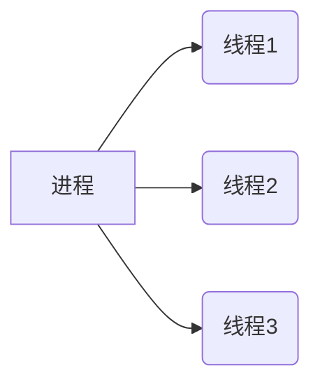
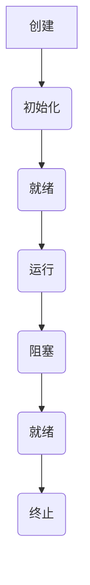

                 

# 《提高系统吞吐量的线程管理》

## 关键词

- 系统吞吐量
- 线程管理
- 线程池
- 并发编程
- 锁优化
- 分布式系统

## 摘要

在现代计算机系统中，提高系统的吞吐量是一个关键性能指标。本文将深入探讨线程管理在提高系统吞吐量方面的作用，从线程的基本概念、实现方式、同步和通信机制，到线程管理策略、并发编程模型、锁优化、线程安全问题、多线程编程实战和实际应用等多个方面，为读者提供全面的技术指导。通过本文的阅读，读者将能够理解线程管理的基本原理，掌握提高系统吞吐量的有效策略，并在实际项目中应用这些策略，以实现高性能和高并发的系统设计。

## 《提高系统吞吐量的线程管理》目录大纲

### 第一部分：线程管理基础

#### 第1章：线程基本概念与原理
##### 1.1 线程的定义与作用
##### 1.2 线程与进程的关系
##### 1.3 线程的生命周期
##### 1.4 线程的状态变迁
##### 1.5 线程的基本概念联系（Mermaid流程图）

#### 第2章：线程的实现方式
##### 2.1 用户级线程与内核级线程
##### 2.2 线程的实现模型
##### 2.3 线程的创建与销毁
##### 2.4 线程的调度策略
##### 2.5 线程的实现方式联系（Mermaid流程图）

#### 第3章：线程的同步机制
##### 3.1 互斥锁（Mutex）
##### 3.2 信号量（Semaphore）
##### 3.3 条件变量（Condition Variable）
##### 3.4 管程（Monitor）
##### 3.5 线程同步机制原理讲解与伪代码

#### 第4章：线程的通信机制
##### 4.1 线程间通信的基本方式
##### 4.2 管道（Pipe）
##### 4.3 命名管道（Named Pipe）
##### 4.4 消息队列（Message Queue）
##### 4.5 线程通信机制原理讲解与伪代码

### 第二部分：提高系统吞吐量的线程管理策略

#### 第5章：线程池机制
##### 5.1 线程池的概念与作用
##### 5.2 线程池的组成与工作流程
##### 5.3 线程池的实现策略
##### 5.4 线程池的性能优化
##### 5.5 线程池机制原理讲解与伪代码

#### 第6章：并发编程模型
##### 6.1 并发编程的基本概念
##### 6.2 并发编程的风险与挑战
##### 6.3 并发编程的模型
##### 6.4 并发编程的最佳实践
##### 6.5 并发编程模型讲解与伪代码

#### 第7章：锁优化与性能分析
##### 7.1 锁的基本原理
##### 7.2 锁的性能影响
##### 7.3 锁的优化策略
##### 7.4 锁的性能分析工具
##### 7.5 锁优化与性能分析讲解与伪代码

#### 第8章：线程安全问题与防护
##### 8.1 线程安全问题概述
##### 8.2 数据竞争与死锁
##### 8.3 线程安全防护技术
##### 8.4 线程安全的编程实践
##### 8.5 线程安全问题讲解与伪代码

#### 第9章：多线程编程实战
##### 9.1 实战项目简介
##### 9.2 系统需求分析
##### 9.3 系统架构设计
##### 9.4 代码实现与性能调优
##### 9.5 多线程编程实战讲解与代码解读

#### 第10章：线程管理在实际项目中的应用
##### 10.1 项目背景与目标
##### 10.2 项目架构与设计
##### 10.3 线程管理策略
##### 10.4 项目性能评估与优化
##### 10.5 线程管理实际应用讲解与案例

### 第三部分：线程管理的高级话题

#### 第11章：线程在分布式系统中的应用
##### 11.1 分布式系统的基本概念
##### 11.2 线程在分布式系统中的作用
##### 11.3 分布式线程管理策略
##### 11.4 分布式线程通信机制
##### 11.5 分布式线程应用讲解与伪代码

#### 第12章：高性能计算与并行处理
##### 12.1 高性能计算的基本概念
##### 12.2 并行处理的技术与策略
##### 12.3 线程在并行处理中的应用
##### 12.4 并行编程实践
##### 12.5 高性能计算与并行处理讲解与伪代码

#### 第13章：未来展望与趋势
##### 13.1 线程管理的发展趋势
##### 13.2 新型线程管理技术
##### 13.3 线程管理在未来的应用场景
##### 13.4 线程管理研究的方向
##### 13.5 未来展望与趋势讲解与伪代码

## 附录

### 附录A：线程管理常用工具与库
##### A.1 Java中的线程管理工具
##### A.2 C++中的线程管理库
##### A.3 Python中的线程管理库
##### A.4 其他编程语言中的线程管理工具

### 附录B：线程管理相关参考文献
##### B.1 线程管理的基础知识
##### B.2 线程池与并发编程
##### B.3 高性能计算与并行处理
##### B.4 分布式系统与线程管理

### 附录C：线程管理练习与案例
##### C.1 基础练习
##### C.2 中级练习
##### C.3 高级练习
##### C.4 综合案例与项目实战

### 引言

在现代计算机系统中，线程管理是一个核心且复杂的主题。随着多核处理器的普及和并行计算的需求增加，如何高效地管理和利用线程资源，已经成为提高系统吞吐量的关键。系统吞吐量是指单位时间内系统能够处理的任务数量，它是衡量系统性能的重要指标。线程管理在提高系统吞吐量方面起着至关重要的作用，合理的设计和高效的线程管理策略可以显著提升系统的处理能力。

本文旨在为读者提供关于线程管理在提高系统吞吐量方面的全面指导。首先，我们将从线程的基本概念、实现方式、同步和通信机制等方面入手，介绍线程管理的基础知识。接着，我们将探讨线程池机制、并发编程模型、锁优化、线程安全问题等策略，以便读者能够掌握提高系统吞吐量的实用方法。此外，本文还将通过实际项目和案例分析，展示如何在实际开发中应用这些策略。最后，本文将讨论线程管理在分布式系统和并行处理中的应用，以及未来线程管理的发展趋势和研究方向。

通过本文的阅读，读者将能够：

- 理解线程管理的基本原理和概念。
- 掌握线程的实现方式和同步通信机制。
- 学会设计和实现高效的线程池机制。
- 理解并发编程的风险与挑战，掌握最佳实践。
- 学习锁优化和性能分析的方法。
- 了解线程安全问题，掌握防护技术。
- 获得实际项目中的线程管理经验。
- 探索线程管理在分布式系统和并行处理中的应用。
- 了解线程管理技术的发展趋势和未来研究方向。

### 第一部分：线程管理基础

#### 第1章：线程基本概念与原理

线程是操作系统能够进行运算调度的最小单位。它被包含在进程之中，是进程中的实际运作单位。线程与进程之间的关系是：一个进程可以包含多个线程，它们共享进程的资源，如内存空间、文件句柄等。线程的引入使得并发执行成为可能，提高了系统的并行处理能力。

##### 1.1 线程的定义与作用

线程可以被视为执行任务的一个轻量级执行单元。与进程相比，线程的创建、切换和撤销开销较小。线程的定义通常包括以下几个方面：

- **线程ID**：用于标识线程的唯一性。
- **寄存器集合**：包括程序计数器、堆栈指针等，用于线程的执行状态。
- **线程的堆栈**：用于存储线程的局部变量和中间结果。
- **线程的属性**：包括优先级、可执行状态等。

线程的主要作用包括：

- **并行执行**：多线程可以同时执行不同的任务，提高系统处理能力。
- **资源共享**：线程可以共享进程的资源，如文件句柄、内存等。
- **响应性**：通过多线程，可以使得系统在执行某些耗时任务时，仍然保持对其他任务的响应。

##### 1.2 线程与进程的关系

线程与进程的关系可以概括为以下几点：

- **层次关系**：线程是进程的一部分，一个进程可以包含多个线程。
- **资源关系**：线程共享进程的资源，如内存、文件句柄等。
- **独立性**：线程具有独立执行的能力，可以在进程内部并行执行任务。
- **生命周期**：线程的生命周期一般从创建到终止，而进程的生命周期更长。

进程与线程的关系示意图如下：



##### 1.3 线程的生命周期

线程的生命周期包括以下几个阶段：

- **创建**：线程被创建后，进入初始化阶段。在这一阶段，线程的属性和寄存器被初始化。
- **就绪**：线程被创建后，如果系统资源充足，线程进入就绪队列，等待CPU调度。
- **运行**：线程获得CPU时间，开始执行其任务。一个进程中的多个线程可以在多个CPU核心上并行执行。
- **阻塞**：线程由于某些原因（如等待资源、I/O操作）无法继续执行，进入阻塞状态。线程将等待条件满足后，重新进入就绪状态。
- **终止**：线程完成任务或由于某些异常原因（如异常抛出）被终止。

线程的生命周期状态变迁图如下：



##### 1.4 线程的状态变迁

线程的状态变迁包括以下几个方面：

- **创建到就绪**：线程创建后，如果系统资源充足，可以直接进入就绪状态。
- **就绪到运行**：线程从就绪状态被调度，进入运行状态。在多核处理器上，多个线程可以并行执行。
- **运行到阻塞**：线程在执行过程中，可能因为等待资源或其他原因进入阻塞状态。线程将等待条件满足后，重新进入就绪状态。
- **阻塞到就绪**：线程在等待条件满足后，可以从阻塞状态重新进入就绪状态，等待CPU调度。
- **运行到终止**：线程完成任务或由于异常原因被终止，进入终止状态。线程的资源和寄存器将被回收。

线程状态变迁的伪代码如下：

```c
class Thread {
    void create() {
        // 初始化线程属性和寄存器
    }
    
    void start() {
        // 将线程放入就绪队列
    }
    
    void run() {
        // 执行线程任务
    }
    
    void block() {
        // 线程等待资源或其他条件
    }
    
    void unblock() {
        // 线程条件满足，从阻塞状态进入就绪状态
    }
    
    void terminate() {
        // 终止线程，回收资源和寄存器
    }
}
```

通过以上对线程基本概念与原理的介绍，我们可以了解到线程在提高系统吞吐量方面的重要性。线程的引入使得进程可以并行执行多个任务，提高了系统的处理能力和响应性。在接下来的章节中，我们将继续探讨线程的实现方式、同步和通信机制等方面的内容。

### 第2章：线程的实现方式

线程的实现方式可以分为用户级线程（User-Level Threads）和内核级线程（Kernel-Level Threads）。这两种实现方式在性能、资源管理和调度策略等方面有所不同。本节将介绍用户级线程和内核级线程的基本概念、实现模型、创建与销毁方法以及调度策略。

##### 2.1 用户级线程与内核级线程

用户级线程（User-Level Threads）和内核级线程（Kernel-Level Threads）的主要区别在于线程的实现位置和调度管理。

- **用户级线程**：由用户级库（User-Level Library）管理，线程的创建、调度和同步等操作都在用户空间进行。用户级线程的优点是开销较小，线程切换速度快。但是，用户级线程的调度依赖于应用程序的控制，操作系统无法直接管理和调度用户级线程。

- **内核级线程**：由操作系统内核管理，线程的创建、调度和同步等操作都在内核空间进行。内核级线程的优点是能够充分利用操作系统的调度策略和资源管理功能，但线程切换和上下文切换的开销较大。

##### 2.2 线程的实现模型

线程的实现模型包括用户级线程模型和内核级线程模型。

- **用户级线程模型**：线程的调度和管理由用户级库完成，线程的上下文切换、同步和通信都在用户空间进行。用户级线程模型通常采用“一对一”映射（One-to-One Mapping）或“许多对一”映射（Many-to-One Mapping）。

  - **一对一映射**：每个用户级线程对应一个内核级线程。线程的调度和管理由用户级库完成，操作系统仅负责内核级线程的调度。这种实现方式在性能上优于“许多对一”映射，但线程数量受到内核级线程数量的限制。
  
  - **许多对一映射**：多个用户级线程映射到一个内核级线程。线程的调度和管理由用户级库完成，操作系统仅负责内核级线程的调度。这种实现方式在线程数量较多时具有优势，但性能可能受到限制。

- **内核级线程模型**：线程的创建、调度和同步等操作由操作系统内核完成。线程的上下文切换、同步和通信都在内核空间进行。内核级线程模型通常采用“一对一”映射或“许多对许多”映射（Many-to-Many Mapping）。

  - **一对一映射**：每个用户级线程对应一个内核级线程。线程的调度和管理由操作系统内核完成，操作系统负责内核级线程的调度。这种实现方式在性能上较为均衡，但线程数量受到内核级线程数量的限制。

  - **许多对许多映射**：多个用户级线程映射到多个内核级线程。线程的调度和管理由操作系统内核和用户级库共同完成，操作系统负责内核级线程的调度，用户级库负责用户级线程的调度。这种实现方式具有较高的灵活性和性能。

##### 2.3 线程的创建与销毁

线程的创建与销毁是线程管理的重要环节。

- **用户级线程的创建与销毁**：

  - 创建：用户级线程的创建通常由用户级库提供接口。用户级库负责为新线程分配资源，如线程ID、寄存器集合和堆栈等。创建后的线程进入就绪状态，等待CPU调度。
  
  - 销毁：用户级线程的销毁由用户级库管理。在销毁线程时，用户级库会回收线程所占用的资源，如堆栈和寄存器等。

- **内核级线程的创建与销毁**：

  - 创建：内核级线程的创建由操作系统内核提供接口。内核在创建线程时，会为其分配唯一的线程ID、程序计数器、堆栈等资源。创建后的线程进入就绪状态，等待CPU调度。
  
  - 销毁：内核级线程的销毁由操作系统内核管理。在销毁线程时，内核会回收线程所占用的资源，如线程ID、程序计数器和堆栈等。

##### 2.4 线程的调度策略

线程的调度策略决定了线程的执行顺序和执行时间。常见的线程调度策略包括：

- **先来先服务（FCFS）**：按照线程到达的顺序进行调度，先到达的线程先执行。这种调度策略简单，但可能导致线程的响应时间较长。

- **时间片轮转（Round Robin）**：每个线程分配一个时间片，轮流执行。当线程的时间片用完后，线程被切换到就绪队列的末尾，等待下一次调度。这种调度策略公平，但可能导致线程的响应时间较长。

- **优先级调度**：根据线程的优先级进行调度，优先级高的线程先执行。线程的优先级可以是静态的，也可以是动态的。这种调度策略可以更好地满足实时系统的需求，但可能导致低优先级线程长时间得不到执行。

- **多级反馈队列调度**：将线程分为多个优先级队列，优先级高的线程在较高优先级队列中执行，优先级低的线程在较低优先级队列中执行。当较高优先级队列的线程执行完毕后，线程会降级到较低优先级队列。这种调度策略兼顾了公平性和实时性。

线程调度策略的伪代码如下：

```c
class Scheduler {
    void schedule(Thread* thread) {
        // 根据调度策略选择下一个执行的线程
    }
    
    void contextSwitch(Thread* currentThread, Thread* nextThread) {
        // 切换线程上下文，实现线程的切换
    }
}
```

通过以上对线程的实现方式的介绍，我们可以了解到用户级线程和内核级线程的区别及其调度策略。合理选择线程的实现方式和调度策略，可以优化系统的性能和吞吐量。在接下来的章节中，我们将继续探讨线程的同步和通信机制，以及提高系统吞吐量的具体策略。

### 第3章：线程的同步机制

线程同步机制是确保多线程环境下数据一致性和避免并发问题的关键。在本章中，我们将详细介绍线程的同步机制，包括互斥锁（Mutex）、信号量（Semaphore）、条件变量（Condition Variable）和管程（Monitor）。

##### 3.1 互斥锁（Mutex）

互斥锁（Mutex）是一种最简单的同步机制，用于保护共享资源，防止多个线程同时访问。当一个线程持有互斥锁时，其他线程必须等待该锁被释放后才能获取。

- **基本概念**：互斥锁是一种互斥访问控制机制，保证在某一时刻只有一个线程能够访问共享资源。
- **使用方式**：线程在访问共享资源前需要获取互斥锁，访问完成后释放锁。
- **伪代码**：

```c
Mutex myMutex;

void function() {
    myMutex.lock();
    // 访问共享资源
    myMutex.unlock();
}
```

##### 3.2 信号量（Semaphore）

信号量是一种更高级的同步机制，用于控制多个线程对共享资源的访问。信号量可以表示资源的数量，通过信号量的值来控制线程的同步。

- **基本概念**：信号量是一种整数变量，用于表示共享资源的可用数量。线程可以通过`P`（等待）和`V`（信号）操作来修改信号量的值。
- **使用方式**：线程在访问共享资源前需要执行`P`操作，如果信号量的值为0，线程将阻塞等待；线程在访问完成后执行`V`操作，释放等待线程。
- **伪代码**：

```c
Semaphore semaphore = 1;

void function() {
    semaphore.P();
    // 访问共享资源
    semaphore.V();
}
```

##### 3.3 条件变量（Condition Variable）

条件变量是一种用于线程间通信的同步机制，允许线程在某个条件不满足时等待，直到条件满足后再继续执行。

- **基本概念**：条件变量与互斥锁配合使用，线程在进入等待状态时需要释放互斥锁，等待条件变量；条件变量满足时，线程将被唤醒并重新获取互斥锁。
- **使用方式**：线程在进入等待状态时调用`wait`方法，线程在条件变量满足时调用`signal`或`broadcast`方法唤醒等待线程。
- **伪代码**：

```c
Mutex myMutex;
ConditionVariable myCondition;

void function() {
    myMutex.lock();
    while (条件不满足) {
        myCondition.wait(myMutex);
    }
    // 条件满足，继续执行
    myMutex.unlock();
}

void otherFunction() {
    myMutex.lock();
    // 更新条件
    myCondition.signal();
    myMutex.unlock();
}
```

##### 3.4 管程（Monitor）

管程是一种高层次的结构化同步机制，用于保护共享资源和方法，确保多线程环境的正确性和高效性。

- **基本概念**：管程是一个封装了共享资源和方法的数据结构，线程通过管程的入口点访问共享资源和方法。管程内部使用互斥锁和条件变量来管理线程的同步。
- **使用方式**：线程通过调用管程中的方法来访问共享资源，管程内部自动进行同步处理。
- **伪代码**：

```c
Monitor MyMonitor {
    Mutex myMutex;
    ConditionVariable myCondition;

    void method() {
        myMutex.lock();
        // 访问共享资源
        myMutex.unlock();
    }

    void waitCondition() {
        myMutex.lock();
        myCondition.wait();
        myMutex.unlock();
    }

    void signalCondition() {
        myMutex.lock();
        myCondition.signal();
        myMutex.unlock();
    }
}

void function() {
    MyMonitor.method();
    MyMonitor.waitCondition();
}
```

通过以上对线程同步机制的介绍，我们可以看到互斥锁、信号量、条件变量和管程在多线程同步中的作用。合理使用这些同步机制，可以确保多线程环境下数据的一致性和避免并发问题。在接下来的章节中，我们将继续探讨线程的通信机制，以及如何通过线程管理提高系统吞吐量。

### 第4章：线程的通信机制

线程的通信机制是确保多线程之间能够有效协调和共享数据的关键。在本章中，我们将介绍线程间通信的基本方式，包括管道（Pipe）、命名管道（Named Pipe）和消息队列（Message Queue）。

##### 4.1 线程间通信的基本方式

线程间通信的基本方式包括直接通信和间接通信。

- **直接通信**：线程通过共享内存直接进行通信。这种方式需要线程共享同一块内存区域，并通过读写操作实现数据交换。直接通信的优点是数据传输速度快，但缺点是线程间的同步和协调复杂，容易出现死锁和数据不一致问题。

- **间接通信**：线程通过通信机制进行通信，这些通信机制包括管道、命名管道和消息队列等。间接通信的优点是简化了线程间的同步和协调，减少了直接共享内存的需求，但缺点是数据传输速度相对较慢。

##### 4.2 管道（Pipe）

管道是一种简单的线程间通信机制，用于实现一个线程向另一个线程传递数据。管道是一个先进先出（FIFO）的数据结构，可以被视为一个数据缓冲区。

- **基本概念**：管道是一个半双工的通信机制，一个线程（发送者）将数据写入管道，另一个线程（接收者）从管道中读取数据。
- **使用方式**：管道通常由操作系统提供，线程可以通过标准输入输出（如`fork`和`exec`系统调用）创建和操作管道。

- **伪代码**：

```c
int pipe(int pipefd[2]);

void sender() {
    int fd[2];
    pipe(fd);
    write(fd[1], "Hello, World!", 12);
    close(fd[1]);
}

void receiver() {
    int fd[2];
    pipe(fd);
    char buffer[12];
    read(fd[0], buffer, 12);
    printf("Received: %s\n", buffer);
    close(fd[0]);
}
```

##### 4.3 命名管道（Named Pipe）

命名管道是一种具有名字的管道，可以看作是命名文件。命名管道可以在不同进程之间进行通信，具有更好的可重用性和稳定性。

- **基本概念**：命名管道通过文件系统进行管理，可以看作是一个特殊的文件。线程可以通过打开和关闭命名管道文件进行通信。
- **使用方式**：命名管道通常使用`mkfifo`系统调用创建，线程可以通过标准文件操作（如`open`、`read`和`write`）进行通信。

- **伪代码**：

```c
int mkfifo(const char *path, mode_t mode);

void sender() {
    int fd = open("fifo", O_WRONLY);
    write(fd, "Hello, World!", 12);
    close(fd);
}

void receiver() {
    int fd = open("fifo", O_RDONLY);
    char buffer[12];
    read(fd, buffer, 12);
    printf("Received: %s\n", buffer);
    close(fd);
}
```

##### 4.4 消息队列（Message Queue）

消息队列是一种高效的多线程通信机制，可以看作是一个先进先出的消息缓冲区。消息队列支持多种数据格式和传输方式，线程可以通过发送和接收消息进行通信。

- **基本概念**：消息队列是一个由操作系统管理的队列，用于存储发送线程的消息，接收线程可以从队列中读取消息。
- **使用方式**：线程可以通过系统调用（如`msgget`、`msgsend`和`msgrcv`）创建和管理消息队列。

- **伪代码**：

```c
key_t msgget(key_t key, int msgflg);
int msgsnd(msgid_t msgid, const msgp

