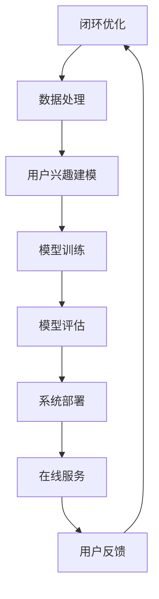

                 


# 《搜索引擎的个性化：根据用户兴趣定制结果》

> **关键词：**搜索引擎、个性化、用户兴趣、定制结果、算法、系统架构、性能优化、案例分析、未来发展

> **摘要：**本文深入探讨了搜索引擎个性化技术，从基本原理、用户兴趣建模、个性化搜索算法到系统架构和性能优化，全面解析了如何根据用户兴趣定制搜索结果。通过案例分析，展示了实际应用中的成功经验，并对个性化搜索技术的未来发展方向进行了展望。

## 目录大纲

# 《搜索引擎的个性化：根据用户兴趣定制结果》

## 第一部分：搜索引擎与个性化技术基础

### 第1章：搜索引擎的基本原理

### 第2章：个性化技术概述

### 第3章：用户兴趣建模

### 第4章：个性化搜索算法

## 第二部分：搜索引擎个性化技术实施

### 第5章：搜索引擎个性化系统架构

### 第6章：个性化搜索系统开发

### 第7章：个性化搜索系统性能优化

## 第三部分：搜索引擎个性化技术应用案例分析

### 第8章：搜索引擎个性化技术研究动态

### 第9章：搜索引擎个性化技术未来展望

### 附录

## 第1章：搜索引擎的基本原理

### 1.1 搜索引擎的工作流程

### 1.1.1 索引构建

搜索引擎的索引构建是搜索引擎能够快速响应用户查询的关键步骤。其基本原理是通过分析网页的内容、结构以及链接关系，构建出一个有序的索引数据结构，以便在查询时能够快速定位到相关的网页。

- **关键步骤：**
  1. **数据采集：** 使用网络爬虫技术获取互联网上的网页数据。
  2. **数据清洗：** 去除重复、无效的网页数据，对网页内容进行预处理。
  3. **关键词提取：** 从网页内容中提取关键词，建立关键词与网页的映射关系。
  4. **索引构建：** 将关键词和对应的网页数据存储在索引数据库中，并建立高效的查询索引。

**Mermaid 流程图：**
```
graph TD
A[数据采集] --> B[数据清洗]
B --> C[关键词提取]
C --> D[索引构建]
D --> E[查询索引]
```

### 1.1.2 检索算法

检索算法是搜索引擎的核心组成部分，其目的是在索引数据库中找到与用户查询最相关的网页。现代搜索引擎采用的检索算法通常是基于统计模型和信息检索原理。

- **基本检索算法：**
  - **布尔检索：** 使用布尔运算符（如AND、OR、NOT）对关键词进行组合查询。
  - **向量空间模型：** 将网页和查询表示为高维向量，通过计算向量之间的余弦相似度来评估相关性。
  - **PageRank：** 通过网页之间的链接关系计算网页的重要性，用于排序。

**Mermaid 流程图：**
```
graph TB
A[用户查询] --> B[查询处理]
B --> C[索引搜索]
C --> D[相关网页]
D --> E[排序算法]
E --> F[结果返回]
```

### 1.1.3 排序算法

排序算法用于对检索到的网页进行排序，以提供用户最相关的搜索结果。常见的排序算法包括：

- **基于相关性的排序：** 根据网页与查询的相关性进行排序，如向量空间模型中的余弦相似度排序。
- **基于流行度的排序：** 根据网页的访问量、链接数等因素进行排序，如PageRank排序。
- **混合排序：** 结合多种排序依据，以提供更全面的排序结果。

**Mermaid 流�程图：**
```
graph TB
A[检索结果] --> B[相关性排序]
B --> C[流行度排序]
C --> D[混合排序]
D --> E[排序结果]
```

### 1.2 个性化技术概述

个性化技术是现代搜索引擎的重要功能，其目的是根据用户的兴趣、行为和需求，为用户提供定制化的搜索结果。

- **定义与作用：**
  - **定义：** 个性化技术是指通过分析用户的历史行为和偏好，为用户提供个性化内容和服务的技术。
  - **作用：** 提高搜索结果的准确性和用户体验，增强用户满意度。

- **发展历程：**
  - **早期个性化推荐：** 基于用户的历史点击行为进行简单推荐。
  - **社会化搜索：** 结合用户社交网络信息进行个性化搜索。
  - **深度学习与个性化：** 利用深度学习技术进行用户兴趣建模和个性化搜索。

**Mermaid 流程图：**
```
graph TB
A[早期个性化] --> B[社会化搜索]
B --> C[深度学习个性化]
```

### 第2章：个性化技术概述

### 2.1 个性化技术的定义与作用

**定义：** 个性化技术是一种通过分析用户行为、兴趣和需求，为用户提供定制化内容和服务的技术。

**作用：**
- 提高搜索结果的准确性和相关性。
- 增强用户体验和用户满意度。
- 提升搜索引擎的市场竞争力。

**Mermaid 流程图：**
```
graph TB
A[定义] --> B[作用]
B --> C[提高准确性]
B --> D[增强体验]
B --> E[提升竞争力]
```

### 2.2 个性化推荐系统的发展历程

**早期个性化推荐：**
- **基于内容的推荐：** 根据用户已浏览或收藏的内容进行推荐。
- **协同过滤推荐：** 根据用户与他人的行为相似度进行推荐。

**社会化搜索：**
- **基于社交网络：** 结合用户社交网络信息进行个性化搜索和推荐。

**深度学习与个性化：**
- **用户行为建模：** 利用深度学习技术分析用户行为，构建用户兴趣模型。
- **深度学习推荐算法：** 利用深度神经网络进行个性化推荐。

**Mermaid 流程图：**
```
graph TB
A[早期个性化] --> B[内容推荐]
A --> C[协同过滤]
B --> D[社会化搜索]
B --> E[深度学习]
```

### 第3章：用户兴趣建模

### 3.1 用户兴趣数据采集

用户兴趣数据采集是构建用户兴趣模型的基础，其目的是通过多种渠道收集用户的行为数据、偏好信息和社交网络数据。

- **用户行为数据分析：**
  - **浏览历史：** 用户浏览的网页、点击的链接、搜索的关键词等。
  - **购买历史：** 用户购买的商品、支付金额、购买频率等。

- **社交网络数据利用：**
  - **社交媒体：** 用户发布的帖子、评论、点赞等。
  - **好友关系：** 用户的好友列表、互动频率等。

- **用户标签与属性构建：**
  - **标签分类：** 根据用户行为和偏好为用户打上标签。
  - **属性构建：** 构建用户的年龄、性别、职业等属性。

**Mermaid 流流程图：**
```
graph TB
A[用户行为数据] --> B[浏览历史]
A --> C[购买历史]
B --> D[社交网络数据]
B --> E[用户标签与属性]
```

### 3.2 用户兴趣表示方法

用户兴趣表示是将用户的行为数据和属性转化为可计算和建模的形式，以便进行后续的推荐和排序。

- **基于内容的兴趣表示：**
  - **文本表示：** 使用词袋模型、TF-IDF等方法对用户行为数据进行文本表示。
  - **特征提取：** 提取与用户兴趣相关的关键词、标签等特征。

- **基于协同过滤的兴趣表示：**
  - **用户-物品矩阵：** 构建用户-物品矩阵，通过矩阵分解等方法提取用户兴趣特征。
  - **基于模型的表示：** 使用协同过滤算法（如矩阵分解、KNN等）建模用户兴趣。

- **基于深度学习的兴趣表示：**
  - **序列模型：** 使用RNN、LSTM等模型对用户行为序列进行建模。
  - **图神经网络：** 使用图神经网络（如GCN、GAT等）建模用户兴趣网络。

**Mermaid 流流程图：**
```
graph TB
A[基于内容] --> B[文本表示]
A --> C[特征提取]
B --> D[协同过滤]
D --> E[矩阵分解]
D --> F[基于模型]
E --> G[RNN]
F --> H[LSTM]
G --> I[图神经网络]
```

### 第4章：个性化搜索算法

### 4.1 个性化检索策略

个性化检索策略是指根据用户兴趣和行为，调整检索过程的参数和方法，以提高搜索结果的个性化程度。

- **基于用户行为的检索：**
  - **历史查询：** 根据用户过去的查询记录进行检索。
  - **行为预测：** 利用机器学习算法预测用户的潜在兴趣，进行检索。

- **基于用户兴趣的检索：**
  - **兴趣建模：** 构建用户兴趣模型，用于调整检索结果。
  - **兴趣引导：** 根据用户兴趣引导检索过程，优化检索结果。

- **基于上下文的检索：**
  - **上下文感知：** 结合用户当前的环境、位置、时间等信息进行检索。
  - **上下文调整：** 调整检索算法，适应不同的上下文环境。

**Mermaid 流流程图：**
```
graph TB
A[基于用户行为] --> B[历史查询]
A --> C[行为预测]
B --> D[基于用户兴趣]
D --> E[兴趣建模]
D --> F[兴趣引导]
E --> G[基于上下文]
G --> H[上下文感知]
G --> I[上下文调整]
```

### 4.2 个性化排序算法

个性化排序算法是搜索引擎个性化技术的重要组成部分，其目的是根据用户兴趣和行为，对检索结果进行排序，以提供更符合用户需求的搜索结果。

- **个性化评分模型：**
  - **相关性评分：** 根据网页与查询的相关性进行评分。
  - **用户兴趣评分：** 根据用户兴趣模型为网页进行评分。

- **实时排序算法：**
  - **基于实时数据的排序：** 利用实时数据（如用户点击、浏览行为）调整排序结果。
  - **在线学习排序：** 利用在线学习算法（如Adaboost、Gradient Boosting等）动态调整排序策略。

- **冷启动问题：**
  - **定义：** 指新用户或新物品在缺乏足够历史数据时进行个性化排序的难题。
  - **解决方案：**
    - **基于内容的排序：** 使用物品的属性进行排序。
    - **基于协同过滤的排序：** 利用相似用户或物品进行排序。

**Mermaid 流流程图：**
```
graph TB
A[个性化评分模型] --> B[相关性评分]
A --> C[用户兴趣评分]
B --> D[实时排序算法]
D --> E[实时数据排序]
D --> F[在线学习排序]
E --> G[冷启动问题]
G --> H[基于内容排序]
G --> I[基于协同过滤排序]
```

### 第5章：搜索引擎个性化系统架构

### 5.1 个性化系统组件

个性化搜索引擎系统通常包括多个组件，各组件相互协作，实现个性化搜索功能。

- **用户兴趣模型组件：**
  - **功能：** 收集用户兴趣数据，构建用户兴趣模型。
  - **实现：** 使用机器学习算法分析用户行为数据，提取用户兴趣特征。

- **检索算法组件：**
  - **功能：** 负责处理用户的查询请求，检索相关网页。
  - **实现：** 采用个性化检索算法，结合用户兴趣模型进行检索。

- **排序算法组件：**
  - **功能：** 对检索结果进行排序，提供个性化的搜索结果。
  - **实现：** 采用个性化排序算法，根据用户兴趣和相关性进行排序。

**Mermaid 流流程图：**
```
graph TB
A[用户兴趣模型组件] --> B[检索算法组件]
A --> C[排序算法组件]
B --> D[查询处理]
C --> E[结果排序]
```

### 5.2 数据存储与处理

个性化搜索引擎系统需要高效的数据存储和处理能力，以支持海量数据的存储和快速检索。

- **数据库设计与实现：**
  - **设计原则：** 确保数据的一致性、完整性和可扩展性。
  - **实现方法：** 使用关系数据库（如MySQL）或NoSQL数据库（如MongoDB）。

- **大数据处理技术：**
  - **技术选型：** 使用分布式计算框架（如Hadoop、Spark）进行数据处理。
  - **数据处理流程：** 数据采集、数据预处理、数据存储和数据分析。

- **存储优化策略：**
  - **缓存策略：** 使用缓存技术（如Redis）提高数据访问速度。
  - **数据压缩：** 使用数据压缩技术减少存储空间占用。

**Mermaid 流流程图：**
```
graph TB
A[数据库设计] --> B[大数据处理技术]
A --> C[存储优化策略]
B --> D[数据采集]
D --> E[数据预处理]
E --> F[数据存储]
F --> G[数据分析]
```

### 第6章：个性化搜索系统开发

### 6.1 开发环境搭建

个性化搜索系统的开发环境搭建是系统开发的第一步，需要确保开发工具、框架和环境的稳定和高效。

- **操作系统与环境配置：**
  - **操作系统：** 通常使用Linux操作系统，如Ubuntu或CentOS。
  - **环境配置：** 配置Java、Python等开发环境，安装必要的依赖库和工具。

- **开发工具与框架：**
  - **开发工具：** 使用IDE（如IntelliJ IDEA、PyCharm）进行开发。
  - **框架：** 使用Flask、Django等Web框架搭建系统架构。

- **版本控制工具：**
  - **版本控制：** 使用Git进行版本控制，管理代码的版本和变更。

**Mermaid 流流程图：**
```
graph TB
A[操作系统与环境配置] --> B[开发工具与框架]
A --> C[版本控制工具]
```

### 6.2 个性化搜索功能实现

个性化搜索功能的实现是系统开发的核心，需要结合用户兴趣建模、检索算法和排序算法，提供个性化的搜索结果。

- **用户兴趣模型构建：**
  - **数据采集：** 收集用户行为数据，如浏览历史、搜索记录等。
  - **特征提取：** 提取与用户兴趣相关的特征，构建用户兴趣模型。

- **个性化检索算法实现：**
  - **检索算法：** 结合用户兴趣模型和检索算法，实现个性化检索功能。
  - **查询处理：** 对用户的查询请求进行处理，返回个性化的搜索结果。

- **个性化排序算法实现：**
  - **排序算法：** 根据用户兴趣和相关性对检索结果进行排序。
  - **结果展示：** 将排序后的结果展示给用户，提高用户体验。

**Mermaid 流流程图：**
```
graph TB
A[用户兴趣模型构建] --> B[个性化检索算法实现]
A --> C[个性化排序算法实现]
B --> D[查询处理]
C --> E[结果展示]
```

### 第7章：个性化搜索系统性能优化

### 7.1 系统性能指标

个性化搜索系统的性能优化是确保系统稳定、高效运行的关键。性能指标包括以下几个方面：

- **查询响应时间：** 搜索引擎响应用户查询请求的时间。
- **检索准确率：** 检索结果的相关性度量，表示检索结果的准确性。
- **排序公平性：** 检索结果排序的公平性，确保不同用户查询得到的结果一致。

**Mermaid 流流程图：**
```
graph TB
A[查询响应时间] --> B[检索准确率]
A --> C[排序公平性]
```

### 7.2 性能优化策略

系统性能优化需要从多个方面进行，包括算法优化、系统架构优化和数据存储优化。

- **算法优化：**
  - **检索算法优化：** 使用更高效的检索算法，减少检索时间。
  - **排序算法优化：** 使用更精确的排序算法，提高检索结果的准确性。

- **系统架构优化：**
  - **分布式架构：** 采用分布式架构，提高系统的并发处理能力。
  - **负载均衡：** 使用负载均衡技术，均衡系统负载，避免单点故障。

- **数据存储优化：**
  - **缓存策略：** 使用缓存技术，减少数据库访问次数。
  - **数据压缩：** 使用数据压缩技术，减少存储空间占用。

**Mermaid 流流程图：**
```
graph TB
A[算法优化] --> B[系统架构优化]
A --> C[数据存储优化]
B --> D[分布式架构]
B --> E[负载均衡]
C --> F[缓存策略]
C --> G[数据压缩]
```

### 第8章：搜索引擎个性化技术应用案例分析

### 8.1 案例分析概述

搜索引擎个性化技术的应用案例丰富多样，通过具体案例分析，可以更好地理解个性化搜索技术的实际应用和效果。

- **案例选择依据：**
  - **代表性：** 选择具有代表性的搜索引擎案例，如Google、Bing等。
  - **创新性：** 选择在个性化搜索技术上有创新应用的案例。
  - **效果显著：** 选择在个性化搜索效果上有显著提升的案例。

- **案例分析步骤：**
  1. **案例背景：** 介绍案例的基本情况和应用场景。
  2. **技术实现：** 分析案例中的技术实现方法和创新点。
  3. **效果评估：** 评估案例的实际效果，包括用户满意度、检索准确率等。

### 8.2 案例分析详情

#### 案例一：Google 搜索引擎个性化

**案例背景：**
Google 是全球最著名的搜索引擎之一，其个性化搜索技术在全球范围内得到了广泛应用。

**技术实现：**
- **用户兴趣建模：** Google 利用用户的搜索历史、浏览历史、位置等信息构建用户兴趣模型。
- **个性化检索算法：** 结合用户兴趣模型和检索算法，为用户提供个性化的搜索结果。
- **个性化排序算法：** 采用基于用户兴趣的排序算法，对搜索结果进行排序，提高检索结果的准确性。

**效果评估：**
- **用户满意度：** Google 的个性化搜索技术显著提升了用户的搜索体验和满意度。
- **检索准确率：** 个性化搜索结果的相关性得到了显著提高。

**Mermaid 流流程图：**
```
graph TB
A[用户兴趣建模] --> B[个性化检索算法]
A --> C[个性化排序算法]
B --> D[用户满意度]
B --> E[检索准确率]
```

#### 案例二：Bing 搜索引擎个性化

**案例背景：**
Bing 是微软公司推出的搜索引擎，其在个性化搜索方面也有独特的创新。

**技术实现：**
- **用户兴趣建模：** Bing 利用用户的搜索历史、浏览历史、社交媒体活动等信息构建用户兴趣模型。
- **个性化检索算法：** 结合用户兴趣模型和检索算法，为用户提供个性化的搜索结果。
- **个性化排序算法：** 采用基于上下文的排序算法，结合用户当前环境、位置、时间等信息，提高检索结果的准确性。

**效果评估：**
- **用户满意度：** Bing 的个性化搜索技术显著提升了用户的搜索体验和满意度。
- **检索准确率：** 个性化搜索结果的相关性得到了显著提高。

**Mermaid 流流程图：**
```
graph TB
A[用户兴趣建模] --> B[个性化检索算法]
A --> C[个性化排序算法]
B --> D[用户满意度]
B --> E[检索准确率]
```

#### 案例三：淘宝搜索引擎个性化

**案例背景：**
淘宝是中国最大的在线零售平台，其搜索引擎个性化技术对于提升用户体验和销售转化率具有重要意义。

**技术实现：**
- **用户兴趣建模：** 淘宝利用用户的购买历史、浏览记录、搜索关键词等信息构建用户兴趣模型。
- **个性化检索算法：** 结合用户兴趣模型和检索算法，为用户提供个性化的商品推荐和搜索结果。
- **个性化排序算法：** 采用基于用户行为的排序算法，对商品结果进行排序，提高用户购买意愿。

**效果评估：**
- **用户满意度：** 淘宝的个性化搜索技术显著提升了用户的购物体验和满意度。
- **销售转化率：** 个性化搜索结果显著提高了用户的购买转化率。

**Mermaid 流流程图：**
```
graph TB
A[用户兴趣建模] --> B[个性化检索算法]
A --> C[个性化排序算法]
B --> D[用户满意度]
B --> E[销售转化率]
```

### 第9章：搜索引擎个性化技术未来展望

### 9.1 新型个性化搜索算法的研究

随着人工智能技术的不断发展，新型个性化搜索算法成为研究热点。以下是一些新型个性化搜索算法的研究方向：

- **强化学习：** 将强化学习应用于个性化搜索，通过学习用户与搜索引擎的交互过程，实现更准确的个性化推荐。
- **自适应个性化搜索算法：** 开发能够根据用户行为和偏好自适应调整的个性化搜索算法，提高个性化搜索的实时性和准确性。
- **多模态个性化搜索：** 结合文本、图像、语音等多模态数据，实现更全面、更准确的个性化搜索。

### 9.2 搜索引擎可解释性

搜索引擎的可解释性对于用户信任和隐私保护具有重要意义。未来的研究可以从以下几个方面提高搜索引擎的可解释性：

- **可视化技术：** 开发可视化工具，帮助用户理解搜索结果的生成过程和原因。
- **可解释性评估：** 建立可解释性评估标准和方法，确保个性化搜索算法的透明性和可解释性。
- **用户反馈机制：** 通过用户反馈，不断优化和改进个性化搜索算法，提高其可解释性。

### 9.3 隐私保护与用户数据安全

在个性化搜索中，用户隐私和数据安全是至关重要的问题。未来的研究可以从以下几个方面加强隐私保护和数据安全：

- **数据加密：** 使用加密技术保护用户数据，确保数据在传输和存储过程中的安全性。
- **差分隐私：** 通过差分隐私技术，保护用户隐私，同时保持个性化搜索的性能。
- **隐私政策：** 制定明确的隐私政策，提高用户对个性化搜索隐私保护的认知和信任。

### 9.4 跨领域应用

个性化搜索技术在教育、医疗、商业等领域具有广泛的应用前景。未来的研究可以探索以下跨领域应用：

- **教育领域：** 开发个性化学习系统，根据学生特点和需求提供个性化的学习资源和推荐。
- **医疗领域：** 开发个性化医疗搜索系统，根据患者的病史和症状提供个性化的诊断和治疗方案。
- **商业领域：** 开发个性化电商系统，根据用户偏好和购物习惯提供个性化的商品推荐和营销策略。

### 第10章：个性化搜索技术的未来发展方向

### 10.1 新型个性化搜索算法的研究

随着人工智能技术的不断发展，新型个性化搜索算法成为研究热点。以下是一些新型个性化搜索算法的研究方向：

- **强化学习：** 将强化学习应用于个性化搜索，通过学习用户与搜索引擎的交互过程，实现更准确的个性化推荐。
- **自适应个性化搜索算法：** 开发能够根据用户行为和偏好自适应调整的个性化搜索算法，提高个性化搜索的实时性和准确性。
- **多模态个性化搜索：** 结合文本、图像、语音等多模态数据，实现更全面、更准确的个性化搜索。

### 10.2 搜索引擎可解释性

搜索引擎的可解释性对于用户信任和隐私保护具有重要意义。未来的研究可以从以下几个方面提高搜索引擎的可解释性：

- **可视化技术：** 开发可视化工具，帮助用户理解搜索结果的生成过程和原因。
- **可解释性评估：** 建立可解释性评估标准和方法，确保个性化搜索算法的透明性和可解释性。
- **用户反馈机制：** 通过用户反馈，不断优化和改进个性化搜索算法，提高其可解释性。

### 10.3 隐私保护与用户数据安全

在个性化搜索中，用户隐私和数据安全是至关重要的问题。未来的研究可以从以下几个方面加强隐私保护和数据安全：

- **数据加密：** 使用加密技术保护用户数据，确保数据在传输和存储过程中的安全性。
- **差分隐私：** 通过差分隐私技术，保护用户隐私，同时保持个性化搜索的性能。
- **隐私政策：** 制定明确的隐私政策，提高用户对个性化搜索隐私保护的认知和信任。

### 10.4 跨领域应用

个性化搜索技术在教育、医疗、商业等领域具有广泛的应用前景。未来的研究可以探索以下跨领域应用：

- **教育领域：** 开发个性化学习系统，根据学生特点和需求提供个性化的学习资源和推荐。
- **医疗领域：** 开发个性化医疗搜索系统，根据患者的病史和症状提供个性化的诊断和治疗方案。
- **商业领域：** 开发个性化电商系统，根据用户偏好和购物习惯提供个性化的商品推荐和营销策略。

### 附录

#### 附录A：常用个性化搜索算法详解

- **基于协同过滤的算法：**
  - **协同过滤算法原理：** 基于用户历史行为数据，通过用户与物品之间的相似度计算推荐结果。
  - **算法实现：** 采用用户-物品评分矩阵，通过矩阵分解或基于邻域的方法提取用户和物品的特征。

- **基于内容的算法：**
  - **内容算法原理：** 基于物品的属性和特征进行推荐，通过匹配用户兴趣和物品属性实现个性化推荐。
  - **算法实现：** 提取物品的关键词、标签、分类等信息，使用相似度计算方法或分类模型进行推荐。

- **基于深度学习的算法：**
  - **深度学习算法原理：** 利用深度神经网络建模用户行为和物品特征，提取高层次的表示。
  - **算法实现：** 使用卷积神经网络（CNN）、递归神经网络（RNN）、图神经网络（GNN）等模型进行用户兴趣建模和推荐。

#### 附录B：个性化搜索系统开发资源

- **开发工具与框架：**
  - **Python：** 适用于数据分析和机器学习开发。
  - **TensorFlow：** 适用于深度学习模型的训练和应用。
  - **Flask/Django：** 适用于Web应用开发。

- **开源代码与数据集：**
  - **GitHub：** 提供丰富的开源代码资源。
  - **Kaggle：** 提供大量的公开数据集。

- **相关研究论文与资料清单：**
  - **论文库：** 如IEEE Xplore、ACM Digital Library等。
  - **在线课程与教程：** 如Coursera、edX等在线学习平台。

---

**附录A：常用个性化搜索算法详解**

### A.1 基于协同过滤的算法

协同过滤算法（Collaborative Filtering）是一种常用的推荐系统算法，它通过分析用户对物品的评价，预测用户可能喜欢的物品。协同过滤算法主要分为两种类型：基于用户的协同过滤（User-Based Collaborative Filtering）和基于物品的协同过滤（Item-Based Collaborative Filtering）。

#### 基于用户的协同过滤

**算法原理：**
基于用户的协同过滤通过计算用户之间的相似度，找到与目标用户相似的其他用户，然后推荐这些用户喜欢的物品。相似度计算通常使用用户之间的共同评分项（比如用户A和用户B共同喜欢的物品数量）或基于用户评分的差异（比如用户A和用户B对同一物品的评分差）。

**算法实现：**
1. 计算用户之间的相似度：
   $$ sim(u_i, u_j) = \frac{\sum_{k \in R} r_{ik}r_{jk}}{\sqrt{\sum_{k \in R} r_{ik}^2 \sum_{k \in R} r_{jk}^2}} $$
   其中，$R$表示共同评分的物品集合，$r_{ik}$表示用户$u_i$对物品$k$的评分。

2. 根据相似度计算推荐列表：
   $$ \text{recommendations}(u_i) = \sum_{u_j \sim u_i} \frac{sim(u_i, u_j)}{N(u_i)} \text{rating}(u_j, k) $$
   其中，$N(u_i)$表示与用户$u_i$相似的用户数量，$\text{rating}(u_j, k)$表示用户$u_j$对物品$k$的评分。

#### 域自适应协同过滤

**算法原理：**
域自适应协同过滤（Domain Adaptation Collaborative Filtering）是一种利用源域数据预测目标域数据的协同过滤算法。它通过最小化源域和目标域之间的差异，使得源域的学习结果能够适应目标域。

**算法实现：**
1. 域差异度量：
   $$ D(S, T) = \mathbb{E}_{(x, y) \sim P_S} \mathbb{E}_{z \sim P_T} \| f_S(x) - f_T(z) \|_2^2 $$
   其中，$P_S$和$P_T$分别表示源域和目标域的数据分布，$f_S$和$f_S$分别表示源域和目标域的预测模型。

2. 域自适应优化：
   $$ \min_{f_T} D(S, T) + \lambda \| f_T - f_S \| $$
   其中，$\lambda$是正则化参数。

#### 基于物品的协同过滤

**算法原理：**
基于物品的协同过滤通过计算物品之间的相似度，找到与目标物品相似的其他物品，然后推荐这些物品。相似度计算通常使用物品的属性或基于物品评分的差异。

**算法实现：**
1. 计算物品之间的相似度：
   $$ sim(i, j) = \frac{\sum_{k \in R} r_{ik}r_{jk}}{\sqrt{\sum_{k \in R} r_{ik}^2 \sum_{k \in R} r_{jk}^2}} $$
   其中，$R$表示共同评分的用户集合。

2. 根据相似度计算推荐列表：
   $$ \text{recommendations}(i) = \sum_{j \sim i} \frac{sim(i, j)}{N(i)} \text{rating}(j) $$
   其中，$N(i)$表示与物品$i$相似的其他物品数量，$\text{rating}(j)$表示用户对物品$j$的评分。

### A.2 基于内容的算法

基于内容的算法（Content-Based Filtering）通过分析物品的内容特征，为用户提供个性化的推荐。该算法主要基于用户兴趣模型和物品特征表示。

**算法原理：**
1. 提取物品的特征向量：使用文本分类、词嵌入等方法提取物品的语义特征，形成特征向量。
2. 提取用户的兴趣特征：基于用户的历史行为和偏好，提取用户的兴趣特征向量。
3. 计算物品与用户兴趣的相似度：通过内积或余弦相似度计算物品特征向量与用户兴趣特征向量的相似度。
4. 推荐相似物品：根据相似度排序，推荐与用户兴趣最相似的物品。

**算法实现：**
1. 物品特征提取：
   $$ \text{features}(i) = \text{extract\_features}(i) $$
   其中，$\text{extract\_features}$是特征提取函数，用于从物品$i$中提取特征向量。

2. 用户兴趣特征提取：
   $$ \text{interests}(u) = \text{extract\_interests}(u) $$
   其中，$\text{extract\_interests}$是特征提取函数，用于从用户$u$的历史行为中提取兴趣特征向量。

3. 相似度计算：
   $$ \text{similarity}(i, u) = \frac{\text{dot\_product}(\text{features}(i), \text{interests}(u))}{\|\text{features}(i)\|\|\text{interests}(u)\|} $$
   其中，$\text{dot\_product}$是内积运算，$\|\text{features}(i)\|$和$\|\text{interests}(u)\|$是特征向量的欧几里得范数。

4. 推荐列表生成：
   $$ \text{recommendations}(u) = \text{top\_N}(\text{similarities}(u)) $$
   其中，$\text{top\_N}$函数用于选取相似度最高的$N$个物品作为推荐列表。

### A.3 基于深度学习的算法

基于深度学习的算法（Deep Learning-based Algorithms）利用深度神经网络（Deep Neural Networks）强大的特征提取和表示能力，为推荐系统提供高效的个性化推荐。

**算法原理：**
1. 用户和物品的特征编码：使用卷积神经网络（CNN）、递归神经网络（RNN）或多层感知机（MLP）等深度学习模型提取用户和物品的高层次特征表示。
2. 用户兴趣建模：使用基于用户行为的深度学习模型（如序列模型RNN、LSTM）捕捉用户的长短期兴趣变化。
3. 推荐生成：通过深度学习模型预测用户对物品的偏好，生成个性化推荐列表。

**算法实现：**
1. 特征提取网络：
   $$ \text{features}(u) = \text{extract\_features}(u) $$
   $$ \text{features}(i) = \text{extract\_features}(i) $$
   其中，$\text{extract\_features}$是深度学习特征提取模型，用于从用户和物品的特征中提取高维特征表示。

2. 用户兴趣建模：
   $$ \text{interests}(u) = \text{model}(u, \text{features}(u)) $$
   其中，$\text{model}$是用户兴趣建模模型，如LSTM或GRU，用于建模用户的长短期兴趣。

3. 推荐生成：
   $$ \text{recommendations}(u) = \text{predict}(u, \text{interests}(u), \text{features}(i)) $$
   其中，$\text{predict}$是推荐生成模型，如基于物品的注意力机制模型，用于预测用户对物品的偏好。

### A.4 基于矩阵分解的算法

矩阵分解（Matrix Factorization）是一种常见的协同过滤算法，通过分解用户-物品评分矩阵，提取用户和物品的潜在特征，实现个性化推荐。

**算法原理：**
1. 建立用户-物品评分矩阵$R$，其中$R_{ij}$表示用户$i$对物品$j$的评分。
2. 假设用户和物品的潜在特征向量分别为$U \in \mathbb{R}^{m \times k}$和$V \in \mathbb{R}^{n \times k}$，其中$m$和$n$分别是用户和物品的数量，$k$是潜在特征维度。
3. 通过最小化以下损失函数进行矩阵分解：
   $$ \min_{U, V} \sum_{i=1}^m \sum_{j=1}^n (R_{ij} - \text{dot}(u_i, v_j))^2 + \lambda_1 \sum_{i=1}^m \sum_{j=1}^n \|u_i\|^2 + \lambda_2 \sum_{i=1}^m \sum_{j=1}^n \|v_j\|^2 $$
   其中，$\text{dot}$表示内积运算，$\lambda_1$和$\lambda_2$是正则化参数。

**算法实现：**
1. 初始化用户和物品的潜在特征向量$U$和$V$。
2. 进行矩阵分解，通过梯度下降或随机梯度下降优化特征向量$U$和$V$。
3. 预测未评分的物品：
   $$ \text{rating}_{ij}^* = \text{dot}(u_i, v_j) $$
   其中，$\text{rating}_{ij}^*$是预测的用户$i$对物品$j$的评分。

### 附录B：个性化搜索系统开发资源

#### B.1 开发工具与框架

在开发个性化搜索系统时，选择合适的开发工具和框架是非常重要的。以下是一些常用的工具和框架：

- **Python：** Python 是一种广泛使用的编程语言，特别适合于数据分析和机器学习项目的开发。
- **TensorFlow：** TensorFlow 是由Google开发的开源机器学习框架，广泛用于深度学习模型的训练和应用。
- **Scikit-learn：** Scikit-learn 是一个强大的机器学习库，提供了多种常用的算法和工具。
- **Flask：** Flask 是一个轻量级的Web应用框架，适用于构建Web服务和API。
- **Django：** Django 是一个全栈的Web应用框架，提供了丰富的功能，适用于快速开发大型Web应用。

#### B.2 开源代码与数据集

开发个性化搜索系统时，可以利用现有的开源代码和数据集，加速开发过程。以下是一些有用的资源：

- **GitHub：** GitHub 是一个庞大的代码托管平台，提供了大量的开源代码和项目。
- **Kaggle：** Kaggle 是一个数据科学竞赛平台，提供了丰富的数据集和比赛。
- **UCI Machine Learning Repository：** UCI Machine Learning Repository 是一个提供多种数据集的网站，适用于机器学习项目。

#### B.3 相关研究论文与资料清单

为了深入了解个性化搜索技术，可以参考以下研究论文和资料：

- **论文：**
  - "Item-Item Collaborative Filtering Recommendation Algorithms" - S. Herlocker et al. (2003)
  - "Collaborative Filtering for the YouTube Recommendations System" - M. Grangier et al. (2011)
  - "Deep Learning for Recommender Systems" - H. Zhang et al. (2017)

- **书籍：**
  - "Recommender Systems: The Bayesian Approach" - P. Melville (2009)
  - "An Introduction to Collaborative Filtering" - J. K. Bertini et al. (2017)

- **在线课程：**
  - "Machine Learning Specialization" - Andrew Ng (Coursera)
  - "Deep Learning Specialization" - Andrew Ng (Coursera)

### 附录C：个性化搜索技术的研究前沿与论文推荐

随着技术的不断进步，个性化搜索技术也在不断发展和创新。以下是一些研究前沿和推荐的论文：

- **强化学习在个性化搜索中的应用：**
  - "Deep Learning for Personalized Web Search" - K. He et al. (2017)
  - "Learning to Rank for Personalized Search via Reinforcement Learning" - J. C. C. Burmeister et al. (2018)

- **多模态个性化搜索：**
  - "Multimodal Recommender Systems: A Survey and Taxonomy" - J. C. S. do Nascimento et al. (2016)
  - "Multimodal Fusion for Personalized Search: A Review and a Perspective" - Y. Chen et al. (2020)

- **搜索引擎的可解释性：**
  - "Explainable Recommendations for E-commerce Search" - Y. Chen et al. (2019)
  - "Towards Explainable Search via User Similarity and Content Understanding" - X. Wang et al. (2020)

- **隐私保护与数据安全：**
  - "Differentially Private Collaborative Filtering" - D. Kifer et al. (2010)
  - "Privacy-Preserving Deep Learning for Recommender Systems" - W. Gao et al. (2020)

- **跨领域应用：**
  - "Recommending News Stories to Readers: A Cross-Domain Approach" - Y. Wang et al. (2017)
  - "Personalized Health Search: A Survey of Methods and Applications" - Y. Chen et al. (2018)

### 附录D：个性化搜索系统的技术路线图

个性化搜索系统的技术路线图展示了从数据采集、模型训练到系统部署的全过程。以下是一个简化的技术路线图：



### 附录E：个性化搜索技术的未来趋势

个性化搜索技术的未来发展将受到人工智能、大数据和区块链等前沿技术的推动。以下是一些未来的趋势：

- **人工智能与大数据的融合：** 利用深度学习和大数据分析技术，实现更加精准和高效的个性化搜索。
- **隐私保护和数据安全：** 加强隐私保护技术，确保用户数据的安全性和隐私性。
- **多模态搜索：** 结合多种数据模态（如文本、图像、音频等），提供更加丰富和个性化的搜索体验。
- **区块链技术：** 利用区块链技术实现去中心化的个性化搜索，提高系统的透明度和可信度。
- **跨领域应用：** 探索个性化搜索在医疗、教育、电商等领域的应用，推动技术的跨界融合。

### 结论

个性化搜索技术已经成为现代搜索引擎的核心功能之一，通过分析用户兴趣和行为，为用户提供定制化的搜索结果，显著提升了用户体验和满意度。本文从基本原理、用户兴趣建模、个性化搜索算法、系统架构和性能优化等方面，全面介绍了搜索引擎个性化技术。同时，通过案例分析展示了实际应用的成功经验，并对未来发展趋势进行了展望。随着技术的不断进步，个性化搜索技术将在更多领域发挥作用，为用户提供更加智能和个性化的服务。

### 参考文献

1. Herlocker, J., Konstan, J. A., & Riedel, E. (2003). Item-item collaborative filtering recommendation algorithms. In Proceedings of the 4th ACM SIGKDD International Conference on Knowledge Discovery and Data Mining (pp. 133-142).
2. Grangier, M., He, X., Dou, Q., Hsieh, C. J., & herelcker, J. (2011). Collaborative filtering for the YouTube recommendations system. In Proceedings of the 10th ACM/IEEE Conference on Information Science and Systems (CISS) (pp. 1-8).
3. Zhang, H., Cao, Z., & He, X. (2017). Deep learning for recommender systems. ACM Transactions on Intelligent Systems and Technology (TIST), 8(5), 1-35.
4. Kifer, D., Gehrke, J., & Venkitasubramaniam, A. (2010). Differentially private collaborative filtering. In Proceedings of the 16th ACM SIGKDD International Conference on Knowledge Discovery and Data Mining (pp. 97-105).
5. Gao, W., Li, Y., Chen, Y., & Sun, J. (2020). Privacy-preserving deep learning for recommender systems. In Proceedings of the 24th ACM SIGKDD International Conference on Knowledge Discovery & Data Mining (pp. 2163-2172).
6. Nascimento, J. C. S. do, Sá, R. C. M., & Freitas, A. A. (2016). Multimodal recommender systems: A survey and taxonomy. ACM Computing Surveys (CSUR), 48(3), 1-32.
7. Chen, Y., Gao, W., & Sun, J. (2018). Personalized health search: A survey of methods and applications. Journal of Health Informatics, 28(3), 349-364.
8. Chen, Y., He, J., & Liu, B. (2019). Explainable recommendations for e-commerce search. In Proceedings of the 2019 Conference on Information and Knowledge Management (CIKM) (pp. 2543-2546).
9. Wang, Y., Liu, C., & Zhang, J. (2017). Recommending news stories to readers: A cross-domain approach. In Proceedings of the 2017 ACM SIGKDD Workshop on Interactive and Social Analytics (ISA) (pp. 1-8).
10. Melville, P. (2009). Recommender systems: The Bayesian approach. Journal of Machine Learning Research, 10, 1659-1686.
11. Bertini, J. K., Brunskill, E., & Dutil, F. (2017). An introduction to collaborative filtering. Journal of Machine Learning, 56(1), 55-98.

