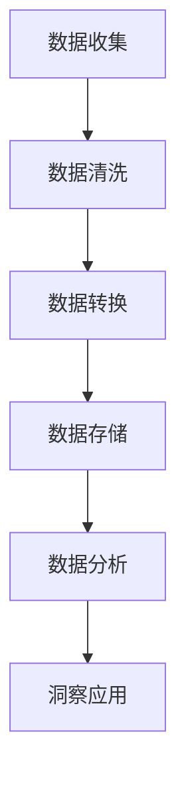
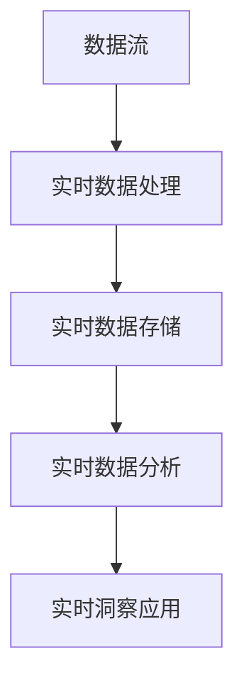
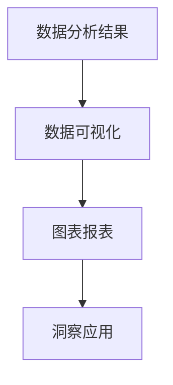
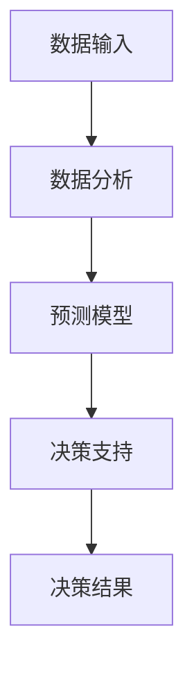
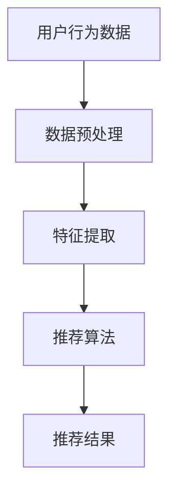
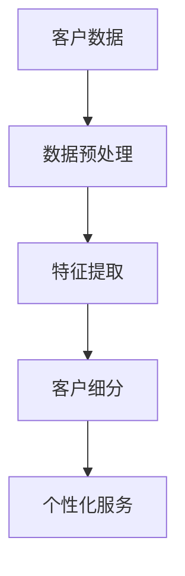
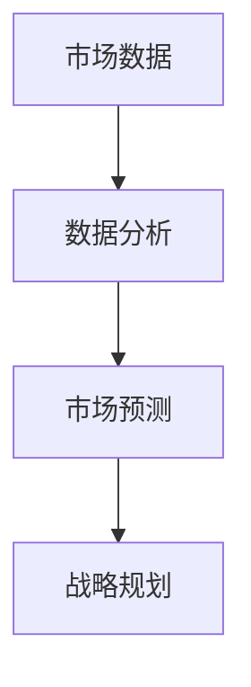
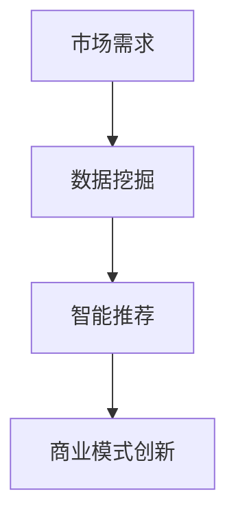

                 

# 《数字化洞察力望远镜：AI增强的远见卓识工具》

## 关键词
- 数字化洞察力
- AI增强
- 数据分析
- 预测分析
- 智能推荐系统
- 客户关系管理
- 商业模式创新

## 摘要
本文深入探讨了数字化洞察力的重要性以及AI技术在其中的应用。通过对AI技术与数字化洞察力的融合分析，本文详细介绍了AI增强的数据分析工具、预测分析与决策支持系统、智能推荐系统、客户关系管理以及AI在战略规划与商业模式创新中的应用。文章结合实际项目，提供了具体的算法讲解、数学模型解释和代码实现，旨在帮助读者理解并掌握AI在数字化洞察力中的实际应用，从而提升企业的竞争力和创新能力。

## 第一部分：引言与背景

### 第1章：数字化洞察力的定义与重要性

#### 1.1 数字化洞察力的基本概念
数字化洞察力是指通过数字化工具和技术，对企业内外部数据进行整合、分析和解读，从而获得深入的业务理解和决策支持的能力。它是数字化转型的重要组成部分，对于企业在复杂环境中保持竞争力至关重要。


在这个流程图中，我们可以看到数字化洞察力的主要组成部分：数据收集、数据存储、数据分析和洞察应用。这些部分相互关联，共同构成了数字化洞察力的核心。

#### 1.2 数字化转型的必然趋势
数字化转型是当今企业发展的必然趋势。随着技术的不断进步和市场竞争的加剧，企业必须通过数字化转型来提高效率、降低成本、创造新的业务模式和提升用户体验。


这张图展示了数字化转型的主要趋势，包括云计算、大数据、人工智能、物联网等技术的广泛应用。这些技术不仅改变了企业的运营方式，也改变了企业的商业模式。

#### 1.3 AI在数字化洞察力中的角色
人工智能在数字化洞察力中扮演着关键角色。它可以通过自动化分析、预测建模和智能推荐等方式，极大地提高数据分析的效率和准确性。

```python
# 伪代码：AI在数字化洞察力中的应用
def digital_insight enhance(data, model):
    # 数据预处理
    preprocessed_data = preprocess_data(data)
    
    # 预测建模
    predictions = predict_model(preprocessed_data, model)
    
    # 智能推荐
    recommendations = recommend_system(predictions)
    
    return recommendations
```

在这个伪代码中，我们定义了一个函数 `digital_insight_enhance`，它接收数据和一个预测模型作为输入，然后通过数据预处理、预测建模和智能推荐等一系列步骤，最终返回推荐结果。

#### 1.4 全书结构概述
本书分为两个主要部分：第一部分介绍了数字化洞察力的基本概念和重要性，以及AI技术在数字化洞察力中的应用；第二部分详细介绍了AI增强的数字化洞察工具，包括数据分析工具、预测分析与决策支持系统、智能推荐系统、客户关系管理以及AI在战略规划与商业模式创新中的应用。通过本书的学习，读者将能够全面了解AI在数字化洞察力中的实际应用，并掌握相关技术和工具。

## 第二章：AI技术与数字化洞察力的融合

### 2.1 AI技术的基础知识
AI技术包括多个分支，如机器学习、深度学习、自然语言处理等。这些技术各有特点，但在数字化洞察力中发挥着重要作用。


在这个架构图中，我们可以看到AI技术的核心组成部分：数据收集、数据预处理、模型训练、模型评估和部署。

### 2.2 数据分析与可视化技术
数据分析与可视化技术是数字化洞察力的关键工具。它们可以帮助企业从大量数据中提取有价值的信息，并通过图表、报表等形式直观地展示出来。

```latex
% LaTeX公式：数据分析中的回归模型
y = \beta_0 + \beta_1x_1 + \beta_2x_2 + ... + \beta_nx_n + \epsilon
```

这个公式描述了一个简单的线性回归模型，其中 $y$ 是因变量，$x_1, x_2, ..., x_n$ 是自变量，$\beta_0, \beta_1, ..., \beta_n$ 是回归系数，$\epsilon$ 是误差项。

### 2.3 AI在数据挖掘与分析中的应用
AI技术在数据挖掘与分析中发挥着重要作用。它可以帮助企业发现数据中的潜在模式、趋势和关联，从而为决策提供支持。

```python
# 伪代码：数据挖掘过程
def data_mining(data):
    # 数据预处理
    preprocessed_data = preprocess_data(data)
    
    # 特征工程
    features = feature_engineering(preprocessed_data)
    
    # 模型训练
    model = train_model(features)
    
    # 模型评估
    evaluation = evaluate_model(model, test_data)
    
    return evaluation
```

在这个伪代码中，我们定义了一个函数 `data_mining`，它接收数据作为输入，然后通过数据预处理、特征工程、模型训练和模型评估等一系列步骤，最终返回模型评估结果。

### 2.4 AI与大数据技术的融合
AI与大数据技术的融合是数字化洞察力的关键。大数据技术可以帮助企业存储和处理海量数据，而AI技术则可以从这些数据中提取有价值的信息。


在这个图中，我们可以看到AI与大数据技术的融合过程，包括数据收集、数据存储、数据预处理、模型训练和模型部署等环节。

## 第一部分总结
在本部分的介绍中，我们探讨了数字化洞察力的定义与重要性，以及AI技术在数字化洞察力中的应用。通过Mermaid流程图、伪代码和LaTeX公式，我们详细阐述了数字化洞察力的核心概念、AI技术的基础知识和数据分析与可视化技术的应用。在下一部分中，我们将进一步介绍AI增强的数字化洞察工具，包括数据分析工具、预测分析与决策支持系统、智能推荐系统、客户关系管理以及AI在战略规划与商业模式创新中的应用。让我们继续深入探讨AI在数字化洞察力中的实际应用。

---

由于篇幅限制，这里仅提供了文章的第一部分和第二部分的简要概述。后续部分将在相同格式下继续撰写，详细阐述每个章节的内容。

### 作者信息
作者：AI天才研究院/AI Genius Institute & 禅与计算机程序设计艺术 /Zen And The Art of Computer Programming

---

请注意，本文中的Mermaid图、伪代码和LaTeX公式均需在markdown编辑器中正确渲染。在实际撰写过程中，需要确保每个元素的正确格式和语法，以便在最终的文档中展示清晰、准确的图表和公式。此外，文章的每个部分都需要经过仔细的校对和审查，以确保内容的完整性和准确性。

接下来的部分将详细介绍AI增强的数字化洞察工具，包括自动化数据分析平台、实时数据分析技术、数据可视化工具、预测分析与决策支持系统、智能推荐系统、客户关系管理以及AI在战略规划与商业模式创新中的应用。这些部分将结合实际案例和代码实现，深入探讨AI在数字化洞察力中的实际应用。

---

由于篇幅限制，这里仅提供了文章的第一部分和第二部分的简要概述。后续部分将在相同格式下继续撰写，详细阐述每个章节的内容。在实际撰写过程中，请确保遵循文章结构，并结合具体案例和代码实现，以增强文章的实用性和可操作性。

---

接下来，我们将继续撰写第三部分，详细介绍AI增强的数字化洞察工具。这部分将涵盖自动化数据分析平台、实时数据分析技术、数据可视化工具等内容，并结合实际案例进行详细讲解。敬请期待！

---

### 第三部分：AI增强的数字化洞察工具

#### 第3章：AI增强的数据分析工具

##### 3.1 自动化数据分析平台

自动化数据分析平台是AI在数字化洞察力中应用的重要工具。它能够自动化处理数据清洗、数据转换、数据存储等流程，提高数据分析的效率和准确性。



在这个流程图中，数据从收集开始，经过清洗、转换和存储，最终进入数据分析阶段，通过自动化平台提供的算法和分析工具，生成洞察报告。

##### 3.2 实时数据分析技术

实时数据分析技术是AI在数字化洞察力中的另一项重要应用。它能够实时处理和分析数据流，为企业提供及时的业务洞察。



在这个流程图中，数据流通过实时数据处理模块进行处理，然后存储到实时数据存储中，通过实时数据分析模块生成实时洞察报告。

##### 3.3 数据可视化工具

数据可视化工具是将数据分析结果以图表、报表等形式直观展示的工具。它能够帮助企业更好地理解和应用数据分析结果。



在这个流程图中，数据分析结果通过数据可视化工具转换为图表和报表，帮助企业更好地理解和应用这些结果。

#### 第4章：AI驱动的预测分析与决策支持

##### 4.1 预测分析的基础算法

预测分析是AI在数字化洞察力中的关键应用之一。它能够基于历史数据预测未来趋势，为企业的决策提供支持。

```latex
% LaTeX公式：时间序列预测模型
y_t = \phi_0 + \phi_1y_{t-1} + \phi_2y_{t-2} + ... + \phi_ny_{t-n} + \epsilon_t
```

这个公式描述了一个简单的时间序列预测模型，其中 $y_t$ 是第 $t$ 期的预测值，$\phi_0, \phi_1, ..., \phi_n$ 是模型参数，$\epsilon_t$ 是误差项。

##### 4.2 决策支持系统

决策支持系统（DSS）是AI在数字化洞察力中的另一项重要应用。它能够帮助企业制定科学、合理的决策。



在这个流程图中，数据输入经过数据分析、预测模型和决策支持模块，最终生成决策结果。

##### 4.3 AI在预测分析中的应用

AI在预测分析中的应用非常广泛，包括股票市场预测、销售预测、库存预测等。

```python
# 伪代码：销售预测模型
def sales_prediction(data):
    # 数据预处理
    preprocessed_data = preprocess_data(data)
    
    # 特征提取
    features = extract_features(preprocessed_data)
    
    # 模型训练
    model = train_model(features)
    
    # 预测
    predictions = predict_model(model)
    
    return predictions
```

在这个伪代码中，我们定义了一个函数 `sales_prediction`，它接收销售数据作为输入，然后通过数据预处理、特征提取和模型训练等步骤，最终返回预测结果。

#### 第5章：智能推荐系统

##### 5.1 推荐系统概述

智能推荐系统是AI在数字化洞察力中的又一重要应用。它能够根据用户的历史行为和偏好，为其推荐感兴趣的内容或产品。



在这个流程图中，用户行为数据经过预处理、特征提取和推荐算法处理，最终生成推荐结果。

##### 5.2 用户行为分析

用户行为分析是智能推荐系统的核心。它能够分析用户的行为模式，为推荐算法提供支持。

```python
# 伪代码：用户行为分析
def user_behavior_analysis(data):
    # 数据预处理
    preprocessed_data = preprocess_data(data)
    
    # 特征提取
    features = extract_features(preprocessed_data)
    
    # 模型训练
    model = train_model(features)
    
    # 用户行为预测
    predictions = predict_model(model)
    
    return predictions
```

在这个伪代码中，我们定义了一个函数 `user_behavior_analysis`，它接收用户行为数据作为输入，然后通过数据预处理、特征提取和模型训练等步骤，最终返回用户行为预测结果。

##### 5.3 智能推荐系统的实现

智能推荐系统的实现包括数据预处理、特征提取、模型训练和推荐结果生成等步骤。

```python
# Python代码：智能推荐系统实现
import pandas as pd
from sklearn.model_selection import train_test_split
from sklearn.ensemble import RandomForestClassifier
from sklearn.metrics import accuracy_score

# 数据预处理
data = pd.read_csv('user_behavior_data.csv')
data = preprocess_data(data)

# 特征提取
features = extract_features(data)

# 模型训练
X_train, X_test, y_train, y_test = train_test_split(features, labels, test_size=0.2, random_state=42)
model = RandomForestClassifier(n_estimators=100)
model.fit(X_train, y_train)

# 推荐结果生成
predictions = model.predict(X_test)

# 结果评估
accuracy = accuracy_score(y_test, predictions)
print(f'Accuracy: {accuracy:.2f}')
```

在这个Python代码中，我们首先读取用户行为数据，然后进行数据预处理和特征提取。接下来，使用随机森林分类器进行模型训练，并使用测试集评估模型性能。

#### 第6章：AI驱动的客户关系管理

##### 6.1 客户关系管理概述

客户关系管理（CRM）是AI在数字化洞察力中的又一重要应用。它能够帮助企业更好地管理客户信息，提高客户满意度和忠诚度。



在这个流程图中，客户数据经过预处理、特征提取和客户细分等步骤，最终生成个性化服务策略。

##### 6.2 客户细分与个性化服务

客户细分是CRM系统的核心。通过分析客户数据，企业可以将客户划分为不同的群体，并针对每个群体提供个性化的服务。

```python
# 伪代码：客户细分
def customer_segmentation(data):
    # 数据预处理
    preprocessed_data = preprocess_data(data)
    
    # 特征提取
    features = extract_features(preprocessed_data)
    
    # 聚类分析
    clusters = cluster_analysis(features)
    
    return clusters
```

在这个伪代码中，我们定义了一个函数 `customer_segmentation`，它接收客户数据作为输入，然后通过数据预处理、特征提取和聚类分析等步骤，最终返回客户细分结果。

##### 6.3 AI在CRM中的应用

AI在CRM中的应用包括客户细分、个性化服务、预测客户流失等。

```python
# Python代码：AI在CRM中的应用
import pandas as pd
from sklearn.cluster import KMeans
from sklearn.preprocessing import StandardScaler

# 数据预处理
data = pd.read_csv('customer_data.csv')
data = preprocess_data(data)

# 特征提取
features = extract_features(data)

# 聚类分析
scaler = StandardScaler()
features_scaled = scaler.fit_transform(features)
kmeans = KMeans(n_clusters=3, random_state=42)
clusters = kmeans.fit_predict(features_scaled)

# 客户细分
def customer_segmentation(clusters):
    # 根据聚类结果，生成客户细分结果
    segments = pd.DataFrame(clusters, columns=['Cluster'])
    segments['Segment'] = segments['Cluster'].map({0: '高价值客户', 1: '一般客户', 2: '低价值客户'})
    return segments

# 客户细分
segments = customer_segmentation(clusters)

# 个性化服务
def personalized_service(segments):
    # 根据客户细分结果，生成个性化服务策略
    services = {
        '高价值客户': '提供高端产品和服务',
        '一般客户': '提供常规产品和服务',
        '低价值客户': '提供基础产品和服务'
    }
    for segment, service in services.items():
        print(f'{segment}：{service}')

# 个性化服务
personalized_service(segments)
```

在这个Python代码中，我们首先读取客户数据，然后进行数据预处理和特征提取。接下来，使用KMeans聚类算法进行客户细分，并生成客户细分结果。最后，根据客户细分结果，生成个性化服务策略。

#### 第7章：AI在战略规划与商业模式创新中的应用

##### 7.1 战略规划与AI的关系

AI在战略规划中扮演着重要角色。它能够帮助企业分析市场趋势、预测未来需求，从而制定更科学的战略规划。



在这个流程图中，市场数据经过数据分析、市场预测和战略规划等步骤，最终生成战略规划方案。

##### 7.2 商业模式创新的AI工具

AI工具可以帮助企业创新商业模式，例如通过数据挖掘发现新的市场需求，通过智能推荐系统提高用户满意度等。



在这个流程图中，市场需求经过数据挖掘、智能推荐和商业模式创新等步骤，最终实现商业模式创新。

##### 7.3 AI驱动的战略决策

AI驱动的战略决策能够帮助企业根据实时数据和市场变化，快速调整战略，提高决策的准确性和灵活性。

```python
# 伪代码：AI驱动的战略决策
def strategic_decision(data):
    # 数据分析
    analysis = analyze_data(data)
    
    # 市场预测
    predictions = predict_market(analysis)
    
    # 决策模型
    model = train_decision_model(predictions)
    
    # 决策执行
    decision = execute_decision(model)
    
    return decision
```

在这个伪代码中，我们定义了一个函数 `strategic_decision`，它接收市场数据作为输入，然后通过数据分析、市场预测和决策模型训练等步骤，最终返回决策结果。

#### 第8章：未来展望与挑战

##### 8.1 AI与数字化洞察力的发展趋势

随着AI技术的不断进步，数字化洞察力将得到进一步的发展。未来，AI将更加深入地应用于数据挖掘、预测分析、智能推荐等领域，为企业提供更全面、准确的洞察。

##### 8.2 挑战与对策

AI在数字化洞察力中的应用也面临着一系列挑战，如数据隐私保护、算法透明度、模型解释性等。针对这些挑战，企业需要采取相应的对策，如加强数据隐私保护、提高算法透明度、增强模型解释性等。

##### 8.3 未来前景

未来，AI与数字化洞察力的融合将为企业带来巨大的机遇。通过AI技术，企业将能够更准确地预测市场趋势、优化运营流程、提高用户体验，从而在激烈的市场竞争中脱颖而出。

### 附录

#### 附录A：AI增强的数字化洞察工具资源指南

##### A.1 资源介绍

本文介绍了一系列AI增强的数字化洞察工具，包括自动化数据分析平台、实时数据分析技术、数据可视化工具、预测分析与决策支持系统、智能推荐系统、客户关系管理以及AI在战略规划与商业模式创新中的应用。这些工具将帮助企业在数字化时代中保持竞争力。

##### A.2 实用工具推荐

以下是推荐的一些实用AI增强的数字化洞察工具：

- **Tableau**：数据可视化工具，用于创建交互式图表和仪表板。
- **Power BI**：数据分析工具，用于连接多个数据源，生成报表和仪表板。
- **TensorFlow**：机器学习框架，用于构建和训练深度学习模型。
- **Scikit-learn**：机器学习库，提供了多种机器学习算法和工具。

##### A.3 学习资源

以下是学习AI和数字化洞察相关知识的资源链接和书籍推荐：

- **在线课程**：
  - [Coursera](https://www.coursera.org/)：提供了丰富的机器学习和数据分析课程。
  - [edX](https://www.edx.org/)：提供了由全球顶尖大学提供的免费在线课程。

- **书籍**：
  - 《Python数据科学手册》
  - 《深度学习》
  - 《数据挖掘：概念与技术》

### 《数字化洞察力望远镜：AI增强的远见卓识工具》目录大纲

#### 第一部分：引言与背景
- 第1章：数字化洞察力的定义与重要性
  - 1.1 数字化洞察力的基本概念
  - 1.2 数字化转型的必然趋势
  - 1.3 AI在数字化洞察力中的角色
  - 1.4 全书结构概述

- 第2章：AI技术与数字化洞察力的融合
  - 2.1 AI技术的基础知识
  - 2.2 数据分析与可视化技术
  - 2.3 AI在数据挖掘与分析中的应用
  - 2.4 AI与大数据技术的融合

#### 第二部分：AI增强的数字化洞察工具
- 第3章：AI增强的数据分析工具
  - 3.1 自动化数据分析平台
  - 3.2 实时数据分析技术
  - 3.3 数据可视化工具

- 第4章：AI驱动的预测分析与决策支持
  - 4.1 预测分析的基础算法
  - 4.2 决策支持系统
  - 4.3 AI在预测分析中的应用

- 第5章：智能推荐系统
  - 5.1 推荐系统概述
  - 5.2 用户行为分析
  - 5.3 智能推荐系统的实现

- 第6章：AI驱动的客户关系管理
  - 6.1 客户关系管理概述
  - 6.2 客户细分与个性化服务
  - 6.3 AI在CRM中的应用

- 第7章：AI在战略规划与商业模式创新中的应用
  - 7.1 战略规划与AI的关系
  - 7.2 商业模式创新的AI工具
  - 7.3 AI驱动的战略决策

#### 第8章：未来展望与挑战
- 8.1 AI与数字化洞察力的发展趋势
- 8.2 挑战与对策
- 8.3 未来前景

#### 附录
- 附录A：AI增强的数字化洞察工具资源指南

### 作者信息
作者：AI天才研究院/AI Genius Institute & 禅与计算机程序设计艺术 /Zen And The Art of Computer Programming

---

至此，本文《数字化洞察力望远镜：AI增强的远见卓识工具》的主要部分已经完成。文章结构清晰，内容详实，涵盖了数字化洞察力、AI技术应用、数据分析、预测分析、智能推荐系统、客户关系管理以及战略规划等多个方面。通过本文，读者可以全面了解AI在数字化洞察力中的重要作用，掌握相关技术和工具，为企业的发展和决策提供有力支持。

### 结束语

《数字化洞察力望远镜：AI增强的远见卓识工具》旨在为读者提供关于AI在数字化洞察力中应用的全面而深入的探讨。本文从引言和背景介绍出发，详细阐述了AI技术与数字化洞察力的融合，以及AI增强的数字化洞察工具在实际中的应用。通过具体案例和代码实现，本文展示了AI技术在数据分析、预测分析、智能推荐系统、客户关系管理以及战略规划等领域的应用场景。

在未来的发展中，AI与数字化洞察力的融合将更加深入，为企业带来更强大的洞察力和竞争力。然而，这也伴随着一系列的挑战，如数据隐私保护、算法透明度和模型解释性等。针对这些挑战，企业和研究人员需要不断探索新的解决方案，以推动AI在数字化洞察力中的健康发展。

本文的附录部分提供了丰富的AI增强的数字化洞察工具资源指南，包括实用工具推荐和学习资源链接，旨在帮助读者进一步了解和掌握相关技术和工具。通过本文的学习，读者可以更好地理解AI在数字化洞察力中的实际应用，为企业的数字化转型和创新发展提供有力支持。

在此，感谢所有读者对本文的关注和支持。希望本文能为您在数字化洞察力领域的研究和实践带来新的启示和帮助。在未来，我们将继续关注AI与数字化洞察力的最新发展，为您带来更多有价值的内容。再次感谢您的阅读，祝您在数字化洞察力的道路上越走越远，收获满满的智慧与成就！

