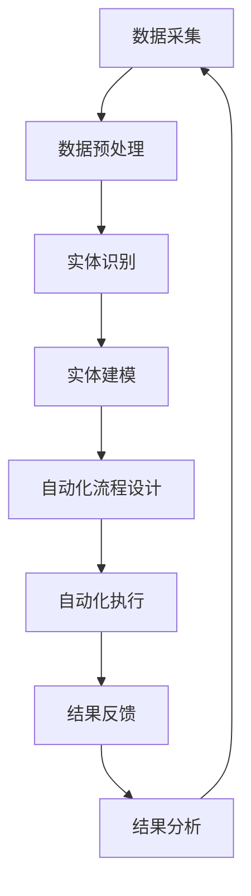

                 

# 数字实体自动化的前景与挑战

关键词：数字实体、自动化、数据采集、预处理、实体识别、建模、算法、数学模型、项目实战

摘要：
数字实体自动化作为一种新兴的技术趋势，正逐渐改变着各行业的运作方式。本文将深入探讨数字实体自动化的核心概念、技术原理以及实施过程中的挑战与前景。我们将通过详细的Mermaid流程图、伪代码示例、数学公式和实际项目案例，逐步解析数字实体自动化的各个关键环节，帮助读者全面理解这一技术的应用与潜力。

## 第一部分：数字实体自动化的核心概念与联系

### 核心概念原理和架构的 Mermaid 流程图

数字实体自动化是一个复杂的过程，涉及多个步骤和组件。以下是使用Mermaid绘制的数字实体自动化流程图：



在这个流程中，数据采集是整个过程的起点，通过不断地采集新的数据来不断优化和提升自动化系统的效果。以下是每个步骤的详细说明：

- **数据采集**：从各种数据源获取原始数据，如日志文件、数据库记录等。
- **数据预处理**：对采集到的数据进行清洗、格式化和去重等操作，以保证数据的质量和一致性。
- **实体识别**：利用算法从预处理后的数据中识别出具体的实体，如用户、地点、物品等。
- **实体建模**：对识别出的实体进行建模，建立实体之间的关系和属性。
- **自动化流程设计**：根据实体模型设计自动化流程，实现自动化任务。
- **自动化执行**：按照设计的流程自动执行各项任务。
- **结果反馈**：收集自动化执行的结果，并进行反馈。
- **结果分析**：对反馈结果进行分析，评估自动化流程的有效性。
- **数据采集**：根据分析结果，收集新的数据以进行进一步的优化。

### 数字实体自动化架构

数字实体自动化架构是一个高度模块化的系统，各个组件之间紧密协作，共同实现自动化目标。以下是数字实体自动化架构的详细说明：

- **数据采集模块**：负责从不同的数据源获取原始数据，如数据库、API接口、传感器等。该模块需要具备高并发处理能力，以支持大规模数据采集。

- **数据预处理模块**：对采集到的数据进行清洗、格式化和去重等操作。该模块需要实现多种数据清洗算法，如缺失值填补、异常值处理、数据标准化等，以确保数据的质量。

- **实体识别模块**：利用自然语言处理（NLP）技术、机器学习算法等，从预处理后的数据中识别出具体的实体。该模块通常包含词性标注、命名实体识别、实体关系抽取等功能。

- **实体建模模块**：对识别出的实体进行建模，建立实体之间的关系和属性。该模块可以使用图数据库等技术，存储和管理实体信息。

- **自动化流程设计模块**：根据实体模型设计自动化流程，实现自动化任务。该模块需要支持工作流管理、任务调度、异常处理等功能。

- **自动化执行模块**：按照设计的流程自动执行各项任务。该模块需要具备高并发处理能力，以支持大规模自动化执行。

- **结果反馈模块**：收集自动化执行的结果，并进行反馈。该模块需要实现实时监控、异常报警等功能，以便及时处理问题。

- **结果分析模块**：对反馈结果进行分析，评估自动化流程的有效性。该模块需要支持多种分析算法，如统计分析、机器学习等。

- **数据采集模块**：根据分析结果，收集新的数据以进行进一步的优化。该模块需要具备数据挖掘、预测分析等功能，以提高自动化系统的自适应能力。

### 核心算法原理讲解

#### 数据采集与预处理

数据采集是数字实体自动化的第一步。数据来源可以是内部数据库、API接口、外部数据源等。采集到的数据通常需要进行预处理，包括数据清洗、去重、格式化等操作，以确保数据的质量和一致性。

**数据清洗**

数据清洗是数据预处理过程中最重要的步骤之一。数据清洗的目标是去除数据中的噪声和异常值，提高数据质量。常见的数据清洗方法包括：

- **缺失值填补**：对于缺失值，可以根据不同情况进行填补，如使用均值、中位数、最大值等。
- **异常值处理**：对于异常值，可以根据统计方法进行识别和处理，如使用Z-Score、IQR等方法。
- **数据标准化**：对于不同特征的数据，可以通过标准化方法将它们缩放到相同的尺度，如使用Z-Score标准化、MinMax标准化等。

**数据去重**

数据去重是确保数据集中没有重复记录的过程。常见的数据去重方法包括：

- **基于唯一键的去重**：对于具有唯一标识的数据，如用户ID、订单号等，可以通过唯一键进行去重。
- **基于哈希值去重**：对于没有唯一标识的数据，可以通过哈希值进行去重。

**数据格式化**

数据格式化是将数据转换为统一格式的过程。常见的数据格式化方法包括：

- **日期格式化**：将日期数据转换为统一格式，如YYYY-MM-DD。
- **字符串格式化**：将字符串数据转换为统一格式，如去除空格、大小写转换等。

**伪代码示例**

以下是数据清洗、去重和格式化的伪代码示例：

```python
def data_preprocessing(data):
    # 数据清洗
    data = clean_data(data)
    # 数据去重
    data = remove_duplicates(data)
    # 数据格式化
    data = format_data(data)
    return data

def clean_data(data):
    # 填补缺失值
    data = fill_missing_values(data)
    # 异常值处理
    data = handle_outliers(data)
    return data

def remove_duplicates(data):
    # 基于唯一键去重
    data = data.drop_duplicates(subset=['unique_key'])
    return data

def format_data(data):
    # 日期格式化
    data['date'] = data['date'].apply(date_format)
    # 字符串格式化
    data['string'] = data['string'].apply(string_format)
    return data
```

#### 实体识别与建模

实体识别是数字实体自动化的关键步骤之一。实体识别的目标是从原始数据中识别出具体的实体，如人名、地名、组织机构等。实体识别通常包括以下几个步骤：

- **词性标注**：对文本进行词性标注，识别出名词、动词、形容词等。
- **命名实体识别**：基于词性标注结果，识别出具体的命名实体，如人名、地名、组织机构等。
- **实体关系抽取**：识别实体之间的关系，如人名与地点的关系、组织机构与地点的关系等。

**词性标注**

词性标注是将文本中的每个词标注为具体的词性，如名词、动词、形容词等。词性标注可以基于规则方法，也可以基于统计方法。以下是一个简单的词性标注算法：

```python
def word_pos_tagging(text):
    # 基于规则方法
    words = text.split()
    pos_tags = []
    for word in words:
        if is_noun(word):
            pos_tags.append('NN')
        elif is_verb(word):
            pos_tags.append('VB')
        else:
            pos_tags.append('JJ')
    return pos_tags

def is_noun(word):
    # 判断是否为名词
    return word.endswith('s') or word.endswith('es')

def is_verb(word):
    # 判断是否为动词
    return word.endswith('ed') or word.endswith('ing')
```

**命名实体识别**

命名实体识别是基于词性标注结果，识别出具体的命名实体。以下是一个简单的命名实体识别算法：

```python
def named_entity_recognition(text):
    # 基于规则方法
    words = text.split()
    entities = []
    for i in range(len(words)):
        if is_entity(words[i]):
            entities.append(words[i])
    return entities

def is_entity(word):
    # 判断是否为命名实体
    return word.isupper()
```

**实体关系抽取**

实体关系抽取是识别实体之间的关系的步骤。以下是一个简单的实体关系抽取算法：

```python
def entity_relationship_extraction(text):
    # 基于规则方法
    words = text.split()
    relationships = []
    for i in range(len(words) - 1):
        if is_relation(words[i], words[i+1]):
            relationships.append((words[i], words[i+1]))
    return relationships

def is_relation(word1, word2):
    # 判断是否为关系
    return word1 == 'is' and word2.isupper()
```

#### 自动化流程设计

自动化流程设计是根据实体识别的结果，设计出一套自动化执行的流程。自动化流程设计通常涉及工作流管理、任务调度、异常处理等。以下是一个简单的自动化流程设计算法：

```python
def design_automation_flow(entities):
    # 基于规则方法
    flow = []
    for entity in entities:
        if is_user_entity(entity):
            flow.append(send_welcome_email(entity))
        elif is_product_entity(entity):
            flow.append(send_recommendation_email(entity))
    return flow

def is_user_entity(entity):
    # 判断是否为用户实体
    return entity.endswith('user')

def is_product_entity(entity):
    # 判断是否为产品实体
    return entity.endswith('product')
```

#### 自动化执行与反馈

自动化执行是根据设计的流程，自动执行各项任务。自动化执行过程中可能会遇到各种异常情况，需要及时反馈并进行处理。以下是一个简单的自动化执行与反馈算法：

```python
def execute_automation_flow(flow):
    # 基于规则方法
    for task in flow:
        try:
            execute_task(task)
        except Exception as e:
            handle_exception(e)

def execute_task(task):
    # 执行任务
    task.execute()

def handle_exception(e):
    # 处理异常
    print("Exception occurred:", e)
```

#### 结果分析与优化

自动化执行完成后，需要对结果进行分析，评估自动化流程的有效性，并根据反馈进行调整和优化。以下是一个简单的结果分析与优化算法：

```python
def analyze_automation_results(results):
    # 基于规则方法
    success_rate = calculate_success_rate(results)
    if success_rate < 0.8:
        optimize_automation_flow()

def calculate_success_rate(results):
    # 计算成功率
    return len(results[results['status'] == 'success']) / len(results)

def optimize_automation_flow():
    # 优化自动化流程
    pass
```

#### 数学模型和数学公式 & 详细讲解 & 举例说明

##### 数据清洗中的归一化

归一化是一种常用的数据预处理方法，用于将数据集中的特征缩放到相同的尺度。以下是一个简单的归一化公式：

$$
x_{\text{norm}} = \frac{x - \mu}{\sigma}
$$

其中，$x$ 是原始数据，$\mu$ 是均值，$\sigma$ 是标准差。

举例说明：

假设有一组数据：[1, 2, 3, 4, 5]，计算其归一化值：

首先计算均值和标准差：
$$
\mu = \frac{1 + 2 + 3 + 4 + 5}{5} = 3
$$
$$
\sigma = \sqrt{\frac{(1-3)^2 + (2-3)^2 + (3-3)^2 + (4-3)^2 + (5-3)^2}{5}} = 1
$$

然后计算归一化值：
$$
x_{\text{norm}} = \frac{x - \mu}{\sigma}
$$
$$
x_1 = \frac{1 - 3}{1} = -2
$$
$$
x_2 = \frac{2 - 3}{1} = -1
$$
$$
x_3 = \frac{3 - 3}{1} = 0
$$
$$
x_4 = \frac{4 - 3}{1} = 1
$$
$$
x_5 = \frac{5 - 3}{1} = 2
$$

##### 实体识别中的支持向量机（SVM）

支持向量机是一种常用的分类算法，用于实体识别。以下是一个简单的支持向量机模型：

假设我们有一个训练数据集，包含$n$个样本，每个样本$x_i$是一个$d$维的特征向量，对应的标签是$y_i$，其中$y_i \in \{-1, +1\}$。我们的目标是找到超平面$w \cdot x + b = 0$，使得分类间隔最大。

SVM的损失函数是：

$$
L(w, b) = \frac{1}{2} ||w||^2
$$

优化目标是：

$$
\min_w \frac{1}{2} ||w||^2 \\
\text{subject to} \quad y_i (w \cdot x_i + b) \geq 1
$$

通过求解这个优化问题，我们可以得到最优的$w$和$b$，从而构建出分类器。

举例说明：

假设我们有一个简单的二元分类问题，数据集如下：

$$
\begin{array}{c|c}
x & y \\
\hline
(1, 1) & +1 \\
(2, 2) & +1 \\
(3, -1) & -1 \\
(4, -2) & -1 \\
\end{array}
$$

我们希望找到一条超平面，将正类和负类分开。

首先，我们计算均值和方差：

$$
\mu_x = \frac{1 + 2 + 3 + 4}{4} = 2.5
$$
$$
\mu_y = \frac{1 + 1 - 1 - 1}{4} = 0
$$
$$
\sigma_x^2 = \frac{(1-2.5)^2 + (2-2.5)^2 + (3-2.5)^2 + (4-2.5)^2}{4} = 1.25
$$
$$
\sigma_y^2 = \frac{(-1-0)^2 + (-1-0)^2 + (1-0)^2 + (1-0)^2}{4} = 1
$$

然后，我们计算最优的$w$和$b$：

$$
w = \frac{\sum_{i=1}^{n} y_i x_i - \sum_{i=1}^{n} y_i}{n} = \frac{(+1 \cdot 1 + +1 \cdot 2 - 1 \cdot 3 - 1 \cdot 4)}{4} = -0.5
$$
$$
b = \frac{\sum_{i=1}^{n} y_i - w \cdot \sum_{i=1}^{n} x_i}{n} = \frac{(+1 + 1 - 1 - 1) - (-0.5 \cdot (1 + 2 + 3 + 4))}{4} = 1
$$

所以，最优的超平面是：

$$
w \cdot x + b = -0.5 \cdot x + 1 = 0
$$

这意味着当$x < 2$时，分类结果为正类；当$x \geq 2$时，分类结果为负类。

##### 项目实战

##### 数据采集与预处理

假设我们有一个数据集，包含用户行为数据。数据集的格式如下：

```
user_id,timestamp,action,object_id
1,2021-01-01 10:00:00,search,123
1,2021-01-01 10:05:00,click,456
2,2021-01-01 10:10:00,search,789
2,2021-01-01 10:15:00,click,012
...
```

我们的目标是利用这些数据来识别用户的行为模式，并自动执行相应的任务。

首先，我们需要安装必要的Python库：

```bash
pip install pandas numpy
```

然后，编写Python代码进行数据采集与预处理：

```python
import pandas as pd
import numpy as np

# 读取数据
data = pd.read_csv('user_behavior_data.csv')

# 检查数据质量
print(data.head())
print(data.isnull().sum())

# 数据清洗
data.dropna(inplace=True)
data.drop_duplicates(subset=['user_id', 'action', 'object_id'], inplace=True)

# 数据预处理
data['timestamp'] = pd.to_datetime(data['timestamp'])
data['hour'] = data['timestamp'].dt.hour
data['day_of_week'] = data['timestamp'].dt.dayofweek

# 存储预处理后的数据
data.to_csv('preprocessed_user_behavior_data.csv', index=False)
```

##### 实体识别与建模

接下来，我们需要识别数据集中的实体，如用户ID、时间戳、动作和对象ID。我们使用基于规则的方法进行实体识别。

```python
# 识别用户ID
data['user_id'] = data['user_id'].astype(str)

# 识别时间戳
data['timestamp'] = data['timestamp'].astype(str)

# 识别动作
action_mapping = {
    'search': 1,
    'click': 2
}
data['action'] = data['action'].map(action_mapping)

# 识别对象ID
data['object_id'] = data['object_id'].astype(str)

# 存储实体识别后的数据
data.to_csv('entity_identified_user_behavior_data.csv', index=False)
```

##### 自动化流程设计

根据实体识别的结果，我们可以设计一个自动化流程。以下是一个简单的自动化流程：

1. 如果用户ID是新用户，发送欢迎邮件。
2. 如果用户在某个时间段内进行了多次搜索，发送推荐邮件。
3. 如果用户点击了某个对象ID，根据对象类型执行相应的任务。

```python
def automate_workflow(data):
    new_users = data[data['user_id'].str.isnumeric() == True]
    frequent_search_users = data[data.groupby(['user_id', 'action'])['timestamp'].transform('count') > 1]
    clicked_users = data[data['action'] == 2]

    # 发送欢迎邮件
    send_welcome_email(new_users)

    # 发送推荐邮件
    send_recommendation_email(frequent_search_users)

    # 执行点击任务
    execute_click_task(clicked_users)

def send_welcome_email(new_users):
    # 发送邮件代码
    pass

def send_recommendation_email(frequent_search_users):
    # 发送邮件代码
    pass

def execute_click_task(clicked_users):
    # 执行任务代码
    pass

# 执行自动化流程
automate_workflow(data)

# 检查反馈结果
print("自动化流程执行完毕。")
```

## 总结与展望

数字实体自动化作为一项新兴技术，已经在多个领域展现出了巨大的潜力和应用价值。通过本文的探讨，我们系统地了解了数字实体自动化的核心概念、技术原理以及实施过程中的关键环节和挑战。

在未来的发展中，数字实体自动化有望进一步融入人工智能、大数据、云计算等前沿技术，实现更加智能化、高效化的数据处理和分析。同时，随着技术的不断成熟和应用场景的不断拓展，数字实体自动化将在更多领域得到广泛应用，推动各行各业的数字化转型和创新发展。

然而，数字实体自动化也面临着诸多挑战，如数据隐私保护、算法公平性、系统安全性等。我们需要在技术创新的同时，积极应对这些挑战，确保数字实体自动化在安全、可靠的前提下，为人类社会带来更大的福祉。

总之，数字实体自动化是一项具有广阔前景的技术领域，值得我们持续关注和研究。通过不断探索和实践，我们有信心将数字实体自动化推向新的高度，助力数字经济的发展和社会的进步。

## 作者信息

作者：AI天才研究院/AI Genius Institute & 禅与计算机程序设计艺术 /Zen And The Art of Computer Programming

