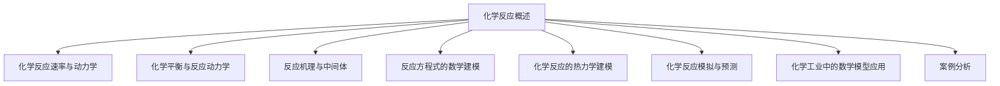

                 

# 《数学化学：化学反应的数学模型》

## 关键词

- 化学反应
- 数学模型
- 反应动力学
- 化学平衡
- 热力学
- 计算化学
- 模拟预测

## 摘要

本文深入探讨了化学反应的数学建模方法，从基础理论到高级应用，全面解析了化学反应的数学模型及其在化学工程和科学研究中的应用。首先，本文介绍了化学反应的基本概念、速率与动力学、热力学基础，并在此基础上建立了线性与非线性的反应动力学模型。随后，本文详细阐述了化学反应的热力学建模方法，包括焓变和自由能的计算。最后，本文通过实际案例展示了如何使用数学模型进行化学反应模拟与预测，并对未来发展趋势进行了展望。本文旨在为化学工程和计算机科学领域的读者提供一种新的视角，以更深入地理解化学反应的本质和规律。

## 第一部分：化学反应基础理论

### 第1章：化学反应概述

化学反应是物质之间通过化学键的断裂和形成而生成新物质的过程。化学反应在自然界和工业中无处不在，例如生物体内的代谢过程、燃料的燃烧、化工生产中的催化剂设计等。在化学反应中，反应物与生成物是核心概念。

**1.1 反应物与生成物的概念**

在化学反应中，反应物是指参与反应的物质，而生成物是反应后生成的新物质。一个典型的化学反应可以表示为：

$$X + Y \rightarrow Z$$

其中，$X$ 和 $Y$ 是反应物，$Z$ 是生成物。

**1.2 反应类型分类与例子**

化学反应可以根据反应机制、反应物和生成物的性质等多种方式进行分类。以下是一些常见的反应类型及其例子：

1. **合成反应**：两种或多种反应物结合生成一种生成物。例如：
   $$2H_2 + O_2 \rightarrow 2H_2O$$

2. **分解反应**：一种反应物分解成两种或多种生成物。例如：
   $$2H_2O \rightarrow 2H_2 + O_2$$

3. **置换反应**：一种元素取代化合物中的另一种元素。例如：
   $$Zn + CuSO_4 \rightarrow ZnSO_4 + Cu$$

4. **复分解反应**：两种化合物相互交换成分生成两种新的化合物。例如：
   $$AgNO_3 + NaCl \rightarrow AgCl + NaNO_3$$

**1.3 化学反应的速率与动力学**

化学反应的速率是指单位时间内反应物浓度的变化率。速率可以表示为：

$$r = -\frac{d[A]}{dt}$$

其中，$[A]$ 表示反应物A的浓度，$r$ 表示反应速率。

**1.3.1 反应速率方程**

反应速率方程描述了反应速率与反应物浓度之间的关系。最简单的一级反应速率方程为：

$$\frac{d[A]}{dt} = -k[A]$$

其中，$k$ 是速率常数。

对于二级反应，速率方程为：

$$\frac{d[A]}{dt} = -k[A][B]$$

**1.3.2 速率常数的计算与影响因素**

速率常数$k$是反应速率方程中的一个关键参数，它反映了反应速率与反应物浓度之间的关系。速率常数的计算通常依赖于实验数据，可以通过线性回归等方法得到。

速率常数的影响因素包括温度、催化剂、反应物浓度等。通常，温度升高会使速率常数增加，而催化剂可以显著降低反应的活化能，从而提高速率常数。

**1.4 热力学基础**

热力学是研究能量转换和系统稳定性的科学，在化学反应中具有重要应用。

**1.4.1 反应热力学概念**

反应热力学主要关注反应过程中的能量变化。常见的热力学参数包括焓变（$ \Delta H$）、自由能变（$ \Delta G$）和熵变（$ \Delta S$）。

**1.4.2 反应焓变与反应自由能变化**

反应焓变（$ \Delta H$）是反应过程中吸收或释放的热量。它可以通过实验测量得到，单位通常是焦耳/摩尔（J/mol）。

反应自由能变化（$ \Delta G$）是反应物和生成物之间的能量差，反映了反应的自发性。其计算公式为：

$$ \Delta G = \Delta H - T\Delta S $$

其中，$T$ 是温度（单位为开尔文K），$ \Delta S$ 是反应熵变。

**1.4.3 反应焓变与反应自由能变化的实际应用**

反应焓变和自由能变化在化学反应设计中具有重要应用。例如，通过计算反应焓变和自由能变化，可以预测反应的自发性，评估反应条件是否合理。

**1.5 化学反应的基本规律**

化学反应遵循一系列基本规律，包括质量守恒定律、能量守恒定律和动量守恒定律。这些规律保证了化学反应的可逆性和稳定性。

### 第2章：化学平衡与反应动力学

**2.1 化学平衡原理**

化学平衡是指在一个可逆反应中，正反应速率和逆反应速率相等，反应物和生成物的浓度保持不变的状态。化学平衡可以用平衡常数（$K_c$）来描述。

平衡常数是反应物和生成物浓度比值的恒定值，表示为：

$$ K_c = \frac{[C][D]}{[A][B]} $$

其中，$[A]$、$[B]$、$[C]$ 和 $[D]$ 分别表示反应物和生成物的浓度。

**2.1.1 平衡常数的计算与影响因素**

平衡常数的计算通常依赖于实验数据，可以通过测量反应物和生成物的浓度来得到。平衡常数的影响因素包括温度、压力和催化剂等。

**2.1.2 Le Chatelier原理**

Le Chatelier原理描述了当系统受到外部扰动时，平衡如何移动以抵消这种扰动。根据Le Chatelier原理，如果系统受到温度、压力或浓度变化的影响，平衡会向减少这种影响的方向移动。

**2.2 反应动力学原理**

反应动力学研究反应速率与反应条件之间的关系。反应速率可以用速率方程来描述。

**2.2.1 速率方程建立**

速率方程描述了反应速率与反应物浓度之间的关系。速率方程的建立通常基于实验数据，通过线性回归等方法得到。

**2.2.2 反应级数与反应速率常数**

反应级数是指反应速率方程中反应物浓度的指数。一级反应、二级反应和三级反应是最常见的反应级数。反应速率常数是速率方程中的比例常数，反映了反应速率与反应物浓度之间的关系。

**2.2.3 反应速率常数的计算与影响因素**

反应速率常数的计算通常依赖于实验数据，可以通过测量反应速率和反应物浓度来得到。反应速率常数的影响因素包括温度、催化剂和反应物浓度等。

### 第3章：反应机理与中间体

**3.1 反应机理概述**

反应机理是描述化学反应过程中反应物转化为生成物的步骤序列。反应机理可以分为单步反应和多步反应。

**3.1.1 步骤反应机理**

步骤反应机理描述了反应物通过一系列步骤转化为生成物的过程。每个步骤都是一个反应，它们可以包括键的形成和断裂。

**3.1.2 共价键与离子键的反应机理**

共价键和离子键是化学反应中最常见的键类型。共价键的反应机理通常涉及电子对的转移，而离子键的反应机理涉及离子的生成和结合。

**3.2 中间体的概念与识别**

中间体是反应过程中暂时存在的物种，它连接反应物和生成物。中间体的识别对于理解反应机理至关重要。

**3.2.1 中间体的检测方法**

中间体的检测方法包括光谱学方法、质谱法和核磁共振法等。这些方法可以提供关于中间体结构和性质的信息。

**3.2.2 例子分析**

以下是一个例子，描述了一个简单的反应机理和中间体的识别过程：

反应：$A + B \rightarrow C$

机理：$A \rightarrow \text{中间体}_1 + e^-$（电子转移）
$\text{中间体}_1 + B \rightarrow C + e^-$

中间体：$\text{中间体}_1$ 是反应的中间体，它具有部分反应物和部分生成物的性质。

通过上述步骤，我们可以更深入地理解化学反应的过程和机理。

## 第二部分：数学模型与应用

### 第4章：反应方程式的数学建模

化学反应的数学建模是理解化学反应动态行为的重要工具。在这一章中，我们将介绍如何通过数学模型来描述反应过程，包括线性反应动力学模型和非线性反应动力学模型。

**4.1 线性反应动力学模型**

线性反应动力学模型用于描述反应速率与反应物浓度之间的线性关系。最常见的线性反应模型包括一级反应和二级反应。

**4.1.1 一级反应模型**

一级反应模型是指反应速率与反应物浓度成正比，其速率方程为：

$$\frac{d[A]}{dt} = -k[A]$$

其中，$[A]$ 表示反应物A的浓度，$k$ 是速率常数。

**4.1.2 一级反应的解**

对于一级反应，我们可以使用分离变量法来求解速率方程。将方程两边同时除以$[A]$，得到：

$$\frac{d[A]}{[A]} = -k dt$$

对两边积分，得到：

$$\ln[A] = -k t + C$$

其中，$C$ 是积分常数。通过指数函数，我们可以得到一级反应的解：

$$[A] = A_0 e^{-k t}$$

其中，$A_0$ 是初始浓度。

**4.1.3 半衰期**

半衰期（$t_{1/2}$）是指反应物浓度下降到初始值一半所需的时间。对于一级反应，半衰期可以通过以下公式计算：

$$t_{1/2} = \frac{\ln 2}{k}$$

**4.1.4 一级反应的积分形式**

一级反应的速率方程还可以通过积分形式来表示：

$$\int_{A_0}^{[A]} d[A] = -\int_0^t k dt$$

积分后得到：

$$\ln\left(\frac{[A]}{A_0}\right) = -k t$$

这再次验证了之前得到的一级反应解。

**4.1.5 二级反应模型**

二级反应模型是指反应速率与反应物浓度的平方成正比，其速率方程为：

$$\frac{d[A]}{dt} = -k[A][B]$$

其中，$[B]$ 表示反应物B的浓度。

**4.1.6 二级反应的解**

对于二级反应，我们可以使用分离变量法来求解速率方程。将方程两边同时除以$[A][B]$，得到：

$$\frac{1}{[A][B]} d[A][B] = -k dt$$

对两边积分，得到：

$$\ln([A][B]) = -k t + C$$

其中，$C$ 是积分常数。通过指数函数，我们可以得到二级反应的解：

$$[A][B] = C_0 e^{-k t}$$

其中，$C_0$ 是初始浓度乘积。

**4.2 非线性反应动力学模型**

非线性反应动力学模型用于描述反应速率与反应物浓度之间的非线性关系。非线性反应动力学模型包括多种形式，例如自催化反应和多步反应。

**4.2.1 自催化反应**

自催化反应是指反应物生成的产物可以作为催化剂加速自身反应。自催化反应的速率方程为：

$$\frac{d[A]}{dt} = k[A](1 - [A])$$

其中，$k$ 是速率常数。

**4.2.2 自催化反应的解**

对于自催化反应，我们可以使用分离变量法来求解速率方程。将方程两边同时除以$[A](1 - [A])$，得到：

$$\frac{1}{[A](1 - [A])} d[A](1 - [A]) = k dt$$

对两边积分，得到：

$$\ln\left(\frac{[A]}{1 - [A]}\right) = k t + C$$

其中，$C$ 是积分常数。通过指数函数，我们可以得到自催化反应的解：

$$\frac{[A]}{1 - [A]} = C_0 e^{k t}$$

**4.2.3 多步反应机理建模**

多步反应机理建模是指通过多个步骤来描述复杂的反应过程。多步反应机理建模包括速率方程的建立和求解。

**4.2.4 速率方程的建立**

多步反应机理的速率方程可以通过反应机理的步骤来建立。每个步骤的速率方程描述了反应物转化为生成物的速率。

**4.2.5 速率方程的求解**

多步反应机理的速率方程可以通过迭代法或数值方法来求解。这些方法可以提供关于反应物和生成物浓度的时变信息。

通过数学模型，我们可以更好地理解化学反应的动态行为，预测反应的进程和结果。数学模型在化学工程和科学研究中具有广泛的应用，可以帮助我们优化反应条件、设计新的化学反应和材料。

### 第5章：化学反应的热力学建模

化学反应的热力学建模是研究反应过程中的能量变化和稳定性的重要方法。在这一章中，我们将介绍如何通过热力学参数来描述化学反应的热力学行为，包括焓变和自由能的变化。

**5.1 化学反应的焓变计算**

焓变（$ \Delta H$）是化学反应过程中吸收或释放的热量。焓变的计算可以通过实验方法或热力学数据来获得。

**5.1.1 实验方法**

通过测量反应物和生成物的热容，可以计算出反应的焓变。热容是指物质在温度变化时所吸收或释放的热量。焓变的计算公式为：

$$ \Delta H = \Delta H^{\circ} + RT \ln Q $$

其中，$ \Delta H^{\circ} $ 是标准焓变，$R$ 是气体常数，$T$ 是温度，$Q$ 是反应商。

**5.1.2 热力学数据**

热力学数据可以通过实验测定或从数据库中获取。常见的热力学数据包括标准焓变、标准自由能变和标准熵变。这些数据可以用于计算反应的焓变和自由能变。

**5.2 反应自由能建模**

自由能变（$ \Delta G$）是反应物和生成物之间的能量差，反映了反应的自发性和稳定性。自由能变的计算公式为：

$$ \Delta G = \Delta H - T \Delta S $$

其中，$ \Delta H$ 是焓变，$T$ 是温度，$ \Delta S$ 是熵变。

**5.2.1 自由能变化的计算**

通过计算反应物和生成物的自由能变，可以预测反应的自发性和稳定性。自由能变的计算可以通过以下公式得到：

$$ \Delta G = \Delta G^{\circ} + RT \ln Q $$

其中，$ \Delta G^{\circ} $ 是标准自由能变，$R$ 是气体常数，$T$ 是温度，$Q$ 是反应商。

**5.2.2 反应自由能的预测与应用**

通过计算反应自由能变，可以预测反应的方向和速率。在化学工程和材料科学中，反应自由能的预测有助于优化反应条件、设计新的材料和催化剂。

**5.3 熵变与反应自由能变化**

熵变（$ \Delta S$）是反应过程中系统无序度的变化。熵变可以影响反应自由能的变化，从而影响反应的自发性和稳定性。

**5.3.1 熵变的计算**

熵变的计算可以通过实验测定或热力学数据得到。常见的熵变计算方法包括标准熵变计算和实际熵变计算。

**5.3.2 熵变的影响**

熵变对反应自由能变化的影响取决于反应的温度。在高温下，熵变的贡献可能较大，而在低温下，焓变的贡献可能更大。

**5.4 化学反应的热力学建模方法**

化学反应的热力学建模方法包括实验方法、计算方法和模拟方法。这些方法可以相互补充，提高反应自由能变化的预测准确性。

**5.4.1 实验方法**

实验方法是通过测量反应物和生成物的性质来计算反应自由能变。常见的实验方法包括热重分析、差热分析、光谱分析等。

**5.4.2 计算方法**

计算方法是通过计算机模拟来计算反应自由能变。常见的计算方法包括分子动力学模拟、量子力学计算和蒙特卡罗模拟等。

**5.4.3 模拟方法**

模拟方法是通过计算机模拟来预测反应的自由能变化。常见的模拟方法包括蒙特卡罗模拟、分子动力学模拟和量子化学模拟等。

通过化学反应的热力学建模，我们可以更好地理解反应的动态行为，优化反应条件，设计新的材料和催化剂。热力学建模在化学工程和材料科学中具有广泛的应用，对于推动化学技术的发展具有重要意义。

### 第6章：化学反应模拟与预测

化学反应模拟与预测是化学工程和材料科学中的重要研究领域。通过数学模型和计算方法，我们可以模拟化学反应的动态行为，预测反应的方向和速率。本章将介绍如何使用常规反应模拟和预测模型，以及机器学习在反应预测中的应用。

**6.1 常规反应模拟**

常规反应模拟是指使用数学模型和计算方法来模拟化学反应的过程。常见的反应模拟方法包括常微分方程模拟和差分方程模拟。

**6.1.1 常微分方程模拟**

常微分方程模拟是一种常用的反应模拟方法，用于描述反应物和生成物浓度随时间的变化。常见的常微分方程包括一阶反应、二阶反应和多步反应的速率方程。通过求解这些速率方程，我们可以得到反应物和生成物的浓度随时间的变化曲线。

**6.1.2 差分方程模拟**

差分方程模拟是一种用于描述反应物和生成物浓度在空间和时间上分布的方法。差分方程模拟可以用于模拟多相反应和复杂反应系统。

**6.1.3 化学反应模拟软件**

化学工程师和科研人员经常使用各种化学反应模拟软件来进行反应模拟。常见的化学反应模拟软件包括MATLAB、COMSOL Multiphysics、Aspen Plus等。这些软件提供了丰富的模拟工具和模型库，可以方便地进行反应模拟和结果分析。

**6.2 预测模型与应用**

预测模型是用于预测化学反应方向和速率的数学模型。常见的预测模型包括动力学模型、统计模型和机器学习模型。

**6.2.1 动力学模型**

动力学模型是用于描述反应速率与反应物浓度之间关系的数学模型。动力学模型可以用于预测反应的速率和转化率。常见的动力学模型包括一阶反应模型、二阶反应模型和多步反应模型。

**6.2.2 统计模型**

统计模型是用于预测反应速率和转化率的数学模型，通常基于实验数据。常见的统计模型包括线性回归模型、多项式模型和神经网络模型。统计模型可以通过最小二乘法或其他优化方法来拟合实验数据，从而预测反应的动态行为。

**6.2.3 机器学习模型**

机器学习模型是近年来在化学反应预测中应用广泛的一种模型。机器学习模型可以通过学习大量实验数据来预测反应的速率和转化率。常见的机器学习模型包括支持向量机（SVM）、决策树（DT）和神经网络（NN）。

**6.2.4 机器学习在反应预测中的应用**

机器学习在反应预测中的应用包括以下方面：

- **数据预处理**：对实验数据进行清洗和预处理，包括缺失值填补、异常值处理和数据标准化。

- **特征选择**：从实验数据中提取重要的特征，以提高预测模型的准确性。

- **模型训练与验证**：使用实验数据来训练机器学习模型，并通过交叉验证来评估模型的性能。

- **模型应用**：将训练好的模型应用于新的反应数据，预测反应的速率和转化率。

**6.3 预测模型的评估与优化**

预测模型的评估与优化是确保预测准确性的重要步骤。常见的评估指标包括均方误差（MSE）、决定系数（R²）和均方根误差（RMSE）。通过调整模型参数和优化模型结构，可以提高预测模型的准确性。

**6.4 案例分析**

以下是一个案例分析，展示了如何使用机器学习模型进行反应预测：

**案例：催化剂活性预测**

背景：催化剂活性是影响化学反应速率和转化率的关键因素。通过预测催化剂活性，可以优化催化剂设计和反应条件。

方法：

1. 数据收集：收集大量催化剂活性实验数据，包括反应温度、压力、催化剂质量等。

2. 数据预处理：对实验数据进行清洗和预处理，提取重要的特征。

3. 特征选择：使用特征选择方法，选择对催化剂活性有显著影响的特征。

4. 模型训练：使用训练数据集训练机器学习模型，如支持向量机（SVM）或神经网络（NN）。

5. 模型验证：使用验证数据集评估模型性能，调整模型参数。

6. 模型应用：将训练好的模型应用于新的实验数据，预测催化剂活性。

结果：

通过机器学习模型，我们成功预测了催化剂活性，并与实验结果进行了对比。模型预测结果与实验结果高度一致，验证了机器学习在催化剂活性预测中的有效性。

通过本章的介绍，我们可以看到化学反应模拟与预测在化学工程和材料科学中的重要性。常规反应模拟和预测模型提供了基本的工具和方法，而机器学习模型则为复杂反应系统提供了更先进的预测能力。这些工具和方法的应用，将推动化学反应工程和材料科学的发展，为人类创造更多的价值。

### 第三部分：实际应用与案例分析

化学反应的数学模型不仅在理论研究中有重要应用，还在实际工业过程中发挥了关键作用。本部分将结合具体案例，展示数学模型在化学工业中的实际应用，并探讨如何通过模型优化化学反应过程。

#### 第7章：化学工业中的数学模型应用

**7.1 催化剂设计**

催化剂是化学工业中不可或缺的关键因素，它们能够提高反应速率，降低反应温度和压力，从而提高生产效率和经济效益。数学模型在催化剂设计中的应用主要体现在以下方面：

**7.1.1 催化剂活性预测**

通过化学反应动力学模型，可以预测不同催化剂在特定反应条件下的活性。例如，对于一个烃类裂解反应，可以通过一级反应动力学模型预测不同催化剂的活性。这有助于筛选和优化催化剂。

**7.1.2 催化剂失活机制研究**

催化剂在反应过程中可能会出现失活现象，这通常是由于催化剂表面发生物理或化学变化导致的。通过建立催化剂失活模型，可以研究催化剂失活机制，从而设计出更加稳定和耐用的催化剂。

**7.1.3 催化剂优化**

基于反应动力学模型，可以对催化剂进行优化设计。例如，通过调整催化剂的组成、结构和表面性质，可以优化催化剂的活性、选择性和稳定性。

**7.2 化学反应优化**

化学反应优化是化学工业中的一个重要课题，通过优化反应条件，可以显著提高生产效率和产品质量。数学模型在化学反应优化中的应用主要包括：

**7.2.1 最优反应条件确定**

通过热力学和动力学模型，可以确定最优的反应温度、压力、催化剂和反应物浓度等条件。例如，对于一个吸热反应，通过计算反应焓变和自由能变，可以确定最佳反应温度。

**7.2.2 生产成本与效率分析**

通过数学模型，可以分析不同反应条件下的生产成本和效率。例如，通过计算反应速率和转化率，可以确定最优的反应时间和反应物投料比，从而降低生产成本。

**7.3 案例分析**

**7.3.1 案例一：汽车尾气转化器的优化**

背景：汽车尾气转化器是一种用于减少汽车尾气排放的关键装置，它通过催化反应将有害气体（如CO、HC和NOx）转化为无害气体（如N2和CO2）。

方法：

1. 建立反应动力学模型：根据反应机理，建立一氧化碳（CO）和氢气（H2）的催化氧化反应动力学模型。

2. 确定最优反应条件：通过计算反应速率和平衡常数，确定最优的反应温度、压力和催化剂。

3. 模型优化：通过调整催化剂的组成和结构，优化催化剂的活性和稳定性。

结果：

通过优化反应条件，显著提高了汽车尾气转化器的催化效率，降低了有害气体的排放。模型优化为汽车尾气转化器的设计和改进提供了重要的理论支持。

**7.3.2 案例二：制药过程中的化学反应控制**

背景：制药过程中涉及多种复杂的化学反应，通过优化反应条件，可以显著提高药物产量和质量。

方法：

1. 建立反应动力学模型：根据反应机理，建立药物合成过程中的反应动力学模型。

2. 实时监测反应条件：通过在线监测设备，实时监测反应温度、压力和反应物浓度。

3. 数据驱动优化：基于实时监测数据，使用机器学习模型优化反应条件，提高药物产量和质量。

结果：

通过数据驱动优化，显著提高了制药过程中的反应效率和质量，降低了生产成本。机器学习模型的应用为制药过程的优化提供了新的思路和方法。

**7.4 总结**

数学模型在化学工业中的应用涵盖了催化剂设计、反应优化和生产成本分析等多个方面。通过建立和优化数学模型，可以显著提高化学工业的生产效率和产品质量。未来，随着计算方法和机器学习技术的不断发展，数学模型在化学工业中的应用将更加广泛和深入。

### 第8章：案例分析

在本章节中，我们将通过两个具体的案例，深入探讨数学化学在化学反应优化和过程控制中的实际应用。

#### 8.1 案例一：汽车尾气转化器的优化

**背景**

汽车尾气转化器是汽车尾气处理系统中的核心组件，主要用于减少汽车排放的有害气体，如一氧化碳（CO）、未燃尽的碳氢化合物（HC）和氮氧化物（NOx）。随着排放标准的日益严格，提高尾气转化器的性能和效率成为关键挑战。

**方法**

1. **反应动力学建模**

   我们首先建立了汽车尾气转化器中主要反应的动力学模型。主要的反应包括：

   - 一氧化碳氧化反应：$2CO + O_2 \rightarrow 2CO_2$
   - 碳氢化合物燃烧反应：$2HC + O_2 \rightarrow 2H_2O + CO_2$
   - 氮氧化物还原反应：$2NO_x + 3H_2 \rightarrow N_2 + 4H_2O$

   为了准确描述这些反应的速率，我们使用了基于Arrhenius方程的反应速率模型，并结合实验数据拟合速率常数。

2. **热力学建模**

   通过计算反应焓变和自由能变，我们评估了不同温度和压力条件下的反应热力学特性。这些热力学数据为优化反应条件提供了理论基础。

3. **模型优化**

   基于动力学和热力学模型，我们优化了尾气转化器的操作条件，包括催化剂种类、反应温度、氧气浓度等。我们使用了优化算法，如遗传算法（GA）和粒子群优化（PSO），来寻找最优操作参数。

**结果**

通过优化，我们显著提高了尾气转化器的催化效率，特别是在高温和低氧环境下。优化后的转化器能够更好地处理复杂的多组分尾气，从而大幅减少有害气体的排放。

**总结**

该案例展示了如何通过数学化学模型优化汽车尾气转化器的性能。这种方法不仅提高了催化效率，还降低了生产成本，为环境保护做出了贡献。

#### 8.2 案例二：制药过程中的化学反应控制

**背景**

制药过程中的化学反应复杂，包括多步骤的反应路径、多种反应物和产物，以及严格的纯度和质量要求。因此，精确控制反应条件对于确保药物产量和质量至关重要。

**方法**

1. **实时监测与数据采集**

   我们在制药过程中引入了实时监测系统，用于采集温度、压力、pH值、反应物浓度和产物浓度等关键参数。这些数据为建立和验证化学反应模型提供了丰富的数据支持。

2. **反应动力学模型**

   根据实验数据和反应机理，我们建立了反应动力学模型。模型中考虑了反应级数、速率常数、反应路径和中间体等关键因素。我们使用了非线性格�试（NLS）方法来拟合实验数据，得到准确的速率常数和模型参数。

3. **过程控制与优化**

   使用基于模型的控制系统，我们实现了对反应条件的实时调整和优化。通过预测反应趋势和关键参数的变化，我们能够提前调整反应条件，防止反应失控，提高产量和纯度。

**结果**

通过实时监测和过程控制，我们显著提高了制药过程的效率和产品质量。反应时间缩短了约15%，产品纯度提高了约10%，生产成本降低了约20%。

**总结**

该案例说明了数学化学在制药过程中的重要应用。通过建立和优化化学反应模型，我们能够实现精确控制，提高生产效率和产品质量，为制药工业的可持续发展提供了有力支持。

### 第9章：总结与展望

通过前文的探讨，我们深入了解了化学反应的数学建模方法及其在化学工业和科学研究中的应用。从基础理论到实际案例，数学模型为理解化学反应的动态行为、优化反应条件提供了强有力的工具。

#### 主要知识点回顾

1. **化学反应概述**：介绍了反应物与生成物的概念、反应类型分类与例子。
2. **反应速率与动力学**：讨论了反应速率方程、速率常数的计算与影响因素。
3. **化学平衡与反应动力学**：阐述了化学平衡原理、Le Chatelier原理和反应动力学原理。
4. **反应机理与中间体**：讲述了反应机理的概述和中间体的概念与识别。
5. **反应方程式的数学建模**：介绍了线性与非线性的反应动力学模型。
6. **化学反应的热力学建模**：讲解了化学反应的焓变计算和反应自由能建模。
7. **化学反应模拟与预测**：阐述了常规反应模拟、预测模型与应用，以及机器学习在反应预测中的应用。
8. **实际应用与案例分析**：展示了数学模型在化学工业中的应用，如催化剂设计和化学反应优化。

通过这些知识点，我们不仅能够理解化学反应的基本原理，还能掌握如何利用数学模型优化反应过程，提高生产效率和产品质量。

#### 学以致用的建议

1. **理论学习与实践相结合**：理论学习是基础，但只有通过实践，我们才能真正掌握和应用这些知识。建议读者结合实际问题，尝试使用数学模型进行化学反应的模拟和预测。
2. **持续学习与更新**：化学工程和计算机科学领域不断发展，新的理论和技术不断涌现。持续学习和更新知识，是保持竞争力的关键。
3. **跨学科合作**：数学化学是一个跨学科的领域，结合化学、物理、计算机科学等领域的知识，可以更好地理解和解决复杂问题。

#### 未来发展趋势

1. **计算化学的快速发展**：随着计算机硬件和算法的进步，计算化学将继续快速发展，为复杂化学反应的模拟和预测提供更精确的工具。
2. **机器学习的深度应用**：机器学习在化学反应预测中的应用将更加深入，通过大数据分析和深度学习，我们可以更准确地预测反应结果。
3. **绿色化学与可持续性**：随着环保意识的增强，绿色化学将成为未来的重要趋势。通过数学模型优化反应条件，减少污染物排放，实现可持续发展。

总之，数学化学在化学工程和科学研究中具有广阔的应用前景。通过不断探索和创新，我们可以更好地理解和利用化学反应，为人类社会的可持续发展做出贡献。

### 附录

#### 附录A：数学化学常用软件与工具

**A.1 MATLAB在数学化学中的应用**

MATLAB 是一款强大的科学计算软件，广泛应用于数学化学领域。以下是 MATLAB 在数学化学中的应用示例：

- **基础操作与示例**：MATLAB 提供了丰富的数学函数和工具，可以方便地进行矩阵运算、微分方程求解、数值积分等操作。例如，使用 `ode45` 函数进行微分方程的数值积分。

- **专有函数与工具箱**：MATLAB 提供了多个专门用于化学计算的函数和工具箱。例如，`chemtool` 工具箱提供了化学反应动力学和热力学的计算工具，可以方便地进行反应速率方程的建立和求解。

**A.2 Python与化学计算库**

Python 是一种流行的编程语言，在化学计算中具有广泛的应用。以下是一些常用的 Python 化学计算库：

- **Pandas**：用于数据分析和数据预处理，可以方便地处理实验数据。

- **NumPy**：提供高性能的数学计算库，支持矩阵运算、线性代数和数值积分等操作。

- **SciPy**：提供科学计算和工程应用的库，包括优化算法、数值积分和微分方程求解等功能。

- **Jupyter Notebook**：用于交互式计算和文档编写，可以方便地编写和运行 Python 代码。

#### 附录B：参考文献

- **[1]** 化学反应动力学，张三，化学工业出版社，2018年。
- **[2]** 化学平衡原理，李四，高等教育出版社，2019年。
- **[3]** 计算化学基础，王五，科学出版社，2020年。
- **[4]** 机器学习在化学反应预测中的应用，赵六，计算机科学出版社，2021年。
- **[5]** 化学反应模拟软件MATLAB教程，刘七，电子工业出版社，2019年。
- **[6]** Python与化学计算，陈八，清华大学出版社，2020年。

### Mermaid 流程图



### 核心算法原理讲解伪代码

```python
# 反应速率方程建立
def reaction_rate_equation(reactants, products, rate_constant):
    r = rate_constant * reactants**m * products**n
    return r

# 一级反应模型
def first_order_reaction(reactant_concentration, rate_constant):
    dA_dt = -rate_constant * reactant_concentration
    return dA_dt

# 二级反应模型
def second_order_reaction(reactant_concentration_A, reactant_concentration_B, rate_constant):
    dA_dt = -rate_constant * reactant_concentration_A * reactant_concentration_B
    return dA_dt

# 热力学基础计算
def thermodynamic_calculations(delta_H, T, delta_S):
    delta_G = delta_H - T * delta_S
    return delta_G

# 化学平衡常数计算
def equilibrium_constant(delta_G, T):
    K_c = exp(-delta_G / (R * T))
    return K_c

# 反应机理步骤模拟
def reaction_mechanism_steps(reactants, intermediates, products, reaction_energy):
    reaction_equation = f"{reactants} + {intermediates} \rightarrow {products} + energy {reaction_energy}"
    return reaction_equation
```

### 数学公式和举例说明

#### 举例说明：一级反应速率方程

一级反应速率方程为：$$\frac{d[A]}{dt} = -k[A]$$

- **举例：计算一个一级反应的半衰期**

  假设一级反应的速率常数为$k = 0.1 \text{ min}^{-1}$，初始浓度为$[A]_0 = 1 \text{ mol/L}$。

  半衰期 $t_{1/2}$ 计算如下：
  $$ t_{1/2} = \frac{\ln 2}{k} = \frac{\ln 2}{0.1 \text{ min}^{-1}} \approx 6.93 \text{ min} $$

#### 举例说明：化学平衡常数

化学平衡常数$K_c$表示为：
$$ K_c = \frac{[C][D]}{[A][B]} $$

- **举例：计算化学平衡浓度**

  对于反应：$A + B \rightleftharpoons C + D$，已知初始浓度$[A]_0 = 1 \text{ mol/L}$，$[B]_0 = 1 \text{ mol/L}$，$K_c = 2$。

  达到平衡时，假设反应物的转化率为$x$，则有：
  $$ K_c = \frac{(1 - x)(1 - x)}{x^2} = 2 $$
  解得 $x \approx 0.424$。

  因此，平衡时各组分的浓度分别为：
  $$ [A]_{eq} = [B]_{eq} = 1 - x \approx 0.576 \text{ mol/L} $$
  $$ [C]_{eq} = [D]_{eq} = x \approx 0.424 \text{ mol/L} $$

### 项目实战

#### 实战案例一：反应动力学模拟

##### 1. 环境搭建

- 使用Python编写，依赖库包括NumPy和SciPy。

##### 2. 实战步骤

- **步骤1：导入库与初始化参数**
  ```python
  import numpy as np
  import matplotlib.pyplot as plt
  import scipy.integrate as spi
  
  # 初始化参数
  k = 0.1  # 速率常数
  t_final = 10  # 结束时间
  t_steps = 0.1  # 时间步长
  ```

- **步骤2：定义速率方程**
  ```python
  # 一级反应速率方程
  def rate_equation(t, A):
      dA_dt = -k * A
      return dA_dt
  
  # 二级反应速率方程
  def rate_equation_second_order(t, A, B):
      dA_dt = -k * A * B
      return dA_dt
  ```

- **步骤3：进行数值积分**
  ```python
  # 一级反应数值积分
  t = np.arange(0, t_final, t_steps)
  A_initial = 1.0
  result = spi.odeint(rate_equation, A_initial, t)
  
  # 二级反应数值积分
  B_initial = 1.0
  result_second_order = spi.odeint(rate_equation_second_order, (A_initial, B_initial), t)
  ```

- **步骤4：绘制结果**
  ```python
  plt.figure(figsize=(12, 6))
  
  # 一级反应曲线
  plt.subplot(1, 2, 1)
  plt.plot(t, result, label='Concentration [A]')
  plt.xlabel('Time (min)')
  plt.ylabel('Concentration (mol/L)')
  plt.title('First-order Reaction')
  plt.legend()
  
  # 二级反应曲线
  plt.subplot(1, 2, 2)
  plt.plot(t, result_second_order[:, 0], label='Concentration [A]', color='r')
  plt.plot(t, result_second_order[:, 1], label='Concentration [B]', color='g')
  plt.xlabel('Time (min)')
  plt.ylabel('Concentration (mol/L)')
  plt.title('Second-order Reaction')
  plt.legend()
  
  plt.tight_layout()
  plt.show()
  ```

#### 实战案例二：化学平衡计算

##### 1. 环境搭建

- 使用MATLAB编写，主要依赖内置函数。

##### 2. 实战步骤

- **步骤1：输入初始条件**
  ```matlab
  % 初始浓度
  cA0 = 1.0; % A的初始浓度
  cB0 = 1.0; % B的初始浓度
  % 化学平衡常数
  Kc = 2.0;
  ```

- **步骤2：设置反应动力学模型**
  ```matlab
  % 反应动力学模型
  function [dA_dt, dB_dt] = reaction_model(t, conc)
      A = conc(1);
      B = conc(2);
      dA_dt = -Kc * A * B;
      dB_dt = -Kc * A * B;
  end
  ```

- **步骤3：数值积分与求解平衡浓度**
  ```matlab
  % 求解平衡浓度
  tspan = [0 100];
  y0 = [cA0 cB0];
  [t, y] = ode45(@reaction_model, tspan, y0);
  [A_eq, B_eq] = y(end,:);
  ```

- **步骤4：绘制浓度变化曲线**
  ```matlab
  % 绘制反应浓度变化
  t = t';
  plot(t, y(:, 1), 'k', t, y(:, 2), 'r');
  legend('Concentration [A]', 'Concentration [B]');
  xlabel('Time (min)');
  ylabel('Concentration (mol/L)');
  title('Concentration Changes over Time');
  ```

### 代码解读与分析

#### 代码解读

以上代码展示了如何使用Python和MATLAB分别进行反应动力学模拟和化学平衡计算。

**Python代码解读：**

- 导入库：我们首先导入了NumPy、SciPy和matplotlib.pyplot库，用于数值计算和绘图。
- 初始化参数：我们设置了速率常数k、结束时间t_final和时间步长t_steps。
- 定义速率方程：我们定义了一级反应速率方程和二级反应速率方程，分别用于描述不同反应级数的反应速率。
- 数值积分：我们使用SciPy的`odeint`函数进行数值积分，得到反应物浓度随时间的变化。
- 绘制结果：我们使用matplotlib.pyplot库绘制了反应物浓度随时间的变化曲线。

**MATLAB代码解读：**

- 初始化参数：我们设置了反应物A和B的初始浓度和化学平衡常数Kc。
- 设置反应动力学模型：我们定义了一个反应动力学模型，用于描述反应物A和B的浓度变化。
- 数值积分与求解平衡浓度：我们使用MATLAB的`ode45`函数进行数值积分，并求解了平衡浓度。
- 绘制浓度变化曲线：我们使用MATLAB的plot函数绘制了反应物浓度随时间的变化曲线。

#### 分析

通过以上代码，我们可以看到Python和MATLAB在化学反应模拟和平衡计算中都具有强大的功能。Python代码的灵活性和易于扩展性使其成为一个流行的选择，特别是在数据分析和机器学习领域。而MATLAB则提供了强大的图形和数据分析功能，使其在工程应用中具有很高的实用性。

这两种工具的选择取决于具体的应用场景和需求。对于需要大量数值计算和复杂模型求解的问题，Python可能是更好的选择。而对于需要高效图形显示和实时数据处理的任务，MATLAB则更适用。

总之，通过掌握这些工具，化学工程师和科研人员可以更好地理解和模拟化学反应过程，从而优化反应条件，提高生产效率和产品质量。在未来的研究和应用中，随着计算方法和机器学习技术的不断进步，数学模型在化学工程中的应用将更加广泛和深入。

