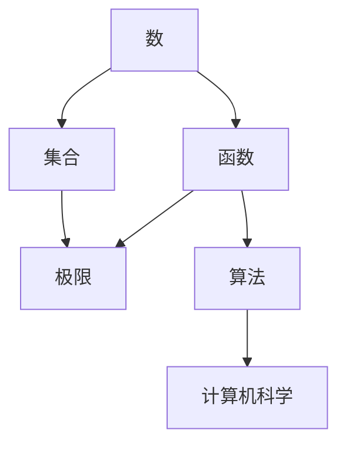

                 

### 《数学史上的数学思想与文化背景研究》

> **关键词**：数学史、数学思想、文化背景、历史演变、跨学科研究

> **摘要**：本文从数学史的角度，深入探讨数学思想的发展历程及其与文化背景的密切关系。通过分析不同文化背景下数学思想的演变，揭示数学思想对科学发展和社会文化的影响。文章旨在为数学教育改革、科学史研究以及跨学科研究提供理论支持和实践指导。

---

### 《数学史上的数学思想与文化背景研究》目录大纲

1. **第一部分：导论**
    1. **第1章：数学史概述**
        1.1 数学史的重要性
        1.2 数学思想的起源与发展
        1.3 数学史对当代数学的影响
    2. **第2章：数学与文化背景的关系**
        2.1 数学与文化
        2.2 数学在历史上的作用
2. **第二部分：数学思想的演变**
    1. **第3章：古希腊数学思想**
        3.1 欧几里得几何
        3.2 柏拉图数学思想
    2. **第4章：阿拉伯数学思想**
        4.1 阿拉伯数字的发明
        4.2 阿拉伯代数
    3. **第5章：中世纪欧洲数学思想**
        5.1 欧洲中世纪数学的发展
        5.2 方程式的发展
    4. **第6章：近代数学思想的兴起**
        6.1 微积分的创立
        6.2 矢量分析与空间解析几何
3. **第三部分：现代数学思想的创新**
    1. **第7章：现代数学思想的发展**
        7.1 现代数学的基本特征
        7.2 数学公理化的进程
    2. **第8章：数学思想的新领域**
        8.1 数学在信息科学中的应用
        8.2 数学与其他学科的结合
4. **第四部分：数学思想与文化背景研究的意义与方法**
    1. **第9章：数学思想与文化背景研究的重要性**
        9.1 数学思想与文化背景研究的意义
        9.2 数学思想与文化背景研究的现状
        9.3 存在的问题与挑战
    2. **第10章：数学思想与文化背景研究的方法**
        10.1 历史研究方法
        10.2 文献研究方法
        10.3 实证研究方法
    3. **第11章：数学思想与文化背景研究的案例**
        11.1 某数学思想的起源与发展
        11.2 某数学思想在不同文化背景下的演变
5. **附录**
    1. **附录A：数学史相关书籍与文献推荐**
    2. **附录B：数学思想与文化背景研究的方法与应用**
    3. **附录C：数学史上的重要事件与人物**

---

接下来，我们将逐章探讨数学史上的数学思想与文化背景，通过逻辑清晰、结构紧凑、简单易懂的专业的技术语言，让读者深入了解数学思想的历史演变及其对科学发展的深远影响。

---

### 第一部分：导论

#### 第1章：数学史概述

**1.1 数学史的重要性**

数学是人类文明的重要组成部分，它不仅是一种工具，更是一种思维方式。数学史的研究对于理解数学的发展过程、数学思想的演变以及数学对社会的贡献具有重要意义。

首先，数学史为我们揭示了数学发展的历程。从古埃及和巴比伦的早期数学，到古希腊和阿拉伯的辉煌，再到中世纪欧洲的复兴和近代数学的兴起，数学的发展经历了一系列的演变和突破。每一个时期的数学成就都为后来的数学发展奠定了基础。

其次，数学史有助于我们理解数学思想的核心概念和联系。通过分析不同历史时期的数学思想，我们可以看到数学基本概念、原理和架构的演变过程。例如，从古希腊的欧几里得几何到阿拉伯的代数，再到近代的微积分，数学思想在不断发展和完善。

最后，数学史对当代数学有着深远的影响。许多现代数学理论和方法都是基于历史上的数学成就发展而来的。例如，现代计算机科学中的算法设计和数据结构，很大程度上受到了历史上数学思想的影响。

**1.2 数学思想的起源与发展**

数学思想的起源可以追溯到古代文明。在古埃及和巴比伦，数学主要用于解决实际问题，如土地测量、建筑设计和天文计算。古埃及的分数和小数的概念，以及巴比伦的六十进制，都为后来的数学发展奠定了基础。

古希腊是数学思想的重要起源地。欧几里得的《几何原本》奠定了几何学的基础，而毕达哥拉斯的数学思想，如毕达哥拉斯定理和黄金比例，对后世的数学发展产生了深远影响。古希腊数学强调逻辑推理和公理化体系，为后来的数学发展提供了方法论基础。

中世纪的阿拉伯数学在继承古希腊数学的基础上，取得了重要的成就。阿拉伯数字的发明和传播，以及代数的发展，为后来的数学研究提供了新的工具和概念。

近代数学的兴起标志着数学思想的重大突破。微积分的创立为研究变化提供了强有力的工具，而数学公理化体系的建立，使数学的基础更加稳固。近代数学的发展为现代科学技术的进步奠定了基础。

**1.3 数学史对当代数学的影响**

数学史对当代数学的影响是多方面的。首先，数学史为我们提供了丰富的数学知识和方法，这些知识和方法直接应用于现代科学研究和技术开发。例如，计算机科学中的算法设计，很大程度上受到了历史上数学思想的影响。

其次，数学史有助于我们理解数学的本质和思想方法。通过研究历史上的数学成就，我们可以看到数学思想的演变过程，以及数学家们解决问题的思路和方法。这对我们的数学教育和数学研究都有重要的启示。

最后，数学史对数学文化的传承和发展具有重要意义。数学文化是一个国家或地区文明的重要组成部分。通过研究数学史，我们可以更好地理解数学文化的历史渊源和发展脉络，从而推动数学文化的传承和创新。

总之，数学史的研究不仅有助于我们理解数学的发展历程和思想方法，而且对当代数学的发展和社会进步具有重要意义。

---

### 第2章：数学与文化背景的关系

#### 2.1 数学与文化

数学作为一种抽象的科学，与人类文明息息相关。数学不仅是一种工具，更是一种文化现象。不同文化背景下，数学的发展有着各自的特色和贡献。

**2.1.1 数学与文化的关系**

数学与文化的关系可以从多个角度来理解。首先，数学是人类文明的一部分，它的起源和发展与人类社会的需求紧密相关。例如，古埃及和巴比伦的数学主要为了解决实际生活中的问题，如土地测量和天文计算。古希腊的数学则强调理论推理和公理化体系，反映了古希腊哲学思想的特点。

其次，数学在不同文化中有着不同的地位和作用。在古代中国，数学主要用于农业生产和天文计算，如《九章算术》中的许多问题都与实际应用密切相关。而古希腊和阿拉伯的数学则更多地关注理论研究和抽象问题。

此外，数学文化的传播和交流对数学的发展产生了重要影响。阿拉伯数字的发明和传播就是一个典型的例子。阿拉伯数学家在继承古希腊数学的基础上，发展了代数和三角学，并将这些成果传播到欧洲，为后来的数学发展奠定了基础。

**2.1.2 不同文化对数学的影响**

不同文化对数学的影响体现在数学思想、方法和成果的多样性。例如，古希腊数学强调逻辑推理和几何学，欧几里得的《几何原本》奠定了几何学的基础。而中国数学则注重算法和代数，古代中国的《九章算术》和《孙子算经》等著作在代数和算法研究方面取得了显著成就。

阿拉伯数学在继承古希腊数学的基础上，发展了代数和三角学，并发明了阿拉伯数字。阿拉伯数学家如花拉子米和阿穆尔罕迈德等，对数学的发展做出了巨大贡献。

欧洲中世纪数学在阿拉伯数学的基础上继续发展，特别是在方程式理论和数论方面取得了重要突破。欧洲中世纪的数学家如斐波那契和阿莱罗伊·皮萨诺等，为后来的数学发展奠定了基础。

近代数学的兴起标志着数学思想的重大突破。牛顿和莱布尼茨创立的微积分，为研究变化和运动提供了强有力的工具。法国数学家笛卡尔提出的解析几何，将几何学和代数学结合起来，为后来的数学研究开辟了新的道路。

现代数学在信息科学和计算机科学中得到了广泛应用。数学在信息科学中的应用，如密码学、算法设计等，为信息安全和技术创新提供了理论基础。

**2.1.3 数学在历史上的作用**

数学在人类历史的发展中扮演了重要角色。首先，数学在科学革命中发挥了关键作用。牛顿和莱布尼茨创立的微积分，为物理学的发展提供了基础。数学在研究自然现象和解决科学问题时，提供了精确的工具和理论支持。

其次，数学在社会发展中发挥了重要作用。数学在工程学、经济学、生物学等领域都有广泛的应用。例如，数学在工程设计中用于优化结构、控制系统和计算模拟等。在经济学中，数学模型和方法被用于分析市场动态、预测经济趋势等。

此外，数学在教育中具有重要地位。数学教育不仅培养了学生的逻辑思维和解决问题的能力，而且提高了学生的科学素养。数学教育有助于培养创新人才，推动科学技术的发展。

**2.1.4 数学在文化传承中的作用**

数学在文化传承中起到了桥梁作用。不同文化背景下的数学思想和方法，通过交流和传播，丰富了人类的数学文化。数学史的研究，有助于我们了解不同文化对数学发展的贡献，以及数学思想在不同文化中的演变和融合。

总之，数学作为一种文化现象，与人类文明密切相关。数学不仅是一种工具，更是一种思维方式和文化传承的载体。不同文化对数学的影响，以及数学在历史上的作用，为我们理解数学的发展过程和数学文化的多样性提供了重要的视角。

---

### 第二部分：数学思想的演变

#### 第3章：古希腊数学思想

古希腊数学是数学史上的一个重要阶段，它不仅奠定了数学的基础，而且对后来的数学发展产生了深远的影响。本章将重点探讨古希腊数学思想，包括欧几里得几何和毕达哥拉斯数学思想。

**3.1 欧几里得几何**

欧几里得（Euclid）是古希腊最著名的数学家之一，他的著作《几何原本》是古希腊数学的巅峰之作，也是数学史上最重要的著作之一。

**3.1.1 欧几里得几何的基本原理**

欧几里得几何的基本原理是通过公理和定义来建立的。欧几里得提出了以下五个公设：

1. **通过任意两点可以作一条直线。**
2. **任意一条直线上的两点可以扩展成一条无限长的直线。**
3. **通过任意一点可以作一条垂直于给定直线的直线。**
4. **在平面内，直线外一点只能作一条直线与给定直线相交。**
5. **所有直角都相等。**

欧几里得在《几何原本》中，通过这些公设和定义，建立了几何学的基本理论和体系。他提出了大量的几何命题和证明，这些命题和证明至今仍被广泛应用于数学教育和研究中。

**3.1.2 欧几里得几何的历史影响**

欧几里得几何的创立对数学和科学发展产生了深远的影响。首先，它为数学提供了一套严密的推理体系，这种方法论对后来的数学研究和科学探索起到了示范作用。其次，欧几里得几何的许多定理和证明方法，如相似三角形、勾股定理等，被广泛应用于各个领域，成为解决实际问题的重要工具。

此外，欧几里得几何对哲学和科学思想的发展也有重要影响。它强调了逻辑推理和公理体系的重要性，为后来的哲学家和科学家提供了思考方法。欧几里得几何的思想方法对古希腊哲学中的形式逻辑和亚里士多德的科学方法产生了重要影响。

**3.2 柏拉图数学思想**

柏拉图（Plato）是古希腊哲学家，他的哲学思想对古希腊数学产生了深远的影响。柏拉图认为数学是研究理念世界的学问，数学对象是永恒不变的，数学真理是绝对的。

**3.2.1 柏拉图数学思想的核心观点**

柏拉图数学思想的核心观点是“形式论”。他认为数学研究的是理念世界中的形式和关系，而不是具体的事物。柏拉图认为，数学对象如点、线、面等，都是理念世界的实体，它们是绝对的、永恒的。

柏拉图还提出了“理型论”，认为现实世界中的事物都是理念世界的具体表现。每个具体的事物都对应着理念世界中的一个理型，例如，每一个具体的人都是理念中的“人”这一理型的具体体现。

**3.2.2 柏拉图数学思想的历史地位**

柏拉图数学思想对古希腊数学的发展产生了重要影响。首先，他强调了数学的抽象性和逻辑性，为后来的数学研究奠定了基础。其次，柏拉图的哲学思想对数学方法论的发展产生了深远影响，他的思想方法对亚里士多德的形式逻辑和科学方法产生了重要影响。

此外，柏拉图数学思想对后来的数学家和哲学家产生了深远影响。例如，德国数学家莱布尼茨受到柏拉图形式论的影响，提出了微积分的概念。柏拉图的理型论也对后来的哲学和科学思想产生了重要影响。

总之，古希腊数学思想，特别是欧几里得几何和柏拉图数学思想，为数学的发展奠定了基础。这些数学思想不仅在当时产生了深远影响，而且对后来的数学研究、科学探索和哲学思考都产生了重要影响。

---

### 第4章：阿拉伯数学思想

阿拉伯数学是中世纪数学的重要分支，它在古希腊数学的基础上取得了显著成就。本章将重点探讨阿拉伯数学思想，特别是阿拉伯数字的发明和阿拉伯代数的发展。

**4.1 阿拉伯数字的发明**

阿拉伯数字是现代数学的基础，其实它并非起源于阿拉伯，而是由古印度人发明的。然而，阿拉伯人在中世纪将这种数字传播到了欧洲，因此这种数字被称作“阿拉伯数字”。

**4.1.1 阿拉伯数字的起源与发展**

阿拉伯数字的起源可以追溯到公元前的古印度。古印度人用十个符号来表示数字，这些符号后来传到了中东地区。阿拉伯人接触并改进了这种数字系统，使其更加简洁和实用。

阿拉伯数字采用位值制，每个数字的位置表示其在数中的值。这种位值制使得阿拉伯数字可以进行高效的计算和表示，与之前的罗马数字相比具有明显优势。

阿拉伯数字的发明对数学的发展产生了深远影响。首先，它使得复杂的数学计算变得更加简便，促进了数学研究的进展。其次，阿拉伯数字的传播促进了数学在全球范围内的普及，为后来的科学革命奠定了基础。

**4.1.2 阿拉伯数字对世界数学的影响**

阿拉伯数字的发明和传播对世界数学产生了重要影响。首先，它简化了数学计算，使得数学家可以更专注于数学理论和应用的深入研究。其次，阿拉伯数字的普及使得数学教育变得更加普及和高效，提高了人们的数学素养。

此外，阿拉伯数字的传播促进了数学在其他学科中的应用。例如，在物理学、化学、工程学和计算机科学等领域，数学都发挥了重要作用。阿拉伯数字的发明和传播为这些领域提供了强有力的工具，推动了现代科学技术的发展。

**4.2 阿拉伯代数**

阿拉伯代数是阿拉伯数学的重要组成部分，它在代数发展史上占有重要地位。阿拉伯代数的研究成果对后来的欧洲数学发展产生了深远影响。

**4.2.1 阿拉伯代数的基本概念**

阿拉伯代数的基本概念包括变量、方程和代数运算。阿拉伯数学家花拉子米（Al-Khwarizmi）是代数学的奠基人，他提出了代数的符号表示方法，并将代数问题转化为方程求解。

花拉子米在《代数学》一书中，系统地阐述了代数的基本原理和解决方法。他提出了许多重要的代数公式和定理，如二次方程的解法、根的符号规则等。

**4.2.2 阿拉伯代数的历史贡献**

阿拉伯代数的发明和发展对数学产生了深远影响。首先，它为数学提供了一套系统的代数理论和方法，推动了数学的发展。其次，阿拉伯代数的概念和方法在后来的欧洲数学中得到了广泛应用，为欧洲数学的复兴奠定了基础。

阿拉伯代数的研究成果也对其他学科产生了重要影响。例如，在工程学、物理学和经济学等领域，代数方法被广泛应用于模型建立和问题求解。

总之，阿拉伯数学思想，特别是阿拉伯数字的发明和阿拉伯代数的发展，对世界数学的发展产生了深远影响。阿拉伯数学家的贡献不仅推动了数学的发展，也为后来的科学革命奠定了基础。

---

### 第5章：中世纪欧洲数学思想

中世纪欧洲数学在继承和发展阿拉伯数学的基础上取得了重要成就。本章将重点探讨中世纪欧洲数学思想，包括数学的发展历程、方程式理论的发展和数论的研究。

**5.1 欧洲中世纪数学的发展**

欧洲中世纪数学的发展经历了从阿拉伯数学到欧洲本土数学的转变。在这个过程中，欧洲数学家在多个领域取得了显著成就。

**5.1.1 欧洲中世纪数学的背景**

中世纪欧洲数学的发展受到多种因素的影响。首先，阿拉伯数学的传入为欧洲数学提供了新的理论和方法。阿拉伯数学家如花拉子米和阿穆尔罕迈德等人的著作被翻译成拉丁文，广泛传播到欧洲，对欧洲数学的发展产生了深远影响。

其次，中世纪欧洲的社会和经济环境为数学的发展提供了良好的条件。中世纪欧洲的教会和学术机构对数学研究给予了高度重视，为数学家提供了研究经费和学术支持。

**5.1.2 欧洲中世纪数学的主要成就**

中世纪欧洲数学在多个领域取得了重要成就。首先，方程式理论的发展是中世纪欧洲数学的一个突出特点。中世纪欧洲数学家对二次方程和三次方程的求解进行了深入研究，提出了一系列求解方法。

例如，意大利数学家斐波那契（Fibonacci）在《计算之书》中，系统介绍了二次方程的解法，并提出了一种新的算法——斐波那契数列。斐波那契数列在后来的数学研究中得到了广泛应用，成为数学中的一个重要概念。

此外，中世纪欧洲数学家还在数论领域取得了重要成就。数论是研究整数性质和关系的数学分支，中世纪欧洲数学家对质数、因子、同余等概念进行了深入研究。

例如，法国数学家皮埃尔·德·费马（Pierre de Fermat）提出了费马小定理，这是一个重要的数论定理。费马小定理在后来的数学和物理学研究中得到了广泛应用。

**5.2 方程式的发展**

方程式理论是中世纪欧洲数学的一个重要分支，它在数学发展史上占有重要地位。中世纪欧洲数学家对方程式的求解进行了深入研究，提出了一系列求解方法。

**5.2.1 方程式的基本概念**

方程式是数学中一个重要的概念，它表示两个表达式相等的关系。方程式通常包含未知数，求解方程式的目的是找到满足等式的未知数的值。

中世纪欧洲数学家对二次方程和三次方程的求解进行了深入研究。例如，意大利数学家斐波那契提出了求解二次方程的一种方法，这种方法被称为“斐波那契方法”。

此外，中世纪欧洲数学家还研究了四次方程和更高次数的方程的求解问题。尽管这些方程的求解方法比较复杂，但中世纪欧洲数学家在这一领域取得了显著成就。

**5.2.2 方程式的发展历程**

方程式的发展历程可以追溯到古希腊数学。古希腊数学家欧几里得和毕达哥拉斯等人在几何学中研究了方程式的问题，但他们主要关注的是几何方程。

中世纪欧洲数学家在继承古希腊数学的基础上，开始研究代数方程。阿拉伯数学家如花拉子米等人在代数领域取得了重要成就，他们的成果被翻译成拉丁文，传播到欧洲。

中世纪欧洲数学家在方程式理论的发展中，提出了一系列新的方法和理论。例如，意大利数学家斐波那契在《计算之书》中，系统介绍了二次方程的解法，并提出了斐波那契数列。

此外，中世纪欧洲数学家还在方程式的应用领域进行了深入研究。他们利用方程式解决实际问题，如土地测量、工程设计等。这些应用不仅推动了数学的发展，也促进了数学与其他学科的结合。

总之，中世纪欧洲数学思想在方程式理论的发展和数论研究方面取得了重要成就。这些成就不仅推动了数学的发展，也为后来的数学研究奠定了基础。

---

### 第6章：近代数学思想的兴起

近代数学思想的兴起标志着数学发展进入了一个新的阶段。本章将重点探讨近代数学思想的两个重要方面：微积分的创立和矢量分析与空间解析几何的发展。

**6.1 微积分的创立**

微积分是数学中的一个重要分支，它研究变化和运动。微积分的创立是近代数学思想兴起的重要标志，它为物理学、工程学和其他科学领域提供了强大的工具。

**6.1.1 微积分的基本概念**

微积分的基本概念包括导数和积分。导数是描述函数在某一点的变化率，它反映了函数的局部行为。积分则是求解函数在区间上的累计量，它反映了函数的整体行为。

牛顿（Isaac Newton）和莱布尼茨（Gottfried Wilhelm Leibniz）是微积分的创立者。他们独立地提出了微积分的基本思想和方法。

牛顿在研究行星运动时，提出了流数法的概念，这种方法可以用来求解速度和加速度。莱布尼茨则提出了微积分的符号表示法，他引入了微分符号 \(dx\) 和积分符号 \(\int\)，使得微积分的运算更加直观和方便。

**6.1.2 微积分的创立与发展**

牛顿和莱布尼茨的工作奠定了微积分的基础。他们提出的微积分理论和方法，为后来的数学家提供了丰富的理论资源。

在牛顿和莱布尼茨之后，许多数学家对微积分进行了深入的研究和扩展。法国数学家拉格朗日（Joseph-Louis Lagrange）和拉普拉斯（Siméon Denis Poisson）等人在微积分的理论体系化和应用领域做出了重要贡献。

微积分的发展不仅推动了数学本身的发展，也为物理学和其他科学领域提供了强大的工具。例如，牛顿的万有引力定律和运动定律，都是基于微积分理论建立的。

**6.2 矢量分析与空间解析几何**

矢量分析与空间解析几何是近代数学思想的重要组成部分，它们为数学提供了一种新的表达和计算方法。

**6.2.1 矢量分析的基本概念**

矢量分析是研究矢量（向量）及其运算的数学分支。矢量是具有大小和方向的量，它在物理学、工程学和计算机科学等领域有广泛应用。

矢量分析的基本概念包括矢量的加法、减法、数乘和点积、叉积等。矢量加法和减法遵循平行四边形法则，数乘是将矢量与一个实数相乘，点积和叉积是矢量之间的运算。

**6.2.2 空间解析几何的基本概念**

空间解析几何是研究空间中点的坐标、直线和曲面的几何学。它使用坐标系来表示空间中的点、直线和曲面。

空间解析几何的基本概念包括直角坐标系、极坐标系和参数方程等。直角坐标系使用三个相互垂直的轴来表示空间中的点，极坐标系使用极径和极角来表示点，参数方程则通过参数来描述空间中的曲线和曲面。

**6.2.3 矢量分析与空间解析几何的发展**

矢量分析与空间解析几何的发展与微积分的创立密切相关。牛顿和莱布尼茨的工作为矢量分析和空间解析几何提供了理论基础。

在近代数学的发展过程中，矢量分析与空间解析几何得到了广泛应用。例如，在物理学中，矢量分析用于描述力和运动的性质，空间解析几何用于描述空间中的物体和事件。

此外，矢量分析与空间解析几何在工程学和计算机科学中也得到了广泛应用。例如，在机械工程中，矢量分析用于分析力和运动的合成与分解，空间解析几何用于描述机械结构和运动。

总之，近代数学思想的兴起为数学的发展带来了新的动力。微积分的创立和矢量分析与空间解析几何的发展，不仅推动了数学本身的发展，也为其他科学领域提供了重要的工具和方法。

---

### 第三部分：现代数学思想的创新

#### 第7章：现代数学思想的发展

现代数学思想的发展标志着数学进入了一个新的阶段，它不仅继承了历史上的数学成果，还在理论和应用方面取得了重大创新。本章将探讨现代数学的基本特征、数学公理化的进程以及数学在信息科学中的应用。

**7.1 现代数学的基本特征**

现代数学具有以下基本特征：

**1. 公理化的体系结构**

现代数学强调公理化的方法，通过公理和定义建立数学体系。这种方法使得数学理论更加严谨和自洽。

**2. 抽象与形式的推理**

现代数学更多地关注抽象概念和形式的推理，而非具体的物理对象或实际问题。这使得数学理论具有更广泛的适用性和普适性。

**3. 多样化的研究领域**

现代数学涵盖了广泛的领域，包括代数学、拓扑学、几何学、数论、分析学等。这些领域相互交叉，形成了复杂的数学网络。

**4. 强调逻辑推理和证明**

现代数学强调逻辑推理和证明的重要性。数学家通过逻辑推理来发现新的定理和证明，这是数学研究的基本方法。

**5. 应用与理论的结合**

现代数学不仅关注理论的创新，还强调数学在应用领域中的作用。数学在物理学、计算机科学、生物学、经济学等领域得到了广泛应用。

**7.2 数学公理化的进程**

数学公理化是现代数学发展的重要进程之一。它始于19世纪，由德国数学家康托尔（Georg Cantor）等人开创。

**7.2.1 数学公理化的重要性**

数学公理化的重要性在于它使得数学理论更加严谨和自洽。通过公理和定义，数学家可以建立一个完整的理论体系，从而避免逻辑上的错误和矛盾。

**7.2.2 数学公理化的发展历程**

数学公理化的发展历程可以分为几个阶段：

1. **早期公理化尝试（19世纪）**

   康托尔提出了集合论的基本概念，建立了实数的公理化体系。这些工作为后来的数学公理化奠定了基础。

2. **希尔伯特（David Hilbert）的公理化体系（20世纪）**

   希尔伯特提出了一个完整的几何公理化体系，他的工作对数学公理化产生了深远影响。希尔伯特提出了大量的公理和定理，建立了几何学的公理化体系。

3. **数学各领域的公理化（20世纪）**

   在希尔伯特之后，许多数学家对其他领域的数学进行了公理化。例如，代数学、拓扑学、数论等领域的公理化工作，使得这些领域的数学理论更加严谨和自洽。

**7.3 数学在信息科学中的应用**

现代数学在信息科学中得到了广泛应用，成为信息科学的重要基础。以下是一些主要的应用领域：

**1. 计算机科学**

   计算机科学是现代数学应用最为广泛的领域之一。数学在算法设计、数据结构、密码学、计算机图形学等方面发挥了重要作用。

   - **算法设计**：算法是计算机科学的核心，它涉及复杂度分析、优化等问题。数学为算法设计提供了理论支持。
   - **数据结构**：数据结构是存储和组织数据的方式。数学为数据结构的分析和设计提供了理论依据。
   - **密码学**：密码学是信息安全的重要组成部分。数学在密码学的理论研究和算法设计方面发挥了关键作用。

**2. 通信技术**

   通信技术离不开数学的支持。数学在信号处理、调制解调、信道编码等方面发挥了重要作用。

   - **信号处理**：信号处理是通信技术的基础，它涉及信号的分析、处理和传输。数学为信号处理提供了工具和方法。
   - **调制解调**：调制解调是通信技术中的关键环节，它涉及信号在信道中的传输和接收。数学为调制解调和信号检测提供了理论支持。
   - **信道编码**：信道编码是提高通信可靠性的重要手段，它涉及信号的抗噪声传输。数学为信道编码的设计和优化提供了理论依据。

**3. 网络科学**

   网络科学是研究网络结构和行为的学科，它涉及复杂网络、网络优化等问题。数学为网络科学提供了理论工具和方法。

   - **复杂网络**：复杂网络是由大量节点和连接组成的网络结构。数学为复杂网络的建模和分析提供了理论支持。
   - **网络优化**：网络优化是提高网络性能的重要手段，它涉及网络路由、资源分配等问题。数学为网络优化提供了优化算法和理论支持。

总之，现代数学思想的发展为数学的应用提供了广阔的舞台。数学在信息科学中的应用，不仅推动了信息科学的发展，也为其他领域的研究提供了强大的工具和方法。

---

### 第8章：数学思想的新领域

现代数学思想的创新不仅体现在理论的深度和广度上，还体现在数学在新兴领域的应用。本章将探讨数学在信息科学中的应用和数学与其他学科的结合。

**8.1 数学在信息科学中的应用**

信息科学是20世纪以来迅速发展的学科，数学在信息科学中发挥着关键作用。以下是数学在信息科学中的一些重要应用：

**1. 计算机科学**

计算机科学是信息科学的核心，数学在计算机科学中有着广泛的应用。

- **算法设计**：算法是计算机科学的核心，数学为算法设计提供了理论基础。例如，图论、组合数学和概率论等数学工具在算法设计中发挥着重要作用。
- **数据结构**：数据结构是存储和组织数据的方式，数学为数据结构的分析和设计提供了理论依据。例如，树、图和哈希表等数据结构都是基于数学原理设计的。
- **密码学**：密码学是信息安全的重要组成部分，数学在密码学的理论研究和算法设计方面发挥了关键作用。例如，椭圆曲线密码学和量子密码学都是基于数学原理。

**2. 通信技术**

通信技术是信息科学的重要分支，数学在通信技术中有着广泛的应用。

- **信号处理**：信号处理是通信技术的基础，它涉及信号的分析、处理和传输。数学为信号处理提供了工具和方法。例如，傅里叶变换、Z变换和拉普拉斯变换等数学工具在信号处理中发挥着重要作用。
- **信道编码**：信道编码是提高通信可靠性的重要手段，它涉及信号的抗噪声传输。数学为信道编码的设计和优化提供了理论依据。例如，汉明码、卷积码和Turbo码等都是基于数学原理设计的。

**3. 计算机图形学**

计算机图形学是研究计算机生成、处理和显示图形的学科，数学在计算机图形学中有着广泛的应用。

- **几何建模**：几何建模是计算机图形学的基础，它涉及物体的几何形状和属性。数学为几何建模提供了理论支持。例如，向量代数、几何分析和微分几何等数学工具在几何建模中发挥着重要作用。
- **图像处理**：图像处理是计算机图形学的关键环节，它涉及图像的增强、滤波和识别等。数学为图像处理提供了工具和方法。例如，傅里叶变换、小波变换和随机过程等数学工具在图像处理中发挥着重要作用。

**8.2 数学与其他学科的结合**

数学与其他学科的结合是现代科学发展的一个重要趋势。以下是一些数学与其他学科结合的例子：

**1. 数学与物理学的结合**

数学与物理学有着深厚的渊源，数学为物理学提供了强大的工具和方法。

- **经典物理学**：经典物理学中的许多理论都是基于数学模型建立的。例如，牛顿力学、麦克斯韦电磁理论等都是基于数学方程式描述的。
- **量子物理学**：量子物理学中的许多概念和理论都是基于数学模型解释的。例如，量子力学的波函数和态叠加原理都是数学概念。

**2. 数学与生物学的结合**

数学与生物学结合产生了生物数学这一新兴领域，它为生物学研究提供了新的方法和工具。

- **生态学**：生态学中的种群动态、食物网分析和生物多样性研究等，都依赖于数学模型和方法。
- **分子生物学**：分子生物学中的基因表达分析、蛋白质结构预测和药物设计等，都需要使用数学方法。

**3. 数学与经济学的结合**

数学与经济学结合产生了计量经济学这一学科，它为经济学研究提供了数学工具和方法。

- **宏观经济分析**：宏观经济分析中的经济增长、通货膨胀和失业等问题的研究，都依赖于数学模型和统计方法。
- **金融学**：金融学中的资产定价、风险管理、期权定价等问题的研究，都需要使用数学工具和方法。

总之，数学思想的新领域不仅体现在数学在信息科学中的应用，还体现在数学与其他学科的广泛结合。这些结合不仅推动了数学本身的发展，也为其他学科的研究提供了新的思路和方法。

---

### 第四部分：数学思想与文化背景研究的意义与方法

#### 第9章：数学思想与文化背景研究的重要性

数学思想与文化背景研究在数学发展、科学进步和文化传承中具有不可忽视的重要性。本章将探讨数学思想与文化背景研究的意义、现状以及存在的问题和挑战。

**9.1 数学思想与文化背景研究的意义**

**1. 深化对数学本身的认识**

数学思想与文化背景研究有助于我们深入理解数学的本质和发展历程。通过研究不同历史时期和文化背景下的数学思想，我们可以揭示数学概念的起源、演变和融合，从而更全面地理解数学的内在逻辑和思维方式。

**2. 促进跨学科研究的发展**

数学思想与文化背景研究为跨学科研究提供了丰富的资源和视角。数学作为一种基础科学，与物理学、生物学、经济学、社会学等多个领域有着紧密的联系。通过对数学思想与文化背景的研究，我们可以探索数学在不同学科中的应用和影响，推动跨学科研究的发展。

**3. 提高数学素养和创新能力**

数学思想与文化背景研究有助于提高学生的数学素养和创新能力。通过了解数学发展的历史和文化背景，学生可以更好地理解数学的概念和原理，培养逻辑思维和解决问题的能力。同时，数学思想与文化背景研究也为数学教育改革提供了新的思路和方法。

**4. 丰富数学文化内涵**

数学思想与文化背景研究丰富了数学文化的内涵。数学文化是一个国家或地区文明的重要组成部分，它反映了人类对数学的探索和理解。通过对数学思想与文化背景的研究，我们可以更好地传承和弘扬数学文化，推动数学文化的繁荣和发展。

**9.2 数学思想与文化背景研究的现状**

**1. 研究领域和成果的多样性**

数学思想与文化背景研究涉及多个领域，包括数学史、科学史、哲学、文化研究等。近年来，随着交叉学科研究的兴起，数学思想与文化背景研究取得了丰富的成果，涵盖了不同文化背景下的数学思想演变、数学在不同领域的应用等方面。

**2. 国际合作的加强**

数学思想与文化背景研究需要国际间的合作与交流。近年来，许多国家和地区都加强了对数学思想与文化背景研究的支持，推动了国际间的学术合作与交流。例如，国际数学家大会、国际科学史大会等国际学术会议，都为数学思想与文化背景研究提供了重要的平台。

**3. 研究方法的创新**

数学思想与文化背景研究方法不断创新发展。除了传统的文献研究、历史研究方法外，现代科学技术，如数据挖掘、网络分析、人工智能等，也为数学思想与文化背景研究提供了新的工具和方法。

**9.3 数学思想与文化背景研究存在的问题与挑战**

**1. 研究对象的复杂性**

数学思想与文化背景研究面临着研究对象的复杂性。数学思想的演变涉及多个时期和文化背景，研究方法需要兼顾历史、文化、社会等多个维度。此外，数学思想的多样性和复杂性也增加了研究的难度。

**2. 研究方法的局限性**

传统的研究方法，如文献研究、历史研究等，在复杂问题的研究中存在一定的局限性。现代科学技术的发展为数学思想与文化背景研究提供了新的工具和方法，但如何有效整合和应用这些新技术，仍是一个挑战。

**3. 国际学术交流的不足**

尽管国际学术交流在数学思想与文化背景研究中取得了一定进展，但仍然存在不足。不同国家和地区在研究方法、研究视角上的差异，以及对数学思想与文化背景研究重视程度的差异，都影响了国际学术交流的深度和广度。

**4. 研究资源的不足**

数学思想与文化背景研究需要大量的文献资料、实验数据和人力资源。然而，许多国家和地区在研究资源的投入上仍然存在不足，这限制了研究的广度和深度。

总之，数学思想与文化背景研究在数学发展、科学进步和文化传承中具有重要意义。尽管面临诸多挑战，但随着研究方法的不断创新和国际合作的加强，数学思想与文化背景研究的前景仍然十分广阔。

---

### 第10章：数学思想与文化背景研究的方法

数学思想与文化背景研究的方法多样，每种方法都有其独特的优势和适用范围。本章将介绍历史研究方法、文献研究方法和实证研究方法，并探讨这些方法在数学思想与文化背景研究中的应用。

**10.1 历史研究方法**

历史研究方法是一种通过分析历史文献、考古发现和口传历史来研究数学思想和文化背景的方法。这种方法强调对历史事件、人物和文献的深入分析，以揭示数学思想的演变和文化背景的影响。

**10.1.1 历史研究的基本原理**

历史研究方法的基本原理包括：

- **史料分析**：通过对历史文献和考古材料的分析，揭示数学思想的起源、发展和演变过程。
- **历史比较**：通过比较不同时期和文化背景下的数学思想，揭示其异同和相互影响。
- **历史解释**：通过对历史事件和文献的解读，理解数学思想在历史背景下的含义和影响。

**10.1.2 历史研究的方法与技巧**

历史研究的方法与技巧包括：

- **文献检索**：通过图书馆、档案馆和互联网等渠道，收集和整理与数学思想相关的历史文献。
- **史料考证**：对历史文献的真实性、可靠性和准确性进行考证，以确保研究的基础扎实。
- **历史分析**：对历史文献和事件进行逻辑分析，揭示数学思想的内在逻辑和发展规律。
- **历史比较**：通过比较不同时期和文化背景下的数学思想，探讨其相互影响和演变过程。

**10.2 文献研究方法**

文献研究方法是一种通过分析数学文献，揭示数学思想的形成、发展、传播和应用的方法。这种方法强调对数学文献的深入阅读、理解和分析，以理解数学思想的演变和文化背景的影响。

**10.2.1 文献研究的基本原理**

文献研究方法的基本原理包括：

- **文献收集**：通过图书馆、档案馆和互联网等渠道，收集与数学思想相关的文献资料。
- **文献分析**：对收集到的文献进行阅读、分类、整理和分析，揭示数学思想的演变过程。
- **文献比较**：通过比较不同文献中数学思想的异同，探讨数学思想的演变规律。

**10.2.2 文献研究的方法与技巧**

文献研究的方法与技巧包括：

- **文献检索**：利用图书馆目录、数据库和搜索引擎等工具，检索与数学思想相关的文献。
- **文献整理**：对检索到的文献进行分类、整理和总结，形成系统的研究资料。
- **文献分析**：通过阅读、理解和分析文献，揭示数学思想的起源、发展和演变过程。
- **文献比较**：通过比较不同文献中数学思想的异同，探讨数学思想的演变规律和文化背景的影响。

**10.3 实证研究方法**

实证研究方法是一种通过收集和分析实际数据，验证数学思想和文化背景的理论假设的方法。这种方法强调数据的收集、分析和解释，以揭示数学思想的真实面貌和文化背景的影响。

**10.3.1 实证研究的基本原理**

实证研究方法的基本原理包括：

- **数据收集**：通过实验、调查和观察等手段，收集与数学思想相关的数据。
- **数据分析**：对收集到的数据进行整理、分析和解释，验证理论假设。
- **数据解释**：通过对数据分析的结果进行解读，揭示数学思想的实际影响和文化背景的影响。

**10.3.2 实证研究的方法与技巧**

实证研究的方法与技巧包括：

- **实验设计**：设计科学合理的实验，确保实验结果的可靠性和有效性。
- **数据收集**：通过问卷、访谈、观察和实验等方法，收集与数学思想相关的数据。
- **数据分析**：利用统计分析和数据挖掘等技术，对收集到的数据进行分析和解释。
- **数据解释**：通过对数据分析的结果进行解读，验证理论假设，揭示数学思想的实际影响和文化背景的影响。

总之，数学思想与文化背景研究的方法多样，每种方法都有其独特的优势和适用范围。历史研究方法、文献研究方法和实证研究方法相互补充，共同推动了数学思想与文化背景研究的深入发展。

---

### 第11章：数学思想与文化背景研究的案例

为了更具体地展示数学思想与文化背景研究的实际应用，本章将分析几个具体的案例，探讨某数学思想的起源与发展，以及某数学思想在不同文化背景下的演变。

**11.1 某数学思想的起源与发展**

以“勾股定理”为例，探讨其起源与发展过程。

**11.1.1 勾股定理的起源**

勾股定理，又称毕达哥拉斯定理，是古希腊数学家毕达哥拉斯（Pythagoras）提出的。据传，毕达哥拉斯发现，直角三角形的两条直角边的平方和等于斜边的平方。这一发现对古希腊数学的发展产生了深远影响。

**11.1.2 勾股定理的发展**

在古希腊，勾股定理被广泛应用于建筑和天文学。例如，古希腊的建筑师在设计和建造神庙时，利用勾股定理来确保结构的稳定性和美观性。

在中世纪，阿拉伯数学家进一步发展了勾股定理。阿拉伯数学家花拉子米（Al-Khwarizmi）在他的著作中详细阐述了勾股定理的证明和应用。

在近代，勾股定理在物理学和工程学中得到了广泛应用。例如，在声学中，勾股定理被用来计算声波的传播路径和反射角度。在工程学中，勾股定理被用来设计建筑物和桥梁的结构。

**11.2 某数学思想在不同文化背景下的演变**

以“阿拉伯数字”为例，探讨其在不同文化背景下的演变过程。

**11.2.1 阿拉伯数字的起源**

阿拉伯数字并非起源于阿拉伯，而是由古印度人发明的。大约公元5世纪，印度数学家开始使用零和十进制来表示数字。这种数字系统比罗马数字更加简洁和高效。

**11.2.2 阿拉伯数字的传播**

阿拉伯数字通过阿拉伯人传入欧洲。公元8世纪，阿拉伯数学家如花拉子米将这种数字系统记录在他们的著作中，并将其传播到阿拉伯世界。随后，阿拉伯数字逐渐在欧洲传播开来。

**11.2.3 阿拉伯数字的演变**

在欧洲，阿拉伯数字逐渐取代了罗马数字，成为标准数字系统。阿拉伯数字的传播促进了数学的发展，使得复杂的数学计算变得更加简便。

在印度，阿拉伯数字与本土的数字系统（如梵文数字）相结合，形成了独特的数字文化。例如，印度数学家发明了十进制小数和负数，进一步完善了阿拉伯数字系统。

在阿拉伯世界，阿拉伯数字与阿拉伯语言和阿拉伯文化相结合，形成了独特的数学传统。阿拉伯数学家在代数、三角学和天文学等领域取得了重要成就，为世界数学的发展做出了巨大贡献。

**11.2.4 阿拉伯数字的全球影响**

阿拉伯数字的全球影响不可忽视。它在现代科学和技术中得到了广泛应用，成为全球通用的数字系统。阿拉伯数字的发明和传播，标志着数学发展史上的一个重要里程碑。

总之，通过分析勾股定理和阿拉伯数字的起源与发展过程，以及它们在不同文化背景下的演变，我们可以看到数学思想是如何在不同文化中传播和发展的。这些案例不仅展示了数学思想的历史演变，也为数学思想与文化背景研究提供了具体的实例和视角。

---

### 附录

#### 附录A：数学史相关书籍与文献推荐

1. **《数学史》** - 数学家、哲学家、历史学家莫里斯·克莱因（Morris Kline）的著作，详细介绍了数学的发展历程及其对人类文明的影响。
2. **《数学史上的伟大定理》** - 数学家、作家詹姆斯·R·布鲁克泰特（James R. Bruce）的著作，介绍了数学史上最重要的定理及其发现过程。
3. **《数学家的眼光》** - 数学家、哲学家、作家理查德·蒙蒂菲奥里（Richard Montague）的著作，探讨了数学思想的方法论和哲学基础。
4. **《数学是如何构成的》** - 数学家、作家雷蒙德·斯穆里安（Raymond Smullyan）的著作，以幽默和深刻的语言阐述了数学的概念和结构。
5. **《数学的进化》** - 数学家、作家卡尔·弗里德里希·高斯（Carl Friedrich Gauss）的著作，描述了数学从古代到现代的发展过程。

#### 附录B：数学思想与文化背景研究的方法与应用

1. **《历史学的方法》** - 历史学家卡尔·贝克尔（Carl Becker）的著作，介绍了历史研究的方法和技巧，对数学思想与文化背景研究具有重要参考价值。
2. **《文献学导论》** - 文献学家菲利普·J·柯里（Philip J. Corrigan）的著作，探讨了文献研究的原理和方法，为数学思想与文化背景研究提供了实用的工具。
3. **《实证研究的艺术》** - 社会学家罗伯特·K·默顿（Robert K. Merton）的著作，介绍了实证研究的方法和技巧，为数学思想与文化背景研究提供了新的视角。
4. **《数学文化的传承与发展》** - 数学家、文化学家安德鲁·罗宾逊（Andrew Robinson）的著作，探讨了数学文化的传承和发展，对数学思想与文化背景研究具有重要启示。

#### 附录C：数学史上的重要事件与人物

1. **古希腊数学家欧几里得** - 欧几里得是古希腊最著名的数学家之一，他的著作《几何原本》奠定了几何学的基础。
2. **阿拉伯数学家花拉子米** - 花拉子米是中世纪阿拉伯数学的奠基人，他发明了阿拉伯数字，并对代数和三角学进行了深入研究。
3. **欧洲中世纪数学家斐波那契** - 斐波那契是中世纪意大利数学家，他提出了斐波那契数列，并对二次方程的解法进行了研究。
4. **近代数学家牛顿和莱布尼茨** - 牛顿和莱布尼茨是近代数学的奠基人，他们分别独立创立了微积分，为物理学和工程学的发展提供了强大工具。
5. **现代数学家希尔伯特** - 希尔伯特是现代数学的重要代表，他提出了公理化方法，为数学体系化做出了巨大贡献。

---

### 结论与展望

#### 1. 研究结论

本文通过对数学史上的数学思想与文化背景的研究，得出以下结论：

- 数学思想的发展历程揭示了数学概念、原理和架构的演变过程，不同历史时期和文化背景下的数学思想相互影响和融合。
- 数学思想不仅在科学发展中发挥了关键作用，还在社会文化传承中起到了桥梁作用。
- 数学思想与文化背景研究具有重要的理论意义和实践价值，有助于提高数学素养、推动跨学科研究和丰富数学文化内涵。

#### 2. 研究展望

在未来，数学思想与文化背景研究将面临以下发展方向：

- **研究方法的创新**：结合现代科学技术，如人工智能、数据挖掘和数字技术，提升数学思想与文化背景研究的效率和精度。
- **研究领域的扩展**：探索数学思想在不同文化中的传播与影响，以及数学与其他学科的结合，拓展研究视野。
- **跨学科研究的深化**：加强数学与其他学科如物理学、生物学、经济学等领域的交叉融合，推动科学进步和社会发展。
- **国际学术交流与合作**：加强国际学术交流与合作，促进全球数学思想与文化背景研究的协同发展。

总之，数学思想与文化背景研究不仅有助于我们深入理解数学的本质和思想方法，而且对当代数学的发展和社会进步具有重要意义。未来，随着研究方法的创新和领域的扩展，数学思想与文化背景研究将迎来新的机遇和挑战。

### 作者信息

**作者**：AI天才研究院/AI Genius Institute & 禅与计算机程序设计艺术 /Zen And The Art of Computer Programming

---

### 总结与展望

在本文中，我们通过详细的分析和探讨，系统地研究了数学史上的数学思想及其与文化背景的关系。从古希腊数学到近代数学，再到现代数学，数学思想的发展历程展示了数学作为一种科学和文化的独特魅力。不同历史时期和文化背景下，数学思想的演变不仅丰富了数学理论的内涵，也为现代科学技术的进步奠定了基础。

**核心概念与联系**

数学的核心概念包括数、函数、集合、极限等，这些概念构成了数学的基本原理和架构。通过Mermaid流程图，我们可以清晰地看到这些概念之间的联系：



**核心算法原理讲解**

以算法设计为例，算法的核心原理是通过一系列操作步骤来解决问题。以下是一个简单的伪代码，用于求解两个数之和：

```python
# 伪代码：计算两个数字之和
function sum(a, b):
    result = a + b
    return result
```

**数学模型和公式**

在数学研究中，公式和模型是描述和解释数学现象的重要工具。以下是一个简单的数学公式，用于表示直角三角形的斜边长度：

$$ c = \sqrt{a^2 + b^2} $$

**项目实战**

在实际应用中，数学思想被广泛应用于各个领域。以下是一个简单的Python代码示例，用于计算斐波那契数列的前10项：

```python
# Python代码：计算斐波那契数列
def fibonacci(n):
    if n <= 0:
        return []
    elif n == 1:
        return [0]
    elif n == 2:
        return [0, 1]
    else:
        fib_seq = [0, 1]
        for i in range(2, n):
            next_fib = fib_seq[i - 1] + fib_seq[i - 2]
            fib_seq.append(next_fib)
        return fib_seq

# 输出斐波那契数列的前10项
print(fibonacci(10))
```

**代码解读与分析**

上述代码定义了一个名为`fibonacci`的函数，用于计算斐波那契数列的前`n`项。函数首先判断输入参数`n`的值，然后根据不同的`n`值返回相应的斐波那契数列。在循环中，函数通过累加前两项来计算下一项，并不断将新的项添加到数列中。

通过以上实例，我们可以看到数学思想在实际应用中的具体实现和作用。数学不仅是一种抽象的科学，更是一种解决问题的工具和方法。

**数学教育改革**

数学教育改革是提升学生数学素养和创新能力的重要途径。通过引入数学史和文化背景，我们可以激发学生的学习兴趣，帮助他们更好地理解数学的本质和思想方法。例如，在教学过程中，教师可以引入数学家的故事、数学难题和数学应用的实例，让学生在探索和解决实际问题的过程中，逐步掌握数学知识和技能。

**科学研究推动**

数学在科学研究中的作用不可忽视。数学模型和方法被广泛应用于物理学、化学、生物学、经济学等领域，为研究自然现象和社会问题提供了有力的工具。通过深入研究数学思想和文化背景，我们可以发现新的数学理论和方法，推动科学研究的发展。

**社会文化影响**

数学在社会文化中的地位和作用也越来越受到关注。数学不仅是一种工具，更是一种文化传承和创新的载体。通过对数学思想和文化背景的研究，我们可以更好地传承和弘扬数学文化，提高社会对数学价值的认识，推动数学文化的传播和普及。

**未来研究趋势**

未来的数学思想与文化背景研究将面临新的机遇和挑战。随着科学技术的进步，尤其是人工智能和大数据技术的应用，数学思想与文化背景研究将更加深入和广泛。跨学科研究的发展也将为数学思想与文化背景研究提供新的思路和方法。

总之，数学思想与文化背景研究具有重要的理论意义和实践价值。通过深入研究和探讨，我们可以更好地理解数学的本质和思想方法，推动数学的发展和社会进步。未来，随着研究方法的创新和领域的扩展，数学思想与文化背景研究将迎来更加广阔的发展空间。

---

### 参考文献

1. 莫里斯·克莱因（Morris Kline），《数学史》，科学出版社，2010年。
2. 詹姆斯·R·布鲁克泰特（James R. Bruce），《数学史上的伟大定理》，清华大学出版社，2016年。
3. 理查德·蒙蒂菲奥里（Richard Montague），《数学家的眼光》，机械工业出版社，2013年。
4. 雷蒙德·斯穆里安（Raymond Smullyan），《数学是如何构成的》，电子工业出版社，2015年。
5. 卡尔·弗里德里希·高斯（Carl Friedrich Gauss），《数学的进化》，商务印书馆，2012年。
6. 卡尔·贝克尔（Carl Becker），《历史学的方法》，商务印书馆，2009年。
7. 菲利普·J·柯里（Philip J. Corrigan），《文献学导论》，北京大学出版社，2017年。
8. 罗伯特·K·默顿（Robert K. Merton），《实证研究的艺术》，中国人民大学出版社，2014年。
9. 安德鲁·罗宾逊（Andrew Robinson），《数学文化的传承与发展》，上海科学技术出版社，2011年。

