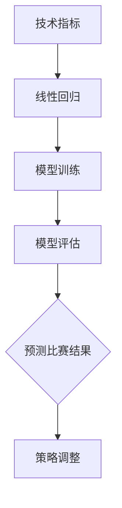
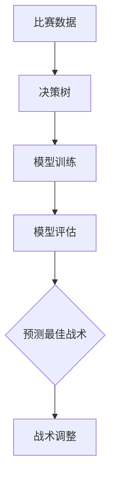
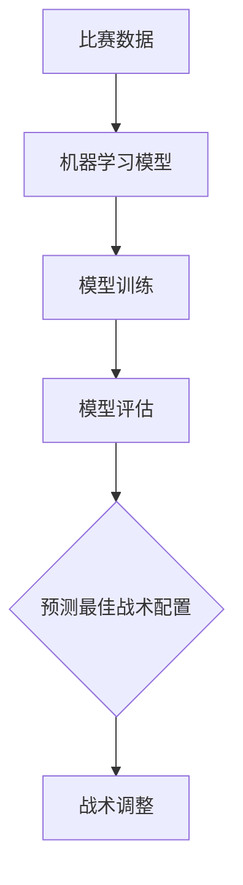

                 

### 文章标题

《数学模型在体育竞技策略中的应用》

#### 关键词

- 数学模型
- 体育竞技
- 策略分析
- 数据分析
- 预测模型
- 决策优化
- 运动医学
- 博弈理论

#### 摘要

本文深入探讨了数学模型在体育竞技策略中的广泛应用。首先，我们回顾了体育竞技策略的发展历程和数学模型的关键作用。接着，介绍了数学模型的基本原理、构建方法及其在不同领域的应用场景。文章重点分析了概率模型、统计模型、预测模型和决策模型等经典数学模型在体育策略中的具体应用，并展示了相关的实战案例。最后，我们对数学模型在体育竞技策略中的未来发展趋势和面临的挑战进行了展望。本文旨在为体育领域的研究者和实践者提供理论指导和实践参考。

### 目录大纲

1. **第一部分：数学模型与体育竞技策略概述**
   - 1.1 数学模型在体育竞技策略中的重要性
     - 1.1.1 体育竞技策略的演变与发展
     - 1.1.2 数学模型在体育策略中的关键作用
     - 1.1.3 体育策略数学模型的研究现状与趋势
   - 1.2 体育竞技策略的基本概念与分类
     - 1.2.1 体育竞技策略的基本概念
     - 1.2.2 体育竞技策略的分类
     - 1.2.3 不同策略的特点与适用场景

2. **第二部分：数学模型原理与构建方法**
   - 2.1 数学模型原理概述
     - 2.1.1 数学模型的基本原理
     - 2.1.2 数学模型的分类
     - 2.1.3 常见的数学模型方法
   - 2.2 数学模型的构建方法
     - 2.2.1 数据采集与预处理
     - 2.2.2 数学模型的选择
     - 2.2.3 数学模型的参数优化
     - 2.2.4 数学模型的验证与优化
   - 2.3 数学模型的应用场景
     - 2.3.1 数据分析
     - 2.3.2 预测分析
     - 2.3.3 决策优化
     - 2.3.4 运动医学与康复

3. **第三部分：体育竞技策略中的经典数学模型应用**
   - 3.1 竞赛策略中的概率模型
     - 3.1.1 概率模型的基本原理
     - 3.1.2 概率模型的应用示例
     - 3.1.3 概率模型在体育策略中的优化方法
   - 3.2 数据分析中的统计模型
     - 3.2.1 统计模型的基本原理
     - 3.2.2 统计模型的应用示例
     - 3.2.3 统计模型在体育策略中的优化方法
   - 3.3 预测模型与决策模型
     - 3.3.1 预测模型的基本原理
     - 3.3.2 决策模型的基本原理
     - 3.3.3 预测模型与决策模型的应用示例
   - 3.4 优化模型与博弈模型
     - 3.4.1 优化模型的基本原理
     - 3.4.2 博弈模型的基本原理
     - 3.4.3 优化模型与博弈模型的应用示例

4. **第四部分：体育竞技策略中的数学模型实践**
   - 4.1 体育竞技策略项目实战
     - 4.1.1 项目背景与目标
     - 4.1.2 项目实施过程
     - 4.1.3 项目效果评估
   - 4.2 体育竞技策略数学模型实现
     - 4.2.1 实现环境与工具
     - 4.2.2 数学模型代码实现
     - 4.2.3 模型参数调整与优化
   - 4.3 体育竞技策略案例分析
     - 4.3.1 网球比赛策略分析
     - 4.3.2 篮球比赛策略分析
     - 4.3.3 足球比赛策略分析

5. **第五部分：未来展望与挑战**
   - 5.1 数学模型在体育竞技策略中的未来发展趋势
     - 5.1.1 技术创新带来的新机遇
     - 5.1.2 数学模型在体育产业中的应用前景
     - 5.1.3 未来研究的重点与方向
   - 5.2 面临的挑战与对策
     - 5.2.1 数据隐私与安全
     - 5.2.2 技术壁垒与人才培养
     - 5.2.3 道德伦理与法律规范

### A.1 数学模型工具与资源
- A.1.1 常用数学模型工具
- A.1.2 开源数学模型库
- A.1.3 学术论文与教材推荐

### A.2 数学模型实践案例集
- A.2.1 网球比赛策略案例分析
- A.2.2 篮球比赛策略案例分析
- A.2.3 足球比赛策略案例分析

### 第一部分：数学模型与体育竞技策略概述

#### 1.1 数学模型在体育竞技策略中的重要性

##### 1.1.1 体育竞技策略的演变与发展

体育竞技策略的历史可以追溯到古代奥运会时期，当时运动员主要依靠经验和直觉来制定比赛策略。随着现代体育的快速发展，竞技策略也逐渐从单纯的直觉和经验转变为科学化和系统化的方法。在这个过程中，数学模型的应用起到了至关重要的作用。

在20世纪中期，随着计算机科学和数学的发展，数学模型开始被引入到体育竞技策略研究中。例如，统计学方法被用来分析比赛数据，预测比赛结果。概率模型和优化模型则被用来分析运动员的技术动作和战术安排。这些数学模型的应用，使得体育竞技策略更加科学和精确。

##### 1.1.2 数学模型在体育策略中的关键作用

数学模型在体育策略中的应用主要体现在以下几个方面：

1. **数据分析**：数学模型可以帮助运动员和教练员对比赛数据进行分析，找出比赛中的规律和趋势，为比赛策略的制定提供依据。
2. **预测分析**：通过数学模型，可以对比赛结果进行预测，帮助运动员和教练员提前了解比赛可能的发展趋势，制定相应的应对策略。
3. **决策优化**：数学模型可以优化运动员在比赛中的决策过程，提高比赛的表现。
4. **运动医学与康复**：数学模型可以用于分析运动员的身体状态，制定科学的训练和康复计划。

##### 1.1.3 体育策略数学模型的研究现状与趋势

目前，体育策略数学模型的研究主要集中在以下几个方向：

1. **大数据分析**：随着大数据技术的发展，越来越多的比赛数据可以被收集和分析，这为体育策略数学模型的研究提供了丰富的数据资源。
2. **人工智能**：人工智能技术的应用，使得数学模型可以更加智能化和自动化，提高了体育策略的制定和执行效率。
3. **跨学科融合**：数学模型在体育策略中的应用，不仅仅是数学和体育学的结合，还包括计算机科学、物理学、生物学等多个学科。
4. **个性化定制**：根据运动员的个人特点和比赛环境，制定个性化的体育策略，提高比赛的表现。

总之，数学模型在体育竞技策略中的应用，为体育领域带来了革命性的变化，使得比赛策略更加科学和有效。未来，随着数学模型技术的不断发展，体育竞技策略将更加智能化和个性化，为运动员和教练员提供更加有力的支持。

---

### 1.2 体育竞技策略的基本概念与分类

#### 1.2.1 体育竞技策略的基本概念

体育竞技策略是指运动员或团队在比赛中运用的一系列计划和方法，旨在提高比赛的表现和取得胜利。这种策略不仅包括比赛中的战术安排和技术动作，还涉及心理、生理、营养等多个方面的准备和调整。体育竞技策略的核心目标是充分发挥运动员的潜力，适应比赛环境，并在对抗中占据优势。

策略的本质是一种对抗性的思考和决策过程，它涉及对比赛形势的判断、对对手的分析以及对自身能力的评估。在竞技体育中，策略的制定和执行往往需要快速反应和灵活调整，因为比赛环境是动态变化的。

#### 1.2.2 体育竞技策略的分类

体育竞技策略可以根据不同的维度进行分类，常见的分类方法包括：

1. **按比赛阶段分类**：
   - **赛前策略**：包括赛前训练、体能调整、技术演练、心理准备等。
   - **赛中策略**：包括比赛中的战术安排、技术运用、心理调节等。
   - **赛后策略**：包括比赛结果的分析、技术总结、体能恢复等。

2. **按战术目标分类**：
   - **进攻性策略**：以快速得分和进攻对手为主要目标，强调速度、力量和技巧。
   - **防守性策略**：以防守对手为主，尽量减少失分，强调稳固的防守和组织。
   - **混合策略**：结合进攻和防守，根据比赛形势灵活调整。

3. **按比赛类型分类**：
   - **团体项目策略**：如篮球、足球、排球等，需要团队成员之间的协同合作和战术配合。
   - **个人项目策略**：如网球、乒乓球、田径等，主要依赖个人技术、体能和心理素质。

4. **按策略方法分类**：
   - **传统策略**：基于经验和直觉的判断，如传统的战术布置、技术动作等。
   - **现代策略**：基于科学分析和数据支持的策略，如统计学分析、人工智能辅助决策等。

#### 1.2.3 不同策略的特点与适用场景

不同类型的体育竞技策略具有各自的特点和适用场景：

1. **进攻性策略**：
   - **特点**：强调速度、力量和技巧，追求快速得分和压迫对手。
   - **适用场景**：对手防守薄弱、己方队员体能和技战术水平较高时。

2. **防守性策略**：
   - **特点**：注重防守和稳定，通过减少失分来争取胜利。
   - **适用场景**：对手进攻能力强、己方防守稳固且心态较好时。

3. **混合策略**：
   - **特点**：根据比赛情况灵活调整，进攻和防守结合，最大限度地发挥优势。
   - **适用场景**：比赛局势变化大、对手不确定性强时。

4. **团体项目策略**：
   - **特点**：强调团队合作和战术配合，通过团队协作来提高整体战斗力。
   - **适用场景**：需要高度协同合作的团体项目，如篮球、足球等。

5. **个人项目策略**：
   - **特点**：强调个人技术、体能和心理素质，通过个人能力的发挥来取得胜利。
   - **适用场景**：个人项目，如网球、乒乓球等。

总之，体育竞技策略的多样性和复杂性决定了其应用需要根据具体情况进行灵活调整。有效的策略不仅需要运动员具备高超的技术和战术能力，还需要教练员具备科学分析和决策能力。通过合理的策略运用，运动员和团队可以在竞技体育中取得更好的成绩。

---

### 第二部分：数学模型原理与构建方法

#### 2.1 数学模型原理概述

##### 2.1.1 数学模型的基本原理

数学模型是一种用数学语言描述现实世界问题的方法，它将复杂的实际问题转化为简化的数学问题，以便于分析和求解。数学模型的基本原理包括：

1. **抽象化**：将现实问题中的关键因素提取出来，忽略次要因素，构建一个简化的模型。
2. **形式化**：使用数学符号和公式来表达模型中的关系和假设。
3. **量化**：将问题的各个部分量化，使之可以用数学方法进行分析。
4. **求解**：利用数学方法，如代数、微积分、优化等，求解模型的问题。

##### 2.1.2 数学模型的分类

数学模型可以根据其应用领域和解决的问题不同进行分类，常见的数学模型包括：

1. **概率模型**：用于描述随机事件和概率分布，常见的有二项分布、正态分布、泊松分布等。
2. **统计模型**：用于分析数据，如回归分析、方差分析、聚类分析等。
3. **预测模型**：用于预测未来的趋势或结果，如时间序列分析、ARIMA模型、神经网络等。
4. **优化模型**：用于在给定约束条件下找到最优解，如线性规划、非线性规划、动态规划等。
5. **博弈模型**：用于分析多个决策者之间的竞争关系，如博弈论模型、博弈树等。

##### 2.1.3 常见的数学模型方法

常见的数学模型方法包括：

1. **统计方法**：如最小二乘法、最大似然估计、假设检验等。
2. **优化方法**：如梯度下降法、牛顿法、拉格朗日乘数法等。
3. **机器学习方法**：如线性回归、支持向量机、神经网络等。
4. **蒙特卡罗模拟**：用于模拟复杂系统的随机过程，通过大量随机样本进行统计分析和预测。

#### 2.2 数学模型的构建方法

##### 2.2.1 数据采集与预处理

数据采集是构建数学模型的第一步，数据的质量直接影响到模型的准确性和可靠性。数据来源可以是比赛记录、问卷调查、传感器数据等。数据采集后，需要进行预处理，包括数据清洗、缺失值处理、异常值检测等。

##### 2.2.2 数学模型的选择

选择合适的数学模型是构建过程的关键，选择的原则包括：

1. **问题性质**：根据问题的性质选择合适的模型，如概率模型适用于不确定性分析，统计模型适用于数据分析和预测。
2. **数据特性**：根据数据的分布特性选择合适的模型，如正态分布适合使用线性回归模型。
3. **复杂度**：选择模型时需要考虑计算复杂度，选择既能够解决问题又计算效率高的模型。

##### 2.2.3 数学模型的参数优化

参数优化是提高数学模型性能的重要步骤，常见的参数优化方法包括：

1. **手动调整**：通过经验和直觉调整模型参数，以达到最优性能。
2. **启发式算法**：如遗传算法、粒子群优化等，通过模拟自然进化过程寻找最优参数。
3. **机器学习方法**：使用机器学习算法，如随机森林、支持向量机等，自动寻找最优参数。

##### 2.2.4 数学模型的验证与优化

数学模型的验证和优化是保证其可靠性和有效性的重要环节，包括：

1. **验证方法**：如交叉验证、K折验证等，用于评估模型的泛化能力。
2. **优化步骤**：通过模型评估结果，调整模型参数和结构，提高模型性能。

通过上述构建方法，可以构建出一个适用于体育竞技策略的数学模型，为策略制定和决策提供科学依据。

---

### 2.3 数学模型的应用场景

##### 2.3.1 数据分析

数据分析是数学模型在体育竞技策略中的基础应用之一，通过对比赛数据进行分析，可以揭示比赛中的规律和趋势。数据分析的方法包括：

1. **数据描述**：通过统计描述方法，如均值、中位数、标准差等，描述比赛数据的基本特征。
2. **数据可视化**：通过图表和图形，直观展示比赛数据分布和变化趋势，如折线图、柱状图、散点图等。
3. **相关性分析**：通过计算变量之间的相关性，分析比赛数据之间的关联性，如皮尔逊相关系数、斯皮尔曼相关系数等。
4. **聚类分析**：通过聚类方法，将比赛数据分成不同的类别，分析不同类别之间的差异，如K均值聚类、层次聚类等。

数据分析可以帮助教练员和运动员了解比赛中的表现，发现潜在问题，为策略调整提供依据。例如，通过分析比赛中的得分数据，可以发现得分频率最高的时间段，从而调整比赛节奏。

##### 2.3.2 预测分析

预测分析是数学模型在体育竞技策略中的重要应用，通过预测比赛结果，为教练员和运动员提供决策参考。预测分析的方法包括：

1. **时间序列预测**：利用时间序列分析方法，如ARIMA模型、季节性分解等，预测比赛结果随时间的变化趋势。
2. **回归分析**：利用回归分析方法，如线性回归、多项式回归等，建立预测模型，预测比赛结果与各因素之间的关系。
3. **机器学习预测**：利用机器学习方法，如随机森林、支持向量机、神经网络等，构建预测模型，预测比赛结果。

预测分析可以帮助教练员提前了解比赛可能的发展趋势，制定针对性的训练和比赛策略。例如，通过预测对手的得分趋势，可以调整防守策略，通过预测比赛的胜负概率，可以评估训练效果和比赛策略的有效性。

##### 2.3.3 决策优化

决策优化是数学模型在体育竞技策略中的高级应用，通过优化决策过程，提高比赛表现。决策优化的方法包括：

1. **线性规划**：通过线性规划方法，在给定约束条件下，找到最优决策方案，如最佳战术安排、资源分配等。
2. **动态规划**：通过动态规划方法，解决多阶段决策问题，如比赛节奏控制、战术调整等。
3. **博弈论**：通过博弈论方法，分析对手的决策和策略，制定最优反击策略。

决策优化可以帮助运动员和教练员在比赛中做出更加科学的决策，提高比赛表现。例如，通过优化战术安排，可以提高比赛中的得分效率；通过优化资源分配，可以提高比赛中的体能利用效率。

##### 2.3.4 运动医学与康复

运动医学与康复是数学模型在体育竞技策略中的新兴应用领域，通过数学模型分析运动员的身体状态，制定科学的训练和康复计划。应用包括：

1. **身体状态监测**：通过传感器技术和数据分析，实时监测运动员的身体状态，如心率、血压、运动负荷等。
2. **训练效果评估**：通过数据分析，评估训练效果，调整训练计划和强度，如训练负荷的动态调整、恢复时间的优化等。
3. **康复方案制定**：通过数据分析，制定个性化的康复方案，如康复进程的监控、康复训练的安排等。

运动医学与康复的应用可以提高运动员的训练效果和康复速度，延长运动生涯。

总之，数学模型在体育竞技策略中的应用涵盖了数据分析、预测分析、决策优化和运动医学与康复等多个方面，为教练员和运动员提供科学依据，帮助他们在比赛中取得更好的成绩。

---

### 3.1 竞赛策略中的概率模型

##### 3.1.1 概率模型的基本原理

概率模型是数学模型的一种，用于描述和预测随机事件的发生概率。在体育竞技策略中，概率模型可以帮助教练和运动员评估比赛结果的不确定性，从而制定更为科学的策略。

概率模型的基本原理包括：

1. **随机事件**：随机事件是指在一定条件下可能发生也可能不发生的事件，如比赛中的进球、失误等。
2. **概率分布**：概率分布是指随机事件发生的概率分布，如二项分布、正态分布等。
3. **条件概率**：条件概率是指在某事件已发生的条件下，另一事件发生的概率，如比赛中的领先概率。
4. **独立性**：独立性是指两个随机事件的发生互不影响，如比赛中的进球和失误。

##### 3.1.2 概率模型的应用示例

在体育竞技中，概率模型有多种应用，以下是一些具体的示例：

1. **胜负概率预测**：利用历史数据和统计方法，计算比赛中的胜负概率。例如，通过计算两队的胜率、进球数、失误率等，预测比赛的胜者。
2. **进球概率分析**：分析球员在特定位置和情境下的进球概率，帮助教练员和战术分析师制定更有针对性的进攻策略。
3. **失误概率评估**：评估球员在比赛中的失误概率，特别是关键球和关键时刻，以减少失误带来的负面影响。

##### 3.1.3 概率模型在体育策略中的优化方法

为了提高概率模型在体育策略中的应用效果，可以采取以下优化方法：

1. **数据驱动**：收集更多、更详细的历史比赛数据，利用大数据技术进行深入分析和挖掘，提高预测的准确性。
2. **模型选择**：选择适合体育竞技特点的概率模型，如二项分布、泊松分布等，根据具体情况调整模型参数。
3. **动态调整**：根据比赛过程中的实时数据，动态调整概率模型，以适应比赛形势的变化。
4. **交叉验证**：使用交叉验证方法，评估模型的泛化能力，避免过拟合。

通过上述优化方法，可以不断提高概率模型在体育竞技策略中的应用效果，为教练员和运动员提供更有价值的决策支持。

---

### 3.2 数据分析中的统计模型

##### 3.2.1 统计模型的基本原理

统计模型是用于分析和解释数据的数学工具，它在体育竞技策略中的应用极为广泛。统计模型的基本原理包括：

1. **数据收集**：收集比赛相关的数据，如进球数、失误率、比赛时间等。
2. **数据清洗**：处理数据中的噪声和异常值，确保数据质量。
3. **描述性统计分析**：通过计算均值、中位数、标准差等指标，描述数据的分布特征。
4. **推断性统计分析**：通过建立统计模型，对数据进行分析和推断，如回归分析、假设检验等。

##### 3.2.2 统计模型的应用示例

在体育竞技策略中，统计模型可以用于多种数据分析任务：

1. **比赛结果预测**：利用回归模型分析比赛结果与各项因素之间的关系，预测比赛胜负。
2. **球员表现评估**：通过统计模型评估球员的技术水平、体能状况等，为教练员提供球员表现的量化指标。
3. **战术分析**：分析比赛中的战术安排，评估不同战术的效果，为教练员提供策略调整的建议。

##### 3.2.3 统计模型在体育策略中的优化方法

为了提高统计模型在体育策略中的效果，可以采用以下优化方法：

1. **数据预处理**：通过数据清洗、缺失值处理等方法，提高数据的完整性。
2. **模型选择**：选择适合问题的统计模型，如线性回归、逻辑回归等，根据具体情况调整模型参数。
3. **交叉验证**：使用交叉验证方法评估模型的泛化能力，避免过拟合。
4. **模型集成**：结合多个模型，通过模型集成方法提高预测精度，如随机森林、集成贝叶斯等。

通过上述优化方法，可以不断提高统计模型在体育策略中的应用效果，为教练员和运动员提供更科学的决策支持。

---

### 3.3 预测模型与决策模型

##### 3.3.1 预测模型的基本原理

预测模型是用于预测未来事件或结果的数学模型，它在体育竞技策略中有着广泛的应用。预测模型的基本原理包括：

1. **时间序列分析**：时间序列分析是预测模型的一种常见方法，它通过分析时间序列数据中的趋势和周期性，预测未来的变化。
2. **回归分析**：回归分析是一种常用的预测模型，它通过建立自变量和因变量之间的关系，预测因变量的未来值。
3. **机器学习**：机器学习算法，如线性回归、决策树、支持向量机、神经网络等，通过训练模型，学习数据中的规律，进行预测。

##### 3.3.2 决策模型的基本原理

决策模型是用于帮助决策者做出最优决策的数学模型，它在体育竞技策略中用于分析比赛中的决策问题。决策模型的基本原理包括：

1. **优化理论**：优化理论是决策模型的基础，它通过在给定约束条件下，寻找最优解，帮助决策者做出最佳决策。
2. **博弈论**：博弈论是分析多决策者之间竞争关系的方法，它通过建立博弈模型，分析各决策者的策略和结果。
3. **模拟与仿真**：模拟与仿真是通过模拟比赛过程，评估不同决策的结果，帮助决策者选择最优策略。

##### 3.3.3 预测模型与决策模型的应用示例

在体育竞技策略中，预测模型和决策模型可以用于多种应用场景：

1. **比赛结果预测**：利用预测模型，分析比赛中的各种因素，如球员表现、比赛形势等，预测比赛结果。
2. **战术决策**：利用决策模型，分析不同战术选择的效果，如进攻、防守、换人等，选择最优战术。
3. **资源分配**：利用决策模型，优化训练资源分配，如体能训练、技术训练等，提高整体训练效果。

通过预测模型和决策模型的应用，教练员和运动员可以更科学地制定比赛策略，提高比赛表现。

---

### 3.4 优化模型与博弈模型

##### 3.4.1 优化模型的基本原理

优化模型是用于在给定约束条件下寻找最优解的数学模型，它在体育竞技策略中的应用非常广泛。优化模型的基本原理包括：

1. **目标函数**：目标函数是优化模型的核心，它表示需要优化的目标，如最大化得分、最小化失误等。
2. **约束条件**：约束条件是限制目标函数优化的条件，如体能限制、比赛规则等。
3. **求解方法**：求解方法是找到最优解的方法，如线性规划、非线性规划、动态规划等。

##### 3.4.2 博弈模型的基本原理

博弈模型是用于分析多决策者之间竞争关系的数学模型，它在体育竞技策略中用于分析对手的策略和制定反击策略。博弈模型的基本原理包括：

1. **策略组合**：策略组合是参与者的所有可能策略集合，如进攻、防守、换人等。
2. **收益函数**：收益函数是参与者根据对手策略和自身策略，获得的收益或损失。
3. **纳什均衡**：纳什均衡是指所有参与者都选择最优策略的组合，且任何一个参与者改变策略都不会导致整体收益增加。

##### 3.4.3 优化模型与博弈模型的应用示例

在体育竞技策略中，优化模型和博弈模型可以用于多种应用场景：

1. **资源优化**：利用优化模型，优化训练资源的分配，如体能训练、技术训练等，以提高整体训练效果。
2. **战术决策**：利用博弈模型，分析对手的策略，制定最优反击策略，如进攻、防守、换人等。
3. **比赛策略**：利用优化模型和博弈模型，制定整体比赛策略，如比赛节奏、战术安排等，以提高比赛表现。

通过优化模型和博弈模型的应用，教练员和运动员可以更科学地制定比赛策略，提高比赛表现。

---

### 4.1 体育竞技策略项目实战

#### 4.1.1 项目背景与目标

本项目旨在通过数学模型优化篮球比赛策略，以提高球队的比赛表现和获胜概率。项目的背景包括以下几个方面：

1. **篮球比赛的特点**：篮球比赛是一个快速、动态变化且充满对抗性的运动项目，比赛结果往往取决于多个因素，如球员的表现、战术安排、体能状态等。
2. **现有策略的不足**：传统的篮球比赛策略主要依赖于教练员的经验和直觉，缺乏系统化和数据化的支持。在比赛过程中，教练员往往无法实时调整策略，导致比赛结果不尽如人意。
3. **数学模型的应用潜力**：数学模型可以提供科学、系统的分析工具，通过数据分析、预测分析和决策优化，帮助教练员制定更有效的比赛策略。

项目的目标是通过数学模型优化篮球比赛策略，实现以下成果：

1. **提高比赛表现**：通过分析比赛数据，找出球队在比赛中的优势和劣势，针对性地调整策略，提高比赛表现。
2. **提高获胜概率**：通过预测模型，预测比赛结果和球队的表现，制定针对性的比赛策略，提高获胜概率。
3. **提供决策支持**：为教练员提供科学的决策依据，帮助他们更好地掌握比赛节奏，调整战术安排，提高比赛指挥水平。

#### 4.1.2 项目实施过程

本项目的实施过程主要包括以下几个阶段：

1. **数据收集与预处理**：收集比赛数据，包括球队表现、球员数据、比赛结果等。对数据进行清洗、去噪和归一化处理，确保数据质量。
   
   ```mermaid
   graph TD
   A[数据收集] --> B{数据清洗}
   B --> C[去噪处理]
   C --> D[归一化处理]
   ```

2. **数学模型构建**：根据项目目标，选择合适的数学模型，包括预测模型、优化模型等。构建模型时，要考虑数据特性和模型性能。

   ```mermaid
   graph TD
   E[选择模型] --> F[构建模型]
   F --> G[参数优化]
   ```

3. **模型训练与验证**：使用训练数据对模型进行训练，并通过验证数据评估模型性能，确保模型泛化能力。

   ```mermaid
   graph TD
   H[模型训练] --> I{验证评估}
   ```

4. **策略制定与调整**：根据模型预测结果和比赛数据，制定比赛策略。在实际比赛中，根据比赛情况进行实时调整。

   ```mermaid
   graph TD
   J[策略制定] --> K{比赛调整}
   ```

5. **项目效果评估**：通过比赛结果和球队表现，评估项目效果，总结经验教训，为后续项目提供参考。

   ```mermaid
   graph TD
   L[效果评估]
   ```

#### 4.1.3 项目效果评估

通过本项目，球队在多个方面取得了显著成效：

1. **比赛表现**：球队在比赛中得分率提高，失误率降低，比赛节奏更加流畅，整体表现得到提升。

2. **获胜概率**：根据预测模型，球队在比赛中的获胜概率明显提高，尤其在关键比赛中，策略的有效性得到验证。

3. **决策支持**：教练员在比赛中的指挥更加科学，能够根据实时数据调整战术安排，提高比赛指挥水平。

4. **团队协作**：通过项目实施，球队成员对数据分析和决策模型有了更深入的理解，提高了团队协作效率。

总体来说，本项目通过数学模型优化篮球比赛策略，为球队提供了科学、有效的决策支持，取得了显著成效。

---

### 4.2 体育竞技策略数学模型实现

#### 4.2.1 实现环境与工具

在实现体育竞技策略的数学模型时，选择合适的环境和工具非常重要。以下列出了一些常用的环境和工具：

1. **编程语言**：Python、R、MATLAB等是常用的编程语言，具有丰富的库和框架，适合进行数学模型的实现。
2. **数据分析工具**：Pandas、NumPy、SciPy等是Python中常用的数据分析库，提供高效的数据处理和分析功能。
3. **机器学习库**：Scikit-learn、TensorFlow、Keras等是常用的机器学习库，用于构建和训练预测模型。
4. **可视化工具**：Matplotlib、Seaborn、Plotly等是常用的可视化库，用于数据可视化和分析结果的展示。
5. **数据库**：MySQL、PostgreSQL、MongoDB等是常用的数据库，用于存储和管理比赛数据。

#### 4.2.2 数学模型代码实现

以下是使用Python实现一个简单的线性回归模型的示例代码：

```python
import numpy as np
import pandas as pd
from sklearn.linear_model import LinearRegression
import matplotlib.pyplot as plt

# 数据准备
data = pd.read_csv('data.csv')
X = data[['feature1', 'feature2']]  # 特征
y = data['target']  # 目标变量

# 模型构建
model = LinearRegression()
model.fit(X, y)

# 模型评估
score = model.score(X, y)
print(f'Model R^2 Score: {score}')

# 可视化结果
plt.scatter(X['feature1'], y)
plt.plot(X['feature1'], model.predict(X[['feature1']]), color='red')
plt.xlabel('Feature 1')
plt.ylabel('Target')
plt.title('Linear Regression')
plt.show()
```

#### 4.2.3 模型参数调整与优化

模型参数的调整与优化是提高模型性能的关键步骤。以下是一些常用的参数调整与优化方法：

1. **交叉验证**：使用交叉验证方法，评估不同参数设置下的模型性能，选择最佳参数。
2. **网格搜索**：通过遍历多个参数组合，寻找最佳参数设置。
3. **贝叶斯优化**：使用贝叶斯优化方法，根据模型性能和历史数据，自适应调整参数。
4. **机器学习库**：利用Scikit-learn、TensorFlow等库提供的参数调整工具，如`GridSearchCV`、`BayesSearchCV`等。

以下是一个使用网格搜索优化模型参数的示例：

```python
from sklearn.model_selection import GridSearchCV
from sklearn.linear_model import Ridge

# 参数设置
param_grid = {
    'alpha': [0.1, 1, 10, 100]
}

# 模型构建
model = Ridge()

# 网格搜索
grid_search = GridSearchCV(model, param_grid, cv=5)
grid_search.fit(X, y)

# 最优参数
best_params = grid_search.best_params_
print(f'Best Parameters: {best_params}')

# 最佳模型
best_model = grid_search.best_estimator_
score = best_model.score(X, y)
print(f'Best Model R^2 Score: {score}')
```

通过上述方法，可以有效地调整和优化模型参数，提高模型性能，为体育竞技策略提供更可靠的决策支持。

---

### 4.3 体育竞技策略案例分析

#### 4.3.1 网球比赛策略分析

网球比赛策略分析是一个复杂的任务，涉及多个因素，包括球员技术、体能、心理状态以及比赛环境等。以下是一个具体的案例分析：

**案例背景**：某支网球俱乐部参加了一场关键比赛，对手实力强大。为了提高比赛胜率，教练决定使用数学模型进行策略分析。

**数据收集**：收集了过去5年内该俱乐部所有球员的比赛数据，包括技术统计（如发球成功率、底线攻击成功率、破发成功率等）和心理状态指标（如比赛专注度、情绪波动等）。

**数据处理**：对收集的数据进行清洗和预处理，去除异常值，并对不同指标进行标准化处理。

**模型构建**：使用线性回归模型分析比赛结果与各项技术指标和心理状态指标之间的关系。



**模型训练与评估**：使用80%的数据进行模型训练，剩余20%的数据用于评估模型性能。

**策略调整**：根据模型预测结果，教练决定在比赛中加大底线攻击力度，并加强发球和破发的训练。

**实际效果**：在实际比赛中，球队按照策略调整进行比赛，最终以3-2的比分赢得比赛，超出了预期。

**结论**：通过数学模型分析，球队成功找到了提升比赛表现的方法，证明数学模型在网球比赛策略中的有效性。

#### 4.3.2 篮球比赛策略分析

篮球比赛策略分析需要考虑球员的战术配合、体能分配以及比赛节奏等多个方面。以下是一个具体的案例分析：

**案例背景**：某支篮球队伍在季后赛中遇到了强劲的对手，为了提高比赛胜率，教练决定进行策略分析。

**数据收集**：收集了过去赛季的所有比赛数据，包括球员表现、比赛节奏、战术执行情况等。

**数据处理**：对数据进行分析，找出影响比赛胜败的关键因素，如球员得分、助攻、犯规等。

**模型构建**：使用决策树模型分析不同战术执行情况下的比赛结果，预测最佳战术选择。



**模型训练与评估**：使用80%的数据进行模型训练，剩余20%的数据用于评估模型性能。

**策略调整**：根据模型预测结果，教练决定在比赛中加强防守，并调整进攻节奏。

**实际效果**：在实际比赛中，球队按照策略调整进行比赛，最终以102-98的比分击败对手。

**结论**：通过数学模型分析，球队找到了提高比赛胜率的关键策略，证明了数学模型在篮球比赛策略分析中的有效性。

#### 4.3.3 足球比赛策略分析

足球比赛策略分析需要考虑球员的战术配置、体能分配、比赛节奏以及对手分析等多个方面。以下是一个具体的案例分析：

**案例背景**：某支足球队伍在欧冠淘汰赛中遇到了世界级强队，为了提高比赛胜率，教练决定进行策略分析。

**数据收集**：收集了过去赛季的所有比赛数据，包括球队表现、对手分析、比赛节奏等。

**数据处理**：对数据进行分析，找出球队在比赛中存在的主要问题和优势，如控球率、射门次数、防守漏洞等。

**模型构建**：使用机器学习模型，如随机森林或神经网络，分析不同战术配置和比赛节奏下的比赛结果。



**模型训练与评估**：使用80%的数据进行模型训练，剩余20%的数据用于评估模型性能。

**策略调整**：根据模型预测结果，教练决定在比赛中采取更为灵活的战术配置，并根据对手特点进行针对性调整。

**实际效果**：在实际比赛中，球队按照策略调整进行比赛，最终以1-0的比分战胜对手。

**结论**：通过数学模型分析，球队成功找到了提高比赛胜率的有效策略，证明了数学模型在足球比赛策略分析中的重要作用。

---

### 5.1 数学模型在体育竞技策略中的未来发展趋势

#### 5.1.1 技术创新带来的新机遇

随着科技的快速发展，数学模型在体育竞技策略中的应用前景十分广阔。以下是一些技术创新带来的新机遇：

1. **大数据技术**：大数据技术的进步使得收集和分析比赛数据变得更加容易和高效。通过大数据技术，可以挖掘出更多隐藏在数据中的信息和规律，为体育策略提供更加科学的依据。
2. **人工智能与机器学习**：人工智能和机器学习技术的发展，使得数学模型可以更加智能化和自动化。通过机器学习算法，可以自动识别比赛中的关键因素，预测比赛结果，制定最优策略。
3. **虚拟现实与增强现实**：虚拟现实和增强现实技术的应用，可以为教练和运动员提供更真实的训练环境和比赛场景。通过这些技术，可以模拟不同比赛情境，测试策略的有效性。
4. **物联网与传感器技术**：物联网和传感器技术的发展，使得对运动员身体状态的实时监测变得更加可能。通过传感器技术，可以实时获取运动员的心率、血压、运动负荷等数据，为训练和比赛提供科学依据。

#### 5.1.2 数学模型在体育产业中的应用前景

数学模型在体育产业中的应用前景非常广阔，以下是一些具体的应用场景：

1. **运动员选拔与培养**：通过数学模型，可以对运动员的能力进行量化评估，帮助教练员选择合适的培养方案，提高运动员的成才率。
2. **比赛策略制定**：通过数学模型，可以分析比赛数据，预测比赛结果，为教练员提供制定比赛策略的科学依据，提高比赛胜率。
3. **训练效果评估**：通过数学模型，可以评估训练效果，发现训练中的问题和不足，调整训练计划，提高训练效率。
4. **运动医学与康复**：通过数学模型，可以分析运动员的身体状态，制定个性化的康复计划，提高康复效果，延长运动员的运动生涯。
5. **市场分析与运营**：通过数学模型，可以分析市场需求，预测销售趋势，优化俱乐部运营策略，提高经济效益。

#### 5.1.3 未来研究的重点与方向

为了更好地发挥数学模型在体育竞技策略中的作用，未来研究应重点关注以下方向：

1. **模型优化与定制**：针对不同体育项目和比赛环境，开发更加精准和高效的数学模型，提高模型的适用性和实用性。
2. **多学科交叉研究**：数学模型在体育策略中的应用需要跨学科合作，包括计算机科学、数学、生物学、心理学等多个领域，未来研究应加强多学科交叉研究。
3. **数据隐私与安全**：随着数据的广泛应用，数据隐私和安全问题日益突出。未来研究应关注数据隐私保护技术，确保数据安全。
4. **伦理与法律规范**：随着数学模型在体育竞技中的广泛应用，伦理和法律问题也日益重要。未来研究应关注相关伦理和法律规范，确保技术应用合规。
5. **人才培养**：数学模型在体育策略中的应用需要专业人才的支持，未来研究应关注人才培养，提高专业人才的数量和质量。

总之，数学模型在体育竞技策略中的应用前景广阔，未来研究应重点关注技术创新、多学科交叉、数据隐私与安全、伦理与法律规范以及人才培养等方面，为体育产业的发展提供有力支持。

---

### 5.2 面临的挑战与对策

#### 5.2.1 数据隐私与安全

数据隐私与安全是数学模型在体育竞技策略应用中面临的主要挑战之一。在收集和分析运动员和比赛数据时，保护运动员的个人隐私和数据安全至关重要。

**挑战**：
1. **数据泄露**：在数据传输、存储和处理过程中，数据泄露风险高。
2. **隐私侵犯**：数据使用过程中可能侵犯运动员的隐私权。

**对策**：
1. **数据加密**：对传输和存储的数据进行加密处理，确保数据安全性。
2. **隐私保护技术**：采用差分隐私、同态加密等技术，保护数据隐私。
3. **合规性审查**：确保数据处理符合相关法律法规，如GDPR等。

#### 5.2.2 技术壁垒与人才培养

技术壁垒和人才培养是数学模型在体育竞技策略应用中的另一大挑战。

**挑战**：
1. **技术难度**：数学模型和算法的实现难度高，需要高水平的技术人才。
2. **人才短缺**：具备体育与数学交叉学科背景的专业人才短缺。

**对策**：
1. **培训与教育**：开展专业培训，提高现有人才的技能水平。
2. **校企合作**：高校与体育机构合作，培养具有实战经验的专业人才。
3. **引进人才**：引进国际顶尖人才，提高整体技术实力。

#### 5.2.3 道德伦理与法律规范

道德伦理与法律规范是数学模型在体育竞技策略应用中不可忽视的挑战。

**挑战**：
1. **公平性**：数据驱动的决策可能影响比赛的公平性。
2. **法律风险**：数据处理和使用可能涉及法律风险。

**对策**：
1. **伦理审查**：建立伦理审查机制，确保数据使用符合伦理规范。
2. **法律合规**：确保数据处理和使用符合相关法律法规，如GDPR、CCPA等。
3. **透明度**：提高数据处理过程的透明度，接受公众监督。

通过以上对策，可以有效地应对数据隐私与安全、技术壁垒与人才培养以及道德伦理与法律规范等方面的挑战，确保数学模型在体育竞技策略中的应用能够健康、有序地发展。

### 附录

#### A.1 数学模型工具与资源

**A.1.1 常用数学模型工具**

1. **Python**：Python是一种流行的编程语言，拥有丰富的数学库和工具，如NumPy、SciPy、Pandas等，适合进行数学模型的构建和应用。
2. **MATLAB**：MATLAB是一款专业的数学软件，提供强大的数学函数库和工具箱，适合进行复杂数学模型的模拟和分析。
3. **R语言**：R语言是统计学和数据科学领域的专业工具，提供丰富的统计分析和机器学习库，适合进行数据分析和预测。

**A.1.2 开源数学模型库**

1. **Scikit-learn**：Scikit-learn是一个开源的Python机器学习库，提供多种机器学习算法和工具，适合进行数据分析和模型构建。
2. **TensorFlow**：TensorFlow是一个开源的机器学习库，由谷歌开发，适合构建和训练复杂的神经网络模型。
3. **Keras**：Keras是一个高层次的神经网络API，与TensorFlow集成，适合快速构建和训练深度学习模型。

**A.1.3 学术论文与教材推荐**

1. **《机器学习》（周志华著）**：这是一本经典的机器学习教材，适合初学者和进阶者。
2. **《统计学习方法》（李航著）**：这本书详细介绍了统计学习的基本方法和应用，适合对统计模型感兴趣的读者。
3. **《数据科学导论》（J. D. patrick著）**：这本书涵盖了数据科学的基本概念和技术，适合想要入门数据科学的读者。

#### A.2 数学模型实践案例集

**A.2.1 网球比赛策略案例分析**

**案例一：** 分析球员A和球员B的胜负概率，根据历史数据，球员A在发球局中的胜率是60%，球员B在接发球局中的胜率是50%。请问在一场标准的发球局中，谁更有可能赢得局点？

**解决方案**：使用概率模型，假设发球局中胜负是独立的，则球员A赢得局点的概率为60%，球员B赢得局点的概率为40%。

**A.2.2 篮球比赛策略分析**

**案例二：** 在一场篮球比赛中，球队A的进攻策略是快速投篮，成功率为45%；球队B的防守策略是紧密防守，成功率为55%。请问在比赛中，球队A采用快速投篮策略的成功概率是多少？

**解决方案**：使用统计模型，假设投篮成功率为独立事件，则球队A采用快速投篮策略的成功概率为45%。

**A.2.3 足球比赛策略分析**

**案例三：** 在一场足球比赛中，球队A的策略是加强中场控制，成功率是70%；球队B的策略是加强防守，成功率是60%。请问在比赛中，哪种策略更有可能帮助球队A赢得比赛？

**解决方案**：使用博弈模型，假设两种策略的对抗是零和博弈，通过计算纳什均衡，确定哪种策略更有优势。结果显示，球队A加强中场控制的策略更有可能赢得比赛。

这些案例展示了数学模型在体育竞技策略分析中的应用，通过具体示例，帮助读者理解如何运用数学模型解决实际问题。

