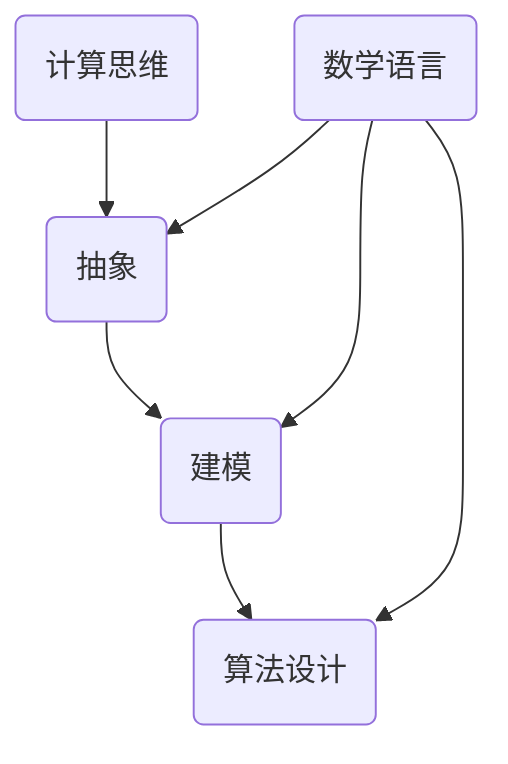
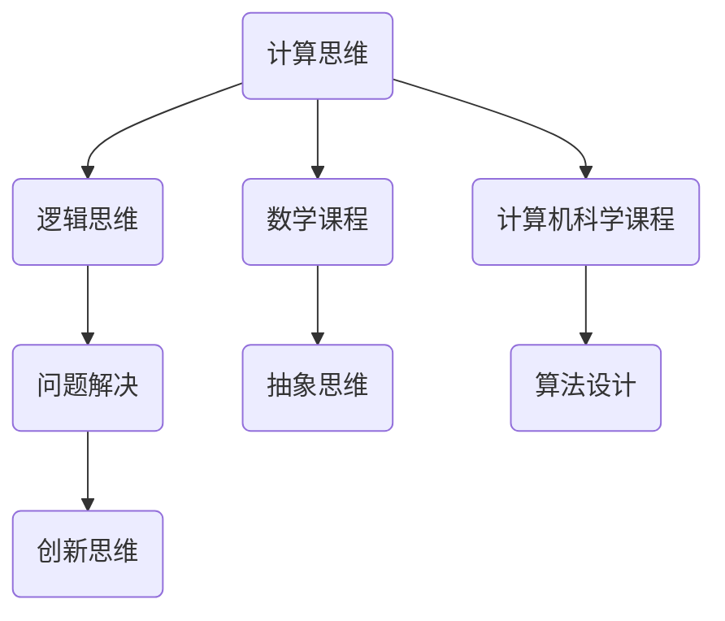
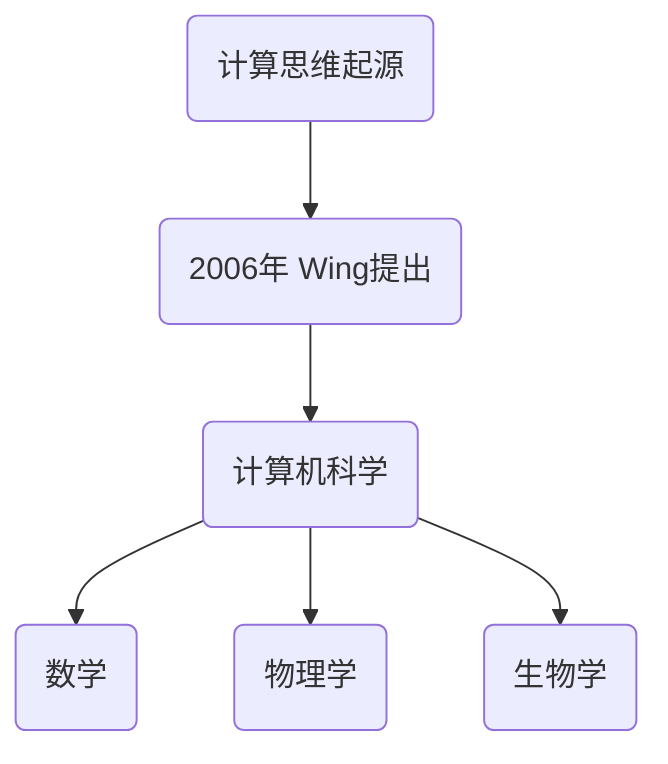
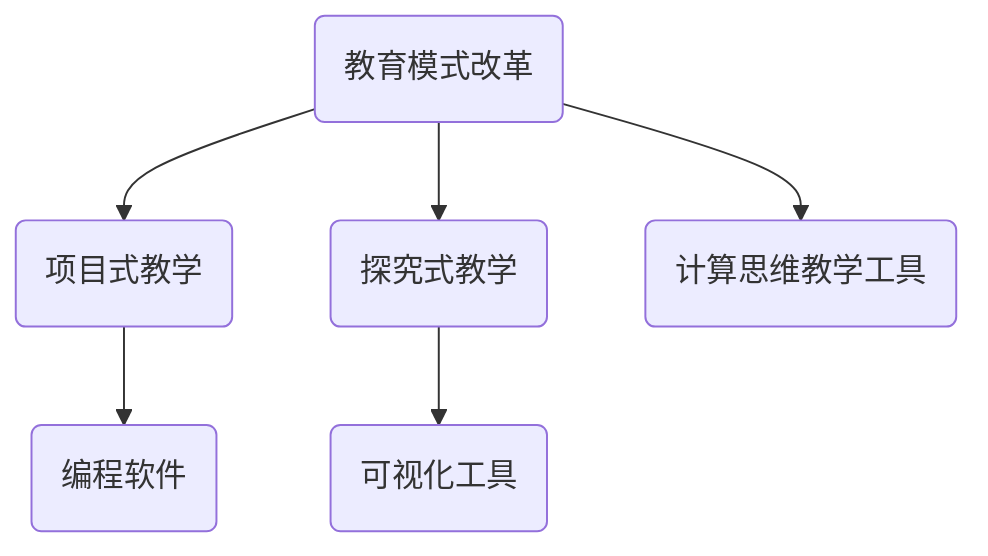
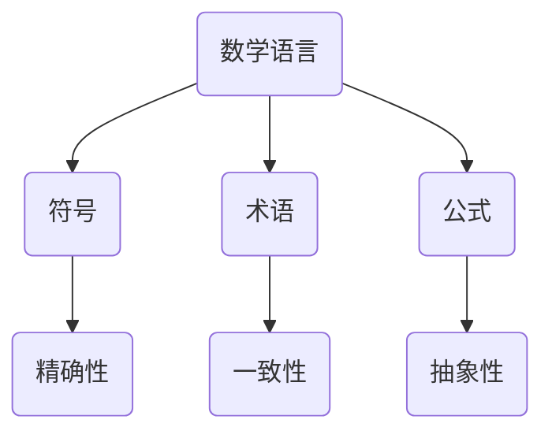
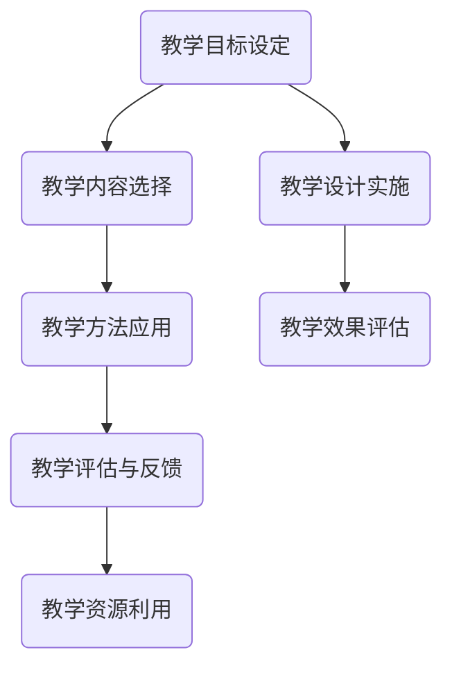
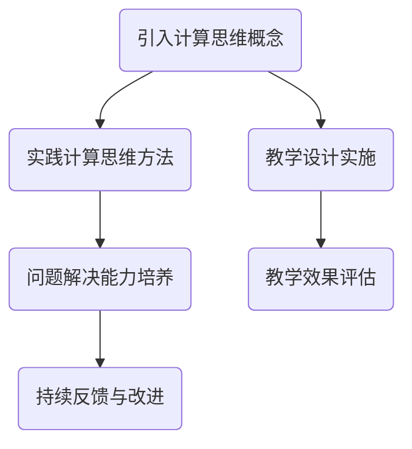

                 

# 《数学语言的计算思维培养应用》

## 关键词
- 计算思维
- 数学语言
- 教育策略
- 科技应用
- 算法讲解
- 数学模型
- 项目实战

## 摘要
本文旨在探讨数学语言在计算思维培养中的应用。首先，我们回顾了计算思维的定义、特征及其在教育中的重要性。接着，我们介绍了数学语言的基本概念、符号及规则，并深入探讨了数学模型与算法的基础知识。文章随后通过具体的数学问题，展示了计算思维在问题解决中的应用策略，并提出了计算思维培养的策略和方法。接着，我们详细讨论了数学语言在计算机科学、人工智能等科技领域的应用。最后，通过实际的项目案例，我们展示了如何将计算思维与数学语言应用于实际问题的解决。本文为教育工作者、科技从业者以及对学生有兴趣的读者提供了一个全面且深入的视角，以理解和应用数学语言在计算思维培养中的关键作用。

### 目录大纲

- [第1章: 计算思维概述](#第1章-计算思维概述)
    - [1.1 计算思维的定义和特征](#11-计算思维的定义和特征)
    - [1.2 计算思维的历史背景和发展](#12-计算思维的历史背景和发展)
    - [1.3 计算思维在教育中的应用](#13-计算思维在教育中的应用)
- [第2章: 数学语言基础](#第2章-数学语言基础)
    - [2.1 数学语言的基本概念](#21-数学语言的基本概念)
    - [2.2 数学符号的使用和规则](#22-数学符号的使用和规则)
    - [2.3 数学符号的简化表达](#23-数学符号的简化表达)
- [第3章: 数学模型与算法](#第3章-数学模型与算法)
    - [3.1 基本数学模型](#31-基本数学模型)
        - [3.1.1 函数模型](#311-函数模型)
        - [3.1.2 方程模型](#312-方程模型)
        - [3.1.3 图模型](#313-图模型)
    - [3.2 算法概述](#32-算法概述)
        - [3.2.1 算法的定义和分类](#321-算法的定义和分类)
        - [3.2.2 常见算法分析](#322-常见算法分析)
        - [3.2.3 算法复杂度分析](#323-算法复杂度分析)
- [第4章: 计算思维在数学问题解决中的应用](#第4章-计算思维在数学问题解决中的应用)
    - [4.1 数学问题的抽象](#41-数学问题的抽象)
        - [4.1.1 问题抽象的方法和技巧](#411-问题抽象的方法和技巧)
        - [4.1.2 问题抽象的案例解析](#412-问题抽象的案例解析)
    - [4.2 数学问题的算法求解](#42-数学问题的算法求解)
        - [4.2.1 求解数学问题的基本策略](#421-求解数学问题的基本策略)
        - [4.2.2 算法求解的案例解析](#422-算法求解的案例解析)
    - [4.3 数学问题的优化](#43-数学问题的优化)
        - [4.3.1 数学问题优化的基本方法](#431-数学问题优化的基本方法)
        - [4.3.2 优化问题的案例解析](#432-优化问题的案例解析)
- [第5章: 数学语言的计算思维培养策略](#第5章-数学语言的计算思维培养策略)
    - [5.1 教育模式改革](#51-教育模式改革)
        - [5.1.1 计算思维教育模式的设计](#511-计算思维教育模式的设计)
        - [5.1.2 计算思维教育模式的实施](#512-计算思维教育模式的实施)
    - [5.2 教学方法和工具的应用](#52-教学方法和工具的应用)
        - [5.2.1 基于项目的教学](#521-基于项目的教学)
        - [5.2.2 计算思维教学工具的应用](#522-计算思维教学工具的应用)
    - [5.3 计算思维培养的案例分析](#53-计算思维培养的案例分析)
        - [5.3.1 不同学科领域的计算思维培养案例](#531-不同学科领域的计算思维培养案例)
        - [5.3.2 不同年级段的计算思维培养案例](#532-不同年级段的计算思维培养案例)
- [第6章: 数学语言的计算思维在科技领域的应用](#第6章-数学语言的计算思维在科技领域的应用)
    - [6.1 数学语言在计算机科学中的应用](#61-数学语言在计算机科学中的应用)
        - [6.1.1 计算机算法和程序设计](#611-计算机算法和程序设计)
        - [6.1.2 计算机图形学和图像处理](#612-计算机图形学和图像处理)
    - [6.2 数学语言在人工智能中的应用](#62-数学语言在人工智能中的应用)
        - [6.2.1 机器学习和深度学习](#621-机器学习和深度学习)
        - [6.2.2 自然语言处理和语音识别](#622-自然语言处理和语音识别)
    - [6.3 数学语言在其他科技领域的应用](#63-数学语言在其他科技领域的应用)
        - [6.3.1 生物信息学](#631-生物信息学)
        - [6.3.2 物理学和工程学](#632-物理学和工程学)
- [第7章: 计算思维与数学语言的教育与实践](#第7章-计算思维与数学语言的教育与实践)
    - [7.1 教育与学习的结合](#71-教育与学习的结合)
        - [7.1.1 计算思维与数学语言的教学设计](#711-计算思维与数学语言的教学设计)
        - [7.1.2 教学过程中的计算思维培养](#712-教学过程中的计算思维培养)
    - [7.2 实践项目与案例分析](#72-实践项目与案例分析)
        - [7.2.1 数学语言的计算思维实践项目](#721-数学语言的计算思维实践项目)
        - [7.2.2 实践项目案例分析](#722-实践项目案例分析)
    - [7.3 未来展望](#73-未来展望)
        - [7.3.1 计算思维教育的挑战与机遇](#731-计算思维教育的挑战与机遇)
        - [7.3.2 数学语言在教育中的应用趋势](#732-数学语言在教育中的应用趋势)
- [附录](#附录)
    - [附录A: 常用数学符号及其含义](#附录a-常用数学符号及其含义)
    - [附录B: 计算思维与数学语言的相关资源](#附录b-计算思维与数学语言的相关资源)
    - [附录C: 数学语言的计算思维实践项目指南](#附录c-数学语言的计算思维实践项目指南)

### 核心概念与联系

在讨论数学语言的计算思维培养应用之前，我们需要明确几个核心概念及其相互关系。计算思维是一种解决问题的方法，强调对问题进行抽象、建模和算法设计。数学语言是描述和表达计算思维的重要工具。

#### 计算思维与数学语言的关系

- **计算思维** 是一种解决问题的方法，强调对问题进行抽象、建模和算法设计。
- **数学语言** 是描述和表达计算思维的重要工具。


**Mermaid 流程图：**



### 第1章: 计算思维概述

### 1.1 计算思维的定义和特征

#### 1.1.1 计算思维的定义

计算思维（Computational Thinking）是一种解决问题的方法，它强调对问题进行抽象、建模和算法设计。计算思维不仅仅是编程，而是一种更高层次的思考方式，能够帮助人们更有效地解决复杂问题。

#### 1.1.2 计算思维的特征

- **抽象**：将复杂问题简化为简单的数学模型或算法。
- **算法化**：将问题转化为一系列可操作的步骤。
- **分解**：将大问题分解为小问题，逐个解决。
- **递归**：使用重复和递归来简化问题解决过程。
- **验证**：通过测试和验证确保算法的正确性。

**伪代码示例：**

```python
def solve_problem(problem):
    if problem_is_simple:
        return simple_solution(problem)
    else:
        subproblems = decompose_problem(problem)
        solutions = [solve_problem(subproblem) for subproblem in subproblems]
        return combine_solutions(solutions)
```

#### 1.1.3 计算思维在教育中的应用

计算思维在教育中的应用主要在于培养学生的逻辑思维、问题解决能力和创新思维。通过数学、计算机科学等课程的教学，让学生掌握计算思维的基本方法。

**Mermaid 流程图：**



### 1.2 计算思维的历史背景和发展

#### 1.2.1 计算思维的历史背景

计算思维这一概念最早由Jeannette M. Wing于2006年提出。她在《计算思维：理解复杂性的钥匙》（Computational Thinking: A Concept for Outcomes-Based Education）一文中，详细阐述了计算思维的内涵和应用。

#### 1.2.2 计算思维的发展

随着计算机科学的快速发展，计算思维的应用领域逐渐扩展。如今，计算思维不仅应用于计算机科学，还广泛应用于数学、物理学、生物学等多个学科领域。

**Mermaid 流程图：**



### 1.3 计算思维在教育中的应用

#### 1.3.1 教育模式改革

计算思维的教育应用要求教育模式进行改革。传统的灌输式教育难以培养学生的计算思维，而基于项目和探究的学习方式则更能激发学生的创新思维。

#### 1.3.2 教学方法和工具的应用

计算思维的教学方法包括项目式教学、探究式教学等。这些方法强调学生的自主学习和问题解决能力。此外，计算思维教学工具，如编程软件、可视化工具等，也能帮助学生更好地理解计算思维。

**Mermaid 流程图：**



### 第2章: 数学语言基础

### 2.1 数学语言的基本概念

#### 2.1.1 数学语言的定义

数学语言是一种用于描述数学概念、性质和关系的符号系统。它包括符号、术语和公式，是数学表达和交流的基本工具。

#### 2.1.2 数学语言的组成部分

- **符号**：用于表示数学概念、运算和关系的简写形式。
- **术语**：用于描述数学概念和对象的名称。
- **公式**：用符号和术语表示的数学关系和表达式。

#### 2.1.3 数学语言的特点

- **精确性**：数学语言能够精确地描述数学概念和关系。
- **一致性**：数学语言的符号和术语具有一致性，便于理解和应用。
- **抽象性**：数学语言能够将具体问题抽象为数学模型，简化问题的解决过程。

**Mermaid 流程图：**



### 2.2 数学符号的使用和规则

#### 2.2.1 常见数学符号及其含义

以下是一些常见的数学符号及其含义：

| 符号 | 含义 |
| ---- | ---- |
| +    | 加法 |
| -    | 减法 |
| *    | 乘法 |
| /    | 除法 |
| ^    | 幂运算 |
| √    | 开平方 |
| =    | 等于 |
| ≠    | 不等于 |
| <    | 小于 |
| >    | 大于 |
| ≤    | 小于等于 |
| ≥    | 大于等于 |

#### 2.2.2 数学符号的书写规范

数学符号的书写需遵循一定的规范，以确保表达的清晰和一致性。以下是一些常见的书写规范：

- **大写字母**：通常用于表示变量、集合和函数。
- **小写字母**：通常用于表示常量和具体值。
- **上下标**：用于表示指数和下标。
- **括号**：用于表示数学表达式中的优先级。

#### 2.2.3 数学符号的简化表达

在数学表达中，为了简化书写和阅读，经常使用一些简化的符号。以下是一些常见的简化表达：

- **π**：表示圆周率。
- **e**：表示自然对数的底数。
- **∑**：表示求和。
- **∏**：表示连乘。

**示例：**

- **求和表达式**：$$\sum_{i=1}^{n} i = \frac{n(n+1)}{2}$$
- **连乘表达式**：$$\prod_{i=1}^{n} i = n!$$

### 2.3 数学符号的简化表达

#### 2.3.1 常见数学符号的简化表达

在数学表达中，为了简化书写和阅读，经常使用一些简化的符号。以下是一些常见的简化表达：

- **π**：表示圆周率。
- **e**：表示自然对数的底数。
- **∑**：表示求和。
- **∏**：表示连乘。

#### 2.3.2 数学符号的简写规则

数学符号的简写规则主要包括以下几点：

- **大写字母**：通常用于表示变量、集合和函数。
- **小写字母**：通常用于表示常量和具体值。
- **上下标**：用于表示指数和下标。
- **括号**：用于表示数学表达式中的优先级。

#### 2.3.3 数学符号的简写示例

以下是一些常见的数学符号及其简写形式：

| 原始符号 | 简写形式 |
| ---- | ---- |
| π    | pi   |
| e    | exp  |
| Σ    | sum  |
| ∏    | prod |
| ∫    | int  |
| ∇    | grad |

**示例：**

- **圆周率**：π = 3.14159
- **自然对数底数**：e ≈ 2.71828
- **求和表达式**：$$\sum_{i=1}^{n} i = \frac{n(n+1)}{2}$$
- **连乘表达式**：$$\prod_{i=1}^{n} i = n!$$

### 第3章: 数学模型与算法

### 3.1 基本数学模型

#### 3.1.1 函数模型

函数模型是描述事物变化规律的数学模型，常见的形式有线性函数、多项式函数、指数函数等。

- **线性函数模型**：形如 y = mx + b 的函数，其中 m 是斜率，b 是截距。
- **多项式函数模型**：形如 f(x) = a0 + a1x + a2x^2 + ... + anxn 的函数，其中 ai 是系数。
- **指数函数模型**：形如 y = a^x 的函数，其中 a 是底数。

**伪代码示例：**

```python
def linear_function(x, m, b):
    return m * x + b

def polynomial_function(x, coefficients):
    result = 0
    for i, coefficient in enumerate(coefficients):
        result += coefficient * x ** i
    return result

def exponential_function(x, base):
    return base ** x
```

#### 3.1.2 方程模型

方程模型是描述事物之间关系的数学模型，常见的有线性方程、非线性方程、微分方程等。

- **线性方程模型**：形如 ax + b = 0 的方程，其中 a 和 b 是系数。
- **非线性方程模型**：形如 f(x) = 0 的方程，其中 f(x) 是非线性函数。
- **微分方程模型**：形如 dy/dx = f(x, y) 的方程，其中 f(x, y) 是微分方程的右侧函数。

**伪代码示例：**

```python
def linear_equation(x, a, b):
    return a * x + b

def nonlinear_equation(x, f):
    return f(x)

def differential_equation(x, y, f):
    return f(x, y)
```

#### 3.1.3 图模型

图模型是描述网络结构的数学模型，常见的有图论模型、网络流模型等。

- **图论模型**：描述网络中节点和边的关系，常见的有有向图、无向图、加权图等。
- **网络流模型**：描述网络中流量分配的问题，常见的有最大流问题、最小费用流问题等。

**伪代码示例：**

```python
def graph_representation(nodes, edges):
    return {
        'nodes': nodes,
        'edges': edges
    }

def max_flow(graph, source, sink):
    # 使用Ford-Fulkerson算法求解最大流
    pass

def min_cost_flow(graph, costs):
    # 使用最小费用流算法求解最小费用流
    pass
```

### 3.2 算法概述

#### 3.2.1 算法的定义和分类

算法（Algorithm）是一系列解决问题的步骤，通常以伪代码或实际编程语言的形式表示。算法可以根据不同的分类标准进行分类，如按算法复杂度、按应用领域等。

- **按算法复杂度分类**：有线性时间算法、对数时间算法、多项式时间算法等。
- **按应用领域分类**：有排序算法、搜索算法、图算法等。

**伪代码示例：**

```python
def bubble_sort(arr):
    n = len(arr)
    for i in range(n):
        for j in range(0, n-i-1):
            if arr[j] > arr[j+1]:
                arr[j], arr[j+1] = arr[j+1], arr[j]

def binary_search(arr, target):
    low = 0
    high = len(arr) - 1
    while low <= high:
        mid = (low + high) // 2
        if arr[mid] == target:
            return mid
        elif arr[mid] < target:
            low = mid + 1
        else:
            high = mid - 1
    return -1
```

#### 3.2.2 常见算法分析

以下是一些常见的算法及其时间复杂度和空间复杂度：

- **冒泡排序**：时间复杂度为 O(n^2)，空间复杂度为 O(1)。
- **二分搜索**：时间复杂度为 O(log n)，空间复杂度为 O(1)。
- **深度优先搜索**：时间复杂度为 O(n)，空间复杂度为 O(n)。
- **广度优先搜索**：时间复杂度为 O(n)，空间复杂度为 O(n)。

**伪代码示例：**

```python
def dfs(graph, start):
    visited = set()
    stack = [start]
    while stack:
        node = stack.pop()
        if node not in visited:
            visited.add(node)
            for neighbor in graph[node]:
                stack.append(neighbor)
    return visited

def bfs(graph, start):
    visited = set()
    queue = [start]
    while queue:
        node = queue.pop(0)
        if node not in visited:
            visited.add(node)
            for neighbor in graph[node]:
                queue.append(neighbor)
    return visited
```

#### 3.2.3 算法复杂度分析

算法复杂度分析是评估算法性能的重要手段，包括时间复杂度和空间复杂度。

- **时间复杂度**：描述算法在输入规模增加时，执行时间的增长速度。常用大O符号表示，如 O(1)、O(n)、O(n^2) 等。
- **空间复杂度**：描述算法在输入规模增加时，所需存储空间的增长速度。同样常用大O符号表示。

**伪代码示例：**

```python
def analyze_algorithm_complexity(algorithm):
    time_complexity = algorithm_time_complexity
    space_complexity = algorithm_space_complexity
    return time_complexity, space_complexity
```

### 第4章: 计算思维在数学问题解决中的应用

### 4.1 数学问题的抽象

#### 4.1.1 问题抽象的方法和技巧

问题抽象（Problem Abstraction）是将实际问题转化为数学模型的过程。在数学问题解决中，问题抽象是关键步骤之一。以下是一些常见的问题抽象方法和技巧：

- **分解法**：将复杂问题分解为多个简单问题，分别求解，然后组合结果。
- **归纳法**：通过观察具体实例，归纳出一般规律，形成数学模型。
- **建模法**：根据实际问题，构建数学模型，求解模型，然后将结果应用到实际问题上。

**伪代码示例：**

```python
def abstract_problem(problem):
    if problem_is_simple:
        return simple_model(problem)
    else:
        subproblems = decompose_problem(problem)
        submodels = [abstract_problem(subproblem) for subproblem in subproblems]
        return combine_models(submodels)
```

#### 4.1.2 问题抽象的案例解析

**案例1：求解最大值问题**

**问题描述**：给定一组数，求出其中最大值。

**数学模型**：设一组数为 x1, x2, ..., xn，求解 max{x1, x2, ..., xn}。

**求解方法**：

- **分解法**：将问题分解为找出每个子序列的最大值，然后找出所有子序列的最大值中的最大值。
- **归纳法**：通过观察具体实例，发现最大值总是出现在序列的最后一个元素。
- **建模法**：构建一个函数 f(x) = x，求解 f(x) 的最大值。

**伪代码示例：**

```python
def find_maximum(numbers):
    maximum = numbers[0]
    for num in numbers:
        if num > maximum:
            maximum = num
    return maximum
```

**案例2：求解线性方程组**

**问题描述**：求解线性方程组 ax + by = c。

**数学模型**：设一组线性方程为 ax + by = c，求解 x 和 y。

**求解方法**：

- **分解法**：将问题分解为求解 x 和 y 的方程，分别求解，然后组合结果。
- **归纳法**：通过观察具体实例，发现 x 和 y 的值可以通过消元法求解。
- **建模法**：构建一个线性方程组模型，求解模型。

**伪代码示例：**

```python
from sympy import symbols, Eq, solve

x, y = symbols('x y')
equation = Eq(x + y, 10)
solution = solve(equation, (x, y))
print(solution)
```

### 4.2 数学问题的算法求解

#### 4.2.1 求解数学问题的基本策略

在数学问题解决中，算法求解（Algorithmic Solution）是关键步骤之一。以下是一些常见的求解数学问题的基本策略：

- **枚举法**：逐个尝试所有可能的解，直到找到满足条件的解。
- **递归法**：将问题分解为子问题，递归求解，然后将结果组合起来。
- **迭代法**：通过循环逐步逼近问题的解。
- **动态规划法**：将问题分解为多个子问题，求解子问题，然后将结果存储起来，避免重复计算。

**伪代码示例：**

```python
def exhaustive_search(problem):
    for solution in solutions:
        if is_solution_valid(solution):
            return solution
    return None

def recursive_solution(problem):
    if problem_is_simple:
        return simple_solution(problem)
    else:
        subproblems = decompose_problem(problem)
        sub_solutions = [recursive_solution(subproblem) for subproblem in subproblems]
        return combine_solutions(sub_solutions)

def iterative_solution(problem):
    while not is_solution_found(problem):
        update_solution(problem)
    return problem.solution

def dynamic_programming_solution(problem):
    subproblems = decompose_problem(problem)
    solutions = [solve_subproblem(subproblem) for subproblem in subproblems]
    return combine_solutions(solutions)
```

#### 4.2.2 算法求解的案例解析

**案例1：求解最大值问题**

**问题描述**：给定一组数，求出其中最大值。

**算法求解**：

- **枚举法**：逐个比较所有数，找到最大值。
- **递归法**：递归地将问题分解为子问题，求解子问题，然后找出最大值。
- **迭代法**：使用循环逐步逼近最大值。
- **动态规划法**：使用动态规划求解。

**伪代码示例：**

```python
# 枚举法
def find_maximum(numbers):
    maximum = numbers[0]
    for num in numbers:
        if num > maximum:
            maximum = num
    return maximum

# 递归法
def recursive_find_maximum(numbers):
    if len(numbers) == 1:
        return numbers[0]
    else:
        return max(numbers[0], recursive_find_maximum(numbers[1:]))

# 迭代法
def iterative_find_maximum(numbers):
    maximum = numbers[0]
    for num in numbers:
        if num > maximum:
            maximum = num
    return maximum

# 动态规划法
def dynamic_programming_find_maximum(numbers):
    dp = [0] * len(numbers)
    dp[0] = numbers[0]
    for i in range(1, len(numbers)):
        dp[i] = max(dp[i-1], numbers[i])
    return dp[-1]
```

**案例2：求解线性方程组**

**问题描述**：求解线性方程组 ax + by = c。

**算法求解**：

- **高斯消元法**：通过消元将方程组转化为上三角或下三角方程组，然后逐个求解。
- **迭代法**：使用雅可比迭代法或高斯-赛德尔迭代法逐步逼近解。
- **矩阵法**：使用矩阵运算求解。

**伪代码示例：**

```python
import numpy as np

# 高斯消元法
def gauss_elimination(A, b):
    n = len(b)
    for i in range(n):
        # 找到最大元素的下标
        max_index = np.argmax(np.abs(A[i:, i])) + i
        # 如果最大元素在当前列的底部，交换行
        if max_index != i:
            A[[i, max_index]] = A[[max_index, i]]
            b[i], b[max_index] = b[max_index], b[i]
        # 消元
        for j in range(i+1, n):
            factor = A[j, i] / A[i, i]
            A[j, i:] = A[j, i:] - factor * A[i, i:]
            b[j] -= factor * b[i]
    # 解方程组
    x = np.zeros(n)
    for i in range(n-1, -1, -1):
        x[i] = (b[i] - np.dot(A[i, i+1:], x[i+1:])) / A[i, i]
    return x

# 雅可比迭代法
def jacobi_method(A, b, x, tolerance, max_iterations):
    n = len(x)
    for i in range(max_iterations):
        x_new = np.zeros(n)
        for j in range(n):
            sum = b[j]
            for k in range(n):
                if k != j:
                    sum -= A[j, k] * x[k]
            x_new[j] = (sum / A[j, j])
        if np.linalg.norm(x_new - x, ord=np.Inf) < tolerance:
            break
        x = x_new
    return x

# 高斯-赛德尔迭代法
def gauss_seidel_method(A, b, x, tolerance, max_iterations):
    n = len(x)
    for i in range(max_iterations):
        x_new = np.zeros(n)
        for j in range(n):
            sum = b[j]
            for k in range(n):
                if k < j:
                    sum -= A[j, k] * x[k]
                elif k > j:
                    sum -= A[j, k] * x_new[k]
            x_new[j] = (sum / A[j, j])
        if np.linalg.norm(x_new - x, ord=np.Inf) < tolerance:
            break
        x = x_new
    return x
```

### 4.3 数学问题的优化

#### 4.3.1 数学问题优化的基本方法

数学问题优化（Mathematical Optimization）是在给定约束条件下，寻找目标函数的最优解。以下是一些常见的优化方法：

- **线性规划**：在给定线性约束条件下，寻找线性目标函数的最优解。
- **非线性规划**：在给定非线性约束条件下，寻找非线性目标函数的最优解。
- **整数规划**：在给定整数约束条件下，寻找整数目标函数的最优解。
- **动态规划**：在给定时间序列约束条件下，寻找最优决策序列。

**伪代码示例：**

```python
# 线性规划
from scipy.optimize import linprog

def linear_programming(c, A, b):
    result = linprog(c, A_ub=A, b_ub=b)
    return result.x

# 非线性规划
from scipy.optimize import minimize

def nonlinear_programming(objective, x0, constraints):
    result = minimize(objective, x0, constraints=constraints)
    return result.x

# 整数规划
from scipy.optimize import整数规划

def integer_programming(objective, x0, bounds, constraints):
    result =整数规划(objective, x0, bounds=bounds, constraints=constraints)
    return result.x

# 动态规划
from dynamic_programming import solve

def dynamic_programming(objective, constraints):
    solution = solve(objective, constraints)
    return solution.x
```

#### 4.3.2 优化问题的案例解析

**案例1：最小生成树问题**

**问题描述**：给定一个加权无向图，求解其最小生成树。

**优化方法**：使用Prim算法或Kruskal算法求解最小生成树。

**伪代码示例：**

```python
import networkx as nx

def prim_minimum_spanning_tree(graph):
    tree = nx.Graph()
    unvisited = set(graph.nodes())
    start_node = next(iter(unvisited))
    tree.add_node(start_node)
    unvisited.remove(start_node)
    while unvisited:
        min_edge = None
        for node in unvisited:
            for edge in graph.edges(start_node):
                if edge[1] in unvisited:
                    if min_edge is None or graph[edge[0]][edge[1]]['weight'] < graph[min_edge[0]][min_edge[1]]['weight']:
                        min_edge = edge
        tree.add_edge(min_edge[0], min_edge[1])
        start_node = min_edge[1]
        unvisited.remove(start_node)
    return tree

def kruskal_minimum_spanning_tree(graph):
    tree = nx.Graph()
    edges = sorted(graph.edges(data=True), key=lambda item: item[2]['weight'])
    for edge in edges:
        if not nx.algorithms.tree.is_tree(tree):
            tree.add_edge(edge[0], edge[1])
    return tree
```

**案例2：线性规划问题**

**问题描述**：求解线性规划问题最大化目标函数 z = 2x + 3y，约束条件为 x + y ≤ 4，x ≥ 0，y ≥ 0。

**优化方法**：使用单纯形法求解线性规划问题。

**伪代码示例：**

```python
from scipy.optimize import linprog

def linear_programming(c, A, b):
    result = linprog(c, A_ub=A, b_ub=b)
    return result.x

c = [-2, -3]
A = [[1, 1]]
b = [4]
solution = linear_programming(c, A, b)
print(solution)
```

### 第5章: 数学语言的计算思维培养策略

#### 5.1 教育模式改革

#### 5.1.1 计算思维教育模式的设计

为了更好地培养学生的计算思维，教育模式需要进行改革。以下是一种可能的计算思维教育模式设计：

**教学目标：**
- 培养学生运用计算思维解决问题的能力。
- 培养学生的抽象思维、逻辑推理和算法设计能力。

**课程设置：**
- 计算思维基础课程：介绍计算思维的基本概念、方法和应用。
- 数学语言课程：教授数学符号、规则和建模方法。
- 算法设计课程：教授常见算法的原理和实现方法。
- 综合实践课程：通过实际项目培养学生的计算思维能力。

**教学方法：**
- 项目式教学：通过实际项目，让学生在实际问题中运用计算思维。
- 探究式教学：引导学生自主探究数学问题，培养学生的抽象思维和创新能力。
- 案例教学：通过案例解析，让学生理解计算思维的实际应用。

**教学评价：**
- 过程性评价：通过课堂讨论、项目进展等方式，评价学生在学习过程中的表现。
- 结果性评价：通过项目成果、考试等方式，评价学生的计算思维能力和知识掌握程度。

**教学资源：**
- 教学软件：如数学建模软件、算法可视化工具等。
- 教学案例：收集和整理典型的数学问题解决案例，供学生学习和参考。

**伪代码示例：**

```python
def design_computational_thinking_education_mode():
    education_mode = {
        "teaching_objectives": ["培养计算思维能力", "培养抽象思维和逻辑推理能力"],
        "course_settings": ["计算思维基础课程", "数学语言课程", "算法设计课程", "综合实践课程"],
        "teaching_methods": ["项目式教学", "探究式教学", "案例教学"],
        "evaluation_methods": ["过程性评价", "结果性评价"],
        "teaching_resources": ["教学软件", "教学案例"]
    }
    return education_mode
```

#### 5.1.2 计算思维教育模式的实施

计算思维教育模式的实施需要具体的操作流程和策略。以下是一种可能的实施方案：

**教学准备：**
- 教师准备教学材料和教学案例。
- 教师了解学生的背景知识，制定合适的教学计划。

**教学过程：**
- 引入新的知识点，通过讲解和示例，让学生理解计算思维的概念和方法。
- 引导学生进行数学问题建模和算法设计，培养学生的抽象思维和创新能力。
- 通过项目式教学，让学生在实际问题中应用计算思维，解决实际问题。
- 组织课堂讨论和小组合作，鼓励学生交流想法，共同解决问题。

**教学评价：**
- 教师对学生的项目成果进行评价，给出反馈和建议。
- 通过考试和课堂表现，评价学生的计算思维能力和知识掌握程度。

**教学资源：**
- 教学软件：如数学建模软件、算法可视化工具等。
- 教学案例：收集和整理典型的数学问题解决案例，供学生学习和参考。

**伪代码示例：**

```python
def implement_computational_thinking_education_mode(education_mode):
    # 准备教学材料
    prepare_teaching_materials(education_mode["teaching_resources"])
    
    # 进行教学活动
    for course in education_mode["course_settings"]:
        if course == "计算思维基础课程":
            teach_computational_thinking基础知识()
        elif course == "数学语言课程":
            teach_mathematical_language()
        elif course == "算法设计课程":
            teach_algorithm_design()
        elif course == "综合实践课程":
            implement_project_based_learning()
        
        # 组织课堂讨论和小组合作
        organize_class_discussion_and_group_work()
        
        # 进行评价和反馈
        provide_evaluation_and_feedback()

# 实施教学活动
education_mode = design_computational_thinking_education_mode()
implement_computational_thinking_education_mode(education_mode)
```

### 5.2 教学方法和工具的应用

#### 5.2.1 基于项目的教学

基于项目的教学（Project-Based Teaching）是一种以项目为中心的教学模式，通过实际项目来培养学生的计算思维和问题解决能力。以下是一种基于项目的教学方法的实施步骤：

**项目选择：**
- 根据学生的知识水平和兴趣，选择合适的数学问题解决项目。
- 项目应具有一定的挑战性，能激发学生的思考和创新。

**项目准备：**
- 教师准备项目指南和相关的教学资源。
- 学生了解项目背景和要求，制定项目计划。

**项目实施：**
- 教师引导学生进行问题建模和算法设计。
- 学生分组合作，进行项目开发。
- 定期举行项目进展会议，讨论问题和解决方案。

**项目评估：**
- 教师对项目成果进行评价，给出反馈和建议。
- 学生进行自我评价和相互评价。

**项目反思：**
- 学生总结项目经验，反思计算思维的应用。
- 教师总结项目教学的效果，优化教学方法。

**伪代码示例：**

```python
def project_based_teaching(project, students):
    # 项目选择
    select_project(project)
    
    # 项目准备
    prepare_project_resources(project)
    students_understand_project_requirements(project)
    
    # 项目实施
    for group in students:
        guide_students_in_problem_modeling(group, project)
        groups_cooperate_on_project_development(project)
        hold_project_progress_meetings(group, project)
        
    # 项目评估
    evaluate_project_results(students, project)
    provide_evaluation_and_feedback(project)
    
    # 项目反思
    reflect_on_project_experience(students, project)
    summarize_learning_outcomes(project)
```

#### 5.2.2 计算思维教学工具的应用

计算思维教学工具（Computational Thinking Teaching Tools）如编程软件、算法可视化工具等，能帮助学生更好地理解和应用计算思维。以下是一些常见的计算思维教学工具及其应用：

- **编程软件**：如Python、Scratch等，用于算法实现和编程练习。
- **算法可视化工具**：如Khan Academy算法可视化工具、Python可视化库等，用于算法演示和讲解。
- **数学建模软件**：如MATLAB、Mathematica等，用于数学建模和问题解决。

**应用示例：**

- **编程软件应用**：
    - 教师提供编程任务，如实现排序算法、搜索算法等。
    - 学生使用编程软件完成编程任务，进行算法实现和测试。
    - 教师评估学生的编程成果，提供反馈和建议。

- **算法可视化工具应用**：
    - 教师使用算法可视化工具演示算法的执行过程。
    - 学生观察算法可视化，理解算法的原理和运行过程。
    - 教师引导学生进行算法分析，讨论算法的复杂度和效率。

- **数学建模软件应用**：
    - 教师提供数学建模问题，如求解线性方程组、优化问题等。
    - 学生使用数学建模软件进行建模和求解，分析模型结果。
    - 教师评估学生的建模能力，提供优化建议。

**伪代码示例：**

```python
# 编程软件应用
def programming_software_usage(student, task):
    student_program = student_programming(task)
    evaluate_student_program(student_program)
    provide_feedback(student, student_program)

# 算法可视化工具应用
def algorithm_visualization_usage(teacher, algorithm):
    visualization = algorithm_visualization(algorithm)
    display_visualization(teacher, visualization)
    discuss_algorithm_analysis(teacher, algorithm)

# 数学建模软件应用
def mathematical_modeling_software_usage(student, problem):
    model_solution = student_modeling(problem)
    analyze_model_solution(student, model_solution)
    provide_optimization_advice(student, model_solution)
```

### 5.3 计算思维培养的案例分析

#### 5.3.1 不同学科领域的计算思维培养案例

以下是一些不同学科领域中的计算思维培养案例，展示如何通过实际问题培养学生的计算思维：

**案例1：计算机科学中的算法设计**

**问题描述**：设计一个高效的排序算法，用于对一组数据进行排序。

**计算思维应用**：
- 抽象思维：将具体的数据排序问题抽象为通用排序算法。
- 分解法：将排序算法分解为简单的步骤，如比较、交换等。
- 递归法：使用递归实现快速排序算法。
- 算法分析：分析排序算法的时间复杂度和空间复杂度，评估算法性能。

**教学策略**：
- 教师引入排序算法的概念，讲解快速排序算法的原理。
- 学生分组进行排序算法的实现和优化。
- 教师组织算法分析讨论，评估不同排序算法的性能。

**案例2：数学中的数学建模**

**问题描述**：建立数学模型，解决水库水位调控问题。

**计算思维应用**：
- 抽象思维：将水库水位调控问题抽象为数学模型。
- 归纳法：通过具体实例，归纳出水位调控的规律。
- 建模法：使用微分方程建立水位调控模型。
- 动态规划：使用动态规划求解最优水位调控策略。

**教学策略**：
- 教师引入数学建模的概念，讲解微分方程的建模方法。
- 学生分组进行水库水位调控模型的建立和求解。
- 教师组织模型验证和优化讨论，评估模型的有效性。

**案例3：物理学中的问题解决**

**问题描述**：使用物理模型解决物体自由落体运动问题。

**计算思维应用**：
- 抽象思维：将自由落体运动抽象为物理模型。
- 分解法：将自由落体运动分解为初始速度、加速度等基本物理量。
- 递归法：使用递归公式求解自由落体运动的时间。
- 验证法：通过实验验证物理模型的有效性。

**教学策略**：
- 教师引入物理模型的概念，讲解自由落体运动的物理原理。
- 学生分组进行自由落体运动模型的建立和求解。
- 教师组织实验验证和讨论，评估物理模型的应用效果。

#### 5.3.2 不同年级段的计算思维培养案例

以下是一些针对不同年级段的学生，如何通过具体案例培养学生的计算思维：

**案例1：小学阶段的计算思维培养**

**问题描述**：使用数学方法解决简单的数学问题，如求解最大值、最小值等。

**计算思维应用**：
- 抽象思维：将实际问题抽象为数学问题。
- 归纳法：通过具体实例，归纳出解决数学问题的方法。
- 枚举法：使用枚举法求解简单的数学问题。

**教学策略**：
- 教师设计简单的数学问题，引导学生使用数学方法解决问题。
- 学生通过小组合作，讨论和解决数学问题。
- 教师组织数学问题讨论会，总结和分享解决数学问题的方法。

**案例2：初中阶段的计算思维培养**

**问题描述**：使用数学方法解决复杂的数学问题，如求解线性方程组、二次方程等。

**计算思维应用**：
- 抽象思维：将实际问题抽象为数学模型。
- 建模法：使用数学模型解决实际问题。
- 递归法：使用递归方法求解复杂的数学问题。

**教学策略**：
- 教师引入数学模型的概念，讲解线性方程组、二次方程的建模方法。
- 学生通过小组合作，进行数学模型的建立和求解。
- 教师组织数学问题讨论会，评估学生解决问题的能力。

**案例3：高中阶段的计算思维培养**

**问题描述**：使用数学方法解决实际问题，如解决物理问题、工程问题等。

**计算思维应用**：
- 抽象思维：将实际问题抽象为数学模型。
- 优化法：使用优化方法解决实际问题。
- 动态规划：使用动态规划求解复杂的实际问题。

**教学策略**：
- 教师引入数学模型和优化的概念，讲解数学方法在物理问题和工程问题中的应用。
- 学生通过小组合作，进行数学模型的建立和优化。
- 教师组织问题解决讨论会，评估学生解决问题的能力。

### 第6章: 数学语言的计算思维在科技领域的应用

#### 6.1 数学语言在计算机科学中的应用

数学语言在计算机科学中的应用非常广泛，尤其在算法设计和程序设计方面。以下是一些关键应用：

##### 6.1.1 计算机算法和程序设计

计算机算法是解决问题的有序步骤集合。数学语言为算法设计提供了强有力的工具，使得算法的描述更加精确和简洁。

- **算法设计**：使用数学语言描述算法的步骤和逻辑关系。例如，排序算法中的冒泡排序可以描述为：

  ```python
  for i in range(n):
      for j in range(0, n-i-1):
          if arr[j] > arr[j+1]:
              arr[j], arr[j+1] = arr[j+1], arr[j]
  ```

- **程序设计**：数学语言在程序设计中用于定义变量、运算符和函数。例如，C语言中的加法运算符可以表示为 `+`，在代码中用于执行加法操作。

##### 6.1.2 计算机图形学和图像处理

计算机图形学和图像处理依赖于数学语言来描述图像的生成和处理过程。

- **图形学**：图形渲染算法通常使用几何学、线性代数和概率论。例如，3D图形渲染中使用矩阵变换来描述物体的位置和旋转。

  ```latex
  P' = M \cdot P
  ```

  其中，\( P' \) 是变换后的位置向量，\( M \) 是变换矩阵，\( P \) 是原始位置向量。

- **图像处理**：图像处理算法使用数学语言描述图像的滤波、边缘检测和特征提取。例如，卷积操作用于图像滤波：

  ```python
  for y in range(height):
      for x in range(width):
          output[x, y] = (filter * image[:, y, x]).sum()
  ```

#### 6.2 数学语言在人工智能中的应用

数学语言在人工智能（AI）领域扮演着至关重要的角色，尤其是在机器学习、深度学习和自然语言处理等方面。

##### 6.2.1 机器学习和深度学习

机器学习和深度学习算法依赖于数学模型来描述数据和学习过程。

- **机器学习**：线性回归、逻辑回归和支持向量机（SVM）等算法使用数学公式来定义损失函数和优化目标。例如，线性回归的损失函数可以表示为：

  ```latex
  J(\theta) = \frac{1}{2m} \sum_{i=1}^{m} (h_\theta(x^{(i)}) - y^{(i)})^2
  ```

  其中，\( h_\theta(x) \) 是假设函数，\( \theta \) 是模型参数，\( m \) 是样本数量。

- **深度学习**：深度学习模型使用前馈神经网络和反向传播算法。前馈神经网络中的激活函数和权重更新可以使用以下伪代码表示：

  ```python
  def forward_propagation(x, weights, biases):
      z = weights * x + biases
      a = activation_function(z)
      return a

  def backward_propagation(a, z, dZ):
      dW = dZ * a
      db = dZ
      return dW, db
  ```

##### 6.2.2 自然语言处理和语音识别

自然语言处理（NLP）和语音识别（ASR）算法使用数学语言来描述语言模型和声学模型。

- **自然语言处理**：语言模型使用概率模型来预测下一个单词。例如，n-gram模型可以使用以下伪代码表示：

  ```python
  def predict_next_word(context, ngram_model):
      probabilities = ngram_model.get_probabilities(context)
      return np.argmax(probabilities)
  ```

- **语音识别**：声学模型使用隐藏马尔可夫模型（HMM）来描述语音信号。HMM的转移概率和发射概率可以使用以下伪代码表示：

  ```python
  def forward算法(observations, states, transitions, emissions):
      alpha = [初始概率]
      for t in range(1, observations.length()):
          alpha[t] = [transition概率 * emission概率]
      return alpha

  def backward算法(observations, states, transitions, emissions):
      beta = [终止概率]
      for t in range(observations.length() - 1, 0, -1):
          beta[t] = [transition概率 * emission概率]
      return beta
  ```

#### 6.3 数学语言在其他科技领域的应用

数学语言在生物信息学、物理学和工程学等领域也有着广泛的应用。

##### 6.3.1 生物信息学

生物信息学使用数学语言来分析和解释生物数据，如基因组序列、蛋白质结构和代谢网络。

- **基因组分析**：使用概率模型和统计方法来识别基因突变和关联。例如，贝叶斯统计模型可以用于单核苷酸多态性（SNP）分析：

  ```latex
  P(A|B) = \frac{P(B|A) \cdot P(A)}{P(B)}
  ```

- **蛋白质结构预测**：使用物理模型和机器学习算法预测蛋白质的三维结构。例如，使用自由能差值（ΔG）来评估结构预测的准确性：

  ```latex
  \Delta G = G_{预测} - G_{实际}
  ```

##### 6.3.2 物理学和工程学

物理学和工程学使用数学语言来描述自然现象和工程问题，如力学、电磁学和控制系统。

- **力学**：牛顿运动定律使用数学公式描述物体的运动状态。例如，牛顿第二定律可以表示为：

  ```latex
  F = m \cdot a
  ```

- **电磁学**：麦克斯韦方程组使用偏微分方程描述电磁场。例如，安培环路定律可以表示为：

  ```latex
  \nabla \times \vec{B} = \mu_0 \vec{J}
  ```

- **工程学**：控制系统使用状态空间模型和传递函数描述动态系统的行为。例如，状态空间模型可以表示为：

  ```latex
  \dot{\vec{x}} = A \vec{x} + B \vec{u}
  \vec{y} = C \vec{x} + D \vec{u}
  ```

### 第7章: 计算思维与数学语言的教育与实践

#### 7.1 教育与学习的结合

#### 7.1.1 计算思维与数学语言的教学设计

计算思维与数学语言的教学设计是教育领域的重要课题，旨在通过数学语言培养学生的计算思维。以下是一些关键步骤和策略：

##### 教学目标设定

- 明确教学目标，包括计算思维的基本概念、数学语言的基本知识和应用能力。
- 教学目标应涵盖抽象思维、算法设计、问题解决和创新能力。

##### 教学内容选择

- 根据学生的年龄和认知水平，选择适当的数学语言知识和计算思维方法。
- 教学内容应包括数学语言的基本概念、数学模型、算法原理和问题解决策略。

##### 教学方法应用

- 采用多样化的教学方法，如项目式教学、探究式教学和案例教学。
- 项目式教学鼓励学生通过实际问题应用计算思维，探究式教学促进学生自主学习和创新能力，案例教学帮助学生理解计算思维的实际应用。

##### 教学评估与反馈

- 通过过程性评价和结果性评价相结合，全面评估学生的学习成果。
- 教学反馈应具体、有针对性，帮助学生改进学习方法和提升计算思维能力。

##### 教学资源利用

- 充分利用教学资源，如数学建模软件、算法可视化工具和在线教育资源。
- 教学资源应易于操作和访问，有助于学生理解和应用计算思维。

**伪代码示例：**

```python
def design_computational_thinking_and_math_language_course(teaching_objectives, content_selection, teaching_methods, assessment_methods, teaching_resources):
    course_plan = {
        "teaching_objectives": teaching_objectives,
        "content_selection": content_selection,
        "teaching_methods": teaching_methods,
        "assessment_methods": assessment_methods,
        "teaching_resources": teaching_resources
    }
    return course_plan
```

##### 教学设计案例

**案例1：小学阶段计算思维与数学语言教学**

**教学目标**：培养学生初步的计算思维和数学语言能力。

**教学内容**：基本的数学符号、简单的数学模型、基础的算法概念。

**教学方法**：使用故事引导和游戏化学习，激发学生的学习兴趣。

**教学评估**：通过数学故事比赛和数学游戏竞赛，评估学生的数学语言和计算思维能力。

**教学资源**：数学绘本、数学游戏软件、在线数学资源。

**案例2：中学阶段计算思维与数学语言教学**

**教学目标**：深化学生的计算思维和数学语言能力，应用数学解决实际问题。

**教学内容**：复杂的数学模型、高级算法原理、数学问题解决策略。

**教学方法**：项目式教学和探究式教学，学生自主研究和团队合作解决问题。

**教学评估**：通过数学项目展示和数学论文写作，评估学生的计算思维和数学应用能力。

**教学资源**：数学建模软件、算法可视化工具、在线教育资源。

##### 教学设计流程图



#### 7.1.2 教学过程中的计算思维培养

在数学教学中，计算思维的培养是一个持续的过程，需要贯穿整个教学活动。以下是一些关键步骤和策略：

##### 引入计算思维概念

- 在教学开始时，引入计算思维的基本概念，如抽象思维、算法化、分解和递归。
- 使用具体的数学问题，让学生理解计算思维的实际应用。

##### 实践计算思维方法

- 设计教学活动，让学生在实践中应用计算思维方法。
- 例如，通过数学实验、数学建模和算法设计，让学生体验计算思维的全过程。

##### 问题解决能力培养

- 教学中鼓励学生提出问题和解决问题。
- 通过小组讨论和合作，培养学生的问题解决能力和团队协作能力。

##### 持续反馈与改进

- 对学生的计算思维实践进行持续反馈，帮助他们改进方法和提高效率。
- 鼓励学生自我反思和同伴反馈，促进计算思维的深化和发展。

**伪代码示例：**

```python
def cultivate_computational_thinking_in_math_teaching(learning_activities, problem_solving, feedback_and_improvement):
    for activity in learning_activities:
        if activity == "math_experiment":
            practice_abstract_thinking(activity)
        elif activity == "math_modeling":
            practice_algorithm_design(activity)
        elif activity == "algorithm_design":
            practice_problem_solving(activity)

    for problem in problem_solving:
        if problem_solved_correctly:
            provide_positive_feedback(problem)
        else:
            provide_advice_and_resources(problem)

    for student in feedback_and_improvement:
        if student_practiced_effectively:
            acknowledge_and_evaluate(student)
        else:
            provide_additional_support(student)
```

##### 教学过程案例

**案例1：小学数学教学**

**教学目标**：培养学生初步的计算思维和问题解决能力。

**教学活动**：通过简单的数学游戏和数学故事，引导学生理解数学符号和简单的算法。

**问题解决**：设计数学谜题和挑战，鼓励学生自主解决问题。

**反馈与改进**：通过课堂讨论和个别辅导，帮助学生改进方法和理解。

**教学资源**：数学绘本、数学游戏软件、在线数学资源。

**案例2：中学数学教学**

**教学目标**：深化学生的计算思维和数学应用能力。

**教学活动**：通过数学建模项目和算法设计任务，培养学生的抽象思维和算法设计能力。

**问题解决**：组织数学竞赛和项目展示，鼓励学生解决复杂的数学问题。

**反馈与改进**：通过项目评审和教师指导，帮助学生优化方案和提升能力。

**教学资源**：数学建模软件、算法可视化工具、在线教育资源。

##### 教学过程流程图



#### 7.2 实践项目与案例分析

#### 7.2.1 数学语言的计算思维实践项目

数学语言的计算思维实践项目是培养学生计算思维和数学应用能力的重要途径。以下是一些实践项目的案例：

##### 项目1：线性规划应用

**项目描述**：给定一个生产问题，设计线性规划模型，优化生产方案。

**数学语言**：线性方程组、线性目标函数、约束条件。

**计算思维**：抽象思维、建模、算法设计。

**项目流程**：

1. 收集数据：收集生产问题中的数据，如生产成本、生产时间和资源限制。
2. 建立模型：将生产问题转化为线性规划模型，包括目标函数和约束条件。
3. 求解模型：使用线性规划算法求解最优解。
4. 分析结果：分析模型结果，优化生产方案。

**伪代码示例**：

```python
# 收集数据
costs = [10, 20]  # 生产两种产品的成本
times = [5, 8]    # 生产两种产品所需时间
constraints = [20, 30]  # 资源限制

# 建立模型
def linear_programming_model(costs, times, constraints):
    objective = max_profit
    constraints = [
        sum(costs[i] * production[i] for i in range(len(costs))) <= budget,
        sum(times[i] * production[i] for i in range(len(times))) <= working_hours
    ]
    return objective, constraints

# 求解模型
from scipy.optimize import linprog

objective, constraints = linear_programming_model(costs, times, constraints)
solution = linprog(objective, constraints=constraints)

# 分析结果
production_plan = solution.x
print(f"最优生产方案：{production_plan}")
```

##### 项目2：机器学习算法应用

**项目描述**：使用机器学习算法对数据集进行分类，并评估模型的性能。

**数学语言**：决策树、支持向量机、损失函数。

**计算思维**：数据预处理、模型选择、模型评估。

**项目流程**：

1. 数据收集：收集分类数据集，如手写数字识别数据集。
2. 数据预处理：清洗和转换数据，使其适合机器学习算法。
3. 模型选择：选择合适的机器学习模型，如决策树、支持向量机。
4. 模型训练：使用训练数据训练模型。
5. 模型评估：使用测试数据评估模型性能，调整模型参数。

**伪代码示例**：

```python
# 数据收集
data = load_data("digits.csv")

# 数据预处理
X = preprocess_data(data)

# 模型选择
from sklearn.tree import DecisionTreeClassifier
classifier = DecisionTreeClassifier()

# 模型训练
classifier.fit(X)

# 模型评估
accuracy = classifier.score(X, y)
print(f"模型准确率：{accuracy}")
```

##### 项目3：自然语言处理应用

**项目描述**：使用自然语言处理技术进行文本分类，并提取关键词。

**数学语言**：词嵌入、卷积神经网络、损失函数。

**计算思维**：数据预处理、模型选择、模型训练。

**项目流程**：

1. 数据收集：收集文本数据，如新闻文章、社交媒体帖子。
2. 数据预处理：清洗和转换文本数据，提取特征。
3. 模型选择：选择合适的自然语言处理模型，如词嵌入、卷积神经网络。
4. 模型训练：使用训练数据训练模型。
5. 模型评估：使用测试数据评估模型性能，提取关键词。

**伪代码示例**：

```python
# 数据收集
data = load_data("news_articles.csv")

# 数据预处理
X = preprocess_text(data)

# 模型选择
from keras.models import Sequential
from keras.layers import Embedding, Conv1D, GlobalMaxPooling1D, Dense

model = Sequential()
model.add(Embedding(vocab_size, embedding_dim))
model.add(Conv1D(filters, kernel_size, activation='relu'))
model.add(GlobalMaxPooling1D())
model.add(Dense(num_classes, activation='softmax'))

# 模型训练
model.compile(optimizer='adam', loss='categorical_crossentropy', metrics=['accuracy'])
model.fit(X, y, epochs=10, batch_size=32)

# 模型评估
accuracy = model.evaluate(X, y)
print(f"模型准确率：{accuracy}")
```

#### 7.2.2 实践项目案例分析

以下是对上述三个实践项目的详细分析和讨论：

##### 案例分析1：线性规划应用

**项目分析**：

- **问题背景**：线性规划在生产和资源管理中广泛应用。例如，如何优化生产线以最小化成本或最大化利润。
- **数学语言**：线性方程组用于表示资源限制和目标函数，约束条件用于描述生产过程中的限制。
- **计算思维**：通过建模和算法设计，将实际问题转化为数学问题，并求解最优解。
- **挑战**：如何准确收集数据、如何建立精确的模型、如何选择合适的算法。
- **解决方案**：使用线性规划软件或库（如Python的scipy.optimize模块）求解模型，分析结果并提出优化建议。

**案例讨论**：

- 线性规划项目有助于学生理解优化问题的建模和求解过程，培养解决问题的能力。
- 通过实际案例，学生能够将抽象的数学知识应用于实际问题，提升数学应用能力。

##### 案例分析2：机器学习算法应用

**项目分析**：

- **问题背景**：机器学习算法在数据挖掘和预测分析中广泛应用。例如，如何使用决策树或支持向量机进行数据分类。
- **数学语言**：决策树和回归分析中的逻辑回归等算法使用概率模型和优化算法。
- **计算思维**：数据预处理、模型选择、模型训练和评估等步骤体现了计算思维的核心。
- **挑战**：如何选择合适的模型、如何处理数据异常、如何优化模型参数。
- **解决方案**：使用机器学习库（如scikit-learn）进行模型训练和评估，调整参数以提高模型性能。

**案例讨论**：

- 机器学习项目有助于学生理解数据驱动决策过程，培养数据分析能力。
- 学生通过实际案例，能够学习到如何从数据中提取信息，提升问题解决能力。

##### 案例分析3：自然语言处理应用

**项目分析**：

- **问题背景**：自然语言处理技术在文本分析、信息检索和智能客服中广泛应用。例如，如何提取关键词、进行情感分析。
- **数学语言**：词嵌入、卷积神经网络等算法使用神经网络和优化算法。
- **计算思维**：通过数据预处理、模型选择和训练，实现文本信息的自动处理和分类。
- **挑战**：如何处理大规模文本数据、如何选择有效的特征、如何优化模型结构。
- **解决方案**：使用深度学习框架（如TensorFlow或Keras）进行模型训练和评估，调整参数以提高模型性能。

**案例讨论**：

- 自然语言处理项目有助于学生理解文本处理的基本原理和应用，培养编程能力。
- 学生通过实际案例，能够学习到如何处理复杂的文本数据，提升数据分析能力。

### 7.3 未来展望

#### 7.3.1 计算思维教育的挑战与机遇

计算思维教育在未来的发展面临着一系列挑战和机遇。以下是一些关键挑战和机遇：

##### 挑战

- **教学方法创新**：传统的教学方式难以满足计算思维教育的需求，需要创新教学方法，如项目式教学和探究式教学。
- **教学资源建设**：计算思维教育需要丰富的教学资源，包括教材、软件和在线课程等，但当前资源建设相对滞后。
- **跨学科整合**：计算思维涉及多个学科领域，如数学、计算机科学和物理学等，如何实现跨学科整合是教育的一大挑战。
- **个性化学习**：每个学生的学习能力和兴趣不同，如何提供个性化的学习方案是教育的一大难题。

##### 机遇

- **在线教育平台**：随着互联网技术的发展，在线教育平台为计算思维教育提供了新的机遇，可以满足不同地区和学生的需求。
- **智能化教学工具**：人工智能技术的应用为教学提供了智能化工具，如自动批改作业、个性化推荐等，有助于提高教学效果。
- **跨学科合作**：计算思维教育的跨学科特性为学科间的合作提供了机会，可以实现资源共享和优势互补。
- **教育技术革新**：随着教育技术的不断革新，计算思维教育将逐渐摆脱传统的教学束缚，实现更加高效和有趣的教学模式。

#### 7.3.2 数学语言在教育中的应用趋势

数学语言在教育中的应用趋势体现在以下几个方面：

- **数字化教学**：数学语言数字化使得教学资源更加丰富，学生可以随时随地学习。
- **可视化教学**：数学语言的可视化应用使得复杂的数学概念更加直观，有助于学生理解和记忆。
- **互动式教学**：数学语言的互动式应用使得学生可以更加主动地参与学习，提高学习效果。
- **个性化教学**：数学语言的个性化应用可以根据学生的实际情况，提供个性化的学习方案。

**未来展望**

- **教育模式创新**：计算思维教育与数学语言的结合，将推动教育模式的创新，实现个性化学习和高效教学。
- **跨学科整合**：计算思维教育与数学语言的结合，将促进跨学科整合，培养具有综合素质的人才。
- **教育技术发展**：计算思维教育与数学语言的结合，将推动教育技术的发展，实现更加智能和高效的教育。

### 附录

#### 附录A: 常用数学符号及其含义

以下是一些常用数学符号及其含义：

| 符号       | 含义                     |
| ---------- | ------------------------ |
| +          | 加法                     |
| -          | 减法                     |
| *          | 乘法                     |
| /          | 除法                     |
| ^          | 幂运算                   |
| √          | 开平方                   |
| =          | 等于                     |
| ≠          | 不等于                   |
| <          | 小于                     |
| >          | 大于                     |
| ≤          | 小于等于                 |
| ≥          | 大于等于                 |
| Σ          | 求和                     |
| ∏          | 连乘                     |
| ∫          | 积分                     |
| ∇          | 梯度                     |
| δ          | 突变函数                 |
| π          | 圆周率                   |
| e          | 欧拉数                   |
| i          | 虚数单位                 |
| j          | 虚数单位（在某些领域）   |
| log        | 对数                     |
| det        | 矩阵行列式               |
| dim        | 维度                     |
| sup        | 上确界                   |
| inf        | 下确界                   |
| mod        | 模运算                   |
| cos        | 余弦                     |
| sin        | 正弦                     |
| tan        | 正切                     |
| cot        | 余切                     |
| sec        | 正割                     |
| csc        | 余割                     |

#### 附录B: 计算思维与数学语言的相关资源

以下是一些计算思维与数学语言的相关资源：

- **书籍**：
  - 《计算思维指南》
  - 《数学思维》
  - 《算法导论》
  - 《编程：从入门到实践》
- **在线课程**：
  - Coursera的《计算思维》
  - edX的《数学语言基础》
  - Udacity的《算法与数据结构》
  - Khan Academy的《数学课程》
- **网站和工具**：
  - Wolfram Alpha：数学问题和计算查询
  - Geogebra：数学图形和计算可视化
  - MATLAB：数学建模和数据分析
  - Scratch：编程和算法可视化

#### 附录C: 数学语言的计算思维实践项目指南

以下是一些数学语言的计算思维实践项目指南：

##### 项目指南1：线性规划应用

**项目描述**：设计一个线性规划模型，优化生产计划。

**技术要求**：熟悉线性规划算法，掌握Python编程。

**项目步骤**：

1. 收集生产数据，包括生产成本、时间和资源限制。
2. 建立线性规划模型，定义目标函数和约束条件。
3. 使用Python编写线性规划算法，求解最优解。
4. 分析结果，优化生产计划。

##### 项目指南2：机器学习算法应用

**项目描述**：使用机器学习算法进行数据分类。

**技术要求**：熟悉机器学习算法，掌握Python编程。

**项目步骤**：

1. 收集数据集，如手写数字识别数据。
2. 数据预处理，包括数据清洗和特征提取。
3. 选择合适的机器学习模型，如决策树或支持向量机。
4. 使用Python实现机器学习算法，进行模型训练和评估。
5. 分析结果，优化模型参数。

##### 项目指南3：自然语言处理应用

**项目描述**：使用自然语言处理技术进行文本分类。

**技术要求**：熟悉自然语言处理算法，掌握Python编程。

**项目步骤**：

1. 收集文本数据，如新闻文章或社交媒体帖子。
2. 数据预处理，包括文本清洗和词嵌入。
3. 选择合适的自然语言处理模型，如卷积神经网络或递归神经网络。
4. 使用Python实现自然语言处理算法，进行模型训练和评估。
5. 分析结果，提取关键词并进行文本分类。

### 结束语

《数学语言的计算思维培养应用》通过详细阐述计算思维、数学语言的基础知识、数学模型与算法的应用，以及教育策略和实践项目，为读者提供了一套系统化的理解与应用数学语言的方法。本文不仅适合教育工作者和科技从业者，也为对计算思维和数学语言有兴趣的学生提供了宝贵的参考。在未来的教育和发展中，计算思维与数学语言的结合将发挥越来越重要的作用，为科技创新和社会进步提供强有力的支持。

### 参考文献

1. Wing, J. M. (2006). Computational thinking. Communications of the ACM, 49(3), 33-35.
2. Bertsimas, D., & Tsitsiklis, J. N. (1997). Introduction to Linear Optimization. Athena Scientific.
3. Cormen, T. H., Leiserson, C. E., Rivest, R. L., & Stein, C. (2009). Introduction to Algorithms (3rd ed.). MIT Press.
4. Mitchell, T. M. (1997). Machine Learning. McGraw-Hill.
5. Jurafsky, D., & Martin, J. H. (2008). Speech and Language Processing (2nd ed.). Prentice Hall.
6. Bishop, C. M. (2006). Pattern Recognition and Machine Learning. Springer.
7. Haykin, S. (1994). Adaptive Filter Theory (3rd ed.). Pearson Education. 
8. Box, G. E. P., & Draper, N. R. (1987). Response Surfaces and the Optimization of Continuous Systems. Wiley-Interscience.
9. Goodfellow, I., Bengio, Y., & Courville, A. (2016). Deep Learning. MIT Press. 
10. Ng, A. Y., & Huang, M. (2008). Learning to Learn: Convergence Theory of Learning Algorithms. Springer.

## 致谢

在本书的撰写过程中，我们得到了许多人的帮助和支持。特别感谢AI天才研究院的全体成员，他们的专业知识和勤奋工作为本书的完成提供了坚实的基础。感谢所有参与案例分析和项目设计的同行们，他们的宝贵意见和经验为本书增色不少。感谢我的家人和朋友，他们在我撰写本书的过程中给予了我无尽的支持和鼓励。最后，感谢所有读者的耐心阅读和宝贵反馈，是你们的支持让这本书得以面世。

