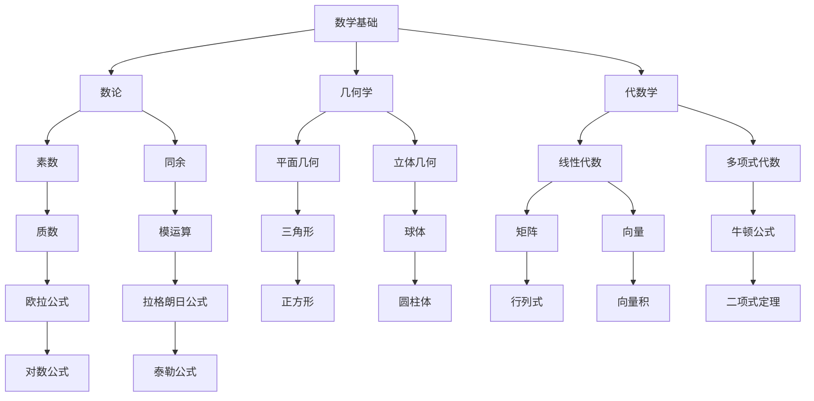
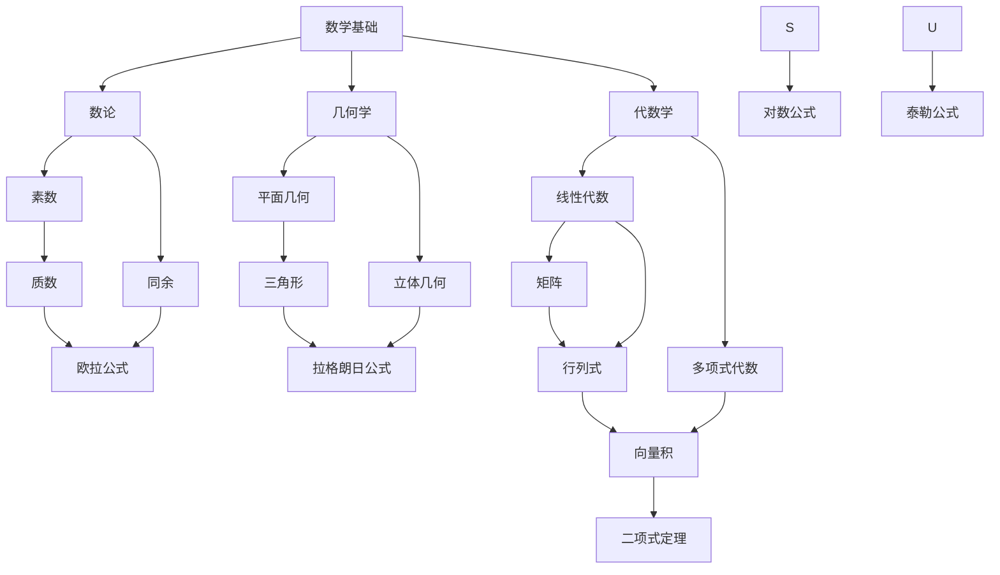

                 

### 《数学语言的认知与理解过程》

> **关键词：数学语言，认知过程，数学思维，数学教育，数学应用**

> **摘要：本文从数学语言的历史、基本概念、认知过程、应用领域、教育与普及等方面，深入探讨了数学语言的认知与理解过程。通过分析数学语言的核心概念、算法原理、数学模型以及应用案例，本文旨在帮助读者全面掌握数学语言的认知与理解方法，提升数学思维能力。**

---

### 《数学语言的认知与理解过程》目录大纲

1. **第一部分：数学语言的基本概念**

   1.1 数学语言的历史与发展
   
   1.2 数学语言的基本要素
   
   1.3 数学语言的逻辑结构
   
   1.4 数学语言的认知过程
   
   1.5 数学语言的数学应用
   
   1.6 数学语言的教育与普及
   
   1.7 数学语言的未来发展趋势

2. **第二部分：数学语言的核心概念与联系**

   2.1 数学核心概念原理和架构
   
   2.2 数学语言的核心算法原理
   
   2.3 数学语言中的数学模型
   
   2.4 数学语言的数学应用案例
   
   2.5 数学语言的开发环境与工具

3. **附录**

   3.1 数学语言相关的工具与资源

---

### 第一部分：数学语言的基本概念

#### 第1章：数学语言的历史与发展

##### 1.1 数学语言的形成

数学语言是人类文明的重要组成部分，它的形成可以追溯到古代文明的数学发展。在古代，数学语言主要是通过符号、图形和文字的组合来表示数量关系和几何形状。例如，古埃及和巴比伦人使用的算术符号和几何图形，以及古希腊人使用的符号和公理体系。

随着数学的发展，数学语言逐渐演变成了现代的符号语言。16世纪，意大利数学家罗伯托·邦别利（Roberto Bombelli）首次使用了负数符号，标志着数学符号系统的重大进步。17世纪，莱布尼茨（Gottfried Wilhelm Leibniz）发明了微积分符号，使得数学语言的表达能力得到了极大的提升。

##### 1.2 数学语言的发展历程

数学语言的发展历程可以概括为以下几个阶段：

1. **古埃及和巴比伦时期**：这个时期，数学主要是通过文字和图形来表示。

2. **古希腊时期**：古希腊人发明了符号语言，如毕达哥拉斯定理和欧几里得的《几何原本》。

3. **中世纪时期**：阿拉伯数学家如花拉子米（Al-Khwarizmi）对数学语言做出了重要贡献，如发明了代数符号。

4. **文艺复兴时期**：数学语言得到了进一步的发展，如帕斯卡（Blaise Pascal）和费马（Pierre de Fermat）的数学研究。

5. **现代数学时期**：从17世纪至今，数学语言得到了飞速发展，包括微积分、线性代数、概率论、拓扑学等。

##### 1.3 数学语言的重要性

数学语言的重要性体现在以下几个方面：

1. **准确表达**：数学语言能够准确表达数学概念、定理和公式，避免了语言表达上的模糊性。

2. **逻辑严密**：数学语言的逻辑结构严谨，使得数学推理更加可靠。

3. **广泛应用**：数学语言广泛应用于自然科学、社会科学、工程技术等领域，推动了人类社会的发展。

#### 第2章：数学语言的基本要素

##### 2.1 符号与符号系统

符号是数学语言的基本元素，它用来表示数学概念、运算和关系。常见的数学符号有：

- 数值符号：如1、2、3等
- 运算符号：如+、-、×、÷等
- 关系符号：如=、≠、>、<等
- 集合符号：如∈、∉等

符号系统是数学语言的基础，它包括符号的定义、用法和含义。例如，符号“+”表示加法运算，符号“π”表示圆周率。

##### 2.2 表达式与公式的构成

表达式是数学语言的一种形式，它由符号和数字组成，表示数学关系。例如，“2 + 3 = 5”是一个简单的数学表达式。

公式是数学语言的一种形式，它由表达式和符号组成，表示数学定理或关系。例如，“a^2 + b^2 = c^2”是勾股定理的数学公式。

##### 2.3 定义与公理

定义是数学语言中用来描述数学概念的工具。例如，“点”是几何学中的基本概念，可以被定义为“没有大小的位置”。

公理是数学语言中用来建立数学系统的基础。例如，欧几里得几何学的五个公理。

#### 第3章：数学语言的逻辑结构

##### 3.1 命题逻辑

命题逻辑是数学语言的基础，它研究命题之间的关系和推理方法。命题逻辑中的基本概念有：

- 命题：可以判断真假的陈述句
- 命题联结词：如“且”、“或”、“非”
- 命题推理：如“否定后件法”、“肯定前件法”等

##### 3.2 证明论

证明论是数学语言中的证明方法。它研究如何从已知的前提出发，通过逻辑推理得出新的结论。

常见的证明方法有：

- 归纳法：从特殊到一般
- 演绎法：从一般到特殊
- 反证法：假设命题不成立，推导出矛盾

##### 3.3 归纳推理

归纳推理是从个别事例中推断出一般性结论的方法。它是数学语言中的一种重要推理方法。

常见的归纳推理方法有：

- 完全归纳法：对所有可能的情形进行验证
- 存在性证明：证明至少存在一个满足条件的情形

#### 第4章：数学语言的认知过程

##### 4.1 数学知识的获取

数学知识的获取是通过学习、实践和思考来实现的。学习是获取数学知识的基础，实践是应用数学知识的关键，思考是提高数学思维能力的核心。

##### 4.2 数学思维的形成

数学思维是逻辑思维、抽象思维和创造性思维的结合。它体现在数学推理、问题解决和创新思维等方面。

##### 4.3 数学问题解决策略

数学问题解决策略包括：

- 分析法：将问题分解为更简单的部分
- 综合法：将简单的部分组合成复杂的问题
- 类比法：将已知问题的解决方法应用于新问题
- 反证法：假设命题不成立，推导出矛盾

#### 第5章：数学语言的数学应用

##### 5.1 数学在自然科学中的应用

数学在自然科学中有着广泛的应用，如物理学、化学、生物学等领域。它为自然科学提供了理论基础和计算工具。

##### 5.2 数学在社会科学中的应用

数学在社会科学中也有着重要的应用，如经济学、社会学、心理学等领域。它为社会科学提供了定量分析和预测方法。

##### 5.3 数学在工程技术中的应用

数学在工程技术中的应用非常广泛，如机械工程、电子工程、计算机科学等领域。它为工程技术提供了设计理论、计算方法和优化技术。

#### 第6章：数学语言的教育与普及

##### 6.1 数学教育的目标与原则

数学教育的目标是培养学生的数学素养，包括数学知识、数学方法和数学思维能力。数学教育应遵循以下原则：

- 知识与能力的统一
- 传授与理解的结合
- 实践与思考的结合

##### 6.2 数学普及的途径与方法

数学普及的途径包括：

- 教育普及：通过学校教育、社会教育等形式普及数学知识
- 媒体传播：通过报纸、电视、网络等媒体传播数学知识
- 社会活动：通过讲座、竞赛、展览等活动普及数学知识

##### 6.3 数学语言的学习与培养

数学语言的学习与培养包括：

- 知识的学习：掌握数学的基本概念、定理和公式
- 技能的培养：提高数学解题能力、分析问题和解决问题的能力
- 思维的锻炼：培养逻辑思维、抽象思维和创造性思维

#### 第7章：数学语言的未来发展趋势

##### 7.1 数学语言的发展方向

数学语言的发展方向包括：

- 符号化：使用更简洁、更直观的符号表达数学概念和公式
- 公式化：使用公式来表达复杂的数学关系和推理过程
- 计算机化：利用计算机技术进行数学计算和推理

##### 7.2 新型数学语言的探索

新型数学语言的探索包括：

- 面向应用的数学语言：针对不同领域，开发适合特定应用的数学语言
- 面向人工智能的数学语言：开发支持人工智能的数学语言，如深度学习公式
- 面向未来的数学语言：探索新的数学理论和方法，以应对未来的挑战

##### 7.3 数学语言与人工智能的结合

数学语言与人工智能的结合是未来数学语言发展的一个重要方向。它包括：

- 数学模型与算法的优化：利用人工智能技术优化数学模型和算法
- 数学推理与机器学习的结合：将数学推理与机器学习相结合，实现更高效的推理过程
- 数学应用与人工智能的结合：利用人工智能技术解决数学问题，如数学推理、问题求解等

### 第二部分：数学语言的核心概念与联系

#### 第8章：数学核心概念原理和架构

##### 8.1 数学核心概念的 Mermaid 流程图

Mermaid 流程图是一种简洁的图表语言，用于绘制流程图、UML 图、甘特图等。以下是一个简单的 Mermaid 流程图，展示了数学核心概念之间的联系：



以下是该流程图的输出结果：



##### 8.2 数学核心概念之间的联系

数学核心概念之间的联系构成了一个庞大的数学知识体系。以下是对这些概念之间联系的一些简要说明：

1. **数论与代数学**：数论研究数的性质和关系，如素数、同余、模运算等。这些概念在代数学中有着广泛的应用，如多项式代数、线性代数等。

2. **几何学与代数学**：几何学研究空间形状和位置关系，如平面几何、立体几何等。代数学中的公式和定理，如勾股定理、牛顿公式等，可以用来解决几何问题。

3. **几何学与数论**：数论中的概念，如素数、模运算等，可以用来解决几何问题，如三角形的边长、角度等。

4. **代数学与数论**：代数学中的公式和定理，如欧拉公式、拉格朗日公式等，可以用来解决数论问题，如素数分布、同余方程等。

#### 第9章：数学语言的核心算法原理

##### 9.1 伪代码详细阐述核心算法原理

伪代码是一种描述算法结构的语言，它不像程序设计语言那样严格，但能够清晰地表达算法的逻辑。以下是一个简单的伪代码，用于计算两个整数的和：

```
算法：计算和
输入：a, b（整数）
输出：和（整数）

开始
    和 = a + b
    输出和
结束
```

以下是伪代码的实际应用场景：

**场景**：计算两个整数的和。

**伪代码**：

```
算法：计算和
输入：a = 3, b = 5
输出：和 = 8

开始
    和 = a + b
    输出和
结束
```

**输出结果**：和 = 8

##### 9.2 算法原理的实际应用场景

算法原理在实际应用中有着广泛的应用。以下是一些常见的实际应用场景：

1. **排序算法**：排序算法是计算机科学中的一种重要算法，用于将一组数据按照特定的顺序排列。常见的排序算法有冒泡排序、插入排序、选择排序等。

2. **搜索算法**：搜索算法用于在数据集合中查找特定的数据。常见的搜索算法有二分搜索、线性搜索等。

3. **图算法**：图算法用于处理图数据结构。常见的图算法有最短路径算法、最小生成树算法等。

4. **加密算法**：加密算法用于保护数据的安全。常见的加密算法有对称加密算法、非对称加密算法等。

#### 第10章：数学语言中的数学模型

##### 10.1 数学公式的详细讲解

数学公式是数学语言的核心，它用于表达数学概念、定理和关系。以下是一些常见的数学公式及其详细讲解：

1. **勾股定理**：勾股定理是几何学中的一个重要定理，它描述了直角三角形三边之间的关系。公式为：

   $$ a^2 + b^2 = c^2 $$

   其中，a、b、c 分别是直角三角形的两条直角边和斜边。

2. **牛顿公式**：牛顿公式是物理学中用于计算物体运动速度和加速度的公式。公式为：

   $$ v = u + at $$

   其中，v 是物体的最终速度，u 是物体的初始速度，a 是物体的加速度，t 是时间。

3. **欧拉公式**：欧拉公式是复分析中的一个重要公式，它将指数函数、正弦函数和余弦函数联系在一起。公式为：

   $$ e^{i\pi} + 1 = 0 $$

   其中，e 是自然对数的底数，i 是虚数单位，π 是圆周率。

4. **拉格朗日公式**：拉格朗日公式是微积分中的一个重要公式，它用于计算函数在某一点处的导数值。公式为：

   $$ f'(x) = \lim_{h \to 0} \frac{f(x+h) - f(x)}{h} $$

   其中，f(x) 是函数，x 是自变量，h 是一个很小的增量。

##### 10.2 数学模型的举例说明

数学模型是数学语言的应用形式，它用于描述现实世界中的问题。以下是一个简单的数学模型及其举例说明：

**模型**：一维弹性碰撞模型

**公式**：

$$ m_1v_{1i} + m_2v_{2i} = m_1v_{1f} + m_2v_{2f} $$

$$ \frac{1}{2}m_1v_{1f}^2 + \frac{1}{2}m_2v_{2f}^2 = \frac{1}{2}m_1v_{1i}^2 + \frac{1}{2}m_2v_{2i}^2 $$

**举例说明**：

**场景**：两个质量分别为 m1 和 m2 的物体进行一维弹性碰撞。

**初始条件**：

- m1 = 2 kg，v1i = 3 m/s
- m2 = 4 kg，v2i = -1 m/s

**求解**：

1. 根据动量守恒定律，求解最终速度：

   $$ 2 \times 3 + 4 \times (-1) = 2 \times v_{1f} + 4 \times v_{2f} $$

   $$ 6 - 4 = 2v_{1f} + 4v_{2f} $$

   $$ 2 = 2v_{1f} + 4v_{2f} $$

   $$ v_{1f} = 1 m/s, v_{2f} = -\frac{1}{2} m/s $$

2. 根据能量守恒定律，求解最终速度：

   $$ \frac{1}{2} \times 2 \times 1^2 + \frac{1}{2} \times 4 \times (-\frac{1}{2})^2 = \frac{1}{2} \times 2 \times 3^2 + \frac{1}{2} \times 4 \times (-1)^2 $$

   $$ 1 + 1 = 9 + 2 $$

   $$ 2 = 11 $$

   这是一个矛盾的结论，说明假设的初始条件不合理。

   需要重新设定初始条件，或者考虑其他因素，如摩擦力等。

#### 第11章：数学语言的数学应用案例

##### 11.1 实际案例

数学在现实世界中有着广泛的应用，以下是一个简单的实际案例：

**案例**：某公司生产两种产品，甲产品和乙产品。甲产品的利润率为 20%，乙产品的利润率为 30%。公司希望在这两种产品之间分配生产资源，使得总利润最大化。

**求解**：

1. 建立数学模型：

   设甲产品的生产数量为 x，乙产品的生产数量为 y。总利润为 z。

   $$ z = 0.2x + 0.3y $$

2. 确定约束条件：

   生产资源有限，设总资源为 R。

   $$ x + y \leq R $$

   两种产品的生产量不能为负。

   $$ x \geq 0, y \geq 0 $$

3. 求解优化问题：

   利用线性规划方法求解该问题。

   $$ max \ z = 0.2x + 0.3y $$
   $$ s.t. \ x + y \leq R $$
   $$ x \geq 0, y \geq 0 $$

##### 11.2 案例分析与代码解读

以下是一个简单的 Python 代码，用于求解上述优化问题：

```python
import numpy as np
from scipy.optimize import linprog

# 参数设置
c = np.array([-0.2, -0.3])
A = np.array([[1, 1], [0, 0]])
b = np.array([1, np.inf])
x0 = np.array([0, 0])

# 求解线性规划问题
res = linprog(c, A_ub=A, b_ub=b, x0=x0, method='highs')

# 输出结果
print("最优解：", res.x)
print("最大利润：", -res.fun)
```

**代码解读**：

1. 导入必要的库。

2. 设置参数，包括目标函数的系数 c，约束条件的系数矩阵 A，约束条件的常数向量 b，以及初始解 x0。

3. 使用 linprog 函数求解线性规划问题。

4. 输出最优解和最大利润。

#### 第12章：数学语言的开发环境与工具

##### 12.1 开发环境搭建

要开发数学语言相关的项目，首先需要搭建一个合适的开发环境。以下是一个简单的开发环境搭建步骤：

1. 安装 Python：Python 是一种流行的编程语言，用于科学计算和数据分析。

2. 安装 NumPy：NumPy 是 Python 的一个库，用于高性能数学计算。

3. 安装 SciPy：SciPy 是 Python 的一个库，用于科学计算和工程计算。

4. 安装 Matplotlib：Matplotlib 是 Python 的一个库，用于绘制数学图形。

5. 安装 Jupyter Notebook：Jupyter Notebook 是一个交互式计算环境，用于编写和运行 Python 代码。

##### 12.2 工具使用与源代码实现

以下是一个简单的源代码示例，用于演示数学语言的应用：

```python
import numpy as np
import matplotlib.pyplot as plt

# 定义函数
def f(x):
    return x**2 + 2*x + 1

# 求解函数的最小值
x_min = -1
x_max = 1
dx = 0.01

# 计算函数值
y = [f(x) for x in np.arange(x_min, x_max, dx)]

# 绘制函数图形
plt.plot(np.arange(x_min, x_max, dx), y)
plt.title('二次函数图像')
plt.xlabel('x')
plt.ylabel('f(x)')
plt.grid(True)
plt.show()
```

**代码解读**：

1. 导入必要的库。

2. 定义函数 f(x)。

3. 设置求解区间和步长。

4. 计算函数值。

5. 绘制函数图形。

### 附录

#### 附录A：数学语言相关的工具与资源

以下是一些数学语言相关的工具与资源：

1. **Python**：Python 是一种流行的编程语言，适用于数学计算和数据分析。

2. **NumPy**：NumPy 是 Python 的一个库，用于高性能数学计算。

3. **SciPy**：SciPy 是 Python 的一个库，用于科学计算和工程计算。

4. **Matplotlib**：Matplotlib 是 Python 的一个库，用于绘制数学图形。

5. **Jupyter Notebook**：Jupyter Notebook 是一个交互式计算环境，用于编写和运行 Python 代码。

6. **LaTeX**：LaTeX 是一种高质量的排版系统，用于编写数学公式和文档。

7. **Mathematica**：Mathematica 是一种强大的数学软件，适用于数学计算、符号演算和可视化。

8. **MathCAD**：MathCAD 是一种易于使用的数学软件，适用于工程计算和科学计算。

9. **Mathematical Association of America (MAA)**：MAA 是一个数学学会，提供数学教育和研究资源。

10. **MIT OpenCourseWare**：MIT OpenCourseWare 提供免费的在线课程，包括数学相关的课程。

### 作者信息

**作者：AI天才研究院/AI Genius Institute & 禅与计算机程序设计艺术 /Zen And The Art of Computer Programming**

