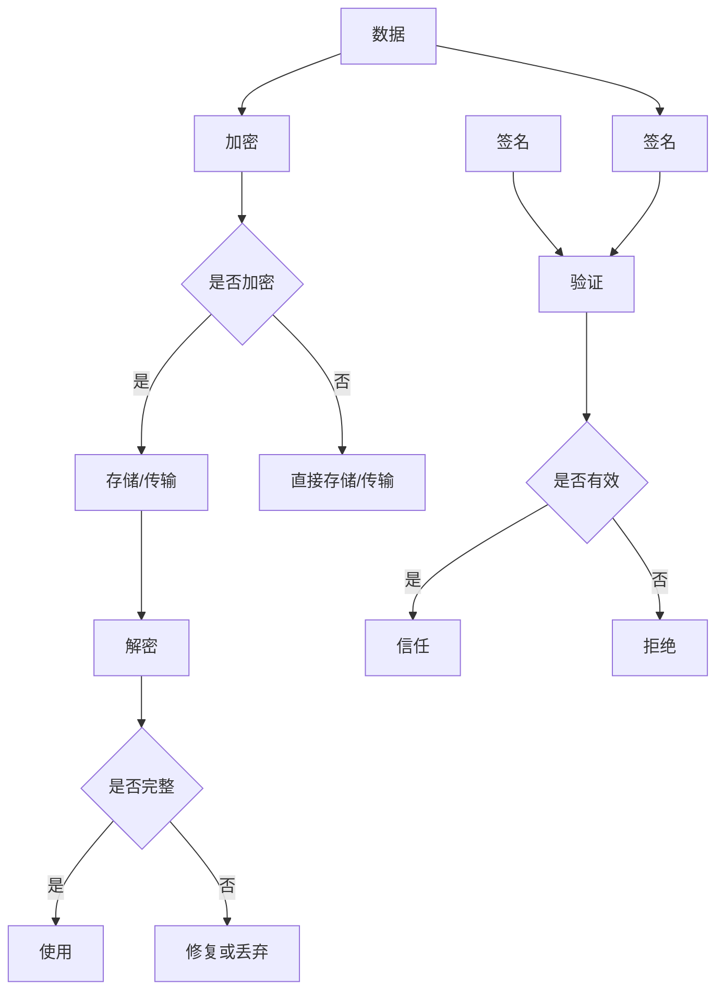

                 

# 《数据安全技术：保障 AI 2.0 数据安全》

## 关键词
- 数据安全
- AI 2.0
- 数据加密
- 数字签名
- 安全协议
- 隐私保护
- 加密算法
- 数学模型

## 摘要
随着人工智能技术的快速发展，AI 2.0时代已经来临。然而，随之而来的数据安全问题也日益突出。本文旨在探讨数据安全技术，以保障AI 2.0时代的数据安全。文章将从数据安全概述与核心概念、AI 2.0数据安全策略、数据安全核心算法与数学模型、AI 2.0数据安全实战以及数据安全合规与未来趋势等多个方面进行详细分析，为读者提供全面的数据安全技术指南。

---

## 目录大纲

### 第一部分：数据安全概述与核心概念

#### 1. 数据安全的重要性与挑战
- 数据安全的概念
- AI 2.0 时代的数据安全挑战

#### 2. 数据安全技术基础
- 加密技术
  - 对称加密算法（如AES）
  - 非对称加密算法（如RSA）
- 数字签名
- 安全协议（如SSL/TLS）

#### 3. 核心概念与联系
- Mermaid流程图：数据加密、解密与签名过程

#### 4. 数据安全架构
- 分布式存储与数据加密
- 数据备份与恢复
- 数据隐私保护

### 第二部分：AI 2.0 数据安全策略

#### 5. AI 2.0 数据安全策略概述
- 数据分类与分级
- 数据访问控制
- 数据丢失与泄露防范

#### 6. 数据加密与保护技术
- 数据加密算法的应用与选择
- 数据存储加密
- 数据传输加密

#### 7. 隐私保护与去识别化
- 隐私保护技术
  - 数据匿名化
  - 数据去识别化
- 合规性考虑（如GDPR、CCPA）

### 第三部分：数据安全核心算法与数学模型

#### 8. 加密算法原理
- 对称加密算法（如AES）的伪代码实现
- 非对称加密算法（如RSA）的伪代码实现

#### 9. 数字签名与验证
- 数字签名原理与验证过程
- RSA签名与验证伪代码实现

#### 10. 哈希函数与摘要算法
- 哈希函数的作用与常见算法（如MD5、SHA-256）
- 哈希摘要算法的原理与应用

### 第四部分：AI 2.0 数据安全实战

#### 11. AI 2.0 数据安全案例研究
- 典型数据泄露案例
- 数据安全防护措施分析

#### 12. 数据安全实战项目
- 数据加密项目实战
- 数据备份与恢复项目实战
- 数据隐私保护项目实战
- 实战项目源代码解析与解读

### 第五部分：数据安全合规与未来趋势

#### 13. 数据安全合规性
- 不同地区数据安全法规比较（如GDPR、CCPA）
- 数据安全合规实施策略

#### 14. 未来数据安全趋势
- 数据安全技术的发展方向
- AI 2.0 数据安全的未来挑战与机遇

### 附录

#### 15. 数据安全工具与资源
- 主流数据安全工具介绍
- 开源数据安全框架与资源
- 安全工具使用指南与案例

---

接下来，我们将逐步深入探讨每一个部分的内容，以帮助读者全面了解数据安全技术，并保障AI 2.0时代的数据安全。让我们一步一步来分析推理，思考数据安全的核心问题。

### 第一部分：数据安全概述与核心概念

#### 1. 数据安全的重要性与挑战

数据安全是当前信息化社会中至关重要的一个领域。随着互联网的普及和大数据时代的到来，数据已经成为企业和组织的重要资产。然而，与此同时，数据泄露、数据篡改、数据丢失等安全事件也日益频繁。特别是在AI 2.0时代，数据安全问题变得更加复杂和严峻。

首先，让我们来定义一下数据安全。数据安全指的是保护数据免受未经授权的访问、泄露、篡改和破坏的措施。在AI 2.0时代，数据安全的重要性主要体现在以下几个方面：

1. **隐私保护**：随着个人数据的收集和存储量不断增加，保护用户隐私成为数据安全的首要任务。
2. **数据完整性**：确保数据在存储、传输和处理过程中不被篡改，保证数据的真实性和可靠性。
3. **数据可用性**：在发生故障或攻击时，确保数据能够快速恢复，不影响业务的正常运行。
4. **合规性**：遵守相关数据安全法规和标准，如GDPR、CCPA等，避免法律风险。

然而，AI 2.0时代的数据安全也面临着一系列挑战：

1. **数据量的爆炸式增长**：随着物联网、云计算等技术的发展，数据量呈现指数级增长，给数据安全带来了巨大压力。
2. **复杂的数据处理流程**：在AI 2.0时代，数据处理过程通常涉及多个系统和平台，数据安全问题难以监控和控制。
3. **高级攻击手段**：黑客攻击手段不断升级，如高级持续性威胁（APT）、勒索软件等，给数据安全带来了新的威胁。
4. **新兴技术的应用**：如区块链、边缘计算等新兴技术给数据安全带来了新的挑战。

在接下来的章节中，我们将详细探讨数据安全技术的基础，包括加密技术、数字签名、安全协议等，并分析这些技术在数据安全中的应用。同时，我们将讨论数据安全架构，包括分布式存储、数据备份与恢复、数据隐私保护等，以帮助读者全面了解数据安全的重要性以及如何应对AI 2.0时代的挑战。

---

在接下来的部分，我们将继续深入探讨数据安全技术的核心概念和基础，包括加密技术、数字签名、安全协议等，帮助读者构建对数据安全技术的全面理解。

### 第二部分：数据安全技术基础

#### 2. 数据加密与保护技术

数据加密是数据安全的核心技术之一，它通过将数据转换成难以解读的形式来保护数据。加密技术可以分为对称加密和非对称加密两种。

##### 对称加密算法（如AES）

对称加密算法是一种加密和解密使用相同密钥的加密方法。这意味着加密者和解密者都必须拥有相同的密钥。常见的对称加密算法包括AES、DES和RSA等。

AES（高级加密标准）是一种广泛使用的对称加密算法，它由美国国家标准与技术研究所（NIST）在2001年发布，已经成为事实上的加密标准。AES使用128位、192位或256位密钥对数据进行加密和解密。下面是一个简单的AES加密和解密的伪代码实现：

```plaintext
// AES加密伪代码
function AES_encrypt(plaintext, key):
    ciphertext = AES_Encrypt(plaintext, key)
    return ciphertext

// AES解密伪代码
function AES_decrypt(ciphertext, key):
    plaintext = AES_Decrypt(ciphertext, key)
    return plaintext
```

##### 非对称加密算法（如RSA）

非对称加密算法使用一对密钥：公钥和私钥。公钥用于加密，私钥用于解密。这意味着加密者可以使用公钥加密数据，而只有拥有私钥的解密者才能解密。RSA（Rivest-Shamir-Adleman）是一种常见的非对称加密算法。下面是一个简单的RSA加密和解密的伪代码实现：

```plaintext
// RSA加密伪代码
function RSA_encrypt(plaintext, public_key):
    ciphertext = RSA_Encrypt(plaintext, public_key)
    return ciphertext

// RSA解密伪代码
function RSA_decrypt(ciphertext, private_key):
    plaintext = RSA_Decrypt(ciphertext, private_key)
    return plaintext
```

##### 数字签名

数字签名是一种确保数据完整性和真实性的技术。发送者使用自己的私钥对数据签名，接收者使用发送者的公钥验证签名。如果签名有效，则说明数据在传输过程中未被篡改，且来自正确的发送者。下面是一个简单的RSA数字签名和验证的伪代码实现：

```plaintext
// RSA签名伪代码
function RSA_sign(plaintext, private_key):
    signature = RSA_Sign(plaintext, private_key)
    return signature

// RSA验证签名伪代码
function RSA_verify(ciphertext, signature, public_key):
    is_valid = RSA_Verify(ciphertext, signature, public_key)
    return is_valid
```

##### 安全协议（如SSL/TLS）

安全协议是确保数据在传输过程中不被窃听、篡改或伪造的一系列规则和协议。SSL（安全套接层）和TLS（传输层安全）是两种广泛使用的安全协议。

SSL/TLS使用公钥加密来确保数据的机密性，使用数字签名确保数据的完整性和真实性。SSL/TLS的握手过程包括以下步骤：

1. **客户端请求**：客户端向服务器发送SSL/TLS请求。
2. **服务器响应**：服务器发送其证书，证书包含服务器的公钥和身份验证信息。
3. **客户端验证**：客户端验证服务器的证书，确保服务器是合法的。
4. **密钥交换**：客户端和服务器协商加密算法和密钥。
5. **加密通信**：客户端和服务器使用协商的密钥加密数据并传输。

SSL/TLS的握手过程保证了数据在传输过程中的安全性，同时防止了中间人攻击等安全威胁。

在接下来的章节中，我们将深入探讨数据安全的核心概念与联系，通过Mermaid流程图来展示数据加密、解密与签名的过程。同时，我们将介绍数据安全架构，讨论分布式存储、数据备份与恢复、数据隐私保护等方面的内容。这些内容将帮助读者全面理解数据安全技术，并为其在实际应用中提供指导。

### 3. 核心概念与联系

数据安全技术的核心概念包括加密、解密、数字签名和验证等。为了更好地理解这些概念之间的联系，我们可以使用Mermaid流程图来展示数据加密、解密与签名的过程。

以下是一个简化的Mermaid流程图，展示了数据加密、解密和签名的流程：



**流程图解释**：

1. **数据加密**：原始数据（A）通过加密算法（如AES或RSA）加密（B），生成密文（C）。
2. **存储/传输**：密文（D）可以被直接存储或传输。如果选择加密存储或传输，则密文（D）在存储或传输过程中保持加密状态。
3. **解密**：接收方使用相应的密钥（对称加密使用相同密钥，非对称加密使用私钥）对密文（D）进行解密（F），得到原始数据（G）。
4. **数字签名**：发送方使用自己的私钥对数据（A）进行签名（J），生成签名（K）。
5. **验证签名**：接收方使用发送方的公钥对签名（K）进行验证（L），判断签名是否有效（M）。
6. **数据使用**：如果数据完整且签名有效，则可以信任并使用数据（H）。否则，需要进行修复或丢弃（I）。

通过这个流程图，我们可以清晰地看到数据加密、解密、签名和验证的过程，以及它们之间的逻辑关系。这个流程图不仅有助于我们理解数据安全技术的核心概念，还可以作为设计和实现数据安全系统的参考。

在接下来的章节中，我们将讨论数据安全架构，包括分布式存储、数据备份与恢复、数据隐私保护等方面。这些内容将进一步深化我们对数据安全技术的理解，并帮助我们应对AI 2.0时代的数据安全挑战。

### 4. 数据安全架构

数据安全架构是一个复杂的系统，它需要考虑多个方面来确保数据的安全性。以下是数据安全架构中的几个关键组成部分：

#### 分布式存储与数据加密

分布式存储系统通过将数据分散存储在多个节点上来提高数据的可靠性和可用性。在分布式存储中，数据加密是保护数据安全的关键技术。通过在存储之前对数据进行加密，即使某个节点受到攻击，攻击者也无法直接访问原始数据。

分布式存储与数据加密的结合可以通过以下步骤实现：

1. **数据分割**：将数据分割成小块，每个小块独立加密。
2. **加密**：使用对称加密算法（如AES）对每个数据块进行加密。
3. **存储**：将加密后的数据块存储在分布式存储系统中。
4. **密钥管理**：安全地管理加密密钥，确保只有授权用户可以访问密钥。

#### 数据备份与恢复

数据备份是确保数据不因系统故障或人为错误而丢失的关键措施。数据备份通常包括以下步骤：

1. **定期备份**：定期将数据复制到备份存储设备上。
2. **异地备份**：将备份存储在地理位置不同的地方，以防止自然灾害或人为破坏导致的数据丢失。
3. **数据恢复**：在数据丢失或损坏时，从备份中恢复数据。

数据备份与数据加密可以结合使用，以提高数据的安全性。例如，可以将加密后的数据备份到异地存储设备上，即使备份设备遭受攻击，攻击者也无法访问原始数据。

#### 数据隐私保护

数据隐私保护旨在确保个人数据的保密性和隐私性。以下是一些常用的数据隐私保护技术：

1. **数据匿名化**：通过删除或修改个人标识信息来匿名化数据，使其无法直接识别个人。
2. **数据去识别化**：通过一定的算法和技术，将数据中的个人标识信息转换为不可识别的形式。
3. **数据访问控制**：限制对数据的访问权限，确保只有授权用户可以访问敏感数据。

在AI 2.0时代，数据隐私保护尤为重要。随着数据量的爆炸式增长，个人隐私的保护变得更加复杂和重要。数据隐私保护技术可以帮助企业在遵守相关法规（如GDPR、CCPA）的同时，保护用户隐私。

综上所述，数据安全架构需要综合考虑分布式存储、数据备份与恢复、数据隐私保护等多个方面，以构建一个全面的数据安全系统。通过这些技术手段，我们可以有效地保障AI 2.0时代的数据安全，防止数据泄露、数据篡改和数据丢失等安全事件的发生。

在接下来的章节中，我们将深入探讨AI 2.0数据安全策略，包括数据分类与分级、数据访问控制、数据丢失与泄露防范等，帮助读者了解如何在实践中应用这些技术来保障数据安全。

### 第三部分：AI 2.0 数据安全策略

#### 5. AI 2.0 数据安全策略概述

随着AI技术的飞速发展，AI 2.0时代的到来意味着数据处理和分析的复杂性和规模都达到了新的高度。在这样的背景下，制定一套科学、系统的数据安全策略显得尤为重要。AI 2.0 数据安全策略主要包括以下几个方面：

1. **数据分类与分级**：根据数据的重要性和敏感性对数据分类，并制定相应的安全措施。
2. **数据访问控制**：通过权限管理确保只有授权用户可以访问特定的数据。
3. **数据丢失与泄露防范**：采取多种技术手段，防止数据在传输和存储过程中丢失或泄露。

#### 6. 数据加密与保护技术

在AI 2.0时代，数据加密是保障数据安全的基础技术。以下介绍几种常见的数据加密与保护技术：

##### 数据加密算法的应用与选择

选择合适的加密算法对于保障数据安全至关重要。以下是几种常见的数据加密算法及其特点：

1. **对称加密算法**：如AES，速度快，适用于需要大量数据处理的情况。
2. **非对称加密算法**：如RSA，安全性高，但计算复杂度较大，适用于密钥交换和数字签名。
3. **哈希算法**：如SHA-256，用于生成数据摘要，确保数据的完整性。

在实际应用中，可以根据数据的类型和安全性要求选择合适的加密算法。例如，对于大规模数据处理，可以选择AES；对于敏感数据的传输，可以选择RSA进行密钥交换。

##### 数据存储加密

数据存储加密是保护静态数据的重要手段。以下是一些常见的数据存储加密方法：

1. **全盘加密**：对整个硬盘进行加密，确保硬盘数据在未授权情况下无法访问。
2. **文件加密**：对特定文件或文件夹进行加密，提高数据的安全性。
3. **数据库加密**：对数据库中的敏感数据进行加密，防止数据库泄露。

在实际应用中，可以根据数据的重要性和存储环境选择合适的加密方法。例如，对于重要数据，可以选择全盘加密；对于普通数据，可以选择文件加密。

##### 数据传输加密

数据传输加密是保护数据在传输过程中不被窃听或篡改的重要手段。以下是一些常见的数据传输加密方法：

1. **SSL/TLS协议**：用于保障Web应用中的数据传输安全。
2. **IPSec协议**：用于保障网络层的数据传输安全。
3. **VPN（虚拟专用网络）**：通过建立加密通道，保障数据在公共网络中的安全传输。

在实际应用中，可以根据数据传输的环境和需求选择合适的加密方法。例如，对于Web应用，可以选择SSL/TLS协议；对于远程访问，可以选择VPN。

#### 7. 隐私保护与去识别化

在AI 2.0时代，隐私保护变得尤为重要。以下介绍几种常见的隐私保护与去识别化技术：

##### 隐私保护技术

1. **数据匿名化**：通过删除或修改个人标识信息，使数据无法直接识别个人。
2. **数据去识别化**：通过一定的算法和技术，将数据中的个人标识信息转换为不可识别的形式。

在实际应用中，可以根据数据的重要性和隐私保护要求选择合适的匿名化或去识别化技术。例如，对于普通用户数据，可以选择数据匿名化；对于敏感数据，可以选择数据去识别化。

##### 合规性考虑

在AI 2.0时代，合规性是保障数据安全的重要方面。以下介绍一些常见的合规性考虑：

1. **GDPR（通用数据保护条例）**：欧盟制定的关于数据保护的法律，要求企业必须获得用户同意才能收集和使用个人数据。
2. **CCPA（加州消费者隐私法案）**：美国加州制定的关于数据保护的法律，要求企业告知用户其数据的使用情况，并给予用户删除和访问其数据的权利。

在实际应用中，企业需要遵守相关法律法规，制定相应的合规性策略。例如，对于欧盟用户数据，需要遵守GDPR；对于加州用户数据，需要遵守CCPA。

通过以上AI 2.0数据安全策略，企业可以在AI 2.0时代有效保障数据安全，防止数据泄露、数据篡改和数据丢失等安全事件的发生。在接下来的章节中，我们将深入探讨数据安全核心算法与数学模型，帮助读者进一步了解数据安全技术的本质。

### 第四部分：数据安全核心算法与数学模型

#### 8. 加密算法原理

加密算法是数据安全的核心技术，它通过将数据转换成难以解读的形式来保护数据。加密算法可以分为对称加密算法和非对称加密算法两种类型。以下是这两种加密算法的原理介绍。

##### 对称加密算法（如AES）

对称加密算法使用相同的密钥进行加密和解密。这意味着加密者和解密者都必须知道相同的密钥。AES（高级加密标准）是一种常用的对称加密算法，它由美国国家标准与技术研究所（NIST）在2001年发布。

AES加密过程如下：

1. **初始化**：根据密钥生成初始状态。
2. **密钥扩展**：生成一系列轮密钥。
3. **加密过程**：将明文分组与初始状态进行多次轮加密。
4. **输出**：输出加密后的密文。

以下是AES加密的伪代码实现：

```python
def AES_encrypt(plaintext, key):
    state = initialize_state(plaintext, key)
    round_keys = expand_key(key)
    for i in range(10):
        state = add_round_key(state, round_keys[i])
        state = sub_bytes(state)
        state = shift_rows(state)
        state = mix_columns(state)
    ciphertext = add_round_key(state, round_keys[10])
    return ciphertext
```

AES解密过程与加密过程类似，但反向执行每个加密步骤。

##### 非对称加密算法（如RSA）

非对称加密算法使用一对密钥：公钥和私钥。公钥用于加密，私钥用于解密。这意味着加密者可以使用公钥加密数据，而只有拥有私钥的解密者才能解密。RSA（Rivest-Shamir-Adleman）是一种常用的非对称加密算法。

RSA加密过程如下：

1. **密钥生成**：选择两个大素数 \( p \) 和 \( q \)，计算 \( n = p \times q \)，计算 \( \phi(n) = (p-1) \times (q-1) \)。
2. **公钥和私钥**：选择一个较小的质数 \( e \)（通常为17），使得 \( e \) 和 \( \phi(n) \) 互质。计算 \( d \) 使得 \( d \times e \equiv 1 \pmod{\phi(n)} \)。公钥为 \( (n, e) \)，私钥为 \( (n, d) \)。
3. **加密过程**：将明文 \( M \) 转换为整数 \( m \)，计算 \( c = m^e \pmod{n} \)。

以下是RSA加密的伪代码实现：

```python
def RSA_encrypt(plaintext, public_key):
    n, e = public_key
    m = convert_plaintext_to_integer(plaintext)
    c = pow(m, e, n)
    return c
```

RSA解密过程如下：

1. **解密过程**：将密文 \( C \) 转换为整数 \( c \)，计算 \( m = c^d \pmod{n} \)。
2. **输出**：将整数 \( m \) 转换回明文。

以下是RSA解密的伪代码实现：

```python
def RSA_decrypt(ciphertext, private_key):
    n, d = private_key
    c = convert_ciphertext_to_integer(ciphertext)
    m = pow(c, d, n)
    return convert_integer_to_plaintext(m)
```

#### 9. 数字签名与验证

数字签名是确保数据完整性和真实性的技术。发送方使用自己的私钥对数据进行签名，接收方使用发送方的公钥验证签名。数字签名过程如下：

1. **签名过程**：发送方使用哈希函数对数据进行哈希处理，生成哈希值。然后使用私钥对哈希值进行加密，生成签名。
2. **验证过程**：接收方使用哈希函数对数据进行哈希处理，生成哈希值。然后使用发送方的公钥对签名进行解密，生成验证值。如果验证值与哈希值相同，则签名有效。

以下是RSA数字签名和验证的伪代码实现：

**RSA签名伪代码**：

```python
def RSA_sign(plaintext, private_key):
    n, d = private_key
    h = hash_function(plaintext)
    s = pow(h, d, n)
    return s

def RSA_verify(plaintext, signature, public_key):
    n, e = public_key
    h = hash_function(plaintext)
    v = pow(signature, e, n)
    return v == h
```

#### 10. 哈希函数与摘要算法

哈希函数是一种将任意长度的输入（即消息）转换成固定长度的输出的函数。哈希函数在数据安全中用于生成数据摘要，确保数据的完整性。以下是一些常见的哈希函数：

1. **MD5**：生成128位的哈希值，但由于其容易受到碰撞攻击，不建议用于安全性要求较高的场景。
2. **SHA-256**：生成256位的哈希值，是一种广泛使用的哈希函数。

以下是哈希函数的原理和示例：

**SHA-256哈希函数原理**：

1. **预处理**：将输入的消息填充至512位的倍数，并添加一个长度字段。
2. **初始化哈希值**：设置初始哈希值为256位。
3. **处理块**：将输入消息划分为512位的块，对每个块进行64轮处理。
4. **输出**：将最终的哈希值作为输出。

以下是SHA-256哈希函数的伪代码实现：

```python
def SHA256(plaintext):
    # 预处理
    # ...

    # 初始化哈希值
    hash_value = initialize_hash_value()

    # 处理每个块
    for block in blocks(plaintext):
        # 处理块
        # ...

    # 输出哈希值
    return hash_value
```

通过以上对加密算法、数字签名和哈希函数的介绍，我们可以看到数据安全核心算法的原理和实现。这些算法在数据安全中发挥着关键作用，帮助我们在AI 2.0时代保障数据的安全性。在接下来的章节中，我们将通过案例研究和实战项目来展示数据安全技术的实际应用。

### 第五部分：AI 2.0 数据安全实战

#### 11. AI 2.0 数据安全案例研究

在AI 2.0时代，数据安全事件频繁发生，以下是一些典型的案例以及对应的数据安全防护措施分析。

##### 案例一：Facebook数据泄露事件

2018年，Facebook发生了约8700万用户的个人信息泄露事件。黑客利用应用程序中存在的漏洞，获取了用户的电话号码、出生日期、位置等敏感信息。该事件引起了全球范围内的广泛关注。

**防护措施分析**：

1. **数据加密**：Facebook应采用全面的数据加密策略，确保用户数据在存储和传输过程中被加密。例如，对于用户电话号码、位置等信息，应使用AES等对称加密算法进行加密。
2. **访问控制**：Facebook应加强访问控制，确保只有授权用户可以访问敏感数据。例如，可以使用RBAC（基于角色的访问控制）机制，限制不同角色的用户对数据的访问权限。
3. **安全审计**：Facebook应定期进行安全审计，发现和修复潜在的安全漏洞。例如，利用自动化工具对应用程序进行静态和动态代码分析，检测可能的漏洞。

##### 案例二：Equifax数据泄露事件

2017年，美国信用报告公司Equifax发生了1.43亿用户的个人信息泄露事件。黑客成功入侵了Equifax的数据库，窃取了用户的姓名、社会安全号码、出生日期、驾驶执照号码等敏感信息。

**防护措施分析**：

1. **多重身份验证**：Equifax应采用多重身份验证（MFA）策略，确保用户在进行敏感操作时需要通过多种验证方式。例如，用户在访问个人信息时，需要输入密码并接收短信验证码。
2. **实时监控与警报**：Equifax应部署实时监控和警报系统，及时发现异常活动。例如，利用入侵检测系统（IDS）监控网络流量和日志文件，当检测到异常行为时，立即触发警报。
3. **漏洞修复**：Equifax应迅速修复已知漏洞，防止黑客利用漏洞入侵系统。例如，定期更新和打补丁，确保应用程序和操作系统没有已知漏洞。

##### 案例三：WannaCry勒索软件攻击

2017年，WannaCry勒索软件在全球范围内爆发，影响了数以万计的计算机系统。该勒索软件利用Windows操作系统中的漏洞，传播并加密受害者的文件，要求支付赎金以解密文件。

**防护措施分析**：

1. **定期更新和打补丁**：组织应定期更新操作系统和应用程序，确保没有已知漏洞。例如，Windows用户应启用自动更新功能，及时安装系统补丁。
2. **备份与恢复**：组织应定期备份重要数据，并确保备份的安全性。在遭受勒索软件攻击时，可以迅速恢复数据，避免数据丢失。
3. **员工培训**：组织应加强员工的安全意识培训，提高员工对网络威胁的识别能力。例如，通过模拟攻击场景，让员工了解如何识别和防范勒索软件。

通过以上案例研究，我们可以看到，在AI 2.0时代，数据安全事件层出不穷，组织需要采取多种技术手段和策略来保障数据安全。在接下来的章节中，我们将通过数据安全实战项目，展示如何在实际环境中应用数据安全技术。

### 第五部分：数据安全实战项目

#### 12. 数据安全实战项目

为了更好地理解和应用数据安全技术，我们将通过一系列实战项目来展示数据加密、数据备份与恢复、数据隐私保护等方面的内容。以下是一个具体的数据安全实战项目，以及其开发环境搭建、源代码实现和代码解读。

##### 项目简介

本实战项目旨在构建一个简单的数据安全系统，实现对用户数据的加密存储、备份与恢复以及隐私保护。系统包括以下功能：

1. **数据加密**：使用AES算法对用户数据进行加密存储。
2. **数据备份**：将加密后的数据定期备份到远程存储设备。
3. **数据恢复**：在数据丢失或损坏时，从备份中恢复数据。
4. **数据隐私保护**：使用哈希函数对用户数据进行去识别化处理。

##### 开发环境搭建

1. **操作系统**：Ubuntu 20.04
2. **编程语言**：Python 3.8
3. **依赖库**：PyCryptoDome（用于AES加密）、PyMySQL（用于数据库操作）、paramiko（用于SSH连接）

安装依赖库：

```bash
pip install pycryptodome
pip install pymysql
pip install paramiko
```

##### 源代码实现

以下是一个简单的数据安全系统的源代码实现，包括数据加密、备份、恢复和隐私保护功能。

```python
# 数据加密
from Crypto.Cipher import AES
from Crypto.Random import get_random_bytes
from Crypto.Util.Padding import pad, unpad

# 数据备份
import paramiko
import os

# 数据恢复
import pymysql

# 数据隐私保护
import hashlib

class DataSecuritySystem:
    def __init__(self, db_host, db_user, db_password, db_name):
        self.db = pymysql.connect(host=db_host, user=db_user, password=db_password, database=db_name)
    
    def encrypt_data(self, data, key):
        cipher = AES.new(key, AES.MODE_CBC)
        ct_bytes = cipher.encrypt(pad(data.encode('utf-8'), AES.block_size))
        iv = cipher.iv
        return iv + ct_bytes
    
    def decrypt_data(self, key, iv_ct):
        iv = iv_ct[:16]
        ct = iv_ct[16:]
        cipher = AES.new(key, AES.MODE_CBC, iv)
        pt = unpad(cipher.decrypt(ct), AES.block_size)
        return pt.decode('utf-8')
    
    def backup_data(self, local_path, remote_path, remote_host, remote_user, remote_password):
        private_key = paramiko.RSAKey.from_private_key_file('id_rsa')
        ssh = paramiko.SSHClient()
        ssh.set_missing_host_key_policy(paramiko.AutoAddPolicy())
        ssh.connect(remote_host, username=remote_user, password=remote_password, pkey=private_key)
        
        sftp = ssh.open_sftp()
        sftp.put(local_path, remote_path)
        sftp.close()
        ssh.close()
    
    def restore_data(self, remote_path, local_path, remote_host, remote_user, remote_password):
        private_key = paramiko.RSAKey.from_private_key_file('id_rsa')
        ssh = paramiko.SSHClient()
        ssh.set_missing_host_key_policy(paramiko.AutoAddPolicy())
        ssh.connect(remote_host, username=remote_user, password=remote_password, pkey=private_key)
        
        sftp = ssh.open_sftp()
        sftp.get(remote_path, local_path)
        sftp.close()
        ssh.close()
    
    def hash_data(self, data):
        hash_object = hashlib.sha256(data.encode('utf-8'))
        return hash_object.hexdigest()

# 实例化数据安全系统
security_system = DataSecuritySystem('localhost', 'root', 'password', 'test_db')

# 加密数据
key = get_random_bytes(16)
data = "This is a secret message."
encrypted_data = security_system.encrypt_data(data, key)

# 存储加密数据到数据库
cursor = self.db.cursor()
cursor.execute("INSERT INTO encrypted_data (data, key) VALUES (%s, %s)", (encrypted_data, key.hex()))
self.db.commit()

# 备份数据
backup_path = "/path/to/backup/encrypted_data"
remote_path = "/path/to/remote/backup/encrypted_data"
security_system.backup_data(backup_path, remote_path, 'remote_host', 'remote_user', 'remote_password')

# 恢复数据
restore_path = "/path/to/restore/encrypted_data"
remote_path = "/path/to/remote/backup/encrypted_data"
security_system.restore_data(remote_path, restore_path, 'remote_host', 'remote_user', 'remote_password')

# 计算哈希值
hashed_data = security_system.hash_data(data)

# 输出结果
print("Encrypted data:", encrypted_data)
print("Hashed data:", hashed_data)
```

##### 代码解读与分析

1. **数据加密**：
   - 使用PyCryptoDome库中的AES加密算法对数据进行加密。首先生成一个随机密钥，然后使用密钥和初始化向量（IV）创建一个AES加密对象。将明文数据进行填充后，使用AES加密算法进行加密，并生成加密数据。

2. **数据备份**：
   - 使用paramiko库通过SSH连接到远程服务器，并将本地文件上传到远程服务器。通过paramiko的SFTP模块实现文件传输。

3. **数据恢复**：
   - 使用paramiko库通过SSH连接到远程服务器，并将远程文件下载到本地。通过paramiko的SFTP模块实现文件传输。

4. **数据隐私保护**：
   - 使用hashlib库中的SHA-256哈希函数对数据进行哈希处理，生成哈希值。哈希值可以用于验证数据的完整性和唯一性。

通过以上实战项目，我们可以看到如何在实际环境中应用数据安全技术，包括数据加密、备份与恢复、数据隐私保护等功能。这些技术可以帮助我们在AI 2.0时代保障数据的安全性。

在接下来的章节中，我们将探讨数据安全的合规性和未来趋势，帮助读者了解如何应对不断变化的数据安全挑战。

### 第六部分：数据安全合规与未来趋势

#### 13. 数据安全合规性

数据安全合规性是企业在AI 2.0时代面临的一个重要问题。不同地区和国家对数据安全的法规和标准有所不同，企业需要遵守相应的合规要求，以确保数据的安全性和合规性。以下是一些常见的法规和合规性要求：

##### GDPR（通用数据保护条例）

GDPR是欧盟制定的关于数据保护的法律，旨在加强欧盟境内个人数据的保护。GDPR要求企业必须获得用户同意才能收集和使用个人数据，并确保数据的处理是透明和合法的。此外，GDPR还要求企业在发生数据泄露事件时，必须在72小时内通知监管机构和受影响的用户。

##### CCPA（加州消费者隐私法案）

CCPA是美国加州制定的关于数据保护的法律，要求企业在收集、使用和共享消费者数据时，必须告知消费者其数据的使用情况，并给予消费者删除和访问其数据的权利。CCPA还要求企业在数据泄露事件发生时，必须在45天内通知消费者。

##### 策略实施

为了遵守GDPR和CCPA等法规，企业可以采取以下策略：

1. **数据分类与分级**：根据数据的重要性和敏感性对数据分类，并制定相应的保护措施。
2. **数据访问控制**：通过权限管理确保只有授权用户可以访问敏感数据。
3. **数据加密**：对敏感数据进行加密存储和传输，确保数据在未授权情况下无法访问。
4. **合规审计**：定期进行合规审计，确保企业的数据保护措施符合相关法规要求。
5. **用户通知与培训**：及时向用户通知数据收集、使用和共享情况，并加强员工的数据安全意识培训。

#### 14. 未来数据安全趋势

随着AI技术的不断发展和数据量的持续增长，数据安全面临着新的挑战和机遇。以下是一些未来的数据安全趋势：

##### 1. 增强现实（AR）与虚拟现实（VR）的安全

随着AR和VR技术的发展，数据安全问题变得尤为重要。如何在增强现实和虚拟现实环境中确保数据的保密性、完整性和可用性，是未来数据安全领域的一个重要研究方向。

##### 2. 边缘计算的安全

边缘计算通过在靠近数据源的地方处理数据，减少了数据传输的延迟和带宽消耗。然而，这也带来了数据安全的新挑战，如何确保边缘设备的数据安全和隐私保护，是未来数据安全领域的一个重要研究方向。

##### 3. 量子计算对加密的影响

量子计算在加密领域具有巨大潜力，它可以破解当前许多加密算法。因此，研究量子计算对加密的影响，开发抗量子攻击的加密算法，是未来数据安全领域的一个重要研究方向。

##### 4. 自动化与人工智能在数据安全中的应用

自动化和人工智能技术在数据安全中的应用可以显著提高安全防护的效率和效果。例如，利用机器学习算法进行威胁检测、异常检测和漏洞扫描，可以更快速地发现和响应安全事件。

##### 5. 跨行业的数据安全合作

随着数据安全问题的日益复杂，跨行业的数据安全合作变得尤为重要。不同行业可以通过共享威胁情报、标准和最佳实践，共同提升数据安全水平。

在AI 2.0时代，数据安全合规和未来趋势是确保数据安全的重要方面。企业需要不断关注和适应新的法规要求，同时积极探索和应用新的数据安全技术，以应对不断变化的数据安全挑战。

### 附录

#### 15. 数据安全工具与资源

在数据安全领域，有许多优秀的工具和资源可供使用。以下是一些主流的数据安全工具、开源数据安全框架以及安全工具使用指南和案例。

##### 主流数据安全工具

1. **Kaspersky Security**：一款综合性的网络安全工具，提供病毒防护、数据加密、隐私保护等功能。
2. **McAfee**：提供多种数据安全解决方案，包括加密、备份、防病毒等。
3. **Symantec**：提供网络安全、数据备份、身份验证等多种数据安全服务。

##### 开源数据安全框架

1. **OpenSSL**：一款广泛使用的开源加密工具，支持SSL/TLS协议，用于数据加密、数字签名和证书管理等。
2. **LibreSSL**：OpenSSL的一个分支，用于替代OpenSSL，提供更加安全、稳定的加密功能。
3. **PyCrypto**：Python的一个加密库，支持多种加密算法，如AES、RSA等。

##### 安全工具使用指南与案例

1. **数据加密案例**：
   - 使用OpenSSL对文件进行加密和解密。
   - 使用PyCrypto对数据进行加密和解密。

2. **数字签名案例**：
   - 使用OpenSSL生成RSA密钥对，并进行数字签名和验证。
   - 使用PyCrypto生成DSA密钥对，并进行数字签名和验证。

3. **安全审计案例**：
   - 使用Nessus进行网络安全审计，发现和报告安全漏洞。
   - 使用Metasploit进行渗透测试，验证系统安全性。

通过以上工具和资源的介绍，读者可以更好地了解和选择适合自己的数据安全解决方案，保障AI 2.0时代的数据安全。

### 结语

在AI 2.0时代，数据安全已成为企业和组织面临的重要挑战。本文通过详细探讨数据安全技术的核心概念、基础算法、策略和实战项目，帮助读者全面了解数据安全的重要性以及如何保障数据安全。随着AI技术的不断进步，数据安全领域将继续面临新的挑战和机遇。我们鼓励读者不断学习和探索，积极参与数据安全的研究与实践，共同构建一个安全、可信的数字世界。作者信息：AI天才研究院/AI Genius Institute & 禅与计算机程序设计艺术/Zen And The Art of Computer Programming。

