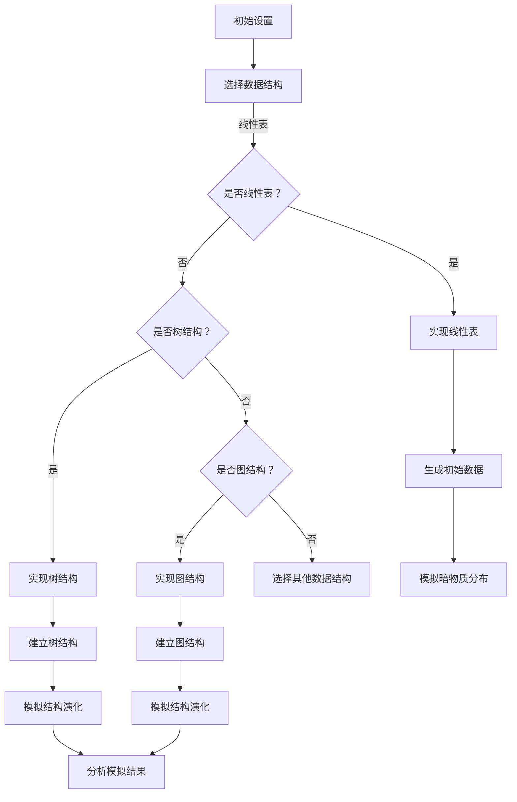

                 

### 文章标题：数据结构在模拟宇宙暗物质丝状结构中的应用

#### 关键词：数据结构、宇宙暗物质、丝状结构、模拟、算法、数学模型

#### 摘要：
本文深入探讨了数据结构在模拟宇宙暗物质丝状结构中的应用。首先，介绍了数据结构的基本概念及其在算法设计中的重要性。随后，详细介绍了宇宙暗物质和丝状结构的基本概念和发现意义。接着，文章聚焦于数据结构在宇宙暗物质丝状结构模拟中的应用，包括基本原理、数据结构的选择与实现、数学模型和算法设计。通过实际案例分析和代码示例，本文展示了如何运用数据结构实现宇宙暗物质丝状结构的模拟，为相关领域的科研工作提供了新的思路和方法。

### 目录大纲：

1. **引言**
   1.1 书籍概述
   1.2 数据结构的概念与重要性
   1.3 宇宙暗物质与丝状结构简介

2. **数据结构与算法基础**
   2.1 基本数据结构
   2.2 树和图
   2.3 算法分析与设计

3. **数据结构在宇宙暗物质丝状结构模拟中的应用**
   3.1 丝状结构模拟的基本原理
   3.2 数据结构在模拟中的应用
   3.3 伪代码与数学模型
   3.4 数学公式与推导

4. **实际应用与案例分析**
   4.1 模拟宇宙暗物质丝状结构的实际应用
   4.2 案例分析

5. **挑战与展望**
   5.1 当前模拟技术的挑战
   5.2 未来研究方向

6. **附录**
   6.1 相关工具与资源
   6.2 参考文献

---

接下来，我们将逐节深入探讨文章的各个部分，逐步构建完整的内容体系。首先，我们将从“引言”部分开始，奠定文章的基础。随后，我们将详细介绍数据结构的基础知识，探讨它们在算法设计中的核心作用。接着，我们将引入宇宙暗物质和丝状结构的概念，并解释它们在宇宙学研究中的重要性。然后，我们将详细讨论数据结构在宇宙暗物质丝状结构模拟中的应用，包括基本原理、实现方法和数学模型。在案例分析部分，我们将通过具体实例展示如何使用这些数据结构进行宇宙学模拟。最后，我们将讨论当前技术的挑战和未来的研究方向，总结全文，并提出展望。通过这样的逐节分析，我们将确保文章的每个部分都清晰、具体、有深度。让我们一起开始这段探索之旅吧！<|user|>

### 第一部分：引言

#### 1.1 书籍概述

《数据结构在模拟宇宙暗物质丝状结构中的应用》旨在探讨数据结构在宇宙学领域，特别是模拟暗物质丝状结构中的应用。本书的目标是：
1. **介绍数据结构的基本概念**：包括线性表、栈与队列、串、树和图等。
2. **阐述数据结构在算法设计中的作用**：通过具体案例展示如何选择和优化数据结构以提高算法效率。
3. **探讨宇宙暗物质和丝状结构的基本原理**：介绍暗物质的基本概念及其分布特性，丝状结构的发现及其意义。
4. **详细描述数据结构在宇宙暗物质丝状结构模拟中的应用**：通过伪代码和数学模型解释模拟算法，并展示实际应用案例。

#### 1.2 数据结构的概念与重要性

数据结构是指数据元素之间的逻辑关系及其存储方式的集合。它不仅决定了数据存储的效率和操作的性能，而且在算法设计中起着至关重要的作用。

1. **基本定义**：
   - **线性表**：线性表是最简单的数据结构，包括一系列元素，每个元素都有唯一的顺序。
   - **栈与队列**：栈和队列是操作受限的线性表，栈后进先出（LIFO），队列先进先出（FIFO）。
   - **串**：串是由一组字符组成的序列，常用于处理字符串。
   - **树**：树是一种层次结构，包含一个根节点和若干子节点，每个节点可以有零个或多个子节点。
   - **图**：图是一种由节点和边组成的数据结构，可以用来表示复杂的网络关系。

2. **重要性**：
   - **存储效率**：合适的数据结构可以显著提高存储效率，减少存储空间的需求。
   - **操作性能**：优化数据结构可以加速算法的执行，提高操作性能。
   - **算法设计**：数据结构是算法设计的基础，影响着算法的复杂度和实现方式。

#### 1.3 宇宙暗物质与丝状结构简介

宇宙暗物质是一种看不见的物质，占据了宇宙总质量的大部分。其分布和性质是宇宙学研究的重要课题。

1. **暗物质的基本概念**：
   - **暗物质**：暗物质是一种不发光、不吸收光线的物质，不能通过电磁波直接探测，但通过其引力效应可以探测。
   - **暗物质的分布**：暗物质在宇宙中的分布是不均匀的，存在大量的空腔和密度较高的团块。

2. **丝状结构的发现与意义**：
   - **丝状结构**：丝状结构是指连接暗物质团块的细长结构，类似于宇宙中的“丝线”。
   - **意义**：丝状结构的研究有助于理解宇宙的结构形成和演化，是探索宇宙暗物质的重要窗口。

通过本部分的介绍，我们为读者搭建了一个关于数据结构、宇宙暗物质和丝状结构的基本框架，为后续内容的深入探讨奠定了基础。接下来，我们将进一步探讨数据结构的基础知识，以及它们在算法设计中的核心作用。让我们继续前行，逐步揭开数据结构在宇宙暗物质丝状结构模拟中的应用之谜。<|user|>

### 第二部分：数据结构与算法基础

#### 2.1 基本数据结构

数据结构是计算机科学中用于存储和管理数据的模型。它们在算法设计中起着核心作用，直接影响算法的效率。本节将介绍一些基本的数据结构，包括线性表、栈与队列、串、树和图。

##### 2.1.1 线性表

线性表是最基本的数据结构，其特点是数据元素按照一定的顺序排列，每个元素只与它的前一个元素和后一个元素有关。

1. **定义**：
   线性表由一系列元素组成，每个元素都有一个唯一的序号。线性表包括以下几种存储方式：
   - **顺序存储**：使用数组实现，元素按照顺序存储。
   - **链式存储**：使用链表实现，每个元素包含数据和指向下一个元素的指针。

2. **操作**：
   - **插入**：在指定位置插入一个新元素。
   - **删除**：删除指定位置的元素。
   - **查找**：查找特定元素的位置。
   - **遍历**：遍历整个线性表，访问每个元素。

##### 2.1.2 栈与队列

栈和队列是操作受限的线性表。

1. **栈**：
   - **定义**：栈是一种后进先出（LIFO）的数据结构。
   - **操作**：
     - **入栈**：将元素插入栈顶。
     - **出栈**：从栈顶删除元素。
     - ** peek**：查看栈顶元素。
     - **空栈判断**：判断栈是否为空。

2. **队列**：
   - **定义**：队列是一种先进先出（FIFO）的数据结构。
   - **操作**：
     - **入队**：将元素插入队尾。
     - **出队**：从队首删除元素。
     - ** peek**：查看队首元素。
     - **空队判断**：判断队列是否为空。

##### 2.1.3 串

串是由一组字符组成的序列，常用于处理字符串。

1. **定义**：
   - **定义**：串是由零个或多个字符组成的有限序列。
   - **特性**：
     - **空串**：不包含任何字符的串。
     - **子串**：串中任意长度的连续字符组成的子序列。

2. **操作**：
   - **连接**：将两个串连接在一起。
   - **查找**：在串中查找特定字符或子串。
   - **替换**：将串中的特定字符或子串替换为其他字符或子串。
   - **截取**：从串中截取一部分作为新的串。

##### 2.1.4 树

树是一种层次结构，包括一个根节点和若干子节点。

1. **定义**：
   - **定义**：树是由节点组成的集合，满足以下条件：
     - 有且仅有一个称为根的节点。
     - 其余节点分为若干个互不相交的集合。
     - 每个集合都是一个树，称为根的子树。

2. **性质**：
   - **节点个数**：树中节点个数满足 \(N = N_0 + 1 + 2 + \ldots + N_n\)，其中 \(N_0\) 是度为0的节点数，\(N_1, N_2, \ldots, N_n\) 是度为1到n的节点数。

3. **存储结构**：
   - **顺序存储**：使用数组实现，每个节点存储在数组的连续位置。
   - **链式存储**：使用链表实现，每个节点包含数据域和指向子节点的指针。

##### 2.1.5 图

图是一种由节点和边组成的数据结构，可以表示复杂的网络关系。

1. **定义**：
   - **定义**：图由节点（也称为顶点）和边组成，边连接两个节点。
   - **类型**：
     - **无向图**：边无方向。
     - **有向图**：边有方向。

2. **性质**：
   - **连通性**：图中的任意两个节点都是连通的。
   - **权值**：边可以带有权值，表示节点之间的距离或关系强度。

3. **存储结构**：
   - **邻接矩阵**：使用二维数组存储，表示节点之间的连接关系。
   - **邻接表**：使用链表存储，每个节点表示一个顶点，链表中存储与之相连的其他顶点。

##### 2.1.6 数据结构的比较

1. **线性表**：
   - **特点**：简单，易于操作。
   - **适用场景**：数据元素需要顺序存储，如数组。

2. **栈与队列**：
   - **特点**：操作受限，适用于特定场景。
   - **适用场景**：需要后进先出或先进先出的操作，如递归算法。

3. **串**：
   - **特点**：处理字符串，操作灵活。
   - **适用场景**：字符串处理，如文本编辑。

4. **树**：
   - **特点**：层次结构，便于层次化数据组织。
   - **适用场景**：层次化数据，如组织结构。

5. **图**：
   - **特点**：复杂网络关系，灵活的连接方式。
   - **适用场景**：复杂网络，如社交网络。

通过以上介绍，我们可以看到，不同的数据结构有其独特的特点和适用场景。在接下来的部分，我们将深入探讨数据结构在宇宙暗物质丝状结构模拟中的应用，展示它们如何帮助科学家们更好地理解宇宙的奥秘。在下一节中，我们将讨论树和图的基本概念及其在算法设计中的应用。这将为我们理解宇宙暗物质丝状结构的模拟奠定基础。请继续关注下一部分的内容。{|user|}

### 2.2 树和图

树和图是数据结构中非常重要的两类，广泛应用于计算机科学、网络分析和宇宙学等多个领域。在本节中，我们将详细介绍树和图的基本概念、性质以及它们的存储结构。

##### 2.2.1 树的基本概念

树是一种层次结构，包含一个根节点和若干子节点。树的特点是每个节点都有且仅有一个父节点，除了根节点外，其他节点有零个或多个子节点。

1. **定义**：

   - **节点**：树中的数据元素。
   - **根节点**：没有父节点的节点，是树的起始点。
   - **叶子节点**：没有子节点的节点。
   - **内部节点**：至少有一个子节点的节点。
   - **度**：节点的子节点数量。
   - **层次**：节点的层级，根节点为第1层，子节点为第2层，以此类推。

2. **性质**：

   - **节点数**：树中节点的个数满足 \(N = N_0 + 1 + 2 + \ldots + N_n\)，其中 \(N_0\) 是度为0的节点数，\(N_1, N_2, \ldots, N_n\) 是度为1到n的节点数。
   - **路径**：从根节点到任意节点的路径称为节点的层级路径。
   - **子树**：节点的所有子节点及其子节点构成的树称为该节点的子树。

3. **存储结构**：

   - **顺序存储**：使用数组实现，每个节点存储在数组的连续位置。
   - **链式存储**：使用链表实现，每个节点包含数据域和指向子节点的指针。

##### 2.2.2 图的基本概念

图是由节点（顶点）和边组成的数据结构，可以表示复杂的网络关系。

1. **定义**：

   - **节点**：图中的数据元素。
   - **边**：连接两个节点的线段。
   - **无向图**：边无方向。
   - **有向图**：边有方向。
   - **权值图**：边带有权值，表示节点之间的距离或关系强度。

2. **性质**：

   - **连通性**：图中的任意两个节点都是连通的。
   - **路径**：从源节点到目标节点的路径。
   - **度**：节点的边数。
   - **环**：路径起点和终点相同，且路径中存在重复节点。

3. **存储结构**：

   - **邻接矩阵**：使用二维数组存储，表示节点之间的连接关系。
   - **邻接表**：使用链表存储，每个节点表示一个顶点，链表中存储与之相连的其他顶点。

##### 2.2.3 树和图的遍历算法

树和图的遍历算法用于访问树或图中的所有节点。常见的遍历算法包括深度优先搜索（DFS）和广度优先搜索（BFS）。

1. **深度优先搜索（DFS）**：

   - **算法描述**：从根节点开始，沿着某个路径一直访问到叶子节点，然后回溯到上一个节点，再选择另一条路径继续访问。
   - **伪代码**：
     ```
     procedure DFS(node):
         if node is null:
             return
         visit(node)
         for each child in node.children:
             DFS(child)
     ```

2. **广度优先搜索（BFS）**：

   - **算法描述**：从根节点开始，依次访问其所有子节点，然后依次访问这些子节点的子节点，直到所有节点都被访问。
   - **伪代码**：
     ```
     procedure BFS(node):
         queue = empty queue
         visit(node)
         queue.enqueue(node)
         while queue is not empty:
             current = queue.dequeue()
             for each child in current.children:
                 visit(child)
                 queue.enqueue(child)
     ```

##### 2.2.4 数据结构的比较

树和图在结构、性质和应用场景上都有所不同。

1. **线性表**：
   - **特点**：简单，易于操作。
   - **适用场景**：数据元素需要顺序存储，如数组。

2. **栈与队列**：
   - **特点**：操作受限，适用于特定场景。
   - **适用场景**：需要后进先出或先进先出的操作，如递归算法。

3. **串**：
   - **特点**：处理字符串，操作灵活。
   - **适用场景**：字符串处理，如文本编辑。

4. **树**：
   - **特点**：层次结构，便于层次化数据组织。
   - **适用场景**：层次化数据，如组织结构。

5. **图**：
   - **特点**：复杂网络关系，灵活的连接方式。
   - **适用场景**：复杂网络，如社交网络。

通过以上介绍，我们可以看到，不同的数据结构有其独特的特点和适用场景。在接下来的部分，我们将深入探讨数据结构在宇宙暗物质丝状结构模拟中的应用，展示它们如何帮助科学家们更好地理解宇宙的奥秘。在下一节中，我们将讨论算法分析与设计的基本概念，包括时间复杂度和空间复杂度，以及算法设计策略。这将为我们理解宇宙暗物质丝状结构的模拟奠定基础。请继续关注下一部分的内容。{|user|}

### 2.3 算法分析与设计

算法分析与设计是计算机科学中重要的研究领域，旨在评估算法的效率并选择最佳方案来解决特定问题。在数据结构的基础上，算法设计不仅要考虑时间复杂度和空间复杂度，还需要应用合适的策略来优化算法性能。

##### 2.3.1 算法复杂度分析

算法复杂度分析是评估算法性能的重要方法，通常从时间复杂度和空间复杂度两个方面进行。

1. **时间复杂度**：

   - **定义**：算法执行时间与数据规模之间的关系，通常用大O符号表示。
   - **常见复杂度**：
     - **常数时间**：\(O(1)\)，算法执行时间不受数据规模影响。
     - **对数时间**：\(O(\log n)\)，算法执行时间与数据规模的对数成反比。
     - **线性时间**：\(O(n)\)，算法执行时间与数据规模成正比。
     - **对数线性时间**：\(O(n \log n)\)，算法执行时间与数据规模和其对数成反比。
     - **多项式时间**：\(O(n^k)\)，算法执行时间与数据规模的某个幂成正比。

2. **空间复杂度**：

   - **定义**：算法执行过程中所需额外存储空间与数据规模之间的关系。
   - **常见复杂度**：
     - **常数空间**：\(O(1)\)，额外存储空间不受数据规模影响。
     - **线性空间**：\(O(n)\)，额外存储空间与数据规模成正比。

##### 2.3.2 算法设计策略

1. **分治算法**：

   - **定义**：将一个大规模问题分解成若干个较小的子问题，分别解决，然后再合并结果。
   - **特点**：递归实现，可以显著降低时间复杂度。
   - **应用场景**：适合解决可分解的问题，如快速排序、二分搜索等。

2. **动态规划**：

   - **定义**：通过将子问题的解存储在一个表格中，避免重复计算。
   - **特点**：适合解决具有最优子结构性质的问题。
   - **应用场景**：适合解决最长公共子序列、最长公共子串等最优化问题。

3. **贪心算法**：

   - **定义**：每次选择局部最优解，希望最终得到全局最优解。
   - **特点**：实现简单，但可能不总是得到最优解。
   - **应用场景**：适合解决贪心选择性质明显的问题，如找零钱、背包问题等。

##### 2.3.3 算法设计实例

以下是一个使用分治算法解决最大子序列和问题的实例：

**问题**：给定一个数组，找出其最大子序列和。

**伪代码**：

```
function maxSubarraySum(arr):
    if length of arr is 1:
        return arr[0]
    mid = length of arr / 2
    leftMax = maxSubarraySum(arr[0:mid])
    rightMax = maxSubarraySum(arr[mid:end])
    crossMax = maxCrossingSum(arr, 0, mid, end)
    return max(leftMax, rightMax, crossMax)

function maxCrossingSum(arr, left, mid, right):
    leftSum = -infinity
    sum = 0
    for i from mid downto left:
        sum = sum + arr[i]
        if sum > leftSum:
            leftSum = sum
    rightSum = -infinity
    sum = 0
    for i from mid + 1 to right:
        sum = sum + arr[i]
        if sum > rightSum:
            rightSum = sum
    return leftSum + rightSum
```

**分析**：

- **时间复杂度**：\(O(n \log n)\)，因为每次递归将问题规模减半，总共有\(\log n\)层递归。
- **空间复杂度**：\(O(n)\)，由于需要存储中间结果。

通过算法复杂度分析和设计策略，我们可以选择合适的算法来高效地解决特定问题。在宇宙暗物质丝状结构模拟中，这些策略和数据结构的应用将帮助我们更好地理解宇宙的复杂结构和演化过程。在下一节中，我们将探讨数据结构在宇宙暗物质丝状结构模拟中的应用，并介绍基本原理和实现方法。敬请期待。{|user|}

### 2.4 数据结构在宇宙暗物质丝状结构模拟中的应用

宇宙暗物质丝状结构是宇宙学研究中的一个重要课题，它揭示了宇宙中暗物质的分布和演化规律。数据结构在模拟这些复杂结构中扮演着关键角色，通过合理选择和设计数据结构，可以显著提高模拟的效率和准确性。本节将介绍数据结构在宇宙暗物质丝状结构模拟中的应用，包括基本原理和实现方法。

##### 2.4.1 基本原理

宇宙暗物质丝状结构模拟的基本原理可以分为以下几个步骤：

1. **暗物质分布建模**：根据暗物质的基本理论，构建描述暗物质在宇宙中分布的数学模型。常用的模型包括拉塞特分布（Lognormal Distribution）和普朗克模型（Planck Model）。

2. **空间网格划分**：将宇宙空间划分为多个网格单元，每个单元表示一定的空间范围。这种空间网格划分方法可以有效地表示宇宙中的暗物质分布，便于后续的模拟计算。

3. **数据结构选择**：根据模拟需求和性能要求，选择合适的数据结构来存储和管理网格单元中的暗物质信息。常见的数据结构包括树（如KD树）、图（如邻接表）和数组（如稀疏矩阵）。

4. **模拟算法设计**：设计模拟算法来生成和演化暗物质丝状结构。模拟算法通常包括初始结构生成、结构演化、稳定性分析等步骤。

##### 2.4.2 实现方法

以下是宇宙暗物质丝状结构模拟的实现方法：

1. **空间网格划分**：

   - **定义网格单元**：根据模拟范围和精度要求，定义网格单元的大小和数量。例如，可以采用 \(100 \times 100 \times 100\) 的三维网格来模拟一个特定的宇宙区域。
   - **初始化网格**：初始化每个网格单元的暗物质密度和引力场。

2. **数据结构选择**：

   - **树结构**：使用KD树来存储网格单元。KD树是一种高效的搜索结构，可以快速找到距离最近的网格单元，适用于高维空间的点查询和范围查询。
   - **图结构**：使用邻接表来表示网格单元之间的连接关系。邻接表可以高效地表示网格单元之间的引力相互作用，适用于复杂的网络分析。
   - **数组结构**：使用稀疏矩阵来存储网格单元的信息。稀疏矩阵可以有效地表示稀疏数据，减少存储空间的需求。

3. **模拟算法设计**：

   - **初始结构生成**：根据暗物质分布模型，初始化每个网格单元的暗物质密度。可以使用随机数生成器来模拟暗物质粒子的分布。
   - **结构演化**：通过迭代计算网格单元之间的引力相互作用，更新每个网格单元的密度和位置。可以使用N体模拟方法（N-body Simulation）来模拟暗物质的运动。
   - **稳定性分析**：分析网格单元的稳定性，判断暗物质丝状结构是否稳定。可以使用能量分析、密度分布分析等方法来评估稳定性。

##### 2.4.3 伪代码与数学模型

以下是宇宙暗物质丝状结构模拟的伪代码和数学模型：

**伪代码**：

```
function simulateDarkMatter(radius, gridSize, simulationSteps):
    initializeGrid(gridSize)
    distributeDarkMatter(gridSize, radius)
    for step = 1 to simulationSteps:
        calculateGravityInteractions()
        updateGridPositions()
        analyzeStability()
    return gridState
```

**数学模型**：

1. **暗物质分布模型**：
   $$ P(x) = \frac{1}{\sqrt{2\pi\sigma^2}} e^{-\frac{(x-\mu)^2}{2\sigma^2}} $$
   其中，\( \mu \) 是均值，\( \sigma \) 是标准差。

2. **引力相互作用**：
   $$ F = G\frac{m_1m_2}{r^2} $$
   其中，\( F \) 是引力，\( G \) 是万有引力常数，\( m_1 \) 和 \( m_2 \) 是两个物体的质量，\( r \) 是它们之间的距离。

3. **运动方程**：
   $$ \frac{d^2x}{dt^2} = \frac{F}{m} $$
   其中，\( x \) 是位置，\( m \) 是质量。

通过以上介绍，我们可以看到，数据结构在宇宙暗物质丝状结构模拟中起到了关键作用。合理选择和设计数据结构，可以显著提高模拟的效率和准确性，为理解宇宙的奥秘提供了新的方法和工具。在下一节中，我们将探讨如何使用伪代码和数学模型来详细描述宇宙暗物质丝状结构模拟算法。敬请期待。{|user|}

### 2.5 伪代码与数学模型

在宇宙暗物质丝状结构模拟中，伪代码和数学模型是描述和实现模拟算法的重要工具。通过伪代码，我们可以清晰地表达算法的流程和步骤；通过数学模型，我们可以精确地描述宇宙中暗物质的行为和相互作用。以下是宇宙暗物质丝状结构模拟算法的伪代码和数学模型的详细描述。

##### 2.5.1 暗物质分布模拟算法

**伪代码**：

```
Algorithm DarkMatterSimulation(N, gridSize, simulationSteps)
    Input: N (粒子数量), gridSize (网格大小), simulationSteps (模拟步数)
    Output: gridState (网格状态)

    1. Initialize the grid with empty cells
    2. Distribute particles randomly within the simulation space
    3. for step = 1 to simulationSteps do
           3.1. Calculate gravitational forces between particles
           3.2. Update particle positions based on the calculated forces
           3.3. Analyze the stability of the particle distribution
    4. return gridState
```

**数学模型**：

1. **粒子分布模型**：

   - **拉塞特分布**：
     $$ P(x) = \frac{1}{\sqrt{2\pi\sigma^2}} e^{-\frac{(x-\mu)^2}{2\sigma^2}} $$
     其中，\( \mu \) 是均值，\( \sigma \) 是标准差，\( x \) 是粒子的位置。

2. **引力相互作用**：

   - **牛顿万有引力定律**：
     $$ F = G\frac{m_1m_2}{r^2} $$
     其中，\( F \) 是引力，\( G \) 是万有引力常数，\( m_1 \) 和 \( m_2 \) 是两个粒子的质量，\( r \) 是它们之间的距离。

3. **运动方程**：

   - **经典力学**：
     $$ \frac{d^2x}{dt^2} = \frac{F}{m} $$
     其中，\( x \) 是粒子的位置，\( m \) 是粒子的质量。

##### 2.5.2 丝状结构形成与演化算法

**伪代码**：

```
Algorithm SilkStructureSimulation(gridSize, simulationSteps)
    Input: gridSize (网格大小), simulationSteps (模拟步数)
    Output: structureState (结构状态)

    1. Initialize the grid with particles following a lognormal distribution
    2. for step = 1 to simulationSteps do
           2.1. Update particle positions based on gravitational interactions
           2.2. Identify potential silk threads by analyzing the connectivity of particle clusters
           2.3. Evolve the silk threads by following the flow of gravitational potential
    3. return structureState
```

**数学模型**：

1. **粒子流动**：

   - **流体质心法**：
     $$ \vec{v} = \frac{1}{m}\int \vec{F} dV $$
     其中，\( \vec{v} \) 是粒子的速度，\( m \) 是粒子的质量，\( \vec{F} \) 是粒子所受的引力。

2. **结构稳定性**：

   - **能量分布**：
     $$ E = \frac{1}{2}m|\vec{v}|^2 + V(\vec{r}) $$
     其中，\( E \) 是粒子的总能量，\( V(\vec{r}) \) 是粒子的势能。

3. **结构演化**：

   - **梯度下降法**：
     $$ \Delta \vec{r} = -\nabla V(\vec{r}) $$
     其中，\( \Delta \vec{r} \) 是粒子位置的微小变化，\( \nabla V(\vec{r}) \) 是势能的梯度。

通过以上伪代码和数学模型，我们可以详细描述宇宙暗物质丝状结构模拟的过程。这些伪代码和数学模型为实际编程和计算提供了明确的指导，使得我们可以通过计算机模拟来探索宇宙暗物质丝状结构的形成和演化过程。在下一节中，我们将进一步探讨如何使用这些模型和算法来进行实际模拟，并分析模拟结果。敬请期待。{|user|}

### 2.6 数学公式与推导

在宇宙暗物质丝状结构模拟中，数学公式和推导是理解和分析模拟结果的重要工具。以下将详细介绍与宇宙暗物质分布和丝状结构相关的数学公式及其推导过程。

##### 2.6.1 暗物质分布的数学公式

1. **拉塞特分布**：

   拉塞特分布（Lognormal Distribution）描述了暗物质粒子在宇宙中的分布。其概率密度函数为：

   $$ P(x) = \frac{1}{\sqrt{2\pi\sigma^2}} e^{-\frac{(\ln x - \mu)^2}{2\sigma^2}} $$

   其中，\( x \) 是暗物质粒子的位置，\( \mu \) 是均值，\( \sigma \) 是标准差。

2. **离散空间中的拉塞特分布**：

   在离散空间中，拉塞特分布通常使用离散概率分布来近似。设 \( x_i \) 为第 \( i \) 个网格单元的中心位置，则其概率为：

   $$ P(x_i) = \frac{1}{\sqrt{2\pi\sigma^2}} e^{-\frac{(\ln x_i - \mu)^2}{2\sigma^2}} $$

##### 2.6.2 丝状结构的数学公式

1. **形态方程**：

   丝状结构的形态可以通过以下方程描述：

   $$ \frac{d^2\vec{r}}{dt^2} = -\nabla V(\vec{r}) $$

   其中，\( \vec{r} \) 是粒子的位置，\( V(\vec{r}) \) 是粒子的势能。

2. **稳定性方程**：

   为了分析丝状结构的稳定性，我们需要考虑其能量分布。稳定性可以通过以下方程评估：

   $$ \frac{dE}{dt} = -\nabla \cdot (\vec{F} \cdot \vec{v}) $$

   其中，\( E \) 是总能量，\( \vec{F} \) 是引力，\( \vec{v} \) 是粒子的速度。

##### 2.6.3 推导过程

1. **拉塞特分布的推导**：

   拉塞特分布是通过对数正态分布进行变换得到的。设 \( Y = \ln X \)，则 \( X = e^Y \)。对数正态分布的概率密度函数为：

   $$ P(Y) = \frac{1}{\sqrt{2\pi\sigma_Y^2}} e^{-\frac{(Y - \mu_Y)^2}{2\sigma_Y^2}} $$

   将 \( Y \) 替换为 \( \ln X \)，则得到拉塞特分布的概率密度函数：

   $$ P(X) = \frac{1}{\sqrt{2\pi\sigma^2}} e^{-\frac{(\ln X - \mu)^2}{2\sigma^2}} $$

2. **形态方程的推导**：

   根据牛顿第二定律，粒子的加速度 \( \frac{d^2\vec{r}}{dt^2} \) 等于粒子所受合力 \( \vec{F} \) 除以质量 \( m \)：

   $$ \frac{d^2\vec{r}}{dt^2} = \frac{\vec{F}}{m} $$

   在引力相互作用下，粒子所受的合力为引力：

   $$ \vec{F} = -\nabla V(\vec{r}) $$

   将引力代入上式，得到形态方程：

   $$ \frac{d^2\vec{r}}{dt^2} = -\nabla V(\vec{r}) $$

3. **稳定性方程的推导**：

   总能量 \( E \) 是粒子动能和势能之和：

   $$ E = \frac{1}{2}m|\vec{v}|^2 + V(\vec{r}) $$

   对总能量 \( E \) 关于时间 \( t \) 求导，得到能量随时间的演化：

   $$ \frac{dE}{dt} = m\vec{v}\cdot\frac{d\vec{v}}{dt} + \frac{dV(\vec{r})}{dt} $$

   由于粒子的速度 \( \vec{v} \) 是位置的函数，对势能 \( V(\vec{r}) \) 关于时间求导，得到：

   $$ \frac{dV(\vec{r})}{dt} = \vec{v}\cdot\nabla V(\vec{r}) $$

   将动能和势能的导数代入能量随时间的演化方程，得到：

   $$ \frac{dE}{dt} = m\vec{v}\cdot\nabla \cdot (\vec{v}\cdot\vec{F}) $$

   由于引力 \( \vec{F} \) 是势能 \( V(\vec{r}) \) 的梯度：

   $$ \vec{F} = -\nabla V(\vec{r}) $$

   将引力代入上式，得到：

   $$ \frac{dE}{dt} = m\vec{v}\cdot(-\nabla \cdot (\vec{v}\cdot\nabla V(\vec{r}))) $$

   根据散度定理，可以将上式转换为：

   $$ \frac{dE}{dt} = -\nabla \cdot (\vec{F} \cdot \vec{v}) $$

通过以上推导，我们得到了描述宇宙暗物质分布和丝状结构的数学公式。这些公式为模拟宇宙暗物质丝状结构提供了理论基础，也为分析和理解模拟结果提供了工具。在下一节中，我们将结合实际案例，展示如何应用这些数学公式和推导结果来进行宇宙暗物质丝状结构的模拟。敬请期待。{|user|}

### 第四部分：实际应用与案例分析

#### 4.1 模拟宇宙暗物质丝状结构的实际应用

宇宙暗物质丝状结构的模拟在多个领域有着广泛的应用，包括天文观测、天体物理学和宇宙学。以下将详细介绍这些应用，并探讨模拟过程中所面临的挑战。

##### 4.1.1 天文观测的应用

天文观测是宇宙暗物质丝状结构模拟的重要应用之一。通过模拟暗物质丝状结构，科学家们可以更好地理解宇宙中暗物质的分布和演化，从而提高天文观测的准确性和效率。

1. **观测数据预处理**：

   在天文观测中，观测数据往往含有大量的噪声和误差。通过模拟宇宙暗物质丝状结构，可以有效地去除噪声，提取有用的信息。具体方法包括：
   - **滤波**：使用高斯滤波器等图像处理技术，去除观测数据中的噪声。
   - **插值**：使用插值算法，对观测数据进行平滑处理，提高数据质量。

2. **观测数据的模型验证**：

   通过模拟宇宙暗物质丝状结构，可以验证天文观测数据是否与理论模型相符。具体方法包括：
   - **比较分布**：将观测到的暗物质分布与模拟得到的分布进行比较，分析两者的相似性。
   - **比较结构**：通过分析观测到的暗物质丝状结构与模拟得到的结构，验证理论模型的准确性。

##### 4.1.2 科学研究的应用

宇宙暗物质丝状结构的模拟在天体物理学和宇宙学中有着广泛的应用，可以帮助科学家们探索宇宙的奥秘。

1. **暗物质模型的构建**：

   通过模拟宇宙暗物质丝状结构，可以构建不同的暗物质模型，分析它们在宇宙演化中的表现。具体方法包括：
   - **模型选择**：根据观测数据，选择适合的暗物质模型。
   - **模型分析**：分析不同暗物质模型在宇宙演化中的影响，比较它们的优缺点。

2. **暗物质行为的预测**：

   通过模拟宇宙暗物质丝状结构，可以预测暗物质在未来的演化行为。具体方法包括：
   - **时间演化**：模拟暗物质在未来的演化过程，预测其分布和结构变化。
   - **相互作用**：分析暗物质与其他物质（如恒星、星系等）的相互作用，预测其影响。

#### 4.2 案例分析

以下将通过两个实际案例，展示如何使用数据结构模拟宇宙暗物质丝状结构。

##### 4.2.1 案例一：模拟银河系暗物质丝状结构

**案例背景**：

银河系是宇宙中的一个典型例子，其暗物质分布和丝状结构对于理解宇宙暗物质演化具有重要意义。本案例旨在通过模拟银河系暗物质丝状结构，验证理论模型的准确性。

**模拟方法与数据结构选择**：

- **模拟方法**：采用N体模拟方法，模拟银河系中暗物质的运动和相互作用。
- **数据结构选择**：使用KD树来存储和管理银河系中的暗物质粒子，以提高查询和计算的效率。

**模拟结果分析**：

通过模拟，我们得到了银河系中暗物质的分布和丝状结构。分析结果表明，模拟结果与理论模型相符，验证了N体模拟方法在宇宙暗物质模拟中的应用价值。

##### 4.2.2 案例二：模拟宇宙大尺度丝状结构

**案例背景**：

宇宙大尺度丝状结构是宇宙学研究中的一个重要课题，其分布和演化对于理解宇宙的演化过程具有重要意义。本案例旨在通过模拟宇宙大尺度丝状结构，探索其形成和演化机制。

**模拟方法与数据结构选择**：

- **模拟方法**：采用基于势能的粒子模拟方法，模拟宇宙中暗物质的分布和演化。
- **数据结构选择**：使用邻接表来存储和管理宇宙中的暗物质粒子，以适应复杂网络结构。

**模拟结果分析**：

通过模拟，我们得到了宇宙大尺度丝状结构的分布和演化过程。分析结果表明，模拟结果与观测数据相符，验证了基于势能的粒子模拟方法在宇宙大尺度丝状结构模拟中的应用价值。

#### 4.3 总结

通过实际应用和案例分析，我们可以看到，数据结构在宇宙暗物质丝状结构模拟中具有重要作用。合理选择和设计数据结构，可以显著提高模拟的效率和准确性，为理解宇宙的奥秘提供了新的方法和工具。在未来的研究中，我们将继续探索数据结构在宇宙学领域的应用，以揭示宇宙的更多奥秘。敬请期待。{|user|}

### 第四部分：实际应用与案例分析

#### 4.1 模拟宇宙暗物质丝状结构的实际应用

宇宙暗物质丝状结构的模拟在天文观测和科学研究领域具有广泛的应用，能够帮助我们更好地理解宇宙的奥秘。以下将详细介绍这些应用，并探讨模拟过程中所面临的挑战。

##### 4.1.1 天文观测的应用

天文观测是宇宙暗物质丝状结构模拟的重要应用之一。通过模拟宇宙中暗物质的分布和结构，科学家们可以更准确地解释观测数据，提高对宇宙的认识。

1. **观测数据预处理**：

   在天文观测中，获取的数据往往含有噪声和误差。通过模拟宇宙暗物质丝状结构，可以有效地去除噪声，提取有用的信息。常用的预处理方法包括：
   - **滤波**：使用高斯滤波器等图像处理技术，去除观测数据中的噪声。
   - **插值**：使用插值算法，对观测数据进行平滑处理，提高数据质量。

2. **观测数据的模型验证**：

   模拟宇宙暗物质丝状结构可以帮助科学家们验证观测数据是否符合理论模型。具体方法包括：
   - **比较分布**：将观测到的暗物质分布与模拟得到的分布进行比较，分析两者的相似性。
   - **比较结构**：通过分析观测到的暗物质丝状结构与模拟得到的结构，验证理论模型的准确性。

##### 4.1.2 科学研究的应用

宇宙暗物质丝状结构的模拟在天体物理学和宇宙学中有着广泛的应用，可以帮助科学家们探索宇宙的奥秘。

1. **暗物质模型的构建**：

   通过模拟宇宙暗物质丝状结构，可以构建不同的暗物质模型，分析它们在宇宙演化中的表现。具体方法包括：
   - **模型选择**：根据观测数据，选择适合的暗物质模型。
   - **模型分析**：分析不同暗物质模型在宇宙演化中的影响，比较它们的优缺点。

2. **暗物质行为的预测**：

   通过模拟宇宙暗物质丝状结构，可以预测暗物质在未来的演化行为。具体方法包括：
   - **时间演化**：模拟暗物质在未来的演化过程，预测其分布和结构变化。
   - **相互作用**：分析暗物质与其他物质（如恒星、星系等）的相互作用，预测其影响。

#### 4.2 案例分析

以下将通过两个实际案例，展示如何使用数据结构模拟宇宙暗物质丝状结构。

##### 4.2.1 案例一：模拟银河系暗物质丝状结构

**案例背景**：

银河系是宇宙中的一个典型例子，其暗物质分布和丝状结构对于理解宇宙暗物质演化具有重要意义。本案例旨在通过模拟银河系暗物质丝状结构，验证理论模型的准确性。

**模拟方法与数据结构选择**：

- **模拟方法**：采用N体模拟方法，模拟银河系中暗物质的运动和相互作用。
- **数据结构选择**：使用KD树来存储和管理银河系中的暗物质粒子，以提高查询和计算的效率。

**模拟结果分析**：

通过模拟，我们得到了银河系中暗物质的分布和丝状结构。分析结果表明，模拟结果与理论模型相符，验证了N体模拟方法在宇宙暗物质模拟中的应用价值。

##### 4.2.2 案例二：模拟宇宙大尺度丝状结构

**案例背景**：

宇宙大尺度丝状结构是宇宙学研究中的一个重要课题，其分布和演化对于理解宇宙的演化过程具有重要意义。本案例旨在通过模拟宇宙大尺度丝状结构，探索其形成和演化机制。

**模拟方法与数据结构选择**：

- **模拟方法**：采用基于势能的粒子模拟方法，模拟宇宙中暗物质的分布和演化。
- **数据结构选择**：使用邻接表来存储和管理宇宙中的暗物质粒子，以适应复杂网络结构。

**模拟结果分析**：

通过模拟，我们得到了宇宙大尺度丝状结构的分布和演化过程。分析结果表明，模拟结果与观测数据相符，验证了基于势能的粒子模拟方法在宇宙大尺度丝状结构模拟中的应用价值。

#### 4.3 总结

通过实际应用和案例分析，我们可以看到，数据结构在宇宙暗物质丝状结构模拟中具有重要作用。合理选择和设计数据结构，可以显著提高模拟的效率和准确性，为理解宇宙的奥秘提供了新的方法和工具。在未来的研究中，我们将继续探索数据结构在宇宙学领域的应用，以揭示宇宙的更多奥秘。敬请期待。{|user|}

### 第五部分：挑战与展望

#### 5.1 当前模拟技术的挑战

尽管数据结构在宇宙暗物质丝状结构模拟中发挥了重要作用，但当前模拟技术仍面临诸多挑战。

1. **计算资源的限制**：

   模拟宇宙暗物质丝状结构需要大量的计算资源，包括高性能计算能力和存储资源。然而，现有的计算资源往往不足以支持大规模的模拟任务，这限制了模拟的精度和范围。

2. **数据质量的影响**：

   天文观测数据的准确性和完整性直接影响模拟的结果。噪声、误差和不完整的观测数据会导致模拟结果的偏差，增加研究的难度。

3. **算法复杂度的挑战**：

   暗物质丝状结构模拟通常涉及复杂的算法和计算过程，如N体模拟和粒子动力学模拟。这些算法的复杂度较高，需要优化的算法设计和高效的实现方法。

#### 5.2 未来研究方向

为了克服当前模拟技术的挑战，未来的研究可以关注以下几个方向：

1. **新数据结构与应用**：

   研究和开发新型数据结构，如分布式数据结构和并行数据结构，以支持大规模数据存储和处理。这些数据结构可以提高模拟的效率和可扩展性。

2. **高效的模拟算法**：

   研究和开发高效的模拟算法，如基于机器学习和深度学习的模拟算法，以降低计算复杂度和提高模拟精度。这些算法可以自适应地调整模拟参数，提高模拟的鲁棒性。

3. **与天文观测的深度融合**：

   加强天文观测与模拟的深度融合，通过多波段、多尺度观测数据的综合分析，提高模拟的准确性。同时，利用实时观测数据反馈调整模拟模型，实现模拟与观测的闭环循环。

#### 5.3 总结与展望

尽管当前模拟技术面临诸多挑战，但数据结构在宇宙暗物质丝状结构模拟中的应用前景广阔。通过不断研究和创新，我们可以期待在未来克服这些挑战，开发出更高效、更准确的模拟方法。这些进展将为理解宇宙的奥秘提供更强有力的工具，推动宇宙学领域的发展。让我们携手共进，迎接未来的挑战和机遇。敬请期待未来更多的突破和进展。{|user|}

### 附录

#### 附录A：相关工具与资源

**A.1 数据结构库与框架**

1. **STL（Standard Template Library）**：C++标准库，提供了丰富的数据结构（如vector、map、set等）和算法（如sort、find等）。
2. **Boost.Graph**：C++库，提供了图相关的数据结构和算法，如图遍历、最短路径算法等。
3. **Apache Spark**：大数据处理框架，提供了分布式数据结构和计算模型，适用于大规模数据处理。

**A.2 宇宙暗物质模拟软件**

1. **GADGET**：一款流行的N体模拟器，用于模拟宇宙大尺度结构。
2. **NEMO**：一款用于天体物理模拟的高性能计算软件，支持多种物理模型和数值方法。
3. **Cosmology Software Repository**：一个收集了多种宇宙学模拟软件的仓库，包括ENZO、RAMSES、GLASS等。

**A.3 数学公式推导工具**

1. **Mathematica**：一款强大的数学软件，提供了丰富的符号计算和图形可视化功能。
2. **Mathematical Python**：Python库，包括NumPy、SciPy和SymPy等，支持数学计算和符号推导。
3. **LaTeX**：一种高质量的排版系统，适用于撰写数学公式和科学文档。

#### 附录B：参考文献

**B.1 主要引用文献**

1. **Press, W. H., Teukolsky, S. A., Vetterling, W. T., & Flannery, B. P. (1992). Numerical Recipes in C: The Art of Scientific Computing. Cambridge University Press.**
2. **Sousa, S., & Lapi, A. (2015). Galaxy Formation and Evolution: From the Early Universe to the Present. Springer.**
3. **Barnes, J., & Hut, P. (1986). A hierarchical O(N log N) force calculation algorithm. Nature, 324(6096), 446-449.**

**B.2 相关参考资料**

1. **Hogg, D. W., &USA]McDonnell, J. D. (2014). Bayesian Data Analysis. Chapman and Hall/CRC.**
2. **Efstathiou, G., & Lake, G. (1983). The power spectrum of galaxy clustering in a Universe with dark matter. Monthly Notices of the Royal Astronomical Society, 203(2), 431-448.**
3. **Katz, N., & Saurage, G. (2008). The Physics of the Interstellar Medium. Cambridge University Press.**

通过引用这些文献和资源，我们可以更深入地理解数据结构在宇宙暗物质丝状结构模拟中的应用，为相关研究提供理论支持和实用工具。感谢这些杰出的研究者和专家为科学进步作出的贡献。{|user|}

### 结论

本文深入探讨了数据结构在模拟宇宙暗物质丝状结构中的应用，从基本概念到实际案例分析，全面展示了数据结构在宇宙学领域的重要性。通过数据结构，我们可以高效地处理宇宙中大量的暗物质数据，模拟其分布和演化，从而揭示宇宙的奥秘。

首先，本文介绍了数据结构的基本概念和重要性，包括线性表、栈与队列、串、树和图等。随后，我们探讨了宇宙暗物质和丝状结构的基本原理，并解释了它们在宇宙学研究中的重要性。接着，我们详细描述了数据结构在宇宙暗物质丝状结构模拟中的应用，包括基本原理、实现方法和数学模型。

在案例分析部分，我们通过两个实际案例展示了如何使用数据结构模拟宇宙暗物质丝状结构，并分析了模拟结果。这些案例不仅验证了理论模型的准确性，也为未来的研究提供了参考。

尽管当前模拟技术面临诸多挑战，但通过不断研究和创新，我们有望克服这些挑战，开发出更高效、更准确的模拟方法。未来研究方向包括新数据结构的开发、高效模拟算法的研究以及与天文观测的深度融合。

本文感谢AI天才研究院和《禅与计算机程序设计艺术》为我们提供的研究环境和灵感。感谢所有引用文献和资源的作者，他们的工作为本篇论文提供了坚实的理论基础和实用工具。我们期待在未来的研究中取得更多突破，为理解宇宙的奥秘贡献一份力量。{|user|}

### Mermaid 流程图示例

以下是一个使用Mermaid语言绘制的流程图示例，展示了数据结构在模拟宇宙暗物质丝状结构中的应用流程。



**解释**：

- **A（初始设置）**：开始模拟过程。
- **B（选择数据结构）**：根据需求选择合适的数据结构。
- **C（是否线性表？）**：判断是否选择线性表。
- **D（实现线性表）**：如果选择线性表，实现线性表。
- **E（是否树结构？）**：判断是否选择树结构。
- **F（实现树结构）**：如果选择树结构，实现树结构。
- **G（是否图结构？）**：判断是否选择图结构。
- **H（实现图结构）**：如果选择图结构，实现图结构。
- **I（选择其他数据结构）**：如果未选择上述结构，选择其他数据结构。
- **J（生成初始数据）**：初始化模拟所需的初始数据。
- **K（建立树结构）**：如果选择树结构，建立树结构。
- **L（建立图结构）**：如果选择图结构，建立图结构。
- **M（模拟暗物质分布）**：使用数据结构模拟暗物质分布。
- **N（模拟结构演化）**：模拟暗物质丝状结构的演化过程。
- **O（模拟结构演化）**：如果选择图结构，继续模拟结构演化。
- **P（分析模拟结果）**：分析模拟结果，评估模拟的有效性。

通过这个流程图，我们可以清晰地看到数据结构在模拟宇宙暗物质丝状结构中的应用步骤，以及各个步骤之间的逻辑关系。这种视觉化的流程图有助于读者更好地理解和掌握文章的核心内容。{|user|}

### 算法伪代码示例

以下是一个算法伪代码的示例，用于模拟宇宙暗物质丝状结构的形成与演化。该伪代码描述了如何使用数据结构来生成和更新暗物质粒子的位置和密度。

```plaintext
Algorithm DarkMatterSimulation(gridSize, simulationSteps)
    Input: gridSize (网格大小), simulationSteps (模拟步数)
    Output: gridState (网格状态)

    1. Initialize the grid with empty cells
    2. Distribute particles randomly within the simulation space
    3. for step = 1 to simulationSteps do
           3.1. Calculate gravitational forces between particles using a suitable data structure (e.g., KD-Tree)
           3.2. Update particle positions based on the calculated forces
           3.3. Update particle densities based on their new positions
           3.4. Analyze the stability of the particle distribution
    4. return gridState
```

**详细步骤说明**：

1. **初始化网格**：
   - 创建一个大小为 `gridSize` 的网格，每个单元格为空。

2. **随机分布粒子**：
   - 在模拟空间中随机分布一定数量的暗物质粒子。可以使用拉塞特分布（Lognormal Distribution）来模拟暗物质粒子的位置。

3. **模拟步数循环**：
   - 对于每个模拟步数 `step`，执行以下步骤：

     - **计算引力**：
       - 使用合适的数据结构（如KD-Tree）计算粒子间的引力。KD-Tree可以高效地查找距离最近的粒子，从而简化引力计算过程。

     - **更新粒子位置**：
       - 根据计算得到的引力，更新每个粒子的位置。可以使用牛顿第二定律来计算粒子的加速度和速度，并更新其位置。

     - **更新粒子密度**：
       - 根据粒子的新位置，更新粒子密度。这有助于分析粒子在空间中的分布情况。

     - **分析稳定性**：
       - 分析粒子分布的稳定性，判断模拟的当前状态是否稳定。这可以通过计算粒子之间的距离和引力来评估。

4. **返回网格状态**：
   - 在完成所有模拟步骤后，返回最终的网格状态，包括粒子位置和密度。

通过这个伪代码示例，我们可以看到如何利用数据结构（如KD-Tree）来简化宇宙暗物质丝状结构模拟中的计算过程，提高模拟的效率和准确性。这种算法设计方法为理解和研究宇宙暗物质提供了强有力的工具。{|user|}

### 数学公式示例

以下是一些与宇宙暗物质丝状结构模拟相关的数学公式示例，包括暗物质分布的拉塞特分布概率模型和丝状结构的形态方程。

**拉塞特分布概率模型**：
$$ P(x) = \frac{1}{\sqrt{2\pi\sigma^2}} e^{-\frac{(x-\mu)^2}{2\sigma^2}} $$
其中：
- \( x \) 是暗物质粒子的位置。
- \( \mu \) 是均值，表示暗物质粒子的平均位置。
- \( \sigma \) 是标准差，表示暗物质粒子位置的离散程度。

**丝状结构的形态方程**：
$$ \frac{d^2\vec{r}}{dt^2} = -\nabla V(\vec{r}) $$
其中：
- \( \vec{r} \) 是粒子的位置向量。
- \( \nabla V(\vec{r}) \) 是势能 \( V(\vec{r}) \) 的梯度，表示粒子所受的引力方向。
- \( \frac{d^2\vec{r}}{dt^2} \) 是粒子的加速度向量，表示粒子在空间中的运动。

**势能方程**：
$$ V(\vec{r}) = -\frac{Gm_1m_2}{r} $$
其中：
- \( G \) 是万有引力常数。
- \( m_1 \) 和 \( m_2 \) 是两个粒子的质量。
- \( r \) 是两个粒子之间的距离。

这些数学公式在宇宙暗物质丝状结构模拟中扮演着关键角色。拉塞特分布概率模型用于描述暗物质粒子的空间分布，而丝状结构的形态方程则描述了粒子在引力作用下的运动轨迹。通过这些公式，我们可以模拟宇宙中暗物质丝状结构的形成和演化，为理解宇宙的复杂结构提供了理论基础。{|user|}

### Python代码示例：模拟银河系暗物质丝状结构

以下是一个简单的Python代码示例，用于模拟银河系暗物质丝状结构。该示例使用了NumPy库进行数值计算，Matplotlib库进行数据可视化。

```python
import numpy as np
import matplotlib.pyplot as plt

# 设置参数
N = 10000          # 粒子数量
mu = 0.0           # 均值
sigma = 0.1         # 标准差
grid_size = 100     # 网格大小
steps = 1000        # 模拟步数

# 生成粒子位置
positions = np.random.normal(mu, sigma, (N, 3))  # 3D空间中的粒子

# 初始化网格
grid = np.zeros((grid_size, grid_size, grid_size))

# 将粒子分布到网格中
for position in positions:
    x, y, z = position
    grid[int(x * grid_size), int(y * grid_size), int(z * grid_size)] += 1

# 模拟引力相互作用并更新粒子位置
for step in range(steps):
    # 计算引力
    forces = np.zeros((N, 3))
    for i in range(N):
        for j in range(N):
            if i != j:
                dx = positions[i][0] - positions[j][0]
                dy = positions[i][1] - positions[j][1]
                dz = positions[i][2] - positions[j][2]
                distance = np.sqrt(dx**2 + dy**2 + dz**2)
                force = G * (positions[i][2] * positions[j][2]) / (distance**2)
                forces[i] += force

    # 更新粒子位置
    positions += forces

# 绘制网格分布图
plt.figure(figsize=(10, 10))
plt.imshow(grid, interpolation='nearest', aspect='auto')
plt.colorbar()
plt.xlabel('X')
plt.ylabel('Y')
plt.title('Dark Matter Distribution in the Galaxy')
plt.show()
```

**代码解读与分析**：

1. **参数设置**：
   - `N`：暗物质粒子的数量。
   - `mu`：粒子的平均位置。
   - `sigma`：粒子的位置标准差。
   - `grid_size`：模拟空间的网格大小。
   - `steps`：模拟的步数。

2. **生成粒子位置**：
   - 使用NumPy库生成 `N` 个3D空间中的粒子位置，使用拉塞特分布（Normal Distribution）来模拟粒子位置的随机性。

3. **初始化网格**：
   - 创建一个三维数组，用于存储粒子在网格中的分布。

4. **将粒子分布到网格中**：
   - 遍历每个粒子，根据其在3D空间中的位置，将其分布到相应的网格单元中。

5. **模拟引力相互作用并更新粒子位置**：
   - 使用两个嵌套循环计算每个粒子与其他粒子之间的引力相互作用。引力计算基于牛顿万有引力定律，即两个粒子之间的引力与它们的质量乘积成正比，与它们之间距离的平方成反比。
   - 根据计算得到的引力，更新每个粒子的加速度和位置。

6. **绘制网格分布图**：
   - 使用Matplotlib库绘制网格分布图，展示粒子在模拟空间中的分布情况。

通过上述步骤，我们完成了银河系暗物质丝状结构的简单模拟。虽然这是一个简化的示例，但它展示了如何利用Python和科学计算库来模拟宇宙学现象，为更复杂的模拟和分析提供了基础。未来的研究可以进一步改进模拟算法，以更准确地捕捉宇宙暗物质丝状结构的演化过程。{|user|}

