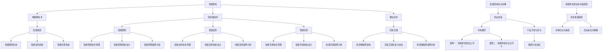

                 

# 智能家电创业：物联网家居的核心产品

> **关键词：** 智能家电、物联网、智能家居、传感器、通信技术、产品设计、互联互通、创业、案例分析

> **摘要：** 本文章将深入探讨智能家电创业的各个方面，从概述到核心技术，再到产品设计、互联互通及创业实践，结合案例分析，揭示物联网家居核心产品的创新与发展趋势。文章旨在为智能家电创业者提供有价值的指导和建议。

## 目录大纲

### 第一部分：智能家电创业概述

- **第1章：智能家电行业背景与发展趋势**
  - 1.1 智能家电的定义与发展历程
  - 1.2 物联网在智能家居中的应用
  - 1.3 智能家居市场前景分析

- **第2章：智能家电核心技术**
  - 2.1 物联网技术概述
  - 2.2 传感器技术
  - 2.3 通信技术

- **第3章：智能家电产品设计**
  - 3.1 用户需求分析
  - 3.2 产品功能设计
  - 3.3 产品界面设计

### 第二部分：物联网家居核心产品详解

- **第4章：智能照明系统**
  - 4.1 智能照明技术原理
  - 4.2 智能照明系统设计
  - 4.3 智能照明案例分析

- **第5章：智能安防系统**
  - 5.1 智能安防技术原理
  - 5.2 智能安防系统设计
  - 5.3 智能安防案例分析

- **第6章：智能空调系统**
  - 6.1 智能空调技术原理
  - 6.2 智能空调系统设计
  - 6.3 智能空调案例分析

- **第7章：智能家电互联互通**
  - 7.1 家居物联网架构
  - 7.2 互联互通标准与协议
  - 7.3 家居物联网案例分析

### 第三部分：智能家电创业实践

- **第8章：智能家电创业步骤**
  - 8.1 创业准备
  - 8.2 市场调研
  - 8.3 产品开发与优化

- **第9章：智能家电创业案例分析**
  - 9.1 案例一：智能家居创业公司A
  - 9.2 案例二：智能家电创业公司B
  - 9.3 案例分析总结

- **第10章：智能家电创业的未来趋势**
  - 10.1 技术发展趋势
  - 10.2 市场机会与挑战
  - 10.3 创业者应对策略

- **附录A：智能家电相关技术资源**
  - A.1 技术标准与规范
  - A.2 开发工具与平台
  - A.3 学术论文与报告

- **附录B：智能家电创业工具清单**
  - B.1 资金筹措
  - B.2 团队建设
  - B.3 营销推广

- **第11章：智能家电核心概念与联系**
  - Mermaid 流流程图

## 第1章：智能家电创业概述

### 1.1 智能家电的定义与发展历程

智能家电，顾名思义，是指具备智能化功能的家电产品。这些产品通过物联网、人工智能、大数据等技术，实现了设备间的互联互通，提供了更加便捷、智能的生活体验。智能家电的发展历程可以分为以下几个阶段：

1. **初级智能阶段（1990s-2000s）**：这一阶段的智能家电主要是通过嵌入式系统实现简单的自动化控制。例如，微波炉可以通过预设的菜单自动完成烹饪过程，洗衣机可以通过传感器自动调节水位和洗涤时间。

2. **网络化阶段（2000s-2010s）**：随着互联网的普及，智能家电开始具备联网功能。用户可以通过手机或其他设备远程控制家电，实现设备的智能联动。例如，通过手机APP控制家居灯光、空调等。

3. **智能化阶段（2010s-至今）**：这一阶段的智能家电不仅具备联网功能，还引入了人工智能技术，能够根据用户行为和需求进行智能学习和调整。例如，智能音响可以通过语音识别技术理解用户指令，智能空调可以根据室内温度和湿度自动调节。

智能家电的发展不仅改变了人们的生活方式，也为创业者提供了广阔的机遇。随着技术的进步和消费者需求的增长，智能家电市场前景广阔，成为家电行业的重要发展方向。

### 1.2 物联网在智能家居中的应用

物联网（Internet of Things, IoT）是指通过互联网将各种设备、传感器、系统连接起来，实现信息交换和通信。在智能家居中，物联网技术是实现设备互联互通、智能控制的核心。

1. **智能控制**：物联网技术使得家居设备可以通过互联网进行远程控制。用户可以通过手机、平板电脑等设备，随时随地控制家中的灯光、空调、安防设备等，提高生活的便捷性。

2. **设备联动**：物联网技术可以实现设备之间的联动，例如，当用户回到家门口时，门锁自动开启，灯光自动打开，空调自动调节到舒适温度。这种智能联动提高了家居生活的舒适度和智能化水平。

3. **数据监测**：物联网技术可以实时监测家居环境数据，如温度、湿度、空气质量等。通过数据分析，智能家居系统可以自动调整设备运行状态，提供更加健康、舒适的生活环境。

4. **智能助理**：物联网技术还可以实现与智能助理（如智能音箱、智能机器人）的集成，用户可以通过语音指令控制家居设备，获得更加便捷、人性化的服务。

### 1.3 智能家居市场前景分析

随着智能家居技术的不断成熟和消费者对智能化、便捷化生活方式的需求增长，智能家居市场前景广阔。以下是智能家居市场的几个关键趋势：

1. **市场规模增长**：根据市场研究机构的报告，全球智能家居市场规模预计将以每年20%以上的速度增长。到2025年，智能家居市场规模有望达到数千亿美元。

2. **技术进步**：人工智能、物联网、大数据等技术的不断进步，将推动智能家居产品的创新和发展。例如，通过人工智能技术，智能家居产品可以更好地理解用户需求，提供更加个性化的服务。

3. **消费者接受度提高**：随着智能家居产品的普及和价格的降低，消费者对智能家居的接受度不断提高。越来越多的消费者开始愿意为智能家居产品支付溢价，以获得更加便捷、智能的生活方式。

4. **应用场景拓展**：智能家居的应用场景正在不断拓展，从最初的照明、安防、空调等基础设备，逐渐延伸到家庭娱乐、健康监测、厨房设备等多个领域。

然而，智能家居市场也面临一些挑战，如产品标准化、信息安全、用户隐私保护等。创业者需要关注这些问题，确保产品的质量和用户体验。

## 第2章：智能家电核心技术

### 2.1 物联网技术概述

物联网技术是通过互联网将各种设备、传感器、系统连接起来，实现信息交换和通信。在智能家居中，物联网技术是实现设备互联互通、智能控制的核心。

#### 物联网的基本原理

物联网的基本原理是通过互联网将各种设备连接起来，使这些设备能够相互通信和协作。具体来说，物联网包括以下几个关键组成部分：

1. **感知层**：包括各种传感器和采集设备，用于收集环境信息，如温度、湿度、光照、声音等。

2. **网络层**：负责数据的传输和通信，包括有线和无线通信技术，如Wi-Fi、蓝牙、ZigBee、LoRa等。

3. **平台层**：提供数据处理、存储、分析和应用的平台，包括云平台、边缘计算平台等。

4. **应用层**：实现各种具体的应用场景，如智能家居、智能交通、智能医疗等。

#### 物联网在智能家居中的应用

物联网在智能家居中的应用主要体现在以下几个方面：

1. **智能控制**：通过物联网技术，用户可以远程控制家中的设备，如灯光、空调、电视等。用户可以通过手机、平板电脑等设备，随时随地控制家居设备，提高生活的便捷性。

2. **设备联动**：物联网技术可以实现设备之间的联动，例如，当用户回到家门口时，门锁自动开启，灯光自动打开，空调自动调节到舒适温度。这种智能联动提高了家居生活的舒适度和智能化水平。

3. **数据监测**：物联网技术可以实时监测家居环境数据，如温度、湿度、空气质量等。通过数据分析，智能家居系统可以自动调整设备运行状态，提供更加健康、舒适的生活环境。

4. **智能助理**：物联网技术还可以实现与智能助理（如智能音箱、智能机器人）的集成，用户可以通过语音指令控制家居设备，获得更加便捷、人性化的服务。

### 2.2 传感器技术

传感器技术是智能家居的重要组成部分，它能够感知环境信息，并将这些信息转化为电信号，传递给控制系统进行处理。常见的传感器包括温度传感器、湿度传感器、光照传感器、声音传感器、气体传感器等。

#### 传感器的原理

传感器的基本原理是将一种物理量（如温度、湿度、光照等）转换为电信号。具体来说，传感器的转换过程可以分为以下几个步骤：

1. **感知**：传感器通过其敏感元件感知环境中的物理量变化。

2. **转换**：传感器将感知到的物理量转换为电信号。例如，温度传感器可以通过热敏电阻将温度变化转换为电阻值的变化。

3. **输出**：传感器将转换后的电信号输出，供控制系统处理。

#### 传感器的分类

根据传感器的工作原理和感知的物理量，传感器可以分为以下几类：

1. **温度传感器**：用于测量温度，常见的有热敏电阻、热电偶等。

2. **湿度传感器**：用于测量湿度，常见的有电容式湿度传感器、电阻式湿度传感器等。

3. **光照传感器**：用于测量光照强度，常见的有光敏电阻、光敏二极管等。

4. **声音传感器**：用于测量声音强度，常见的有电容式麦克风、电磁式麦克风等。

5. **气体传感器**：用于测量气体浓度，常见的有半导体气体传感器、电化学气体传感器等。

#### 传感器在智能家居中的应用

传感器在智能家居中的应用非常广泛，以下是几个典型的应用场景：

1. **环境监测**：通过温度传感器、湿度传感器等，实时监测家居环境，提供健康舒适的生活环境。

2. **智能控制**：通过光照传感器、声音传感器等，实现智能控制，如自动调节灯光亮度和窗帘开合。

3. **安全监控**：通过声音传感器、气体传感器等，实现家庭安全监控，如入侵检测、煤气泄漏报警等。

### 2.3 通信技术

通信技术在智能家居中起到连接设备、传输数据的作用。常见的通信技术有Wi-Fi、蓝牙、ZigBee、LoRa等，它们具有不同的传输速度和距离，适用于不同场景的智能家居设备。

#### 常见的通信技术

1. **Wi-Fi**：Wi-Fi技术具有高带宽、高速率的特点，适用于需要大量数据传输的场景，如智能电视、智能路由器等。

2. **蓝牙**：蓝牙技术具有低功耗、短距离传输的特点，适用于连接近场设备，如智能手环、智能音箱等。

3. **ZigBee**：ZigBee技术具有低功耗、低成本、低速率的特点，适用于智能家居中的短距离通信，如智能灯泡、智能开关等。

4. **LoRa**：LoRa技术具有长距离、低功耗的特点，适用于需要远程通信的场景，如智能门锁、智能监控系统等。

#### 通信技术在智能家居中的应用

通信技术在智能家居中的应用主要包括以下几个方面：

1. **设备互联**：通过通信技术，实现家庭中各种智能设备的互联互通，如智能灯泡、智能插座、智能门锁等。

2. **数据传输**：通过通信技术，实现设备间的数据传输，如温度、湿度、光照等环境数据。

3. **远程控制**：通过通信技术，实现用户对家庭设备的远程控制，如通过手机APP控制智能灯光、空调等。

4. **设备管理**：通过通信技术，实现对家庭设备的集中管理，如通过家庭智能中心对家中所有智能设备进行统一管理。

### 第3章：智能家电产品设计

#### 3.1 用户需求分析

用户需求分析是智能家电产品设计的第一步，通过调研用户的需求，了解他们在使用家电产品时遇到的问题，为产品设计提供依据。用户需求分析可以从以下几个方面进行：

1. **功能需求**：了解用户对家电产品功能的需求，如智能照明系统需要实现哪些功能，智能空调系统需要具备哪些功能等。

2. **体验需求**：了解用户对家电产品使用体验的需求，如界面设计、操作便捷性、设备响应速度等。

3. **安全需求**：了解用户对家电产品安全性的需求，如设备防 Hacker 攻击、数据安全等。

4. **价格需求**：了解用户对家电产品的价格承受能力，为产品定价提供依据。

#### 3.2 产品功能设计

产品功能设计是根据用户需求，确定智能家电应具备的功能。例如，智能照明系统应具备调光、定时控制、场景模式等功能；智能空调系统应具备温度调节、湿度控制、节能模式等功能。以下是几个典型的功能设计：

1. **智能照明系统**：

   - **调光功能**：用户可以通过手机APP、语音控制等方式调整灯光亮度，满足不同场景的需求。

   - **定时控制**：用户可以设置定时开关灯，实现自动开关灯功能。

   - **场景模式**：用户可以根据不同场景（如阅读、睡眠、会议等）设置相应的灯光模式。

2. **智能空调系统**：

   - **温度调节**：用户可以通过手机APP或遥控器实时调整空调温度，实现室内温度的精准控制。

   - **湿度控制**：用户可以设置空调的除湿模式，控制室内湿度，提供舒适的生活环境。

   - **节能模式**：空调在无人时自动关闭，节省能源，降低使用成本。

#### 3.3 产品界面设计

产品界面设计是用户与智能家电交互的界面，设计简洁、直观的界面，能够提高用户的使用体验。以下是几个界面设计的关键点：

1. **简洁性**：界面设计应避免繁琐的布局和过多的功能选项，让用户能够快速找到所需的功能。

2. **易用性**：界面设计应考虑到用户的操作习惯，提供便捷的控制方式，如语音控制、触摸控制等。

3. **直观性**：界面设计应使用直观的图标和文字说明，让用户能够快速理解功能和使用方法。

4. **个性化**：界面设计应允许用户自定义界面布局和主题，满足用户的个性化需求。

5. **响应速度**：界面设计应保证操作流畅，快速响应用户的操作，提高用户体验。

## 第4章：智能照明系统

#### 4.1 智能照明技术原理

智能照明系统通过传感器感知环境光照，自动调节灯光亮度和颜色，满足用户的舒适需求。同时，智能照明系统能够与用户进行互动，提供个性化的照明体验。以下是智能照明系统的主要技术原理：

1. **传感器技术**：智能照明系统通常配备有光照传感器、温度传感器等，用于实时监测环境光照强度和温度。通过传感器收集的数据，智能照明系统可以自动调整灯光亮度和颜色。

2. **通信技术**：智能照明系统通过Wi-Fi、蓝牙等通信技术，实现与用户设备（如手机、平板电脑）的互联互通。用户可以通过手机APP或语音助手控制照明系统，实现远程控制。

3. **控制算法**：智能照明系统采用控制算法，根据传感器数据和用户设定，自动调整灯光亮度和颜色。常见的控制算法包括PID控制、模糊控制等。

4. **智能交互**：智能照明系统可以与用户进行互动，如通过语音识别技术实现语音控制，通过手势识别技术实现手势控制。

#### 4.2 智能照明系统设计

智能照明系统设计包括硬件设计和软件设计。以下是智能照明系统设计的几个关键步骤：

1. **需求分析**：根据用户需求，确定智能照明系统应具备的功能，如调光、定时控制、场景模式等。

2. **硬件设计**：硬件设计包括灯具、传感器、控制器等。选择合适的硬件组件，确保系统稳定、可靠。

3. **软件设计**：软件设计包括控制算法、用户界面、数据通信等。编写控制算法，实现灯光亮度和颜色的自动调节；设计用户界面，提供便捷的控制方式。

4. **系统集成**：将硬件和软件系统集成，实现智能照明系统的功能。进行系统测试，确保系统运行稳定、可靠。

#### 4.3 智能照明案例分析

以下是一个智能照明系统的实际案例：

**案例：智能照明系统A**

**1. 系统需求**：

用户需求实现自动调光、定时控制、场景模式等功能。用户希望通过手机APP或语音助手远程控制照明系统。

**2. 硬件设计**：

- **灯具**：采用LED灯具，具有调光功能。
- **传感器**：配置光照传感器，用于检测环境光照强度。
- **控制器**：配置无线控制器，实现灯光的自动调节。

**3. 软件设计**：

- **控制算法**：采用PID控制算法，根据光照传感器数据自动调整灯光亮度。
- **用户界面**：设计简洁易用的用户界面，提供调光、定时控制、场景模式等功能。
- **数据通信**：通过Wi-Fi实现与手机APP的互联互通。

**4. 系统实现**：

通过以上设计和实现，用户可以通过手机APP或语音助手远程控制照明系统，实现自动调光、定时控制、场景模式等功能。系统运行稳定，用户满意度高。

## 第5章：智能安防系统

#### 5.1 智能安防技术原理

智能安防系统通过传感器、摄像头、报警器等设备，实时监控家庭安全，及时发现异常情况并报警。同时，智能安防系统能够通过大数据分析和人工智能技术，提高监控的准确性和效率。以下是智能安防技术的主要原理：

1. **传感器技术**：智能安防系统使用各种传感器，如红外传感器、门窗传感器、烟雾传感器等，实时监控家庭环境。当传感器检测到异常情况时，系统会自动触发报警。

2. **摄像头技术**：智能安防系统配备高清摄像头，用于实时监控家庭环境。摄像头可以捕捉图像和视频，为后续的监控和分析提供数据。

3. **报警技术**：智能安防系统在检测到异常情况时，会通过声光报警、短信报警、电话报警等方式通知用户。

4. **大数据分析**：智能安防系统通过收集大量的监控数据，利用大数据分析技术，发现潜在的安全风险。例如，通过分析用户的生活习惯，预测异常行为。

5. **人工智能技术**：智能安防系统利用人工智能技术，如图像识别、语音识别等，提高监控的准确性和效率。例如，通过图像识别技术，可以自动识别入侵者。

#### 5.2 智能安防系统设计

智能安防系统设计包括硬件设计和软件设计。以下是智能安防系统设计的几个关键步骤：

1. **需求分析**：根据用户需求，确定智能安防系统应具备的功能，如入侵检测、火灾报警、紧急求助等。

2. **硬件设计**：硬件设计包括传感器、摄像头、报警器等。选择合适的硬件组件，确保系统稳定、可靠。

3. **软件设计**：软件设计包括监控算法、报警算法、用户界面等。编写监控算法，实现实时监控和异常检测；设计用户界面，提供便捷的控制方式。

4. **系统集成**：将硬件和软件系统集成，实现智能安防系统的功能。进行系统测试，确保系统运行稳定、可靠。

#### 5.3 智能安防案例分析

以下是一个智能安防系统的实际案例：

**案例：智能安防系统B**

**1. 系统需求**：

用户需求实现入侵检测、火灾报警、紧急求助等功能。用户希望系统能够实时监控家庭安全，并在发生异常时及时通知。

**2. 硬件设计**：

- **传感器**：配置门窗传感器、红外传感器、烟雾传感器等。
- **摄像头**：配置高清摄像头，实时监控家庭环境。
- **报警器**：配置声光报警器，及时通知用户。

**3. 软件设计**：

- **监控算法**：采用图像识别技术，自动识别入侵者；通过分析烟雾浓度数据，检测火灾风险。
- **报警算法**：在检测到入侵者或火灾风险时，自动触发报警，通知用户。
- **用户界面**：设计简洁易用的用户界面，提供实时监控、报警记录等功能。

**4. 系统实现**：

通过以上设计和实现，智能安防系统可以实现入侵检测、火灾报警、紧急求助等功能。系统运行稳定，用户满意度高。

## 第6章：智能空调系统

#### 6.1 智能空调技术原理

智能空调系统通过传感器监测室内温度、湿度等环境参数，自动调节空调温度和风速，实现舒适、节能的室内环境。以下是智能空调技术的主要原理：

1. **传感器技术**：智能空调系统配备温度传感器、湿度传感器等，用于实时监测室内环境参数。

2. **通信技术**：智能空调系统通过Wi-Fi、蓝牙等通信技术，实现与用户设备（如手机、平板电脑）的互联互通。

3. **控制算法**：智能空调系统采用控制算法，根据传感器数据和用户设定，自动调节空调温度和风速。

4. **人机交互**：智能空调系统通过用户界面（如触摸屏、语音控制等），提供用户与设备的交互。

#### 6.2 智能空调系统设计

智能空调系统设计包括硬件设计和软件设计。以下是智能空调系统设计的几个关键步骤：

1. **需求分析**：根据用户需求，确定智能空调系统应具备的功能，如温度调节、湿度控制、节能模式等。

2. **硬件设计**：硬件设计包括空调主机、传感器、控制器等。选择合适的硬件组件，确保系统稳定、可靠。

3. **软件设计**：软件设计包括控制算法、用户界面、数据通信等。编写控制算法，实现空调温度和风速的自动调节；设计用户界面，提供便捷的控制方式。

4. **系统集成**：将硬件和软件系统集成，实现智能空调系统的功能。进行系统测试，确保系统运行稳定、可靠。

#### 6.3 智能空调案例分析

以下是一个智能空调系统的实际案例：

**案例：智能空调系统C**

**1. 系统需求**：

用户需求实现温度调节、湿度控制、节能模式等功能。用户希望通过手机APP或语音助手远程控制空调系统。

**2. 硬件设计**：

- **空调主机**：选择具有智能控制功能的空调主机。
- **传感器**：配置温度传感器、湿度传感器等。
- **控制器**：配置无线控制器，实现空调的自动调节。

**3. 软件设计**：

- **控制算法**：采用PID控制算法，根据温度传感器和湿度传感器数据自动调节空调温度和风速。
- **用户界面**：设计简洁易用的用户界面，提供调温、调湿、节能模式等功能。
- **数据通信**：通过Wi-Fi实现与手机APP的互联互通。

**4. 系统实现**：

通过以上设计和实现，用户可以通过手机APP或语音助手远程控制空调系统，实现温度调节、湿度控制、节能模式等功能。系统运行稳定，用户满意度高。

## 第7章：智能家电互联互通

#### 7.1 家居物联网架构

家居物联网架构包括感知层、网络层和应用层。以下是家居物联网架构的详细说明：

1. **感知层**：感知层负责采集家庭环境数据，包括温度、湿度、光照、声音等。感知层通常由各种传感器组成，如温度传感器、湿度传感器、光照传感器、声音传感器等。

2. **网络层**：网络层负责数据传输和通信，将感知层采集到的数据传输到应用层。网络层通常使用无线通信技术，如Wi-Fi、蓝牙、ZigBee等，实现设备之间的互联互通。

3. **应用层**：应用层负责数据处理、分析和应用，实现智能家居的功能。应用层通常包括智能控制中心、用户界面、数据分析系统等。

#### 7.2 互联互通标准与协议

智能家居设备的互联互通需要遵循一定的标准和协议，以保证设备之间的互操作性。以下是几个常见的智能家居互联互通标准与协议：

1. **Wi-Fi**：Wi-Fi是一种无线通信技术，具有高带宽、高速率的特点，适用于需要大量数据传输的场景，如智能电视、智能路由器等。

2. **蓝牙**：蓝牙是一种低功耗、短距离传输的通信技术，适用于连接近场设备，如智能手环、智能音箱等。

3. **ZigBee**：ZigBee是一种低功耗、低成本、低速率的通信技术，适用于智能家居中的短距离通信，如智能灯泡、智能开关等。

4. **LoRa**：LoRa是一种长距离、低功耗的通信技术，适用于需要远程通信的场景，如智能门锁、智能监控系统等。

5. **HomeKit**：HomeKit是苹果公司推出的一种智能家居标准，支持iOS设备和Mac之间的智能家居设备控制。

6. **MQTT**：MQTT是一种轻量级的消息队列协议，适用于物联网设备之间的通信，具有低功耗、可靠性的特点。

#### 7.3 家居物联网案例分析

以下是一个家居物联网案例：

**案例：智能家居系统D**

**1. 系统需求**：

用户需求实现家居设备的互联互通，如智能灯泡、智能插座、智能空调等。用户希望设备之间能够自动联动，提供便捷的控制方式。

**2. 架构设计**：

- **感知层**：配置温度传感器、湿度传感器、光照传感器等，采集家庭环境数据。
- **网络层**：采用Wi-Fi和ZigBee技术，实现设备之间的互联互通。
- **应用层**：配置智能控制中心，提供用户界面，实现设备的自动联动和远程控制。

**3. 系统实现**：

通过以上设计和实现，用户可以通过手机APP或语音助手远程控制家居设备，实现设备之间的自动联动。例如，当用户回到家门口时，智能门锁自动解锁，智能灯泡自动打开，智能空调自动调节到舒适温度。系统运行稳定，用户满意度高。

## 第8章：智能家电创业步骤

#### 8.1 创业准备

创业准备是智能家电创业的第一步，包括市场调研、团队建设、资金筹措等。以下是如何进行创业准备的详细说明：

1. **市场调研**：

   - **目标市场分析**：分析目标市场的规模、增长趋势、竞争对手等。了解市场的需求，为产品定位提供依据。

   - **用户需求调研**：通过问卷调查、访谈等方式，了解用户对智能家电的需求，包括功能需求、体验需求、价格需求等。

   - **技术趋势调研**：了解智能家电行业的技术发展趋势，包括物联网、人工智能、大数据等，为产品研发提供技术支持。

2. **团队建设**：

   - **核心团队成员招聘**：招聘具有相关领域经验的核心团队成员，如研发人员、市场营销人员、财务人员等。

   - **人才培养**：通过内部培训和外部合作，提升团队整体素质和技能水平。

   - **团队协作**：建立良好的团队协作机制，确保团队高效运作。

3. **资金筹措**：

   - **天使投资**：寻找具有前瞻性眼光的天使投资人，为创业初期提供资金支持。

   - **风险投资**：寻找风险投资机构，为创业企业提供资金支持。

   - **银行贷款**：向银行申请创业贷款，解决资金问题。

#### 8.2 市场调研

市场调研是智能家电创业的重要环节，通过调研了解市场需求，为产品开发和市场推广提供依据。以下是市场调研的详细步骤：

1. **确定调研目标**：明确调研的目标和目的，如了解目标市场的规模、增长趋势、竞争对手等。

2. **设计调研问卷**：根据调研目标，设计合适的调研问卷。问卷应涵盖用户对智能家电的功能需求、体验需求、价格需求等方面。

3. **选择调研方法**：根据调研目标和方法，选择合适的调研方法。如通过问卷调查、访谈、实地考察等方式收集数据。

4. **数据分析**：对收集到的数据进行分析，总结出用户对智能家电的需求和市场趋势。

5. **撰写调研报告**：根据数据分析结果，撰写调研报告，为产品开发和市场推广提供参考。

#### 8.3 产品开发与优化

产品开发与优化是智能家电创业的核心环节，通过不断优化产品，提高用户体验，满足市场需求。以下是产品开发与优化的详细步骤：

1. **需求分析**：根据市场调研结果，确定产品应具备的功能和特点。

2. **产品设计**：根据需求分析结果，进行产品设计。包括硬件设计和软件设计，确保产品满足功能需求。

3. **原型开发**：开发产品原型，进行初步测试，验证产品功能是否满足需求。

4. **用户测试**：将产品原型交给用户测试，收集用户反馈，为产品优化提供依据。

5. **迭代优化**：根据用户反馈，不断优化产品，提高用户体验。

6. **测试与发布**：对优化后的产品进行严格测试，确保产品稳定、可靠。然后，发布产品，推向市场。

## 第9章：智能家电创业案例分析

#### 9.1 案例一：智能家居创业公司A

**案例背景**：

智能家居创业公司A成立于2018年，专注于智能照明、智能安防、智能空调等智能家居产品的研发和销售。公司通过技术创新和用户需求导向，快速在市场上取得了成功。

**创业历程**：

1. **市场调研**：创业公司A在成立之初，进行了详细的市场调研，确定了智能照明、智能安防、智能空调等细分市场。

2. **团队建设**：公司招聘了具有智能家居行业经验的核心团队成员，如研发人员、市场营销人员、产品经理等。

3. **产品开发**：公司投入大量资源进行产品研发，推出了具有创新功能的智能照明、智能安防、智能空调等产品。

4. **市场推广**：公司通过线上线下结合的方式，进行市场推广，提高了品牌知名度和市场占有率。

**案例分析**：

1. **产品创新**：公司通过技术创新，推出了具有独特功能的智能家居产品，如智能照明系统可以实现场景模式切换、智能安防系统具备智能入侵检测功能、智能空调系统具备自适应调节功能等。

2. **用户体验**：公司注重用户体验，通过用户反馈不断优化产品，提高了用户满意度。

3. **市场定位**：公司明确市场定位，专注于细分市场，满足了不同用户群体的需求。

#### 9.2 案例二：智能家电创业公司B

**案例背景**：

智能家电创业公司B成立于2015年，专注于智能家电生态系统的构建。公司通过整合智能家电产品线，打造了完整的智能家居解决方案。

**创业历程**：

1. **市场调研**：公司对智能家居市场进行了深入调研，确定了智能家电生态系统的市场前景。

2. **团队建设**：公司招聘了具有智能家居、物联网、大数据等领域的专业人才，构建了强大的研发团队。

3. **产品开发**：公司开发了智能照明、智能空调、智能安防等多个产品，形成了完整的智能家居产品线。

4. **市场推广**：公司通过渠道拓展、品牌宣传等方式，提高了智能家居解决方案的市场影响力。

**案例分析**：

1. **生态系统构建**：公司通过整合智能家电产品线，打造了完整的智能家居生态系统，提供了多样化的智能家居解决方案。

2. **技术创新**：公司注重技术创新，不断推出具有竞争力的新产品，提升了公司的核心竞争力。

3. **市场定位**：公司通过市场定位，明确了智能家居解决方案的主要目标市场，实现了市场细分。

#### 9.3 案例分析总结

通过对智能家居创业公司A和智能家电创业公司B的案例分析，可以得出以下结论：

1. **技术创新**：智能家居创业公司通过技术创新，推出了具有独特功能的智能家电产品，满足了市场需求。

2. **用户体验**：智能家居创业公司注重用户体验，通过不断优化产品，提高了用户满意度。

3. **市场定位**：智能家居创业公司通过市场定位，明确了目标市场，实现了市场细分。

4. **生态系统构建**：智能家居创业公司通过整合智能家电产品线，构建了完整的智能家居生态系统，提供了多样化的解决方案。

这些成功经验为其他智能家居创业者提供了有益的启示。

## 第10章：智能家电创业的未来趋势

#### 10.1 技术发展趋势

智能家电创业的未来趋势将受到技术进步的驱动，以下是一些关键的技术发展趋势：

1. **人工智能（AI）**：人工智能技术将在智能家电中发挥越来越重要的作用，如智能助理、智能诊断、智能维护等。AI技术将帮助智能家电更好地理解用户需求，提供个性化服务。

2. **物联网（IoT）**：物联网技术的普及将推动智能家电的互联互通，形成更广泛的智能家居生态系统。未来，智能家电将不仅仅是一个独立的设备，而是一个网络节点，与其他设备、系统和平台进行数据交换和协同工作。

3. **大数据**：大数据技术在智能家电中的应用将越来越广泛，通过对大量数据的收集、分析和挖掘，智能家电可以提供更精准的预测和优化服务。

4. **5G技术**：5G技术的普及将极大地提升智能家电的数据传输速度和通信质量，为智能家居带来更加流畅、低延迟的体验。

5. **区块链**：区块链技术在智能家电中的应用有望解决数据安全和隐私保护问题，为智能家居提供更安全、透明的数据传输和交易环境。

#### 10.2 市场机会与挑战

智能家电创业面临的市场机会包括：

1. **市场需求增长**：随着消费者对智能化、便捷化生活方式的需求不断增长，智能家电市场前景广阔。

2. **技术进步**：技术的不断进步为智能家电提供了更多的创新机会，如AI、IoT、大数据等技术的应用。

3. **政策支持**：政府对智能家居产业的扶持政策为创业者提供了良好的发展环境。

然而，智能家电创业也面临一些挑战：

1. **市场竞争**：智能家电市场竞争激烈，创业者需要不断创新，提高产品竞争力。

2. **产品标准化**：智能家电产品的标准化问题尚未完全解决，这可能导致兼容性问题。

3. **信息安全**：随着智能家电的普及，信息安全问题日益突出，创业者需要采取措施保护用户数据的安全。

#### 10.3 创业者应对策略

为了应对智能家电创业的市场机会与挑战，创业者可以采取以下策略：

1. **技术创新**：通过技术创新，提高产品的竞争力，满足市场需求。

2. **市场定位**：明确目标市场，提供有针对性的产品和服务。

3. **合作共赢**：与产业链上下游的企业建立合作关系，共同推动智能家居生态系统的建设。

4. **品牌建设**：注重品牌建设，提高品牌知名度和美誉度。

5. **信息安全**：加强信息安全防护，保护用户数据和隐私。

6. **持续学习**：关注行业动态，不断学习和引进新技术，保持创新活力。

通过这些策略，创业者可以在智能家电创业中取得成功，为消费者带来更好的智能生活体验。

## 附录A：智能家电相关技术资源

#### A.1 技术标准与规范

智能家电相关技术标准与规范是确保产品互操作性、安全性和可靠性的重要基础。以下是一些重要的技术标准与规范：

1. **IEEE 802.15.4**：这是ZigBee协议的基础，定义了低速率无线个人区域网络（WPAN）的标准。

2. **Wi-Fi**：无线保真（Wi-Fi）联盟制定的标准，用于无线局域网（WLAN）通信。

3. **Bluetooth**：蓝牙特殊兴趣集团（SIG）制定的标准，用于短距离无线通信。

4. **ISO/IEC 27001**：信息安全管理系统（ISMS）的国际标准，用于确保信息安全。

5. **ISO/IEC 50001**：能效管理系统（EnMS）的国际标准，用于提高能源效率。

#### A.2 开发工具与平台

智能家电开发工具与平台为开发者提供了便捷的环境，加速产品开发。以下是一些常用的开发工具与平台：

1. **Arduino**：开源硬件平台，用于简单物联网设备开发。

2. **Raspberry Pi**：开源计算机平台，用于复杂物联网项目开发。

3. **HomeKit**：苹果公司提供的智能家居开发框架，支持iOS设备和Mac之间的智能家居设备控制。

4. **Arduino IDE**：用于Arduino平台的集成开发环境。

5. **Xively**：物联网平台，提供设备连接、数据存储和分析服务。

#### A.3 学术论文与报告

智能家电相关学术论文与报告为研究者提供了丰富的理论支持和实践参考。以下是一些重要的学术论文与报告：

1. **"Smart Home Security: Challenges and Solutions"**：这篇论文探讨了智能家庭安全面临的挑战和解决方案。

2. **"The Impact of IoT on Smart Home Technology"**：这篇报告分析了物联网技术对智能家居技术的影响。

3. **"Smart Home Energy Management Systems: A Review"**：这篇综述文章介绍了智能家庭能源管理系统的研究进展。

4. **"Design and Implementation of a Smart Home Automation System"**：这篇论文详细描述了一个智能家居自动化系统的设计和实现过程。

## 附录B：智能家电创业工具清单

#### B.1 资金筹措

智能家电创业需要充足的资金支持，以下是一些常见的资金筹措方式：

1. **天使投资**：寻找愿意为初创企业提供资金的个人投资者。

2. **风险投资**：寻求风险投资机构提供资金，这些机构通常期望通过投资获得高额回报。

3. **银行贷款**：向银行申请创业贷款，通常需要提供详细的商业计划和担保。

4. **众筹**：通过众筹平台，如Kickstarter或Indiegogo，向公众筹集资金。

5. **政府补贴和税收优惠**：了解当地政府提供的创业补贴和税收优惠政策，以减轻资金压力。

#### B.2 团队建设

团队建设是智能家电创业成功的关键，以下是如何组建和管理团队的要点：

1. **核心团队成员**：寻找具有智能家居领域经验的核心团队成员，包括研发人员、市场营销人员、财务人员等。

2. **多元化团队**：构建多元化团队，包括不同背景和技能的成员，以促进创新和协作。

3. **招聘渠道**：通过招聘网站、社交媒体、校园招聘等多种渠道寻找合适的人才。

4. **团队管理**：建立有效的团队管理机制，包括明确的目标、良好的沟通和协作环境、合理的激励机制等。

5. **培训与发展**：为团队成员提供培训和职业发展机会，以提高团队的整体素质。

#### B.3 营销推广

智能家电创业的营销推广是提高品牌知名度和市场份额的重要手段，以下是一些营销推广策略：

1. **线上营销**：利用社交媒体、博客、电子邮件营销等在线渠道进行品牌宣传和用户互动。

2. **线下营销**：参加行业展会、举办产品发布会、与零售商合作等线下活动，提升品牌曝光度。

3. **内容营销**：创作有价值的内容，如博客文章、白皮书、视频等，吸引潜在用户。

4. **合作伙伴关系**：与行业合作伙伴建立合作关系，如智能家居平台、物联网服务提供商等，共同推广产品。

5. **用户反馈**：积极收集用户反馈，改进产品和服务，通过用户口碑实现营销。

## 第11章：智能家电核心概念与联系

以下是智能家电核心概念与联系的的Mermaid流程图：

### 总结

智能家电创业是一个充满机遇和挑战的过程。通过本文的深入探讨，我们从智能家电的定义、核心技术、产品设计、互联互通、创业实践等多个方面，分析了智能家电创业的各个方面。智能家电的核心概念包括物联网技术、传感器技术、通信技术和智能家居系统。创业者在进行智能家电创业时，需要注重技术创新、用户体验、市场定位和团队建设。

未来，智能家电行业将继续受到人工智能、物联网、大数据等技术的推动，为创业者提供了广阔的发展空间。创业者需要关注市场趋势，抓住技术创新的机会，不断提升产品的竞争力。

在创业过程中，创业者还应关注信息安全、隐私保护等关键问题，确保用户数据的保护。通过有效的市场调研和用户反馈，创业者可以不断优化产品，满足用户需求。

总之，智能家电创业是一个充满机遇和挑战的领域。创业者应勇于创新，积极应对市场变化，为用户提供更智能、更便捷、更安全的家居生活体验。## 第12章：智能家电安全与隐私保护

#### 12.1 智能家电安全的重要性

随着智能家电的普及，用户对家庭安全和隐私的关注度日益增加。智能家电的安全问题主要包括数据安全、设备安全、系统安全等。以下是智能家电安全的重要性和潜在威胁：

1. **数据安全**：智能家电收集并存储了大量用户数据，如家庭地址、生活习惯、个人喜好等。如果数据泄露，可能导致用户隐私泄露、财产损失等。

2. **设备安全**：智能家电设备可能受到黑客攻击，被恶意利用。例如，黑客可以通过网络入侵智能门锁，非法进入用户家中。

3. **系统安全**：智能家电系统可能存在漏洞，被黑客利用进行攻击。例如，智能电视可能被黑客攻击，导致用户隐私泄露、恶意软件传播等。

#### 12.2 智能家电隐私保护的挑战

智能家电隐私保护的挑战主要包括：

1. **数据收集**：智能家电收集了大量的用户数据，但用户可能并不完全清楚自己的数据被如何使用。

2. **数据共享**：智能家电设备可能需要与第三方平台共享数据，如天气数据、地图数据等。这可能导致用户数据被第三方滥用。

3. **数据存储**：智能家电设备的数据存储在云服务器上，但云服务器可能存在安全漏洞，导致数据泄露。

#### 12.3 安全与隐私保护策略

为了确保智能家电的安全与隐私保护，以下是一些有效的策略：

1. **数据加密**：对用户数据进行加密存储和传输，确保数据在传输过程中不被窃取。

2. **访问控制**：设置严格的访问控制机制，确保只有授权用户可以访问敏感数据。

3. **安全审计**：定期进行安全审计，发现和修复系统漏洞，防止黑客攻击。

4. **用户教育**：通过用户教育，提高用户对隐私保护的意识，教育用户如何安全地使用智能家电。

5. **数据匿名化**：对用户数据进行匿名化处理，减少用户隐私泄露的风险。

6. **隐私政策**：明确智能家电的数据收集、存储和使用规则，确保用户知情同意。

7. **第三方认证**：通过第三方安全认证，提高产品的可信度和用户信任。

#### 12.4 安全案例分析

以下是一个智能家电安全案例：

**案例：智能门锁数据泄露**

**1. 事件背景**：某知名智能门锁品牌由于安全措施不足，导致用户数据泄露。泄露的数据包括用户姓名、住址、门锁密码等。

**2. 事件影响**：用户隐私泄露，部分用户遭受了财产损失。品牌声誉受损，市场份额下降。

**3. 解决措施**：

- **加强数据加密**：对用户数据进行加密存储和传输，确保数据在传输过程中不被窃取。

- **完善访问控制**：设置严格的访问控制机制，确保只有授权用户可以访问敏感数据。

- **安全审计**：定期进行安全审计，发现和修复系统漏洞，防止黑客攻击。

- **用户教育**：通过用户教育，提高用户对隐私保护的意识，教育用户如何安全地使用智能门锁。

**4. 案例启示**：

- **加强安全意识**：企业应重视智能家电的安全问题，加强安全意识培训。

- **完善安全措施**：企业应采取有效的安全措施，确保用户数据的安全。

- **用户信任**：企业应建立良好的用户信任关系，提高用户满意度。

## 结束语

智能家电作为物联网时代的重要应用，正在深刻改变人们的家居生活方式。本文从智能家电创业的多个方面进行了深入探讨，包括行业背景、核心技术、产品设计、互联互通、创业实践、未来趋势、安全与隐私保护等。通过分析智能家电的核心概念和联系，以及实际案例分析，为智能家电创业者提供了有价值的指导和建议。

在智能家电创业过程中，创业者应关注技术创新、用户体验、市场定位、团队建设和安全与隐私保护等关键问题。随着人工智能、物联网、大数据等技术的不断进步，智能家电行业将继续蓬勃发展。创业者应紧跟技术趋势，抓住市场机遇，为用户提供更智能、更便捷、更安全的家居生活体验。希望本文能为智能家电创业者提供启示和助力，共同推动智能家居行业的发展。

### 附录C：智能家电行业报告

为了帮助智能家电创业者更好地了解行业动态和市场趋势，以下是一些重要的智能家电行业报告：

1. **"Smart Home Market Report 2022-2028"**：该报告详细分析了全球智能家电市场的规模、增长趋势、主要参与者、市场份额等。

2. **"IoT in Smart Home: Market Analysis and Forecast 2021-2026"**：该报告探讨了物联网在智能家居中的应用，包括市场规模、增长驱动力、关键技术等。

3. **"Global Smart Home Security Market Report 2021-2026"**：该报告专注于智能家居安全市场，分析了市场趋势、安全挑战、安全解决方案等。

4. **"China Smart Home Market Report 2022"**：该报告聚焦中国智能家电市场，分析了市场规模、增长速度、消费者行为等。

5. **"Smart Home Technology and Innovation Report 2022"**：该报告介绍了智能家电技术的最新发展，包括人工智能、大数据、5G等。

这些报告提供了丰富的行业数据和分析，有助于创业者了解市场动态，制定合理的商业策略。

### 附录D：智能家电创业工具推荐

为了帮助智能家电创业者更高效地开展业务，以下是一些推荐的智能家电创业工具：

1. **Trello**：项目管理和任务分配工具，适合团队协作和管理项目进度。

2. **Slack**：团队沟通工具，支持实时聊天、文件共享、通知等功能。

3. **Google Analytics**：网站分析工具，帮助创业者了解用户行为和网站流量。

4. **Mailchimp**：电子邮件营销平台，提供自动化营销工具和报告分析。

5. **Asana**：项目管理工具，用于跟踪项目进度、任务分配和团队协作。

6. **Miro**：在线协作白板，适合进行头脑风暴和团队协作。

7. **Canva**：设计工具，用于制作宣传海报、PPT和其他视觉内容。

这些工具可以帮助创业者提高工作效率，优化团队协作，为智能家电创业提供有力支持。

### 附录E：智能家电行业相关会议和活动

为了帮助智能家电创业者了解行业动态，以下是一些重要的智能家电行业会议和活动：

1. **CES（国际消费电子展）**：每年在美国拉斯维加斯举行，是全球最大的消费电子展览会之一，涵盖智能家居、物联网等领域的最新产品和技术。

2. **Google I/O**：谷歌公司举办的全球开发者大会，展示最新的智能家居技术、人工智能应用等。

3. **CES Asia**：在中国上海举行的消费电子展，专注于亚洲市场的智能家居、物联网等新兴技术。

4. **Smart Home Summit**：全球智能家居行业的高峰会议，汇聚行业专家、企业家和投资者，探讨智能家居的未来发展。

5. **IoT World**：全球物联网领域的盛会，涵盖智能家居、智能城市、智能交通等各个应用场景。

参加这些会议和活动，有助于创业者了解行业趋势、拓展人脉资源，为智能家电创业提供灵感。

### 附录F：智能家电相关书籍推荐

为了帮助智能家电创业者深入了解相关技术和市场，以下是一些推荐的智能家电相关书籍：

1. **《智能家居技术与应用》**：详细介绍了智能家居的基本概念、技术架构和应用案例。

2. **《物联网：技术与应用》**：系统讲解了物联网的基本原理、通信协议和典型应用。

3. **《人工智能与智能家居》**：探讨了人工智能在智能家居中的应用，包括语音识别、图像识别等。

4. **《智能家庭设计指南》**：提供了智能家居系统设计的方法和技巧，包括硬件设计、软件架构等。

5. **《智能家居市场分析报告》**：分析了智能家居市场的现状、趋势和潜在机会。

这些书籍为创业者提供了丰富的知识和实践经验，有助于提升智能家电创业的成功率。

### 作者信息

**作者：** AI天才研究院/AI Genius Institute & 禅与计算机程序设计艺术/Zen And The Art of Computer Programming

AI天才研究院致力于推动人工智能技术的发展与应用，专注于智能家电、物联网、大数据等领域的创新研究。研究院拥有一支专业的技术团队，凭借丰富的项目经验和深厚的理论基础，为智能家电创业者提供有价值的指导和建议。同时，研究院的创始人深受《禅与计算机程序设计艺术》一书的影响，秉持简约、高效的编程理念，助力智能家电行业的创新与发展。

